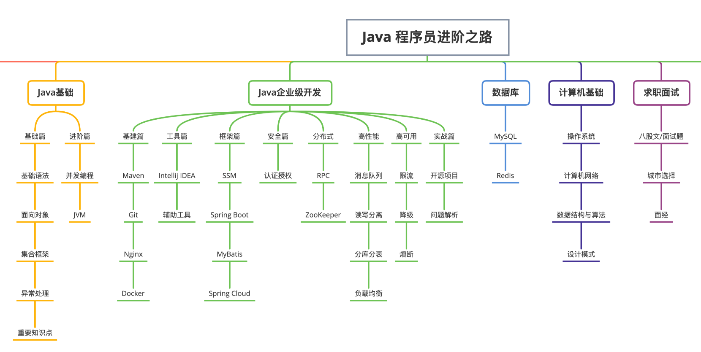

# Java语法基础

## 控制语句
**循环标签**：只能用于标识循环代码块，只能在循环（`for`、`while`、`do-while`）的上一行定义，格式为`标签名:`
- break和 continue只中断当前循环
- `break 标签名`：退出该标签所标识的循环，无论有多少个嵌套循环
- `continue 标签名`：中断标签所标识循环的本次循环，继续下次循环
```JAVA
outerLoop:
for (int i = 0; i < 3; i++) {
    innerLoop:
    for (int j = 0; j < 3; j++) {
        if (i == 1 && j == 1) {
            continue outerLoop; D
        }
        System.out.println("i: " + i + ", j: " + j);
    }
}
```


```java
outerLoop:
for (int i = 0; i < 3; i++) {
    innerLoop:
    for (int j = 0; j < 3; j++) {
        if (i == 1 && j == 1) {
            break outerLoop; 
        }
        System.out.println("i: " + i + ", j: " + j);
    }
}
```

**switch**：用来判断变量与多个值之间的相等性
- 变量的类型可以是：
  - 部分基本数据类型：byte、short、char、int。
  - String：字符串类型。
  - 枚举类型：自定义的枚举类型。
  - 包装类：如 Byte、Short、Character、Integer。
- 不支持浮点float、double，整形long

```JAVA
switch(变量) {    
    case 可选值1:    
    // 可选值1匹配后执行的代码;    
    break;  // 该关键字是可选项，匹配可选值1后退出，否则继续匹配
    case 可选值2:    
    // 可选值2匹配后执行的代码;    
    break; // 该关键字是可选项
    ......
    default: // 该关键字是可选项
    // 所有可选值都不匹配后执行的代码
}
```
## 变量

**变量的类型** = 基本数据类型 + 引用
- 引用类型可以是数组、类、接口，指向对象、数组、`null`；引用只能进行赋值操作，不能用于计算
- 变量声明：类型+变量名，将指定数量的内存单元标识为变量名
- 初始化：在变量名标识的内存单元中存储二进制数
- 存储位置：
  - 成员变量：引用指向的对象或数组存储在堆中，其实例域未显式初始化时赋予默认值（引用类型默认`null`）
  - 局部变量：存储在栈中，不是对象或数组的实例域，在使用前必须显式初始化
  - 静态变量：未显式初始化时赋予默认值

```java
class Solution{
    int i;//默认0
    int f(){
        int[] nums = new int[3];//默认{0,0,0} 
    }
}
```

---

**boolean**
- 不能与其它类型发生类型转换
- 值域为true、false，不能写入其它类型的值

---
**数字类基本数据类型**
- 存储使用二进制数，存储与显示分离，数字变量的值可翻译为二进制0b、八进制0、十六进制0x、十进制
  - 十六进制下一个字符代表4bit，一个byte使用两个十六进制字符表示
- 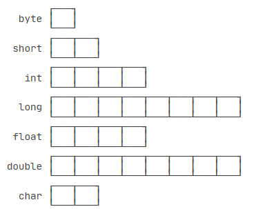
- 字面量
  - 200：int
  - 200L/l：long 
  - 1.1F/f：单精度浮点数
  - 1.1、1.1D/d：双精度浮点数

---

**类型转换**
- 类型转换时需判断是否发生数据丢失或者精度损失；不会发生数据丢失或精度损失时，编译器完成自动类型转换，发生数据丢失和精度损失时，必须显式类型转换
  - 浮点数转整型一定发生精度损失
  - double转float一定发生精度损失
  - 大数类型转小数类型时可能发生数据丢失
- 浮点数转整型时，向下取整，直接丢弃小数部分；`Math.round()`工具类提供四舍五入
- 不会发生数据丢失时，即使是大数转小数，也可以自动类型转换
  - `byte b=50`，50在byte的取值范围内，允许自动类型转换
  - `short n = 0xFFFF_FFFF`，整型使用二进制补码，该值为-1；
  - `short n = (int)0xFFF_FFFF`必须显式类型转换，截断高位，保留低位，结果仍为-1；
- `float f=3.14`不能自动类型转换，不同于整型的规则，double类型，不能自动转换为float类型，无论值的大小，必须显式类型转换

---

**char**
- UTF-16编码，占**2字节**
- 单引号包裹char：`char c = 'A'`。双引号包裹字符串字面量

**int与char的类型转换**
- int只能显式类型转换为char，输出该整型在UTF-16对应的字符
```JAVA
char c=(char)65;
System.out.println(c);//输出字符A
```
- char可以自动类型转换为int，输出在UTF-16中的编码，在输出数字时，也会输出编码，此时应使用`Character.getNumericValue()`或`Character.digit()`
```JAVA
int n='1';
System.out.println(n);// 输出49

int n=Character.getNumericValue('1');
System.out.println(n);// 输出1

n=Character.digit('F',16);
System.out.println(n);// 输出15
```
- `Integer.toString()` 方法+String 的 `charAt()` 方法转成 char
```JAVA
System.out.println(Integer.toString(12).charAt(1));//输出2
```
- `Character.forDigit(int digit, int radix)`，对应数字在指定进制下的字符
  - digit：要转换的数字（在给定的基数下，一个0到radix-1之间的整数）
  - radix：基数（进制），必须在 Character.MIN_RADIX（2）和 Character.MAX_RADIX（36）之间
```JAVA
char value_char = Character.forDigit(12 , 16);
System.out.println(value_char );//输出c
```

## **运算**

**关系运算**返回boolean

**逻辑运算**返回boolean：`&&`、`||`
- 采用短路方式从左往右运算：`x != 0 && 1/x > x+y`避免产生0除异常
- `&& `的优先级高于 `||`：`a && b || c && d`等价于`(a && b) || (c && d)`

**三元操作符**
- `条件 ? 表达式1 : 表达式2`：如果条件为真，则返回表达式1的值，否则返回表达式2的值

**位运算**：按二进制位进行运算
- `&`按位与
- `|`按位或
- `^`按位异或:操作数不同时值为1
- `~`按位取反
- `>>`带符号右移：使用符号位填充高位
- `>>>`无符号右移：使用0填充高位
- `<<`左移：使用0填充低位；

---

**取模和取余**
- 取余使用符号%，取模采用函数`Math.floorMod()`；，表现不同
- 在计算商时，都是正数时表现相同，有负数时表现不同，取余向0取整，取模向负无穷取整，得到商后再与被除数相减得到余数或模数。
```JAVA

// % 运算符的计算方式
public static int remainder(int a, int b) {
    return a - (a / b) * b;
    // 注意：这里的除法是整数除法，向0取整
}

// Math.floorMod 的计算方式
public static int floorMod(int a, int b) {
    return a - Math.floorDiv(a, b) * b;
    // 注意：Math.floorDiv 向负无穷取整
}
```

## 注释

**单行注释**
- 阿里巴巴的开发规约要求不能使用行尾注释
```JAVA
public void method() {
    int age = 18; //行尾注释是不规范的
    //应在被解释的单行代码上另起一行
    char male='男';
}
```

**多行注释**：阿里巴巴的开发规约要求方法内部多行注释使用/**/注释。注意与代码对齐

```JAVA
/*
age 用于表示年纪
name 用于表示姓名
*/
int age = 18;
String name = "沉默王二";
```

**文档注释**
- 在类、字段和方法上使用/***/标注文档注释，使用`javadoc Demo.java -encoding utf-8`命令生成文档，打开index.html网页即可
- javadoc 命令只能为 public 和 protected 修饰的字段、方法和类生成文档。default 和 private 修饰的字段和方法的注释将会被忽略掉；如果类不是 public 的话，javadoc 会执行失败。
- 文档注释中可以插入@注解
  - @see 引用其他类
  - @version 版本号
  - @param 参数标识符
  - @author 作者标识符
  - @deprecated 已废弃标识符


**注释规约**
- **类、字段、方法必须使用文档注释**，文档注释在 IDE 编辑窗口中可以悬浮提示，提高编码效率。
- **所有抽象方法必须使用文档注释**，说明**返回值、参数、 异常说明、方法功能**
- **为枚举的每一个字段添加文档注释，说明其具体用途**
- **所有的类都必须添加创建者和创建日期。**
- 在IDEA的「File and Code Templates」中设置类、接口、枚举的自动生成模板

```JAVA
#if (${PACKAGE_NAME} && ${PACKAGE_NAME} != "")package ${PACKAGE_NAME};

#end
#parse("File Header.java")

/**
 * ${Description} 
 * @author TianXiaoYao
 * @version 1.0
 * @since ${YEAR}-${MONTH}-${DAY} 
 */ 
public class ${NAME} {
}

```
## 断言

assert断言，方便调试程序，并不是发布程序的组成部分

默认情况下，断言是关闭的，可以在命令行运行 Java 程序的时候加上 -ea 参数打开断言


## Java命名规范

# 面向对象编程

面向对象三大特征：**封装、继承、多态**

## 类相关关键字

### this和super关键字

**this关键字**
- 使用this.字段名解决**参数名和实例域名冲突**；
- 显式调用本类的方法
- **在构造器的第一行**使用this(参数列表)调用本类的其他构造器
- 在方法或者构造器中作为参数，以便**在多个类中使用同一个对象**
- 作为方法的返回值完成**链式调用**

**super关键字**
- 父类和子类拥有同名字段时，父类字段被隐藏，使用super访问父类对象的实例域
- 父类和子类拥有同名方法时，在重写时使用super调用父类方法
- 子类使用super(参数列表)调用父类的构造器，即使在第一行未显式调用super，编译器也会插入以调用父类的无参构造器。


### static关键字

**静态变量**：用static修饰的字段，属于类而不属于任何一个类实例，主要目的是**节省内存**，仅在类加载阶段被初始化一次，**被所有类实例共享**

**静态方法**：无需创建对象，直接通过“类名.静态方法名”调用，避免创建对象的冗余代码。只能调用静态方法或静态变量。

**静态代码块**：被static修饰的代码块，`static{...}`。在类加载阶段、main方法执行前执行，常用于读取配置文件到内存、初始化复杂的静态变量。一个类中的多个静态代码块按顺序执行。

**静态内部类**：内部类声明为static，（外部类不能被static），只能访问外部类的static成员。
- 使用静态内部类实现**延迟加载且线程安全的单例模式**。
  - 线程安全：JVM在类初始化阶段会执行 `<clinit>()` 方法（由编译器自动生成，包含所有类和接口的静态变量赋值和静态代码块），并且JVM会确保这个 `<clinit>()` 方法在多线程环境下只被一个线程执行一次
  - 延迟加载：静态字段所属类在类加载时被执行，静态内部类的延迟加载导致静态字段的延迟执行，其初始化被延迟到初次使用时。

```JAVA
public class Singleton {
    private Singleton() {}

    //即使内部类声明为private，外部类也能访问内部类的所有成员
    private static class SingletonHolder {
        //二级权限控制依然生效，即使更改为public，也只有Singleton外部类能访问
        private static final Singleton instance = new Singleton();
    }

    //instance 的创建时机，从“类加载时”延迟到了“getInstance() 方法第一次被调用时”
    public static Singleton getInstance() {
        return SingletonHolder.instance;
    }
}

```

**静态导入**：`import static package.ClassName.*;`可以直接使用类的静态成员，而无需写类名，常用于频繁使用的工具类常量或方法（如Math.PI, Arrays.asList）

### final关键字与不可变对象

**final字段**：**只能被赋值一次**
- **基本数据类型代表不可变**，final static修饰的基本数据类型为常量，命名应全部大写
- **引用代表地址被锁定**，不能指向新对象，但是对象的内部状态可更改。
- 被final修饰的字段应在声明或构造器中初始化

**final方法：禁止重写**


**final类：禁止继承**
- final类和是否可变对象没有关系

**final类 vs 所有方法都是final的非final类**
- **final类彻底杜绝了扩展性**，而**所有方法都是final的非final类**可以被继承，子类可追加其他方法。


**不可变对象**：构造对象后，其字段值无法更改
- 构造不可变对象的五个规则
  1. 声明类为final，避免被继承后破坏不可变性
  2. 所有字段声明为private final
  3. 不提供setter方法
  4. 通过构造器初始化所有字段
  5. getter方法从不返回可变对象字段的引用，而是仅返回副本

### instanceof关键字

object instanceof ClassName；检查对象是否是指定类或其子类的实例（is-a关系），仅用于类型转换前的检查
- 满足关系时返回 true，不满足关系时返回 false
- 对象为null也直接返回false，null可以是任何类型
- **对于不在一条继承连上的对象和类，直接编译报错。instanceof的目的是为了类型转换，如果不在同一条继承链上自然也没有类型转换的必要**、

```JAVA

// 先判断类型
if (obj instanceof String) {
    // 然后强制转换
    String s = (String) obj;
    // 然后才能使用
}

```

JDK 16允许**模式匹配instanceof**，`obj instanceof String s`语句同时做了两件事：
- 判定：判断 `obj` 是否是 `String` 类型。
- 绑定：如果是，则将 `obj` 自动转换为` String`类型，并赋值给新声明的变量 s

```JAVA
if (obj instanceof String s) {}
```

- 变量s的作用域

```JAVA

// 只有在 instanceof 检查通过后，s 才在 && 之后的作用域内可用
if (obj instanceof String s && s.length() > 5) { // 第二个条件中可以直接使用 s
    System.out.println("长字符串: " + s);
}

// 相反，使用 || 时，情况则不同
if (!(obj instanceof String s) || s.length() == 0) { // 这里 s 在 || 之后是不可用的，会导致编译错误
    return;
}
// 修正后的写法，将使用 s 的代码移到 if 块内部
if (obj instanceof String s) {
    if (s.length() == 0) {
        return;
    }
    // ... 使用 s
}
```


## 类的组成

类、接口、注解、枚举开头大写，其他命名开头小写；命名一律驼峰命名。常量命名全大写，使用下划线分隔。包名全小写，

**访问控制**
- 采用分级控制，第一级控制由**public类**或**包可见类**决定，第二级控制由被public、protected、包可见、private修饰的字段、方法、构造器决定
- 内部类无论是public还是private，外部类都能访问内部类的所有字段和方法；其他类对内部类遵从分级控制。
  
| 修饰符       | 类内部 | 同包 | 不同包子类 | 其他包 | 适用对象                  |
|--------------|--------|------|------------|--------|--------------------------|
| `public`     | ✓      | ✓    | ✓          | ✓      | 类、字段、方法、构造器    |
| `protected`  | ✓      | ✓    | ✓          | ✗      | 字段、方法、构造器        |
| **默认**     | ✓      | ✓    | ✗          | ✗      | 类、字段、方法、构造器    |
| `private`    | ✓      | ✗    | ✗          | ✗      | 字段、方法、构造器        |

**构造器Constructor**
- 没写构造器时，编译时提供无参构造器。写了构造器后，想调用无参构造器要自己写，建议有其他构造器就写上无参构造器
- 构造器中可以调用父类构造器、同类构造器、普通方法
  - `this(parameters)`将调用本类的符合参数列表要求的其它构造器
  - `super(parameters)`将调用父类的符合参数列表要求的构造器
  - 同一构造器只能调用一次别的构造器
  - 调用普通方法时需要确定该方法使用的变量已经初始化，通常在构造器的末尾调用普通方法
  - 如果被调用的方法在本类中重写了，那么在构造器中调用该方法将执行父类中未重写的方法
- 构造器规则：
  - 构造器的名字必须和类名一样；
  - 构造器没有返回类型，包括 void；
  - 构造器不能是抽象的（abstract）、静态的（static）、最终的（final）、同步的（synchronized）。
    - 由于构造器不能被子类继承，所以用 final 和 abstract 关键字修饰没有意义；
    - 构造器用于初始化一个对象，所以用 static 关键字修饰没有意义；
    - 多个线程不会同时创建内存地址相同的同一个对象，所以用 synchronized 关键字修饰没有必要。
  - 如果用 void 声明构造方法的话，编译时不会报错，但 Java 会把这个所谓的“构造方法”当成普通方法来处理
- **无参构造器：用于将字段赋值为默认值**

**字段Field**
- 除非字段被`final`修饰，否则必须使用`private`修饰字段
  - static字段代表类状态，非static字段代表对象实例状态
  - 常量使用`public static final`修饰，命名全大写+下划线
- 字段名为`A`时，其更改器名为`setA`、访问器为`getA`或者`isA`（boolean字段）

**方法Method**
  - 方法不依赖对象状态时必须使用static修饰
  - final修饰的方法说明该方法不能被子类重写

**参数parameter**
- 传参时采用值复制
- static方法传参只有显式参数，非static方法传参包括显式参数以及隐式参数`this`，指向调用该方法的对象
- 可变参数列表`(类型...该类型的参数值)`
  - 在方法或构造器内部将args视为数组类型的引用变量进行调用


**局部变量**
- 局部变量的生效范围是整个代码块
- 对该代码块中的子代码块，不允许定义同名局部变量

**重载**
- 方法签名=方法名+参数列表；方法签名相同时，即使返回值类型不同，编译器也会报错

**代码块**
- 代码块可以放在类的任意位置
- static代码块（静态代码块），仅在类加载时执行一次
- 非static代码块（实例代码块），每实例化一个对象按顺序执行一次所有的非static代码块
- 实例代码快在编译器将被放入构造器中，所以看起来像实例代码快先于构造器执行，实际上，构造器总是在创建对象时第一个调用的

**代码块、父类构造器、子类构造器的执行顺序**
- 类加载阶段先执行父类静态域再执行子类静态域，执行new语句时先构造父类对象，再构造子类对象，构造对象时先执行实例域，再执行构造器，具体顺序如下：

1. 父类静态域声明语句和静态代码块（类加载阶段，仅一次）
2. 子类静态域声明语句和静态代码块（类加载阶段，仅一次）
3. main()函数
4. 父类实例域声明语句和实例代码块（对象构造阶段，每次 new 时执行）
5. 父类构造器
6. 子类实例域声明语句和实例代码块
7. 子类构造器


**访问器、更改器** 
- 不管是类内部还是类外部，都不应该直接访问域，域必须通过更改器、访问器方法间接访问
  1. 修改域前必须执行日志、安全校验逻辑
  2. 扩展性：可添加缓存、延迟加载、日志、事务管理、权限校验、性能监控功能
  3. 允许标准JDK动态代理；代理对象持有被代理对象引用，直接访问字段时访问的是代理对象的字段，不是被代理对象的字段。


## 包

使用包名解决类名冲突，java文件层次和包层次保持一致

使用其他类有三种方法
- 完整类名：包名.类名
- import 包名.类名，直接使用类名；或者import 包名.*导入该包的所有类
- import static的语法，它可以导入一个类的静态字段和静态方法：

编译后的.class文件只使用完整类名

编写 class 的时候，编译器会自动帮我们做两个 import 动作：
- 默认自动import当前package的其他class；
- 默认自动import java.lang.*。

## 引用

引用是一个保存了对象内存地址的指针（但不能直接操作地址），引用存储在栈中，对象存储在堆中；

引用随作用域结束自动释放，而对象由垃圾回收器（GC）管理
- 强引用：只要强引用存在，对象不会被 GC 回收。
- 软引用`SoftReference<V>`：在系统将要发生内存溢出异常前，会把这些对象列进回收范围之中进行第二次回收，如果这次回收还没有足够的内存，才会抛出内存溢出异常

  ```java
  SoftReference<LargeData> softRef = new SoftReference<>(new LargeData());
  ```

- 弱引用`WeakReference<V>`：只被弱引用关联的对象只能生存到下一次垃圾收集发生为止
  - 典型用途：`WeakHashMap` 实现反向映射

- 幻象引用`PhantomReference<V>`：
  - 一个对象是否关联虚引用，完全不会对其生存时间构成影响，也无法通过虚引用来取得一个对象实例
  - 为一个对象设置虚引用关联的唯一目的只是为了能在这个对象被收集器回收时收到一个系统通知
  - 用途：跟踪对象被回收的过程（如日志记录）。


## 类的关系

### 接口与实现关系implement


interface接口可以定义常量和方法，其语法规则如下
- 接口中定义的变量会**在编译的时候自动加上 public static final 修饰符**
- 没有使用 private、default 或者 static 关键字修饰的方法是隐式抽象的，**在编译的时候会自动加上 public abstract 修饰符**
  - 从 Java 8 开始，接口中允许有静态方法，**接口中的静态方法无法由（实现了该接口的）类的对象调用，它只能通过接口名来调用**
  - 从 Java 8 开始，接口中允许定义 default 方法， **default 方法为实现该接口而不覆盖该方法的类提供默认实现**
- 接口的抽象方法不能是 private、protected 或者 final，否则编译器都会报错

在接口中定义default方法的必要性
- 一个接口可能有多个实现类，这些类就必须实现接口中定义的抽象方法，否则编译器就会报错。假如我们需要在所有的实现类中追加某个具体的方法，在没有 default 方法的帮助下，我们就必须挨个对实现类进行修改。


### 多态与继承关系Inheritance


Java只支持公有继承，且只有一条继承链
- 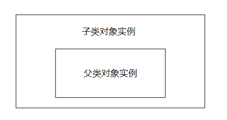


子类构造器
- 子类构造器第一行不是super或者this时，Jvm将插入代码调用父类的无参构造器

**重写**
- 子类重写父类方法必须使用`@Override`标注
- 父类中禁止重写的方法使用`final`修饰，但是该方法可被子类继承使用
  - static、private、final方法都不能重写
  - 重写是为了对象多态性，而静态方法的调用基于引用类型，允许子类定义与父类同名的静态方法，两个静态方法是独立的，可以分别通过Child.a和Parent.a调用
  - 因为可以通过对象调用静态方法，假设父类和子类定义同名的静态方法，引用类型是父类就调用父类的静态方法，即使该引用实际指向子类对象
- 访问权限不能低于父类
- 可以通过`super.方法`保留父类方法逻辑，并额外增加其他逻辑
- 重写必须遵守**里氏替换原则LSP：子类对象应能完全替代父类对象出现在任何场景中，且不破坏程序的逻辑完整性**
- 继承访问器、更改器方法时，因为子类继承了父类的域，应检查访问器、更改器方法是否在子类的域上运算封闭。例如Holiday继承Day，应确保指向Holiday引用不会操控、返回非节假日；


| 检查项                | 合规表现                          | 违规表现                      |
|-----------------------|---------------------------------|------------------------------|
| **返回值范围**        | 子类返回值集合⊆父类返回值集合，**允许子类返回值更改为void**             | 子类返回超集或异常值          |
| **前置条件**          | 父类参数集合⊆子类参数集合          | 子类要求更严参数              |
| **后置条件**          | 子类维护父类的设计意图        | 子类破坏父类状态              |
| **副作用**            | 子类不引入额外副作用             | 子类新增意外操作（如日志）    |
| **异常抛出**          | 子类不抛出比父类更宽泛的异常     | 子类新增未经声明的异常        |


#### 抽象类

抽象类**命名以Abstract或者Base开头**

**抽象类**：使用abstract修饰的类，其语法规则如下：
- 抽象类可以声明域、abstract方法、非abstract修饰的方法
- 如果一个类有abstract方法，就必须使用abstract修饰
- 实现接口或继承抽象类后，还有没有实现的方法时，必须使用abstract修饰
- 抽象类可以没有抽象方法，这样做的目的：
  - 限制实例化
  - 将类标记为同一类型，例如ArrayList、LinkedList 均继承自 无抽象方法的AbstractList
- 抽象类配合模板方法模式，例如HttpServlet是抽象类，实现 service() 方法作为算法骨架，仅要求子类实现doGet()/doPost()方法

抽象类的应用场景是生成类族
- 希望一些通用的功能被多个子类复用
- 需要在抽象类中定义好 API，然后在子类中扩展实现
---


#### 虚方法
**虚方法（Virtual Method）** 是实现**多态** 的核心机制。其行为由JVM的动态绑定实现，与静态方法/私有方法的静态绑定形成对比
- **虚方法**：可被子类重写的非`private`、非`static`、非`final`的方法
  - Java 8+为接口提供**default方法**，该方法是**是虚方法**
- **动态绑定**：在运行时根据对象的**实际类型**而非引用类型决定调用哪个方法。


JVM通过**虚方法表**(Virtual Method Table)实现动态绑定
- **虚方法表**在类加载时存储到方法区，存储该类所有虚方法的**实际内存入口地址**
- 调用虚方法时，JVM通过**对象->实际类->虚方法表->实际内存入口地址**执行目标方法代码
- 子类虚方法表会复制父类表，并替换重写方法的地址
- 除非能确定具体类型，否则虚方法增加JIT编译器的内联难度
  - 通过**final**修饰符**标记不可重写的方法，解除虚方法特性**
  - 通过**final**修饰符**标记不可继承类，所有方法自动解除虚化虚方法特性**


### 依赖关系Dependency

依赖是非常弱的关系，通常体现在参数传递、返回值、局部变量，因此依赖方只是在某些方法中短暂的依赖其他类，没有明确的结构关系

### 关联关系Association

对象持有其他对象的引用，可细分为双向关联、单向关联、自关联；或者一对一关联、一对多关联、多对多关联
- 引用作为字段，在代码块、构造函数或更改器中初始化
- 关联是结构性的关系，在对象的整个生命周期关联其他对象


### 聚合关系Aggregation
聚合是描述“整体-部分”结构的特殊一对多关联

约束条件
1. 整体由部分构成
2. 部分可以单独实例化，即部分的生命周期可以不被整体控制


### 组合关系Composition

组合描述“整体-部分”结构，是具有更强约束条件的聚合关系
- 整体：负责创建、销毁部分，并且整合部分为其他类提供服务
- 部分：不能单独实例化，只能作为整体的私有变量由整体初始化


### 内部类

**成员内部类**：**成员内部类对象依附于一个外部类对象**，所以不常用，非常不方便
- **成员内部类可以无限制访问外部类的所有成员属性**

```JAVA
public class Wanger {
    int age = 18;
    private String name = "沉默王二";
    static double money = 1;

    class Wangxiaoer {
        int age = 81;
        
        public void print() {
            System.out.println(name);
            System.out.println(money);
        }
    }
}
```
- **外部类访问内部类必须先创建一个成员内部类的对象，再通过这个对象来访问**
```JAVA
public class Wanger {
    int age = 18;
    private String name = "沉默王二";
    static double money = 1;

    public Wanger () {
        new Wangxiaoer().print();
    }

    class Wangxiaoer {
        int age = 81;

        public void print() {
            System.out.println(name);
            System.out.println(money);
        }
    }
}
```
- 外部类中的静态方法中，需要先创建外部类对象，再通过该对象创建内部类对象
```JAVA
public class Wanger {
    int age = 18;
    private String name = "沉默王二";
    static double money = 1;

    public Wanger () {
        new Wangxiaoer().print();
    }

    public static void main(String[] args) {
        Wanger wanger = new Wanger();
        Wangxiaoer xiaoer = wanger.new Wangxiaoer();
        xiaoer.print();
    }  

    class Wangxiaoer {
        int age = 81;

        public void print() {
            System.out.println(name);
            System.out.println(money);
        }
    }
}
``` 

**局部内部类**；定义在一个方法或者一个作用域里面的类，所以局部内部类的生命周期仅限于作用域内。
- 犹豫仅限于作用域中，所以不能被权限修饰符修饰
```JAVA
public class Wangsan {
    public Wangsan print() {
        class Wangxiaosan extends Wangsan{
            private int age = 18;
        }
        return new Wangxiaosan();
    }
}
```

**匿名内部类**：常用于方法参数，无需构造器，名字由编译器自动命名
```JAVA
public class ThreadDemo {
    public static void main(String[] args) {
        Thread t = new Thread(new Runnable() {
            @Override
            public void run() {
                System.out.println(Thread.currentThread().getName());
            }
        });
        t.start();
    }
}
```
**静态内部类**

[参考static关键字](#static关键字)


### 枚举

**本质**：enum不是语法糖，而是受严格约束的类；编译后继承自java.lang.Enum，其枚举值是该类的public static final常量实例对象

**约束**
- 隐式final：**枚举类不能被继承**。
- 实例受控：枚举值在类加载时通过静态代码块初始化，**无法在运行时通过new创建新实例**，保证了全局唯一性。
- **单例性：每个枚举常量在JVM中都是唯一的单例对象**

从本质延伸的用法

| 特性 | 实现机制与设计考量 |
| :--- | :--- |
| **比较操作** | 应使用 **`==`** 而非 `equals()` 进行比较。<br>• **机制**：`==`比较对象引用。由于枚举实例是单例，引用必然相同，且能避免`NullPointerException`。<br>• **性能**：`==`是编译期检查，比`equals()`方法调用更高效。 |
| **扩展信息** | 可以为枚举添加字段、构造方法和方法，使其成为“全功能类”。<br>• **实现**：通过私有构造器为每个枚举实例绑定自定义数据（如`TENNIS("网球")`）。 |
| **集合支持** | 有专属的高效集合类`EnumSet`和`EnumMap`。<br>• **`EnumSet`**：内部用位向量实现，极其紧凑高效，用于替代基于整型的位标志。<br>• **`EnumMap`**：内部以数组实现，键为枚举的序数（`ordinal`），访问速度比`HashMap`更快。 |
| **Switch支持** | 可用于`switch`语句，因其本质是编译期常量，匹配效率高。 |

**枚举实现单例模式**
- JVM确保枚举对象只有一个
- 类加载机制保证初始化线程安全。
- Enum类特殊处理，防止反序列化创建新实例。
- 代码极度简洁：无需担心反射攻击和序列化问题。

```JAVA
// 传统双重检查锁实现（复杂且需注意volatile、synchronized）
public class Singleton {
    private volatile static Singleton instance;
    private Singleton() {}
    public static Singleton getInstance() {
        if (instance == null) {
            synchronized (Singleton.class) {
                if (instance == null) {
                    instance = new Singleton();
                }
            }
        }
        return instance;
    }
}

// 枚举实现（推荐）
public enum EasySingleton {
    INSTANCE; // 单例实例
    // 可以在此添加方法
    public void doSomething() { ... }
}
```
1. 比较操作：== vs equals()
```JAVA
public class EnumComparisonDemo {
    public enum Status { OPEN, PENDING, CLOSED }

    public static void main(String[] args) {
        Status s1 = Status.OPEN;
        Status s2 = Status.OPEN;
        Status s3 = Status.CLOSED;
        Status nullEnum = null;

        // 正确方式：使用 == (推荐)
        System.out.println("s1 == s2: " + (s1 == s2)); // true，同一实例
        System.out.println("s1 == s3: " + (s1 == s3)); // false，不同实例
        
        // 关键点1：== 可安全处理 null
        System.out.println("null == null: " + (nullEnum == null)); // true，不会NPE
        
        // 使用 equals() (不推荐)
        System.out.println("s1.equals(s2): " + s1.equals(s2)); // true
        System.out.println("s1.equals(s3): " + s1.equals(s3)); // false
        
        // 关键点2：equals() 在变量为 null 时可能 NPE
        // System.out.println(nullEnum.equals(null)); // 此行会抛出 NullPointerException!
    }
}
```

2.将枚举扩展为带有字段和方法的“全功能类”
```JAVA
public class SmartEnumDemo {
    // 枚举可拥有字段、构造器和方法
    public enum Planet {
        // 枚举实例定义，相当于调用私有构造器
        MERCURY("水星", 3.303e+23),
        VENUS("金星", 4.869e+24),
        EARTH("地球", 5.976e+24);
        
        // 1. 私有字段 (可任意复杂)
        private final String chineseName;
        private final double mass; // 单位:千克
        
        // 2. 私有构造器 (默认就是private)
        Planet(String chineseName, double mass) {
            this.chineseName = chineseName;
            this.mass = mass;
        }
        
        // 3. 公共访问方法
        public String getChineseName() { return chineseName; }
        public double getMass() { return mass; }
        
        // 4. 自定义行为方法
        public double massOnEarth(double earthWeight) {
            // 根据重力比例计算在其他行星上的重量
            return earthWeight * (this.mass / EARTH.mass);
        }
        
        // 5. 可覆盖父类Enum的方法
        @Override
        public String toString() {
            return this.name() + "(" + chineseName + ")";
        }
    }
    
    public static void main(String[] args) {
        Planet earth = Planet.EARTH;
        System.out.println(earth); // 输出: EARTH(地球)
        System.out.println("质量: " + earth.getMass() + " kg");
        System.out.println("60kg在地球相当于" + 
                          earth.massOnEarth(60) + "kg在此星");
        
        // 遍历所有枚举实例
        for (Planet p : Planet.values()) {
            System.out.println(p.getChineseName());
        }
    }
}

```
3. EnumSet 与 EnumMap
```JAVA
import java.util.EnumMap;
import java.util.EnumSet;

public class EnumCollectionDemo {
    public enum Day { MONDAY, TUESDAY, WEDNESDAY, THURSDAY, FRIDAY, SATURDAY, SUNDAY }
    
    public static void main(String[] args) {
        System.out.println("=== EnumSet 演示 (替代位标志) ===");
        // 创建空集合
        EnumSet<Day> workdays = EnumSet.noneOf(Day.class);
        workdays.add(Day.MONDAY);
        workdays.addAll(EnumSet.range(Day.TUESDAY, Day.FRIDAY)); // 添加区间
        System.out.println("工作日: " + workdays);
        
        // 创建包含所有元素的集合
        EnumSet<Day> allDays = EnumSet.allOf(Day.class);
        // 取补集得到周末
        EnumSet<Day> weekend = EnumSet.complementOf(workdays);
        System.out.println("周末: " + weekend);
        
        // 关键点：EnumSet内部使用位向量，contains等操作是O(1)且极快
        System.out.println("周一是不是工作日: " + workdays.contains(Day.MONDAY));
        
        System.out.println("\n=== EnumMap 演示 (枚举作为键) ===");
        // 构造需指定枚举类型类
        EnumMap<Day, String> schedule = new EnumMap<>(Day.class);
        schedule.put(Day.MONDAY, "会议");
        schedule.put(Day.WEDNESDAY, "编码");
        schedule.put(Day.FRIDAY, "周报");
        
        // 关键点：内部以有序数组实现，遍历顺序与枚举声明顺序一致
        for (var entry : schedule.entrySet()) {
            System.out.println(entry.getKey() + ": " + entry.getValue());
        }
        
        // 性能：比HashMap更快的访问速度，无哈希冲突
        System.out.println("周三安排: " + schedule.get(Day.WEDNESDAY));
    }
}
```
4. Switch支持
```JAVA
public class EnumSwitchDemo {
    public enum Command { START, PAUSE, STOP, REWIND }
    
    public static void executeCommand(Command cmd) {
        // switch 支持枚举类型
        switch (cmd) {
            // 关键点1：case标签直接使用枚举常量名，无需类前缀
            case START:
                System.out.println("系统启动...");
                break;
            case PAUSE:
                System.out.println("系统暂停");
                break;
            case STOP:
                System.out.println("系统停止");
                break;
            // 关键点2：编译器会检查是否覆盖所有枚举值
            // 如果注释掉REWIND分支，IDE通常会给出警告
            case REWIND:
                System.out.println("系统回退");
                break;
            // 关键点3：default不是必须的，因为枚举值有限且已知
            // 但可用于处理意外的null值
            default:
                System.out.println("未知命令: " + cmd);
        }
    }
    
    public static String getCommandDescription(Command cmd) {
        // Java 12+ 的switch表达式风格，更简洁
        return switch (cmd) {
            case START -> "开始执行";
            case PAUSE -> "暂停执行";
            case STOP -> "停止执行";
            case REWIND -> "回退操作";
            // 无需default，因为所有情况已枚举
        };
    }
    
    public static void main(String[] args) {
        executeCommand(Command.START);
        executeCommand(Command.PAUSE);
        
        System.out.println("STOP描述: " + 
                          getCommandDescription(Command.STOP));
        
        // 关键点4：switch的null值处理
        executeCommand(null); // 触发default分支（如果存在），否则NPE
    }
}
```


## JNI

JNI：调用不同语言编写的代码
- 标准的 Java 类库不支持需求。
- Java需要调用另一种语言已经编写好的代码，如C/C++类库
- 某些运行次数特别多的方法，为了加快性能，需要用更接近硬件的语言（比如汇编）编写。

使用 Java 与本地已编译的代码交互，通常会丧失平台可移植性。JNI 标准至少保证本地代码能工作能在任何 Java 虚拟机实现下。程序不再跨平台，必须在不同的系统环境下重新编译本地语言部分。

native关键字：表示该方法的实现在外部定义，可以用任何语言去实现它，一个 native Method 就是一个 Java 调用非 Java 代码的接口。
- 修饰方法的位置必须在返回类型之前，和其余的方法控制符前后关系不受限制。
- 不能用 abstract 修饰，也没有方法体，也没有左右大括号。
- 返回值可以是任意类型

## 封装、继承、多态（可能需要深入重构）

封装：利用抽象将数据和基于数据的操作封装在一起，使其构成一个不可分割的独立实体。使用封装有 4 大好处：
1. 良好的封装能够减少耦合。
2. 类内部的结构可以自由修改。
3. 可以对成员进行更精确的控制。
4. 隐藏信息，实现细节。

继承：继承不仅大大的减少了代码量，也使得代码结构更加清晰可见。

多态：implements 关键字使 Java 拥有多继承的特性
## JDK重要类
### 字面量null与Optional

`null`是一个特殊字面量，表示**无对象或空引用**
- `null` 不属于任何类型，但可以赋值给所有引用变量
- 枚举变量不能赋值为 `null`，因为枚举值是单例且非空。
- 尽量避免使用null ，因为null既可以表示“无值”，也可表示“未初始化”或“无效状态”
- `null` 与任何对象的引用比较需用 `==`，而非 `equals()`，但是比较对象时需要调用equals()可能会导致NPE

**空指针异常（NullPointerException, NPE）**：对值为`null` 的引用调用方法或访问其字段时，抛出`NPE`异常
- 调用 `null` 对象的方法或字段
- 遍历null数组或null集合时需要访问其大小以判断是否结束遍历，所以必定抛出`NPE`
- 自动拆箱时，若基本类型包装类是`null`，则抛出抛 `NPE`


**Optional**是一个容器类，显示声明返回值可能是null，需要处理，完全避免NPE、文档解释或歧义地返回null；提供链式调用处理返回值。
- Optional应仅用于方法返回值，不应用于字段或方法参数，调用方获取到值后应立即处理并获取实际值
- **创建Optional对象**

| 方法 | 适用场景 | 关键机制与风险 |
| :--- | :--- | :--- |
| **`Optional.of(value)`** | **明确值非`null`时** | 若传入`null`会**立即抛出`NullPointerException`**，用于快速失败。 |
| **`Optional.ofNullable(value)`** | **值可能为`null`时**（最常用） | 安全方法，若值为`null`则返回一个空的`Optional`对象。 |
| **`Optional.empty()`** | 表示一个确定无疑的“空值” | 返回单例的空`Optional`实例。 |

- **判断并消费值**，取代 `if (obj != null)`
  - **isPresent()**
  - **ifPresent(Consumer)**：仅在值存在时执行给定的消费者逻辑，否则什么都不做
  - **ifPresentOrElse(Consumer, Runnable)**（Java 9+）：值存在时执行第一个操作，不存在时执行第二个操作

- 安全获取值，**永远不要直接使用 `get()`**，因为它会在值为空时抛出`NoSuchElementException`。
  - 假设存在方法`String getDefault()`
  - 调用`opt.orElse(getDefault())`时，**无论`opt`是否有值**，`getDefault()`方法都会被执行
  - 调用`opt.orElseGet(() -> getDefault())`，仅在`opt`为空时，`getDefault()`才会被调用。

| 推荐方法 | 行为 | 适用场景 |
| :--- | :--- | :--- |
| **`orElse(T other)`** | 有值返回值，无值返回指定的**默认值**。 | **无论`Optional`是否为空，参数都会被执行求值**。 |
| **`orElseGet(Supplier)`** | 有值返回值，无值则从`Supplier`函数式接口**动态生成**一个默认值。 | 默认值构造成本较高或需要动态计算时使用。**只有为空时，`Supplier`才会被调用**，性能更优。 |
| **`orElseThrow()`** | 有值返回值，无值则抛出指定的异常（默认`NoSuchElementException`）。 | 值缺失是严重错误，需要立即失败并明确告知调用者。 |

- 转换/过滤与链式调用
  - `map(Function)`：如果值存在，就应用`Function`函数对其转换，并将结果包装在新的`Optional`中。如果原`Optional`为空，则直接返回空`Optional`
  - `filter(Predicate)`：如果值存在且满足`Predicate`条件，则返回自身；否则返回空`Optional`。可用于验证规则（如密码长度）。

- 两者常结合使用，形成清晰的数据处理管道：
```java
boolean isValid = Optional.ofNullable(userInput)
        .map(String::trim) // 去除空格
        .filter(s -> s.length() > 5) // 检查长度
        .filter(s -> !s.equals("password")) // 检查是否弱密码
        .isPresent(); // 判断是否通过所有检查
```

### Object：所有类的超类

Object类主要提供六类方法，共11种
- 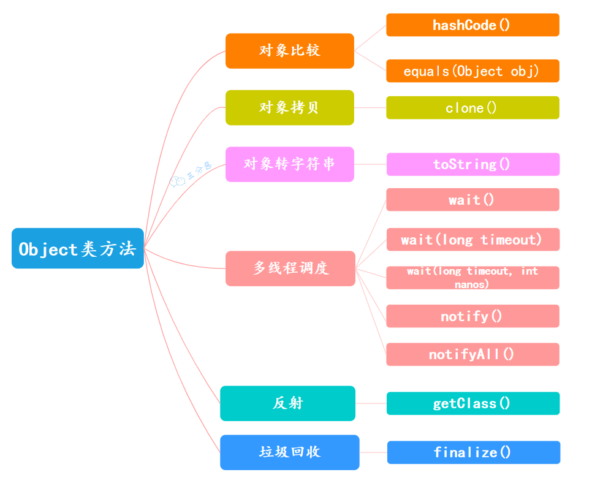

**对象比较**

- `public native int hashCode()` ：native 方法，用于返回对象的哈希码。
  - 按照约定，相等的对象必须具有相等的哈希码。如果重写了 equals 方法，就应该重写 hashCode 方法。可以**使用 `Objects.hash()` 方法来生成哈希码**。

```JAVA
public int hashCode() {
    return Objects.hash(name, age);
}
```

- `public boolean equals(Object obj)`：用于比较 2 个对象的内存地址是否相等。

```JAVA
public boolean equals(Object obj) {
    return (this == obj);
}
```

- 重写equals，**必须同时重写 `hashCode()`**
   1. 先判断是否指向同一个对象
   2. 再判断该对象是否为null
   3. 然后判断两个对象的类型是否能够划为等价类，不能就没必要继续判断
   4. 最后依次判断基本数据类型，对引用字段调用静态方法`Objects.equals`

```JAVA
class Person1 {
    private String name;
    private int age;

    // 省略 gettter 和 setter 方法

    public boolean equals(Object obj) {
        //优化，先判断是否指向同一个对象
        if (this == obj) {
            return true;
        }
        //instanceof语句，参数为空返回false；不是等价类返回false，要求子类遵循里氏替换原则
        if (obj instanceof Person1) {
            Person1 p = (Person1) obj;
            return Objects.equals(this.name, p.getName()) && this.age == p.getAge();
        }
        return false;
    }
}
```

---

**对象拷贝**

- `protected native Object clone() throws CloneNotSupportedException`：naitive 方法，返回此对象的一个副本。默认实现只做浅拷贝，且类必须实现 Cloneable 接口。
  - Object 本身没有实现 Cloneable 接口，所以在不重写 clone 方法的情况下直接直接调用该方法会发生 `CloneNotSupportedException` 异常
- 调用前提：
  - 类实现 `Cloneable` 标记接口
  - 重写 `clone()` 方法为 `public`
- 数组可直接调用clone方法，前提是数组类型能正常调用clone方法

---

**对象转字符串**

使用Lombok的@Data注解，将自动生成toString方法
`toString()`
   - 返回对象的字符串表示，通常用于调试或日志输出
   - 默认实现：打印对象的类名@哈希码（十六进制）
   - 数组对象没有重写toString方法，使用静态方法**`Arrays.toString()`**返回String
```java
public String toString() {
    return getClass().getName() + "@" + Integer.toHexString(hashCode());
}
```

---

**多线程调度**

`wait(), notify(), notifyAll()`

---

**反射**

`public final native Class<?> getClass()`：**所有反射API的入口**

---

**垃圾回收**

`finalize()`，已废弃。

---
### 数组

数组，本质是对象，存储固定数量的同类型元素；初始化后，其所有元素将按照对象的默认初始化方式赋予默认值

**遍历方式**：for循环、for-each 循环

```JAVA
for (int element : anOtherArray) {
    System.out.println(element);
}
```
**可变参数与数组**
- `void varargsMethod(String... varargs) {}`**可变参数可传入0-N个参数**，用数组实现
- 可以传入String数组，也可以传入多个字符串

**List与数组**
- List封装数组所没有的操作，因此常需要**将数组转换为List**
```JAVA
public static <T> List<T> asList(T... a) {
    return new ArrayList<>(a);
}
```
- Arrays.asList传入int[]时，因为T只能是对象，所以编译器只能将T推断为int[]，而不是单个元素，返回`List<int[]>`，与List<Integer>不匹配
```JAVA
List<Integer> list= Arrays.asList(1,2);
System.out.println(list.toString());

Integer[] anArray1 = new Integer[]{1,2,3};
list=Arrays.asList(anArray1);
System.out.println(list.toString());

//错误写法
int[] anArray = new int[]{1,2,3,4};
list=Arrays.asList(anArray);

//正确写法
List = Arrays.stream(anArray).boxed().collect(Collectors.toList());
```
- **同名陷阱**，观察上述源码，asList返回的ArrayList不是util包中的ArrayList，而是私有内部类，是对**原始数组的视图**，和视图定义一样，它有以下特性
  - 它是**固定长度**的：因为它只是包装了你传入的数组，并没有自己独立可变的后台数组（如 java.util.ArrayList 中的 elementData）。
  - 不支持结构修改：调用 add(), remove(), clear() 等方法会抛出 UnsupportedOperationException 异常。
  - 修改会“透传”：因为你得到的是一个“视图”，所以**通过 set() 方法修改列表元素，会直接修改你传入的原始数组**。
- java.util.ArrayList提供构造器转换该私有内部类

```JAVA
new ArrayList<>(Arrays.asList(anArray));
```

**流与数组**
```JAVA
String[] anArray = new String[] {"沉默王二", "一枚有趣的程序员", "好好珍重他"};
Stream<String> aStream = Arrays.stream(anArray);
```


**数组的排序与查找**
- Arrays.sort()
  - 要求传入的对象实现Comparable接口的compareTo()方法
  - 传入基本数据类型的数组将按照升序排序
  - 指定范围并反序排序

```JAVA
String[] yetAnotherArray = new String[] {"A", "E", "Z", "B", "C"};
Arrays.sort(yetAnotherArray, 1, 3,
                Comparator.comparing(String::toString).reversed());
```

查找
- 对已排序数组采用二分查找
```JAVA
int[] anArray = new int[] {1, 2, 3, 4, 5};
int index = Arrays.binarySearch(anArray, 4);
```

**数组复制**
- `Arrays.copyOfRange(value, offset, offset+count);`
### 多维数组与数组打印

n维数组是元素类型为n-1维数组的数组

数组在java中往往指对象，继承了祖先类 Object 的所有方法，却**并未定义数组类**，其toString方法如下
```JAVA
public String toString() {
    return getClass().getName() + "@" + Integer.toHexString(hashCode());
}
```
**Arrays.toString()**：**可以将任意类型的数组转成字符串，包括基本类型数组和引用类型数组**
- 对引用类型调用其toString()方法，因此**多维数组需要使用`Arrays.deepToString()`打印数组**


什么是POJO？
- 与SpringBean不同，POJO结构简单、独立，不依赖特定环境，他它通常只包含以下组成
- 私有字段（Private Fields）
- 公开的Getter/Setter方法
- 可能包含equals()、hashCode()和toString()等Object类方法的重写

区分定义POJO、SpringBean
- SpringBean是由Spring IoC容器管理的对象
- **POJO主要作为数据模型或数据传输对象**使用：
  - Entity（实体）：对应数据库表，如上面的User类。
  - DTO（Data Transfer Object）：用于层间（如Controller和Service之间）数据传输，避免暴露内部实体细节。
  - VO（Value Object）：值对象，通常用于业务层内部传递数据。
  - Form Bean：封装前端表单数据。

**阿里巴巴Java 开发手册强制POJO重写`toString()`方法**，如果继承其他POJO类，则需要在**重写的第一行调用`super.toString()`**
stream流打印数组
```JAVA
Arrays.asList(cmowers).stream().forEach(s -> System.out.println(s));

Stream.of(cmowers).forEach(System.out::println);

Arrays.stream(cmowers).forEach(System.out::println);
```
### 字符串

```java

// 字符串不能被继承
// 可序列化
// 实现了 Comparable 接口，可以通过 `compareTo()` 方法完成排序
public final class String
    implements java.io.Serializable, Comparable<String>, CharSequence {
}
```


#### 字符串的不可变

不可变对象
- 被final修饰，禁止子类继承String改变其不可变性
- 其字段char[]被final修饰，无法通过重新赋值更换整个value数组
- 不提供public的setter方法修改value数组，所有看似修改字符串的操作都是返回新的字符串对象
- 构造器传入外部数组时会创建新的副本

字符串不可变的用途
- 无法篡改String提供安全性，可用于密码用户名等敏感信息
- 字符串常量池，相同内容的字符串共享同一个对象
- 字符串的不可变性决定哈希值不会变更，每个字符串拥有一个hash字段记录哈希值，由于相同内容的字符串是共享的，因此**相同内容的字符串不会再次计算哈希值**，且哈希值的计算惰性推迟到调用hashCode()时；

#### 字符串常量池

字符串常量池位于堆中，java7+仅存储引用，字符串对象与其他对象相同存储在堆中，同样会被GC

- `String s = new String("二哥");`：**该语句创建两个对象，先创建一个"二哥"字符串然后将引用保存在字符串常量池中，然后再在堆中复制一个字符串并赋值给引用s**
- 因此直接通过双引号获取字符串引用，而不要使用new
- 因此，new获得的String对象即使内容相同，也不是同一个对象，导致极大的空间浪费
```JAVA
String s1=new String("er");
String s2="er";
//输出false
System.out.println(s1==s2);
```


1. **使用双引号创建的字符串，其引用存储在字符串常量池中** 
2. **使用 new 关键字创建的字符串对象会先从字符串常量池中找，如果没找到就创建一个，然后再在堆中创建一个字符串对象副本；如果找到了，就直接在堆中创建字符串对象**
3. **没有使用双引号声明的字符串对象可以调用intern，将其引用放入字符串常量池**


字符串常量池，**本质是一个固定大小的StringTable**（数组+链表实现的哈希表），java7+环境下**保存字符串引用**，**常量池仅保存引用，实际对象位于堆中**，其中的字符串不再被引用时可被正常回收，可以通过 -XX:StringTableSize 来调整其大小
- 可调整大小的是数组长度，随着常量池中元素的增加，哈希冲突严重，链表长度增加，导致常量池的性能大幅下降。


字符串常量池在java7+前后位置的变化参考JVM笔记

#### intern

java8后，`intern()`方法的行为发生改变，**如果对象在堆中已经创建了，字符串常量池中就不需要再创建新的对象了，而是直接保存堆中对象的引用**，分析下面的示例代码

```JAVA
//首先创建"二哥三妹"字符串，常量池保存其引用，然后new复制一个新的对象赋值给s1，再将s1放入常量池，由于已经存在了，所以返回常量池中的引用，因此返回false
String s1 = new String("二哥三妹");
String s2 = s1.intern();
System.out.println(s1 == s2);

//关键在于+操作符，在编译器转换为new StringBuilder().append("二哥").append("三妹").toString();内部实现使用new
// 因此常量池中仅存储"二哥"、"三妹"，不会存储"二哥三妹"引用，s1是堆中的"二哥三妹"对象
// 将s1.intern()将仅在常量池中保存引用，不会创建新的对象，s2将复制该引用，因此结果为true
String s1 = new String("二哥") + new String("三妹");
String s2 = s1.intern();
System.out.println(s1 == s2);

```

ps：对于`"二哥"+"三妹"`，编译期就直接优化为"二哥三妹"，而不会调用StringBuilder

#### StringBuilder & StringBuffer

StringBuilder & StringBuffer基本上完全一样，StringBuffer使用synchronized关键字同步，StringBuilder只在单线程环境中使用，**多线程环境中修改字符串可以使用 ThreadLocal 来避免多线程冲突**，因此StringBuffer不再使用

**+操作符在编译器优化为链式调用StringBuilder的append()和toString()方法**

StringBuilder内部实现
- 创建StringBuilder对象时，初始化内部char[]类型的value大小为16，每次扩容时新容量为旧容量的两倍加上 2

StringBuilder提供reverse方法，反转整个字符串
#### 判断字符串相等


```java
public boolean equals(Object anObject) {
    // 检查是否是同一个对象的引用，如果是，直接返回 true
    if (this == anObject) {
        return true;
    }
    // 检查 anObject 是否是 String 类的实例
    if (anObject instanceof String) {
        String anotherString = (String) anObject; // 将 anObject 强制转换为 String 类型
        int n = value.length; // 获取当前字符串的长度
        // 检查两个字符串长度是否相等
        if (n == anotherString.value.length) {
            char v1[] = value; // 当前字符串的字符数组
            char v2[] = anotherString.value; // 另一个字符串的字符数组
            int i = 0; // 用于遍历字符数组的索引
            // 遍历比较两个字符串的每个字符
            while (n-- != 0) {
                // 如果在任何位置字符不同，则返回 false
                if (v1[i] != v2[i])
                    return false;
                i++;
            }
            // 所有字符都相同，返回 true
            return true;
        }
    }
    // 如果 anObject 不是 String 类型或长度不等，则返回 false
    return false;
}
```

除.equals方法，还可以考虑Objects.equals()和String 类的 .contentEquals()
- Objects.equals()避免判空逻辑
- **String 类的 .contentEquals()**可以将字符串与任何的字符序列（StringBuffer、StringBuilder、String、CharSequence）进行比较。
#### Java9+对String的底层优化

Java9之前，String底层使用char数组实现，9+改为byte数组实现，并引入coder表示编码；String占用内存减少一半；代价是引入编码检测的开销；
- Latin1是一种单字节字符集，每个字符占用一个字节，**内存占用减少后，GC次数随之减少**
- char类型数据在JVM中占用两个字节，使用UTF-16编码
- **coder字段根据字符串的内容自动设置为LATIN1或UTF16**
```java
public final class String
    implements java.io.Serializable, Comparable<String>, CharSequence {
    @Stable
    private final byte[] value;
    private final byte coder;
    private int hash;
}
```


#### String 类的 hashCode 方法


每一个String对象有一个延迟计算的hash值，极大概率不会重复，因此String非常适合作为HashMap的键值
- String采用**31 倍哈希法**：将字符串中的每个字符乘以一个固定的质数 31 的幂次方，并将它们相加得到哈希值$$H(s) = s[0] \times 31^{(n-1)} + s[1]  \times  31^{(n-2)} + … + s[n-1]  \times  31^{0}$$
```java
private int hash; // 缓存字符串的哈希码

public int hashCode() {
    int h = hash; // 从缓存中获取哈希码
    // 如果哈希码未被计算过（即为 0）且字符串不为空，则计算哈希码
    if (h == 0 && value.length > 0) {
        char val[] = value; // 获取字符串的字符数组

        // 遍历字符串的每个字符来计算哈希码
        for (int i = 0; i < value.length; i++) {
            h = 31 * h + val[i]; // 使用 31 作为乘法因子
        }
        hash = h; // 缓存计算后的哈希码
    }
    return h; // 返回哈希码
}
```


#### substring 方法

String 类中还有一个方法比较常用 substring，用来截取字符串的，来看源码。

```java
public String substring(int beginIndex) {
    // 检查起始索引是否小于 0，如果是，则抛出 StringIndexOutOfBoundsException 异常
    if (beginIndex < 0) {
        throw new StringIndexOutOfBoundsException(beginIndex);
    }
    // 计算子字符串的长度
    int subLen = value.length - beginIndex;
    // 检查子字符串长度是否为负数，如果是，则抛出 StringIndexOutOfBoundsException 异常
    if (subLen < 0) {
        throw new StringIndexOutOfBoundsException(subLen);
    }
    // 如果起始索引为 0，则返回原字符串；否则，创建并返回新的字符串
    return (beginIndex == 0) ? this : new String(value, beginIndex, subLen);
}
```

`substring` 方法首先检查参数的有效性，如果参数无效，则抛出 `StringIndexOutOfBoundsException` 异常。接下来，方法根据参数计算子字符串的长度。如果子字符串长度小于零，也会抛出 `StringIndexOutOfBoundsException` 异常。

如果 `beginIndex` 为 0，说明子串与原字符串相同，直接返回原字符串。否则，使用 `value` 数组（原字符串的字符数组）的一部分 new 一个新的 String 对象并返回。

substring 方法示例：

- 提取字符串中的一段子串：
```java
String str = “Hello, world!“;
String subStr = str.substring(7, 12);  // 从第7个字符（包括）提取到第12个字符（不包括）
System.out.println(subStr);  // 输出 “world“
```

- 提取字符串中的前缀或后缀：
```java
String str = “Hello, world!“;
String prefix = str.substring(0, 5);  // 提取前5个字符，即 “Hello“
String suffix = str.substring(7);     // 提取从第7个字符开始的所有字符，即 “world!“
```

- 处理字符串中的空格和分隔符：
```java
String str = "   Hello,   world!  ";
String trimmed = str.trim();                  // 去除字符串开头和结尾的空格
String[] words = trimmed.split("\\s+");       // 将字符串按照空格分隔成单词数组
String firstWord = words[0].substring(0, 1);  // 提取第一个单词的首字母
System.out.println(firstWord);                // 输出 "H"
```
- 处理字符串中的数字和符号：
```JAVA

String str = "1234-5678-9012-3456";
String[] parts = str.split("-");             // 将字符串按照连字符分隔成四个部分
String last4Digits = parts[3].substring(1);  // 提取最后一个部分的后三位数字
System.out.println(last4Digits);             // 输出 "456"
```

#### indexOf方法

`indexOf()` 方法用于查找一个子字符串在原字符串中第一次出现的位置，并返回该位置的索引


```JAVA
/*
 * 查找字符数组 target 在字符数组 source 中第一次出现的位置。
 * sourceOffset 和 sourceCount 参数指定 source 数组中要搜索的范围，
 * targetOffset 和 targetCount 参数指定 target 数组中要搜索的范围，
 * fromIndex 参数指定开始搜索的位置。
 * 如果找到了 target 数组，则返回它在 source 数组中的位置索引（从0开始），
 * 否则返回-1。
 */
static int indexOf(char[] source, int sourceOffset, int sourceCount,
        char[] target, int targetOffset, int targetCount,
        int fromIndex) {
    // 如果开始搜索的位置已经超出 source 数组的范围，则直接返回-1（如果 target 数组为空，则返回 sourceCount）
    if (fromIndex >= sourceCount) {
        return (targetCount == 0 ? sourceCount : -1);
    }
    // 如果开始搜索的位置小于0，则从0开始搜索
    if (fromIndex < 0) {
        fromIndex = 0;
    }
    // 如果 target 数组为空，则直接返回开始搜索的位置
    if (targetCount == 0) {
        return fromIndex;
    }

    // 查找 target 数组的第一个字符在 source 数组中的位置
    char first = target[targetOffset];
    int max = sourceOffset + (sourceCount - targetCount);

    // 循环查找 target 数组在 source 数组中的位置
    for (int i = sourceOffset + fromIndex; i <= max; i++) {
        /* Look for first character. */
        // 如果 source 数组中当前位置的字符不是 target 数组的第一个字符，则在 source 数组中继续查找 target 数组的第一个字符
        if (source[i] != first) {
            while (++i <= max && source[i] != first);
        }

        /* Found first character, now look at the rest of v2 */
        // 如果在 source 数组中找到了 target 数组的第一个字符，则继续查找 target 数组的剩余部分是否匹配
        if (i <= max) {
            int j = i + 1;
            int end = j + targetCount - 1;
            for (int k = targetOffset + 1; j < end && source[j]
                    == target[k]; j++, k++);

            // 如果 target 数组全部匹配，则返回在 source 数组中的位置索引
            if (j == end) {
                /* Found whole string. */
                return i - sourceOffset;
            }
        }
    }
    // 没有找到 target 数组，则返回-1
    return -1;
}
```

示例
- 查找子字符串的位置

```JAVA
String str = "Hello, world!";
int index = str.indexOf("world");  // 查找 "world" 子字符串在 str 中第一次出现的位置
System.out.println(index);        // 输出 7
```
- 查找字符串中某个字符的位置

```JAVA
String str = "Hello, world!";
int index = str.indexOf(",");     // 查找逗号在 str 中第一次出现的位置
System.out.println(index);        // 输出 5
```
- 查找子字符串的位置（从指定位置开始查找）

```JAVA
String str = "Hello, world!";
int index = str.indexOf("l", 3);  // 从索引为3的位置开始查找 "l" 子字符串在 str 中第一次出现的位置
System.out.println(index);        // 输出 3
```
- 查找多个子字符串

```JAVA
String str = "Hello, world!";
int index1 = str.indexOf("o");    // 查找 "o" 子字符串在 str 中第一次出现的位置
int index2 = str.indexOf("o", 5); // 从索引为5的位置开始查找 "o" 子字符串在 str 中第一次出现的位置
System.out.println(index1);       // 输出 4
System.out.println(index2);       // 输出 8
```

#### 拼接字符串

java在编译期重新解释+操作符，其本质是语法糖，有两种处理方式，如果拼接对象是编译期常量，就直接在编译期合成它们，否则解释为调用StringBuilder的append和toString方法

因为每次都可能需要生成一个StringBuilder对象，因此**在循环体中，尽量在循环外显式声明一个StringBuilder，在循环体内显式调用它，而不是使用+操作符，避免产生大量的StringBuilder对象**
- 实际一万次循环测试下，按照推荐方式编写代码，耗时将从十几秒降低到几毫秒。

```JAVA
class Demo {
    public static void main(String[] args) {
        StringBuilder sb = new StringBuilder();
        for (int i = 1; i < 10; i++) {
            String chenmo = "沉默";
            String wanger = "王二";
            sb.append(chenmo);
            sb.append(wanger);
        }
        System.out.println(sb);
    }
}
```

**concat和StringBuilder**
- **concat遇到字符串为空时，抛出NullPointerException**
- **+操作符和StringBuilder将null当做"null"字符处理**
- 拼接的对象过多时，concat的效率会下降

String提供join静态方法使用间隔分隔符拼接字符串

```JAVA
String message = String.join("-", "王二", "太特么", "有趣了");
```

**org.apache.commons.lang3.StringUtils**提供join()方法完成字符串拼接，增强如下功能
- **支持参数更多，无需先转换为字符串对象**：**第一个参数为任意类型数组或集合**，第二个参数为分隔符
- **空值处理更强大**：默认跳过所有null，而String提供join静态方法会打印"null"字符串，joinWith()方法可以将null替换为指定字符串
- 支持子数组拼接：`join(array, separator, startIndex, endIndex)` 可以只拼接数组的某一部分


#### 拆分字符串

**split()方法**
- 第一个参数是分隔符，如果指定字符串没有该分隔符将返回仅包含一个元素的字符串数组，该元素是原字符串
- 第二个参数是拆分的个数，超过该个数调用substring()截取，不再分隔

```JAVA
public class Test {
    public static void main(String[] args) {
        String cmower = "沉默王二，一枚有趣的程序员";
        if (cmower.contains("，")) {
            String [] parts = cmower.split("，");
            System.out.println("第一部分：" + parts[0] +" 第二部分：" + parts[1]);
        } else {
            throw new IllegalArgumentException("当前字符串没有包含逗号");
        }
    }
}
```


- 传入的第一个参数应符合regex正则表达式语法，如果分隔符包括正则表达式的特殊符号，直接传入这些分隔符不仅没有预期结果，且大概率报错，这些特殊符号包括
  - . ：匹配任意字符。
  - | ：表示“或”逻辑。
  - *、+、?：表示数量的量词。
  - ^、$：表示位置的锚点。
  - ()、[]、{} ：表示分组、字符类或次数。
  - \ ：转义字符本身
- 在正则表达式中，使用`\\`转义字符将上述特殊符号表示为普通字符，而`\`本身是转义字符，所以需要两个`\\` 
```JAVA
String cmower = "沉默王二.一枚有趣的程序员";
if (cmower.contains(".")) {
    String [] parts = cmower.split("\\.");
    System.out.println("第一部分：" + parts[0] +" 第二部分：" + parts[1]);
}
```
- 或者**使用 `[]`匹配**方括号中包含的**任意字符**
```JAVA
cmower.split("[.]");
```

还可以**使用 Pattern 类的 quote() 方法来包裹任意字符串**，目标字符串会在首尾分别加上正则表达式的 `\Q` 和`\E` 标记，分别表示“引用开始”和“引用结束”，**在这对标记之间的所有字符，都会被正则引擎当作普通字符（字面量）来解释**

除了通过字符串调用split方法，还可以通过Pattern对象调用split方法，更加简洁
```JAVA
String [] parts = cmower.split(Pattern.quote("."));

public class TestPatternSplit {
    private static Pattern twopart = Pattern.compile("\\.");

    public static void main(String[] args) {
        String [] parts = twopart.split("沉默王二.一枚有趣的程序员");
        System.out.println("第一部分：" + parts[0] +" 第二部分：" + parts[1]);
    }
}
```

**使用 Pattern 配合 Matcher 类进行字符串拆分**，对要拆分的字符串进行一些严格的限制
- 正则表达式 (.+)\\.(.+) 的意思是，不仅要把字符串按照英文标点的方式拆成两部分，并且英文逗点的前后要有内容
```JAVA
public class TestPatternMatch {
    private static Pattern twopart = Pattern.compile("(.+)\\.(.+)");

    public static void main(String[] args) {
        checkString("沉默王二.一枚有趣的程序员");
        checkString("沉默王二.");
        checkString(".一枚有趣的程序员");
    }

    private static void checkString(String str) {
        Matcher m = twopart.matcher(str);
        if (m.matches()) {
            System.out.println("第一部分：" + m.group(1) + " 第二部分：" + m.group(2));
        } else {
            System.out.println("不匹配");
        }
    }
}
```
- `"(?<=，)"`：把分隔符包裹在拆分后的字符串的第一部分
```JAVA
String cmower = "沉默王二，一枚有趣的程序员";
if (cmower.contains("，")) {
    String [] parts = cmower.split("(?<=，)");
    System.out.println("第一部分：" + parts[0] +" 第二部分：" + parts[1]);
}

```
- `"(?=，)"`把分隔符包裹在第二部分
```JAVA
String [] parts = cmower.split("(?=，)");
```
- 其他两种符号参考正则表达式的断言模式
#### 其他方法

`length()`： 返回字符串长度。

`isEmpty()` ： 判断字符串是否为空。

`charAt()` ： 返回指定索引处的字符。

`valueOf()` ： **将其他类型的数据转换为字符串**。

`getChars`：把整数复制到字符数组中

`getBytes()`：返回字节数组，可以指定编码方式

```JAVA
String text = "沉默王二";
System.out.println(Arrays.toString(text.getBytes(StandardCharsets.UTF_8)));
```

`trim()` ：去除字符串两侧的空白字符
```JAVA
public String trim() {
    int len = value.length;
    int st = 0;
    char[] val = value;    /* avoid getfield opcode */

    while ((st < len) && (val[st] <= ' ')) {
        st++;
    }
    while ((st < len) && (val[len - 1] <= ' ')) {
        len--;
    }
    return ((st > 0) || (len < value.length)) ? substring(st, len) : this;
}
```

`toCharArray()`：将字符串转换为字符数组
```JAVA
String text = "沉默王二";
char[] chars = text.toCharArray();
System.out.println(Arrays.toString(chars));
```
### 大数值


**`java.math.BigInteger`** ：任意精度整数（无小数部分），适用超大整数运算，如加密算法、组合数学
**特点**
- 不可变类（Immutable）：所有修改操作均返回新对象。
- 支持任意精度的整数运算（无溢出风险）。
- 内部以二进制补码形式存储，可表示正负数。

**常用构造方法**

| 方式 | 示例 | 说明 |
|------|------|------|
| 字符串 | `new BigInteger("12345678901234567890")` | 最常用方式，支持十进制、十六进制（前缀 `0x`）等 |
| 字节数组 | `new BigInteger(byte[] bytes)` | 从字节数组构造（常用于 I/O 流） |
| 长整型 | `BigInteger.valueOf(long l)` | 将 `long` 转为 `BigInteger` |


 **常用方法**
| 方法 | 功能 | 示例 |
|------|------|------|
| `add()`, `subtract()`, `multiply()`, `divide()` | 加减乘除 | `a.add(b)`, `a.multiply(b)` |
| `mod(BigInteger m)` | 取模运算 | `a.mod(BigInteger.TEN)` → 取个位数 |
| `pow(int exponent)` | 幂运算 | `a.pow(3)` → a³ |
| `gcd(BigInteger val)` | 计算最大公约数 | `a.gcd(b)` |
| `isProbablePrime(int certainty)` | 概率性判断质数 | `a.isProbablePrime(100)` → 可信度较高 |
| `toString(int radix)` | 转换为指定进制字符串 | `a.toString(16)` → 十六进制 |

**除法规则**：
- `divide()` 采用截断除法，抛弃余数
- `divideAndRemainder() `返回两个元素的数组，索引0上的元素是商，索引1上的元素是余数

---


**`java.math.BigDecimal`** ：任意精度定点数（适合高精度小数计算），适用高精度计算，如金融、科学计算
**特点**
- 不可变类，用于精确表示任意精度的小数。
- 适用于金融、科学等领域的高精度计算（避免浮点误差）。
- 默认标度（Scale）为 0，可通过构造函数指定。

**常用构造方法**
| 方式 | 示例 | 说明 |
|------|------|------|
| 字符串 | `new BigDecimal("0.1")` | 推荐方式，避免浮点数转换误差 |
| 双精度浮点数 | `new BigDecimal(double d)` | &#9888;️ 不推荐！可能因浮点数精度问题导致错误 |
| 长整型 + 标度 | `new BigDecimal(long val, int scale)` | 指定初始值和标度（小数位数） |

 **常用方法**
| 方法 | 功能 | 示例 |
|------|------|------|
| `add()`, `subtract()`, `multiply()`, `divide()` | 加减乘除 | `a.add(b)`, `a.divide(b, RoundingMode.HALF_UP)` |
| `setScale(int newScale, RoundingMode roundingMode)` | 设置标度并舍入 | `a.setScale(2, RoundingMode.HALF_UP)` → 保留两位小数 |
| `stripTrailingZeros()` | 去除末尾多余的零 | `new BigDecimal("1.0").stripTrailingZeros()` → 1 |
| `compareTo(BigDecimal val)` | 比较大小 | 返回 -1/0/1 |

 **关键警告**
- **切勿用浮点数构造**：`new BigDecimal(0.1)` 实际会得到 `0.1000000000000000055...`，因为 `0.1` 无法精确表示为二进制浮点数。应使用字符串构造：`new BigDecimal("0.1")`。
- **舍入模式必选**：`divide()` 方法必须指定舍入模式（如 `RoundingMode.HALF_UP`），否则抛出异常。
  - `a.divide(b, RoundingMode.HALF_UP)`：四舍五入到 a 的原始小数位数

```JAVA
import java.math.BigDecimal;
import java.math.MathContext;
import java.math.RoundingMode;

public class Example {
    public static void main(String[] args) {
        BigDecimal a = new BigDecimal("1.0");
        BigDecimal b = new BigDecimal("3.0");
        
        // 场景1：精确除法（默认无限精度）
        BigDecimal exactResult = a.divide(b); // 抛出ArithmeticException（无限循环小数）
        
        // 场景2：使用MathContext控制精度和舍入
        MathContext mc = new MathContext(5, RoundingMode.HALF_UP); // 保留5位有效数字
        BigDecimal result = a.divide(b, mc); // 0.33333
        
        System.out.println(result); // 输出: 0.33333
    }
}
```

### 对象包装器、自动装箱/拆箱、基本数据类型缓存池

**对象包装器（Wrapper Classes）**
- 基础数据类型**不是面向对象**，无法直接参与面向对象的操作，因此Java 为每种基础数据类型提供了对应的**包装类**，使其能够以对象形式存在。
- `Byte` `Short` `Integer` `Long` `Float` `Double` `Character` `Boolean`
- 基础数据类型存储于栈内存， 包装类存储在堆内存
- **不可变性**：所有包装类的实例一旦创建，其内部值不可更改
- **静态工具方法**

| 方法类别 | 主要方法/功能 | 说明/示例 |
| :--- | :--- | :--- |
| **类型转换** | 字符串 → 基本类型 | `Integer.parseInt("123")`, `Double.parseDouble("3.14")`  |
| | 基本类型 → 字符串 | `Integer.toString(123)`, `String.valueOf(100)`  |
| | 基本类型 ↔ 包装类对象 | `Integer.valueOf(100)` (装箱，推荐), `integerObj.intValue()` (拆箱)  |
| **比较操作** | `equals(Object obj)` | 比较两个包装类对象**封装的值**是否相等  |
| | `compareTo(WrapperClass obj)` | 比较大小，返回-1, 0, 1  |
| | `compare(int x, int y)` (静态) | 比较两个基本类型的值  |
| **数值运算与常量** | `xxxValue()` | 将包装类对象转换为对应基本类型  |
| | `MAX_VALUE`, `MIN_VALUE` | 获取该基本类型的最大值和最小值  |
| | `toString(int i, int radix)` | 进制转换（如转二进制、十六进制）  |
| **特殊功能** | `Character.isDigit(char)`, `Character.isUpperCase(char)` | 字符判断和大小写转换  |
| | `Float.isNaN()`, `Double.isNaN()` | 判断浮点数是否为"Not a Number"  |


---

**基本数据类型缓存池**
- 除 Float 和 Double 之外，其他六个包装器类（Byte、Short、Integer、Long、Character、Boolean）都有常量缓存池
- 常量缓存池由静态内部类实现，在JVM启动阶段创建缓存对象
  - 通过 `-XX:AutoBoxCacheMax=NNN` 来设置缓存池的大小，不能小于默认值
- 通过valueOf方法获取包装棋类对象时，先检查是否在常量池中，在就返回缓存对象，否则返回新对象
- **获取包装类时，使用valueOf方法或者自动装箱拆箱，不要使用new关键字，它不会返回缓存对象**

```java
Integer a = 127;
Integer b = 127;
System.out.println(a == b); // true（同一对象）
Integer c = 128;
Integer d = 128;
System.out.println(c == d); // false（不同对象）
```

| 包装类 | 缓存范围 | 备注 |
| :--- | :--- | :--- |
| **Byte** | -128 ~ 127 | 全部值域均被缓存  |
| **Short** | -128 ~ 127 |  |
| **Integer** | -128 ~ 127 | **上限可通过JVM参数 `-Djava.lang.Integer.IntegerCache.high=` 调整**  |
| **Long** | -128 ~ 127 |  |
| **Character** | 0 ~ 127 | 对应ASCII字符集  |
| **Boolean** | TRUE, FALSE | 两个单例对象  |
| **Float** | 无 | 无缓存池  |
| **Double** | 无 | 无缓存池  |

---

**自动装箱（Autoboxing）**
- 使用valueOf()方法实现自动装箱、自动拆箱
- **自动装箱**：当原始类型与包装类混用时，编译器会自动将原始类型转换为对应的包装类对象。
- **自动拆箱**：当包装类对象被用于需要原始类型的上下文时，编译器会自动拆箱为原始类型。
- 集合类不能存储基本数据类型，只能存储对象，向集合添加基本数据类型会自动装箱


```java
// 自动装箱：int -> Integer
int num = 10;
Integer wrappedNum = num; // 自动装箱

// 自动拆箱：Integer -> int
int result = wrappedNum + 5; // 拆箱后参与运算

// 集合中自动装箱/拆箱
List<Integer> numbers = new ArrayList<>();
numbers.add(20); // 自动装箱为 Integer
int sum = numbers.get(0); // 自动拆箱为 int
```

**在可能导致大量装箱或拆箱时，避免使用集合**
- 例如向ArrayList循环添加一亿个整数，创造大量Integer对象，占用2.4G内存，执行50秒，如果内存不足导致频繁的垃圾回收将执行更长时间；直接使用数组仅执行0.1秒


**确保包装类正常初始化，避免自动拆箱时空指针异常（NPE）**：包装类可为 `null`，若未初始化直接拆箱会抛出 `NullPointerException`。


---


### 正则表达式regex


## Java IO

### IO体系和设计模式

按传输方式划分，可以分为字节流和字符流；按操作对象划分，可以分类为；文件、数组、管道、基本数据类型、缓冲、打印、对象序列化/反序列化，以及转换   


**每个抽象基类定义了核心的抽象方法**，**低级流实现这些方法，决定了如何与特定外部设备交互**。**装饰类通过重写低级流的这些方法，在调用被包装流的相应方法前后添加额外功能，从而增强了原有流的行为。**
- **JavaIO体系在应用上可以分为三层**：四个**抽象基类**、与外部设备交互的**低级流**、**装饰流**
- **低级流**：在实现核心抽象方法时，决定如何读写外部设备
  - **文件流**：FileInputStream、FileOutputStream、FileReader、FileWriter
  - **内存流**：ByteArrayInputStream、ByteArrayOutputStream、CharArrayReader、CharArrayWriter
  - **管道流**：PipedInputStream、PipedOutputStream、PipedReader、PipedWriter
- **装饰流**：
  - 缓冲：BufferedXxx
  - 数据类型：DataInputStream/DataOutputStream
  - 对象序列化：ObjectInputStream/ObjectOutputStream
  - 打印输出：PrintStream/PrintWriter
  - 行号跟踪：LineNumberReader
  - 回退读取：PushbackInputStream/PushbackReader
  - 校验和：CheckedInputStream/CheckedOutputStream
- 

### InputStream、OutputStream、Reader、Writer


```JAVA

public interface Closeable extends AutoCloseable {
    //用通常与try-with-resources结合使用，确保资源（如文件描述符、网络连接等）被正确关闭。
    public void close() throws IOException;
}
public interface Flushable {
    //强制将缓冲区中的内容写入到目标中
    void flush() throws IOException;
}

```


**InputStream**：**定义字节输入流的基本抽象**
- 流：先进先出，只能顺序访问，从中间访问只能调用`skip(long n)`方法跳过前面的字节，不支持随机访问；
- 同步阻塞：阻塞线程直到有数据可用、到达流末尾或者抛出异常
- 核心抽象方法`read()`职责：**从字节输入流读一个字节**，值为0-255，但是仍返回-1，因为需要返回-1表示流结束
  - 包装该抽象方法提供两个具体方法：**读取多个字节到数组**
- `skip(long n)`方法：调用具体方法`read(byte b[], int off, int len)`跳过指定字节数
- 下面三个基础抽象类都采用模版方法，仅说明抽象方法
```JAVA
public abstract class InputStream implements Closeable {
    //所有子类都需要实现该方法，
    public abstract int read() throws IOException;

    public int read(byte b[]) throws IOException {
        return read(b, 0, b.length);
    }
    //模板方法：定义算法骨架，具体步骤由子类实现
    public int read(byte b[], int off, int len) throws IOException {
        if (b == null) throw new NullPointerException();
        
        for (int i = 0; i < len; i++) {
            int c = read();  // 调用抽象方法read()！
            if (c == -1) return (i == 0) ? -1 : i;
            b[off + i] = (byte)c;
        }
        return len;
    }
    private static final int MAX_SKIP_BUFFER_SIZE = 2048;
    //跳过指定个数的字节
    public long skip(long n) throws IOException {

        long remaining = n;
        int nr;

        if (n <= 0) {
            return 0;
        }

        int size = (int)Math.min(MAX_SKIP_BUFFER_SIZE, remaining);
        byte[] skipBuffer = new byte[size];
        while (remaining > 0) {
            nr = read(skipBuffer, 0, (int)Math.min(size, remaining));
            if (nr < 0) {
                break;
            }
            remaining -= nr;
        }

        return n - remaining;
    }
    //返回可读的字节数
    public int available() throws IOException {
        return 0;
    }
}
```

**OutputStream：定义字节输出流的基本抽象**
```JAVA
public abstract class OutputStream implements Closeable, Flushable {
    public abstract void write(int b) throws IOException;
}
```

**Reader：定义字符输入流的基本抽象**
- 与字节输入流不同，字符流的核心抽象方法是批量读取字符并写入到数组

```JAVA
public abstract class Reader implements Readable, Closeable {
    protected Object lock;
    protected Reader() {this.lock = this;}
    protected Reader(Object lock) {
        if (lock == null) {
            throw new NullPointerException();
        }
        this.lock = lock;
    }


    abstract public int read(char cbuf[], int off, int len) throws IOException;
}

public interface Readable {
    //将字符读入给定的字符缓冲区
    public int read(java.nio.CharBuffer cb) throws IOException;
}
```
**Writer：定义字符输出流的基本抽象**
- 与Reader不同，Writer提供了缓冲区，避免每次write(int)都创建新数组
```JAVA
public abstract class Writer implements Appendable, Closeable, Flushable {
    private char[] writeBuffer;
    private static final int WRITE_BUFFER_SIZE = 1024;

    abstract public void write(char cbuf[], int off, int len) throws IOException;
    
}

//追加文本，支持链式调用
public interface Appendable {
    Appendable append(CharSequence csq) throws IOException;
    Appendable append(CharSequence csq, int start, int end) throws IOException;
    Appendable append(char c) throws IOException;
}
```


### 转换流：桥接模式

#### 编码解码

指定字符集使用转换流完成字节流和字符流的转换，其他字符流类不能指定字符集编码，使用平台默认的字符编码
- ASCII
- Unicode：为每个字符分配唯一编号（码点），UTF-8/UTF-16：将码点转换为字节序列的规则
- Base64 编码和解码：将二进制数据转换为 ASCII 码的编码方式
  - 例如，将字符串 "Hello, world!"编码为 "SGVsbG8sIHdvcmxkIQ=="。
- 图像编码和解码
- 视频编码和解码


#### InputStreamReader

`InputStreamReader`：继承Reader，按指定的字符集编码方式，将字节流转换为字符流
```JAVA
public class InputStreamReader extends Reader {
    //使用默认字符集
    public InputStreamReader(InputStream in){...}
    public InputStreamReader(InputStream in, String charsetName){...}
}


public Main{
    public static void main(String[] args) {
        InputStreamReader isr = new InputStreamReader(new FileInputStream("in.txt"));
        InputStreamReader isr2 = new InputStreamReader(new FileInputStream("in.txt") , "GBK");
    }
}
```


#### OutputStreamWriter

`OutputStreamWriter`：继承`Writer` ，**将字符流转换为字节流**
- 写入时通常考虑使用缓冲流包装
```java
try {
    // 从文件读取字节流，使用UTF-8编码方式
    FileInputStream fis = new FileInputStream("test.txt");
    // 将字节流转换为字符流，使用UTF-8编码方式
    InputStreamReader isr = new InputStreamReader(fis, "UTF-8");
    // 使用缓冲流包装字符流，提高读取效率
    BufferedReader br = new BufferedReader(isr);
    // 创建输出流，使用UTF-8编码方式
    FileOutputStream fos = new FileOutputStream("output.txt");
    // 将输出流包装为转换流，使用UTF-8编码方式
    OutputStreamWriter osw = new OutputStreamWriter(fos, "UTF-8");
    // 使用缓冲流包装转换流，提高写入效率
    BufferedWriter bw = new BufferedWriter(osw);

    // 读取输入文件的每一行，写入到输出文件中
    String line;
    while ((line = br.readLine()) != null) {
        bw.write(line);
        bw.newLine(); // 每行结束后写入一个换行符
    }

    // 关闭流
    br.close();
    bw.close();
} catch (IOException e) {
    e.printStackTrace();
}
```


### 文件流

#### File

File封装**路径和对文件的元数据操作**，不能操作文件内容
```JAVA
public class File implements Serializable, Comparable<File> {
    private String path;
}
```

**构造方法**
- `File(String pathname)` 
- `File(String parent, String child)`
- `File(File parent, String child)`
- 构造方法不会检验这个文件或目录是否真实存在，因此无论该路径下是否存在文件或者目录，都不影响 File 对象的创建


路径
- 大小写：windows默认不区分大小写，可以在格式化时选择启用大小写，Linux和macOs区分大小写
- 路径分隔符：使用跨平台的`File.separator`表示路径分隔符
  - macOS/Linux 使用`/`作为路径分隔符
  - Windows 使用`\`作为路径分隔符
- 绝对路径/相对路径
  - `getAbsolutePath()` ：返回此 File 的绝对路径。
  - `getPath()`：返回path

其他方法详见源码


#### RandomAccessFile：随机读写

RandomAccessFile没有继承自四个基类，既可以用来读取文件，也可以用来写入文件。允许跳转到文件的任何位置，从那里开始读取或写入

#### Apache FileUtils & Hutool FileUtil 

提供各种文件操作，详见源码

#### FileInputStream 、 FileOutputStream

FileInputStream 和 FileOutputStream是文件字节流的核心实现，是I/O体系中最基础、最原始的文件操作类，直接与操作系统文件系统交互。
- 大多数私有方法是native方法
- 请使用更高级的Files或FileChannel


**FileInputStream构造方法**
- 文件描述符FileDescriptor是操作系统资源的引用
- 如果构造方法传入FileDescriptor，则代表重用已打开的文件，此时path为null
```JAVA
public class FileInputStream extends InputStream{
    private final FileDescriptor fd;

    private final String path;

    // 1. 通过路径创建
    public FileInputStream(String name) throws FileNotFoundException {...}

    // 2. 通过File对象创建
    public FileInputStream(File file) throws FileNotFoundException {...}

    // 3. 通过文件描述符创建（重用已打开的文件）
    public FileInputStream(FileDescriptor fdObj){...}
}
```
**FileOutputStream构造方法**
- append：默认false，即默认覆盖原文件

```JAVA

public class FileOutputStream extends OutputStream{
    private final FileDescriptor fd;
    private final boolean append;
    private final String path;

    // 1. 基本构造器
    public FileOutputStream(String name) throws FileNotFoundException {
        this(name != null ? new File(name) : null, false);
    }

    // 2. 追加模式构造器
    public FileOutputStream(String name, boolean append) throws FileNotFoundException {
        this(name != null ? new File(name) : null, append);
    }

    // 3. File对象构造器
    public FileOutputStream(File file, boolean append) throws FileNotFoundException {
        // 核心逻辑：打开文件，设置追加模式
    }

    // 4. 文件描述符构造器
    public FileOutputStream(FileDescriptor fdObj) {
        // 直接写入已打开的文件
    }

}
```


#### FileReader、FileWriter（不适合在工程中使用）

不要在开发中使用这两种类
- 观察源码，仅仅是对InputeStreamReader、OutputStreamWriter的简单包装，且只能使用默认的平台编码，不能指定编码
```JAVA
public class FileReader extends InputStreamReader {
    public FileReader(String fileName) throws FileNotFoundException {
        super(new FileInputStream(fileName));
    }
    public FileReader(File file) throws FileNotFoundException {
        super(new FileInputStream(file));
    }
    public FileReader(FileDescriptor fd) {
        super(new FileInputStream(fd));
    }
}

public class FileWriter extends OutputStreamWriter {
    public FileWriter(String fileName) throws IOException {
        super(new FileOutputStream(fileName));
    }
    public FileWriter(String fileName, boolean append) throws IOException {
        super(new FileOutputStream(fileName, append));
    }
    public FileWriter(File file) throws IOException {
        super(new FileOutputStream(file));
    }
    public FileWriter(File file, boolean append) throws IOException {
        super(new FileOutputStream(file, append));
    }
    public FileWriter(FileDescriptor fd) {
        super(new FileOutputStream(fd));
    }

}
```

需要指定编码时的代码示例如下，或者使用Files

```JAVA

Reader reader = new BufferedReader(
                 new InputStreamReader(
                   new FileInputStream("file.txt"), "UTF-8"));

```
### 内存流

内存流：将内存（字节数组、字符数组、字符串）作为数据源或目的地的流。不连接外部物理设备，而是在内存中操作数据，因此速度极快，常用于数据转换、缓存和测试。
- ByteArrayInputStream、ByteArrayOutputStream、CharArrayReader、CharArrayWriter、StringReader、StringWriter
- 在内存中压缩、加密、转换

### 管道流


管道流：**在同一个JVM中的不同线程之间传递数据**，实现生产者-消费者模式。一个线程写入管道输出流，另一个线程从管道输入流读取。


### 装饰流

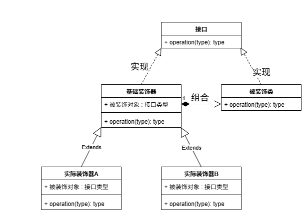

FilterInputStream、FilterOutputStream作为装饰器模式的基础装饰器，持有被装饰的流对象，其所有方法都是委托给被装饰的对象，例如
- ps：FilterReader、FilterWriter确实存在，但是很少有类继承它们，BufferedWriter和BuffferedReader都是直接继承Writer、Reader
```JAVA
public class FilterInputStream extends InputStream {
    // 关键字段：被装饰的底层流
    protected volatile InputStream in;
    
    // 构造器：接受被装饰的流
    protected FilterInputStream(InputStream in) {
        this.in = in;
    }
    
    // 所有方法默认委托给底层流
    public int read() throws IOException {
        return in.read();  // 简单委托
    }
    
    // 其他方法如skip、available、close等都委托给in
}

```

基于FilterInputStream的装饰器：
- BufferedInputStream ：添加缓冲
- DataInputStream ：读取Java基本类型
- PushbackInputStream ：提供unread功能
- InflaterInputStream ：解压缩

基于FilterOutputStream的装饰器：
- BufferedOutputStream ：添加缓冲
- DataOutputStream ：写入Java基本类型
- PrintStream ：格式化输出
- DeflaterOutputStream ：压缩

```JAVA
// 构建一个复杂的I/O处理链
try (InputStream input = new BufferedInputStream(  // 缓冲
                         new ProgressMonitorInputStream(  // 进度监控
                         new DigestInputStream(  // 摘要计算
                         new FileInputStream("file.txt"),  // 基础文件流
                         MessageDigest.getInstance("SHA-256")),
                         fileSize),
                         8192)) {
    // 使用这个流会自动获得缓冲、进度监控、摘要计算功能
}

// 哲学：每个装饰器只关注单一功能，通过组合实现复杂功能
```
#### 缓冲流
##### 字节缓冲流

BufferedInputStream继承FilterInputStream持有InputStream对象in，in是被装饰的对象
- pos：下一个要读取的元素
- count：有效数据结束位置
- 缓冲区惰性加载，按需填充
  - 缓冲区状态示例：已读取：A, B，可读取：C, D, E 
```TEXT

[ A | B | C | D | E | _ | _ | _ ]  // buf数组
  0   1   2   3   4   5   6   7    // 数组索引
  ↑       ↑           ↑
 pos=0  pos=2       count=5   // 有效数据结束位置


```

- 其中，fill()会调用被装饰对象的抽象read方法，将缓冲区填满

- `byte & 0xFF` 
  - byte 类型通常被用于存储二进制数据，其取值范围为 -128 到 127，如果我们希望得到的是一个无符号的 byte 值，就需要使用 byte & 0xFF 来进行转换。
```JAVA
public class BufferedInputStream extends FilterInputStream {
    private static int DEFAULT_BUFFER_SIZE = 8192;
    protected volatile byte buf[];
    protected int count;
    protected int pos;

    public synchronized int read() throws IOException {
        if (pos >= count) {     // 如果当前位置已经到达缓冲区末尾
            fill();             // 填充缓冲区
            if (pos >= count)   // 如果填充后仍然到达缓冲区末尾，说明已经读取完毕
                return -1;      // 返回 -1 表示已经读取完毕
        }
        return getBufIfOpen()[pos++] & 0xff; // 返回当前位置的字节，并将位置加 1
    }
}
```


BufferedOutputStream 继承FilterOutputStream持有OutputStream对象out，out是被装饰的对象
- 检查写入的字节数是否大于等于缓冲区长度，如果是，则先将缓冲区中的数据刷新到磁盘中，然后直接将数据写入输出流。这样做是为了避免缓冲流级联时的问题，即缓冲区的大小不足以容纳写入的数据时，可能会引发级联刷新，导致效率降低
  - 级联问题（Cascade Problem）是指在一组缓冲流（Buffered Stream）中，由于缓冲区的大小不足以容纳要写入的数据，导致数据被分割成多个部分，并分别写入到不同的缓冲区中，最终需要逐个刷新缓冲区，从而导致性能下降的问题
- 其次，如果写入的字节数小于缓冲区长度，则检查缓冲区中剩余的空间是否足够容纳要写入的字节数，如果不够，则先将缓冲区中的数据刷新到磁盘中。然后，使用 System.arraycopy() 方法将要写入的数据拷贝到缓冲区中，并更新计数器 count。
- 最后，如果写入的字节数小于缓冲区长度且缓冲区中还有剩余空间，则直接将要写入的数据拷贝到缓冲区中，并更新计数器 count。
- 也就是说，只有当 buf 写满了，才会 flush，将数据刷到磁盘，默认一次刷 8192 个字节。

```JAVA
public class BufferedOutputStream extends FilterOutputStream {
    protected byte buf[];

    protected int count;

    public synchronized void write(byte b[], int off, int len) throws IOException {
        if (len >= buf.length) {    // 如果写入的字节数大于等于缓冲区长度
            /* 如果请求的长度超过了输出缓冲区的大小，
            先刷新缓冲区，然后直接将数据写入。
            这样可以避免缓冲流级联时的问题。*/
            flushBuffer();          // 先刷新缓冲区
            out.write(b, off, len); // 直接将数据写入输出流
            return;
        }
        if (len > buf.length - count) { // 如果写入的字节数大于空余空间
            flushBuffer();              // 先刷新缓冲区
        }
        System.arraycopy(b, off, buf, count, len); // 将数据拷贝到缓冲区中
        count += len;                             // 更新计数器
    }
}

```


##### 字符缓冲流

- BufferedReader：String readLine(): 读一行数据，读取到最后返回 null
- BufferedWriter：newLine(): 换行，由系统定义换行符。
```JAVA
// 创建map集合,保存文本数据,键为序号,值为文字
HashMap<String, String> lineMap = new HashMap<>();

// 创建流对象  源
BufferedReader br = new BufferedReader(new FileReader("logs/test.log"));
//目标
BufferedWriter bw = new BufferedWriter(new FileWriter("logs/test1.txt"));

// 读取数据
String line;
while ((line = br.readLine())!=null) {
    // 解析文本
    if (line.isEmpty()) {
        continue;
    }
    String[] split = line.split(Pattern.quote("."));
    // 保存到集合
    lineMap.put(split[0], split[1]);
}
// 释放资源
br.close();

// 遍历map集合
for (int i = 1; i <= lineMap.size(); i++) {
    String key = String.valueOf(i);
    // 获取map中文本
    String value = lineMap.get(key);
    // 写出拼接文本
    bw.write(key+"."+value);
    // 写出换行
    bw.newLine();
}
// 释放资源
bw.close();
```
#### 打印流：PrintStream 和 PrintWriter

`PrintStream` 是 `OutputStream` 的子类，`PrintWriter` 是 `Writer` 的子类，一个字节流，一个是字符流。


`System.out`返回`PrintStream`对象 
- `print()`：输出一个对象的字符串表示形式。
- `println()`：输出一个对象的字符串表示形式，并在末尾添加一个换行符。
- `printf()`：使用指定的格式字符串和参数输出格式化的字符串。


printf方法
- format：格式化字符串，包含普通字符和转换说明符
- 转换说明符
  - %s：输出一个字符串。
  - %d 或 %i：输出一个十进制整数。
  - %x 或 %X：输出一个十六进制整数，%x 输出小写字母，%X 输出大写字母。
  - %f 或 %F：输出一个浮点数。
  - %e 或 %E：输出一个科学计数法表示的浮点数，%e 输出小写字母 e，%E 输出大写字母 E。
  - %g 或 %G：输出一个浮点数，自动选择 %f 或 %e/%E 格式输出。
  - %c：输出一个字符。
  - %b：输出一个布尔值。
  - %h：输出一个哈希码（16进制）。
  - %n：换行符。
- 修饰符
  - 宽度修饰符：用数字指定输出的最小宽度，如果输出的数据不足指定宽度，则在左侧或右侧填充空格或零。
  - 精度修饰符：用点号（.）和数字指定浮点数或字符串的精度，对于浮点数，指定小数点后的位数，对于字符串，指定输出的字符数。
  - 对齐修饰符：用减号（-）或零号（0）指定输出的对齐方式，减号表示左对齐，零号表示右对齐并填充零。
- args：要输出的参数列表
```JAVA
public PrintStream printf(String format, Object... args);
```
#### 序列流


序列流：将 Java 对象序列化和反序列化的流
- 序列化：将一个对象转换为一个字节序列（包含对象的数据、对象的类型和对象中存储的属性等信息），以便在网络上传输或保存到文件中，或者在程序之间传递
- 反序列化：将一个字节序列转换为一个对象，以便在程序中使用

只有实现了 Serializable 接口的对象才能被序列化


##### ObjectOutputStream

**序列化：将一个对象序列化后输出到指定流out中**，该对象必须实现了`java.io.Serializable` 接口
```JAVA
public class ObjectOutputStream extends OutputStream implements ObjectOutput{
    public ObjectOutputStream(OutputStream out)

    //将对象序列化后写入到流中
    public final void writeObject(Object obj) throws IOException {}
}
```
##### ObjectInputStream

**反序列化：从指定的文件输入流中读取对象并反序列化**
- 返回Object，需要强制转换
```JAVA
public class ObjectInputStream extends InputStream  implements ObjectInput{
    public ObjectInputStream(InputStream in)
    public final Object readObject()

}
```

##### Kryo

**实际开发中，很少使用 JDK 自带的序列化和反序列化**
- 可移植性差：Java 特有的，无法跨语言进行序列化和反序列化。
- 性能差：序列化后的字节体积大，增加了传输/保存成本。
- 安全问题：攻击者可以通过构造恶意数据来实现远程代码执行，从而对系统造成严重的安全威胁


Kryo 是一个优秀的 Java 序列化和反序列化库，具有高性能、高效率和易于使用和扩展等特点，有效地解决了 JDK 自带的序列化机制的痛点。

```XML
<!-- 引入 Kryo 序列化工具 -->
<dependency>
     <groupId>com.esotericsoftware</groupId>
     <artifactId>kryo</artifactId>
     <version>5.4.0</version>
</dependency>
```

**创建一个 Kryo 对象，并使用 register() 方法将对象进行注册。然后，使用 writeObject() 方法将 Java 对象序列化为二进制流，再使用 readObject() 方法将二进制流反序列化为 Java 对象。最后，输出反序列化后的 Java 对象。**

```JAVA
public class KryoDemo {
    public static void main(String[] args) throws FileNotFoundException {
        Kryo kryo = new Kryo();
        kryo.register(Target.class);

        Target object = new Target("沉默王二", 123);

        Output output = new Output(new FileOutputStream("logs/kryo.bin"));
        kryo.writeObject(output, object);
        output.close();

        Input input = new Input(new FileInputStream("logs/kryo.bin"));
        Target object2 = kryo.readObject(input, Target.class);
        System.out.println(object2);
        input.close();
    }
}

class Target {
    private String name;
    private int age;

    public Target() {
    }

    public Target(String name, int age) {
        this.name = name;
        this.age = age;
    }

    public String getName() {
        return name;
    }

    public void setName(String name) {
        this.name = name;
    }

    public int getAge() {
        return age;
    }

    public void setAge(int age) {
        this.age = age;
    }

    @Override
    public String toString() {
        return "Target{" +
                "name='" + name + '\'' +
                ", age=" + age +
                '}';
    }
}
```
##### Serializable、 Externalizable 接口与transient关键字


Serializable和Externalizable接口
- 重写具体的 writeExternal() 和 readExternal() 方法，控制序列化，可以在序列化和反序列化过程中对对象进行自定义的处理，如对一些敏感信息进行加密和解密。
- 
```JAVA
public interface Serializable {
}

public interface Externalizable extends java.io.Serializable {
   
    void writeExternal(ObjectOutput out) throws IOException;
    void readExternal(ObjectInput in) throws IOException, ClassNotFoundException;
}

@Override
public void writeExternal(ObjectOutput out) throws IOException {
	out.writeObject(name);
	out.writeInt(age);
}

@Override
public void readExternal(ObjectInput in) throws IOException, ClassNotFoundException {
	name = (String) in.readObject();
	age = in.readInt();
}
```


**序列化时会执行下述代码，依次判断是否为字符串、数组、枚举、Serializable类型的对象，如果都不是则抛出 NotSerializableException 异常**

```JAVA
// 判断对象是否为字符串类型，如果是，则调用 writeString 方法进行序列化
if (obj instanceof String) {
    writeString((String) obj, unshared);
}
// 判断对象是否为数组类型，如果是，则调用 writeArray 方法进行序列化
else if (cl.isArray()) {
    writeArray(obj, desc, unshared);
}
// 判断对象是否为枚举类型，如果是，则调用 writeEnum 方法进行序列化
else if (obj instanceof Enum) {
    writeEnum((Enum<?>) obj, desc, unshared);
}
// 判断对象是否为可序列化类型，如果是，则调用 writeOrdinaryObject 方法进行序列化
else if (obj instanceof Serializable) {
    writeOrdinaryObject(obj, desc, unshared);
}
// 如果对象不能被序列化，则抛出 NotSerializableException 异常
else {
if (extendedDebugInfo) {
    throw new NotSerializableException(
        cl.getName() + "\n" + debugInfoStack.toString());
} else {
    throw new NotSerializableException(cl.getName());
}
}
```


**static 和 transient 修饰的字段是不会被序列化的。**
- static是类状态，序列化保存对象状态
- transient的意思是暂时的，可以用于保护敏感信息
- 下述代码中`Modifier.STATIC | Modifier.TRANSIENT`限制了static 和 transient 修饰的字段是不会被序列化
```JAVA
private static ObjectStreamField[] getDefaultSerialFields(Class<?> cl) {
    // 获取该类中声明的所有字段
    Field[] clFields = cl.getDeclaredFields();
    ArrayList<ObjectStreamField> list = new ArrayList<>();
    int mask = Modifier.STATIC | Modifier.TRANSIENT;

    // 遍历所有字段，将非 static 和 transient 的字段添加到 list 中
    for (int i = 0; i < clFields.length; i++) {
        Field field = clFields[i];
        int mods = field.getModifiers();
        if ((mods & mask) == 0) {
            // 根据字段名、字段类型和字段是否可序列化创建一个 ObjectStreamField 对象
            ObjectStreamField osf = new ObjectStreamField(field.getName(), field.getType(), !Serializable.class.isAssignableFrom(cl));
            list.add(osf);
        }
    }

    int size = list.size();
    // 如果 list 为空，则返回一个空的 ObjectStreamField 数组，否则将 list 转换为 ObjectStreamField 数组并返回
    return (size == 0) ? NO_FIELDS :
        list.toArray(new ObjectStreamField[size]);
}
```

**被 transient 关键字修饰的成员变量在反序列化时会被自动初始化为默认值**，例如基本数据类型为 0，引用类型为 null。
- 一个静态变量（static关键字修饰）不管是否被 transient 修饰，均不能被序列化
- 但是如果是Externalizable接口，不仅可以序列化transient字段，还能对其加密
##### 序列化 ID

在反序列化时，Java 虚拟机会把字节流中的 serialVersionUID 与被序列化类中的 serialVersionUID 进行比较，如果相同则可以进行反序列化，否则就会抛出序列化版本不一致的异常。


如果实体里面没有显示的定义一个serialVersionUID ，Java序列化机制会根据编译的class自动生成一个serialVersionUID，而实体变动会导致这个序列化ID同步改变，可能会导致反序列化失败
- 因此当一个类实现了 Serializable 接口后，IDE 就会提醒该类最好产生一个序列化 ID
- 如果没有特殊需求，采用默认的序列化 ID（1L）就可以

#### 基础数据类型流


**DataInputStream**

```JAVA
import java.io.*;

public class DataInputStreamDemo {
    public static void main(String[] args) {
        String filename = "data.bin";
        
        try (DataInputStream dis = new DataInputStream(
                new BufferedInputStream(
                    new FileInputStream(filename)))) {
            
            // 必须按照写入顺序读取
            boolean bool = dis.readBoolean();
            byte b = dis.readByte();
            short s = dis.readShort();
            int i = dis.readInt();
            long l = dis.readLong();
            float f = dis.readFloat();
            double d = dis.readDouble();
            char c = dis.readChar();
            String str = dis.readUTF();
            
            System.out.printf("读取结果: %b, %d, %d, %d, %d, %.2f, %.2f, %c, %s%n",
                bool, b, s, i, l, f, d, c, str);
                
        } catch (EOFException e) {
            System.out.println("已读取到文件末尾");
        } catch (IOException e) {
            e.printStackTrace();
        }
    }
}
```
**DataOutputStream**

```JAVA
import java.io.*;

public class DataOutputStreamDemo {
    public static void main(String[] args) throws IOException {
        // 创建DataOutputStream（通常包装缓冲流和文件流）
        try (DataOutputStream dos = new DataOutputStream(
                new BufferedOutputStream(
                    new FileOutputStream("data.bin")))) {
            
            // 写入各种基本数据类型
            dos.writeBoolean(true);          // 1字节: 0x01
            dos.writeByte(65);               // 1字节: 0x41 ('A')
            dos.writeShort(1024);            // 2字节: 0x04 0x00
            dos.writeInt(123456789);         // 4字节: 0x07 0x5B 0xCD 0x15
            dos.writeLong(9876543210L);      // 8字节
            dos.writeFloat(3.14159f);        // 4字节（IEEE 754单精度）
            dos.writeDouble(2.71828);        // 8字节（IEEE 754双精度）
            dos.writeChar('中');             // 2字节（UTF-16编码）
            dos.writeUTF("Hello, 世界");     // 变长：长度前缀 + UTF-8编码
            
            System.out.println("数据写入完成");
        }
    }
}
```
#### 行号跟踪

#### 回退读取

#### 校验和

## Java Socket

**Socket、ServerSocket套接字**允许：**应用程序通过BIO体系，向Socket套接字读写数据，与网络中其他主机的应用程序通信**
- **Socket=IP+端口**
- **java.net.ServerSocket**：**监听并接受客户端的连接请求**
- **java.net.Socket**：**与服务器建立连接和进行数据通信**

**Socket、ServerSocket套接字**委托给SocketImpl实现跨平台


**Socket底层使用BIO体系**，**几乎所有涉及网络I/O的核心方法默认都是阻塞的**
- `new Socket("bbs.newsmth.net", 23)`可能发生阻塞的关键步骤：**DNS域名解析、TCP三次握手**
- `void setSoTimeout(int timeout)`为所有同步阻塞方法设置超时时间，例如`void setSoTimeout(int timeout)`


`ServerSocket`：监听指定端口等待连接请求
- 端口号0-1023是系统预留，使用除此之外的端口号


**DatagramSocket**是UDP的核心实现
- **每个数据包DatagramPacket携带目标地址（目标地址 + 端口）**
- DatagramSocket提供`send(DatagramPacket p)` 、`receive(DatagramPacket p)`核心API
- 客户端不指定端口，由系统分配；服务端需指定端口；
- **每一个DatagramSocket在内核中都有一个接收缓冲区**，如果缓冲区满，新到的数据报会被静默丢弃
## 异常

### 异常体系

**异常**
- 中断程序正常执行流程的一个不确定的事件

**异常处理机制**
- 通过捕获异常，改变程序执行流程，而非中断程序，并且向用户提供友好的提示信息

**Error**
- 系统级严重错误。程序一般无法恢复，应直接终止

**Exception**
- 可控的问题，程序预期内可能发生的情况。应被捕获并妥善处理，使程序恢复运行。

**checked受检异常**
- 在源代码中必须使用 `try-catch` 捕获或在方法上用 `throws` 声明抛出
- 例如`IOExceptio`n, `SQLException`, `ClassNotFoundException`

**unchecked异常**
- **RuntimeException 及其子类**
- **因为是运行时出现，所以不要捕获任何RuntimeException及其子类异常**
- 例如如 NullPointerException, ArrayIndexOutOfBoundsException

**关键字throw**
- 在方法体内部主动抛出一个异常对象；`throw new ArithmeticException("除数不能为零");`

**关键字throws**
- 在方法签名末尾声明方法可能抛出的异常类型`public void readFile() throws IOException { ... }`


**ClassNotFoundException**异常和**NoClassDefFoundError**错误
- ClassNotFoundException：动态加载 Class 对象的时候找不到对应的类时抛出该异常；原因可能是要加载的类不存在或者类名写错了
- NoClassDefFoundError：程序在编译时可以找到所依赖的类，但是在运行时找不到指定的类文件，导致抛出该错误；原因可能是 jar 包缺失或者调用了初始化失败的类。

**try-catch-finally**
- try：包裹可能发生异常的代码。
- catch：捕获并处理特定类型的异常
  - 一个try块后可以有多个catch块，子类异常catch块必须写在父类异常catch块前面，否则会导致编译错误
  - 两catch块执行相同的异常处理逻辑时，可以使用|隔开异常然后放一起

```JAVA
static void test() {
    int num1, num2;
    try {
        num1 = 0;
        num2 = 62 / num1;
        System.out.println(num2);
        System.out.println("try 块的最后一句");
    } catch (ArithmeticException e) {
        // 算术运算发生时跳转到这里
        System.out.println("除数不能为零");
    } catch (Exception e) {
        // 通用型的异常意味着可以捕获所有的异常，它应该放在最后面，
        System.out.println("异常发生了");
    }
    System.out.println("try-catch 之外的代码.");
}

static void test1 () {
    try{
        int arr[]=new int[7];
        arr[9]=30/1;
        System.out.println("try 块的最后");
    } catch(ArithmeticException | ArrayIndexOutOfBoundsException e){
        System.out.println("除数必须是 0");
    }
    System.out.println("try-catch 之外");
}


```
- finally：**无论是否发生异常都会执行的代码块**，传统上常用于关闭资源
  - finally 块前面必须有 try 块，编译器不允许finally 块单独使用
  - finally 块不是必选项，有 try 块的时候不一定要有 finally 块。
  - 如果 finally 块中的代码可能会发生异常，也应该使用 try-catch 进行包裹。
  - 即便是 try 块中执行了 return、break、continue 这些跳转语句，finally 块也会被执行。
- 不执行finally块的情况
  - 遇到了死循环。
  - 执行System. exit()：终止当前虚拟机进程

### try with resources


`try-catch-finally` 在处理资源关闭时主要有两大问题：
1.  **代码臃肿**：必须在 `finally` 块中显式关闭资源，并嵌套 `try-catch`。
2.  **异常信息丢失**：如果 `try` 块的`readLine()`方法和 `finally` 块的 `close()` 方法都抛出异常，那么 `finally` 中抛出的异常会 **“覆盖”** `try` 块中的原始异常，报错将说明该IOException是close方法产生的，即使`readLine()`也报错了，但是不会报告。
```JAVA
public class TrycatchfinallyDecoder {
    public static void main(String[] args) {
        BufferedReader br = null;
        try {
            String path = TrycatchfinallyDecoder.class.getResource("/牛逼.txt").getFile();
            String decodePath = URLDecoder.decode(path,"utf-8");
            br = new BufferedReader(new FileReader(decodePath));

            String str = null;
            while ((str =br.readLine()) != null) {
                System.out.println(str);
            }
        } catch (IOException e) {
            e.printStackTrace();
        } finally {
            if (br != null) {
                try {
                    br.close();
                } catch (IOException e) {
                    e.printStackTrace();
                }
            }
        }
    }
}
```


`try-with-resources`
- 在 `try` 关键字后的 `()` 中声明并初始化实现了 **`AutoCloseable`** 接口的资源；多个资源使用`;` 隔开
  - 自定义资源：实现 `AutoCloseable` 接口并重写 `close()` 方法
- 无需手动调用close()，在try代码块结束后，会自动调用`close()` 方法
- 如果 `try` 块和自动关闭都抛出异常，**`try`块中的原始异常会被抛出**，而关闭时产生的异常会被`addSuppressed()`方法记录为“被抑制的异常”，附加在原始异常的堆栈信息中，可通过 `getSuppressed()` 获取，不会丢失。
  - 当一个异常被抛出的时候，可能有其他异常因为该异常而被抑制住，从而无法正常抛出。这时可以通过 addSuppressed() 方法把这些被抑制的方法记录下来，然后被抑制的异常就会出现在抛出的异常的堆栈信息中，可以通过 getSuppressed() 方法来获取这些异常

**AutoCloseable**和**Closeable**接口
- **Closeable**接口继承自**AutoCloseable**接口，只能抛出IOException，专用于I/O流资源，实现类重写close()时，只能抛出IOException或更具体的异常
- **AutoCloseable**接口，可以抛出任何Exception，适配`try-with-resources`语句
### 实践经验

| 分类 | 实践编号 | 最佳实践要点 (严格遵循原文) |
| :--- | :--- | :--- |
| **捕获 (Catch)** | 01 | **尽量不要捕获 RuntimeException**：比如 `NullPointerException`、`IndexOutOfBoundsException` 等等，应该用预检查的方式来规避。 |
| | 03 | **不要捕获 Throwable**：`Throwable` 是 exception 和 error 的父类，如果在 catch 子句中捕获了 `Throwable`，很可能把超出程序处理能力之外的错误也捕获了。 |
| | 08 | **捕获具体的子类而不是捕获 Exception 类**：如果捕获 `Exception` 类型的异常，可能会捕获到一些不应该被处理的异常，从而导致程序难以识别和定位异常。 |
| **资源与清理 (Resource & Finally)** | 02 | **尽量使用 try-with-resource 来关闭资源**：当需要关闭资源时，尽量不要使用 try-catch-finally，禁止在 try 块中直接关闭资源。 |
| | 06 | **不要在 finally 块中使用 return**：try 块中的 return 语句执行成功后，并不会马上返回，而是继续执行 finally 块中的语句，如果 finally 块中也存在 return 语句，那么 try 块中的 return 就将被覆盖。 |
| | 10 | **finally 块中不要抛出任何异常**：如果在 finally 块中抛出异常，可能会导致原始异常被掩盖。 |
| | 12 | **对于不打算处理的异常，直接使用 try-finally，不用 catch**：如果 method1 正在访问 Method 2，而 Method 2 抛出一些你不想在 Method 1 中处理的异常，但是仍然希望在发生异常时进行一些清理，可以直接在 finally 块中进行清理，不要使用 catch 块。 |
| **异常信息处理 (Exception Info)** | 04 | **不要省略异常信息的记录**：很多时候，由于疏忽大意，我们很容易捕获了异常却没有记录异常信息，导致程序上线后真的出现了问题却没有记录可查。 |
| | 05 | **不要记录了异常又抛出了异常**：这纯属画蛇添足，并且容易造成错误信息的混乱。 |
| | 09 | **自定义异常时不要丢失堆栈跟踪**：例如 `throw new MyServiceException("Some information: " + e.getMessage());` 破坏了原始异常的堆栈跟踪。 |
| | 11 | **不要在生产环境中使用printStackTrace()**：在生产环境中，应该使用日志系统来记录异常信息，例如 log4j、slf4j、logback 等。 |
| | 17 | **一个异常只能包含在一个日志中**：不要分散记录，应该将所有相关信息尽可能地传递给异常，如 `LOGGER.debug("Using cache sector A, using retry sector B");` |
| | 18 | **将所有相关信息尽可能地传递给异常**：有用的异常消息和堆栈跟踪非常重要，应该尽量把 String message, Throwable cause 异常信息和堆栈都输出。 |
| **抛出 (Throw)** | 07 | **抛出具体定义的检查性异常而不是 Exception**：声明的方法应该尽可能抛出具体的检查性异常，例如应该显式地声明抛出 `SQLException` 而不是 `Exception` 类型的异常。 |
| | 13 | **记住早 throw 晚 catch 原则**：在代码中尽可能早地抛出异常，以便在异常发生时能够及时地处理异常。同时，在 catch 块中尽可能晚地捕获异常，以便在捕获异常时能够获得更多的上下文信息。 |
| | 14 | **只抛出和方法相关的异常**：相关性对于保持代码的整洁非常重要。一种尝试读取文件的方法，如果抛出 `NullPointerException`，那么它不会给用户提供有价值的信息。 |
| **编码理念与设计 (Coding Principle)** | 15 | **切勿在代码中使用异常来进行流程控制**：在代码中使用异常来进行流程控制会导致代码的可读性、可维护性和性能出现问题。 |
| | 16 | **尽早验证用户输入以在请求处理的早期捕获异常**：应该首先验证所有内容，然后再进行数据库更新，以保证数据一致性。例如先 `validate` 再 `insert`。 |
| | 19 | **终止掉被中断线程**：`InterruptedException` 提示应该停止程序正在做的事情，应该尽最大努力完成正在做的事情，并完成当前执行的线程，而不是忽略它。 |
| | 20 | **对于重复的 try-catch，使用模板方法**：类似的 catch 块是无用的，只会增加代码的重复性，针对这样的问题可以使用模板方法。 |


## 常用工具类

### Scanner：处理用户输入


`Scanner` ：常用于**读取控制台的用户输入**，让程序实现交互功能；同时，也能用于**扫描和解析文件内容**。


**扫描控制台输入**`Scanner scanner = new Scanner(System.in);` 
- `nextLine()`：读取一行输入（以回车结束），返回 `String`。
- **`nextInt()` / `nextDouble()`**：读取下一个整数或浮点数。如果输入类型不匹配，会抛出 `InputMismatchException`。
- **`next()`**：读取由默认分隔符（空格/换行）隔开的下一个“单词”。
- **`hasNextLine()` / `hasNextInt()` 等**：在读取前进行判断，避免异常。

> 混合使用 `nextLine()` 和其他 `nextXxx()` 方法时，要注意处理换行符，否则可能会“吞掉”后续输入。通常在 `nextInt()` 后调用一次 `nextLine()` 来消耗残留的换行符。

**扫描文件内容**
通过传递 `File` 对象给 `Scanner` 构造函数，可以方便地读取文件。
- **逐行读取**：配合 `while (scanner.hasNextLine())` 循环和 `nextLine()` 方法。
- **读取整个文件**：使用 `scanner.useDelimiter("\\Z")` 将分隔符设置为文件结束符，然后通过 `next()` 一次读取全部内容。

**查找字符串匹配项**
`Scanner` 提供了基于正则表达式的查找功能，这在扫描文本时非常有用。
- **`findInLine(String pattern)`**：在**当前行**中查找与模式匹配的下一个子字符串。
- **`findWithinHorizon(String pattern, int horizon)`**：在指定的**搜索范围（字符数）**内查找。若 `horizon` 设为 `0`，则表示搜索无边界限制。
- 这两个方法都**会忽略默认的分隔符**，直接按模式搜索，找到则返回匹配的字符串，否则返回 `null`。

**其他重要方法**
- **`useDelimiter(String pattern)`**：自定义分隔符（默认为空格/换行），改变 `next()` 等方法的切分逻辑。
- **`close()`**：使用完毕后关闭 `Scanner` 对象，释放底层资源（如文件流）。


### Arrays工具类
1.  **创建与复制数组**
    *   `copyOf(T[] original, int newLength)`：复制数组，可截断或用`null`填充以达到指定长度。
    *   `copyOfRange(T[] original, int from, int to)`：复制数组的指定范围。
    *   `fill(T[] a, T val)`：将数组的所有元素填充为指定值。

2.  **比较数组**
    *   `equals(T[] a, T[] a2)`：严谨地比较两个数组是否“深度相等”（长度相同且对应元素一致）。
    *   `hashCode(T[] a)`：计算数组的哈希码。可用于快速预判数组是否相等，但`equals`方法更严谨。

3.  **排序与查找**
    *   `sort(T[] a)`：对数组进行升序排序（基本类型用双轴快排，引用类型用TimSort）。
    *   `binarySearch(T[] a, T key)`：**必须在已排序的数组上使用**，进行高效的二分查找。也支持传入比较器进行模糊查找（如忽略大小写）。

4.  **转换与输出**
    *   `toString(T[] a)`：将数组转换为美观的字符串格式（如 `[a, b, c]`），是打印数组内容的最佳方式。
    *   `asList(T... a)`：将数组转换为一个**长度固定**的List视图。如需可变List，需将其作为参数新建一个`ArrayList`：`new ArrayList<>(Arrays.asList(...))`。
    *   `stream(T[] a)`：将数组转换为`Stream`流，以便使用Java 8强大的流式API进行处理。

5.  **Java 8 新增高级功能**
    *   `setAll(T[] array, IntFunction<T> generator)`：通过函数式编程，用生成的值填充数组（例如 `i -> i * 10`）。
    *   `parallelPrefix(T[] array, BinaryOperator<T> op)`：用函数式编程进行“并行前缀计算”，将前一个元素的操作结果累积到后一个元素上（例如用于累加）。

### Objects：操作Java对象

### Collections：操作集合对象

### Collectors：收集器


### StringUtils工具类

```XML
<dependency>
    <groupId>org.apache.commons</groupId>
    <artifactId>commons-lang3</artifactId>
    <version>3.12.0</version>
</dependency>
```

### Hutool工具类库

```XML
<dependency>
    <groupId>cn.hutool</groupId>
    <artifactId>hutool-all</artifactId>
    <version>5.4.3</version>
</dependency>
```

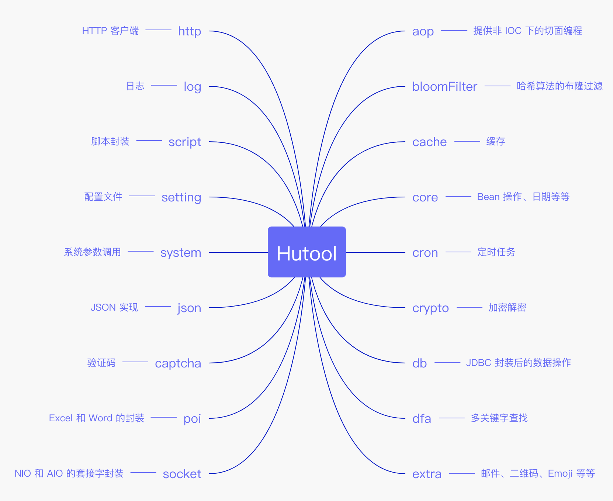
### Guava工具库

## 反射

反射的设计本质是，**运行时才能确定要动态操作哪些`Class`、`Method`等元数据对象的能力**

`java.lang.Class`是所有反射 API 的入口，部分API示例：

```java
//获取Class对象
Class clazz = Class.forName("com.itwanger.s39.Writer");

//获取 Constructor 对象
Constructor constructor = clazz.getConstructor();

//创建实例
Object object = constructor.newInstance();

//获取 Method 对象
Method setNameMethod = clazz.getMethod("setName", String.class);
Method getNameMethod = clazz.getMethod("getName");

//调用方法
setNameMethod.invoke(object, "沉默王二");
getNameMethod.invoke(object);
```

反射通过`Method`对象的`invoke()`完成方法调用
-  MethodAccessor 接口有三个实现类，其中的 MethodAccessorImpl 是一个抽象类，另外两个具体的实现类继承了这个抽象类。
   -  NativeMethodAccessorImpl：**通过本地方法来实现反射调用**；
   -  DelegatingMethodAccessorImpl：**通过委派模式来实现反射调用**；
- 第一次反射调用会生成一个委派实现 DelegatingMethodAccessorImpl，它在生成的时候会传递一个本地实现 NativeMethodAccessorImpl。也就是说，invoke() 方法在执行的时候，会先调用 DelegatingMethodAccessorImpl，然后调用 NativeMethodAccessorImpl，最后再调用实际的方法。
- **为什么采用双重委派而不是直接调用现成的本地实现**
  - **为了能够在本地实现和动态实现之间切换**。
  - **动态实现是另外一种反射调用机制，它是通过生成字节码的形式来实现的**。如果反射调用的次数比较多，动态实现的效率就会更高，因为本地实现需要经过 Java 到 C/C++ 再到 Java 之间的切换过程，而动态实现不需要；但如果反射调用的次数比较少，反而本地实现更快一些
  - 默认的临界点是15次，可以通过 -Dsun.reflect.inflationThreshold 参数类调整
```JAVA
public Object invoke(Object obj, Object... args)
        throws IllegalAccessException, IllegalArgumentException,
        InvocationTargetException {
    // 如果方法不允许被覆盖，进行权限检查
    if (!override) {
        if (!Reflection.quickCheckMemberAccess(clazz, modifiers)) {
            Class<?> caller = Reflection.getCallerClass();
            // 检查调用者是`否具有访问权限
            checkAccess(caller, clazz, obj, modifiers);
        }
    }
    // 获取方法访问器（从 volatile 变量中读取）
    MethodAccessor ma = methodAccessor;
    if (ma == null) {
        // 如果访问器为空，尝试获取方法访问器
        ma = acquireMethodAccessor();
    }
    // 使用方法访问器调用方法，并返回结果
    return ma.invoke(obj, args);
}
```
## 注解

**注解是一种类型**，如同`class、interface`；**核心作用是为类、方法、字段添加元数据**；仅添加元数据不会有任何影响，是**与注解配套的处理器在执行代码**

**定义注解**：通过元数据限定注解添加元数据的时间范围和有效目标
- `@Retention`：定义注解的生命周期
  - `SOURCE`：仅存于源码，由编译器使用，如`@Override`
  - `CLASS`：存于字节码，但运行时不可见
  - `RUNTIME`：运行时持久化，可通过反射读取元数据或字段值
- `@Target`：定义注解可应用于哪些程序元素，TYPE、FIELD、METHOD、CONSTRUCTOR......

```JAVA
@Retention(RetentionPolicy.RUNTIME) // 关键：运行时保留
@Target(ElementType.FIELD) // 关键：仅用于字段
public @interface JsonField {
    // 定义注解参数，使用“方法”形式声明
    String value() default ""; // 参数名value允许使用时省略
}

```
- **使用注解**：声明式使用注解，分离业务代码和元数据处理代码
```JAVA
public class Writer {
    private int age; // 未标注，不序列化

    @JsonField("writerName") // 标注，并指定序列化后的key为"writerName"
    private String name;

    @JsonField // 标注，使用默认字段名作为key
    private String bookName;
    // ... 构造方法等
}
```

- **注解的处理器**

```JAVA
//将Java对象转换为JSON格式字符串
public class JsonSerializer {
    
    // 将任意对象序列化为JSON字符串
    // 抛出：IllegalAccessException - 如果无法访问对象的字段
    public static String serialize(Object object) throws IllegalAccessException {
        // 获取对象的Class对象，用于反射操作
        Class<?> objectClass = object.getClass();
        
        // 创建HashMap存储键值对，key为JSON键名，value为字段值的字符串表示
        Map<String, String> jsonElements = new HashMap<>();
        
        // 遍历对象的所有字段（包括私有字段）
        for (Field field : objectClass.getDeclaredFields()) {
            // 设置字段可访问，即使是私有字段也能读取
            field.setAccessible(true);
            
            // 检查字段是否被@JsonField注解标记
            if (field.isAnnotationPresent(JsonField.class)) {
                // 将字段值放入map：key通过getSerializedKey方法获取，value强制转换为String
                jsonElements.put(getSerializedKey(field), (String) field.get(object));
            }
        }
        
        // 将map转换为JSON格式字符串并返回
        return toJsonString(jsonElements);
    }

    // 私有方法：获取字段序列化时的键名
    // 参数：field - 被@JsonField注解标记的字段
    // 返回：序列化时使用的键名字符串
    private static String getSerializedKey(Field field) {
        // 获取字段上的@JsonField注解的value值
        String annotationValue = field.getAnnotation(JsonField.class).value();
        
        // 判断注解的value是否为空（默认值为空字符串）
        if (annotationValue.isEmpty()) {
            // 如果注解value为空，则使用字段的原名作为键名
            return field.getName();
        } else {
            // 如果注解value不为空，则使用注解指定的值作为键名
            return annotationValue;
        }
    }

    // 私有方法：将Map转换为JSON格式字符串
    // 参数：jsonMap - 包含键值对的Map
    // 返回：格式化后的JSON字符串
    private static String toJsonString(Map<String, String> jsonMap) {
        // 使用Stream API处理Map中的每个键值对
        String elementsString = jsonMap.entrySet()
                .stream()  // 将entrySet转换为流
                // 将每个键值对转换为"key":"value"格式的字符串
                .map(entry -> "\"" + entry.getKey() + "\":\"" + entry.getValue() + "\"")
                // 用逗号连接所有键值对字符串
                .collect(Collectors.joining(","));
        
        // 在最外层添加花括号，形成完整的JSON对象
        return "{" + elementsString + "}";
    }
}
```


# 集合


## 集合框架

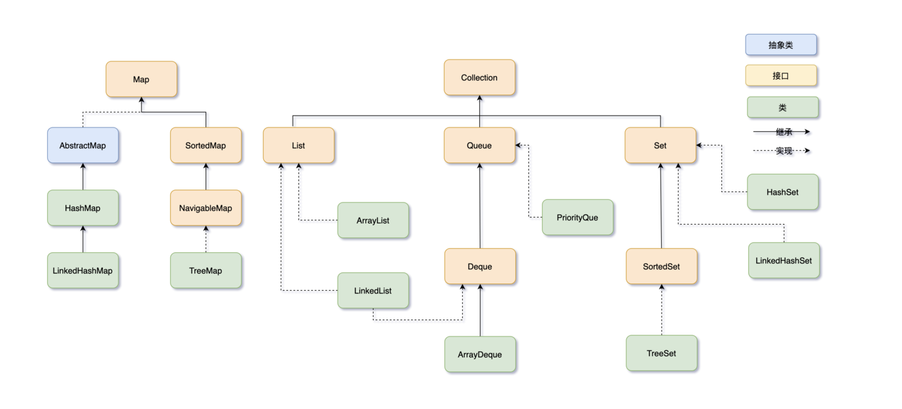

## List
### ArrayList

RandomAccess：标记接口，支持随机访问（通过索引访问）

```JAVA
public class ArrayList<E> extends AbstractList<E>
        implements List<E>, RandomAccess, Cloneable, java.io.Serializable 
{
    public E get(int index) {
        Objects.checkIndex(index, size);
        return elementData(index);
    }
}


```
#### 构造器

ArrayList提供三种构造器：无参构造器、指定初始容量的构造器、Collection 参数构造器

**无参构造器**
- **调用无参构造器时不会立即分配内存，而是延迟到第一次添加元素时；**
- **`DEFAULTCAPACITY_EMPTY_ELEMENTDATA`是静态常量，JVM中，由无参构造器构造的所有ArrayList对象，在未添加元素时，共享同一份DEFAULTCAPACITY_EMPTY_ELEMENTDATA，节约内存**
- **首次添加元素分配内存时，判断elementData是否指向DEFAULTCAPACITY_EMPTY_ELEMENTDATA，是就分配`Math.max(DEFAULT_CAPACITY, minCapacity)`大小的内存空间**
  - `DEFAULTCAPACITY`将10元素数组的扩容次数从5次（1-2-4-8-16）减少到1次（直接扩容到10）
```JAVA
transient Object[] elementData;

private static final int DEFAULT_CAPACITY = 10;

private static final Object[] DEFAULTCAPACITY_EMPTY_ELEMENTDATA = {};

public ArrayList() {
    this.elementData = DEFAULTCAPACITY_EMPTY_ELEMENTDATA;
}
```

**指定初始容量的构造器**
- 指定容量>0：**创建对象时就分配指定容量的内存**
- 指定容量=0：**EMPTY_ELEMENTDATA是静态常量，JVM中，所有容量指定为0的ArrayList对象，在未添加元素时，共享EMPTY_ELEMENTDATA**，与DEFAULTCAPACITY_EMPTY_ELEMENTDATA区分，后者将使用默认容量DEFAULT_CAPACITY
```JAVA
transient Object[] elementData;

private static final Object[] EMPTY_ELEMENTDATA = {};

public ArrayList(int initialCapacity) {
    if (initialCapacity > 0) {
        this.elementData = new Object[initialCapacity];
    } else if (initialCapacity == 0) {
        this.elementData = EMPTY_ELEMENTDATA;
    } else {
        throw new IllegalArgumentException("Illegal Capacity: "+
                                            initialCapacity);
    }
}
```

**Collection 参数构造器**
- 传入空集合时；指向`EMPTY_ELEMENTDATA`
- 传入非空集合时：将集合toArray，然后复制该数组赋值给elementData
- 该构造器使用如下API
  - `toArray()`：返回包含集合所有元素的数组，具体实现**可能返回副本或视图**，但是ArrayList总是返回副本
  - `Arrays.copyOf(a, size, Object[].class)`：第三个参数指定副本的数组类型
- 优化
  - 如果c是ArrayList，那么toArray()返回的是副本，就可以明确赋予elementData
  - c不是ArrayList时，toArray()可能返回副本或视图，此时应防御性编程，显式调用Arrays.copyOf
```JAVA
transient Object[] elementData;

public ArrayList(Collection<? extends E> c) {
    Object[] a = c.toArray();
    if ((size = a.length) != 0) {
        if (c.getClass() == ArrayList.class) {
            elementData = a;
        } else {
            elementData = Arrays.copyOf(a, size, Object[].class);
        }
    } else {
        // replace with empty array.
        elementData = EMPTY_ELEMENTDATA;
    }
}
```


#### modCount与fail-fast

modCount：**记录集合结构性修改的次数，实现fail-fast机制**
- **为什么在没添加元素之前对modCount自增？**
- **fail-fast**机制的核心思想是，**一旦发现问题，立即失败**，而不是继续执行产生更严重的错误，数据一致性比程序能继续运行更重要；在一致性被破坏前就停止运行
- 迭代器在遍历前，会设置检查点`expectedModCount`，通过集合API，而不是通过迭代器API结构性修改集合，会导致迭代器的modCount与集合的expectedModCount不一致，触发fail-fast，在成功添加元素之前就抛出异常

```JAVA
final void checkForComodification() {
    if (modCount != expectedModCount)
        throw new ConcurrentModificationException();
}
```
- modCount**只关心结构修改，而不关心内容修改**，结构修改包括添加、删除、**扩容**，本质是集合的版本号，例如，set方法并没有修改modCount，

```JAVA
public boolean add(E e) {
    modCount++;
    add(e, elementData, size);
    return true;
}
```

#### ensureCapacity

`ensureCapacity`：确保 ArrayList 的容量至少为指定的最小容量，如果当前容量不足，将进行扩容
- **扩容关键伪代码：`oldLength + Math.max(minCapacity - oldCapacity, oldCapacity >> 1)`，一般情况下取实际需求和50%扩容的最大值**，并针对空数组、默认数组、大数组进行优化。
- `minCapacity > elementData.length
            && !(elementData == DEFAULTCAPACITY_EMPTY_ELEMENTDATA
                    && minCapacity <= DEFAULT_CAPACITY)`
  - **当指定的最小容量大于当前数组长度，且不是以下情况时才扩容：初始化为默认空数组且指定的最小容量小于等于DEFAULTCAPACITY_EMPTY_ELEMENTDATA**
  - 指向默认空数组时，指定的最小容量为正数时一定大于当前数组长度，此时如果指定容量比DEFAULTCAPACITY_EMPTY_ELEMENTDATA还小，那就延迟到第一次添加元素时再初始化为默认容量
- `oldCapacity > 0 || elementData != DEFAULTCAPACITY_EMPTY_ELEMENTDATA`
  - 需要扩容，但是是空数组和默认数组直接返回`new Object[Math.max(DEFAULT_CAPACITY, minCapacity)]`
  - 否则需要调用ArraysSupport静态方法newLength计算新容量
- ArraySupport的newLength方法：**计算新数组的长度，考虑最小增长和首选增长，并处理大数组情况**
  - `prefGrowth` 首选增长量
  - `minGrowth `需要的最小增长量
  - 首选长度`prefLength = oldLength + Math.max(minGrowth, prefGrowth);`
  - `prefLength`溢出则调用hugeLength方法处理大数组，否则直接返回`prefLength`
- ArraySupport的hugeLength方法
  - `minLength = oldLength + minGrowth`;
  - 首先检查minLength是否溢出（即是否<0），溢出代表超过Integer.MAX_VALUE
  - 然后检查minLength是否<=`SOFT_MAX_ARRAY_LENGTH`，是就返回`SOFT_MAX_ARRAY_LENGTH`
  - 否则返回minLength
- `SOFT_MAX_ARRAY_LENGTH`：值为Integer.MAX_VALUE - 8
```JAVA
public class ArrayList<E> extends AbstractList<E>
        implements List<E>, RandomAccess, Cloneable, java.io.Serializable {
    public void ensureCapacity(int minCapacity) {
        if (minCapacity > elementData.length
            && !(elementData == DEFAULTCAPACITY_EMPTY_ELEMENTDATA
                    && minCapacity <= DEFAULT_CAPACITY)) {
            modCount++;
            grow(minCapacity);
        }
    }

    private Object[] grow(int minCapacity) {
        int oldCapacity = elementData.length;
        if (oldCapacity > 0 || elementData != DEFAULTCAPACITY_EMPTY_ELEMENTDATA) {
            int newCapacity = ArraysSupport.newLength(oldCapacity,
                    minCapacity - oldCapacity, /* minimum growth */
                    oldCapacity >> 1           /* preferred growth */);
            return elementData = Arrays.copyOf(elementData, newCapacity);
        } else {
            return elementData = new Object[Math.max(DEFAULT_CAPACITY, minCapacity)];
        }
    }

}
public class ArraysSupport{
    public static final int SOFT_MAX_ARRAY_LENGTH = Integer.MAX_VALUE - 8;

    public static int newLength(int oldLength, int minGrowth, int prefGrowth) {
        // preconditions not checked because of inlining
        // assert oldLength >= 0
        // assert minGrowth > 0

        int prefLength = oldLength + Math.max(minGrowth, prefGrowth); // might overflow
        if (0 < prefLength && prefLength <= SOFT_MAX_ARRAY_LENGTH) {
            return prefLength;
        } else {
            // put code cold in a separate method
            return hugeLength(oldLength, minGrowth);
        }
    }
    private static int hugeLength(int oldLength, int minGrowth) {
        int minLength = oldLength + minGrowth;
        if (minLength < 0) { // overflow
            throw new OutOfMemoryError(
                "Required array length " + oldLength + " + " + minGrowth + " is too large");
        } else if (minLength <= SOFT_MAX_ARRAY_LENGTH) {
            return SOFT_MAX_ARRAY_LENGTH;
        } else {
            return minLength;
        }
    }
}
```


#### add

`public boolean add(E e)`：在数组尾添加元素

```JAVA
public boolean add(E e) {
    modCount++;
    add(e, elementData, size);
    return true;
}

private void add(E e, Object[] elementData, int s) {
    if (s == elementData.length)
        elementData = grow();
    elementData[s] = e;
    size = s + 1;
}

private Object[] grow() {
    return grow(size + 1);
}

private Object[] grow(int minCapacity) {
    int oldCapacity = elementData.length;
    if (oldCapacity > 0 || elementData != DEFAULTCAPACITY_EMPTY_ELEMENTDATA) {
        int newCapacity = ArraysSupport.newLength(oldCapacity,
                minCapacity - oldCapacity, /* minimum growth */
                oldCapacity >> 1           /* preferred growth */);
        return elementData = Arrays.copyOf(elementData, newCapacity);
    } else {
        return elementData = new Object[Math.max(DEFAULT_CAPACITY, minCapacity)];
    }
}

```

`public void add(int index, E element)`：在目标位置插入元素
- **索引位置合法区间：[0,size)**；**[0,size)区间上必须是连续的元素**，[size,element.length)区间上不能有任何元素
- **size的意义：既表示元素数量，也表示要插入的下一个元素的位置**
- 访问局部变量而不是成员变量：访问更快
- `System.arraycopy(elementData, index,elementData, index + 1,s - index);`第一个参数是源数组，第三个参数是目标数组，从源数组的index位置开始复制到目标数组的index+1位置，连续复制size-index个元素

```JAVA

public void add(int index, E element) {
    rangeCheckForAdd(index);
    modCount++;
    final int s;
    Object[] elementData;
    if ((s = size) == (elementData = this.elementData).length)
        elementData = grow();
    System.arraycopy(elementData, index,
                        elementData, index + 1,
                        s - index);
    elementData[index] = element;
    size = s + 1;
}

private void rangeCheckForAdd(int index) {
    if (index > size || index < 0)
        throw new IndexOutOfBoundsException(outOfBoundsMsg(index));
}
```


#### set、remove

`set(int index, E element)`：更新指定下标位置上的元素，[0,size)区间外的下标是非法的


`remove(int index)` ：删除指定下标位置上的元素
- @SuppressWarnings("unchecked")忽略该unchecked警告，含义是**未经检查的类型转换**；类似的还有deprecation（使用已弃用的API），serial（可序列化的类没有serialVersionUID）
  - @SuppressWarnings("all")抑制所有异常
  - 定义在语句之前，仅在`E oldValue = (E) es[index];`语句范围内生效
  - 可定义在方法上，该方法忽略所有指定类型的警告
```JAVA
public E remove(int index) {
    Objects.checkIndex(index, size);
    final Object[] es = elementData;

    @SuppressWarnings("unchecked") E oldValue = (E) es[index];
    fastRemove(es, index);

    return oldValue;
}

private void fastRemove(Object[] es, int i) {
    modCount++;
    final int newSize;
    if ((newSize = size - 1) > i)
        System.arraycopy(es, i + 1, es, i, newSize - i);
    es[size = newSize] = null;
}
```


`remove(Object o) `：删除**第一个匹配的指定元素**，如果成功删除返回true，否则返回false。
- 区分null和非null：避免NPE
```JAVA
public boolean remove(Object o) {
    final Object[] es = elementData;
    final int size = this.size;
    int i = 0;
    found: {
        if (o == null) {
            for (; i < size; i++)
                if (es[i] == null)
                    break found;
        } else {
            for (; i < size; i++)
                if (o.equals(es[i]))
                    break found;
        }
        return false;
    }
    fastRemove(es, i);
    return true;
}
```


#### 查找indexOf、lastIndexOf、contains

`indexOf(Object o)`：正向查找首个匹配元素的下标，没找到就返回-1
```JAVA
public int indexOf(Object o) {
    return indexOfRange(o, 0, size);
}

int indexOfRange(Object o, int start, int end) {
    Object[] es = elementData;
    if (o == null) {
        for (int i = start; i < end; i++) {
            if (es[i] == null) {
                return i;
            }
        }
    } else {
        for (int i = start; i < end; i++) {
            if (o.equals(es[i])) {
                return i;
            }
        }
    }
    return -1;
}
```

`lastIndexOf(Object o)`：反向查找首个匹配元素的下标，没找到就返回-1
```JAVA
public int lastIndexOf(Object o) {
    return lastIndexOfRange(o, 0, size);
}

int lastIndexOfRange(Object o, int start, int end) {
    Object[] es = elementData;
    if (o == null) {
        for (int i = end - 1; i >= start; i--) {
            if (es[i] == null) {
                return i;
            }
        }
    } else {
        for (int i = end - 1; i >= start; i--) {
            if (o.equals(es[i])) {
                return i;
            }
        }
    }
    return -1;
}
```

`contains(Object o)`：判断是否包含某个元素，使用indexOf实现

```JAVA
public boolean contains(Object o) {
    return indexOf(o) >= 0;
}
```

#### 时间复杂度

get、set：$O(1)$

remove和add由于数组移动的花销，时间复杂度最好$O(1)$，最坏$O(n)$

### LinkedList

LinkedList中，所有结构性修改操作流程：执行修改、更改size、最后才更新modCount；
- ArrayList在修改过程中可能抛出一系列异常，而LinkedList除了new节点外，其他的操作都是引用赋值，不太可能抛出异常，因此可以视为一个整体，最后才更新modCount和一开始就更新效果一样
- **元素为 null 的时候，必须使用 == 来判断；元素为非 null 的时候，要使用 equals 来判断**。
- `node(int index)`：返回指定索引的节点，要求节点非null，即索引有效
  - **`index < (size >> 1)`：索引在前半，则从前往后遍历`for (int i = 0; i < index; i++)`；**
```JAVA
public class LinkedList<E>
    extends AbstractSequentialList<E>
    implements List<E>, Deque<E>, Cloneable, java.io.Serializable
{
    transient int size = 0;
    transient Node<E> first;
    transient Node<E> last;
    
    private static class Node<E> {
        E item;
        Node<E> next;
        Node<E> prev;

        Node(Node<E> prev, E element, Node<E> next) {
            this.item = element;
            this.next = next;
            this.prev = prev;
        }
    }

    Node<E> node(int index) {
        // assert isElementIndex(index);

        if (index < (size >> 1)) {
            Node<E> x = first;
            for (int i = 0; i < index; i++)
                x = x.next;
            return x;
        } else {
            Node<E> x = last;
            for (int i = size - 1; i > index; i--)
                x = x.prev;
            return x;
        }
    }
}
```

`linkFirst(E e)` 头部插入
```JAVA
private void linkFirst(E e) {
    final Node<E> f = first;               // 保存当前头节点
    final Node<E> newNode = new Node<>(null, e, f); // 新节点指向原头节点
    first = newNode;                       // 更新头指针
    
    if (f == null)                         // 原链表为空
        last = newNode;                    // 尾指针也指向新节点
    else
        f.prev = newNode;                  // 原头节点的前驱指向新节点
    
    size++;                                // 更新大小
    modCount++;                            // 并发修改计数
}
```

`linkLast(E e)`：尾部插入
```JAVA
void linkLast(E e) {
    final Node<E> l = last;                // 保存当前尾节点
    final Node<E> newNode = new Node<>(l, e, null); // 新节点前驱指向原尾节点
    last = newNode;                        // 更新尾指针
    
    if (l == null)                         // 原链表为空
        first = newNode;                   // 头指针也指向新节点
    else
        l.next = newNode;                  // 原尾节点的后继指向新节点
    
    size++;
    modCount++;
}
```
`linkBefore(E e, Node<E> succ)` ： 中间插入

```JAVA
void linkBefore(E e, Node<E> succ) {
    final Node<E> pred = succ.prev;       // 获取目标节点的前驱
    final Node<E> newNode = new Node<>(pred, e, succ); // 创建新节点
    succ.prev = newNode;                  // 目标节点前驱指向新节点
    
    if (pred == null)                     // 如果目标节点是头节点
        first = newNode;                  // 更新头指针
    else
        pred.next = newNode;              // 原前驱的后继指向新节点
    
    size++;
    modCount++;
}
```

`unlink(Node<E> x)` ：通用删除

```JAVA
E unlink(Node<E> x) {
    final E element = x.item;              // 保存要返回的元素
    final Node<E> next = x.next;           // 后继节点
    final Node<E> prev = x.prev;           // 前驱节点
    
    // 处理前驱链接
    if (prev == null) {                    // 删除的是头节点
        first = next;                      // 更新头指针
    } else {
        prev.next = next;                  // 前驱节点的后继指向当前的后继
        x.prev = null;                     // 断开被删节点前驱
    }
    
    // 处理后继链接
    if (next == null) {                    // 删除的是尾节点
        last = prev;                       // 更新尾指针
    } else {
        next.prev = prev;                  // 后继节点的前驱指向当前的前驱
        x.next = null;                     // 断开被删节点后继
    }
    
    x.item = null;                         // 帮助GC
    size--;
    modCount++;
    return element;
}
```

#### API

**构造方法**

```java

public LinkedList() {}

public LinkedList(Collection<? extends E> c) {
    this();
    addAll(c);
}
```

**添加元素**
```java
// 在末尾添加
public boolean add(E e) {
    linkLast(e);
    // 总是返回true
    return true;
}                   

// 在指定位置插入
public void add(int index, E element) {
    checkPositionIndex(index);

    if (index == size)
        linkLast(element);
    else
        linkBefore(element, node(index));
}      

// 批量添加
boolean addAll(Collection<? extends E> c)
boolean addAll(int index, Collection<? extends E> c)
```

**获取元素**
```java

// 按索引获取
public E get(int index) {
    checkElementIndex(index);
    return node(index).item;
}

public E getFirst() {
    final Node<E> f = first;
    if (f == null)
        throw new NoSuchElementException();
    return f.item;
}

public E getLast() {
    final Node<E> l = last;
    if (l == null)
        throw new NoSuchElementException();
    return l.item;
}
```

**删除元素**
```java
// 移除并返回第一个元素
public E remove() {
    return removeFirst();
} 

public E remove(int index) {
    checkElementIndex(index);
    return unlink(node(index));
}

// 移除首次出现的元素
public boolean remove(Object o) {
    if (o == null) {
        for (Node<E> x = first; x != null; x = x.next) {
            if (x.item == null) {
                unlink(x);
                return true;
            }
        }
    } else {
        for (Node<E> x = first; x != null; x = x.next) {
            if (o.equals(x.item)) {
                unlink(x);
                return true;
            }
        }
    }
    return false;
}


// 移除并返回第一个
E removeFirst()
// 移除并返回最后一个                   
E removeLast()                      

```

**修改元素**
```java
public E set(int index, E element) {
    checkElementIndex(index);
    Node<E> x = node(index);
    E oldVal = x.item;
    x.item = element;
    return oldVal;
}
```

**查询**
```java
// 存在性检查
boolean contains(Object o)          // 是否包含元素
boolean containsAll(Collection<?> c) // 是否包含所有元素

// 索引查找
int indexOf(Object o)               // 首次出现的位置，没有则返回-1
int lastIndexOf(Object o)           // 最后出现的位置

// 大小信息
int size()                          // 元素个数
boolean isEmpty()                   // 是否为空
```

**迭代器**
```java
// 正向迭代
Iterator<E> iterator()              // 返回正向迭代器

// 反向迭代
Iterator<E> descendingIterator()    // 返回反向迭代器

// 列表迭代器（支持双向遍历和修改）
ListIterator<E> listIterator()      // 从0开始的列表迭代器
ListIterator<E> listIterator(int index) // 从指定位置开始
```


### ArrayList和LinkedList


#### ArrayList的实现

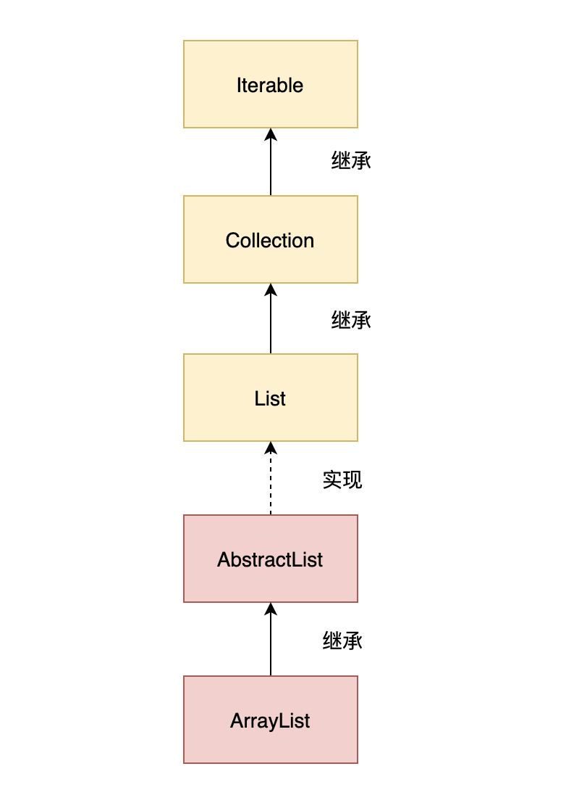


ArrayList实现了 List 接口，继承了 AbstractList 抽象类，其特性如下：
- 底层基于数组实现，并且实现了动态扩容
- 实现了 **RandomAccess 标记接口**，表示支持快速（通常是固定时间）随机访问
- 实现了 **Cloneable 接口**，元素本身不会被复制，因为元素不一定实现Cloneable接口，所以只能做到浅拷贝
  - 首先调用super.clone()实现字段复制，然后调用Arrays.copyOf得到elementData 数组的拷贝，因为数组存储引用，所以实际上**复制的是引用，而不是元素本身**
  - 字段会重置为0，保持语义一致性

```JAVA
/**
 * 返回该列表的浅表副本。
 * （元素本身不会被复制。）
 *
 * @return 该列表的副本
 */
public Object clone() {
    try {
        ArrayList<?> v = (ArrayList<?>) super.clone(); // 调用 Object 类的 clone 方法，得到一个浅表副本
        v.elementData = Arrays.copyOf(elementData, size); // 复制 elementData 数组，创建一个新数组作为副本
        v.modCount = 0; // 将 modCount 置为 0
        return v; // 返回副本
    } catch (CloneNotSupportedException e) {
        // this shouldn't happen, since we are Cloneable
        throw new InternalError(e);
    }
}
```
- 实现了**Serializable 标记接口**
  - Java 的序列化是指，**将对象转换成以字节序列的形式来表示**，**这些字节序中包含了对象的字段和方法**。序列化后的对象可以被写到数据库、写到文件，也可用于网络传输。
  - ArrayList 中的关键字段 elementData 使用了 **transient 关键字**修饰，表示**该字段不被序列化**
  - 因为扩容机制，所以可能会有大量的空位，所以实现了两个私有方法 writeObject 和 readObject 来完成序列化和反序列化，使用实际大小 size 而不是数组的长度（elementData.length）来作为元素的上限进行序列化

```JAVA
/**
 * 将此列表实例的状态序列写入指定的 ObjectOutputStream。
 * （即，保存这个列表实例到一个流中。）
 *
 * @param s 要写入的流
 * @throws java.io.IOException 如果写入流时发生异常
 */
private void writeObject(java.io.ObjectOutputStream s)
        throws java.io.IOException {
    s.defaultWriteObject(); // 写出对象的默认字段

    // Write out size as capacity for behavioral compatibility with clone()
    s.writeInt(size); // 写出 size

    // Write out all elements in the proper order.
    for (int i=0; i<size; i++) {
        s.writeObject(elementData[i]); // 依次写出 elementData 数组中的元素
    }
}

/**
 * 从指定的 ObjectInputStream 中读取此列表实例的状态序列。
 * （即，从流中恢复这个列表实例。）
 *
 * @param s 从中读取此列表实例的状态序列的流
 * @throws java.io.IOException 如果读取流时发生异常
 * @throws ClassNotFoundException 如果在读取流时找不到类
 */
private void readObject(java.io.ObjectInputStream s)
        throws java.io.IOException, ClassNotFoundException {
    elementData = EMPTY_ELEMENTDATA; // 初始化 elementData 数组为空数组

    // 读取默认字段
    s.defaultReadObject();

    // 读取容量，这个值被忽略，因为在 ArrayList 中，容量和长度是两个不同的概念
    s.readInt();

    if (size > 0) {
        // 分配一个新的 elementData 数组，大小为 size
        ensureCapacityInternal(size);

        Object[] a = elementData;
        // 依次从输入流中读取元素，并将其存储在数组中
        for (int i=0; i<size; i++) {
            a[i] = s.readObject(); // 读取对象并存储在 elementData 数组中
        }
    }
}
```


#### LinkedList的实现


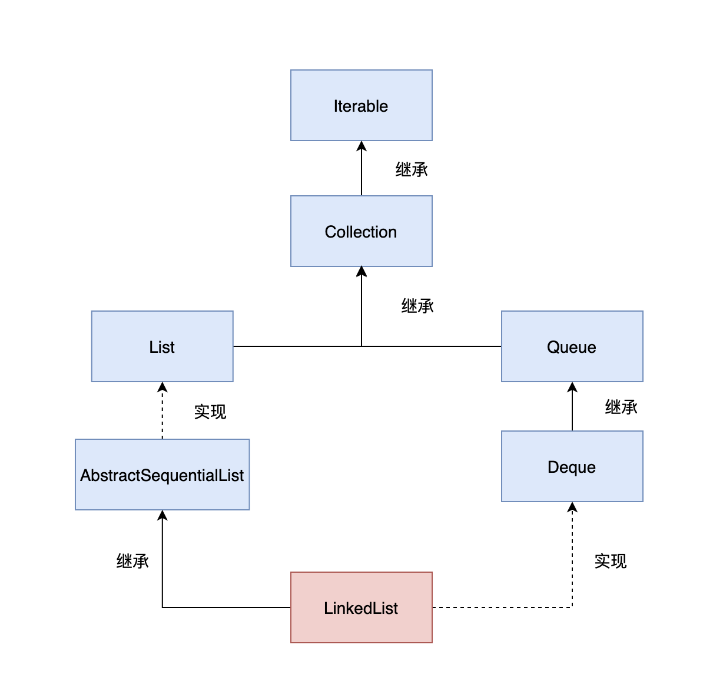

LinkedList 是一个继承自 AbstractSequentialList 的双向链表，因此它也可以被当作堆栈、队列或双端队列进行操作
- LinkedList 实现了 Cloneable 接口
- LinkedList 实现了 Serializable 接口
  - LinkedList 中的关键字段 size、first、last 都使用了 transient 关键字修饰
  - 提供writeObject() 方法：先写入size，随后，**Node节点的关键字段仅写入item，而不写入前后节点**
  - 提供readObject() 方法：先读取size，随后按照正确的顺序读取所有元素，并形成前后关系
```JAVA

private void writeObject(java.io.ObjectOutputStream s)
        throws java.io.IOException {
    // 写入默认的序列化标记
    s.defaultWriteObject();

    // 写入链表的节点个数
    s.writeInt(size);

    // 按正确的顺序写入所有元素
    for (LinkedList.Node<E> x = first; x != null; x = x.next)
        s.writeObject(x.item);
}


private void readObject(java.io.ObjectInputStream s)
        throws java.io.IOException, ClassNotFoundException {
    // 读取默认的序列化标记
    s.defaultReadObject();

    // 读取链表的节点个数
    int size = s.readInt();

    // 按正确的顺序读取所有元素
    for (int i = 0; i < size; i++)
        linkLast((E)s.readObject()); // 读取元素并将其添加到链表末尾
}

void linkLast(E e) {
    final LinkedList.Node<E> l = last;
    final LinkedList.Node<E> newNode = new LinkedList.Node<>(l, e, null);
    last = newNode; // 将新节点作为链表尾节点
    if (l == null)
        first = newNode; // 如果链表为空，将新节点作为链表头节点
    else
        l.next = newNode; // 否则将新节点链接到链表尾部
    size++; // 增加节点个数
}

```


#### 性能对比

**插入元素时**
- ArrayList插入元素的时间花销主要来自于元素复制，插入到非末尾位置时，会往后依次复制元素，扩容时也会复制数组；LinkedList插入元素的时间花销主要来自于遍历寻找插入位置。
- 在不涉及扩容时，除了插入到头部，其他情况下，ArrayList的性能好很多


**删除元素时**
- ArrayList删除元素的操作花销主要来自于往前复制元素（如果是remove(Object)方法则需要增加遍历花销）
- LinkedList删除元素的操作花销主要来自遍历，目标元素越靠近中部花销越大

**遍历元素时**
- 主要说明LinkedList的实现，node方法遍历前半或者后半，**因此`get(int index)`方法的复杂度是$O(n)$**

```JAVA
public E get(int index) {
    checkElementIndex(index);
    return node(index).item;
}

LinkedList.Node<E> node(int index) {
    // assert isElementIndex(index);

    if (index < (size >> 1)) { // 如果要查找的元素在链表的前半部分
        LinkedList.Node<E> x = first; // 从头节点开始遍历链表
        for (int i = 0; i < index; i++) // 循环查找元素
            x = x.next;
        return x; // 返回要查找的元素节点
    } else { // 如果要查找的元素在链表的后半部分
        LinkedList.Node<E> x = last; // 从尾节点开始遍历链表
        for (int i = size - 1; i > index; i--) // 循环查找元素
            x = x.prev;
        return x; // 返回要查找的元素节点
    }
}
```

- **普通for循环是错误的做法**，每次循环都调用get，其复杂度是$O(n^2)$


```JAVA

LinkedList<String> list = new LinkedList<String>();

for (int i = 0; i < list.size(); i++) {
    String item = list.get(i);  // get(i) 是 O(n) 操作！
    // 处理 item...
}
```

- **正确的做法是使用迭代器**：
  - 迭代器会返回内部私有类 ListItr 对象，执行 ListItr 的构造方法时调用了一次 node(int) 方法，返回第一个节点。在此之后，迭代器就执行 hasNext() 判断有没有下一个，执行 next() 方法下一个节点。
  - 注意不要把it.next()放在for循环第三部分
```JAVA
LinkedList<String> list = new LinkedList<String>();
for (String s : list) {
    ...
}

for (Iterator<String> it = list.iterator(); it.hasNext();) {
    it.next();
    ...//在这里执行
}

list.forEach(item -> System.out.println(item));
```


## Map
  
### HashMap

HashMap概述：
- HashMap基于哈希表，底层是一个数组，数组的每个位置可能是链表、红黑树或一个键值对
- 当添加一个键值对时，根据键的哈希值计算出该键对应的数组下标，然后将键值对插入到对应的位置
- 当通过键查找值时，也会根据键的哈希值计算出数组下标，并查找对应的值
- 因为哈希值和计算方式固定，所以`put(K key, V value)`方法**既可以添加元素也可以更改元素**
```JAVA
public class HashMap<K,V> extends AbstractMap<K,V>
    implements Map<K,V>, Cloneable, Serializable {

    public V put(K key, V value) {
        return putVal(hash(key), key, value, false, true);
    }
    public V remove(Object key) {
        Node<K,V> e;
        return (e = removeNode(hash(key), key, null, false, true)) == null ?
            null : e.value;
    }
    public V get(Object key) {
        Node<K,V> e;
        return (e = getNode(key)) == null ? null : e.value;
    }
}
```


#### 通过键的哈希值计算索引

`hashCode()`返回32位有符号整数，`h >>> 16`无符号右移16位，使用0填充高位，与h异或后，在低16位同时保留高位和低位的信息，即`hash(Object key)`方法所返回的扰动哈希码，扰动哈希码将用于索引计算

```JAVA
static final int hash(Object key) {
    int h;
    return (key == null) ? 0 : (h = key.hashCode()) ^ (h >>> 16);
}
```

索引计算
- 哈希码对数组长度取余可以平均分散到桶中，但是计算量很大$$hash\% length$$
- 将数组长度设置为$$2^n$$
- $hash \div 2^n = hash >> n$，即把 $hash$ 右移 $n$ 位，而被移掉的部分，则是$hash \% 2^n
$，也就是余数，即求低$n-1$位
- $2^n-1$的二进制由$n-1$个1构成，因此$$hash \% 2^n=hash\&2^n-1$$
- 在put或get方法中会使用取模运算

```JAVA

final V putVal(int hash, K key, V value, boolean onlyIfAbsent,
                   boolean evict) {
        //底层数组
        Node<K,V>[] tab;
        //元素 
        Node<K,V> p; 
        // n 为数组的长度 i 为下标
        int n, i;
        //数组为空先扩容
        if ((tab = table) == null || (n = tab.length) == 0)
            n = (tab = resize()).length;
        if ((p = tab[i = (n - 1) & hash]) == null)
            tab[i] = newNode(hash, key, value, null);
        else {...}
        ...
}

final Node<K,V> getNode(int hash, Object key) {
    // 获取当前的数组和长度，以及当前节点链表的第一个节点（根据索引直接从数组中找）
    Node<K,V>[] tab;
    Node<K,V> first, e;
    int n;
    K k;
    if ((tab = table) != null && (n = tab.length) > 0 &&
            (first = tab[(n - 1) & hash]) != null) {
        // 如果第一个节点就是要查找的节点，则直接返回
        if (first.hash == hash && ((k = first.key) == key || (key != null && key.equals(k))))
            return first;
        // 如果第一个节点不是要查找的节点，则遍历节点链表查找
        if ((e = first.next) != null) {
            do {
                if (e.hash == hash && ((k = e.key) == key || (key != null && key.equals(k))))
                    return e;
            } while ((e = e.next) != null);
        }
    }
    // 如果节点链表中没有找到对应的节点，则返回 null
    return null;
}
```

#### 扩容


```JAVA
public class HashMap<K,V> extends AbstractMap<K,V> {
    // 底层数组（哈希表），容量指底层数组的长度
    transient Node<K,V>[] table;
    
    // 实际存储的键值对数量
    transient int size;
    
    // 下一次扩容的阈值 = 容量 × 负载因子
    int threshold;
    
    // 负载因子（默认0.75）
    final float loadFactor;
    
    static class Node<K,V> implements Map.Entry<K,V> {
    final int hash;
    final K key;
    V value;
    Node<K,V> next;

    Node(int hash, K key, V value, Node<K,V> next) {
        this.hash = hash;
        this.key = key;
        this.value = value;
        this.next = next;
    }
}
```

扩容共三步，计算容量，新建数组，计算新索引并重新散列，将元素复制到新数组

JDK8加入红黑树，先以JDK7代码为例

- 计算新容量
  - 防止过小或过大导致哈希冲突过多或者浪费空间
  - jdk8将*2等价改为<<1

```JAVA
int newCapacity = oldCapacity * 2;
if (newCapacity < 0 || newCapacity >= MAXIMUM_CAPACITY) {
    newCapacity = MAXIMUM_CAPACITY;
} else if (newCapacity < DEFAULT_INITIAL_CAPACITY) {
    newCapacity = DEFAULT_INITIAL_CAPACITY;
}
```
- 创建新数组并计算新阀值
```JAVA
// newCapacity为新的容量
void resize(int newCapacity) {
    // 1. 保存旧数组引用
    Entry[] oldTable = table;
    
    // 2. 获取旧数组容量
    int oldCapacity = oldTable.length;
    
    // 3. 最大容量检查（2的30次方 = 1<<30）
    if (oldCapacity == MAXIMUM_CAPACITY) {
        // 容量已达到最大，不再扩容
        // 调整阈值为Integer的最大值（2^31-1），这样就不会再触发扩容
        threshold = Integer.MAX_VALUE;
        return;  // 直接返回，不进行扩容
    }

    // 4. 创建新数组
    Entry[] newTable = new Entry[newCapacity];
    
    // 5. 转移元素（核心步骤）
    transfer(newTable, initHashSeedAsNeeded(newCapacity));
    
    // 6. 更新HashMap的底层数组引用
    table = newTable;
    
    // 7. 重新计算阈值
    threshold = (int)Math.min(newCapacity * loadFactor, MAXIMUM_CAPACITY + 1);
}
```

- 再散列：拉链法，后插入的元素会放在头部，最先开始放入的元素会成为桶的尾部。在旧数组中同一个链表上的元素，通过重新计算索引位置后，有可能被放到了新数组的不同位置上。
```JAVA
void transfer(Entry[] newTable, boolean rehash) {
    // 新的容量
    int newCapacity = newTable.length;
    // 遍历小数组
    for (Entry<K,V> e : table) {
        while(null != e) {
            // 拉链法，相同 key 上的不同值
            Entry<K,V> next = e.next;
            // 是否需要重新计算 hash
            if (rehash) {
                e.hash = null == e.key ? 0 : hash(e.key);
            }
            // 根据大数组的容量，和键的 hash 计算元素在数组中的下标
            int i = indexFor(e.hash, newCapacity);

            // 同一位置上的新元素被放在链表的头部
            e.next = newTable[i];

            // 放在新的数组上
            newTable[i] = e;

            // 链表上的下一个元素
            e = next;
        }
    }
}
```


JDK8版本
- jdk7为每个元素重新计算索引，即使最终结果也是原位置或原位置+oldCap，但计算过程不区分
- jdk8**数组扩容后的索引位置，要么就是原来的索引位置，要么就是“原索引+原来的容量”**，所以拆分为两个链表，一个链表保存放在原索引位置的元素，一个链表保存放在“原索引+原来的容量”位置的元素。同时拆分两个链表也能处理红黑树
- jdk8更改为新元素插入到尾部，保证顺序不变

```JAVA
final Node<K,V>[] resize() {
    Node<K,V>[] oldTab = table;          // 保存旧数组引用
    int oldCap = (oldTab == null) ? 0 : oldTab.length;  // 旧容量
    int oldThr = threshold;              // 旧阈值
    int newCap, newThr = 0;              // 新容量、新阈值（初始为0）
    // 场景1：已存在数组（正常扩容）
    if (oldCap > 0) {
        if (oldCap >= MAXIMUM_CAPACITY) {  // 已达到最大容量
            threshold = Integer.MAX_VALUE;
            return oldTab;                  // 不再扩容
        }
        else if ((newCap = oldCap << 1) < MAXIMUM_CAPACITY &&  // 容量翻倍
                oldCap >= DEFAULT_INITIAL_CAPACITY)
            newThr = oldThr << 1;  // 阈值翻倍
    }

    // 场景2：首次初始化，但指定了初始容量
    else if (oldThr > 0)
        newCap = oldThr;  // 使用指定的初始容量

    // 场景3：首次初始化，使用默认值
    else {
        newCap = DEFAULT_INITIAL_CAPACITY;  // 16
        newThr = (int)(DEFAULT_LOAD_FACTOR * DEFAULT_INITIAL_CAPACITY);  // 12
    }
    if (newThr == 0) {
        float ft = (float)newCap * loadFactor;
        newThr = (newCap < MAXIMUM_CAPACITY && ft < (float)MAXIMUM_CAPACITY ?
                (int)ft : Integer.MAX_VALUE);
    }
    threshold = newThr;  // 更新全局阈值
    @SuppressWarnings({"rawtypes","unchecked"})
        Node<K,V>[] newTab = (Node<K,V>[])new Node[newCap]; // 创建新数组 newTab
    table = newTab; // 将新数组 newTab 赋值给成员变量 table
    if (oldTab != null) { // 如果旧数组 oldTab 不为空
        for (int j = 0; j < oldCap; ++j) { // 遍历旧数组的每个元素
            Node<K,V> e;
            if ((e = oldTab[j]) != null) { // 如果该元素不为空
                oldTab[j] = null; // 将旧数组中该位置的元素置为 null，以便垃圾回收
                if (e.next == null) // 如果该元素没有冲突
                    newTab[e.hash & (newCap - 1)] = e; // 直接将该元素放入新数组
                else if (e instanceof TreeNode) // 如果该元素是树节点
                    ((TreeNode<K,V>)e).split(this, newTab, j, oldCap); // 将该树节点分裂成两个链表
                else { // 如果该元素是链表
                    Node<K,V> loHead = null, loTail = null; // 低位链表的头结点和尾结点
                    Node<K,V> hiHead = null, hiTail = null; // 高位链表的头结点和尾结点
                    Node<K,V> next;
                    do { // 遍历该链表
                        next = e.next;
                        if ((e.hash & oldCap) == 0) { // 如果该元素在低位链表中
                            if (loTail == null) // 如果低位链表还没有结点
                                loHead = e; // 将该元素作为低位链表的头结点
                            else
                                loTail.next = e; // 如果低位链表已经有结点，将该元素加入低位链表的尾部
                            loTail = e; // 更新低位链表的尾结点
                        }
                        else { // 如果该元素在高位链表中
                            if (hiTail == null) // 如果高位链表还没有结点
                                hiHead = e; // 将该元素作为高位链表的头结点
                            else
                                hiTail.next = e; // 如果高位链表已经有结点，将该元素加入高位链表的尾部
                            hiTail = e; // 更新高位链表的尾结点
                        }
                    } while ((e = next) != null); //
                    if (loTail != null) { // 如果低位链表不为空
                        loTail.next = null; // 将低位链表的尾结点指向 null，以便垃圾回收
                        newTab[j] = loHead; // 将低位链表作为新数组对应位置的元素
                    }
                    if (hiTail != null) { // 如果高位链表不为空
                        hiTail.next = null; // 将高位链表的尾结点指向 null，以便垃圾回收
                        newTab[j + oldCap] = hiHead; // 将高位链表作为新数组对应位置的元素
                    }
                }
            }
        }
    }
    return newTab; // 返回新数组
}
```


#### 加载因子、红黑树、链表

临界值 = 初始容量 * 加载因子
- 加载因子越小，填满的数据就越少，哈希冲突的几率就减少了，但浪费了空间，而且还会提高扩容的触发几率；
- 加载因子越大，填满的数据就越多，空间利用率就高，但哈希冲突的几率就变大了。

Java 8 之前，HashMap 使用链表来解决冲突，即当两个或者多个键映射到同一个桶时，它们被放在同一个桶的链表上。当链表上的节点（Node）过多时，链表会变得很长，查找的效率（LinkedList 的查找效率为 O（n））就会受到影响。

Java 8 中，当链表的节点数超过一个阈值（8）时，链表将转为红黑树（节点为 TreeNode），红黑树是一种高效的平衡树结构，能够在 O(log n) 的时间内完成插入、删除和查找等操作。这种结构在节点数很多时，可以提高 HashMap 的性能和可伸缩性。
- 因为TreeNode（红黑树的节点）的大小大约是常规节点（链表的节点 Node）的两倍，所以只有当桶内包含足够多的节点时才使用红黑树（参见TREEIFY_THRESHOLD「阈值，值为8」，节点数量较多时，红黑树可以提高查询效率）。
- 由于删除元素或者调整数组大小（扩容）时（再次散列），红黑树可能会被转换为链表（节点数量小于 8 时），节点数量较少时，链表的效率比红黑树更高，因为红黑树需要更多的内存空间来存储节点。
- 在具有良好分布的hashCode使用中，很少使用红黑树。


为了减少哈希冲突发生的概率，当 HashMap 的数组长度达到一个临界值的时候，就会触发扩容，扩容后会将之前小数组中的元素转移到大数组中，这是一个相当耗时的操作。加载因子选取0.75和泊松分布有关


#### 线程不安全

1. 多线程下扩容会死循环
2. 多线程下 put 会导致元素丢失
3. put 和 get 并发时会导致 get 到 null


jdk7，多线程同时扩容，由于头部插入链表，可能导致死循环
- 线程1、2同时操作链表C-B-A-null完成扩容，每个线程保存局部的newTable
- 线程1指向C，next指向B后挂起，线程2完成扩容操作，此时原始链表更改为A-B-C-null
- 线程1继续执行
  - next指向B是临时变量，更新为C-null
  - 循环下一轮，线程指向B，next指向C，更新为C-B-null
  - 循环下一轮，线程指向C，next指向null，更新为C-B-C-null
- JDK 8 时已经修复了这个问题，扩容时会保持链表原来的顺序

多线程下 put 会导致元素丢失
- 步骤2可能会导致，如果计算出来的索引位置是相同的，那会造成前一个 key 被后一个 key 覆盖，从而导致元素的丢失。
```JAVA
final V putVal(int hash, K key, V value, boolean onlyIfAbsent,
               boolean evict) {
    Node<K,V>[] tab; Node<K,V> p; int n, i;

    // 步骤①：tab为空则创建
    if ((tab = table) == null || (n = tab.length) == 0)
        n = (tab = resize()).length;

    // 步骤②：计算index，并对null做处理
    if ((p = tab[i = (n - 1) & hash]) == null)
        tab[i] = newNode(hash, key, value, null);
    else {
        Node<K,V> e; K k;

        // 步骤③：节点key存在，直接覆盖value
        if (p.hash == hash &&
            ((k = p.key) == key || (key != null && key.equals(k))))
            e = p;

        // 步骤④：判断该链为红黑树
        else if (p instanceof TreeNode)
            e = ((TreeNode<K,V>)p).putTreeVal(this, tab, hash, key, value);

        // 步骤⑤：该链为链表
        else {
            for (int binCount = 0; ; ++binCount) {
                if ((e = p.next) == null) {
                    p.next = newNode(hash, key, value, null);

                    //链表长度大于8转换为红黑树进行处理
                    if (binCount >= TREEIFY_THRESHOLD - 1) // -1 for 1st
                        treeifyBin(tab, hash);
                    break;
                }

                // key已经存在直接覆盖value
                if (e.hash == hash &&
                    ((k = e.key) == key || (key != null && key.equals(k))))
                    break;
                p = e;
            }
        }

        // 步骤⑥、直接覆盖
        if (e != null) { // existing mapping for key
            V oldValue = e.value;
            if (!onlyIfAbsent || oldValue == null)
                e.value = value;
            afterNodeAccess(e);
            return oldValue;
        }
    }
    ++modCount;

    // 步骤⑦：超过最大容量 就扩容
    if (++size > threshold)
        resize();
    afterNodeInsertion(evict);
    return null;
}
```


put 和 get 并发时会导致 get 到 null
- 线程 1 执行 put 时，因为元素个数超出阈值而导致出现扩容，线程 2 此时执行 get，就有可能出现这个问题。


### LinkedHashMap

LinkedHashMap 继承HashMap，并在内部追加了双向链表，来维护元素的插入顺序，其内部节点追加before和after，并重写put和get方法

```JAVA
static class Entry<K,V> extends HashMap.Node<K,V> {
    Entry<K,V> before, after;
    Entry(int hash, K key, V value, Node<K,V> next) {
        super(hash, key, value, next);
    }
}
```


HashMap是无序的，但是遍历时第一个元素的键总是null（如果有null作为键）；但是在LinkedHashMap中，null键的键值对会遵从顺序。

LinkedhashMap可以维持访问顺序或者插入顺序，在初始化时传参决定。**true表示维护访问顺序，false表示维护插入顺序，默认false**

```JAVA
LinkedHashMap<String, String> map = new LinkedHashMap<>(16, .75f, true);
```


#### 访问顺序、LRU

最不经常访问的放在头部，可以使用LinkedHashMap实现LRU算法，即Least Recently Used 最近最少使用，是一种常用的页面置换算法，选择最近最久未使用的页面予以淘汰


LinkedHashMap通过重写下面这三个方法来维持访问顺序
```JAVA
/**
 * 在调用 get() 方法后被调用
 * 在访问节点后，将节点移动到链表的尾部
 *
 * @param e 要移动的节点
 */
void afterNodeAccess(HashMap.Node<K,V> e) { // move node to last
    LinkedHashMap.Entry<K,V> last;
    if (accessOrder && (last = tail) != e) { // 如果按访问顺序排序，并且访问的节点不是尾节点
        LinkedHashMap.Entry<K,V> p = (LinkedHashMap.Entry<K,V>)e, b = p.before, a = p.after;
        p.after = null; // 将要移动的节点的后继节点设为 null
        if (b == null)
            head = a; // 如果要移动的节点没有前驱节点，则将要移动的节点设为头节点
        else
            b.after = a; // 将要移动的节点的前驱节点的后继节点设为要移动的节点的后继节点
        if (a != null)
            a.before = b; // 如果要移动的节点有后继节点，则将要移动的节点的后继节点的前驱节点设为要移动的节点的前驱节点
        else
            last = b; // 如果要移动的节点没有后继节点，则将要移动的节点的前驱节点设为尾节点
        if (last == null)
            head = p; // 如果尾节点为空，则将要移动的节点设为头节点
        else {
            p.before = last; // 将要移动的节点的前驱节点设为尾节点
            last.after = p; // 将尾节点的后继节点设为要移动的节点
        }
        tail = p; // 将要移动的节点设为尾节点
        ++modCount; // 修改计数器
    }
}

/**
 * 在调用 put() 方法的时候被调用
 * 在插入节点后，如果需要，可能会删除最早加入的元素
 *
 * @param evict 是否需要删除最早加入的元素
 */
void afterNodeInsertion(boolean evict) { // possibly remove eldest
    LinkedHashMap.Entry<K,V> first;
    if (evict && (first = head) != null && removeEldestEntry(first)) { // 如果需要删除最早加入的元素
        K key = first.key; // 获取要删除元素的键
        removeNode(hash(key), key, null, false, true); // 调用 removeNode() 方法删除元素
    }
}
//在调用 remove() 方法的时候被调用。
void afterNodeRemoval(Node<K,V> p) { }
```


```JAVA
/**
 * 自定义的 MyLinkedHashMap 类，继承了 Java 中内置的 LinkedHashMap<K, V> 类。
 * 用于实现一个具有固定大小的缓存，当缓存达到最大容量时，会自动移除最早加入的元素，以腾出空间给新的元素。
 *
 * @param <K> 键的类型
 * @param <V> 值的类型
 */
public class MyLinkedHashMap<K, V> extends LinkedHashMap<K, V> {

    private static final int MAX_ENTRIES = 5; // 表示 MyLinkedHashMap 中最多存储的键值对数量

    /**
     * 构造方法，使用 super() 调用了父类的构造函数，并传递了三个参数：initialCapacity、loadFactor 和 accessOrder。
     *
     * @param initialCapacity 初始容量
     * @param loadFactor      负载因子
     * @param accessOrder     访问顺序
     */
    public MyLinkedHashMap(int initialCapacity, float loadFactor, boolean accessOrder) {
        super(initialCapacity, loadFactor, accessOrder);
    }

    /**
     * 重写父类的 removeEldestEntry() 方法，用于指示是否应该移除最早加入的元素。
     * 如果返回 true，那么将删除最早加入的元素。
     *
     * @param eldest 最早加入的元素
     * @return 如果当前 MyLinkedHashMap 中元素的数量大于 MAX_ENTRIES，返回 true，否则返回 false。
     */
    @Override
    protected boolean removeEldestEntry(Map.Entry elxdest) {
        return size() > MAX_ENTRIES;
    }

}
```


### TreeMap

TreeMap 由红黑树实现，可以保持元素的自然顺序，或者实现了 Comparator 接口的自定义顺序

#### 红黑树

红黑树是一种自平衡的二叉查找树（Binary Search Tree），结构复杂，但却有着良好的性能，完成查找、插入和删除的时间复杂度均为 log(n)。

二叉查找树是一种常见的树形结构，它的每个节点都包含一个键值对。每个节点的左子树节点的键值小于该节点的键值，右子树节点的键值大于该节点的键值，这个特性使得二叉查找树非常适合进行数据的查找和排序操作。左子树上所有节点的值均小于或等于它的根结点的值。右子树上所有节点的值均大于或等于它的根结点的值。左、右子树也分别为二叉查找树。二叉查找树的左右子树容易失衡，不平衡的二叉查找树可能会导致查找、插入和删除操作的效率下降


平衡二叉树保证树的左右两边的高度差不超过1。常见的平衡二叉树包括AVL树、红黑树等等，它们都是通过旋转操作来调整树的平衡，使得左子树和右子树的高度尽可能接近。
- AVL树是一种高度平衡的二叉查找树，它要求左子树和右子树的高度差不超过1。由于AVL树的平衡度比较高，因此在进行插入和删除操作时需要进行更多的旋转操作来保持平衡，但是在查找操作时效率较高。AVL树适用于读操作比较多的场景。

红黑树通过颜色的约束来维持二叉树的平衡，它要求
- 每个节点都只能是红色或者黑色

- 根节点是黑色

- 每个叶节点（NIL 节点，空节点）是黑色的。

- 如果一个节点是红色的，则它两个子节点都是黑色的。也就是说在一条路径上不能出现相邻的两个红色节点。

- 从任一节点到其每个叶子的所有路径都包含相同数目的黑色节点


#### 实现与排序

put()方法
- 首先定义一个Entry类型的变量t，用于表示当前的根节点；

- 如果t为null，说明TreeMap为空，直接创建一个新的节点作为根节点，并将size设置为1；

- 如果t不为null，说明需要在TreeMap中查找键所对应的节点。因为TreeMap中的元素是有序的，所以可以使用二分查找的方式来查找节点；

- **如果TreeMap中使用了Comparator来进行排序，则使用Comparator进行比较，否则使用Comparable进行比较**。如果查找到了相同的键，则直接更新键所对应的值；

- 如果没有查找到相同的键，则创建一个新的节点，并将其插入到TreeMap中。然后使用fixAfterInsertion()方法来修正插入节点后的平衡状态；

- 最后将TreeMap的size加1，然后返回null。如果更新了键所对应的值，则返回原先的值。


```JAVA
public V put(K key, V value) {
    Entry<K,V> t = root; // 将根节点赋值给变量t
    if (t == null) { // 如果根节点为null，说明TreeMap为空
        compare(key, key); // type (and possibly null) check，检查key的类型是否合法
        root = new Entry<>(key, value, null); // 创建一个新节点作为根节点
        size = 1; // size设置为1
        return null; // 返回null，表示插入成功
    }
    int cmp;
    Entry<K,V> parent;
    // split comparator and comparable paths，根据使用的比较方法进行查找
    Comparator<? super K> cpr = comparator; // 获取比较器
    if (cpr != null) { // 如果使用了Comparator
        do {
            parent = t; // 将当前节点赋值给parent
            cmp = cpr.compare(key, t.key); // 使用Comparator比较key和t的键的大小
            if (cmp < 0) // 如果key小于t的键
                t = t.left; // 在t的左子树中查找
            else if (cmp > 0) // 如果key大于t的键
                t = t.right; // 在t的右子树中查找
            else // 如果key等于t的键
                return t.setValue(value); // 直接更新t的值
        } while (t != null);
    }
    else { // 如果没有使用Comparator
        if (key == null) // 如果key为null
            throw new NullPointerException(); // 抛出NullPointerException异常
            Comparable<? super K> k = (Comparable<? super K>) key; // 将key强制转换为Comparable类型
        do {
            parent = t; // 将当前节点赋值给parent
            cmp = k.compareTo(t.key); // 使用Comparable比较key和t的键的大小
            if (cmp < 0) // 如果key小于t的键
                t = t.left; // 在t的左子树中查找
            else if (cmp > 0) // 如果key大于t的键
                t = t.right; // 在t的右子树中查找
            else // 如果key等于t的键
                return t.setValue(value); // 直接更新t的值
        } while (t != null);
    }
    // 如果没有找到相同的键，需要创建一个新节点插入到TreeMap中
    Entry<K,V> e = new Entry<>(key, value, parent); // 创建一个新节点
    if (cmp < 0) // 如果key小于parent的键
        parent.left = e; // 将e作为parent的左子节点
    else
        parent.right = e; // 将e作为parent的右子节点
    fixAfterInsertion(e); // 插入节点后需要进行平衡操作
    size++; // size加1
    return null; // 返回null，表示插入成功
}
```


- 自然顺序，比较对象实现Comparable接口，在compareTo方法中实现比较
- 自定义顺序：传入Comparator构造器，调用compare方法指定排序规则

排序的好处
- 提供了 lastKey()、firstKey() 这样获取最后一个 key 和第一个 key 的方法。
- headMap() 获取的是到指定 key 之前的 key；tailMap() 获取的是指定 key 之后的 key（包括指定 key）。

### NavigableMap

### WeakHashMap

## Set

## Queue、Deque
### ArrayDeque

#### Deque和Queue
`ArrayDeque implements  Deque implements  Queue` ，因此**双端队列ArrayDeque可以是栈或者队列**
- LinkedList同时实现List和Deque接口，因此栈和队列也可以用LinkedList实现
- Queue和Deque完美体现了多态的语义，但是违反了ISP接口隔离原则，好处是实现了代码复用
  - Queue仅定义了队列的基本操作，可以是FIFO也可以是优先级队列；
  - Deque承载三种语义：FIFO单段队列、双端队列、栈
  - 因此在对象使用接口而不是具体类命名时，名字应该清晰指出语义，或者包装类仅暴露需要的方法

**作为单端队列使用时，只能在队尾插入、队首移出、队首查看元素，失败时返回false、返回null或者抛出异常**


| Queue 方法 | 等效的 Deque 方法 | 说明 |
|-----------|------------------|------|
| `add(e)` | `addLast(e)` | 向队尾插入元素，失败则抛出异常 |
| `offer(e)` | `offerLast(e)` | 向队尾插入元素，失败则返回 `false` |
| `remove()` | `removeFirst()` | 获取并删除队首元素，失败则抛出异常 |
| `poll()` | `pollFirst()` | 获取并删除队首元素，失败则返回 `null` |
| `element()` | `getFirst()` | 获取但不删除队首元素，失败则抛出异常 |
| `peek()` | `peekFirst()` | 获取但不删除队首元素，失败则返回 `null` |

**作为对栈的抽象时，仅使用push、pop、peek方法**，在失败时抛出异常

| Stack 方法 | 等效的 Deque 方法 | 说明 |
|-----------|------------------|------|
| `push(e)` | `addFirst(e)` | 向栈顶插入元素，失败则抛出异常 |
| 无 | `offerFirst(e)` | 向栈顶插入元素，失败则返回 `false` |
| `pop()` | `removeFirst()` | 获取并删除栈顶元素，失败则抛出异常 |
| 无 | `pollFirst()` | 获取并删除栈顶元素，失败则返回 `null` |
| `peek()` | `getFirst()` | 获取但不删除栈顶元素，失败则抛出异常 |
| 无 | `peekFirst()` | 获取但不删除栈顶元素，失败则返回 `null` |

#### 底层实现


该容器实现**不允许放入null**，**因为查看或者弹出元素的方法可能返回null表示失败**。

ArrayDeque底层是**循环数组**，
- **head指向首端第一个有效元素，tail指向尾端第一个可以插入元素的空位**，**数组的每一个下标都可能是起点或终点**，因此tail的下标可能比head小


**addFirst方法**
- 空间足够且下标未越界时，只需要head-1位置放入元素即可。否则需要取模运算，但是ArrayDeque使用位运算代替取模运算。
- **循环数组的长度限制为$2^n$**，**因此`elements.length - 1`的二进制低位全是1，高位全是0**
- head-1的越界情况仅有一种，即-1，此时二进制全为1，与`elements.length - 1`相与操作后，等价于结果为`elements.length - 1`，即数组的最后一位。
- 因为tail始终指向下一个要插入的位置，而head指向第一个元素，因此ArrayDeque始终有空位，当head==tail为true时，需要扩容
```JAVA
//addFirst(E e)
public void addFirst(E e) {
    if (e == null)//不允许放入null
        throw new NullPointerException();
    elements[head = (head - 1) & (elements.length - 1)] = e;//2.下标是否越界
    if (head == tail)//1.空间是否够用
        doubleCapacity();//扩容
}
```

`doubleCapacity()`方法
- 复制分两步，因为tail一定等于head，且数组满，所以先复制head右半，再复制左半，然后重置head和tail，可以验证右半一定是在前面的元素，保证了元素顺序
```JAVA
//doubleCapacity()
private void doubleCapacity() {
    assert head == tail;
    int p = head;
    int n = elements.length;
    int r = n - p; // head右边元素的个数
    int newCapacity = n << 1;//原空间的2倍
    if (newCapacity < 0)
        throw new IllegalStateException("Sorry, deque too big");
    Object[] a = new Object[newCapacity];
    System.arraycopy(elements, p, a, 0, r);//复制右半部分，对应上图中绿色部分
    System.arraycopy(elements, 0, a, r, p);//复制左半部分，对应上图中灰色部分
    elements = (E[])a;
    head = 0;
    tail = n;
}
```

`addLast`方法
- tail+1==elements.length时，低位全是0，与elements.length - 1相与操作后为0，其他情况取tail+1的原值

```JAVA
public void addLast(E e) {
    if (e == null)//不允许放入null
        throw new NullPointerException();
    elements[tail] = e;//赋值
    if ( (tail = (tail + 1) & (elements.length - 1)) == head)//下标越界处理
        doubleCapacity();//扩容
}
```
`pollFirst`方法
- 取得原值并使用null覆盖该元素，更改head值，并处理越界情况

```JAVA
public E pollFirst() {
    E result = elements[head];
    if (result == null)//null值意味着deque为空
        return null;
    elements[h] = null;//let GC work
    head = (head + 1) & (elements.length - 1);//下标越界处理
    return result;
}
```
`pollLast`方法
- 如果取得的tail为null，则deque为空，返回null，否则更改tail值并使用null覆盖元素，然后返回元素
```JAVA
public E pollLast() {
    int t = (tail - 1) & (elements.length - 1);//tail的上一个位置是最后一个元素
    E result = elements[t];
    if (result == null)//null值意味着deque为空
        return null;
    elements[t] = null;//let GC work
    tail = t;
    return result;
}
```

没有使用modCount，不支持fail-fast，因此其迭代器是弱一致性的，而LinkedList继承自AbstractSequentialList，拥有modCount，好处是高性能
- 不要通过迭代器修改ArrayDeque，或者在迭代器遍历时修改ArrayDeque，尽量作为纯队列、栈操作

### PriorityQueue

PriorityQueue 是一个基于优先级堆的优先队列实现，它能够在 O(log n) 的时间复杂度内实现元素的插入和删除操作，并且能够自动维护队列中元素的优先级顺序
- PriorityQueue只关心最值，其内部元素不一定有序，TreeMap维护所有元素有序

```JAVA
// 创建 PriorityQueue 对象，并指定优先级顺序
PriorityQueue<String> priorityQueue = new PriorityQueue<>(Comparator.reverseOrder());

// 添加元素到 PriorityQueue
priorityQueue.offer("沉默王二");
priorityQueue.offer("陈清扬");
priorityQueue.offer("小转铃");

// 打印 PriorityQueue 中的元素
System.out.println("PriorityQueue 中的元素：");
while (!priorityQueue.isEmpty()) {
    System.out.print(priorityQueue.poll() + " ");
}
```

堆
- **小顶堆**是一个完全二叉树，**任何一个非叶子节点的权值，都不大于其左右子节点的权值**，这样保证了队列的顶部元素（堆顶）一定是优先级最高的元素。
- 完全二叉树是一种二叉树，其中除了最后一层，其他层的节点数都是满的，最后一层的节点都靠左对齐
- 因为完全二叉树的结构比较规则，所以**可以使用数组来存储堆的元素**，而不需要使用指针等额外的空间。在堆中，**每个节点的下标和其在数组中的下标是一一对应**的，**假设节点下标为i，则其父节点下标为(i-1)/2，其左子节点下标为2i+1，其右子节点下标为2i+2**。
  - <0时是根节点
- 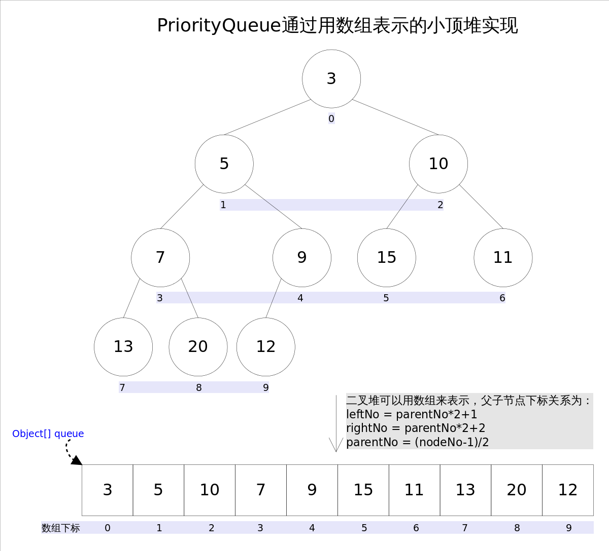


#### 底层实现

`add()`和 `offer()`
- 因为实现Queue接口，所以可以使用add或offer方法，又因为查看或者获取元素会返回null，所以不允许存储null元素
- 扩容函数grow()类似于ArrayList里的grow()函数，就是再申请一个更大的数组，并将原数组的元素复制过去
- `siftUp(int k, E x)`方法，该方法用于插入元素x并维持堆的特性。
- size即为要插入的下标，如果size和queue.length相等，则需要扩容。
- 通过(k - 1) >>> 1获取父节点的下标，因为不可能是根节点，所以k-1不会越界
- `comparator.compare(x, (E) e) >= 0` 
  - **PriorityQueue默认使用自然顺序，即最小堆**，**可以传入反转顺序的比较器，即最大堆**。此处的最小最大是符合compare或compareTo语义上的最小最大。
  - 例如完全可以让自然顺序语义中，更大的数更小，与数学语义相反，仍是最小堆
- 每次循环末尾都会将父节点的元素让在右节点上，退出循环后将元素放置在正确的结点上，整个过程最坏只会遍历$log(n)$个节点，即树高
```JAVA

public boolean add(E e) {
    return offer(e);
}


//offer(E e)
public boolean offer(E e) {
    if (e == null)
        throw new NullPointerException();
    modCount++;
    int i = size;
    if (i >= queue.length)
        grow(i + 1);
    size = i + 1;
    if (i == 0)
        queue[0] = e;
    else
        siftUp(i, e);
    return true;
}

private void siftUp(int k, E x) {
    if (comparator != null)
        siftUpUsingComparator(k, x);
    else
        siftUpComparable(k, x);
}

@SuppressWarnings("unchecked")
private void siftUpComparable(int k, E x) {
    Comparable<? super E> key = (Comparable<? super E>) x;
    while (k > 0) {
        int parent = (k - 1) >>> 1;
        Object e = queue[parent];
        if (key.compareTo((E) e) >= 0)
            break;
        queue[k] = e;
        k = parent;
    }
    queue[k] = key; 
}

@SuppressWarnings("unchecked")
private void siftUpUsingComparator(int k, E x) {
    while (k > 0) {
        int parent = (k - 1) >>> 1;
        Object e = queue[parent];
        if (comparator.compare(x, (E) e) >= 0)
            break;
        queue[k] = e;
        k = parent;
    }
    queue[k] = x;
}
```


`element()`和 `peek()`
- 直接返回0下标元素即可
```JAVA
//peek()
public E peek() {
    if (size == 0)
        return null;
    return (E) queue[0];//0下标处的那个元素就是最小的那个
}

```

`remove()`和 `poll()`
- remove和poll方法相同，主要说明下沉操作
- 从根节点k=0开始遍历，获取子节点下标`child = (k << 1) + 1;right = child + 1`
- 获取最后一个元素，作为key，先放在k位置，直到比子节点中的较小值还小时停止下沉，否则交换该元素和子节点中的较小值
- 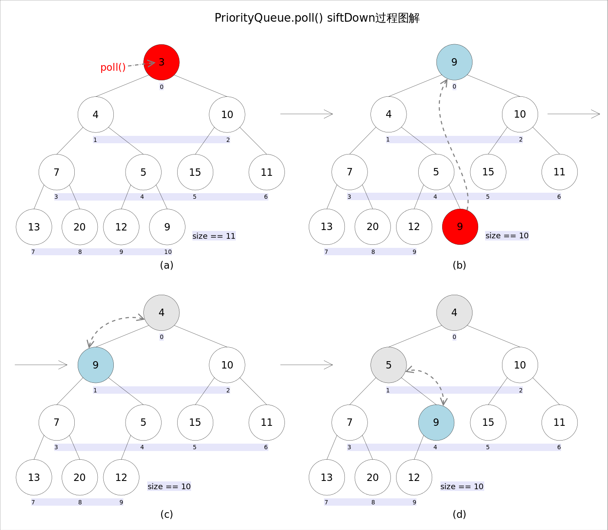
```JAVA
    public E remove() {
        E x = poll();
        if (x != null)
            return x;
        else
            throw new NoSuchElementException();
    }

    public E poll() {
        if (size == 0)
            return null;
        int s = --size;
        modCount++;
        E result = (E) queue[0];
        E x = (E) queue[s];
        queue[s] = null;
        if (s != 0)
            siftDown(0, x);
        return result;
    }

    private void siftDown(int k, E x) {
        if (comparator != null)
            siftDownUsingComparator(k, x);
        else
            siftDownComparable(k, x);
    }

    @SuppressWarnings("unchecked")
    private void siftDownComparable(int k, E x) {
        Comparable<? super E> key = (Comparable<? super E>)x;
        int half = size >>> 1;        // loop while a non-leaf
        while (k < half) {
            int child = (k << 1) + 1; // assume left child is least
            Object c = queue[child];
            int right = child + 1;
            if (right < size &&
                ((Comparable<? super E>) c).compareTo((E) queue[right]) > 0)
                c = queue[child = right];
            if (key.compareTo((E) c) <= 0)
                break;
            queue[k] = c;
            k = child;
        }
        queue[k] = key;
    }

    @SuppressWarnings("unchecked")
    private void siftDownUsingComparator(int k, E x) {
        int half = size >>> 1;
        while (k < half) {
            int child = (k << 1) + 1;
            Object c = queue[child];
            int right = child + 1;
            if (right < size &&
                comparator.compare((E) c, (E) queue[right]) > 0)
                c = queue[child = right];
            if (comparator.compare(x, (E) c) <= 0)
                break;
            queue[k] = c;
            k = child;
        }
        queue[k] = x;
    }

```

`remove(Object o)`：删除队列中跟o相等的某一个元素（如果有多个相等，只删除一个）
- 该方法不是Queue接口内的方法，而是Collection接口的方法
- 情况一：删除的是最后一个元素。直接删除即可，不需要调整。
- 情况二：删除的不是最后一个元素时，将最后一个元素移动到删除位置，然后先尝试持续下沉操作。如果下沉后该元素仍在原位置，再尝试持续上浮操作。
- 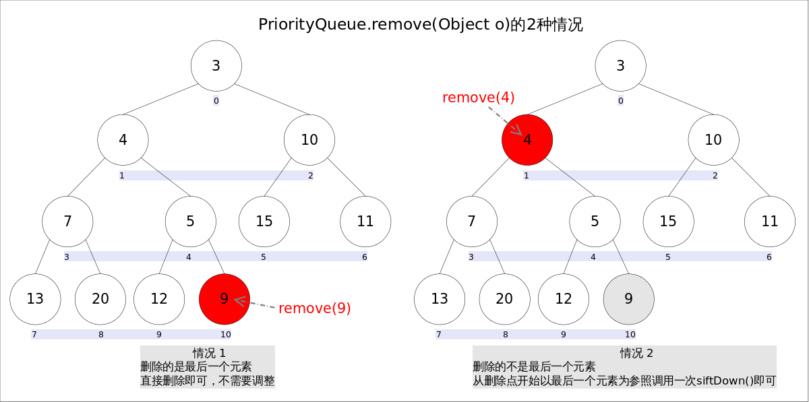

```JAVA
public boolean remove(Object o) {
    int i = indexOf(o);
    if (i == -1)
        return false;
    else {
        removeAt(i);
        return true;
    }
}

private int indexOf(Object o) {
    if (o != null) {
        for (int i = 0; i < size; i++)
            if (o.equals(queue[i]))
                return i;
    }
    return -1;
}

private E removeAt(int i) {
    // assert i >= 0 && i < size;
    modCount++;
    int s = --size;
    if (s == i) // removed last element
        queue[i] = null;
    else {
        E moved = (E) queue[s];
        queue[s] = null;
        siftDown(i, moved);
        if (queue[i] == moved) {
            siftUp(i, moved);
            if (queue[i] != moved)
                return moved;
        }
    }
    return null;
}
```

## 时间复杂度

大O表示法，代码执行时间随数据规模变化的变化趋势；不关心代码具体的执行时间
- $O(1)$：代码执行时间和数据规模无关
- $O(n)$：时间复杂度和数据规模 n 是线性关系
- $O(logn)$：时间复杂度和数据规模 n 是对数关系
- $O(n^2)$：两次嵌套循环
- $O(2^n)$：递归将问题拆分为两个子问题

## 泛型


**泛型类是具有一个或多个类型参数的类**
- 类型参数声明在类名后，用尖括号<>括起，使用具体类型替换类型参数以实例化泛型类
- **使用限定符`<E extends Father>`缩小泛型的类型参数范围，仅兼容`Father`及其子类元素**
- 可以将子类对象赋值给父类引用，因此`ArrayList<Father>`可以存放`Father`及其子类元素

```JAVA

public class ArrayList<E>{}

public class Main{
    public static void main(String[] args) {
        ArrayList<Father> fathers = new ArrayList<Father>();
        fathers.add(new Father());
        fathers.add(new Son());
        for (Father father : fathers) {
            System.out.println(father);
        }
    }
}
class Father {
    public String toString() {
        return "Father";
    }
}

class Son extends Father{
    public String toString() {
        return "Son";
    }
}

class GrandSon extends Son{
    public String toString() {
        return "GrandSon";
    }
}
```
**泛型方法**
- 可以在泛型类或非泛型类中定义泛型方法
- **泛型方法的类型参数独立于类的类型参数**，即使它们采用相同的符号
```JAVA
// 类的类型参数T
class Box<T> {       
    // 方法的类型参数T（与类的T无关）             
    public <T> void method(T t) {}
    // 使用不同符号更清晰
    public <U> U process(U u) {}
}
```


泛型提供了编译时类型检查，确保类型安全；实例化后，只能存入与指定类型兼容的元素

### 类型擦除

泛型仅在编译器检查，虚拟机会将泛型的类型变量擦除
- `<E>`，使用Object替换类型变量E
- `<E extends Father>`，使用Father替换类型变量E

类型擦除可能导致方法签名冲突，例如以下代码，擦除后方法签名相同会冲突
```JAVA
public class Cmower {
    
    public static void method(Arraylist<String> list) {
        System.out.println("Arraylist<String> list");
    }

    public static void method(Arraylist<Date> list) {
        System.out.println("Arraylist<Date> list");
    }

}
```
### 通配符
**泛型不变性**
- **协变**（covariant）：如果B是A的子类型，那么Generic`<B>`也是Generic`<A>`的子类型。
- **逆变**（contravariant）：如果B是A的子类型，那么Generic`<A>`是Generic`<B>`的子类型。
- **不变**（invariant）：Generic`<A>`和Generic`<B>`之间没有子类型关系，除非A和B完全相同

**通配符解决容器的协变问题，而不是容器内元素的协变问题**
- `ArrayList<Father>`容器天然可以添加Father及其子类，这是容器内元素的协变，是多态的性质，即父类引用可以安全的指向子类对象

#### **`<? extends T>`通配符**

由于泛型不变性，`ArrayList<Son>` 不是 `ArrayList<Father>` 的子类型

**`<? extends Father>`通配符赋予容器协变的能力**
- **`ArrayList<? extends Father>`只能通过`ArrayList<Father>`或`ArrayList<Son>`引用赋值**
- `ArrayList<? extends Father>`容器可以安全的将所有元素读取为Father类型
- 编译时：编译器仅能确定`ArrayList<? extends Father>`容器的元素类型是`? extends Father`，该类型不是Father或其任何一种子类，因此**无法向其添加任何元素**
  - 唯一例外的是 null，因为null是所有类型的对象
  - 下述代码中，`ArrayList<? extends Father>`和`ArrayList<Son>`引用指向同一个对象，假设用户可以可以向`ArrayList<? extends Father> fathers`添加元素，可能会添加Father对象；由于`ArrayList<Son>`只能接受Son及其子类，就造成了多态错误
```JAVA
    public static void main(String[] args) {
        ArrayList<Son> sons = new ArrayList<Son>();
        sons.add(new Son());
        ArrayList<? extends Father> fathers = sons;
        for (Father f : fathers) {
            System.out.println(f.toString());
        }
    }
```

#### `<? super Son>`通配符

**`<? super Son>`通配符赋予容器逆变的能力**
- `ArrayList<? super Son>`可以通过`ArrayList<Son>`或`ArrayList<Father>`引用赋值
- 通过多态、类型推断，可以安全的添加Son及其子类元素，但是无法添加Son的某个父类元素，例如Father
- `<? super Son>`读取时只能读取为Object，如果强制转换为具体类型，可能失败

```JAVA
ArrayList<? super Son> sons2 = new ArrayList<Son>();
sons2.add(new Son());
sons2.add(new GrandSon());
```


`<?>`无界通配符
- 可以理解为`<? extends Object>`，表示“完全未知的类型”
- 除了 null，不能添加任何元素，这是在编译器限制的，用户无法提供任何? extends Object类型的元素
- 读取 (get)：取出的元素只能是 Object 类型。
- `<?>`：只关心容器属性，而不关心其内部元素时使用
```JAVA
boolean isEmpty(List<?> list) { // 接受任何List，与元素类型无关
    return list == null || list.size() == 0;
}
```

#### 在方法参数中使用通配符
**PECS**：**生产时使用`? extends`协变，消费时使用`? super`逆变**。既是生产者也是消费者不能使用通配符
- 通配符为方法参数划定未知类型的上下限：
  - <? extends T> 设定了上界为T，表示未知类型是T或T的子类
  - <? super T> 设定了下界为T，表示未知类型是T或T的父类
  - <?> 无界通配符，相当于<? extends Object>，没有指定边界，但实际上是上界为Object
- 划定上下限后方法参数能适配更多类型，在保证类型安全的前提下尽可能地实现方法复用
```JAVA
// 上界通配符：只能接受Number及其子类的列表
public void processNumbers(List<? extends Number> list) {
    for (Number n : list) {
        System.out.println(n.doubleValue());
    }
}

// 下界通配符：只能接受Integer及其父类的列表
public void addInteger(List<? super Integer> list) {
    list.add(42);
}

// 限定 dest只能是T及其父类的列表，src只能是T及其子类的列表
public class Collections {
    public static <T> void copy(List<? super T> dest, List<? extends T> src) {}
}
public class Main{
    public static void main(String[] args) {
        /**
         *  objs 是 List<? super T> → T 可以是 Integer 或父类
         * ints 是 List<? extends T> → T 可以是 Integer 或父类
         * 两者交集：最小的共同类型是 Integer
         * 所以 T 被推断为 Integer
         * /
        List<Integer> ints = Arrays.asList(1, 2, 3);
        List<Object> objs = new ArrayList<>();
        Collections.copy(objs, ints);  // T 被推断为 Object
    }
}

```

- 传入指定类型为(T,R)的Function表达式，匹配T及其父类作为消费者，匹配R及其子类作为生产者作为返回值
```JAVA
@FunctionalInterface
public interface Function<T, R> {
    R apply(T t);
}
public interface CompletionStage<T> {
    public <U> CompletionStage<U> thenApply(Function<? super T,? extends U> fn);
}

//推断为thenApply(Function<? super String,? extends String> fn)
//允许传入任何类型的对象作为消费者
Function<Object, String> existingFunc = obj -> obj.toString().toUpperCase();
CompletableFuture.supplyAsync(() -> "Hello World").thenApply(existingFunc);
        
``` 

#### 在返回值中使用`<? extends Number>`


**在返回值中，通常使用<? extends T>来提供只读的、协变的返回值**，或者返回具体的泛型`<T>`。几乎不会使用`<? super T>`逆变
```java
// 1. 返回只读视图（生产者）
public List<? extends Number> getNumbers() {
    return Collections.unmodifiableList(numberList);
    // 调用方只能读取，不能修改
}

// 2. 返回类型未知但有限制的集合
public List<? extends Comparable<?>> getComparables() {
    return listOfComparables;  // 可以是任何可比较对象的列表
}

// 3. 返回完全未知的类型（少用）
public List<?> getUnknownList() {
    return someList;
}
```
## Iterable、Iterator

### Iterable接口

Collection接口扩展 **`Iterable`泛型接口**，通过`iterator()`方法获取可遍历集合的迭代器
- 是迭代器模式的标准实现：集合负责存储，迭代器负责遍历
  - **支持多种遍历方式**：一个集合可以有多个独立的迭代器；假设让集合直接集成迭代器，就只能支持一种迭代方式了；
  - Iterable表示该集合支持迭代，而Iterator表示如何迭代，而`Iterator<T> iterator();`表示标准迭代方式，由集合实现决定，集合也可以实现其他方法，返回不同的迭代器
  - 使用`Consumer<? super T>`能处理T及其所有子类，如果使用`Consumer<? extend T>`只能处理T或者其特定的一种子类

```java
public interface Iterable<T> {
    Iterator<T> iterator();

    //对该迭代器中的每个元素执行给定的操作，直到处理完所有元素或操作抛出异常。
    default void forEach(Consumer<? super T> action) {
        Objects.requireNonNull(action);
        for (T t : this) {
            action.accept(t);
        }
    }
}
```

`Map`接口是键值对集合，技术上可实现Iterable接口，但是会造成歧义，因此实际并没有这么做，而是通过`entrySet()、keySet()、values()`获取可迭代的**视图集合**。

视图：
-  视图（View）是底层数据结构的动态投影，它本身不存储数据，而是提供对底层数据的访问接口。
-  对视图的修改操作（如果支持）会直接影响底层数据结构，但并非所有视图都支持所有修改操作。

### Iterator迭代器

`Iterator<T>`接口为不同数据结构提供相同的单向遍历方式，隐藏内部存储细节

```JAVA
public interface Iterator<E> {
    // 判断集合中是否存在下一个对象
    boolean hasNext();
    // 返回集合中的下一个对象，并将访问指针移动一位
    E next();
    // 删除集合中调用next()方法返回的对象
    default void remove() {
        throw new UnsupportedOperationException("remove");
    }
}
```


- 先调用`hasNext()`确定存在下一个元素后，再调用`next()`，避免抛出`NoSuchElementException`异常

### 循环中结构性修改集合

阿里Java 开发手册里**禁止在 foreach 里进行元素的删除操作**

fail-fast：一旦检测到可能会发生错误，就立马抛出异常，程序将不再往下执行。

**在for-each循环中通过集合方法结构性修改集合**是错误的
- for-each反编译后，是使用迭代器进行遍历的
- ArrayList返回内部私有类Itr对象，在new时会将expectedModCount赋值为集合的modCount
- 执行集合的remove方法会执行modCount++
- 继续下一次循环执行next方法时，会执行checkForComodification()方法，检测到modCount不等于expectedModCount，抛出ConcurrentModificationException异常
```JAVA
//不允许
for (String str : list) {
    if ("沉默王二".equals(str)) {
        list.remove(str);
    }
}

//反编译代码
Iterator var2 = list.iterator();
while(var2.hasNext()) {
    String str = (String)var2.next();
    if ("沉默王二".equals(str)) {
        list.remove(str);
    }
}

public Iterator<E> iterator() {
    return new Itr();
}

public E remove(int index) {
    rangeCheck(index);

    modCount++;
    E oldValue = elementData(index);

    int numMoved = size - index - 1;
    if (numMoved > 0)
        System.arraycopy(elementData, index+1, elementData, index,
                            numMoved);
    elementData[--size] = null; // clear to let GC do its work

    return oldValue;
}

private class Itr implements Iterator<E> {
    //游标位置，即下一个元素的索引。
    int cursor;

    //上一个元素的索引。用于remove方法。-1代表没有上一个元素，在调用remove后该值将重新设置为-1，无论游标指向哪里
    int lastRet = -1;

    //预期的结构性修改次数。
    int expectedModCount = modCount;

    public E next() {
        checkForComodification();
        int i = cursor;
        if (i >= size)
            throw new NoSuchElementException();
        Object[] elementData = ArrayList.this.elementData;
        if (i >= elementData.length)
            throw new ConcurrentModificationException();
        cursor = i + 1;
        return (E) elementData[lastRet = i];
    }
    final void checkForComodification() {
        if (modCount != expectedModCount)
            throw new ConcurrentModificationException();
    }
}


```

在普通for循环中通过集合方法结构性修改集合
- 不会报错，但是编程逻辑错误
- 最后的结果是list仍有一个元素，即第二个元素被跳过了
- 第一次循环执行后，remove执行数组前移操作，get(1)将会获取第三个元素，第二个元素变为第一个元素
```JAVA
List<String> list = new ArrayList<>();
list.add("沉默王二");
list.add("沉默王二");
list.add("沉默王二");
for (int i = 0; i < list.size(); i++) {
    String str = list.get(i);
    if ("沉默王二".equals(str)) {
        list.remove(str);
    }
}
System.out.println(list);
```

迭代器循环中通过迭代器remove安全的结构性修改集合
- 在执行remove后，cursor被设置为上一个元素的位置，lastRet被设置为-1，表示没有上一个元素，因此连续调用remove会报错；
- 调用集合的remove方法并且同步更新expectedModCount = modCount;
- 正确的做法是确保，每次调用remove前先调用一次next方法，next方法会重置cursor和lastRet的值
```JAVA

private class Itr implements Iterator<E> {
    //游标位置，即下一个元素的索引。
    int cursor;

    //上一个元素的索引。用于remove方法。-1代表没有上一个元素，在调用remove后该值将重新设置为-1，无论游标指向哪里
    int lastRet = -1;

    //预期的结构性修改次数。
    int expectedModCount = modCount;
    public E next() {
        checkForComodification();
        int i = cursor;
        if (i >= size)
            throw new NoSuchElementException();
        Object[] elementData = ArrayList.this.elementData;
        if (i >= elementData.length)
            throw new ConcurrentModificationException();
        cursor = i + 1;
        return (E) elementData[lastRet = i];
    }

    /**
     * 删除最后一个返回的元素。
     * 迭代器只能删除最后一次调用 next 方法返回的元素。
     *
     * @throws ConcurrentModificationException 如果在最后一次调用 next 方法之后列表结构被修改，则抛出 ConcurrentModificationException 异常。
     * @throws IllegalStateException  如果尚未调用 next 方法，或者在调用 remove 之前已经调用过 remove（即上一次调用 next 之后已经调用过 remove）而没有再次调用 next，则抛出 IllegalStateException 异常。
     */
    public void remove() {
        // 检查在最后一次调用 next 方法之后是否进行了结构性修改
        if (expectedModCount != modCount) {
            throw new ConcurrentModificationException();
        }
        // 如果上一次调用 next 方法之前没有调用 remove 方法，则抛出 IllegalStateException 异常；同时避免连续调用两次remove方法，或者不调用next方法直接调用remove方法
        if (lastRet < 0) {
            throw new IllegalStateException();
        }
        try {
            // 调用 ArrayList 对象的 remove(int index) 方法删除上一个元素
            ArrayList.this.remove(lastRet);
            // 将游标位置设置为上一个元素的位置
            cursor = lastRet;
            // 将上一个元素的索引设置为 -1，表示没有上一个元素
            lastRet = -1;
            // 更新预期的结构性修改次数
            expectedModCount = modCount;
        } catch (IndexOutOfBoundsException ex) {
            throw new ConcurrentModificationException();
        }
    }
}

```

因为迭代器并没有add方法，因此无法在遍历中添加元素，常见的做法是收集元素然后addAll
- ArrayList实现了ListIterator提供add和set方法，可以在循环中通过该迭代器添加修改元素
```JAVA
// ✅ 正确做法：使用 ListIterator 在遍历中添加
List<String> items = new ArrayList<>(Arrays.asList("A", "B", "C"));
ListIterator<String> listIterator = items.listIterator();
while (listIterator.hasNext()) {
    String item = listIterator.next();
    if ("B".equals(item)) {
        listIterator.add("B+"); // 在当前元素后插入
    }
}
System.out.println(items); // 输出: [A, B, B+, C]
```

## Comparable、Comparator


```JAVA
public interface Comparable<T> {
    int compareTo(T t);
}


public interface Comparator<T> {
    int compare(T o1, T o2);
    boolean equals(Object obj);
}

public class Cmower  {
    private int age;
    private String name;

    public Cmower(int age, String name) {
        this.age = age;
        this.name = name;
    }
}

public class CmowerComparator implements Comparator<Cmower> {
    @Override
    public int compare(Cmower o1, Cmower o2) {
        return o1.getAge() - o2.getAge();
    }
}
```


# Java新特性

本章收录所有1.8及之后jdk版本增加的新特性
## 1.8+：Stream流式编程

配合lambda提高操作集合的效率，对数据源（数组、集合）执行多次中间操作，每次中间操作返回一个新的Stream，最后执行一次终端操作；特点是链式调用、懒惰计算


**创建流**
- **数组**：`Arrays.stream()`、`Stream.of()`
  - 其中`of()`方法内部调用`Arrays.stream()`
- **集合**：调用Collection接口的`Stream()`方法
  - 调用`parallelStream()`创建并发流，默认使用的是`ForkJoinPool.commonPool()`线程池


**操作流**
- **中间操作**会返回一个新的Stream，用于构建处理流水线，这些操作是“惰性的”，不会立即执行
- **终端操作**会触发实际计算，产生最终结果或副作用，操作完后该Stream被消耗掉了

| 类型 | 常见操作 | 核心作用与说明 |
| :--- | :--- | :--- |
| **中间操作** | **`filter(Predicate p)`** | **过滤**。接收条件，保留符合条件的元素。 |
| | **`map(Function f)`** | **映射**。将元素转换成其他形式或提取信息。 |
| | **`flatMap(Function f)`** | **扁平化映射**。将每个元素转换成一个流，然后把所有流连接成一个流。 |
| | **`distinct()`** | **去重**。根据元素的`equals()`和`hashCode()`去除重复元素。 |
| | **`sorted()` / `sorted(Comparator c)`** | **排序**。产生一个自然排序或按比较器排序的新流。 |
| | **`limit(long n)`** | **限制**。截取流的前n个元素。 |
| | **`skip(long n)`** | **跳过**。跳过流的前n个元素。 |
| | **`peek(Consumer c)`** | **窥视**。对每个元素执行操作，主要用于调试，查看流经的元素。 |
| **终端操作** | **`forEach(Consumer c)`** | **遍历**。对流中每个元素执行操作（无确定顺序，并行时）。 |
| | **`collect(Collector c)`** | **收集**。将流转换为其他形式（如List, Set, Map）。这是最核心的终端操作。 |
| | **`toArray()`** | **转为数组**。将流元素转换为一个数组。 |
| | **`reduce(...)`** | **归约**。将流中元素反复结合起来，得到一个值（如求和、最大值）。 |
| | **`min(Comparator c)` / `max(Comparator c)`** | **最值**。返回流中最小或最大的元素（按比较器）。 |
| | **`count()`** | **计数**。返回流中元素的总个数。 |
| | **`anyMatch(Predicate p)`** | **任意匹配**。检查是否**至少有一个**元素匹配条件。 |
| | **`allMatch(Predicate p)`** | **全部匹配**。检查是否**所有**元素都匹配条件。 |
| | **`noneMatch(Predicate p)`** | **无一匹配**。检查是否**没有**元素匹配条件。 |
| | **`findFirst()`** | **查找第一个**。返回流中**第一个**元素（在并行流中仍保证确定性）。 |
| | **`findAny()`** | **查找任意一个**。返回流中**任意一个**元素（在并行流中效率更高）。 |

**转换流**：将流转换为集合或数组
- toArray()：**将流转换成数组**

```JAVA
List<String> list = new ArrayList<>();
list.add("周杰伦");
list.add("王力宏");
list.add("陶喆");
list.add("林俊杰");

String[] strArray = list.stream().toArray(String[]::new);


```
- 配套使用 map() 方法和 collect() 方法**把一个集合按照某种规则转成另外一个集合**


```JAVA
List<Integer> list1 = list.stream().map(String::length).collect(Collectors.toList());
```


## 1.8+：Lambda函数式编程

Lambda：将代码块视为参数，作为返回值或参数
- 被`@FunctionalInterface` 标记的接口，可以通过Lambda表达式创建实例

```JAVA

@FunctionalInterface
public interface Runnable{
   public abstract void run();
}

public class LamadaTest {
    public static void main(String[] args) {
        new Thread(() -> System.out.println("沉默王二")).start();
    }
}
```

Lambda语法
- `( parameter-list ) -> { expression-or-statements }`
- 和匿名内部类一样，**编译器不允许在 Lambda 表达式主体内修改方法内的局部变量**，**也不允许定义同名变量**
- Lambda 表达式中要用到的，但又未在 Lambda 表达式中声明的变量，必须声明为 final 或者是 effectively final，否则就会出现编译错误。
  - effectively final：初始化后没有更改操作
```JAVA
public static void main(String[] args) {

    int limit = 10;
    Runnable r = () -> {
        int limit = 5;
        for (int i = 0; i < limit; i++)
            System.out.println(i);
    };
}
```

在 Lambda 表达式中修改变量的值
- 把 limit 变量声明为 static。

```JAVA
public class ModifyVariable2StaticInsideLambda {
    static int limit = 10;
    public static void main(String[] args) {
        Runnable r = () -> {
            limit = 5;
            for (int i = 0; i < limit; i++) {
                System.out.println(i);
            }
        };
        new Thread(r).start();
    }
}
```
- 把 limit 变量声明为 AtomicInteger。
  - AtomicInteger 可以确保 int 值的修改是原子性的
```JAVA
public class ModifyVariable2AtomicInsideLambda {
    public static void main(String[] args) {
        final AtomicInteger limit = new AtomicInteger(10);
        Runnable r = () -> {
            limit.set(5);
            for (int i = 0; i < limit.get(); i++) {
                System.out.println(i);
            }
        };
        new Thread(r).start();
    }
}
```
- 使用数组
```JAVA
public class ModifyVariable2ArrayInsideLambda {
    public static void main(String[] args) {
        final int [] limits = {10};
        Runnable r = () -> {
            limits[0] = 5;
            for (int i = 0; i < limits[0]; i++) {
                System.out.println(i);
            }
        };
        new Thread(r).start();
    }
}
```

**Lambda 和 this 关键字**
- Lambda 表达式并不会引入新的作用域，这一点和匿名内部类是不同的。也就是说，**Lambda 表达式主体内使用的 this 关键字和其所在的类实例相同**。

```JAVA
public class LamadaTest {
    public static void main(String[] args) {
        new LamadaTest().work();
    }

    public void work() {
        //main() 方法中通过 new 关键字创建的 LamadaTest 对象
        System.out.printf("this = %s%n", this);

        Runnable r = new Runnable()
        {
            @Override
            public void run()
            {
                //匿名内部类Runnable对象
                System.out.printf("this = %s%n", this);
            }
        };
        new Thread(r).start();
        //main() 方法中通过 new 关键字创建的 LamadaTest 对象
        new Thread(() -> System.out.printf("this = %s%n", this)).start();
    }
}
```


# NIO、Netty
## 理论知识
### 内存映射文件

内存映射文件是一种操作系统提供的高效文件I/O机制，通过mmap系统调用**将磁盘文件的一部分或全部直接映射到进程的虚拟地址空间中**。通过这种方式，**文件内容可以像访问内存一样被直接读写，无需使用传统的read()/write()系统调用**。适用于大文件处理

**mmap系统调用**
- **仅建立映射关系**，延迟加载到需要读写时，实际的IO磁盘调用由缺页中断完成，即**拷贝0次或1次**
- **映射模式**：`PROT_READ`, `PROT_WRITE`, `PROT_EXEC`
- **允许像内存一样随机访问文件**
- **是否线程共享**：
  - `MAP_SHARED`：修改对其他进程可见，会写回文件
  - `MAP_PRIVATE`；写时复制，修改对其他进程不可见，不写回文件
- **保护模式**
  - `PROT_READ`：允许读取该内存区域
  - `PROT_WRITE`：允许写入该内存区域
  - `PROT_EXEC`：允许在该内存区域执行指令。通常用于代码段，例如动态加载的库或者JIT编译的代码

### 缓冲区
**操作系统内核缓冲区Page Cache**
- 程序读写文件时，操作系统不能直接操作用户空间，只能从磁盘读然后写入**内核空间缓冲区**，或者从**内核空间缓冲区**读然后写入磁盘，随后切换上下文，由用户进程读写**内核空间缓冲区**，写出或拷贝到用户空间


**本地缓冲区（JNI中的临时缓冲区）**
- JNI代码调用系统函数读写内核缓冲区，写入或拷贝到本地缓冲区

**非直接缓冲区**
- Java堆上分配的数组，HeapXxxBuffer即在该缓冲区
  
**直接缓冲区DirectByteBuffer**
- 通过ByteBuffer.allocateDirect()方法分配，位置在堆外内存，不受JVM垃圾回收管理，由操作系统管理
- 直接内存Direct Memory，是JVM进程内存的一部分，但不在JVM堆中分配，而是通过系统本地方法在JVM堆外分配的内存。这部分内存由操作系统管理，JVM通过DirectByteBuffer对象来引用这块内存，并在适当的时候（如DirectByteBuffer被垃圾回收时）通过Cleaner机制释放。

**内存映射文件缓冲区MappedByteBuffer**
- 通过FileChannel.map()方法初始化，位置在文件映射内存，不受JVM垃圾回收管理，由操作系统管理

非直接缓冲区需要经过JNI的本地缓冲区中转，直接缓冲区直接经过操作系统调用访问堆外内存或文件映射内存，比非直接缓冲区少一次拷贝，性能更高。但是，直接缓冲区的创建和销毁成本较高，通常适用于需要长期存在且频繁I/O的场景。


### JAVA IO理论模型


java.io是同步阻塞式I/O（BIO），每个连接都需要一个独立的线程来处理，线程在I/O操作完成前会被阻塞
- DMA从磁盘文件批量拷贝到操作系统内核缓冲区Page Cache
- JNI从操作系统内核缓冲区拷贝到本地缓冲区（非直接缓冲区）
- 从本地缓冲区拷贝到JVM堆，到本步骤完成3次拷贝，两次上下文切换
- 如果使用BufferedInputStream，发生第4次拷贝，从Java堆到BufferedInputStream的内部缓冲区；在使用BufferedInputStream时，上述的3次拷贝都是批量拷贝
- java.io部分底层使用nio优化，但仍是同步阻塞的

java.nio.HeapXxxBuffer的数据流动路径
- DMA从磁盘文件**批量拷贝**到操作系统内核缓冲区Page Cache
- JNI从操作系统内核缓冲区**批量拷贝**到本地缓冲区（非直接缓冲区）
- 从本地缓冲区**批量拷贝**到JVM堆，到本步骤完成3次拷贝，两次上下文切换

java.nio.MapperByteBuffer的数据流动路径
- 持有指向内存映射文件的MapperByteBuffer引用
- 延迟加载到读写时，触发缺页中断，由中断程序完成从磁盘文件拷贝到内存映射文件的IO读写操作
- 通过MapperByteBuffer引用直接随机访问内存映射文件，整个过程仅发生0次或1次DMA拷贝

**JVM运行时数据区位于进程虚拟地址空间中的堆和栈区域**

| 区域 | 对应进程虚拟地址空间位置 | 线程共享 | 存储内容 |
| :--- | :--- | :--- | :--- |
| **程序计数器** | 寄存器/内存 | 线程私有 | 当前执行指令的地址 |
| **Java虚拟机栈** | **栈** | 线程私有 | 栈帧（局部变量表、操作数栈等） | 
| **本地方法栈** | **栈** | 线程私有 | Native方法服务 | 
| **Java堆** | **堆** | 共享 | **几乎所有的对象实例和数组** |
| **方法区（元空间）** | **堆**| 共享 | 类信息、常量、静态变量等（JDK8后为元空间，使用本地内存） |

指向内存映射区的引用：`MappedByteBuffer`及其相关类，这些对象通过`FileChannel.map()`方法创建。
- **即使Java中的引用被GC回收，文件映射内存的映射关系依然存在，直到MappedByteBuffer对象被显式清理或进程结束**

```JAVA
// mappedBuffer指向操作系统内核维护的内存映射区域
MappedByteBuffer mappedBuffer = fileChannel.map(
    FileChannel.MapMode.READ_WRITE, 0, fileSize
);

// 通过ByteBuffer引用指向
ByteBuffer buffer = fileChannel.map(MapMode.READ_WRITE, 0, fileSize);

// 通过视图缓冲区
IntBuffer intBuffer = buffer.asIntBuffer();
FloatBuffer floatBuffer = buffer.asFloatBuffer();
// 这些视图缓冲区间接引用内存映射区
```


## NIO概述 


**NIO基于Channel、Buffer操作文件，提供Selector解决BIO在处理大量并发连接时的性能瓶颈**
- **Channel** 、**Buffer**：**程序与磁盘文件、网络文件通过Buffer与Channel，以块的形式双向传输数据**
- **Selector**：
  - 服务于网络高并发，因为**磁盘文件读写总是处于就绪状态**
  - **Selector允许一个线程通过事件（连接就绪、读就绪、写就绪）驱动的方式**，**同时监管大量网络IO线程**

ps：**AIO异步非阻塞 I/O 模型在实际生产中未使用，Netty和Tomcat使用NIO**


**NIO与BIO**
- BIO是面向流的处理，**NIO是面向块的处理**
- 在NIO中，**Channel只负责运输块，操作块数据由Buffer缓冲区负责**
- **BIO是单向的，运输数据和操作数据的分离决定NIO是可以双向的**

## Buffer族

### Buffer抽象基类


#### Buffer状态机

Buffer**维护4个指针构成一个状态机**，**用于将固定容量的底层数组划分为不同区域**
- **`capacity`**：
  - 缓冲区最大容量，**在创建缓冲区时被设定后，之后不能再更改**，决定了底层数组的大小。
- **`limit`**：**数据读写的安全边界**
  - **写模式：通常等于capacity，表示可以写满**
  - **读模式：代表有效数据的终点，防止读到未初始化区域**
- **`position`**
  - **下一个要被读取或写入的元素的索引**
  - get()/put()会自动移动`position`
  - 初始为0，最大不超过limit
- **`mark`**：上一次读写的位置
- 状态机共4个状态：写无标记、写有标记、读无标记、读有标记
- 指针关系：`0 <= mark <= position <= limit <= capacity`
- 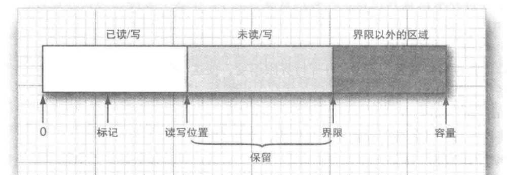
- 读写的模式由四个指针的状态决定， 没有显式维护


**Buffer基类仅定义缓冲区元数据相关API，缓冲区中数据的操作API以及缓冲区操作API由子类定义**


#### 状态修改与模式切换API

**六个状态修改API都支持链式操作**，其子类遵从Buffer的设计思路，内容相关API都支持链式操作

**读**
- `Buffer flip()`：**写模式 -> 读模式**
  - `limit = position`; `position = 0`; `mark = -1`;
  - 切换为读模式。将刚才写入的数据边界设为新的读取上限，然后从头开始读。
- `Buffer rewind()`：**重读**
  - `limit不变`; `position = 0`;` mark = -1`;	

**写**
- `Buffer clear()`：**任何模式 -> 写模式**
  - `limit = capacity`; `position = 0`; `mark = -1`;
  - 清空缓冲区以准备写入。并未擦除数据，只是重置指针，使新数据可以覆盖旧数据。
- `Buffer compact()`：**读模式 -> 写模式**
  - 将position到limit间未读数据拷贝到开头
  - `limit = capacity`;`position = 剩余数据数`; 

**标记**
- `Buffer mark()`：**任何模式下标记当前位置**
  - `mark = position`;
- `Buffer reset()`：**回溯到上次mark标记的位置**
  - mark不为-1时，`position = mark`;

#### 状态查询与检查API
```JAVA
// 1.1 核心状态查询
int capacity()     // 返回缓冲区的容量（固定值）
int position()     // 返回当前位置（下一个读写的位置）
int limit()        // 返回限制位置（第一个不能读写的位置）
boolean isReadOnly() // 是否是只读缓冲区

// 1.2 剩余空间计算
int remaining()    // 返回剩余可读写元素数 = limit - position
boolean hasRemaining() // 是否还有剩余元素可读写

// 1.3 特殊状态检查
boolean isDirect()    // 是否是直接缓冲区
boolean hasArray()    // 是否有底层数组
```


### Buffer族设计框架

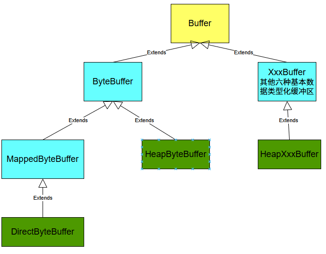

**Buffer抽象基类：定义缓冲区状态、状态转换方法**


**用户可见：7种基本数据类型缓冲区+MappedByteBuffer**
- **只有ByteBuffer能与Channel交互**
- **MappedByteBuffer**：
  - **继承`ByteBuffer`**，是**内存映射文件的抽象**，即**将文件的一部分或全部映射到内存中，通过直接操作内存来实现对文件的读写**
  - 操作系统直接在内存和磁盘之间传输数据，无需通过 Java 应用程序进行额外的数据拷贝


**用户不可见：存储实现层**： 
- 除ByteBuffer之外的6种基本数据类型缓冲区有两种实现方式
  - 第一种：**独立堆缓冲区**，底层声明各自类型的数组存放数据；例如`CharBuffer`的底层数组是`char[]`类型
  - 第二种：**ByteBuffer的视图**；通过ByteBuffer提供的`asCharBuffer()`、`asIntBuffer()` 等方法初始化；**视图与原缓冲区共享底层数据，但是独立维护自己的状态机指针**(`position,limit,mark`)，此时视图中的数组为null
- `DirectByteBuffer`：堆外内存抽象，`ByteBuffer.allocateDirect()`创建
- `MappedByteBuffer`：内存映射文件抽象，`FileChannel.map()`创建


### ByteBuffer

**为Java堆内存、堆外内存、内存映射文件提供一个统一的、类型安全的缓冲区抽象**
- **提供一致的`getXxx()、putXxx()`系列API**，遵照Buffer的设计思路，增加的**数据操作API方法**都**支持链式操作**
```JAVA
//返回HeapByteBuffer实现
ByteBuffer buffer = ByteBuffer.allocate(1024)
    .putInt(123)          // 写入int
    .putDouble(3.14)      // 写入double
    .flip();              // 切换为读模式
```
- **视图**
  - 字节序：大端序`ByteOrder.BIG_ENDIAN`是高位在前，小端序`ByteOrder.LITTLE_ENDIAN`是低位在前
```JAVA
// 视图机制：多种数据类型的统一视图
buffer.order(ByteOrder.LITTLE_ENDIAN);  // 设置字节序

// 创建不同类型视图（共享底层数据）
CharBuffer charView = buffer.asCharBuffer();
IntBuffer intView = buffer.asIntBuffer();
FloatBuffer floatView = buffer.asFloatBuffer();

// 切片：创建子缓冲区（共享底层数据）
ByteBuffer slice = buffer.slice();  // 共享数据，独立位置信息
```

#### MappedByteBuffer

`MappedByteBuffer`：内存映射文件的抽象，消除用户空间与内核空间的数据拷贝，提供对操作系统方法的java包装，具有如下特性：
- 依赖操作系统的缺页中断按需加载
- 依靠操作系统的页缓存实现性能优化
- 利用操作系统的回写机制保证数据一致性

只能通过`FileChannel`的`map`方法创建
- **MapMode**共三种：
  - `FileChannel.MapMode.READ_ONLY`：只读，线程共享
  - `FileChannel.MapMode.READ_WRITE`：可写（自然可读），**线程共享，同步修改到文件**
  - `FileChannel.MapMode.PRIVATE`：可写（自然可读），线程不共享，**写时复制，修改的是副本，不写回磁盘，不会影响源文件**。要么保存到新文件，要么先使用`PRIVATE`模式，修改结束后使用`READ_WRITE`写回源文件
- **调用`map`时不会执行IO操作加载到内存**
```JAVA
public abstract class FileChannel...{
    public abstract MappedByteBuffer map(MapMode mode,long position, long size)
        throws IOException;
}

MappedByteBuffer mappedByteBuffer = sourceChannel.map(FileChannel.MapMode.READ_ONLY, 0, sourceChannel.size());

```

**只需增加内存映射文件相关链式操作API**
- `load()`：预加载整个映射文件到内存中，调用此方法可能会造成大量的页错误和IO操作
- `force()` ：将缓冲区的修改强制写入存储设备
  - 操作系统仅写回脏页，未修改页不会写回
  - 如果是本地存储设备，则保证自创建此缓冲区以来或自上次调用此方法以来对缓冲区所做的所有更改都写入该设备；非本地设备不保证写入
  - `PRIVATE`模式下，该操作是空操作，仅在`READ_WRITE`模式下有效
- `isLoaded()` ：判断映射文件的内容是否已经加载到物理内存中
  - 返回true仅表示整个映射文件都在内存中，但之后可能由于内存压力被操作系统换出。
```JAVA
MappedByteBuffer load();
MappedByteBuffer force() 
boolean isLoaded() 
```
#### DirectByteBuffer

继承自`MapperByteBuffer`，通过`ByteBuffer`的`ByteBuffer allocateDirect(int capacity)`方法创建


```JAVA
ByteBuffer directBuffer = ByteBuffer.allocateDirect(1024)
```

**DirectByteBuffer 使用 Cleaner 管理原生内存生命周期**
- `Cleaner` 继承自 `PhantomReference`虚引用，DirectByteBuffer强引用GC后，会通过`Cleaner`执行内存回收
- 没有实现AutoCloseable接口，无法在try-resources语句中自动关闭


### 基本类型缓冲区

只有`ByteBuffer`能直接与`Channel`交互，其他类型缓冲区主要用于内存中的数据操作而非 I/O 传输
- 内存数据处理的类型安全
```JAVA
// ByteBuffer 需要手动编码/解码
ByteBuffer byteBuffer = ByteBuffer.allocate(1024);
byteBuffer.putInt(123);  // 需要知道字节顺序和编码
byteBuffer.flip();
int value = byteBuffer.getInt();  // 需要按相同方式解码

// IntBuffer 提供类型安全操作
IntBuffer intBuffer = IntBuffer.allocate(256);
intBuffer.put(123);  // 直接操作 int
intBuffer.flip();
int value = intBuffer.get();  // 直接读取 int


// CharBuffer 用于文本处理
CharBuffer charBuffer = CharBuffer.allocate(1024);
String text = "Hello, 世界";
charBuffer.put(text);

// 字符集编码
charBuffer.flip();
Charset charset = StandardCharsets.UTF_8;
ByteBuffer byteBuffer = charset.encode(charBuffer);

// 注意：实际I/O仍使用ByteBuffer
channel.write(byteBuffer);
```
#### 所有基本类型缓冲区都有的 API

基本类型缓冲区通过`allocate`方法获取非直接内存缓冲区，提供Buffer基类提供`boolean isDirect()`方法判断是否为直接内存，提供一致的数据操作API，不再赘述
```JAVA
// 分配堆内存缓冲区
public static XxxBuffer allocate(int capacity)

// 包装数组（共享底层数组）
public static XxxBuffer wrap(xxx[] array)
public static XxxBuffer wrap(xxx[] array, int offset, int length)

// 示例：
ByteBuffer.allocate(1024)     // 字节缓冲区
CharBuffer.allocate(512)      // 字符缓冲区
IntBuffer.allocate(256)       // 整数缓冲区
DoubleBuffer.allocate(128)    // 双精度缓冲区

```
```JAVA
// 创建共享底层数据的视图
public abstract XxxBuffer duplicate()   // 完整副本
public abstract XxxBuffer slice()       // 当前位置到limit的子序列
public abstract XxxBuffer asReadOnlyBuffer()  // 只读视图

// 示例：
IntBuffer original = IntBuffer.allocate(100);
IntBuffer duplicate = original.duplicate();  // 共享数据，独立状态
IntBuffer slice = original.slice();          // 共享部分数据
IntBuffer readOnly = original.asReadOnlyBuffer();

```
```JAVA
// 缓冲区比较（基于剩余元素）
public int compareTo(XxxBuffer that)

// 元素查找
public int position()                    // 查找第一个匹配元素
public int position(int index)           // 从指定位置开始查找

// 示例：
IntBuffer buf1 = IntBuffer.wrap(new int[]{1, 2, 3, 4});
IntBuffer buf2 = IntBuffer.wrap(new int[]{1, 2, 3, 5});
int result = buf1.compareTo(buf2);  // 比较剩余元素

```
```JAVA
// 是否只读
public abstract boolean isReadOnly()

// 是否有剩余元素
public final boolean hasRemaining()      // position < limit
public final int remaining()            // limit - position

// 数组支持检查
public final boolean hasArray()         // 是否有可访问的数组
public final xxx[] array()              // 获取底层数组（如支持）
public final int arrayOffset()          // 数组中的偏移量
```
####  CharBuffer 的文本处理扩展
```JAVA
// CharBuffer 额外实现了 CharSequence 和 Appendable 接口

// CharSequence 方法
public char charAt(int index)
public int length()                     // 返回 remaining()
public CharSequence subSequence(int start, int end)
public String toString()               // 返回剩余字符的字符串

// Appendable 方法
public CharBuffer append(CharSequence csq)
public CharBuffer append(CharSequence csq, int start, int end)
public CharBuffer append(char c)

// 字符编码解码（与 ByteBuffer 配合）
public static CharsetEncoder encoder()
public static CharsetDecoder decoder()
```

#### ByteBuffer 独有的 API

**字节顺序控制**
- `ByteOrder.BIG_ENDIAN`：大端序（网络字节序）
- `ByteOrder.LITTLE_ENDIAN`：小端序（x86架构默认）
- `ByteOrder.nativeOrder()`：获取当前平台字节顺序
```JAVA
ByteOrder order()
public abstract ByteBuffer order(ByteOrder bo)
```


**ByteBuffer提供视图方法**
```JAVA
public abstract CharBuffer asCharBuffer()     // 2字节单位
public abstract ShortBuffer asShortBuffer()   // 2字节单位  
public abstract IntBuffer asIntBuffer()       // 4字节单位
public abstract LongBuffer asLongBuffer()     // 8字节单位
public abstract FloatBuffer asFloatBuffer()   // 4字节单位
public abstract DoubleBuffer asDoubleBuffer() // 8字节单位

ByteBuffer byteBuf = ByteBuffer.allocate(100);
IntBuffer intBuf = byteBuf.asIntBuffer();  // 25个int的视图
```


## FileChannel


**Channel通道只负责传输数据、不直接操作数据**。只能通过Buffer缓冲区操作数据
- 通道可以分为两大类：**文件通道和套接字通道**
- **FileChannel**：**阻塞式文件操作（不能设置为非阻塞模式）**
  - 支持文件的读、写和追加操作，允许在文件的任意位置进行数据传输，以及其他更高级的功能
- **SocketChannel、ServerSocketChannel、DatagramChannel**：**支持非阻塞模式**
- Channel读写Buffer时，确保Buffer处于相应的读写模式下，错误的模式可能导致读写不成功


**创建`FileChannel`通道**：`FileChannel`实现`ReadableByteChannel`、 `WritableByteChannel`接口，在创建时可以指定模式
- `StandardOpenOption.READ`：只读，不能修改，**文件不存在抛出NoSuchFileException**
- `StandardOpenOption.WRITE`：**只写**，覆盖原文件，文件不存在会抛出 NoSuchFileException
  - 如果覆盖内容比原内容短，则会残留原内容
- `StandardOpenOption.APPEND`：必须与`WRITE`组合使用，指针position初始化为0，追加内容到文件末尾
- `StandardOpenOption.TRUNCATE_EXISTING`：清空原文件，文件不存在会抛出异常
- `StandardOpenOption.CREATE`：如果文件不存在则创建，存在则打开
- `StandardOpenOption.CREATE_NEW`：必须创建新文件，如果已存在则抛出 FileAlreadyExistsException
  - `CREATE_NEW`和`CREATE`确保检查文件和创建文件是原子性操作，并发环境下不会同时创建多个文件
- `StandardOpenOption.SPARSE`：提供操作系统创建的是稀疏文件
- `StandardOpenOption.SYNC`：完全同步，每次写入都强制刷新到磁盘
- `StandardOpenOption.DSYNC`：只同步文件内容，不同步元数据（如修改时间）
```JAVA

public static FileChannel open(Path path, OpenOption... options)
public enum StandardOpenOption implements OpenOption {
    //只读
    READ,
    //只写，覆盖写
    WRITE,
    //指针position初始位置在文件末尾，将数据追加到文件末尾而不是从头开始写，APPEND 必须与 WRITE 一起使用
    APPEND,
    TRUNCATE_EXISTING,
    CREATE,
    CREATE_NEW,
    DELETE_ON_CLOSE,
    SPARSE,
    SYNC,
    DSYNC;
}

```

```JAVA
Path filePath = Paths.get("test.dat");
FileChannel channel = FileChannel.open(
                filePath,
                StandardOpenOption.READ,
                StandardOpenOption.WRITE,
                StandardOpenOption.CREATE)

```
使用**FileChannel 配合 ByteBuffer 缓冲区**实现**文件复制**的功能：
```JAVA
Path des = Paths.get("C:\\Users\\Administrator\\Desktop\\des.txt");
Path sou = Paths.get("C:\\Users\\Administrator\\Desktop\\sou.txt");
try (FileChannel sourceChannel = FileChannel.open(sou, StandardOpenOption.READ);
    FileChannel destinationChannel = FileChannel.open(
        des, 
        StandardOpenOption.WRITE,
        StandardOpenOption.TRUNCATE_EXISTING)) {

    ByteBuffer buffer = ByteBuffer.allocate(1024);

    while (sourceChannel.read(buffer) != -1) {
        //切换为读模式
          buffer.flip();
          destinationChannel.write(buffer);
          buffer.clear();
    }
}
```

使用**FileChannel 配合 ByteBuffer 缓冲区**实现**文件写入**的功能
```JAVA
try (FileChannel fileChannel = FileChannel.open(
        des,
        StandardOpenOption.WRITE, StandardOpenOption.APPEND)) {

    String appendText = "\n追加内容";

    ByteBuffer buffer = ByteBuffer.wrap(appendText.getBytes(StandardCharsets.UTF_8));
    for(int count=1000;count>0;count--) {
        buffer.rewind();
        fileChannel.write(buffer);
    }

} catch (IOException e) {
    throw new RuntimeException(e);
}
```

**使用内存映射文件MappedByteBuffer的方式实现文件复制的功能**


```JAVA
Path des = Paths.get("C:\\Users\\Administrator\\Desktop\\des.txt");
Path sou = Paths.get("C:\\Users\\Administrator\\Desktop\\Java\\Java基础笔记.md");
try (FileChannel sourceChannel = FileChannel.open(sou, StandardOpenOption.READ);
      FileChannel destinationChannel = FileChannel.open(des, StandardOpenOption.WRITE, StandardOpenOption.CREATE, StandardOpenOption.READ)) {

    long fileSize = sourceChannel.size();
    MappedByteBuffer sourceMappedBuffer = sourceChannel.map(FileChannel.MapMode.READ_ONLY, 0, fileSize);
    MappedByteBuffer destinationMappedBuffer = destinationChannel.map(FileChannel.MapMode.READ_WRITE, 0, fileSize);

    for (int i = 0; i < fileSize; i++) {
        byte b = sourceMappedBuffer.get(i);
        destinationMappedBuffer.put(i, b);
    }
} catch (IOException e) {
    throw new RuntimeException(e);
}
```


**通道之间通过transferTo()实现数据的传输**：完全不经过用户空间
- 共两次拷贝：
  - 磁盘文件 → 内核缓冲区（DMA拷贝）
  - 内核缓冲区 → 目标文件缓冲区（DMA拷贝）
- 数据直接从源文件描述符传输到目标文件描述符，完全在操作系统内核空间完成
- `transferTo() `方法可能无法一次传输所有请求的字节，受限于操作系统，
```JAVA

/**
 * position：源文件中开始传输的位置。
 * count：要传输的字节数。
 * target：接收数据的目标通道
*/
public abstract long transferTo(long position, long count,
                                WritableByteChannel target)
    throws IOException;


Path dest = Paths.get("C:\\Users\\Administrator\\Desktop\\des.txt");
Path source = Paths.get("C:\\Users\\Administrator\\Desktop\\Java\\Java基础笔记.md");

try (FileChannel sourceChannel = FileChannel.open(source, StandardOpenOption.READ);
      FileChannel destChannel = FileChannel.open(dest,
              StandardOpenOption.WRITE,
              StandardOpenOption.CREATE,
              StandardOpenOption.TRUNCATE_EXISTING)) {

    // 获取文件总大小
    long fileSize = sourceChannel.size();
    long totalTransferred = 0;
    // 循环传输直到所有字节都传输完成
    while (totalTransferred < fileSize) {
        // 每次传输剩余的部分
        long transferred = sourceChannel.transferTo(
                totalTransferred,           // 从已传输的位置开始
                fileSize - totalTransferred, // 传输剩余字节
                destChannel);
        if (transferred <= 0) {
            // 如果没有传输任何字节，可能是遇到了问题
            System.err.println("传输中断，已传输: " + totalTransferred + " 字节");
            break;
        }
        totalTransferred += transferred;
    }
} catch (IOException e) {
    throw new RuntimeException(e);
}
```


## Paths、Files

### Paths和Path
`Paths` 工具类，nio文件操作的入口，核心作用是获取`Path`对象，`Path`接口代表文件系统中的一个路径。

**创建 Path 对象**
```java
// 创建相对路径
Path relPath = Paths.get("example.txt");
// 创建绝对路径
Path absPath = Paths.get("/home/user/example.txt");
```

---

**Path 接口的常用方法**
```java
Path path = Paths.get("docs/配套教程.md");

path.getFileName();    // 获取文件名
path.getParent();      // 获取父目录路径
path.getRoot();        // 获取根目录
path.toAbsolutePath(); // 转换为绝对路径
path.normalize();      // 简化路径（移除冗余的`.`和`..`）

// 路径组合与计算
Path base = Paths.get("/docs/");
Path target = Paths.get("/docs/imgs/itwanger");
base.resolve("config/app.properties"); // 组合路径
base.relativize(target);               // 计算相对路径
```

---

**`Files`不适合以下场景**
- **不支持大文件处理**（如超过几百MB）：`Files.readAllLines()` 加载全部内容到内存，可能抛出`OutOfMemoryError`
- **不支持随机访问**：无法在文件任意位置进行读写。
- **不支持文件锁定**：无法保证并发安全
- **不支持零拷贝传输**：`FileChannel`的`transferTo()`方法
- **不支持直接内存操作**：`MappedByteBuffer`

**`Files`适合以下场景**
- 操作配置文件、文本日志（文件不大）。
- 需要复制、移动、删除文件或创建目录。
- 快速读取文件全部内容（如 readAllBytes）或全部行（如 readAllLines）。
- 进行简单的文件属性判断（如 exists, isDirectory, size）

---

### 基础文件操作
| 操作 | 方法 | 说明与常用选项 |
| :--- | :--- | :--- |
| **检查存在** | `Files.exists(Path path)` | 检查文件或目录是否存在 |
| **创建文件** | `Files.createFile(Path path, FileAttribute...)` | 可设置文件属性（如权限） |
| **创建目录** | `Files.createDirectory(Path dir, FileAttribute...)` | 创建单级目录 |
| **删除** | `Files.delete(Path path)` | 删除文件或**空**目录 |
| **复制** | `Files.copy(Path source, Path target, CopyOption...)` | 选项：`StandardCopyOption.REPLACE_EXISTING`（覆盖）, `COPY_ATTRIBUTES`（复制属性） |
| **移动/重命名** | `Files.move(Path source, Path target, CopyOption...)` | 选项同上 |


**文件属性`FileAttribute`**
- windows的文件属性设置比Linux复杂得多，仅介绍在Linux中设置文件属性
- **Linux使用9个二进制位控制文件权限**
  - Linux固定三个角色：用户（主人） 组（队友） 其他（外人）
  - 可分别提供rwx权限，对应权限为：读、写、执行
  - `rw-r-----`表示仅用户可写，仅用户和组可读，例如配置文件
  - `rwx------`：仅用户可读、写、执行，例如启动脚本
  - `rw-rw-r--`：所有人都可读，用户和组可写，例如日志文件
- **`PosixFilePermissions`提供转换为`FileAttribute`的方法，仅适用于Linux等支持 POSIX 的系统，windows将静默忽略**

```JAVA
public enum PosixFilePermission {
    OWNER_READ,
    OWNER_WRITE,
    OWNER_EXECUTE,
    GROUP_READ,
    GROUP_WRITE,
    GROUP_EXECUTE,
    OTHERS_READ,
    OTHERS_WRITE,
    OTHERS_EXECUTE;
}

Files.setPosixFilePermissions(config, PosixFilePermissions.fromString("rw-r-----"));

```

- 在执行createDirectory或createFile时，指定文件属性，避免先创建后修改可能引发的竞态条件，保证原子性，文件一经创建就立刻拥有指定权限
```JAVA

Files.createFile(
    Paths.get("secret.txt"), 
        PosixFilePermissions.asFileAttribute(
            PosixFilePermissions.fromString("rw-r-----")));

```


**标记接口`CopyOption`**：控制复制`Files.copy()`和移动`Files.move()` 方法的行为，有两个主要的实现枚举类：`StandardCopyOption` 和 `LinkOption`。

- `StandardCopyOption`
  - `StandardCopyOption.REPLACE_EXISTING`：**覆盖已存在的目标文件**
    - 如果没有此选项，当目标文件存在时，操作会抛出 FileAlreadyExistsException。
  - `StandardCopyOption.COPY_ATTRIBUTES`：**尽可能多地复制文件的属性**
    - 如最后修改时间、最后访问时间、权限等
    - 如果不指定，目标文件将只保留基本属性，时间戳会更新为复制时间。
  - `StandardCopyOption.ATOMIC_MOVE`：**保证移动操作是原子的**。要么完全成功，要么完全失败

```JAVA

public enum StandardCopyOption implements CopyOption {
    REPLACE_EXISTING,
    COPY_ATTRIBUTES,
    ATOMIC_MOVE;
}

Path source = Paths.get("original.txt");
Path target = Paths.get("backup.txt");

Files.writeString(source, "原始数据", StandardOpenOption.CREATE);

// 复制并替换已存在文件，同时复制属性
Files.copy(source,
            target,
            StandardCopyOption.REPLACE_EXISTING,
            StandardCopyOption.COPY_ATTRIBUTES); // 保留原文件属性
```
- `LinkOption`：仅有`LinkOption.NOFOLLOW_LINKS`一个枚举值
  - 如果源Path是符号链接（类似windows的快捷方式），则复制的Path也是符号链接
```JAVA
public enum LinkOption implements OpenOption, CopyOption {
    NOFOLLOW_LINKS;
}

// 假设 /home/user/real_file 是真实文件，link_to_file 是指向它的符号链接
Path link = Paths.get("/home/user/link_to_file");
Path linkCopy = Paths.get("/home/user/link_to_file_copy");

// 不跟随链接，复制的是符号链接这个“快捷方式”文件本身
Files.copy(link, linkCopy, LinkOption.NOFOLLOW_LINKS);
// 此时 linkCopy 也是一个符号链接，指向同一个 real_file
```

---

### 文件读写操作

| 用途 | 方法 | 说明 |
| :--- | :--- | :--- |
| **读取所有行** | `Files.readAllLines(Path path, Charset cs)` | 返回 `List<String>` |
| **写入行** | `Files.write(Path path, Iterable lines, Charset cs, OpenOption...)` | 可指定`StandardOpenOption` |
| **缓冲读取器** | `Files.newBufferedReader(Path path, Charset cs)` | 返回 `BufferedReader` |
| **缓冲写入器** | `Files.newBufferedWriter(Path path, Charset cs, OpenOption...)` | 返回 `BufferedWriter` |


读取小配置文件、文本时，使用`readAllLines`方法将整个文件读取到堆中`List<String>`
- 不接受 OpenOption 参数，隐式使用 StandardOpenOption.READ。
```JAVA
try {
    List<String> strings=Files.readAllLines(source);
    System.out.println(strings);
} catch (IOException e) {
    throw new RuntimeException(e);
}
```
对于较大的文件：使用流式读取器newBufferedReader按需、逐行读取文件，而不是一次性加载全部内容。
- 不接受 OpenOption 参数，隐式使用 StandardOpenOption.READ。
```JAVA
Path source = Paths.get("C:\\Users\\Administrator\\Desktop\\Java\\Java基础笔记.md");

        try (BufferedReader reader = Files.newBufferedReader(source, StandardCharsets.UTF_8)) {
            String line;
            int count=10;
            // 每次 readLine() 只从磁盘加载一部分数据，内存占用恒定且很小
            while ((line = reader.readLine()) != null&&count>0) {
                System.out.println(line);
                count--;
            }
        } catch (IOException e) {
            throw new RuntimeException(e);
        }
```

将字符串集合（Iterable，如 List<String>）一次性写入文件，保证原子性。每个元素作为一行写入，行与行之间会自动插入系统的行分隔符
- `StandardOpenOption.READ`：只读，不能修改，**文件不存在抛出NoSuchFileException**
- `StandardOpenOption.WRITE`：**只写**，覆盖原文件，文件不存在会抛出 NoSuchFileException
  - 如果覆盖内容比原内容短，则会残留原内容
- `StandardOpenOption.APPEND`：必须与`WRITE`组合使用，指针position初始化为0，追加内容到文件末尾
- `StandardOpenOption.TRUNCATE_EXISTING`：清空原文件，文件不存在会抛出异常
- `StandardOpenOption.CREATE`：如果文件不存在则创建，存在则打开
- `StandardOpenOption.CREATE_NEW`：必须创建新文件，如果已存在则抛出 FileAlreadyExistsException
  - `CREATE_NEW`和`CREATE`确保检查文件和创建文件是原子性操作，并发环境下不会同时创建多个文件
- `StandardOpenOption.SPARSE`：提供操作系统创建的是稀疏文件
- `StandardOpenOption.SYNC`：完全同步，每次写入都强制刷新到磁盘
- `StandardOpenOption.DSYNC`：只同步文件内容，不同步元数据（如修改时间）
```JAVA
Path dest = Paths.get("C:\\Users\\Administrator\\Desktop\\des.txt");
List<String> configLines = Arrays.asList("server.port=8080", "debug=true");
// 模式1：覆盖写入（默认）
try {
    Files.write(dest, configLines, StandardCharsets.UTF_8);
} catch (IOException e) {
    throw new RuntimeException(e);
}
// 模式2：追加写入
try {
    Files.write(dest,
            Arrays.asList("New log entry"),
            StandardCharsets.UTF_8,
            StandardOpenOption.CREATE,
            StandardOpenOption.APPEND); // 关键：使用 APPEND
} catch (IOException e) {
    throw new RuntimeException(e);
}

```

流式写入器；newBufferedWriter，分批、多次调用 write() 或 append() 方法来写入内容。
- BufferedWriter提供append增强write方法，提供链式操作和更多参数类型支持。
```JAVA
try (BufferedWriter writer = Files.newBufferedWriter(Paths.get("output.txt"), 
                                                     StandardCharsets.UTF_8,
                                                     StandardOpenOption.CREATE, 
                                                     StandardOpenOption.APPEND)) { // 追加模式
    writer.write("Header:");
    writer.newLine(); // 写入一个系统相关的行分隔符
    writer.append("Some data...");
    // 可以灵活控制何时写入、写入什么
}
```

Charset：优先使用 StandardCharsets.UTF_8
- 平台默认编码随系统、区域设置变化

---
### walkFileTree()

Files.walkFileTree()通过回调方法**在遍历的每个关键节点注入自定义逻辑，提供了高度可控的递归遍历能力**
```JAVA
// 基础版本：深度优先遍历，无最大深度限制
public static Path walkFileTree(Path start, FileVisitor<? super Path> visitor)
    throws IOException

// 完整版本：可控制遍历深度和选项
public static Path walkFileTree(Path start,
                            Set<FileVisitOption> options,
                            int maxDepth,
                            FileVisitor<? super Path> visitor)
                                throws IOException
```

**FileVisitor 接口的四个关键方法**

| 方法 | 调用时机 | 返回值控制 | 典型用途 |
|:---|:---|:---|:---|
| **`preVisitDirectory`** | 进入目录**前** | 可跳过此目录或兄弟目录 | 权限检查、目录过滤 |
| **`visitFile`** | 访问文件时 | 可终止遍历 | 文件处理、搜索、统计 |
| **`postVisitDirectory`** | 退出目录**后** | 可跳过兄弟目录 | 清理资源、后处理 |
| **`visitFileFailed`** | 访问失败时 | 可决定是否继续 | 错误处理、权限记录 |

```java
public interface FileVisitor<T> {
    FileVisitResult preVisitDirectory(T dir, BasicFileAttributes attrs)
        throws IOException;
    FileVisitResult visitFile(T file, BasicFileAttributes attrs)
        throws IOException;
    FileVisitResult visitFileFailed(T file, IOException exc)
        throws IOException;
    FileVisitResult postVisitDirectory(T dir, IOException exc)
        throws IOException;
}

```
**FileVisitResult 遍历控制枚举**

```java
public enum FileVisitResult {
    CONTINUE,        // 继续遍历
    TERMINATE,       // 立即终止整个遍历
    SKIP_SIBLINGS,   // 跳过当前节点的兄弟节点
    SKIP_SUBTREE     // 跳过当前目录的子目录（仅对 preVisitDirectory 有效）
}
```
#### 打印目录树结构

```JAVA
public class BasicTreeWalker {
    private static Path dest = Paths.get("C:\\Users\\Administrator\\Desktop\\des.txt");
    public static void printDirectoryTree(Path startDir) throws IOException {
        Files.walkFileTree(startDir, new SimpleFileVisitor<Path>() {
            private int depth = 0;

            @Override
            public FileVisitResult preVisitDirectory(Path dir, BasicFileAttributes attrs) {
                // 打印缩进和目录名
                try {
                    Files.write(dest, List.of("  ".repeat(depth) + "📁 " + dir.getFileName()), StandardCharsets.UTF_8,
                            StandardOpenOption.CREATE,
                            StandardOpenOption.APPEND);
                } catch (IOException e) {
                    throw new RuntimeException(e);
                }
                depth++;
                return FileVisitResult.CONTINUE;
            }

            @Override
            public FileVisitResult visitFile(Path file, BasicFileAttributes attrs) {
                String size = String.format("%,d bytes", attrs.size());
                try {
                    Files.write(dest, List.of("  ".repeat(depth) + "📄 " + file.getFileName() + " (" + size + ")"), StandardCharsets.UTF_8,
                            StandardOpenOption.CREATE,
                            StandardOpenOption.APPEND);
                } catch (IOException e) {
                    throw new RuntimeException(e);
                }
                return FileVisitResult.CONTINUE;
            }

            @Override
            public FileVisitResult postVisitDirectory(Path dir, IOException exc) {
                depth--;
                return FileVisitResult.CONTINUE;
            }

            @Override
            public FileVisitResult visitFileFailed(Path file, IOException exc) {
                System.err.println("无法访问: " + file + " - " + exc.getMessage());
                return FileVisitResult.CONTINUE; // 继续处理其他文件
            }
        });
    }

    public static void main(String[] args) throws IOException {
        Path projectDir = Paths.get("C:\\Users\\Administrator\\Desktop");
        printDirectoryTree(projectDir);
    }
}
```

#### 文件搜索

```java
public class FileSearchExample {

    /**
     * 在目录树中搜索文件（支持通配符匹配）
     * @param startDir 起始目录
     * @param pattern 文件名模式（如 "*.log", "config*.yml"）
     * @return 找到的所有文件路径列表
     */
    public static List<Path> searchFiles(Path startDir, String pattern) throws IOException {
        List<Path> foundFiles = new ArrayList<>();

        Files.walkFileTree(startDir, new SimpleFileVisitor<Path>() {
            @Override
            public FileVisitResult visitFile(Path file, BasicFileAttributes attrs) {
                String fileName = file.getFileName().toString();

                // 简单通配符匹配：* 代表任意字符
                if (matchesPattern(fileName, pattern)) {
                    foundFiles.add(file);
                    System.out.println("找到: " + file.toAbsolutePath());
                }
                return FileVisitResult.CONTINUE;
            }

            private boolean matchesPattern(String fileName, String pattern) {
                // 将通配符 * 转换为正则表达式 .*
                String regex = pattern.replace(".", "\\.").replace("*", ".*");
                return fileName.matches(regex);
            }

            @Override
            public FileVisitResult visitFileFailed(Path file, IOException exc) {
                System.err.println("搜索时无法访问: " + file);
                return FileVisitResult.CONTINUE;
            }
        });

        return foundFiles;
    }

    /**
     * 搜索第一个匹配的文件并立即返回（性能优化）
     */
    public static Optional<Path> findFirstFile(Path startDir, String targetName) throws IOException {
        final Path[] found = {null}; // 使用数组包装以在匿名类中修改

        Files.walkFileTree(startDir, new SimpleFileVisitor<Path>() {
            @Override
            public FileVisitResult visitFile(Path file, BasicFileAttributes attrs) {
                if (file.getFileName().toString().equals(targetName)) {
                    found[0] = file;
                    return FileVisitResult.TERMINATE; // 找到后立即终止遍历
                }
                return FileVisitResult.CONTINUE;
            }
        });

        return Optional.ofNullable(found[0]);
    }

    public static void main(String[] args) throws IOException {
        // 搜索所有日志文件
        List<Path> logFiles = searchFiles(Paths.get("C:\\Users\\Administrator\\Desktop"), "*.log");
        System.out.println("找到 " + logFiles.size() + " 个日志文件");

        // 搜索特定配置文件
        Optional<Path> config = findFirstFile(Paths.get("C:\\Users\\Administrator\\Desktop"), "nginx.conf");
        config.ifPresent(path -> System.out.println("配置文件位置: " + path));
    }
}
```


---


## NIO高并发网络

### Selector

`SocketChannel`、`ServerSocketChannel`是对TCP协议的抽象：
- 全双工：双向，可读可写
- 支持阻塞/非阻塞双模式，通过`configureBlocking(boolean block)`切换模式
- `SocketChannel`：TCP套接字，负责服务器客户端间数据传输
- `ServerSocketChannel`：监听套接字，只负责接受TCP连接，生成`SocketChannel`实例
  - 通过`open()`工厂方法创建
  - 绑定端口`serverSocketChannel.socket().bind(new InetSocketAddress(8080));`
- `ServerSocketChannel`是监听套接字，不提供read、write方法
- 仅`SocketChannel`提供 `int read(ByteBuffer dst)`、`int write(ByteBuffer src)`方法

**`Selector`基于事件驱动和多路复用模型实现同步非阻塞IO，使用尽可能少的线程数和Cpu资源中管理大量并发连接**
- 非阻塞Channel不使用Selector而使用轮询时，也能做到单线程管理大量连接，但是大量时间片用于检查Cpu占用高

**Selector**
- **只能注册非阻塞Channel**：**Selector通过SelectionKey识别不同的Channel**，**注册时需要标注该Channel关注的事件**
- 多个客户端连接准备就绪时，`ServerSocketChannel`的`OP_ACCEPT`位设置为1，而`ServerSocketChannel`提供的`accept`方法一次只能从队列中取出一个连接请求，直到返回null表示没有请求，因此`ServerSocketChannel`的`OP_ACCEPT`事件就绪时，需要循环调用accept()方法
- `selector.select()`
  - 阻塞线程，直到至少有一个`SelectionKey`的至少一个注册事件就绪
  - 被阻塞的线程不会占用Cpu资源，而是等待内核唤醒
  - 返回值：就绪通道数
- `selector.selectedKeys();`
  - 返回无重复元素的`Set<SelectionKey>`
  - **每个SelectionKey所关联的Channel包含至少一个就绪事件**
- **Selector维护三个集合**
  - `Set<SelectionKey> keys`：通过`HashSet`维护所有`SelectionKey`
  - `Set<SelectionKey> cancelledKeys`：调用`cancel()`后尚未注销的`SelectionKey`引用
  - `Set<SelectionKey> selectedKeys`： 本次`select()`方法返回后，至少有一个就绪事件的`SelectionKey`引用
```JAVA
public abstract class Selector implements Closeable{
    int select() throws IOException;

    //阻塞直到有事件或超时，单位毫秒
    int select(long timeout) throws IOException;

    //立即返回，不阻塞
    int selectNow() throws IOException;

    //创建 Selector
    public static Selector open()
    //关闭 Selector并释放系统资源
    public abstract void close()
    //检查是否打开
    public abstract boolean isOpen();

    //获取所有注册的SelectionKey集合
    public abstract Set<SelectionKey> keys();
    //获取就绪的SelectionKey集合
    public abstract Set<SelectionKey> selectedKeys();
}

```

**服务器基础API示例代码**
```java
// 创建服务器Channel套接字
ServerSocketChannel serverSocketChannel = ServerSocketChannel.open();
// 绑定端口
serverSocketChannel.socket().bind(new InetSocketAddress(8080));
//只有非阻塞Channel才能注册到Selector
serverSocketChannel.configureBlocking(false);
// 创建Selector 
Selector selector = Selector.open();
// 将非阻塞Channel注册到Selector ，并注册感兴趣的事件，返回SelectionKey
serverSocketChannel.register(selector, SelectionKey.OP_ACCEPT);

while (true) {
    //阻塞线程，直到至少有一个`SelectionKey`的至少一个注册事件就绪
    selector.select();
    ////获取就绪的SelectionKey集合
    Set<SelectionKey> selectedKeys = selector.selectedKeys();
    Iterator<SelectionKey> iterator = selectedKeys.iterator();

    while (iterator.hasNext()) {
        SelectionKey key = iterator.next();
        //必须手动从就绪集合中删除该引用
        iterator.remove();

        if (key.isAcceptable()) {
            // 接收客户端TCP连接
            SocketChannel client = null;
            while((client=serverSocketChannel.accept())!=null){
                client.configureBlocking(false);
                client.register(selector, SelectionKey.OP_READ);
            }
        }

        if (key.isReadable()) {
            // 读取数据
            SocketChannel client = (SocketChannel) key.channel();
            ByteBuffer buffer = ByteBuffer.allocate(1024);
            int bytesRead = client.read(buffer);

            if (bytesRead != -1) {
                buffer.flip();
                System.out.print(StandardCharsets.UTF_8.decode(buffer));
                buffer.clear();
            } else {
                // 客户端已断开连接，取消选择键并关闭通道
                key.cancel();
                client.close();
            }
    }
}
```

**客户端基础API示例代码**
```JAVA
public class NonBlockingClient {
    public static void main(String[] args) throws IOException {
        // 创建客户端套接字
        SocketChannel socketChannel = SocketChannel.open();
        // 设置为非阻塞模式
        socketChannel.configureBlocking(false);
        // 连接服务器
        socketChannel.connect(new InetSocketAddress("localhost", 8080));

        while (!socketChannel.finishConnect()) {
            // 等待连接完成
        }

        // 分配缓冲区
        ByteBuffer buffer = ByteBuffer.allocate(1024);

        // 向服务器发送数据
        String message = "你好，沉默王二，这是来自客户端的消息。";
        buffer.put(message.getBytes(StandardCharsets.UTF_8));
        buffer.flip();
        socketChannel.write(buffer);
        // 清空缓冲区
        buffer.clear();

        // 关闭套接字
        socketChannel.close();
    }
}
```
### SelectionKey


**Channel可注册以下事件**
- `int SelectionKey.OP_READ= 1 << 0`：**读就绪**，触发事件条件：
  - **接收缓冲区有数据可读**
  - 对方关闭连接，对Channel调用read()返回-1
- `SelectionKey. OP_WRITE (1 << 2)`：**写就绪**：
  -  **发送缓冲区有空间（TCP缓冲区未满）**，该事件几乎总是触发，因此仅在需要时注册，数据写入后应立即取消该事件，否则Selector一直触发，导致逻辑错误、Cpu占用高
- `SelectionKey.OP_CONNECT (1 << 3)`： **仅用于客户端**，**非阻塞连接建立**
- `SelectionKey.OP_ACCEPT (1 << 4)`：**仅用于服务器**，**接受连接就绪**
- 事件值分别为1、4、8、10，**通过位掩码运算识别Channel的不同事件是否就绪**


```JAVA
class SelectionKeyImpl extends AbstractSelectionKey {
    //事件类型
    public static final int OP_READ = 1 << 0;    // 0001
    public static final int OP_WRITE = 1 << 2;   // 0100
    public static final int OP_CONNECT = 1 << 3; // 1000
    public static final int OP_ACCEPT = 1 << 4;  // 10000

    // 关联的通道
    private final SelChImpl channel;   
    // 关联的选择器
    private final SelectorImpl selector;  
    //注册的事件
    private volatile int interestOps;   
    //就绪的事件，只读属性
    private int readyOps;    
    // 用户自定义的附件
    private volatile Object attachment;
}
```


**SelectionKey API**
- `cancel()`：将这个键添加到关联选择器的已取消键集合`cancelledKeys`中
  - 不会立即从选择器的键集合中移除，而是在下一次select()系列方法被调用时才会清理。
  - 不会关闭关联的Channel，需要手动close()
```java
// 检查事件类型
boolean isReadable = key.isReadable();
boolean isWritable = key.isWritable();
boolean isAcceptable = key.isAcceptable();
boolean isConnectable = key.isConnectable();

// 获取就绪事件集合
int readyOps = key.readyOps(); // 例如：1 表示 OP_READ

// 修改感兴趣的事件
key.interestOps(SelectionKey.OP_READ | SelectionKey.OP_WRITE);

// 添加感兴趣的事件
int currentOps = key.interestOps();
key.interestOps(currentOps | SelectionKey.OP_WRITE);

// 取消关注某个事件
key.interestOps(currentOps & ~SelectionKey.OP_WRITE);

// 附件操作
key.attach(myObject);  // 设置附件
Object obj = key.attachment();  // 获取附件

// 取消注册
key.cancel();  // 通道从Selector注销

// 获取关联的选择器
Selector selector = key.selector();
// 获取关联的通道
SelectableChannel channel = key.channel();
```


### Scatter 和 Gather

Scatter（分散）：它将从 Channel 读取的数据分散（写入）到多个缓冲区。这种操作可以在读取数据时将其分散到不同的缓冲区，有助于处理结构化数据。例如，我们可以将消息头、消息体和消息尾分别写入不同的缓冲区。

Gather（聚集）：与 Scatter 相反，它将多个缓冲区中的数据聚集（读取）并写入到一个 Channel。这种操作允许我们在发送数据时从多个缓冲区中聚集数据。例如，我们可以将消息头、消息体和消息尾从不同的缓冲区中聚集到一起并写入到同一个 Channel

**服务器示例代码**
```JAVA
// 创建一个ServerSocketChannel
ServerSocketChannel serverSocketChannel = ServerSocketChannel.open();
serverSocketChannel.socket().bind(new InetSocketAddress(9000));

// 接受连接
SocketChannel socketChannel = serverSocketChannel.accept();

// Scatter：分散读取数据到多个缓冲区
ByteBuffer headerBuffer = ByteBuffer.allocate(128);
ByteBuffer bodyBuffer = ByteBuffer.allocate(1024);

ByteBuffer[] buffers = {headerBuffer, bodyBuffer};

long bytesRead = socketChannel.read(buffers);

// 输出缓冲区数据
headerBuffer.flip();
while (headerBuffer.hasRemaining()) {
    System.out.print((char) headerBuffer.get());
}

System.out.println();

bodyBuffer.flip();
while (bodyBuffer.hasRemaining()) {
    System.out.print((char) bodyBuffer.get());
}

// Gather：聚集数据从多个缓冲区写入到Channel
ByteBuffer headerResponse = ByteBuffer.wrap("Header Response".getBytes());
ByteBuffer bodyResponse = ByteBuffer.wrap("Body Response".getBytes());

ByteBuffer[] responseBuffers = {headerResponse, bodyResponse};

long bytesWritten = socketChannel.write(responseBuffers);

// 关闭连接
socketChannel.close();
serverSocketChannel.close();
```

### DatagramChannel


UDP是一种无连接、不可靠的网络协议。DatagramChannel提供UDP套接字的通道，支持注册到Selector、读写、Scatter\Gather、组播

```JAVA
//创建DatagramChannel，注册到Selector
DatagramChannel channel = DatagramChannel.open();
channel.configureBlocking(false);
channel.bind(new InetSocketAddress(9999));

// 发送数据报
ByteBuffer buffer = ByteBuffer.wrap("Hello UDP".getBytes());
InetSocketAddress target = new InetSocketAddress("localhost", 9999);
int bytesSent = channel.send(buffer, target);

// 接收数据报
ByteBuffer buffer = ByteBuffer.allocate(1024);
SocketAddress sender = channel.receive(buffer);
```


**注册到Selector**
```JAVA
Selector selector = Selector.open();
DatagramChannel channel = DatagramChannel.open();
channel.configureBlocking(false);
channel.bind(new InetSocketAddress(9999));
channel.register(selector, SelectionKey.OP_READ);

while (true) {
    selector.select();
    Set<SelectionKey> selectedKeys = selector.selectedKeys();
    Iterator<SelectionKey> iter = selectedKeys.iterator();
    while (iter.hasNext()) {
        SelectionKey key = iter.next();
        iter.remove();
        
        if (key.isReadable()) {
            DatagramChannel ch = (DatagramChannel) key.channel();
            ByteBuffer buf = ByteBuffer.allocate(1024);
            SocketAddress sender = ch.receive(buf);
            // 处理数据
        }
    }
}
```
## Netty

**BIO (Blocking IO):** 一连接一线程模式。线程上下文切换开销，需要创建大量线程占用大量内存，无法支撑万级并发。

**NIO (Non-blocking IO):** 基于 **Selector多路复用器**、**Channel通道** 和 **Buffer缓冲区**
- **逻辑支离破碎，极难维护：** 需要处理 Channel 注册、SelectionKey 轮询、状态位判断、Buffer 的翻转（flip/clear）...
- **著名的 Epoll Bug：** 在 Linux 系统下，`selector.select()` 可能会在没有任何事件发生时被唤醒，导致代码进入死循环，**CPU 直接飙升到 100%**。
- **重复造轮子：** 断线重连、心跳检测、半包读写、内存管理……
- Netty封装NIO，完美解决上述问题

**AIO (Asynchronous IO):** 异步非阻塞模型，由操作系统完成回调。Netty 4.x 因 Windows 支持不佳及 Linux 性能提升不明显而弃用。

---

**Reactor线程模型**
- **单 Reactor 单线程：** ：例如Redis，适用于 I/O 和业务逻辑极快的场景
- **单 Reactor 多线程：** ：I/O 线程专职负责连接与读写，业务逻辑交由独立的线程池处理。
- **主从 Reactor 多线程 (Netty 默认)：** BossGroup 负责 `accept` 事件，WorkerGroup 负责 `read/write`等IO事件，实现连接接入与数据处理的完全解耦。

```java
// BossGroup：老板线程组；通常只需要 1 个线程，因为监听端口通常只有一个
EventLoopGroup bossGroup = new NioEventLoopGroup(1);

// WorkerGroup：打工仔线程组；默认线程数 = CPU核心数 * ；IO处理的主力军
EventLoopGroup workerGroup = new NioEventLoopGroup();

ServerBootstrap bootstrap = new ServerBootstrap();
bootstrap.group(bossGroup, workerGroup)
        //设置服务端通道实现类型
        .channel(NioServerSocketChannel.class)
        //设置等待TCP连接最大数
        .option(ChannelOption.SO_BACKLOG, 128)
        .childHandler(new ChannelInitializer<SocketChannel>() {
            @Override
            public void initChannel(SocketChannel ch) {
                // 每个客人分配到的专属服务流程
                ch.pipeline().addLast(new StringDecoder());
                ch.pipeline().addLast(new BusinessHandler());
            }
        });

```
---


### EventLoop

**EventLoop** ：**单线程死循环**，负责监听网络事件、处理I/O、执行普通或定时任务

**核心组件**
- **Selector:** ：NIO中多路复用选择器Selector相同思路的增强实现
- **TaskQueue:** 用于**存放非IO任务**
- **ScheduledTaskQueue:** 用于**存放定时非IO任务**

---

**工作模型**：每一轮循环主要分为三个阶段
- **检查就绪的I/O事件**
  - EventLoop调用 `selector.select()` 阻塞等待，直到有 I/O 事件发生或超时
  - Netty在此处处理臭名昭著的 JDK Epoll Bug
    - 记录select调用前后的时间差
    - 若该时间差小于阻塞时间，且select返回0，则空轮询次数自增
    - 若空轮询次数达到阈值512，则新建一个Selector
  - `EventLoop` 在执行 `select` 之前执行`calculateStrategy`
    - 如果当前 TaskQueue 中已经有任务在排队，它会尝试调用 `selector.selectNow()`非阻塞方法立即返回，以便尽快去处理队列里的任务，而不是死等 I/O
- **处理 I/O 事件**：EventLoop遍历`SelectionKeys`，将事件派发到对应的 `ChannelPipeline` 中
- **执行`TaskQueue`或`scheduleTaskQueue`中的任务**

---

#### 线程封闭原则

**线程封闭原则**：**一个 `Channel` 生命周期内的所有 I/O 操作、`Pipeline` 事件流转、状态变更，必须且只能由其绑定的 EventLoop 线程执行**

**一个 `Channel` 在其生命周期内只能注册到一个 `EventLoop`中**
- 因此该Channel关联的ChannelPipeline中，所有处理器Handler的操作（解码、业务逻辑、发送）都是**天然线程安全**的，**完全消除了锁的竞争开销**，**省去了上下文切换Context Switch的开销。**
- **非EventLoop线程执行Channel更改API时，将采用线程安全委派模式**
```JAVA
public class MyHandler extends ChannelInboundHandlerAdapter {
    @Override
    public void channelActive(ChannelHandlerContext ctx) {
        EventLoop eventLoop = ctx.channel().eventLoop();

        // 示例 A：立即异步执行一个任务
        eventLoop.execute(() -> {
            System.out.println("这是一个非IO任务，被放入了 TaskQueue");
        });

        // 示例 B：执行定时任务（类似延时执行）
        eventLoop.schedule(() -> {
            System.out.println("5秒后执行该任务");
        }, 5, TimeUnit.SECONDS);

        // 示例 C：检查当前线程是否为当前 Channel 绑定的 EventLoop
        if (eventLoop.inEventLoop()) {
            // 直接执行
        } else {
            // 封装成任务异步执行
        }
    }
}
```

#### 线程安全委派模式


**线程安全委派模式**：**所有涉及变更Channel的API都将触发inEventLoop()检查**，即执行该API的线程，是不是该`Channel`绑定的`EventLoop`线程
- **线程匹配**：如果当前线程即为该 `Channel` 绑定的 `EventLoop` 线程，例如直接在同一个 `Handler`里调用 `ctx.write()`，则**直接执行代码**，避免上下文切换开销
- **线程不匹配**：如果当前线程为外部线程，如持有Channel引用的外部线程、定时任务线程、执行IO耗时操作、调用`ctx.write()`写回`Channel`的业务线程池，则进入**异步委派阶段**。
- **异步委派**：将调用封装为一个 `Runnable` 任务，压入 EventLoop 内部的`TaskQueue`

**禁止在一段代码块中混合使用同步调用和异步调用**，**可能会导致执行顺序与代码书写顺序不一致**


**线程安全委派模式广泛应用于 Netty 几乎所有关键 API 中** 
- **出站 I/O 操作**，即**涉及修改发送缓冲区**或**触发 Socket 操作**的方法：
  - 数据发送：write(), flush(), writeAndFlush()。
  - 连接管理：connect(), disconnect(), close()。
  - 端口绑定：bind()。
- 入站事件手动触发：即在外部线程手动向 Pipeline 注入事件时：
  - 数据读取流转：fireChannelRead()手动触发读事件, fireChannelReadComplete()。
  - 异常与自定义事件：fireExceptionCaught()传播异常事件, fireUserEventTriggered()触发用户自定义事件。
- 生命周期与注册
  - Channel 注册：register()（将 Channel 绑定到 Selector）。
  - 注销与读取位变更：deregister(), read()。

**线程安全委派模式**只能保证线程安全
- **内存占用风险**： 如果外部业务线程产生数据的速度远远快于 EventLoop 处理数据的速度，EventLoop 的 TaskQueue 会迅速堆积大量待执行的 Runnable 对象，可能导致 OOM 
- **隐式死锁风险**（罕见情况）： 如果在外部线程同步等待一个由 EventLoop 执行的任务，如调用 future.sync()，而此时 EventLoop 线程又被该外部线程的某些锁卡住，就会形成死锁。

#### MpscQueue多生产者单消费者队列

**`TaskQueue`本质是 `MpscQueue`多生产者单消费者队列**

**并发入队**：确保多个线程并发执行线程委派时的安全性，通过CAS指令，**在几乎不阻塞的情况下同时将任务写入队列**

**单消费者**：由唯一的 `EventLoop` 线程负责轮询并顺序执行任务

为什么不直接用 JDK 的Mpsc同步队列`LinkedBlockingQueue`？
- `LinkedBlockingQueue`中的putLock 和 takeLock在同一行Cpu缓存行中，当一个线程修改入队锁时，可能会导致另一个线程的读锁缓存行失效，即**伪共享**
- `LinkedBlockingQueue`采用了**悲观锁策略以及由此引发的线程挂起与唤醒机制**
  - 多个线程尝试同时入队时会竞争锁，除了一个线程能成功获取锁之外，其他线程都会在 JVM 层面被阻塞，并通知内核休眠失败线程；当锁被释放时，操作系统又要重新调度这些线程，经历一遍恢复上下文的逆过程，因此`LinkedBlockingQueue`可能会导致大量的上下文切换开销
  - 即使`LinkedBlockingQueue`没有线程竞争锁，在队列满时，线程进入等待队列开始休眠，直到消费者取走数据并发出 `notFull.signal()`，操作系统再择机唤醒该线程。触发两次上下文切换


`MpscQueue` 采用CAS (Compare And Swap) 无锁算法
- 当多个线程竞争入队时，它们不会向操作系统申请阻塞，而是在 CPU 上进行**极短时间的自旋（Spin） 或直接通过 CAS 修改指针**。
- 非阻塞入队的自旋操作：
  - 线程读取当前的 tail 指针
  - 计算新指针位置。尝试 CAS 操作：“如果当前 tail 还是我刚才看到的那个，就把它改成我的新节点。”
  - 成功则立即返回，**失败则开始自旋循环重试**。
- 因此MpscQueue 的无锁算法让线程在提交任务后能立刻返回，极大地压低了业务响应时延。


`MpscQueue`在类中通过增加大量的 long 字段填满了 CPU 的缓存行，**确保队列的 head 指针和 tail 指针不在同一个缓存行内**。
- 当生产者修改 tail 入队时，不会导致消费者的 head 缓存失效，即生产者（业务线程）和消费者（EventLoop）在硬件层面几乎互不干扰，彻底释放了多核 CPU 的并行能力，这在高并发下能产生数倍的吞吐量提升

---
#### EventExecutorGroup

**严禁在 EventLoop 中执行任何阻塞操作。**
- 由于 `EventLoop` 是单线程的，一旦该线程在处理Handler或执行任务时阻塞，例如数据库查询或 RPC 调用，它所负责的所有连接都将被挂起
- **通过`EventExecutorGroup`将同一 Channel 绑定到固定的业务线程**，不同的Handler注册到同一`EventExecutorGroup`中，只要是同一Channel的Handler就会交付到同一线程，确保业务逻辑串行性，无需担心线程安全

```JAVA
// 显式指定线程数（例如 16）和线程工厂（方便排查问题）
EventExecutorGroup businessGroup = new DefaultEventExecutorGroup(
    16, 
    new DefaultThreadFactory("business-logic-pool")
);

ServerBootstrap b = new ServerBootstrap();
b.group(bossGroup, workerGroup)
 .channel(NioServerSocketChannel.class)
 .childHandler(new ChannelInitializer<SocketChannel>() {
     @Override
     protected void initChannel(SocketChannel ch) {
         ChannelPipeline p = ch.pipeline();
         
         // 这里的 Handler 依然在 EventLoop (I/O 线程) 中运行（极快）
         p.addLast(new StringDecoder());
         p.addLast(new StringEncoder());

         // 关键点：将耗时业务 Handler 绑定到 businessGroup
         // Netty 内部会自动处理线程切换逻辑
         //第二个参数为Handler的名称，用于在 pipeline 中标识和引用这个 handler
         p.addLast(businessGroup, "heavyBusinessHandler", new HeavyBusinessHandler());

         ChannelHandler heavyBusinessHandler = pipeline.get("heavyBusinessHandler");
         //不带名称的重载方法将自动生成名称
         p.addLast(businessGroup, new AuthHandler());       // 鉴权（耗时）
         p.addLast(businessGroup, new DataProcessHandler()); // 数据处理（耗时）
     }
 });
```

`EventExecutorGroup`相比在 Handler 内部手动调用 `java.util.concurrent.ExecutorService`，具有以下优势

| 特性 | EventExecutorGroup (Netty 原生) | 自定义 ExecutorService |
|------|--------------------------------|------------------------|
| **线程安全** | 自动保证（同一 Channel 绑定固定业务线程） | 需要开发者处理并发竞争 |
| **代码侵入** | 极低（仅在 Pipeline 配置处修改） | 较高（需在 Handler 内部写提交逻辑） |
| **任务流转** | 自动完成入站/出站线程切换 | 需手动处理异步结果回调 |
| **生命周期** | 集成 `shutdownGracefully` | 需手动管理关闭 |
| **性能优化** | 针对 I/O 事件循环深度优化 | 通用线程池，可能产生不必要的线程切换 |
| **资源管理** | 自动释放 Channel 相关资源 | 需要手动清理线程局部变量 |
| **异常处理** | 统一异常传播机制 | 需要独立异常处理逻辑 |
| **监控集成** | 支持 Netty 原生监控指标 | 需要额外集成监控系统 |

---

#### TaskQueue普通任务队列、ScheduleTaskQueue延时/定时任务队列、每x秒执行一次的定时任务

`TaskQueue`普通任务队列是一个`MpscUnboundedArrayQueue`，即[MpscQueue多生产者单消费者队列](#mpscqueue多生产者单消费者队列)；每当 `EventLoop` 完成 I/O 操作后，会从 `TaskQueue` 中取出任务执行
- `ioRatio`参数；防止大量的异步任务阻塞了底层的 I/O 响应。
  - 默认 50，合法参数范围0-100
  - 执行 I/O 耗时为 T，则给非 I/O 任务预留的执行时间为 $$\frac{T\times (100-ioRatio)}{ioRatio}$$
  - 当 ioRatio 设置为 100 时，Netty 会在执行完 I/O 后，不计时间地跑完 `TaskQueue` 中所有的任务，而不会进行时间限制
```JAVA
// 获取 NioEventLoopGroup
if (workerGroup instanceof NioEventLoopGroup) {
    // 设置 ioRatio 为 70：表示 70% 的时间用于 IO，30% 用于处理 TaskQueue 任务
    ((NioEventLoopGroup) workerGroup).setIoRatio(70);
}
```

**ScheduleTaskQueue延时/定时任务任务队列**基于PriorityQueues小顶堆实现，堆顶永远是触发时间最早的任务，获取堆顶的时间复杂度为 $O(1)$；
- 若ScheduledTaskQueue 堆顶任务到期，将该任务从 ScheduledTaskQueue 移动到 TaskQueue 中等待时间片，或直接执行

**每 x 秒执行一次的定时任务**
- `initialDelay`参数
  - 从当前提交任务的时间点开始计算，直到第一次任务触发之间的时间跨度
  - 决定了任务在进入 ScheduledTaskQueue（小顶堆）后的初始排列位置
  - **错峰启动防止“惊群效应”**：例如有大量客户端同时开启每30秒一次的心跳检测，若`initialDelay`参数都设置为0，会导致这 1 万个任务在每分钟的同一秒钟集体爆发，瞬间打满 CPU；`initialDelay`参数应设置为随机数
  - 确保系统的定时任务有较长时间的`initialDelay`参数，等待系统启动进入稳态后再开始运行，避免抢占启动阶段宝贵的 I/O 资源。
- `scheduleAtFixedRate(Runnable command, long initialDelay, long period, TimeUnit unit)`：基于绝对时间的频率控制
  - **period是两次任务执行开始的间隔时间**
  - 追赶效应：若任务执行时间大于period，下一次任务不会并行执行，而是等待该任务完成后立即执行；若任务执行长时间未完成，则该定时任务将一个接一个地赶着执行，导致瞬时的 CPU 飙升和 I/O 响应延迟
- `scheduleWithFixedDelay(Runnable command, long initialDelay, long delay, TimeUnit unit)`：基于相对间隙的延迟控制
  - delay：上一次任务结束时间点与下一次任务开始点的间隔时间
  - 时间漂移表现为**累积漂移**。任务执行得越慢，整体频率就越低；
  - 不会出现任务堆积，对系统资源的消耗非常平滑。这是处理业务逻辑（如扫描数据库、清理缓存）时的首选方案。
```JAVA
// 方法签名
ScheduledFuture<?> scheduleAtFixedRate(Runnable command, long initialDelay, long period, TimeUnit unit);
ScheduledFuture<?> scheduleWithFixedDelay(Runnable command, long initialDelay, long delay, TimeUnit unit);

public class MyServerHandler extends ChannelInboundHandlerAdapter {
    @Override
    public void channelRead(ChannelHandlerContext ctx, Object msg) throws Exception {
        ctx.executor().scheduleAtFixedRate(()-> System.out.println("每五秒执行的任务"),3,2, TimeUnit.MILLISECONDS);
        ctx.executor().scheduleWithFixedDelay(()-> System.out.println("每五秒执行的任务"),3,2, TimeUnit.MILLISECONDS);
    }
    ctx.channel().closeFuture().addListener(v -> f.cancel(false));
}

```

**ctx.executor()、 ctx.channel().eventLoop()**
- `NioEventLoop`实现了 `EventExecutor`
- 除非显式指定了业务线程池，否则 `ctx.executor()`和`ctx.channel().eventLoop()`都是返回该Channel关联的`EventLoop`
  - 此时，通过`ctx.executor()`调用`scheduleAtFixedRate`、`scheduleWithFixedDelay`方法仍会将定时任务压入`EventLoop`的`ScheduleTaskQueue`
- 显式为`Channel`指定`EventExecutorGroup`时，ctx.executor()返回该`EventExecutorGroup`中的与`Channel`关联的`EventExecutor`线程
  - 此时，通过`ctx.executor()`调用`scheduleAtFixedRate`、`scheduleWithFixedDelay`方法仍会将定时任务压入`EventExecutor`的`ScheduleTaskQueue`
```JAVA
// 假设这里是一个非 EventLoop 的线程池
EventExecutorGroup businessGroup = new DefaultEventExecutorGroup(4);
pipeline.addLast(businessGroup, handler);
```


#### EventLoopGroup

`EventLoopGroup` 线程池**懒加载启动策略**
- `new NioEventLoopGroup(nThreads)`：仅创建一个包含 `nThreads` 个 `EventLoop` 实例的数组
- `EventLoopGroup`通过负载均衡分配一个`EventLoop`给每一个注册的`Channel`，仅当`EventLoop`发现自己没有对应的`Thread`线程时，才会调用`ThreadFactory`创建并启动线程
```JAVA
// 1. BossGroup：老板线程组
// 通常只需要 1 个线程，因为监听端口通常只有一个
EventLoopGroup bossGroup = new NioEventLoopGroup(1);

// 2. WorkerGroup：打工仔线程组
// 默认线程数 = CPU核心数 * 2。这是处理 IO 的主力军。
EventLoopGroup workerGroup = new NioEventLoopGroup();

ServerBootstrap b = new ServerBootstrap();
b.group(bossGroup, workerGroup) // 老板和打工仔各司其职
 .channel(NioServerSocketChannel.class)
 .childHandler(new ChannelInitializer<SocketChannel>() {
     @Override
     public void initChannel(SocketChannel ch) {
         // 每个客人分配到的专属服务流程
         ch.pipeline().addLast(new StringDecoder());
         ch.pipeline().addLast(new BusinessHandler());
     }
 });
```

创建`EventLoop`线程后，在`EventLoopGroup`正常运行期间，**`EventLoop`线程永远不会被销毁**，即使没有管理任何Channel，依然保持运行或在 `Selector.select()` 上阻塞

---

**EventLoopGroup优雅停机**
- `EventLoopGroup`提供`Future<?> shutdownGracefully(long quietPeriod, long timeout, TimeUnit unit)`方法实现优雅停机：
  - **quietPeriod静默期**：**不再接受新连接**，EventLoop检查是否有**新的任务提交或I/O事件发生**。如果在静默期内没有新任务，则正式停机；如果有新任务，静默期计时器将重置，重新开始计时。
  - **timeout截止时间**：无论静默期是否通过，一旦超过这个时间，`EventLoop` 必须强制关闭。
- `shutdownGracefully()`：空参调用采用默认值Quiet Period: 2 秒，Timeout: 15 秒
  - 在流量极高的核心网关或 RPC 框架中，15 秒可能不足以处理完积压的业务（如长连接的写回），或者 2 秒的静默期在网络抖动时显得过短。
- 有一个定时任务每秒执行一次，则2秒的默认静默期将永远无法通过，直到timeout强行关机，因此**在停机前先手动取消cancel所有的定时任务**。
  - 方案一：在提交定时任务时，在`ConcurrentHashMap<ScheduledFuture>`中保存返回的 `Future` 引用，并在停机逻辑触发时统一执行 `cancel`方法
  - 方案二：当 `Channel` 关闭时，关联的定时任务会自动失效；因此在停机前，先执行 `allChannels.close().sync()`；取消所有的任务，可能导致数据丢失
- **阻塞等待**：shutdownGracefully方法是异步方法，如果不阻塞等待，JVM进程可能在未彻底释放资源时退出，导致内存泄露
  - `bossGroup.shutdownGracefully(2, 15, TimeUnit.SECONDS).sync();`确保资源彻底释放
  - 或者**添加监听器addListener**

```JAVA
Future<?> shutdownFuture = group.shutdownGracefully(2, 15, TimeUnit.SECONDS);

shutdownFuture.addListener(future -> {
    if (future.isSuccess()) {
        System.out.println("所有 EventLoop 已彻底关闭，资源释放完毕");
    } else {
        System.err.println("停机过程中出现异常: " + future.cause());
    }
});
```

---


#### FastThreadLocal


[ThreadLocal](#线程封闭策略)


Netty 默认的 `DefaultThreadFactory` 创建的线程是`FastThreadLocal`线程，而非JDK原生`ThreadLocal`
- Netty 在 `FastThreadLocal` 类里维护了一个**进程级全局静态的原子计数器nextIndex**
  - 每次实例化一个`FastThreadLocal`对象时，该对象领到一个进程中唯一的、自增的Index
  - 只要该`FastThreadLocal`对象还在，每次调用set()、get()都将**在$O(1)$时间复杂度**内访问线程私有的`InternalThreadLocalMap`
  - **ID分配后，该槽位永远属于绑定的`FastThreadLocal`对象**，无需Rehash
- `InternalThreadLocalMap`是线程私有的，如果nextIndex是1000，即使该线程仅会用到一个槽位，也会为`InternalThreadLocalMap`底层数组分配999个槽位；**因此`InternalThreadLocalMap`不会发生哈西冲突**
  - 对于高性能中间件 Netty 而言，内存是相对廉价的资源，而 CPU 周期和响应延迟是极其昂贵的。
- **Cpu缓存行友好**
  - Cpu从内存读写数据以64字节为单位，称为缓存行
  - JDK原生`ThreadLocal`采用散列表，两个槽位之间的地址很可能跨越了缓存行，如果散列表很稀疏，加载的大部分数据都是无用的，白白浪费了带宽
  - `FastThreadLocal` 操作的是一个紧凑的 `Object[]` 数组，每次读取一个槽位将顺带读取后续槽位到CpuL1缓存
```JAVA
public class FastThreadLocal<V> {
    private final int index = InternalThreadLocalMap.nextVariableIndex();
}
```

Netty利用`FastThreadLocal`存放一些需要 **频繁申请、高频访问、不具有业务唯一性且必须线程隔离的重型对象**，以减少 GC 和竞争，业务相关应使用[AttributeKey](#attributekey)
- ByteBuf 对象的回收池：Netty 为了重用 ByteBuf 对象，在每个 EventLoop 线程里维护了一个对象池。这个池子就存放在 FastThreadLocal 中。
- 线程私有的缓存缓冲区：比如在进行字符串编码或加密时，Netty 会预留一块 ThreadLocal 的临时字节数组，避免每次请求都重新分配内存。
- 当前的 InternalThreadLocalMap 引用：用来加速后续的查找

---
#### 高低水位线

问题：当外部线程调用 `channel.write()` 时，如果由于产生数据的速度远快于 `EventLoop` 的处理速度，导致 `MpscQueue` 任务堆积，系统就面临 **OOM** 的风险

Netty会计算**待发送的数据总量**
- 通过比较待发送的数据总量与高低水位线，来决定是否更改、如何更改每个 `Channel`的`isWritable` 属性，基于此顺带限制无界队列`MpscQueue`的增长
  - **触碰高水位**：将 `channel.isWritable()` 设置为 `false`，触发“停止生产”信号
  - 触碰高水位后，当且仅当**回落低水位**时，`channel.isWritable()` 才会重新变为 `true`，触发“恢复生产”信号。
- 待发送的数据包括：
  - 已经进入 `EventLoop` 任务队列但还没处理的任务
  - 已经进入 `ChannelOutboundBuffer` 但还没写进 Socket 缓冲区的字节。
- 在ServerBootstrap启动Reactor线程组时设置高低水位线
```java
// 设置高水位为 64KB，低水位为 32KB
serverBootstrap.childOption(ChannelOption.WRITE_BUFFER_WATER_MARK, 
    new WriteBufferWaterMark(32 * 1024, 64 * 1024));

```

即使`channel.isWritable()`返回false，也能执行写入操作，Netty将非阻塞的流量控制任务交给用户实现
```java
public void doWrite(Channel channel, Object msg) {
    if (channel.isWritable()) {
        // 安全区间，正常发送
        channel.writeAndFlush(msg);
    } else {
        // 已经超过高水位，执行流控策略
        // 方案 A：丢弃该消息并记录日志
        // 方案 B：暂时缓存到业务层的内存或磁盘中
        // 方案 C：对来源方执行限流（如让上游等待）
        logger.warn("写入缓冲区已满，触发流控策略");
    }
}

```

为什么需要设置低水位？
- 如果仅设置一个阈值，可能在阈值上下频繁地进行`true/false` 翻转，导致系统产生大量的状态变更事件，消耗 CPU；而高低差即是缓冲区

---


### ChannelPipeline责任链模式

`ChannelPipeline`采用**责任链模式**：所有的 I/O 事件（连接、读取数据、写数据、异常）都会在 Pipeline 中**加工、流转**，责任链的每个节点决定如何处理事件、决定交付给哪个处理器


`ChannelPipeline`：**负责管理`ChannelHandlerContext`的双向链表**，**持有`HeadContext`、`TailContext`作为事件传播的入口和出口**
- **HeadContext**
  - 作为入站链的起始：负责将`EventLoop` 读取到的数据传递给第一个自定义 Handler
  - 作为出站链的终点：负责将数据写入 Socket 缓冲区，由 Head 持有Unsafe 对象引用调用 `unsafe.write(...)`，作为连接Channel抽象与底层 JDK NIO 的桥梁
- **TailContext**
  - 作为入站链的终点：释放msg对象（如果不为空）并打印警告；如果事件流转到TailContext还未被处理，通常意味着逻辑漏洞，TailContext将打印DEBUG/WARN日志提醒
  - 作为出站链的起点：在任意节点调用`channel.write()`方法后，数据从这里开始流动

**`ChannelHandlerContext`：双向链表中的实际节点**，**实例化并包装`ChannelHandle`对象
- **记录该Handler在当前Pipeline中的具体位置信息**
- **负责Context与上下文之间的事件流转**
- **维护`ChannelHandle`对象的上下文信息**（如所属 Channel、EventLoop）

**`ChannelHandle`：真正的业务逻辑处理单元**，为不同的IO事件提供对应的可覆写方法，覆写指定方法实现不同IO事件的处理逻辑
- 继承`ChannelInboundHandlerAdapter`，作为入站链的一个节点
- 继承`ChannelOutboundHandlerAdapter`，作为出站链的一个节点
- 继承`ChannelDuplexHandler`，同时作为入站链和出站链的一个节点

---


#### ChannelInboundInvoker

`Channel`是对TCP连接的抽象，当TCP连接状态变换时，`EventLoop`触发事件传递给该`Channel`对应的`ChannelPipeline`

`ChannelInboundInvoker`接口定义事件传递的能力，该接口可以传递五种事件


**TCP连接生命周期**

```JAVA
public interface ChannelInboundInvoker {
    //Channel 已经创建好，并且绑定到了某个 EventLoop上，但此时连接可能还没真正建立
    ChannelInboundInvoker fireChannelRegistered();
    //TCP 连接建立成功
    ChannelInboundInvoker fireChannelActive();
    //TCP 连接断开
    ChannelInboundInvoker fireChannelInactive();
    //Channel 从 EventLoop 注销
    ChannelInboundInvoker fireChannelUnregistered();
}
```
**数据传输**
- `EventLoop`交付给`ChannelPipeline`的对象，TCP连接是`ByteBuf`对象，UDP是`DatagramPacket`对象（内部持有`ByteBuf`）
```JAVA
public interface ChannelInboundInvoker {
    //由于TCP的拆包策略，该方法可能被调用很多次，例如客户端发送1GB的文件，可能被拆分为几千个fireChannelRead方法中的ByteBuf对象
    ChannelInboundInvoker fireChannelRead(Object var1);
    //EventLoop本轮循环的IO事件处理已完成，调用该方法。通常在这里调用 ctx.flush()方法
    ChannelInboundInvoker fireChannelReadComplete();
}
```
**异常**
```JAVA
public interface ChannelInboundInvoker {
    //如果没有处理器重写该方法，异常传递到了TailContext，将被丢弃并打印警告
    ChannelInboundInvoker fireExceptionCaught(Throwable var1);
}
```
**流量控制**
```JAVA
public interface ChannelInboundInvoker {
    //高低水位线实现Backpressure机制，netty在要发送的数据过多时触发事件，在该方法体内实现自定义逻辑控制写操作
    ChannelInboundInvoker fireChannelWritabilityChanged();
}
```
**自定义事件**

```JAVA
public interface ChannelInboundInvoker {
    //例如心跳检测IdleStateHandler。当 60 秒没读写时，生成一个 IdleStateEvent，调用该方法传递IdleStateEvent事件，在该方法体内判断是否要断开连接
    ChannelInboundInvoker fireUserEventTriggered(Object var1);
}
```

**掩码优化**
- 能使用掩码的理由：**事件是互斥且精准的**，**TCP 连接的每一个状态变化，只会触发对应的事件**
- `pipeline.addLast(new AHandler)`执行时，Netty反射检查AHandler处理器，如果覆写了指定方法，则该方法对应的IO事件的二进制位写为1，否则写为0
- 事件流转时直接交付给，该事件对应二进制为1的下一个处理器，而不是执行默认适配器中的`ctx.fireChannelRead(msg);`，否则会产生一次多余的栈帧压栈和方法调用
- 如果覆写了某个方法，既没有调用 `ctx.fireChannelRead(msg)`，也没有调用 `ReferenceCountUtil.release(msg)`将会同时导致
  - 链条中断：后面的 Handler 收不到数据。
  - 内存泄露
- 因此Pipeling的长度将不会造成性能损耗，因为具体的事件可能只会触发其中的几个方法
---


#### ChannelOutboundInvoker

**`ChannelOutboundInvoker`定义用户可触发的出站事件**

**`Write/Flush`**
- write方法：将数据暂存到内部缓存`ChannelOutboundBuffer`中
- flush方法：强行把`ChannelOutboundBuffer`缓存里的所有数据推送到 Socket 底层发送
- 传入`ChannelPromise`：`ChannelFuture`是只读的，传入`ChannelPromise`可写
```JAVA
ChannelFuture write(Object msg);
ChannelFuture write(Object var1, ChannelPromise var2);
ChannelOutboundInvoker flush();
ChannelFuture writeAndFlush(Object msg);
ChannelFuture writeAndFlush(Object var1, ChannelPromise var2);


ChannelPromise promise = ctx.newPromise();
ctx.writeAndFlush("Hello", promise);
promise.addListener(future -> {
    if (future.isSuccess()) {
        System.out.println("发送成功");
    }else{
      System.out.println("发送失败");
    }
});
```

**生命周期**
- 返回ChannelFuture对象，即所有操作都是异步的
```JAVA
// 服务端绑定端口
ChannelFuture bind(SocketAddress localAddress);  
// 客户端发起连接   
ChannelFuture connect(SocketAddress remoteAddress); 
// 断开连接
ChannelFuture disconnect();      
// 关闭 Channel（彻底销毁，释放资源）                   
ChannelFuture close();  
// 取消注册，Channel脱离EventLoop                          
ChannelFuture deregister();                         
```

**主动请求读取**
- 默认情况下`AutoRead = true`，流量控制时主动调用`ctx.read()`，Netty 才会去读取下一批数据
```JAVA
ChannelOutboundInvoker read();
```


`Channel`只继承`ChannelOutboundInvoker`，没有继承`ChannelInboundInvoker`
- `Channel` 代表的是**连接本身**，入站事件只能由EventLoop被动触发推送给`ChannelPipeline`
- 出站事件只能由用户发起，用户只能触发出站事件，而Channel是用户触发出站事件的入口，因此只继承`ChannelOutboundInvoker`

---


#### ChannelPipeline

**`ChannelPipeline`允许在运行时动态地添加、删除或替换 Handler**
- 实例：协议状态机：初始化时仅插入鉴权 Handler，登录后该`Channel`的`ChannelPipeline`移除鉴权 Handler，插入对应权限的业务逻辑Handlers
- **`Add`**

```JAVA

ChannelPipeline addFirst(String name, ChannelHandler handler);
//不带String参数将随机生成名字
ChannelPipeline addFirst(ChannelHandler... var1);
ChannelPipeline addLast(String name, ChannelHandler handler);
ChannelPipeline addLast(ChannelHandler... var1);

// 精细控制：插到某个 Handler 的前面 / 后面
ChannelPipeline addBefore(String baseName, String name, ChannelHandler handler);
ChannelPipeline addAfter(String baseName, String name, ChannelHandler handler);

// ⚠️ 重点关注：带 EventExecutorGroup 的重载版本
ChannelPipeline addLast(EventExecutorGroup group, String name, ChannelHandler handler);

```
- **`Remove、Replace`**
```JAVA
// 移除指定 Handler（通过对象、名字或类型）
ChannelPipeline remove(ChannelHandler handler);
ChannelHandler remove(String name);

// 替换指定 Handler（常用于协议升级，如 HTTP 升级为 WebSocket 后，替换编解码器）
ChannelPipeline replace(ChannelHandler old, String newName, ChannelHandler newHandler);
```
- **上下文信息**
```JAVA
// 获取当前的 Channel
Channel channel();

// 查找 Handler 或 Context
ChannelHandler get(String name);         // 根据名字找 Handler
ChannelHandlerContext context(String name); // 根据名字找 Context

// 遍历链表
Map<String, ChannelHandler> toMap();     // 获取所有 Handler 的快照
ChannelHandler first();                  // 获取第一个业务 Handler
ChannelHandler last();                   // 获取最后一个业务 Handler
```

`ChannelPipeline`和`ChannelHandlerContext`接口都同时继承`ChannelInboundInvoker`, `ChannelOutboundInvoker`接口，差异在于下一个要执行的处理器是谁
- `ChannelInboundInvoker`接口方法差异：
  - `ChannelPipeline`将从`HeadContext`开始传播事件，数据会从头开始，经过所有的 `InboundHandler`
  - `ChannelHandlerContext`将从当前节点的下一个节点开始传播事件
- `ChannelOutboundInvoker`接口方法差异：
  - `ChannelPipeline`将从`TailContext`开始传播事件，事件会从尾部开始，倒序经过链表里所有的 OutboundHandler，最后到达 Head；
  - `ChannelHandlerContext`将从当前节点的上一个节点开始传播事件
- 例如`pipeline.write(msg)`和`ctx.write(msg)`
  - `pipeline.write(msg)`等价于`channel.write(msg)`，如果在`ChannelOutboundHandler`中调用`pipeline.write(msg)`将会死循环
  - `ctx.write()`：表示“当前处理器已完成任务，交给上一个 Outbound Handler 继续加工”。这是一种局部传播。
  - `channel.write()` /` pipeline.write()`：表示“这个业务逻辑发起了全新的出站请求，必须经过完整的加工链路”。这是一种全局传播。

---


#### ChannelHandlerContext


**核心组件获取API**
- 触发全链路出站事件：`ctx.channel()`
- 动态修改流水线：`ctx.pipeline()`
- `handler()`通常在遍历 Pipeline 做监控或统计时用到
- 通过名字在 Pipeline 中精确查找或删除某个 Handler。如果在 addLast 时没取名，Netty 会生成类似 DefaultChannelHandler#0 的默认名。
```JAVA
public interface ChannelHandlerContext extends AttributeMap, ChannelInboundInvoker, ChannelOutboundInvoker {
  //获取当前绑定的Channel
  Channel channel();
  //获取当前 Handler 所在的 Pipeline
  ChannelPipeline pipeline();
  //获取Context包装的Handler实例
  ChannelHandler handler();
  //获取当前 Handler 在 Pipeline 中的 名字；
  String name();
}
```

`ByteBufAllocator alloc()`：获取 内存分配器
- **通过ByteBufAllocator创建ByteBuf是唯一的推荐方式**
  - 不要用`new UnpooledByteBuf()`，因为这是 Java 堆内存，且没有池化
  - 使用 `ctx.alloc().buffer()`。它会优先返回 DirectBuffer堆外内存，并且是 Pooled池化的
```JAVA
public interface ChannelHandlerContext extends AttributeMap, ChannelInboundInvoker, ChannelOutboundInvoker {
  ByteBufAllocator alloc();
}
```


**自身状态与调度**
- `executor()`通常情况下返回的就是该 Channel 绑定的 EventLoop
  - 如果在 `addLast(group, handler)` 时指定了独立的线程池，那么这里返回的就是那个独立的 EventExecutor
- `isRemoved()`方法在异步操作中防止“诈尸”。比如**发起了一个耗时操作，结果操作还没回来，连接断了或者 Handler 被移除了**，**回调回来时最好先 check 一下这个状态，避免操作无效对象**。
```JAVA
public interface ChannelHandlerContext extends AttributeMap, ChannelInboundInvoker, ChannelOutboundInvoker {
  //获取执行当前 Handler 的 线程执行器。
  EventExecutor executor();
  //检查当前 Handler 是否已经从 Pipeline 中移除了
  boolean isRemoved();
}
```


---


#### ChannelHandle

`ChannelHandle`事件处理器，前文已经详细叙述事件的触发和流转，而`ChannelHandle`是处理这些事件的逻辑处理器，在`ChannelHandle`中覆写实现回调方法
- 继承`ChannelInboundHandlerAdapter`适配器作为入站事件处理器
- 继承`ChannelOutboundHandlerAdapter`适配器作为出站事件处理器
- 继承`ChannelDuplexHandler`同时作为入站事件处理器和出站事件处理器
- 可覆写的回调方法一一对应`ChannelInboundInvoker`和`ChannelOutboundInvoker`中的可触发事件，此处不再赘述
  - 注意`ChannelOutboundHandlerAdapter`中的回调方法与`ChannelOutboundInvoker`中触发事件的方法同名，不要混淆
  - 通过ctx、pipeline或channel执行`ChannelOutboundInvoker`中的方法触发事件，事件传播到出站链中的某个出站处理器时，执行相应的事件处理方法


**SimpleChannelInboundHandler**：适用于链条末端的入站事件处理器，重写channelRead0方法，通过模板方法**自动完成类型转换和内存释放**
- `SimpleChannelInboundHandler<T>`：如果传入的参数msg不是指定泛型的类型，不会调用 `channelRead0`，也不会释放这个`msg`，而是直接调用 `ctx.fireChannelRead(msg)` 把皮球踢给下一个 Handler。
- **`ReferenceCountUtil.release(msg)` 的本质是引用计数减 1**
  - 如果 channelRead0 执行完毕时，引用计数变成了 0，这块内存就会被回收重用。
  - 如果在 channelRead0 里开启了一个新线程（或者扔进线程池）去处理这个 msg，主线程的 channelRead0 会瞬间执行完并触发自动 Release（计数归零，内存回收）。 此时，子线程刚醒过来想读数据，就会报 IllegalReferenceCountException: refCnt: 0（试图访问已被回收的内存）。
  - 在**SimpleChannelInboundHandler中跨线程使用，`msg.retain()`引用计数+1**
- 只想利用泛型过滤功能，但想自己全权管理内存的场景时，可以提升构造方法为public，并且设置`autoRelease = false`

```JAVA
// 泛型 T：Netty 会自动帮你把 Object 强转成 String，如果类型不匹配，直接跳过此 Handler
public class MyBizHandler extends SimpleChannelInboundHandler<String> {
    @Override
    public void channelRead0(ChannelHandlerContext ctx, String msg) {
        // 不需要手动释放 msg，父类的模板方法在调用完 channelRead0 后会自动 release
        System.out.println(msg);
    }
}


public abstract class SimpleChannelInboundHandler<I> extends ChannelInboundHandlerAdapter {
    private final boolean autoRelease;
    protected SimpleChannelInboundHandler(boolean autoRelease) {
        this.matcher = TypeParameterMatcher.find(this, SimpleChannelInboundHandler.class, "I");
        this.autoRelease = autoRelease;
    }
    public void channelRead(ChannelHandlerContext ctx, Object msg) throws Exception {
        boolean release = true;
        try {
            if (this.acceptInboundMessage(msg)) {
                this.channelRead0(ctx, msg);
            } else {
                release = false;
                ctx.fireChannelRead(msg);
            }
        } finally {
            if (this.autoRelease && release) {
                ReferenceCountUtil.release(msg);
            }

        }
    }
    protected abstract void channelRead0(ChannelHandlerContext var1, I var2) throws Exception;
}
```

**@Sharable**
- **默认情况下，`ChannelHandler`实例是非共享的**。即每个新连接接入，都要 new 一个新的 Handler 对象
- 如果Handler是线程安全的，**使用`@ChannelHandler.Sharable`注解，在初始化 Pipeline 时，每次 addLast 都传入同一个单例对象。**
- 要求Handler线程安全，通常情况下是无状态的


#### 构建ChannelPipeline


Pipeline处理器链四层漏斗模型
- **协议层：负责处理网络底层的粘包/拆包、编解码、安全认证**
  - SSL/TLS Handler (如果是加密通信)
  - FrameDecoder (解决 TCP 粘包拆包，如 LengthFieldBasedFrameDecoder)
  - ProtocolEncoder/Decoder (将字节流转化为 Java 对象，如 Protobuf, JSON)
- **逻辑通用层：负责跨业务的通用逻辑**
  - IdleStateHandler (心跳检测，空闲断连)
  - LoggerHandler (日志记录)
  - AuthHandler (身份校验，校验通过后可将其 remove 掉)
- **业务层**
- **全局异常捕获层**


```Java
public class MyServerInitializer extends ChannelInitializer<SocketChannel> {
    @Override
    protected void initChannel(SocketChannel ch) {
        ChannelPipeline p = ch.pipeline();

        // --- 协议层 ---
        // 处理 TCP 粘包
        p.addLast(new LengthFieldBasedFrameDecoder(65535, 0, 2, 0, 2));
        // 解码：ByteBuf -> String/Object
        p.addLast(new StringDecoder(CharsetUtil.UTF_8));
        // 编码：String/Object -> ByteBuf
        p.addLast(new StringEncoder(CharsetUtil.UTF_8));

        // --- 通用逻辑层 ---
        // 30秒没动静触发 IdleStateEvent
        p.addLast(new IdleStateHandler(30, 0, 0));
        
        // --- 业务层 ---
        // 真正的业务逻辑 (建议将耗时业务放入额外的业务线程池)
        p.addLast(businessGroup, "bizHandler", new MyBizHandler()); 
        
        // --- 异常兜底 (可选，因为 Tail 也会做，但自定义更可控) ---
        p.addLast(new GlobalExceptionHandler());
    }
}
```


**背压机制**
- 当网络慢或接收端处理慢导致 Netty 堆外内存堆积时，通知上游暂停发送，防止 OOM

```Java
//监听 channelWritabilityChanged 事件。
public class BackpressureHandler extends ChannelInboundHandlerAdapter {

    @Override
    public void channelWritabilityChanged(ChannelHandlerContext ctx) throws Exception {
        // 1. 获取当前 Channel 的可写状态
        boolean isWritable = ctx.channel().isWritable();

        if (!isWritable) {
            // --- 高水位报警 (High Water Mark) ---
            // 情况：写缓冲区满了（发送速度 > 网络传输速度）
            // 动作：停止从 Socket 读取数据（不再处理新请求，让 TCP 滑动窗口告诉对方“别发了”）
            System.err.warn("写缓冲区已满，暂停读取！");
            ctx.channel().config().setAutoRead(false);
        } else {
            // --- 低水位恢复 (Low Water Mark) ---
            // 情况：写缓冲区的数据终于发出去了，水位降下来了
            // 动作：恢复从 Socket 读取数据
            System.out.println("缓冲区状态恢复，继续读取。");
            ctx.channel().config().setAutoRead(true);
        }
        // 继续向后传递事件（可能有其他组件关心）
        super.channelWritabilityChanged(ctx);
    }
}
```

**异常处理**
- 无论哪里出错，都要优雅关闭，记录日志，不让异常“吞没”

```Java
//放在 Pipeline 的最后一位
@ChannelHandler.Sharable // 这个 Handler 通常是无状态的，可以单例共享
public class GlobalExceptionHandler extends ChannelDuplexHandler {

    @Override
    public void exceptionCaught(ChannelHandlerContext ctx, Throwable cause) {
        // 1. 记录日志 (至关重要)
        // 很多实习生忘了这一步，导致生产环境出了问题查不到日志
        System.err.error("Pipeline 全局异常捕获: ", cause);

        // 2. 根据异常类型做不同处理
        if (cause instanceof IOException) {
            // 网络断开等常规 IO 异常，无需大惊小怪
            System.out.println("客户端意外断开");
        } else if (cause instanceof TooLongFrameException) {
            // 数据包太大，可能是恶意攻击
            System.out.println("数据包过大");
        }

        // 3. 决定是否给客户端一个“临终遗言”
        if (ctx.channel().isActive()) {
            // 这是一个 Outbound 动作，尽量 catch 这里的异常防止死循环
            ctx.writeAndFlush("Internal Server Error: " + cause.getMessage())
               .addListener(ChannelFutureListener.CLOSE); // 发完就关
        } else {
            ctx.close(); // 已经断了就直接关资源
        }
    }
    
    // 技巧：这里也可以拦截 connect/write 失败的 Outbound 异常
    // 但通常 Outbound 异常会通过 ChannelPromise 返回，这里主要抓 Inbound 漏网之鱼
}
```

#### AttributeKey

`AttributeKey`存储伴随整个连接生命周期的状态，`FastThreadLocal`存储所有连接都需要使用的、频繁申请、高频访问的重型对象
- **msg不应该强行携带额外的上下文信息**，例如UserID，正确做法是用 AttributeKey 将数据绑定到 Channel 上
- `Channel` 和 `ChannelHandlerContext` 继承`AttributeMap`
  - Netty 4.1之后`ctx.attr()` 直接代理调用了 `channel.attr()`
  - 为确保语义清晰，永远使用 `ctx.channel().attr()`
- 内存泄露：如果在 `Channel` 上绑定了大量的 `AttributeKey`，而这些 Key 关联的对象很大，且 `Channel `迟迟不关闭（长连接），那么这些对象会一直存活在堆中
  - 在 Handler 的 channelInactive 或 exceptionCaught 中主动调用 attr(KEY).set(null) 或者使用 attr(KEY).remove()
```JAVA
public interface AttributeMap {
    <T> Attribute<T> attr(AttributeKey<T> var1);

    <T> boolean hasAttr(AttributeKey<T> var1);
}
```


`Attribute`使用
- 通常在一个常量类中定义`AttributeKey<T>`作为键
```JAVA
public class NettyConstants {
    // 定义一个 Key，用来存用户 ID，类型是 String
    public static final AttributeKey<String> USER_ID_KEY = AttributeKey.valueOf("userId");
    
    // 定义一个 Key，用来存 Session 对象
    public static final AttributeKey<Session> SESSION_KEY = AttributeKey.valueOf("session");
}
```

- 每个Channel存取自己的键值对

```JAVA
public class AuthHandler extends SimpleChannelInboundHandler<LoginMsg> {
    @Override
    protected void channelRead0(ChannelHandlerContext ctx, LoginMsg msg) {
        if (checkLogin(msg)) {
            // 登录成功，把 userId 贴到 Channel 上
            // 注意：通常推荐使用 ctx.channel().attr() 以保证全局可见
            ctx.channel().attr(NettyConstants.USER_ID_KEY).set(msg.getUserId());
            
            ctx.fireChannelRead(msg);
        }
    }
}

public class BizHandler extends SimpleChannelInboundHandler<BizMsg> {
    @Override
    protected void channelRead0(ChannelHandlerContext ctx, BizMsg msg) {
        // 从 Channel 上拿出 userId
        // get() 方法如果没值会返回 null
        String userId = ctx.channel().attr(NettyConstants.USER_ID_KEY).get();
        
        System.out.println("当前处理的用户是：" + userId);
    }
}
```


`AttributeMap`实现
- 普通 Map需要哈希计算和equals() 比较，AttributeMap在内部通过 AttributeKey 的 ID（整数索引） 直接定位数组或哈希桶位置
- 线程安全

---

### ByteBuf

**Java ByteBuffer的灾难**
- ByteBuffer **只有一个 position 指针**，导致了**模式切换的灾难**
  - 痛苦的 flip()：写完数据想读？必须 flip()。读完想再写？必须 clear() 或 compact()。
- 定长限制：**容量固定，一旦溢出必须手动创建更大的 Buffer 并拷贝数据**。
- API 臃肿：只有一套 API，**无法区分“池化”与“非池化”**。


**ByteBuf 的核心结构：双指针设计**
- 维护两个独立的索引：`readerIndex` 和 `writerIndex`，彻底解决了 `flip()` 的问题。
- **废弃空间（即`readerIndex`之前的数据）**：已经读过的数据，可以通过 `discardReadBytes()` 压缩空间（涉及内存拷贝，慎用）。
- **可读空间ReadableBytes**：当前有效数据$$ReadableBytes = writerIndex - readerIndex$$
- **可写空间WritableBytes**：剩余可填充空间$$WritableBytes = capacity - writerIndex$$
- **最大容量capacity**：支持动态扩容的上限（默认 `Integer.MAX_VALUE`）。
  


**根据使用场景在两个维度上做二选一**：

| 维度 | 类型 | 特点 | 适用场景 |
| --- | --- | --- | --- |
| **存放地点** | **Heap (堆内存)** | 存储在 JVM 堆中，受 GC 影响。读写需经过一次内核态拷贝。 | 业务逻辑处理、低延迟要求不高的小包。 |
|  | **Direct (直接内存)** | 存储在操作系统内存。**零拷贝**（DMA 直接访问）。分配/释放开销大。 | 网络 I/O、大文件传输（I/O 吞吐量极高）。 |
| **管理方式** | **Pooled (池化)** | 类似线程池，重复利用预分配的内存块。显著降低 GC 压力。 | 高并发、长连接、频繁分配释放的场景。 |
|  | **Unpooled (非池化)** | 每次都申请新内存。管理简单。 | 低频操作或对内存碎片极度敏感的场景。 |


**零拷贝Zero-Copy**：在 **用户态** 减少不必要的数据拷贝
- **CompositeByteBuf (组合缓冲区)**：将多个 `ByteBuf` 合并为一个逻辑上的整体。
  - TCP协议不维护应用层报文边界，因此需要拼接多个ByteBuf；**CompositeByteBuf提供逻辑视图，不真正合并数据，而是持有了多个 ByteBuf 的引用**，并在逻辑上把它们看作一个连续的序列。
  - 虽然 CompositeByteBuf 避免了拷贝，但它的索引计算（二分查找定位 Component）比普通 Buffer 略慢。如果是极小的数据包拼接，直接拷贝可能反而更快（CPU Cache 命中率高）。但在大流量网关场景下，它就是神器。
```JAVA
public void mergeBuffers(ByteBuf header, ByteBuf body) {
    // 1. 获取复合缓冲区分配器
    CompositeByteBuf compositeBuf = Unpooled.compositeBuffer();

    // 2. 添加组件
    // 【致命坑点】：必须传入 boolean 值为 true！
    // addComponent(header) -> 只添加 buffer，不会移动 compositeBuf 的 writerIndex。
    // 结果：compositeBuf.readableBytes() 依然是 0，你读不到任何数据。
    compositeBuf.addComponent(true, header);
    compositeBuf.addComponent(true, body);

    // 3. 像操作普通 ByteBuf 一样操作它
    System.out.println("Total readable bytes: " + compositeBuf.readableBytes());
    
    // 4. 引用计数管理
    // 注意：CompositeByteBuf 拥有这俩组件的引用。
    // 如果你 release 了 compositeBuf，header 和 body 也会被自动 release。
    // 所以不要手动再去 release header 和 body，否则会报错 "refCnt: 0"。
}

```
- **Slice (切片)**：将一个 `ByteBuf` 切分为多个。
* *注意*：切片与原 Buffer **共享底层存储**。修改切片，原 Buffer 也会变。

| 方法 | 说明 | 索引独立性 | 底层数据共享 | 引用计数 |
| --- | --- | --- | --- | --- |
| **slice()** | 切片 | 独立 | **共享** | **共享** (危险！不要随便 release) |
| **duplicate()** | 复制全视图 | 独立 | **共享** | **共享** |
| **copy()** | 深拷贝 | 独立 | **不共享** | 独立 (全新的对象) |

- **FileRegion**：直接通过 `FileChannel.transferTo` 发送文件，跳过用户态缓冲区。
  - 通过网络把磁盘上的一个文件发给用户时
    - 传统 IO 路径经历4次拷贝，4次上下文切换
    - 零拷贝技术直接从硬盘拷贝到内核态再拷贝到网卡，完全不需要经过用户态，因为根本不修改，现代网卡甚至支持直接从硬盘拷贝到网卡，FileRegion 接口就是对零拷贝技术的封装。

```JAVA
public void sendFileHandler(ChannelHandlerContext ctx, String path) throws IOException {
    File file = new File(path);
    RandomAccessFile raf = new RandomAccessFile(file, "r");
    FileChannel fileChannel = raf.getChannel();

    // 创建 FileRegion
    // 参数：channel, position(开始位置), count(长度)
    FileRegion region = new DefaultFileRegion(
            fileChannel, 
            0, 
            file.length()
    );

    // 发送
    // Netty 检测到你写入的是 FileRegion，会自动调用 transferTo
    ctx.writeAndFlush(region).addListener(future -> {
        if (future.isSuccess()) {
            System.out.println("文件发送完毕");
        }
        // 记得关闭底层资源
        // DefaultFileRegion 底层会帮你管理 fileChannel 的引用，
        // 但 raf 最好在回调里安全关闭，或者由 FileRegion 的 deallocate 管理
    });
}
```

**坑：开启了SSL-HTTPS后，不能使用FileRegion**
- sendfile 是直接把文件内容从内核搬运到网卡。但是 SSL 需要对内容进行加密。加密必须在 CPU 中进行（通常在用户态或内核态的加密模块）
- 如果你在 Pipeline 中添加了 SslHandler，再 write 一个 FileRegion，Netty 会抛异常或者强制将其转换成普通 ByteBuf
- 一旦涉及加密，我们通常就退回到 ChunkedWriteHandler + ByteBuf 的方式


**引用计数与内存泄露**
- ByteBuf 实现了 ReferenceCounted 接口
- 调用 retain()：计数 +1。
- 调用 release()：计数 -1。
- 计数为 0：触发内存回收（如果是池化内存则归还池子）。
- **谁最后消费消息，谁负责释放**
  - 通过 ctx.fireChannelRead(msg) 传递给下一个 Handler，不需要 release
  - 如果在当前 Handler 截断了消息，必须手动 release，否则会产生严重的堆外内存泄露。
- 在开发和测试环境，通常加上该JVM参数
  - **SIMPLE (默认)**：抽样检测 1% 的 Buffer。
  - **PARANOID (偏执模式)**：检测所有 Buffer。虽然性能损耗大，但能迅速定位是哪一行代码申请了内存却没释放。
```bash
-Dio.netty.leakDetection.level=PARANOID

```


**ByteBufAllocator**：内存分配的入口
- **在 Netty 中，永远不要使用 `new PooledByteBuf(...)`**
- **应该通过 `ChannelHandlerContext` 或 `Channel` 获取分配器**：

```java
// 推荐方式：根据系统环境自动选择最佳分配方式
ByteBuf buffer = ctx.alloc().buffer(); 

// 显式申请直接内存
ByteBuf directBuf = ctx.alloc().directBuffer();

// 显式申请堆内存
ByteBuf heapBuf = ctx.alloc().heapBuffer();

```


**readXxx() vs getXxx() 的区别**
- ` readByte()` / `readInt()`：读取数据，并且会将 `readerIndex` 向后移动。
- `getByte(i)` / `getInt(i)`：读取指定位置的数据，不会移动任何指针。


### TCP 粘包/拆包Sticky/Unpacking

**TCP 协议是面向流的协议，没有包的概念，所谓的粘包/拆包，其实是应用层协议设计的问题**
- 更准确的术语是TCP 帧处理TCP Framing 或消息定界Message Delimiting
- Netty 提供了开箱即用的 `ByteToMessageDecoder` 实现类，**在无边界的字节流中，切分出有意义的消息边界**，自动处理缓冲区里的半包和粘包
- **解码器是有状态的Handler**：每个连接都需要new一个解码器


| 解码器名称 | 核心原理 | 适用场景 | 局限性 |
| --- | --- | --- | --- |
| **FixedLengthFrameDecoder** | **定长**。每次读取 N 个字节作为一个包。 | 指令级通信、定长传感器数据。 | 空间浪费，灵活性差。 |
| **LineBasedFrameDecoder** | **换行符**。以 `\n` 或 `\r\n` 为结束标志。 | 文本协议、Telnet、简单的聊天室。 | 需要转义内容中的换行符；容易被超长行攻击。 |
| **DelimiterBasedFrameDecoder** | **自定义分隔符**。以特定字符（如 `$`）结尾。 | 特殊文本协议。 | 同上。 |
| **LengthFieldBasedFrameDecoder** | **长度域**。消息头中包含表示“消息体长度”的字段。 | **绝大多数二进制私有协议** (Dubbo, RocketMQ 等)。 | 配置参数极其复杂 |

- 编码器通常继承自 `MessageToByteEncoder<T>`，提供LengthFieldPrepender与LengthFieldBasedFrameDecoder对应
  - 在编码之前可能需要序列化，提供ProtobufEncoder（对应Protobuf协议），也可采用其他协议，例如Hessian2,  Kryo。
  - 编码需要考虑大端序和小端序：网络字节序和Java标准是 Big-Endian 大端序，C++/C# 或某些嵌入式设备默认是 Little-Endian。
---

#### LengthFieldBasedFrameDecoder

二进制协议设计模版通常为：Header、Length、Body，**LengthFieldBasedFrameDecoder添加到ChannelPipeline中时，需要配置5个核心参数**
- **maxFrameLength (最大帧长度)**：超过这个长度直接抛异常，关闭连接，防范恶意的大包攻击
- **lengthFieldOffset (长度字段的偏移量)**：即长度字段从第几个字节开始？如果Header 占 2 字节，则Offset = `2`。
- **lengthFieldLength (长度字段本身的长度)**：如果长度字段是0x00000005，则Length=4
- **lengthAdjustment (长度修正值)** ：
  - 如果Length字段代表Body长度，该值为0
  - 如果Length字段代表整个帧的长度，则需要存入Body-Length；例如Length存9，而Body长度是5，需要设置lengthAdjustment为-4
- **initialBytesToStrip (跳过字节数)**：是否保留header和length，只传body给后续handler时，则设置为body字段的偏移量，例如header和length分别占用2、4字节，则设置为6

```java
pipeline.addLast(new LengthFieldBasedFrameDecoder(
    1024 * 1024,  // maxFrameLength: 1MB
    2,            // lengthFieldOffset: 跳过 Header (2bytes)
    4,            // lengthFieldLength: 长度字段占 4bytes
    0,            // lengthAdjustment: 长度字段的值就是 Body 长度，无需调整
    6             // initialBytesToStrip: 剥离 Header+Length，只把 "HELLO" 传给后面
));

```

---

#### 协议设计

**推荐的通用协议结构（LTV 模型升级版）：**

```text
+--------------+----------------+----------------+---------+-------------+
| Magic Number | Version (1B)   | Length (4B)    | Type    | Content     |
+--------------+----------------+----------------+---------+-------------+
| 0xCAFEBABE   | 0x01           | 0x000000FF     | 0x01    | ...Bytes... |
+--------------+----------------+----------------+---------+-------------+

```

**Magic Number (魔数)**：
* *作用*：**快速失败 (Fail Fast)**。
* *场景*：如果端口被扫描，或者误连了 HTTP 请求，第一时间检测魔数。不对？直接 `ctx.close()`，不要浪费内存去读后面的数据。

**Version (版本号)**：
* *作用*：**平滑升级**。
* *场景*：V1 版本用 JSON，V2 版本想换成 Protobuf。在解码器里判断版本号，分发给不同的逻辑处理。

**Length (长度)**：
* *作用*：解决粘包/拆包。
* *注意*：尽量用 4 字节（int），避免 2 字节（short 32k）不够用导致将来协议大改。

---


---


### 网络可用性

TCP 协议自带的Keepalive属性不够用，需要应用层实现心跳检测，原因：
1. **默认太慢**：Linux 内核默认的 TCP Keepalive 时间通常是 **2小时**。在微服务架构中，2小时才发现服务挂了，黄花菜都凉了。
2. **不仅是断网**：TCP Keepalive 只能检测连接是否存活，无法检测**应用是否卡死**（比如发生 Full GC 停顿或死锁）。应用层心跳可以兼顾检测业务线程池是否还能响应。
3. **防火墙杀手**：中间网络设备（防火墙、NAT 网关）通常会强制切断空闲时间超过 N 分钟（通常是 5-10 分钟）的连接。

**`IdleStateHandler`**
- Netty提供的原生处理器，如果指定时间内没有读写发生，触发对应事件通知重写了`userEventTriggered`方法的Handler。
- **读空闲事件**
  - 在 `readerIdleTime` 时间内，没有读取到任何数据
  - 主要用于服务端。如果这么久没收到客户端的包，说明客户端可能断网、死机或者假死，服务端应该主动断开连接释放资源。
- **写空闲事件**：
  - 在 `writerIdleTime` 时间内，没有发送任何数据、
  - 主要用于客户端。如果这么久没给服务端发数据，为了防止服务端把客户端踢掉，客户端需要发送一个Ping来保活
- **读写空闲事件**：在 `allIdleTime` 时间内，既没有读也没有写。
- **实现机制**
  - **利用EventExecutor的定时任务调度队列实现IdleStateHandler**
  - 内部维护时间戳：lastReadTime上次读数据的时间。lastWriteTime上次写数据的时间。
  - 用户设置 `readerIdleTime = 60s`，创建Handler实例时，会立即向 `EventLoop` 提交一个 `ScheduledTask`，计划在 60秒后 执行
  - 每次 channelRead 被调用时，Handler 会记录：`lastReadTime = System.nanoTime()`
  - 定时任务执行
    - **超时`fireUserEventTriggered(IdleStateEvent.READER_IDLE)`**
    - 未超时任务休眠等待下次执行
- ChannelPipeline构建：
  - **IdleStateHandler需要放在重写了`userEventTriggered`方法的Handler的前面**

**服务端空闲检测**：**对于不说话的客户端，直接踢掉以释放资源**

```java
// 在 ChannelPipeline 中添加 IdleStateHandler
// 参数分别代表：
// readerIdleTime: 多久没读到数据了？（服务端最关心这个，比如 30秒）
// writerIdleTime: 多久没写数据了？（服务端通常不关心）
// allIdleTime: 读或写都空闲的时间
// unit: 时间单位
pipeline.addLast(new IdleStateHandler(30, 0, 0, TimeUnit.SECONDS));
pipeline.addLast(new ServerHeartbeatHandler());

/**
 * 服务端心跳处理器
 * 核心逻辑：规定时间内没收到客户端数据，视为连接假死，强制关闭。
 */
public class ServerHeartbeatHandler extends ChannelInboundHandlerAdapter {

    @Override
    public void userEventTriggered(ChannelHandlerContext ctx, Object evt) throws Exception {
        if (evt instanceof IdleStateEvent) {
            IdleStateEvent event = (IdleStateEvent) evt;
            if (event.state() == IdleState.READER_IDLE) {
                // 生产环境建议：不要直接 close，可以先打个 Log 或者发个探测包（如果是双向心跳）
                // 但对于单向保活，30秒没动静直接关闭是最安全的策略
                System.out.println("Client is idle (30s). Closing connection: " + ctx.channel().remoteAddress());
                ctx.close(); 
            }
        } else {
            super.userEventTriggered(ctx, evt);
        }
    }
}

```

---

**客户端主动保活**、**指数级退避断线重连**

客户端需要做两件事：
1. **保活**：没事干的时候发个 Ping 包，防止被防火墙断开，同时告诉服务端“我还活着”。
2. **重连**：连接断开后，通过**指数退避算法**重新连接。

**客户端 Handler：发送心跳**

```java
pipeline.addLast(new IdleStateHandler(0, 10, 0, TimeUnit.SECONDS)); // 10秒没写数据，就发心跳
pipeline.addLast(new ClientHeartbeatHandler());

public class ClientHeartbeatHandler extends ChannelInboundHandlerAdapter {
    @Override
    public void userEventTriggered(ChannelHandlerContext ctx, Object evt) throws Exception {
        if (evt instanceof IdleStateEvent) {
            IdleStateEvent event = (IdleStateEvent) evt;
            // 客户端发现自己 10秒 没发数据给服务端了，为了防止被判定为 idle，主动发一个心跳
            if (event.state() == IdleState.WRITER_IDLE) {
                System.out.println("Trigger Heartbeat...");
                // 这里的 buildHeartbeatMsg 根据你的自定义协议构建
                // 例如：Type = 0x02 (Ping)
                ctx.writeAndFlush(ProtocolUtils.buildHeartbeatMsg()); 
            }
        }
    }
}

```

断线时采用**指数级退避重连**：避免`while(true)`循环一直重连


---


### 性能调优
ServerBootstrap提供很多参数配置选项，通过下面两个方法分别为主从服务器配置独立的参数
- `option`：作用于 Boss 线程，主要处理与TCP连接建立阶段相关的参数
- `childOption`：作用于 Worker 线程，主要是处理与连接建立后数据读写阶段相关的参数

```JAVA
public <T> B option(ChannelOption<T> option, T value)
public <T> ServerBootstrap childOption(ChannelOption<T> childOption, T value) 
```

#### TCP连接建立期

高并发场景，例如秒杀、热点事件导致高并发连接瞬间涌入，需要**在三次握手阶段调整排队机制参数**

**`ChannelOption.SO_BACKLOG`：控制完成三次握手的队列大小**
- Linux内核维护两个队列
  - **半连接队列 (syn queue)**：收到 SYN 包，还没完成三次握手。
  - **全连接队列 (accept queue)**：完成三次握手，等待 Application (`accept()`) 取走。
- 高并发场景下，如果该参数设置比需要的小，队列满之后，操作系统会丢弃后续的SYN包，客户端报连接超时，**需要同步调整操作系统参数**


**`ChannelOption.SO_REUSEADDR`：快速重启复用端口**
- TCP 连接关闭后会进入 `TIME_WAIT` 状态（默认 2MSL，约 60秒）。如果不开启此参数，服务器重启时会报 `Address already in use`，必须等几分钟才能启动。
- **生产环境必开：`serverBootstrap.option(ChannelOption.SO_REUSEADDR, true);`**


---

#### TCP数据传输期

**追求低延迟 vs 追求高吞吐，即权衡实时性与带宽利用率**

`ChannelOption.TCP_NODELAY`
- 值为true时禁运Nagle算法，即缓冲区满时才发送，减少网络小包，提高带宽利用率
- 值为false时，尽快将数据刷入网卡，不再等待缓冲区填满，适用于绝大多数 RPC、IM、API 服务，即延迟是瓶颈的服务

`ChannelOption.SO_KEEPALIVE`
- 尽管有应用层心跳，通常建议**开启`true`**，作为最后一道防线，用于回收那些应用层心跳都失效的僵尸连接

---

#### 内存与流量控制

核心目标：**防止OOM和GC卡顿**

`ChannelOption.ALLOCATOR`
- 该设置不应修改，默认开启池化启用堆外内存，除非是特别且简单的服务，例如短链接，否则保持默认设置

`ChannelOption.WRITE_BUFFER_WATER_MARK`
- **写缓冲区的高低水位线控制**
- `serverBootstrap.childOption(ChannelOption.WRITE_BUFFER_WATER_MARK,new WriteBufferWaterMark(32 * 1024, 64 * 1024))`

---
---

# 设计模式

## UML

### 状态图

状态
- 初始状态：实心圆
- 最终状态：圆圈内嵌实心圆
- 选择状态：菱形
- 一般状态：圆角矩形
- 复合状态


## 结构型模式

如何组合类和对象以形成更大的结构，同时保持结构的灵活性和高效性
### 组合模式
客户端访问叶子节点或者分支节点时，无需关心当前操作的是叶子节点还是分支节点。组合模式将分支节点和叶子节点组织为**树形结构**，提供统一的接口访问分支节点和叶子节点，**消除单个对象与组合对象的差异**
- 树形结构：允许对整棵树递归处理

**组成**
| 角色 | 职责 |
|---------------------|-----------------------|
| **接口** | &#9989; 声明公共接口（如 `operation()`, `add()`, `remove()`）<br>&#9989; 可以是抽象类或接口 | 
| **叶子节点**  | &#9989; 无子节点<br>&#9989; 实现 `Component` 接口的基础功能               | 
| **组合节点** | &#9989; 包含子节点列表<br>&#9989; 实现 `Component` 接口，并委托子节点执行操作 | 
| **客户端** | &#9899; 通过 `Component` 接口操作叶子节点和组合节点                   | 


**文件系统案例** 

| 角色                | 对应文件系统中的元素       | 职责                                                                 |
|---------------------|--------------------------|--------------------------------------------------------------------|
| **Component（组件）** | `Entry`（条目抽象类）    | &#9989; 声明公共接口（如 `name()`, `size()`, `add()`, `remove()`, `display()`） |
| **Leaf（叶子节点）**  | `File`（文件）           | &#9989; 实现基础功能（存储数据、计算大小）<br>&#10060; 不支持 `add()`/`remove()`     |
| **Composite（组合节点）** | `Directory`（目录）      | &#9989; 维护子条目列表<br>&#9989; 实现 `add()`/`remove()`<br>&#9989; 递归调用子节点操作 |
| **Client（客户端）** | 用户/应用程序            | &#9899; 通过 `Entry` 接口操作文件和目录                                   |


```java

abstract class Entry {
    public abstract String name();    
    public abstract int size();       
    public abstract void add(Entry entry); 
    public abstract void remove(Entry entry); /
    public abstract void display(); 
}


class File extends Entry {
    private String fileName;
    private int fileSize;

    public File(String name, int size) {
        this.fileName = name;
        this.fileSize = size;
    }

    @Override
    public String name() { return fileName; }

    @Override
    public int size() { return fileSize; }

    @Override
    public void add(Entry entry) { throw new UnsupportedOperationException("File cannot have children"); }

    @Override
    public void remove(Entry entry) { throw new UnsupportedOperationException("File cannot have children"); }

    @Override
    public void display() {
        System.out.println("- File: " + fileName + " (Size: " + fileSize + " bytes)");
    }
}


class Directory extends Entry {
    private String dirName;
    private List<Entry> children = new ArrayList<>();

    public Directory(String name) {
        this.dirName = name;
    }

    @Override
    public String name() { return dirName; }

    @Override
    public int size() {
        return children.stream().mapToInt(Entry::size).sum(); // 目录大小 = 子项总和
    }

    @Override
    public void add(Entry entry) {
        children.add(entry);
    }

    @Override
    public void remove(Entry entry) {
        children.remove(entry);
    }

    @Override
    public void display() {
        System.out.println("+ Directory: " + dirName);
        for (Entry child : children) {
            child.display(); 
        }
    }
}
```

### 装饰器模式
场景：运行时，根据需求动态的给对象增减功能。

1. 将功能分为核心功能和装饰功能。
2. 接口的抽象方法代表核心功能或者被装饰后的核心功能。
3. 被装饰类实现接口；实现核心功能。
4. 基础装饰器是抽象类；实现接口；初始化被装饰对象并持有该引用。
5. 不同的装饰器继承基础装饰器，实现接口的抽象方法时，在通过被装饰对象调用核心功能的代码前后，增添代码实现装饰功能


### 外观

外观设计模式（又称门面模式）将多个复杂的子系统调用封装为一个高层次的简单接口（门面），客户端只需与门面交互，无需依赖具体子类，因此子系统的修改不会影响客户端代码。


**角色划分**  
| 角色   | 职责  |
|-------|-------|
| **Facade（门面）** | 提供统一的入口方法，委托子系统完成实际工作。                         |
| **Subsystem**      | 现有子系统的各个组件，包含复杂的逻辑或功能。                         |
| **Client**         | 通过门面发起请求，无需直接与子系统交互。                             |


### 享元

**核心目标** ：将模型的状态分为**内在状态**和**外在状态**，其中内在状态是有限的，外在状态是无限的，由工厂确保内在状态相同的对象不会被重复创建。客户端通过工厂获取内在状态对应的对象，并通过该对象传入作为局部参数的外在状态获取最终结果。


 **角色划分**  
| 角色               | 职责                                                                 |
|--------------------|--------------------------------------------------------------------|
| **Flyweight**      | 声明包含内在状态的方法，并定义依赖外在状态的业务逻辑入口（如 `operation()`）。 |
| **FlyweightFactory** | 创建并管理享元对象池，确保相同内在状态的对象只被创建一次。                     |
| **Client**         | 持有外在状态，调用 `FlyweightFactory` 获取享元对象，并传入外在状态执行操作。      |

**关键概念：内在状态 vs. 外在状态****
| 类型           | 特点                                                                 | 示例                                 |
|----------------|----------------------------------------------------------------------|------------------------------------|
| **内在状态**    | 不依赖于上下文，可在多个对象间共享                                   | 图形的形状、颜色是有限的       |
| **外在状态**    | 依赖具体场景，每次调用时动态传入                                     | 图形的位置、大小是无限的   |


**案例**  
假设需要绘制大量圆形，其中颜色只能是红/蓝/绿，半径和位置没有限制

```java
// 享元接口
interface CircleFlyweight {
    void draw(int x, int y, int radius); // x, y, radius 是外在状态
}

// 具体享元类（内在状态：颜色）
class ConcreteCircle implements CircleFlyweight {
    private String color; // 内在状态

    public ConcreteCircle(String color) {
        this.color = color;
    }

    @Override
    public void draw(int x, int y, int radius) {
        System.out.printf("Drawing %s circle at (%d,%d) with radius %d\n", color, x, y, radius);
    }
}

// 享元工厂（管理对象池）
class CircleFactory {
    private Map<String, CircleFlyweight> flyweights = new HashMap<>();

    public CircleFlyweight getCircle(String color) {
        CircleFlyweight circle = flyweights.get(color);
        if (circle == null) {
            circle = new ConcreteCircle(color);
            flyweights.put(color, circle);
        }
        return circle;
    }
}

// 客户端代码
public class Client {
    public static void main(String[] args) {
        CircleFactory factory = new CircleFactory();

        // 获取红色圆形享元（仅创建一次）
        CircleFlyweight redCircle = factory.getCircle("red");
        redCircle.draw(10, 20, 30); // 外在状态：坐标和半径
        redCircle.draw(50, 60, 40); // 复用同一对象，仅传入新外在状态

        // 获取蓝色圆形享元（新创建）
        CircleFlyweight blueCircle = factory.getCircle("blue");
        blueCircle.draw(70, 80, 50);
    }
}
```


**适用场景**
| 场景                                  | 说明                                                                 |
|---------------------------------------|--------------------------------------------------------------------|
| **大量相似对象**                      | 如游戏中的炮弹、文档编辑器中的字符样式、数据库连接池等。             |
| **资源受限环境**                      | 嵌入式系统、移动设备等对内存敏感的场景。                             |
| **需频繁创建销毁对象**                | 如 Web 服务器处理海量请求时的临时对象复用。                           |
| **状态分化明确**                      | 能清晰区分内在状态（共享）和外在状态（动态）。                       |


### 代理

第三方只能通过**代理对象**间接访问**真实对象**，在不修改真实对象的前提下，扩展其功能或限制其访问

**核心目标**  
- **间接控制**：通过代理间接访问真实对象，隐藏真实对象的复杂性。  
- **功能增强**：在真实对象前后添加额外操作（如日志、缓存、权限校验等）。  
- **保护真实对象**：延迟加载、轻量化替代或防止直接操作敏感资源。


**关键组成**

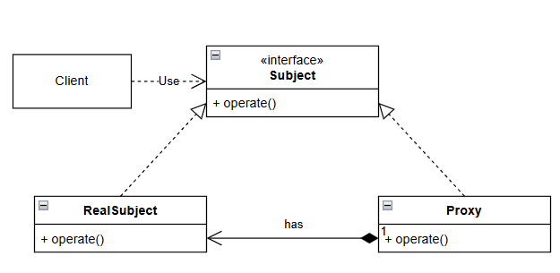
| 角色               | 职责                                                                 |
|--------------------|--------------------------------------------------------------------|
| **Subject**        | 定义真实对象和代理对象的共同接口，使代理可以无缝替换真实对象。         |
| **Real Subject**   | 真正的业务逻辑实现者，通常是重量级资源或具体功能的承载者。           |
| **Proxy**          | 持有对 Real Subject 的引用，接收客户端请求并决定如何处理（转发、拦截或替代）。 |
| **Client**         | 通过 Subject 接口与代理交互，无需感知背后是真实对象还是代理。         |

### 适配器Adapter/Wrapper
将一个类的接口转换成客户端期望的另一个接口，解决接口不兼容问题，使原本无法协同工作的类能够协同工作

- 两种实现方式：对象适配器（组合）、类适配器（继承）
- 当系统需要集成第三方组件且无法修改其源代码时，优先选择**对象适配器**（组合方式）。

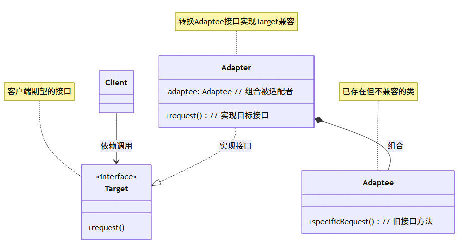
### 桥接

将抽象部分与实现部分分离，使它们可以独立变化。通过组合代替继承，解决多层次继承带来的类爆炸问题。 
> **黄金法则**：当系统存在**两个独立变化维度**（如业务逻辑×平台实现），且都需要扩展时，优先选择桥接模式。


| **角色**               | **作用**                                                                 |
|------------------------|-------------------------------------------------------------------------|
| **抽象化** | 定义高层控制逻辑（业务抽象层）                                              |
| **扩展抽象化** | 对抽象的扩展（具体业务实现）                                                |
| **实现化** | 定义底层操作接口（平台/技术抽象层）                                         |
| **具体实现化** | 实现Implementor接口（具体平台/技术实现）                                    |

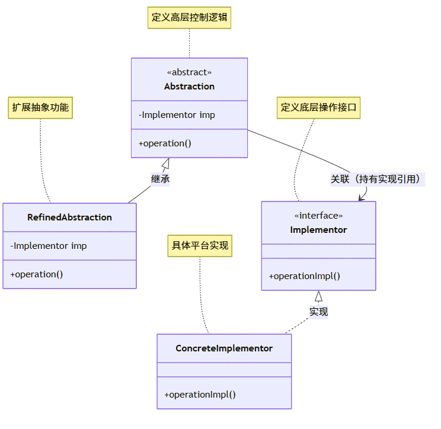
## 创建型模式

解耦对象的使用与创建过程
### 工厂
1. **简单工厂**  根据参数创建不同产品  
**缺点**：新增产品需修改工厂类，违反开闭原则
```java
public Shape createShape(String type) {
   switch (type) {
      case "circle": return new Circle();
      case "rectangle": return new Rectangle();
      default: throw new IllegalArgumentException("未知类型");
   }
}
```
2. **工厂方法** 定义一个创建对象的接口和不同的实现类（工厂），让子类决定实例化哪个类
   - 新增产品只需增加新工厂


3. **抽象工厂（Abstract Factory）** 每个工厂生产一个产品族，产品族是相同接口族的不同实现，客户端只需切换工厂就能使用不同产品族

```java
// 抽象产品族
interface Button {
    void render();
}

interface TextField {
    void input();
}

// 具体产品族 (Windows风格)
class WinButton implements Button {
    @Override
    public void render() {
        System.out.println("渲染Windows按钮");
    }
}

class WinTextField implements TextField {
    @Override
    public void input() {
        System.out.println("Windows文本框输入");
    }
}

// 具体产品族 (Mac风格)
class MacButton implements Button {
    @Override
    public void render() {
        System.out.println("渲染Mac按钮");
    }
}

class MacTextField implements TextField {
    @Override
    public void input() {
        System.out.println("Mac文本框输入");
    }
}

// 抽象工厂
interface GUIFactory {
    Button createButton();
    TextField createTextField();
}

// 具体工厂
class WinFactory implements GUIFactory {
    @Override
    public Button createButton() {
        return new WinButton();
    }
    
    @Override
    public TextField createTextField() {
        return new WinTextField();
    }
}

class MacFactory implements GUIFactory {
    @Override
    public Button createButton() {
        return new MacButton();
    }
    
    @Override
    public TextField createTextField() {
        return new MacTextField();
    }
}

// 客户端
public class Client {
    public static void main(String[] args) {
        GUIFactory factory = new MacFactory(); // 只需切换工厂
        
        Button btn = factory.createButton();
        TextField field = factory.createTextField();
        
        btn.render();      // 输出: 渲染Mac按钮
        field.input();     // 输出: Mac文本框输入
    }
}
```

---

**工厂模式对比**
| **特性**         | 简单工厂                    | 工厂方法                          | 抽象工厂                          |
|------------------|---------------------------|----------------------------------|----------------------------------|
| **创建目标**      | 单一产品                   | 单一产品                          | 产品家族                         |
| **扩展性**        | 修改工厂类（违反开闭原则）  | 增加新工厂类                      | 增加新工厂族                     |
| **适用场景**      | 产品类型固定               | 产品类型可能扩展                  | 需要创建关联产品组               |
| **解耦程度**      | 客户端依赖具体工厂类        | 客户端依赖抽象工厂                | 客户端完全与具体产品解耦          |
| **JDK应用案例**   | `Calendar.getInstance()` | `Collection.iterator()`          | `javax.xml.parsers.DocumentBuilderFactory` |


### 建造者


> 将复杂对象的**构建过程**与**最终表示**分离，**使得相同的构建过程可以创建不同的表示形式**。它特别适用于需要**分步骤构造**且**构造顺序重要**的复杂对象创建场景。

- **缺点**：需要额外Director和Builder类

| **场景** | **说明** | **示例** |
|----------|----------|----------|
| **创建复杂对象** | 对象包含多个组成部分，且需要不同组合 | 电脑配置（CPU/RAM/存储） |
| **构造过程复杂** | 需要分步骤构造，构造顺序重要 | 汽车组装（底盘→发动机→车身） |
| **对象不可变** | 需要一次性构建完整对象 | 配置对象、DTO传输对象 |
| **多种表示形式** | 相同构建过程需要创建不同表示 | 不同格式的报告（HTML/PDF） |
| **参数过多** | 避免构造函数参数列表过长 | 含20+参数的配置对象 |


| **组件**               | **职责**                                   | **方法/特点**                                                                 | **设计要点**                                                                 |
|------------------------|-------------------------------------------|-----------------------------------------------------------------------------|-----------------------------------------------------------------------------|
| **Builder（建造者接口）** | 定义创建产品各个部件的抽象方法              | - `buildPartA()`, `buildPartB()`, `buildPartC()`：构建不同部分<br>- `getResult()`：返回最终产品 | 接口隔离原则，每个方法只负责一个部件构建                                      |
| **ConcreteBuilder（具体建造者）** | 实现Builder接口，提供具体构建逻辑         | - 维护产品实例<br>- 实现具体构建细节<br>- 支持不同配置的产品实现              | 包含产品状态，构建逻辑可定制化                                              |
| **Director（指挥者）**    | 控制构建流程                              | - `construct()`：定义构建步骤顺序<br>- 只依赖Builder接口                      | 流程控制与具体实现分离，可复用指挥逻辑                                       |
| **Product（产品）**       | 最终构建的复杂对象                        | - 包含多个组成部分<br>- 提供组装方法<br>- 通常为不可变对象                    | 通过Builder一次性构建，保证对象完整性                                         |

客户端通过Director和不同的构造者实现，相同的构造流程创建不同产品
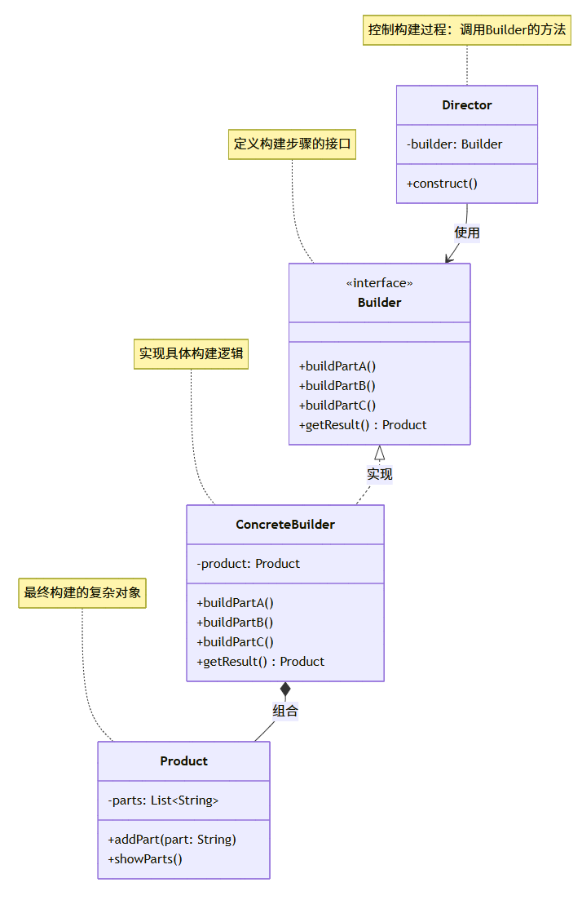


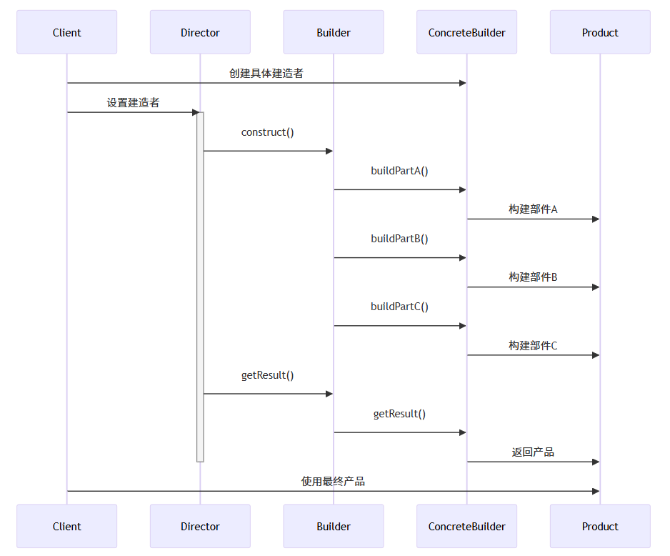


```java
// 产品类
class Computer {
    private String cpu;
    private String ram;
    private String storage;
    
    public void setCPU(String cpu) { this.cpu = cpu; }
    public void setRAM(String ram) { this.ram = ram; }
    public void setStorage(String storage) { this.storage = storage; }
    
    public void showSpecs() {
        System.out.println("Computer Specs:");
        System.out.println("CPU: " + cpu);
        System.out.println("RAM: " + ram);
        System.out.println("Storage: " + storage);
    }
}

// 建造者接口
interface ComputerBuilder {
    void buildCPU();
    void buildRAM();
    void buildStorage();
    Computer getResult();
}

// 具体建造者
class GamingComputerBuilder implements ComputerBuilder {
    private Computer computer = new Computer();
    
    @Override
    public void buildCPU() {
        computer.setCPU("Intel Core i9-13900K");
    }
    
    @Override
    public void buildRAM() {
        computer.setRAM("32GB DDR5");
    }
    
    @Override
    public void buildStorage() {
        computer.setStorage("2TB NVMe SSD");
    }
    
    @Override
    public Computer getResult() {
        return computer;
    }
}

// 指挥者
class ComputerEngineer {
    private ComputerBuilder builder;
    
    public void setBuilder(ComputerBuilder builder) {
        this.builder = builder;
    }
    
    public Computer buildComputer() {
        builder.buildCPU();
        builder.buildRAM();
        builder.buildStorage();
        return builder.getResult();
    }
}

// 客户端使用
public class Client {
    public static void main(String[] args) {
        ComputerEngineer engineer = new ComputerEngineer();
        ComputerBuilder gamingBuilder = new GamingComputerBuilder();
        
        engineer.setBuilder(gamingBuilder);
        Computer gamingPC = engineer.buildComputer();
        
        gamingPC.showSpecs();
    }
}
```


### 原型

**当直接创建对象的成本很高时，用原型实例指定创建对象的种类，并通过拷贝这些原型创建新的对象，客户端获取拷贝对象后修改其状态，避免重复执行昂贵的初始化操作。**

1.  **`Prototype` (原型接口)：**
    *   声明一个 `clone()` 方法
2.  **`ConcretePrototype` (具体原型)：**
    *   实现 `Prototype` 接口。
    *   实现 `clone()` 方法，负责复制自身并返回新对象
3.  **`Client` (客户端)：**
    *   通过调用具体原型对象的 `clone()` 方法来创建新对象。客户端需要知道或持有原型对象（可能通过注册表获取）。


```java
import java.util.ArrayList;
import java.util.List;

// 1. Prototype Interface
interface Prototype extends Cloneable {
    Prototype clone() throws CloneNotSupportedException;
}

// 2. Concrete Prototype
class ComplexObject implements Prototype {
    private int id;
    private String name;
    private List<String> items; // 引用类型字段

    public ComplexObject(int id, String name, List<String> items) {
        this.id = id;
        this.name = name;
        this.items = new ArrayList<>(items); // 防御性拷贝，但clone仍需深拷贝items
    }

    @Override
    public ComplexObject clone() throws CloneNotSupportedException {
        // 1. 调用super.clone()进行浅拷贝 (复制基本类型和引用)
        ComplexObject clone = (ComplexObject) super.clone();
        // 2. 对引用类型字段进行深拷贝 (创建新的ArrayList并复制内容)
        clone.items = new ArrayList<>(this.items);
        return clone;
    }

    // ... Getters, Setters, other methods ...
}

// 3. Client
public class Client {
    public static void main(String[] args) throws CloneNotSupportedException {
        // 创建原型对象 (可能成本很高)
        List<String> initialItems = new ArrayList<>();
        initialItems.add("Item1");
        initialItems.add("Item2");
        ComplexObject prototype = new ComplexObject(1, "Original", initialItems);

        // 通过克隆创建新对象 (成本较低)
        ComplexObject clone1 = prototype.clone();
        ComplexObject clone2 = prototype.clone();

        // 修改克隆对象 (不会影响原型和另一个克隆)
        clone1.getItems().add("Clone1 Item");
        clone2.getItems().add("Clone2 Item");
    }
}
```

---

### 单例

**确保一个类只有一个实例，并提供一个全局访问点来获取这个实例。**

*   **私有化构造器：** 阻止外部代码通过 `new` 关键字创建实例。
*   **内部创建唯一实例：** 在类内部通过一个**私有静态**变量，持有自身的唯一实例
*   **提供全局访问点：** 提供一个静态的公共方法（通常命名为 `getInstance()`）让外部代码获取这个唯一实例。该方法负责创建实例（如果尚未创建）并返回它。

**适用场景**
*   需要严格控制的共享资源管理器（数据库连接池、线程池）。
*   配置信息管理器（全局配置只需加载一次）。
*   日志记录器（所有地方使用同一个Logger）。
*   设备驱动程序对象（通常一个设备对应一个驱动实例）。
*   缓存系统（需要全局访问缓存数据）。

**线程安全**
*   **饿汉式 (Eager Initialization)：** 在类加载时就初始化实例。线程安全（由JVM类加载机制保证），但可能造成资源浪费（如果实例最终未被使用）。

*   **懒汉式 (Lazy Initialization)：** 第一次调用 `getInstance()` 时才创建实例。需要考虑线程安全。
    *   **简单同步 (性能差)：** 在 `getInstance()` 方法上加 `synchronized`。每次调用都加锁，性能开销大。
        ```java
        public static synchronized Singleton getInstance() {
            if (instance == null) {
                instance = new Singleton();
            }
            return instance;
        }
        ```
    *   **双重检查锁定 (Double-Checked Locking - DCL)：** 减少同步块范围，在第一次创建实例时同步。需要 `volatile` 关键字防止指令重排序导致问题（Java 5+）。
        ```java
        private static volatile Singleton instance;
        public static Singleton getInstance() {
            if (instance == null) { // 第一次检查 (无锁)
                synchronized (Singleton.class) {
                    if (instance == null) { // 第二次检查 (在锁内)
                        instance = new Singleton();
                    }
                }
            }
            return instance;
        }
        ```
    *   **静态内部类 (Static Inner Class - 推荐)：** 利用JVM类加载机制保证线程安全，且实现懒加载。`SingletonHolder` 类只有在第一次调用 `getInstance()` 时才会被加载并初始化 `INSTANCE`。
        ```java
        public class Singleton {
            private Singleton() {}
            private static class SingletonHolder {
                private static final Singleton INSTANCE = new Singleton();
            }
            public static Singleton getInstance() {
                return SingletonHolder.INSTANCE;
            }
        }
        ```
*   **枚举 (最佳实践)：** 简洁、安全（防止反射攻击和序列化问题）、自动线程安全。是最推荐的单例实现方式。
    ```java
    public enum Singleton {
        INSTANCE;
        public void doSomething() { ... }
    }
    // 使用: Singleton.INSTANCE.doSomething();
    ```

**缺点**
*   **违反单一职责原则 (SRP)：** 单例类既管理自身实例化，又承担业务逻辑，职责可能过重。
*   **测试困难：** 全局状态使得单元测试难以隔离，可能需要使用依赖注入或模拟框架。
*   **隐藏依赖关系：** 使用单例的类对单例的依赖关系不明显，代码耦合度可能变高。
*   **潜在的性能瓶颈：** 如果单例成为共享资源的瓶颈（如数据库连接池耗尽）。
*   **生命周期管理：** 单例通常在整个应用生命周期存在，可能持有资源过长时间。

---

## 行为型模式

关注对象之间的通信和交互，旨在解决对象之间的责任分配和算法的封装。
### 责任链

**解耦请求发送与处理，动态组合处理逻辑**：客户端通过链式调用处理器创建处理链，将请求提交给第一个处理器，每个处理器选择处理并结束传递或者将请求交给下一个处理器，直到链尾
- **请求可能未被处理**：需要处理链末端无处理器的情况
- **循环引用**：防止处理链形成闭环
- **动态配置**：可以在运行时动态改变处理链

| **组件**               | **核心职责**                                                                 | **关键特性**                                                                 |
|------------------------|-----------------------------------------------------------------------------|-----------------------------------------------------------------------------|
| **处理器接口（Handler）** | 定义统一的请求处理规范                                                      | - 声明处理请求的方法（如`handle()`）<br>- 声明设置下一个处理器的方法（如`setNext()`） |
| **抽象处理器（AbstractHandler）** | 提供处理链的基础实现                                                        | - 实现处理器接口<br>- 持有`nextHandler`引用<br>- 提供默认的请求传递逻辑（若不处理则转发） |
| **具体处理器（ConcreteHandler）** | 实现业务相关的具体处理逻辑                                                  | - 判断是否处理当前请求（如根据请求参数）<br>- 处理请求或调用父类方法传递请求<br>- 每个处理器只需关注自身职责 |
| **客户端（Client）**     | 初始化并协调责任链工作                                                      | - 组装处理器链（设置`nextHandler`关系）<br>- 创建请求对象<br>- 触发链式处理（调用首个处理器） |


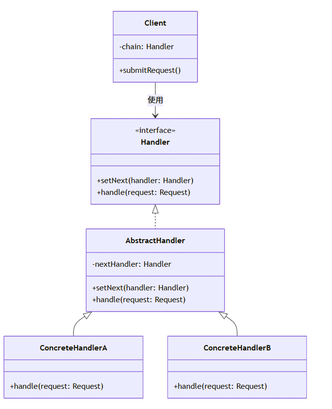

### 命令


**将请求封装成对象**，当需要对行为进行记录、撤销/重做或事务处理时，使用命令模式
1. **解耦调用者与接收者**：调用者无需知道具体接收者
2. **支持操作队列**：可轻松实现命令队列和日志
3. **实现撤销/重做**：通过维护命令历史实现操作回滚
4. **扩展性强**：新增命令不影响现有代码
5. **组合命令**：支持宏命令（多个命令的组合）

| **组件**               | **核心职责**                                                                 | **关键特性**                                                                 |
|------------------------|-----------------------------------------------------------------------------|-----------------------------------------------------------------------------|
| **命令接口 (Command)**   | 定义执行操作的统一接口                                                      | - 声明 `execute()` 方法<br>- 声明 `undo()` 方法（可选）                         |
| **具体命令 (ConcreteCommand)** | 实现命令接口，绑定接收者与动作                                            | - 持有接收者引用<br>- 实现 `execute()` 调用接收者方法<br>- 实现 `undo()` 撤销操作 |
| **接收者 (Receiver)**    | 执行实际业务操作的对象                                                      | - 包含具体的业务逻辑实现<br>- 不感知命令存在                                |
| **调用者 (Invoker)**     | 触发命令执行的控制器                                                        | - 持有命令对象引用<br>- 通过调用 `execute()` 触发操作<br>- **可支持命令队列**     |
| **客户端 (Client)**      | 创建并组装命令对象                                                          | 设置命令到调用者          |


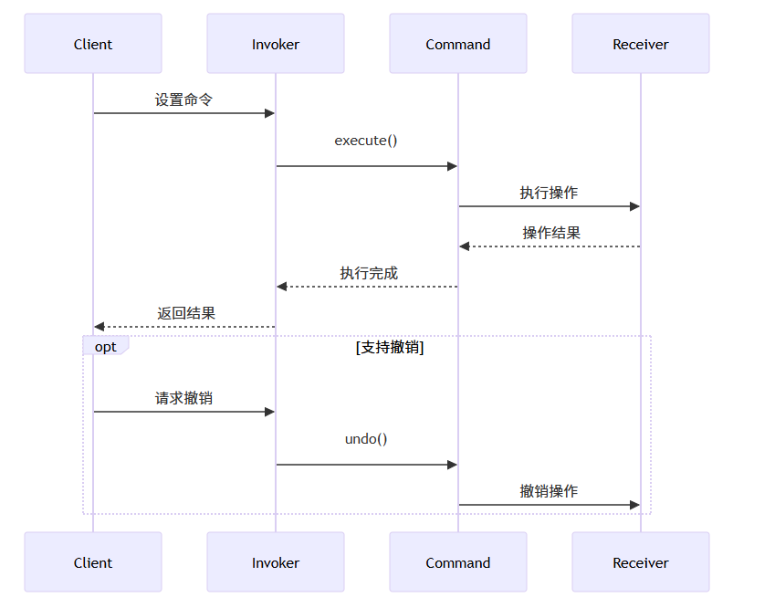

**适用场景**
| **场景**                | **说明**                                                                 |
|------------------------|-------------------------------------------------------------------------|
| **操作队列系统**         | 将操作封装为命令对象放入队列顺序执行                                      |
| **事务处理系统**         | 支持操作回滚的事务处理                                                    |
| **GUI 操作**           | 菜单项、按钮操作封装为命令对象                                            |
| **多级撤销/重做**       | 文字编辑器、图像处理软件的撤销功能                                        |
| **远程控制**           | 家电遥控器将按键操作封装为命令                                            |
| **批处理操作**         | 将多个操作组合成宏命令一次性执行                                          |


```java
// 1. 命令接口
interface Command {
    void execute();
    void undo();
}

// 2. 接收者 - 电灯
class Light {
    void turnOn() { System.out.println("电灯已打开"); }
    void turnOff() { System.out.println("电灯已关闭"); }
}

// 3. 具体命令 - 开灯命令
class LightOnCommand implements Command {
    private Light light;
    
    public LightOnCommand(Light light) {
        this.light = light;
    }
    
    @Override
    public void execute() {
        light.turnOn();
    }
    
    @Override
    public void undo() {
        light.turnOff();
    }
}

// 4. 调用者 - 遥控器
class RemoteControl {
    private Command command;
    private Command lastCommand;
    
    public void setCommand(Command command) {
        this.command = command;
    }
    
    public void pressButton() {
        command.execute();
        lastCommand = command;
    }
    
    public void pressUndo() {
        if (lastCommand != null) {
            lastCommand.undo();
            lastCommand = null;
        }
    }
}

// 5. 客户端
public class Client {
    public static void main(String[] args) {
        // 创建接收者
        Light livingRoomLight = new Light();
        
        // 创建具体命令
        Command lightOn = new LightOnCommand(livingRoomLight);
        
        // 创建调用者
        RemoteControl remote = new RemoteControl();
        remote.setCommand(lightOn);
        
        // 执行命令
        remote.pressButton();  // 输出: 电灯已打开
        remote.pressUndo();    // 输出: 电灯已关闭
    }
}
```


### 迭代器

迭代器模式提供一种方法顺序访问聚合对象中的各个元素，而又不暴露该对象的内部表示。这种模式是集合遍历的标准解决方案。
### 中介

中介者模式通过引入一个中介对象来封装一系列对象之间的交互，使这些对象不需要显式地相互引用，从而降低耦合度。
- 避免中介类成为上帝对象，中介类负责的交互过多时可以拆分为总中介+分中介

| **组件**               | **核心职责**                                                                 | **关键特性**                                                                 |
|------------------------|-----------------------------------------------------------------------------|-----------------------------------------------------------------------------|
| **中介者接口 (Mediator)** | 定义通信接口                                                                | - 声明通知方法 `notify()`<br>- 协调各同事对象交互                             |
| **具体中介者 (ConcreteMediator)** | 实现中介逻辑                                                                | - 持有同事对象引用<br>- 实现对象间协调逻辑<br>- 了解所有同事对象             |
| **同事类 (Colleague)** | 定义对象基类                                                                | - 持有中介者引用<br>- 通过中介者通信<br>- 实现通用通信方法                   |
| **具体同事类 (ConcreteColleague)** | 实现业务逻辑                                                                | - 处理自身业务<br>- 只与中介者通信<br>- 不知道其他同事对象存在               |

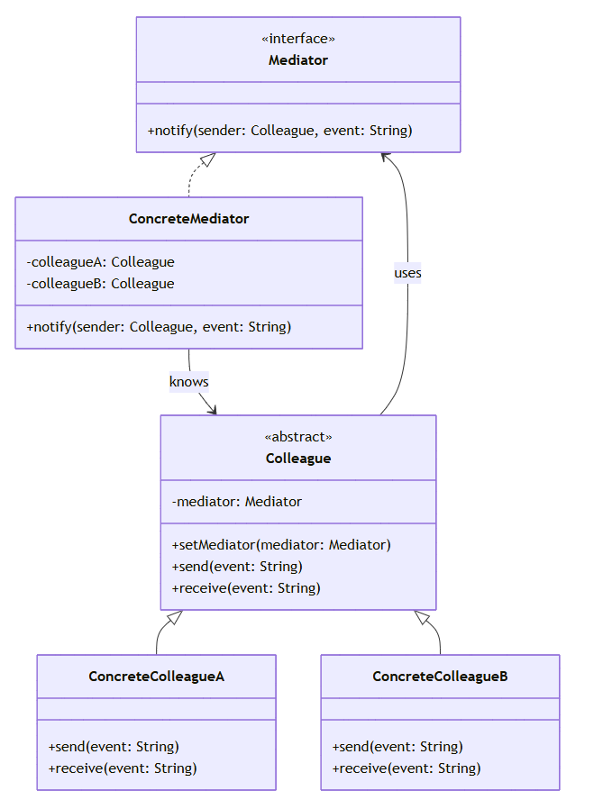

中介者模式是解决复杂对象交互的利器，特别适合以下场景：
- 对象间存在大量复杂交互
- 需要集中管理对象间关系
- 系统需要动态调整交互关系
- 跨系统或跨层协调


| **场景**               | **无中介者**                                | **使用中介者**                            |
|------------------------|--------------------------------------------|------------------------------------------|
| **对象间关系**          | 网状结构（N×N连接）                        | 星型结构（中心辐射）                      |
| **新增对象**            | 需修改所有相关对象                         | 只需修改中介者                            |
| **通信复杂度**          | 高（每个对象需知道其他对象）               | 低（对象只知中介者）                      |
| **系统可维护性**        | 低（牵一发而动全身）                       | 高（修改局部不影响全局）                  |
| **典型应用**            | 小型简单系统                               | GUI系统、聊天应用、分布式协调系统         |


1. **聊天室系统**：
   ```java
   // 聊天室中介者
   class ChatRoom implements ChatMediator {
       private List<User> users = new ArrayList<>();
       
       public void addUser(User user) {
           users.add(user);
       }
       
       public void sendMessage(String msg, User sender) {
           for (User user : users) {
               if (user != sender) {
                   user.receive(msg);
               }
           }
       }
   }
   
   // 用户类
   class User {
       private ChatMediator mediator;
       private String name;
       
       public User(ChatMediator med, String name) {
           this.mediator = med;
           this.name = name;
       }
       
       public void send(String msg) {
           mediator.sendMessage(msg, this);
       }
       
       public void receive(String msg) {
           System.out.println(name + " 收到: " + msg);
       }
   }
   ```


2. **事件总线 (Event Bus)**：
   ```java
   // 全局事件总线
   class EventBus {
       private Map<Class<?>, List<Consumer<Object>>> handlers = new ConcurrentHashMap<>();
       
       public <T> void subscribe(Class<T> eventType, Consumer<T> handler) {
           handlers.computeIfAbsent(eventType, k -> new CopyOnWriteArrayList<>())
                   .add((Consumer<Object>) handler);
       }
       
       public void publish(Object event) {
           List<Consumer<Object>> eventHandlers = handlers.get(event.getClass());
           if (eventHandlers != null) {
               eventHandlers.forEach(handler -> handler.accept(event));
           }
       }
   }
   
   // 使用示例
   eventBus.subscribe(PaymentEvent.class, event -> {
       // 处理支付事件
   });
   ```


3. **分布式中介者**：
   ```java
   // 基于消息队列的中介者
   class DistributedMediator {
       private MessageQueue queue;
       
       public void sendCommand(Command command) {
           queue.publish("COMMAND_TOPIC", command);
       }
       
       public void registerHandler(String commandType, CommandHandler handler) {
           queue.subscribe("COMMAND_TOPIC", msg -> {
               if (msg.getType().equals(commandType)) {
                   handler.handle(msg);
               }
           });
       }
   }
   ```

---

### 备忘录


备忘录模式允许在不破坏对象封装性的前提下捕获并外部化对象的内部状态，以便之后可以将对象恢复到原先保存的状态。

| **组件**             | **核心职责**                                                                 | **关键特性**                                                                 |
|----------------------|-----------------------------------------------------------------------------|-----------------------------------------------------------------------------|
| **发起人 (Originator)** | 需要保存状态的对象                                                          | - 创建备忘录对象<br>- 从备忘录恢复状态<br>- 包含业务逻辑和状态              |
| **备忘录 (Memento)**   | 存储发起人对象的状态                                                        | - 保持状态不可变性<br>- 提供状态访问接口<br>- 保护状态不被外部修改          |
| **管理者 (Caretaker)** | 负责保存和管理备忘录对象                                                    | - 存储备忘录历史<br>- 提供撤销/重做功能<br>- 不访问备忘录内容              |

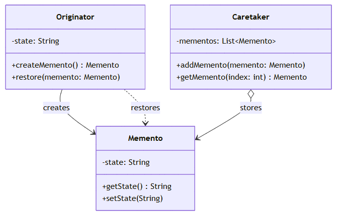


| **场景**               | **适用性**                                  | **备忘录模式优势**                         |
|------------------------|--------------------------------------------|-------------------------------------------|
| **文本编辑器**          | 高（撤销/重做）                            | 精确恢复编辑状态                           |
| **游戏存档**            | 高（保存/加载游戏）                        | 保存完整游戏状态                           |
| **事务回滚**            | 中（数据库操作）                           | 回滚到事务开始状态                         |
| **配置管理**            | 中（恢复默认配置）                         | 快速恢复先前配置                           |
| **绘图软件**            | 高（撤销绘图操作）                         | 支持多步操作撤销                           |

**文本编辑器撤销功能**

```java
import java.util.Stack;

// 1. 备忘录类
class TextMemento {
    private final String text;
    private final int cursorPosition;
    
    public TextMemento(String text, int cursorPosition) {
        this.text = text;
        this.cursorPosition = cursorPosition;
    }
    
    public String getText() {
        return text;
    }
    
    public int getCursorPosition() {
        return cursorPosition;
    }
}

// 2. 发起人 - 文本编辑器
class TextEditor {
    private StringBuilder text = new StringBuilder();
    private int cursorPosition = 0;
    
    public void type(String words) {
        text.insert(cursorPosition, words);
        cursorPosition += words.length();
        System.out.println("当前文本: " + text);
        System.out.println("光标位置: " + cursorPosition);
    }
    
    public void moveCursor(int position) {
        cursorPosition = Math.max(0, Math.min(position, text.length()));
        System.out.println("移动光标到: " + cursorPosition);
    }
    
    public void delete() {
        if (cursorPosition > 0 && text.length() > 0) {
            text.deleteCharAt(cursorPosition - 1);
            cursorPosition--;
            System.out.println("删除后文本: " + text);
        }
    }
    
    public TextMemento save() {
        return new TextMemento(text.toString(), cursorPosition);
    }
    
    public void restore(TextMemento memento) {
        this.text = new StringBuilder(memento.getText());
        this.cursorPosition = memento.getCursorPosition();
        System.out.println("=== 恢复状态 ===");
        System.out.println("文本: " + text);
        System.out.println("光标: " + cursorPosition);
    }
}

// 3. 管理者 - 历史记录
class HistoryManager {
    private Stack<TextMemento> undoStack = new Stack<>();
    private Stack<TextMemento> redoStack = new Stack<>();
    
    public void saveState(TextMemento memento) {
        undoStack.push(memento);
        redoStack.clear(); // 清除重做历史
    }
    
    public TextMemento undo() {
        if (canUndo()) {
            TextMemento current = undoStack.pop();
            redoStack.push(current);
            return undoStack.peek(); // 返回前一个状态
        }
        return null;
    }
    
    public TextMemento redo() {
        if (canRedo()) {
            TextMemento state = redoStack.pop();
            undoStack.push(state);
            return state;
        }
        return null;
    }
    
    public boolean canUndo() {
        return undoStack.size() > 1;
    }
    
    public boolean canRedo() {
        return !redoStack.isEmpty();
    }
}

// 4. 客户端使用
public class TextEditorDemo {
    public static void main(String[] args) {
        TextEditor editor = new TextEditor();
        HistoryManager history = new HistoryManager();
        
        // 初始状态
        editor.type("Hello");
        history.saveState(editor.save());
        
        // 继续编辑
        editor.type(" World");
        history.saveState(editor.save());
        
        editor.moveCursor(5);
        editor.type(" Awesome");
        history.saveState(editor.save());
        
        // 撤销操作
        System.out.println("\n=== 第一次撤销 ===");
        editor.restore(history.undo());
        
        System.out.println("\n=== 第二次撤销 ===");
        editor.restore(history.undo());
        
        // 重做操作
        System.out.println("\n=== 重做 ===");
        editor.restore(history.redo());
    }
}
```


**最佳实践建议**

1. **双栈实现撤销/重做**：
```java
class UndoRedoManager<T> {
    private Deque<T> undoStack = new ArrayDeque<>();
    private Deque<T> redoStack = new ArrayDeque<>();
    
    public void saveState(T state) {
        undoStack.push(state);
        redoStack.clear();
    }
    
    public T undo() {
        if (undoStack.size() > 1) {
            T current = undoStack.pop();
            redoStack.push(current);
            return undoStack.peek();
        }
        return null;
    }
    
    public T redo() {
        if (!redoStack.isEmpty()) {
            T state = redoStack.pop();
            undoStack.push(state);
            return state;
        }
        return null;
    }
}
```

1. **备忘录生命周期管理**：
```java
class MementoManager {
    private List<Memento> mementos = new ArrayList<>();
    private int maxHistory = 50;
    
    public void addMemento(Memento memento) {
        mementos.add(memento);
        // 限制历史记录数量
        if (mementos.size() > maxHistory) {
            mementos.remove(0);
        }
    }
    
    public Memento getMemento(int index) {
        if (index >= 0 && index < mementos.size()) {
            return mementos.get(index);
        }
        return null;
    }
    
    public void clear() {
        mementos.clear();
    }
}
```

1. **备忘录访问控制**：
```java
// 窄接口（供管理者使用）
public interface Memento {
    // 无公开方法
}

// 宽接口（供发起人使用）
public interface OriginatorMemento extends Memento {
    void restoreState(Originator originator);
}

// 具体备忘录
class ConcreteMemento implements OriginatorMemento {
    private String state;
    
    ConcreteMemento(String state) {
        this.state = state;
    }
    
    public void restoreState(Originator originator) {
        originator.setState(state);
    }
}
```

4. **大型对象优化**：
```java
class LazyMemento {
    private Supplier<Object> stateLoader;
    private Consumer<Object> stateApplier;
    
    public LazyMemento(Supplier<Object> loader, Consumer<Object> applier) {
        this.stateLoader = loader;
        this.stateApplier = applier;
    }
    
    public void save() {
        // 延迟加载：实际不立即保存状态
    }
    
    public void restore() {
        stateApplier.accept(stateLoader.get());
    }
}
```

---


### 观察者


观察者模式定义了一种一对多的依赖关系，当一个对象（主题）的状态发生改变时，所有依赖于它的对象（观察者）都会自动收到通知并更新，替代回调函数

观察者模式是现代软件架构的基石之一，特别适用于：
- 实时数据监控系统
- 事件驱动架构
- GUI应用程序
- 消息通知系统
- 状态同步场景


| **场景**               | **无观察者模式**                          | **使用观察者模式**                        |
|------------------------|------------------------------------------|------------------------------------------|
| **状态变化通知**        | 直接调用依赖对象的方法                   | 自动通知所有注册的观察者                 |
| **对象关系**            | 紧耦合（主题知道所有依赖对象）           | 松耦合（主题不知道观察者具体实现）       |
| **新增依赖对象**        | 需要修改主题代码                         | 只需注册新观察者                         |
| **通知效率**            | 低（需手动维护依赖列表）                 | 高（自动管理依赖关系）                   |
| **典型应用**            | 简单回调场景                             | GUI事件、发布-订阅系统、实时数据更新     |


| **组件**               | **核心职责**                                                                 | **关键特性**                                                                 |
|------------------------|-----------------------------------------------------------------------------|-----------------------------------------------------------------------------|
| **主题接口 (Subject)**   | 定义管理观察者的方法                                                        | - `registerObserver()` 注册观察者<br>- `removeObserver()` 移除观察者<br>- `notifyObservers()` 通知观察者 |
| **具体主题 (ConcreteSubject)** | 实现主题接口，存储状态并通知观察者                                          | - 维护观察者列表<br>- 状态改变时自动通知所有观察者<br>- 提供状态访问方法    |
| **观察者接口 (Observer)** | 定义观察者的更新接口                                                        | - `update()` 方法用于接收主题通知                                          |
| **具体观察者 (ConcreteObserver)** | 实现观察者接口，响应主题通知                                              | - 维护对主题的引用<br>- 实现具体的更新逻辑                                |

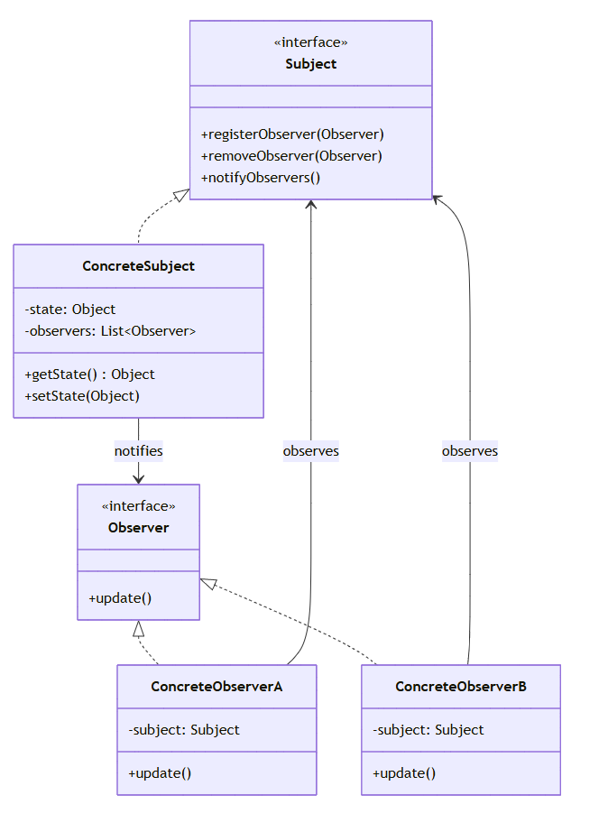


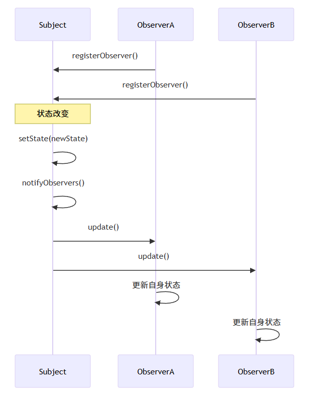


**观察者模式框架**

| **框架**         | **实现方式**                            | **特点**                             |
|------------------|----------------------------------------|--------------------------------------|
| **JavaBeans**    | `PropertyChangeListener`               | 内置Java标准                         |
| **RxJava**       | `Observable`/`Observer`               | 响应式扩展，支持复杂事件流           |
| **Spring**       | `ApplicationEvent`/`@EventListener`   | 应用上下文事件                       |
| ****       | `EventBus`                             | 分布式事件总线                       |
| **Guava**        | `EventBus`                             | 轻量级本地事件总线                   |


### 状态

状态模式允许一个对象在其**内部状态改变时改变它的行为**，使得对象看起来像是修改了它的类。

**核心思想：**
*   将与特定状态相关的行为封装到独立的**状态类**中。
*   让原始对象（称为**上下文**）持有对**当前状态对象**的引用。
*   上下文将**所有与状态相关的请求委托给当前的状态对象**。
*   当状态需要改变时，上下文只需改变它所持有的状态对象引用即可（指向另一个具体状态类的实例）。
*   这样，上下文的行为会随着内部状态的改变而自动改变，避免了庞大的条件语句（如 `if-else` 或 `switch-case`）。

**为什么需要状态模式？**

想象一个场景：一个对象（如订单、电梯、播放器、网络连接）在其生命周期中会经历多种状态（如 `待支付`、`已支付`、`已发货` / `开门`、`关门`、`运行`、`停止` / `播放`、`暂停`、`停止` / `连接`、`监听`、`关闭`）。对象在不同状态下的行为不同，且状态之间可以相互转换。

**不使用状态模式的痛点：**
1.  **庞大的条件语句：** 上下文类中充斥着大量的 `if (state == A) { ... } else if (state == B) { ... } else ...` 语句来判断当前状态并执行相应行为。代码臃肿、难以阅读和维护。
2.  **违反开闭原则：** 增加或修改一个状态，需要修改包含这些庞大条件语句的方法，容易引入错误。
3.  **状态转换逻辑分散/耦合：** 状态转换的逻辑可能散落在上下文的不同方法中，或者与状态行为代码混杂在一起，不够清晰。
4.  **难以理解状态图：** 代码不能清晰地反映出对象状态变化的完整图景。

**状态模式的结构：**

1.  **上下文 (Context):**
    *   定义客户端感兴趣的接口。
    *   维护一个对 **当前状态** 对象的引用。
    *   将状态相关的请求委托给当前状态对象处理。
    *   通常还提供一个方法（`setState(State state)`）来改变其当前状态（状态转换可以由 Context 触发，也可以由 State 对象触发）。

2.  **抽象状态 (State):**
    *   定义一个接口，封装了所有**特定状态**可能的行为。这些行为通常对应着 Context 中那些依赖于状态的方法。

3.  **具体状态 (Concrete State):**
    *   实现抽象状态接口。
    *   为 Context 定义在**该具体状态**下应该表现的行为。
    *   在需要时，**知道并能够触发状态转换**（通常通过调用 Context 的 `setState` 方法）。*（状态转换逻辑可以放在 Context 中，也可以放在具体状态类中，或者两者结合，取决于哪种更清晰）*。

**状态图：**

```
+----------------+       +------------------+        +-------------------+
|    Context     |<>---->|    State (接口)   |<|------| ConcreteStateA    |
+----------------+       +------------------+        +-------------------+
| - state: State |       | + handle(): void |        | + handle(): void  |
+----------------+       +------------------+        +-------------------+
         ^                           ^                        ^
         | (委托请求)                   | (实现)                  |
         |                           |                        |
         |                           |                        |
         |                   +-------------------+        +-------------------+
         |                   | ConcreteStateB    |        | ConcreteStateC    |
         |                   +-------------------+        +-------------------+
         |                   | + handle(): void  |        | + handle(): void  |
         |                   +-------------------+        +-------------------+
         |________________________________________________________|
                            (可能通过 setState() 改变 Context 的状态)
```

**工作流程：**
1.  客户端通过 Context 发起一个请求（如调用 `request()` 方法）。
2.  Context 收到请求，但它并不自己处理该请求的具体逻辑，而是将请求**委托**给其当前持有的 State 对象（`state.handle()`）。
3.  当前的 Concrete State 对象执行与该状态对应的行为。
4.  **状态转换（可选）：**
    *   在执行行为的过程中，该 Concrete State 对象可能根据逻辑判断需要转换状态。
    *   它通过调用 Context 的 `setState(new ConcreteStateX())` 方法，将 Context 的 `state` 引用指向新的具体状态对象。
    *   当下一次请求到来时，Context 就会委托给这个新的状态对象处理，行为也随之改变。

**状态模式的关键点：**
*   **谁负责状态转换？** 这是设计中的一个重要决策点：
    *   **由 Context 负责：** Context 知道所有可能的状态和转换规则。状态对象只负责行为，不关心转换。转换逻辑集中在 Context 中。
    *   **由 State 负责：** 具体状态对象知道在什么条件下应该转换到什么状态（通过调用 Context 的 `setState`）。转换逻辑分散在各个状态类中，通常更符合“状态知道下一步该去哪”的直觉。
    *   **混合模式：** 常用方式。状态对象执行动作并决定*是否*需要转换，然后调用 Context 的 `changeState()` 方法（该方法内部封装了实际的 `setState` 和可能需要的其他清理/初始化操作）。Context 可能提供一个所有状态对象都知道的公共转换方法。
*   **共享状态对象：** 如果具体状态类没有实例变量（即它们是无状态的，只依赖于传入的 Context），那么同一个具体状态类的实例可以被多个 Context 对象共享（通常使用单例模式实现）。这可以节省内存。
*   **与策略模式的区别：** 两者结构相似（Context + 接口 + 多个实现），但目的不同：
    *   **策略模式：** 关注于**封装不同的算法**，让客户端在运行时选择或更换算法。策略之间通常是**独立且可互换**的，策略对象**不知道其他策略**的存在，策略切换通常由**客户端主动发起**。
    *   **状态模式：** 关注于**封装与状态相关的行为**以及**状态之间的转换**。状态是对象生命周期的一部分，状态之间通常有**关联和转换规则**，状态对象**可能知道并触发转换**到其他状态（通过Context），状态转换通常是**对象内部行为的结果（自动）**。

**状态模式的优点：**
1.  **单一职责原则：** 将与特定状态相关的代码组织到独立的类中。
2.  **开闭原则：** 引入新状态无需修改现有状态类或上下文（主要修改转换逻辑部分），只需添加新的具体状态类。
3.  **消除庞大的条件分支：** 上下文代码变得更简洁、易读、易维护。
4.  **状态转换显式化：** 状态转换逻辑更加集中和清晰（无论是放在 Context 还是 State 中），更容易理解和维护状态机。
5.  **提高内聚性：** 每个状态的行为都封装在对应的类里。

**状态模式的缺点：**
1.  **可能过度设计：** 如果状态数量很少且状态转换非常简单，使用状态模式可能会引入不必要的复杂性。
2.  **类数量增加：** 每个状态都需要一个单独的类，可能导致系统中类的数量增多。
3.  **状态转换逻辑可能复杂：** 如果状态转换逻辑非常复杂，将其放在 Context 或分散在 State 中都可能变得难以管理。有时可能需要结合状态机框架。

**经典应用场景：**
*   **工作流引擎：** 订单状态（待支付、已支付、已发货、已完成、已取消）、请假审批流程（提交、部门审批、HR审批、完成/驳回）。
*   **游戏开发：** 游戏角色状态（站立、行走、奔跑、跳跃、攻击、死亡）、游戏关卡状态。
*   **用户界面：** 控件状态（正常、禁用、悬停、按下）。
*   **网络协议：** TCP连接状态（`LISTEN`, `SYN_SENT`, `SYN_RECEIVED`, `ESTABLISHED`, `FIN_WAIT_1`, `FIN_WAIT_2`, `CLOSE_WAIT`, `CLOSING`, `LAST_ACK`, `TIME_WAIT`, `CLOSED`）。
*   **设备控制：** 电梯状态、交通灯状态、播放器状态（播放、暂停、停止）。
*   **编译器/解释器：** 词法分析器在不同输入字符下的状态转换。

**简单代码示例（电梯状态）：**

```java
// 抽象状态
interface ElevatorState {
    void openDoors();
    void closeDoors();
    void move();
    void stop();
}

// 具体状态：开门状态
class OpenState implements ElevatorState {
    private Elevator elevator;
    public OpenState(Elevator elevator) { this.elevator = elevator; }

    @Override
    public void openDoors() { System.out.println("门已经是开着的了。"); }
    @Override
    public void closeDoors() {
        System.out.println("正在关门...");
        elevator.setState(elevator.getClosedState()); // 触发状态转换 -> 关门状态
    }
    @Override
    public void move() { System.out.println("开门状态下不能移动！请先关门。"); }
    @Override
    public void stop() { System.out.println("开门状态下已经是停止的。"); }
}

// 具体状态：关门状态
class ClosedState implements ElevatorState {
    private Elevator elevator;
    public ClosedState(Elevator elevator) { this.elevator = elevator; }

    @Override
    public void openDoors() {
        System.out.println("正在开门...");
        elevator.setState(elevator.getOpenState()); // 触发状态转换 -> 开门状态
    }
    @Override
    public void closeDoors() { System.out.println("门已经是关着的了。"); }
    @Override
    public void move() {
        System.out.println("电梯开始移动...");
        elevator.setState(elevator.getMovingState()); // 触发状态转换 -> 移动状态
    }
    @Override
    public void stop() { System.out.println("关门状态下已经是停止的。"); }
}

// 具体状态：移动状态 (实现略，类似)
class MovingState implements ElevatorState { ... }

// 上下文：电梯
class Elevator {
    private ElevatorState openState;
    private ElevatorState closedState;
    private ElevatorState movingState;
    private ElevatorState currentState;

    public Elevator() {
        openState = new OpenState(this);
        closedState = new ClosedState(this);
        movingState = new MovingState(this);
        currentState = closedState; // 初始状态：门关着，停止
    }

    // 状态获取器 (供具体状态使用)
    public ElevatorState getOpenState() { return openState; }
    public ElevatorState getClosedState() { return closedState; }
    public ElevatorState getMovingState() { return movingState; }

    // 设置状态 (供具体状态调用)
    public void setState(ElevatorState state) {
        this.currentState = state;
        System.out.println("电梯状态已切换至: " + state.getClass().getSimpleName());
    }

    // 将行为委托给当前状态对象
    public void openDoors() { currentState.openDoors(); }
    public void closeDoors() { currentState.closeDoors(); }
    public void move() { currentState.move(); }
    public void stop() { currentState.stop(); }
}

// 客户端使用
public class Client {
    public static void main(String[] args) {
        Elevator elevator = new Elevator();

        elevator.openDoors(); // 从 Closed -> Open (输出:正在开门...)
        elevator.closeDoors(); // 从 Open -> Closed (输出:正在关门...)
        elevator.move();       // 从 Closed -> Moving (输出:电梯开始移动...)
        elevator.stop();       // 假设MovingState的stop()会转换到ClosedState
        elevator.openDoors();  // 从 (新的ClosedState) -> Open
    }
}
```

---
### 策略

策略模式定义了一系列算法，并将每个算法封装起来，使它们可以**互相替换**，且算法的变化不会影响使用算法的客户端。策略模式让算法独立于使用它的客户端而变化，由客户端选择具体需要哪个算法

**核心思想**
*   **分离变与不变**：将经常变化的**算法**从稳定的**上下文**中分离出来。
*   **面向接口编程**：定义统一的策略接口，不同算法实现该接口。
*   **委托代替继承**：上下文类**持有策略接口的引用**，通过组合方式动态切换算法（而非通过继承硬编码）。

**结构**
1.  **策略接口 (Strategy Interface)**  
    定义所有支持的算法的公共接口（通常是抽象方法）。  
    ```java
    public interface PaymentStrategy {
        void pay(double amount);
    }
    ```

2.  **具体策略类 (Concrete Strategies)**  
    实现策略接口，提供具体的算法实现。  
    ```java
    public class CreditCardPayment implements PaymentStrategy {
        @Override
        public void pay(double amount) {
            System.out.println("信用卡支付: " + amount + "元");
        }
    }

    public class AlipayPayment implements PaymentStrategy {
        @Override
        public void pay(double amount) {
            System.out.println("支付宝支付: " + amount + "元");
        }
    }
    ```

3.  **上下文类 (Context)**  
    *   持有对策略对象的引用。
    *   提供设置策略的方法（或通过构造函数注入）。
    *   委托策略对象执行具体算法。  
    ```java
    public class ShoppingCart {
        private PaymentStrategy paymentStrategy; // 持有策略引用

        // 设置支付策略
        public void setPaymentStrategy(PaymentStrategy strategy) {
            this.paymentStrategy = strategy;
        }

        // 委托策略执行支付
        public void checkout(double amount) {
            paymentStrategy.pay(amount);
        }
    }
    ```

**工作流程**
1.  **客户端**创建具体策略对象（如 `CreditCardPayment`）。
2.  **客户端**将策略对象传递给上下文（`ShoppingCart.setPaymentStrategy()`）。
3.  **上下文**调用策略接口的方法（`checkout()` → `pay()`）。
4.  **具体策略**执行实际算法（如信用卡支付逻辑）。

**关键特点**
| **特点**                | **说明**                                                                 |
|-------------------------|--------------------------------------------------------------------------|
| **算法独立**            | 新增或修改算法不影响上下文和其他策略                                     |
| **消除条件分支**        | 避免在代码中出现大量 `if-else` 或 `switch-case` 判断算法类型              |
| **开闭原则 (OCP)**      | 新增策略只需添加新类，无需修改上下文                                    |
| **组合优于继承**        | 通过组合策略对象动态切换行为，避免子类爆炸                              |
| **运行时灵活性**        | 客户端可在运行时自由切换策略                                            |


**代码示例：电商支付场景**
```java
public class Client {
    public static void main(String[] args) {
        ShoppingCart cart = new ShoppingCart();
        
        // 运行时切换策略
        cart.setPaymentStrategy(new CreditCardPayment());
        cart.checkout(1000.0); // 输出：信用卡支付: 1000.0元
        
        cart.setPaymentStrategy(new AlipayPayment());
        cart.checkout(500.0);  // 输出：支付宝支付: 500.0元
    }
}
```

**适用场景**
1.  **多种算法变体**：需要动态切换多种相似算法（如排序、加密、文件压缩）。
2.  **消除条件分支**：避免在业务逻辑中出现复杂的算法选择分支。
3.  **算法复用**：多个类仅算法不同，可通过策略共享避免代码重复。
4.  **框架扩展点**：允许用户自定义插件化算法（如 Spring 的 `ResourceLoader`）。


### **优缺点**
| **优点**                          | **缺点**                              |
|-----------------------------------|---------------------------------------|
| ✅ 算法自由扩展，符合开闭原则       | ❌ 客户端需了解所有策略差异            |
| ✅ 避免多重条件判断语句             | ❌ 策略类数量可能增多（小算法场景慎用）|
| ✅ 算法复用与单元测试更便捷         | ❌ 上下文与策略的通信可能增加开销      |
| ✅ 运行时动态切换策略               |                                       |


---
### 模板


模板模式在超类中定义算法的框架结构，允许子类在不改变算法整体流程的情况下重写特定步骤的实现。

**核心思想**
**"封装不变部分，扩展可变部分"**  
在父类中固定算法的骨架（不可变部分），将具体步骤的实现延迟到子类（可变部分）


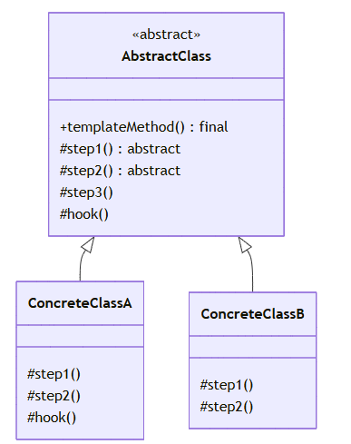

1. **抽象类（Abstract Class）**
   - 定义模板方法 `templateMethod()`（通常为 `final`）
   - 声明抽象方法（必须由子类实现）
   - 提供具体方法（默认实现）
   - 提供钩子方法（可选实现）

2. **具体子类（Concrete Class）**
   - 实现父类的抽象方法
   - 可选覆盖钩子方法


**核心组件解析**
1. **模板方法 (Template Method)**
   - 定义算法骨架的 `final` 方法
   - 调用各步骤方法（抽象/具体/钩子方法）

2. **抽象方法 (Abstract Methods)**
   - 必须由子类实现的算法步骤
   - 如示例中的 `parseData()` 和 `transformData()`

3. **具体方法 (Concrete Methods)**
   - 在抽象类中已实现的通用步骤
   - 如示例中的文件操作相关方法

4. **钩子方法 (Hook Methods)**
   - 提供扩展点的可选方法
   - 子类可决定是否覆盖（如 `needValidation()`）

**应用场景**
1. **算法框架固定，步骤实现可变**
   - 数据解析处理（CSV/XML/JSON）
   - 文档生成（PDF/HTML/Markdown）
   
2. **流程控制需求**
   - 工作流引擎
   - 编译过程（词法分析→语法分析→代码生成）
   
3. **框架扩展点**
   - Spring JdbcTemplate 的 `execute()`
   - Servlet 的 `service()` 方法


**优缺点分析**
**✅ 优点**
- 代码复用：将公共代码移至父类
- 扩展可控：保护核心算法不被修改
- 符合开闭原则：新增子类不影响现有代码
- 消除重复代码：统一处理通用步骤

**❌ 缺点**
- 继承限制：Java单继承限制灵活性
- 父类膨胀：抽象类可能变得复杂
- 违反里氏替换：子类可能破坏父类约束
- 调试困难：多级继承增加理解成本

**经典应用**
1. **Java I/O**
   - `InputStream` 的 `read()` 方法调用 `read(byte[] b, int off, int len)`
   
2. **Servlet 生命周期**
   - `HttpServlet` 的 `service()` 方法分发请求到 `doGet()/doPost()`

3. **Spring 框架**
   - `JdbcTemplate` 的 `execute()` 方法
   ```java
   public class JdbcTemplate {
       public final void execute(String sql) {
           // 获取连接
           Connection con = DataSourceUtils.getConnection();
           // 创建语句
           Statement stmt = con.createStatement();
           try {
               // 钩子方法（由子类实现）
               doExecute(stmt, sql);
           } finally {
               // 释放资源
               stmt.close();
           }
       }
       protected abstract void doExecute(Statement stmt, String sql);
   }
   ```

**最佳实践**
1. **合理使用钩子方法**
   - 在关键流程点提供扩展入口
   - 避免过度使用导致结构复杂

2. **控制抽象层级**
   - 模板方法不超过10个步骤
   - 抽象步骤保持单一职责

3. **与策略模式结合**
   ```java
   abstract class AdvancedProcessor {
       private ValidationStrategy strategy; // 组合策略模式
       
       public final void process() {
           //...固定步骤
           strategy.validate(data); // 可变校验策略
           //...固定步骤
       }
   }
   ```


### 访问者

确定对象结构稳定但经常需要添加新操作时，在不修改原对象的前提下，对每个对象的元素执行新操作

- 元素接口声明`accept()`方法
- 对象负责在每个元素与实际访问者之间建立联系：对象接收实际的访问者，并对对象的每个元素调用`accept(visitor)`方法
- 第一次分派：在元素的`accept(visitor)`方法中，调用`visitor`的`visitor.visit(this)`方法
- 第二次分派：`visitor`根据元素的类型选择具体的操作方法
  - 访问者接口声明N种重载方法，有N种元素就声明N种方法，每个方法的参数是元素接口的实现类，每个访问者实现类根据实际元素类型实现具体的操作


**优缺点分析**
**✅ 优点**
- 开闭原则：添加新操作无需修改元素类
- 单一职责：相关操作集中到访问者中
- 跨元素操作：实现跨不同元素类的操作
- 状态累积：访问者可在遍历中累积状态

**❌ 缺点**
- 破坏封装：访问者需访问元素内部细节
- 元素扩展困难：添加新元素需修改所有访问者
- 访问权限：可能被迫提供非必要的public方法
- 复杂度过高：小型对象结构不适用

**适用场景**
1. **复杂对象结构操作**
   - 编译器AST（抽象语法树）的多种操作（类型检查、代码优化）
   - 文档处理（导出、拼写检查、格式化）

2. **跨元素类操作**
   - 购物车不同商品的计算（总价、税费、折扣）
   - GUI组件树的操作（渲染、布局、事件处理）

3. **统计与报表生成**
   - 文件系统的空间统计（文件、目录、链接）
   - 组织架构的报表生成（部门、员工、职位）


**模式结构**
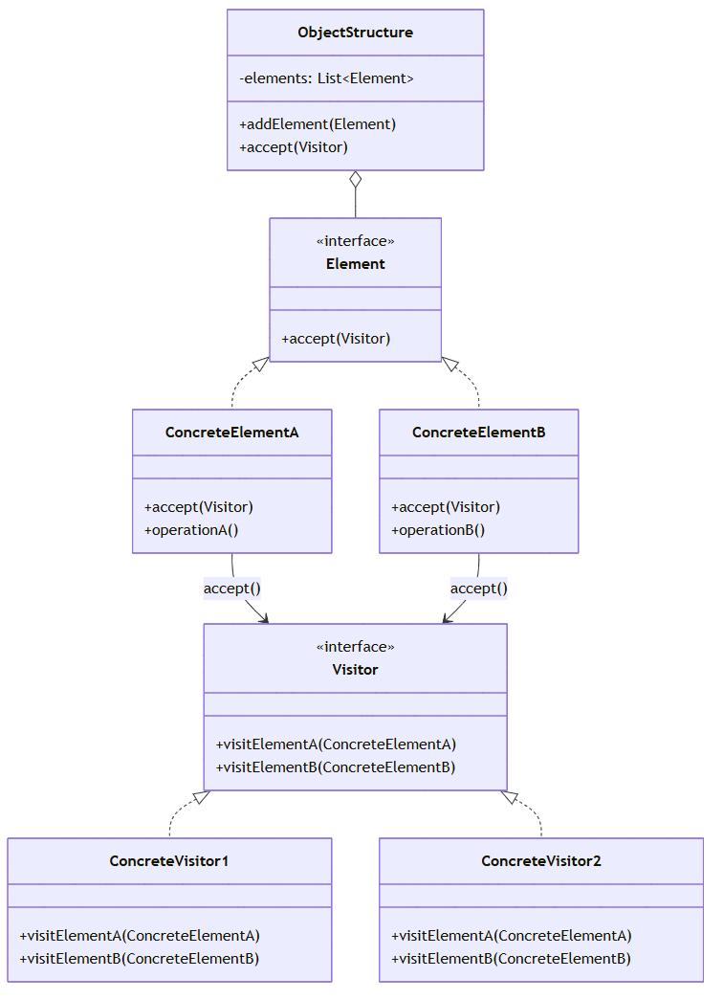


**代码示例：文档处理系统**
```java
// 元素接口
interface DocumentElement {
    void accept(DocumentVisitor visitor);
}

// 具体元素：文本段落
class TextElement implements DocumentElement {
    private String content;
    
    public TextElement(String content) {
        this.content = content;
    }
    
    public String getContent() {
        return content;
    }
    
    @Override
    public void accept(DocumentVisitor visitor) {
        visitor.visit(this);  // 第一次分派
    }
}

// 具体元素：图片
class ImageElement implements DocumentElement {
    private String path;
    private int width;
    private int height;
    
    public ImageElement(String path, int width, int height) {
        this.path = path;
        this.width = width;
        this.height = height;
    }
    
    public String getPath() { return path; }
    public int getWidth() { return width; }
    public int getHeight() { return height; }
    
    @Override
    public void accept(DocumentVisitor visitor) {
        visitor.visit(this);  // 第一次分派
    }
}

// 访问者接口
interface DocumentVisitor {
    void visit(TextElement text);
    void visit(ImageElement image);
}

// 具体访问者：导出为HTML
class HtmlExportVisitor implements DocumentVisitor {
    @Override
    public void visit(TextElement text) {
        System.out.println("<p>" + text.getContent() + "</p>");
    }
    
    @Override
    public void visit(ImageElement image) {
        System.out.printf("\n",
                          image.getPath(), image.getWidth(), image.getHeight());
    }
}

// 具体访问者：拼写检查
class SpellCheckVisitor implements DocumentVisitor {
    @Override
    public void visit(TextElement text) {
        System.out.println("检查拼写: " + text.getContent());
        // 实际拼写检查逻辑...
    }
    
    @Override
    public void visit(ImageElement image) {
        System.out.println("跳过图片: " + image.getPath());
    }
}

// 对象结构：文档
class Document {
    private List<DocumentElement> elements = new ArrayList<>();
    
    public void addElement(DocumentElement element) {
        elements.add(element);
    }
    
    public void accept(DocumentVisitor visitor) {
        for (DocumentElement element : elements) {
            element.accept(visitor);  // 遍历所有元素
        }
    }
}

// 客户端使用
public class Client {
    public static void main(String[] args) {
        // 创建文档结构
        Document doc = new Document();
        doc.addElement(new TextElement("欢迎使用访问者模式"));
        doc.addElement(new ImageElement("logo.png", 200, 100));
        doc.addElement(new TextElement("这是一个设计模式示例"));
        
        // 执行HTML导出
        System.out.println("=== 导出HTML ===");
        doc.accept(new HtmlExportVisitor());
        
        // 执行拼写检查
        System.out.println("\n=== 拼写检查 ===");
        doc.accept(new SpellCheckVisitor());
    }
}
```


### 空对象
**空对象模式** **提供一个行为中性（无操作或默认行为）的对象来代替 `null` 引用，从而避免客户端代码进行显式的 `null` 检查，并消除因 `null` 引用可能导致的错误（如 `NullPointerException`）。**

**核心目标：**

1.  **消除 `null` 检查：** 客户端代码无需写 `if (object != null)` 这样的防御性检查。
2.  **提供默认/安全的行为：** 当缺少真实对象时，提供一个“什么都不做”或执行无害默认操作的对象，使程序能安全地继续运行。
3.  **简化代码：** 使客户端代码更简洁、更专注于业务逻辑。
4.  **提高健壮性：** 减少由意外 `null` 引用引起的运行时错误。

**模式结构：**

1.  **`AbstractObject` (抽象对象)：**
    *   定义客户端期望的接口。
    *   声明所有客户端需要调用的操作（方法）。
    *   通常是接口或抽象类。

2.  **`RealObject` (真实对象)：**
    *   实现了 `AbstractObject` 接口。
    *   提供实际有意义的业务逻辑实现。

3.  **`NullObject` (空对象)：**
    *   同样实现了 `AbstractObject` 接口。
    *   实现接口的所有方法，但这些方法是**中性**的：
        *   **无操作 (Do Nothing)：** 最常见。方法体为空或只返回 `void`。
        *   **默认值：** 返回有意义的默认值（如返回 0、空字符串、空集合、`false` 等）。
        *   **日志记录：** 可选地记录该调用被一个空对象处理了（用于调试）。
    *   通常是一个单例（因为所有空对象实例行为相同）。

4.  **`Client` (客户端)：**
    *   使用 `AbstractObject` 接口类型的对象。
    *   **关键点：** 客户端**不知道**也不需要知道它持有的是 `RealObject` 还是 `NullObject`。它直接调用接口方法，无需检查 `null`。


**示例场景：**

*   **日志记录器：** 请求一个日志记录器。在调试模式返回真实记录器（写日志），在发布模式或特定类不需要日志时返回空记录器（忽略所有日志调用）。客户端代码始终调用 `logger.log(message)`，无需检查 `logger` 是否可用。
*   **数据访问：** 查询用户信息，未找到用户时返回一个 `NullUser` 对象（实现 `User` 接口），其 `getName()` 返回 "Guest" 或空字符串，`hasPermission()` 返回 `false`。客户端可以安全地显示用户名或检查权限。
*   **树形结构/组合模式：** 叶子节点的子节点集合可以返回空迭代器或空节点，避免客户端在遍历时检查每个节点是否有子节点。
*   **策略模式：** 没有特定策略时，提供一个“无操作”策略。

**优点：**

*   **代码简洁：** 消除大量重复的 `null` 检查，代码更清晰易读。
*   **增强健壮性：** 彻底避免 `NullPointerException`，提高程序稳定性。
*   **可预测性：** 即使没有真实对象，程序行为也是定义良好且一致的（执行中性行为）。
*   **遵循开闭原则：** 引入新的 `RealObject` 类型通常不需要修改客户端代码。添加新的中性行为有时可以通过新的 `NullObject` 子类实现。
*   **降低耦合：** 客户端只依赖抽象接口，不关心具体是真实对象还是空对象。

**缺点：**

*   **可能掩盖错误：** 如果“缺失对象”本应是一个**需要被注意和处理的错误情况**，使用空对象模式可能会**静默忽略**这个问题，使调试变得困难（你不知道是逻辑导致本该有对象却没有，还是空对象在默默工作）。需要谨慎判断使用场景。
*   **增加类数量：** 需要为每个可能返回 `null` 的抽象类型创建一个专门的 `NullObject` 类，可能增加系统复杂度。
*   **行为差异：** 需要确保所有 `NullObject` 的中性行为确实是客户端期望的。如果客户端需要区分“真实无操作”和“对象缺失”，此模式就不适用。

**何时使用：**

*   当对象缺失不是错误，并且存在一个合理的默认中性行为时。
*   当客户端需要检查 `null` 的代码非常多且重复，导致代码混乱时。
*   当你想明确表达“无”也是一种可能的状态，并给它一个正式的代表时。
*   当系统需要保证总是返回一个有效的对象引用时。


### 解释器

解释器模式定义了一种语言的文法表示，并创建一个解释器来解释该语言中的句子。这种模式主要用于需要解释执行特定语法规则的应用场景。


# JVM

Java 程序的执行全生命周期可划分为两个核心阶段：**编译期 (Compile Time)** 与 **运行时 (Runtime)**。

**编译期 (Compile Time)指将高级语言源代码转换为 JVM 可理解的中间格式（字节码）的过程**
- **输入**`.java` 源代码文件，**输出**`.class` 字节码文件
- `.class` 字节码文件包含 **JVM 指令集、符号表及类元数据**。
- `javap`：JDK 自带的反汇编工具，用于查看字节码指令
- `jclasslib`：可视化字节码查看插件，支持查看常量池、接口、字段、方法属性
- **Hex Editor**：以十六进制查看二进制文件，Java 类文件以魔数 `0xCAFEBABE` 开头


字节码文件由一系列**指令 (Instruction)** 组成，每条指令包含两个部分：
- **操作码 (Opcode)**：占用 1 字节，标识具体操作（如加载、存储、计算、跳转）。
- **操作数 (Operand)**：紧随操作码之后，提供操作所需的数据或常量池索引（部分无操作数指令除外）。


**运行时(Runtime)是指 JVM 启动并加载字节码，将其转换为底层硬件可执行的机器码的过程。**
1. **类加载 (Class Loading)**：JVM 通过类加载器读取 `.class` 文件。
2. **内存装载**：将类信息放入运行时数据区（Runtime Data Areas）。
3. **执行 (Execution)**：执行引擎读取内存中的字节码指令并运行。

**执行引擎机制**：JVM 采用混合模式执行代码
- **解释执行 (Interpreter)**：逐条读取字节码，翻译为机器码并立即执行。启动较快，但重复执行效率较低。
- **即时编译 (JIT - Just In Time)**：
  - **热点探测**：运行时监控高频执行的代码块（热点代码）。
  - **编译优化**：将热点代码编译为本地机器码并**缓存**。
  - **性能**：后续调用直接执行缓存的机器码，性能接近 C/C++。


**运行时数据区架构**：JVM 内存区域根据线程归属划分为两类
- **线程私有区域**：生命周期与线程绑定，随线程创建而创建，随线程销毁而回收。
  - **程序计数器 (PC Register)**：记录当前线程正在执行的字节码指令地址
    - 若执行 Java 方法，记录指令地址。
    - 若执行 Native 方法，值为 `undefined`。
    - 用于多线程切换后的上下文恢复及控制流（分支、循环、异常）跳转。
  - **虚拟机栈 (JVM Stack)**：由**栈帧 (Stack Frame)** 组成的 LIFO（后进先出）结构。主管 Java 方法的执行。每个方法调用对应一个栈帧的入栈，执行完毕对应出栈。
  - **本地方法栈**
- **线程共享区域 (Shared)**：所有线程可见，存在并发安全问题。
  - **堆 (Heap)**：存储对象实例及数组。
  - **方法区 (Method Area / Metaspace)**：存储已被加载的类信息、常量、静态变量、JIT 编译后的代码缓存、运行时常量池

**方法执行与栈帧模型**
- Java 方法的执行过程即**栈帧**在虚拟机栈中的流转过程。
- 栈帧内部结构
  - **局部变量表 (Local Variable Table)**：存放方法参数及方法内部定义的局部变量。
  - **操作数栈 (Operand Stack)**：用于执行计算时的临时数据存储及交换（后进先出）。
  - **动态连接 (Dynamic Linking)**：指向运行时常量池中该栈帧所属方法的引用。
  - **方法返回地址 (Return Address)**：记录方法正常或异常退出时，恢复上层调用者执行状态的地址。


## JVM运行时内存区域

Java 源代码经过编译生成字节码 (`.class`) 文件，由类加载器加载后交由执行引擎执行。在此过程中，JVM 会划分出一块专用内存空间用于存储程序执行期间所需的数据，该空间统称为 **运行时数据区**。

根据《Java 虚拟机规范》，运行时数据区可从线程归属的角度划分为 **线程私有区域** 和 **线程共享区域**。
- **线程私有区域构成：程序计数器、Java 虚拟机栈、本地方法栈**
- **线程共享区域构成：堆、方法区、运行时常量池**


### 线程私有

**程序计数器 (Program Counter Register)**
* **定义**：一块较小的内存空间，作为当前线程所执行字节码指令的行号指示器。
* **核心作用**：
  * **指令执行**：字节码解释器通过改变计数器的值来选取下一条需要执行的字节码指令（如顺序执行、分支、循环、跳转、异常处理）。
  * **线程恢复**：在多线程环境下，CPU 通过时间片轮转切换线程。为确保线程切换后能恢复到正确的执行位置，每个线程必须维护独立的程序计数器。
* **存储内容**：
  * 若当前执行的是 **Java 方法**，计数器记录的是正在执行的虚拟机字节码指令地址。
  * 若当前执行的是 **Native 方法**，计数器值为 `undefined`（因 Native 方法由 C/C++ 实现，不通过字节码指令执行）。
* **异常情况**：该区域是 JVM 规范中唯一没有规定任何 `OutOfMemoryError` 的区域。

**Java 虚拟机栈**
* **定义**：描述 Java 方法执行的内存模型。每个方法执行时会创建一个 **栈帧 (Stack Frame)**。
* **运作机制**：
  * **入栈**：方法被调用时，对应栈帧压入虚拟机栈。
  * **出栈**：方法执行结束（正常返回或抛出异常），对应栈帧弹出。
* **栈帧结构**：包含局部变量表、操作数栈、动态链接、方法出口等信息。
* **异常情况**：
  * `StackOverflowError`：线程请求的栈深度超过虚拟机允许的深度（如无限递归）。
  * `OutOfMemoryError`：如果虚拟机栈容量可以动态扩展，当扩展时无法申请到足够的内存。
* **参数配置**：使用 `-Xss` 参数调整栈大小（默认通常为 1024KB）。栈空间越小，支持的并发线程数可能越多，但单线程的最大调用深度减小。

**本地方法栈 (Native Method Stack)**
* **定义**：与 Java 虚拟机栈作用类似，区别在于 Java 虚拟机栈为执行 Java 方法服务，而本地方法栈为执行 **Native 方法** 服务。
* **实现**：HotSpot 虚拟机直接将本地方法栈与虚拟机栈合二为一。


**TLAB-Thread Local Allocation Buffer**：在堆内存中为每个线程分配私有区域，​加速对象分配，避免锁竞争
- 线程首次申请分配对象时，优先在私有`TLAB`上分配对象，`TLAB`不足时扩容或在`Eden`公共区分配
- `Eden`公共区由线程共享，需要进行同步操作
- 性能优势​：
  - **​无锁分配**​：提升高并发下对象创建速度
  - **​空间局部性**​：连续分配对象，提高CPU缓存命中率
- **`Thread Local Allocation Buffer`与`ThreadLocal<E>`是完全不关联的概念**
  - `ThreadLocal<E>`为每个线程提供独立的变量副本，​避免多线程竞争，实现线程隔离


### 线程共享
此类区域在 JVM 启动时创建，所有线程共享访问。

**堆 (Heap)**
* **定义**：JVM 内存管理中最大的一块区域，主要用于存放 **对象实例** 和 **数组**。
* **内存分配策略**：
  * **传统观点**：所有对象都在堆上分配。
  * **JIT 优化**：随着 **JIT 编译器** 和 **逃逸分析 (Escape Analysis)** 技术的发展，如果编译器确定一个对象不会逃逸出方法（即未被外部引用），可能会采用 **栈上分配 (Stack Allocation)** 或 **标量替换**，直接在栈帧中分配对象，减少 GC 压力。
* **逻辑划分**（基于分代收集算法）：
  * **新生代 (Young Generation)**：包含 Eden 区、From Survivor 区、To Survivor 区。
  * **老年代 (Old Generation)**。
* **异常情况**：
  * `java.lang.OutOfMemoryError: Java heap space`：堆内存不足以存放新创建的对象。
  * `java.lang.OutOfMemoryError: GC Overhead Limit Exceeded`：JVM 花费大量时间进行 GC 但回收空间甚微。
* **参数配置**：`-Xmx` (最大堆大小), `-Xms` (初始堆大小)。

**方法区 (Method Area)**
* **定义**：用于存储已被虚拟机加载的 **类信息**、**常量**、**静态变量**、**即时编译器编译后的代码缓存** 等数据。
* **演变历史**（以 HotSpot 为例）：
  * **JDK 7 及之前**：实现为 **永久代 (PermGen)**，位于 JVM 内存中，受 `-XX:MaxPermSize` 限制，易导致 OOM。
  * **JDK 8 及之后**：永久代被移除，取而代之的是 **元空间 (Metaspace)**。
* **元空间 (Metaspace)**：
  * **存储位置**：不再位于虚拟机内存，而是直接使用 **本地内存 (Native Memory)**。**属于堆外内存的一部分**
  * **优势**：空间大小受限于本地内存，大大降低了 OOM 的风险。
  * **参数配置**：`-XX:MaxMetaspaceSize`。

**运行时常量池 (Runtime Constant Pool)**
* **定义**：**方法区的一部分**。`.class` 文件中的 **常量池表 (Constant Pool Table)**（存放编译期生成的字面量和符号引用）在类加载后被放入运行时常量池。
* **特性**：具备**动态性**。除了保存 Class 文件中描述的常量外，运行期间也可将新的常量放入池中（例如 `String.intern()` 方法）。
* **位置变迁**：
  * **JDK 7**：**字符串常量池 (String Pool) 从方法区移动到了堆 (Heap)中**。
  * **JDK 8**：**运行时常量池位于元空间，但字符串常量池依然保留在堆中。**

> Jdk8后，方法区位于元空间，元空间位于堆外内存；
> 运行时常量池属于方法区，字符串常量池在堆中


---

### 进程虚拟地址空间

**进程的虚拟地址空间**：当操作系统运行一个程序（进程）时，它会**为该进程创建一个私有的、连续的、巨大的虚拟地址空间**。这是一个逻辑上的概念，并非物理内存的实际布局
- **隔离与安全**：每个进程都认为自己独占了全部内存（例如，从0x0000...到0xFFFF...），不同进程的相同虚拟地址会被映射到不同的物理地址，互相隔离，无法直接访问。
- **简化编程**：程序员和编译器无需关心物理内存的具体位置和分配，只需使用虚拟地址。
- **高效管理物理内存**：操作系统可以非连续地使用物理内存，通过分页和交换技术，让有限的物理内存运行多个需要大量内存的程序。


以64位Linux为例，虚拟地址空间从Ox7FFF FFFF FFFF FFFF到0x0000 0000 0000 0000的布局依次为
- 内核空间：操作系统内核代码与数据，用户进程不可直接访问，需通过系统调用；其他空间为用户空间
- 高地址区-向下增长
  - **内存映射区域**：由mmap系统调用创建，映射文件/共享库，MappedByteBuffer在此生效
  - **栈**：函数调用，局部变量，**每个线程有独立栈**
- 中间区域：向上增长
  - **堆**：动态分配内存，JVM堆位于此处
- 低地址区
  - BSS段：未初始化的全局/静态变量
  - 数据段：已初始化的全局/静态变量
  - 代码段：只读，存放程序指令


**内存管理单元**：**通过查询页表将虚拟地址转换为物理地址**，以访问真实内存
- **页表**：操作系统为每个进程维护的映射表，记录虚拟页到物理页帧的映射关系。
- **缺页中断**：当进程访问一个尚未映射到物理内存的虚拟页时，MMU触发中断，操作系统介入处理

**缺页中断**  
- **文件映射内存**：通过 mmap() 系统调用将文件的一部分映射到进程的地址空间；**操作系统不会在调用 mmap() 时就立刻把整个文件读入内存，而是等到真正访问到某页时才加载它**。**进程访问一个已经通过 mmap() 映射了文件，但对应的文件内容尚未被加载到物理内存的虚拟页时，触发缺页中断**
  - 从物理内存中分配一个空闲页帧
  - 发起磁盘I/O操作，将所需文件块（通常是4KB大小）从磁盘读取到上一步分配的物理页帧中
  - 更新页表，使虚拟页指向这个包含文件数据的物理页帧。
- **匿名映射内存**：匿名映射是指没有直接关联到磁盘文件的内存区域，例如，堆、栈、以及显式创建的匿名 mmap 区域。**进程访问一个已分配但尚未分配物理页的虚拟页时，触发缺页中断**。缺页中断完成后，程序才允许对该页进行读写。
  - 从物理内存中分配一个空闲页帧。
  - 填充零页：无需磁盘I/O。内核简单地将这个新分配的物理页帧全部填充为零（或调用专门的“零页”）。这是一个非常快的操作。
  - 建立映射：更新页表，建立映射关系。


**换页缺页**
- **页面换出**：匿名映射内存时的匿名页是脏的，即内存与硬盘不一致，当内存紧张时，操作系统可能会将这种脏的匿名页换出到磁盘的交换分区/文件中。
- 当进程再次访问已被换出的页时，会触发另一种缺页中断——换页缺页
  - 分配一个新的物理页帧。
  - 发起磁盘I/O，从交换空间中读回之前保存的数据。
  - 建立映射。


### 本地内存、堆外内存
操作系统分配给JVM进程的内存也可分为两部分：**堆内内存和堆外内存（本地内存）**
  
**本地内存由操作系统 + JVM 内部的 C++ 代码管理，主要包含**
- **元空间 (Metaspace)：存储类元数据（Klass 结构、方法定义等）。**
- **直接内存 (Direct Memory)：NIO 使用的 DirectByteBuffer**
- **线程栈 (Thread Stacks)：每个线程的栈空间（-Xss）**
- 代码缓存 (Code Cache)：JIT 编译后的本地机器码
- GC 和内部结构：垃圾收集器自身运行所需的数据结构
- JNI：本地方法调用的内存开销。


## 类加载子系统

### 类加载过程

**类加载 (Class Loading)** 是 JVM **将 `.class` 文件中的二进制数据读入内存，将其放在运行时数据区的方法区内，并在堆区创建一个 `java.lang.Class` 对象作为访问入口的过程。**

**类加载的生命周期**
- 类的生命周期包含 7 个阶段，其中**加载 (Loading)**、**连接 (Linking)**、**初始化 (Initialization)** 为类加载的核心过程。
- **加载 (Loading)**：此阶段 JVM 必须完成三件事
  1. **获取二进制流**：通过类的全限定名获取定义该类的二进制字节流（来源可以是 ZIP 包、网络、动态代理生成等）。
  2. **转化数据结构**：将字节流代表的静态存储结构转化为**方法区**的运行时数据结构。
  3. **生成 Class 对象**：在堆内存中生成一个代表该类的 `java.lang.Class` 对象，作为方法区这个类各种数据的访问入口。
- **连接 (Linking)**：此阶段将类的二进制数据合并到 JRE 中，细分为三个步骤：
  1. **验证 (Verification)**：确保字节流包含的信息符合 JVM 规范，保证安全性。
     - *文件格式验证*：魔数 `0xCAFEBABE`、版本号等。
     - *元数据验证*：语义分析（是否有父类、是否继承了 final 类等）。
     - *字节码验证*：数据流和控制流分析。
     - *符号引用验证*：确保解析动作能正确执行。
  2. **准备 (Preparation)**：为类变量（`static` 修饰）分配内存并设置**零值**（Default Value）。
     - *注意*：此时不包含 `final static` 常量（编译期已确定值）和实例变量（随对象实例化分配）。
     - *示例*：`public static int value = 123;` 在准备阶段 `value` 值为 0，而非 123。
  3. **解析 (Resolution)**：将常量池内的**符号引用**替换为**直接引用**。
     - *符号引用*：一组符号来描述目标，与虚拟机内存布局无关。
     - *直接引用*：直接指向目标的指针、相对偏移量或句柄。
- **初始化 (Initialization)**：类加载的最后一步，真正执行类中定义的 Java 程序代码。本质是执行类构造器 `<clinit>()` 方法的过程。
  - **`<clinit>()` 方法**：**由编译器自动收集类中的所有类变量的赋值动作和静态语句块 (`static {}`) 合并产生。**
  - **执行顺序**：**JVM 保证父类的 `<clinit>()` 先于子类执行。**
  - **线程安全**：**JVM 会对 `<clinit>()` 方法加锁，确保多线程环境下类的初始化只执行一次。**
  


**区分类加载初始化与对象实例化**
- **类初始化阶段操作的是 Class 对象，生命周期内通常只发生 1 次，任务是给静态变量赋初始值，执行静态代码块。**
- 对象实例化：发生时间是执行 new 指令时，每次 new 都会发生。任务是给实例变量赋值，执行构造函数代码
- 类加载的初始化阶段执行的`<clinit>()` 方法，只会合并静态语句块 (`static {}`)，不会合并非静态语句块。**非静态的语句块 {} 会被编译器提取，并合并到实例构造函数 `<init>` 中，且放在构造函数代码的最前面**。每次 new 对象时都会执行

---

**JVM 规范严格规定了有且只有 6 种情况必须立即对类进行“初始化”**，**即类加载是懒加载模式**
- **主动引用触发初始化**
  1. **特定指令**：遇到 `new`（实例化）、`getstatic`/`putstatic`（读取/设置静态字段，final 除外）、`invokestatic`（调用静态方法）指令时。
  2. **反射调用**：使用 `java.lang.reflect` 包方法对类进行反射调用时。
  3. **继承关系**：初始化一个类时，若其父类未初始化，需先触发父类初始化。
  4. **入口方法**：虚拟机启动时，包含 `main()` 方法的主类。
  5. **动态语言支持**：`java.lang.invoke.MethodHandle` 解析结果为静态成员时。
  6. **接口默认方法**：当一个接口定义了 JDK 8 新加入的默认方法，如果有实现类发生了初始化，该接口要在其之前被初始化。
- **被动引用不触发初始化**
  1. **子类引用父类静态字段**：只会触发父类初始化，子类不会初始化。
  2. **数组定义**：`SuperClass[] sca = new SuperClass[10];` 不会触发 `SuperClass` 初始化。
  3. **常量引用**：引用 `static final` 常量。常量在编译阶段存入调用类的常量池，本质上没有直接引用到定义常量的类。

---

### 类加载器层

**类加载器子系统 (Class Loader Subsystem)**
- 类加载器负责“通过全限定名获取描述此类的二进制字节流”，拥有三个层级
1. **启动类加载器 (Bootstrap ClassLoader)**：
   - 由 C++ 实现，是虚拟机自身的一部分。
   - 负责加载 `<JAVA_HOME>\lib` 目录下的核心库（如 `rt.jar`）。
   - 无法被 Java 程序直接引用。
2. **扩展类加载器 (Extension ClassLoader)**：
   - 由 Java 实现 (`sun.misc.Launcher$ExtClassLoader`)。
   - 负责加载 `<JAVA_HOME>\lib\ext` 目录下的扩展库。
3. **应用程序类加载器 (Application ClassLoader)**：
   - 由 Java 实现 (`sun.misc.Launcher$AppClassLoader`)。
   - 负责加载用户类路径 (`ClassPath`) 上指定的类库。
   - 它是 `ClassLoader.getSystemClassLoader()` 的返回值，通常是默认加载器。


### 双亲委派机制

**双亲委派模型Parent Delegation Model**

- **工作原理**：如果一个类加载器收到了类加载的请求，它首先不会自己去尝试加载这个类，而是把这个请求委派给父类加载器去完成，每一个层次的类加载器都是如此，因此所有的加载请求最终都应该传送到顶层的启动类加载器中。只有当父加载器反馈自己无法完成这个加载请求（找不到类）时，子加载器才会尝试自己去加载。
- **核心优势**：
  1. **安全性**：防止 Java 核心 API 被篡改（例如用户自定义一个 `java.lang.Object`，会被委派给 Bootstrap 加载器，加载的依然是系统原生的 Object）。
  2. **避免重复加载**：保证被加载类的唯一性。

**破坏双亲委派**：在某些特殊场景下（如 JNDI、JDBC、模块化热部署），需要打破该模型。
* **线程上下文类加载器 (Thread Context ClassLoader)**：允许父级加载器（如 Bootstrap 加载的 JNDI 核心类）请求子级加载器（如 Application 加载器）去加载厂商实现的 SPI (Service Provider Interface) 代码。
* **Tomcat 类加载机制**：为了实现 Web 应用的隔离（不同应用依赖不同版本的库），Tomcat 自定义了复杂的类加载器架构，优先加载 Web 应用目录下的类，而非委托给父级。


### 类文件结构

**Class 文件**是 Java 虚拟机执行引擎的数据入口，也是 Java 实现“一次编写，到处运行”跨平台特性的基石。它是一组以 8 位字节为基础单位的二进制流，各个数据项目严格按照顺序紧凑排列在文件之中，中间没有添加任何分隔符。

**数据结构基础**：Class 文件采用一种伪结构来存储数据，仅包含两种数据类型：
1. **无符号数 (Unsigned Numbers)**：
   * 基本数据类型，以 `u1`、`u2`、`u4`、`u8` 分别代表 1 个字节、2 个字节、4 个字节、8 个字节的无符号数。
   * 用于描述数字、索引引用、数量值或 UTF-8 编码的字符串值。
2. **表 (Tables)**：
   * 由多个无符号数或其他表作为数据项构成的复合数据类型。
   * 通常以 `_info` 结尾。整个 Class 文件本质上就是一张巨大的表。

**字节序**：Class 文件使用 **Big-Endian**（大端模式）顺序存储多字节数据（高位字节在前，低位字节在后）。

---

**Class 文件结构严格按照以下顺序排列**：
| 类型 | 名称 | 数量 | 描述 |
| --- | --- | --- | --- |
| `u4` | **magic** | 1 | 魔数 (Magic Number) |
| `u2` | **minor_version** | 1 | 次版本号 |
| `u2` | **major_version** | 1 | 主版本号 |
| `u2` | **constant_pool_count** | 1 | 常量池容量计数值 |
| `cp_info` | **constant_pool** | count-1 | 常量池表 |
| `u2` | **access_flags** | 1 | 访问标志 |
| `u2` | **this_class** | 1 | 类索引 |
| `u2` | **super_class** | 1 | 父类索引 |
| `u2` | **interfaces_count** | 1 | 接口计数器 |
| `u2` | **interfaces** | count | 接口索引集合 |
| `u2` | **fields_count** | 1 | 字段计数器 |
| `field_info` | **fields** | count | 字段表集合 |
| `u2` | **methods_count** | 1 | 方法计数器 |
| `method_info` | **methods** | count | 方法表集合 |
| `u2` | **attributes_count** | 1 | 属性计数器 |
| `attribute_info` | **attributes** | count | 属性表集合 |

---

**魔数与版本号 (Magic & Version)**
* **魔数 (Magic Number)**：前 4 个字节，固定为 `0xCAFEBABE`。唯一作用是确定该文件是否为一个能被虚拟机接受的 Class 文件。
* **版本号**：
* JDK 兼容性遵循“向下兼容”原则。
* JDK 1.1 使用 45.3，JDK 1.2 使用 46.0，以此类推。高版本 JDK 能执行低版本 Class 文件，反之则抛出 `UnsupportedClassVersionError`。


**常量池 (Constant Pool)**：Class 文件的资源仓库，主要存放两大类常量：
1. **字面量 (Literals)**：接近 Java 语言层面的常量概念，如文本字符串、`final` 常量值等。
2. **符号引用 (Symbolic References)**：编译原理方面的概念，包含：
   * 类和接口的全限定名。
   * 字段的名称和描述符。
   * 方法的名称和描述符。

- **特性**：
  * 索引从 1 开始（索引 0 保留，用于表示“不引用任何一个常量池项目”）。
  * 共有 17 种常量类型（如 `CONSTANT_Class_info`, `CONSTANT_Utf8_info`, `CONSTANT_Methodref_info` 等）。

**访问标志 (Access Flags)**：占用 2 个字节，用于识别类或接口层次的访问信息。
* **常见标志**：
* `ACC_PUBLIC` (0x0001)：是否为 public。
* `ACC_FINAL` (0x0010)：是否为 final。
* `ACC_INTERFACE` (0x0200)：是否为接口。
* `ACC_ABSTRACT` (0x0400)：是否为 abstract。


**类索引、父类索引与接口索引集合**：这三项数据确定了该类的继承关系：
* **this_class**：指向常量池中类描述符的索引，确定全限定名。
* **super_class**：指向父类全限定名。除 `java.lang.Object` 外，所有类的父类索引都不为 0。
* **interfaces**：描述该类实现了哪些接口。

**字段表集合 (Fields)**：描述接口或者类中声明的变量（包括类变量和实例变量，但不包括方法内部的局部变量）。

* **结构**：包含访问标志 (`access_flags`)、名称索引 (`name_index`)、描述符索引 (`descriptor_index`) 和属性表集合。
* **描述符**：用于描述字段的数据类型。例如 `I` 表示 `int`，`Ljava/lang/String;` 表示 `String` 对象。

**方法表集合 (Methods)**：描述类中定义的方法。

* **结构**：与字段表类似。
* **注意**：方法体内的代码并不直接存在方法表中，而是经过编译成字节码指令后，存放在方法属性表集合中的 **Code** 属性内。

**属性表集合 (Attributes)**：Class 文件中最灵活的部分，不要求严格的顺序。

* **Code 属性**：存放 Java 方法编译后的字节码指令。包含 `max_stack`（操作数栈深）、`max_locals`（局部变量表大小）及字节码流。
* **LineNumberTable**：建立字节码偏移量与源代码行号之间的联系（用于调试与报错定位）。
* **LocalVariableTable**：建立栈帧局部变量表中的变量与源代码中定义的变量之间的联系。
* **SourceFile**：记录生成该 Class 文件的源码文件名称。

---

## 执行引擎


### 栈帧

**栈帧 (Stack Frame)** 是 Java 虚拟机运行时数据区中 **虚拟机栈 (VM Stack)** 的基本单位，用于支持方法调用和执行。每个方法从调用开始到执行完成，对应着一个栈帧在虚拟机栈中从入栈到出栈的过程。

栈帧的结构主要包含四部分：**局部变量表**、**操作数栈**、**动态连接**和**方法返回地址**。

**局部变量表 (Local Variable Table)**：一组变量值存储空间，用于存放方法参数和方法内部定义的局部变量。
* **编译期确定**：局部变量表的最大容量在编译期确定，并保存在方法的 `Code` 属性的 `max_locals` 数据项中。
* **Slot (变量槽)**：局部变量表的最小存储单位。
  * **32 位数据**：`boolean`, `byte`, `char`, `short`, `int`, `float`, `reference`, `returnAddress` 占用 1 个 Slot。
  * **64 位数据**：`long`, `double` 占用 2 个连续的 Slot。
* **索引分配**：
  * **静态方法**：参数和局部变量从索引 0 开始顺序排列。
  * **实例方法**：索引 0 默认存储方法所属对象的引用 (`this`)，参数和局部变量从索引 1 开始排列。
* **Slot 复用**：为了节省栈帧空间，如果当前字节码指令的位置已超出了某变量的作用域，该变量占用的 Slot 可以被后续定义的变量复用。

> **优化启示**：合理控制变量作用域有助于减少栈帧内存消耗，可能对垃圾回收产生微弱影响（复用 Slot 可打断过期的对象引用）。

---

**操作数栈 (Operand Stack)**：一个后进先出 (LIFO) 的栈结构，作为方法执行过程中数据的临时交换区。
* **编译期确定**：最大深度在编译期确定，保存在 `Code` 属性的 `max_stack` 数据项中。
* **执行逻辑**：
  * 方法刚开始执行时，操作数栈为空。
  * 字节码指令（如 `iadd`, `iconst`）会将常量或从局部变量表加载的数据**压入**栈中，或从栈顶**弹出**数据进行运算，并将结果重新压入。
* **类型约束**：栈内的元素数据类型必须与字节码指令严格匹配（例如 `iadd` 指令执行时，栈顶两个元素必须是 `int` 类型）。

---

**动态连接 (Dynamic Linking)**：每个栈帧都包含一个指向运行时常量池中该栈帧所属方法的引用，持有这个引用是为了支持方法调用过程中的**动态连接**。
* **静态解析**：符号引用在类加载阶段或第一次使用时转化为直接引用（如静态方法、私有方法）。
* **动态连接**：符号引用在**每一次运行期间**转化为直接引用。
* 典型场景：`invokevirtual` 指令调用虚方法时，需根据调用者的实际运行时类型（RTTI）查找目标方法。


---

**方法返回地址 (Method Return Address)**：当一个方法开始执行后，只有两种方式退出：
1. **正常完成出口 (Normal Completion)**
  * **触发条件**：遇到任意方法返回的字节码指令（如 `ireturn`, `return`）。
  * **恢复状态**：调用者的 PC 计数器值作为返回地址。栈帧出栈，恢复上层方法的局部变量表和操作数栈，将返回值压入调用者的操作数栈。
2. **异常完成出口 (Abrupt Completion)**
   * **触发条件**：方法执行过程中遇到异常，且该异常未在方法体内得到处理（未匹配到异常表）。
   * **状态**：不会给上层调用者产生任何返回值。

---

**栈帧与 StackOverflowError**：虚拟机栈内存有限。若方法调用链过深（如无限递归），导致栈帧总大小超过虚拟机栈允许的最大深度，JVM 将抛出 `StackOverflowError`。


### **栈虚拟机和寄存器虚拟机**

在虚拟机VM的设计中，指令集架构ISA主要分为两大流派：**基于栈的虚拟机Stack-based VM** 和 **基于寄存器的虚拟机 Register-based VM**。两者的核心差异在于操作数的存储与检索机制。
* **栈 (Stack)**：位于内存中。数据访问涉及内存寻址。
* **寄存器 (Register)**：位于 CPU 内部。是计算机中读写速度最快的存储单元。
* **物理规律**：基于寄存器的架构在硬件层面通常比基于栈的架构具有更快的执行速度，因为减少了内存 I/O 开销。
* **基于栈的 VM**：代表如 **HotSpot JVM**、CPython。使用操作数栈 (Operand Stack) 管理计算过程，指令通常不包含显式的操作数地址（零地址指令）。
* **基于寄存器的 VM**：代表如 **LuaVM** (5.0+)、Dalvik (Android)。使用虚拟寄存器管理计算过程，指令需显式指定操作数地址（二地址或三地址指令）。

---

**基于栈的虚拟机**
- JVM 采用**操作数栈**来管理计算。
  * **数据流转**：方法调用时创建栈帧 (Stack Frame)，栈帧内包含**局部变量表**和**操作数栈**。
  * **指令特点**：指令集主要为**零地址指令** (Zero-Address Instruction)。指令隐式地操作栈顶元素，无需指定源地址和目标地址。
- 计算 `int c = 33 + 44;` 的字节码指令序列：

```java
0: bipush 33    // 将常量 33 压入操作数栈顶
2: istore_1     // 弹出栈顶元素(33)，存入局部变量表 Slot 1
3: bipush 44    // 将常量 44 压入操作数栈顶
5: istore_2     // 弹出栈顶元素(44)，存入局部变量表 Slot 2
6: iload_1      // 将局部变量表 Slot 1 的值(33)压入栈顶
7: iload_2      // 将局部变量表 Slot 2 的值(44)压入栈顶
8: iadd         // 弹出栈顶两个元素(33, 44)，相加，将结果(77)压入栈顶
9: istore_3     // 弹出栈顶元素(77)，存入局部变量表 Slot 3

```


* **为什么 JVM 选择栈架构？**
  * **可移植性 (Portability)**：不依赖特定硬件寄存器的数量，易于在不同 CPU 架构上实现。
  * **指令紧凑**：零地址指令长度短（通常 1 字节操作码），代码体积小，适合早期网络传输和嵌入式设备。
  * **编译器实现简单**：无需进行复杂的寄存器分配算法。
---

**基于寄存器的虚拟机**
- LuaVM 使用**虚拟寄存器**来管理计算
  * **数据流转**：指令直接对寄存器进行操作，类似于物理 CPU 的执行方式。
  * **指令特点**：指令集主要为**二地址或三地址指令**。必须显式指定源操作数和目标操作数的寄存器地址。
- 计算 `local c = a + b` 的 Lua 字节码（逻辑示意）：

```lua
LOADI 0 33      ; 将 33 加载到寄存器 R0
LOADI 1 44      ; 将 44 加载到寄存器 R1
ADD   2 0 1     ; 计算 R0 + R1，结果存入 R2

```
- Lua 在 5.0 版本之前也是基于栈的，5.0 后转为基于寄存器，主要驱动力为：
  1. **减少数据移动**：避免了大量的入栈 (Push) 和出栈 (Pop) 操作。
  2. **减少指令数量**：一条寄存器指令可以完成多条栈指令的工作（如上例，加法仅需 1 条指令，而栈架构需要 `load` + `add` + `store` 多步）。

---

**优缺点对比总结**

| 维度 | 基于栈 (Stack-based) | 基于寄存器 (Register-based) |
| --- | --- | --- |
| **指令长度** | **短** (零地址，紧凑) | **长** (需包含操作数地址) |
| **指令数量** | **多** (需频繁 Push/Pop) | **少** (单条指令承载更多逻辑) |
| **执行速度** | 相对较慢 (内存访问/栈顶移动频繁) | **快** (数据移动少，贴近硬件) |
| **可移植性** | **高** (硬件无关) | 较低 (依赖寄存器设计) |
| **编译器实现** | **简单** | 复杂 (需寄存器分配算法) |
| **代表实现** | Java (HotSpot), Python | Lua, Android (Dalvik/ART) |

**结论**
* **基于栈**：以**代码体积**和**移植性**为优先考量，牺牲了部分运行时性能（尽管现代 JIT 编译器已极大优化了这一点）。
* **基于寄存器**：以**执行效率**和**性能**为优先考量，通过减少指令分派次数和数据移动次数来提升速度。
### javap

**因为有编译器优化和语法糖，所以源码是骗人的，只有JVM 视角里的字节码是诚实的**，不止步于性能监控，**利用`javap`反编译的字节码进行故障排查和深度调优**
- **字节码 (Bytecode)** 是 Java实现平台无关性的核心
- `javap` 是 JDK 自带的反汇编工具，用于将 `.class` 文件转换回可读的指令流和元数据结构，是分析 JVM 执行机制的关键手段。
- `javap` 主要用于**显示编译后的类文件结构，包括构造方法、成员方法、字段描述符以及字节码指令**。**`javap`不会还原源代码，而是展示 JVM 视角的执行逻辑**。

**常用指令参数**
* `javap -c [ClassName]`: 对代码进行反汇编（显示字节码指令）。
* `javap -v [ClassName]`: 输出附加信息（Verbose），包含行号表 (`LineNumberTable`)、局部变量表 (`LocalVariableTable`)、常量池、操作码等。
* `javap -p [ClassName]`: 显示所有类和成员，包括 `private` 修饰的成员。


`javap -v` 输出内容通常包含文件元数据、常量池、字段表和方法表。
- **文件元数据 (Metadata)**
  * **Classfile**: 指示 `.class` 文件的物理路径。
  * **SHA-256 Checksum**: 用于校验文件完整性。
  * **Version**:
    * `minor version`: 次版本号。
    * `major version`: 主版本号（如 55 代表 JDK 11）。
  - **Flags (Access Flags)**: 类的访问标记。
  * **索引引用**:
    * `this_class`: 指向当前类的常量池索引。
    * `super_class`: 指向父类的常量池索引（默认继承 `java/lang/Object`）。
- **常量池 (Constant Pool)**：存储**字面量**与**符号引用**。以 `#索引 = 类型 值` 的格式展示。
  * **字面量 (Literal)**: 文本字符串、`final` 常量值。
  * **符号引用 (Symbolic Reference)**:
  * `Class`: 类或接口的全限定名。
  * `Fieldref`: 字段的名称与描述符引用。
  * `Methodref`: 方法的名称与描述符引用。
  * `NameAndType`: 名称与类型的组合。


`javap -p`成员与方法表解析

- **字段表 (Fields)**：描述类中声明的变量（不含局部变量）。
  * **Descriptor (描述符)**: 标识字段类型。
    * `I`: `int`
    * `Ljava/lang/String;`: `String` 对象
  * **Flags**: 访问修饰符（如 `ACC_PRIVATE`）。
- **方法表 (Methods)**：包含构造方法 (`<init>`) 和成员方法。
- **核心属性：Code Attribute**：`Code` 属性包含方法编译后的字节码指令及运行时所需的栈/变量表大小。
  * **stack**: **操作数栈 (Operand Stack)** 的最大深度。
    * 用于存放临时变量和中间计算结果。JVM 运行时根据此值分配栈帧深度。
  * **locals**: **局部变量表 (Local Variable Table)** 的容量（单位：Slot）。
    * 非静态方法的 Slot 0 默认存储 `this` 引用。
    * 容量大小在编译期确定。
  * **args_size**: 方法参数个数。
    * 非静态方法包含隐藏参数 `this`，故无参方法的 `args_size` 为 1。
- 调试属性
  * LineNumberTable: 建立字节码偏移量 (Offset) 与 Java 源代码行号的映射，用于调试断点定位。
  * LocalVariableTable: 建立栈帧局部变量槽 (Slot) 与源码变量名、类型、作用域的映射。

> 栈深度 (`stack`) 和局部变量表大小 (`locals`) 均在编译期计算完成。

---
`public int getAge() { return age; }` 字节码指令流

> 实例方法默认通过 Slot 0 传递 `this` 引用。
> JVM 基于栈架构，通过压栈、出栈、计算指令完成逻辑处理。

```java
0: aload_0//将局部变量表第 0 个槽位（即 `this` 引用）加载到操作数栈顶
//弹出栈顶的 `this` 引用。
//访问常量池索引 `#2` 指向的字段（`age`）。
//读取字段值并压入操作数栈顶。
1: getfield #2
//弹出栈顶的 `int` 值作为方法返回值。
4: ireturn

```

---

### 字节码指令详解

Java 虚拟机的指令由一个字节长度的**操作码 (Opcode)** 和紧随其后的零至多个**操作数 (Operands)** 构成。由于 JVM 采用**基于栈 (Stack-Based)** 的架构，大部分指令不包含显式的操作数，而是直接从**操作数栈 (Operand Stack)** 中弹出数据进行处理，再将结果压回栈顶。

#### 加载与存储指令 (Load and Store Instructions)

此类指令是 JVM 中使用频率最高的指令集，主要负责数据在**局部变量表 (Local Variable Table)** 与**操作数栈**之间的双向传输。

1. **加载指令 (Load)**：将局部变量表中的数据读取并压入操作数栈顶，供后续计算使用。
   * **指令格式**：`xload_<n>` 或 `xload`（其中 `x` 代表数据类型，`n` 代表局部变量表的索引）。
     * `iload`, `lload`, `fload`, `dload`, `aload`：分别对应 `int`, `long`, `float`, `double`, `reference` 类型。
    * **索引优化**：
      * 对于索引 `0` 到 `3` 的局部变量，JVM 提供了缩短的指令（如 `iload_0`, `aload_1`）。这些指令只有操作码，没有操作数，从而缩减了字节码体积。
      * 对于索引大于 `3` 的局部变量，必须使用带操作数的通用指令（如 `iload 5`）。
    * **特殊说明**：`aload_0` 在非静态方法中通常用于加载 `this` 引用。

2. **存储指令(Store)**：将操作数栈顶的数据弹出，并写入到局部变量表的指定位置。
   * **指令格式**：`xstore_<n>` 或 `xstore`。
     * 例如：`istore_1` 表示将栈顶的 `int` 值弹出并存入局部变量表索引为 `1` 的槽位 (Slot)。
    * **对称性**：存储指令与加载指令在助记符和机制上保持严格的对称性。
3. **常量入栈指令**：将常量值直接压入操作数栈。根据常量的数值范围和类型，JVM 提供了三种不同的指令策略：
   - **Const 系列 (隐含操作数)**：
     * 用于加载最常用的微小常量，指令本身即包含数值信息，不占用额外操作数空间。
     * 例如：`iconst_0` (加载 0), `iconst_m1` (加载 -1), `aconst_null` (加载 null)。
   - **Push 系列 (直接操作数)**：
     * `bipush`：接收 8 位带符号整数（范围 -128 至 127）。
     * `sipush`：接收 16 位带符号整数（范围 -32768 至 32767）。
   - **Ldc 系列 (常量池引用)**：
     * 当数值超出 `sipush` 范围，或加载浮点数、字符串、类引用时，使用 `ldc` 指令从**运行时常量池**中加载。
     * `ldc_w` 和 `ldc2_w` 用于支持宽索引或 `long`/`double` 类型常量的加载。
---

#### 算术指令 (Arithmetic Instructions)

算术指令用于对操作数栈上的两个数值进行特定的数学运算，并将结果重新压入栈顶。

**运算类型支持**：JVM 提供了针对 `int`, `long`, `float`, `double` 四种类型的算术指令。
* **注意**：JVM 没有直接支持 `byte`, `short`, `char` 的算术指令。在编译过程中，这些类型会被提升为 `int` 类型进行运算（带符号扩展或零位扩展）。

**主要指令分类**
* **加减乘除**：`add` (加), `sub` (减), `mul` (乘), `div` (除)。例如 `iadd` 表示整数加法。
* **取余**：`rem`。例如 `frem` 表示浮点数取余。
* **取反**：`neg`。
* **位运算**：`shl` (左移), `shr` (算术右移), `ushr` (逻辑右移), `or`, `and`, `xor`。
* **局部变量自增**：`iinc`。
  * 这是一个特殊的指令，它直接更新局部变量表中的数值，**不经过操作数栈**，常用于 `for` 循环的计数器更新。

**浮点运算的特殊性 (IEEE 754)**
- Java 虚拟机的浮点运算严格遵循 IEEE 754 标准，特别是针对溢出和非数值的处理：
* **除以零**：
  * 整数除以 0 会抛出 `ArithmeticException`。
  * 浮点数除以 0.0 不会抛出异常，而是返回 **Infinity (无穷大)** 或 **NaN (Not a Number)**。
* **NaN 传播**：任何涉及 `NaN` 的运算，结果均为 `NaN`。

---

#### 类型转换指令 (Type Conversion Instructions)

**宽化类型转换 (Widening)**
- 指小范围类型向大范围类型的转换（如 `int` -> `long`）。
  * **指令**：`i2l`, `i2f`, `i2d`, `l2f`, `l2d`, `f2d`。
  * **安全性**：JVM 自动支持宽化转换，不会抛出运行时异常。
  * **精度问题**：虽然不会溢出，但从 `int` 转 `float` 或 `long` 转 `double` 时，可能会因尾数位不足而发生**精度丢失**。

**窄化类型转换 (Narrowing)**
- 指大范围类型向小范围类型的转换（如 `double` -> `int`）。
  * **指令**：`i2b`, `i2c`, `i2s`, `l2i`, `f2i`, `f2l`, `d2i`, `d2l`, `d2f`。
  * **风险**：转换过程可能会导致数值的符号位改变、精度丢失或严重的数值截断。JVM 规范明确规定窄化转换永远不会抛出运行时异常，因此由溢出导致的逻辑错误需由程序员负责。

---

#### 对象创建与访问指令 (Object Creation and Access)

**对象与数组创建**
* **`new`**：用于创建类实例。接收一个指向常量池的索引，该索引指向要创建的类符号引用。
* **数组创建**：
  * `newarray`：创建基本数据类型（如 `int[]`, `char[]`）的数组。
  * `anewarray`：创建引用类型（如 `String[]`）的数组。
  * `multianewarray`：创建多维数组。

**字段访问**
* **静态字段 (Static)**：
  * `getstatic`：读取类的静态字段压入栈。
  * `putstatic`：弹出栈顶数值写入类的静态字段。
* **实例字段 (Instance)**：
  * `getfield`：读取对象的实例字段。需要栈顶存在对象引用。
  * `putfield`：写入对象的实例字段。需要栈顶同时存在值和对象引用。


---

#### 方法调用与返回指令 (Method Invocation and Return)

JVM 设计了**5 种指令**来处理**不同类型的方法调用**，这是**多态性实现的基础**：
1. **`invokestatic`**：
   * 用于调用静态方法（static methods）。
   * 解析阶段即可确定唯一目标，非虚方法。
2. **`invokespecial`**：
   * 用于调用实例构造方法 `<init>`、私有方法（private）和父类方法（super）。
   * 这些方法在编译期即可确定，无法被子类重写，属于非虚方法。
3. **`invokevirtual`**：
   * 用于调用所有的虚方法（Virtual Methods）。
   * 这是 Java 语言中最常规的方法调用方式，支持**运行时多态**，根据对象的实际类型进行分派。
4. **`invokeinterface`**：
   * 用于调用接口方法。会在运行时搜索实现了该接口的对象的具体方法。
5. **`invokedynamic`**：
   * JDK 7 引入，用于支持动态类型语言和 JDK 8 的 Lambda 表达式。
   * 其分派逻辑由用户设定的引导方法（Bootstrap Method）决定，而非硬编码在虚拟机中。


**方法返回指令**：用于结束当前方法执行，并将返回值（如果有）传递给上层调用者。
* **`return`**：用于 `void` 方法、实例初始化方法或类初始化方法。
* **带类型返回**：`ireturn` (int/boolean/byte/char/short), `lreturn`, `freturn`, `dreturn`, `areturn` (引用类型)。

---

#### 操作数栈管理指令 (Stack Management Instructions)

此类指令直接对栈内的元素进行操作，不涉及数据的具体计算逻辑。

* **`pop` / `pop2`**：将栈顶元素弹出并丢弃。常用于调用有返回值的方法但不需要使用其返回值时。
* **`dup` 系列**：复制栈顶元素并重新压入。
* **典型场景**：`new` 指令后通常紧跟 `dup`。因为 `new` 将对象引用压入栈，而调用构造函数 `<init>` (invokespecial) 会消耗一个引用，为了在构造完成后栈顶仍保留该对象引用供后续使用，必须先复制一份。
* **`swap`**：交换栈顶两个元素的顺序。

---

#### 控制转移指令 (Control Transfer Instructions)

控制转移指令通过修改 **PC 寄存器 (Program Counter)** 的值，从而改变代码的执行顺序，实现分支、循环和跳转。

**条件跳转**

* **数值比较跳转**：如 `ifeq` (等于0则跳转), `iflt` (小于0则跳转)。
* **两个数值比较跳转**：如 `if_icmpeq` (比较栈顶两个 int 是否相等)。
* **对象比较跳转**：`if_acmpeq` (比较栈顶两个引用是否指向同一对象)。

**比较指令 (Comparison)**：针对 `long`, `float`, `double` 类型，JVM 提供了专门的比较指令，将比较结果（1, 0, -1）压入栈顶，供后续跳转指令使用。
* **指令**：`lcmp`, `fcmpg`/`fcmpl`, `dcmpg`/`dcmpl`。
* **NaN 处理**：`fcmpg` 和 `fcmpl` 的区别在于遇到 `NaN` 时，前者压入 1，后者压入 -1。

**多路分支 (Switch)**：为了支持 `switch-case` 语句，JVM 提供了两种指令：
1. **`tableswitch`**：
   * 适用于 `case` 值连续的场景。
   * **原理**：使用数组索引直接定位跳转偏移量，效率极高（O(1)）。
2. **`lookupswitch`**：
   * 适用于 `case` 值离散（不连续）的场景。
   * **原理**：存储 case 值与偏移量的键值对，执行时需要进行搜索（通常是二分查找），效率相对较低。

---

#### 异常处理与同步 (Exception and Synchronization)

**异常处理机制**
* **抛出异常**：`athrow` 指令。用于显式抛出异常对象（通常由 `throw` 关键字生成）。
* **捕获异常**：
  * JVM 字节码中并没有显式的 `catch` 指令。
  * 异常捕获是通过**异常表 (Exception Table)** 实现的。表中定义了：
    * 监控的代码范围 (Start PC, End PC)。
    * 跳转的目标位置 (Handler PC)。
    * 捕获的异常类型 (Catch Type)。

**同步指令 (Synchronization)**：Java 的 `synchronized` 关键字在字节码层面主要由管程 (Monitor) 指令支持：
* **`monitorenter`**：请求获取对象的锁。
* **`monitorexit`**：释放对象的锁。
* **实现细节**：
  * 对于 `synchronized` 代码块，编译器会显式生成这两条指令。
  * 为了保证在异常发生时也能释放锁，编译器会自动生成异常处理器，在异常路径中插入 `monitorexit`。
  * 对于 `synchronized` 方法，通过方法常量池中的 `ACC_SYNCHRONIZED` 标志隐式实现，不直接生成指令。

### 解释器、即时编译器JIT

Java 程序的执行效率在现代 JVM 中依赖于 **解释执行** 与 **编译执行** 的混合模式。**即时编译器 (Just-In-Time Compiler, JIT)** 是 JVM 能够实现接近 C/C++ 运行性能的核心组件。


JVM 在运行时通过 **解释器 (Interpreter)** 和 **即时编译器 (JIT)** 协同工作。
* **解释器 (Interpreter)**：
  * **机制**：逐条读取字节码，翻译为机器码并立即执行。
  * **优势**：启动速度快，无需等待编译，适用于程序启动初期。
  * **劣势**：执行效率低，无法对热点代码进行全局优化。
* **即时编译器 (JIT)**：
  * **机制**：在运行时将热点代码（Hot Spot Code）一次性编译为本地机器码（Native Code）并缓存。
  * **优势**：执行效率极高，支持激进的优化策略。
  * **劣势**：编译过程占用 CPU 资源，且需要预热时间。

**热点代码探测 (HotSpot Detection)**：决定何时触发 JIT 编译。判断标准主要基于**计数器**。
- **探测对象**
  1. **被多次调用的方法**：标准 JIT 编译的目标。
  2. **被多次执行的循环体**：尽管编译的是整个方法，但因循环触发，称为 **栈上替换 (On-Stack Replacement, OSR)**。
- **计数器机制**：**为每个方法维护两类计数器：**
  1. **方法调用计数器 (Method Invocation Counter)**：
     * 统计方法被调用的次数。
     * 默认阈值：Client 模式 1500 次，Server 模式 10000 次。
     * **衰减机制**：若在半衰周期内未达到阈值，计数器会减半（热度衰减），防止内存长期被非热点代码占用。
  2. **回边计数器 (Back-Edge Counter)**：
     * 统计循环体中控制流向后跳转的次数（即循环执行次数）。
     * 用于触发 OSR 编译。

**分层编译体系**：现代 JVM（JDK 7+）默认开启分层编译，结合了响应速度与峰值性能。
- 编译器分类
  * **C1 编译器 (Client Compiler)**：
  * **特点**：编译速度快，进行简单可靠的优化（如方法内联、冗余消除），不进行耗时的激进优化。
  * **目标**：快速达到本地代码执行状态。
* **C2 编译器 (Server Compiler)**：
  * **特点**：编译速度慢，进行耗时但效果显著的激进优化（如逃逸分析、无用代码消除）。
  * **目标**：获取程序的峰值性能。
- 分层执行逻辑：JVM 根据运行情况在不同层级间切换：
  * **第 0 层**：解释执行。解释器工作，不开启性能监控（Profiling）。
  * **第 1 层**：C1 编译。将字节码编译为本地代码，进行简单优化，不开启 Profiling。
  * **第 2 层**：C1 编译。仅开启方法调用次数和回边次数统计的 Profiling。
  * **第 3 层**：C1 编译。开启所有 Profiling。
  * **第 4 层**：C2 编译。利用 Profiling 数据进行激进优化，编译为高度优化的本地代码。

> **逻辑连贯性说明**：程序通常先在第 0 层启动 -> 快速进入第 3 层（C1 收集数据） -> 最终达到第 4 层（C2 优化）。

**JIT运行时的动态优化能力**
- **方法内联 (Method Inlining)**
  * **定义**：将目标方法的代码直接复制到调用方方法中，避免真实的方法调用。
  * **作用**：
    * 消除方法调用的栈帧创建、参数传递、跳转等开销。
    * **为后续优化奠定基础**（如无效代码消除、常量传播）。
  * **限制**：受方法字节码大小限制，过大的方法无法被内联（导致 "Inline Fail"）。
- **逃逸分析 (Escape Analysis)**
  - 用于**分析对象的作用域是否会逃脱当前方法或线程**。
  - 如果分析证明一个对象**不会逃逸**，JIT 可采取以下优化：
    1. **栈上分配 (Stack Allocation)**：
       * 直接在**栈帧**而非堆中分配对象。
       * **收益**：对象随方法结束自动销毁，**无需垃圾回收 (GC)** 介入，极大降低 GC 压力。
    2. **标量替换 (Scalar Replacement)**：
       * **若对象未逃逸且可被拆解，JIT 不会创建该对象，而是直接在栈或寄存器中创建其成员变量**（标量）。
       * **收益**：完全避免对象内存分配，执行速度接近原生代码。
    3. **同步/锁消除 (Lock Elision)**：
       * 若发现某个对象只能被一个线程访问（不逃逸），JIT 会自动移除该对象上的 `synchronized` 锁。
       * **收益**：消除无竞争场景下的锁开销。
- **窥孔优化**
  * **定义**：观察一小段指令序列，利用相邻指令的特性进行优化。
  * **示例**：
  * **代数简化**：将 `x = x + 0` 消除。
  * **强度削减**：将 `x * 2` 替换为位移运算 `x << 1`。
- **寄存器分配**：
  - **把频繁使用的变量保存在寄存器中**
  - 在 C2 编译器中普遍的使用


## 垃圾回收

**垃圾回收 (GC)** 是 Java 虚拟机内存管理的核心机制，旨在自动释放不再使用的对象所占用的内存空间，防止内存溢出 (OOM)。其核心任务可概括为：判断哪些对象是垃圾、采用何种算法回收垃圾、以及在何时进行回收。


### 理论基础


**对象存活判定算法 (Object Liveness Analysis)**：在进行垃圾回收前，JVM 必须准确判断哪些对象已“死亡”（即不再被使用）。

**引用计数算法 (Reference Counting)**
* **原理**：在对象头中维护一个引用计数器。每当有一个地方引用它时，计数器加 1；引用失效时，计数器减 1。计数器为 0 的对象判定为可回收。
* **优点**：实现简单，判定效率高。
* **缺陷**：**无法解决循环引用 (Circular Reference) 问题**。若对象 A 和 B 互相引用但不再被外部访问，它们的计数器永远不为 0，导致内存泄漏。
* *注：主流 Java 虚拟机（如 HotSpot）未使用此算法。*

**可达性分析算法 (Reachability Analysis)**
* **原理**：通过一系列称为 **GC Roots** 的根对象作为起始节点集，从这些节点开始向下搜索，搜索所走过的路径称为“引用链” (Reference Chain)。若一个对象到 GC Roots 没有任何引用链相连（即不可达），则判定该对象可回收。
* **Java 中的 GC Roots**：
  1. **虚拟机栈 (VM Stack)** 中引用的对象（如方法的参数、局部变量）。
  2. **本地方法栈 (Native Method Stack)** 中 JNI (Native 方法) 引用的对象。
  3. **方法区** 中类静态属性 (`static`) 引用的对象。
  4. **方法区** 中常量 (`final`) 引用的对象（如字符串常量池）。


---

**垃圾收集算法 (Garbage Collection Algorithms)**：JVM 根据内存区域的特性采用不同的垃圾收集算法。

**标记-清除算法 (Mark-Sweep)**
* **过程**：
  1. **标记**：遍历内存，标记出所有需要回收的对象（基于可达性分析）。
  2. **清除**：统一回收所有被标记的对象。
* **缺陷**：
* **内存碎片化**：清除后产生大量不连续的内存碎片，导致后续分配大对象时因找不到足够的连续内存而提前触发 GC。

**复制算法 (Copying)**
* **过程**：将可用内存按容量划分为大小相等的两块，每次只使用其中一块。当该块内存用完时，将存活对象复制到另一块，然后一次性清理掉已使用过的内存空间。
* **适用场景**：**新生代 (Young Gen)**。因新生代对象“朝生夕死”，存活率低，复制成本小。
* **缺陷**：内存利用率低（仅能使用 50%）。
* **优化 (Appel 式回收)**：将新生代划分为 **Eden:Survivor0:Survivor1 = 8:1:1**，每次使用 Eden 和一块 Survivor，内存利用率提升至 90%。

**标记-整理算法 (Mark-Compact)**
* **过程**：
  1. **标记**：与标记-清除算法一致。
  2. **整理**：将所有存活对象向内存一端移动，然后直接清理掉边界以外的内存。
* **适用场景**：**老年代 (Old Gen)**。因老年代对象存活率高，不适合复制算法；且需避免内存碎片。
* **代价**：移动对象需要暂停用户线程，且涉及内存指针调整，开销较大。

---

**分代收集理论 (Generational Collection)**：**基于对象存活周期的不同，将 Java 堆划分为 新生代 和 老年代，针对不同区域采用最适合的算法**：
* **新生代**：选用 **复制算法**。
* **老年代**：选用 **标记-清除** 或 **标记-整理** 算法。

---

**Stop The World (STW)**
* **定义**：GC 发生时，JVM 必须暂停所有用户线程（User Threads），这种全局暂停称为 "Stop The World"。
* **必要性**：确保在可达性分析期间，对象引用关系图保持一致性（防止分析过程中引用关系发生变化）。
* **影响**：STW 时间越长，系统响应延迟越高。现代 GC（如 G1, ZGC）的核心目标之一即是减少 STW 时间。

---

**堆内存分代模型 (Heap Generation Model)**
- JVM 堆通常划分为 **新生代 (Young Generation)** 和 **老年代 (Old Generation)**，默认比例约为 1:2。
- **新生代 (Young Generation)**：主要存放新创建的对象，内部细分为 Eden 区和两个 Survivor 区 (From/To)。
  * **Eden 区**：绝大多数新对象在此分配。满时触发 **Minor GC**。
  * **Survivor 区 (S0, S1)**：
    * 作为 Eden 到 Old 的缓冲。
    * 采用复制算法：每次 Minor GC，将 Eden 和 From 区的存活对象复制到 To 区。
    * **为什么分为两块？** 保证始终有一个 Survivor 区是空的，避免碎片化，维持高效的内存复制。
    * **默认比例**：Eden:S0:S1 = 8:1:1。
- **老年代 (Old Generation)**：存放生命周期较长的对象。满时触发 **Major GC / Full GC**。

**对象晋升机制 (Promotion)**
1. **长期存活对象**：对象在 Survivor 区每经历一次 Minor GC，年龄 (Age) +1。默认达到 **15 岁** (通过 `-XX:MaxTenuringThreshold` 设置) 晋升老年代。
2. **大对象直接进入**：需要大量连续内存的对象（如长数组）直接在老年代分配，避免在新生代发生大量内存复制。
3. **动态对象年龄判定**：若 Survivor 空间中相同年龄所有对象的大小总和 > Survivor 空间的一半，则年龄大于或等于该年龄的对象直接晋升。

---

### 垃圾收集器

垃圾收集器是 JVM 内存回收的具体实现。根据内存管理的架构，现代 JVM 的收集器主要划分为两大类：**分代收集器 (Generational Collectors)** 和 **分区收集器 (Partitioned Collectors)**。


| 特性 | CMS | G1 | ZGC |
| --- | --- | --- | --- |
| **类型** | 分代收集器 | 分区收集器 (逻辑分代) | 分区收集器 (JDK 21 前不分代) |
| **算法** | 标记-清除 | 标记-整理 + 复制 | 复制 (并发) |
| **STW 阶段** | 初始标记、重新标记 | 初始标记、最终标记、筛选回收 | 初始标记、再标记、初始转移 |
| **目标** | 低延迟 (但有碎片风险) | 均衡 (可控停顿 + 无碎片) | 极致低延迟 (<10ms) |
| **适用场景** | 早期 JDK 版本、中小堆 | 通用服务端、大堆 | 超大堆、对延迟极敏感业务 |
| **关键技术** | 三色标记 | Region、停顿预测模型 | 指针染色、读屏障 |


#### 分代收集器

分代收集器基于“弱分代假说”，将堆内存严格划分为新生代和老年代，不同代使用不同的算法和收集器。

**CMS (Concurrent Mark Sweep) 收集器**
* **定位**：第一款真正意义上的**并发**收集器，专为获取**最短回收停顿时间 (Low Latency)** 而设计。
* **适用区域**：老年代 (Old Gen)。
* **核心算法**：标记-清除 (Mark-Sweep)。
* **工作流程**：
  1. **初始标记 (Initial Mark)** `[STW]`：仅标记 GC Roots 能直接关联到的对象，速度快。
  2. **并发标记 (Concurrent Mark)**：从 GC Roots 的直接关联对象开始遍历整个对象图，与用户线程并发执行。
  3. **重新标记 (Remark)** `[STW]`：修正并发标记期间因用户程序运行而导致标记产生变动的那一部分对象的标记记录（解决漏标问题）。
  4. **并发清除 (Concurrent Sweep)**：清理删除掉标记阶段判断的已经死亡的对象，与用户线程并发执行。
* **核心技术：三色标记算法 (Tri-color Marking)**
  * CMS 通过此算法实现并发标记。虽然大幅降低了 STW 时间，但也引入了**浮动垃圾**和**漏标/多标**问题。
* **缺陷**：
  1. **CPU 资源敏感**：默认启动的回收线程数为 `(CPU数量 + 3) / 4`。在低核 CPU 场景下，对用户程序吞吐量影响大。
  2. **内存碎片**：基于“标记-清除”算法，会产生不连续的内存空间。当无法找到足够大的连续空间分配大对象时，会触发 Full GC。
  3. **浮动垃圾 (Floating Garbage)**：并发清除阶段，用户线程新产生的垃圾无法在当次 GC 中处理，只能留待下一次。


---

#### 分区收集器

分区收集器淡化了物理分代的概念，将堆划分为多个独立的区域 (Region)，以实现更灵活的内存管理和停顿控制。

**G1 (Garbage-First) 收集器**
* **定位**：面向服务端应用的收集器，JDK 9 起成为默认 GC。兼顾高吞吐量与低延迟。
* **内存布局**：
  * 将整个 Java 堆划分为多个大小相等的独立区域 (**Region**)。
  * 每个 Region 都可以动态地充当 Eden、Survivor 或 Old 区。
  * 专门设置 **Humongous** 区域用于存储大对象（超过 Region 容量 50% 的对象）。
* **核心算法**：
  * **整体**：标记-整理 (Mark-Compact)。
  * **局部 (Region 之间)**：复制算法 (Copying)。
* **关键特性**：
  1. **可预测停顿 (Pause Prediction Model)**：用户可指定期望的停顿时间 (`-XX:MaxGCPauseMillis`)，G1 会根据历史数据计算并在限时内优先回收收益最大的 Region（这也是 Garbage-First 名字的由来）。
  2. **增量回收**：无需一次性回收整个堆，而是分步、增量地清理。
* **GC 模式**：
  1. **Young GC**：当 Eden 区满时触发。
  2. **Mixed GC**：当老年代空间占比超过阈值 (`-XX:InitiatingHeapOccupancyPercent`) 时触发。回收所有 Young Region 和部分收益较高的 Old Region。
  3. **Full GC**：当 Mixed GC 无法跟上内存分配速度（如分配担保失败）时触发，回退到串行单线程回收（性能极低，应极力避免）。


**ZGC (The Z Garbage Collector)**
* **定位**：JDK 11 推出的**低延迟**收集器。
* **设计目标**：
  * 停顿时间不超过 **10ms**。
  * 停顿时间不随堆大小或活跃对象数量增加而增加（O(1) 复杂度）。
  * 支持 **TB 级**超大堆内存（8MB ~ 16TB）。
* **核心技术**：
  1. **指针染色 (Colored Pointer)**：
     * 利用 64 位指针的高位（第 42-45 位）存储对象的元数据（如 Marked0, Marked1, Remapped, Finalizable），而非存储在对象头中。
     * 这种设计使得标记操作只需更新指针位，无需访问对象内存，大幅提升效率。
  2. **读屏障 (Load Barrier)**：
     * 在应用程序读取堆中对象引用时插入一段代码（屏障）。
     * 屏障会检查指针颜色。如果发现对象处于重定位（Relocated）状态，会自动将引用修正到新地址（Self-Healing），确保数据一致性。
  3. **全并发流程**：
     * 标记、转移（Relocation）、重定位（Remapping）阶段几乎全程与用户线程并发执行。
     * 仅在初始标记和再标记阶段有极短的 STW。
* **内存布局**：
  * 同样基于 Region（ZGC 称为 ZPage），但支持动态大小（Small, Medium, Large）。
  * 使用虚拟内存映射技术，多重映射（Multi-Mapping）同一物理内存地址到不同的虚拟地址空间（M0, M1, Remapped），以配合指针染色实现状态视图切换。


---

### Java对象内存分配位置

Java 对象主要在 **堆 (Heap)** 中创建，但具体的分配区域和晋升路径遵循一套严格的内存管理策略，核心规则总结为：
1. **绝大多数对象**在 Eden 区朝生夕死。
2. **大对象**为了性能直接进入老年代。
3. **长期存活对象**通过年龄计数或动态判定晋升老年代。
4. **分配担保机制**作为 Minor GC 的安全网，防止老年代溢出。

#### 对象的内存分配策略

**优先在 Eden 区分配**
* **原则**：大多数情况下，新创建的对象分配在新生代的 **Eden 区**。
* **流程**：
  1. 当 Eden 区内存不足以分配新对象时，JVM 触发 **Minor GC** (Young GC)。
  2. GC 后，Eden 区中存活的对象会被转移到 **Survivor 区 (From/To)**。
  3. 若 Survivor 区空间不足，部分对象可能通过 **分配担保机制** 直接进入老年代。


**大对象直接进入老年代 (Pretenure Size Threshold)**
* **定义**：大对象是指需要大量连续内存空间的对象（如长字符串、大数组）。
* **原因**：避免大对象在 Eden 和两个 Survivor 区之间来回复制，降低 GC 时的内存复制开销。
* **参数配置**：使用 `-XX:PretenureSizeThreshold` 参数设定阈值（单位：字节）。
  * *注：此参数仅对 Serial 和 ParNew 收集器有效。*
* **行为**：超过该阈值的对象直接在 **老年代 (Old Gen)** 分配。

---

#### 对象晋升老年代机制

对象从新生代晋升到老年代主要有三种途径。

**长期存活的对象晋升**
* **机制**：JVM 为每个对象维护一个 **对象年龄计数器 (Object Age Counter)**。
* 对象在 Eden 出生并经过第一次 Minor GC 后仍然存活，且能被 Survivor 容纳，移动到 Survivor 空间，年龄设为 1。
* 对象在 Survivor 区中每熬过一次 Minor GC，年龄 +1。
* **阈值**：默认年龄达到 **15** 岁时晋升老年代。
* **参数配置**：通过 `-XX:MaxTenuringThreshold` 设置晋升年龄阈值。

**动态对象年龄判定 (Dynamic Age Judgment)**
* **机制**：JVM 不强制要求对象必须达到 `MaxTenuringThreshold` 才能晋升。
* **规则**：如果在 Survivor 空间中，**相同年龄所有对象的大小总和 > Survivor 空间的一半**，则 **年龄大于或等于该年龄** 的所有对象直接进入老年代。
* **目的**：更好地适应不同程序的内存占用状况，避免 Survivor 区被长期占满。


**空间分配担保 (Spatial Allocation Guarantee)**
- 目标：**在发生 Minor GC 之前，JVM 必须确保老年代有足够的空间容纳可能晋升的对象。**
* **检查流程**：
  1. **检查老年代连续空间**：若 `老年代最大可用连续空间 > 新生代所有对象总空间`，则 Minor GC 是安全的。
  2. **若不成立**，检查参数 `HandlePromotionFailure` 是否允许担保失败（默认 true）。
  3. **若允许担保**：检查 `老年代最大可用连续空间 > 历次晋升到老年代对象的平均大小`。
     * **大于**：尝试进行 Minor GC（存在风险）。
     * **小于**：直接改为进行 **Full GC**。
  4. **若不允许担保**：直接进行 Full GC。
  * **担保失败 (Promotion Failure)**：若尝试 Minor GC 后，存活对象激增，Survivor 区无法容纳，且老年代也无法容纳，则导致担保失败，随后触发 Full GC。

---

#### 栈与方法区中的对象引用

虽然对象实例本身存储在堆中，但在 **Java 虚拟机栈** 和 **方法区** 中存在指向这些对象的引用。

**栈 (Stack)**：
* 存储局部变量表中的引用类型变量（Reference）。
* 例如：`MyClass obj = new MyClass();` 中，`obj` 引用存储在栈上，指向堆中的实例。


**方法区 (Method Area / Metaspace)**：
* 存储类的静态变量（Static Variables）引用。
* 存储常量池中的符号引用。


---


## 本地库接口

JNI 的作用与本地方法库


## 性能监控与故障排查


### JDK 原生核心性能监控工具

在 Java 应用程序的生产环境中，性能问题的排查与调优依赖于对 Java 虚拟机（JVM）运行时状态的精准监控。JDK 提供了一套轻量级的命令行工具，用于获取进程状态、内存分布、垃圾回收（GC）行为、线程堆栈等关键指标。这些工具通常位于 JDK 的 `bin` 目录下，是进行故障诊断（Troubleshooting）的首选手段。

#### jps：虚拟机进程状态工具

**定义**：类似于 Linux 的 `ps` 命令，专门用于列出正在运行的 HotSpot 虚拟机进程。它是使用其他 JVM 工具（如 jstat, jmap）的前提，用于获取目标进程的唯一标识符（LVMID/PID）。

* **命令格式**：
```bash
jps [ options ] [ hostid ]

```


* **常用选项 (Options)**：
* `-q`: 静默模式。仅输出进程 ID (PID)，省略主类名称。
* `-l`: 输出主类的全限定名（Full Qualified Name），若运行的是 JAR 包则输出 JAR 路径。
* `-m`: 输出虚拟机进程启动时传递给主类 `main()` 方法的参数。
* `-v`: 输出虚拟机进程启动时的 JVM 参数（System Properties）。


#### jstat：虚拟机统计信息监视工具

**定义**：用于监视 JVM 的各种运行时状态信息，包括类加载（Class Loading）、垃圾收集（Garbage Collection）、即时编译（JIT Compilation）等底层数据。

* **命令格式**：
```bash
jstat [ option vmid [interval[s|ms] [count]] ]

```


`interval`: 查询间隔。
`count`: 查询次数。


**option**：
1. **类加载监控 (`-class`)**：
   * `Loaded`: 已加载类的数量。
   * `Bytes`: 加载类占用的空间。
   * `Unloaded`: 已卸载类的数量。
   * `Time`: 类加载消耗的时间。


2. **垃圾收集监控 (`-gc`)**：
   * **新生代 (Young Generation)**:
     * `S0C`/`S1C`: Survivor 0/1 区的容量 (Capacity)。
     * `S0U`/`S1U`: Survivor 0/1 区的已使用量 (Used)。
     * `EC`/`EU`: Eden 区的容量与已使用量。
   * **老年代 (Old Generation)**:
     * `OC`/`OU`: 老年代的容量与已使用量。
   * **元空间 (Metaspace)**:
     * `MC`/`MU`: 元空间的容量与已使用量。
   * **GC 统计**:
     * `YGC`/`YGCT`: Young GC (Minor GC) 的次数与总耗时。
     * `FGC`/`FGCT`: Full GC (Major GC) 的次数与总耗时。
     * `GCT`: GC 总耗时。
3. **即时编译监控 (`-compiler`)**：
   * `Compiled`: 编译任务执行次数。
   * `Failed`: 编译失败次数。
   * `Invalid`: 编译失效次数。
   * `Time`: 编译耗时。
* **其他衍生选项**：
  * `-gccapacity`: 关注各区域的最大/最小空间配置。
  * `-gcutil`: 关注已使用空间占总空间的百分比（%）。
  * `-gccause`: 在 `-gcutil` 基础上额外输出导致上一次 GC 的原因。
  * `-printcompilation`: 输出被 JIT 编译的方法详情。


#### jinfo：Java 配置信息工具

**定义**：实时查看和调整虚拟机的各项参数。可用于在不重启服务的情况下查看未显式指定的默认 JVM 参数或动态修改部分参数。

* **命令格式**：
```bash
jinfo [ option ] pid

```


* **应用场景**：
* `jinfo -flags <pid>`: 查看目标进程的所有 JVM 参数配置。
* `jinfo -sysprops <pid>`: 查看 Java 系统属性（System Properties）。


* **注意事项**：在使用时需确保 `jinfo` 版本与目标 JVM 进程版本一致，否则可能出现无法连接或报错的情况。

#### jmap：Java 内存映像工具

**定义**：用于生成堆转储快照（Heap Dump/Dump 文件），并可查询 Java 堆的详细信息（如空间使用率、垃圾收集器类型）。

* **命令格式**：
```bash
jmap [ option ] vmid

```


* **关键选项**：
* `-dump:[live,]format=b,file=<filename>`: 生成堆转储快照。`format=b` 表示二进制格式，`live` (可选) 表示仅导出存活对象。
* `-histo`: 显示堆中对象的统计信息，包括类名、实例数量、合计容量。
* `-heap`: (Linux/Unix 平台) 显示 Java 堆的详细配置信息，如 GC 算法、堆配置参数、分代情况。
* `-F`: 当 JVM 进程对请求无响应时，强制生成快照 (Linux/Unix 平台)。


#### jstack：Java 堆栈跟踪工具

**定义**：用于生成虚拟机当前时刻的线程快照（Thread Dump/Javacore 文件）。主要用于定位线程长时间停顿的原因，如死锁（Deadlock）、死循环、请求外部资源长时间等待等。

* **命令格式**：
```bash
jstack [ option ] vmid

```


* **关键选项**：
* `-l`: 除堆栈外，显示关于锁的附加信息（如 java.util.concurrent 的 ownable synchronizers）。
* `-F`: 当正常请求不被响应时，强制输出线程堆栈。
* `-m`: 若调用本地方法 (Native Method)，显示 C/C++ 堆栈。

* **死锁检测**：通过 `jstack` 输出可以清晰识别出 "Found one Java-level deadlock" 及涉及的线程和锁信息。


#### jcmd：多功能诊断命令

**定义**：自 JDK 7 引入的多功能工具，旨在整合并替代 `jps`, `jstack`, `jmap`, `jinfo` 等单一工具的部分功能。

* **常用指令**：
* `jcmd -l`: 列出所有 Java 进程（类似 `jps -m`）。
* `jcmd <pid> help`: 列出目标进程支持的所有操作命令。
* `jcmd <pid> VM.flags`: 查看 JVM 参数（类似 `jinfo`）。
* `jcmd <pid> Thread.print`: 打印线程栈（类似 `jstack`）。
* `jcmd <pid> GC.heap_dump`: 生成堆转储（类似 `jmap`）。
* `jcmd <pid> GC.class_histogram`: 查看类统计（类似 `jmap -histo`）。


---

#### 操作系统层面的辅助监控工具

在排查 JVM 性能问题时，常需结合操作系统层面的资源监控工具以获取全局视角。

1. **top** (Linux/macOS)
   * **功能**：实时显示系统中各个进程的资源占用状况（CPU、内存、负载）。
   * **关键指标**：
     * `Load Avg`: 系统负载（1/5/15分钟平均值）。
     * `%CPU`: 进程 CPU 使用率。
     * `MEM`: 物理内存使用量。
2. **vmstat** (Virtual Memory Statistics)
   * **功能**：监控操作系统的虚拟内存、进程、CPU 活动。
   * **用法**：`vmstat [interval] [count]`（如 `vmstat 1 3` 表示每秒采样1次，共3次）。
3. **iostat** (Input/Output Statistics)
   * **功能**：统计 CPU 使用情况及磁盘 I/O 设备吞吐量。
   * **关键指标**：
     * `tps`: 每秒传输次数。
     * `%util`: 磁盘繁忙程度。
     * `await`: I/O 请求平均等待时间。
4. **netstat** (Network Statistics)
   * **功能**：监控网络连接、路由表、接口统计等。
   * **参数**：`-an` (显示所有连接及端口号), `-t` (TCP), `-u` (UDP)。


---


### 可视化工具

JVM性能监控工具分为命令行与可视化两类。相比于命令行工具（如 `jstat`, `jstack` 等），可视化工具提供了更为直观的数据视图，能够通过图形界面快速展示内存使用、线程状态、类加载情况及CPU占用率，辅助开发者快速定位系统瓶颈与故障。

三种官方主流工具：
1. **JConsole**: 基于JMX的简易监控工具。
2. **VisualVM**: 功能强大的All-in-One故障处理工具。
3. **Java Mission Control (JMC)**: 包含飞行记录器（JFR）的高级诊断工具。

---

#### JConsole

JConsole 是一款基于 **JMX (Java Management Extensions)** 的可视化监视与管理工具。通常位于 `%JAVA_HOME%/bin` 目录下。
* **本地连接**: 直接启动 JConsole，工具会自动检测本机运行的Java进程，选择对应进程即可连接。
* **远程连接**: 需在远程Java应用启动时配置JMX参数：
```bash
-Dcom.sun.management.jmxremote
-Dcom.sun.management.jmxremote.port=<PORT>
-Dcom.sun.management.jmxremote.authenticate=false  # 生产环境建议开启验证
-Dcom.sun.management.jmxremote.ssl=false           # 生产环境建议开启SSL

```

**核心监控面板**
1. **概览 (Overview)**: 综合展示堆内存使用量、活动线程数、已加载类数及CPU占用率的实时曲线。
2. **内存 (Memory)**:
   * **功能**: 相当于可视化的 `jstat` 命令。
   * **细节**: 可监控整个堆（Heap）或细分区域（Eden, Survivor, Old Gen）的使用趋势。
   * **现象**: 正常的内存回收曲线呈锯齿状（对象在Eden区增长，GC后下降）；若老年代持续增长且不下降，可能预示内存泄漏。
3. **线程 (Threads)**:
   * **功能**: 相当于可视化的 `jstack` 命令。
   * **死锁检测**: 面板提供“检测到死锁”按钮，可自动分析并展示造成死锁的线程及持有锁的信息。
4. **类 (Classes)**: 显示已加载和已卸载的类数量。
5. **VM 概要 (VM Summary)**: 展示虚拟机类型、版本、启动参数及系统环境信息。

---

#### VisualVM

曾是Oracle官方主推的故障处理工具（JDK 6~8集成，JDK 9后解耦），现提供独立下载。集成了多个命令行工具的功能，界面友好，且支持**插件扩展**（Plugins）。
1. **插件机制**: 通过 `Tools -> Plugins` 可安装扩展插件，增强分析能力（如Visual GC）。
2. **堆转储分析 (Heap Dump)**:
   * **生成方式**: 在应用程序面板右键选择“堆Dump”。
   * **持久化**: 默认生成的快照为临时文件，需右键“另存为”以持久保存，否则关闭工具后会被清理。
   * **用途**: 深度分析内存中对象的存活情况、引用关系，排查内存泄漏。
3. **性能分析 (Profiler)**:
   * **CPU分析**: 统计方法执行次数与耗时，定位CPU热点方法。
   * **内存分析**: 统计每个类/方法的内存分配情况，定位对象创建热点。
   * **注意**: 开启Profiler会对应用性能产生一定影响，建议在测试或预发布环境使用。
---

#### JMC

最初为 JRockit VM 的诊断工具。自 Oracle JDK 7 Update 40 起绑定到 HotSpot VM，后开源。相比前两者，JMC 更侧重于低开销的生产环境诊断。

核心组件
1. **MBean Server**: 基于JMX的标准管理界面，展示堆使用率、CPU使用率及Live Set（存活对象集）等实时数据。
2. **飞行记录器 (Java Flight Recorder, JFR)**:
   * **机制**: 类似于飞机的黑匣子，记录一段时间内的JVM运行数据。
   * **优势**: 数据质量高。普通JMX工具获取的是“结果”类数据（如某时刻的堆大小），而JFR能记录“过程”类数据（如这段时间分配了哪些对象、触发了哪些具体事件）。
   * **启动参数**:
```bash
-XX:+UnlockCommercialFeatures  # JDK 8及之前版本可能需要
-XX:+FlightRecorder

```

**应用场景**:
  * **高CPU占用排查**: 分析线程CPU消耗分布（如浮点运算循环）。
  * **高内存占用排查**: 查看具体对象类型的内存分配总量与速率（如BigDecimal的大量创建）。


---

#### 第三方工具

**MAT (Memory Analyzer Tool)**: 专业的Java堆内存分析工具，擅长处理大内存Dump文件。

**Arthas**: 阿里巴巴开源的命令行诊断工具，适合生产环境动态追踪。

**JProfiler**: 商业级性能分析器，功能强大但需付费。

**async-profiler**: 基于火焰图（Flame Graph）的开源性能分析工具，低开销，支持跨平台。


### Arthas

Arthas 是由阿里巴巴开源的一款 Java 在线诊断工具，旨在解决生产环境中无法通过常规手段（如本地调试、重启应用）解决的系统故障与性能瓶颈问题。它**基于 Java Agent 技术和字节码增强技术**，能够**在不重启 JVM、不修改代码的情况下，动态监测与修改运行中的 Java 程序**。

相比于 JDK 自带的 `jvisualvm` 或 `jstack` 等工具，Arthas 专注于解决以下痛点：

* **类加载一致性验证**：线上运行的代码是否为本地提交的最新版本？是否存在 Jar 包冲突？
* **动态故障定位**：在无法 Debug 的生产环境下，如何查看方法的入参、返回值及异常堆栈？
* **非侵入式代码修正**：如何不重启服务即可“热修复”紧急 Bug 或修改日志级别？
* **性能瓶颈分析**：如何快速定位某个方法中哪一行代码执行耗时最长？

> Arthas 功能强大但也伴随风险（特别是字节码增强类命令和热更新）。在生产环境使用时，建议操作完成后执行 `stop` 命令以彻底卸载 Agent 并重置所有增强过的字节码，避免对系统造成长期的性能负担。
---
#### 启动

Arthas 推荐使用 `arthas-boot.jar` 进行启动，这不仅是一个启动器，还负责自动下载更新。
```bash
curl -O https://arthas.aliyun.com/arthas-boot.jar
java -jar arthas-boot.jar
```
>启动后，Arthas 会列出当前运行的所有 Java 进程，用户输入对应的索引号（如 `1`）即可挂载（Attach）到目标进程。

---

#### 架构
Arthas 采用 **Server/Client** 架构：

* **Server 端**：作为 Java Agent 运行在目标 JVM 进程中。
* **Client 端**：通过 Telnet 或 WebSocket 连接 Server，发送指令并接收结果。
* 这意味着除了命令行，用户还可以直接通过浏览器访问 `http://127.0.0.1:8563/` 使用 Web Console 进行诊断。

---

#### 全局实时监控指令

输入 `dashboard` 命令可**展示当前进程的实时状态面板，数据动态刷新**。


**核心指标**：
* **Threads**：按 CPU 占用率降序排列的线程列表，包含状态（RUNNABLE/BLOCKED）、CPU 时间占比等。
* **Memory**：堆区（Eden, Survivor, Old）与非堆区（Metaspace）的内存占用情况。
* **GC**：垃圾回收的计数与耗时信息。
* **Runtime**：操作系统版本、Java 版本及系统架构。


`thread` 是**排查 CPU 飙高与死锁的核心命令**。
* **基础用法**：
  * `thread`：显示所有线程概览。
  * `thread <id>`：打印指定 ID 线程的运行堆栈（等同于 `jstack` 的片段）。
* **高级用法**：
  * **定位最忙线程**：`thread -n 3` （打印当前最忙的前 3 个线程堆栈）。
  * **检测死锁**：`thread -b` （自动找出当前阻塞其他线程的“罪魁祸首”线程）。
  * **指定采样间隔**：`thread -i 1000` （统计最近 1000ms 内的线程 CPU 利用率）。


---

#### 类与代码级诊断（静态分析）

**`sc` (Search Class)：用于查看 JVM 已加载的类信息。**

* **功能**：检查类是否加载、由哪个 ClassLoader 加载（排查类冲突）。
* **关键参数**：
  * `-d`：输出类的详细信息（包括 CodeSource 来源）。
  * `-f`：输出类的成员变量信息。
* **示例**：`sc -d *UserController` （查找所有以 UserController 结尾的类详情）。

**sm：用于查看已加载类的方法信息**。
* **功能**：查看方法列表、方法签名。
* **示例**：`sm -d java.lang.String toString` （查看 String 类的 toString 方法详情）。

**jad 反编译**：直接将 JVM 中运行的字节码反编译为 Java 源码。
* **用途**：验证线上代码是否与本地代码一致，确认 Git 提交是否生效。
* **示例**：`jad com.example.demo.UserController`
* **进阶**：`jad --source-only com.example.demo.UserController > /tmp/User.java` （导出源码用于后续热更新）。

---

#### 运行时方法观测（动态增强）

**注意**：本节命令均基于**字节码增强**技术，对性能有一定影响，建议生产环境使用时限定执行次数（如 `-n 5`）。

**watch (方法观测)**：类似于 IDE 的断点调试，但不会暂停线程。能够观察方法的入参、返回值、异常以及对象状态。
* **核心参数**：`watch <类名> <方法名> <观察表达式> -x <深度>`
* **观察表达式**：基于 OGNL 表达式，常用 `{params, returnObj, throwExp}`。
* **示例**：
```bash
#释义：观察 test 方法的入参和返回值，对象遍历深度为 2。
watch com.example.demo.Controller test "{params, returnObj}" -x 2

```


**trace (调用链路追踪)**:用于分析方法内部的调用路径及各步骤耗时，是**性能优化**的神器。
* **原理**：动态插入计时代码，计算方法体内每个子调用的耗时。
* **用途**：精准定位某个方法变慢是由于其中的数据库查询慢，还是远程调用慢。
* **示例**：`trace com.example.demo.Service doJob`
* *输出会以树状图显示 `doJob` 内部调用的所有方法及其具体耗时，并高亮耗时最长的路径。*


**stack (调用栈回溯)**：当一个方法被多个地方调用时，`stack` 用于确认当前执行是**被谁调用**的（即由谁触发）。
* **场景**：某各通用方法抛出异常，需确认是哪个业务入口触发的。
* **示例**：`stack com.example.demo.Util commonMethod`

**monitor (方法统计)**
* **指标**：调用次数、成功次数、失败次数、平均响应时间、失败率。
* **示例**：`monitor -c 5 com.example.demo.Service query` （每 5 秒输出一次统计结果）。

**tt (Time Tunnel 时光隧道)**：记录方法的每一次调用上下文，支持事后回放。
* **痛点解决**：有些 Bug 难以复现，`tt` 可以“录制”现场，之后随时“重放”该请求以调试。
* **操作流**：
  1. **记录**：`tt -t com.example.demo.Controller login`
  2. **查看**：`tt -l` （列出所有记录的调用片段）。
  3. **重放**：`tt -i <index> -p` （重新触发指定索引的调用，用于本地调试）。
---

#### 热更新与环境控制

**代码热修复**：**在不重启 JVM 的情况下替换类定义**。标准流程：
1. **反编译**：`jad --source-only com.example.User > /tmp/User.java`
2. **修改**：在本地编辑 `/tmp/User.java`（如修复空指针判断）。
3. **内存编译**：`mc /tmp/User.java -d /tmp` （生成新的 `.class` 文件）。
4. **热加载**：`retransform /tmp/com/example/User.class`
* **限制**：不允许新增/删除方法或字段，仅能修改方法体内部逻辑。

**Logger (动态日志级别)**
* **场景**：生产环境默认日志级别为 `INFO`，出现问题时需调整为 `DEBUG` 查看细节，排查完后再调回。
* **操作**：
  * 查看：`logger`
  * 修改：`logger -c <ClassLoaderHash> --name <LoggerName> --level debug`


---


### 实战案例


#### CPU 100% 排查

在生产环境中，Java 应用程序可能会出现 CPU 占用率飙升至 100% 的现象。这通常意味着某个线程陷入了死循环、频繁的上下文切换（Context Switch）或密集的计算任务。本案例通过一次实际的线上故障排查，详细阐述了从**故障定位**、**根因分析**到**优化解决**的标准作业程序（SOP）。

定位高 CPU 占用问题的核心逻辑是：**找到占用 CPU 最高的系统线程 -> 映射到 JVM 内部线程 -> 分析该线程的堆栈信息**。具体步骤如下：

1. **定位目标进程**：首先，需要确定是哪个 Java 进程占用了过多资源。
   * **命令**：`ps -ef | grep java` 或 `jps`
   * **目的**：获取目标应用的进程 ID (`PID`)。
2. **定位热点线程**：在 Linux 系统层面，查看该进程下所有线程的 CPU 占用情况。
   * **命令**：`top -Hp <PID>`
   * `-H`：显示线程模式。
   * `-p`：指定进程 ID。
   * **操作**：进入界面后按 `P` 键（大写），使线程按 CPU 使用率降序排列。
   * **结果**：获取占用 CPU 最高的线程 ID (`TID`，操作系统层面的十进制 ID)。
3. **标识符转换** ：JVM 的堆栈信息中，线程 ID 是以**十六进制**（Hexadecimal）形式表示的（即 `nid`），而操作系统提供的 `TID` 是**十进制**的。因此需进行转换。
   * **命令**：`printf "%x\n" <TID>`
   * **示例**：若 TID 为 `194283`，转换结果为 `2f6eb`。
4. **堆栈快照分析**：利用 JDK 自带工具导出当前的线程堆栈快照，并根据转换后的 ID 定位具体代码。
   * **命令**：`jstack <PID> > pid.log`
   * **查找**：在 `pid.log` 中搜索步骤 2.3 得到的十六进制 ID（如 `0x2f6eb`）。
   * **分析重点**：
     1. **线程状态**：关注 `RUNNABLE` 状态的线程。
     2. **执行方法**：查看线程当前正在执行的具体业务代码或系统调用。

#### 内存溢出


**内存溢出 (Out Of Memory, OOM)**：
* **定义**：指应用程序在申请内存时，JVM 无法提供足够的内存空间。
* **现象**：程序抛出 `java.lang.OutOfMemoryError`，导致服务崩溃。


**内存泄漏 (Memory Leak)**：
* **定义**：指应用程序动态申请了内存，但在使用完毕后未释放（或无法释放），导致这部分内存无法被垃圾回收器 (GC) 回收。
* **后果**：泄漏的累积会逐渐消耗可用堆内存，最终导致 OOM。

---

1. **故障现象**：生产环境中的 Java 应用程序随着业务量增长，频繁出现 `OutOfMemoryError`。
   * **业务逻辑**：从 Kafka 消费消息，并批量进行持久化操作。
   * **初期应对**：运维人员采取重启应用的临时措施，但随着 Kafka 积压消息增多，崩溃频率加快。

2. **排查与复现路径**
   - **步骤一：初步分析 (GC 日志与 Jstat)**
     * **观察**：查看 GC 日志和 `jstat` 监控数据。
     * **特征**：老年代 (Old Gen) 内存使用率持续居高不下，即使触发 Full GC (FGC) 也无法有效回收内存。部分实例 FGC 次数高达上百次，耗时严重。
     * **结论**：存在大量无法回收的“顽固”对象（Live Objects），疑似内存泄漏。
   - **步骤二：本地复现 (Simulation)**：由于生产环境 Dump 文件过大（几十 GB），难以直接分析，因此采用本地复现策略。
     1. **初次尝试（失败）**：
        * 设置本地 JVM 堆内存为 150M。
        * 使用 `while` 循环 Mock 数据生成。
        * **结果**：VisualVM 显示 GC 正常，内存呈锯齿状健康波动，未能复现 OOM。
     2. **代码审查 (Code Review)**：
        * **差异发现**：生产环境每次从 Kafka 拉取**几百条**数据（Batch），而 Mock 代码每次只生成**一条**。
     3. **二次尝试（成功）**：
        * 编写生产者程序持续向 Kafka 发送大量数据。
        * **结果**：运行仅一分多钟，GC 频率剧增但回收甚微，最终复现 OOM。

3. **根因定位**
   - **堆转储分析**：利用 VisualVM 获取复现时的 Heap Dump，分析内存中的对象分布。
     * **发现**：`com.lmax.disruptor.RingBuffer` 类型的对象占据了约 **50%** 的堆内存。
     * **组件背景**：Disruptor 是一个高性能无锁并发框架，核心数据结构为环形队列 (RingBuffer)。
   - **逻辑漏洞剖析**：通过代码审查确认了数据流向：从 Kafka 取出的 **700 条数据**（List）被作为一个整体对象放入 Disruptor 队列。
     * **Disruptor 机制**：RingBuffer 是环形数组，除非被新数据覆盖，否则旧位置引用的对象不会被 GC 回收。
     * **配置失误**：
       * 生产环境 RingBuffer 大小配置为 `1024 * 1024` (约 100 万个 Slot)。
       * 每个 Slot 存放的对象不是单条数据，而是包含 700 条数据的 `List`。
     * **内存计算**：如此巨大的对象数量长期驻留内存，导致老年代迅速填满，最终引发 OOM。

---

4. **优化方案与验证**
   * **调整配置**：大幅减小 Disruptor 的 `RingBuffer` 大小配置。
   * **参数调整**：在本地验证中，将 RingBuffer 大小设为极小值（如 2）进行测试。

5. **验证结果**
   * **环境**：同样限制为 128M 堆内存，持续从 Kafka 拉取数据。
   * **表现**：运行 20 分钟系统稳定，GC 曲线呈健康的锯齿状（分配 -> 积累 -> 回收 -> 释放），未再发生 OOM。

---

1. **Code Review 是第一道防线**：本地无法复现问题时，往往是因为 Mock 数据或环境配置与生产存在差异。仔细审查代码逻辑与数据量级至关重要。
2. **警惕高性能组件的配置**：Disruptor 等高性能组件虽然吞吐量高，但若配置不当（如过大的 Buffer Size）且处理的数据对象体积过大，极易成为内存黑洞。
3. **对象生命周期管理**：在处理长生命周期的容器（如 RingBuffer、Cache）时，必须计算其持有的对象总大小是否超出 JVM 堆承载能力。
4. **排查三部曲**：
   * **观测**：通过 GC 日志、Jstat 确认是否为内存泄漏。
   * **复现**：尽可能模拟生产环境的数据量级（Volume）与并发度。
   * **分析**：使用 Heap Dump 定位占用内存最大的“霸主”对象 (Dominator)。


---


# 并发编程


## 进程

### Runtime
`Runtime`：**Java程序与运行环境（Jvm+操作系统）之间的桥梁**，允许Java代码与JVM或系统资源进行有限的交互
- `Runtime`是**单例模式**，通过`getRuntime()`获取唯一实例

**创建新进程**
- 生产应通过`ProcessBuilder`创建进程

**获取JVM运行状态（内存使用、处理器数量）**
**运行外部程序、进行垃圾回收**：
**在JVM关闭前执行清理任务**

---
### Process

`Process`抽象类是Java对一个本地操作系统进程的抽象，它提供了对进程生命周期管理、输入输出控制和状态监控的能力，是Java与外部程序交互的桥梁。

Process作用
- Java程序需要调用系统命令或外部应用程序
- 需要与命令行工具、脚本或其他语言编写的程序交互
- 要求对子进程进行输入输出控制和状态监控

**终止进程**
- **`void destroy()`：请求终止进程**
  - 子进程发送终止请求信号，子进程可能不会立即终止，也可能不会终止，由子进程注册的**信号处理函数**决定。此外，Unix处于不可中断睡眠时，信号进入队列，唤醒后处理。

- **`Process destroyForcibly()`：强制终止进程**
  - 跳过所有用户态处理逻辑，确保进程终止
  - 返回当前Process实例支持链式调用

- **资源回收**
  - Linux：子进程终止后成为僵尸进程，等待父进程执行`waitFor()`自动回收
  - windows： 子进程 终止后立即释放资源，需要父进程执行`waitFor()`显式关闭进程句柄


- **终止进程模板**
```java
void terminateProcess(Process p, long timeout) {
    p.destroy();
    if (!p.waitFor(timeout, TimeUnit.MILLISECONDS)) {
        p.destroyForcibly().waitFor();
    }
}
```

**获取进程状态**

- `int waitFor()`：阻塞当前线程，直到目标进程结束，返回进程退出码

- `boolean waitFor(long timeout, TimeUnit unit)`

- `int exitValue()`：获取进程退出码，Process内部字段持有，进程未结束抛异常


**进程 I/O 流交互**

子进程操作系统层提供三个文件描述符；标准输出流`stdout`、标准错误流`stderr`、标准输入流`stdin`（以子进程视角命名）
- Java程序使用标准输入`System.in`、标准输出`System.out`、标准错误`System.err`与文件描述符异步交互。
- 对未进行重定向操作的进程，其文件描述符指向三个单向管道，与父进程相连。允许子进程在创建前通过重定向操作，将文件描述符连接到文件。


**子进程阻塞触发条件**
| **流**         | **阻塞条件**                     |  **解除条件**               |  
|----------------|----------------------------------|---------------------------|  
| `System.in`    | 管道输入缓冲区**空** + 无EOF          | 输入数据或关闭`System.in`流          |  
| `System.out`   | 管道输出缓冲区**满**                  |  缓冲区被读取/清空          |  
| `System.err`   | 管道输出缓冲区**满**                  | 缓冲区被读取/清空          |  


父进程通过子进程对象调用I/O流方法与管道缓冲区数据交互
- `OutputStream getOutputStream();`
- `InputStream getErrorStream();`
- `InputStream getInputStream();`
- ps：尽管它们是子进程对象的方法，因为只能由父进程调用它们，所以以父进程的视角命名这三个方法。


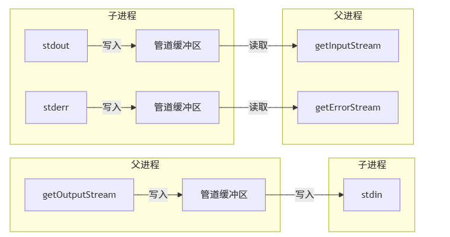


不同时处理 `stdout/stderr` 可能导致死锁：
- System.out/err调用时创建`BufferedOutputStream`，`BufferedOutputStream`缓冲区满时（大小默认8KB）自动调用flush()将数据写入管道，若写入数据>管道缓冲区剩余空间，阻塞该线程直到清空管道缓冲区并唤醒该线程
- 死锁场景：`stderr`管道缓冲区满阻塞写线程->父进程`waitFor()`等待子进程结束，但是父进程仅消费`stdout`->子进程触发阻塞写的线程和主进程等待线程发生死锁
- 解决方案：父进程使用多线程同时处理`stdout/stderr` ，或者子进程将`stderr`合并到`stdout`
- 父进程使用多线程同时处理`stdout/stderr` 示例代码：
```JAVA
Process process = new ProcessBuilder("cmd", "/c", "dir & echo Done").start();

// 标准输出读取线程 (stdout)
Thread stdoutReader = new Thread(() -> {
    try (Scanner scanner = new Scanner(process.getInputStream())) {
        while (scanner.hasNextLine()) {
            System.out.println("[STDOUT] " + scanner.nextLine());
        }
    }
});
stdoutReader.start();

// 标准错误读取线程 (stderr) 
Thread stderrReader = new Thread(() -> {
    try (Scanner scanner = new Scanner(process.getErrorStream())) {
        while (scanner.hasNextLine()) {
            System.err.println("[STDERR] " + scanner.nextLine());
        }
    }
});
stderrReader.start();

process.waitFor();
stdoutReader.join();
stderrReader.join(); 
```


### **ProcessBuilder**

ProcessBuilder是Java中用于精细化配置和启动操作系统进程的构建器类，它提供了比`Runtime.exec()`更安全、更灵活的方式来创建和管理外部进程。
1. **精确配方**：明确告诉系统"做什么"（命令）和"加什么料"（参数），避免Runtime.exec那种"把所有食材混在一起让系统猜"的问题
2. **环境布置**：可以精心布置工作环境（目录、环境变量），让进程在舒适的环境中工作
3.  **输入输出管道设计**：灵活设计进程与外界沟通的方式（重定向到文件、继承父进程、或者通过管道交互）
4.  **安全质检**：内置安全检查，防止"有毒原料"（命令注入）进入系统

**1. 基本命令执行**
```java
// 明确分隔命令和参数，避免空格解析问题
ProcessBuilder pb = new ProcessBuilder("git", "commit", "-m", "My commit message");
Process process = pb.start();
int exitCode = process.waitFor();
```

**2. 完整的环境配置**
```java
ProcessBuilder pb = new ProcessBuilder("java", "-jar", "myapp.jar");

// 设置工作目录
pb.directory(new File("/path/to/working/directory"));

// 配置环境变量
Map<String, String> env = pb.environment();
env.put("JAVA_HOME", "/usr/lib/jvm/java-11");
env.put("APP_HOME", "/opt/myapp");
env.remove("UNNEEDED_VAR"); // 移除不需要的环境变量

// 设置超时（Java 9+）
Process process = pb.start();
boolean finished = process.waitFor(30, TimeUnit.SECONDS);
if (!finished) {
    process.destroyForcibly();
}
```

**3. 流重定向配置**
```java
// 重定向到文件
ProcessBuilder pb = new ProcessBuilder("ls", "-la");
pb.redirectOutput(new File("output.txt"));
pb.redirectError(new File("error.txt"));
pb.start();

// 重定向到继承（使用父进程的流）
ProcessBuilder pb2 = new ProcessBuilder("interactive-command");
pb2.redirectInput(ProcessBuilder.Redirect.INHERIT);
pb2.redirectOutput(ProcessBuilder.Redirect.INHERIT);
pb2.redirectError(ProcessBuilder.Redirect.INHERIT);
pb2.start();

// 追加到文件
pb.redirectOutput(ProcessBuilder.Redirect.appendTo(new File("log.txt")));

// 丢弃输出（类似 /dev/null）
pb.redirectOutput(ProcessBuilder.Redirect.DISCARD);
```

**4. 错误流合并**
```java
// 将标准错误合并到标准输出
ProcessBuilder pb = new ProcessBuilder("command", "with", "args");
pb.redirectErrorStream(true); // 重要：现在只需要读取getInputStream()

Process process = pb.start();
try (BufferedReader reader = new BufferedReader(
        new InputStreamReader(process.getInputStream()))) {
    String line;
    while ((line = reader.readLine()) != null) {
        // 同时处理正常输出和错误输出
        System.out.println("Output: " + line);
    }
}

int exitCode = process.waitFor();
```


#### **命令管理**

命令列表由可执行程序路径 + 参数组成
- win/Linux要求：创建进程时必须绑定一个可执行文件 
- 创建进程打开命令行程序
  - 第一个参数：`"cmd"`或`"ls"`
  - 第二个参数：cmd控制开关或shell解释控制标志
  - 后续参数：命令行程序可接受的命令
- 可执行文件是Java文件时，创建进程将创建新的JVM实例

```java
private List<String> command; // 命令列表（）

public ProcessBuilder command(List<String> command) {
    this.command = command; // 直接引用（非拷贝）
    return this;
}

public ProcessBuilder command(String... commands) {
    this.command = Arrays.asList(commands);
    return this;
}
```

---

#### **环境变量**


**懒加载**：首次访问时初始化，从操作系统获取系统环境
```java
private Map<String, String> environment; // 环境变量映射

public Map<String, String> environment() {
    if (environment == null) {
        environment = new HashMap<>(System.getenv());
    }
    return environment;
}
```
---

#### **工作目录**

默认情况下不会调用`directory(File directory)`设置工作目录，保持`directory`的值为`null`。`ProcessBuilder`对象创建子进程时传递`directory`的值
- 若`directory`为null，则操作系统创建子进程时继承父进程的当前工作目录；否则将子进程工作目录设置为`directory`的值

```java
private File directory; // 工作目录

public ProcessBuilder directory(File directory) {
    this.directory = directory;
    return this;
}
```


#### **流重定向**

字段`redirects`数组
- redirects[0]：控制stdin
- redirects[1]：控制stdout
- redirects[2]：控制stderr
- 默认初始化为`[Redirect.PIPE, Redirect.PIPE, Redirect.PIPE]`
- 定义静态常量`Redirect.DISCARD`：只能用于stdout或stderr，要求子进程直接丢弃不写入
```java
private Redirect[] redirects;

public static abstract class Redirect {
        public enum Type {
            PIPE,//管道
            INHERIT,//继承父进程
            READ,//读文件
            WRITE,//覆盖写文件
            APPEND//追加到文件末尾
        };
}
private Redirect[] redirects() {
    if (redirects == null)
        redirects = new Redirect[] {
            Redirect.PIPE, Redirect.PIPE, Redirect.PIPE
        };
    return redirects;
}

public ProcessBuilder redirectInput(Redirect source) {
    // 类型校验：必须是READ或PIPE
    if (source.type() != Redirect.Type.READ && 
        source.type() != Redirect.Type.PIPE) {
        throw new IllegalArgumentException();
    }
    redirects[0] = source;
    return this;
}


```
通过`redirectInput、redirectOutput、redirectError`定向到管道或者文件

```JAVA
ProcessBuilder pb = new ProcessBuilder("server")
    .redirectInput(Redirect.from(new File("commands.txt")))
    .redirectOutput(Redirect.appendTo(logFile))
    .redirectError(Redirect.DISCARD); // 丢弃错误
```

---

#### **启动进程**
通过`ProcessBuilder`对象的start()方法，根据`ProcessBuilder`对象持有的进程配置创建进程
1. 检验命令非空，否则抛出`IndexOutOfBoundsException()`
2. 安全检查权限
3. 转换环境变量
4. 获取工作目录
5. 调用不同操作系统的原生方法


Linux创建进程
- **fork()**：复制JVM父进程到子进程，包括共享代码段、数据段、堆栈  
- **execve()** ：Java方法创建进程时关联可执行文件，加载到内存，使用该可执行文件替换从父进程复制的进程映像  
- **pipe()**：创建匿名IPC管道向父进程返回两个文件描述符（读端/写端） 

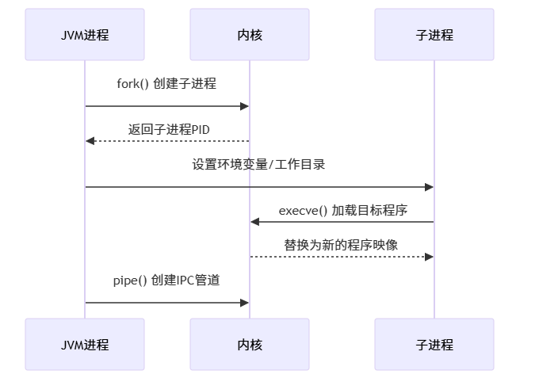


**安全启动模板代码**
```java
public static Process safeStart(List<String> command) throws IOException {
    ProcessBuilder pb = new ProcessBuilder()
        .command(command)
        .redirectErrorStream(true); // 防止死锁
    
    try {
        return pb.start();
    } catch (IOException e) {
        if (e.getMessage().contains("error=2")) {
            throw new FileNotFoundException("命令不存在: " + command.get(0));
        }
        throw e;
    }
}
```


创建Java进程时，新增JVM实例，即完全独立的运行时环境
- JVM 工具可能通过**Attach API**共享当前JVM实例，不会创建新JVM`new ProcessBuilder("jcmd", "1234", "GC.heap_info").start();`
- 若不需要应用完全隔离，可以通过自定义类加载器实现**单JVM多应用**


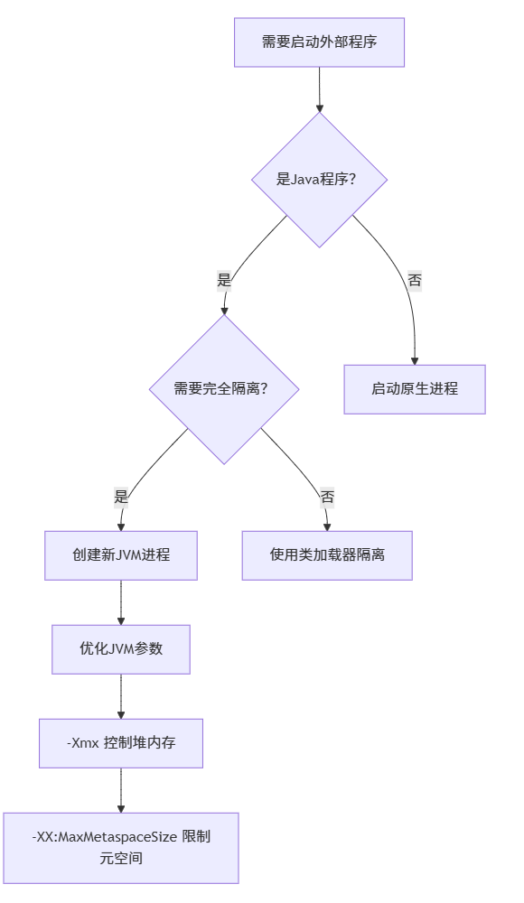

---

#### **输出流、错误流合并**

将错误流定向到输出流，避免死锁
```java
private boolean redirectErrorStream; // 是否合并错误流

public ProcessBuilder redirectErrorStream(boolean redirectErrorStream) {
    this.redirectErrorStream = redirectErrorStream;
    return this;
}

// start()方法内部处理
if (redirectErrorStream) {
    redirects[2] = redirects[1]; // stderr → stdout
}
```

**示例代码**
```java
// 日志合并输出
ProcessBuilder pb = new ProcessBuilder("docker", "compose", "up")
    .redirectErrorStream(true); // 合并stdout和stderr

try (BufferedReader reader = new BufferedReader(
        new InputStreamReader(pb.start().getInputStream()))) {
    reader.lines().forEach(logger::info);
}
```

---

#### **自定义代码管理进程生命周期**

**超时控制**示例代码
```java
public static int executeWithTimeout(ProcessBuilder pb, long timeout) 
    throws IOException, TimeoutException {
    
    Process p = pb.start();
    if (p.waitFor(timeout, TimeUnit.MILLISECONDS)) {
        return p.exitValue();
    } else {
        p.destroyForcibly().waitFor(); // 确保回收
        throw new TimeoutException("进程执行超时");
    }
}
```

**资源回收**示例代码
```java
// try-with-resources 扩展
public class ManagedProcess implements AutoCloseable {
    private final Process process;
    
    public ManagedProcess(ProcessBuilder pb) throws IOException {
        this.process = pb.start();
    }
    
    @Override
    public void close() {
        if (process.isAlive()) {
            process.destroyForcibly();
        }
        // 关闭所有流
        closeQuietly(process.getInputStream());
        closeQuietly(process.getErrorStream());
        closeQuietly(process.getOutputStream());
    }
}

// 使用
try (ManagedProcess mp = new ManagedProcess(pb)) {
    // 使用进程
}
```

---


### **ProcessHandle**接口

`ProcessHandle`接口封装进程树操作，通过操作系统原生 API 间接实现内核级进程管理功能

接口提供静态方法通过进程ID获取进程句柄
```JAVA
static Optional<ProcessHandle> of(long pid) {
        return ProcessHandleImpl.get(pid);
    }
```

#### **查询进程信息**

info()方法在调用瞬间捕获进程元数据，返回`ProcessHandle.Info`内部类对象

**`ProcessHandle.Info`** 内部类是对操作系统进程元数据的**标准化抽象**，其核心职责是提供**跨平台的进程静态信息查询**，只读属性。


| **职责**               | **关键方法**                     | **操作系统支持差异**          | **生产价值**                  |  
|------------------------|----------------------------------|-----------------------------|------------------------------|  
| **可执行文件定位**      | `Optional<String> command()`     | Windows：完整路径<br>Linux：`/proc/[pid]/exe` 符号链接 | 验证进程来源合法性            |  
| **启动参数审计**        | `Optional<String[]> arguments()` | Windows：仅初始参数<br>Linux：`/proc/[pid]/cmdline` | 安全审查/行为分析             |  
| **生命周期溯源**        | `Optional<Instant> startInstant()` | Linux：启动时钟滴答数<br>Windows：创建时间戳         | 故障时间轴重建                |  
| **CPU资源核算**         | `Optional<Duration> totalCpuDuration()` | Linux：`utime + stime`<br>Windows：`KernelTime + UserTime` | 资源计费/异常进程识别          |  
| **运行身份标识**        | `Optional<String> user()`        | Linux：`/proc/[pid]/status`<br>Windows：`GetTokenInformation()` | 权限合规检查                  |  


```java

Info info();

public interface Info {
    Optional<String> command(); // 可执行文件路径
    Optional<String[]> arguments(); // 命令行参数
    Optional<Instant> startInstant(); // 启动时间
    Optional<Duration> totalCpuDuration(); // CPU总耗时
    Optional<String> user(); // 所有者
}
```


---

#### **管理进程关系**

`static ProcessHandle current()`：返回当前进程的ProcessHandle对象
- 该ProcessHandle不能用于销毁当前进程，


`Stream<ProcessHandle> children()`：直接子进程管理​
- 基于调用时刻的进程树状态，返回当前进程的直接子进程​（仅下一级）

`Stream<ProcessHandle> descendants()`：遍历以该进程为根节点的进程树​

- 递归获取所有后代进程（子进程+孙进程+...）
- ​拓扑排序​：按进程创建顺序返回（广度优先，拓扑排序防止循环）

`Optional<ProcessHandle> parent()`：父进程
- 获取创建当前进程的父进程
- ​孤儿处理​：父进程终止时返回 init 进程 (PID=1)
- ​权限边界​：可能因权限不足返回空
static Stream<ProcessHandle> allProcesses() {
    return ProcessHandleImpl.children(0);
}

`static Stream<ProcessHandle> allProcesses()`：返回系统中所有存活的进程
- ​权限过滤​：自动跳过无权访问的进程
- ​实时视图​：基于调用时刻的系统快照


---

#### **控制进程生命周期**

对比`ProcessBuilder`，额外提供`CompletableFuture<ProcessHandle> onExit()`在进程结束时异步触发操作
```java
boolean destroy(); // SIGTERM
boolean destroyForcibly(); // SIGKILL

default CompletableFuture<ProcessHandle> onExit() {
    CompletableFuture<ProcessHandle> future = new CompletableFuture<>();
    new Thread(() -> {
        while (isAlive()) Thread.sleep(100);
        future.complete(this);
    }).start();
    return future;
}
```


`boolean supportsNormalTermination();`判断当前平台是否支持优雅终止进程​（发送终止请求而非强制杀死）

---

#### **监控进程状态**

---


## 线程基础


### 线程模型
线程是**操作系统调度的最小执行单元**
- 共享进程的资源（内存、文件描述符等）
- 拥有独立的线程ID (TID)、寄存器状态、栈空间、调度优先级、信号掩码

| **机制**             | **功能**                                                                 | **实现代表**                     |
|----------------------|-------------------------------------------------------------------------|--------------------------------|
| **线程控制块(TCB)**   | 存储线程状态（运行/就绪/阻塞）、寄存器值、栈指针等                         | Linux: `task_struct`          |
| **调度器**           | 基于时间片轮转/优先级调度线程                                            | CFS (Linux完全公平调度器)       |
| **同步原语**         | 提供互斥锁、信号量、条件变量等同步工具                                    | futex (Linux快速用户态互斥锁)   |
| **线程本地存储(TLS)**| 为每个线程提供私有数据区                                                  | FS/GS寄存器 (x86架构)          |
| **信号处理**         | 线程可独立设置信号处理函数                                                | `pthread_sigmask()`            |


线程状态：
  - **RUNNABLE**包含两个子状态：
     - `ready`：等待线程调度器分配 CPU 时间
     - `running`：正在使用CPU执行线程代码，CPU 时间片用完或调用 `yield()`进入`ready`状态
  - **BLOCKED**：线程等待进入同步块/方法（等待获取锁），获得锁后回到 RUNNABLE 状态
  - **WAITING**：线程调用wait()、join()方法开始等待，直到被其他线程调用`notify()`/`notifyAll()` 唤醒或目标线程结束时回到 RUNNABLE
  - **TIMED_WAITING**：线程调用`Thread.sleep(long)`、`Object.wait(long)`、`Thread.join(long)`等待指定时间，超时结束或被唤醒后回到 RUNNABLE
  - **TERMINATED (终止状态)**：线程执行完成`run()`方法正常退出，或因未捕获异常而终止


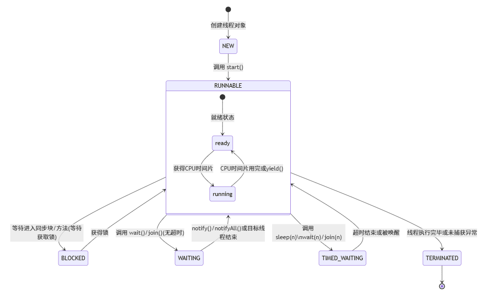


**Java线程与内核线程**

Java线程支持两种映射内核线程的方式
1. HotSpot JVM 线程模型$1:1$将每个Java线程直接映射到OS内核线程，适用于计算密集型任务
2. 虚拟线程$M:N$映射到内核线程，适用I/O密集型微服务


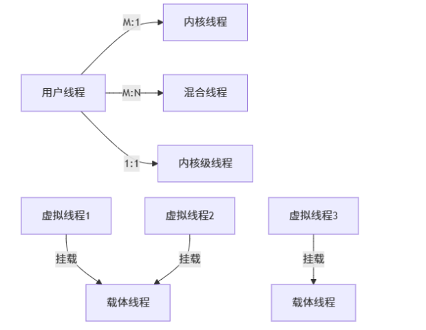

| **模型**         | **优势**                      | **劣势**                      | 
|------------------|------------------------------|------------------------------|
| **1:1 (内核级)** | 真正并行、内核全功能支持        | 资源消耗大、上下文切换成本高                | 
| **M:1 (用户级)** | 切换快、不依赖OS               | 无法利用多核、阻塞影响所有线程 | 
| **M:N (混合)**   | 灵活、平衡                      | 调试复杂、需要同步原语适配             | 


### **创建线程**

1. 通过**继承Thread**或者**实现Runnable接口**覆写run()方法创建线程
   - start方法触发OS线程创建，将Java线程映射到操作系统线程
   - 在线程中直接调用run方法是合法的，但是将在本线程中调用run方法，不会触发多线程
```JAVA

Thread t = new Thread() {
    public void run() {
        System.out.println("thread run...");
        System.out.println("thread end.");
    }
};
t.start();

new Thread(() -> {
    System.out.println("start new thread!");
}).start();
```

2. 通过**Callable、FutureTask**异步获取线程返回值，允许线程向上抛出异常
   - `Thread`的`run()`方法不会返回值，也不允许抛出异常
```java
FutureTask<Integer> future = new FutureTask<>(()->{return 1+1;});
new Thread(future).start();
System.out.println(future.get()); // 阻塞获取结果
```

---
### **控制线程**
1. **`sleep()`**：令当前线程进入**定时等待状态**（TIMED_WAITING）
   - **不会释放任何持有的锁**，也不会对任何对象加锁
   - 可被中断，进入RUNNABLE状态并抛出`InterruptedException`，使用`sleep()`时应始终捕获 `InterruptedException`
   - **避免在持有锁时长期 sleep**：可能导致死锁或系统卡顿
   - 实际休眠时间 >= 指定时间，精度依赖操作系统调度器。使用`ScheduledExecutorService`实现更精准的定时

```java

public static void sleep(long millis) throws InterruptedException
public static void sleep(long millis, int nanos) throws InterruptedException

```


2. **`static void yield()`** 让出CPU给同等优先级或更高优先级的线程

- `yield()`方法仍处于`Runnable`状态，占用CPU时间片且不会释放锁，等待调度器的指示
- Java 的线程调度本质上是抢占式，更倾向于让更高优先级的线程先运行，如果操作系统很好的支持该方法，则主要影响**相同优先级**的线程。
- `yield()`表现依赖于操作系统支持，**不能依赖 `yield()` 来实现程序逻辑的正确性**
- 适用场景**极其有限且不推荐**：在计算密集型任务中，线程完成了一个重要但非关键的工作单元后，主动让出 CPU，尝试提高系统的整体响应性或公平性。
  - 现代 Java 并发编程中**强烈不推荐**依赖 `yield()` 来控制程序流程或保证公平性。过度依赖线程优先级本身已被认为是不良实践.不必要的 `yield()` 调用会增加线程上下文切换的开销，反而降低性能。


3. **`join()`**：常用于**主线程收集子线程结果**
   - 基于`wait/notify`对 **Thread 实例本身**本身加锁，实现线程等待，不会释放其他用户锁，目标线程结束时由JVM调用`this.notifyAll()`唤醒该线程
   - 带超时参数防止永久阻塞
```java
Thread worker = new Thread(task);
worker.start();

worker.join(1000); // 主线程阻塞等待
System.out.println("任务完成或超时");
```
4. `wait()` `notify()` 是实现**线程间协作**的核心机制，定义在`Object`类中，是所有对象的基础方法。
   - `wait()` `notify()`必须在使用 `synchronized`获取的对象锁（`MonitorLock`监视锁）中调用
     - 未在同步块中调用抛出 `IllegalMonitorStateException`
   - `wait()`
     - **释放对象锁**，允许其他线程获取该锁，使当前线程进入等待状态（WAITING/TIMED_WAITING）
     - **唤醒条件**：
       - 其他线程调用相同对象的 `notify()`/`notifyAll()`
       - 等待超时（如果指定了 timeout）
       - 线程被中断（抛出 `InterruptedException`）
     - **虚假唤醒**：被唤醒不代表竞争对象锁成功，必须使用循环检查条件
       - 设置标志由生产者消费者共同维护，用于判断线程是否竞选锁成功
   - `notify()`
     - 随机唤醒**一个**在该对象上等待的线程，**不释放锁**，被唤醒线程需等待当前线程退出同步块
   - `notifyAll()`
     - 唤醒**所有**在该对象上等待的线程，并竞争获取锁
     - **优先使用 `notifyAll()`**，避免使用`notify()`导致
       - 唤醒错误类型的线程（如唤醒生产者而非消费者）
       - 某些线程永久饥饿
```java

public final void wait() throws InterruptedException 

public final void wait(long timeout) throws InterruptedException

public final void notify()

public final void notifyAll()
```

**示例代码**
```java
class SharedResource {
    private boolean dataReady = false;
    
    // 生产者
    public synchronized void produce() {
        while (dataReady) {
            wait();
        }
        dataReady = true;
        notifyAll();
    }

    // 消费者
    public synchronized void consume() {
        while (!dataReady) {
            wait();
        }
        dataReady = false;
        notifyAll();
    }
}
```

5. **`interrupt()`**：
   - 若目标线程处于运行中，则仅确保目标线程的中断标志位`interrupted`值为`true`
     - **吞没中断**：目标线程在运行时被中断，因没有中断标志检查代码忽略了中断，并继续执行
   - 若目标线程处于`WAITING`或`TIMED_WAITING`状态，进入`RUNNNABLE`状态，在等待方法处抛出**InterruptedException**，并且将中断标志位interrupted复位到`false`
     - 复位原因：JVM认为处于`RUNNNABLE`与`interrupted`的值为`true`矛盾
   - `interrupted`的值为`true`时执行阻塞方法，将**立即抛出 InterruptedException**​并将中断标志位interrupted复位到`true`，确保后续的代码（如`cleanup()`）也能知道线程被中断过
   - 可响应中断方法的最佳实践
     - 以`isInterrupted()`为循环退出条件
     - 捕获等待方法的异常，并在catch块恢复中断标志，确保不会再次处于等待状态


```JAVA
Thread worker = new Thread(() -> {
    while (!Thread.currentThread().isInterrupted()) {
        try {
            TimeUnit.SECONDS.sleep(1);
            doWork();
        } catch (InterruptedException e) {
            Thread.currentThread().interrupt(); //处于运行状态，仅确保目标线程的中断标志位`interrupted`值为`true`
            break;
        }
    }
    cleanup();
});

worker.start();

// 外部线程触发中断
worker.interrupt(); 
```

### Cpu缓存一致性与指令重排序

**CPU Cache缓存**内存数据，解决CPU处理速度和内存读写速度不匹配的问题。
- 从主内存复制数据到Cpu缓存，Cpu执行结束后写回主内存，并发编程环境下会出现内存缓存不一致问题。不同操作系统为解决内存缓存不一致性问题制定不同的内存模型。


**指令重排序**：**保证串行语义一致，但是不保证多线程语义一致**
-  **编译器优化重排**：编译器在不改变单线程程序语义的前提下重排语句
   -  解决方案：禁止编译器采用特定类型的重排序方式
-  **指令并行重排**：处理器对无数据依赖的指令并行执行
   - 解决方案：插入内存屏障指令
-  **内存系统重排**：由写缓冲区导致的内存操作乱序

### Java内存模型与线程安全性

Java内存模型JMM
- 屏蔽不同操作系统内存模型差异
- 提供线程和主内存的抽象模型
- 规范编译器/处理器优化原则

Java内存结构描述进程在主内存中的数据分布，不涉及寄存器和Cpu缓存区，与JMM是不同层次的抽象概念

**主内存**：
- **Java内存结构中，所有可存放共享对象区域的逻辑整合**
  - Java堆中的**对象实例字段**、**对象的MarkWord头**、数组、字符串常量
  - 方法区中的静态变量、`Class<T>`类元信息、运行时常量池中的类文件常量池的运行时表示
- 主内存不包括线程私有区：线程私有区天然线程隔离，包括服务于Java方法的Java虚拟机栈和本地方法栈
- 


**本地内存**：每个线程私有
  - 存储该线程从主内存复制的**共享变量副本**
  - 每个线程只能操作自己本地内存中的**共享变量**，无法直接访问其他线程的本地内存，也无法直接读写主内存
  - 线程间通信必须通过主内存进行
  - 本地内存是JMM 对Cpu缓存、写缓冲区、寄存器的抽象


**线程安全性**
- 可见性​：线程修改立即对其他线程可见
- ​原子性​：不可被线程切换打断的一组操作
- ​有序性问题​：编译器/处理器指令重排序后符合代码顺序


**happens-before原则**
- 开发者基于**happens-before原则**编写的并发代码的可见性强于synchronized/锁
  - 开发者追求易于理解和编程的强内存模型
  - 编译器和处理器追求弱内存模型，尽可能少的约束条件允许它们最大程度优化性能。
- **happens-before 原则的设计思想**
  - 在确保单线程程序和正确设计的多线程程序，指令重排序后的执行结果不变的前提下，尽量减少对编译器和处理器的约束
  - JMM 要求编译器和处理器必须禁止会改变程序执行结果的重排序
- **happens-before原则定义**
  - 如果一个操作 happens-before 另一个操作，那么第一个操作的执行结果将对第二个操作可见，无论这两个操作是否在同一个线程里。
  - 并且第一个操作的执行顺序排在第二个操作之前。
- **happens-before原则**的8个原则
  1. **程序顺序规则**；同一线程中的每个操作 happens-before 该线程中后续的所有操作
  2. **volatile变量规则**：volatile 写操作 happens-before 后续任意线程对同一 volatile 的读操作
  3. **线程中断规则**：`interrupt()` 调用 happens-before 中断被检测到（通过 `isInterrupted()` 或 `InterruptedException`）
  4. **监视器锁规则**：解锁操作 happens-before 后续对**同一锁**的加锁操作
  5. **线程终止规则**：线程的所有操作 happens-before 其他线程检测到该线程终止（如 `join()` 返回）
  6. **线程启动规则**：`thread.start()` 调用 happens-before 该线程的任意操作
  7. **对象终结规则**：对象构造函数结束 happens-before 其 `finalize()` 方法的开始
  8. **传递性规则**：若 A happens-before B 且 B happens-before C，则 A happens-before C


JMM根据**happens-before原则**定义主内存与工作内存的同步操作
- **lock（锁定）**: 标记主内存共享变量为一个线程的独享变量，该线程可以重复执行lock操作
  - **清空当前工作内存中当前锁关联的共享变量副本**，在后续访问这些共享变量时，线程必须从主内存中重新加载（即执行read和load操作）最新的值。
  - 每个对象持有一个**监视器锁**monitor lock，同一时刻只有一个线程能持有该锁
- **unlock（解锁）**: 解除主内存共享变量的锁定状态，可能需要多次执行unlock操作才能解除锁定状态，被解除锁定状态的变量才能被其他线程锁定。
- **read（读取）**：主内存$\rightarrow$工作内存
- **load(载入)**：read结果值$\rightarrow$变量副本
- **use(使用)**：变量副本$\rightarrow$执行引擎，每次取变量值时执行
- **assign（赋值）**：执行引擎结果值$\rightarrow$变量副，每次给变量赋值时执行
- **store（存储）**：工作内存$\rightarrow$主内存
- **write（写入）**：store结果值$\rightarrow$主内存

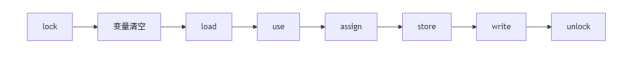
**脏读**
- 执行写操作由assign、store、write组成，如果不对共享变量执行同步操作，那么无法确保由三个同步操作组成的写操作是原子的；导致
  - 是否写回主内存（例如执行store/write前线程中断）、写回主内存时机不确定
  - 写回主内存后是否对其他线程可见以及什么时候可见也不确定

**访问`volatile`变量**
- **写可见**：修改后强制刷新到主内存；
  - 等价同步操作序列：`assign、store、write`
  - 重排序规则：**在写操作前后插入StoreStore屏障**
    - **所有前面的读写操作必须完成**，结果对后续操作可见
    - **后面的读写操作不能重排序到写之前**，写操作结果立即可见于其他线程的 volatile 读
- **读最新**：强制从主内存加载
  - 等价同步操作序列：`read、load、use`
  - 重排序规则：**在读操作后插入LoadLoad、LoadStore屏障**
    - **后面的读写操作不能重排序到读之前**，
- 因此`volatile`保证了可见性和有序性，同理`final`天然保证可见性
- **`volatile`变量仅保证单次 read-load-use 或 assign-store-write 序列的原子性**，不保证复合操作的原子性
- **但是`volatile`变量严格保证有序性**

**`synchronized`**
- 进入同步块
  - lock：锁定主内存变量，清空当前工作内存中**当前锁关联的共享变量副本**
  - 同步块中每次访问变量时，执行load、use从主内存取得最新值
- 退出同步块前原子性地批量执行以下组合操作：
  - store、write：将同步块更改的值刷新到主内存，更新主内存
  - unlock：释放主内存变量
- `synchronized`保证了**原子性、有序性、可见性**，但是`synchronized`同步块内部不保证有序性
- 在同步块退出时线程修改的值写回主内存，由lock操作确保其他线程无法获取该对象锁，所以**间接保证可见性**
- `synchronized`内部抛出未处理的异常前，自动释放锁

`volatile`仅确保单次原子操作的同步性
- 原子操作
  - 对基本数据类型的简单读写
  - 对引用类型的赋值操作
- 复合操作：任意两个以上原子操作的组合，仅保证其有序性，不保证原子性
  - 例如在双重检查锁定的错误代码中，`synchronized`块内部不保证有序性，需要通过`volatile`保证有序性，而`synchronized`又保证了`volatile`变量的同步性

**`synchronized`**块内部不保证有序性，以下是**双重检查锁定的错误代码**
- `instance = new Singleton();`实际上可以分为三个步骤
   1. `memory = allocate()`分配对象的内存空间（分配内存）
   2. `ctorInstanc(memory)初始化对象`（调用构造函数）
   3. `instance = memory`将instance引用指向分配的内存地址（赋值）
- 线程A和线程B先后调用getInstance()方法
  - 对单线程环境，交换2和3是单线程正确的，只要确保instance在使用前，初始化已经结束就行
  - JVM认为初始化对象是开销很大的工作，因此对步骤2、3进行指令重排序，内存块结束将instance引用写回主内存，在初始化对象结束前，线程B调用getInstance()方法，并获取到未分配内存的对象，时间线如下所示

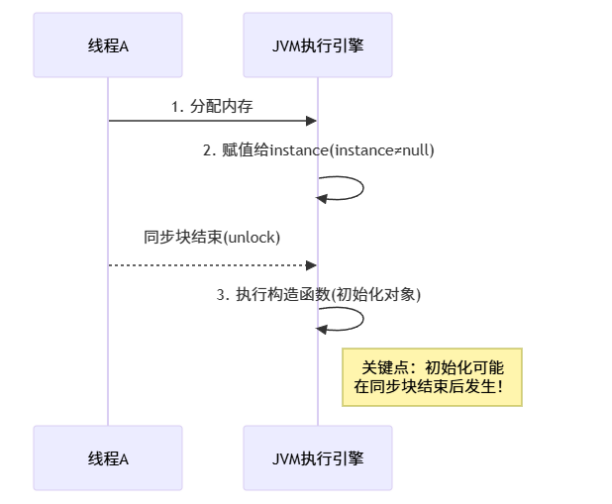

| 时间点 | 线程A (创建实例) | 线程B (获取实例) | 关键说明 |
|--------|------------------|------------------|----------|
| t1 | 分配内存 | - | 正常步骤1 |
| t2 | **设置instance引用** (instance ≠ null) | - | **危险步骤**：对象未初始化 |
| t3 | - | 检查instance ≠ null → 返回 | **问题开始**：B看到非null引用 |
| t4 | - | **使用未初始化对象** | 错误发生：构造函数未执行 |
| t5 | **执行构造函数初始化** | - | 初始化发生在B使用之后 |

- 使用volatile，插入storestore屏障，禁止重排序初始化对象操作

- 错误代码
```java

//没有保证可见性的错误代码
private static Singleton instance;
public static Singleton getInstance() {
    if (instance == null) {
        instance = new Singleton();
    }
    return instance;
}


//错误的优化代码
private static Singleton instance;
public static Singleton getInstance() {
    if (instance == null) {
        synchronized (Singleton.class) {
            if (instance == null) {
                instance = new Singleton();
            }
        }
    }
    return instance;
}
```
- 正确代码：**使用volatile保证`synchronized`内部的有序性**
```JAVA
private volatile static Singleton instance;

public static Singleton getInstance() {
    if (instance == null) {
        synchronized (Singleton.class) {
            if (instance == null) {
                instance = new Singleton();
            }
        }
    }
    return instance;
}
```


---


## 锁

锁是多线程编程中的一种同步机制，用于控制对共享资源的访问

### JVM对synchronized的优化

synchronized的三个**特性**
- **互斥性**：同一时间，只有一个线程可以获得锁，获得锁的线程才能执行被synchronized保护的代码片段。
- **阻塞性**：未获得锁的线程只能阻塞，等待锁释放
- **可重入性**：如果一个线程已经获得锁，在锁未释放前，再次请求锁的时候，是必然可以获取到的。

synchronized可保护的代码片段
- 修饰**普通方法**：锁的是**当前实例**
- 修饰**静态方法**：锁的是**当前类的Class对象**
- 修饰**代码块**：要求**指定被锁对象**

JVM对synchronized的优化包括：**锁消除、锁粗化**，**实现偏向锁、轻量级锁实现锁升级**


**synchronized代码分析**：
- 主线程确保email线程比sms线程先获取锁，先分析sendEmail()、sendSMS()在不同设置下，线程的执行结果

| 场景描述                             | 手机数量 | sendEmail 方法类型        | sendSMS 方法类型         | 打印顺序  | 关键锁机制说明                     |
|--------------------------------------|----------|---------------------------|--------------------------|-----------|------------------------------------|
| 基础同步方法                         | 1        | 同步非静态                | 同步非静态               | 邮件→短信 | **同一对象锁**，邮件先获取锁       |
| sendEmail()休眠3秒                   | 1        | 同步非静态                | 同步非静态               | 邮件→短信 | **同一对象锁**，短信需等待邮件释放 |
| 添加普通hello方法                    | 1        | 同步非静态                | 普通方法(非同步)         | hello→邮件| **无锁竞争**，hello无需等待        |
| 两部手机分别操作                     | 2        | 同步非静态                | 同步非静态               | 短信→邮件 | **不同对象锁**，无资源争抢         |
| 静态同步方法(单手机)                 | 1        | **静态**同步             | **静态**同步            | 邮件→短信 | **同一类锁**，邮件先获取类锁       |
| 静态同步方法(双手机)                 | 2        | **静态**同步             | **静态**同步            | 邮件→短信 | **同一类锁**，类锁全局唯一         |
| 混合锁类型(单手机)                   | 1        | **静态**同步             | 同步非静态               | 短信→邮件 | **类锁≠对象锁**，短信无需等待      |
| 混合锁类型(双手机)                   | 2        | **静态**同步             | 同步非静态               | 短信→邮件 | **类锁≠对象锁**，无竞争关系        |

```JAVA

public class Phone {
    
    ​     //同步方法、可静态
    public synchronized void sendEmail() {
            try {
                TimeUnit.SECONDS.sleep(3);
            } catch (InterruptedException e) {
                e.printStackTrace();
            }
            System.out.println("------sendEmail");
            }
            ​     //同步方法、可静态
    public synchronized void sendSMS() {
            System.out.println("------sendSMS");
        }
        ​
    //普通方法
    public void hello() {
        System.out.println("------hello");
    }
    ​
    public static void main(String[] args) {
        Phone phone = new Phone();
        new Thread(() -> {
        phone.sendEmail();
        }, "a").start();
    ​
        try {
        TimeUnit.MILLISECONDS.sleep(200);
        } catch (InterruptedException e) {
        e.printStackTrace();
        }
    ​
        new Thread(() -> {
        phone.sendSMS();
        }, "b").start();
    }
}
```

#### **锁消除**

**锁消除**：**在没有操作共享数据的位置加锁**，JVM直接优化掉该锁；
- 逃逸分析：对象属于局部变量，且不会从方法中逃逸
```JAVA
//优化前
public void doSomething(){
     Object o=new Object();
     synchronized (o){
        System.out.println(o);
    }
}

//优化后
public void doSomething(){
     Object o=new Object();
     System.out.println(o);
}
```


#### **锁粗化**

**锁粗化**：**如果检测到同一个对象执行了连续的加锁和解锁的操作，则会将这一系列操作合并成一个更大的锁，避免频繁的竞争和释放锁资源**

降低锁粒度（同步代码块范围）不一定能降低性能损耗。如果线程切换和竞争锁带来的性能损耗大于降低锁粒度时同步操作减少带来的性能提升，反而会导致性能下降。


```JAVA

//优化前
public void doSomething(){
    for (int i = 0; i < 1000; i++) {
        synchronized (this){
            System.out.println("do something");
        }
    }
}

//优化后
public void doSomething(){
    synchronized (this) {
        for (int i = 0; i < 1000; i++) {
            System.out.println("do something");
        }
    }
}

```


#### **锁升级**

在JDK1.6之后，synchronized可以处于无锁、偏向锁、轻量级锁和重量级锁四种不同的状态

**不同锁状态的MarkWord空间结构**
- 
- MarkWord存储`System.identityHashCode()`调用计算的**身份哈希**`​identity_hashcode​`
- **偏向锁和重量级锁无法存储身份哈希，只能由无锁对象或者重量级锁对象存储**
- 区分重写后的`hashCode()`方法，每次调用即时计算
```java
//必须返回不可变的身份哈希码（JLS规范要求）
//需要在对象头中永久存储该值（首次调用时生成）
public static native int identityHashCode(Object x);

```


**无锁状态**
- 没有线程访问共享变量时处于无锁状态
- 若共享对象未调用过`System.identityHashCode()`，其MarkWord存储**身份哈希**的空间未初始化

**偏向锁**
- 若无锁状态的对象已经存储过身份哈希，那么只能升级为重量级锁
- 偏向锁对象存储线程A的ID，但线程A**可能早已退出**或仍在执行，线程B尝试竞争该锁时，需要暂停线程A，检查其状态：  
   - 若线程A**已退出同步块**，直接**将对象置为无锁状态**，线程B再尝试竞争。  
   - 若线程A**仍在同步块中**，则将锁**升级为轻量级锁**

**轻量级锁**
- 偏向锁升级为轻量级锁时的空间结构
  - 在偏向锁偏向的线程中创建一个栈帧，栈帧中创建**Lock Record锁记录**
    - 锁记录拷贝锁的MarkWord，其占用空间记为Displaced Mark Word
    - 由于栈帧是私有的，每个线程维护不同的锁记录
    - 竞争者的锁记录中，Displaced Mark Word位置为null
  - 轻量级锁维护一个指针，指向拥有轻量级锁的线程的锁记录所在栈帧
  - 竞争者通过CAS自旋尝试修改轻量级锁MarkWord中的指针
    - 如果修改成功，那么原线程已退出同步块并释放锁，该线程获取到锁
    - 自旋一定次数后准备升级为重量级锁
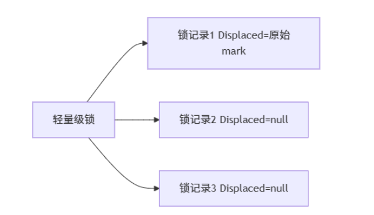

**JDK15+默认禁用偏向锁**
- JDK8使用`-XX:-UseBiasedLocking`参数禁用偏向锁
- 偏向锁适用于锁仅被单线程访问，现代应用中，竞争激烈的高并发环境会导致频繁暂停线程

**重量级锁**
- 同步块调用重量级操作`wait()`、`notify()`，或需要存储身份哈希时，进入重量级锁状态
   - 重量级操作：与`ObjectMonitor`关联的操作
- 维护一个等待队列记录所有需要获取锁的线程，锁对象的MarkWord记录指向该队列的指针
  - 当线程调用 wait() 时，进入对象的条件队列
  - 当条件可能满足时，通过 notify()/notifyAll() 唤醒等待线程


### Lock/ReentrantLock

定义锁的行为，具体性质由实现类决定

#### **Lock**/synchronized

**Lock**对synchronized的增强
1. 显式获取释放锁
2. 支持获取锁时被中断：线程尝试进入synchronized被阻塞时无法响应中断
3. 支持获取锁超时控制
4. 支持公平/非公平
5. 支持多个条件队列
   - synchronized所有唤醒条件下的等待线程集中于单条件队列；虚假唤醒：每次生产者调用notifyAll时，可能唤醒的是另一个生产者，不必要的线程切换导致性能下降
   - 创建Lock时**必须手动绑定条件队列Condition**，实现**不同条件隔离**，例如**生产者/消费者隔离**

**高竞争选择Lock，低竞争选择synchronized**
- synchronized内置监视器锁由C++实现，Lock基于Java代码实现

**Lock接口方法**
```JAVA
public interface Lock {
    // 获取锁，阻塞直到成功，不可中断，实现类必须确保锁的可重入性
    void lock();
    
    // 可中断获取锁
    void lockInterruptibly() throws InterruptedException;
    
    // 尝试非阻塞获取锁，实现必须保证线程安全
    boolean tryLock();
    
    // 带超时的尝试获取锁，可被中断
    boolean tryLock(long time, TimeUnit unit) throws InterruptedException;
    
    // 释放锁
    void unlock();
    
    //创建绑定到当前锁的 Condition 对象，一个锁可创建多个 Condition
    Condition newCondition();
}

```
**Lock与synchronized不同点**
- synchronized是Java内置特性，而ReentrantLock是通过Java代码实现的。
- synchronized可以自动获取/释放锁，而ReentrantLock需要手动获取/释放锁。
- synchronized的锁状态无法判断，而ReentrantLock可以用tryLock()方法判断。
- synchronized同过notify()和notifyAll()唤醒一个和全部线程，而ReentrantLock可以结合Condition选择性的唤醒线程。
- **Lock**具有响应中断、超时等待、tryLock()非阻塞尝试获取锁等特性。
- **ReentrantLock**可以实现公平锁和非公平锁，而synchronized只是非公平锁。


#### **公平锁/非公平锁**

synchronized使用非公平锁：多个线程不按照申请锁的顺序去获得锁，而是同时直接去尝试获取锁，获取不到，再进入队列等待

Lock默认非公平锁，支持公平锁：多个线程按申请顺序排队，必须等前一个线程释放锁后才能获取到锁
- 非公平锁对比公平锁，极大提高整体吞吐量
  - 缺点：线程饿死
- 公平锁确保所有的线程都能得到Cpu时间片
  - 缺点：想唤醒指定线程需要按申请顺序依次切换线程，不必要的入队/出队极大增加上下文切换成本，不符合现代cpu设计

#### **可重入锁**

可重入锁：已经拿到锁的线程可以多次获取同一把锁，而不会因为该锁已经被持有而陷入等待状态，避免死锁
- 需要记录获得锁的次数，与锁释放次数相等时才允许别的线程获取锁

synchronized可重入代码分析
- 不会发生死锁：线程0获取chopsticks锁开始执行getOne()，执行getAnother、canEat时可重入获取chopsticks锁；另一个线程1获取时间片时，如果线程0持有锁，则线程1阻塞等待线程0释放锁，直到被notify    

```JAVA

public class Chopsticks {
    private boolean getOne = false;
    private boolean getAnother = false;
    private volatile int count = 0;

    public synchronized void getOne() {
        getOne = true;
        if (getAnother) {
            canEat();
            getOne = false;
            getAnother = false;
        } else {
            getAnother();
        }
    }

    public synchronized void getAnother() {
        getAnother = true;
        if (getOne) {
            canEat();
            getOne = false;
            getAnother = false;
        } else {
            getOne();
        }
    }

    public synchronized void canEat() {
        count++;
        System.out.println(Thread.currentThread().getName() + "筷子被使用次数：" + count);
    }
}

class ChopsticksTest {
    public static void main(String[] args) {
        Chopsticks chopsticks=new Chopsticks();
        Thread A = new Thread(()->{
            while(true){
                chopsticks.getOne();
            }
        });
        Thread B = new Thread(()->{
            while(true){
                chopsticks.getOne();
            }
        });
        A.start();
        B.start();
    }
}

```

### Condition


`signal()`/`signalAll()`
- `signal()`要求所有等待线程必须是等价的，任何一个被唤醒的线程都能执行任务
- `signalAll()`唤醒所有等待线程，再次检查工作条件，符合要求的线程并发处理任务


| 方法 | 描述 | 对应传统方法 |
|------|------|-------------|
| `await()` | 释放锁并进入等待状态 | `wait()` |
| `awaitUninterruptibly()` | 等待状态中不响应中断 | 无直接对应 |
| `awaitNanos(long)` | 带纳秒超时的等待 | `wait(long)` |
| `await(long, TimeUnit)` | 带时间单位的超时等待 | `wait(long)` |
| `awaitUntil(Date)` | 等待到指定日期 | 无 |
| `signal()` | 随机唤醒一个等待线程 | `notify()` |
| `signalAll()` | 唤醒所有等待线程 | `notifyAll()` |


```java
Lock lock = new ReentrantLock();
Condition conditionA = lock.newCondition();
Condition conditionB = lock.newCondition();

lock.lock();
try {
    while (!conditionA) {
        conditionA.await(); // 只等待A条件的线程
    }
    // ...
} finally {
    lock.unlock();
}
```


### ReadWriteLock接口
**并发读 + 互斥写**
1. **读锁（共享锁）**：多个线程可同时持有
2. **写锁（独占锁）**：同一时间只有一个线程可持有，阻塞所有的读线程和其它写线程

```java
public interface ReadWriteLock {
    // 获取读锁
    Lock readLock();
    
    // 获取写锁
    Lock writeLock();
}
```


### ReentrantReadWriteLock读写锁

ReentrantReadWriteLock是ReadWriteLock接口的唯一实现，适合**读密集场景**

- 当读/写比例大于1000:1时，评估使用`StampedLock`
- `int getReadLock()`：返回当前读锁被获取的次数。
- `int getReadHoldCount()`：返回当前线程获取的次数。
- `boolean isWriteLocked()`：判断写锁是否被获取。
- `int getWriteHoldCount()`：返回当前写锁被获取的次数。
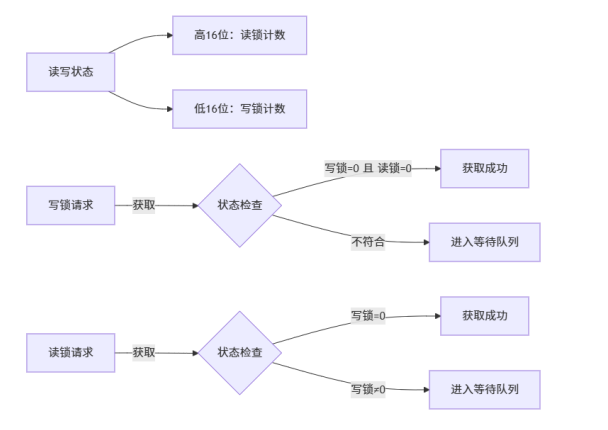


**重入性**：读线程在获取读锁之后，能够再次获取读锁。而写线程在获取了写锁之后能够再次获取写锁，同时也可以获取读锁

```JAVA
readLock.lock();
try {
    readLock.lock(); // 允许重入
    // ...
} finally {
    readLock.unlock();
    readLock.unlock(); // 必须平衡解锁
}
```


**公平性选择**：支持非公平和公平锁的获取。


```java
// 非公平锁（默认）
ReentrantReadWriteLock nonFairLock = new ReentrantReadWriteLock();

// 公平锁
ReentrantReadWriteLock fairLock = new ReentrantReadWriteLock(true);
```

**锁降级**：通过获取写锁、获取读锁再释放写锁的次序，将写锁降级为读锁

```java
writeLock.lock();
try {
    // 写操作...
    readLock.lock(); // 降级开始
} finally {
    writeLock.unlock(); // 降级完成，保持读锁
}
// 此时其他线程可读但不可写
```

**禁止锁升级**
```java
readLock.lock();
try {
    // 此时尝试获取写锁会导致死锁
    writeLock.lock(); // 危险操作！
} finally {
    readLock.unlock();
}
```

**避免持锁时执行耗时操作**, 快速修改状态，将修改对应的耗时操作放在锁外


**缓存空值减少写锁争用**
- 假设没有双重检查，每次缓存未命中都需要查询DB；
- 查询DB如果该数据不存在，就缓存空值，明确该key没有存储在数据库中，降低数据库压力，避免恶意攻击
```java


public Object get(Object key) {
   public static final Object NULL_OBJECT = new Object();
    readLock.lock();
    try {
        Object value = cache.get(key);
        if (value != null)
            return value;
    } finally {
        readLock.unlock();
    }
    
    writeLock.lock();
    try {
        // 双重检查锁定
        Object value = cache.get(key);
        if (value == null) {//缓存未命中
            value = loadFromDB(key);
            if (value == null)//数据库未查找到
                value = NULL_OBJECT; // 缓存空值，下次查找时明确该数据不存在
            cache.put(key, value);
        }
        return value;
    } finally {
        writeLock.unlock();
    }
}
```


### StampedLock


适合**读极其密集**的场景
- 每个锁操作返回一个 `long` 类型的戳记，戳记包含版本号和模式信息，验证戳记只需检查版本号是否匹配
- 乐观读：不阻塞写操作，无锁读取，仅最后验证，避免读锁的上下文切换开销
- **不可重入**：再次获取相同锁死锁
- **无条件变量**：不支持 `Condition` 接口，使用 `wait()`/`notify()` 或 `LockSupport`
- **避免长时间持有写锁**， 快速更新状态后，交付耗时操作在锁外完成

StampedLock：基于CLH锁，一种自旋锁，保证没有饥饿且FIFO。
- CLH锁维护着一个等待线程队列，所有申请锁且失败的线程都记录在队列里。一个节点代表一个线程，保存着一个标记为locked，用来判断当前线程是否已经释放锁
- 当一个线程试图获取锁时，从队列尾节点作为前序节点，循环判断所有的前序节点是否已经成功获取锁。

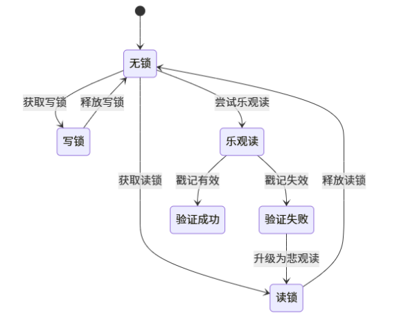

| **方法签名** | **返回值** | **功能描述** | **阻塞行为** | **典型应用场景** | **注意事项** |
|--------------|-----------|------------|------------|----------------|------------|
| **`long readLock()`** | 戳记(stamp) | 获取读锁 | 阻塞（若写锁被持有） | 需要强一致性的读操作 | 必须与`unlockRead()`配对使用 |
| **`long tryReadLock()`** | 戳记(成功)或0(失败) | 尝试非阻塞获取读锁 | 非阻塞 | 避免死锁的读操作 | 失败时应提供后备方案 |
| **`long writeLock()`** | 戳记(stamp) | 获取写锁 | 阻塞（若有读/写锁被持有） | 数据更新操作 | 必须与`unlockWrite()`配对使用 |
| **`void unlockRead(long stamp)`** | void | 释放读锁 | 非阻塞 | 读操作完成后释放资源 | 必须使用原始戳记，否则抛异常 |
| **`void unlockWrite(long stamp)`** | void | 释放写锁 | 非阻塞 | 写操作完成后释放资源 | 必须使用原始戳记，否则抛异常 |
| **`long tryConvertToReadLock(long stamp)`** | 新戳记(成功)或0(失败) | 尝试写锁转读锁 | 非阻塞 | 写后立即读的场景（锁降级） | 失败时需手动释放写锁 |
| **`boolean tryConvertToWriteLock(long stamp)`** | true(成功)/false(失败) | 尝试读锁转写锁 | 非阻塞 | 读后立即写的场景（锁升级） | 需检查当前是否唯一读锁持有者 |
| **`boolean tryUnlockRead()`** | true(成功)/false(失败) | 尝试释放读锁 | 非阻塞 | 快速清理无竞争读锁 | 仅当无其他读锁时成功 |
| **`long tryOptimisticRead()`** | 戳记(stamp) | 获取乐观读戳记 | 非阻塞 | 极高并发的只读场景 | 需后续调用`validate()`验证 |
| **`boolean validate(long stamp)`** | true(有效)/false(无效) | 验证乐观读有效性 | 非阻塞 | 乐观读后的数据校验 | 必须在数据使用前调用 |


**1. 写锁（独占锁）**
```java
long stamp = lock.writeLock();
try {
    // 独占写操作
} finally {
    lock.unlockWrite(stamp);
}
```

**2. 悲观读锁（共享锁）**
```java
long stamp = lock.readLock();
try {
    // 共享读操作
} finally {
    lock.unlockRead(stamp);
}
```

**3. 乐观读（无锁读）**
```java
long stamp = lock.tryOptimisticRead();
// 读取共享数据到局部变量
if (!lock.validate(stamp)) {
    // 戳记失效，升级为悲观读
    stamp = lock.readLock();
    try {
        // 重新读取数据
    } finally {
        lock.unlockRead(stamp);
    }
}
// 使用局部变量处理数据
```


### CAS-Compare And Swap

CAS-Compare And Swap，实现乐观锁和锁自旋
- CAS操作包含三个操作数——内存位置（V）、预期值（A）和新值（B）。在并发修改的时候，会先比较A和V的值是否相等，如果相等，则会把值替换成B，否则就不做任何操作。
- 乐观锁认为一般情况下不会造成冲突，所以在进行提交更新的时候，才会正式检测数据的冲突与否，如果冲突，则返回用户错误信息，让用户决定如何去做
- 当多个线程尝试使用CAS同时更新同一个变量时，只有其中一个线程能更新变量的值，而其它线程都失败，失败的线程不会被挂起，而是被告知这次竞争失败，并可以再次尝试。

**CAS在操作系统层面的原子性**
- CAS操作基于硬件提供的原子操作指令**cmpxchg指令**实现：
- 一个cpu执行cmpxchg指令时，自动锁定总线，防止其它cpu访问共享变量，然后执行比较和交换操作，最后释放总线。在执行期间禁止中断。
- **当一个cpu核心执行cmpxchg指令时，其它cpu核心的缓存会自动更新，以确保对共享变量的访问是一致的**。


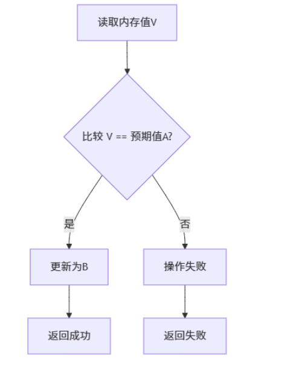

CAS 操作包含三个关键参数：
- **内存位置（V）**：需要更新的共享变量地址
- **预期原值（A）**：线程认为当前应该存在的值
- **新值（B）**：希望更新的目标值


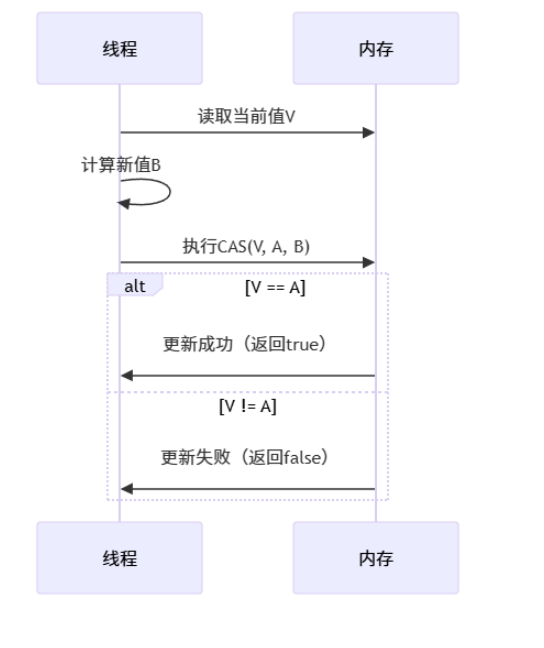

缺陷
| 缺陷 | 解决方案 |
|------|----------|
| **ABA问题** | 使用AtomicStampedReference |
| **循环时间长开销大** | 指数退避策略 |
| **只能保证单个变量原子性** | 合并变量或使用AtomicReference |
| **高竞争下性能下降** | 改用锁机制 |


解决方案：版本号机制
```java
AtomicStampedReference<String> ref = 
    new AtomicStampedReference<>("A", 0);

// 更新时检查版本
public boolean update(String expectedRef, String newRef, 
                      int expectedStamp, int newStamp) {
    return ref.compareAndSet(expectedRef, newRef, 
                           expectedStamp, newStamp);
}
```
**ABA问题**
- CAS算法实现一个重要前提是需要取出内存中某时刻的数据，而在下个时刻进行比较和交换，那么这个时间差会导致数据的变化。

比如，当线程1要修改A时，会先读取A的值，如果此时有一个线程2，经过一系列操作，将A修改为B，再由B修改为A，然后线程1在比较A时，发现A的值没有改变，于是就修改了。但此时A的版本已经不是最先读取的版本了，这就时ABA问题。

如何解决？解决这个问题的办法也很简单，就是添加版本号，修改数据时带上一个版本号，如果版本号我数据的版本号一致就修改（同时修改版本号），否则就失败。

**忙等待问题**
因为CAS基本都是要自旋的，这种情况，如果并发冲突比较大的话，就会导致CAS一致不断地重复执行，导致进入忙等待。

ps：忙等待是一种进程的执行状态，进程执行一段循环程序的时候，由于循环判断条件不能满足而导致处理器反复循环，处于繁忙状态，该进程虽然繁忙但无法前进。

所以，一旦CAS进入忙等待状态一直执行不成功的话，就会对CPU造成很大的性能开销。

如何解决？可以换用LongAdder类，它是Java 8中退出一个新的类，主要为了解决CAS在并发冲突比较激烈的情况下性能并不高的问题，它主要采用分段+CAS的方式来提升原子操作的性能，内部维护了一个cell[]数组和一个base变量，CAS失败的操作先存储到此数组中用于分散计数，最后返回的值为base+cell数组中的个数，但有最终值不准确的情况。先讲这么多，之后的篇章里会详解😁。

### AQS-AbstractQueuedSynchronizer

AbstractQueuedSynchronizer (AQS) 使用 **"统一框架解决同步问题"**，其核心思想包括：
- **状态即资源**：将**所有同步问题抽象为对共享状态的访问控制**，即`volatile int state` 状态变量，状态语义**完全由子类定义**
- **队列即调度**：通过**一个CLH 变体队列 + N个条件队列**实现职责分离，**解耦资源竞争与业务等待**
- **模板即扩展**：通过模板方法实现 **"一套框架，万种同步"**，支持各种同步语义，子类只需实现状态操作


#### 同步状态的原子性管理

持有`volatile int state`字段，表示同步资源的同步状态，具体语义由子类中持有的资源决定
- ReentrantLock：表示拥有锁的线程重复获取该锁的次数
- CountDownLatch：表示计数器的数值
- Semphore：表示剩余的许可数量
- FutureTask：表示任务的状态

| 锁类型 | 空闲判断 | 锁定状态设置 | 线程唤醒策略 |
|--------|----------|--------------|------------|
| 互斥锁 | state == 0 | state = 1 | 唤醒队列头节点 |
| 可重入锁 | state == 0 或拥有锁 | state++ | 唤醒队列头节点 |
| 读写锁 | 读锁：state低16位<br>写锁：state高16位 | 读：state+1<br>写：state+65536 | 读锁唤醒连续读节点 |
| 信号量 | permits > 0 | state-- | 唤醒所有等待线程 |

**访问器/更改器**
- `getState()`：获取当前同步状态
  - `int`读取是原子性操作
  - `volatile` 确保读取到的是主内存中最新的值
- `setState()`：设置当前同步状态
  - 不能用于在并发条件下基于当前状态进行更新
- `compareAndSetState(int expect,int update)`：使用CAS设置当前状态
- `getState()+compareAndSetState(int expect,int update)`实现乐观锁，确保“判断当前状态”和“执行状态更新”是原子性的。

**子类需要实现的状态操作**

#### AQS内部结构

AQS维护一个由`Node`类节点组成的`ConditionObject`类单向链表
- AQS持有`transient volatile Node`修饰的`head tail`指针


##### Node内部类

核心字段
- waitStatus区分队列类型：CONDITION表示在条件队列，SIGNAL表示在同步队列
- 指针：同步队列用 prev/next（双向链表），条件队列用 nextWaiter（单向链表）
- 节点可以在条件队列和同步队列之间转移


```JAVA
static final class Node {
    volatile int waitStatus;         // 节点状态
    volatile Node prev;              // 同步队列前驱
    volatile Node next;              // 同步队列后继
    volatile Thread thread;          // 绑定线程
    Node nextWaiter;                 // 条件队列后继（单向链表）
    
    // 状态值
    static final int CANCELLED =  1; // 线程取消等待
    static final int SIGNAL    = -1; // 后继需被唤醒
    static final int CONDITION = -2; // 在条件队列等待
}
```


##### 同步队列

同步队列即CLH队列，持有头尾指针head/tail实现双向链表

​通过节点的waitStatus在本地变量上自旋，避免线程占用cpu自旋

```JAVA
graph TD
    A[线程获取锁] -->|失败| B[创建Node加入同步队列]
    B --> C[更新tail指针-CAS]
    C --> D[设置前驱状态为SIGNAL]
    D --> E[LockSupport.park阻塞]
    E -->|前驱释放锁| F[检查前驱状态]
    F -->|SIGNAL| G[LockSupport.unpark唤醒]
    G --> H[竞争锁]

```
- 申请线程只在本地变量上自旋，它不断轮询前驱的状态，如果发现前驱节点释放了锁就结束自旋。
- 每个Node节点维护一个prev和next引用，分别指向自己的前驱和后继节点，AQS维护两个指针，指向队列头部head和尾部tail
- 当线程获取资源失败时，构造成一个Node节点加入CLH变体队列中，调用LockSupport.park阻塞当前线程
- 当持有同步状态的线程释放同步状态时，调用LockSupport.unpark唤醒后继节点，竞争同步状态


##### 条件队列**ConditonObject**

内部类**ConditonObject**条件队列，提供更高级的线程协作机制，实现特定条件的等待和唤醒
- 持有条件队列头 firstWaiter、条件队列尾lastWaiter
- CLH变种队列仅能解决线程阻塞和唤醒的问题，并不能提供条件和通知的功能
- ConditonObject基于CLH变种队列实现，提供了信号通知、重入、公平性等特性

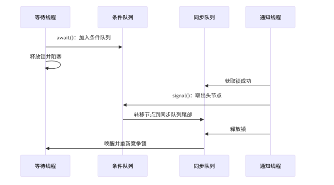


##### 线程的阻塞和释放


在JSR166之前，阻塞和释放线程都是基于Java内置管程，唯一的选择的是Thread.suspend和Thread.resume，但之前的文章也提到过，由于存在死锁的风险，这两个方法都被声明废弃了。即：如果两个线程同时持有一个线程对象，一个尝试去中断，一个尝试去释放，在并发情况下，无论调用时是否进行了同步，目标线程都存在死锁的风险——如果suspend()中的线程就是即将要执行resume()的那个线程，那肯定就要产生死锁了。


JUC.LockSuport类提供安全和可控的线程挂起和唤醒机制，以避免出现死锁和其它潜在问题

- 显式调用：使用LockSupport，线程的挂起和唤醒操作是显式的，需要开发者明确调用park和unpark方法。
- 无需持有锁：LockSupport的park方法不会持有任何锁对象，因此不会引发死锁。线程在调用park方法挂起时，不会影响其他线程对锁的获取和释放操作。
- 精确唤醒：LockSupport的unpark方法可以精确地唤醒指定的线程。与Thread的resume方法不同，unpark方法无需等待具体的操作，可以直接唤醒指定的线程。
- 无状态变更：LockSupport的park和unpark方法不会导致线程状态的不一致性或其他潜在的问题。线程在被唤醒后，可以正常继续执行，遵循同步规则。

#### 1个同步队列+N个条件队列的协作

acquire()
addWaiter()

enq()

acquireQueued()

 shouldParkAfterFailedAcquire()
 parkAndCheckInterrupt()
 cancelAcquire()
 unpakSuccessor()


release()方法

## 并发集合


### null值与并发集合

在并发环境下，`null` 的歧义性（不存在 vs 空值）会导致难以调试的线程安全问题。因此，**并发编程始终假设并发集合不支持 `null`**，**显式使用`Optional.empty()`存储空值**

1. 通过 `Collections.synchronizedXXX()` 包装的集合，**是否允许 null 取决于底层集合**


2. **绝大多数并发集合都不允许存储 `null` 值**：

| 集合类型                     | 禁止 null 的原因                                                                 |
|------------------------------|---------------------------------------------------------------------------------|
| `ConcurrentHashMap`          | `get(key)` 返回 `null` 明确表示键不存在，避免歧义                               |
| `ConcurrentSkipListMap`      | 同上                                                                            |
| `ConcurrentLinkedQueue`      | `poll()` 返回 `null` 表示队列为空，避免歧义                                    |
| `ConcurrentLinkedDeque`      | 同上                                                                            |
| `ArrayBlockingQueue`         | BlockingQueue 规范要求禁止 null，返回 null 表示队列关闭，若有 null 元素，会错误触发关闭信号                                                |
| `LinkedBlockingQueue`        | 同上                                                                            |
| `PriorityBlockingQueue`      | 同上                                                                            |
| `SynchronousQueue`           | 同上                                                                            |
| `ConcurrentSkipListSet`      | 基于 `ConcurrentSkipListMap` 实现                                               |


3. **少数允许存储 null 的并发集合**：`CopyOnWriteArrayList`、`CopyOnWriteArraySet`


### `Collections.synchronizedCollection()`


使用装饰器模式实现方法级同步，确保通过包装类调用的**每个方法是原子性的(除了iterator方法)**
- 通过包装类获取的迭代器，其方法不是原子级的，因此只要调用了迭代器方法，就必须要手动同步
- 如果调用且仅调用一个包装类的方法，就不需要对这个代码块进行同步操作；
- 使用互斥锁，适用于读写均衡、中并发量的场景
`synchronizedCollection(Collection<T> c)`工厂方法的简化实现如下
```java
public static <T> Collection<T> synchronizedCollection(Collection<T> c) {
    return new SynchronizedCollection<>(c);
}

static class SynchronizedCollection<E> implements Collection<E> {
    final Collection<E> c;  // 被包装的原始集合
    final Object mutex;     // 同步锁对象
    
    SynchronizedCollection(Collection<E> c) {
        this.c = Objects.requireNonNull(c);
        this.mutex = this;  // 使用自身作为锁
    }

    //可以自定义锁对象
    SynchronizedCollection(Collection<E> c, Object mutex) {
       this.c = c;
       this.mutex = mutex;
   }

    public boolean add(E e) {
        synchronized (mutex) { return c.add(e); }
    }
    
    public boolean remove(Object o) {
        synchronized (mutex) { return c.remove(o); }
    }

    public Iterator<E> iterator(){
        return c.iterator();
    }

}
```

使用`Collections.synchronizedCollection()`完成并发编程需要对非原子的读写操作加锁

- 错误代码：`iterThread`线程中，读操作由集合的`iterator()`方法、迭代器的`hasNext()`方法以及`next()`方法组成，需要对其加锁，否则在addThread执行写操作后抛出`ConcurrentModificationException`异常
```JAVA

List<String> syncList = Collections.synchronizedList(new ArrayList<>());

for(int i=0; i<10000; i++) {
    syncList.add(String.valueOf(i));
}

Thread iterThread = new Thread(() -> {
    for(String s : syncList) {
        System.out.println(s);
    }
});
iterThread.start();

Thread addThread = new Thread(() -> {
    syncList.add("C");  // 方法本身已同步
});
addThread.start();

try {
    iterThread.join();
    addThread.join();
    for(String s : syncList) {
        System.out.println(s);
    }
} catch (InterruptedException e) {
    Thread.currentThread().interrupt();
}
```
- 正确代码，其中addThread的run()方法只有一条原子语句，因此不需要同步
```JAVA
List<String> syncList = Collections.synchronizedList(new ArrayList<>());

for(int i=0; i<10000; i++) {
    syncList.add(String.valueOf(i));
}

Thread iterThread = new Thread(() -> {
    synchronized (syncList) {  // 同步整个迭代
        for(String s : syncList) {
            System.out.println(s);
        }
    }
});
iterThread.start();

Thread addThread = new Thread(() -> {
    syncList.add("C");  // 方法本身已同步
});
addThread.start();

try {
    iterThread.join();
    addThread.join();
    for(String s : syncList) {
        System.out.println(s);
    }
} catch (InterruptedException e) {
    Thread.currentThread().interrupt();
}

//打印结果：0-9999，0-9999，C
```

---

### CopyOnWrite写时复制


`concurrent`并发集合包提供两个`CopyOnWriteXXX`类型的写时复制类，`CopyOnWriteArrayList`、`CopyOnWriteArraySet`

| 特性 | `Collections.synchronizedList()` | `CopyOnWriteXXX` |
|------|----------------------------------|------------------------|
| **线程安全机制** | 方法级同步锁 | 写时复制 + 锁 |
| **读性能** | 需要获取锁 | **完全无锁** |
| **写性能** | 直接修改原数据 | 复制整个集合 |
| **迭代一致性** | 强一致性 | **弱一致性**（快照） |
| **内存占用** | 低 | 高（写操作时翻倍） |
| **迭代安全** | 需要手动同步 | **绝对安全** |
| **适用场景** | 读写均衡 | 读多写少 |


通过迭代器进行读操作
- 每次调用`iterator()`方法返回的迭代器指向不同的快照
- 因为迭代器指向快照，无法访问原集合，所以不能通过迭代器进行写操作，即**不支持`remove()`方法**

通过集合方法进行写操作


读写分离允许迭代时修改原集合，可能导致快照不是最新的，即**弱一致性**


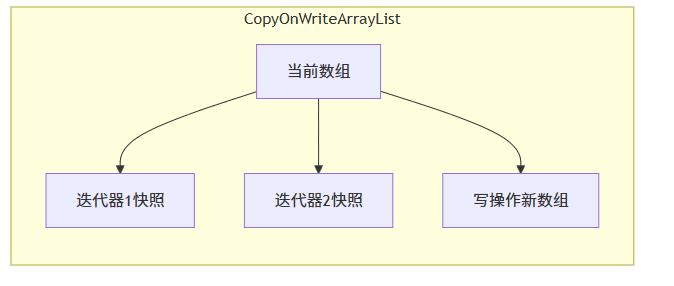
```JAVA
CopyOnWriteArrayList<String> list = new CopyOnWriteArrayList<>();
list.add("Java"); // 写操作加锁复制数组
Iterator<String> it = list.iterator();
list.add("Python");  // 修改集合
while(it.hasNext()) {
    // 迭代器基于创建时的数组快照
    System.out.println(it.next()); // 只输出"Java"
}
it=list.iterator();
while(it.hasNext()) {
    // 迭代器基于修改后的数组快照
    System.out.println(it.next()); // 输出Java\nPython
}
```


### `concurrent.CopyOnWriteArrayList`
Vector是线程安全类，但已废弃不应再使用，使用 `Collections.synchronizedList(new ArrayList<>())` 或 `CopyOnWriteArrayList` 获取线程安全的list对象

`concurrent`提供**线程安全** 的动态数组`CopyOnWriteArrayList`
- 由于写时复制带来的弱一致性和绝对迭代安全性，适合**写操作占比小于10%** 的场景
- 由于写时复制**空间换时间**，在写操作时生成新数组，旧数组等待GC导致短期内存占用翻倍，所以适合**数据量小**的场景
- 初始化时预分配空间减少扩容次数


**推荐使用场景**
| 特征                | 示例                          | 原因                                  |
|---------------------|------------------------------|---------------------------------------|
| **读远多于写**       | 事件监听器列表、日志记录器    | 读操作无锁，吞吐量极高                 |
| **极少修改**         | 配置文件加载后的静态数据      | 减少写带来的复制开销                  |
| **容忍短暂不一致**   | 统计计数器（允许少量误差）    | 弱一致性不影响业务逻辑                |
| **小规模数据**       | <100 元素的小型集合           | 复制开销可控                          |

 **避免使用场景**
| 特征                | 反例                          | 原因                                  |
|---------------------|------------------------------|---------------------------------------|
| **频繁写操作**       | 实时交易系统中的用户会话管理   | 每次写需复制整个数组，性能急剧下降     |
| **大数据量**         | 百万级数据的缓存池            | 内存占用过高，GC 压力大               |
| **强一致性需求**     | 银行账户余额更新              | 无法保证写后立即对所有读可见           |
| **内存敏感场景**     | 嵌入式设备或低配服务器        | 复制导致的内存峰值可能引发 OOM        |

---

**`addIfAbsent(E e)` 的工作原理**
- **获取当前数组快照：** 获取 `CopyOnWriteArrayList` 内部数组的当前引用（一个快照）。
- **检查是否存在：** **遍历这个快照数组**，使用 `equals()` 方法检查 `e` 是否已经存在于数组中。
- **存在则拒绝：** 如果找到相等的元素（`e.equals(existingElement)` 为 `true`），则立即返回 `false`，表示添加失败（实现了去重）。
- **不存在则“写时复制”添加：**
  - 如果遍历完数组都没找到相等的元素，说明 `e` 是唯一的（在这个快照时刻）。
  - 创建一个新的数组，长度是 `原数组长度 + 1`。
  - 将原数组的所有元素**复制**到新数组中。
  - 将新元素 `e` **添加**到新数组的末尾。
  - 使用 `ReentrantLock` 加锁，确保数组引用的更新是原子的。
  - 将 `CopyOnWriteArrayList` 的内部数组引用指向这个新创建的数组。
  - 返回 `true`，表示添加成功。


**`remove(Object o)` 方法：**
- 获取当前数组快照。
- 遍历快照找到要删除元素的**所有匹配项**（`equals()` 为 `true`）的索引
  - 如果没找到，返回 `false`。
  - 如果找到：
    - 创建一个新数组，长度是 `原数组长度 - 1`（或 `原数组长度 - n`，如果多个匹配，但理论上 `Set` 里不会出现）。
    - 将原数组中除了要删除的元素（在指定索引位置）之外的所有元素**复制**到新数组中。
    - 加锁更新内部数组引用指向新数组。
    - 返回 `true`。

**弱一致性迭代器**
- 返回的迭代器基于调用 `iterator()` 方法时内部数组的**快照**。
- 调用`remove()`抛 `UnsupportedOperationException`


### concurrent.ConcurrentMap接口

`ConcurrentMap` 继承 `Map<K, V>` 接口，解决多线程并发访问时的线程安全问题，同时保证高性能，提供一系列原子化操作，消除传统 `Map` 的竞态条件风险
- **`ConcurrentMap` 只有部分操作线程安全，Map接口方法不是线程安全的，仍需额外同步**
- 所有操作保证**单条目级别原子性**（如`putIfAbsent/replace`）
   - `putAll` **不是原子操作**（本质是循环单条写入）
   - `size()` 结果在并发环境下为**弱一致性近似值**

**核心原子操作方法**
| 操作类型 | 方法签名| 行为描述 | 返回值说明  |
|------------|--------------|------------|--------------|
| **原子性 PUT 操作**   |           |             |               |
| `putIfAbsent` | `V putIfAbsent(K key, V value)`  | 键不存在时插入值<br>**行为**：`K`不存在 → 存入`value`并返回`null`<br>`K`存在 → 返回当前值     | 成功插入：`null`<br>键已存在：原值           |
| `replace` (条件)      | `boolean replace(K key, V oldValue, V newValue)`                                                        | 仅当旧值匹配时更新<br>**行为**：当前值 = `oldValue` → 替换为`newValue`                                | 替换成功：`true`<br>值不匹配：`false`        |
| `replace` (无条件)    | `V replace(K key, V value)`                                                                              | 键存在时更新值<br>**行为**：`K`存在 → 替换值并返回原值<br>`K`不存在 → 不操作                          | 替换成功：原值<br>键不存在：`null`           |
| `computeIfAbsent`     | `V computeIfAbsent(K key, Function<K,V> mappingFunction)`                                               | 键不存在时通过函数生成值<br>**行为**：`K`不存在 → 执行函数并插入结果<br>`K`存在 → 直接返回当前值       | 新插入值/已存在的值                          |
| `compute`             | `V compute(K key, BiFunction<K,V,V> remappingFunction)`                                                 | 动态计算新值<br>**行为**：根据当前键值执行函数<br>→ 返回新值（删除需返回`null`）                      | 计算后的新值<br>删除时返回`null`             |
| **原子性 REMOVE 操作**    |           |             |               |           
| `remove` (条件)       | `boolean remove(Object key, Object value)`                                                              | 键值完全匹配时删除<br>**行为**：`K`存在且值 = `value` → 删除条目                                      | 删除成功：`true`<br>不匹配：`false`          |
| `remove` (返回旧值)   | `V remove(Object key, Object value)`                                                                     | 键值匹配时删除并返回旧值<br>**行为**：同上，但返回旧值                                                | 删除成功：旧值<br>不匹配：`null`             |
| **批量操作**   |           |             |               |
| `putAll`              | `void putAll(Map<? extends K,? extends V> m)`                                                           | 批量合并映射<br>**注意**：非原子操作！<br>实际是循环调用单次`put`                                    | 无                                           |
| `size`                | `int size()`                                                                                             | 返回近似条目数<br>**特性**：实时性弱<br>（高并发下不阻塞，但结果可能过期）                            | 近似大小值                                   |
| `containsKey`         | `boolean containsKey(Object key)`                                                                        | 原子性键存在检查<br>**行为**：瞬时状态检查<br>（检查后可能立即被修改）                                | 存在：`true`<br>不存在：`false`              |


**最佳实践建议**
1. **避免跨操作依赖**: 如 "检查→修改" 应改用 `putIfAbsent()`/`accumulate()` 等原子方法。
2. **慎用迭代器**: 遍历过程中若有修改可能导致 `ConcurrentModificationException`，建议使用 `entrySet().iterator()` 并接受弱一致性。
3. **注意大小估算**: 初识容量设置不当可能导致频繁扩容影响性能。


### `concurrent.ConcurrentHashMap`
`ConcurrentHashMap` 是一个**线程安全且高效的哈希表实现**，适合**读密集场景**。解决了`HashMap`（已弃用）在多线程环境下的两个关键问题：
1. **竞态条件**：多个线程同时修改 `HashMap` 导致的数据损坏
2. **性能瓶颈**：全局同步导致的严重线程阻塞

**线程安全**
- **无锁化设计**：摒弃了全局锁，采用 **CAS（Compare-And-Swap）** 和 **轻量级同步** 实现乐观锁。
- **JDK 8**：**单个数组 + CAS + synchronized blocks**，进一步降低锁粒度。

**高并发性能**
- **读操作无锁**：读操作不需要锁，直接通过 CAS 完成。
- **写操作局部锁**：写操作仅锁定受影响的桶，不影响其他桶。
- **扩容优化**：动态扩容时无需全表锁定，逐步迁移数据

**弱一致性迭代器**：迭代器指向快照，允许遍历时修改


**不支持 `null` 键或值**


 **常用方法**
- **复合操作**需要外部同步或者使用`ConcurrentHashMap`提供的保证原子性的方法

| 方法                     | 作用                                                                 |
|--------------------------|----------------------------------------------------------------------|
| `put(K key, V value)`    | 插入键值对（若存在则覆盖）                                           |
| `putIfAbsent(K key, V value)` | 若键不存在才插入                                                    |
| `replace(K key, V oldValue, V newValue)` | 替换指定键的旧值为新值（需匹配旧值）                            |
| `compute(K key, BiFunction remappingFunction)` | 根据键计算新值（原子性操作）                                   |
| `computeIfAbsent(K key, Function mappingFunction)` | 若键不存在，通过函数生成值并插入                              |
| `computeIfPresent(K key, BiFunction remappingFunction)` | 若键存在，对其值进行转换（原子性操作）                        |
| `merge(K key, V value, BiFunction mergeFunction)` | 合并值（若键存在则应用合并函数）                              |


**`ConcurrentHashMap` 特有原子方法**

| **方法类型**       | **方法签名/示例**                                                                 | **行为描述**                                                                 | **关键特性**                              |
|--------------------|----------------------------------------------------------------------------------|-----------------------------------------------------------------------------|------------------------------------------|
| **批量并行操作**   |                                                                                  |                                                                             |                                          |
| 搜索               | `U search(long threshold, BiFunction<K,V,U> searchFunction)`                     | 并行搜索满足条件的条目<br>（首个非null结果终止搜索）                          | 阈值控制并行度<br>弱一致性遍历           |
| 归约               | `T reduce(long threshold, BiFunction<K,V,T> transformer, BiFunction<T,T,T> reducer)` | 并行聚合所有条目值<br>（如求和、最大值等）                                    | 支持基础类型特化<br>(reduceToXXX)        |
| 遍历               | `void forEach(long threshold, BiConsumer<K,V> action)`                           | 并行处理所有条目                                                             | 不保证顺序<br>执行期间可能反映修改        |
| **键集合视图**     |                                                                                  |                                                                             |                                          |
| 键集绑定默认值     | `KeySetView<K,V> keySet(V mappedValue)`                                          | 返回关联指定默认值的键集视图<br>`add(key)` ⇨ `putIfAbsent(key, mappedValue)` | 非null值约束<br>线程安全操作             |
| 新建键集           | `static KeySetView<K,Boolean> newKeySet()`                                       | 创建基于`ConcurrentHashMap`的线程安全Set<br>（值固定为`Boolean.TRUE`）       | 替代`Collections.synchronizedSet`        |


```JAVA
ConcurrentHashMap<String, Integer> map = new ConcurrentHashMap<>();

// 添加元素
map.put("A", 1);
map.putIfAbsent("B", 2); // 如果键不存在才插入

// 获取元素
System.out.println("Value for A: " + map.get("A")); // 1

// 原子性更新
map.merge("A", 5, (oldVal, newVal) -> oldVal + newVal); // A=6

// 遍历（弱一致性）
map.forEach((key, value) -> System.out.println(key + ": " + value));
```


**适用场景**：
- **缓存系统**：高频读写，无需严格一致性。
- **计数器/统计器**：利用原子操作实现高效累加。
- **分布式系统中的本地缓存**：快速响应请求，容忍中间状态不一致。

`ConcurrentHashMap` 提供内部类`KeySetView`、`ValuesView` 和 `EntrySetView`实现**动态视图**
- ConcurrentMap继承Map接口，`ConcurrentHashMap`实现`keySet()`、`values()`、`entrySet()`方法
- 对比HashMap实现的方法，`ConcurrentHashMap`允许视图通过原子性操作修改并发集合


**`KeySetView`**
- **迭代器弱一致性**：迭代过程中若其他线程修改了映射结构，迭代器不会抛出 `ConcurrentModificationException`，但可能看到新旧混合的中间状态
- **不可直接修改**：不能通过 `add()` 等方法直接向 `KeySetView` 添加新键（非原子性），**必须通过 `put()`/`putIfAbsent()` 等映射方法间接添加**。

**`ValuesView` ()**
- **只读属性**：仅能读取值，无法直接修改或添加值（因无关联键）。
- **实时更新**：当对应键的值被更新时，视图中的值会自动同步。

**`EntrySetView` ()**
- **完整操控**：可通过`Map.Entry` 接口读取、更新甚至替换键值对。
- **局部原子性**：对单个条目的操作（如 `setValue()`）是原子的，但**跨条目操作需自行同步**。
- **双向同步**：修改条目会影响映射本身，反之亦然。


| 特性                | 优势                                                                 | 注意事项                                                                 |
|---------------------|--------------------------------------------------------------------|--------------------------------------------------------------------------|
| **实时性**           | 视图始终反映最新数据，无需手动刷新                                   | 迭代期间可能发生可见的中间状态（弱一致性）                             |
| **线程安全**         | 所有公共操作均按设计保证线程安全                                     | 复合操作（如 "检查后执行"）仍需外部同步                                  |
| **高性能**           | 基于分段锁/CAS 实现细粒度并发控制                                   | 过度依赖单个视图可能导致热点竞争（建议分散操作粒度）                    |
| **内存效率**         | 视图不存储额外数据，仅持有对底层节点的引用                         | 长期持有大视图可能增加内存压力（尤其 `EntrySetView`）                   |
| **迭代器行为**       | 支持失败安全（Fail-Safe）：可在遍历时修改映射（不会抛异常）         | 若需严格一致性，应在遍历前加锁或使用 `computeIfPresent()` 等原子方法    |


---


### `concurrent.ConcurrentSkipListMap`
`ConcurrentSkipListMap` 是一个**线程安全且有序的跳跃表实现**，`TreeMap`的线程安全等价实现，适合**写密集场景**或者**并发有序性**
- **禁止 `null` 键**
- `ConcurrentSkipListMap` 不允许 `null` 键，否则抛出 `NullPointerException`。若需允许 `null` 键，可改用 `ConcurrentHashMap`。

**迭代器的弱一致性**
- 迭代器返回的是快照（Snapshot），遍历过程中可能发生修改，但不会抛出异常。若需实时视图，需手动同步。

**底层数据结构：跳表（Skip List）**
- **多层链表**：跳表通过多层链表实现，每一层都是前一层的稀疏子集。例如，第 0 层包含所有元素，第 1 层跳过部分元素形成更短的链表，依此类推。
- **搜索效率**：利用多层结构加速查找，平均时间复杂度为$O(log n)$，最坏情况下仍为 $O(log n)$。
- **并发友好**：每个层级的节点独立加锁，减少线程竞争。

**线程安全机制**
- **细粒度锁**：每个节点持有独立的锁，仅在修改该节点时加锁，不影响其他节点。
- **无锁读操作**：读取操作完全不需要加锁，直接遍历跳表。
- **原子性写操作**：插入、删除等操作通过 CAS（Compare-And-Swap）和局部锁确保原子性。

**`ConcurrentSkipListMap` 特有原子方法**

| **方法类型**       | **方法签名/示例**                                                                 | **行为描述**                                                                 | **关键特性**                              |
|--------------------|----------------------------------------------------------------------------------|-----------------------------------------------------------------------------|------------------------------------------|
| **范围视图**       |                                                                                  |                                                                             |                                          |
| 子Map              | `subMap(K fromKey, boolean fromInclusive, K toKey, boolean toInclusive)`        | 返回指定范围的原子视图<br>（操作反映到原Map）                                 | 范围变化自动同步<br>迭代器弱一致性       |
| 头/尾Map           | `headMap(K toKey)`, `tailMap(K fromKey)`                                        | 返回小于/大于指定键的视图                                                   | 边界动态更新                              |
| **边界操作**       |                                                                                  |                                                                             |                                          |
| 首尾条目           | `Map.Entry<K,V> firstEntry()`, `lastEntry()`                                    | 原子获取最小/最大键的条目                                                   | 不存在时返回`null`                       |
| 弹出边界条目       | `Map.Entry<K,V> pollFirstEntry()`, `pollLastEntry()`                            | 原子移除并返回最小/最大键条目                                               | 组合"获取+删除"操作                      |


**性能特点**
| 操作            | 平均时间复杂度 | 最坏情况       | 说明                                                                 |
|-----------------|----------------|----------------|----------------------------------------------------------------------|
| `put(K, V)`    | O(log n)       | O(log n)       | 跳表的多层结构加速查找和插入                                       |
| `get(K)`       | O(log n)       | O(log n)       | 同上                                                                 |
| `remove(K)`    | O(log n)       | O(log n)       | 同上                                                                 |
| `containsKey(K)`| O(log n)       | O(log n)       | 同上                                                                 |
| **遍历**        | O(n)           | O(n)           | 中序遍历跳表                                                         |
| **范围查询**    | O(log n + k)   | O(log n + k)   | k 为范围内的元素数量                                                |


**适用场景推荐**
- **排行榜系统**：按分数排序并频繁更新排名。
- **时间序列数据**：按时间戳排序的事件日志。
- **分布式系统中的有序缓存**：需要跨节点保持一致性的有序数据。
---


### `concurrent.CopyOnWriteArraySet`

`CopyOnWriteArraySet` 是 **线程安全** 的 `Set` 实现，适合读密集场景

CopyOnWriteArraySet` **内部维护了一个 `CopyOnWriteArrayList` 实例** ，所有 `Set` 操作最终都转化为对 `CopyOnWriteArrayList` 的操作。

**去重关键：`add()` 方法**
- 调用 `set.add(newElement)` 时，内部实际上是调用 `al.addIfAbsent(newElement)`。


**典型使用场景**
1. **事件监听器管理** 
   - 大量线程订阅事件（读），少量线程触发事件（写）。
   - 示例：日志记录器、消息通知系统。

2. **缓存元数据** 
   - 缓存配置信息，允许高频读取，低频更新。

3. **白名单/黑名单过滤** 
   - 安全策略规则集，需快速校验权限。

4. **统计指标收集** 
   - 聚合来自不同线程的数据样本。


**注意事项与缺点**
1. **写操作昂贵** &#128184;  
   - 每次写操作需复制整个数组，时间和空间开销随集合大小线性增长。
   - &#10060; **不适用于写密集场景**。

2. **内存占用高** 
   - 始终维护完整数组副本，即使部分元素已被删除。

3. **最终一致性**
   - 写操作完成后，新加入的元素才会对后续读操作可见。
   - 极端情况下可能出现短暂的不一致（但对业务无影响）。

4. **不支持 null 元素**
   - 若尝试添加 `null`，会抛出 `NullPointerException`。


---
### `concurrent.ConcurrentSkipListSet`

`ConcurrentSkipListSet` 底层依赖 `ConcurrentSkipListMap` 实现，值固定为 `Boolean.TRUE`（仅作占位符，无实际意义）。


### `concurrent.BlockingQueue`阻塞队列接口

`BlockingQueue`接口专为**生产者-消费者模型**设计，添加了在队列操作不可行时**阻塞线程**的能力，**是构建高并发系统的基石**。

约束
1. **线程安全**：所有实现类**保证原子操作**
2. **流量控制**：通过容量限制防止资源耗尽
3. **协调机制**：内置条件等待（`Condition`）实现阻塞
4. **公平性选项**：部分实现支持公平锁（避免线程饥饿）


| **操作**                  | 队列满时行为               | 队列空时行为               | **特殊说明**                  |
|--------------------------|---------------------------|---------------------------|-----------------------------|
| **插入元素**             |                           |                           |                             |
| `put(e)`                 | 阻塞直到有空位            | -                         | 无条件阻塞                  |
| `offer(e)`               | 立即返回 `false`          | -                         | 非阻塞                      |
| `offer(e, timeout, unit)`| 限时阻塞等待空位          | -                         | 超时返回 `false`            |
| **移除元素**             |                           |                           |                             |
| `take()`                 | -                         | 阻塞直到有元素            | 无条件阻塞                  |
| `poll()`                 | -                         | 立即返回 `null`           | 非阻塞                      |
| `poll(timeout, unit)`    | -                         | 限时阻塞等待元素          | 超时返回 `null`             |
| **检查元素**             |                           |                           |                             |
| `peek()`                 | -                         | 立即返回 `null`           | 不修改队列                  |
| **容量操作**             |                           |                           |                             |
| `remainingCapacity()`    | 返回 `0`                  | 返回队列容量              | **不阻塞**<br>无界队列返回 `Integer.MAX_VALUE` |
| **批量操作**             |                           |                           |                             |
| `drainTo(Collection c)`  | 转移所有元素并清空队列    | 不操作，返回 `0`          | **不阻塞**<br>原子性转移    |
| `drainTo(c, maxElements)`| 转移最多 maxElements 个元素 | 不操作，返回 `0`         | **不阻塞**<br>部分转移      |


| **实现类**             | 数据结构      | 边界       | 锁类型      | 公平性 | 适用场景                     |
|------------------------|--------------|-----------|------------|--------|-----------------------------|
| `ArrayBlockingQueue`   | 固定大小数组  | 有界       | 单锁        | 可选   | 固定容量生产消费            |
| `LinkedBlockingQueue`  | 链表         | 可选有界   | 双锁分离    | 不支持 | 默认选择（高吞吐量）        |
| `PriorityBlockingQueue`| 堆（数组）    | 无界       | 单锁        | 不支持 | 优先级任务处理              |
| `SynchronousQueue`     | 无缓冲       | 无容量     | 双栈/双队列 | 可选   | 直接传递（线程间握手）      |
| `DelayQueue`           | 优先级堆     | 无界       | 单锁        | 不支持 | 定时任务/缓存过期          |
| `LinkedTransferQueue`  | 链表         | 无界       | 无锁（CAS） | 不支持 | 高并发生产消费（Java 7+）  |


**黄金法则**：
1. 默认选择 `LinkedBlockingQueue`（平衡吞吐和功能）
2. 严格延迟要求用 `SynchronousQueue`
3. 定时任务用 `DelayQueue`
4. 始终设置合理容量（包括 "无界" 队列的实际上限）避免OOM(内存耗尽)
5. 生产代码必须处理 `InterruptedException`

### `concurrent.ArrayBlockingQueue`


`ArrayBlockingQueue` 是 Java 并发包中的**核心阻塞队列实现**，采用**数组 + 单锁双条件**设计，是构建高并发系统的关键组件。
- **底层数据结构**
```java
final Object[] items;      // 循环数组存储元素
int takeIndex;             // 下一个取出位置
int putIndex;              // 下一个放入位置
int count;                 // 当前元素数量
```

- **并发控制机制**
```java
final ReentrantLock lock;          // 全局锁（所有操作共用）
private final Condition notEmpty;  // "非空"条件（消费者等待）
private final Condition notFull;   // "未满"条件（生产者等待）
```

- **循环数组索引计算**
```java
// 高效循环索引（避免取模运算）
final int inc(int i) {
    return (++i == items.length) ? 0 : i;
}

// 替代方案对比：
// 取模运算: i = (i+1) % length   // 慢（除法指令）
// 位运算: i = (i+1) & (length-1) // 需length为2的幂（ArrayDeque方式）
```

- **条件唤醒优化**：相比 `signalAll()` 减少锁竞争，提升吞吐量，避免无效唤醒
```java
// 精确唤醒（避免无效唤醒）
notFull.signal();  // 替代notFull.signalAll()
notEmpty.signal(); // 替代notEmpty.signalAll()
```


**最佳实践**
- **容量规划原则**
```java
// CPU密集型任务：小队列减少上下文切换
BlockingQueue<Runnable> cpuQueue = 
    new ArrayBlockingQueue<>(2 * Runtime.getRuntime().availableProcessors());//队列容量设置为 CPU 核心数的 2 倍

// IO密集型任务：大队列容忍波动
BlockingQueue<HttpRequest> ioQueue = 
    new ArrayBlockingQueue<>(1000);
```

- **公平性选择**：公平性降低吞吐量 15-20%，仅当需要严格顺序时启用
```java
// 创建公平锁队列（防止线程饥饿）
ArrayBlockingQueue<String> fairQueue = 
    new ArrayBlockingQueue<>(100, true);
```


- **批量消费优化**
```java
// 批量提取（减少锁竞争）
List<Data> drainTo(Collection<? super E> c, int maxElements) {
    lock.lock();
    try {
        int n = Math.min(maxElements, count);
        for (int i = 0; i < n; i++) {
            c.add(dequeue());
        }
        return n;
    } finally {
        lock.unlock();
    }
}
```


**经典应用场景**

- **固定大小线程池**
```java
// ThreadPoolExecutor内部实现
public ThreadPoolExecutor(
    int corePoolSize, 
    int maximumPoolSize,
    BlockingQueue<Runnable> workQueue  // 通常用ArrayBlockingQueue
) {
    // ...
    this.workQueue = workQueue;
}

ExecutorService fixedPool = new ThreadPoolExecutor(
    4, 4, 0L, TimeUnit.MILLISECONDS,
    new ArrayBlockingQueue<>(100)  // 有界队列防止资源耗尽
);
```

- **生产者-消费者缓冲**
```java
class DataPipeline {
    private final ArrayBlockingQueue<Data> buffer = 
        new ArrayBlockingQueue<>(200);

    // 生产者线程
    void produce(Data data) throws InterruptedException {
        buffer.put(data);
    }

    // 消费者线程
    void consume() throws InterruptedException {
        while (true) {
            Data data = buffer.take();
            process(data);
        }
    }
}
```

- **流量控制阀门**
```java
class RateLimiter {
    private final ArrayBlockingQueue<Object> tokens;
    
    public RateLimiter(int permits) {
        tokens = new ArrayBlockingQueue<>(permits);
        // 初始化令牌
        for (int i = 0; i < permits; i++) tokens.add(new Object());
    }
    
    public void acquire() throws InterruptedException {
        tokens.take();  // 获取令牌（阻塞）
    }
    
    public void release() {
        tokens.offer(new Object());  // 释放令牌
    }
}
```


**陷阱与规避方案**

- **死锁风险**
```java
// 错误：嵌套使用同一队列
public void process(Data data) throws InterruptedException {
    buffer.take();        // 外层获取
    internalBuffer.put(data);  // 内层操作（可能死锁）
}

// 解决方案：使用不同队列层级
public void safeProcess(Data data) {
    mainQueue.offer(data);  // 非阻塞提交
}
```

- **内存泄漏**
```java
// 错误：存储大对象不释放
ArrayBlockingQueue<BigObject> leakQueue = 
    new ArrayBlockingQueue<>(100);

// 解决方案：软引用包装
ArrayBlockingQueue<SoftReference<BigObject>> safeQueue = 
    new ArrayBlockingQueue<>(100);
```

- **响应性下降**
```java
// 错误：大容量队列导致延迟增加
ArrayBlockingQueue<Event> bigQueue = new ArrayBlockingQueue<>(100_000);

// 解决方案：分级队列
ArrayBlockingQueue<Event> fastQueue = new ArrayBlockingQueue<>(100); // 高优先级
ArrayBlockingQueue<Event> slowQueue = new ArrayBlockingQueue<>(10_000); // 低优先级
```

### `concurrent.SynchronousQueue`

`SynchronousQueue` 阻塞队列 **完全不存储元素**，一种“虚拟”队列，仅允许成对出现的 **生产者-消费者** 操作，作为生产者与消费者的桥梁，实现最高效的线程间直接协作，消除中间环节
- 与`LinkedBlockingQueue`不同，`SynchronousQueue` **没有内部容量**，不会暂存任何元素
- `put(E e)` 阻塞直到有消费者取走上一个元素；`take()` 阻塞直到有生产者放入元素；强制生产者与消费者同步相遇
- 通过构造函数指定**公平模式**（默认）和 **非公平模式**：默认按FIFO顺序唤醒等待线程；非公平模式下新到达的线程可插队
- 需要缓冲时使用`BlockingQueue`

**低延迟 & 零拷贝** ： 数据直接从生产者传递给消费者，无需入队/出队操作 

**内部实现机制**
- **基于锁与条件变量**：使用互斥锁 (`ReentrantLock`) + 两个条件变量 (`notEmpty`, `notFull`) 实现线程同步。
- **公平 vs 非公平**：
  - **公平模式**：使用 `Condition` 对象的队列记录等待线程，按先来后到顺序唤醒。
  - **非公平模式**：新线程可直接尝试抢占资源，可能导致“后来居上”。


**适用场景**
1. **任务手把手交接**  
   - 例：将任务从主线程池递交给工作线程池，避免中间缓冲带来的延迟。
   - 优势：消除队列积压风险，适合需快速响应的场景。
2. **工作窃取算法**  
   - Fork/Join 框架中，空闲线程可“偷取”其他线程的任务执行。
3. **流式处理管道**  
   - 生产者生成数据后立即交由消费者处理，减少内存占用。
4. **轻量级消息传递**  
   - 高频次、小数据量的生产者-消费者模型（如日志打标）。

**避免场景**
1. **突发流量**  
   - 因无缓冲能力，瞬时高峰会导致大量线程阻塞甚至崩溃。
2. **广播式通信**  
   - 单个消息需分发给多个消费者时，无法满足需求。
3. **持久化需求**  
   - 元素不会被持久化，重启后历史数据丢失。
4. **高并发写多读少**


**实践建议**
1. **搭配ExecutorService使用**  
   ```java
   ExecutorService es = Executors.newFixedThreadPool(2);
   es.submit(() -> queue.put(task)); // 异步投递任务
   ```
2. **警惕死锁风险**  
   - 确保生产者/消费者数量匹配，避免单向无限等待。
3. **结合超时控制**  
   - 使用 `offer(E e, long timeout, TimeUnit unit)` 防止永久阻塞。
4. **监控活跃度**  
   - 通过 `queue.isEmpty()` + `queue.hasWaitingConsumer()` 判断系统健康状态。

```java
SynchronousQueue<Integer> queue = new SynchronousQueue<>();

// 生产者线程：生产1~5的数字
new Thread(() -> {
    try {
        for (int i = 1; i <= 5; i++) {
            System.out.println("Producing: " + i);
            queue.put(i); // 阻塞直到有消费者取走
        }
    } catch (InterruptedException e) {
        e.printStackTrace();
    }
}).start();

// 消费者线程：消费数字
new Thread(() -> {
    try {
        while (true) {
            Integer num = queue.take(); // 阻塞直到有生产者放入
            System.out.println("Consuming: " + num);
        }
    } catch (InterruptedException e) {
        e.printStackTrace();
    }
}).start();
```


---

### `concurrent.LinkedBlockingQueue`


`LinkedBlockingQueue` 基于单向链表结构，支持可选的有界/无界模式。使用 **两把锁分离技术**，`takeLock` 控制出队操作，`putLock` 控制入队操作，高并发场景下生产者和消费者可并行操作，提升吞吐量。

**适用场景**
- **生产者-消费者模型**：解耦生产与消费，平衡处理速度差异。
- **线程池任务队列**：如 `Executors.newFixedThreadPool()` 默认使用此队列。
- **流量控制**：通过有界队列限制系统负载，防止资源耗尽。


**与 ArrayBlockingQueue 对比**

| **特性**               | `LinkedBlockingQueue`                     | `ArrayBlockingQueue`              |
|------------------------|------------------------------------------|-----------------------------------|
| **底层结构**           | 链表                                     | 数组                             |
| **锁机制**             | 两把锁（入队/出队分离）                  | 一把锁（入队出队竞争同一把锁）    |
| **吞吐量**             | 更高（并行度高）                         | 较低                             |
| **内存占用**           | 每个元素需额外链表节点开销               | 连续内存，预分配固定大小          |
| **容量扩展**           | 无界或有界                               | 固定有界                         |


**注意事项**
1. **内存泄漏风险**：无界队列可能因持续添加元素导致 `OutOfMemoryError`。
2. **公平性**：默认非公平锁，可通过构造函数启用公平锁（可能降低吞吐量）。
3. **批量操作**：`drainTo(Collection<? super E> c)` 方法可高效批量移出元素。

**最佳实践**
- **明确容量**：优先使用有界队列避免资源耗尽。
- **优雅关闭**：通过毒丸（Poison Pill）信号通知消费者停止工作：
  ```java
  queue.put("POISON_PILL"); // 生产者发送结束信号
  // 消费者逻辑
  if ("POISON_PILL".equals(item)) break;
  ```


### `concurrent.PriorityBlockingQueue`

`PriorityBlockingQueue` **线程安全**的优先级阻塞队列，结合了 `PriorityQueue` 的排序特性和 `BlockingQueue` 的并发控制能力
- 使用 **ReentrantLock**（单锁）保证线程安全，通过 **Condition** (`notEmpty`) 实现消费者阻塞；
  - **队列为空时**：`take()` 阻塞直到元素可用；
  - **队列满时**：**永不阻塞**（无界特性，自动扩容）
- **自定义 `Comparator` 应确保线程安全（无状态或使用不变对象）**

**并发实现原理**
1. **锁机制**  
```java
//所有写操作和读操作共用同一把锁
private final ReentrantLock lock = new ReentrantLock();
//`notEmpty` 条件用于唤醒阻塞的消费者
private final Condition notEmpty = lock.newCondition();
```


2. **扩容逻辑**  
   - 当元素数量 >= 队列数组长度时触发
   - 小数组（<64）扩容为 2*size+2，大数组扩容 50%
   ```java
   private void tryGrow(Object[] array, int oldCap) {
       // 扩容期间释放锁（允许并发读）
       lock.unlock();
       Object[] newArray = ... // 计算新容量
       lock.lock(); // 重新加锁
   }
   ```

---

**应用场景**
1. **高并发优先级任务调度**  
   ```java
   PriorityBlockingQueue<Task> taskQueue = new PriorityBlockingQueue<>(
       100, Comparator.comparingInt(Task::getPriority)
   );
   
   // 生产者
   executor.submit(() -> taskQueue.put(newTask));
   
   // 消费者
   executor.submit(() -> {
       Task task = taskQueue.take(); // 按优先级处理
       process(task);
   });
   ```

2. **实时事件处理系统**  
   按事件优先级处理（如金融交易系统）

3. **定时任务触发**  
   按执行时间排序：
   ```java
   PriorityBlockingQueue<ScheduledTask> queue = 
       new PriorityBlockingQueue<>(Comparator.comparingLong(ScheduledTask::getTriggerTime));
   ```


### `concurrent.DelayQueue` 
`DelayQueue` 一个特殊的**无界阻塞队列**，用于存储实现了 `Delayed` 接口的元素。元素只有在指定的延迟时间到期后才能被取出。这是实现定时任务调度和缓存过期的核心组件


`Delayed`接口 用于标记应在给定延迟之后被处理的对象
- 实现该接口的类必须定义`compareTo()`方法，使用剩余的延迟时间进行对象比较，其排序顺序与使用`getDelay()`方法获取的顺序一致
```JAVA
public interface Delayed extends Comparable<Delayed> {

    /**返回与此对象关联的剩余延迟时间，以指定的时间单位表示。
     * @return 剩余延迟；零或负值表示延迟已经过去
     */
    long getDelay(TimeUnit unit);
}
```
`DelayQueue`实现
- 使用`PriorityQueue`存储`Delayed`对象，队首总是最先过期的元素，当且仅当在其 `getDelay()` 方法返回的值 ≤ 0 时才能被取出
- 使用 `ReentrantLock` 保证线程安全，通过 `Condition` 实现阻塞等待
- **领导者-追随者模式**
   - 第一个调用 `take()` 的线程成为 `leader`  
   - `leader` 使用 `available.awaitNanos(delay)` 精确等待  
   - 其他线程（`followers`）无限期等待 `available.await()`  
   - 当 `leader` 获取元素后唤醒一个 `follower` 成为新 `leader`


**使用场景**
1. **定时任务调度**  
   ```java
   DelayQueue<DelayedTask> taskQueue = new DelayQueue<>();
   taskQueue.put(new DelayedTask("DailyReport", 24*60*60*1000)); // 24小时后执行
   ```

2. **缓存过期**  
   ```java
   class CacheItem implements Delayed {
       String key;
       Object value;
       long expireTime;
       // 实现 getDelay() 和 compareTo()
   }
   
   // 清理线程
   new Thread(() -> {
       while (true) {
           CacheItem item = cacheQueue.take();
           cacheMap.remove(item.key); // 从主缓存移除
       }
   }).start();
   ```

3. **连接超时管理**  
   自动关闭空闲超时的网络连接

**注意事项**
1. **内存管理**  
   作为无界队列，需监控队列大小防止 OOM：
   ```java
   if (delayQueue.size() > WARNING_THRESHOLD) {
       // 触发警报
   }
   ```

2. **时间精度**  
   依赖 `System.nanoTime()`（不受系统时钟变化影响）

3. **元素要求**  
   - 必须正确实现 `getDelay()` 和 `compareTo()`  
   - `compareTo()` 必须与 `getDelay()` 逻辑一致

4. **领导者线程优化**  
   避免修改 `leader` 变量（内部优化机制）


**与 `ScheduledThreadPoolExecutor` 对比**
| 特性 | `DelayQueue` | `ScheduledThreadPoolExecutor` |
|------|--------------|-------------------------------|
| **任务执行** | 只管理元素 | 内置线程池执行任务 |
| **有序性** | 按延迟时间排序 | 按执行时间排序 |
| **灵活性** | 更高（自定义元素） | 固定任务接口 |
| **复杂度** | 需自行实现消费者 | 开箱即用 |
| **适用场景** | 缓存过期、延迟触发 | 定时任务调度 |


**最佳实践**
1. **守护线程清理**  
   使用守护线程处理到期元素：
   ```java
   Thread cleaner = new Thread(() -> {
       while (!Thread.interrupted()) {
           try {
               Delayed item = queue.take();
               processExpired(item);
           } catch (InterruptedException e) {
               Thread.currentThread().interrupt();
           }
       }
   });
   cleaner.setDaemon(true);
   cleaner.start();
   ```

2. **批量处理**  
   使用 `drainTo()` 高效获取多个到期元素：
   ```java
   List<Delayed> expired = new ArrayList<>();
   int count = queue.drainTo(expired);  // 获取所有到期元素
   expired.forEach(this::process);
   ```

3. **关闭处理**  
   优雅终止消费者线程：
   ```java
   queue.put(new DelayedTask("POISON_PILL", 0)); // 发送毒丸
   // 消费者线程
   if ("POISON_PILL".equals(task.getName())) break;
   ```


---


### `concurrent.TransferQueue`接口

`TransferQueue` 接口继承`BlockingQueue` 并添加了独特的**传输语义**，适用于生产者需要确认元素已被消费者接收的场景

**"传输(transfer)"** 概念：
- **生产者可以等待消费者接收元素**（而不仅仅是放入队列）
- **消费者可以等待生产者提供元素**（而不仅仅是取出元素）


**接口定义**
- 接口仅定义生产者方法，消费者使用`BlockingQueue`方法
```java
public interface TransferQueue<E> extends BlockingQueue<E> {
    // 尝试立即传输元素给消费者
    boolean tryTransfer(E e);
    
    // 传输元素，必要时阻塞直到被消费
    void transfer(E e) throws InterruptedException;
    
    // 限时传输元素
    boolean tryTransfer(E e, long timeout, TimeUnit unit) 
        throws InterruptedException;
    
    // 检查是否有等待的消费者
    boolean hasWaitingConsumer();
    
    // 获取等待消费者的数量
    int getWaitingConsumerCount();
}
```

### `concurrent.LinkedTransferQueue`


`LinkedTransferQueue`支持三种**工作模式**

1. 即时交付：有等待的消费者就立即交付，否则返回false
   - `tryTransfer()`：尽力而为交付

2. 阻塞交付模式：阻塞生产者线程直到item交付给消费者并解除阻塞
   - `transfer()`，适合关键数据

3. 异步缓冲模式：生产者也使用`BlockingQueue`方法，退化为`BlockingQueue`


**与普通 BlockingQueue 的对比**

| 特性 | `TransferQueue` | 普通 `BlockingQueue` |
|------|-----------------|----------------------|
| **生产者等待消费者** | ✅ (`transfer()`) | ❌ |
| **立即传递检查** | ✅ (`tryTransfer()`) | ❌ |
| **消费者等待生产者** | ✅ (`take()`) | ✅ |
| **队列缓冲** | ✅ | ✅ |
| **交付保证** | 强保证 | 弱保证 |
| **实现复杂度** | 高 | 中 |

**性能**
1. **无锁算法**：基于 CAS 操作，减少线程阻塞
2. **双重数据结构**：同时支持同步传输和异步缓冲
3. **工作窃取优化**：适用于` ForkJoinPool` 等框架
4. **高吞吐量**：**在生产者-消费者数量匹配时性能最佳**

**使用场景**

**1. 精确的任务分配**
```java
// 线程池工作分配
class Worker implements Runnable {
    private final TransferQueue<Runnable> taskQueue;
    
    public Worker(TransferQueue<Runnable> taskQueue) {
        this.taskQueue = taskQueue;
    }
    
    public void run() {
        try {
            while (!Thread.interrupted()) {
                Runnable task = taskQueue.take();
                task.run();
            }
        } catch (InterruptedException e) {
            Thread.currentThread().interrupt();
        }
    }
}

// 提交任务（确保立即执行）
void submitTask(Runnable task) {
    if (!taskQueue.tryTransfer(task)) {
        // 没有空闲worker，启动新线程
        new Thread(task).start();
    }
}
```

**2. 实时事件处理**
```java
class EventProcessor {
    private final TransferQueue<Event> eventQueue = new LinkedTransferQueue<>();
    
    void start() {
        new Thread(this::processEvents).start();
    }
    
    private void processEvents() {
        try {
            while (true) {
                Event event = eventQueue.take();
                handleEvent(event);
            }
        } catch (InterruptedException e) {
            Thread.currentThread().interrupt();
        }
    }
    
    // 发送关键事件（确保立即处理）
    void sendCriticalEvent(Event event) {
        try {
            eventQueue.transfer(event); // 阻塞直到被处理
            log("关键事件已处理");
        } catch (InterruptedException e) {
            Thread.currentThread().interrupt();
        }
    }
}
```
**3. 资源交换点**
```java
class ResourceExchange {
    private final TransferQueue<Resource> exchange = new LinkedTransferQueue<>();
    
    // 提供资源
    void provideResource(Resource res, long timeout) {
        try {
            if (!exchange.tryTransfer(res, timeout, TimeUnit.MILLISECONDS)) {
                handleTimeout(res);
            }
        } catch (InterruptedException e) {
            Thread.currentThread().interrupt();
        }
    }
    
    // 请求资源
    Resource requestResource() throws InterruptedException {
        return exchange.take();
    }
}
```
**高级特性**

**1. 消费者计数**
```java
// 监控系统使用情况
if (tq.hasWaitingConsumer()) {
    System.out.println("活跃消费者: " + tq.getWaitingConsumerCount());
}
```
**2. 毒丸模式**
```java
// 优雅关闭
final Object POISON_PILL = new Object();

// 生产者发送关闭信号
tq.transfer(POISON_PILL);

// 消费者处理
while (true) {
    Object item = tq.take();
    if (item == POISON_PILL) {
        tq.put(POISON_PILL); // 传递给下一个消费者
        break;
    }
    process(item);
}
```
### `concurrent.Exchanger`

`Exchanger`类是一个用于**两个线程间双向交换数据**的同步工具。它提供了一个**同步点**，当两个线程都到达该点时，它们可以交换彼此的数据

**核心原理**
1. **配对机制**  
   - 两个线程分别调用`exchange()`方法，彼此阻塞直到对方也调用该方法。
   - 当两个线程都到达时，**互相交换数据**（线程A的数据传给线程B，线程B的数据传给线程A）。
   - 交换完成后，两个线程继续执行。

2. **适用场景**  
   - **生产者-消费者模型**：生产者将装满数据的缓冲区交给消费者，同时从消费者取回空缓冲区。
   - **双线程协作任务**：如游戏中的双玩家回合数据交换。


**关键方法**
| 方法 | 说明 |
|------|------|
| `V exchange(V x)` | 阻塞直到另一个线程到达交换点，将对象`x`传给对方，并返回对方提供的对象。 |
| `V exchange(V x, long timeout, TimeUnit unit)` | 带超时的版本，超时抛出`TimeoutException`。 |

---

**代码示例**
```java
import java.util.concurrent.Exchanger;

public class ExchangerDemo {
    public static void main(String[] args) {
        Exchanger<String> exchanger = new Exchanger<>();

        // 线程A：发送数据并接收线程B的响应
        new Thread(() -> {
            try {
                String dataA = "Data from Thread-A";
                System.out.println("Thread-A 发送: " + dataA);
                
                // 阻塞等待线程B交换数据
                String response = exchanger.exchange(dataA); 
                System.out.println("Thread-A 收到: " + response);
            } catch (InterruptedException e) {
                e.printStackTrace();
            }
        }).start();

        // 线程B：发送数据并接收线程A的响应
        new Thread(() -> {
            try {
                String dataB = "Data from Thread-B";
                System.out.println("Thread-B 发送: " + dataB);
                
                // 阻塞等待线程A交换数据
                String response = exchanger.exchange(dataB);
                System.out.println("Thread-B 收到: " + response);
            } catch (InterruptedException e) {
                e.printStackTrace();
            }
        }).start();
    }
}
```

**输出：**
```
Thread-A 发送: Data from Thread-A
Thread-B 发送: Data from Thread-B
Thread-A 收到: Data from Thread-B  // 交换后A收到B的数据
Thread-B 收到: Data from Thread-A  // 交换后B收到A的数据
```

---

**注意事项**
1. **仅限两个线程**  
   `Exchanger`严格设计用于**两个线程**。若三个线程调用`exchange()`，只有一个配对成功，第三个线程会无限期阻塞。
   
2. **死锁风险**  
   若一个线程未到达交换点，另一个线程会永久阻塞（除非使用**超时机制**）。

3. **空值支持**  
   允许交换`null`值，需确保业务逻辑能处理`null`。

4. **中断处理**  
   线程在等待交换时被中断会抛出`InterruptedException`。


**典型应用场景**
```java
// 生产者-消费者交换缓冲区
Exchanger<Buffer> exchanger = new Exchanger<>();

// 生产者线程
Runnable producer = () -> {
    Buffer currentBuffer = new Buffer();
    while (true) {
        currentBuffer.fillData(); // 生产数据
        currentBuffer = exchanger.exchange(currentBuffer); // 交换空缓冲区
    }
};

// 消费者线程
Runnable consumer = () -> {
    Buffer currentBuffer = new Buffer();
    while (true) {
        currentBuffer = exchanger.exchange(currentBuffer); // 交换满缓冲区
        currentBuffer.processData(); // 消费数据
    }
};
```

---


### 支持生产者-消费者模式的类对比


| **特性**                | **ArrayBlockingQueue**          | **SynchronousQueue**       | **LinkedBlockingQueue**     | **PriorityBlockingQueue**   | **DelayQueue**              | **LinkedTransferQueue**   | **Exchanger**             |
|-------------------------|---------------------------------|----------------------------|----------------------------|----------------------------|----------------------------|--------------------------|--------------------------|
| **有界性**              | 有界                            | 零容量                     | 可选有界/无界              | 无界                       | 无界                       | 无界                     | 无容量                   |
| **底层数据结构**        | 数组                            | 无存储                     | 链表                       | 二叉堆                     | PriorityQueue              | 链表                     | 无存储                   |
| **锁机制**              | 单 ReentrantLock                | CAS + 栈/队列              | 双 ReentrantLock           | ReentrantLock              | ReentrantLock              | CAS                      | CAS                      |
| **线程安全**            | 是                              | 是                         | 是                         | 是                         | 是                         | 是                       | 是                       |
| **阻塞操作**            | put/take                        | put/take                   | put/take                   | put/take                   | put/take                   | put/take/transfer         | exchange                 |
| **公平性选项**          | 支持                            | 支持                       | 不支持                     | 不支持                     | 不支持                     | 不支持                   | 不支持                   |
| **特殊方法**            | 无                              | 无                         | 无                         | 无                         | 仅能取出到期元素           | transfer/tryTransfer     | exchange                 |
| **优先级支持**          | 无                              | 无                         | 无                         | 支持                       | 支持（基于延迟时间）       | 无                       | 无                       |
| **延迟元素支持**        | 无                              | 无                         | 无                         | 无                         | 支持                       | 无                       | 无                       |
| **双向交换**            | 无                              | 无                         | 无                         | 无                         | 无                         | 无                       | 支持                     |
| **内存占用**            | 固定                            | 极低                       | 较高（节点开销）           | 较高                       | 较高                       | 较高                     | 极低                     |
| **吞吐量**              | 中等                            | 高                         | 高                         | 中等                       | 低                         | 高                       | 高                       |
| **适用场景**            | 固定资源池                      | 直接传递                   | 通用任务队列               | 优先级任务                 | 定时任务                   | 精确匹配                 | 双线程交换               |
| **典型用例**            | 线程池固定大小队列              | `newCachedThreadPool`      | `Executors.newFixedThreadPool` | 紧急任务优先处理         | 会话超时管理               | 即时消息系统             | 双缓冲区交换             |
| **注意事项**            | 固定大小可能阻塞                | 必须严格配对               | 无界队列可能导致 OOM       | 元素需实现 Comparable      | 元素需实现 Delayed         | 复杂行为需谨慎使用       | 仅限两个线程使用         |


## 线程池与任务调度

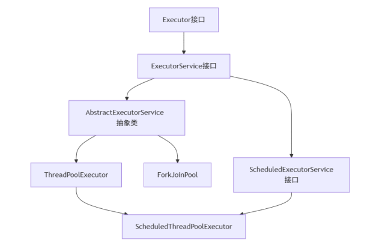
### 守护线程

当所有用户线程结束时，无论守护线程是否执行完毕，JVM 都会自动退出并终止所有守护线程。
- finally 块不一定执行
- 不应访问持久资源

```JAVA

Thread daemonThread = new Thread(() -> {
   while (true) {
         System.out.println("守护线程运行中...");
         try {
            Thread.sleep(1000);
         } catch (InterruptedException e) {
            Thread.currentThread().interrupt();
         }
   }
});
daemonThread.setDaemon(true); // 必须在 start() 前设置
daemonThread.start();


```

### Future/Callable接口


`Callable` 和 `Future` 接口用于实现**带返回值或抛出异常的异步任务**
- 如果 `Callable` 抛出异常，调用 `future.get()` 会抛出 `ExecutionException`；通过 `e.getCause()` 获取原始异常
```JAVA

@FunctionalInterface
public interface Callable<V> {
    V call() throws Exception;

}

public interface Future<V> {
    //尝试取消任务的执行。
    boolean cancel(boolean mayInterruptIfRunning);
    //检查任务是否已被取消。
    boolean isCancelled();
    //检查任务是否已经完成
    boolean isDone();
    //获取任务的结果，如果任务尚未完成，则阻塞当前线程。
    V get() throws InterruptedException, ExecutionException;
    //：在指定的时间内获取任务的结果，如果任务尚未完成，则阻塞当前线程。
    V get(long timeout, TimeUnit unit)throws InterruptedException, ExecutionException, TimeoutException;
}


```

```java
import java.util.concurrent.*;

public class FutureCallableDemo {

    public static void main(String[] args) {
        // 1. 创建线程池
        ExecutorService executor = Executors.newFixedThreadPool(3);

        // 2. 创建 Callable 任务
        Callable<Integer> task = () -> {
            TimeUnit.SECONDS.sleep(2); // 模拟耗时操作
            return ThreadLocalRandom.current().nextInt(1, 100);
        };

        // 3. 提交任务并获取 Future
        Future<Integer> future = executor.submit(task);

        System.out.println("主线程继续执行...");

        try {
            // 4. 获取结果（阻塞等待，最多等3秒）
            Integer result = future.get(3, TimeUnit.SECONDS);
            System.out.println("异步结果: " + result);
            
            // 检查任务状态
            System.out.println("是否完成: " + future.isDone());
            System.out.println("是否取消: " + future.isCancelled());
        } catch (TimeoutException e) {
            System.err.println("任务超时！");
            future.cancel(true); // 中断正在执行的任务
        } catch (InterruptedException | ExecutionException e) {
            e.printStackTrace();
        } finally {
            // 5. 关闭线程池
            executor.shutdown();
        }
    }
}
```

### Executor/ExecutorService接口

**Executor 接口**

Executor 接口**解耦了任务提交与任务执行**，提供了简单的任务执行机制。


```java
public interface Executor {
    /**
     * 执行给定的任务
     * @param command 要执行的任务
     * @throws RejectedExecutionException 如果任务无法接受执行
     * @throws NullPointerException 如果命令为null
     */
    void execute(Runnable command);
}
```

**ExecutorService接口**

**1. 生命周期管理**
```java
// 优雅关闭：停止接受新任务，等待已提交任务完成
void shutdown();

// 立即关闭：尝试停止所有正在执行的任务，返回等待执行的任务列表
List<Runnable> shutdownNow();

// 检查是否已关闭
boolean isShutdown();

// 检查是否完全终止（关闭后所有任务完成）
boolean isTerminated();

// 等待终止（带超时）
boolean awaitTermination(long timeout, TimeUnit unit) throws InterruptedException;
```

**2. 任务提交与结果获取**
```java
// 提交Runnable任务（无返回值）
Future<?> submit(Runnable task);

// 提交Runnable任务（指定结果）
<T> Future<T> submit(Runnable task, T result);

// 提交Callable任务（有返回值）
<T> Future<T> submit(Callable<T> task);
```

**3. 批量任务处理**
```java
// 执行所有任务，返回Future列表（等待所有完成）
<T> List<Future<T>> invokeAll(Collection<? extends Callable<T>> tasks) throws InterruptedException;

// 执行所有任务（带超时）
<T> List<Future<T>> invokeAll(Collection<? extends Callable<T>> tasks, long timeout, TimeUnit unit) throws InterruptedException;

// 执行任意一个任务（返回第一个完成的结果）
<T> T invokeAny(Collection<? extends Callable<T>> tasks) throws InterruptedException, ExecutionException;

// 执行任意一个任务（带超时）
<T> T invokeAny(Collection<? extends Callable<T>> tasks, long timeout, TimeUnit unit) throws InterruptedException, ExecutionException, TimeoutException;
```


### CompletableFuture接口

### ThreadPoolExecutor


#### 核心控制字段
**ctl**字段
- AtomicInteger类型，是整个线程池的核心控制字段
- 高3位维护**线程池状态runState**，低29位维护**有效线程数量workerCount**
```java
//final仅表示引用关系固定
//线程池默认懒加载，初始化时0个有效线程数
private final AtomicInteger ctl = new AtomicInteger(ctlOf(RUNNING, 0));
```

**运行状态标志**
- **RUNNING(111)**
- **SHUTDOWN (000)**：不接受新任务，但处理队列任务
- **STOP (001)**：不接受新任务，中断所有正在执行的任务
- **TIDYING (010)**：当工作线程=0且队列为空时的过渡状态，准备执行 terminated() 钩子方法
- **TERMINATED (011)**：完全终止状态，terminated() 完成后进入
```java

private static final int COUNT_BITS = Integer.SIZE - 3;
private static final int CAPACITY   = (1 << COUNT_BITS) - 1;

// -1的二进制全1，-1 << COUNT_BITS;表示将-1的二进制码左移 COUNT_BITS次
private static final int RUNNING    = -1 << COUNT_BITS;
private static final int SHUTDOWN   =  0 << COUNT_BITS;
private static final int STOP       =  1 << COUNT_BITS;
private static final int TIDYING    =  2 << COUNT_BITS;
private static final int TERMINATED =  3 << COUNT_BITS;
```


**状态判断方法**
```java
// 当前是否可接受新任务
boolean isRunning(int c) {
    return c < SHUTDOWN; // RUNNING状态值最小（负数）
}

// 是否至少是SHUTDOWN状态
boolean isAtLeastShutdown(int c) {
    return c >= SHUTDOWN;
}

// 是否正在停止（SHUTDOWN/STOP）
boolean isStopping(int c) {
    return c >= STOP;
}
```

##### **BlockingQueue<Runnable>任务队列**

核心队列满时放入任务队列，核心线程空闲时从任务队列中取出任务执行
```java
private final BlockingQueue<Runnable> workQueue;
```


- **标准阻塞队列**

| 队列实现类 | 类型 | 容量 | 特点 | 适用场景 |
|------------|------|------|------|----------|
| `ArrayBlockingQueue` | 有界 FIFO | 固定 | 基于数组，精确控制内存 | 固定资源限制场景 |
| `LinkedBlockingQueue` | 可选有界 | 可配置(默认 `Integer.MAX_VALUE`) | 链表实现，高吞吐量 | 生产-消费者模型 |
| `PriorityBlockingQueue` | 无界排序 | 无限制 | 基于优先级堆，自然排序或自定义排序 | 任务优先级调度 |
| `SynchronousQueue` | 零容量 | 0 | 直接移交任务，不存储任务 | 高响应系统 |
| `LinkedTransferQueue` | 无界 | 无限制 | `LinkedBlockingQueue` + 增强的 `transfer` 方法 | 高效生产者-消费者 |
- **特殊用途队列**

| 队列实现类 | 类型 | 说明 | 适用场景 |
|------------|------|------|----------|
| `DelayQueue` | 无界延迟 | 保存 `Delayed` 元素，到期才可取 | 定时任务调度 |
| `LinkedBlockingDeque` | 双端队列 | 可从两端插入/移除 | 工作窃取算法 |
| `ConcurrentLinkedQueue` | 无界非阻塞 | CAS 实现，无锁 | 极高并发场景 |


##### **工作线程集合Worker Set**
- 所有活动线程的集合
- Worker 是 ThreadPoolExecutor 的内部类，封装了线程和任务
```java
private final HashSet<Worker> workers = new HashSet<>();
```


---

#### 配置参数字段

| 字段 | 类型 | 说明 |
|------|------|------|
| **corePoolSize** | int | 核心线程数 |
| **maximumPoolSize** | int | 最大线程数 |
| **keepAliveTime** | long | 线程空闲超时时间 |
| **unit** | TimeUnit | 时间单位 |
| **threadFactory** | ThreadFactory | 线程创建工厂 |
| **handler** | RejectedExecutionHandler | 拒绝策略处理器 |


**线程管理方法**
| 方法 | 作用 | 使用场景 |
|------|------|----------|
| `void prestartAllCoreThreads()` | 预热启动所有核心线程 | 避免任务到来时延迟创建线程（无论队列是否有任务） |
| `boolean prestartCoreThread()` | 启动单个核心线程 | 手动提前创建核心线程 |
| `void allowCoreThreadTimeOut(boolean)` | 核心线程超时退出 | 设为 `true` 时，核心线程空闲超过 `keepAliveTime` 后也会被销毁 |


**核心配置方法**

| 方法 | 作用 | 说明 |
|------|------|------|
| `void setRejectedExecutionHandler(RejectedExecutionHandler)` | 设置拒绝策略 | 当任务队列满且线程数达上限时，处理新任务的策略（如 AbortPolicy, CallerRunsPolicy） |
| `void setThreadFactory(ThreadFactory)` | 设置线程工厂 | 自定义线程创建逻辑（命名、优先级、守护线程等） |
| `void setCorePoolSize(int)` | 设置核心线程数 | **即时生效**：<br>- 调大：立即创建新线程<br>- 调小：空闲超时线程自动终止 |
| `void setMaximumPoolSize(int)` | 设置最大线程数 | **即时生效**：<br>- 调小：当前超量线程空闲时终止<br>- 须满足 `corePoolSize ≤ maxPoolSize` |
| `void setKeepAliveTime(long, TimeUnit)` | 设置线程空闲时间 | 非核心线程空闲超过此时长后自动销毁 |


**状态监控方法**
| 方法 | 返回值 | 说明 |
|------|--------|------|
| `int getCorePoolSize()` | 核心线程数 | 运行时可通过 `setCorePoolSize()` 动态修改 |
| `int getMaximumPoolSize()` | 最大线程数 | 运行时可通过 `setMaximumPoolSize()` 动态修改 |
| `int getLargestPoolSize()` | 历史最大线程数 | **运行时峰值**（水位线），记录线程池曾达到的最大线程数量 |
| `int getPoolSize()` | 当前线程总数 | 包含空闲线程和活跃线程 |
| `int getActiveCount()` | ≈活跃线程数 | **近似值**：正在执行任务的线程数量 |


##### **线程工厂ThreadFactory**
- **核心作用**：控制线程创建过程（命名、优先级、守护状态等）

- **内置实现**

| 工厂类型 | 特点 | 适用场景 |
|----------|------|----------|
| `DefaultThreadFactory`（默认）| 统一命名(pool-N-thread-M)，非守护线程 | 通用场景 |
| `PrivilegedThreadFactory` | 继承调用者权限 | 安全敏感操作 |
| `ForkJoinPool.DefaultForkJoinWorkerThreadFactory` | 支持ForkJoin任务窃取 | 分治算法 |

- **自定义实现示例**：
```java
// 带有监控功能的线程工厂
class MonitoringThreadFactory implements ThreadFactory {
    private final String namePrefix;
    private final AtomicInteger counter = new AtomicInteger(0);
    private final List<String> createdThreads = 
        Collections.synchronizedList(new ArrayList<>());

    MonitoringThreadFactory(String poolName) {
        this.namePrefix = poolName + "-thread-";
    }

    @Override
    public Thread newThread(Runnable r) {
        Thread t = new Thread(r, namePrefix + counter.getAndIncrement());
        t.setUncaughtExceptionHandler((thread, ex) -> 
            System.err.println("线程异常: " + thread.getName() + ex));
        
        // 监控记录
        createdThreads.add(t.getName());
        System.out.println("创建新线程: " + t.getName());
        
        // 配置属性
        t.setDaemon(false);
        t.setPriority(Thread.NORM_PRIORITY);
        return t;
    }

    public List<String> getCreatedThreads() {
        return new ArrayList<>(createdThreads);
    }
}

ThreadFactory factory = new MonitoringThreadFactory("DB-Pool");
ThreadPoolExecutor executor = new ThreadPoolExecutor(
    4, 8, 30, TimeUnit.SECONDS, 
    new LinkedBlockingQueue<>(10), 
    factory
);
```

##### **拒绝策略**
- 任务队列满且线程数满时触发
```JAVA
public interface RejectedExecutionHandler {
    void rejectedExecution(Runnable r, ThreadPoolExecutor executor);
}

// 自定义拒绝策略：记录日志+重试机制
executor.setRejectedExecutionHandler((task, exec) -> {
    System.err.println("任务被拒绝: " + task.toString());
    
    // 重试机制（最多3次）
    new Thread(() -> {
        for (int i = 1; i <= 3; i++) {
            try {
                Thread.sleep(1000 * i);  // 指数退避
                if (exec.getQueue().offer(task)) {
                    System.out.println("重试成功（第" + i + "次）");
                    return;
                }
            } catch (InterruptedException e) {
                Thread.currentThread().interrupt();
            }
        }
        System.err.println("重试失败，丢弃任务");
    }).start();
});

```

---


#### 任务提交方法

```
    A[开始提交任务] --> B{核心线程数<br>是否达到最大?}
    B -->|否| C[创建核心线程直接执行任务]
    B -->|是| D{尝试将任务放入工作队列}
    D --> E{工作队列是否已满?}
    E -->|否| F[将任务放入工作队列等待执行]
    E -->|是| G{尝试创建非核心线程}
    G --> H{最大线程数<br>是否达到最大?}
    H -->|否| I[创建非核心线程执行任务]
    H -->|是| J[执行拒绝策略]
```

- **核心线程**：线程池长期保留的线程，即使空闲也不会被回收，懒加载
- **工作队列**：用于存放等待被核心线程执行的任务（如 ArrayBlockingQueue）
- **非核心线程**：超出核心线程数的临时线程，空闲时会被回收

#### 底层源码分析
##### 构造函数


构造函数核心参数
- **corePoolSize核心线程数**：当线程池被创建时，在你池子中初始化多少个线程。

- **maximumPoolSize最大线程数**：当我的所有核心线程数都去干活时，又来了一个任务，如果我的当前线程数小于我最大线程数，这时候可以再帮你创建一个线程去指定你的任务。

- 线程闲置时间（keepAliveTime）：额外线程完成任务后，存活的时间。

- 限制时间的单位（unit)：存活时间单位。

- 工作队列（workQueue）：
  - 当没核心线程去处理任务时，会把任务放在工作队列中，当有闲下来的线程时再去执行队列的任务，常见的工作队列有以下几种，前三种用的最多：

  - ArrayBlockingQueue：列表形式的工作队列，必须要有初始队列大小，有界队列，先进先出（FIFO）。

  - LinkedBlockingQueue：链表形式的工作队列，可以选择设置初始队列大小，有界（设置了初始大小）/无界队列（没设置） ，先进先出（FIFO）。

  - SynchronousQueue：这不是一个真正的队列，而是一种在线程之间移交的机制。要将一个元素放入SynchronousQueue中，必须有另一个线程正在等待接受这个元素。如果没有线程等待，并且线程池的当前大小小于最大值，那么ThreadPoolExecutor将创建一个线程，否则根据拒绝策略，这个任务将被拒绝。使用直接移交更高效，因为任务会直接移交给执行它的线程，而不是被首先放在队列中，然后由工作者线程从队列中提取任务。只有当线程是无界的或者可以拒绝任务时，SynchronousQueue才有价值。

  - PriorityBlockingQueue：优先级队列，有界队列，根据优先级来安排任务，任务的优先级是通过自然顺序或Comparator来定义的。

  - DelayedWorkQueue：延迟的工作队列，无界队列。

- 创建线程的工厂（threadFactory）：线程池不会帮你创建线程，这时候就要用到线程工厂：

- DefaultThreadFactory：
  - 默认线程工厂，创建一个新的、非守护的线程，并且不包括特殊的配置信息。

  - PrivilegedThreadFactory：通过这种方式创建出来的线程，将与创建privilegedThreadFactory的线程拥有相同的访问权限、AccessControlContext、ContextClassLoader。如果不使用privilegedThreadFactory，线程池创建的线程将从在需要新线程时调用execute或submit的客户程序中继承访问权限。

  - 自定义线程工厂：可以自己实现ThreadFactory接口来自定义线程工厂。

- 拒绝策略（handler）：当你的线程数达到最大，工作队列任务也满了，就执行拒绝策略：

  - AbortPolicy：抛出异常！（RejectedExecutionException），默认的拒绝策略。（调用者可以将异常进行捕获，然后根据需求处理代码）

  - CallerRunsPolicy：调用者自己处理任务！（要把任务派发给我的线程池，要有一个线程执行操作，如果没有闲置的线程，由调用者自己处理任务）

  - DiscardOldestPolicy：丢弃任务队列中最老的任务，把自己放进去！

  - DiscardPolicy：丢弃掉当前任务！

```JAVA
public ThreadPoolExecutor(int corePoolSize,
                        int maximumPoolSize,
                        long keepAliveTime,
                        TimeUnit unit,
                        BlockingQueue<Runnable> workQueue,
                        ThreadFactory threadFactory,
                        RejectedExecutionHandler handler)
``` 


##### **execute()**

##### **addworker()**

##### **runWorker()**


### **Executors**

**Executors**工厂方法使用的队列

| 线程池类型 | 队列实现 | 特点 |
|------------|----------|------|
| `newFixedThreadPool()` | `LinkedBlockingQueue()` | 无界队列 |
| `newSingleThreadExecutor()` | `LinkedBlockingQueue()` | 无界队列 |
| `newCachedThreadPool()` | `SynchronousQueue()` | 直接移交队列 |
| `newScheduledThreadPool()` | `DelayedWorkQueue` (内部类) | 延迟任务队列 |
`newWorkStealingPool`


### Semaphore


### FutureTask


## 虚拟线程

# EOF