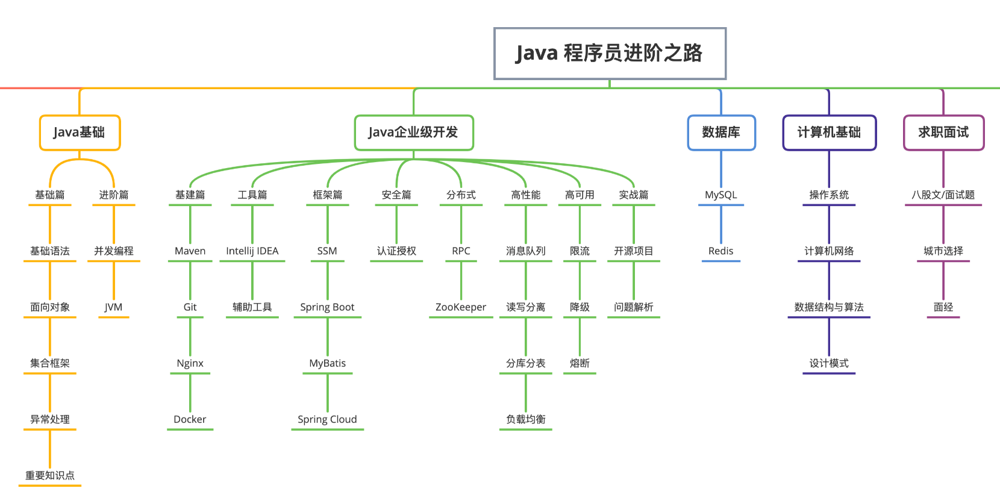

# Java语法基础

## 控制语句
**循环标签**：只能用于标识循环代码块，只能在循环（`for`、`while`、`do-while`）的上一行定义，格式为`标签名:`
- break和 continue只中断当前循环
- `break 标签名`：退出该标签所标识的循环，无论有多少个嵌套循环
- `continue 标签名`：中断标签所标识循环的本次循环，继续下次循环
```JAVA
outerLoop:
for (int i = 0; i < 3; i++) {
    innerLoop:
    for (int j = 0; j < 3; j++) {
        if (i == 1 && j == 1) {
            continue outerLoop; D
        }
        System.out.println("i: " + i + ", j: " + j);
    }
}
```


```java
outerLoop:
for (int i = 0; i < 3; i++) {
    innerLoop:
    for (int j = 0; j < 3; j++) {
        if (i == 1 && j == 1) {
            break outerLoop; 
        }
        System.out.println("i: " + i + ", j: " + j);
    }
}
```

**switch**：用来判断变量与多个值之间的相等性
- 变量的类型可以是：
  - 部分基本数据类型：byte、short、char、int。
  - String：字符串类型。
  - 枚举类型：自定义的枚举类型。
  - 包装类：如 Byte、Short、Character、Integer。
- 不支持浮点float、double，整形long

```JAVA
switch(变量) {    
    case 可选值1:    
    // 可选值1匹配后执行的代码;    
    break;  // 该关键字是可选项，匹配可选值1后退出，否则继续匹配
    case 可选值2:    
    // 可选值2匹配后执行的代码;    
    break; // 该关键字是可选项
    ......
    default: // 该关键字是可选项
    // 所有可选值都不匹配后执行的代码
}
```
## 变量

**变量的类型** = 基本数据类型 + 引用
- 引用类型可以是数组、类、接口，指向对象、数组、`null`；引用只能进行赋值操作，不能用于计算
- 变量声明：类型+变量名，将指定数量的内存单元标识为变量名
- 初始化：在变量名标识的内存单元中存储二进制数
- 存储位置：
  - 成员变量：引用指向的对象或数组存储在堆中，其实例域未显式初始化时赋予默认值（引用类型默认`null`）
  - 局部变量：存储在栈中，不是对象或数组的实例域，在使用前必须显式初始化
  - 静态变量：未显式初始化时赋予默认值

```java
class Solution{
    int i;//默认0
    int f(){
        int[] nums = new int[3];//默认{0,0,0} 
    }
}
```

---

**boolean**
- 不能与其它类型发生类型转换
- 值域为true、false，不能写入其它类型的值

---
**数字类基本数据类型**
- 存储使用二进制数，存储与显示分离，数字变量的值可翻译为二进制0b、八进制0、十六进制0x、十进制
  - 十六进制下一个字符代表4bit，一个byte使用两个十六进制字符表示
- 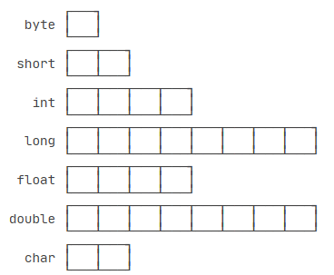
- 字面量
  - 200：int
  - 200L/l：long 
  - 1.1F/f：单精度浮点数
  - 1.1、1.1D/d：双精度浮点数

---

**类型转换**
- 类型转换时需判断是否发生数据丢失或者精度损失；不会发生数据丢失或精度损失时，编译器完成自动类型转换，发生数据丢失和精度损失时，必须显式类型转换
  - 浮点数转整型一定发生精度损失
  - double转float一定发生精度损失
  - 大数类型转小数类型时可能发生数据丢失
- 浮点数转整型时，向下取整，直接丢弃小数部分；`Math.round()`工具类提供四舍五入
- 不会发生数据丢失时，即使是大数转小数，也可以自动类型转换
  - `byte b=50`，50在byte的取值范围内，允许自动类型转换
  - `short n = 0xFFFF_FFFF`，整型使用二进制补码，该值为-1；
  - `short n = (int)0xFFF_FFFF`必须显式类型转换，截断高位，保留低位，结果仍为-1；
- `float f=3.14`不能自动类型转换，不同于整型的规则，double类型，不能自动转换为float类型，无论值的大小，必须显式类型转换

---

**char**
- UTF-16编码，占**2字节**
- 单引号包裹char：`char c = 'A'`。双引号包裹字符串字面量

**int与char的类型转换**
- int只能显式类型转换为char，输出该整型在UTF-16对应的字符
```JAVA
char c=(char)65;
System.out.println(c);//输出字符A
```
- char可以自动类型转换为int，输出在UTF-16中的编码，在输出数字时，也会输出编码，此时应使用`Character.getNumericValue()`或`Character.digit()`
```JAVA
int n='1';
System.out.println(n);// 输出49

int n=Character.getNumericValue('1');
System.out.println(n);// 输出1

n=Character.digit('F',16);
System.out.println(n);// 输出15
```
- `Integer.toString()` 方法+String 的 `charAt()` 方法转成 char
```JAVA
System.out.println(Integer.toString(12).charAt(1));//输出2
```
- `Character.forDigit(int digit, int radix)`，对应数字在指定进制下的字符
  - digit：要转换的数字（在给定的基数下，一个0到radix-1之间的整数）
  - radix：基数（进制），必须在 Character.MIN_RADIX（2）和 Character.MAX_RADIX（36）之间
```JAVA
char value_char = Character.forDigit(12 , 16);
System.out.println(value_char );//输出c
```

## **运算**

**关系运算**返回boolean

**逻辑运算**返回boolean：`&&`、`||`
- 采用短路方式从左往右运算：`x != 0 && 1/x > x+y`避免产生0除异常
- `&& `的优先级高于 `||`：`a && b || c && d`等价于`(a && b) || (c && d)`

**三元操作符**
- `条件 ? 表达式1 : 表达式2`：如果条件为真，则返回表达式1的值，否则返回表达式2的值

**位运算**：按二进制位进行运算
- `&`按位与
- `|`按位或
- `^`按位异或:操作数不同时值为1
- `~`按位取反
- `>>`带符号右移：使用符号位填充高位
- `>>>`无符号右移：使用0填充高位
- `<<`左移：使用0填充低位；

---

**取模和取余**
- 取余使用符号%，取模采用函数`Math.floorMod()`；，表现不同
- 在计算商时，都是正数时表现相同，有负数时表现不同，取余向0取整，取模向负无穷取整，得到商后再与被除数相减得到余数或模数。
```JAVA

// % 运算符的计算方式
public static int remainder(int a, int b) {
    return a - (a / b) * b;
    // 注意：这里的除法是整数除法，向0取整
}

// Math.floorMod 的计算方式
public static int floorMod(int a, int b) {
    return a - Math.floorDiv(a, b) * b;
    // 注意：Math.floorDiv 向负无穷取整
}
```

## 注释

**单行注释**
- 阿里巴巴的开发规约要求不能使用行尾注释
```JAVA
public void method() {
    int age = 18; //行尾注释是不规范的
    //应在被解释的单行代码上另起一行
    char male='男';
}
```

**多行注释**：阿里巴巴的开发规约要求方法内部多行注释使用/**/注释。注意与代码对齐

```JAVA
/*
age 用于表示年纪
name 用于表示姓名
*/
int age = 18;
String name = "沉默王二";
```

**文档注释**
- 在类、字段和方法上使用/***/标注文档注释，使用`javadoc Demo.java -encoding utf-8`命令生成文档，打开index.html网页即可
- javadoc 命令只能为 public 和 protected 修饰的字段、方法和类生成文档。default 和 private 修饰的字段和方法的注释将会被忽略掉；如果类不是 public 的话，javadoc 会执行失败。
- 文档注释中可以插入@注解
  - @see 引用其他类
  - @version 版本号
  - @param 参数标识符
  - @author 作者标识符
  - @deprecated 已废弃标识符


**注释规约**
- **类、字段、方法必须使用文档注释**，文档注释在 IDE 编辑窗口中可以悬浮提示，提高编码效率。
- **所有抽象方法必须使用文档注释**，说明**返回值、参数、 异常说明、方法功能**
- **为枚举的每一个字段添加文档注释，说明其具体用途**
- **所有的类都必须添加创建者和创建日期。**
- 在IDEA的「File and Code Templates」中设置类、接口、枚举的自动生成模板

```JAVA
#if (${PACKAGE_NAME} && ${PACKAGE_NAME} != "")package ${PACKAGE_NAME};

#end
#parse("File Header.java")

/**
 * ${Description} 
 * @author TianXiaoYao
 * @version 1.0
 * @since ${YEAR}-${MONTH}-${DAY} 
 */ 
public class ${NAME} {
}

```
## 断言

assert断言，方便调试程序，并不是发布程序的组成部分

默认情况下，断言是关闭的，可以在命令行运行 Java 程序的时候加上 -ea 参数打开断言


## Java命名规范

# 面向对象编程

面向对象三大特征：**封装、继承、多态**

## 类相关关键字

### this和super关键字

**this关键字**
- 使用this.字段名解决**参数名和实例域名冲突**；
- 显式调用本类的方法
- **在构造器的第一行**使用this(参数列表)调用本类的其他构造器
- 在方法或者构造器中作为参数，以便**在多个类中使用同一个对象**
- 作为方法的返回值完成**链式调用**

**super关键字**
- 父类和子类拥有同名字段时，父类字段被隐藏，使用super访问父类对象的实例域
- 父类和子类拥有同名方法时，在重写时使用super调用父类方法
- 子类使用super(参数列表)调用父类的构造器，即使在第一行未显式调用super，编译器也会插入以调用父类的无参构造器。


### static关键字

**静态变量**：用static修饰的字段，属于类而不属于任何一个类实例，主要目的是**节省内存**，仅在类加载阶段被初始化一次，**被所有类实例共享**

**静态方法**：无需创建对象，直接通过“类名.静态方法名”调用，避免创建对象的冗余代码。只能调用静态方法或静态变量。

**静态代码块**：被static修饰的代码块，`static{...}`。在类加载阶段、main方法执行前执行，常用于读取配置文件到内存、初始化复杂的静态变量。一个类中的多个静态代码块按顺序执行。

**静态内部类**：内部类声明为static，（外部类不能被static），只能访问外部类的static成员。
- 使用静态内部类实现**延迟加载且线程安全的单例模式**。
  - 线程安全：JVM在类初始化阶段会执行 `<clinit>()` 方法（由编译器自动生成，包含所有类和接口的静态变量赋值和静态代码块），并且JVM会确保这个 `<clinit>()` 方法在多线程环境下只被一个线程执行一次
  - 延迟加载：静态字段所属类在类加载时被执行，静态内部类的延迟加载导致静态字段的延迟执行，其初始化被延迟到初次使用时。

```JAVA
public class Singleton {
    private Singleton() {}

    //即使内部类声明为private，外部类也能访问内部类的所有成员
    private static class SingletonHolder {
        //二级权限控制依然生效，即使更改为public，也只有Singleton外部类能访问
        private static final Singleton instance = new Singleton();
    }

    //instance 的创建时机，从“类加载时”延迟到了“getInstance() 方法第一次被调用时”
    public static Singleton getInstance() {
        return SingletonHolder.instance;
    }
}

```

**静态导入**：`import static package.ClassName.*;`可以直接使用类的静态成员，而无需写类名，常用于频繁使用的工具类常量或方法（如Math.PI, Arrays.asList）

### final关键字与不可变对象

**final字段**：**只能被赋值一次**
- **基本数据类型代表不可变**，final static修饰的基本数据类型为常量，命名应全部大写
- **引用代表地址被锁定**，不能指向新对象，但是对象的内部状态可更改。
- 被final修饰的字段应在声明或构造器中初始化

**final方法：禁止重写**


**final类：禁止继承**
- final类和是否可变对象没有关系

**final类 vs 所有方法都是final的非final类**
- **final类彻底杜绝了扩展性**，而**所有方法都是final的非final类**可以被继承，子类可追加其他方法。


**不可变对象**：构造对象后，其字段值无法更改
- 构造不可变对象的五个规则
  1. 声明类为final，避免被继承后破坏不可变性
  2. 所有字段声明为private final
  3. 不提供setter方法
  4. 通过构造器初始化所有字段
  5. getter方法从不返回可变对象字段的引用，而是仅返回副本

### instanceof关键字

object instanceof ClassName；检查对象是否是指定类或其子类的实例（is-a关系），仅用于类型转换前的检查
- 满足关系时返回 true，不满足关系时返回 false
- 对象为null也直接返回false，null可以是任何类型
- **对于不在一条继承连上的对象和类，直接编译报错。instanceof的目的是为了类型转换，如果不在同一条继承链上自然也没有类型转换的必要**、

```JAVA

// 先判断类型
if (obj instanceof String) {
    // 然后强制转换
    String s = (String) obj;
    // 然后才能使用
}

```

JDK 16允许**模式匹配instanceof**，`obj instanceof String s`语句同时做了两件事：
- 判定：判断 `obj` 是否是 `String` 类型。
- 绑定：如果是，则将 `obj` 自动转换为` String`类型，并赋值给新声明的变量 s

```JAVA
if (obj instanceof String s) {}
```

- 变量s的作用域

```JAVA

// 只有在 instanceof 检查通过后，s 才在 && 之后的作用域内可用
if (obj instanceof String s && s.length() > 5) { // 第二个条件中可以直接使用 s
    System.out.println("长字符串: " + s);
}

// 相反，使用 || 时，情况则不同
if (!(obj instanceof String s) || s.length() == 0) { // 这里 s 在 || 之后是不可用的，会导致编译错误
    return;
}
// 修正后的写法，将使用 s 的代码移到 if 块内部
if (obj instanceof String s) {
    if (s.length() == 0) {
        return;
    }
    // ... 使用 s
}
```


## 类的组成

类、接口、注解、枚举开头大写，其他命名开头小写；命名一律驼峰命名。常量命名全大写，使用下划线分隔。包名全小写，

**访问控制**
- 采用分级控制，第一级控制由**public类**或**包可见类**决定，第二级控制由被public、protected、包可见、private修饰的字段、方法、构造器决定
- 内部类无论是public还是private，外部类都能访问内部类的所有字段和方法；其他类对内部类遵从分级控制。
  
| 修饰符       | 类内部 | 同包 | 不同包子类 | 其他包 | 适用对象                  |
|--------------|--------|------|------------|--------|--------------------------|
| `public`     | ✓      | ✓    | ✓          | ✓      | 类、字段、方法、构造器    |
| `protected`  | ✓      | ✓    | ✓          | ✗      | 字段、方法、构造器        |
| **默认**     | ✓      | ✓    | ✗          | ✗      | 类、字段、方法、构造器    |
| `private`    | ✓      | ✗    | ✗          | ✗      | 字段、方法、构造器        |

**构造器Constructor**
- 没写构造器时，编译时提供无参构造器。写了构造器后，想调用无参构造器要自己写，建议有其他构造器就写上无参构造器
- 构造器中可以调用父类构造器、同类构造器、普通方法
  - `this(parameters)`将调用本类的符合参数列表要求的其它构造器
  - `super(parameters)`将调用父类的符合参数列表要求的构造器
  - 同一构造器只能调用一次别的构造器
  - 调用普通方法时需要确定该方法使用的变量已经初始化，通常在构造器的末尾调用普通方法
  - 如果被调用的方法在本类中重写了，那么在构造器中调用该方法将执行父类中未重写的方法
- 构造器规则：
  - 构造器的名字必须和类名一样；
  - 构造器没有返回类型，包括 void；
  - 构造器不能是抽象的（abstract）、静态的（static）、最终的（final）、同步的（synchronized）。
    - 由于构造器不能被子类继承，所以用 final 和 abstract 关键字修饰没有意义；
    - 构造器用于初始化一个对象，所以用 static 关键字修饰没有意义；
    - 多个线程不会同时创建内存地址相同的同一个对象，所以用 synchronized 关键字修饰没有必要。
  - 如果用 void 声明构造方法的话，编译时不会报错，但 Java 会把这个所谓的“构造方法”当成普通方法来处理
- **无参构造器：用于将字段赋值为默认值**

**字段Field**
- 除非字段被`final`修饰，否则必须使用`private`修饰字段
  - static字段代表类状态，非static字段代表对象实例状态
  - 常量使用`public static final`修饰，命名全大写+下划线
- 字段名为`A`时，其更改器名为`setA`、访问器为`getA`或者`isA`（boolean字段）

**方法Method**
  - 方法不依赖对象状态时必须使用static修饰
  - final修饰的方法说明该方法不能被子类重写

**参数parameter**
- 传参时采用值复制
- static方法传参只有显式参数，非static方法传参包括显式参数以及隐式参数`this`，指向调用该方法的对象
- 可变参数列表`(类型...该类型的参数值)`
  - 在方法或构造器内部将args视为数组类型的引用变量进行调用


**局部变量**
- 局部变量的生效范围是整个代码块
- 对该代码块中的子代码块，不允许定义同名局部变量

**重载**
- 方法签名=方法名+参数列表；方法签名相同时，即使返回值类型不同，编译器也会报错

**代码块**
- 代码块可以放在类的任意位置
- static代码块（静态代码块），仅在类加载时执行一次
- 非static代码块（实例代码块），每实例化一个对象按顺序执行一次所有的非static代码块
- 实例代码快在编译器将被放入构造器中，所以看起来像实例代码快先于构造器执行，实际上，构造器总是在创建对象时第一个调用的

**代码块、父类构造器、子类构造器的执行顺序**
- 类加载阶段先执行父类静态域再执行子类静态域，执行new语句时先构造父类对象，再构造子类对象，构造对象时先执行实例域，再执行构造器，具体顺序如下：

1. 父类静态域声明语句和静态代码块（类加载阶段，仅一次）
2. 子类静态域声明语句和静态代码块（类加载阶段，仅一次）
3. main()函数
4. 父类实例域声明语句和实例代码块（对象构造阶段，每次 new 时执行）
5. 父类构造器
6. 子类实例域声明语句和实例代码块
7. 子类构造器


**访问器、更改器** 
- 不管是类内部还是类外部，都不应该直接访问域，域必须通过更改器、访问器方法间接访问
  1. 修改域前必须执行日志、安全校验逻辑
  2. 扩展性：可添加缓存、延迟加载、日志、事务管理、权限校验、性能监控功能
  3. 允许标准JDK动态代理；代理对象持有被代理对象引用，直接访问字段时访问的是代理对象的字段，不是被代理对象的字段。


## 包

使用包名解决类名冲突，java文件层次和包层次保持一致

使用其他类有三种方法
- 完整类名：包名.类名
- import 包名.类名，直接使用类名；或者import 包名.*导入该包的所有类
- import static的语法，它可以导入一个类的静态字段和静态方法：

编译后的.class文件只使用完整类名

编写 class 的时候，编译器会自动帮我们做两个 import 动作：
- 默认自动import当前package的其他class；
- 默认自动import java.lang.*。

## 引用

引用是一个保存了对象内存地址的指针（但不能直接操作地址），引用存储在栈中，对象存储在堆中；

引用随作用域结束自动释放，而对象由垃圾回收器（GC）管理
- 强引用：只要强引用存在，对象不会被 GC 回收。
- 软引用`SoftReference<V>`：在系统将要发生内存溢出异常前，会把这些对象列进回收范围之中进行第二次回收，如果这次回收还没有足够的内存，才会抛出内存溢出异常

  ```java
  SoftReference<LargeData> softRef = new SoftReference<>(new LargeData());
  ```

- 弱引用`WeakReference<V>`：只被弱引用关联的对象只能生存到下一次垃圾收集发生为止
  - 典型用途：`WeakHashMap` 实现反向映射

- 幻象引用`PhantomReference<V>`：
  - 一个对象是否关联虚引用，完全不会对其生存时间构成影响，也无法通过虚引用来取得一个对象实例
  - 为一个对象设置虚引用关联的唯一目的只是为了能在这个对象被收集器回收时收到一个系统通知
  - 用途：跟踪对象被回收的过程（如日志记录）。


## 类的关系

### 接口与实现关系implement


interface接口可以定义常量和方法，其语法规则如下
- 接口中定义的变量会**在编译的时候自动加上 public static final 修饰符**
- 没有使用 private、default 或者 static 关键字修饰的方法是隐式抽象的，**在编译的时候会自动加上 public abstract 修饰符**
  - 从 Java 8 开始，接口中允许有静态方法，**接口中的静态方法无法由（实现了该接口的）类的对象调用，它只能通过接口名来调用**
  - 从 Java 8 开始，接口中允许定义 default 方法， **default 方法为实现该接口而不覆盖该方法的类提供默认实现**
- 接口的抽象方法不能是 private、protected 或者 final，否则编译器都会报错

在接口中定义default方法的必要性
- 一个接口可能有多个实现类，这些类就必须实现接口中定义的抽象方法，否则编译器就会报错。假如我们需要在所有的实现类中追加某个具体的方法，在没有 default 方法的帮助下，我们就必须挨个对实现类进行修改。


### 多态与继承关系Inheritance


Java只支持公有继承，且只有一条继承链
- 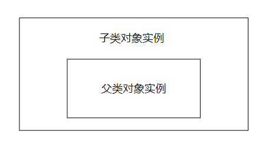


子类构造器
- 子类构造器第一行不是super或者this时，Jvm将插入代码调用父类的无参构造器

**重写**
- 子类重写父类方法必须使用`@Override`标注
- 父类中禁止重写的方法使用`final`修饰，但是该方法可被子类继承使用
  - static、private、final方法都不能重写
  - 重写是为了对象多态性，而静态方法的调用基于引用类型，允许子类定义与父类同名的静态方法，两个静态方法是独立的，可以分别通过Child.a和Parent.a调用
  - 因为可以通过对象调用静态方法，假设父类和子类定义同名的静态方法，引用类型是父类就调用父类的静态方法，即使该引用实际指向子类对象
- 访问权限不能低于父类
- 可以通过`super.方法`保留父类方法逻辑，并额外增加其他逻辑
- 重写必须遵守**里氏替换原则LSP：子类对象应能完全替代父类对象出现在任何场景中，且不破坏程序的逻辑完整性**
- 继承访问器、更改器方法时，因为子类继承了父类的域，应检查访问器、更改器方法是否在子类的域上运算封闭。例如Holiday继承Day，应确保指向Holiday引用不会操控、返回非节假日；


| 检查项                | 合规表现                          | 违规表现                      |
|-----------------------|---------------------------------|------------------------------|
| **返回值范围**        | 子类返回值集合⊆父类返回值集合，**允许子类返回值更改为void**             | 子类返回超集或异常值          |
| **前置条件**          | 父类参数集合⊆子类参数集合          | 子类要求更严参数              |
| **后置条件**          | 子类维护父类的设计意图        | 子类破坏父类状态              |
| **副作用**            | 子类不引入额外副作用             | 子类新增意外操作（如日志）    |
| **异常抛出**          | 子类不抛出比父类更宽泛的异常     | 子类新增未经声明的异常        |


#### 抽象类

抽象类**命名以Abstract或者Base开头**

**抽象类**：使用abstract修饰的类，其语法规则如下：
- 抽象类可以声明域、abstract方法、非abstract修饰的方法
- 如果一个类有abstract方法，就必须使用abstract修饰
- 实现接口或继承抽象类后，还有没有实现的方法时，必须使用abstract修饰
- 抽象类可以没有抽象方法，这样做的目的：
  - 限制实例化
  - 将类标记为同一类型，例如ArrayList、LinkedList 均继承自 无抽象方法的AbstractList
- 抽象类配合模板方法模式，例如HttpServlet是抽象类，实现 service() 方法作为算法骨架，仅要求子类实现doGet()/doPost()方法

抽象类的应用场景是生成类族
- 希望一些通用的功能被多个子类复用
- 需要在抽象类中定义好 API，然后在子类中扩展实现
---


#### 虚方法
**虚方法（Virtual Method）** 是实现**多态** 的核心机制。其行为由JVM的动态绑定实现，与静态方法/私有方法的静态绑定形成对比
- **虚方法**：可被子类重写的非`private`、非`static`、非`final`的方法
  - Java 8+为接口提供**default方法**，该方法是**是虚方法**
- **动态绑定**：在运行时根据对象的**实际类型**而非引用类型决定调用哪个方法。


JVM通过**虚方法表**(Virtual Method Table)实现动态绑定
- **虚方法表**在类加载时存储到方法区，存储该类所有虚方法的**实际内存入口地址**
- 调用虚方法时，JVM通过**对象->实际类->虚方法表->实际内存入口地址**执行目标方法代码
- 子类虚方法表会复制父类表，并替换重写方法的地址
- 除非能确定具体类型，否则虚方法增加JIT编译器的内联难度
  - 通过**final**修饰符**标记不可重写的方法，解除虚方法特性**
  - 通过**final**修饰符**标记不可继承类，所有方法自动解除虚化虚方法特性**


### 依赖关系Dependency

依赖是非常弱的关系，通常体现在参数传递、返回值、局部变量，因此依赖方只是在某些方法中短暂的依赖其他类，没有明确的结构关系

### 关联关系Association

对象持有其他对象的引用，可细分为双向关联、单向关联、自关联；或者一对一关联、一对多关联、多对多关联
- 引用作为字段，在代码块、构造函数或更改器中初始化
- 关联是结构性的关系，在对象的整个生命周期关联其他对象


### 聚合关系Aggregation
聚合是描述“整体-部分”结构的特殊一对多关联

约束条件
1. 整体由部分构成
2. 部分可以单独实例化，即部分的生命周期可以不被整体控制


### 组合关系Composition

组合描述“整体-部分”结构，是具有更强约束条件的聚合关系
- 整体：负责创建、销毁部分，并且整合部分为其他类提供服务
- 部分：不能单独实例化，只能作为整体的私有变量由整体初始化


### 内部类

**成员内部类**：**成员内部类对象依附于一个外部类对象**，所以不常用，非常不方便
- **成员内部类可以无限制访问外部类的所有成员属性**

```JAVA
public class Wanger {
    int age = 18;
    private String name = "沉默王二";
    static double money = 1;

    class Wangxiaoer {
        int age = 81;
        
        public void print() {
            System.out.println(name);
            System.out.println(money);
        }
    }
}
```
- **外部类访问内部类必须先创建一个成员内部类的对象，再通过这个对象来访问**
```JAVA
public class Wanger {
    int age = 18;
    private String name = "沉默王二";
    static double money = 1;

    public Wanger () {
        new Wangxiaoer().print();
    }

    class Wangxiaoer {
        int age = 81;

        public void print() {
            System.out.println(name);
            System.out.println(money);
        }
    }
}
```
- 外部类中的静态方法中，需要先创建外部类对象，再通过该对象创建内部类对象
```JAVA
public class Wanger {
    int age = 18;
    private String name = "沉默王二";
    static double money = 1;

    public Wanger () {
        new Wangxiaoer().print();
    }

    public static void main(String[] args) {
        Wanger wanger = new Wanger();
        Wangxiaoer xiaoer = wanger.new Wangxiaoer();
        xiaoer.print();
    }  

    class Wangxiaoer {
        int age = 81;

        public void print() {
            System.out.println(name);
            System.out.println(money);
        }
    }
}
``` 

**局部内部类**；定义在一个方法或者一个作用域里面的类，所以局部内部类的生命周期仅限于作用域内。
- 犹豫仅限于作用域中，所以不能被权限修饰符修饰
```JAVA
public class Wangsan {
    public Wangsan print() {
        class Wangxiaosan extends Wangsan{
            private int age = 18;
        }
        return new Wangxiaosan();
    }
}
```

**匿名内部类**：常用于方法参数，无需构造器，名字由编译器自动命名
```JAVA
public class ThreadDemo {
    public static void main(String[] args) {
        Thread t = new Thread(new Runnable() {
            @Override
            public void run() {
                System.out.println(Thread.currentThread().getName());
            }
        });
        t.start();
    }
}
```
**静态内部类**

[参考static关键字](#static关键字)


### 枚举

**本质**：enum不是语法糖，而是受严格约束的类；编译后继承自java.lang.Enum，其枚举值是该类的public static final常量实例对象

**约束**
- 隐式final：**枚举类不能被继承**。
- 实例受控：枚举值在类加载时通过静态代码块初始化，**无法在运行时通过new创建新实例**，保证了全局唯一性。
- **单例性：每个枚举常量在JVM中都是唯一的单例对象**

从本质延伸的用法

| 特性 | 实现机制与设计考量 |
| :--- | :--- |
| **比较操作** | 应使用 **`==`** 而非 `equals()` 进行比较。<br>• **机制**：`==`比较对象引用。由于枚举实例是单例，引用必然相同，且能避免`NullPointerException`。<br>• **性能**：`==`是编译期检查，比`equals()`方法调用更高效。 |
| **扩展信息** | 可以为枚举添加字段、构造方法和方法，使其成为“全功能类”。<br>• **实现**：通过私有构造器为每个枚举实例绑定自定义数据（如`TENNIS("网球")`）。 |
| **集合支持** | 有专属的高效集合类`EnumSet`和`EnumMap`。<br>• **`EnumSet`**：内部用位向量实现，极其紧凑高效，用于替代基于整型的位标志。<br>• **`EnumMap`**：内部以数组实现，键为枚举的序数（`ordinal`），访问速度比`HashMap`更快。 |
| **Switch支持** | 可用于`switch`语句，因其本质是编译期常量，匹配效率高。 |

**枚举实现单例模式**
- JVM确保枚举对象只有一个
- 类加载机制保证初始化线程安全。
- Enum类特殊处理，防止反序列化创建新实例。
- 代码极度简洁：无需担心反射攻击和序列化问题。

```JAVA
// 传统双重检查锁实现（复杂且需注意volatile、synchronized）
public class Singleton {
    private volatile static Singleton instance;
    private Singleton() {}
    public static Singleton getInstance() {
        if (instance == null) {
            synchronized (Singleton.class) {
                if (instance == null) {
                    instance = new Singleton();
                }
            }
        }
        return instance;
    }
}

// 枚举实现（推荐）
public enum EasySingleton {
    INSTANCE; // 单例实例
    // 可以在此添加方法
    public void doSomething() { ... }
}
```
1. 比较操作：== vs equals()
```JAVA
public class EnumComparisonDemo {
    public enum Status { OPEN, PENDING, CLOSED }

    public static void main(String[] args) {
        Status s1 = Status.OPEN;
        Status s2 = Status.OPEN;
        Status s3 = Status.CLOSED;
        Status nullEnum = null;

        // 正确方式：使用 == (推荐)
        System.out.println("s1 == s2: " + (s1 == s2)); // true，同一实例
        System.out.println("s1 == s3: " + (s1 == s3)); // false，不同实例
        
        // 关键点1：== 可安全处理 null
        System.out.println("null == null: " + (nullEnum == null)); // true，不会NPE
        
        // 使用 equals() (不推荐)
        System.out.println("s1.equals(s2): " + s1.equals(s2)); // true
        System.out.println("s1.equals(s3): " + s1.equals(s3)); // false
        
        // 关键点2：equals() 在变量为 null 时可能 NPE
        // System.out.println(nullEnum.equals(null)); // 此行会抛出 NullPointerException!
    }
}
```

2.将枚举扩展为带有字段和方法的“全功能类”
```JAVA
public class SmartEnumDemo {
    // 枚举可拥有字段、构造器和方法
    public enum Planet {
        // 枚举实例定义，相当于调用私有构造器
        MERCURY("水星", 3.303e+23),
        VENUS("金星", 4.869e+24),
        EARTH("地球", 5.976e+24);
        
        // 1. 私有字段 (可任意复杂)
        private final String chineseName;
        private final double mass; // 单位:千克
        
        // 2. 私有构造器 (默认就是private)
        Planet(String chineseName, double mass) {
            this.chineseName = chineseName;
            this.mass = mass;
        }
        
        // 3. 公共访问方法
        public String getChineseName() { return chineseName; }
        public double getMass() { return mass; }
        
        // 4. 自定义行为方法
        public double massOnEarth(double earthWeight) {
            // 根据重力比例计算在其他行星上的重量
            return earthWeight * (this.mass / EARTH.mass);
        }
        
        // 5. 可覆盖父类Enum的方法
        @Override
        public String toString() {
            return this.name() + "(" + chineseName + ")";
        }
    }
    
    public static void main(String[] args) {
        Planet earth = Planet.EARTH;
        System.out.println(earth); // 输出: EARTH(地球)
        System.out.println("质量: " + earth.getMass() + " kg");
        System.out.println("60kg在地球相当于" + 
                          earth.massOnEarth(60) + "kg在此星");
        
        // 遍历所有枚举实例
        for (Planet p : Planet.values()) {
            System.out.println(p.getChineseName());
        }
    }
}

```
3. EnumSet 与 EnumMap
```JAVA
import java.util.EnumMap;
import java.util.EnumSet;

public class EnumCollectionDemo {
    public enum Day { MONDAY, TUESDAY, WEDNESDAY, THURSDAY, FRIDAY, SATURDAY, SUNDAY }
    
    public static void main(String[] args) {
        System.out.println("=== EnumSet 演示 (替代位标志) ===");
        // 创建空集合
        EnumSet<Day> workdays = EnumSet.noneOf(Day.class);
        workdays.add(Day.MONDAY);
        workdays.addAll(EnumSet.range(Day.TUESDAY, Day.FRIDAY)); // 添加区间
        System.out.println("工作日: " + workdays);
        
        // 创建包含所有元素的集合
        EnumSet<Day> allDays = EnumSet.allOf(Day.class);
        // 取补集得到周末
        EnumSet<Day> weekend = EnumSet.complementOf(workdays);
        System.out.println("周末: " + weekend);
        
        // 关键点：EnumSet内部使用位向量，contains等操作是O(1)且极快
        System.out.println("周一是不是工作日: " + workdays.contains(Day.MONDAY));
        
        System.out.println("\n=== EnumMap 演示 (枚举作为键) ===");
        // 构造需指定枚举类型类
        EnumMap<Day, String> schedule = new EnumMap<>(Day.class);
        schedule.put(Day.MONDAY, "会议");
        schedule.put(Day.WEDNESDAY, "编码");
        schedule.put(Day.FRIDAY, "周报");
        
        // 关键点：内部以有序数组实现，遍历顺序与枚举声明顺序一致
        for (var entry : schedule.entrySet()) {
            System.out.println(entry.getKey() + ": " + entry.getValue());
        }
        
        // 性能：比HashMap更快的访问速度，无哈希冲突
        System.out.println("周三安排: " + schedule.get(Day.WEDNESDAY));
    }
}
```
4. Switch支持
```JAVA
public class EnumSwitchDemo {
    public enum Command { START, PAUSE, STOP, REWIND }
    
    public static void executeCommand(Command cmd) {
        // switch 支持枚举类型
        switch (cmd) {
            // 关键点1：case标签直接使用枚举常量名，无需类前缀
            case START:
                System.out.println("系统启动...");
                break;
            case PAUSE:
                System.out.println("系统暂停");
                break;
            case STOP:
                System.out.println("系统停止");
                break;
            // 关键点2：编译器会检查是否覆盖所有枚举值
            // 如果注释掉REWIND分支，IDE通常会给出警告
            case REWIND:
                System.out.println("系统回退");
                break;
            // 关键点3：default不是必须的，因为枚举值有限且已知
            // 但可用于处理意外的null值
            default:
                System.out.println("未知命令: " + cmd);
        }
    }
    
    public static String getCommandDescription(Command cmd) {
        // Java 12+ 的switch表达式风格，更简洁
        return switch (cmd) {
            case START -> "开始执行";
            case PAUSE -> "暂停执行";
            case STOP -> "停止执行";
            case REWIND -> "回退操作";
            // 无需default，因为所有情况已枚举
        };
    }
    
    public static void main(String[] args) {
        executeCommand(Command.START);
        executeCommand(Command.PAUSE);
        
        System.out.println("STOP描述: " + 
                          getCommandDescription(Command.STOP));
        
        // 关键点4：switch的null值处理
        executeCommand(null); // 触发default分支（如果存在），否则NPE
    }
}
```


## JNI

JNI：调用不同语言编写的代码
- 标准的 Java 类库不支持需求。
- Java需要调用另一种语言已经编写好的代码，如C/C++类库
- 某些运行次数特别多的方法，为了加快性能，需要用更接近硬件的语言（比如汇编）编写。

使用 Java 与本地已编译的代码交互，通常会丧失平台可移植性。JNI 标准至少保证本地代码能工作能在任何 Java 虚拟机实现下。程序不再跨平台，必须在不同的系统环境下重新编译本地语言部分。

native关键字：表示该方法的实现在外部定义，可以用任何语言去实现它，一个 native Method 就是一个 Java 调用非 Java 代码的接口。
- 修饰方法的位置必须在返回类型之前，和其余的方法控制符前后关系不受限制。
- 不能用 abstract 修饰，也没有方法体，也没有左右大括号。
- 返回值可以是任意类型

## 封装、继承、多态（可能需要深入重构）

封装：利用抽象将数据和基于数据的操作封装在一起，使其构成一个不可分割的独立实体。使用封装有 4 大好处：
1. 良好的封装能够减少耦合。
2. 类内部的结构可以自由修改。
3. 可以对成员进行更精确的控制。
4. 隐藏信息，实现细节。

继承：继承不仅大大的减少了代码量，也使得代码结构更加清晰可见。

多态：implements 关键字使 Java 拥有多继承的特性
## JDK重要类
### 字面量null与Optional

`null`是一个特殊字面量，表示**无对象或空引用**
- `null` 不属于任何类型，但可以赋值给所有引用变量
- 枚举变量不能赋值为 `null`，因为枚举值是单例且非空。
- 尽量避免使用null ，因为null既可以表示“无值”，也可表示“未初始化”或“无效状态”
- `null` 与任何对象的引用比较需用 `==`，而非 `equals()`，但是比较对象时需要调用equals()可能会导致NPE

**空指针异常（NullPointerException, NPE）**：对值为`null` 的引用调用方法或访问其字段时，抛出`NPE`异常
- 调用 `null` 对象的方法或字段
- 遍历null数组或null集合时需要访问其大小以判断是否结束遍历，所以必定抛出`NPE`
- 自动拆箱时，若基本类型包装类是`null`，则抛出抛 `NPE`


**Optional**是一个容器类，显示声明返回值可能是null，需要处理，完全避免NPE、文档解释或歧义地返回null；提供链式调用处理返回值。
- Optional应仅用于方法返回值，不应用于字段或方法参数，调用方获取到值后应立即处理并获取实际值
- **创建Optional对象**

| 方法 | 适用场景 | 关键机制与风险 |
| :--- | :--- | :--- |
| **`Optional.of(value)`** | **明确值非`null`时** | 若传入`null`会**立即抛出`NullPointerException`**，用于快速失败。 |
| **`Optional.ofNullable(value)`** | **值可能为`null`时**（最常用） | 安全方法，若值为`null`则返回一个空的`Optional`对象。 |
| **`Optional.empty()`** | 表示一个确定无疑的“空值” | 返回单例的空`Optional`实例。 |

- **判断并消费值**，取代 `if (obj != null)`
  - **isPresent()**
  - **ifPresent(Consumer)**：仅在值存在时执行给定的消费者逻辑，否则什么都不做
  - **ifPresentOrElse(Consumer, Runnable)**（Java 9+）：值存在时执行第一个操作，不存在时执行第二个操作

- 安全获取值，**永远不要直接使用 `get()`**，因为它会在值为空时抛出`NoSuchElementException`。
  - 假设存在方法`String getDefault()`
  - 调用`opt.orElse(getDefault())`时，**无论`opt`是否有值**，`getDefault()`方法都会被执行
  - 调用`opt.orElseGet(() -> getDefault())`，仅在`opt`为空时，`getDefault()`才会被调用。

| 推荐方法 | 行为 | 适用场景 |
| :--- | :--- | :--- |
| **`orElse(T other)`** | 有值返回值，无值返回指定的**默认值**。 | **无论`Optional`是否为空，参数都会被执行求值**。 |
| **`orElseGet(Supplier)`** | 有值返回值，无值则从`Supplier`函数式接口**动态生成**一个默认值。 | 默认值构造成本较高或需要动态计算时使用。**只有为空时，`Supplier`才会被调用**，性能更优。 |
| **`orElseThrow()`** | 有值返回值，无值则抛出指定的异常（默认`NoSuchElementException`）。 | 值缺失是严重错误，需要立即失败并明确告知调用者。 |

- 转换/过滤与链式调用
  - `map(Function)`：如果值存在，就应用`Function`函数对其转换，并将结果包装在新的`Optional`中。如果原`Optional`为空，则直接返回空`Optional`
  - `filter(Predicate)`：如果值存在且满足`Predicate`条件，则返回自身；否则返回空`Optional`。可用于验证规则（如密码长度）。

- 两者常结合使用，形成清晰的数据处理管道：
```java
boolean isValid = Optional.ofNullable(userInput)
        .map(String::trim) // 去除空格
        .filter(s -> s.length() > 5) // 检查长度
        .filter(s -> !s.equals("password")) // 检查是否弱密码
        .isPresent(); // 判断是否通过所有检查
```

### Object：所有类的超类

Object类主要提供六类方法，共11种
- 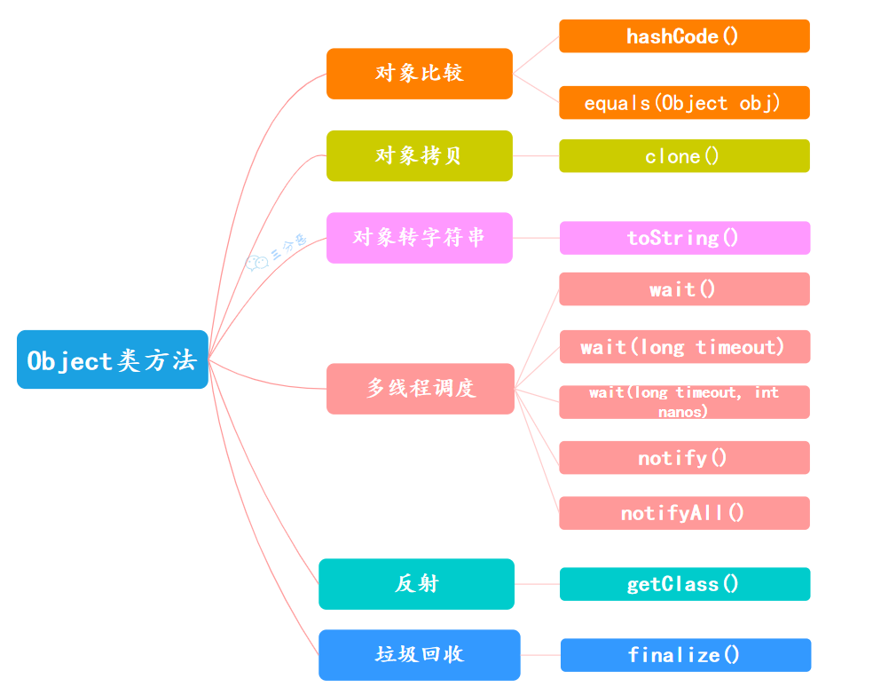

**对象比较**

- `public native int hashCode()` ：native 方法，用于返回对象的哈希码。
  - 按照约定，相等的对象必须具有相等的哈希码。如果重写了 equals 方法，就应该重写 hashCode 方法。可以**使用 `Objects.hash()` 方法来生成哈希码**。

```JAVA
public int hashCode() {
    return Objects.hash(name, age);
}
```

- `public boolean equals(Object obj)`：用于比较 2 个对象的内存地址是否相等。

```JAVA
public boolean equals(Object obj) {
    return (this == obj);
}
```

- 重写equals，**必须同时重写 `hashCode()`**
   1. 先判断是否指向同一个对象
   2. 再判断该对象是否为null
   3. 然后判断两个对象的类型是否能够划为等价类，不能就没必要继续判断
   4. 最后依次判断基本数据类型，对引用字段调用静态方法`Objects.equals`

```JAVA
class Person1 {
    private String name;
    private int age;

    // 省略 gettter 和 setter 方法

    public boolean equals(Object obj) {
        //优化，先判断是否指向同一个对象
        if (this == obj) {
            return true;
        }
        //instanceof语句，参数为空返回false；不是等价类返回false，要求子类遵循里氏替换原则
        if (obj instanceof Person1) {
            Person1 p = (Person1) obj;
            return Objects.equals(this.name, p.getName()) && this.age == p.getAge();
        }
        return false;
    }
}
```

---

**对象拷贝**

- `protected native Object clone() throws CloneNotSupportedException`：naitive 方法，返回此对象的一个副本。默认实现只做浅拷贝，且类必须实现 Cloneable 接口。
  - Object 本身没有实现 Cloneable 接口，所以在不重写 clone 方法的情况下直接直接调用该方法会发生 `CloneNotSupportedException` 异常
- 调用前提：
  - 类实现 `Cloneable` 标记接口
  - 重写 `clone()` 方法为 `public`
- 数组可直接调用clone方法，前提是数组类型能正常调用clone方法

---

**对象转字符串**

使用Lombok的@Data注解，将自动生成toString方法
`toString()`
   - 返回对象的字符串表示，通常用于调试或日志输出
   - 默认实现：打印对象的类名@哈希码（十六进制）
   - 数组对象没有重写toString方法，使用静态方法**`Arrays.toString()`**返回String
```java
public String toString() {
    return getClass().getName() + "@" + Integer.toHexString(hashCode());
}
```

---

**多线程调度**

`wait(), notify(), notifyAll()`

---

**反射**

`public final native Class<?> getClass()`：**所有反射API的入口**

---

**垃圾回收**

`finalize()`，已废弃。

---
### 数组

数组，本质是对象，存储固定数量的同类型元素；初始化后，其所有元素将按照对象的默认初始化方式赋予默认值

**遍历方式**：for循环、for-each 循环

```JAVA
for (int element : anOtherArray) {
    System.out.println(element);
}
```
**可变参数与数组**
- `void varargsMethod(String... varargs) {}`**可变参数可传入0-N个参数**，用数组实现
- 可以传入String数组，也可以传入多个字符串

**List与数组**
- List封装数组所没有的操作，因此常需要**将数组转换为List**
```JAVA
public static <T> List<T> asList(T... a) {
    return new ArrayList<>(a);
}
```
- Arrays.asList传入int[]时，因为T只能是对象，所以编译器只能将T推断为int[]，而不是单个元素，返回`List<int[]>`，与List<Integer>不匹配
```JAVA
List<Integer> list= Arrays.asList(1,2);
System.out.println(list.toString());

Integer[] anArray1 = new Integer[]{1,2,3};
list=Arrays.asList(anArray1);
System.out.println(list.toString());

//错误写法
int[] anArray = new int[]{1,2,3,4};
list=Arrays.asList(anArray);

//正确写法
List = Arrays.stream(anArray).boxed().collect(Collectors.toList());
```
- **同名陷阱**，观察上述源码，asList返回的ArrayList不是util包中的ArrayList，而是私有内部类，是对**原始数组的视图**，和视图定义一样，它有以下特性
  - 它是**固定长度**的：因为它只是包装了你传入的数组，并没有自己独立可变的后台数组（如 java.util.ArrayList 中的 elementData）。
  - 不支持结构修改：调用 add(), remove(), clear() 等方法会抛出 UnsupportedOperationException 异常。
  - 修改会“透传”：因为你得到的是一个“视图”，所以**通过 set() 方法修改列表元素，会直接修改你传入的原始数组**。
- java.util.ArrayList提供构造器转换该私有内部类

```JAVA
new ArrayList<>(Arrays.asList(anArray));
```

**流与数组**
```JAVA
String[] anArray = new String[] {"沉默王二", "一枚有趣的程序员", "好好珍重他"};
Stream<String> aStream = Arrays.stream(anArray);
```


**数组的排序与查找**
- Arrays.sort()
  - 要求传入的对象实现Comparable接口的compareTo()方法
  - 传入基本数据类型的数组将按照升序排序
  - 指定范围并反序排序

```JAVA
String[] yetAnotherArray = new String[] {"A", "E", "Z", "B", "C"};
Arrays.sort(yetAnotherArray, 1, 3,
                Comparator.comparing(String::toString).reversed());
```

查找
- 对已排序数组采用二分查找
```JAVA
int[] anArray = new int[] {1, 2, 3, 4, 5};
int index = Arrays.binarySearch(anArray, 4);
```

**数组复制**
- `Arrays.copyOfRange(value, offset, offset+count);`
### 多维数组与数组打印

n维数组是元素类型为n-1维数组的数组

数组在java中往往指对象，继承了祖先类 Object 的所有方法，却**并未定义数组类**，其toString方法如下
```JAVA
public String toString() {
    return getClass().getName() + "@" + Integer.toHexString(hashCode());
}
```
**Arrays.toString()**：**可以将任意类型的数组转成字符串，包括基本类型数组和引用类型数组**
- 对引用类型调用其toString()方法，因此**多维数组需要使用`Arrays.deepToString()`打印数组**


什么是POJO？
- 与SpringBean不同，POJO结构简单、独立，不依赖特定环境，他它通常只包含以下组成
- 私有字段（Private Fields）
- 公开的Getter/Setter方法
- 可能包含equals()、hashCode()和toString()等Object类方法的重写

区分定义POJO、SpringBean
- SpringBean是由Spring IoC容器管理的对象
- **POJO主要作为数据模型或数据传输对象**使用：
  - Entity（实体）：对应数据库表，如上面的User类。
  - DTO（Data Transfer Object）：用于层间（如Controller和Service之间）数据传输，避免暴露内部实体细节。
  - VO（Value Object）：值对象，通常用于业务层内部传递数据。
  - Form Bean：封装前端表单数据。

**阿里巴巴Java 开发手册强制POJO重写`toString()`方法**，如果继承其他POJO类，则需要在**重写的第一行调用`super.toString()`**
stream流打印数组
```JAVA
Arrays.asList(cmowers).stream().forEach(s -> System.out.println(s));

Stream.of(cmowers).forEach(System.out::println);

Arrays.stream(cmowers).forEach(System.out::println);
```
### 字符串

```java

// 字符串不能被继承
// 可序列化
// 实现了 Comparable 接口，可以通过 `compareTo()` 方法完成排序
public final class String
    implements java.io.Serializable, Comparable<String>, CharSequence {
}
```


#### 字符串的不可变

不可变对象
- 被final修饰，禁止子类继承String改变其不可变性
- 其字段char[]被final修饰，无法通过重新赋值更换整个value数组
- 不提供public的setter方法修改value数组，所有看似修改字符串的操作都是返回新的字符串对象
- 构造器传入外部数组时会创建新的副本

字符串不可变的用途
- 无法篡改String提供安全性，可用于密码用户名等敏感信息
- 字符串常量池，相同内容的字符串共享同一个对象
- 字符串的不可变性决定哈希值不会变更，每个字符串拥有一个hash字段记录哈希值，由于相同内容的字符串是共享的，因此**相同内容的字符串不会再次计算哈希值**，且哈希值的计算惰性推迟到调用hashCode()时；

#### 字符串常量池

字符串常量池位于堆中，java7+仅存储引用，字符串对象与其他对象相同存储在堆中，同样会被GC

- `String s = new String("二哥");`：**该语句创建两个对象，先创建一个"二哥"字符串然后将引用保存在字符串常量池中，然后再在堆中复制一个字符串并赋值给引用s**
- 因此直接通过双引号获取字符串引用，而不要使用new
- 因此，new获得的String对象即使内容相同，也不是同一个对象，导致极大的空间浪费
```JAVA
String s1=new String("er");
String s2="er";
//输出false
System.out.println(s1==s2);
```


1. **使用双引号创建的字符串，其引用存储在字符串常量池中** 
2. **使用 new 关键字创建的字符串对象会先从字符串常量池中找，如果没找到就创建一个，然后再在堆中创建一个字符串对象副本；如果找到了，就直接在堆中创建字符串对象**
3. **没有使用双引号声明的字符串对象可以调用intern，将其引用放入字符串常量池**


字符串常量池，**本质是一个固定大小的StringTable**（数组+链表实现的哈希表），java7+环境下**保存字符串引用**，**常量池仅保存引用，实际对象位于堆中**，其中的字符串不再被引用时可被正常回收，可以通过 -XX:StringTableSize 来调整其大小
- 可调整大小的是数组长度，随着常量池中元素的增加，哈希冲突严重，链表长度增加，导致常量池的性能大幅下降。


字符串常量池在java7+前后位置的变化参考JVM笔记

#### intern

java8后，`intern()`方法的行为发生改变，**如果对象在堆中已经创建了，字符串常量池中就不需要再创建新的对象了，而是直接保存堆中对象的引用**，分析下面的示例代码

```JAVA
//首先创建"二哥三妹"字符串，常量池保存其引用，然后new复制一个新的对象赋值给s1，再将s1放入常量池，由于已经存在了，所以返回常量池中的引用，因此返回false
String s1 = new String("二哥三妹");
String s2 = s1.intern();
System.out.println(s1 == s2);

//关键在于+操作符，在编译器转换为new StringBuilder().append("二哥").append("三妹").toString();内部实现使用new
// 因此常量池中仅存储"二哥"、"三妹"，不会存储"二哥三妹"引用，s1是堆中的"二哥三妹"对象
// 将s1.intern()将仅在常量池中保存引用，不会创建新的对象，s2将复制该引用，因此结果为true
String s1 = new String("二哥") + new String("三妹");
String s2 = s1.intern();
System.out.println(s1 == s2);

```

ps：对于`"二哥"+"三妹"`，编译期就直接优化为"二哥三妹"，而不会调用StringBuilder

#### StringBuilder & StringBuffer

StringBuilder & StringBuffer基本上完全一样，StringBuffer使用synchronized关键字同步，StringBuilder只在单线程环境中使用，**多线程环境中修改字符串可以使用 ThreadLocal 来避免多线程冲突**，因此StringBuffer不再使用

**+操作符在编译器优化为链式调用StringBuilder的append()和toString()方法**

StringBuilder内部实现
- 创建StringBuilder对象时，初始化内部char[]类型的value大小为16，每次扩容时新容量为旧容量的两倍加上 2

StringBuilder提供reverse方法，反转整个字符串
#### 判断字符串相等


```java
public boolean equals(Object anObject) {
    // 检查是否是同一个对象的引用，如果是，直接返回 true
    if (this == anObject) {
        return true;
    }
    // 检查 anObject 是否是 String 类的实例
    if (anObject instanceof String) {
        String anotherString = (String) anObject; // 将 anObject 强制转换为 String 类型
        int n = value.length; // 获取当前字符串的长度
        // 检查两个字符串长度是否相等
        if (n == anotherString.value.length) {
            char v1[] = value; // 当前字符串的字符数组
            char v2[] = anotherString.value; // 另一个字符串的字符数组
            int i = 0; // 用于遍历字符数组的索引
            // 遍历比较两个字符串的每个字符
            while (n-- != 0) {
                // 如果在任何位置字符不同，则返回 false
                if (v1[i] != v2[i])
                    return false;
                i++;
            }
            // 所有字符都相同，返回 true
            return true;
        }
    }
    // 如果 anObject 不是 String 类型或长度不等，则返回 false
    return false;
}
```

除.equals方法，还可以考虑Objects.equals()和String 类的 .contentEquals()
- Objects.equals()避免判空逻辑
- **String 类的 .contentEquals()**可以将字符串与任何的字符序列（StringBuffer、StringBuilder、String、CharSequence）进行比较。
#### Java9+对String的底层优化

Java9之前，String底层使用char数组实现，9+改为byte数组实现，并引入coder表示编码；String占用内存减少一半；代价是引入编码检测的开销；
- Latin1是一种单字节字符集，每个字符占用一个字节，**内存占用减少后，GC次数随之减少**
- char类型数据在JVM中占用两个字节，使用UTF-16编码
- **coder字段根据字符串的内容自动设置为LATIN1或UTF16**
```java
public final class String
    implements java.io.Serializable, Comparable<String>, CharSequence {
    @Stable
    private final byte[] value;
    private final byte coder;
    private int hash;
}
```


#### String 类的 hashCode 方法


每一个String对象有一个延迟计算的hash值，极大概率不会重复，因此String非常适合作为HashMap的键值
- String采用**31 倍哈希法**：将字符串中的每个字符乘以一个固定的质数 31 的幂次方，并将它们相加得到哈希值$$H(s) = s[0] \times 31^{(n-1)} + s[1]  \times  31^{(n-2)} + … + s[n-1]  \times  31^{0}$$
```java
private int hash; // 缓存字符串的哈希码

public int hashCode() {
    int h = hash; // 从缓存中获取哈希码
    // 如果哈希码未被计算过（即为 0）且字符串不为空，则计算哈希码
    if (h == 0 && value.length > 0) {
        char val[] = value; // 获取字符串的字符数组

        // 遍历字符串的每个字符来计算哈希码
        for (int i = 0; i < value.length; i++) {
            h = 31 * h + val[i]; // 使用 31 作为乘法因子
        }
        hash = h; // 缓存计算后的哈希码
    }
    return h; // 返回哈希码
}
```


#### substring 方法

String 类中还有一个方法比较常用 substring，用来截取字符串的，来看源码。

```java
public String substring(int beginIndex) {
    // 检查起始索引是否小于 0，如果是，则抛出 StringIndexOutOfBoundsException 异常
    if (beginIndex < 0) {
        throw new StringIndexOutOfBoundsException(beginIndex);
    }
    // 计算子字符串的长度
    int subLen = value.length - beginIndex;
    // 检查子字符串长度是否为负数，如果是，则抛出 StringIndexOutOfBoundsException 异常
    if (subLen < 0) {
        throw new StringIndexOutOfBoundsException(subLen);
    }
    // 如果起始索引为 0，则返回原字符串；否则，创建并返回新的字符串
    return (beginIndex == 0) ? this : new String(value, beginIndex, subLen);
}
```

`substring` 方法首先检查参数的有效性，如果参数无效，则抛出 `StringIndexOutOfBoundsException` 异常。接下来，方法根据参数计算子字符串的长度。如果子字符串长度小于零，也会抛出 `StringIndexOutOfBoundsException` 异常。

如果 `beginIndex` 为 0，说明子串与原字符串相同，直接返回原字符串。否则，使用 `value` 数组（原字符串的字符数组）的一部分 new 一个新的 String 对象并返回。

substring 方法示例：

- 提取字符串中的一段子串：
```java
String str = “Hello, world!“;
String subStr = str.substring(7, 12);  // 从第7个字符（包括）提取到第12个字符（不包括）
System.out.println(subStr);  // 输出 “world“
```

- 提取字符串中的前缀或后缀：
```java
String str = “Hello, world!“;
String prefix = str.substring(0, 5);  // 提取前5个字符，即 “Hello“
String suffix = str.substring(7);     // 提取从第7个字符开始的所有字符，即 “world!“
```

- 处理字符串中的空格和分隔符：
```java
String str = "   Hello,   world!  ";
String trimmed = str.trim();                  // 去除字符串开头和结尾的空格
String[] words = trimmed.split("\\s+");       // 将字符串按照空格分隔成单词数组
String firstWord = words[0].substring(0, 1);  // 提取第一个单词的首字母
System.out.println(firstWord);                // 输出 "H"
```
- 处理字符串中的数字和符号：
```JAVA

String str = "1234-5678-9012-3456";
String[] parts = str.split("-");             // 将字符串按照连字符分隔成四个部分
String last4Digits = parts[3].substring(1);  // 提取最后一个部分的后三位数字
System.out.println(last4Digits);             // 输出 "456"
```

#### indexOf方法

`indexOf()` 方法用于查找一个子字符串在原字符串中第一次出现的位置，并返回该位置的索引


```JAVA
/*
 * 查找字符数组 target 在字符数组 source 中第一次出现的位置。
 * sourceOffset 和 sourceCount 参数指定 source 数组中要搜索的范围，
 * targetOffset 和 targetCount 参数指定 target 数组中要搜索的范围，
 * fromIndex 参数指定开始搜索的位置。
 * 如果找到了 target 数组，则返回它在 source 数组中的位置索引（从0开始），
 * 否则返回-1。
 */
static int indexOf(char[] source, int sourceOffset, int sourceCount,
        char[] target, int targetOffset, int targetCount,
        int fromIndex) {
    // 如果开始搜索的位置已经超出 source 数组的范围，则直接返回-1（如果 target 数组为空，则返回 sourceCount）
    if (fromIndex >= sourceCount) {
        return (targetCount == 0 ? sourceCount : -1);
    }
    // 如果开始搜索的位置小于0，则从0开始搜索
    if (fromIndex < 0) {
        fromIndex = 0;
    }
    // 如果 target 数组为空，则直接返回开始搜索的位置
    if (targetCount == 0) {
        return fromIndex;
    }

    // 查找 target 数组的第一个字符在 source 数组中的位置
    char first = target[targetOffset];
    int max = sourceOffset + (sourceCount - targetCount);

    // 循环查找 target 数组在 source 数组中的位置
    for (int i = sourceOffset + fromIndex; i <= max; i++) {
        /* Look for first character. */
        // 如果 source 数组中当前位置的字符不是 target 数组的第一个字符，则在 source 数组中继续查找 target 数组的第一个字符
        if (source[i] != first) {
            while (++i <= max && source[i] != first);
        }

        /* Found first character, now look at the rest of v2 */
        // 如果在 source 数组中找到了 target 数组的第一个字符，则继续查找 target 数组的剩余部分是否匹配
        if (i <= max) {
            int j = i + 1;
            int end = j + targetCount - 1;
            for (int k = targetOffset + 1; j < end && source[j]
                    == target[k]; j++, k++);

            // 如果 target 数组全部匹配，则返回在 source 数组中的位置索引
            if (j == end) {
                /* Found whole string. */
                return i - sourceOffset;
            }
        }
    }
    // 没有找到 target 数组，则返回-1
    return -1;
}
```

示例
- 查找子字符串的位置

```JAVA
String str = "Hello, world!";
int index = str.indexOf("world");  // 查找 "world" 子字符串在 str 中第一次出现的位置
System.out.println(index);        // 输出 7
```
- 查找字符串中某个字符的位置

```JAVA
String str = "Hello, world!";
int index = str.indexOf(",");     // 查找逗号在 str 中第一次出现的位置
System.out.println(index);        // 输出 5
```
- 查找子字符串的位置（从指定位置开始查找）

```JAVA
String str = "Hello, world!";
int index = str.indexOf("l", 3);  // 从索引为3的位置开始查找 "l" 子字符串在 str 中第一次出现的位置
System.out.println(index);        // 输出 3
```
- 查找多个子字符串

```JAVA
String str = "Hello, world!";
int index1 = str.indexOf("o");    // 查找 "o" 子字符串在 str 中第一次出现的位置
int index2 = str.indexOf("o", 5); // 从索引为5的位置开始查找 "o" 子字符串在 str 中第一次出现的位置
System.out.println(index1);       // 输出 4
System.out.println(index2);       // 输出 8
```

#### 拼接字符串

java在编译期重新解释+操作符，其本质是语法糖，有两种处理方式，如果拼接对象是编译期常量，就直接在编译期合成它们，否则解释为调用StringBuilder的append和toString方法

因为每次都可能需要生成一个StringBuilder对象，因此**在循环体中，尽量在循环外显式声明一个StringBuilder，在循环体内显式调用它，而不是使用+操作符，避免产生大量的StringBuilder对象**
- 实际一万次循环测试下，按照推荐方式编写代码，耗时将从十几秒降低到几毫秒。

```JAVA
class Demo {
    public static void main(String[] args) {
        StringBuilder sb = new StringBuilder();
        for (int i = 1; i < 10; i++) {
            String chenmo = "沉默";
            String wanger = "王二";
            sb.append(chenmo);
            sb.append(wanger);
        }
        System.out.println(sb);
    }
}
```

**concat和StringBuilder**
- **concat遇到字符串为空时，抛出NullPointerException**
- **+操作符和StringBuilder将null当做"null"字符处理**
- 拼接的对象过多时，concat的效率会下降

String提供join静态方法使用间隔分隔符拼接字符串

```JAVA
String message = String.join("-", "王二", "太特么", "有趣了");
```

**org.apache.commons.lang3.StringUtils**提供join()方法完成字符串拼接，增强如下功能
- **支持参数更多，无需先转换为字符串对象**：**第一个参数为任意类型数组或集合**，第二个参数为分隔符
- **空值处理更强大**：默认跳过所有null，而String提供join静态方法会打印"null"字符串，joinWith()方法可以将null替换为指定字符串
- 支持子数组拼接：`join(array, separator, startIndex, endIndex)` 可以只拼接数组的某一部分


#### 拆分字符串

**split()方法**
- 第一个参数是分隔符，如果指定字符串没有该分隔符将返回仅包含一个元素的字符串数组，该元素是原字符串
- 第二个参数是拆分的个数，超过该个数调用substring()截取，不再分隔

```JAVA
public class Test {
    public static void main(String[] args) {
        String cmower = "沉默王二，一枚有趣的程序员";
        if (cmower.contains("，")) {
            String [] parts = cmower.split("，");
            System.out.println("第一部分：" + parts[0] +" 第二部分：" + parts[1]);
        } else {
            throw new IllegalArgumentException("当前字符串没有包含逗号");
        }
    }
}
```


- 传入的第一个参数应符合regex正则表达式语法，如果分隔符包括正则表达式的特殊符号，直接传入这些分隔符不仅没有预期结果，且大概率报错，这些特殊符号包括
  - . ：匹配任意字符。
  - | ：表示“或”逻辑。
  - *、+、?：表示数量的量词。
  - ^、$：表示位置的锚点。
  - ()、[]、{} ：表示分组、字符类或次数。
  - \ ：转义字符本身
- 在正则表达式中，使用`\\`转义字符将上述特殊符号表示为普通字符，而`\`本身是转义字符，所以需要两个`\\` 
```JAVA
String cmower = "沉默王二.一枚有趣的程序员";
if (cmower.contains(".")) {
    String [] parts = cmower.split("\\.");
    System.out.println("第一部分：" + parts[0] +" 第二部分：" + parts[1]);
}
```
- 或者**使用 `[]`匹配**方括号中包含的**任意字符**
```JAVA
cmower.split("[.]");
```

还可以**使用 Pattern 类的 quote() 方法来包裹任意字符串**，目标字符串会在首尾分别加上正则表达式的 `\Q` 和`\E` 标记，分别表示“引用开始”和“引用结束”，**在这对标记之间的所有字符，都会被正则引擎当作普通字符（字面量）来解释**

除了通过字符串调用split方法，还可以通过Pattern对象调用split方法，更加简洁
```JAVA
String [] parts = cmower.split(Pattern.quote("."));

public class TestPatternSplit {
    private static Pattern twopart = Pattern.compile("\\.");

    public static void main(String[] args) {
        String [] parts = twopart.split("沉默王二.一枚有趣的程序员");
        System.out.println("第一部分：" + parts[0] +" 第二部分：" + parts[1]);
    }
}
```

**使用 Pattern 配合 Matcher 类进行字符串拆分**，对要拆分的字符串进行一些严格的限制
- 正则表达式 (.+)\\.(.+) 的意思是，不仅要把字符串按照英文标点的方式拆成两部分，并且英文逗点的前后要有内容
```JAVA
public class TestPatternMatch {
    private static Pattern twopart = Pattern.compile("(.+)\\.(.+)");

    public static void main(String[] args) {
        checkString("沉默王二.一枚有趣的程序员");
        checkString("沉默王二.");
        checkString(".一枚有趣的程序员");
    }

    private static void checkString(String str) {
        Matcher m = twopart.matcher(str);
        if (m.matches()) {
            System.out.println("第一部分：" + m.group(1) + " 第二部分：" + m.group(2));
        } else {
            System.out.println("不匹配");
        }
    }
}
```
- `"(?<=，)"`：把分隔符包裹在拆分后的字符串的第一部分
```JAVA
String cmower = "沉默王二，一枚有趣的程序员";
if (cmower.contains("，")) {
    String [] parts = cmower.split("(?<=，)");
    System.out.println("第一部分：" + parts[0] +" 第二部分：" + parts[1]);
}

```
- `"(?=，)"`把分隔符包裹在第二部分
```JAVA
String [] parts = cmower.split("(?=，)");
```
- 其他两种符号参考正则表达式的断言模式
#### 其他方法

`length()`： 返回字符串长度。

`isEmpty()` ： 判断字符串是否为空。

`charAt()` ： 返回指定索引处的字符。

`valueOf()` ： **将其他类型的数据转换为字符串**。

`getChars`：把整数复制到字符数组中

`getBytes()`：返回字节数组，可以指定编码方式

```JAVA
String text = "沉默王二";
System.out.println(Arrays.toString(text.getBytes(StandardCharsets.UTF_8)));
```

`trim()` ：去除字符串两侧的空白字符
```JAVA
public String trim() {
    int len = value.length;
    int st = 0;
    char[] val = value;    /* avoid getfield opcode */

    while ((st < len) && (val[st] <= ' ')) {
        st++;
    }
    while ((st < len) && (val[len - 1] <= ' ')) {
        len--;
    }
    return ((st > 0) || (len < value.length)) ? substring(st, len) : this;
}
```

`toCharArray()`：将字符串转换为字符数组
```JAVA
String text = "沉默王二";
char[] chars = text.toCharArray();
System.out.println(Arrays.toString(chars));
```
### 大数值


**`java.math.BigInteger`** ：任意精度整数（无小数部分），适用超大整数运算，如加密算法、组合数学
**特点**
- 不可变类（Immutable）：所有修改操作均返回新对象。
- 支持任意精度的整数运算（无溢出风险）。
- 内部以二进制补码形式存储，可表示正负数。

**常用构造方法**

| 方式 | 示例 | 说明 |
|------|------|------|
| 字符串 | `new BigInteger("12345678901234567890")` | 最常用方式，支持十进制、十六进制（前缀 `0x`）等 |
| 字节数组 | `new BigInteger(byte[] bytes)` | 从字节数组构造（常用于 I/O 流） |
| 长整型 | `BigInteger.valueOf(long l)` | 将 `long` 转为 `BigInteger` |


 **常用方法**
| 方法 | 功能 | 示例 |
|------|------|------|
| `add()`, `subtract()`, `multiply()`, `divide()` | 加减乘除 | `a.add(b)`, `a.multiply(b)` |
| `mod(BigInteger m)` | 取模运算 | `a.mod(BigInteger.TEN)` → 取个位数 |
| `pow(int exponent)` | 幂运算 | `a.pow(3)` → a³ |
| `gcd(BigInteger val)` | 计算最大公约数 | `a.gcd(b)` |
| `isProbablePrime(int certainty)` | 概率性判断质数 | `a.isProbablePrime(100)` → 可信度较高 |
| `toString(int radix)` | 转换为指定进制字符串 | `a.toString(16)` → 十六进制 |

**除法规则**：
- `divide()` 采用截断除法，抛弃余数
- `divideAndRemainder() `返回两个元素的数组，索引0上的元素是商，索引1上的元素是余数

---


**`java.math.BigDecimal`** ：任意精度定点数（适合高精度小数计算），适用高精度计算，如金融、科学计算
**特点**
- 不可变类，用于精确表示任意精度的小数。
- 适用于金融、科学等领域的高精度计算（避免浮点误差）。
- 默认标度（Scale）为 0，可通过构造函数指定。

**常用构造方法**
| 方式 | 示例 | 说明 |
|------|------|------|
| 字符串 | `new BigDecimal("0.1")` | 推荐方式，避免浮点数转换误差 |
| 双精度浮点数 | `new BigDecimal(double d)` | &#9888;️ 不推荐！可能因浮点数精度问题导致错误 |
| 长整型 + 标度 | `new BigDecimal(long val, int scale)` | 指定初始值和标度（小数位数） |

 **常用方法**
| 方法 | 功能 | 示例 |
|------|------|------|
| `add()`, `subtract()`, `multiply()`, `divide()` | 加减乘除 | `a.add(b)`, `a.divide(b, RoundingMode.HALF_UP)` |
| `setScale(int newScale, RoundingMode roundingMode)` | 设置标度并舍入 | `a.setScale(2, RoundingMode.HALF_UP)` → 保留两位小数 |
| `stripTrailingZeros()` | 去除末尾多余的零 | `new BigDecimal("1.0").stripTrailingZeros()` → 1 |
| `compareTo(BigDecimal val)` | 比较大小 | 返回 -1/0/1 |

 **关键警告**
- **切勿用浮点数构造**：`new BigDecimal(0.1)` 实际会得到 `0.1000000000000000055...`，因为 `0.1` 无法精确表示为二进制浮点数。应使用字符串构造：`new BigDecimal("0.1")`。
- **舍入模式必选**：`divide()` 方法必须指定舍入模式（如 `RoundingMode.HALF_UP`），否则抛出异常。
  - `a.divide(b, RoundingMode.HALF_UP)`：四舍五入到 a 的原始小数位数

```JAVA
import java.math.BigDecimal;
import java.math.MathContext;
import java.math.RoundingMode;

public class Example {
    public static void main(String[] args) {
        BigDecimal a = new BigDecimal("1.0");
        BigDecimal b = new BigDecimal("3.0");
        
        // 场景1：精确除法（默认无限精度）
        BigDecimal exactResult = a.divide(b); // 抛出ArithmeticException（无限循环小数）
        
        // 场景2：使用MathContext控制精度和舍入
        MathContext mc = new MathContext(5, RoundingMode.HALF_UP); // 保留5位有效数字
        BigDecimal result = a.divide(b, mc); // 0.33333
        
        System.out.println(result); // 输出: 0.33333
    }
}
```

### 对象包装器、自动装箱/拆箱、基本数据类型缓存池

**对象包装器（Wrapper Classes）**
- 基础数据类型**不是面向对象**，无法直接参与面向对象的操作，因此Java 为每种基础数据类型提供了对应的**包装类**，使其能够以对象形式存在。
- `Byte` `Short` `Integer` `Long` `Float` `Double` `Character` `Boolean`
- 基础数据类型存储于栈内存， 包装类存储在堆内存
- **不可变性**：所有包装类的实例一旦创建，其内部值不可更改
- **静态工具方法**

| 方法类别 | 主要方法/功能 | 说明/示例 |
| :--- | :--- | :--- |
| **类型转换** | 字符串 → 基本类型 | `Integer.parseInt("123")`, `Double.parseDouble("3.14")`  |
| | 基本类型 → 字符串 | `Integer.toString(123)`, `String.valueOf(100)`  |
| | 基本类型 ↔ 包装类对象 | `Integer.valueOf(100)` (装箱，推荐), `integerObj.intValue()` (拆箱)  |
| **比较操作** | `equals(Object obj)` | 比较两个包装类对象**封装的值**是否相等  |
| | `compareTo(WrapperClass obj)` | 比较大小，返回-1, 0, 1  |
| | `compare(int x, int y)` (静态) | 比较两个基本类型的值  |
| **数值运算与常量** | `xxxValue()` | 将包装类对象转换为对应基本类型  |
| | `MAX_VALUE`, `MIN_VALUE` | 获取该基本类型的最大值和最小值  |
| | `toString(int i, int radix)` | 进制转换（如转二进制、十六进制）  |
| **特殊功能** | `Character.isDigit(char)`, `Character.isUpperCase(char)` | 字符判断和大小写转换  |
| | `Float.isNaN()`, `Double.isNaN()` | 判断浮点数是否为"Not a Number"  |


---

**基本数据类型缓存池**
- 除 Float 和 Double 之外，其他六个包装器类（Byte、Short、Integer、Long、Character、Boolean）都有常量缓存池
- 常量缓存池由静态内部类实现，在JVM启动阶段创建缓存对象
  - 通过 `-XX:AutoBoxCacheMax=NNN` 来设置缓存池的大小，不能小于默认值
- 通过valueOf方法获取包装棋类对象时，先检查是否在常量池中，在就返回缓存对象，否则返回新对象
- **获取包装类时，使用valueOf方法或者自动装箱拆箱，不要使用new关键字，它不会返回缓存对象**

```java
Integer a = 127;
Integer b = 127;
System.out.println(a == b); // true（同一对象）
Integer c = 128;
Integer d = 128;
System.out.println(c == d); // false（不同对象）
```

| 包装类 | 缓存范围 | 备注 |
| :--- | :--- | :--- |
| **Byte** | -128 ~ 127 | 全部值域均被缓存  |
| **Short** | -128 ~ 127 |  |
| **Integer** | -128 ~ 127 | **上限可通过JVM参数 `-Djava.lang.Integer.IntegerCache.high=` 调整**  |
| **Long** | -128 ~ 127 |  |
| **Character** | 0 ~ 127 | 对应ASCII字符集  |
| **Boolean** | TRUE, FALSE | 两个单例对象  |
| **Float** | 无 | 无缓存池  |
| **Double** | 无 | 无缓存池  |

---

**自动装箱（Autoboxing）**
- 使用valueOf()方法实现自动装箱、自动拆箱
- **自动装箱**：当原始类型与包装类混用时，编译器会自动将原始类型转换为对应的包装类对象。
- **自动拆箱**：当包装类对象被用于需要原始类型的上下文时，编译器会自动拆箱为原始类型。
- 集合类不能存储基本数据类型，只能存储对象，向集合添加基本数据类型会自动装箱


```java
// 自动装箱：int -> Integer
int num = 10;
Integer wrappedNum = num; // 自动装箱

// 自动拆箱：Integer -> int
int result = wrappedNum + 5; // 拆箱后参与运算

// 集合中自动装箱/拆箱
List<Integer> numbers = new ArrayList<>();
numbers.add(20); // 自动装箱为 Integer
int sum = numbers.get(0); // 自动拆箱为 int
```

**在可能导致大量装箱或拆箱时，避免使用集合**
- 例如向ArrayList循环添加一亿个整数，创造大量Integer对象，占用2.4G内存，执行50秒，如果内存不足导致频繁的垃圾回收将执行更长时间；直接使用数组仅执行0.1秒


**确保包装类正常初始化，避免自动拆箱时空指针异常（NPE）**：包装类可为 `null`，若未初始化直接拆箱会抛出 `NullPointerException`。


---


### 正则表达式regex


## Java IO

### IO体系和设计模式

按传输方式划分，可以分为字节流和字符流；按操作对象划分，可以分类为；文件、数组、管道、基本数据类型、缓冲、打印、对象序列化/反序列化，以及转换   


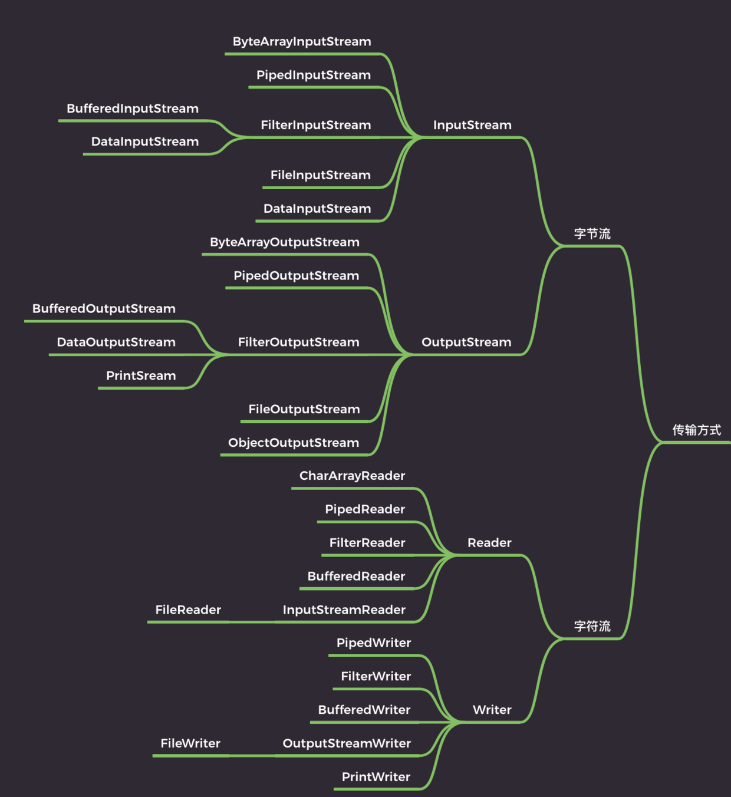

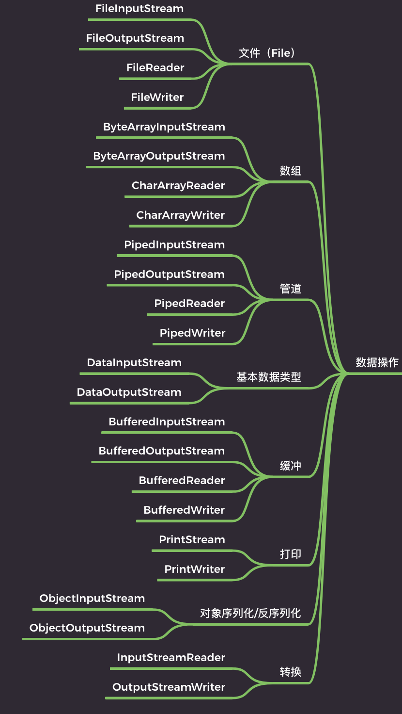


**每个抽象基类定义了核心的抽象方法**，**低级流实现这些方法，决定了如何与特定外部设备交互**。**装饰类通过重写低级流的这些方法，在调用被包装流的相应方法前后添加额外功能，从而增强了原有流的行为。**
- **JavaIO体系在应用上可以分为三层**：四个**抽象基类**、与外部设备交互的**低级流**、**装饰流**
- **低级流**：在实现核心抽象方法时，决定如何读写外部设备
  - **文件流**：FileInputStream、FileOutputStream、FileReader、FileWriter
  - **内存流**：ByteArrayInputStream、ByteArrayOutputStream、CharArrayReader、CharArrayWriter
  - **管道流**：PipedInputStream、PipedOutputStream、PipedReader、PipedWriter
- **装饰流**：
  - 缓冲：BufferedXxx
  - 数据类型：DataInputStream/DataOutputStream
  - 对象序列化：ObjectInputStream/ObjectOutputStream
  - 打印输出：PrintStream/PrintWriter
  - 行号跟踪：LineNumberReader
  - 回退读取：PushbackInputStream/PushbackReader
  - 校验和：CheckedInputStream/CheckedOutputStream
- 

### InputStream、OutputStream、Reader、Writer


```JAVA

public interface Closeable extends AutoCloseable {
    //用通常与try-with-resources结合使用，确保资源（如文件描述符、网络连接等）被正确关闭。
    public void close() throws IOException;
}
public interface Flushable {
    //强制将缓冲区中的内容写入到目标中
    void flush() throws IOException;
}

```


**InputStream**：**定义字节输入流的基本抽象**
- 流：先进先出，只能顺序访问，从中间访问只能调用`skip(long n)`方法跳过前面的字节，不支持随机访问；
- 同步阻塞：阻塞线程直到有数据可用、到达流末尾或者抛出异常
- 核心抽象方法`read()`职责：**从字节输入流读一个字节**，值为0-255，但是仍返回-1，因为需要返回-1表示流结束
  - 包装该抽象方法提供两个具体方法：**读取多个字节到数组**
- `skip(long n)`方法：调用具体方法`read(byte b[], int off, int len)`跳过指定字节数
- 下面三个基础抽象类都采用模版方法，仅说明抽象方法
```JAVA
public abstract class InputStream implements Closeable {
    //所有子类都需要实现该方法，
    public abstract int read() throws IOException;

    public int read(byte b[]) throws IOException {
        return read(b, 0, b.length);
    }
    //模板方法：定义算法骨架，具体步骤由子类实现
    public int read(byte b[], int off, int len) throws IOException {
        if (b == null) throw new NullPointerException();
        
        for (int i = 0; i < len; i++) {
            int c = read();  // 调用抽象方法read()！
            if (c == -1) return (i == 0) ? -1 : i;
            b[off + i] = (byte)c;
        }
        return len;
    }
    private static final int MAX_SKIP_BUFFER_SIZE = 2048;
    //跳过指定个数的字节
    public long skip(long n) throws IOException {

        long remaining = n;
        int nr;

        if (n <= 0) {
            return 0;
        }

        int size = (int)Math.min(MAX_SKIP_BUFFER_SIZE, remaining);
        byte[] skipBuffer = new byte[size];
        while (remaining > 0) {
            nr = read(skipBuffer, 0, (int)Math.min(size, remaining));
            if (nr < 0) {
                break;
            }
            remaining -= nr;
        }

        return n - remaining;
    }
    //返回可读的字节数
    public int available() throws IOException {
        return 0;
    }
}
```

**OutputStream：定义字节输出流的基本抽象**
```JAVA
public abstract class OutputStream implements Closeable, Flushable {
    public abstract void write(int b) throws IOException;
}
```

**Reader：定义字符输入流的基本抽象**
- 与字节输入流不同，字符流的核心抽象方法是批量读取字符并写入到数组

```JAVA
public abstract class Reader implements Readable, Closeable {
    protected Object lock;
    protected Reader() {this.lock = this;}
    protected Reader(Object lock) {
        if (lock == null) {
            throw new NullPointerException();
        }
        this.lock = lock;
    }


    abstract public int read(char cbuf[], int off, int len) throws IOException;
}

public interface Readable {
    //将字符读入给定的字符缓冲区
    public int read(java.nio.CharBuffer cb) throws IOException;
}
```
**Writer：定义字符输出流的基本抽象**
- 与Reader不同，Writer提供了缓冲区，避免每次write(int)都创建新数组
```JAVA
public abstract class Writer implements Appendable, Closeable, Flushable {
    private char[] writeBuffer;
    private static final int WRITE_BUFFER_SIZE = 1024;

    abstract public void write(char cbuf[], int off, int len) throws IOException;
    
}

//追加文本，支持链式调用
public interface Appendable {
    Appendable append(CharSequence csq) throws IOException;
    Appendable append(CharSequence csq, int start, int end) throws IOException;
    Appendable append(char c) throws IOException;
}
```


### 转换流：桥接模式

#### 编码解码

指定字符集使用转换流完成字节流和字符流的转换，其他字符流类不能指定字符集编码，使用平台默认的字符编码
- ASCII
- Unicode：为每个字符分配唯一编号（码点），UTF-8/UTF-16：将码点转换为字节序列的规则
- Base64 编码和解码：将二进制数据转换为 ASCII 码的编码方式
  - 例如，将字符串 "Hello, world!"编码为 "SGVsbG8sIHdvcmxkIQ=="。
- 图像编码和解码
- 视频编码和解码


#### InputStreamReader

`InputStreamReader`：继承Reader，按指定的字符集编码方式，将字节流转换为字符流
```JAVA
public class InputStreamReader extends Reader {
    //使用默认字符集
    public InputStreamReader(InputStream in){...}
    public InputStreamReader(InputStream in, String charsetName){...}
}


public Main{
    public static void main(String[] args) {
        InputStreamReader isr = new InputStreamReader(new FileInputStream("in.txt"));
        InputStreamReader isr2 = new InputStreamReader(new FileInputStream("in.txt") , "GBK");
    }
}
```


#### OutputStreamWriter

`OutputStreamWriter`：继承`Writer` ，**将字符流转换为字节流**
- 写入时通常考虑使用缓冲流包装
```java
try {
    // 从文件读取字节流，使用UTF-8编码方式
    FileInputStream fis = new FileInputStream("test.txt");
    // 将字节流转换为字符流，使用UTF-8编码方式
    InputStreamReader isr = new InputStreamReader(fis, "UTF-8");
    // 使用缓冲流包装字符流，提高读取效率
    BufferedReader br = new BufferedReader(isr);
    // 创建输出流，使用UTF-8编码方式
    FileOutputStream fos = new FileOutputStream("output.txt");
    // 将输出流包装为转换流，使用UTF-8编码方式
    OutputStreamWriter osw = new OutputStreamWriter(fos, "UTF-8");
    // 使用缓冲流包装转换流，提高写入效率
    BufferedWriter bw = new BufferedWriter(osw);

    // 读取输入文件的每一行，写入到输出文件中
    String line;
    while ((line = br.readLine()) != null) {
        bw.write(line);
        bw.newLine(); // 每行结束后写入一个换行符
    }

    // 关闭流
    br.close();
    bw.close();
} catch (IOException e) {
    e.printStackTrace();
}
```


### 文件流

#### File

File封装**路径和对文件的元数据操作**，不能操作文件内容
```JAVA
public class File implements Serializable, Comparable<File> {
    private String path;
}
```

**构造方法**
- `File(String pathname)` 
- `File(String parent, String child)`
- `File(File parent, String child)`
- 构造方法不会检验这个文件或目录是否真实存在，因此无论该路径下是否存在文件或者目录，都不影响 File 对象的创建


路径
- 大小写：windows默认不区分大小写，可以在格式化时选择启用大小写，Linux和macOs区分大小写
- 路径分隔符：使用跨平台的`File.separator`表示路径分隔符
  - macOS/Linux 使用`/`作为路径分隔符
  - Windows 使用`\`作为路径分隔符
- 绝对路径/相对路径
  - `getAbsolutePath()` ：返回此 File 的绝对路径。
  - `getPath()`：返回path

其他方法详见源码


#### RandomAccessFile：随机读写

RandomAccessFile没有继承自四个基类，既可以用来读取文件，也可以用来写入文件。允许跳转到文件的任何位置，从那里开始读取或写入

#### Apache FileUtils & Hutool FileUtil 

提供各种文件操作，详见源码

#### FileInputStream 、 FileOutputStream

FileInputStream 和 FileOutputStream是文件字节流的核心实现，是I/O体系中最基础、最原始的文件操作类，直接与操作系统文件系统交互。
- 大多数私有方法是native方法
- 请使用更高级的Files或FileChannel


**FileInputStream构造方法**
- 文件描述符FileDescriptor是操作系统资源的引用
- 如果构造方法传入FileDescriptor，则代表重用已打开的文件，此时path为null
```JAVA
public class FileInputStream extends InputStream{
    private final FileDescriptor fd;

    private final String path;

    // 1. 通过路径创建
    public FileInputStream(String name) throws FileNotFoundException {...}

    // 2. 通过File对象创建
    public FileInputStream(File file) throws FileNotFoundException {...}

    // 3. 通过文件描述符创建（重用已打开的文件）
    public FileInputStream(FileDescriptor fdObj){...}
}
```
**FileOutputStream构造方法**
- append：默认false，即默认覆盖原文件

```JAVA

public class FileOutputStream extends OutputStream{
    private final FileDescriptor fd;
    private final boolean append;
    private final String path;

    // 1. 基本构造器
    public FileOutputStream(String name) throws FileNotFoundException {
        this(name != null ? new File(name) : null, false);
    }

    // 2. 追加模式构造器
    public FileOutputStream(String name, boolean append) throws FileNotFoundException {
        this(name != null ? new File(name) : null, append);
    }

    // 3. File对象构造器
    public FileOutputStream(File file, boolean append) throws FileNotFoundException {
        // 核心逻辑：打开文件，设置追加模式
    }

    // 4. 文件描述符构造器
    public FileOutputStream(FileDescriptor fdObj) {
        // 直接写入已打开的文件
    }

}
```


#### FileReader、FileWriter（不适合在工程中使用）

不要在开发中使用这两种类
- 观察源码，仅仅是对InputeStreamReader、OutputStreamWriter的简单包装，且只能使用默认的平台编码，不能指定编码
```JAVA
public class FileReader extends InputStreamReader {
    public FileReader(String fileName) throws FileNotFoundException {
        super(new FileInputStream(fileName));
    }
    public FileReader(File file) throws FileNotFoundException {
        super(new FileInputStream(file));
    }
    public FileReader(FileDescriptor fd) {
        super(new FileInputStream(fd));
    }
}

public class FileWriter extends OutputStreamWriter {
    public FileWriter(String fileName) throws IOException {
        super(new FileOutputStream(fileName));
    }
    public FileWriter(String fileName, boolean append) throws IOException {
        super(new FileOutputStream(fileName, append));
    }
    public FileWriter(File file) throws IOException {
        super(new FileOutputStream(file));
    }
    public FileWriter(File file, boolean append) throws IOException {
        super(new FileOutputStream(file, append));
    }
    public FileWriter(FileDescriptor fd) {
        super(new FileOutputStream(fd));
    }

}
```

需要指定编码时的代码示例如下，或者使用Files

```JAVA

Reader reader = new BufferedReader(
                 new InputStreamReader(
                   new FileInputStream("file.txt"), "UTF-8"));

```
### 内存流

内存流：将内存（字节数组、字符数组、字符串）作为数据源或目的地的流。不连接外部物理设备，而是在内存中操作数据，因此速度极快，常用于数据转换、缓存和测试。
- ByteArrayInputStream、ByteArrayOutputStream、CharArrayReader、CharArrayWriter、StringReader、StringWriter
- 在内存中压缩、加密、转换

### 管道流


管道流：**在同一个JVM中的不同线程之间传递数据**，实现生产者-消费者模式。一个线程写入管道输出流，另一个线程从管道输入流读取。


### 装饰流

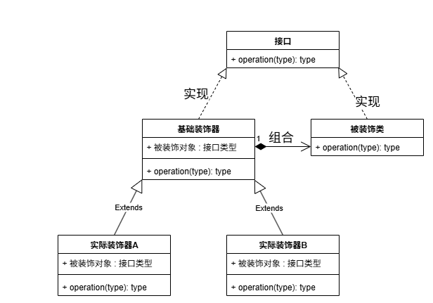

FilterInputStream、FilterOutputStream作为装饰器模式的基础装饰器，持有被装饰的流对象，其所有方法都是委托给被装饰的对象，例如
- ps：FilterReader、FilterWriter确实存在，但是很少有类继承它们，BufferedWriter和BuffferedReader都是直接继承Writer、Reader
```JAVA
public class FilterInputStream extends InputStream {
    // 关键字段：被装饰的底层流
    protected volatile InputStream in;
    
    // 构造器：接受被装饰的流
    protected FilterInputStream(InputStream in) {
        this.in = in;
    }
    
    // 所有方法默认委托给底层流
    public int read() throws IOException {
        return in.read();  // 简单委托
    }
    
    // 其他方法如skip、available、close等都委托给in
}

```

基于FilterInputStream的装饰器：
- BufferedInputStream ：添加缓冲
- DataInputStream ：读取Java基本类型
- PushbackInputStream ：提供unread功能
- InflaterInputStream ：解压缩

基于FilterOutputStream的装饰器：
- BufferedOutputStream ：添加缓冲
- DataOutputStream ：写入Java基本类型
- PrintStream ：格式化输出
- DeflaterOutputStream ：压缩

```JAVA
// 构建一个复杂的I/O处理链
try (InputStream input = new BufferedInputStream(  // 缓冲
                         new ProgressMonitorInputStream(  // 进度监控
                         new DigestInputStream(  // 摘要计算
                         new FileInputStream("file.txt"),  // 基础文件流
                         MessageDigest.getInstance("SHA-256")),
                         fileSize),
                         8192)) {
    // 使用这个流会自动获得缓冲、进度监控、摘要计算功能
}

// 哲学：每个装饰器只关注单一功能，通过组合实现复杂功能
```
#### 缓冲流
##### 字节缓冲流

BufferedInputStream继承FilterInputStream持有InputStream对象in，in是被装饰的对象
- pos：下一个要读取的元素
- count：有效数据结束位置
- 缓冲区惰性加载，按需填充
  - 缓冲区状态示例：已读取：A, B，可读取：C, D, E 
```TEXT

[ A | B | C | D | E | _ | _ | _ ]  // buf数组
  0   1   2   3   4   5   6   7    // 数组索引
  ↑       ↑           ↑
 pos=0  pos=2       count=5   // 有效数据结束位置


```

- 其中，fill()会调用被装饰对象的抽象read方法，将缓冲区填满

- `byte & 0xFF` 
  - byte 类型通常被用于存储二进制数据，其取值范围为 -128 到 127，如果我们希望得到的是一个无符号的 byte 值，就需要使用 byte & 0xFF 来进行转换。
```JAVA
public class BufferedInputStream extends FilterInputStream {
    private static int DEFAULT_BUFFER_SIZE = 8192;
    protected volatile byte buf[];
    protected int count;
    protected int pos;

    public synchronized int read() throws IOException {
        if (pos >= count) {     // 如果当前位置已经到达缓冲区末尾
            fill();             // 填充缓冲区
            if (pos >= count)   // 如果填充后仍然到达缓冲区末尾，说明已经读取完毕
                return -1;      // 返回 -1 表示已经读取完毕
        }
        return getBufIfOpen()[pos++] & 0xff; // 返回当前位置的字节，并将位置加 1
    }
}
```


BufferedOutputStream 继承FilterOutputStream持有OutputStream对象out，out是被装饰的对象
- 检查写入的字节数是否大于等于缓冲区长度，如果是，则先将缓冲区中的数据刷新到磁盘中，然后直接将数据写入输出流。这样做是为了避免缓冲流级联时的问题，即缓冲区的大小不足以容纳写入的数据时，可能会引发级联刷新，导致效率降低
  - 级联问题是指在一组缓冲流（Buffered Stream）中，由于缓冲区的大小不足以容纳要写入的数据，导致数据被分割成多个部分，并分别写入到不同的缓冲区中，最终需要逐个刷新缓冲区，从而导致性能下降的问题
- 其次，如果写入的字节数小于缓冲区长度，则检查缓冲区中剩余的空间是否足够容纳要写入的字节数，如果不够，则先将缓冲区中的数据刷新到磁盘中。然后，使用 `System.arraycopy()` 方法将要写入的数据拷贝到缓冲区中，并更新计数器 count。
- 最后，如果写入的字节数小于缓冲区长度且缓冲区中还有剩余空间，则直接将要写入的数据拷贝到缓冲区中，并更新计数器 count。
- 也就是说，只有当 buf 写满了，才会 flush，将数据刷到磁盘，默认一次刷 8192 个字节。

```JAVA
public class BufferedOutputStream extends FilterOutputStream {
    protected byte buf[];

    protected int count;

    public synchronized void write(byte b[], int off, int len) throws IOException {
        if (len >= buf.length) {    // 如果写入的字节数大于等于缓冲区长度
            /* 如果请求的长度超过了输出缓冲区的大小，
            先刷新缓冲区，然后直接将数据写入。
            这样可以避免缓冲流级联时的问题。*/
            flushBuffer();          // 先刷新缓冲区
            out.write(b, off, len); // 直接将数据写入输出流
            return;
        }
        if (len > buf.length - count) { // 如果写入的字节数大于空余空间
            flushBuffer();              // 先刷新缓冲区
        }
        System.arraycopy(b, off, buf, count, len); // 将数据拷贝到缓冲区中
        count += len;                             // 更新计数器
    }
}

```


##### 字符缓冲流

- BufferedReader：String readLine(): 读一行数据，读取到最后返回 null
- BufferedWriter：newLine(): 换行，由系统定义换行符。
```JAVA
// 创建map集合,保存文本数据,键为序号,值为文字
HashMap<String, String> lineMap = new HashMap<>();

// 创建流对象  源
BufferedReader br = new BufferedReader(new FileReader("logs/test.log"));
//目标
BufferedWriter bw = new BufferedWriter(new FileWriter("logs/test1.txt"));

// 读取数据
String line;
while ((line = br.readLine())!=null) {
    // 解析文本
    if (line.isEmpty()) {
        continue;
    }
    String[] split = line.split(Pattern.quote("."));
    // 保存到集合
    lineMap.put(split[0], split[1]);
}
// 释放资源
br.close();

// 遍历map集合
for (int i = 1; i <= lineMap.size(); i++) {
    String key = String.valueOf(i);
    // 获取map中文本
    String value = lineMap.get(key);
    // 写出拼接文本
    bw.write(key+"."+value);
    // 写出换行
    bw.newLine();
}
// 释放资源
bw.close();
```
#### 打印流：PrintStream 和 PrintWriter

`PrintStream` 是 `OutputStream` 的子类，`PrintWriter` 是 `Writer` 的子类，一个字节流，一个是字符流。


`System.out`返回`PrintStream`对象 
- `print()`：输出一个对象的字符串表示形式。
- `println()`：输出一个对象的字符串表示形式，并在末尾添加一个换行符。
- `printf()`：使用指定的格式字符串和参数输出格式化的字符串。


printf方法
- format：格式化字符串，包含普通字符和转换说明符
- 转换说明符
  - %s：输出一个字符串。
  - %d 或 %i：输出一个十进制整数。
  - %x 或 %X：输出一个十六进制整数，%x 输出小写字母，%X 输出大写字母。
  - %f 或 %F：输出一个浮点数。
  - %e 或 %E：输出一个科学计数法表示的浮点数，%e 输出小写字母 e，%E 输出大写字母 E。
  - %g 或 %G：输出一个浮点数，自动选择 %f 或 %e/%E 格式输出。
  - %c：输出一个字符。
  - %b：输出一个布尔值。
  - %h：输出一个哈希码（16进制）。
  - %n：换行符。
- 修饰符
  - 宽度修饰符：用数字指定输出的最小宽度，如果输出的数据不足指定宽度，则在左侧或右侧填充空格或零。
  - 精度修饰符：用点号（.）和数字指定浮点数或字符串的精度，对于浮点数，指定小数点后的位数，对于字符串，指定输出的字符数。
  - 对齐修饰符：用减号（-）或零号（0）指定输出的对齐方式，减号表示左对齐，零号表示右对齐并填充零。
- args：要输出的参数列表
```JAVA
public PrintStream printf(String format, Object... args);
```
#### 序列流


序列流：将 Java 对象序列化和反序列化的流
- 序列化：将一个对象转换为一个字节序列（包含对象的数据、对象的类型和对象中存储的属性等信息），以便在网络上传输或保存到文件中，或者在程序之间传递
- 反序列化：将一个字节序列转换为一个对象，以便在程序中使用

只有实现了 Serializable 接口的对象才能被序列化


##### ObjectOutputStream

**序列化：将一个对象序列化后输出到指定流out中**，该对象必须实现了`java.io.Serializable` 接口
```JAVA
public class ObjectOutputStream extends OutputStream implements ObjectOutput{
    public ObjectOutputStream(OutputStream out)

    //将对象序列化后写入到流中
    public final void writeObject(Object obj) throws IOException {}
}
```
##### ObjectInputStream

**反序列化：从指定的文件输入流中读取对象并反序列化**
- 返回Object，需要强制转换
```JAVA
public class ObjectInputStream extends InputStream  implements ObjectInput{
    public ObjectInputStream(InputStream in)
    public final Object readObject()

}
```

##### Kryo

**实际开发中，很少使用 JDK 自带的序列化和反序列化**
- 可移植性差：Java 特有的，无法跨语言进行序列化和反序列化。
- 性能差：序列化后的字节体积大，增加了传输/保存成本。
- 安全问题：攻击者可以通过构造恶意数据来实现远程代码执行，从而对系统造成严重的安全威胁


Kryo 是一个优秀的 Java 序列化和反序列化库，具有高性能、高效率和易于使用和扩展等特点，有效地解决了 JDK 自带的序列化机制的痛点。

```XML
<!-- 引入 Kryo 序列化工具 -->
<dependency>
     <groupId>com.esotericsoftware</groupId>
     <artifactId>kryo</artifactId>
     <version>5.4.0</version>
</dependency>
```

**创建一个 Kryo 对象，并使用 register() 方法将对象进行注册。然后，使用 writeObject() 方法将 Java 对象序列化为二进制流，再使用 readObject() 方法将二进制流反序列化为 Java 对象。最后，输出反序列化后的 Java 对象。**

```JAVA
public class KryoDemo {
    public static void main(String[] args) throws FileNotFoundException {
        Kryo kryo = new Kryo();
        kryo.register(Target.class);

        Target object = new Target("沉默王二", 123);

        Output output = new Output(new FileOutputStream("logs/kryo.bin"));
        kryo.writeObject(output, object);
        output.close();

        Input input = new Input(new FileInputStream("logs/kryo.bin"));
        Target object2 = kryo.readObject(input, Target.class);
        System.out.println(object2);
        input.close();
    }
}

class Target {
    private String name;
    private int age;

    public Target() {
    }

    public Target(String name, int age) {
        this.name = name;
        this.age = age;
    }

    public String getName() {
        return name;
    }

    public void setName(String name) {
        this.name = name;
    }

    public int getAge() {
        return age;
    }

    public void setAge(int age) {
        this.age = age;
    }

    @Override
    public String toString() {
        return "Target{" +
                "name='" + name + '\'' +
                ", age=" + age +
                '}';
    }
}
```
##### Serializable、 Externalizable 接口与transient关键字


Serializable和Externalizable接口
- 重写具体的 writeExternal() 和 readExternal() 方法，控制序列化，可以在序列化和反序列化过程中对对象进行自定义的处理，如对一些敏感信息进行加密和解密。
- 
```JAVA
public interface Serializable {
}

public interface Externalizable extends java.io.Serializable {
   
    void writeExternal(ObjectOutput out) throws IOException;
    void readExternal(ObjectInput in) throws IOException, ClassNotFoundException;
}

@Override
public void writeExternal(ObjectOutput out) throws IOException {
	out.writeObject(name);
	out.writeInt(age);
}

@Override
public void readExternal(ObjectInput in) throws IOException, ClassNotFoundException {
	name = (String) in.readObject();
	age = in.readInt();
}
```


**序列化时会执行下述代码，依次判断是否为字符串、数组、枚举、Serializable类型的对象，如果都不是则抛出 NotSerializableException 异常**

```JAVA
// 判断对象是否为字符串类型，如果是，则调用 writeString 方法进行序列化
if (obj instanceof String) {
    writeString((String) obj, unshared);
}
// 判断对象是否为数组类型，如果是，则调用 writeArray 方法进行序列化
else if (cl.isArray()) {
    writeArray(obj, desc, unshared);
}
// 判断对象是否为枚举类型，如果是，则调用 writeEnum 方法进行序列化
else if (obj instanceof Enum) {
    writeEnum((Enum<?>) obj, desc, unshared);
}
// 判断对象是否为可序列化类型，如果是，则调用 writeOrdinaryObject 方法进行序列化
else if (obj instanceof Serializable) {
    writeOrdinaryObject(obj, desc, unshared);
}
// 如果对象不能被序列化，则抛出 NotSerializableException 异常
else {
if (extendedDebugInfo) {
    throw new NotSerializableException(
        cl.getName() + "\n" + debugInfoStack.toString());
} else {
    throw new NotSerializableException(cl.getName());
}
}
```


**static 和 transient 修饰的字段是不会被序列化的。**
- static是类状态，序列化保存对象状态
- transient的意思是暂时的，可以用于保护敏感信息
- 下述代码中`Modifier.STATIC | Modifier.TRANSIENT`限制了static 和 transient 修饰的字段是不会被序列化
```JAVA
private static ObjectStreamField[] getDefaultSerialFields(Class<?> cl) {
    // 获取该类中声明的所有字段
    Field[] clFields = cl.getDeclaredFields();
    ArrayList<ObjectStreamField> list = new ArrayList<>();
    int mask = Modifier.STATIC | Modifier.TRANSIENT;

    // 遍历所有字段，将非 static 和 transient 的字段添加到 list 中
    for (int i = 0; i < clFields.length; i++) {
        Field field = clFields[i];
        int mods = field.getModifiers();
        if ((mods & mask) == 0) {
            // 根据字段名、字段类型和字段是否可序列化创建一个 ObjectStreamField 对象
            ObjectStreamField osf = new ObjectStreamField(field.getName(), field.getType(), !Serializable.class.isAssignableFrom(cl));
            list.add(osf);
        }
    }

    int size = list.size();
    // 如果 list 为空，则返回一个空的 ObjectStreamField 数组，否则将 list 转换为 ObjectStreamField 数组并返回
    return (size == 0) ? NO_FIELDS :
        list.toArray(new ObjectStreamField[size]);
}
```

**被 transient 关键字修饰的成员变量在反序列化时会被自动初始化为默认值**，例如基本数据类型为 0，引用类型为 null。
- 一个静态变量（static关键字修饰）不管是否被 transient 修饰，均不能被序列化
- 但是如果是Externalizable接口，不仅可以序列化transient字段，还能对其加密
##### 序列化 ID

在反序列化时，Java 虚拟机会把字节流中的 serialVersionUID 与被序列化类中的 serialVersionUID 进行比较，如果相同则可以进行反序列化，否则就会抛出序列化版本不一致的异常。


如果实体里面没有显示的定义一个serialVersionUID ，Java序列化机制会根据编译的class自动生成一个serialVersionUID，而实体变动会导致这个序列化ID同步改变，可能会导致反序列化失败
- 因此当一个类实现了 Serializable 接口后，IDE 就会提醒该类最好产生一个序列化 ID
- 如果没有特殊需求，采用默认的序列化 ID（1L）就可以

#### 基础数据类型流


**DataInputStream**

```JAVA
import java.io.*;

public class DataInputStreamDemo {
    public static void main(String[] args) {
        String filename = "data.bin";
        
        try (DataInputStream dis = new DataInputStream(
                new BufferedInputStream(
                    new FileInputStream(filename)))) {
            
            // 必须按照写入顺序读取
            boolean bool = dis.readBoolean();
            byte b = dis.readByte();
            short s = dis.readShort();
            int i = dis.readInt();
            long l = dis.readLong();
            float f = dis.readFloat();
            double d = dis.readDouble();
            char c = dis.readChar();
            String str = dis.readUTF();
            
            System.out.printf("读取结果: %b, %d, %d, %d, %d, %.2f, %.2f, %c, %s%n",
                bool, b, s, i, l, f, d, c, str);
                
        } catch (EOFException e) {
            System.out.println("已读取到文件末尾");
        } catch (IOException e) {
            e.printStackTrace();
        }
    }
}
```
**DataOutputStream**

```JAVA
import java.io.*;

public class DataOutputStreamDemo {
    public static void main(String[] args) throws IOException {
        // 创建DataOutputStream（通常包装缓冲流和文件流）
        try (DataOutputStream dos = new DataOutputStream(
                new BufferedOutputStream(
                    new FileOutputStream("data.bin")))) {
            
            // 写入各种基本数据类型
            dos.writeBoolean(true);          // 1字节: 0x01
            dos.writeByte(65);               // 1字节: 0x41 ('A')
            dos.writeShort(1024);            // 2字节: 0x04 0x00
            dos.writeInt(123456789);         // 4字节: 0x07 0x5B 0xCD 0x15
            dos.writeLong(9876543210L);      // 8字节
            dos.writeFloat(3.14159f);        // 4字节（IEEE 754单精度）
            dos.writeDouble(2.71828);        // 8字节（IEEE 754双精度）
            dos.writeChar('中');             // 2字节（UTF-16编码）
            dos.writeUTF("Hello, 世界");     // 变长：长度前缀 + UTF-8编码
            
            System.out.println("数据写入完成");
        }
    }
}
```
#### 行号跟踪

#### 回退读取

#### 校验和

## Java Socket

**Socket、ServerSocket套接字**允许：**应用程序通过BIO体系，向Socket套接字读写数据，与网络中其他主机的应用程序通信**
- **Socket=IP+端口**
- **java.net.ServerSocket**：**监听并接受客户端的连接请求**
- **java.net.Socket**：**与服务器建立连接和进行数据通信**

**Socket、ServerSocket套接字**委托给SocketImpl实现跨平台


**Socket底层使用BIO体系**，**几乎所有涉及网络I/O的核心方法默认都是阻塞的**
- `new Socket("bbs.newsmth.net", 23)`可能发生阻塞的关键步骤：**DNS域名解析、TCP三次握手**
- `void setSoTimeout(int timeout)`为所有同步阻塞方法设置超时时间，例如`void setSoTimeout(int timeout)`


`ServerSocket`：监听指定端口等待连接请求
- 端口号0-1023是系统预留，使用除此之外的端口号


**DatagramSocket**是UDP的核心实现
- **每个数据包DatagramPacket携带目标地址（目标地址 + 端口）**
- DatagramSocket提供`send(DatagramPacket p)` 、`receive(DatagramPacket p)`核心API
- 客户端不指定端口，由系统分配；服务端需指定端口；
- **每一个DatagramSocket在内核中都有一个接收缓冲区**，如果缓冲区满，新到的数据报会被静默丢弃
## 异常

### 异常体系

**异常**
- 中断程序正常执行流程的一个不确定的事件

**异常处理机制**
- 通过捕获异常，改变程序执行流程，而非中断程序，并且向用户提供友好的提示信息

**Error**
- 系统级严重错误。程序一般无法恢复，应直接终止

**Exception**
- 可控的问题，程序预期内可能发生的情况。应被捕获并妥善处理，使程序恢复运行。

**checked受检异常**
- 在源代码中必须使用 `try-catch` 捕获或在方法上用 `throws` 声明抛出
- 例如`IOExceptio`n, `SQLException`, `ClassNotFoundException`

**unchecked异常**
- **RuntimeException 及其子类**
- **因为是运行时出现，所以不要捕获任何RuntimeException及其子类异常**
- 例如如 NullPointerException, ArrayIndexOutOfBoundsException

**关键字throw**
- 在方法体内部主动抛出一个异常对象；`throw new ArithmeticException("除数不能为零");`

**关键字throws**
- 在方法签名末尾声明方法可能抛出的异常类型`public void readFile() throws IOException { ... }`


**ClassNotFoundException**异常和**NoClassDefFoundError**错误
- ClassNotFoundException：动态加载 Class 对象的时候找不到对应的类时抛出该异常；原因可能是要加载的类不存在或者类名写错了
- NoClassDefFoundError：程序在编译时可以找到所依赖的类，但是在运行时找不到指定的类文件，导致抛出该错误；原因可能是 jar 包缺失或者调用了初始化失败的类。

**try-catch-finally**
- try：包裹可能发生异常的代码。
- catch：捕获并处理特定类型的异常
  - 一个try块后可以有多个catch块，子类异常catch块必须写在父类异常catch块前面，否则会导致编译错误
  - 两catch块执行相同的异常处理逻辑时，可以使用|隔开异常然后放一起

```JAVA
static void test() {
    int num1, num2;
    try {
        num1 = 0;
        num2 = 62 / num1;
        System.out.println(num2);
        System.out.println("try 块的最后一句");
    } catch (ArithmeticException e) {
        // 算术运算发生时跳转到这里
        System.out.println("除数不能为零");
    } catch (Exception e) {
        // 通用型的异常意味着可以捕获所有的异常，它应该放在最后面，
        System.out.println("异常发生了");
    }
    System.out.println("try-catch 之外的代码.");
}

static void test1 () {
    try{
        int arr[]=new int[7];
        arr[9]=30/1;
        System.out.println("try 块的最后");
    } catch(ArithmeticException | ArrayIndexOutOfBoundsException e){
        System.out.println("除数必须是 0");
    }
    System.out.println("try-catch 之外");
}


```
- finally：**无论是否发生异常都会执行的代码块**，传统上常用于关闭资源
  - finally 块前面必须有 try 块，编译器不允许finally 块单独使用
  - finally 块不是必选项，有 try 块的时候不一定要有 finally 块。
  - 如果 finally 块中的代码可能会发生异常，也应该使用 try-catch 进行包裹。
  - 即便是 try 块中执行了 return、break、continue 这些跳转语句，finally 块也会被执行。
- 不执行finally块的情况
  - 遇到了死循环。
  - 执行System. exit()：终止当前虚拟机进程

### try with resources


`try-catch-finally` 在处理资源关闭时主要有两大问题：
1.  **代码臃肿**：必须在 `finally` 块中显式关闭资源，并嵌套 `try-catch`。
2.  **异常信息丢失**：如果 `try` 块的`readLine()`方法和 `finally` 块的 `close()` 方法都抛出异常，那么 `finally` 中抛出的异常会 **“覆盖”** `try` 块中的原始异常，报错将说明该IOException是close方法产生的，即使`readLine()`也报错了，但是不会报告。
```JAVA
public class TrycatchfinallyDecoder {
    public static void main(String[] args) {
        BufferedReader br = null;
        try {
            String path = TrycatchfinallyDecoder.class.getResource("/牛逼.txt").getFile();
            String decodePath = URLDecoder.decode(path,"utf-8");
            br = new BufferedReader(new FileReader(decodePath));

            String str = null;
            while ((str =br.readLine()) != null) {
                System.out.println(str);
            }
        } catch (IOException e) {
            e.printStackTrace();
        } finally {
            if (br != null) {
                try {
                    br.close();
                } catch (IOException e) {
                    e.printStackTrace();
                }
            }
        }
    }
}
```


`try-with-resources`
- 在 `try` 关键字后的 `()` 中声明并初始化实现了 **`AutoCloseable`** 接口的资源；多个资源使用`;` 隔开
  - 自定义资源：实现 `AutoCloseable` 接口并重写 `close()` 方法
- 无需手动调用close()，在try代码块结束后，会自动调用`close()` 方法
- 如果 `try` 块和自动关闭都抛出异常，**`try`块中的原始异常会被抛出**，而关闭时产生的异常会被`addSuppressed()`方法记录为“被抑制的异常”，附加在原始异常的堆栈信息中，可通过 `getSuppressed()` 获取，不会丢失。
  - 当一个异常被抛出的时候，可能有其他异常因为该异常而被抑制住，从而无法正常抛出。这时可以通过 addSuppressed() 方法把这些被抑制的方法记录下来，然后被抑制的异常就会出现在抛出的异常的堆栈信息中，可以通过 getSuppressed() 方法来获取这些异常

**AutoCloseable**和**Closeable**接口
- **Closeable**接口继承自**AutoCloseable**接口，只能抛出IOException，专用于I/O流资源，实现类重写close()时，只能抛出IOException或更具体的异常
- **AutoCloseable**接口，可以抛出任何Exception，适配`try-with-resources`语句
### 实践经验

| 分类 | 实践编号 | 最佳实践要点 (严格遵循原文) |
| :--- | :--- | :--- |
| **捕获 (Catch)** | 01 | **尽量不要捕获 RuntimeException**：比如 `NullPointerException`、`IndexOutOfBoundsException` 等等，应该用预检查的方式来规避。 |
| | 03 | **不要捕获 Throwable**：`Throwable` 是 exception 和 error 的父类，如果在 catch 子句中捕获了 `Throwable`，很可能把超出程序处理能力之外的错误也捕获了。 |
| | 08 | **捕获具体的子类而不是捕获 Exception 类**：如果捕获 `Exception` 类型的异常，可能会捕获到一些不应该被处理的异常，从而导致程序难以识别和定位异常。 |
| **资源与清理 (Resource & Finally)** | 02 | **尽量使用 try-with-resource 来关闭资源**：当需要关闭资源时，尽量不要使用 try-catch-finally，禁止在 try 块中直接关闭资源。 |
| | 06 | **不要在 finally 块中使用 return**：try 块中的 return 语句执行成功后，并不会马上返回，而是继续执行 finally 块中的语句，如果 finally 块中也存在 return 语句，那么 try 块中的 return 就将被覆盖。 |
| | 10 | **finally 块中不要抛出任何异常**：如果在 finally 块中抛出异常，可能会导致原始异常被掩盖。 |
| | 12 | **对于不打算处理的异常，直接使用 try-finally，不用 catch**：如果 method1 正在访问 Method 2，而 Method 2 抛出一些你不想在 Method 1 中处理的异常，但是仍然希望在发生异常时进行一些清理，可以直接在 finally 块中进行清理，不要使用 catch 块。 |
| **异常信息处理 (Exception Info)** | 04 | **不要省略异常信息的记录**：很多时候，由于疏忽大意，我们很容易捕获了异常却没有记录异常信息，导致程序上线后真的出现了问题却没有记录可查。 |
| | 05 | **不要记录了异常又抛出了异常**：这纯属画蛇添足，并且容易造成错误信息的混乱。 |
| | 09 | **自定义异常时不要丢失堆栈跟踪**：例如 `throw new MyServiceException("Some information: " + e.getMessage());` 破坏了原始异常的堆栈跟踪。 |
| | 11 | **不要在生产环境中使用printStackTrace()**：在生产环境中，应该使用日志系统来记录异常信息，例如 log4j、slf4j、logback 等。 |
| | 17 | **一个异常只能包含在一个日志中**：不要分散记录，应该将所有相关信息尽可能地传递给异常，如 `LOGGER.debug("Using cache sector A, using retry sector B");` |
| | 18 | **将所有相关信息尽可能地传递给异常**：有用的异常消息和堆栈跟踪非常重要，应该尽量把 String message, Throwable cause 异常信息和堆栈都输出。 |
| **抛出 (Throw)** | 07 | **抛出具体定义的检查性异常而不是 Exception**：声明的方法应该尽可能抛出具体的检查性异常，例如应该显式地声明抛出 `SQLException` 而不是 `Exception` 类型的异常。 |
| | 13 | **记住早 throw 晚 catch 原则**：在代码中尽可能早地抛出异常，以便在异常发生时能够及时地处理异常。同时，在 catch 块中尽可能晚地捕获异常，以便在捕获异常时能够获得更多的上下文信息。 |
| | 14 | **只抛出和方法相关的异常**：相关性对于保持代码的整洁非常重要。一种尝试读取文件的方法，如果抛出 `NullPointerException`，那么它不会给用户提供有价值的信息。 |
| **编码理念与设计 (Coding Principle)** | 15 | **切勿在代码中使用异常来进行流程控制**：在代码中使用异常来进行流程控制会导致代码的可读性、可维护性和性能出现问题。 |
| | 16 | **尽早验证用户输入以在请求处理的早期捕获异常**：应该首先验证所有内容，然后再进行数据库更新，以保证数据一致性。例如先 `validate` 再 `insert`。 |
| | 19 | **终止掉被中断线程**：`InterruptedException` 提示应该停止程序正在做的事情，应该尽最大努力完成正在做的事情，并完成当前执行的线程，而不是忽略它。 |
| | 20 | **对于重复的 try-catch，使用模板方法**：类似的 catch 块是无用的，只会增加代码的重复性，针对这样的问题可以使用模板方法。 |


## 常用工具类

### Scanner：处理用户输入


`Scanner` ：常用于**读取控制台的用户输入**，让程序实现交互功能；同时，也能用于**扫描和解析文件内容**。


**扫描控制台输入**`Scanner scanner = new Scanner(System.in);` 
- `nextLine()`：读取一行输入（以回车结束），返回 `String`。
- **`nextInt()` / `nextDouble()`**：读取下一个整数或浮点数。如果输入类型不匹配，会抛出 `InputMismatchException`。
- **`next()`**：读取由默认分隔符（空格/换行）隔开的下一个“单词”。
- **`hasNextLine()` / `hasNextInt()` 等**：在读取前进行判断，避免异常。

> 混合使用 `nextLine()` 和其他 `nextXxx()` 方法时，要注意处理换行符，否则可能会“吞掉”后续输入。通常在 `nextInt()` 后调用一次 `nextLine()` 来消耗残留的换行符。

**扫描文件内容**
通过传递 `File` 对象给 `Scanner` 构造函数，可以方便地读取文件。
- **逐行读取**：配合 `while (scanner.hasNextLine())` 循环和 `nextLine()` 方法。
- **读取整个文件**：使用 `scanner.useDelimiter("\\Z")` 将分隔符设置为文件结束符，然后通过 `next()` 一次读取全部内容。

**查找字符串匹配项**
`Scanner` 提供了基于正则表达式的查找功能，这在扫描文本时非常有用。
- **`findInLine(String pattern)`**：在**当前行**中查找与模式匹配的下一个子字符串。
- **`findWithinHorizon(String pattern, int horizon)`**：在指定的**搜索范围（字符数）**内查找。若 `horizon` 设为 `0`，则表示搜索无边界限制。
- 这两个方法都**会忽略默认的分隔符**，直接按模式搜索，找到则返回匹配的字符串，否则返回 `null`。

**其他重要方法**
- **`useDelimiter(String pattern)`**：自定义分隔符（默认为空格/换行），改变 `next()` 等方法的切分逻辑。
- **`close()`**：使用完毕后关闭 `Scanner` 对象，释放底层资源（如文件流）。


### Arrays工具类
1.  **创建与复制数组**
    *   `copyOf(T[] original, int newLength)`：复制数组，可截断或用`null`填充以达到指定长度。
    *   `copyOfRange(T[] original, int from, int to)`：复制数组的指定范围。
    *   `fill(T[] a, T val)`：将数组的所有元素填充为指定值。

2.  **比较数组**
    *   `equals(T[] a, T[] a2)`：严谨地比较两个数组是否“深度相等”（长度相同且对应元素一致）。
    *   `hashCode(T[] a)`：计算数组的哈希码。可用于快速预判数组是否相等，但`equals`方法更严谨。

3.  **排序与查找**
    *   `sort(T[] a)`：对数组进行升序排序（基本类型用双轴快排，引用类型用TimSort）。
    *   `binarySearch(T[] a, T key)`：**必须在已排序的数组上使用**，进行高效的二分查找。也支持传入比较器进行模糊查找（如忽略大小写）。

4.  **转换与输出**
    *   `toString(T[] a)`：将数组转换为美观的字符串格式（如 `[a, b, c]`），是打印数组内容的最佳方式。
    *   `asList(T... a)`：将数组转换为一个**长度固定**的List视图。如需可变List，需将其作为参数新建一个`ArrayList`：`new ArrayList<>(Arrays.asList(...))`。
    *   `stream(T[] a)`：将数组转换为`Stream`流，以便使用Java 8强大的流式API进行处理。

5.  **Java 8 新增高级功能**
    *   `setAll(T[] array, IntFunction<T> generator)`：通过函数式编程，用生成的值填充数组（例如 `i -> i * 10`）。
    *   `parallelPrefix(T[] array, BinaryOperator<T> op)`：用函数式编程进行“并行前缀计算”，将前一个元素的操作结果累积到后一个元素上（例如用于累加）。

### Objects：操作Java对象

### Collections：操作集合对象

### Collectors：收集器


### StringUtils工具类

```XML
<dependency>
    <groupId>org.apache.commons</groupId>
    <artifactId>commons-lang3</artifactId>
    <version>3.12.0</version>
</dependency>
```

### Hutool工具类库

```XML
<dependency>
    <groupId>cn.hutool</groupId>
    <artifactId>hutool-all</artifactId>
    <version>5.4.3</version>
</dependency>
```

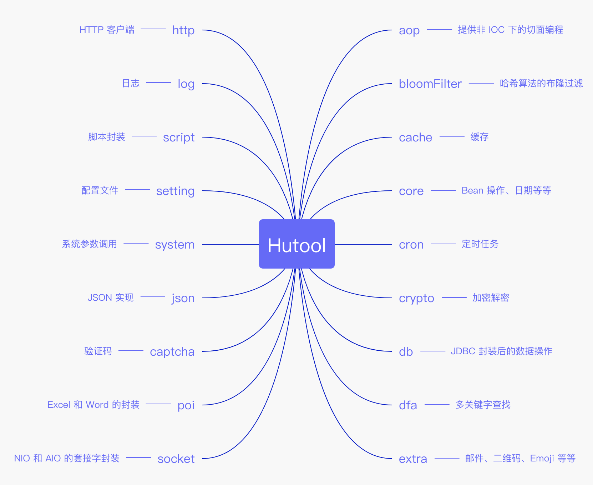
### Guava工具库

## 反射

反射的设计本质是，**运行时才能确定要动态操作哪些`Class`、`Method`等元数据对象的能力**

`java.lang.Class`是所有反射 API 的入口，部分API示例：

```java
//获取Class对象
Class clazz = Class.forName("com.itwanger.s39.Writer");

//获取 Constructor 对象
Constructor constructor = clazz.getConstructor();

//创建实例
Object object = constructor.newInstance();

//获取 Method 对象
Method setNameMethod = clazz.getMethod("setName", String.class);
Method getNameMethod = clazz.getMethod("getName");

//调用方法
setNameMethod.invoke(object, "沉默王二");
getNameMethod.invoke(object);
```

反射通过`Method`对象的`invoke()`完成方法调用
-  MethodAccessor 接口有三个实现类，其中的 MethodAccessorImpl 是一个抽象类，另外两个具体的实现类继承了这个抽象类。
   -  NativeMethodAccessorImpl：**通过本地方法来实现反射调用**；
   -  DelegatingMethodAccessorImpl：**通过委派模式来实现反射调用**；
- 第一次反射调用会生成一个委派实现 DelegatingMethodAccessorImpl，它在生成的时候会传递一个本地实现 NativeMethodAccessorImpl。也就是说，invoke() 方法在执行的时候，会先调用 DelegatingMethodAccessorImpl，然后调用 NativeMethodAccessorImpl，最后再调用实际的方法。
- **为什么采用双重委派而不是直接调用现成的本地实现**
  - **为了能够在本地实现和动态实现之间切换**。
  - **动态实现是另外一种反射调用机制，它是通过生成字节码的形式来实现的**。如果反射调用的次数比较多，动态实现的效率就会更高，因为本地实现需要经过 Java 到 C/C++ 再到 Java 之间的切换过程，而动态实现不需要；但如果反射调用的次数比较少，反而本地实现更快一些
  - 默认的临界点是15次，可以通过 -Dsun.reflect.inflationThreshold 参数类调整
```JAVA
public Object invoke(Object obj, Object... args)
        throws IllegalAccessException, IllegalArgumentException,
        InvocationTargetException {
    // 如果方法不允许被覆盖，进行权限检查
    if (!override) {
        if (!Reflection.quickCheckMemberAccess(clazz, modifiers)) {
            Class<?> caller = Reflection.getCallerClass();
            // 检查调用者是`否具有访问权限
            checkAccess(caller, clazz, obj, modifiers);
        }
    }
    // 获取方法访问器（从 volatile 变量中读取）
    MethodAccessor ma = methodAccessor;
    if (ma == null) {
        // 如果访问器为空，尝试获取方法访问器
        ma = acquireMethodAccessor();
    }
    // 使用方法访问器调用方法，并返回结果
    return ma.invoke(obj, args);
}
```
## 注解

**注解是一种类型**，如同`class、interface`；**核心作用是为类、方法、字段添加元数据**；仅添加元数据不会有任何影响，是**与注解配套的处理器在执行代码**

**定义注解**：通过元数据限定注解添加元数据的时间范围和有效目标
- `@Retention`：定义注解的生命周期
  - `SOURCE`：仅存于源码，由编译器使用，如`@Override`
  - `CLASS`：存于字节码，但运行时不可见
  - `RUNTIME`：运行时持久化，可通过反射读取元数据或字段值
- `@Target`：定义注解可应用于哪些程序元素，TYPE、FIELD、METHOD、CONSTRUCTOR......

```JAVA
@Retention(RetentionPolicy.RUNTIME) // 关键：运行时保留
@Target(ElementType.FIELD) // 关键：仅用于字段
public @interface JsonField {
    // 定义注解参数，使用“方法”形式声明
    String value() default ""; // 参数名value允许使用时省略
}

```
- **使用注解**：声明式使用注解，分离业务代码和元数据处理代码
```JAVA
public class Writer {
    private int age; // 未标注，不序列化

    @JsonField("writerName") // 标注，并指定序列化后的key为"writerName"
    private String name;

    @JsonField // 标注，使用默认字段名作为key
    private String bookName;
    // ... 构造方法等
}
```

- **注解的处理器**

```JAVA
//将Java对象转换为JSON格式字符串
public class JsonSerializer {
    
    // 将任意对象序列化为JSON字符串
    // 抛出：IllegalAccessException - 如果无法访问对象的字段
    public static String serialize(Object object) throws IllegalAccessException {
        // 获取对象的Class对象，用于反射操作
        Class<?> objectClass = object.getClass();
        
        // 创建HashMap存储键值对，key为JSON键名，value为字段值的字符串表示
        Map<String, String> jsonElements = new HashMap<>();
        
        // 遍历对象的所有字段（包括私有字段）
        for (Field field : objectClass.getDeclaredFields()) {
            // 设置字段可访问，即使是私有字段也能读取
            field.setAccessible(true);
            
            // 检查字段是否被@JsonField注解标记
            if (field.isAnnotationPresent(JsonField.class)) {
                // 将字段值放入map：key通过getSerializedKey方法获取，value强制转换为String
                jsonElements.put(getSerializedKey(field), (String) field.get(object));
            }
        }
        
        // 将map转换为JSON格式字符串并返回
        return toJsonString(jsonElements);
    }

    // 私有方法：获取字段序列化时的键名
    // 参数：field - 被@JsonField注解标记的字段
    // 返回：序列化时使用的键名字符串
    private static String getSerializedKey(Field field) {
        // 获取字段上的@JsonField注解的value值
        String annotationValue = field.getAnnotation(JsonField.class).value();
        
        // 判断注解的value是否为空（默认值为空字符串）
        if (annotationValue.isEmpty()) {
            // 如果注解value为空，则使用字段的原名作为键名
            return field.getName();
        } else {
            // 如果注解value不为空，则使用注解指定的值作为键名
            return annotationValue;
        }
    }

    // 私有方法：将Map转换为JSON格式字符串
    // 参数：jsonMap - 包含键值对的Map
    // 返回：格式化后的JSON字符串
    private static String toJsonString(Map<String, String> jsonMap) {
        // 使用Stream API处理Map中的每个键值对
        String elementsString = jsonMap.entrySet()
                .stream()  // 将entrySet转换为流
                // 将每个键值对转换为"key":"value"格式的字符串
                .map(entry -> "\"" + entry.getKey() + "\":\"" + entry.getValue() + "\"")
                // 用逗号连接所有键值对字符串
                .collect(Collectors.joining(","));
        
        // 在最外层添加花括号，形成完整的JSON对象
        return "{" + elementsString + "}";
    }
}
```


# 集合


## 集合框架

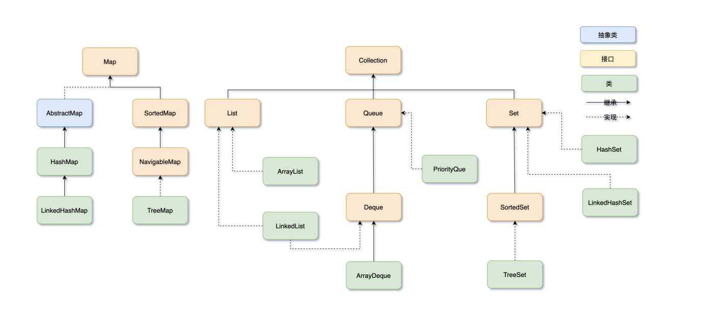

## List
### ArrayList

RandomAccess：标记接口，支持随机访问（通过索引访问）

```JAVA
public class ArrayList<E> extends AbstractList<E>
        implements List<E>, RandomAccess, Cloneable, java.io.Serializable 
{
    public E get(int index) {
        Objects.checkIndex(index, size);
        return elementData(index);
    }
}


```
#### 构造器

ArrayList提供三种构造器：无参构造器、指定初始容量的构造器、Collection 参数构造器

**无参构造器**
- **调用无参构造器时不会立即分配内存，而是延迟到第一次添加元素时；**
- **`DEFAULTCAPACITY_EMPTY_ELEMENTDATA`是静态常量，JVM中，由无参构造器构造的所有ArrayList对象，在未添加元素时，共享同一份DEFAULTCAPACITY_EMPTY_ELEMENTDATA，节约内存**
- **首次添加元素分配内存时，判断elementData是否指向DEFAULTCAPACITY_EMPTY_ELEMENTDATA，是就分配`Math.max(DEFAULT_CAPACITY, minCapacity)`大小的内存空间**
  - `DEFAULTCAPACITY`将10元素数组的扩容次数从5次（1-2-4-8-16）减少到1次（直接扩容到10）

```JAVA
transient Object[] elementData;

private static final int DEFAULT_CAPACITY = 10;

private static final Object[] DEFAULTCAPACITY_EMPTY_ELEMENTDATA = {};

public ArrayList() {
    this.elementData = DEFAULTCAPACITY_EMPTY_ELEMENTDATA;
}
```

**指定初始容量的构造器**
- 指定容量>0：**创建对象时就分配指定容量的内存**
- 指定容量=0：**EMPTY_ELEMENTDATA是静态常量，JVM中，所有容量指定为0的ArrayList对象，在未添加元素时，共享EMPTY_ELEMENTDATA**，与DEFAULTCAPACITY_EMPTY_ELEMENTDATA区分，后者将使用默认容量DEFAULT_CAPACITY
```JAVA
transient Object[] elementData;

private static final Object[] EMPTY_ELEMENTDATA = {};

public ArrayList(int initialCapacity) {
    if (initialCapacity > 0) {
        this.elementData = new Object[initialCapacity];
    } else if (initialCapacity == 0) {
        this.elementData = EMPTY_ELEMENTDATA;
    } else {
        throw new IllegalArgumentException("Illegal Capacity: "+
                                            initialCapacity);
    }
}
```

**Collection 参数构造器**
- 传入空集合时；指向`EMPTY_ELEMENTDATA`
- 传入非空集合时：将集合toArray，然后复制该数组赋值给elementData
- 该构造器使用如下API
  - `toArray()`：返回包含集合所有元素的数组，具体实现**可能返回副本或视图**，但是ArrayList总是返回副本
  - `Arrays.copyOf(a, size, Object[].class)`：第三个参数指定副本的数组类型
- 优化
  - 如果c是ArrayList，那么toArray()返回的是副本，就可以明确赋予elementData
  - c不是ArrayList时，toArray()可能返回副本或视图，此时应防御性编程，显式调用Arrays.copyOf

```JAVA
transient Object[] elementData;

public ArrayList(Collection<? extends E> c) {
    Object[] a = c.toArray();
    if ((size = a.length) != 0) {
        if (c.getClass() == ArrayList.class) {
            elementData = a;
        } else {
            elementData = Arrays.copyOf(a, size, Object[].class);
        }
    } else {
        // replace with empty array.
        elementData = EMPTY_ELEMENTDATA;
    }
}
```


#### modCount与fail-fast

modCount：**记录集合结构性修改的次数，实现fail-fast机制**
- **为什么在没添加元素之前对modCount自增？**
- **fail-fast**机制的核心思想是，**一旦发现问题，立即失败**，而不是继续执行产生更严重的错误，数据一致性比程序能继续运行更重要；在一致性被破坏前就停止运行
- 迭代器在遍历前，会设置检查点`expectedModCount`，通过集合API，而不是通过迭代器API结构性修改集合，会导致迭代器的modCount与集合的expectedModCount不一致，触发fail-fast，在成功添加元素之前就抛出异常

```JAVA
final void checkForComodification() {
    if (modCount != expectedModCount)
        throw new ConcurrentModificationException();
}
```
- modCount**只关心结构修改，而不关心内容修改**，结构修改包括添加、删除、**扩容**，本质是集合的版本号，例如，set方法并没有修改modCount，

```JAVA
public boolean add(E e) {
    modCount++;
    add(e, elementData, size);
    return true;
}
```

#### ensureCapacity

`ensureCapacity`：确保 ArrayList 的容量至少为指定的最小容量，如果当前容量不足，将进行扩容
- **扩容关键伪代码：`oldLength + Math.max(minCapacity - oldCapacity, oldCapacity >> 1)`，一般情况下取实际需求和50%扩容的最大值**，并针对空数组、默认数组、大数组进行优化。
- `minCapacity > elementData.length
            && !(elementData == DEFAULTCAPACITY_EMPTY_ELEMENTDATA
                    && minCapacity <= DEFAULT_CAPACITY)`
  - **当指定的最小容量大于当前数组长度，且不是以下情况时才扩容：初始化为默认空数组且指定的最小容量小于等于DEFAULTCAPACITY_EMPTY_ELEMENTDATA**
  - 指向默认空数组时，指定的最小容量为正数时一定大于当前数组长度，此时如果指定容量比DEFAULTCAPACITY_EMPTY_ELEMENTDATA还小，那就延迟到第一次添加元素时再初始化为默认容量
- `oldCapacity > 0 || elementData != DEFAULTCAPACITY_EMPTY_ELEMENTDATA`
  - 需要扩容，但是是空数组和默认数组直接返回`new Object[Math.max(DEFAULT_CAPACITY, minCapacity)]`
  - 否则需要调用ArraysSupport静态方法newLength计算新容量
- ArraySupport的newLength方法：**计算新数组的长度，考虑最小增长和首选增长，并处理大数组情况**
  - `prefGrowth` 首选增长量
  - `minGrowth `需要的最小增长量
  - 首选长度`prefLength = oldLength + Math.max(minGrowth, prefGrowth);`
  - `prefLength`溢出则调用hugeLength方法处理大数组，否则直接返回`prefLength`
- ArraySupport的hugeLength方法
  - `minLength = oldLength + minGrowth`;
  - 首先检查minLength是否溢出（即是否<0），溢出代表超过Integer.MAX_VALUE
  - 然后检查minLength是否<=`SOFT_MAX_ARRAY_LENGTH`，是就返回`SOFT_MAX_ARRAY_LENGTH`
  - 否则返回minLength
- `SOFT_MAX_ARRAY_LENGTH`：值为Integer.MAX_VALUE - 8
```JAVA
public class ArrayList<E> extends AbstractList<E>
        implements List<E>, RandomAccess, Cloneable, java.io.Serializable {
    public void ensureCapacity(int minCapacity) {
        if (minCapacity > elementData.length
            && !(elementData == DEFAULTCAPACITY_EMPTY_ELEMENTDATA
                    && minCapacity <= DEFAULT_CAPACITY)) {
            modCount++;
            grow(minCapacity);
        }
    }

    private Object[] grow(int minCapacity) {
        int oldCapacity = elementData.length;
        if (oldCapacity > 0 || elementData != DEFAULTCAPACITY_EMPTY_ELEMENTDATA) {
            int newCapacity = ArraysSupport.newLength(oldCapacity,
                    minCapacity - oldCapacity, /* minimum growth */
                    oldCapacity >> 1           /* preferred growth */);
            return elementData = Arrays.copyOf(elementData, newCapacity);
        } else {
            return elementData = new Object[Math.max(DEFAULT_CAPACITY, minCapacity)];
        }
    }

}
public class ArraysSupport{
    public static final int SOFT_MAX_ARRAY_LENGTH = Integer.MAX_VALUE - 8;

    public static int newLength(int oldLength, int minGrowth, int prefGrowth) {
        // preconditions not checked because of inlining
        // assert oldLength >= 0
        // assert minGrowth > 0

        int prefLength = oldLength + Math.max(minGrowth, prefGrowth); // might overflow
        if (0 < prefLength && prefLength <= SOFT_MAX_ARRAY_LENGTH) {
            return prefLength;
        } else {
            // put code cold in a separate method
            return hugeLength(oldLength, minGrowth);
        }
    }
    private static int hugeLength(int oldLength, int minGrowth) {
        int minLength = oldLength + minGrowth;
        if (minLength < 0) { // overflow
            throw new OutOfMemoryError(
                "Required array length " + oldLength + " + " + minGrowth + " is too large");
        } else if (minLength <= SOFT_MAX_ARRAY_LENGTH) {
            return SOFT_MAX_ARRAY_LENGTH;
        } else {
            return minLength;
        }
    }
}
```


#### add

`public boolean add(E e)`：在数组尾添加元素

```JAVA
public boolean add(E e) {
    modCount++;
    add(e, elementData, size);
    return true;
}

private void add(E e, Object[] elementData, int s) {
    if (s == elementData.length)
        elementData = grow();
    elementData[s] = e;
    size = s + 1;
}

private Object[] grow() {
    return grow(size + 1);
}

private Object[] grow(int minCapacity) {
    int oldCapacity = elementData.length;
    if (oldCapacity > 0 || elementData != DEFAULTCAPACITY_EMPTY_ELEMENTDATA) {
        int newCapacity = ArraysSupport.newLength(oldCapacity,
                minCapacity - oldCapacity, /* minimum growth */
                oldCapacity >> 1           /* preferred growth */);
        return elementData = Arrays.copyOf(elementData, newCapacity);
    } else {
        return elementData = new Object[Math.max(DEFAULT_CAPACITY, minCapacity)];
    }
}

```

`public void add(int index, E element)`：在目标位置插入元素
- **索引位置合法区间：[0,size)**；**[0,size)区间上必须是连续的元素**，[size,element.length)区间上不能有任何元素
- **size的意义：既表示元素数量，也表示要插入的下一个元素的位置**
- 访问局部变量而不是成员变量：访问更快
- `System.arraycopy(elementData, index,elementData, index + 1,s - index);`第一个参数是源数组，第三个参数是目标数组，从源数组的index位置开始复制到目标数组的index+1位置，连续复制size-index个元素

```JAVA

public void add(int index, E element) {
    rangeCheckForAdd(index);
    modCount++;
    final int s;
    Object[] elementData;
    if ((s = size) == (elementData = this.elementData).length)
        elementData = grow();
    System.arraycopy(elementData, index,
                        elementData, index + 1,
                        s - index);
    elementData[index] = element;
    size = s + 1;
}

private void rangeCheckForAdd(int index) {
    if (index > size || index < 0)
        throw new IndexOutOfBoundsException(outOfBoundsMsg(index));
}
```


#### set、remove

`set(int index, E element)`：更新指定下标位置上的元素，[0,size)区间外的下标是非法的


`remove(int index)` ：删除指定下标位置上的元素
- `@SuppressWarnings("unchecked")`忽略该unchecked警告，含义是**未经检查的类型转换**；类似的还有deprecation（使用已弃用的API），serial（可序列化的类没有serialVersionUID）
  - `@SuppressWarnings("all")`抑制所有异常
  - 定义在语句之前，仅在`E oldValue = (E) es[index];`语句范围内生效
  - 可定义在方法上，该方法忽略所有指定类型的警告
```JAVA
public E remove(int index) {
    Objects.checkIndex(index, size);
    final Object[] es = elementData;

    @SuppressWarnings("unchecked") E oldValue = (E) es[index];
    fastRemove(es, index);

    return oldValue;
}

private void fastRemove(Object[] es, int i) {
    modCount++;
    final int newSize;
    if ((newSize = size - 1) > i)
        System.arraycopy(es, i + 1, es, i, newSize - i);
    es[size = newSize] = null;
}
```


`remove(Object o) `：删除**第一个匹配的指定元素**，如果成功删除返回true，否则返回false。
- 区分null和非null：避免NPE
```JAVA
public boolean remove(Object o) {
    final Object[] es = elementData;
    final int size = this.size;
    int i = 0;
    found: {
        if (o == null) {
            for (; i < size; i++)
                if (es[i] == null)
                    break found;
        } else {
            for (; i < size; i++)
                if (o.equals(es[i]))
                    break found;
        }
        return false;
    }
    fastRemove(es, i);
    return true;
}
```


#### 查找indexOf、lastIndexOf、contains

`indexOf(Object o)`：正向查找首个匹配元素的下标，没找到就返回-1
```JAVA
public int indexOf(Object o) {
    return indexOfRange(o, 0, size);
}

int indexOfRange(Object o, int start, int end) {
    Object[] es = elementData;
    if (o == null) {
        for (int i = start; i < end; i++) {
            if (es[i] == null) {
                return i;
            }
        }
    } else {
        for (int i = start; i < end; i++) {
            if (o.equals(es[i])) {
                return i;
            }
        }
    }
    return -1;
}
```

`lastIndexOf(Object o)`：反向查找首个匹配元素的下标，没找到就返回-1
```JAVA
public int lastIndexOf(Object o) {
    return lastIndexOfRange(o, 0, size);
}

int lastIndexOfRange(Object o, int start, int end) {
    Object[] es = elementData;
    if (o == null) {
        for (int i = end - 1; i >= start; i--) {
            if (es[i] == null) {
                return i;
            }
        }
    } else {
        for (int i = end - 1; i >= start; i--) {
            if (o.equals(es[i])) {
                return i;
            }
        }
    }
    return -1;
}
```

`contains(Object o)`：判断是否包含某个元素，使用indexOf实现

```JAVA
public boolean contains(Object o) {
    return indexOf(o) >= 0;
}
```

#### 时间复杂度

get、set：$O(1)$

remove和add由于数组移动的花销，时间复杂度最好$O(1)$，最坏$O(n)$

### LinkedList

LinkedList中，所有结构性修改操作流程：执行修改、更改size、最后才更新modCount；
- ArrayList在修改过程中可能抛出一系列异常，而LinkedList除了new节点外，其他的操作都是引用赋值，不太可能抛出异常，因此可以视为一个整体，最后才更新modCount和一开始就更新效果一样
- **元素为 null 的时候，必须使用 == 来判断；元素为非 null 的时候，要使用 equals 来判断**。
- `node(int index)`：返回指定索引的节点，要求节点非null，即索引有效
  - **`index < (size >> 1)`：索引在前半，则从前往后遍历`for (int i = 0; i < index; i++)`；**
```JAVA
public class LinkedList<E>
    extends AbstractSequentialList<E>
    implements List<E>, Deque<E>, Cloneable, java.io.Serializable
{
    transient int size = 0;
    transient Node<E> first;
    transient Node<E> last;
    
    private static class Node<E> {
        E item;
        Node<E> next;
        Node<E> prev;

        Node(Node<E> prev, E element, Node<E> next) {
            this.item = element;
            this.next = next;
            this.prev = prev;
        }
    }

    Node<E> node(int index) {
        // assert isElementIndex(index);

        if (index < (size >> 1)) {
            Node<E> x = first;
            for (int i = 0; i < index; i++)
                x = x.next;
            return x;
        } else {
            Node<E> x = last;
            for (int i = size - 1; i > index; i--)
                x = x.prev;
            return x;
        }
    }
}
```

`linkFirst(E e)` 头部插入
```JAVA
private void linkFirst(E e) {
    final Node<E> f = first;               // 保存当前头节点
    final Node<E> newNode = new Node<>(null, e, f); // 新节点指向原头节点
    first = newNode;                       // 更新头指针
    
    if (f == null)                         // 原链表为空
        last = newNode;                    // 尾指针也指向新节点
    else
        f.prev = newNode;                  // 原头节点的前驱指向新节点
    
    size++;                                // 更新大小
    modCount++;                            // 并发修改计数
}
```

`linkLast(E e)`：尾部插入
```JAVA
void linkLast(E e) {
    final Node<E> l = last;                // 保存当前尾节点
    final Node<E> newNode = new Node<>(l, e, null); // 新节点前驱指向原尾节点
    last = newNode;                        // 更新尾指针
    
    if (l == null)                         // 原链表为空
        first = newNode;                   // 头指针也指向新节点
    else
        l.next = newNode;                  // 原尾节点的后继指向新节点
    
    size++;
    modCount++;
}
```
`linkBefore(E e, Node<E> succ)` ： 中间插入

```JAVA
void linkBefore(E e, Node<E> succ) {
    final Node<E> pred = succ.prev;       // 获取目标节点的前驱
    final Node<E> newNode = new Node<>(pred, e, succ); // 创建新节点
    succ.prev = newNode;                  // 目标节点前驱指向新节点
    
    if (pred == null)                     // 如果目标节点是头节点
        first = newNode;                  // 更新头指针
    else
        pred.next = newNode;              // 原前驱的后继指向新节点
    
    size++;
    modCount++;
}
```

`unlink(Node<E> x)` ：通用删除

```JAVA
E unlink(Node<E> x) {
    final E element = x.item;              // 保存要返回的元素
    final Node<E> next = x.next;           // 后继节点
    final Node<E> prev = x.prev;           // 前驱节点
    
    // 处理前驱链接
    if (prev == null) {                    // 删除的是头节点
        first = next;                      // 更新头指针
    } else {
        prev.next = next;                  // 前驱节点的后继指向当前的后继
        x.prev = null;                     // 断开被删节点前驱
    }
    
    // 处理后继链接
    if (next == null) {                    // 删除的是尾节点
        last = prev;                       // 更新尾指针
    } else {
        next.prev = prev;                  // 后继节点的前驱指向当前的前驱
        x.next = null;                     // 断开被删节点后继
    }
    
    x.item = null;                         // 帮助GC
    size--;
    modCount++;
    return element;
}
```

#### API

**构造方法**

```java

public LinkedList() {}

public LinkedList(Collection<? extends E> c) {
    this();
    addAll(c);
}
```

**添加元素**
```java
// 在末尾添加
public boolean add(E e) {
    linkLast(e);
    // 总是返回true
    return true;
}                   

// 在指定位置插入
public void add(int index, E element) {
    checkPositionIndex(index);

    if (index == size)
        linkLast(element);
    else
        linkBefore(element, node(index));
}      

// 批量添加
boolean addAll(Collection<? extends E> c)
boolean addAll(int index, Collection<? extends E> c)
```

**获取元素**
```java

// 按索引获取
public E get(int index) {
    checkElementIndex(index);
    return node(index).item;
}

public E getFirst() {
    final Node<E> f = first;
    if (f == null)
        throw new NoSuchElementException();
    return f.item;
}

public E getLast() {
    final Node<E> l = last;
    if (l == null)
        throw new NoSuchElementException();
    return l.item;
}
```

**删除元素**
```java
// 移除并返回第一个元素
public E remove() {
    return removeFirst();
} 

public E remove(int index) {
    checkElementIndex(index);
    return unlink(node(index));
}

// 移除首次出现的元素
public boolean remove(Object o) {
    if (o == null) {
        for (Node<E> x = first; x != null; x = x.next) {
            if (x.item == null) {
                unlink(x);
                return true;
            }
        }
    } else {
        for (Node<E> x = first; x != null; x = x.next) {
            if (o.equals(x.item)) {
                unlink(x);
                return true;
            }
        }
    }
    return false;
}


// 移除并返回第一个
E removeFirst()
// 移除并返回最后一个                   
E removeLast()                      

```

**修改元素**
```java
public E set(int index, E element) {
    checkElementIndex(index);
    Node<E> x = node(index);
    E oldVal = x.item;
    x.item = element;
    return oldVal;
}
```

**查询**
```java
// 存在性检查
boolean contains(Object o)          // 是否包含元素
boolean containsAll(Collection<?> c) // 是否包含所有元素

// 索引查找
int indexOf(Object o)               // 首次出现的位置，没有则返回-1
int lastIndexOf(Object o)           // 最后出现的位置

// 大小信息
int size()                          // 元素个数
boolean isEmpty()                   // 是否为空
```

**迭代器**
```java
// 正向迭代
Iterator<E> iterator()              // 返回正向迭代器

// 反向迭代
Iterator<E> descendingIterator()    // 返回反向迭代器

// 列表迭代器（支持双向遍历和修改）
ListIterator<E> listIterator()      // 从0开始的列表迭代器
ListIterator<E> listIterator(int index) // 从指定位置开始
```


### ArrayList和LinkedList


#### ArrayList的实现

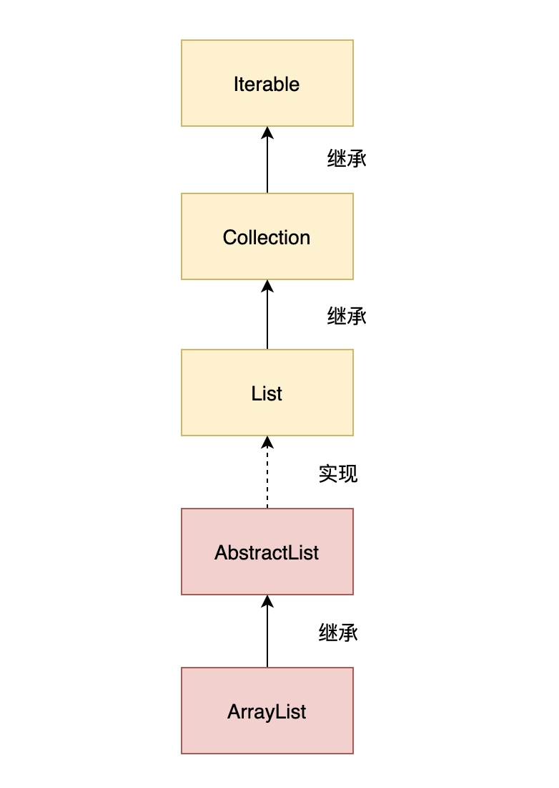


ArrayList实现了 List 接口，继承了 AbstractList 抽象类，其特性如下：
- 底层基于数组实现，并且实现了动态扩容
- 实现了 **RandomAccess 标记接口**，表示支持快速（通常是固定时间）随机访问
- 实现了 **Cloneable 接口**，元素本身不会被复制，因为元素不一定实现Cloneable接口，所以只能做到浅拷贝
  - 首先调用super.clone()实现字段复制，然后调用Arrays.copyOf得到elementData 数组的拷贝，因为数组存储引用，所以实际上**复制的是引用，而不是元素本身**
  - 字段会重置为0，保持语义一致性

```JAVA
/**
 * 返回该列表的浅表副本。
 * （元素本身不会被复制。）
 *
 * @return 该列表的副本
 */
public Object clone() {
    try {
        ArrayList<?> v = (ArrayList<?>) super.clone(); // 调用 Object 类的 clone 方法，得到一个浅表副本
        v.elementData = Arrays.copyOf(elementData, size); // 复制 elementData 数组，创建一个新数组作为副本
        v.modCount = 0; // 将 modCount 置为 0
        return v; // 返回副本
    } catch (CloneNotSupportedException e) {
        // this shouldn't happen, since we are Cloneable
        throw new InternalError(e);
    }
}
```
- 实现了**Serializable 标记接口**
  - Java 的序列化是指，**将对象转换成以字节序列的形式来表示**，**这些字节序中包含了对象的字段和方法**。序列化后的对象可以被写到数据库、写到文件，也可用于网络传输。
  - ArrayList 中的关键字段 elementData 使用了 **transient 关键字**修饰，表示**该字段不被序列化**
  - 因为扩容机制，所以可能会有大量的空位，所以实现了两个私有方法 writeObject 和 readObject 来完成序列化和反序列化，使用实际大小 size 而不是数组的长度（elementData.length）来作为元素的上限进行序列化

```JAVA
/**
 * 将此列表实例的状态序列写入指定的 ObjectOutputStream。
 * （即，保存这个列表实例到一个流中。）
 *
 * @param s 要写入的流
 * @throws java.io.IOException 如果写入流时发生异常
 */
private void writeObject(java.io.ObjectOutputStream s)
        throws java.io.IOException {
    s.defaultWriteObject(); // 写出对象的默认字段

    // Write out size as capacity for behavioral compatibility with clone()
    s.writeInt(size); // 写出 size

    // Write out all elements in the proper order.
    for (int i=0; i<size; i++) {
        s.writeObject(elementData[i]); // 依次写出 elementData 数组中的元素
    }
}

/**
 * 从指定的 ObjectInputStream 中读取此列表实例的状态序列。
 * （即，从流中恢复这个列表实例。）
 *
 * @param s 从中读取此列表实例的状态序列的流
 * @throws java.io.IOException 如果读取流时发生异常
 * @throws ClassNotFoundException 如果在读取流时找不到类
 */
private void readObject(java.io.ObjectInputStream s)
        throws java.io.IOException, ClassNotFoundException {
    elementData = EMPTY_ELEMENTDATA; // 初始化 elementData 数组为空数组

    // 读取默认字段
    s.defaultReadObject();

    // 读取容量，这个值被忽略，因为在 ArrayList 中，容量和长度是两个不同的概念
    s.readInt();

    if (size > 0) {
        // 分配一个新的 elementData 数组，大小为 size
        ensureCapacityInternal(size);

        Object[] a = elementData;
        // 依次从输入流中读取元素，并将其存储在数组中
        for (int i=0; i<size; i++) {
            a[i] = s.readObject(); // 读取对象并存储在 elementData 数组中
        }
    }
}
```


#### LinkedList的实现


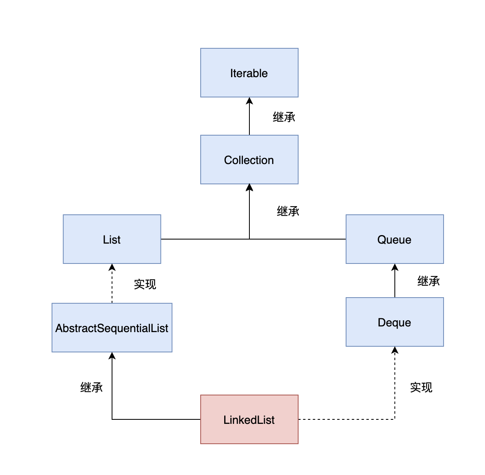

LinkedList 是一个继承自 AbstractSequentialList 的双向链表，因此它也可以被当作堆栈、队列或双端队列进行操作
- LinkedList 实现了 Cloneable 接口
- LinkedList 实现了 Serializable 接口
  - LinkedList 中的关键字段 size、first、last 都使用了 transient 关键字修饰
  - 提供writeObject() 方法：先写入size，随后，**Node节点的关键字段仅写入item，而不写入前后节点**
  - 提供readObject() 方法：先读取size，随后按照正确的顺序读取所有元素，并形成前后关系
```JAVA

private void writeObject(java.io.ObjectOutputStream s)
        throws java.io.IOException {
    // 写入默认的序列化标记
    s.defaultWriteObject();

    // 写入链表的节点个数
    s.writeInt(size);

    // 按正确的顺序写入所有元素
    for (LinkedList.Node<E> x = first; x != null; x = x.next)
        s.writeObject(x.item);
}


private void readObject(java.io.ObjectInputStream s)
        throws java.io.IOException, ClassNotFoundException {
    // 读取默认的序列化标记
    s.defaultReadObject();

    // 读取链表的节点个数
    int size = s.readInt();

    // 按正确的顺序读取所有元素
    for (int i = 0; i < size; i++)
        linkLast((E)s.readObject()); // 读取元素并将其添加到链表末尾
}

void linkLast(E e) {
    final LinkedList.Node<E> l = last;
    final LinkedList.Node<E> newNode = new LinkedList.Node<>(l, e, null);
    last = newNode; // 将新节点作为链表尾节点
    if (l == null)
        first = newNode; // 如果链表为空，将新节点作为链表头节点
    else
        l.next = newNode; // 否则将新节点链接到链表尾部
    size++; // 增加节点个数
}

```


#### 性能对比

**插入元素时**
- ArrayList插入元素的时间花销主要来自于元素复制，插入到非末尾位置时，会往后依次复制元素，扩容时也会复制数组；LinkedList插入元素的时间花销主要来自于遍历寻找插入位置。
- 在不涉及扩容时，除了插入到头部，其他情况下，ArrayList的性能好很多


**删除元素时**
- ArrayList删除元素的操作花销主要来自于往前复制元素（如果是remove(Object)方法则需要增加遍历花销）
- LinkedList删除元素的操作花销主要来自遍历，目标元素越靠近中部花销越大

**遍历元素时**
- 主要说明LinkedList的实现，node方法遍历前半或者后半，**因此`get(int index)`方法的复杂度是$O(n)$**

```JAVA
public E get(int index) {
    checkElementIndex(index);
    return node(index).item;
}

LinkedList.Node<E> node(int index) {
    // assert isElementIndex(index);

    if (index < (size >> 1)) { // 如果要查找的元素在链表的前半部分
        LinkedList.Node<E> x = first; // 从头节点开始遍历链表
        for (int i = 0; i < index; i++) // 循环查找元素
            x = x.next;
        return x; // 返回要查找的元素节点
    } else { // 如果要查找的元素在链表的后半部分
        LinkedList.Node<E> x = last; // 从尾节点开始遍历链表
        for (int i = size - 1; i > index; i--) // 循环查找元素
            x = x.prev;
        return x; // 返回要查找的元素节点
    }
}
```

- **普通for循环是错误的做法**，每次循环都调用get，其复杂度是$O(n^2)$


```JAVA

LinkedList<String> list = new LinkedList<String>();

for (int i = 0; i < list.size(); i++) {
    String item = list.get(i);  // get(i) 是 O(n) 操作！
    // 处理 item...
}
```

- **正确的做法是使用迭代器**：
  - 迭代器会返回内部私有类 ListItr 对象，执行 ListItr 的构造方法时调用了一次 node(int) 方法，返回第一个节点。在此之后，迭代器就执行 hasNext() 判断有没有下一个，执行 next() 方法下一个节点。
  - 注意不要把it.next()放在for循环第三部分
```JAVA
LinkedList<String> list = new LinkedList<String>();
for (String s : list) {
    ...
}

for (Iterator<String> it = list.iterator(); it.hasNext();) {
    it.next();
    ...//在这里执行
}

list.forEach(item -> System.out.println(item));
```


## Map
  
### HashMap

HashMap概述：
- HashMap基于哈希表，底层是一个数组，数组的每个位置可能是链表、红黑树或一个键值对
- 当添加一个键值对时，根据键的哈希值计算出该键对应的数组下标，然后将键值对插入到对应的位置
- 当通过键查找值时，也会根据键的哈希值计算出数组下标，并查找对应的值
- 因为哈希值和计算方式固定，所以`put(K key, V value)`方法**既可以添加元素也可以更改元素**
```JAVA
public class HashMap<K,V> extends AbstractMap<K,V>
    implements Map<K,V>, Cloneable, Serializable {

    public V put(K key, V value) {
        return putVal(hash(key), key, value, false, true);
    }
    public V remove(Object key) {
        Node<K,V> e;
        return (e = removeNode(hash(key), key, null, false, true)) == null ?
            null : e.value;
    }
    public V get(Object key) {
        Node<K,V> e;
        return (e = getNode(key)) == null ? null : e.value;
    }
}
```


#### 通过键的哈希值计算索引

`hashCode()`返回32位有符号整数，`h >>> 16`无符号右移16位，使用0填充高位，与h异或后，在低16位同时保留高位和低位的信息，即`hash(Object key)`方法所返回的扰动哈希码，扰动哈希码将用于索引计算

```JAVA
static final int hash(Object key) {
    int h;
    return (key == null) ? 0 : (h = key.hashCode()) ^ (h >>> 16);
}
```

索引计算
- 哈希码对数组长度取余可以平均分散到桶中，但是计算量很大$$hash\% length$$
- 将数组长度设置为$$2^n$$
- $hash \div 2^n = hash >> n$，即把 $hash$ 右移 $n$ 位，而被移掉的部分，则是$hash \% 2^n
$，也就是余数，即求低$n-1$位
- $2^n-1$的二进制由$n-1$个1构成，因此$$hash \% 2^n=hash\&2^n-1$$
- 在put或get方法中会使用取模运算

```JAVA

final V putVal(int hash, K key, V value, boolean onlyIfAbsent,
                   boolean evict) {
        //底层数组
        Node<K,V>[] tab;
        //元素 
        Node<K,V> p; 
        // n 为数组的长度 i 为下标
        int n, i;
        //数组为空先扩容
        if ((tab = table) == null || (n = tab.length) == 0)
            n = (tab = resize()).length;
        if ((p = tab[i = (n - 1) & hash]) == null)
            tab[i] = newNode(hash, key, value, null);
        else {...}
        ...
}

final Node<K,V> getNode(int hash, Object key) {
    // 获取当前的数组和长度，以及当前节点链表的第一个节点（根据索引直接从数组中找）
    Node<K,V>[] tab;
    Node<K,V> first, e;
    int n;
    K k;
    if ((tab = table) != null && (n = tab.length) > 0 &&
            (first = tab[(n - 1) & hash]) != null) {
        // 如果第一个节点就是要查找的节点，则直接返回
        if (first.hash == hash && ((k = first.key) == key || (key != null && key.equals(k))))
            return first;
        // 如果第一个节点不是要查找的节点，则遍历节点链表查找
        if ((e = first.next) != null) {
            do {
                if (e.hash == hash && ((k = e.key) == key || (key != null && key.equals(k))))
                    return e;
            } while ((e = e.next) != null);
        }
    }
    // 如果节点链表中没有找到对应的节点，则返回 null
    return null;
}
```

#### 扩容


```JAVA
public class HashMap<K,V> extends AbstractMap<K,V> {
    // 底层数组（哈希表），容量指底层数组的长度
    transient Node<K,V>[] table;
    
    // 实际存储的键值对数量
    transient int size;
    
    // 下一次扩容的阈值 = 容量 × 负载因子
    int threshold;
    
    // 负载因子（默认0.75）
    final float loadFactor;
    
    static class Node<K,V> implements Map.Entry<K,V> {
    final int hash;
    final K key;
    V value;
    Node<K,V> next;

    Node(int hash, K key, V value, Node<K,V> next) {
        this.hash = hash;
        this.key = key;
        this.value = value;
        this.next = next;
    }
}
```

扩容共三步，计算容量，新建数组，计算新索引并重新散列，将元素复制到新数组

JDK8加入红黑树，先以JDK7代码为例

- 计算新容量
  - 防止过小或过大导致哈希冲突过多或者浪费空间
  - jdk8将*2等价改为<<1

```JAVA
int newCapacity = oldCapacity * 2;
if (newCapacity < 0 || newCapacity >= MAXIMUM_CAPACITY) {
    newCapacity = MAXIMUM_CAPACITY;
} else if (newCapacity < DEFAULT_INITIAL_CAPACITY) {
    newCapacity = DEFAULT_INITIAL_CAPACITY;
}
```
- 创建新数组并计算新阀值
```JAVA
// newCapacity为新的容量
void resize(int newCapacity) {
    // 1. 保存旧数组引用
    Entry[] oldTable = table;
    
    // 2. 获取旧数组容量
    int oldCapacity = oldTable.length;
    
    // 3. 最大容量检查（2的30次方 = 1<<30）
    if (oldCapacity == MAXIMUM_CAPACITY) {
        // 容量已达到最大，不再扩容
        // 调整阈值为Integer的最大值（2^31-1），这样就不会再触发扩容
        threshold = Integer.MAX_VALUE;
        return;  // 直接返回，不进行扩容
    }

    // 4. 创建新数组
    Entry[] newTable = new Entry[newCapacity];
    
    // 5. 转移元素（核心步骤）
    transfer(newTable, initHashSeedAsNeeded(newCapacity));
    
    // 6. 更新HashMap的底层数组引用
    table = newTable;
    
    // 7. 重新计算阈值
    threshold = (int)Math.min(newCapacity * loadFactor, MAXIMUM_CAPACITY + 1);
}
```

- 再散列：拉链法，后插入的元素会放在头部，最先开始放入的元素会成为桶的尾部。在旧数组中同一个链表上的元素，通过重新计算索引位置后，有可能被放到了新数组的不同位置上。
```JAVA
void transfer(Entry[] newTable, boolean rehash) {
    // 新的容量
    int newCapacity = newTable.length;
    // 遍历小数组
    for (Entry<K,V> e : table) {
        while(null != e) {
            // 拉链法，相同 key 上的不同值
            Entry<K,V> next = e.next;
            // 是否需要重新计算 hash
            if (rehash) {
                e.hash = null == e.key ? 0 : hash(e.key);
            }
            // 根据大数组的容量，和键的 hash 计算元素在数组中的下标
            int i = indexFor(e.hash, newCapacity);

            // 同一位置上的新元素被放在链表的头部
            e.next = newTable[i];

            // 放在新的数组上
            newTable[i] = e;

            // 链表上的下一个元素
            e = next;
        }
    }
}
```


JDK8版本
- jdk7为每个元素重新计算索引，即使最终结果也是原位置或原位置+oldCap，但计算过程不区分
- jdk8**数组扩容后的索引位置，要么就是原来的索引位置，要么就是“原索引+原来的容量”**，所以拆分为两个链表，一个链表保存放在原索引位置的元素，一个链表保存放在“原索引+原来的容量”位置的元素。同时拆分两个链表也能处理红黑树
- jdk8更改为新元素插入到尾部，保证顺序不变

```JAVA
final Node<K,V>[] resize() {
    Node<K,V>[] oldTab = table;          // 保存旧数组引用
    int oldCap = (oldTab == null) ? 0 : oldTab.length;  // 旧容量
    int oldThr = threshold;              // 旧阈值
    int newCap, newThr = 0;              // 新容量、新阈值（初始为0）
    // 场景1：已存在数组（正常扩容）
    if (oldCap > 0) {
        if (oldCap >= MAXIMUM_CAPACITY) {  // 已达到最大容量
            threshold = Integer.MAX_VALUE;
            return oldTab;                  // 不再扩容
        }
        else if ((newCap = oldCap << 1) < MAXIMUM_CAPACITY &&  // 容量翻倍
                oldCap >= DEFAULT_INITIAL_CAPACITY)
            newThr = oldThr << 1;  // 阈值翻倍
    }

    // 场景2：首次初始化，但指定了初始容量
    else if (oldThr > 0)
        newCap = oldThr;  // 使用指定的初始容量

    // 场景3：首次初始化，使用默认值
    else {
        newCap = DEFAULT_INITIAL_CAPACITY;  // 16
        newThr = (int)(DEFAULT_LOAD_FACTOR * DEFAULT_INITIAL_CAPACITY);  // 12
    }
    if (newThr == 0) {
        float ft = (float)newCap * loadFactor;
        newThr = (newCap < MAXIMUM_CAPACITY && ft < (float)MAXIMUM_CAPACITY ?
                (int)ft : Integer.MAX_VALUE);
    }
    threshold = newThr;  // 更新全局阈值
    @SuppressWarnings({"rawtypes","unchecked"})
        Node<K,V>[] newTab = (Node<K,V>[])new Node[newCap]; // 创建新数组 newTab
    table = newTab; // 将新数组 newTab 赋值给成员变量 table
    if (oldTab != null) { // 如果旧数组 oldTab 不为空
        for (int j = 0; j < oldCap; ++j) { // 遍历旧数组的每个元素
            Node<K,V> e;
            if ((e = oldTab[j]) != null) { // 如果该元素不为空
                oldTab[j] = null; // 将旧数组中该位置的元素置为 null，以便垃圾回收
                if (e.next == null) // 如果该元素没有冲突
                    newTab[e.hash & (newCap - 1)] = e; // 直接将该元素放入新数组
                else if (e instanceof TreeNode) // 如果该元素是树节点
                    ((TreeNode<K,V>)e).split(this, newTab, j, oldCap); // 将该树节点分裂成两个链表
                else { // 如果该元素是链表
                    Node<K,V> loHead = null, loTail = null; // 低位链表的头结点和尾结点
                    Node<K,V> hiHead = null, hiTail = null; // 高位链表的头结点和尾结点
                    Node<K,V> next;
                    do { // 遍历该链表
                        next = e.next;
                        if ((e.hash & oldCap) == 0) { // 如果该元素在低位链表中
                            if (loTail == null) // 如果低位链表还没有结点
                                loHead = e; // 将该元素作为低位链表的头结点
                            else
                                loTail.next = e; // 如果低位链表已经有结点，将该元素加入低位链表的尾部
                            loTail = e; // 更新低位链表的尾结点
                        }
                        else { // 如果该元素在高位链表中
                            if (hiTail == null) // 如果高位链表还没有结点
                                hiHead = e; // 将该元素作为高位链表的头结点
                            else
                                hiTail.next = e; // 如果高位链表已经有结点，将该元素加入高位链表的尾部
                            hiTail = e; // 更新高位链表的尾结点
                        }
                    } while ((e = next) != null); //
                    if (loTail != null) { // 如果低位链表不为空
                        loTail.next = null; // 将低位链表的尾结点指向 null，以便垃圾回收
                        newTab[j] = loHead; // 将低位链表作为新数组对应位置的元素
                    }
                    if (hiTail != null) { // 如果高位链表不为空
                        hiTail.next = null; // 将高位链表的尾结点指向 null，以便垃圾回收
                        newTab[j + oldCap] = hiHead; // 将高位链表作为新数组对应位置的元素
                    }
                }
            }
        }
    }
    return newTab; // 返回新数组
}
```


#### 加载因子、红黑树、链表

临界值 = 初始容量 * 加载因子
- 加载因子越小，填满的数据就越少，哈希冲突的几率就减少了，但浪费了空间，而且还会提高扩容的触发几率；
- 加载因子越大，填满的数据就越多，空间利用率就高，但哈希冲突的几率就变大了。

Java 8 之前，HashMap 使用链表来解决冲突，即当两个或者多个键映射到同一个桶时，它们被放在同一个桶的链表上。当链表上的节点（Node）过多时，链表会变得很长，查找的效率（LinkedList 的查找效率为 O（n））就会受到影响。

Java 8 中，当链表的节点数超过一个阈值（8）时，链表将转为红黑树（节点为 TreeNode），红黑树是一种高效的平衡树结构，能够在 O(log n) 的时间内完成插入、删除和查找等操作。这种结构在节点数很多时，可以提高 HashMap 的性能和可伸缩性。
- 因为TreeNode（红黑树的节点）的大小大约是常规节点（链表的节点 Node）的两倍，所以只有当桶内包含足够多的节点时才使用红黑树（参见TREEIFY_THRESHOLD「阈值，值为8」，节点数量较多时，红黑树可以提高查询效率）。
- 由于删除元素或者调整数组大小（扩容）时（再次散列），红黑树可能会被转换为链表（节点数量小于 8 时），节点数量较少时，链表的效率比红黑树更高，因为红黑树需要更多的内存空间来存储节点。
- 在具有良好分布的hashCode使用中，很少使用红黑树。


为了减少哈希冲突发生的概率，当 HashMap 的数组长度达到一个临界值的时候，就会触发扩容，扩容后会将之前小数组中的元素转移到大数组中，这是一个相当耗时的操作。加载因子选取0.75和泊松分布有关


#### 线程不安全

1. 多线程下扩容会死循环
2. 多线程下 put 会导致元素丢失
3. put 和 get 并发时会导致 get 到 null


jdk7，多线程同时扩容，由于头部插入链表，可能导致死循环
- 线程1、2同时操作链表C-B-A-null完成扩容，每个线程保存局部的newTable
- 线程1指向C，next指向B后挂起，线程2完成扩容操作，此时原始链表更改为A-B-C-null
- 线程1继续执行
  - next指向B是临时变量，更新为C-null
  - 循环下一轮，线程指向B，next指向C，更新为C-B-null
  - 循环下一轮，线程指向C，next指向null，更新为C-B-C-null
- JDK 8 时已经修复了这个问题，扩容时会保持链表原来的顺序

多线程下 put 会导致元素丢失
- 步骤2可能会导致，如果计算出来的索引位置是相同的，那会造成前一个 key 被后一个 key 覆盖，从而导致元素的丢失。
```JAVA
final V putVal(int hash, K key, V value, boolean onlyIfAbsent,
               boolean evict) {
    Node<K,V>[] tab; Node<K,V> p; int n, i;

    // 步骤①：tab为空则创建
    if ((tab = table) == null || (n = tab.length) == 0)
        n = (tab = resize()).length;

    // 步骤②：计算index，并对null做处理
    if ((p = tab[i = (n - 1) & hash]) == null)
        tab[i] = newNode(hash, key, value, null);
    else {
        Node<K,V> e; K k;

        // 步骤③：节点key存在，直接覆盖value
        if (p.hash == hash &&
            ((k = p.key) == key || (key != null && key.equals(k))))
            e = p;

        // 步骤④：判断该链为红黑树
        else if (p instanceof TreeNode)
            e = ((TreeNode<K,V>)p).putTreeVal(this, tab, hash, key, value);

        // 步骤⑤：该链为链表
        else {
            for (int binCount = 0; ; ++binCount) {
                if ((e = p.next) == null) {
                    p.next = newNode(hash, key, value, null);

                    //链表长度大于8转换为红黑树进行处理
                    if (binCount >= TREEIFY_THRESHOLD - 1) // -1 for 1st
                        treeifyBin(tab, hash);
                    break;
                }

                // key已经存在直接覆盖value
                if (e.hash == hash &&
                    ((k = e.key) == key || (key != null && key.equals(k))))
                    break;
                p = e;
            }
        }

        // 步骤⑥、直接覆盖
        if (e != null) { // existing mapping for key
            V oldValue = e.value;
            if (!onlyIfAbsent || oldValue == null)
                e.value = value;
            afterNodeAccess(e);
            return oldValue;
        }
    }
    ++modCount;

    // 步骤⑦：超过最大容量 就扩容
    if (++size > threshold)
        resize();
    afterNodeInsertion(evict);
    return null;
}
```


put 和 get 并发时会导致 get 到 null
- 线程 1 执行 put 时，因为元素个数超出阈值而导致出现扩容，线程 2 此时执行 get，就有可能出现这个问题。


### LinkedHashMap

LinkedHashMap 继承HashMap，并在内部追加了双向链表，来维护元素的插入顺序，其内部节点追加before和after，并重写put和get方法

```JAVA
static class Entry<K,V> extends HashMap.Node<K,V> {
    Entry<K,V> before, after;
    Entry(int hash, K key, V value, Node<K,V> next) {
        super(hash, key, value, next);
    }
}
```


HashMap是无序的，但是遍历时第一个元素的键总是null（如果有null作为键）；但是在LinkedHashMap中，null键的键值对会遵从顺序。

LinkedhashMap可以维持访问顺序或者插入顺序，在初始化时传参决定。**true表示维护访问顺序，false表示维护插入顺序，默认false**

```JAVA
LinkedHashMap<String, String> map = new LinkedHashMap<>(16, .75f, true);
```


#### 访问顺序、LRU

最不经常访问的放在头部，可以使用LinkedHashMap实现LRU算法，即Least Recently Used 最近最少使用，是一种常用的页面置换算法，选择最近最久未使用的页面予以淘汰


LinkedHashMap通过重写下面这三个方法来维持访问顺序
```JAVA
/**
 * 在调用 get() 方法后被调用
 * 在访问节点后，将节点移动到链表的尾部
 *
 * @param e 要移动的节点
 */
void afterNodeAccess(HashMap.Node<K,V> e) { // move node to last
    LinkedHashMap.Entry<K,V> last;
    if (accessOrder && (last = tail) != e) { // 如果按访问顺序排序，并且访问的节点不是尾节点
        LinkedHashMap.Entry<K,V> p = (LinkedHashMap.Entry<K,V>)e, b = p.before, a = p.after;
        p.after = null; // 将要移动的节点的后继节点设为 null
        if (b == null)
            head = a; // 如果要移动的节点没有前驱节点，则将要移动的节点设为头节点
        else
            b.after = a; // 将要移动的节点的前驱节点的后继节点设为要移动的节点的后继节点
        if (a != null)
            a.before = b; // 如果要移动的节点有后继节点，则将要移动的节点的后继节点的前驱节点设为要移动的节点的前驱节点
        else
            last = b; // 如果要移动的节点没有后继节点，则将要移动的节点的前驱节点设为尾节点
        if (last == null)
            head = p; // 如果尾节点为空，则将要移动的节点设为头节点
        else {
            p.before = last; // 将要移动的节点的前驱节点设为尾节点
            last.after = p; // 将尾节点的后继节点设为要移动的节点
        }
        tail = p; // 将要移动的节点设为尾节点
        ++modCount; // 修改计数器
    }
}

/**
 * 在调用 put() 方法的时候被调用
 * 在插入节点后，如果需要，可能会删除最早加入的元素
 *
 * @param evict 是否需要删除最早加入的元素
 */
void afterNodeInsertion(boolean evict) { // possibly remove eldest
    LinkedHashMap.Entry<K,V> first;
    if (evict && (first = head) != null && removeEldestEntry(first)) { // 如果需要删除最早加入的元素
        K key = first.key; // 获取要删除元素的键
        removeNode(hash(key), key, null, false, true); // 调用 removeNode() 方法删除元素
    }
}
//在调用 remove() 方法的时候被调用。
void afterNodeRemoval(Node<K,V> p) { }
```


```JAVA
/**
 * 自定义的 MyLinkedHashMap 类，继承了 Java 中内置的 LinkedHashMap<K, V> 类。
 * 用于实现一个具有固定大小的缓存，当缓存达到最大容量时，会自动移除最早加入的元素，以腾出空间给新的元素。
 *
 * @param <K> 键的类型
 * @param <V> 值的类型
 */
public class MyLinkedHashMap<K, V> extends LinkedHashMap<K, V> {

    private static final int MAX_ENTRIES = 5; // 表示 MyLinkedHashMap 中最多存储的键值对数量

    /**
     * 构造方法，使用 super() 调用了父类的构造函数，并传递了三个参数：initialCapacity、loadFactor 和 accessOrder。
     *
     * @param initialCapacity 初始容量
     * @param loadFactor      负载因子
     * @param accessOrder     访问顺序
     */
    public MyLinkedHashMap(int initialCapacity, float loadFactor, boolean accessOrder) {
        super(initialCapacity, loadFactor, accessOrder);
    }

    /**
     * 重写父类的 removeEldestEntry() 方法，用于指示是否应该移除最早加入的元素。
     * 如果返回 true，那么将删除最早加入的元素。
     *
     * @param eldest 最早加入的元素
     * @return 如果当前 MyLinkedHashMap 中元素的数量大于 MAX_ENTRIES，返回 true，否则返回 false。
     */
    @Override
    protected boolean removeEldestEntry(Map.Entry elxdest) {
        return size() > MAX_ENTRIES;
    }

}
```


### TreeMap

TreeMap 由红黑树实现，可以保持元素的自然顺序，或者实现了 Comparator 接口的自定义顺序

#### 红黑树

红黑树是一种自平衡的二叉查找树（Binary Search Tree），结构复杂，但却有着良好的性能，完成查找、插入和删除的时间复杂度均为 log(n)。

二叉查找树是一种常见的树形结构，它的每个节点都包含一个键值对。每个节点的左子树节点的键值小于该节点的键值，右子树节点的键值大于该节点的键值，这个特性使得二叉查找树非常适合进行数据的查找和排序操作。左子树上所有节点的值均小于或等于它的根结点的值。右子树上所有节点的值均大于或等于它的根结点的值。左、右子树也分别为二叉查找树。二叉查找树的左右子树容易失衡，不平衡的二叉查找树可能会导致查找、插入和删除操作的效率下降


平衡二叉树保证树的左右两边的高度差不超过1。常见的平衡二叉树包括AVL树、红黑树等等，它们都是通过旋转操作来调整树的平衡，使得左子树和右子树的高度尽可能接近。
- AVL树是一种高度平衡的二叉查找树，它要求左子树和右子树的高度差不超过1。由于AVL树的平衡度比较高，因此在进行插入和删除操作时需要进行更多的旋转操作来保持平衡，但是在查找操作时效率较高。AVL树适用于读操作比较多的场景。

红黑树通过颜色的约束来维持二叉树的平衡，它要求
- 每个节点都只能是红色或者黑色

- 根节点是黑色

- 每个叶节点（NIL 节点，空节点）是黑色的。

- 如果一个节点是红色的，则它两个子节点都是黑色的。也就是说在一条路径上不能出现相邻的两个红色节点。

- 从任一节点到其每个叶子的所有路径都包含相同数目的黑色节点


#### 实现与排序

put()方法
- 首先定义一个Entry类型的变量t，用于表示当前的根节点；

- 如果t为null，说明TreeMap为空，直接创建一个新的节点作为根节点，并将size设置为1；

- 如果t不为null，说明需要在TreeMap中查找键所对应的节点。因为TreeMap中的元素是有序的，所以可以使用二分查找的方式来查找节点；

- **如果TreeMap中使用了Comparator来进行排序，则使用Comparator进行比较，否则使用Comparable进行比较**。如果查找到了相同的键，则直接更新键所对应的值；

- 如果没有查找到相同的键，则创建一个新的节点，并将其插入到TreeMap中。然后使用fixAfterInsertion()方法来修正插入节点后的平衡状态；

- 最后将TreeMap的size加1，然后返回null。如果更新了键所对应的值，则返回原先的值。


```JAVA
public V put(K key, V value) {
    Entry<K,V> t = root; // 将根节点赋值给变量t
    if (t == null) { // 如果根节点为null，说明TreeMap为空
        compare(key, key); // type (and possibly null) check，检查key的类型是否合法
        root = new Entry<>(key, value, null); // 创建一个新节点作为根节点
        size = 1; // size设置为1
        return null; // 返回null，表示插入成功
    }
    int cmp;
    Entry<K,V> parent;
    // split comparator and comparable paths，根据使用的比较方法进行查找
    Comparator<? super K> cpr = comparator; // 获取比较器
    if (cpr != null) { // 如果使用了Comparator
        do {
            parent = t; // 将当前节点赋值给parent
            cmp = cpr.compare(key, t.key); // 使用Comparator比较key和t的键的大小
            if (cmp < 0) // 如果key小于t的键
                t = t.left; // 在t的左子树中查找
            else if (cmp > 0) // 如果key大于t的键
                t = t.right; // 在t的右子树中查找
            else // 如果key等于t的键
                return t.setValue(value); // 直接更新t的值
        } while (t != null);
    }
    else { // 如果没有使用Comparator
        if (key == null) // 如果key为null
            throw new NullPointerException(); // 抛出NullPointerException异常
            Comparable<? super K> k = (Comparable<? super K>) key; // 将key强制转换为Comparable类型
        do {
            parent = t; // 将当前节点赋值给parent
            cmp = k.compareTo(t.key); // 使用Comparable比较key和t的键的大小
            if (cmp < 0) // 如果key小于t的键
                t = t.left; // 在t的左子树中查找
            else if (cmp > 0) // 如果key大于t的键
                t = t.right; // 在t的右子树中查找
            else // 如果key等于t的键
                return t.setValue(value); // 直接更新t的值
        } while (t != null);
    }
    // 如果没有找到相同的键，需要创建一个新节点插入到TreeMap中
    Entry<K,V> e = new Entry<>(key, value, parent); // 创建一个新节点
    if (cmp < 0) // 如果key小于parent的键
        parent.left = e; // 将e作为parent的左子节点
    else
        parent.right = e; // 将e作为parent的右子节点
    fixAfterInsertion(e); // 插入节点后需要进行平衡操作
    size++; // size加1
    return null; // 返回null，表示插入成功
}
```


- 自然顺序，比较对象实现Comparable接口，在compareTo方法中实现比较
- 自定义顺序：传入Comparator构造器，调用compare方法指定排序规则

排序的好处
- 提供了 lastKey()、firstKey() 这样获取最后一个 key 和第一个 key 的方法。
- headMap() 获取的是到指定 key 之前的 key；tailMap() 获取的是指定 key 之后的 key（包括指定 key）。

### NavigableMap

### WeakHashMap

在正常的业务逻辑中，`HashMap` 是非常好用的。但当我们将 `HashMap` 用作 **缓存（Cache）** 或 **元数据存储（Metadata Storage）** 时，它会暴露出一个致命问题：**强引用导致的内存泄漏**。

* **痛点场景**：假设你需要一个全局 `Map` 来记录每个 `User` 对象的最后登录时间。
* **强引用枷锁**：`HashMap` 的 `Entry` 对 `Key` 和 `Value` 都是**强引用**。
* **后果**：即便你的业务系统已经处理完了某个用户，不再需要这个 `User` 对象了，但只要这个 `User` 还作为 Key 呆在 `HashMap` 里，GC 就永远不敢回收它。
* **结果**：随着时间推移，这个 `Map` 会越来越大，充斥着大量“逻辑上已死亡”但“物理上仍存活”的对象，最终导致 `OOM`。

---

为了解决上述痛点，Java 提供了 `WeakHashMap`。它的核心特性是：**对 Key 的引用是“弱引用（WeakReference）”**。

**核心原理**：
1.  **弱引用 Key**：`WeakHashMap` 内部的 `Entry` 继承了 `WeakReference<K>`。它只对 Key 持有弱引用。
2.  **自动清理机制**：
    * 当某个 Key 在程序中除了这个 `Map` 之外不再有任何**强引用**指向它时，GC 会在下一次运行时回收这个 Key。
    * Key 被回收后，该 `Entry` 会进入一个 **引用队列（ReferenceQueue）**。
    * `WeakHashMap` 在你下次调用 `get()`、`put()`、`size()` 等任何方法时，都会先去扫一遍这个队列，把那些 Key 已经消失的 `Entry` 彻底从 Map 中移除。

---

WeakHashMap 的核心应用场景

1.  **缓存（Cache）**：
    - 这是最经典的应用。比如 `Tomcat` 源码中就大量使用了 `WeakHashMap` 来存储类加载器（ClassLoader）相关的缓存，防止类加载器因为被缓存引用而无法卸载。
2.  **对象的元数据关联**：
    - 如果你想给某个类增加一些额外的属性，但又不想修改类定义，可以使用 `WeakHashMap`。当该对象被销毁时，你额外记录的这些元数据也会自动消失。

```JAVA
public class UserMetadataExample {
    // 外部扩展柜：Key 是 User 对象，Value 是我们要额外记录的元数据
    private static WeakHashMap<User, UserExtraInfo> extraInfoMap = new WeakHashMap<>();

    public static void main(String[] args) {
        // 1. 创建一个用户对象（强引用）
        User user = new User("阿强");

        // 2. 关联一些外部属性，而不需要修改 User 类本身
        extraInfoMap.put(user, new UserExtraInfo("VIP客户", "2024-12-31"));

        // 3. 此时可以随时获取元数据
        System.out.println("用户信息：" + extraInfoMap.get(user));

        // 4. 当我们将 user 置为 null，唯一的强引用断开了
        user = null;

        // 5. 等待 GC 后，extraInfoMap 里的这一条记录会自动消失
        // 不会因为 Map 里的引用而导致 User 对象及其关联的 UserExtraInfo 发生内存泄漏
    }
}

// 假设这是第三方库里的类，你无法修改
class User {
    String name;
    public User(String name) { this.name = name; }
}

// 这是你想额外增加的信息
class UserExtraInfo {
    String tag;
    String expireDate;
    public UserExtraInfo(String t, String e) { this.tag = t; this.expireDate = e; }
    @Override
    public String toString() { return tag + " (过期时间: " + expireDate + ")"; }
}
```
---

使用 WeakHashMap 的致命陷阱（必记！）
* **Value 不要反向引用 Key**：
    如果你的 `Value` 对象内部持有了 `Key` 的强引用（比如 `map.put(key, new Data(key))`），那么这个 Key 实际上依然存在一条通往 GC Roots 的强引用链：`WeakHashMap -> Entry -> Value -> Key`。
    **这会导致弱引用失效，内存泄漏卷土重来！**

* **不要使用基本类型的包装类或字符串常量作为 Key**：
    像 `Integer i = 1` 或 `String s = "static"` 这种对象，JVM 内部会有缓存池，它们可能永远不会被 GC 回收。在这种情况下，`WeakHashMap` 就退化成了普通的 `HashMap`。


## Set

## Queue、Deque
### ArrayDeque

#### Deque和Queue
`ArrayDeque implements  Deque implements  Queue` ，因此**双端队列ArrayDeque可以是栈或者队列**
- LinkedList同时实现List和Deque接口，因此栈和队列也可以用LinkedList实现
- Queue和Deque完美体现了多态的语义，但是违反了ISP接口隔离原则，好处是实现了代码复用
  - Queue仅定义了队列的基本操作，可以是FIFO也可以是优先级队列；
  - Deque承载三种语义：FIFO单段队列、双端队列、栈
  - 因此在对象使用接口而不是具体类命名时，名字应该清晰指出语义，或者包装类仅暴露需要的方法

**作为单端队列使用时，只能在队尾插入、队首移出、队首查看元素，失败时返回false、返回null或者抛出异常**


| Queue 方法 | 等效的 Deque 方法 | 说明 |
|-----------|------------------|------|
| `add(e)` | `addLast(e)` | 向队尾插入元素，失败则抛出异常 |
| `offer(e)` | `offerLast(e)` | 向队尾插入元素，失败则返回 `false` |
| `remove()` | `removeFirst()` | 获取并删除队首元素，失败则抛出异常 |
| `poll()` | `pollFirst()` | 获取并删除队首元素，失败则返回 `null` |
| `element()` | `getFirst()` | 获取但不删除队首元素，失败则抛出异常 |
| `peek()` | `peekFirst()` | 获取但不删除队首元素，失败则返回 `null` |

**作为对栈的抽象时，仅使用push、pop、peek方法**，在失败时抛出异常

| Stack 方法 | 等效的 Deque 方法 | 说明 |
|-----------|------------------|------|
| `push(e)` | `addFirst(e)` | 向栈顶插入元素，失败则抛出异常 |
| 无 | `offerFirst(e)` | 向栈顶插入元素，失败则返回 `false` |
| `pop()` | `removeFirst()` | 获取并删除栈顶元素，失败则抛出异常 |
| 无 | `pollFirst()` | 获取并删除栈顶元素，失败则返回 `null` |
| `peek()` | `getFirst()` | 获取但不删除栈顶元素，失败则抛出异常 |
| 无 | `peekFirst()` | 获取但不删除栈顶元素，失败则返回 `null` |

#### 底层实现


该容器实现**不允许放入null**，**因为查看或者弹出元素的方法可能返回null表示失败**。

ArrayDeque底层是**循环数组**，
- **head指向首端第一个有效元素，tail指向尾端第一个可以插入元素的空位**，**数组的每一个下标都可能是起点或终点**，因此tail的下标可能比head小


**addFirst方法**
- 空间足够且下标未越界时，只需要head-1位置放入元素即可。否则需要取模运算，但是ArrayDeque使用位运算代替取模运算。
- **循环数组的长度限制为$2^n$**，**因此`elements.length - 1`的二进制低位全是1，高位全是0**
- head-1的越界情况仅有一种，即-1，此时二进制全为1，与`elements.length - 1`相与操作后，等价于结果为`elements.length - 1`，即数组的最后一位。
- 因为tail始终指向下一个要插入的位置，而head指向第一个元素，因此ArrayDeque始终有空位，当head==tail为true时，需要扩容
```JAVA
//addFirst(E e)
public void addFirst(E e) {
    if (e == null)//不允许放入null
        throw new NullPointerException();
    elements[head = (head - 1) & (elements.length - 1)] = e;//2.下标是否越界
    if (head == tail)//1.空间是否够用
        doubleCapacity();//扩容
}
```

`doubleCapacity()`方法
- 复制分两步，因为tail一定等于head，且数组满，所以先复制head右半，再复制左半，然后重置head和tail，可以验证右半一定是在前面的元素，保证了元素顺序
```JAVA
//doubleCapacity()
private void doubleCapacity() {
    assert head == tail;
    int p = head;
    int n = elements.length;
    int r = n - p; // head右边元素的个数
    int newCapacity = n << 1;//原空间的2倍
    if (newCapacity < 0)
        throw new IllegalStateException("Sorry, deque too big");
    Object[] a = new Object[newCapacity];
    System.arraycopy(elements, p, a, 0, r);//复制右半部分，对应上图中绿色部分
    System.arraycopy(elements, 0, a, r, p);//复制左半部分，对应上图中灰色部分
    elements = (E[])a;
    head = 0;
    tail = n;
}
```

`addLast`方法
- tail+1==elements.length时，低位全是0，与elements.length - 1相与操作后为0，其他情况取tail+1的原值

```JAVA
public void addLast(E e) {
    if (e == null)//不允许放入null
        throw new NullPointerException();
    elements[tail] = e;//赋值
    if ( (tail = (tail + 1) & (elements.length - 1)) == head)//下标越界处理
        doubleCapacity();//扩容
}
```
`pollFirst`方法
- 取得原值并使用null覆盖该元素，更改head值，并处理越界情况

```JAVA
public E pollFirst() {
    E result = elements[head];
    if (result == null)//null值意味着deque为空
        return null;
    elements[h] = null;//let GC work
    head = (head + 1) & (elements.length - 1);//下标越界处理
    return result;
}
```
`pollLast`方法
- 如果取得的tail为null，则deque为空，返回null，否则更改tail值并使用null覆盖元素，然后返回元素
```JAVA
public E pollLast() {
    int t = (tail - 1) & (elements.length - 1);//tail的上一个位置是最后一个元素
    E result = elements[t];
    if (result == null)//null值意味着deque为空
        return null;
    elements[t] = null;//let GC work
    tail = t;
    return result;
}
```

没有使用modCount，不支持fail-fast，因此其迭代器是弱一致性的，而LinkedList继承自AbstractSequentialList，拥有modCount，好处是高性能
- 不要通过迭代器修改ArrayDeque，或者在迭代器遍历时修改ArrayDeque，尽量作为纯队列、栈操作

### PriorityQueue

PriorityQueue 是一个基于优先级堆的优先队列实现，它能够在 O(log n) 的时间复杂度内实现元素的插入和删除操作，并且能够自动维护队列中元素的优先级顺序
- PriorityQueue只关心最值，其内部元素不一定有序，TreeMap维护所有元素有序

```JAVA
// 创建 PriorityQueue 对象，并指定优先级顺序
PriorityQueue<String> priorityQueue = new PriorityQueue<>(Comparator.reverseOrder());

// 添加元素到 PriorityQueue
priorityQueue.offer("沉默王二");
priorityQueue.offer("陈清扬");
priorityQueue.offer("小转铃");

// 打印 PriorityQueue 中的元素
System.out.println("PriorityQueue 中的元素：");
while (!priorityQueue.isEmpty()) {
    System.out.print(priorityQueue.poll() + " ");
}
```

堆
- **小顶堆**是一个完全二叉树，**任何一个非叶子节点的权值，都不大于其左右子节点的权值**，这样保证了队列的顶部元素（堆顶）一定是优先级最高的元素。
- 完全二叉树是一种二叉树，其中除了最后一层，其他层的节点数都是满的，最后一层的节点都靠左对齐
- 因为完全二叉树的结构比较规则，所以**可以使用数组来存储堆的元素**，而不需要使用指针等额外的空间。在堆中，**每个节点的下标和其在数组中的下标是一一对应**的，**假设节点下标为i，则其父节点下标为(i-1)/2，其左子节点下标为2i+1，其右子节点下标为2i+2**。
  - <0时是根节点
- 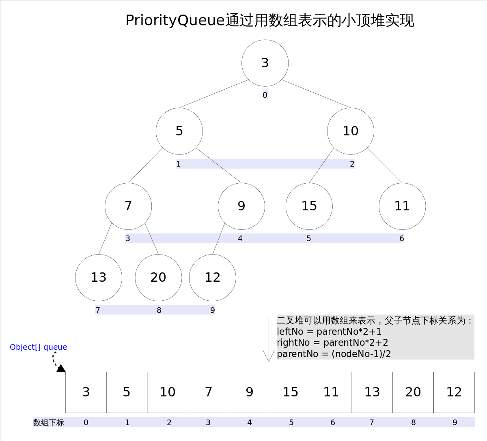


#### 底层实现

`add()`和 `offer()`
- 因为实现Queue接口，所以可以使用add或offer方法，又因为查看或者获取元素会返回null，所以不允许存储null元素
- 扩容函数grow()类似于ArrayList里的grow()函数，就是再申请一个更大的数组，并将原数组的元素复制过去
- `siftUp(int k, E x)`方法，该方法用于插入元素x并维持堆的特性。
- size即为要插入的下标，如果size和queue.length相等，则需要扩容。
- 通过(k - 1) >>> 1获取父节点的下标，因为不可能是根节点，所以k-1不会越界
- `comparator.compare(x, (E) e) >= 0` 
  - **PriorityQueue默认使用自然顺序，即最小堆**，**可以传入反转顺序的比较器，即最大堆**。此处的最小最大是符合compare或compareTo语义上的最小最大。
  - 例如完全可以让自然顺序语义中，更大的数更小，与数学语义相反，仍是最小堆
- 每次循环末尾都会将父节点的元素让在右节点上，退出循环后将元素放置在正确的结点上，整个过程最坏只会遍历$log(n)$个节点，即树高
```JAVA

public boolean add(E e) {
    return offer(e);
}


//offer(E e)
public boolean offer(E e) {
    if (e == null)
        throw new NullPointerException();
    modCount++;
    int i = size;
    if (i >= queue.length)
        grow(i + 1);
    size = i + 1;
    if (i == 0)
        queue[0] = e;
    else
        siftUp(i, e);
    return true;
}

private void siftUp(int k, E x) {
    if (comparator != null)
        siftUpUsingComparator(k, x);
    else
        siftUpComparable(k, x);
}

@SuppressWarnings("unchecked")
private void siftUpComparable(int k, E x) {
    Comparable<? super E> key = (Comparable<? super E>) x;
    while (k > 0) {
        int parent = (k - 1) >>> 1;
        Object e = queue[parent];
        if (key.compareTo((E) e) >= 0)
            break;
        queue[k] = e;
        k = parent;
    }
    queue[k] = key; 
}

@SuppressWarnings("unchecked")
private void siftUpUsingComparator(int k, E x) {
    while (k > 0) {
        int parent = (k - 1) >>> 1;
        Object e = queue[parent];
        if (comparator.compare(x, (E) e) >= 0)
            break;
        queue[k] = e;
        k = parent;
    }
    queue[k] = x;
}
```


`element()`和 `peek()`
- 直接返回0下标元素即可
```JAVA
//peek()
public E peek() {
    if (size == 0)
        return null;
    return (E) queue[0];//0下标处的那个元素就是最小的那个
}

```

`remove()`和 `poll()`
- remove和poll方法相同，主要说明下沉操作
- 从根节点k=0开始遍历，获取子节点下标`child = (k << 1) + 1;right = child + 1`
- 获取最后一个元素，作为key，先放在k位置，直到比子节点中的较小值还小时停止下沉，否则交换该元素和子节点中的较小值
- 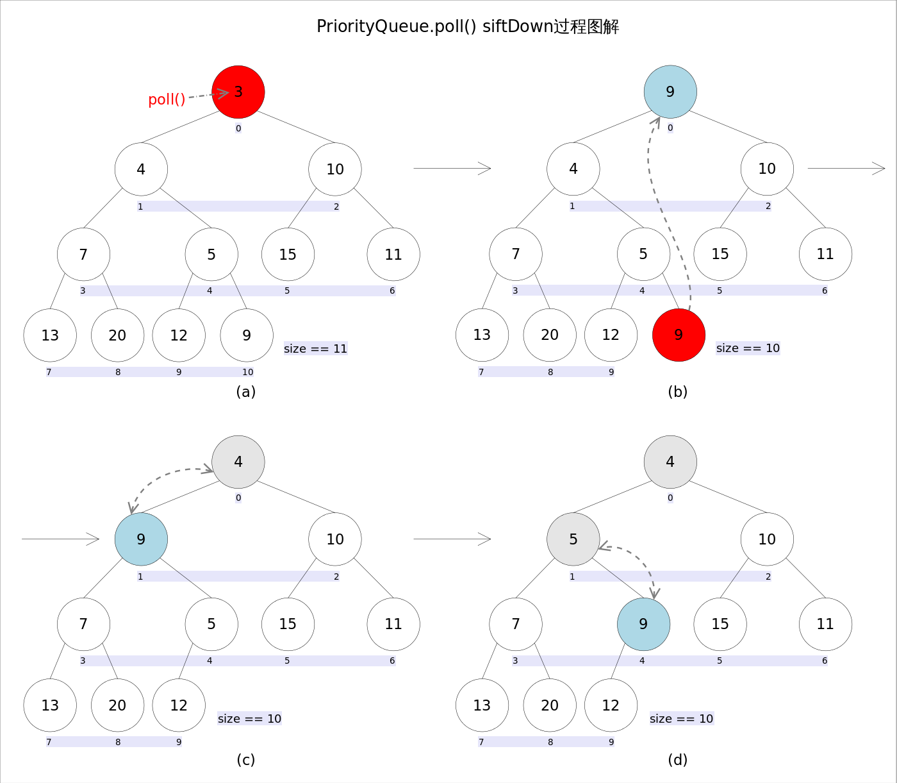
```JAVA
    public E remove() {
        E x = poll();
        if (x != null)
            return x;
        else
            throw new NoSuchElementException();
    }

    public E poll() {
        if (size == 0)
            return null;
        int s = --size;
        modCount++;
        E result = (E) queue[0];
        E x = (E) queue[s];
        queue[s] = null;
        if (s != 0)
            siftDown(0, x);
        return result;
    }

    private void siftDown(int k, E x) {
        if (comparator != null)
            siftDownUsingComparator(k, x);
        else
            siftDownComparable(k, x);
    }

    @SuppressWarnings("unchecked")
    private void siftDownComparable(int k, E x) {
        Comparable<? super E> key = (Comparable<? super E>)x;
        int half = size >>> 1;        // loop while a non-leaf
        while (k < half) {
            int child = (k << 1) + 1; // assume left child is least
            Object c = queue[child];
            int right = child + 1;
            if (right < size &&
                ((Comparable<? super E>) c).compareTo((E) queue[right]) > 0)
                c = queue[child = right];
            if (key.compareTo((E) c) <= 0)
                break;
            queue[k] = c;
            k = child;
        }
        queue[k] = key;
    }

    @SuppressWarnings("unchecked")
    private void siftDownUsingComparator(int k, E x) {
        int half = size >>> 1;
        while (k < half) {
            int child = (k << 1) + 1;
            Object c = queue[child];
            int right = child + 1;
            if (right < size &&
                comparator.compare((E) c, (E) queue[right]) > 0)
                c = queue[child = right];
            if (comparator.compare(x, (E) c) <= 0)
                break;
            queue[k] = c;
            k = child;
        }
        queue[k] = x;
    }

```

`remove(Object o)`：删除队列中跟o相等的某一个元素（如果有多个相等，只删除一个）
- 该方法不是Queue接口内的方法，而是Collection接口的方法
- 情况一：删除的是最后一个元素。直接删除即可，不需要调整。
- 情况二：删除的不是最后一个元素时，将最后一个元素移动到删除位置，然后先尝试持续下沉操作。如果下沉后该元素仍在原位置，再尝试持续上浮操作。
- 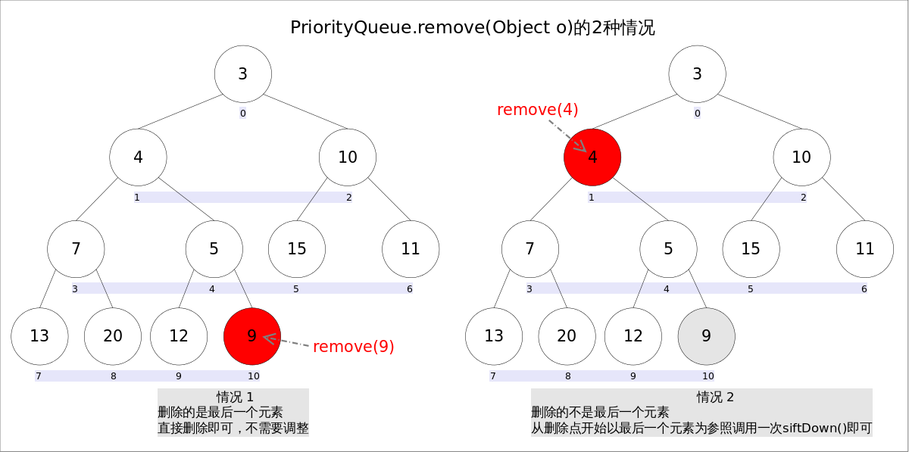

```JAVA
public boolean remove(Object o) {
    int i = indexOf(o);
    if (i == -1)
        return false;
    else {
        removeAt(i);
        return true;
    }
}

private int indexOf(Object o) {
    if (o != null) {
        for (int i = 0; i < size; i++)
            if (o.equals(queue[i]))
                return i;
    }
    return -1;
}

private E removeAt(int i) {
    // assert i >= 0 && i < size;
    modCount++;
    int s = --size;
    if (s == i) // removed last element
        queue[i] = null;
    else {
        E moved = (E) queue[s];
        queue[s] = null;
        siftDown(i, moved);
        if (queue[i] == moved) {
            siftUp(i, moved);
            if (queue[i] != moved)
                return moved;
        }
    }
    return null;
}
```

## 时间复杂度

大O表示法，代码执行时间随数据规模变化的变化趋势；不关心代码具体的执行时间
- $O(1)$：代码执行时间和数据规模无关
- $O(n)$：时间复杂度和数据规模 n 是线性关系
- $O(logn)$：时间复杂度和数据规模 n 是对数关系
- $O(n^2)$：两次嵌套循环
- $O(2^n)$：递归将问题拆分为两个子问题

## 泛型


**泛型类是具有一个或多个类型参数的类**
- 类型参数声明在类名后，用尖括号<>括起，使用具体类型替换类型参数以实例化泛型类
- **使用限定符`<E extends Father>`缩小泛型的类型参数范围，仅兼容`Father`及其子类元素**
- 可以将子类对象赋值给父类引用，因此`ArrayList<Father>`可以存放`Father`及其子类元素

```JAVA

public class ArrayList<E>{}

public class Main{
    public static void main(String[] args) {
        ArrayList<Father> fathers = new ArrayList<Father>();
        fathers.add(new Father());
        fathers.add(new Son());
        for (Father father : fathers) {
            System.out.println(father);
        }
    }
}
class Father {
    public String toString() {
        return "Father";
    }
}

class Son extends Father{
    public String toString() {
        return "Son";
    }
}

class GrandSon extends Son{
    public String toString() {
        return "GrandSon";
    }
}
```
**泛型方法**
- 可以在泛型类或非泛型类中定义泛型方法
- **泛型方法的类型参数独立于类的类型参数**，即使它们采用相同的符号
```JAVA
// 类的类型参数T
class Box<T> {       
    // 方法的类型参数T（与类的T无关）             
    public <T> void method(T t) {}
    // 使用不同符号更清晰
    public <U> U process(U u) {}
}
```


泛型提供了编译时类型检查，确保类型安全；实例化后，只能存入与指定类型兼容的元素

### 类型擦除

泛型仅在编译器检查，虚拟机会将泛型的类型变量擦除
- `<E>`，使用Object替换类型变量E
- `<E extends Father>`，使用Father替换类型变量E

类型擦除可能导致方法签名冲突，例如以下代码，擦除后方法签名相同会冲突
```JAVA
public class Cmower {
    
    public static void method(Arraylist<String> list) {
        System.out.println("Arraylist<String> list");
    }

    public static void method(Arraylist<Date> list) {
        System.out.println("Arraylist<Date> list");
    }

}
```
### 通配符
**泛型不变性**
- **协变**（covariant）：如果B是A的子类型，那么Generic`<B>`也是Generic`<A>`的子类型。
- **逆变**（contravariant）：如果B是A的子类型，那么Generic`<A>`是Generic`<B>`的子类型。
- **不变**（invariant）：Generic`<A>`和Generic`<B>`之间没有子类型关系，除非A和B完全相同

**通配符解决容器的协变问题，而不是容器内元素的协变问题**
- `ArrayList<Father>`容器天然可以添加Father及其子类，这是容器内元素的协变，是多态的性质，即父类引用可以安全的指向子类对象

#### **`<? extends T>`通配符**

由于泛型不变性，`ArrayList<Son>` 不是 `ArrayList<Father>` 的子类型

**`<? extends Father>`通配符赋予容器协变的能力**
- **`ArrayList<? extends Father>`只能通过`ArrayList<Father>`或`ArrayList<Son>`引用赋值**
- `ArrayList<? extends Father>`容器可以安全的将所有元素读取为Father类型
- 编译时：编译器仅能确定`ArrayList<? extends Father>`容器的元素类型是`? extends Father`，该类型不是Father或其任何一种子类，因此**无法向其添加任何元素**
  - 唯一例外的是 null，因为null是所有类型的对象
  - 下述代码中，`ArrayList<? extends Father>`和`ArrayList<Son>`引用指向同一个对象，假设用户可以可以向`ArrayList<? extends Father> fathers`添加元素，可能会添加Father对象；由于`ArrayList<Son>`只能接受Son及其子类，就造成了多态错误
```JAVA
    public static void main(String[] args) {
        ArrayList<Son> sons = new ArrayList<Son>();
        sons.add(new Son());
        ArrayList<? extends Father> fathers = sons;
        for (Father f : fathers) {
            System.out.println(f.toString());
        }
    }
```

#### `<? super Son>`通配符

**`<? super Son>`通配符赋予容器逆变的能力**
- `ArrayList<? super Son>`可以通过`ArrayList<Son>`或`ArrayList<Father>`引用赋值
- 通过多态、类型推断，可以安全的添加Son及其子类元素，但是无法添加Son的某个父类元素，例如Father
- `<? super Son>`读取时只能读取为Object，如果强制转换为具体类型，可能失败

```JAVA
ArrayList<? super Son> sons2 = new ArrayList<Son>();
sons2.add(new Son());
sons2.add(new GrandSon());
```


`<?>`无界通配符
- 可以理解为`<? extends Object>`，表示“完全未知的类型”
- 除了 null，不能添加任何元素，这是在编译器限制的，用户无法提供任何? extends Object类型的元素
- 读取 (get)：取出的元素只能是 Object 类型。
- `<?>`：只关心容器属性，而不关心其内部元素时使用
```JAVA
boolean isEmpty(List<?> list) { // 接受任何List，与元素类型无关
    return list == null || list.size() == 0;
}
```

#### 在方法参数中使用通配符
**PECS**：**生产时使用`? extends`协变，消费时使用`? super`逆变**。既是生产者也是消费者不能使用通配符
- 通配符为方法参数划定未知类型的上下限：
  - <? extends T> 设定了上界为T，表示未知类型是T或T的子类
  - <? super T> 设定了下界为T，表示未知类型是T或T的父类
  - <?> 无界通配符，相当于<? extends Object>，没有指定边界，但实际上是上界为Object
- 划定上下限后方法参数能适配更多类型，在保证类型安全的前提下尽可能地实现方法复用
```JAVA
// 上界通配符：只能接受Number及其子类的列表
public void processNumbers(List<? extends Number> list) {
    for (Number n : list) {
        System.out.println(n.doubleValue());
    }
}

// 下界通配符：只能接受Integer及其父类的列表
public void addInteger(List<? super Integer> list) {
    list.add(42);
}

// 限定 dest只能是T及其父类的列表，src只能是T及其子类的列表
public class Collections {
    public static <T> void copy(List<? super T> dest, List<? extends T> src) {}
}
public class Main{
    public static void main(String[] args) {
        /**
         *  objs 是 List<? super T> → T 可以是 Integer 或父类
         * ints 是 List<? extends T> → T 可以是 Integer 或父类
         * 两者交集：最小的共同类型是 Integer
         * 所以 T 被推断为 Integer
         * /
        List<Integer> ints = Arrays.asList(1, 2, 3);
        List<Object> objs = new ArrayList<>();
        Collections.copy(objs, ints);  // T 被推断为 Object
    }
}

```

- 传入指定类型为(T,R)的Function表达式，匹配T及其父类作为消费者，匹配R及其子类作为生产者作为返回值
```JAVA
@FunctionalInterface
public interface Function<T, R> {
    R apply(T t);
}
public interface CompletionStage<T> {
    public <U> CompletionStage<U> thenApply(Function<? super T,? extends U> fn);
}

//推断为thenApply(Function<? super String,? extends String> fn)
//允许传入任何类型的对象作为消费者
Function<Object, String> existingFunc = obj -> obj.toString().toUpperCase();
CompletableFuture.supplyAsync(() -> "Hello World").thenApply(existingFunc);
        
``` 

#### 在返回值中使用`<? extends Number>`


**在返回值中，通常使用<? extends T>来提供只读的、协变的返回值**，或者返回具体的泛型`<T>`。几乎不会使用`<? super T>`逆变
```java
// 1. 返回只读视图（生产者）
public List<? extends Number> getNumbers() {
    return Collections.unmodifiableList(numberList);
    // 调用方只能读取，不能修改
}

// 2. 返回类型未知但有限制的集合
public List<? extends Comparable<?>> getComparables() {
    return listOfComparables;  // 可以是任何可比较对象的列表
}

// 3. 返回完全未知的类型（少用）
public List<?> getUnknownList() {
    return someList;
}
```
## Iterable、Iterator

### Iterable接口

Collection接口扩展 **`Iterable`泛型接口**，通过`iterator()`方法获取可遍历集合的迭代器
- 是迭代器模式的标准实现：集合负责存储，迭代器负责遍历
  - **支持多种遍历方式**：一个集合可以有多个独立的迭代器；假设让集合直接集成迭代器，就只能支持一种迭代方式了；
  - Iterable表示该集合支持迭代，而Iterator表示如何迭代，而`Iterator<T> iterator();`表示标准迭代方式，由集合实现决定，集合也可以实现其他方法，返回不同的迭代器
  - 使用`Consumer<? super T>`能处理T及其所有子类，如果使用`Consumer<? extend T>`只能处理T或者其特定的一种子类

```java
public interface Iterable<T> {
    Iterator<T> iterator();

    //对该迭代器中的每个元素执行给定的操作，直到处理完所有元素或操作抛出异常。
    default void forEach(Consumer<? super T> action) {
        Objects.requireNonNull(action);
        for (T t : this) {
            action.accept(t);
        }
    }
}
```

`Map`接口是键值对集合，技术上可实现Iterable接口，但是会造成歧义，因此实际并没有这么做，而是通过`entrySet()、keySet()、values()`获取可迭代的**视图集合**。

视图：
-  视图（View）是底层数据结构的动态投影，它本身不存储数据，而是提供对底层数据的访问接口。
-  对视图的修改操作（如果支持）会直接影响底层数据结构，但并非所有视图都支持所有修改操作。

### Iterator迭代器

`Iterator<T>`接口为不同数据结构提供相同的单向遍历方式，隐藏内部存储细节

```JAVA
public interface Iterator<E> {
    // 判断集合中是否存在下一个对象
    boolean hasNext();
    // 返回集合中的下一个对象，并将访问指针移动一位
    E next();
    // 删除集合中调用next()方法返回的对象
    default void remove() {
        throw new UnsupportedOperationException("remove");
    }
}
```


- 先调用`hasNext()`确定存在下一个元素后，再调用`next()`，避免抛出`NoSuchElementException`异常

### 循环中结构性修改集合

阿里Java 开发手册里**禁止在 foreach 里进行元素的删除操作**

fail-fast：一旦检测到可能会发生错误，就立马抛出异常，程序将不再往下执行。

**在for-each循环中通过集合方法结构性修改集合**是错误的
- for-each反编译后，是使用迭代器进行遍历的
- ArrayList返回内部私有类Itr对象，在new时会将expectedModCount赋值为集合的modCount
- 执行集合的remove方法会执行modCount++
- 继续下一次循环执行next方法时，会执行checkForComodification()方法，检测到modCount不等于expectedModCount，抛出ConcurrentModificationException异常
```JAVA
//不允许
for (String str : list) {
    if ("沉默王二".equals(str)) {
        list.remove(str);
    }
}

//反编译代码
Iterator var2 = list.iterator();
while(var2.hasNext()) {
    String str = (String)var2.next();
    if ("沉默王二".equals(str)) {
        list.remove(str);
    }
}

public Iterator<E> iterator() {
    return new Itr();
}

public E remove(int index) {
    rangeCheck(index);

    modCount++;
    E oldValue = elementData(index);

    int numMoved = size - index - 1;
    if (numMoved > 0)
        System.arraycopy(elementData, index+1, elementData, index,
                            numMoved);
    elementData[--size] = null; // clear to let GC do its work

    return oldValue;
}

private class Itr implements Iterator<E> {
    //游标位置，即下一个元素的索引。
    int cursor;

    //上一个元素的索引。用于remove方法。-1代表没有上一个元素，在调用remove后该值将重新设置为-1，无论游标指向哪里
    int lastRet = -1;

    //预期的结构性修改次数。
    int expectedModCount = modCount;

    public E next() {
        checkForComodification();
        int i = cursor;
        if (i >= size)
            throw new NoSuchElementException();
        Object[] elementData = ArrayList.this.elementData;
        if (i >= elementData.length)
            throw new ConcurrentModificationException();
        cursor = i + 1;
        return (E) elementData[lastRet = i];
    }
    final void checkForComodification() {
        if (modCount != expectedModCount)
            throw new ConcurrentModificationException();
    }
}


```

在普通for循环中通过集合方法结构性修改集合
- 不会报错，但是编程逻辑错误
- 最后的结果是list仍有一个元素，即第二个元素被跳过了
- 第一次循环执行后，remove执行数组前移操作，get(1)将会获取第三个元素，第二个元素变为第一个元素
```JAVA
List<String> list = new ArrayList<>();
list.add("沉默王二");
list.add("沉默王二");
list.add("沉默王二");
for (int i = 0; i < list.size(); i++) {
    String str = list.get(i);
    if ("沉默王二".equals(str)) {
        list.remove(str);
    }
}
System.out.println(list);
```

迭代器循环中通过迭代器remove安全的结构性修改集合
- 在执行remove后，cursor被设置为上一个元素的位置，lastRet被设置为-1，表示没有上一个元素，因此连续调用remove会报错；
- 调用集合的remove方法并且同步更新expectedModCount = modCount;
- 正确的做法是确保，每次调用remove前先调用一次next方法，next方法会重置cursor和lastRet的值
```JAVA

private class Itr implements Iterator<E> {
    //游标位置，即下一个元素的索引。
    int cursor;

    //上一个元素的索引。用于remove方法。-1代表没有上一个元素，在调用remove后该值将重新设置为-1，无论游标指向哪里
    int lastRet = -1;

    //预期的结构性修改次数。
    int expectedModCount = modCount;
    public E next() {
        checkForComodification();
        int i = cursor;
        if (i >= size)
            throw new NoSuchElementException();
        Object[] elementData = ArrayList.this.elementData;
        if (i >= elementData.length)
            throw new ConcurrentModificationException();
        cursor = i + 1;
        return (E) elementData[lastRet = i];
    }

    /**
     * 删除最后一个返回的元素。
     * 迭代器只能删除最后一次调用 next 方法返回的元素。
     *
     * @throws ConcurrentModificationException 如果在最后一次调用 next 方法之后列表结构被修改，则抛出 ConcurrentModificationException 异常。
     * @throws IllegalStateException  如果尚未调用 next 方法，或者在调用 remove 之前已经调用过 remove（即上一次调用 next 之后已经调用过 remove）而没有再次调用 next，则抛出 IllegalStateException 异常。
     */
    public void remove() {
        // 检查在最后一次调用 next 方法之后是否进行了结构性修改
        if (expectedModCount != modCount) {
            throw new ConcurrentModificationException();
        }
        // 如果上一次调用 next 方法之前没有调用 remove 方法，则抛出 IllegalStateException 异常；同时避免连续调用两次remove方法，或者不调用next方法直接调用remove方法
        if (lastRet < 0) {
            throw new IllegalStateException();
        }
        try {
            // 调用 ArrayList 对象的 remove(int index) 方法删除上一个元素
            ArrayList.this.remove(lastRet);
            // 将游标位置设置为上一个元素的位置
            cursor = lastRet;
            // 将上一个元素的索引设置为 -1，表示没有上一个元素
            lastRet = -1;
            // 更新预期的结构性修改次数
            expectedModCount = modCount;
        } catch (IndexOutOfBoundsException ex) {
            throw new ConcurrentModificationException();
        }
    }
}

```

因为迭代器并没有add方法，因此无法在遍历中添加元素，常见的做法是收集元素然后addAll
- ArrayList实现了ListIterator提供add和set方法，可以在循环中通过该迭代器添加修改元素
```JAVA
// ✅ 正确做法：使用 ListIterator 在遍历中添加
List<String> items = new ArrayList<>(Arrays.asList("A", "B", "C"));
ListIterator<String> listIterator = items.listIterator();
while (listIterator.hasNext()) {
    String item = listIterator.next();
    if ("B".equals(item)) {
        listIterator.add("B+"); // 在当前元素后插入
    }
}
System.out.println(items); // 输出: [A, B, B+, C]
```

## Comparable、Comparator


```JAVA
public interface Comparable<T> {
    int compareTo(T t);
}


public interface Comparator<T> {
    int compare(T o1, T o2);
    boolean equals(Object obj);
}

public class Cmower  {
    private int age;
    private String name;

    public Cmower(int age, String name) {
        this.age = age;
        this.name = name;
    }
}

public class CmowerComparator implements Comparator<Cmower> {
    @Override
    public int compare(Cmower o1, Cmower o2) {
        return o1.getAge() - o2.getAge();
    }
}
```


# Java新特性

本章收录所有1.8及之后jdk版本增加的新特性
## 1.8+：Stream流式编程

配合lambda提高操作集合的效率，对数据源（数组、集合）执行多次中间操作，每次中间操作返回一个新的Stream，最后执行一次终端操作；特点是链式调用、懒惰计算


**创建流**
- **数组**：`Arrays.stream()`、`Stream.of()`
  - 其中`of()`方法内部调用`Arrays.stream()`
- **集合**：调用Collection接口的`Stream()`方法
  - 调用`parallelStream()`创建并发流，默认使用的是`ForkJoinPool.commonPool()`线程池


**操作流**
- **中间操作**会返回一个新的Stream，用于构建处理流水线，这些操作是“惰性的”，不会立即执行
- **终端操作**会触发实际计算，产生最终结果或副作用，操作完后该Stream被消耗掉了

| 类型 | 常见操作 | 核心作用与说明 |
| :--- | :--- | :--- |
| **中间操作** | **`filter(Predicate p)`** | **过滤**。接收条件，保留符合条件的元素。 |
| | **`map(Function f)`** | **映射**。将元素转换成其他形式或提取信息。 |
| | **`flatMap(Function f)`** | **扁平化映射**。将每个元素转换成一个流，然后把所有流连接成一个流。 |
| | **`distinct()`** | **去重**。根据元素的`equals()`和`hashCode()`去除重复元素。 |
| | **`sorted()` / `sorted(Comparator c)`** | **排序**。产生一个自然排序或按比较器排序的新流。 |
| | **`limit(long n)`** | **限制**。截取流的前n个元素。 |
| | **`skip(long n)`** | **跳过**。跳过流的前n个元素。 |
| | **`peek(Consumer c)`** | **窥视**。对每个元素执行操作，主要用于调试，查看流经的元素。 |
| **终端操作** | **`forEach(Consumer c)`** | **遍历**。对流中每个元素执行操作（无确定顺序，并行时）。 |
| | **`collect(Collector c)`** | **收集**。将流转换为其他形式（如List, Set, Map）。这是最核心的终端操作。 |
| | **`toArray()`** | **转为数组**。将流元素转换为一个数组。 |
| | **`reduce(...)`** | **归约**。将流中元素反复结合起来，得到一个值（如求和、最大值）。 |
| | **`min(Comparator c)` / `max(Comparator c)`** | **最值**。返回流中最小或最大的元素（按比较器）。 |
| | **`count()`** | **计数**。返回流中元素的总个数。 |
| | **`anyMatch(Predicate p)`** | **任意匹配**。检查是否**至少有一个**元素匹配条件。 |
| | **`allMatch(Predicate p)`** | **全部匹配**。检查是否**所有**元素都匹配条件。 |
| | **`noneMatch(Predicate p)`** | **无一匹配**。检查是否**没有**元素匹配条件。 |
| | **`findFirst()`** | **查找第一个**。返回流中**第一个**元素（在并行流中仍保证确定性）。 |
| | **`findAny()`** | **查找任意一个**。返回流中**任意一个**元素（在并行流中效率更高）。 |

**转换流**：将流转换为集合或数组
- toArray()：**将流转换成数组**

```JAVA
List<String> list = new ArrayList<>();
list.add("周杰伦");
list.add("王力宏");
list.add("陶喆");
list.add("林俊杰");

String[] strArray = list.stream().toArray(String[]::new);


```
- 配套使用 map() 方法和 collect() 方法**把一个集合按照某种规则转成另外一个集合**


```JAVA
List<Integer> list1 = list.stream().map(String::length).collect(Collectors.toList());
```


## 1.8+：Lambda函数式编程

Lambda：将代码块视为参数，作为返回值或参数
- 被`@FunctionalInterface` 标记的接口，可以通过Lambda表达式创建实例

```JAVA

@FunctionalInterface
public interface Runnable{
   public abstract void run();
}

public class LamadaTest {
    public static void main(String[] args) {
        new Thread(() -> System.out.println("沉默王二")).start();
    }
}
```

Lambda语法
- `( parameter-list ) -> { expression-or-statements }`
- 和匿名内部类一样，**编译器不允许在 Lambda 表达式主体内修改方法内的局部变量**，**也不允许定义同名变量**
- Lambda 表达式中要用到的，但又未在 Lambda 表达式中声明的变量，必须声明为 final 或者是 effectively final，否则就会出现编译错误。
  - effectively final：初始化后没有更改操作
```JAVA
public static void main(String[] args) {

    int limit = 10;
    Runnable r = () -> {
        int limit = 5;
        for (int i = 0; i < limit; i++)
            System.out.println(i);
    };
}
```

在 Lambda 表达式中修改变量的值
- 把 limit 变量声明为 static。

```JAVA
public class ModifyVariable2StaticInsideLambda {
    static int limit = 10;
    public static void main(String[] args) {
        Runnable r = () -> {
            limit = 5;
            for (int i = 0; i < limit; i++) {
                System.out.println(i);
            }
        };
        new Thread(r).start();
    }
}
```
- 把 limit 变量声明为 AtomicInteger。
  - AtomicInteger 可以确保 int 值的修改是原子性的
```JAVA
public class ModifyVariable2AtomicInsideLambda {
    public static void main(String[] args) {
        final AtomicInteger limit = new AtomicInteger(10);
        Runnable r = () -> {
            limit.set(5);
            for (int i = 0; i < limit.get(); i++) {
                System.out.println(i);
            }
        };
        new Thread(r).start();
    }
}
```
- 使用数组
```JAVA
public class ModifyVariable2ArrayInsideLambda {
    public static void main(String[] args) {
        final int [] limits = {10};
        Runnable r = () -> {
            limits[0] = 5;
            for (int i = 0; i < limits[0]; i++) {
                System.out.println(i);
            }
        };
        new Thread(r).start();
    }
}
```

**Lambda 和 this 关键字**
- Lambda 表达式并不会引入新的作用域，这一点和匿名内部类是不同的。也就是说，**Lambda 表达式主体内使用的 this 关键字和其所在的类实例相同**。

```JAVA
public class LamadaTest {
    public static void main(String[] args) {
        new LamadaTest().work();
    }

    public void work() {
        //main() 方法中通过 new 关键字创建的 LamadaTest 对象
        System.out.printf("this = %s%n", this);

        Runnable r = new Runnable()
        {
            @Override
            public void run()
            {
                //匿名内部类Runnable对象
                System.out.printf("this = %s%n", this);
            }
        };
        new Thread(r).start();
        //main() 方法中通过 new 关键字创建的 LamadaTest 对象
        new Thread(() -> System.out.printf("this = %s%n", this)).start();
    }
}
```

# 反射与注解

## 反射


## 注解

### 注解的本质与实现

### JDK 内置基础注解


### 元注解


### 自定义注解


### 注解的解析机制


# NIO、Netty
## 理论知识
### 内存映射文件

内存映射文件是一种操作系统提供的高效文件I/O机制，通过mmap系统调用**将磁盘文件的一部分或全部直接映射到进程的虚拟地址空间中**。通过这种方式，**文件内容可以像访问内存一样被直接读写，无需使用传统的read()/write()系统调用**。适用于大文件处理

**mmap系统调用**
- **仅建立映射关系**，延迟加载到需要读写时，实际的IO磁盘调用由缺页中断完成，即**拷贝0次或1次**
- **映射模式**：`PROT_READ`, `PROT_WRITE`, `PROT_EXEC`
- **允许像内存一样随机访问文件**
- **是否线程共享**：
  - `MAP_SHARED`：修改对其他进程可见，会写回文件
  - `MAP_PRIVATE`；写时复制，修改对其他进程不可见，不写回文件
- **保护模式**
  - `PROT_READ`：允许读取该内存区域
  - `PROT_WRITE`：允许写入该内存区域
  - `PROT_EXEC`：允许在该内存区域执行指令。通常用于代码段，例如动态加载的库或者JIT编译的代码

### 缓冲区
**操作系统内核缓冲区Page Cache**
- 程序读写文件时，操作系统不能直接操作用户空间，只能从磁盘读然后写入**内核空间缓冲区**，或者从**内核空间缓冲区**读然后写入磁盘，随后切换上下文，由用户进程读写**内核空间缓冲区**，写出或拷贝到用户空间


**本地缓冲区（JNI中的临时缓冲区）**
- JNI代码调用系统函数读写内核缓冲区，写入或拷贝到本地缓冲区

**非直接缓冲区**
- Java堆上分配的数组，HeapXxxBuffer即在该缓冲区
  
**直接缓冲区DirectByteBuffer**
- 通过ByteBuffer.allocateDirect()方法分配，位置在堆外内存，不受JVM垃圾回收管理，由操作系统管理
- 直接内存Direct Memory，是JVM进程内存的一部分，但不在JVM堆中分配，而是通过系统本地方法在JVM堆外分配的内存。这部分内存由操作系统管理，JVM通过DirectByteBuffer对象来引用这块内存，并在适当的时候（如DirectByteBuffer被垃圾回收时）通过Cleaner机制释放。

**内存映射文件缓冲区MappedByteBuffer**
- 通过FileChannel.map()方法初始化，位置在文件映射内存，不受JVM垃圾回收管理，由操作系统管理

非直接缓冲区需要经过JNI的本地缓冲区中转，直接缓冲区直接经过操作系统调用访问堆外内存或文件映射内存，比非直接缓冲区少一次拷贝，性能更高。但是，直接缓冲区的创建和销毁成本较高，通常适用于需要长期存在且频繁I/O的场景。


### JAVA IO理论模型


java.io是同步阻塞式I/O（BIO），每个连接都需要一个独立的线程来处理，线程在I/O操作完成前会被阻塞
- DMA从磁盘文件批量拷贝到操作系统内核缓冲区Page Cache
- JNI从操作系统内核缓冲区拷贝到本地缓冲区（非直接缓冲区）
- 从本地缓冲区拷贝到JVM堆，到本步骤完成3次拷贝，两次上下文切换
- 如果使用BufferedInputStream，发生第4次拷贝，从Java堆到BufferedInputStream的内部缓冲区；在使用BufferedInputStream时，上述的3次拷贝都是批量拷贝
- java.io部分底层使用nio优化，但仍是同步阻塞的

java.nio.HeapXxxBuffer的数据流动路径
- DMA从磁盘文件**批量拷贝**到操作系统内核缓冲区Page Cache
- JNI从操作系统内核缓冲区**批量拷贝**到本地缓冲区（非直接缓冲区）
- 从本地缓冲区**批量拷贝**到JVM堆，到本步骤完成3次拷贝，两次上下文切换

java.nio.MapperByteBuffer的数据流动路径
- 持有指向内存映射文件的MapperByteBuffer引用
- 延迟加载到读写时，触发缺页中断，由中断程序完成从磁盘文件拷贝到内存映射文件的IO读写操作
- 通过MapperByteBuffer引用直接随机访问内存映射文件，整个过程仅发生0次或1次DMA拷贝

**JVM运行时数据区位于进程虚拟地址空间中的堆和栈区域**

| 区域 | 对应进程虚拟地址空间位置 | 线程共享 | 存储内容 |
| :--- | :--- | :--- | :--- |
| **程序计数器** | 寄存器/内存 | 线程私有 | 当前执行指令的地址 |
| **Java虚拟机栈** | **栈** | 线程私有 | 栈帧（局部变量表、操作数栈等） | 
| **本地方法栈** | **栈** | 线程私有 | Native方法服务 | 
| **Java堆** | **堆** | 共享 | **几乎所有的对象实例和数组** |
| **方法区（元空间）** | **堆**| 共享 | 类信息、常量、静态变量等（JDK8后为元空间，使用本地内存） |

指向内存映射区的引用：`MappedByteBuffer`及其相关类，这些对象通过`FileChannel.map()`方法创建。
- **即使Java中的引用被GC回收，文件映射内存的映射关系依然存在，直到MappedByteBuffer对象被显式清理或进程结束**

```JAVA
// mappedBuffer指向操作系统内核维护的内存映射区域
MappedByteBuffer mappedBuffer = fileChannel.map(
    FileChannel.MapMode.READ_WRITE, 0, fileSize
);

// 通过ByteBuffer引用指向
ByteBuffer buffer = fileChannel.map(MapMode.READ_WRITE, 0, fileSize);

// 通过视图缓冲区
IntBuffer intBuffer = buffer.asIntBuffer();
FloatBuffer floatBuffer = buffer.asFloatBuffer();
// 这些视图缓冲区间接引用内存映射区
```


## NIO概述 
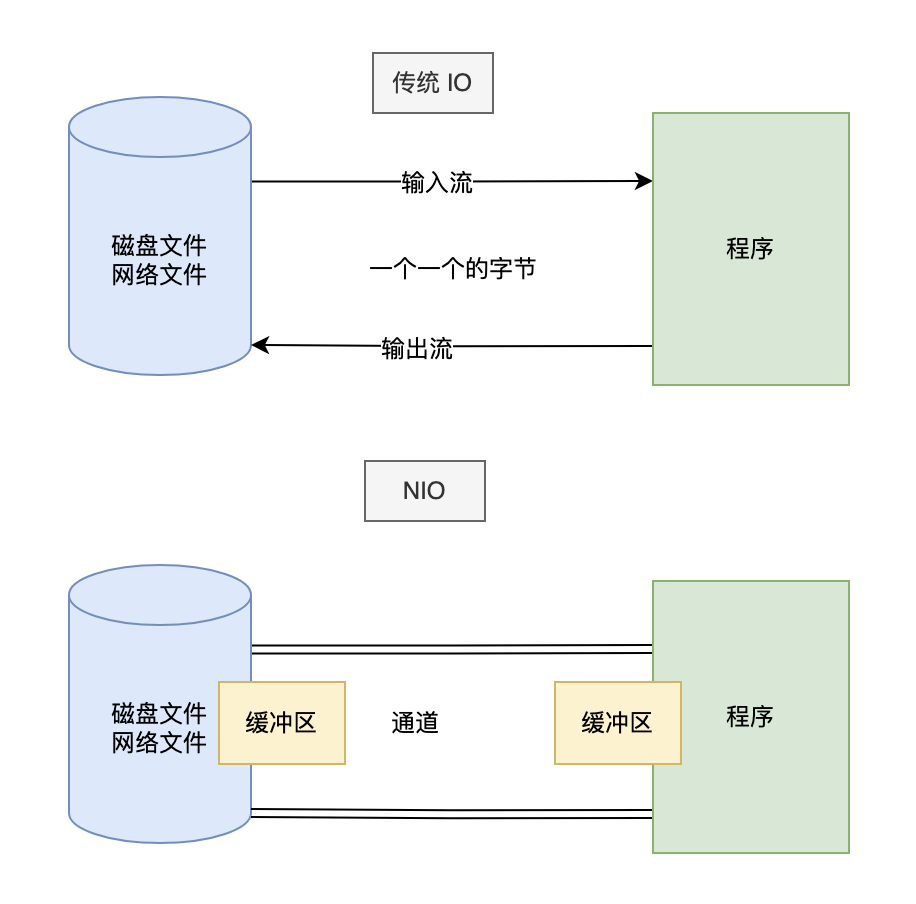


**NIO基于Channel、Buffer操作文件，提供Selector解决BIO在处理大量并发连接时的性能瓶颈**
- **Channel** 、**Buffer**：**程序与磁盘文件、网络文件通过Buffer与Channel，以块的形式双向传输数据**
- **Selector**：
  - 服务于网络高并发，因为**磁盘文件读写总是处于就绪状态**
  - **Selector允许一个线程通过事件（连接就绪、读就绪、写就绪）驱动的方式**，**同时监管大量网络IO线程**

ps：**AIO异步非阻塞 I/O 模型在实际生产中未使用，Netty和Tomcat使用NIO**


**NIO与BIO**
- BIO是面向流的处理，**NIO是面向块的处理**
- 在NIO中，**Channel只负责运输块，操作块数据由Buffer缓冲区负责**
- **BIO是单向的，运输数据和操作数据的分离决定NIO是可以双向的**

## Buffer族

### Buffer抽象基类


#### Buffer状态机

Buffer**维护4个指针构成一个状态机**，**用于将固定容量的底层数组划分为不同区域**
- **`capacity`**：
  - 缓冲区最大容量，**在创建缓冲区时被设定后，之后不能再更改**，决定了底层数组的大小。
- **`limit`**：**数据读写的安全边界**
  - **写模式：通常等于capacity，表示可以写满**
  - **读模式：代表有效数据的终点，防止读到未初始化区域**
- **`position`**
  - **下一个要被读取或写入的元素的索引**
  - get()/put()会自动移动`position`
  - 初始为0，最大不超过limit
- **`mark`**：上一次读写的位置
- 状态机共4个状态：写无标记、写有标记、读无标记、读有标记
- 指针关系：`0 <= mark <= position <= limit <= capacity`
- 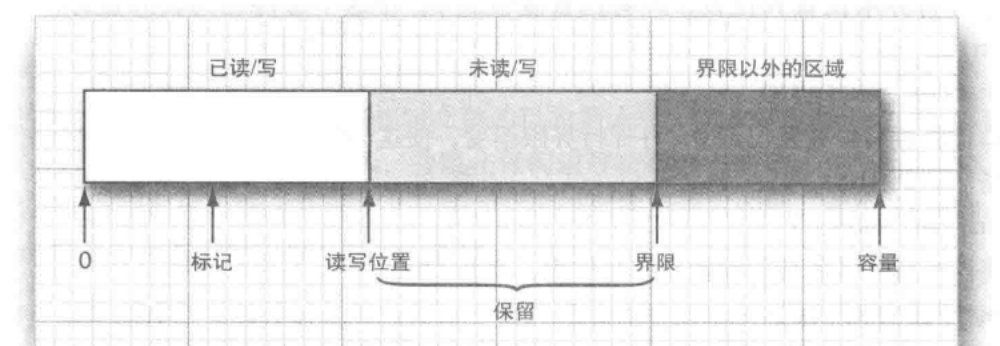
- 读写的模式由四个指针的状态决定， 没有显式维护


**Buffer基类仅定义缓冲区元数据相关API，缓冲区中数据的操作API以及缓冲区操作API由子类定义**


#### 状态修改与模式切换API

**六个状态修改API都支持链式操作**，其子类遵从Buffer的设计思路，内容相关API都支持链式操作

**读**
- `Buffer flip()`：**写模式 -> 读模式**
  - `limit = position`; `position = 0`; `mark = -1`;
  - 切换为读模式。将刚才写入的数据边界设为新的读取上限，然后从头开始读。
- `Buffer rewind()`：**重读**
  - `limit不变`; `position = 0`;` mark = -1`;	

**写**
- `Buffer clear()`：**任何模式 -> 写模式**
  - `limit = capacity`; `position = 0`; `mark = -1`;
  - 清空缓冲区以准备写入。并未擦除数据，只是重置指针，使新数据可以覆盖旧数据。
- `Buffer compact()`：**读模式 -> 写模式**
  - 将position到limit间未读数据拷贝到开头
  - `limit = capacity`;`position = 剩余数据数`; 

**标记**
- `Buffer mark()`：**任何模式下标记当前位置**
  - `mark = position`;
- `Buffer reset()`：**回溯到上次mark标记的位置**
  - mark不为-1时，`position = mark`;

#### 状态查询与检查API
```JAVA
// 1.1 核心状态查询
int capacity()     // 返回缓冲区的容量（固定值）
int position()     // 返回当前位置（下一个读写的位置）
int limit()        // 返回限制位置（第一个不能读写的位置）
boolean isReadOnly() // 是否是只读缓冲区

// 1.2 剩余空间计算
int remaining()    // 返回剩余可读写元素数 = limit - position
boolean hasRemaining() // 是否还有剩余元素可读写

// 1.3 特殊状态检查
boolean isDirect()    // 是否是直接缓冲区
boolean hasArray()    // 是否有底层数组
```


### Buffer族设计框架

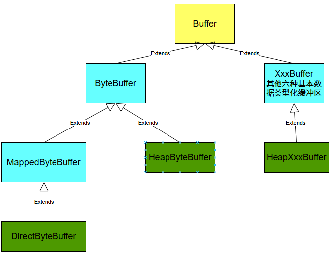

**Buffer抽象基类：定义缓冲区状态、状态转换方法**


**用户可见：7种基本数据类型缓冲区+MappedByteBuffer**
- **只有ByteBuffer能与Channel交互**
- **MappedByteBuffer**：
  - **继承`ByteBuffer`**，是**内存映射文件的抽象**，即**将文件的一部分或全部映射到内存中，通过直接操作内存来实现对文件的读写**
  - 操作系统直接在内存和磁盘之间传输数据，无需通过 Java 应用程序进行额外的数据拷贝


**用户不可见：存储实现层**： 
- 除ByteBuffer之外的6种基本数据类型缓冲区有两种实现方式
  - 第一种：**独立堆缓冲区**，底层声明各自类型的数组存放数据；例如`CharBuffer`的底层数组是`char[]`类型
  - 第二种：**ByteBuffer的视图**；通过ByteBuffer提供的`asCharBuffer()`、`asIntBuffer()` 等方法初始化；**视图与原缓冲区共享底层数据，但是独立维护自己的状态机指针**(`position,limit,mark`)，此时视图中的数组为null
- `DirectByteBuffer`：堆外内存抽象，`ByteBuffer.allocateDirect()`创建
- `MappedByteBuffer`：内存映射文件抽象，`FileChannel.map()`创建


### ByteBuffer

**为Java堆内存、堆外内存、内存映射文件提供一个统一的、类型安全的缓冲区抽象**
- **提供一致的`getXxx()、putXxx()`系列API**，遵照Buffer的设计思路，增加的**数据操作API方法**都**支持链式操作**
```JAVA
//返回HeapByteBuffer实现
ByteBuffer buffer = ByteBuffer.allocate(1024)
    .putInt(123)          // 写入int
    .putDouble(3.14)      // 写入double
    .flip();              // 切换为读模式
```
- **视图**
  - 字节序：大端序`ByteOrder.BIG_ENDIAN`是高位在前，小端序`ByteOrder.LITTLE_ENDIAN`是低位在前
```JAVA
// 视图机制：多种数据类型的统一视图
buffer.order(ByteOrder.LITTLE_ENDIAN);  // 设置字节序

// 创建不同类型视图（共享底层数据）
CharBuffer charView = buffer.asCharBuffer();
IntBuffer intView = buffer.asIntBuffer();
FloatBuffer floatView = buffer.asFloatBuffer();

// 切片：创建子缓冲区（共享底层数据）
ByteBuffer slice = buffer.slice();  // 共享数据，独立位置信息
```

#### MappedByteBuffer

`MappedByteBuffer`：内存映射文件的抽象，消除用户空间与内核空间的数据拷贝，提供对操作系统方法的java包装，具有如下特性：
- 依赖操作系统的缺页中断按需加载
- 依靠操作系统的页缓存实现性能优化
- 利用操作系统的回写机制保证数据一致性

只能通过`FileChannel`的`map`方法创建
- **MapMode**共三种：
  - `FileChannel.MapMode.READ_ONLY`：只读，线程共享
  - `FileChannel.MapMode.READ_WRITE`：可写（自然可读），**线程共享，同步修改到文件**
  - `FileChannel.MapMode.PRIVATE`：可写（自然可读），线程不共享，**写时复制，修改的是副本，不写回磁盘，不会影响源文件**。要么保存到新文件，要么先使用`PRIVATE`模式，修改结束后使用`READ_WRITE`写回源文件
- **调用`map`时不会执行IO操作加载到内存**
```JAVA
public abstract class FileChannel...{
    public abstract MappedByteBuffer map(MapMode mode,long position, long size)
        throws IOException;
}

MappedByteBuffer mappedByteBuffer = sourceChannel.map(FileChannel.MapMode.READ_ONLY, 0, sourceChannel.size());

```

**只需增加内存映射文件相关链式操作API**
- `load()`：预加载整个映射文件到内存中，调用此方法可能会造成大量的页错误和IO操作
- `force()` ：将缓冲区的修改强制写入存储设备
  - 操作系统仅写回脏页，未修改页不会写回
  - 如果是本地存储设备，则保证自创建此缓冲区以来或自上次调用此方法以来对缓冲区所做的所有更改都写入该设备；非本地设备不保证写入
  - `PRIVATE`模式下，该操作是空操作，仅在`READ_WRITE`模式下有效
- `isLoaded()` ：判断映射文件的内容是否已经加载到物理内存中
  - 返回true仅表示整个映射文件都在内存中，但之后可能由于内存压力被操作系统换出。
```JAVA
MappedByteBuffer load();
MappedByteBuffer force() 
boolean isLoaded() 
```
#### DirectByteBuffer

继承自`MapperByteBuffer`，通过`ByteBuffer`的`ByteBuffer allocateDirect(int capacity)`方法创建


```JAVA
ByteBuffer directBuffer = ByteBuffer.allocateDirect(1024)
```

**DirectByteBuffer 使用 Cleaner 管理原生内存生命周期**
- `Cleaner` 继承自 `PhantomReference`虚引用，DirectByteBuffer强引用GC后，会通过`Cleaner`执行内存回收
- 没有实现AutoCloseable接口，无法在try-resources语句中自动关闭


### 基本类型缓冲区

只有`ByteBuffer`能直接与`Channel`交互，其他类型缓冲区主要用于内存中的数据操作而非 I/O 传输
- 内存数据处理的类型安全
```JAVA
// ByteBuffer 需要手动编码/解码
ByteBuffer byteBuffer = ByteBuffer.allocate(1024);
byteBuffer.putInt(123);  // 需要知道字节顺序和编码
byteBuffer.flip();
int value = byteBuffer.getInt();  // 需要按相同方式解码

// IntBuffer 提供类型安全操作
IntBuffer intBuffer = IntBuffer.allocate(256);
intBuffer.put(123);  // 直接操作 int
intBuffer.flip();
int value = intBuffer.get();  // 直接读取 int


// CharBuffer 用于文本处理
CharBuffer charBuffer = CharBuffer.allocate(1024);
String text = "Hello, 世界";
charBuffer.put(text);

// 字符集编码
charBuffer.flip();
Charset charset = StandardCharsets.UTF_8;
ByteBuffer byteBuffer = charset.encode(charBuffer);

// 注意：实际I/O仍使用ByteBuffer
channel.write(byteBuffer);
```
#### 所有基本类型缓冲区都有的 API

基本类型缓冲区通过`allocate`方法获取非直接内存缓冲区，提供Buffer基类提供`boolean isDirect()`方法判断是否为直接内存，提供一致的数据操作API，不再赘述
```JAVA
// 分配堆内存缓冲区
public static XxxBuffer allocate(int capacity)

// 包装数组（共享底层数组）
public static XxxBuffer wrap(xxx[] array)
public static XxxBuffer wrap(xxx[] array, int offset, int length)

// 示例：
ByteBuffer.allocate(1024)     // 字节缓冲区
CharBuffer.allocate(512)      // 字符缓冲区
IntBuffer.allocate(256)       // 整数缓冲区
DoubleBuffer.allocate(128)    // 双精度缓冲区

```
```JAVA
// 创建共享底层数据的视图
public abstract XxxBuffer duplicate()   // 完整副本
public abstract XxxBuffer slice()       // 当前位置到limit的子序列
public abstract XxxBuffer asReadOnlyBuffer()  // 只读视图

// 示例：
IntBuffer original = IntBuffer.allocate(100);
IntBuffer duplicate = original.duplicate();  // 共享数据，独立状态
IntBuffer slice = original.slice();          // 共享部分数据
IntBuffer readOnly = original.asReadOnlyBuffer();

```
```JAVA
// 缓冲区比较（基于剩余元素）
public int compareTo(XxxBuffer that)

// 元素查找
public int position()                    // 查找第一个匹配元素
public int position(int index)           // 从指定位置开始查找

// 示例：
IntBuffer buf1 = IntBuffer.wrap(new int[]{1, 2, 3, 4});
IntBuffer buf2 = IntBuffer.wrap(new int[]{1, 2, 3, 5});
int result = buf1.compareTo(buf2);  // 比较剩余元素

```
```JAVA
// 是否只读
public abstract boolean isReadOnly()

// 是否有剩余元素
public final boolean hasRemaining()      // position < limit
public final int remaining()            // limit - position

// 数组支持检查
public final boolean hasArray()         // 是否有可访问的数组
public final xxx[] array()              // 获取底层数组（如支持）
public final int arrayOffset()          // 数组中的偏移量
```
####  CharBuffer 的文本处理扩展
```JAVA
// CharBuffer 额外实现了 CharSequence 和 Appendable 接口

// CharSequence 方法
public char charAt(int index)
public int length()                     // 返回 remaining()
public CharSequence subSequence(int start, int end)
public String toString()               // 返回剩余字符的字符串

// Appendable 方法
public CharBuffer append(CharSequence csq)
public CharBuffer append(CharSequence csq, int start, int end)
public CharBuffer append(char c)

// 字符编码解码（与 ByteBuffer 配合）
public static CharsetEncoder encoder()
public static CharsetDecoder decoder()
```

#### ByteBuffer 独有的 API

**字节顺序控制**
- `ByteOrder.BIG_ENDIAN`：大端序（网络字节序）
- `ByteOrder.LITTLE_ENDIAN`：小端序（x86架构默认）
- `ByteOrder.nativeOrder()`：获取当前平台字节顺序
```JAVA
ByteOrder order()
public abstract ByteBuffer order(ByteOrder bo)
```


**ByteBuffer提供视图方法**
```JAVA
public abstract CharBuffer asCharBuffer()     // 2字节单位
public abstract ShortBuffer asShortBuffer()   // 2字节单位  
public abstract IntBuffer asIntBuffer()       // 4字节单位
public abstract LongBuffer asLongBuffer()     // 8字节单位
public abstract FloatBuffer asFloatBuffer()   // 4字节单位
public abstract DoubleBuffer asDoubleBuffer() // 8字节单位

ByteBuffer byteBuf = ByteBuffer.allocate(100);
IntBuffer intBuf = byteBuf.asIntBuffer();  // 25个int的视图
```


## FileChannel


**Channel通道只负责传输数据、不直接操作数据**。只能通过Buffer缓冲区操作数据
- 通道可以分为两大类：**文件通道和套接字通道**
- **FileChannel**：**阻塞式文件操作（不能设置为非阻塞模式）**
  - 支持文件的读、写和追加操作，允许在文件的任意位置进行数据传输，以及其他更高级的功能
- **SocketChannel、ServerSocketChannel、DatagramChannel**：**支持非阻塞模式**
- Channel读写Buffer时，确保Buffer处于相应的读写模式下，错误的模式可能导致读写不成功


**创建`FileChannel`通道**：`FileChannel`实现`ReadableByteChannel`、 `WritableByteChannel`接口，在创建时可以指定模式
- `StandardOpenOption.READ`：只读，不能修改，**文件不存在抛出NoSuchFileException**
- `StandardOpenOption.WRITE`：**只写**，覆盖原文件，文件不存在会抛出 NoSuchFileException
  - 如果覆盖内容比原内容短，则会残留原内容
- `StandardOpenOption.APPEND`：必须与`WRITE`组合使用，指针position初始化为0，追加内容到文件末尾
- `StandardOpenOption.TRUNCATE_EXISTING`：清空原文件，文件不存在会抛出异常
- `StandardOpenOption.CREATE`：如果文件不存在则创建，存在则打开
- `StandardOpenOption.CREATE_NEW`：必须创建新文件，如果已存在则抛出 FileAlreadyExistsException
  - `CREATE_NEW`和`CREATE`确保检查文件和创建文件是原子性操作，并发环境下不会同时创建多个文件
- `StandardOpenOption.SPARSE`：提供操作系统创建的是稀疏文件
- `StandardOpenOption.SYNC`：完全同步，每次写入都强制刷新到磁盘
- `StandardOpenOption.DSYNC`：只同步文件内容，不同步元数据（如修改时间）
```JAVA

public static FileChannel open(Path path, OpenOption... options)
public enum StandardOpenOption implements OpenOption {
    //只读
    READ,
    //只写，覆盖写
    WRITE,
    //指针position初始位置在文件末尾，将数据追加到文件末尾而不是从头开始写，APPEND 必须与 WRITE 一起使用
    APPEND,
    TRUNCATE_EXISTING,
    CREATE,
    CREATE_NEW,
    DELETE_ON_CLOSE,
    SPARSE,
    SYNC,
    DSYNC;
}

```

```JAVA
Path filePath = Paths.get("test.dat");
FileChannel channel = FileChannel.open(
                filePath,
                StandardOpenOption.READ,
                StandardOpenOption.WRITE,
                StandardOpenOption.CREATE)

```
使用**FileChannel 配合 ByteBuffer 缓冲区**实现**文件复制**的功能：
```JAVA
Path des = Paths.get("C:\\Users\\Administrator\\Desktop\\des.txt");
Path sou = Paths.get("C:\\Users\\Administrator\\Desktop\\sou.txt");
try (FileChannel sourceChannel = FileChannel.open(sou, StandardOpenOption.READ);
    FileChannel destinationChannel = FileChannel.open(
        des, 
        StandardOpenOption.WRITE,
        StandardOpenOption.TRUNCATE_EXISTING)) {

    ByteBuffer buffer = ByteBuffer.allocate(1024);

    while (sourceChannel.read(buffer) != -1) {
        //切换为读模式
          buffer.flip();
          destinationChannel.write(buffer);
          buffer.clear();
    }
}
```

使用**FileChannel 配合 ByteBuffer 缓冲区**实现**文件写入**的功能
```JAVA
try (FileChannel fileChannel = FileChannel.open(
        des,
        StandardOpenOption.WRITE, StandardOpenOption.APPEND)) {

    String appendText = "\n追加内容";

    ByteBuffer buffer = ByteBuffer.wrap(appendText.getBytes(StandardCharsets.UTF_8));
    for(int count=1000;count>0;count--) {
        buffer.rewind();
        fileChannel.write(buffer);
    }

} catch (IOException e) {
    throw new RuntimeException(e);
}
```

**使用内存映射文件MappedByteBuffer的方式实现文件复制的功能**


```JAVA
Path des = Paths.get("C:\\Users\\Administrator\\Desktop\\des.txt");
Path sou = Paths.get("C:\\Users\\Administrator\\Desktop\\Java\\Java基础笔记.md");
try (FileChannel sourceChannel = FileChannel.open(sou, StandardOpenOption.READ);
      FileChannel destinationChannel = FileChannel.open(des, StandardOpenOption.WRITE, StandardOpenOption.CREATE, StandardOpenOption.READ)) {

    long fileSize = sourceChannel.size();
    MappedByteBuffer sourceMappedBuffer = sourceChannel.map(FileChannel.MapMode.READ_ONLY, 0, fileSize);
    MappedByteBuffer destinationMappedBuffer = destinationChannel.map(FileChannel.MapMode.READ_WRITE, 0, fileSize);

    for (int i = 0; i < fileSize; i++) {
        byte b = sourceMappedBuffer.get(i);
        destinationMappedBuffer.put(i, b);
    }
} catch (IOException e) {
    throw new RuntimeException(e);
}
```


**通道之间通过transferTo()实现数据的传输**：完全不经过用户空间
- 共两次拷贝：
  - 磁盘文件 → 内核缓冲区（DMA拷贝）
  - 内核缓冲区 → 目标文件缓冲区（DMA拷贝）
- 数据直接从源文件描述符传输到目标文件描述符，完全在操作系统内核空间完成
- `transferTo() `方法可能无法一次传输所有请求的字节，受限于操作系统，
```JAVA

/**
 * position：源文件中开始传输的位置。
 * count：要传输的字节数。
 * target：接收数据的目标通道
*/
public abstract long transferTo(long position, long count,
                                WritableByteChannel target)
    throws IOException;


Path dest = Paths.get("C:\\Users\\Administrator\\Desktop\\des.txt");
Path source = Paths.get("C:\\Users\\Administrator\\Desktop\\Java\\Java基础笔记.md");

try (FileChannel sourceChannel = FileChannel.open(source, StandardOpenOption.READ);
      FileChannel destChannel = FileChannel.open(dest,
              StandardOpenOption.WRITE,
              StandardOpenOption.CREATE,
              StandardOpenOption.TRUNCATE_EXISTING)) {

    // 获取文件总大小
    long fileSize = sourceChannel.size();
    long totalTransferred = 0;
    // 循环传输直到所有字节都传输完成
    while (totalTransferred < fileSize) {
        // 每次传输剩余的部分
        long transferred = sourceChannel.transferTo(
                totalTransferred,           // 从已传输的位置开始
                fileSize - totalTransferred, // 传输剩余字节
                destChannel);
        if (transferred <= 0) {
            // 如果没有传输任何字节，可能是遇到了问题
            System.err.println("传输中断，已传输: " + totalTransferred + " 字节");
            break;
        }
        totalTransferred += transferred;
    }
} catch (IOException e) {
    throw new RuntimeException(e);
}
```


## Paths、Files

### Paths和Path
`Paths` 工具类，nio文件操作的入口，核心作用是获取`Path`对象，`Path`接口代表文件系统中的一个路径。

**创建 Path 对象**
```java
// 创建相对路径
Path relPath = Paths.get("example.txt");
// 创建绝对路径
Path absPath = Paths.get("/home/user/example.txt");
```

---

**Path 接口的常用方法**
```java
Path path = Paths.get("docs/配套教程.md");

path.getFileName();    // 获取文件名
path.getParent();      // 获取父目录路径
path.getRoot();        // 获取根目录
path.toAbsolutePath(); // 转换为绝对路径
path.normalize();      // 简化路径（移除冗余的`.`和`..`）

// 路径组合与计算
Path base = Paths.get("/docs/");
Path target = Paths.get("/docs/imgs/itwanger");
base.resolve("config/app.properties"); // 组合路径
base.relativize(target);               // 计算相对路径
```

---

**`Files`不适合以下场景**
- **不支持大文件处理**（如超过几百MB）：`Files.readAllLines()` 加载全部内容到内存，可能抛出`OutOfMemoryError`
- **不支持随机访问**：无法在文件任意位置进行读写。
- **不支持文件锁定**：无法保证并发安全
- **不支持零拷贝传输**：`FileChannel`的`transferTo()`方法
- **不支持直接内存操作**：`MappedByteBuffer`

**`Files`适合以下场景**
- 操作配置文件、文本日志（文件不大）。
- 需要复制、移动、删除文件或创建目录。
- 快速读取文件全部内容（如 readAllBytes）或全部行（如 readAllLines）。
- 进行简单的文件属性判断（如 exists, isDirectory, size）

---

### 基础文件操作
| 操作 | 方法 | 说明与常用选项 |
| :--- | :--- | :--- |
| **检查存在** | `Files.exists(Path path)` | 检查文件或目录是否存在 |
| **创建文件** | `Files.createFile(Path path, FileAttribute...)` | 可设置文件属性（如权限） |
| **创建目录** | `Files.createDirectory(Path dir, FileAttribute...)` | 创建单级目录 |
| **删除** | `Files.delete(Path path)` | 删除文件或**空**目录 |
| **复制** | `Files.copy(Path source, Path target, CopyOption...)` | 选项：`StandardCopyOption.REPLACE_EXISTING`（覆盖）, `COPY_ATTRIBUTES`（复制属性） |
| **移动/重命名** | `Files.move(Path source, Path target, CopyOption...)` | 选项同上 |


**文件属性`FileAttribute`**
- windows的文件属性设置比Linux复杂得多，仅介绍在Linux中设置文件属性
- **Linux使用9个二进制位控制文件权限**
  - Linux固定三个角色：用户（主人） 组（队友） 其他（外人）
  - 可分别提供rwx权限，对应权限为：读、写、执行
  - `rw-r-----`表示仅用户可写，仅用户和组可读，例如配置文件
  - `rwx------`：仅用户可读、写、执行，例如启动脚本
  - `rw-rw-r--`：所有人都可读，用户和组可写，例如日志文件
- **`PosixFilePermissions`提供转换为`FileAttribute`的方法，仅适用于Linux等支持 POSIX 的系统，windows将静默忽略**

```JAVA
public enum PosixFilePermission {
    OWNER_READ,
    OWNER_WRITE,
    OWNER_EXECUTE,
    GROUP_READ,
    GROUP_WRITE,
    GROUP_EXECUTE,
    OTHERS_READ,
    OTHERS_WRITE,
    OTHERS_EXECUTE;
}

Files.setPosixFilePermissions(config, PosixFilePermissions.fromString("rw-r-----"));

```

- 在执行createDirectory或createFile时，指定文件属性，避免先创建后修改可能引发的竞态条件，保证原子性，文件一经创建就立刻拥有指定权限
```JAVA

Files.createFile(
    Paths.get("secret.txt"), 
        PosixFilePermissions.asFileAttribute(
            PosixFilePermissions.fromString("rw-r-----")));

```


**标记接口`CopyOption`**：控制复制`Files.copy()`和移动`Files.move()` 方法的行为，有两个主要的实现枚举类：`StandardCopyOption` 和 `LinkOption`。

- `StandardCopyOption`
  - `StandardCopyOption.REPLACE_EXISTING`：**覆盖已存在的目标文件**
    - 如果没有此选项，当目标文件存在时，操作会抛出 FileAlreadyExistsException。
  - `StandardCopyOption.COPY_ATTRIBUTES`：**尽可能多地复制文件的属性**
    - 如最后修改时间、最后访问时间、权限等
    - 如果不指定，目标文件将只保留基本属性，时间戳会更新为复制时间。
  - `StandardCopyOption.ATOMIC_MOVE`：**保证移动操作是原子的**。要么完全成功，要么完全失败

```JAVA

public enum StandardCopyOption implements CopyOption {
    REPLACE_EXISTING,
    COPY_ATTRIBUTES,
    ATOMIC_MOVE;
}

Path source = Paths.get("original.txt");
Path target = Paths.get("backup.txt");

Files.writeString(source, "原始数据", StandardOpenOption.CREATE);

// 复制并替换已存在文件，同时复制属性
Files.copy(source,
            target,
            StandardCopyOption.REPLACE_EXISTING,
            StandardCopyOption.COPY_ATTRIBUTES); // 保留原文件属性
```
- `LinkOption`：仅有`LinkOption.NOFOLLOW_LINKS`一个枚举值
  - 如果源Path是符号链接（类似windows的快捷方式），则复制的Path也是符号链接
```JAVA
public enum LinkOption implements OpenOption, CopyOption {
    NOFOLLOW_LINKS;
}

// 假设 /home/user/real_file 是真实文件，link_to_file 是指向它的符号链接
Path link = Paths.get("/home/user/link_to_file");
Path linkCopy = Paths.get("/home/user/link_to_file_copy");

// 不跟随链接，复制的是符号链接这个“快捷方式”文件本身
Files.copy(link, linkCopy, LinkOption.NOFOLLOW_LINKS);
// 此时 linkCopy 也是一个符号链接，指向同一个 real_file
```

---

### 文件读写操作

| 用途 | 方法 | 说明 |
| :--- | :--- | :--- |
| **读取所有行** | `Files.readAllLines(Path path, Charset cs)` | 返回 `List<String>` |
| **写入行** | `Files.write(Path path, Iterable lines, Charset cs, OpenOption...)` | 可指定`StandardOpenOption` |
| **缓冲读取器** | `Files.newBufferedReader(Path path, Charset cs)` | 返回 `BufferedReader` |
| **缓冲写入器** | `Files.newBufferedWriter(Path path, Charset cs, OpenOption...)` | 返回 `BufferedWriter` |


读取小配置文件、文本时，使用`readAllLines`方法将整个文件读取到堆中`List<String>`
- 不接受 OpenOption 参数，隐式使用 StandardOpenOption.READ。
```JAVA
try {
    List<String> strings=Files.readAllLines(source);
    System.out.println(strings);
} catch (IOException e) {
    throw new RuntimeException(e);
}
```
对于较大的文件：使用流式读取器newBufferedReader按需、逐行读取文件，而不是一次性加载全部内容。
- 不接受 OpenOption 参数，隐式使用 StandardOpenOption.READ。
```JAVA
Path source = Paths.get("C:\\Users\\Administrator\\Desktop\\Java\\Java基础笔记.md");

        try (BufferedReader reader = Files.newBufferedReader(source, StandardCharsets.UTF_8)) {
            String line;
            int count=10;
            // 每次 readLine() 只从磁盘加载一部分数据，内存占用恒定且很小
            while ((line = reader.readLine()) != null&&count>0) {
                System.out.println(line);
                count--;
            }
        } catch (IOException e) {
            throw new RuntimeException(e);
        }
```

将字符串集合（Iterable，如 List<String>）一次性写入文件，保证原子性。每个元素作为一行写入，行与行之间会自动插入系统的行分隔符
- `StandardOpenOption.READ`：只读，不能修改，**文件不存在抛出NoSuchFileException**
- `StandardOpenOption.WRITE`：**只写**，覆盖原文件，文件不存在会抛出 NoSuchFileException
  - 如果覆盖内容比原内容短，则会残留原内容
- `StandardOpenOption.APPEND`：必须与`WRITE`组合使用，指针position初始化为0，追加内容到文件末尾
- `StandardOpenOption.TRUNCATE_EXISTING`：清空原文件，文件不存在会抛出异常
- `StandardOpenOption.CREATE`：如果文件不存在则创建，存在则打开
- `StandardOpenOption.CREATE_NEW`：必须创建新文件，如果已存在则抛出 FileAlreadyExistsException
  - `CREATE_NEW`和`CREATE`确保检查文件和创建文件是原子性操作，并发环境下不会同时创建多个文件
- `StandardOpenOption.SPARSE`：提供操作系统创建的是稀疏文件
- `StandardOpenOption.SYNC`：完全同步，每次写入都强制刷新到磁盘
- `StandardOpenOption.DSYNC`：只同步文件内容，不同步元数据（如修改时间）
```JAVA
Path dest = Paths.get("C:\\Users\\Administrator\\Desktop\\des.txt");
List<String> configLines = Arrays.asList("server.port=8080", "debug=true");
// 模式1：覆盖写入（默认）
try {
    Files.write(dest, configLines, StandardCharsets.UTF_8);
} catch (IOException e) {
    throw new RuntimeException(e);
}
// 模式2：追加写入
try {
    Files.write(dest,
            Arrays.asList("New log entry"),
            StandardCharsets.UTF_8,
            StandardOpenOption.CREATE,
            StandardOpenOption.APPEND); // 关键：使用 APPEND
} catch (IOException e) {
    throw new RuntimeException(e);
}

```

流式写入器；newBufferedWriter，分批、多次调用 write() 或 append() 方法来写入内容。
- BufferedWriter提供append增强write方法，提供链式操作和更多参数类型支持。
```JAVA
try (BufferedWriter writer = Files.newBufferedWriter(Paths.get("output.txt"), 
                                                     StandardCharsets.UTF_8,
                                                     StandardOpenOption.CREATE, 
                                                     StandardOpenOption.APPEND)) { // 追加模式
    writer.write("Header:");
    writer.newLine(); // 写入一个系统相关的行分隔符
    writer.append("Some data...");
    // 可以灵活控制何时写入、写入什么
}
```

Charset：优先使用 StandardCharsets.UTF_8
- 平台默认编码随系统、区域设置变化

---
### walkFileTree()

Files.walkFileTree()通过回调方法**在遍历的每个关键节点注入自定义逻辑，提供了高度可控的递归遍历能力**
```JAVA
// 基础版本：深度优先遍历，无最大深度限制
public static Path walkFileTree(Path start, FileVisitor<? super Path> visitor)
    throws IOException

// 完整版本：可控制遍历深度和选项
public static Path walkFileTree(Path start,
                            Set<FileVisitOption> options,
                            int maxDepth,
                            FileVisitor<? super Path> visitor)
                                throws IOException
```

**FileVisitor 接口的四个关键方法**

| 方法 | 调用时机 | 返回值控制 | 典型用途 |
|:---|:---|:---|:---|
| **`preVisitDirectory`** | 进入目录**前** | 可跳过此目录或兄弟目录 | 权限检查、目录过滤 |
| **`visitFile`** | 访问文件时 | 可终止遍历 | 文件处理、搜索、统计 |
| **`postVisitDirectory`** | 退出目录**后** | 可跳过兄弟目录 | 清理资源、后处理 |
| **`visitFileFailed`** | 访问失败时 | 可决定是否继续 | 错误处理、权限记录 |

```java
public interface FileVisitor<T> {
    FileVisitResult preVisitDirectory(T dir, BasicFileAttributes attrs)
        throws IOException;
    FileVisitResult visitFile(T file, BasicFileAttributes attrs)
        throws IOException;
    FileVisitResult visitFileFailed(T file, IOException exc)
        throws IOException;
    FileVisitResult postVisitDirectory(T dir, IOException exc)
        throws IOException;
}

```
**FileVisitResult 遍历控制枚举**

```java
public enum FileVisitResult {
    CONTINUE,        // 继续遍历
    TERMINATE,       // 立即终止整个遍历
    SKIP_SIBLINGS,   // 跳过当前节点的兄弟节点
    SKIP_SUBTREE     // 跳过当前目录的子目录（仅对 preVisitDirectory 有效）
}
```
#### 打印目录树结构

```JAVA
public class BasicTreeWalker {
    private static Path dest = Paths.get("C:\\Users\\Administrator\\Desktop\\des.txt");
    public static void printDirectoryTree(Path startDir) throws IOException {
        Files.walkFileTree(startDir, new SimpleFileVisitor<Path>() {
            private int depth = 0;

            @Override
            public FileVisitResult preVisitDirectory(Path dir, BasicFileAttributes attrs) {
                // 打印缩进和目录名
                try {
                    Files.write(dest, List.of("  ".repeat(depth) + "📁 " + dir.getFileName()), StandardCharsets.UTF_8,
                            StandardOpenOption.CREATE,
                            StandardOpenOption.APPEND);
                } catch (IOException e) {
                    throw new RuntimeException(e);
                }
                depth++;
                return FileVisitResult.CONTINUE;
            }

            @Override
            public FileVisitResult visitFile(Path file, BasicFileAttributes attrs) {
                String size = String.format("%,d bytes", attrs.size());
                try {
                    Files.write(dest, List.of("  ".repeat(depth) + "📄 " + file.getFileName() + " (" + size + ")"), StandardCharsets.UTF_8,
                            StandardOpenOption.CREATE,
                            StandardOpenOption.APPEND);
                } catch (IOException e) {
                    throw new RuntimeException(e);
                }
                return FileVisitResult.CONTINUE;
            }

            @Override
            public FileVisitResult postVisitDirectory(Path dir, IOException exc) {
                depth--;
                return FileVisitResult.CONTINUE;
            }

            @Override
            public FileVisitResult visitFileFailed(Path file, IOException exc) {
                System.err.println("无法访问: " + file + " - " + exc.getMessage());
                return FileVisitResult.CONTINUE; // 继续处理其他文件
            }
        });
    }

    public static void main(String[] args) throws IOException {
        Path projectDir = Paths.get("C:\\Users\\Administrator\\Desktop");
        printDirectoryTree(projectDir);
    }
}
```

#### 文件搜索

```java
public class FileSearchExample {

    /**
     * 在目录树中搜索文件（支持通配符匹配）
     * @param startDir 起始目录
     * @param pattern 文件名模式（如 "*.log", "config*.yml"）
     * @return 找到的所有文件路径列表
     */
    public static List<Path> searchFiles(Path startDir, String pattern) throws IOException {
        List<Path> foundFiles = new ArrayList<>();

        Files.walkFileTree(startDir, new SimpleFileVisitor<Path>() {
            @Override
            public FileVisitResult visitFile(Path file, BasicFileAttributes attrs) {
                String fileName = file.getFileName().toString();

                // 简单通配符匹配：* 代表任意字符
                if (matchesPattern(fileName, pattern)) {
                    foundFiles.add(file);
                    System.out.println("找到: " + file.toAbsolutePath());
                }
                return FileVisitResult.CONTINUE;
            }

            private boolean matchesPattern(String fileName, String pattern) {
                // 将通配符 * 转换为正则表达式 .*
                String regex = pattern.replace(".", "\\.").replace("*", ".*");
                return fileName.matches(regex);
            }

            @Override
            public FileVisitResult visitFileFailed(Path file, IOException exc) {
                System.err.println("搜索时无法访问: " + file);
                return FileVisitResult.CONTINUE;
            }
        });

        return foundFiles;
    }

    /**
     * 搜索第一个匹配的文件并立即返回（性能优化）
     */
    public static Optional<Path> findFirstFile(Path startDir, String targetName) throws IOException {
        final Path[] found = {null}; // 使用数组包装以在匿名类中修改

        Files.walkFileTree(startDir, new SimpleFileVisitor<Path>() {
            @Override
            public FileVisitResult visitFile(Path file, BasicFileAttributes attrs) {
                if (file.getFileName().toString().equals(targetName)) {
                    found[0] = file;
                    return FileVisitResult.TERMINATE; // 找到后立即终止遍历
                }
                return FileVisitResult.CONTINUE;
            }
        });

        return Optional.ofNullable(found[0]);
    }

    public static void main(String[] args) throws IOException {
        // 搜索所有日志文件
        List<Path> logFiles = searchFiles(Paths.get("C:\\Users\\Administrator\\Desktop"), "*.log");
        System.out.println("找到 " + logFiles.size() + " 个日志文件");

        // 搜索特定配置文件
        Optional<Path> config = findFirstFile(Paths.get("C:\\Users\\Administrator\\Desktop"), "nginx.conf");
        config.ifPresent(path -> System.out.println("配置文件位置: " + path));
    }
}
```


---


## NIO高并发网络

### Selector

`SocketChannel`、`ServerSocketChannel`是对TCP协议的抽象：
- 全双工：双向，可读可写
- 支持阻塞/非阻塞双模式，通过`configureBlocking(boolean block)`切换模式
- `SocketChannel`：TCP套接字，负责服务器客户端间数据传输
- `ServerSocketChannel`：监听套接字，只负责接受TCP连接，生成`SocketChannel`实例
  - 通过`open()`工厂方法创建
  - 绑定端口`serverSocketChannel.socket().bind(new InetSocketAddress(8080));`
- `ServerSocketChannel`是监听套接字，不提供read、write方法
- 仅`SocketChannel`提供 `int read(ByteBuffer dst)`、`int write(ByteBuffer src)`方法

**`Selector`基于事件驱动和多路复用模型实现同步非阻塞IO，使用尽可能少的线程数和Cpu资源中管理大量并发连接**
- 非阻塞Channel不使用Selector而使用轮询时，也能做到单线程管理大量连接，但是大量时间片用于检查Cpu占用高

**Selector**
- **只能注册非阻塞Channel**：**Selector通过SelectionKey识别不同的Channel**，**注册时需要标注该Channel关注的事件**
- 多个客户端连接准备就绪时，`ServerSocketChannel`的`OP_ACCEPT`位设置为1，而`ServerSocketChannel`提供的`accept`方法一次只能从队列中取出一个连接请求，直到返回null表示没有请求，因此`ServerSocketChannel`的`OP_ACCEPT`事件就绪时，需要循环调用accept()方法
- `selector.select()`
  - 阻塞线程，直到至少有一个`SelectionKey`的至少一个注册事件就绪
  - 被阻塞的线程不会占用Cpu资源，而是等待内核唤醒
  - 返回值：就绪通道数
- `selector.selectedKeys();`
  - 返回无重复元素的`Set<SelectionKey>`
  - **每个SelectionKey所关联的Channel包含至少一个就绪事件**
- **Selector维护三个集合**
  - `Set<SelectionKey> keys`：通过`HashSet`维护所有`SelectionKey`
  - `Set<SelectionKey> cancelledKeys`：调用`cancel()`后尚未注销的`SelectionKey`引用
  - `Set<SelectionKey> selectedKeys`： 本次`select()`方法返回后，至少有一个就绪事件的`SelectionKey`引用
```JAVA
public abstract class Selector implements Closeable{
    int select() throws IOException;

    //阻塞直到有事件或超时，单位毫秒
    int select(long timeout) throws IOException;

    //立即返回，不阻塞
    int selectNow() throws IOException;

    //创建 Selector
    public static Selector open()
    //关闭 Selector并释放系统资源
    public abstract void close()
    //检查是否打开
    public abstract boolean isOpen();

    //获取所有注册的SelectionKey集合
    public abstract Set<SelectionKey> keys();
    //获取就绪的SelectionKey集合
    public abstract Set<SelectionKey> selectedKeys();
}

```

**服务器基础API示例代码**
```java
// 创建服务器Channel套接字
ServerSocketChannel serverSocketChannel = ServerSocketChannel.open();
// 绑定端口
serverSocketChannel.socket().bind(new InetSocketAddress(8080));
//只有非阻塞Channel才能注册到Selector
serverSocketChannel.configureBlocking(false);
// 创建Selector 
Selector selector = Selector.open();
// 将非阻塞Channel注册到Selector ，并注册感兴趣的事件，返回SelectionKey
serverSocketChannel.register(selector, SelectionKey.OP_ACCEPT);

while (true) {
    //阻塞线程，直到至少有一个`SelectionKey`的至少一个注册事件就绪
    selector.select();
    ////获取就绪的SelectionKey集合
    Set<SelectionKey> selectedKeys = selector.selectedKeys();
    Iterator<SelectionKey> iterator = selectedKeys.iterator();

    while (iterator.hasNext()) {
        SelectionKey key = iterator.next();
        //必须手动从就绪集合中删除该引用
        iterator.remove();

        if (key.isAcceptable()) {
            // 接收客户端TCP连接
            SocketChannel client = null;
            while((client=serverSocketChannel.accept())!=null){
                client.configureBlocking(false);
                client.register(selector, SelectionKey.OP_READ);
            }
        }

        if (key.isReadable()) {
            // 读取数据
            SocketChannel client = (SocketChannel) key.channel();
            ByteBuffer buffer = ByteBuffer.allocate(1024);
            int bytesRead = client.read(buffer);

            if (bytesRead != -1) {
                buffer.flip();
                System.out.print(StandardCharsets.UTF_8.decode(buffer));
                buffer.clear();
            } else {
                // 客户端已断开连接，取消选择键并关闭通道
                key.cancel();
                client.close();
            }
    }
}
```

**客户端基础API示例代码**
```JAVA
public class NonBlockingClient {
    public static void main(String[] args) throws IOException {
        // 创建客户端套接字
        SocketChannel socketChannel = SocketChannel.open();
        // 设置为非阻塞模式
        socketChannel.configureBlocking(false);
        // 连接服务器
        socketChannel.connect(new InetSocketAddress("localhost", 8080));

        while (!socketChannel.finishConnect()) {
            // 等待连接完成
        }

        // 分配缓冲区
        ByteBuffer buffer = ByteBuffer.allocate(1024);

        // 向服务器发送数据
        String message = "你好，沉默王二，这是来自客户端的消息。";
        buffer.put(message.getBytes(StandardCharsets.UTF_8));
        buffer.flip();
        socketChannel.write(buffer);
        // 清空缓冲区
        buffer.clear();

        // 关闭套接字
        socketChannel.close();
    }
}
```
### SelectionKey


**Channel可注册以下事件**
- `int SelectionKey.OP_READ= 1 << 0`：**读就绪**，触发事件条件：
  - **接收缓冲区有数据可读**
  - 对方关闭连接，对Channel调用read()返回-1
- `SelectionKey. OP_WRITE (1 << 2)`：**写就绪**：
  -  **发送缓冲区有空间（TCP缓冲区未满）**，该事件几乎总是触发，因此仅在需要时注册，数据写入后应立即取消该事件，否则Selector一直触发，导致逻辑错误、Cpu占用高
- `SelectionKey.OP_CONNECT (1 << 3)`： **仅用于客户端**，**非阻塞连接建立**
- `SelectionKey.OP_ACCEPT (1 << 4)`：**仅用于服务器**，**接受连接就绪**
- 事件值分别为1、4、8、10，**通过位掩码运算识别Channel的不同事件是否就绪**


```JAVA
class SelectionKeyImpl extends AbstractSelectionKey {
    //事件类型
    public static final int OP_READ = 1 << 0;    // 0001
    public static final int OP_WRITE = 1 << 2;   // 0100
    public static final int OP_CONNECT = 1 << 3; // 1000
    public static final int OP_ACCEPT = 1 << 4;  // 10000

    // 关联的通道
    private final SelChImpl channel;   
    // 关联的选择器
    private final SelectorImpl selector;  
    //注册的事件
    private volatile int interestOps;   
    //就绪的事件，只读属性
    private int readyOps;    
    // 用户自定义的附件
    private volatile Object attachment;
}
```


**SelectionKey API**
- `cancel()`：将这个键添加到关联选择器的已取消键集合`cancelledKeys`中
  - 不会立即从选择器的键集合中移除，而是在下一次select()系列方法被调用时才会清理。
  - 不会关闭关联的Channel，需要手动close()
```java
// 检查事件类型
boolean isReadable = key.isReadable();
boolean isWritable = key.isWritable();
boolean isAcceptable = key.isAcceptable();
boolean isConnectable = key.isConnectable();

// 获取就绪事件集合
int readyOps = key.readyOps(); // 例如：1 表示 OP_READ

// 修改感兴趣的事件
key.interestOps(SelectionKey.OP_READ | SelectionKey.OP_WRITE);

// 添加感兴趣的事件
int currentOps = key.interestOps();
key.interestOps(currentOps | SelectionKey.OP_WRITE);

// 取消关注某个事件
key.interestOps(currentOps & ~SelectionKey.OP_WRITE);

// 附件操作
key.attach(myObject);  // 设置附件
Object obj = key.attachment();  // 获取附件

// 取消注册
key.cancel();  // 通道从Selector注销

// 获取关联的选择器
Selector selector = key.selector();
// 获取关联的通道
SelectableChannel channel = key.channel();
```


### Scatter 和 Gather

Scatter（分散）：它将从 Channel 读取的数据分散（写入）到多个缓冲区。这种操作可以在读取数据时将其分散到不同的缓冲区，有助于处理结构化数据。例如，我们可以将消息头、消息体和消息尾分别写入不同的缓冲区。

Gather（聚集）：与 Scatter 相反，它将多个缓冲区中的数据聚集（读取）并写入到一个 Channel。这种操作允许我们在发送数据时从多个缓冲区中聚集数据。例如，我们可以将消息头、消息体和消息尾从不同的缓冲区中聚集到一起并写入到同一个 Channel

**服务器示例代码**
```JAVA
// 创建一个ServerSocketChannel
ServerSocketChannel serverSocketChannel = ServerSocketChannel.open();
serverSocketChannel.socket().bind(new InetSocketAddress(9000));

// 接受连接
SocketChannel socketChannel = serverSocketChannel.accept();

// Scatter：分散读取数据到多个缓冲区
ByteBuffer headerBuffer = ByteBuffer.allocate(128);
ByteBuffer bodyBuffer = ByteBuffer.allocate(1024);

ByteBuffer[] buffers = {headerBuffer, bodyBuffer};

long bytesRead = socketChannel.read(buffers);

// 输出缓冲区数据
headerBuffer.flip();
while (headerBuffer.hasRemaining()) {
    System.out.print((char) headerBuffer.get());
}

System.out.println();

bodyBuffer.flip();
while (bodyBuffer.hasRemaining()) {
    System.out.print((char) bodyBuffer.get());
}

// Gather：聚集数据从多个缓冲区写入到Channel
ByteBuffer headerResponse = ByteBuffer.wrap("Header Response".getBytes());
ByteBuffer bodyResponse = ByteBuffer.wrap("Body Response".getBytes());

ByteBuffer[] responseBuffers = {headerResponse, bodyResponse};

long bytesWritten = socketChannel.write(responseBuffers);

// 关闭连接
socketChannel.close();
serverSocketChannel.close();
```

### DatagramChannel


UDP是一种无连接、不可靠的网络协议。DatagramChannel提供UDP套接字的通道，支持注册到Selector、读写、Scatter\Gather、组播

```JAVA
//创建DatagramChannel，注册到Selector
DatagramChannel channel = DatagramChannel.open();
channel.configureBlocking(false);
channel.bind(new InetSocketAddress(9999));

// 发送数据报
ByteBuffer buffer = ByteBuffer.wrap("Hello UDP".getBytes());
InetSocketAddress target = new InetSocketAddress("localhost", 9999);
int bytesSent = channel.send(buffer, target);

// 接收数据报
ByteBuffer buffer = ByteBuffer.allocate(1024);
SocketAddress sender = channel.receive(buffer);
```


**注册到Selector**
```JAVA
Selector selector = Selector.open();
DatagramChannel channel = DatagramChannel.open();
channel.configureBlocking(false);
channel.bind(new InetSocketAddress(9999));
channel.register(selector, SelectionKey.OP_READ);

while (true) {
    selector.select();
    Set<SelectionKey> selectedKeys = selector.selectedKeys();
    Iterator<SelectionKey> iter = selectedKeys.iterator();
    while (iter.hasNext()) {
        SelectionKey key = iter.next();
        iter.remove();
        
        if (key.isReadable()) {
            DatagramChannel ch = (DatagramChannel) key.channel();
            ByteBuffer buf = ByteBuffer.allocate(1024);
            SocketAddress sender = ch.receive(buf);
            // 处理数据
        }
    }
}
```

# 设计模式

## UML

### 状态图

状态
- 初始状态：实心圆
- 最终状态：圆圈内嵌实心圆
- 选择状态：菱形
- 一般状态：圆角矩形
- 复合状态


## 结构型模式

如何组合类和对象以形成更大的结构，同时保持结构的灵活性和高效性
### 组合模式
客户端访问叶子节点或者分支节点时，无需关心当前操作的是叶子节点还是分支节点。组合模式将分支节点和叶子节点组织为**树形结构**，提供统一的接口访问分支节点和叶子节点，**消除单个对象与组合对象的差异**
- 树形结构：允许对整棵树递归处理

**组成**
| 角色 | 职责 |
|---------------------|-----------------------|
| **接口** | &#9989; 声明公共接口（如 `operation()`, `add()`, `remove()`）<br>&#9989; 可以是抽象类或接口 | 
| **叶子节点**  | &#9989; 无子节点<br>&#9989; 实现 `Component` 接口的基础功能               | 
| **组合节点** | &#9989; 包含子节点列表<br>&#9989; 实现 `Component` 接口，并委托子节点执行操作 | 
| **客户端** | &#9899; 通过 `Component` 接口操作叶子节点和组合节点                   | 


**文件系统案例** 

| 角色                | 对应文件系统中的元素       | 职责                                                                 |
|---------------------|--------------------------|--------------------------------------------------------------------|
| **Component（组件）** | `Entry`（条目抽象类）    | &#9989; 声明公共接口（如 `name()`, `size()`, `add()`, `remove()`, `display()`） |
| **Leaf（叶子节点）**  | `File`（文件）           | &#9989; 实现基础功能（存储数据、计算大小）<br>&#10060; 不支持 `add()`/`remove()`     |
| **Composite（组合节点）** | `Directory`（目录）      | &#9989; 维护子条目列表<br>&#9989; 实现 `add()`/`remove()`<br>&#9989; 递归调用子节点操作 |
| **Client（客户端）** | 用户/应用程序            | &#9899; 通过 `Entry` 接口操作文件和目录                                   |


```java

abstract class Entry {
    public abstract String name();    
    public abstract int size();       
    public abstract void add(Entry entry); 
    public abstract void remove(Entry entry); /
    public abstract void display(); 
}


class File extends Entry {
    private String fileName;
    private int fileSize;

    public File(String name, int size) {
        this.fileName = name;
        this.fileSize = size;
    }

    @Override
    public String name() { return fileName; }

    @Override
    public int size() { return fileSize; }

    @Override
    public void add(Entry entry) { throw new UnsupportedOperationException("File cannot have children"); }

    @Override
    public void remove(Entry entry) { throw new UnsupportedOperationException("File cannot have children"); }

    @Override
    public void display() {
        System.out.println("- File: " + fileName + " (Size: " + fileSize + " bytes)");
    }
}


class Directory extends Entry {
    private String dirName;
    private List<Entry> children = new ArrayList<>();

    public Directory(String name) {
        this.dirName = name;
    }

    @Override
    public String name() { return dirName; }

    @Override
    public int size() {
        return children.stream().mapToInt(Entry::size).sum(); // 目录大小 = 子项总和
    }

    @Override
    public void add(Entry entry) {
        children.add(entry);
    }

    @Override
    public void remove(Entry entry) {
        children.remove(entry);
    }

    @Override
    public void display() {
        System.out.println("+ Directory: " + dirName);
        for (Entry child : children) {
            child.display(); 
        }
    }
}
```

### 装饰器模式
场景：运行时，根据需求动态的给对象增减功能。

1. 将功能分为核心功能和装饰功能。
2. 接口的抽象方法代表核心功能或者被装饰后的核心功能。
3. 被装饰类实现接口；实现核心功能。
4. 基础装饰器是抽象类；实现接口；初始化被装饰对象并持有该引用。
5. 不同的装饰器继承基础装饰器，实现接口的抽象方法时，在通过被装饰对象调用核心功能的代码前后，增添代码实现装饰功能


### 外观

外观设计模式（又称门面模式）将多个复杂的子系统调用封装为一个高层次的简单接口（门面），客户端只需与门面交互，无需依赖具体子类，因此子系统的修改不会影响客户端代码。


**角色划分**  
| 角色   | 职责  |
|-------|-------|
| **Facade（门面）** | 提供统一的入口方法，委托子系统完成实际工作。                         |
| **Subsystem**      | 现有子系统的各个组件，包含复杂的逻辑或功能。                         |
| **Client**         | 通过门面发起请求，无需直接与子系统交互。                             |


### 享元

**核心目标** ：将模型的状态分为**内在状态**和**外在状态**，其中内在状态是有限的，外在状态是无限的，由工厂确保内在状态相同的对象不会被重复创建。客户端通过工厂获取内在状态对应的对象，并通过该对象传入作为局部参数的外在状态获取最终结果。


 **角色划分**  
| 角色               | 职责                                                                 |
|--------------------|--------------------------------------------------------------------|
| **Flyweight**      | 声明包含内在状态的方法，并定义依赖外在状态的业务逻辑入口（如 `operation()`）。 |
| **FlyweightFactory** | 创建并管理享元对象池，确保相同内在状态的对象只被创建一次。                     |
| **Client**         | 持有外在状态，调用 `FlyweightFactory` 获取享元对象，并传入外在状态执行操作。      |

**关键概念：内在状态 vs. 外在状态****
| 类型           | 特点                                                                 | 示例                                 |
|----------------|----------------------------------------------------------------------|------------------------------------|
| **内在状态**    | 不依赖于上下文，可在多个对象间共享                                   | 图形的形状、颜色是有限的       |
| **外在状态**    | 依赖具体场景，每次调用时动态传入                                     | 图形的位置、大小是无限的   |


**案例**  
假设需要绘制大量圆形，其中颜色只能是红/蓝/绿，半径和位置没有限制

```java
// 享元接口
interface CircleFlyweight {
    void draw(int x, int y, int radius); // x, y, radius 是外在状态
}

// 具体享元类（内在状态：颜色）
class ConcreteCircle implements CircleFlyweight {
    private String color; // 内在状态

    public ConcreteCircle(String color) {
        this.color = color;
    }

    @Override
    public void draw(int x, int y, int radius) {
        System.out.printf("Drawing %s circle at (%d,%d) with radius %d\n", color, x, y, radius);
    }
}

// 享元工厂（管理对象池）
class CircleFactory {
    private Map<String, CircleFlyweight> flyweights = new HashMap<>();

    public CircleFlyweight getCircle(String color) {
        CircleFlyweight circle = flyweights.get(color);
        if (circle == null) {
            circle = new ConcreteCircle(color);
            flyweights.put(color, circle);
        }
        return circle;
    }
}

// 客户端代码
public class Client {
    public static void main(String[] args) {
        CircleFactory factory = new CircleFactory();

        // 获取红色圆形享元（仅创建一次）
        CircleFlyweight redCircle = factory.getCircle("red");
        redCircle.draw(10, 20, 30); // 外在状态：坐标和半径
        redCircle.draw(50, 60, 40); // 复用同一对象，仅传入新外在状态

        // 获取蓝色圆形享元（新创建）
        CircleFlyweight blueCircle = factory.getCircle("blue");
        blueCircle.draw(70, 80, 50);
    }
}
```


**适用场景**
| 场景                                  | 说明                                                                 |
|---------------------------------------|--------------------------------------------------------------------|
| **大量相似对象**                      | 如游戏中的炮弹、文档编辑器中的字符样式、数据库连接池等。             |
| **资源受限环境**                      | 嵌入式系统、移动设备等对内存敏感的场景。                             |
| **需频繁创建销毁对象**                | 如 Web 服务器处理海量请求时的临时对象复用。                           |
| **状态分化明确**                      | 能清晰区分内在状态（共享）和外在状态（动态）。                       |


### 代理

第三方只能通过**代理对象**间接访问**真实对象**，在不修改真实对象的前提下，扩展其功能或限制其访问

**核心目标**  
- **间接控制**：通过代理间接访问真实对象，隐藏真实对象的复杂性。  
- **功能增强**：在真实对象前后添加额外操作（如日志、缓存、权限校验等）。  
- **保护真实对象**：延迟加载、轻量化替代或防止直接操作敏感资源。


**关键组成**

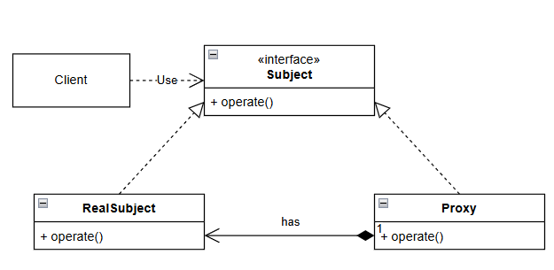
| 角色               | 职责                                                                 |
|--------------------|--------------------------------------------------------------------|
| **Subject**        | 定义真实对象和代理对象的共同接口，使代理可以无缝替换真实对象。         |
| **Real Subject**   | 真正的业务逻辑实现者，通常是重量级资源或具体功能的承载者。           |
| **Proxy**          | 持有对 Real Subject 的引用，接收客户端请求并决定如何处理（转发、拦截或替代）。 |
| **Client**         | 通过 Subject 接口与代理交互，无需感知背后是真实对象还是代理。         |

### 适配器Adapter/Wrapper
将一个类的接口转换成客户端期望的另一个接口，解决接口不兼容问题，使原本无法协同工作的类能够协同工作

- 两种实现方式：对象适配器（组合）、类适配器（继承）
- 当系统需要集成第三方组件且无法修改其源代码时，优先选择**对象适配器**（组合方式）。

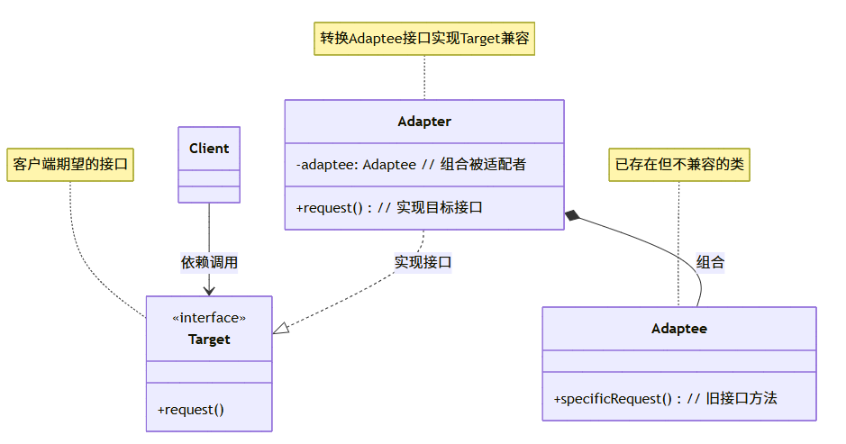
### 桥接

将抽象部分与实现部分分离，使它们可以独立变化。通过组合代替继承，解决多层次继承带来的类爆炸问题。 
> **黄金法则**：当系统存在**两个独立变化维度**（如业务逻辑×平台实现），且都需要扩展时，优先选择桥接模式。


| **角色**               | **作用**                                                                 |
|------------------------|-------------------------------------------------------------------------|
| **抽象化** | 定义高层控制逻辑（业务抽象层）                                              |
| **扩展抽象化** | 对抽象的扩展（具体业务实现）                                                |
| **实现化** | 定义底层操作接口（平台/技术抽象层）                                         |
| **具体实现化** | 实现Implementor接口（具体平台/技术实现）                                    |

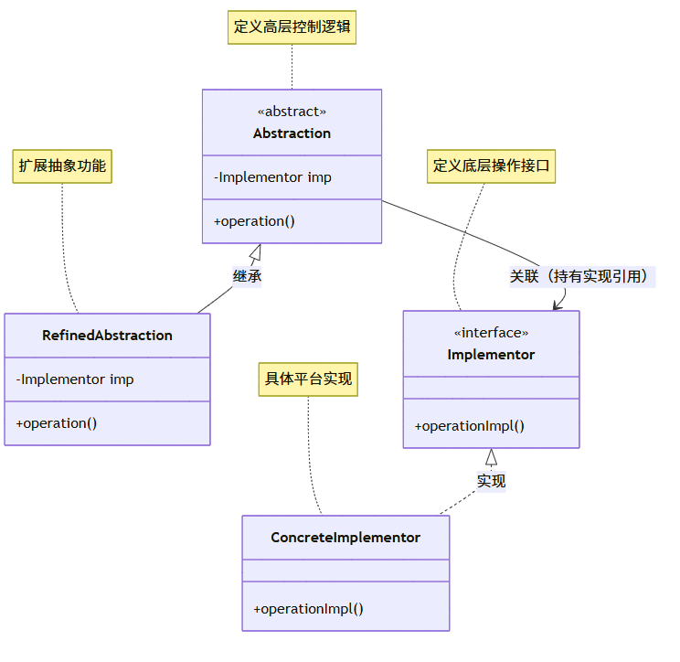
## 创建型模式

解耦对象的使用与创建过程
### 工厂
1. **简单工厂**  根据参数创建不同产品  
**缺点**：新增产品需修改工厂类，违反开闭原则
```java
public Shape createShape(String type) {
   switch (type) {
      case "circle": return new Circle();
      case "rectangle": return new Rectangle();
      default: throw new IllegalArgumentException("未知类型");
   }
}
```
2. **工厂方法** 定义一个创建对象的接口和不同的实现类（工厂），让子类决定实例化哪个类
   - 新增产品只需增加新工厂


3. **抽象工厂（Abstract Factory）** 每个工厂生产一个产品族，产品族是相同接口族的不同实现，客户端只需切换工厂就能使用不同产品族

```java
// 抽象产品族
interface Button {
    void render();
}

interface TextField {
    void input();
}

// 具体产品族 (Windows风格)
class WinButton implements Button {
    @Override
    public void render() {
        System.out.println("渲染Windows按钮");
    }
}

class WinTextField implements TextField {
    @Override
    public void input() {
        System.out.println("Windows文本框输入");
    }
}

// 具体产品族 (Mac风格)
class MacButton implements Button {
    @Override
    public void render() {
        System.out.println("渲染Mac按钮");
    }
}

class MacTextField implements TextField {
    @Override
    public void input() {
        System.out.println("Mac文本框输入");
    }
}

// 抽象工厂
interface GUIFactory {
    Button createButton();
    TextField createTextField();
}

// 具体工厂
class WinFactory implements GUIFactory {
    @Override
    public Button createButton() {
        return new WinButton();
    }
    
    @Override
    public TextField createTextField() {
        return new WinTextField();
    }
}

class MacFactory implements GUIFactory {
    @Override
    public Button createButton() {
        return new MacButton();
    }
    
    @Override
    public TextField createTextField() {
        return new MacTextField();
    }
}

// 客户端
public class Client {
    public static void main(String[] args) {
        GUIFactory factory = new MacFactory(); // 只需切换工厂
        
        Button btn = factory.createButton();
        TextField field = factory.createTextField();
        
        btn.render();      // 输出: 渲染Mac按钮
        field.input();     // 输出: Mac文本框输入
    }
}
```

---

**工厂模式对比**
| **特性**         | 简单工厂                    | 工厂方法                          | 抽象工厂                          |
|------------------|---------------------------|----------------------------------|----------------------------------|
| **创建目标**      | 单一产品                   | 单一产品                          | 产品家族                         |
| **扩展性**        | 修改工厂类（违反开闭原则）  | 增加新工厂类                      | 增加新工厂族                     |
| **适用场景**      | 产品类型固定               | 产品类型可能扩展                  | 需要创建关联产品组               |
| **解耦程度**      | 客户端依赖具体工厂类        | 客户端依赖抽象工厂                | 客户端完全与具体产品解耦          |
| **JDK应用案例**   | `Calendar.getInstance()` | `Collection.iterator()`          | `javax.xml.parsers.DocumentBuilderFactory` |


### 建造者


> 将复杂对象的**构建过程**与**最终表示**分离，**使得相同的构建过程可以创建不同的表示形式**。它特别适用于需要**分步骤构造**且**构造顺序重要**的复杂对象创建场景。

- **缺点**：需要额外Director和Builder类

| **场景** | **说明** | **示例** |
|----------|----------|----------|
| **创建复杂对象** | 对象包含多个组成部分，且需要不同组合 | 电脑配置（CPU/RAM/存储） |
| **构造过程复杂** | 需要分步骤构造，构造顺序重要 | 汽车组装（底盘→发动机→车身） |
| **对象不可变** | 需要一次性构建完整对象 | 配置对象、DTO传输对象 |
| **多种表示形式** | 相同构建过程需要创建不同表示 | 不同格式的报告（HTML/PDF） |
| **参数过多** | 避免构造函数参数列表过长 | 含20+参数的配置对象 |


| **组件**               | **职责**                                   | **方法/特点**                                                                 | **设计要点**                                                                 |
|------------------------|-------------------------------------------|-----------------------------------------------------------------------------|-----------------------------------------------------------------------------|
| **Builder（建造者接口）** | 定义创建产品各个部件的抽象方法              | - `buildPartA()`, `buildPartB()`, `buildPartC()`：构建不同部分<br>- `getResult()`：返回最终产品 | 接口隔离原则，每个方法只负责一个部件构建                                      |
| **ConcreteBuilder（具体建造者）** | 实现Builder接口，提供具体构建逻辑         | - 维护产品实例<br>- 实现具体构建细节<br>- 支持不同配置的产品实现              | 包含产品状态，构建逻辑可定制化                                              |
| **Director（指挥者）**    | 控制构建流程                              | - `construct()`：定义构建步骤顺序<br>- 只依赖Builder接口                      | 流程控制与具体实现分离，可复用指挥逻辑                                       |
| **Product（产品）**       | 最终构建的复杂对象                        | - 包含多个组成部分<br>- 提供组装方法<br>- 通常为不可变对象                    | 通过Builder一次性构建，保证对象完整性                                         |

客户端通过Director和不同的构造者实现，相同的构造流程创建不同产品
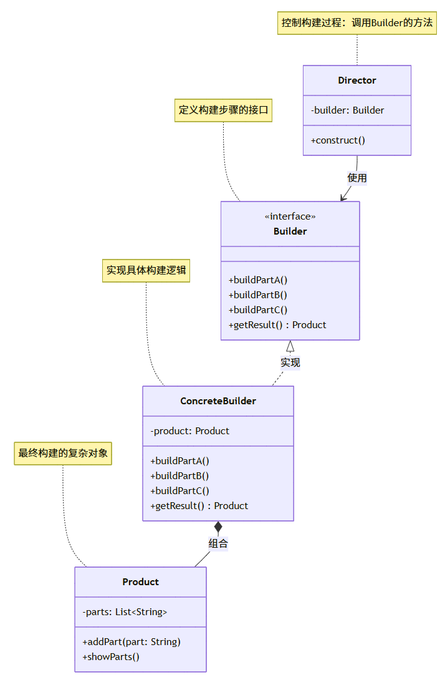


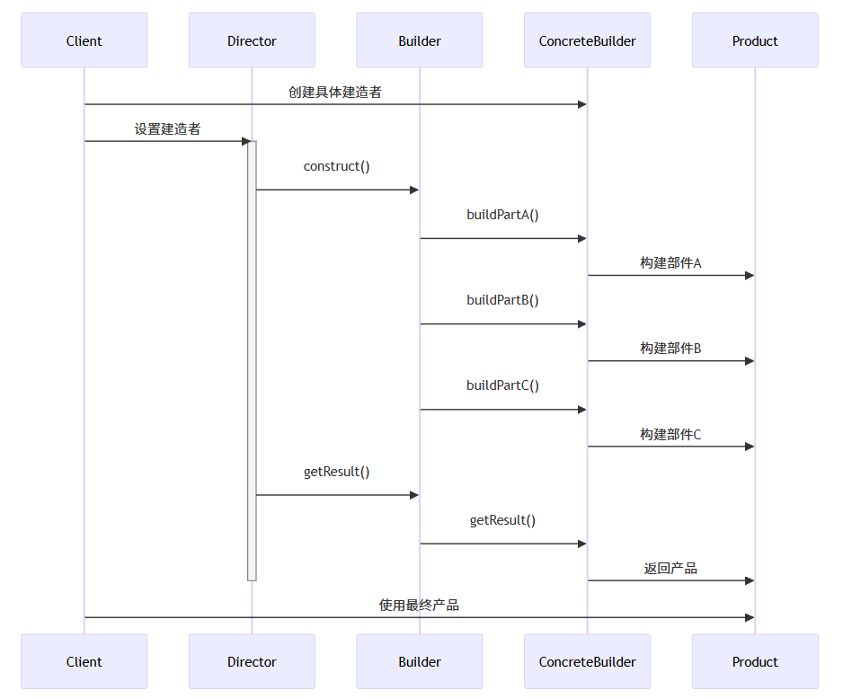


```java
// 产品类
class Computer {
    private String cpu;
    private String ram;
    private String storage;
    
    public void setCPU(String cpu) { this.cpu = cpu; }
    public void setRAM(String ram) { this.ram = ram; }
    public void setStorage(String storage) { this.storage = storage; }
    
    public void showSpecs() {
        System.out.println("Computer Specs:");
        System.out.println("CPU: " + cpu);
        System.out.println("RAM: " + ram);
        System.out.println("Storage: " + storage);
    }
}

// 建造者接口
interface ComputerBuilder {
    void buildCPU();
    void buildRAM();
    void buildStorage();
    Computer getResult();
}

// 具体建造者
class GamingComputerBuilder implements ComputerBuilder {
    private Computer computer = new Computer();
    
    @Override
    public void buildCPU() {
        computer.setCPU("Intel Core i9-13900K");
    }
    
    @Override
    public void buildRAM() {
        computer.setRAM("32GB DDR5");
    }
    
    @Override
    public void buildStorage() {
        computer.setStorage("2TB NVMe SSD");
    }
    
    @Override
    public Computer getResult() {
        return computer;
    }
}

// 指挥者
class ComputerEngineer {
    private ComputerBuilder builder;
    
    public void setBuilder(ComputerBuilder builder) {
        this.builder = builder;
    }
    
    public Computer buildComputer() {
        builder.buildCPU();
        builder.buildRAM();
        builder.buildStorage();
        return builder.getResult();
    }
}

// 客户端使用
public class Client {
    public static void main(String[] args) {
        ComputerEngineer engineer = new ComputerEngineer();
        ComputerBuilder gamingBuilder = new GamingComputerBuilder();
        
        engineer.setBuilder(gamingBuilder);
        Computer gamingPC = engineer.buildComputer();
        
        gamingPC.showSpecs();
    }
}
```


### 原型

**当直接创建对象的成本很高时，用原型实例指定创建对象的种类，并通过拷贝这些原型创建新的对象，客户端获取拷贝对象后修改其状态，避免重复执行昂贵的初始化操作。**

1.  **`Prototype` (原型接口)：**
    *   声明一个 `clone()` 方法
2.  **`ConcretePrototype` (具体原型)：**
    *   实现 `Prototype` 接口。
    *   实现 `clone()` 方法，负责复制自身并返回新对象
3.  **`Client` (客户端)：**
    *   通过调用具体原型对象的 `clone()` 方法来创建新对象。客户端需要知道或持有原型对象（可能通过注册表获取）。


```java
import java.util.ArrayList;
import java.util.List;

// 1. Prototype Interface
interface Prototype extends Cloneable {
    Prototype clone() throws CloneNotSupportedException;
}

// 2. Concrete Prototype
class ComplexObject implements Prototype {
    private int id;
    private String name;
    private List<String> items; // 引用类型字段

    public ComplexObject(int id, String name, List<String> items) {
        this.id = id;
        this.name = name;
        this.items = new ArrayList<>(items); // 防御性拷贝，但clone仍需深拷贝items
    }

    @Override
    public ComplexObject clone() throws CloneNotSupportedException {
        // 1. 调用super.clone()进行浅拷贝 (复制基本类型和引用)
        ComplexObject clone = (ComplexObject) super.clone();
        // 2. 对引用类型字段进行深拷贝 (创建新的ArrayList并复制内容)
        clone.items = new ArrayList<>(this.items);
        return clone;
    }

    // ... Getters, Setters, other methods ...
}

// 3. Client
public class Client {
    public static void main(String[] args) throws CloneNotSupportedException {
        // 创建原型对象 (可能成本很高)
        List<String> initialItems = new ArrayList<>();
        initialItems.add("Item1");
        initialItems.add("Item2");
        ComplexObject prototype = new ComplexObject(1, "Original", initialItems);

        // 通过克隆创建新对象 (成本较低)
        ComplexObject clone1 = prototype.clone();
        ComplexObject clone2 = prototype.clone();

        // 修改克隆对象 (不会影响原型和另一个克隆)
        clone1.getItems().add("Clone1 Item");
        clone2.getItems().add("Clone2 Item");
    }
}
```

---

### 单例

**确保一个类只有一个实例，并提供一个全局访问点来获取这个实例。**

*   **私有化构造器：** 阻止外部代码通过 `new` 关键字创建实例。
*   **内部创建唯一实例：** 在类内部通过一个**私有静态**变量，持有自身的唯一实例
*   **提供全局访问点：** 提供一个静态的公共方法（通常命名为 `getInstance()`）让外部代码获取这个唯一实例。该方法负责创建实例（如果尚未创建）并返回它。

**适用场景**
*   需要严格控制的共享资源管理器（数据库连接池、线程池）。
*   配置信息管理器（全局配置只需加载一次）。
*   日志记录器（所有地方使用同一个Logger）。
*   设备驱动程序对象（通常一个设备对应一个驱动实例）。
*   缓存系统（需要全局访问缓存数据）。

**线程安全**
*   **饿汉式 (Eager Initialization)：** 在类加载时就初始化实例。线程安全（由JVM类加载机制保证），但可能造成资源浪费（如果实例最终未被使用）。

*   **懒汉式 (Lazy Initialization)：** 第一次调用 `getInstance()` 时才创建实例。需要考虑线程安全。
    *   **简单同步 (性能差)：** 在 `getInstance()` 方法上加 `synchronized`。每次调用都加锁，性能开销大。
        ```java
        public static synchronized Singleton getInstance() {
            if (instance == null) {
                instance = new Singleton();
            }
            return instance;
        }
        ```
    *   **双重检查锁定 (Double-Checked Locking - DCL)：** 减少同步块范围，在第一次创建实例时同步。需要 `volatile` 关键字防止指令重排序导致问题（Java 5+）。
        ```java
        private static volatile Singleton instance;
        public static Singleton getInstance() {
            if (instance == null) { // 第一次检查 (无锁)
                synchronized (Singleton.class) {
                    if (instance == null) { // 第二次检查 (在锁内)
                        instance = new Singleton();
                    }
                }
            }
            return instance;
        }
        ```
    *   **静态内部类 (Static Inner Class - 推荐)：** 利用JVM类加载机制保证线程安全，且实现懒加载。`SingletonHolder` 类只有在第一次调用 `getInstance()` 时才会被加载并初始化 `INSTANCE`。
        ```java
        public class Singleton {
            private Singleton() {}
            private static class SingletonHolder {
                private static final Singleton INSTANCE = new Singleton();
            }
            public static Singleton getInstance() {
                return SingletonHolder.INSTANCE;
            }
        }
        ```
*   **枚举 (最佳实践)：** 简洁、安全（防止反射攻击和序列化问题）、自动线程安全。是最推荐的单例实现方式。
    ```java
    public enum Singleton {
        INSTANCE;
        public void doSomething() { ... }
    }
    // 使用: Singleton.INSTANCE.doSomething();
    ```

**缺点**
*   **违反单一职责原则 (SRP)：** 单例类既管理自身实例化，又承担业务逻辑，职责可能过重。
*   **测试困难：** 全局状态使得单元测试难以隔离，可能需要使用依赖注入或模拟框架。
*   **隐藏依赖关系：** 使用单例的类对单例的依赖关系不明显，代码耦合度可能变高。
*   **潜在的性能瓶颈：** 如果单例成为共享资源的瓶颈（如数据库连接池耗尽）。
*   **生命周期管理：** 单例通常在整个应用生命周期存在，可能持有资源过长时间。

---

## 行为型模式

关注对象之间的通信和交互，旨在解决对象之间的责任分配和算法的封装。
### 责任链

**解耦请求发送与处理，动态组合处理逻辑**：客户端通过链式调用处理器创建处理链，将请求提交给第一个处理器，每个处理器选择处理并结束传递或者将请求交给下一个处理器，直到链尾
- **请求可能未被处理**：需要处理链末端无处理器的情况
- **循环引用**：防止处理链形成闭环
- **动态配置**：可以在运行时动态改变处理链

| **组件**               | **核心职责**                                                                 | **关键特性**                                                                 |
|------------------------|-----------------------------------------------------------------------------|-----------------------------------------------------------------------------|
| **处理器接口（Handler）** | 定义统一的请求处理规范                                                      | - 声明处理请求的方法（如`handle()`）<br>- 声明设置下一个处理器的方法（如`setNext()`） |
| **抽象处理器（AbstractHandler）** | 提供处理链的基础实现                                                        | - 实现处理器接口<br>- 持有`nextHandler`引用<br>- 提供默认的请求传递逻辑（若不处理则转发） |
| **具体处理器（ConcreteHandler）** | 实现业务相关的具体处理逻辑                                                  | - 判断是否处理当前请求（如根据请求参数）<br>- 处理请求或调用父类方法传递请求<br>- 每个处理器只需关注自身职责 |
| **客户端（Client）**     | 初始化并协调责任链工作                                                      | - 组装处理器链（设置`nextHandler`关系）<br>- 创建请求对象<br>- 触发链式处理（调用首个处理器） |


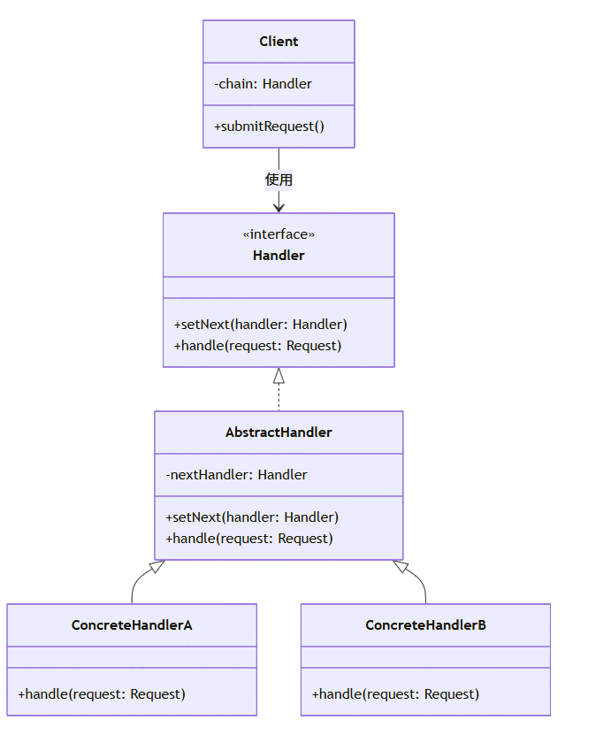

### 命令


**将请求封装成对象**，当需要对行为进行记录、撤销/重做或事务处理时，使用命令模式
1. **解耦调用者与接收者**：调用者无需知道具体接收者
2. **支持操作队列**：可轻松实现命令队列和日志
3. **实现撤销/重做**：通过维护命令历史实现操作回滚
4. **扩展性强**：新增命令不影响现有代码
5. **组合命令**：支持宏命令（多个命令的组合）

| **组件**               | **核心职责**                                                                 | **关键特性**                                                                 |
|------------------------|-----------------------------------------------------------------------------|-----------------------------------------------------------------------------|
| **命令接口 (Command)**   | 定义执行操作的统一接口                                                      | - 声明 `execute()` 方法<br>- 声明 `undo()` 方法（可选）                         |
| **具体命令 (ConcreteCommand)** | 实现命令接口，绑定接收者与动作                                            | - 持有接收者引用<br>- 实现 `execute()` 调用接收者方法<br>- 实现 `undo()` 撤销操作 |
| **接收者 (Receiver)**    | 执行实际业务操作的对象                                                      | - 包含具体的业务逻辑实现<br>- 不感知命令存在                                |
| **调用者 (Invoker)**     | 触发命令执行的控制器                                                        | - 持有命令对象引用<br>- 通过调用 `execute()` 触发操作<br>- **可支持命令队列**     |
| **客户端 (Client)**      | 创建并组装命令对象                                                          | 设置命令到调用者          |


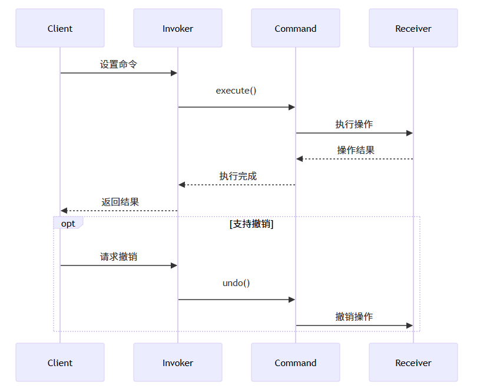

**适用场景**
| **场景**                | **说明**                                                                 |
|------------------------|-------------------------------------------------------------------------|
| **操作队列系统**         | 将操作封装为命令对象放入队列顺序执行                                      |
| **事务处理系统**         | 支持操作回滚的事务处理                                                    |
| **GUI 操作**           | 菜单项、按钮操作封装为命令对象                                            |
| **多级撤销/重做**       | 文字编辑器、图像处理软件的撤销功能                                        |
| **远程控制**           | 家电遥控器将按键操作封装为命令                                            |
| **批处理操作**         | 将多个操作组合成宏命令一次性执行                                          |


```java
// 1. 命令接口
interface Command {
    void execute();
    void undo();
}

// 2. 接收者 - 电灯
class Light {
    void turnOn() { System.out.println("电灯已打开"); }
    void turnOff() { System.out.println("电灯已关闭"); }
}

// 3. 具体命令 - 开灯命令
class LightOnCommand implements Command {
    private Light light;
    
    public LightOnCommand(Light light) {
        this.light = light;
    }
    
    @Override
    public void execute() {
        light.turnOn();
    }
    
    @Override
    public void undo() {
        light.turnOff();
    }
}

// 4. 调用者 - 遥控器
class RemoteControl {
    private Command command;
    private Command lastCommand;
    
    public void setCommand(Command command) {
        this.command = command;
    }
    
    public void pressButton() {
        command.execute();
        lastCommand = command;
    }
    
    public void pressUndo() {
        if (lastCommand != null) {
            lastCommand.undo();
            lastCommand = null;
        }
    }
}

// 5. 客户端
public class Client {
    public static void main(String[] args) {
        // 创建接收者
        Light livingRoomLight = new Light();
        
        // 创建具体命令
        Command lightOn = new LightOnCommand(livingRoomLight);
        
        // 创建调用者
        RemoteControl remote = new RemoteControl();
        remote.setCommand(lightOn);
        
        // 执行命令
        remote.pressButton();  // 输出: 电灯已打开
        remote.pressUndo();    // 输出: 电灯已关闭
    }
}
```


### 迭代器

迭代器模式提供一种方法顺序访问聚合对象中的各个元素，而又不暴露该对象的内部表示。这种模式是集合遍历的标准解决方案。
### 中介

中介者模式通过引入一个中介对象来封装一系列对象之间的交互，使这些对象不需要显式地相互引用，从而降低耦合度。
- 避免中介类成为上帝对象，中介类负责的交互过多时可以拆分为总中介+分中介

| **组件**               | **核心职责**                                                                 | **关键特性**                                                                 |
|------------------------|-----------------------------------------------------------------------------|-----------------------------------------------------------------------------|
| **中介者接口 (Mediator)** | 定义通信接口                                                                | - 声明通知方法 `notify()`<br>- 协调各同事对象交互                             |
| **具体中介者 (ConcreteMediator)** | 实现中介逻辑                                                                | - 持有同事对象引用<br>- 实现对象间协调逻辑<br>- 了解所有同事对象             |
| **同事类 (Colleague)** | 定义对象基类                                                                | - 持有中介者引用<br>- 通过中介者通信<br>- 实现通用通信方法                   |
| **具体同事类 (ConcreteColleague)** | 实现业务逻辑                                                                | - 处理自身业务<br>- 只与中介者通信<br>- 不知道其他同事对象存在               |

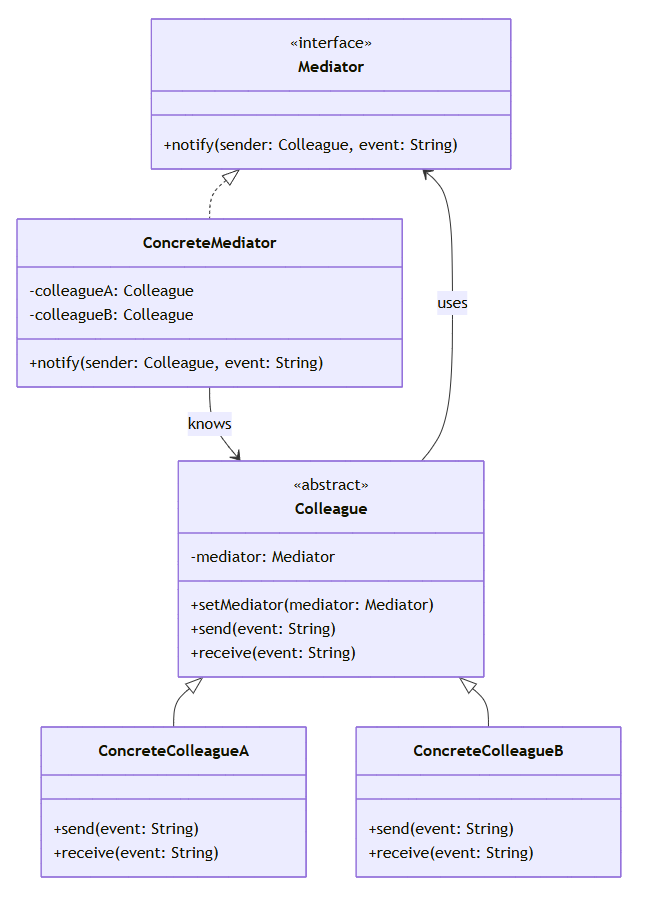

中介者模式是解决复杂对象交互的利器，特别适合以下场景：
- 对象间存在大量复杂交互
- 需要集中管理对象间关系
- 系统需要动态调整交互关系
- 跨系统或跨层协调


| **场景**               | **无中介者**                                | **使用中介者**                            |
|------------------------|--------------------------------------------|------------------------------------------|
| **对象间关系**          | 网状结构（N×N连接）                        | 星型结构（中心辐射）                      |
| **新增对象**            | 需修改所有相关对象                         | 只需修改中介者                            |
| **通信复杂度**          | 高（每个对象需知道其他对象）               | 低（对象只知中介者）                      |
| **系统可维护性**        | 低（牵一发而动全身）                       | 高（修改局部不影响全局）                  |
| **典型应用**            | 小型简单系统                               | GUI系统、聊天应用、分布式协调系统         |


1. **聊天室系统**：
   ```java
   // 聊天室中介者
   class ChatRoom implements ChatMediator {
       private List<User> users = new ArrayList<>();
       
       public void addUser(User user) {
           users.add(user);
       }
       
       public void sendMessage(String msg, User sender) {
           for (User user : users) {
               if (user != sender) {
                   user.receive(msg);
               }
           }
       }
   }
   
   // 用户类
   class User {
       private ChatMediator mediator;
       private String name;
       
       public User(ChatMediator med, String name) {
           this.mediator = med;
           this.name = name;
       }
       
       public void send(String msg) {
           mediator.sendMessage(msg, this);
       }
       
       public void receive(String msg) {
           System.out.println(name + " 收到: " + msg);
       }
   }
   ```


2. **事件总线 (Event Bus)**：
   ```java
   // 全局事件总线
   class EventBus {
       private Map<Class<?>, List<Consumer<Object>>> handlers = new ConcurrentHashMap<>();
       
       public <T> void subscribe(Class<T> eventType, Consumer<T> handler) {
           handlers.computeIfAbsent(eventType, k -> new CopyOnWriteArrayList<>())
                   .add((Consumer<Object>) handler);
       }
       
       public void publish(Object event) {
           List<Consumer<Object>> eventHandlers = handlers.get(event.getClass());
           if (eventHandlers != null) {
               eventHandlers.forEach(handler -> handler.accept(event));
           }
       }
   }
   
   // 使用示例
   eventBus.subscribe(PaymentEvent.class, event -> {
       // 处理支付事件
   });
   ```


3. **分布式中介者**：
   ```java
   // 基于消息队列的中介者
   class DistributedMediator {
       private MessageQueue queue;
       
       public void sendCommand(Command command) {
           queue.publish("COMMAND_TOPIC", command);
       }
       
       public void registerHandler(String commandType, CommandHandler handler) {
           queue.subscribe("COMMAND_TOPIC", msg -> {
               if (msg.getType().equals(commandType)) {
                   handler.handle(msg);
               }
           });
       }
   }
   ```

---

### 备忘录


备忘录模式允许在不破坏对象封装性的前提下捕获并外部化对象的内部状态，以便之后可以将对象恢复到原先保存的状态。

| **组件**             | **核心职责**                                                                 | **关键特性**                                                                 |
|----------------------|-----------------------------------------------------------------------------|-----------------------------------------------------------------------------|
| **发起人 (Originator)** | 需要保存状态的对象                                                          | - 创建备忘录对象<br>- 从备忘录恢复状态<br>- 包含业务逻辑和状态              |
| **备忘录 (Memento)**   | 存储发起人对象的状态                                                        | - 保持状态不可变性<br>- 提供状态访问接口<br>- 保护状态不被外部修改          |
| **管理者 (Caretaker)** | 负责保存和管理备忘录对象                                                    | - 存储备忘录历史<br>- 提供撤销/重做功能<br>- 不访问备忘录内容              |

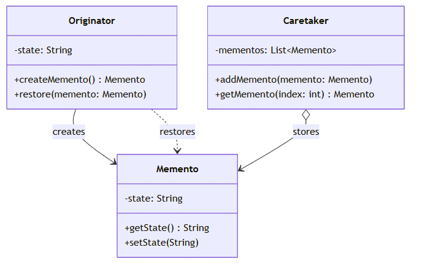


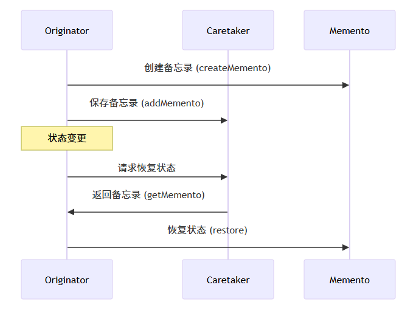

| **场景**               | **适用性**                                  | **备忘录模式优势**                         |
|------------------------|--------------------------------------------|-------------------------------------------|
| **文本编辑器**          | 高（撤销/重做）                            | 精确恢复编辑状态                           |
| **游戏存档**            | 高（保存/加载游戏）                        | 保存完整游戏状态                           |
| **事务回滚**            | 中（数据库操作）                           | 回滚到事务开始状态                         |
| **配置管理**            | 中（恢复默认配置）                         | 快速恢复先前配置                           |
| **绘图软件**            | 高（撤销绘图操作）                         | 支持多步操作撤销                           |

**文本编辑器撤销功能**

```java
import java.util.Stack;

// 1. 备忘录类
class TextMemento {
    private final String text;
    private final int cursorPosition;
    
    public TextMemento(String text, int cursorPosition) {
        this.text = text;
        this.cursorPosition = cursorPosition;
    }
    
    public String getText() {
        return text;
    }
    
    public int getCursorPosition() {
        return cursorPosition;
    }
}

// 2. 发起人 - 文本编辑器
class TextEditor {
    private StringBuilder text = new StringBuilder();
    private int cursorPosition = 0;
    
    public void type(String words) {
        text.insert(cursorPosition, words);
        cursorPosition += words.length();
        System.out.println("当前文本: " + text);
        System.out.println("光标位置: " + cursorPosition);
    }
    
    public void moveCursor(int position) {
        cursorPosition = Math.max(0, Math.min(position, text.length()));
        System.out.println("移动光标到: " + cursorPosition);
    }
    
    public void delete() {
        if (cursorPosition > 0 && text.length() > 0) {
            text.deleteCharAt(cursorPosition - 1);
            cursorPosition--;
            System.out.println("删除后文本: " + text);
        }
    }
    
    public TextMemento save() {
        return new TextMemento(text.toString(), cursorPosition);
    }
    
    public void restore(TextMemento memento) {
        this.text = new StringBuilder(memento.getText());
        this.cursorPosition = memento.getCursorPosition();
        System.out.println("=== 恢复状态 ===");
        System.out.println("文本: " + text);
        System.out.println("光标: " + cursorPosition);
    }
}

// 3. 管理者 - 历史记录
class HistoryManager {
    private Stack<TextMemento> undoStack = new Stack<>();
    private Stack<TextMemento> redoStack = new Stack<>();
    
    public void saveState(TextMemento memento) {
        undoStack.push(memento);
        redoStack.clear(); // 清除重做历史
    }
    
    public TextMemento undo() {
        if (canUndo()) {
            TextMemento current = undoStack.pop();
            redoStack.push(current);
            return undoStack.peek(); // 返回前一个状态
        }
        return null;
    }
    
    public TextMemento redo() {
        if (canRedo()) {
            TextMemento state = redoStack.pop();
            undoStack.push(state);
            return state;
        }
        return null;
    }
    
    public boolean canUndo() {
        return undoStack.size() > 1;
    }
    
    public boolean canRedo() {
        return !redoStack.isEmpty();
    }
}

// 4. 客户端使用
public class TextEditorDemo {
    public static void main(String[] args) {
        TextEditor editor = new TextEditor();
        HistoryManager history = new HistoryManager();
        
        // 初始状态
        editor.type("Hello");
        history.saveState(editor.save());
        
        // 继续编辑
        editor.type(" World");
        history.saveState(editor.save());
        
        editor.moveCursor(5);
        editor.type(" Awesome");
        history.saveState(editor.save());
        
        // 撤销操作
        System.out.println("\n=== 第一次撤销 ===");
        editor.restore(history.undo());
        
        System.out.println("\n=== 第二次撤销 ===");
        editor.restore(history.undo());
        
        // 重做操作
        System.out.println("\n=== 重做 ===");
        editor.restore(history.redo());
    }
}
```


**最佳实践建议**

1. **双栈实现撤销/重做**：
```java
class UndoRedoManager<T> {
    private Deque<T> undoStack = new ArrayDeque<>();
    private Deque<T> redoStack = new ArrayDeque<>();
    
    public void saveState(T state) {
        undoStack.push(state);
        redoStack.clear();
    }
    
    public T undo() {
        if (undoStack.size() > 1) {
            T current = undoStack.pop();
            redoStack.push(current);
            return undoStack.peek();
        }
        return null;
    }
    
    public T redo() {
        if (!redoStack.isEmpty()) {
            T state = redoStack.pop();
            undoStack.push(state);
            return state;
        }
        return null;
    }
}
```

1. **备忘录生命周期管理**：
```java
class MementoManager {
    private List<Memento> mementos = new ArrayList<>();
    private int maxHistory = 50;
    
    public void addMemento(Memento memento) {
        mementos.add(memento);
        // 限制历史记录数量
        if (mementos.size() > maxHistory) {
            mementos.remove(0);
        }
    }
    
    public Memento getMemento(int index) {
        if (index >= 0 && index < mementos.size()) {
            return mementos.get(index);
        }
        return null;
    }
    
    public void clear() {
        mementos.clear();
    }
}
```

1. **备忘录访问控制**：
```java
// 窄接口（供管理者使用）
public interface Memento {
    // 无公开方法
}

// 宽接口（供发起人使用）
public interface OriginatorMemento extends Memento {
    void restoreState(Originator originator);
}

// 具体备忘录
class ConcreteMemento implements OriginatorMemento {
    private String state;
    
    ConcreteMemento(String state) {
        this.state = state;
    }
    
    public void restoreState(Originator originator) {
        originator.setState(state);
    }
}
```

4. **大型对象优化**：
```java
class LazyMemento {
    private Supplier<Object> stateLoader;
    private Consumer<Object> stateApplier;
    
    public LazyMemento(Supplier<Object> loader, Consumer<Object> applier) {
        this.stateLoader = loader;
        this.stateApplier = applier;
    }
    
    public void save() {
        // 延迟加载：实际不立即保存状态
    }
    
    public void restore() {
        stateApplier.accept(stateLoader.get());
    }
}
```

---


### 观察者


观察者模式定义了一种一对多的依赖关系，当一个对象（主题）的状态发生改变时，所有依赖于它的对象（观察者）都会自动收到通知并更新，替代回调函数

观察者模式是现代软件架构的基石之一，特别适用于：
- 实时数据监控系统
- 事件驱动架构
- GUI应用程序
- 消息通知系统
- 状态同步场景


| **场景**               | **无观察者模式**                          | **使用观察者模式**                        |
|------------------------|------------------------------------------|------------------------------------------|
| **状态变化通知**        | 直接调用依赖对象的方法                   | 自动通知所有注册的观察者                 |
| **对象关系**            | 紧耦合（主题知道所有依赖对象）           | 松耦合（主题不知道观察者具体实现）       |
| **新增依赖对象**        | 需要修改主题代码                         | 只需注册新观察者                         |
| **通知效率**            | 低（需手动维护依赖列表）                 | 高（自动管理依赖关系）                   |
| **典型应用**            | 简单回调场景                             | GUI事件、发布-订阅系统、实时数据更新     |


| **组件**               | **核心职责**                                                                 | **关键特性**                                                                 |
|------------------------|-----------------------------------------------------------------------------|-----------------------------------------------------------------------------|
| **主题接口 (Subject)**   | 定义管理观察者的方法                                                        | - `registerObserver()` 注册观察者<br>- `removeObserver()` 移除观察者<br>- `notifyObservers()` 通知观察者 |
| **具体主题 (ConcreteSubject)** | 实现主题接口，存储状态并通知观察者                                          | - 维护观察者列表<br>- 状态改变时自动通知所有观察者<br>- 提供状态访问方法    |
| **观察者接口 (Observer)** | 定义观察者的更新接口                                                        | - `update()` 方法用于接收主题通知                                          |
| **具体观察者 (ConcreteObserver)** | 实现观察者接口，响应主题通知                                              | - 维护对主题的引用<br>- 实现具体的更新逻辑                                |

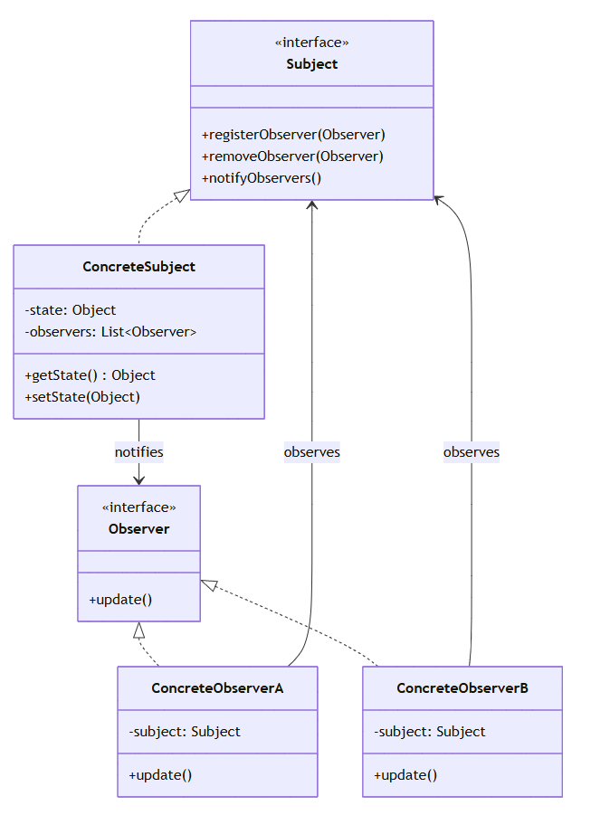


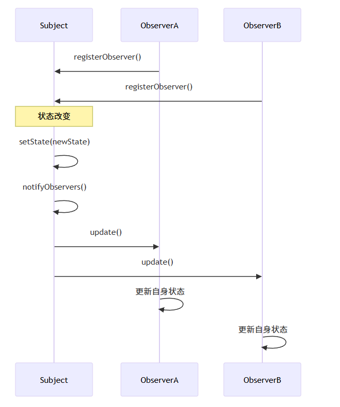


**观察者模式框架**

| **框架**         | **实现方式**                            | **特点**                             |
|------------------|----------------------------------------|--------------------------------------|
| **JavaBeans**    | `PropertyChangeListener`               | 内置Java标准                         |
| **RxJava**       | `Observable`/`Observer`               | 响应式扩展，支持复杂事件流           |
| **Spring**       | `ApplicationEvent`/`@EventListener`   | 应用上下文事件                       |
| ****       | `EventBus`                             | 分布式事件总线                       |
| **Guava**        | `EventBus`                             | 轻量级本地事件总线                   |


### 状态

状态模式允许一个对象在其**内部状态改变时改变它的行为**，使得对象看起来像是修改了它的类。

**核心思想：**
*   将与特定状态相关的行为封装到独立的**状态类**中。
*   让原始对象（称为**上下文**）持有对**当前状态对象**的引用。
*   上下文将**所有与状态相关的请求委托给当前的状态对象**。
*   当状态需要改变时，上下文只需改变它所持有的状态对象引用即可（指向另一个具体状态类的实例）。
*   这样，上下文的行为会随着内部状态的改变而自动改变，避免了庞大的条件语句（如 `if-else` 或 `switch-case`）。

**为什么需要状态模式？**

想象一个场景：一个对象（如订单、电梯、播放器、网络连接）在其生命周期中会经历多种状态（如 `待支付`、`已支付`、`已发货` / `开门`、`关门`、`运行`、`停止` / `播放`、`暂停`、`停止` / `连接`、`监听`、`关闭`）。对象在不同状态下的行为不同，且状态之间可以相互转换。

**不使用状态模式的痛点：**
1.  **庞大的条件语句：** 上下文类中充斥着大量的 `if (state == A) { ... } else if (state == B) { ... } else ...` 语句来判断当前状态并执行相应行为。代码臃肿、难以阅读和维护。
2.  **违反开闭原则：** 增加或修改一个状态，需要修改包含这些庞大条件语句的方法，容易引入错误。
3.  **状态转换逻辑分散/耦合：** 状态转换的逻辑可能散落在上下文的不同方法中，或者与状态行为代码混杂在一起，不够清晰。
4.  **难以理解状态图：** 代码不能清晰地反映出对象状态变化的完整图景。

**状态模式的结构：**

1.  **上下文 (Context):**
    *   定义客户端感兴趣的接口。
    *   维护一个对 **当前状态** 对象的引用。
    *   将状态相关的请求委托给当前状态对象处理。
    *   通常还提供一个方法（`setState(State state)`）来改变其当前状态（状态转换可以由 Context 触发，也可以由 State 对象触发）。

2.  **抽象状态 (State):**
    *   定义一个接口，封装了所有**特定状态**可能的行为。这些行为通常对应着 Context 中那些依赖于状态的方法。

3.  **具体状态 (Concrete State):**
    *   实现抽象状态接口。
    *   为 Context 定义在**该具体状态**下应该表现的行为。
    *   在需要时，**知道并能够触发状态转换**（通常通过调用 Context 的 `setState` 方法）。*（状态转换逻辑可以放在 Context 中，也可以放在具体状态类中，或者两者结合，取决于哪种更清晰）*。

**状态图：**

```
+----------------+       +------------------+        +-------------------+
|    Context     |<>---->|    State (接口)   |<|------| ConcreteStateA    |
+----------------+       +------------------+        +-------------------+
| - state: State |       | + handle(): void |        | + handle(): void  |
+----------------+       +------------------+        +-------------------+
         ^                           ^                        ^
         | (委托请求)                   | (实现)                  |
         |                           |                        |
         |                           |                        |
         |                   +-------------------+        +-------------------+
         |                   | ConcreteStateB    |        | ConcreteStateC    |
         |                   +-------------------+        +-------------------+
         |                   | + handle(): void  |        | + handle(): void  |
         |                   +-------------------+        +-------------------+
         |________________________________________________________|
                            (可能通过 setState() 改变 Context 的状态)
```

**工作流程：**
1.  客户端通过 Context 发起一个请求（如调用 `request()` 方法）。
2.  Context 收到请求，但它并不自己处理该请求的具体逻辑，而是将请求**委托**给其当前持有的 State 对象（`state.handle()`）。
3.  当前的 Concrete State 对象执行与该状态对应的行为。
4.  **状态转换（可选）：**
    *   在执行行为的过程中，该 Concrete State 对象可能根据逻辑判断需要转换状态。
    *   它通过调用 Context 的 `setState(new ConcreteStateX())` 方法，将 Context 的 `state` 引用指向新的具体状态对象。
    *   当下一次请求到来时，Context 就会委托给这个新的状态对象处理，行为也随之改变。

**状态模式的关键点：**
*   **谁负责状态转换？** 这是设计中的一个重要决策点：
    *   **由 Context 负责：** Context 知道所有可能的状态和转换规则。状态对象只负责行为，不关心转换。转换逻辑集中在 Context 中。
    *   **由 State 负责：** 具体状态对象知道在什么条件下应该转换到什么状态（通过调用 Context 的 `setState`）。转换逻辑分散在各个状态类中，通常更符合“状态知道下一步该去哪”的直觉。
    *   **混合模式：** 常用方式。状态对象执行动作并决定*是否*需要转换，然后调用 Context 的 `changeState()` 方法（该方法内部封装了实际的 `setState` 和可能需要的其他清理/初始化操作）。Context 可能提供一个所有状态对象都知道的公共转换方法。
*   **共享状态对象：** 如果具体状态类没有实例变量（即它们是无状态的，只依赖于传入的 Context），那么同一个具体状态类的实例可以被多个 Context 对象共享（通常使用单例模式实现）。这可以节省内存。
*   **与策略模式的区别：** 两者结构相似（Context + 接口 + 多个实现），但目的不同：
    *   **策略模式：** 关注于**封装不同的算法**，让客户端在运行时选择或更换算法。策略之间通常是**独立且可互换**的，策略对象**不知道其他策略**的存在，策略切换通常由**客户端主动发起**。
    *   **状态模式：** 关注于**封装与状态相关的行为**以及**状态之间的转换**。状态是对象生命周期的一部分，状态之间通常有**关联和转换规则**，状态对象**可能知道并触发转换**到其他状态（通过Context），状态转换通常是**对象内部行为的结果（自动）**。

**状态模式的优点：**
1.  **单一职责原则：** 将与特定状态相关的代码组织到独立的类中。
2.  **开闭原则：** 引入新状态无需修改现有状态类或上下文（主要修改转换逻辑部分），只需添加新的具体状态类。
3.  **消除庞大的条件分支：** 上下文代码变得更简洁、易读、易维护。
4.  **状态转换显式化：** 状态转换逻辑更加集中和清晰（无论是放在 Context 还是 State 中），更容易理解和维护状态机。
5.  **提高内聚性：** 每个状态的行为都封装在对应的类里。

**状态模式的缺点：**
1.  **可能过度设计：** 如果状态数量很少且状态转换非常简单，使用状态模式可能会引入不必要的复杂性。
2.  **类数量增加：** 每个状态都需要一个单独的类，可能导致系统中类的数量增多。
3.  **状态转换逻辑可能复杂：** 如果状态转换逻辑非常复杂，将其放在 Context 或分散在 State 中都可能变得难以管理。有时可能需要结合状态机框架。

**经典应用场景：**
*   **工作流引擎：** 订单状态（待支付、已支付、已发货、已完成、已取消）、请假审批流程（提交、部门审批、HR审批、完成/驳回）。
*   **游戏开发：** 游戏角色状态（站立、行走、奔跑、跳跃、攻击、死亡）、游戏关卡状态。
*   **用户界面：** 控件状态（正常、禁用、悬停、按下）。
*   **网络协议：** TCP连接状态（`LISTEN`, `SYN_SENT`, `SYN_RECEIVED`, `ESTABLISHED`, `FIN_WAIT_1`, `FIN_WAIT_2`, `CLOSE_WAIT`, `CLOSING`, `LAST_ACK`, `TIME_WAIT`, `CLOSED`）。
*   **设备控制：** 电梯状态、交通灯状态、播放器状态（播放、暂停、停止）。
*   **编译器/解释器：** 词法分析器在不同输入字符下的状态转换。

**简单代码示例（电梯状态）：**

```java
// 抽象状态
interface ElevatorState {
    void openDoors();
    void closeDoors();
    void move();
    void stop();
}

// 具体状态：开门状态
class OpenState implements ElevatorState {
    private Elevator elevator;
    public OpenState(Elevator elevator) { this.elevator = elevator; }

    @Override
    public void openDoors() { System.out.println("门已经是开着的了。"); }
    @Override
    public void closeDoors() {
        System.out.println("正在关门...");
        elevator.setState(elevator.getClosedState()); // 触发状态转换 -> 关门状态
    }
    @Override
    public void move() { System.out.println("开门状态下不能移动！请先关门。"); }
    @Override
    public void stop() { System.out.println("开门状态下已经是停止的。"); }
}

// 具体状态：关门状态
class ClosedState implements ElevatorState {
    private Elevator elevator;
    public ClosedState(Elevator elevator) { this.elevator = elevator; }

    @Override
    public void openDoors() {
        System.out.println("正在开门...");
        elevator.setState(elevator.getOpenState()); // 触发状态转换 -> 开门状态
    }
    @Override
    public void closeDoors() { System.out.println("门已经是关着的了。"); }
    @Override
    public void move() {
        System.out.println("电梯开始移动...");
        elevator.setState(elevator.getMovingState()); // 触发状态转换 -> 移动状态
    }
    @Override
    public void stop() { System.out.println("关门状态下已经是停止的。"); }
}

// 具体状态：移动状态 (实现略，类似)
class MovingState implements ElevatorState { ... }

// 上下文：电梯
class Elevator {
    private ElevatorState openState;
    private ElevatorState closedState;
    private ElevatorState movingState;
    private ElevatorState currentState;

    public Elevator() {
        openState = new OpenState(this);
        closedState = new ClosedState(this);
        movingState = new MovingState(this);
        currentState = closedState; // 初始状态：门关着，停止
    }

    // 状态获取器 (供具体状态使用)
    public ElevatorState getOpenState() { return openState; }
    public ElevatorState getClosedState() { return closedState; }
    public ElevatorState getMovingState() { return movingState; }

    // 设置状态 (供具体状态调用)
    public void setState(ElevatorState state) {
        this.currentState = state;
        System.out.println("电梯状态已切换至: " + state.getClass().getSimpleName());
    }

    // 将行为委托给当前状态对象
    public void openDoors() { currentState.openDoors(); }
    public void closeDoors() { currentState.closeDoors(); }
    public void move() { currentState.move(); }
    public void stop() { currentState.stop(); }
}

// 客户端使用
public class Client {
    public static void main(String[] args) {
        Elevator elevator = new Elevator();

        elevator.openDoors(); // 从 Closed -> Open (输出:正在开门...)
        elevator.closeDoors(); // 从 Open -> Closed (输出:正在关门...)
        elevator.move();       // 从 Closed -> Moving (输出:电梯开始移动...)
        elevator.stop();       // 假设MovingState的stop()会转换到ClosedState
        elevator.openDoors();  // 从 (新的ClosedState) -> Open
    }
}
```

---
### 策略

策略模式定义了一系列算法，并将每个算法封装起来，使它们可以**互相替换**，且算法的变化不会影响使用算法的客户端。策略模式让算法独立于使用它的客户端而变化，由客户端选择具体需要哪个算法

**核心思想**
*   **分离变与不变**：将经常变化的**算法**从稳定的**上下文**中分离出来。
*   **面向接口编程**：定义统一的策略接口，不同算法实现该接口。
*   **委托代替继承**：上下文类**持有策略接口的引用**，通过组合方式动态切换算法（而非通过继承硬编码）。

**结构**
1.  **策略接口 (Strategy Interface)**  
    定义所有支持的算法的公共接口（通常是抽象方法）。  
    ```java
    public interface PaymentStrategy {
        void pay(double amount);
    }
    ```

2.  **具体策略类 (Concrete Strategies)**  
    实现策略接口，提供具体的算法实现。  
    ```java
    public class CreditCardPayment implements PaymentStrategy {
        @Override
        public void pay(double amount) {
            System.out.println("信用卡支付: " + amount + "元");
        }
    }

    public class AlipayPayment implements PaymentStrategy {
        @Override
        public void pay(double amount) {
            System.out.println("支付宝支付: " + amount + "元");
        }
    }
    ```

3.  **上下文类 (Context)**  
    *   持有对策略对象的引用。
    *   提供设置策略的方法（或通过构造函数注入）。
    *   委托策略对象执行具体算法。  
    ```java
    public class ShoppingCart {
        private PaymentStrategy paymentStrategy; // 持有策略引用

        // 设置支付策略
        public void setPaymentStrategy(PaymentStrategy strategy) {
            this.paymentStrategy = strategy;
        }

        // 委托策略执行支付
        public void checkout(double amount) {
            paymentStrategy.pay(amount);
        }
    }
    ```

**工作流程**
1.  **客户端**创建具体策略对象（如 `CreditCardPayment`）。
2.  **客户端**将策略对象传递给上下文（`ShoppingCart.setPaymentStrategy()`）。
3.  **上下文**调用策略接口的方法（`checkout()` → `pay()`）。
4.  **具体策略**执行实际算法（如信用卡支付逻辑）。

**关键特点**
| **特点**                | **说明**                                                                 |
|-------------------------|--------------------------------------------------------------------------|
| **算法独立**            | 新增或修改算法不影响上下文和其他策略                                     |
| **消除条件分支**        | 避免在代码中出现大量 `if-else` 或 `switch-case` 判断算法类型              |
| **开闭原则 (OCP)**      | 新增策略只需添加新类，无需修改上下文                                    |
| **组合优于继承**        | 通过组合策略对象动态切换行为，避免子类爆炸                              |
| **运行时灵活性**        | 客户端可在运行时自由切换策略                                            |


**代码示例：电商支付场景**
```java
public class Client {
    public static void main(String[] args) {
        ShoppingCart cart = new ShoppingCart();
        
        // 运行时切换策略
        cart.setPaymentStrategy(new CreditCardPayment());
        cart.checkout(1000.0); // 输出：信用卡支付: 1000.0元
        
        cart.setPaymentStrategy(new AlipayPayment());
        cart.checkout(500.0);  // 输出：支付宝支付: 500.0元
    }
}
```

**适用场景**
1.  **多种算法变体**：需要动态切换多种相似算法（如排序、加密、文件压缩）。
2.  **消除条件分支**：避免在业务逻辑中出现复杂的算法选择分支。
3.  **算法复用**：多个类仅算法不同，可通过策略共享避免代码重复。
4.  **框架扩展点**：允许用户自定义插件化算法（如 Spring 的 `ResourceLoader`）。


### **优缺点**
| **优点**                          | **缺点**                              |
|-----------------------------------|---------------------------------------|
| ✅ 算法自由扩展，符合开闭原则       | ❌ 客户端需了解所有策略差异            |
| ✅ 避免多重条件判断语句             | ❌ 策略类数量可能增多（小算法场景慎用）|
| ✅ 算法复用与单元测试更便捷         | ❌ 上下文与策略的通信可能增加开销      |
| ✅ 运行时动态切换策略               |                                       |


---
### 模板


模板模式在超类中定义算法的框架结构，允许子类在不改变算法整体流程的情况下重写特定步骤的实现。

**核心思想**
**"封装不变部分，扩展可变部分"**  
在父类中固定算法的骨架（不可变部分），将具体步骤的实现延迟到子类（可变部分）


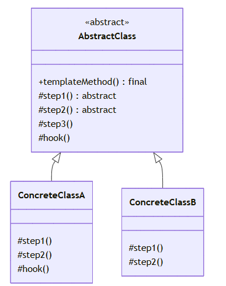

1. **抽象类（Abstract Class）**
   - 定义模板方法 `templateMethod()`（通常为 `final`）
   - 声明抽象方法（必须由子类实现）
   - 提供具体方法（默认实现）
   - 提供钩子方法（可选实现）

2. **具体子类（Concrete Class）**
   - 实现父类的抽象方法
   - 可选覆盖钩子方法


**核心组件解析**
1. **模板方法 (Template Method)**
   - 定义算法骨架的 `final` 方法
   - 调用各步骤方法（抽象/具体/钩子方法）

2. **抽象方法 (Abstract Methods)**
   - 必须由子类实现的算法步骤
   - 如示例中的 `parseData()` 和 `transformData()`

3. **具体方法 (Concrete Methods)**
   - 在抽象类中已实现的通用步骤
   - 如示例中的文件操作相关方法

4. **钩子方法 (Hook Methods)**
   - 提供扩展点的可选方法
   - 子类可决定是否覆盖（如 `needValidation()`）

**应用场景**
1. **算法框架固定，步骤实现可变**
   - 数据解析处理（CSV/XML/JSON）
   - 文档生成（PDF/HTML/Markdown）
   
2. **流程控制需求**
   - 工作流引擎
   - 编译过程（词法分析→语法分析→代码生成）
   
3. **框架扩展点**
   - Spring JdbcTemplate 的 `execute()`
   - Servlet 的 `service()` 方法


**优缺点分析**
**✅ 优点**
- 代码复用：将公共代码移至父类
- 扩展可控：保护核心算法不被修改
- 符合开闭原则：新增子类不影响现有代码
- 消除重复代码：统一处理通用步骤

**❌ 缺点**
- 继承限制：Java单继承限制灵活性
- 父类膨胀：抽象类可能变得复杂
- 违反里氏替换：子类可能破坏父类约束
- 调试困难：多级继承增加理解成本

**经典应用**
1. **Java I/O**
   - `InputStream` 的 `read()` 方法调用 `read(byte[] b, int off, int len)`
   
2. **Servlet 生命周期**
   - `HttpServlet` 的 `service()` 方法分发请求到 `doGet()/doPost()`

3. **Spring 框架**
   - `JdbcTemplate` 的 `execute()` 方法
   ```java
   public class JdbcTemplate {
       public final void execute(String sql) {
           // 获取连接
           Connection con = DataSourceUtils.getConnection();
           // 创建语句
           Statement stmt = con.createStatement();
           try {
               // 钩子方法（由子类实现）
               doExecute(stmt, sql);
           } finally {
               // 释放资源
               stmt.close();
           }
       }
       protected abstract void doExecute(Statement stmt, String sql);
   }
   ```

**最佳实践**
1. **合理使用钩子方法**
   - 在关键流程点提供扩展入口
   - 避免过度使用导致结构复杂

2. **控制抽象层级**
   - 模板方法不超过10个步骤
   - 抽象步骤保持单一职责

3. **与策略模式结合**
   ```java
   abstract class AdvancedProcessor {
       private ValidationStrategy strategy; // 组合策略模式
       
       public final void process() {
           //...固定步骤
           strategy.validate(data); // 可变校验策略
           //...固定步骤
       }
   }
   ```


### 访问者

确定对象结构稳定但经常需要添加新操作时，在不修改原对象的前提下，对每个对象的元素执行新操作

- 元素接口声明`accept()`方法
- 对象负责在每个元素与实际访问者之间建立联系：对象接收实际的访问者，并对对象的每个元素调用`accept(visitor)`方法
- 第一次分派：在元素的`accept(visitor)`方法中，调用`visitor`的`visitor.visit(this)`方法
- 第二次分派：`visitor`根据元素的类型选择具体的操作方法
  - 访问者接口声明N种重载方法，有N种元素就声明N种方法，每个方法的参数是元素接口的实现类，每个访问者实现类根据实际元素类型实现具体的操作


**优缺点分析**
**✅ 优点**
- 开闭原则：添加新操作无需修改元素类
- 单一职责：相关操作集中到访问者中
- 跨元素操作：实现跨不同元素类的操作
- 状态累积：访问者可在遍历中累积状态

**❌ 缺点**
- 破坏封装：访问者需访问元素内部细节
- 元素扩展困难：添加新元素需修改所有访问者
- 访问权限：可能被迫提供非必要的public方法
- 复杂度过高：小型对象结构不适用

**适用场景**
1. **复杂对象结构操作**
   - 编译器AST（抽象语法树）的多种操作（类型检查、代码优化）
   - 文档处理（导出、拼写检查、格式化）

2. **跨元素类操作**
   - 购物车不同商品的计算（总价、税费、折扣）
   - GUI组件树的操作（渲染、布局、事件处理）

3. **统计与报表生成**
   - 文件系统的空间统计（文件、目录、链接）
   - 组织架构的报表生成（部门、员工、职位）


**模式结构**
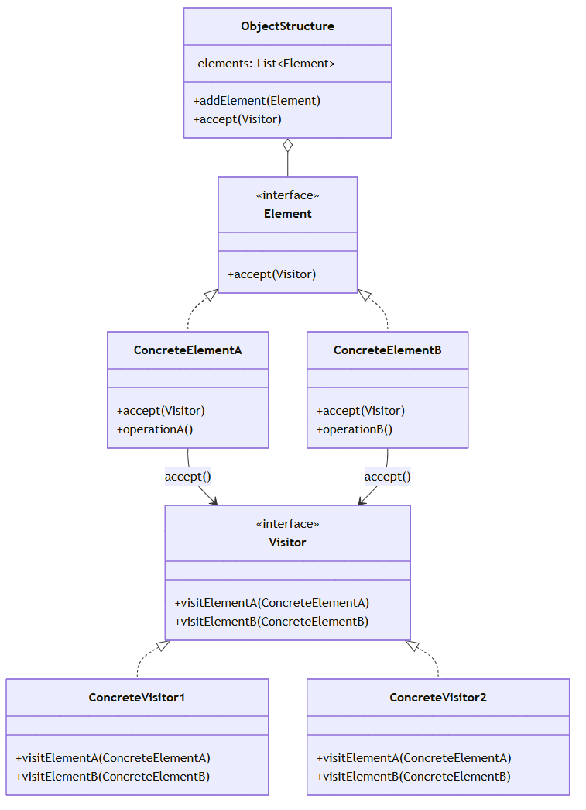


**代码示例：文档处理系统**
```java
// 元素接口
interface DocumentElement {
    void accept(DocumentVisitor visitor);
}

// 具体元素：文本段落
class TextElement implements DocumentElement {
    private String content;
    
    public TextElement(String content) {
        this.content = content;
    }
    
    public String getContent() {
        return content;
    }
    
    @Override
    public void accept(DocumentVisitor visitor) {
        visitor.visit(this);  // 第一次分派
    }
}

// 具体元素：图片
class ImageElement implements DocumentElement {
    private String path;
    private int width;
    private int height;
    
    public ImageElement(String path, int width, int height) {
        this.path = path;
        this.width = width;
        this.height = height;
    }
    
    public String getPath() { return path; }
    public int getWidth() { return width; }
    public int getHeight() { return height; }
    
    @Override
    public void accept(DocumentVisitor visitor) {
        visitor.visit(this);  // 第一次分派
    }
}

// 访问者接口
interface DocumentVisitor {
    void visit(TextElement text);
    void visit(ImageElement image);
}

// 具体访问者：导出为HTML
class HtmlExportVisitor implements DocumentVisitor {
    @Override
    public void visit(TextElement text) {
        System.out.println("<p>" + text.getContent() + "</p>");
    }
    
    @Override
    public void visit(ImageElement image) {
        System.out.printf("\n",
                          image.getPath(), image.getWidth(), image.getHeight());
    }
}

// 具体访问者：拼写检查
class SpellCheckVisitor implements DocumentVisitor {
    @Override
    public void visit(TextElement text) {
        System.out.println("检查拼写: " + text.getContent());
        // 实际拼写检查逻辑...
    }
    
    @Override
    public void visit(ImageElement image) {
        System.out.println("跳过图片: " + image.getPath());
    }
}

// 对象结构：文档
class Document {
    private List<DocumentElement> elements = new ArrayList<>();
    
    public void addElement(DocumentElement element) {
        elements.add(element);
    }
    
    public void accept(DocumentVisitor visitor) {
        for (DocumentElement element : elements) {
            element.accept(visitor);  // 遍历所有元素
        }
    }
}

// 客户端使用
public class Client {
    public static void main(String[] args) {
        // 创建文档结构
        Document doc = new Document();
        doc.addElement(new TextElement("欢迎使用访问者模式"));
        doc.addElement(new ImageElement("logo.png", 200, 100));
        doc.addElement(new TextElement("这是一个设计模式示例"));
        
        // 执行HTML导出
        System.out.println("=== 导出HTML ===");
        doc.accept(new HtmlExportVisitor());
        
        // 执行拼写检查
        System.out.println("\n=== 拼写检查 ===");
        doc.accept(new SpellCheckVisitor());
    }
}
```


### 空对象
**空对象模式** **提供一个行为中性（无操作或默认行为）的对象来代替 `null` 引用，从而避免客户端代码进行显式的 `null` 检查，并消除因 `null` 引用可能导致的错误（如 `NullPointerException`）。**

**核心目标：**

1.  **消除 `null` 检查：** 客户端代码无需写 `if (object != null)` 这样的防御性检查。
2.  **提供默认/安全的行为：** 当缺少真实对象时，提供一个“什么都不做”或执行无害默认操作的对象，使程序能安全地继续运行。
3.  **简化代码：** 使客户端代码更简洁、更专注于业务逻辑。
4.  **提高健壮性：** 减少由意外 `null` 引用引起的运行时错误。

**模式结构：**

1.  **`AbstractObject` (抽象对象)：**
    *   定义客户端期望的接口。
    *   声明所有客户端需要调用的操作（方法）。
    *   通常是接口或抽象类。

2.  **`RealObject` (真实对象)：**
    *   实现了 `AbstractObject` 接口。
    *   提供实际有意义的业务逻辑实现。

3.  **`NullObject` (空对象)：**
    *   同样实现了 `AbstractObject` 接口。
    *   实现接口的所有方法，但这些方法是**中性**的：
        *   **无操作 (Do Nothing)：** 最常见。方法体为空或只返回 `void`。
        *   **默认值：** 返回有意义的默认值（如返回 0、空字符串、空集合、`false` 等）。
        *   **日志记录：** 可选地记录该调用被一个空对象处理了（用于调试）。
    *   通常是一个单例（因为所有空对象实例行为相同）。

4.  **`Client` (客户端)：**
    *   使用 `AbstractObject` 接口类型的对象。
    *   **关键点：** 客户端**不知道**也不需要知道它持有的是 `RealObject` 还是 `NullObject`。它直接调用接口方法，无需检查 `null`。


**示例场景：**

*   **日志记录器：** 请求一个日志记录器。在调试模式返回真实记录器（写日志），在发布模式或特定类不需要日志时返回空记录器（忽略所有日志调用）。客户端代码始终调用 `logger.log(message)`，无需检查 `logger` 是否可用。
*   **数据访问：** 查询用户信息，未找到用户时返回一个 `NullUser` 对象（实现 `User` 接口），其 `getName()` 返回 "Guest" 或空字符串，`hasPermission()` 返回 `false`。客户端可以安全地显示用户名或检查权限。
*   **树形结构/组合模式：** 叶子节点的子节点集合可以返回空迭代器或空节点，避免客户端在遍历时检查每个节点是否有子节点。
*   **策略模式：** 没有特定策略时，提供一个“无操作”策略。

**优点：**

*   **代码简洁：** 消除大量重复的 `null` 检查，代码更清晰易读。
*   **增强健壮性：** 彻底避免 `NullPointerException`，提高程序稳定性。
*   **可预测性：** 即使没有真实对象，程序行为也是定义良好且一致的（执行中性行为）。
*   **遵循开闭原则：** 引入新的 `RealObject` 类型通常不需要修改客户端代码。添加新的中性行为有时可以通过新的 `NullObject` 子类实现。
*   **降低耦合：** 客户端只依赖抽象接口，不关心具体是真实对象还是空对象。

**缺点：**

*   **可能掩盖错误：** 如果“缺失对象”本应是一个**需要被注意和处理的错误情况**，使用空对象模式可能会**静默忽略**这个问题，使调试变得困难（你不知道是逻辑导致本该有对象却没有，还是空对象在默默工作）。需要谨慎判断使用场景。
*   **增加类数量：** 需要为每个可能返回 `null` 的抽象类型创建一个专门的 `NullObject` 类，可能增加系统复杂度。
*   **行为差异：** 需要确保所有 `NullObject` 的中性行为确实是客户端期望的。如果客户端需要区分“真实无操作”和“对象缺失”，此模式就不适用。

**何时使用：**

*   当对象缺失不是错误，并且存在一个合理的默认中性行为时。
*   当客户端需要检查 `null` 的代码非常多且重复，导致代码混乱时。
*   当你想明确表达“无”也是一种可能的状态，并给它一个正式的代表时。
*   当系统需要保证总是返回一个有效的对象引用时。


### 解释器

解释器模式定义了一种语言的文法表示，并创建一个解释器来解释该语言中的句子。这种模式主要用于需要解释执行特定语法规则的应用场景。


# JVM

Java 程序的执行全生命周期可划分为两个核心阶段：**编译期 (Compile Time)** 与 **运行时 (Runtime)**。

**编译期 (Compile Time)指将高级语言源代码转换为 JVM 可理解的中间格式（字节码）的过程**
- **输入**`.java` 源代码文件，**输出**`.class` 字节码文件
- `.class` 字节码文件包含 **JVM 指令集、符号表及类元数据**。
- `javap`：JDK 自带的反汇编工具，用于查看字节码指令
- `jclasslib`：可视化字节码查看插件，支持查看常量池、接口、字段、方法属性
- **Hex Editor**：以十六进制查看二进制文件，Java 类文件以魔数 `0xCAFEBABE` 开头


字节码文件由一系列**指令 (Instruction)** 组成，每条指令包含两个部分：
- **操作码 (Opcode)**：占用 1 字节，标识具体操作（如加载、存储、计算、跳转）。
- **操作数 (Operand)**：紧随操作码之后，提供操作所需的数据或常量池索引（部分无操作数指令除外）。


**运行时(Runtime)是指 JVM 启动并加载字节码，将其转换为底层硬件可执行的机器码的过程。**
1. **类加载 (Class Loading)**：JVM 通过类加载器读取 `.class` 文件。
2. **内存装载**：将类信息放入运行时数据区（Runtime Data Areas）。
3. **执行 (Execution)**：执行引擎读取内存中的字节码指令并运行。

**执行引擎机制**：JVM 采用混合模式执行代码
- **解释执行 (Interpreter)**：逐条读取字节码，翻译为机器码并立即执行。启动较快，但重复执行效率较低。
- **即时编译 (JIT - Just In Time)**：
  - **热点探测**：运行时监控高频执行的代码块（热点代码）。
  - **编译优化**：将热点代码编译为本地机器码并**缓存**。
  - **性能**：后续调用直接执行缓存的机器码，性能接近 C/C++。

**运行时数据区架构**：JVM 内存区域根据线程归属划分为两类
- **线程私有区域**：生命周期与线程绑定，随线程创建而创建，随线程销毁而回收。
  - **程序计数器 (PC Register)**：记录当前线程正在执行的字节码指令地址
    - 若执行 Java 方法，记录指令地址。
    - 若执行 Native 方法，值为 `undefined`。
    - 用于多线程切换后的上下文恢复及控制流（分支、循环、异常）跳转。
  - **虚拟机栈 (JVM Stack)**：由**栈帧 (Stack Frame)** 组成的 LIFO（后进先出）结构。主管 Java 方法的执行。每个方法调用对应一个栈帧的入栈，执行完毕对应出栈。
  - **本地方法栈**
- **线程共享区域 (Shared)**：所有线程可见，存在并发安全问题。
  - **堆 (Heap)**：存储对象实例及数组。
  - **方法区 (Method Area / Metaspace)**：存储已被加载的类信息、常量、静态变量、JIT 编译后的代码缓存、运行时常量池

**方法执行与栈帧模型**
- Java 方法的执行过程即**栈帧**在虚拟机栈中的流转过程。
- 栈帧内部结构
  - **局部变量表 (Local Variable Table)**：存放方法参数及方法内部定义的局部变量。
  - **操作数栈 (Operand Stack)**：用于执行计算时的临时数据存储及交换（后进先出）。
  - **动态连接 (Dynamic Linking)**：指向运行时常量池中该栈帧所属方法的引用。
  - **方法返回地址 (Return Address)**：记录方法正常或异常退出时，恢复上层调用者执行状态的地址。


## JVM运行时内存区域

Java 源代码经过编译生成字节码 (`.class`) 文件，由类加载器加载后交由执行引擎执行。在此过程中，JVM 会划分出一块专用内存空间用于存储程序执行期间所需的数据，该空间统称为 **运行时数据区**。

根据《Java 虚拟机规范》，运行时数据区可从线程归属的角度划分为 **线程私有区域** 和 **线程共享区域**。
- **线程私有区域构成：程序计数器、Java 虚拟机栈、本地方法栈**
- **线程共享区域构成：堆、方法区、运行时常量池**


### 线程私有

**程序计数器**
* **定义**：一块较小的内存空间，作为当前线程所执行字节码指令的行号指示器。
* **核心作用**：
  * **指令执行**：字节码解释器通过改变计数器的值来选取下一条需要执行的字节码指令（如顺序执行、分支、循环、跳转、异常处理）。
  * **线程恢复**：在多线程环境下，CPU 通过时间片轮转切换线程。为确保线程切换后能恢复到正确的执行位置，每个线程必须维护独立的程序计数器。
* **存储内容**：
  * 若当前执行的是 **Java 方法**，计数器记录的是正在执行的虚拟机字节码指令地址。
  * 若当前执行的是 **Native 方法**，计数器值为 `undefined`（因 Native 方法由 C/C++ 实现，不通过字节码指令执行）。
* **异常情况**：该区域是 JVM 规范中唯一没有规定任何 `OutOfMemoryError` 的区域。

**Java 虚拟机栈**
* **定义**：描述 Java 方法执行的内存模型。每个方法执行时会创建一个 **栈帧 (Stack Frame)**。
* **运作机制**：
  * **入栈**：方法被调用时，对应栈帧压入虚拟机栈。
  * **出栈**：方法执行结束（正常返回或抛出异常），对应栈帧弹出。
* **栈帧结构**：包含局部变量表、操作数栈、动态链接、方法出口等信息。
* **异常情况**：
  * `StackOverflowError`：线程请求的栈深度超过虚拟机允许的深度（如无限递归）。
  * `OutOfMemoryError`：如果虚拟机栈容量可以动态扩展，当扩展时无法申请到足够的内存。
* **参数配置**：使用 `-Xss` 参数调整栈大小（默认通常为 1024KB）。栈空间越小，支持的并发线程数可能越多，但单线程的最大调用深度减小。

**本地方法栈**
* **定义**：与 Java 虚拟机栈作用类似，区别在于 Java 虚拟机栈为执行 Java 方法服务，而本地方法栈为执行 **Native 方法** 服务。
* **实现**：HotSpot 虚拟机直接将本地方法栈与虚拟机栈合二为一。


**TLAB-Thread Local Allocation Buffer**：在堆内存中为每个线程分配私有区域，​加速对象分配，避免锁竞争
- 线程首次申请分配对象时，优先在私有`TLAB`上分配对象，`TLAB`不足时扩容或在`Eden`公共区分配
- `Eden`公共区由线程共享，需要进行同步操作
- 性能优势​：
  - **​无锁分配**​：提升高并发下对象创建速度
  - **​空间局部性**​：连续分配对象，提高CPU缓存命中率
- **`Thread Local Allocation Buffer`与`ThreadLocal<E>`是完全不关联的概念**
  - `ThreadLocal<E>`为每个线程提供独立的变量副本，​避免多线程竞争，实现线程隔离


### 线程共享
此类区域在 JVM 启动时创建，所有线程共享访问。

**堆**
- **定义**：JVM 内存管理中最大的一块区域，主要用于存放 **对象实例** 和 **数组**。
- **内存分配策略**：
  - **传统观点**：所有对象都在堆上分配。
  * **JIT 优化**：随着 **JIT 编译器** 和 **逃逸分析 (Escape Analysis)** 技术的发展，如果编译器确定一个对象不会逃逸出方法（即未被外部引用），可能会采用 **栈上分配 (Stack Allocation)** 或 **标量替换**，直接在栈帧中分配对象，减少 GC 压力。
* **逻辑划分**（基于分代收集算法）：
  * **新生代 (Young Generation)**：包含 Eden 区、From Survivor 区、To Survivor 区。
  * **老年代 (Old Generation)**。
* **异常情况**：
  * `java.lang.OutOfMemoryError: Java heap space`：堆内存不足以存放新创建的对象。
  * `java.lang.OutOfMemoryError: GC Overhead Limit Exceeded`：JVM 花费大量时间进行 GC 但回收空间甚微。
* **参数配置**：`-Xmx` (最大堆大小), `-Xms` (初始堆大小)。

**方法区 (Method Area)**
* **定义**：用于存储已被虚拟机加载的 **类信息**、**常量**、**静态变量**、**即时编译器编译后的代码缓存** 等数据。
* **演变历史**（以 HotSpot 为例）：
  * **JDK 7 及之前**：实现为 **永久代 (PermGen)**，位于 JVM 内存中，受 `-XX:MaxPermSize` 限制，易导致 OOM。
  * **JDK 8 及之后**：永久代被移除，取而代之的是 **元空间 (Metaspace)**。
* **元空间 (Metaspace)**：
  * **存储位置**：不再位于虚拟机内存，而是直接使用 **本地内存 (Native Memory)**。**属于堆外内存的一部分**
  * **优势**：空间大小受限于本地内存，大大降低了 OOM 的风险。
  * **参数配置**：`-XX:MaxMetaspaceSize`。

**运行时常量池 (Runtime Constant Pool)**
* **定义**：**方法区的一部分**。`.class` 文件中的 **常量池表 (Constant Pool Table)**（存放编译期生成的字面量和符号引用）在类加载后被放入运行时常量池。
* **特性**：具备**动态性**。除了保存 Class 文件中描述的常量外，运行期间也可将新的常量放入池中（例如 `String.intern()` 方法）。
* **位置变迁**：
  * **JDK 7**：**字符串常量池 (String Pool) 从方法区移动到了堆 (Heap)中**。
  * **JDK 8**：**运行时常量池位于元空间，但字符串常量池依然保留在堆中。**

> Jdk8后，方法区位于元空间，元空间位于堆外内存；
> 运行时常量池属于方法区，字符串常量池在堆中


---

### 进程虚拟地址空间

**进程的虚拟地址空间**：当操作系统运行一个程序（进程）时，它会**为该进程创建一个私有的、连续的、巨大的虚拟地址空间**。这是一个逻辑上的概念，并非物理内存的实际布局
- **隔离与安全**：每个进程都认为自己独占了全部内存（例如，从0x0000...到0xFFFF...），不同进程的相同虚拟地址会被映射到不同的物理地址，互相隔离，无法直接访问。
- **简化编程**：程序员和编译器无需关心物理内存的具体位置和分配，只需使用虚拟地址。
- **高效管理物理内存**：操作系统可以非连续地使用物理内存，通过分页和交换技术，让有限的物理内存运行多个需要大量内存的程序。


以64位Linux为例，虚拟地址空间从Ox7FFF FFFF FFFF FFFF到0x0000 0000 0000 0000的布局依次为
- 内核空间：操作系统内核代码与数据，用户进程不可直接访问，需通过系统调用；其他空间为用户空间
- 高地址区-向下增长
  - **内存映射区域**：由mmap系统调用创建，映射文件/共享库，MappedByteBuffer在此生效
  - **栈**：函数调用，局部变量，**每个线程有独立栈**
- 中间区域：向上增长
  - **堆**：动态分配内存，JVM堆位于此处
- 低地址区
  - BSS段：未初始化的全局/静态变量
  - 数据段：已初始化的全局/静态变量
  - 代码段：只读，存放程序指令


**内存管理单元**：**通过查询页表将虚拟地址转换为物理地址**，以访问真实内存
- **页表**：操作系统为每个进程维护的映射表，记录虚拟页到物理页帧的映射关系。
- **缺页中断**：当进程访问一个尚未映射到物理内存的虚拟页时，MMU触发中断，操作系统介入处理

**缺页中断**  
- **文件映射内存**：通过 mmap() 系统调用将文件的一部分映射到进程的地址空间；**操作系统不会在调用 mmap() 时就立刻把整个文件读入内存，而是等到真正访问到某页时才加载它**。**进程访问一个已经通过 mmap() 映射了文件，但对应的文件内容尚未被加载到物理内存的虚拟页时，触发缺页中断**
  - 从物理内存中分配一个空闲页帧
  - 发起磁盘I/O操作，将所需文件块（通常是4KB大小）从磁盘读取到上一步分配的物理页帧中
  - 更新页表，使虚拟页指向这个包含文件数据的物理页帧。
- **匿名映射内存**：匿名映射是指没有直接关联到磁盘文件的内存区域，例如，堆、栈、以及显式创建的匿名 mmap 区域。**进程访问一个已分配但尚未分配物理页的虚拟页时，触发缺页中断**。缺页中断完成后，程序才允许对该页进行读写。
  - 从物理内存中分配一个空闲页帧。
  - 填充零页：无需磁盘I/O。内核简单地将这个新分配的物理页帧全部填充为零（或调用专门的“零页”）。这是一个非常快的操作。
  - 建立映射：更新页表，建立映射关系。


**换页缺页**
- **页面换出**：匿名映射内存时的匿名页是脏的，即内存与硬盘不一致，当内存紧张时，操作系统可能会将这种脏的匿名页换出到磁盘的交换分区/文件中。
- 当进程再次访问已被换出的页时，会触发另一种缺页中断——换页缺页
  - 分配一个新的物理页帧。
  - 发起磁盘I/O，从交换空间中读回之前保存的数据。
  - 建立映射。


### 本地内存、堆外内存
操作系统分配给JVM进程的内存也可分为两部分：**堆内内存和堆外内存（本地内存）**
  
**本地内存由操作系统 + JVM 内部的 C++ 代码管理，主要包含**
- **元空间 (Metaspace)：存储类元数据（Klass 结构、方法定义等）。**
- **直接内存 (Direct Memory)：NIO 使用的 DirectByteBuffer**
- **线程栈 (Thread Stacks)：每个线程的栈空间（-Xss）**
- 代码缓存 (Code Cache)：JIT 编译后的本地机器码
- GC 和内部结构：垃圾收集器自身运行所需的数据结构
- JNI：本地方法调用的内存开销。


## 类加载子系统

### 类加载过程

**类加载 (Class Loading)** 是 JVM **将 `.class` 文件中的二进制数据读入内存，将其放在运行时数据区的方法区内，并在堆区创建一个 `java.lang.Class` 对象作为访问入口的过程。**

**类加载的生命周期**
- 类的生命周期包含 7 个阶段，其中**加载 (Loading)**、**连接 (Linking)**、**初始化 (Initialization)** 为类加载的核心过程。
- **加载 (Loading)**：此阶段 JVM 必须完成三件事
  1. **获取二进制流**：通过类的全限定名获取定义该类的二进制字节流（来源可以是 ZIP 包、网络、动态代理生成等）。
  2. **转化数据结构**：将字节流代表的静态存储结构转化为**方法区**的运行时数据结构。
  3. **生成 Class 对象**：在堆内存中生成一个代表该类的 `java.lang.Class` 对象，作为方法区这个类各种数据的访问入口。
- **连接 (Linking)**：此阶段将类的二进制数据合并到 JRE 中，细分为三个步骤：
  1. **验证 (Verification)**：确保字节流包含的信息符合 JVM 规范，保证安全性。
     - *文件格式验证*：魔数 `0xCAFEBABE`、版本号等。
     - *元数据验证*：语义分析（是否有父类、是否继承了 final 类等）。
     - *字节码验证*：数据流和控制流分析。
     - *符号引用验证*：确保解析动作能正确执行。
  2. **准备 (Preparation)**：为类变量（`static` 修饰）分配内存并设置**零值**（Default Value）。
     - *注意*：此时不包含 `final static` 常量（编译期已确定值）和实例变量（随对象实例化分配）。
     - *示例*：`public static int value = 123;` 在准备阶段 `value` 值为 0，而非 123。
  3. **解析 (Resolution)**：将常量池内的**符号引用**替换为**直接引用**。
     - *符号引用*：一组符号来描述目标，与虚拟机内存布局无关。
     - *直接引用*：直接指向目标的指针、相对偏移量或句柄。
- **初始化 (Initialization)**：类加载的最后一步，真正执行类中定义的 Java 程序代码。本质是执行类构造器 `<clinit>()` 方法的过程。
  - **`<clinit>()` 方法**：**由编译器自动收集类中的所有类变量的赋值动作和静态语句块 (`static {}`) 合并产生。**
  - **执行顺序**：**JVM 保证父类的 `<clinit>()` 先于子类执行。**
  - **线程安全**：**JVM 会对 `<clinit>()` 方法加锁，确保多线程环境下类的初始化只执行一次。**
  


**区分类加载初始化与对象实例化**
- **类初始化阶段操作的是 Class 对象，生命周期内通常只发生 1 次，任务是给静态变量赋初始值，执行静态代码块。**
- 对象实例化：发生时间是执行 new 指令时，每次 new 都会发生。任务是给实例变量赋值，执行构造函数代码
- 类加载的初始化阶段执行的`<clinit>()` 方法，只会合并静态语句块 (`static {}`)，不会合并非静态语句块。**非静态的语句块 {} 会被编译器提取，并合并到实例构造函数 `<init>` 中，且放在构造函数代码的最前面**。每次 new 对象时都会执行

---

**JVM 规范严格规定了有且只有 6 种情况必须立即对类进行“初始化”**，**即类加载是懒加载模式**
- **主动引用触发初始化**
  1. **特定指令**：遇到 `new`（实例化）、`getstatic`/`putstatic`（读取/设置静态字段，final 除外）、`invokestatic`（调用静态方法）指令时。
  2. **反射调用**：使用 `java.lang.reflect` 包方法对类进行反射调用时。
  3. **继承关系**：初始化一个类时，若其父类未初始化，需先触发父类初始化。
  4. **入口方法**：虚拟机启动时，包含 `main()` 方法的主类。
  5. **动态语言支持**：`java.lang.invoke.MethodHandle` 解析结果为静态成员时。
  6. **接口默认方法**：当一个接口定义了 JDK 8 新加入的默认方法，如果有实现类发生了初始化，该接口要在其之前被初始化。
- **被动引用不触发初始化**
  1. **子类引用父类静态字段**：只会触发父类初始化，子类不会初始化。
  2. **数组定义**：`SuperClass[] sca = new SuperClass[10];` 不会触发 `SuperClass` 初始化。
  3. **常量引用**：引用 `static final` 常量。常量在编译阶段存入调用类的常量池，本质上没有直接引用到定义常量的类。

---

### 类加载器层

**类加载器子系统 (Class Loader Subsystem)**
- 类加载器负责“通过全限定名获取描述此类的二进制字节流”，拥有三个层级
1. **启动类加载器 (Bootstrap ClassLoader)**：
   - 由 C++ 实现，是虚拟机自身的一部分。
   - 负责加载 `<JAVA_HOME>\lib` 目录下的核心库（如 `rt.jar`）。
   - 无法被 Java 程序直接引用。
2. **扩展类加载器 (Extension ClassLoader)**：
   - 由 Java 实现 (`sun.misc.Launcher$ExtClassLoader`)。
   - 负责加载 `<JAVA_HOME>\lib\ext` 目录下的扩展库。
3. **应用程序类加载器 (Application ClassLoader)**：
   - 由 Java 实现 (`sun.misc.Launcher$AppClassLoader`)。
   - 负责加载用户类路径 (`ClassPath`) 上指定的类库。
   - 它是 `ClassLoader.getSystemClassLoader()` 的返回值，通常是默认加载器。


### 双亲委派机制

**双亲委派模型Parent Delegation Model**

- **工作原理**：如果一个类加载器收到了类加载的请求，它首先不会自己去尝试加载这个类，而是把这个请求委派给父类加载器去完成，每一个层次的类加载器都是如此，因此所有的加载请求最终都应该传送到顶层的启动类加载器中。只有当父加载器反馈自己无法完成这个加载请求（找不到类）时，子加载器才会尝试自己去加载。
- **核心优势**：
  1. **安全性**：防止 Java 核心 API 被篡改（例如用户自定义一个 `java.lang.Object`，会被委派给 Bootstrap 加载器，加载的依然是系统原生的 Object）。
  2. **避免重复加载**：保证被加载类的唯一性。

**破坏双亲委派**：在某些特殊场景下（如 JNDI、JDBC、模块化热部署），需要打破该模型。
* **线程上下文类加载器 (Thread Context ClassLoader)**：允许父级加载器（如 Bootstrap 加载的 JNDI 核心类）请求子级加载器（如 Application 加载器）去加载厂商实现的 SPI (Service Provider Interface) 代码。
* **Tomcat 类加载机制**：为了实现 Web 应用的隔离（不同应用依赖不同版本的库），Tomcat 自定义了复杂的类加载器架构，优先加载 Web 应用目录下的类，而非委托给父级。


### 类文件结构

**Class 文件**是 Java 虚拟机执行引擎的数据入口，也是 Java 实现“一次编写，到处运行”跨平台特性的基石。它是一组以 8 位字节为基础单位的二进制流，各个数据项目严格按照顺序紧凑排列在文件之中，中间没有添加任何分隔符。

**数据结构基础**：Class 文件采用一种伪结构来存储数据，仅包含两种数据类型：
1. **无符号数 (Unsigned Numbers)**：
   * 基本数据类型，以 `u1`、`u2`、`u4`、`u8` 分别代表 1 个字节、2 个字节、4 个字节、8 个字节的无符号数。
   * 用于描述数字、索引引用、数量值或 UTF-8 编码的字符串值。
2. **表 (Tables)**：
   * 由多个无符号数或其他表作为数据项构成的复合数据类型。
   * 通常以 `_info` 结尾。整个 Class 文件本质上就是一张巨大的表。

**字节序**：Class 文件使用 **Big-Endian**（大端模式）顺序存储多字节数据（高位字节在前，低位字节在后）。

---

**Class 文件结构严格按照以下顺序排列**：
| 类型 | 名称 | 数量 | 描述 |
| --- | --- | --- | --- |
| `u4` | **magic** | 1 | 魔数 (Magic Number) |
| `u2` | **minor_version** | 1 | 次版本号 |
| `u2` | **major_version** | 1 | 主版本号 |
| `u2` | **constant_pool_count** | 1 | 常量池容量计数值 |
| `cp_info` | **constant_pool** | count-1 | 常量池表 |
| `u2` | **access_flags** | 1 | 访问标志 |
| `u2` | **this_class** | 1 | 类索引 |
| `u2` | **super_class** | 1 | 父类索引 |
| `u2` | **interfaces_count** | 1 | 接口计数器 |
| `u2` | **interfaces** | count | 接口索引集合 |
| `u2` | **fields_count** | 1 | 字段计数器 |
| `field_info` | **fields** | count | 字段表集合 |
| `u2` | **methods_count** | 1 | 方法计数器 |
| `method_info` | **methods** | count | 方法表集合 |
| `u2` | **attributes_count** | 1 | 属性计数器 |
| `attribute_info` | **attributes** | count | 属性表集合 |

---

**魔数与版本号 (Magic & Version)**
* **魔数 (Magic Number)**：前 4 个字节，固定为 `0xCAFEBABE`。唯一作用是确定该文件是否为一个能被虚拟机接受的 Class 文件。
* **版本号**：
* JDK 兼容性遵循“向下兼容”原则。
* JDK 1.1 使用 45.3，JDK 1.2 使用 46.0，以此类推。高版本 JDK 能执行低版本 Class 文件，反之则抛出 `UnsupportedClassVersionError`。


**常量池 (Constant Pool)**：Class 文件的资源仓库，主要存放两大类常量：
1. **字面量 (Literals)**：接近 Java 语言层面的常量概念，如文本字符串、`final` 常量值等。
2. **符号引用 (Symbolic References)**：编译原理方面的概念，包含：
   * 类和接口的全限定名。
   * 字段的名称和描述符。
   * 方法的名称和描述符。

- **特性**：
  * 索引从 1 开始（索引 0 保留，用于表示“不引用任何一个常量池项目”）。
  * 共有 17 种常量类型（如 `CONSTANT_Class_info`, `CONSTANT_Utf8_info`, `CONSTANT_Methodref_info` 等）。

**访问标志 (Access Flags)**：占用 2 个字节，用于识别类或接口层次的访问信息。
* **常见标志**：
* `ACC_PUBLIC` (0x0001)：是否为 public。
* `ACC_FINAL` (0x0010)：是否为 final。
* `ACC_INTERFACE` (0x0200)：是否为接口。
* `ACC_ABSTRACT` (0x0400)：是否为 abstract。


**类索引、父类索引与接口索引集合**：这三项数据确定了该类的继承关系：
* **this_class**：指向常量池中类描述符的索引，确定全限定名。
* **super_class**：指向父类全限定名。除 `java.lang.Object` 外，所有类的父类索引都不为 0。
* **interfaces**：描述该类实现了哪些接口。

**字段表集合 (Fields)**：描述接口或者类中声明的变量（包括类变量和实例变量，但不包括方法内部的局部变量）。

* **结构**：包含访问标志 (`access_flags`)、名称索引 (`name_index`)、描述符索引 (`descriptor_index`) 和属性表集合。
* **描述符**：用于描述字段的数据类型。例如 `I` 表示 `int`，`Ljava/lang/String;` 表示 `String` 对象。

**方法表集合 (Methods)**：描述类中定义的方法。

* **结构**：与字段表类似。
* **注意**：方法体内的代码并不直接存在方法表中，而是经过编译成字节码指令后，存放在方法属性表集合中的 **Code** 属性内。

**属性表集合 (Attributes)**：Class 文件中最灵活的部分，不要求严格的顺序。

* **Code 属性**：存放 Java 方法编译后的字节码指令。包含 `max_stack`（操作数栈深）、`max_locals`（局部变量表大小）及字节码流。
* **LineNumberTable**：建立字节码偏移量与源代码行号之间的联系（用于调试与报错定位）。
* **LocalVariableTable**：建立栈帧局部变量表中的变量与源代码中定义的变量之间的联系。
* **SourceFile**：记录生成该 Class 文件的源码文件名称。

---

## 执行引擎


### 栈帧

**栈帧 (Stack Frame)** 是 Java 虚拟机运行时数据区中 **虚拟机栈 (VM Stack)** 的基本单位，用于支持方法调用和执行。每个方法从调用开始到执行完成，对应着一个栈帧在虚拟机栈中从入栈到出栈的过程。

栈帧的结构主要包含四部分：**局部变量表**、**操作数栈**、**动态连接**和**方法返回地址**。

**局部变量表 (Local Variable Table)**：一组变量值存储空间，用于存放方法参数和方法内部定义的局部变量。
* **编译期确定**：局部变量表的最大容量在编译期确定，并保存在方法的 `Code` 属性的 `max_locals` 数据项中。
* **Slot (变量槽)**：局部变量表的最小存储单位。
  * **32 位数据**：`boolean`, `byte`, `char`, `short`, `int`, `float`, `reference`, `returnAddress` 占用 1 个 Slot。
  * **64 位数据**：`long`, `double` 占用 2 个连续的 Slot。
* **索引分配**：
  * **静态方法**：参数和局部变量从索引 0 开始顺序排列。
  * **实例方法**：索引 0 默认存储方法所属对象的引用 (`this`)，参数和局部变量从索引 1 开始排列。
* **Slot 复用**：为了节省栈帧空间，如果当前字节码指令的位置已超出了某变量的作用域，该变量占用的 Slot 可以被后续定义的变量复用。

> **优化启示**：合理控制变量作用域有助于减少栈帧内存消耗，可能对垃圾回收产生微弱影响（复用 Slot 可打断过期的对象引用）。

---

**操作数栈 (Operand Stack)**：一个后进先出 (LIFO) 的栈结构，作为方法执行过程中数据的临时交换区。
* **编译期确定**：最大深度在编译期确定，保存在 `Code` 属性的 `max_stack` 数据项中。
* **执行逻辑**：
  * 方法刚开始执行时，操作数栈为空。
  * 字节码指令（如 `iadd`, `iconst`）会将常量或从局部变量表加载的数据**压入**栈中，或从栈顶**弹出**数据进行运算，并将结果重新压入。
* **类型约束**：栈内的元素数据类型必须与字节码指令严格匹配（例如 `iadd` 指令执行时，栈顶两个元素必须是 `int` 类型）。

---

**动态连接 (Dynamic Linking)**：每个栈帧都包含一个指向运行时常量池中该栈帧所属方法的引用，持有这个引用是为了支持方法调用过程中的**动态连接**。
* **静态解析**：符号引用在类加载阶段或第一次使用时转化为直接引用（如静态方法、私有方法）。
* **动态连接**：符号引用在**每一次运行期间**转化为直接引用。
* 典型场景：`invokevirtual` 指令调用虚方法时，需根据调用者的实际运行时类型（RTTI）查找目标方法。


---

**方法返回地址 (Method Return Address)**：当一个方法开始执行后，只有两种方式退出：
1. **正常完成出口 (Normal Completion)**
  * **触发条件**：遇到任意方法返回的字节码指令（如 `ireturn`, `return`）。
  * **恢复状态**：调用者的 PC 计数器值作为返回地址。栈帧出栈，恢复上层方法的局部变量表和操作数栈，将返回值压入调用者的操作数栈。
2. **异常完成出口 (Abrupt Completion)**
   * **触发条件**：方法执行过程中遇到异常，且该异常未在方法体内得到处理（未匹配到异常表）。
   * **状态**：不会给上层调用者产生任何返回值。

---

**栈帧与 StackOverflowError**：虚拟机栈内存有限。若方法调用链过深（如无限递归），导致栈帧总大小超过虚拟机栈允许的最大深度，JVM 将抛出 `StackOverflowError`。


### **栈虚拟机和寄存器虚拟机**

在虚拟机VM的设计中，指令集架构ISA主要分为两大流派：**基于栈的虚拟机Stack-based VM** 和 **基于寄存器的虚拟机 Register-based VM**。两者的核心差异在于操作数的存储与检索机制。
* **栈 (Stack)**：位于内存中。数据访问涉及内存寻址。
* **寄存器 (Register)**：位于 CPU 内部。是计算机中读写速度最快的存储单元。
* **物理规律**：基于寄存器的架构在硬件层面通常比基于栈的架构具有更快的执行速度，因为减少了内存 I/O 开销。
* **基于栈的 VM**：代表如 **HotSpot JVM**、CPython。使用操作数栈 (Operand Stack) 管理计算过程，指令通常不包含显式的操作数地址（零地址指令）。
* **基于寄存器的 VM**：代表如 **LuaVM** (5.0+)、Dalvik (Android)。使用虚拟寄存器管理计算过程，指令需显式指定操作数地址（二地址或三地址指令）。

---

**基于栈的虚拟机**
- JVM 采用**操作数栈**来管理计算。
  * **数据流转**：方法调用时创建栈帧 (Stack Frame)，栈帧内包含**局部变量表**和**操作数栈**。
  * **指令特点**：指令集主要为**零地址指令** (Zero-Address Instruction)。指令隐式地操作栈顶元素，无需指定源地址和目标地址。
- 计算 `int c = 33 + 44;` 的字节码指令序列：

```java
0: bipush 33    // 将常量 33 压入操作数栈顶
2: istore_1     // 弹出栈顶元素(33)，存入局部变量表 Slot 1
3: bipush 44    // 将常量 44 压入操作数栈顶
5: istore_2     // 弹出栈顶元素(44)，存入局部变量表 Slot 2
6: iload_1      // 将局部变量表 Slot 1 的值(33)压入栈顶
7: iload_2      // 将局部变量表 Slot 2 的值(44)压入栈顶
8: iadd         // 弹出栈顶两个元素(33, 44)，相加，将结果(77)压入栈顶
9: istore_3     // 弹出栈顶元素(77)，存入局部变量表 Slot 3

```


* **为什么 JVM 选择栈架构？**
  * **可移植性 (Portability)**：不依赖特定硬件寄存器的数量，易于在不同 CPU 架构上实现。
  * **指令紧凑**：零地址指令长度短（通常 1 字节操作码），代码体积小，适合早期网络传输和嵌入式设备。
  * **编译器实现简单**：无需进行复杂的寄存器分配算法。
---

**基于寄存器的虚拟机**
- LuaVM 使用**虚拟寄存器**来管理计算
  * **数据流转**：指令直接对寄存器进行操作，类似于物理 CPU 的执行方式。
  * **指令特点**：指令集主要为**二地址或三地址指令**。必须显式指定源操作数和目标操作数的寄存器地址。
- 计算 `local c = a + b` 的 Lua 字节码（逻辑示意）：

```lua
LOADI 0 33      ; 将 33 加载到寄存器 R0
LOADI 1 44      ; 将 44 加载到寄存器 R1
ADD   2 0 1     ; 计算 R0 + R1，结果存入 R2

```
- Lua 在 5.0 版本之前也是基于栈的，5.0 后转为基于寄存器，主要驱动力为：
  1. **减少数据移动**：避免了大量的入栈 (Push) 和出栈 (Pop) 操作。
  2. **减少指令数量**：一条寄存器指令可以完成多条栈指令的工作（如上例，加法仅需 1 条指令，而栈架构需要 `load` + `add` + `store` 多步）。

---

**优缺点对比总结**

| 维度 | 基于栈 (Stack-based) | 基于寄存器 (Register-based) |
| --- | --- | --- |
| **指令长度** | **短** (零地址，紧凑) | **长** (需包含操作数地址) |
| **指令数量** | **多** (需频繁 Push/Pop) | **少** (单条指令承载更多逻辑) |
| **执行速度** | 相对较慢 (内存访问/栈顶移动频繁) | **快** (数据移动少，贴近硬件) |
| **可移植性** | **高** (硬件无关) | 较低 (依赖寄存器设计) |
| **编译器实现** | **简单** | 复杂 (需寄存器分配算法) |
| **代表实现** | Java (HotSpot), Python | Lua, Android (Dalvik/ART) |

**结论**
* **基于栈**：以**代码体积**和**移植性**为优先考量，牺牲了部分运行时性能（尽管现代 JIT 编译器已极大优化了这一点）。
* **基于寄存器**：以**执行效率**和**性能**为优先考量，通过减少指令分派次数和数据移动次数来提升速度。
### javap

**因为有编译器优化和语法糖，所以源码是骗人的，只有JVM 视角里的字节码是诚实的**，不止步于性能监控，**利用`javap`反编译的字节码进行故障排查和深度调优**
- **字节码 (Bytecode)** 是 Java实现平台无关性的核心
- `javap` 是 JDK 自带的反汇编工具，用于将 `.class` 文件转换回可读的指令流和元数据结构，是分析 JVM 执行机制的关键手段。
- `javap` 主要用于**显示编译后的类文件结构，包括构造方法、成员方法、字段描述符以及字节码指令**。**`javap`不会还原源代码，而是展示 JVM 视角的执行逻辑**。

**常用指令参数**
* `javap -c [ClassName]`: 对代码进行反汇编（显示字节码指令）。
* `javap -v [ClassName]`: 输出附加信息（Verbose），包含行号表 (`LineNumberTable`)、局部变量表 (`LocalVariableTable`)、常量池、操作码等。
* `javap -p [ClassName]`: 显示所有类和成员，包括 `private` 修饰的成员。


`javap -v` 输出内容通常包含文件元数据、常量池、字段表和方法表。
- **文件元数据 (Metadata)**
  * **Classfile**: 指示 `.class` 文件的物理路径。
  * **SHA-256 Checksum**: 用于校验文件完整性。
  * **Version**:
    * `minor version`: 次版本号。
    * `major version`: 主版本号（如 55 代表 JDK 11）。
  - **Flags (Access Flags)**: 类的访问标记。
  * **索引引用**:
    * `this_class`: 指向当前类的常量池索引。
    * `super_class`: 指向父类的常量池索引（默认继承 `java/lang/Object`）。
- **常量池 (Constant Pool)**：存储**字面量**与**符号引用**。以 `#索引 = 类型 值` 的格式展示。
  * **字面量 (Literal)**: 文本字符串、`final` 常量值。
  * **符号引用 (Symbolic Reference)**:
  * `Class`: 类或接口的全限定名。
  * `Fieldref`: 字段的名称与描述符引用。
  * `Methodref`: 方法的名称与描述符引用。
  * `NameAndType`: 名称与类型的组合。


`javap -p`成员与方法表解析

- **字段表 (Fields)**：描述类中声明的变量（不含局部变量）。
  * **Descriptor (描述符)**: 标识字段类型。
    * `I`: `int`
    * `Ljava/lang/String;`: `String` 对象
  * **Flags**: 访问修饰符（如 `ACC_PRIVATE`）。
- **方法表 (Methods)**：包含构造方法 (`<init>`) 和成员方法。
- **核心属性：Code Attribute**：`Code` 属性包含方法编译后的字节码指令及运行时所需的栈/变量表大小。
  * **stack**: **操作数栈 (Operand Stack)** 的最大深度。
    * 用于存放临时变量和中间计算结果。JVM 运行时根据此值分配栈帧深度。
  * **locals**: **局部变量表 (Local Variable Table)** 的容量（单位：Slot）。
    * 非静态方法的 Slot 0 默认存储 `this` 引用。
    * 容量大小在编译期确定。
  * **args_size**: 方法参数个数。
    * 非静态方法包含隐藏参数 `this`，故无参方法的 `args_size` 为 1。
- 调试属性
  * LineNumberTable: 建立字节码偏移量 (Offset) 与 Java 源代码行号的映射，用于调试断点定位。
  * LocalVariableTable: 建立栈帧局部变量槽 (Slot) 与源码变量名、类型、作用域的映射。

> 栈深度 (`stack`) 和局部变量表大小 (`locals`) 均在编译期计算完成。

---
`public int getAge() { return age; }` 字节码指令流

> 实例方法默认通过 Slot 0 传递 `this` 引用。
> JVM 基于栈架构，通过压栈、出栈、计算指令完成逻辑处理。

```java
0: aload_0//将局部变量表第 0 个槽位（即 `this` 引用）加载到操作数栈顶
//弹出栈顶的 `this` 引用。
//访问常量池索引 `#2` 指向的字段（`age`）。
//读取字段值并压入操作数栈顶。
1: getfield #2
//弹出栈顶的 `int` 值作为方法返回值。
4: ireturn

```

---

### 字节码指令详解

Java 虚拟机的指令由一个字节长度的**操作码 (Opcode)** 和紧随其后的零至多个**操作数 (Operands)** 构成。由于 JVM 采用**基于栈 (Stack-Based)** 的架构，大部分指令不包含显式的操作数，而是直接从**操作数栈 (Operand Stack)** 中弹出数据进行处理，再将结果压回栈顶。

#### 加载与存储指令 (Load and Store Instructions)

此类指令是 JVM 中使用频率最高的指令集，主要负责数据在**局部变量表 (Local Variable Table)** 与**操作数栈**之间的双向传输。

1. **加载指令 (Load)**：将局部变量表中的数据读取并压入操作数栈顶，供后续计算使用。
   * **指令格式**：`xload_<n>` 或 `xload`（其中 `x` 代表数据类型，`n` 代表局部变量表的索引）。
     * `iload`, `lload`, `fload`, `dload`, `aload`：分别对应 `int`, `long`, `float`, `double`, `reference` 类型。
    * **索引优化**：
      * 对于索引 `0` 到 `3` 的局部变量，JVM 提供了缩短的指令（如 `iload_0`, `aload_1`）。这些指令只有操作码，没有操作数，从而缩减了字节码体积。
      * 对于索引大于 `3` 的局部变量，必须使用带操作数的通用指令（如 `iload 5`）。
    * **特殊说明**：`aload_0` 在非静态方法中通常用于加载 `this` 引用。

2. **存储指令(Store)**：将操作数栈顶的数据弹出，并写入到局部变量表的指定位置。
   * **指令格式**：`xstore_<n>` 或 `xstore`。
     * 例如：`istore_1` 表示将栈顶的 `int` 值弹出并存入局部变量表索引为 `1` 的槽位 (Slot)。
    * **对称性**：存储指令与加载指令在助记符和机制上保持严格的对称性。
3. **常量入栈指令**：将常量值直接压入操作数栈。根据常量的数值范围和类型，JVM 提供了三种不同的指令策略：
   - **Const 系列 (隐含操作数)**：
     * 用于加载最常用的微小常量，指令本身即包含数值信息，不占用额外操作数空间。
     * 例如：`iconst_0` (加载 0), `iconst_m1` (加载 -1), `aconst_null` (加载 null)。
   - **Push 系列 (直接操作数)**：
     * `bipush`：接收 8 位带符号整数（范围 -128 至 127）。
     * `sipush`：接收 16 位带符号整数（范围 -32768 至 32767）。
   - **Ldc 系列 (常量池引用)**：
     * 当数值超出 `sipush` 范围，或加载浮点数、字符串、类引用时，使用 `ldc` 指令从**运行时常量池**中加载。
     * `ldc_w` 和 `ldc2_w` 用于支持宽索引或 `long`/`double` 类型常量的加载。
---

#### 算术指令 (Arithmetic Instructions)

算术指令用于对操作数栈上的两个数值进行特定的数学运算，并将结果重新压入栈顶。

**运算类型支持**：JVM 提供了针对 `int`, `long`, `float`, `double` 四种类型的算术指令。
* **注意**：JVM 没有直接支持 `byte`, `short`, `char` 的算术指令。在编译过程中，这些类型会被提升为 `int` 类型进行运算（带符号扩展或零位扩展）。

**主要指令分类**
* **加减乘除**：`add` (加), `sub` (减), `mul` (乘), `div` (除)。例如 `iadd` 表示整数加法。
* **取余**：`rem`。例如 `frem` 表示浮点数取余。
* **取反**：`neg`。
* **位运算**：`shl` (左移), `shr` (算术右移), `ushr` (逻辑右移), `or`, `and`, `xor`。
* **局部变量自增**：`iinc`。
  * 这是一个特殊的指令，它直接更新局部变量表中的数值，**不经过操作数栈**，常用于 `for` 循环的计数器更新。

**浮点运算的特殊性 (IEEE 754)**
- Java 虚拟机的浮点运算严格遵循 IEEE 754 标准，特别是针对溢出和非数值的处理：
* **除以零**：
  * 整数除以 0 会抛出 `ArithmeticException`。
  * 浮点数除以 0.0 不会抛出异常，而是返回 **Infinity (无穷大)** 或 **NaN (Not a Number)**。
* **NaN 传播**：任何涉及 `NaN` 的运算，结果均为 `NaN`。

---

#### 类型转换指令 (Type Conversion Instructions)

**宽化类型转换 (Widening)**
- 指小范围类型向大范围类型的转换（如 `int` -> `long`）。
  * **指令**：`i2l`, `i2f`, `i2d`, `l2f`, `l2d`, `f2d`。
  * **安全性**：JVM 自动支持宽化转换，不会抛出运行时异常。
  * **精度问题**：虽然不会溢出，但从 `int` 转 `float` 或 `long` 转 `double` 时，可能会因尾数位不足而发生**精度丢失**。

**窄化类型转换 (Narrowing)**
- 指大范围类型向小范围类型的转换（如 `double` -> `int`）。
  * **指令**：`i2b`, `i2c`, `i2s`, `l2i`, `f2i`, `f2l`, `d2i`, `d2l`, `d2f`。
  * **风险**：转换过程可能会导致数值的符号位改变、精度丢失或严重的数值截断。JVM 规范明确规定窄化转换永远不会抛出运行时异常，因此由溢出导致的逻辑错误需由程序员负责。

---

#### 对象创建与访问指令 (Object Creation and Access)

**对象与数组创建**
* **`new`**：用于创建类实例。接收一个指向常量池的索引，该索引指向要创建的类符号引用。
* **数组创建**：
  * `newarray`：创建基本数据类型（如 `int[]`, `char[]`）的数组。
  * `anewarray`：创建引用类型（如 `String[]`）的数组。
  * `multianewarray`：创建多维数组。

**字段访问**
* **静态字段 (Static)**：
  * `getstatic`：读取类的静态字段压入栈。
  * `putstatic`：弹出栈顶数值写入类的静态字段。
* **实例字段 (Instance)**：
  * `getfield`：读取对象的实例字段。需要栈顶存在对象引用。
  * `putfield`：写入对象的实例字段。需要栈顶同时存在值和对象引用。


---

#### 方法调用与返回指令 (Method Invocation and Return)

JVM 设计了**5 种指令**来处理**不同类型的方法调用**，这是**多态性实现的基础**：
1. **`invokestatic`**：
   * 用于调用静态方法（static methods）。
   * 解析阶段即可确定唯一目标，非虚方法。
2. **`invokespecial`**：
   * 用于调用实例构造方法 `<init>`、私有方法（private）和父类方法（super）。
   * 这些方法在编译期即可确定，无法被子类重写，属于非虚方法。
3. **`invokevirtual`**：
   * 用于调用所有的虚方法（Virtual Methods）。
   * 这是 Java 语言中最常规的方法调用方式，支持**运行时多态**，根据对象的实际类型进行分派。
4. **`invokeinterface`**：
   * 用于调用接口方法。会在运行时搜索实现了该接口的对象的具体方法。
5. **`invokedynamic`**：
   * JDK 7 引入，用于支持动态类型语言和 JDK 8 的 Lambda 表达式。
   * 其分派逻辑由用户设定的引导方法（Bootstrap Method）决定，而非硬编码在虚拟机中。


**方法返回指令**：用于结束当前方法执行，并将返回值（如果有）传递给上层调用者。
* **`return`**：用于 `void` 方法、实例初始化方法或类初始化方法。
* **带类型返回**：`ireturn` (int/boolean/byte/char/short), `lreturn`, `freturn`, `dreturn`, `areturn` (引用类型)。

---

#### 操作数栈管理指令 (Stack Management Instructions)

此类指令直接对栈内的元素进行操作，不涉及数据的具体计算逻辑。

* **`pop` / `pop2`**：将栈顶元素弹出并丢弃。常用于调用有返回值的方法但不需要使用其返回值时。
* **`dup` 系列**：复制栈顶元素并重新压入。
* **典型场景**：`new` 指令后通常紧跟 `dup`。因为 `new` 将对象引用压入栈，而调用构造函数 `<init>` (invokespecial) 会消耗一个引用，为了在构造完成后栈顶仍保留该对象引用供后续使用，必须先复制一份。
* **`swap`**：交换栈顶两个元素的顺序。

---

#### 控制转移指令 (Control Transfer Instructions)

控制转移指令通过修改 **PC 寄存器 (Program Counter)** 的值，从而改变代码的执行顺序，实现分支、循环和跳转。

**条件跳转**

* **数值比较跳转**：如 `ifeq` (等于0则跳转), `iflt` (小于0则跳转)。
* **两个数值比较跳转**：如 `if_icmpeq` (比较栈顶两个 int 是否相等)。
* **对象比较跳转**：`if_acmpeq` (比较栈顶两个引用是否指向同一对象)。

**比较指令 (Comparison)**：针对 `long`, `float`, `double` 类型，JVM 提供了专门的比较指令，将比较结果（1, 0, -1）压入栈顶，供后续跳转指令使用。
* **指令**：`lcmp`, `fcmpg`/`fcmpl`, `dcmpg`/`dcmpl`。
* **NaN 处理**：`fcmpg` 和 `fcmpl` 的区别在于遇到 `NaN` 时，前者压入 1，后者压入 -1。

**多路分支 (Switch)**：为了支持 `switch-case` 语句，JVM 提供了两种指令：
1. **`tableswitch`**：
   * 适用于 `case` 值连续的场景。
   * **原理**：使用数组索引直接定位跳转偏移量，效率极高（O(1)）。
2. **`lookupswitch`**：
   * 适用于 `case` 值离散（不连续）的场景。
   * **原理**：存储 case 值与偏移量的键值对，执行时需要进行搜索（通常是二分查找），效率相对较低。

---

#### 异常处理与同步 (Exception and Synchronization)

**异常处理机制**
* **抛出异常**：`athrow` 指令。用于显式抛出异常对象（通常由 `throw` 关键字生成）。
* **捕获异常**：
  * JVM 字节码中并没有显式的 `catch` 指令。
  * 异常捕获是通过**异常表 (Exception Table)** 实现的。表中定义了：
    * 监控的代码范围 (Start PC, End PC)。
    * 跳转的目标位置 (Handler PC)。
    * 捕获的异常类型 (Catch Type)。

**同步指令 (Synchronization)**：Java 的 `synchronized` 关键字在字节码层面主要由管程 (Monitor) 指令支持：
* **`monitorenter`**：请求获取对象的锁。
* **`monitorexit`**：释放对象的锁。
* **实现细节**：
  * 对于 `synchronized` 代码块，编译器会显式生成这两条指令。
  * 为了保证在异常发生时也能释放锁，编译器会自动生成异常处理器，在异常路径中插入 `monitorexit`。
  * 对于 `synchronized` 方法，通过方法常量池中的 `ACC_SYNCHRONIZED` 标志隐式实现，不直接生成指令。

### 解释器、即时编译器JIT

Java 程序的执行效率在现代 JVM 中依赖于 **解释执行** 与 **编译执行** 的混合模式。**即时编译器 (Just-In-Time Compiler, JIT)** 是 JVM 能够实现接近 C/C++ 运行性能的核心组件。


JVM 在运行时通过 **解释器 (Interpreter)** 和 **即时编译器 (JIT)** 协同工作。
* **解释器 (Interpreter)**：
  * **机制**：逐条读取字节码，翻译为机器码并立即执行。
  * **优势**：启动速度快，无需等待编译，适用于程序启动初期。
  * **劣势**：执行效率低，无法对热点代码进行全局优化。
* **即时编译器 (JIT)**：
  * **机制**：在运行时将热点代码（Hot Spot Code）一次性编译为本地机器码（Native Code）并缓存。
  * **优势**：执行效率极高，支持激进的优化策略。
  * **劣势**：编译过程占用 CPU 资源，且需要预热时间。

**热点代码探测 (HotSpot Detection)**：决定何时触发 JIT 编译。判断标准主要基于**计数器**。
- **探测对象**
  1. **被多次调用的方法**：标准 JIT 编译的目标。
  2. **被多次执行的循环体**：尽管编译的是整个方法，但因循环触发，称为 **栈上替换 (On-Stack Replacement, OSR)**。
- **计数器机制**：**为每个方法维护两类计数器：**
  1. **方法调用计数器 (Method Invocation Counter)**：
     * 统计方法被调用的次数。
     * 默认阈值：Client 模式 1500 次，Server 模式 10000 次。
     * **衰减机制**：若在半衰周期内未达到阈值，计数器会减半（热度衰减），防止内存长期被非热点代码占用。
  2. **回边计数器 (Back-Edge Counter)**：
     * 统计循环体中控制流向后跳转的次数（即循环执行次数）。
     * 用于触发 OSR 编译。

**分层编译体系**：现代 JVM（JDK 7+）默认开启分层编译，结合了响应速度与峰值性能。
- 编译器分类
  * **C1 编译器 (Client Compiler)**：
  * **特点**：编译速度快，进行简单可靠的优化（如方法内联、冗余消除），不进行耗时的激进优化。
  * **目标**：快速达到本地代码执行状态。
* **C2 编译器 (Server Compiler)**：
  * **特点**：编译速度慢，进行耗时但效果显著的激进优化（如逃逸分析、无用代码消除）。
  * **目标**：获取程序的峰值性能。
- 分层执行逻辑：JVM 根据运行情况在不同层级间切换：
  * **第 0 层**：解释执行。解释器工作，不开启性能监控（Profiling）。
  * **第 1 层**：C1 编译。将字节码编译为本地代码，进行简单优化，不开启 Profiling。
  * **第 2 层**：C1 编译。仅开启方法调用次数和回边次数统计的 Profiling。
  * **第 3 层**：C1 编译。开启所有 Profiling。
  * **第 4 层**：C2 编译。利用 Profiling 数据进行激进优化，编译为高度优化的本地代码。

> **逻辑连贯性说明**：程序通常先在第 0 层启动 -> 快速进入第 3 层（C1 收集数据） -> 最终达到第 4 层（C2 优化）。

**JIT运行时的动态优化能力**
- **方法内联 (Method Inlining)**
  * **定义**：将目标方法的代码直接复制到调用方方法中，避免真实的方法调用。
  * **作用**：
    * 消除方法调用的栈帧创建、参数传递、跳转等开销。
    * **为后续优化奠定基础**（如无效代码消除、常量传播）。
  * **限制**：受方法字节码大小限制，过大的方法无法被内联（导致 "Inline Fail"）。
- **逃逸分析 (Escape Analysis)**
  - 用于**分析对象的作用域是否会逃脱当前方法或线程**。
  - 如果分析证明一个对象**不会逃逸**，JIT 可采取以下优化：
    1. **栈上分配 (Stack Allocation)**：
       * 直接在**栈帧**而非堆中分配对象。
       * **收益**：对象随方法结束自动销毁，**无需垃圾回收 (GC)** 介入，极大降低 GC 压力。
    2. **标量替换 (Scalar Replacement)**：
       * **若对象未逃逸且可被拆解，JIT 不会创建该对象，而是直接在栈或寄存器中创建其成员变量**（标量）。
       * **收益**：完全避免对象内存分配，执行速度接近原生代码。
    3. **同步/锁消除 (Lock Elision)**：
       * 若发现某个对象只能被一个线程访问（不逃逸），JIT 会自动移除该对象上的 `synchronized` 锁。
       * **收益**：消除无竞争场景下的锁开销。
- **窥孔优化**
  * **定义**：观察一小段指令序列，利用相邻指令的特性进行优化。
  * **示例**：
  * **代数简化**：将 `x = x + 0` 消除。
  * **强度削减**：将 `x * 2` 替换为位移运算 `x << 1`。
- **寄存器分配**：
  - **把频繁使用的变量保存在寄存器中**
  - 在 C2 编译器中普遍的使用


## 垃圾回收

**垃圾回收 (GC)** 是 Java 虚拟机内存管理的核心机制，旨在自动释放不再使用的对象所占用的内存空间，防止内存溢出 (OOM)。其核心任务可概括为：判断哪些对象是垃圾、采用何种算法回收垃圾、以及在何时进行回收。


### 理论基础


**对象存活判定算法 (Object Liveness Analysis)**：在进行垃圾回收前，JVM 必须准确判断哪些对象已“死亡”（即不再被使用）。

**引用计数算法 (Reference Counting)**
* **原理**：在对象头中维护一个引用计数器。每当有一个地方引用它时，计数器加 1；引用失效时，计数器减 1。计数器为 0 的对象判定为可回收。
* **优点**：实现简单，判定效率高。
* **缺陷**：**无法解决循环引用 (Circular Reference) 问题**。若对象 A 和 B 互相引用但不再被外部访问，它们的计数器永远不为 0，导致内存泄漏。
* *注：主流 Java 虚拟机（如 HotSpot）未使用此算法。*

**可达性分析算法 (Reachability Analysis)**
* **原理**：通过一系列称为 **GC Roots** 的根对象作为起始节点集，从这些节点开始向下搜索，搜索所走过的路径称为“引用链” (Reference Chain)。若一个对象到 GC Roots 没有任何引用链相连（即不可达），则判定该对象可回收。
* **Java 中的 GC Roots**：
  1. **虚拟机栈 (VM Stack)** 中引用的对象（如方法的参数、局部变量）。
  2. **本地方法栈 (Native Method Stack)** 中 JNI (Native 方法) 引用的对象。
  3. **方法区** 中类静态属性 (`static`) 引用的对象。
  4. **方法区** 中常量 (`final`) 引用的对象（如字符串常量池）。


---

**垃圾收集算法 (Garbage Collection Algorithms)**：JVM 根据内存区域的特性采用不同的垃圾收集算法。

**标记-清除算法 (Mark-Sweep)**
* **过程**：
  1. **标记**：遍历内存，标记出所有需要回收的对象（基于可达性分析）。
  2. **清除**：统一回收所有被标记的对象。
* **缺陷**：
* **内存碎片化**：清除后产生大量不连续的内存碎片，导致后续分配大对象时因找不到足够的连续内存而提前触发 GC。

**复制算法 (Copying)**
* **过程**：将可用内存按容量划分为大小相等的两块，每次只使用其中一块。当该块内存用完时，将存活对象复制到另一块，然后一次性清理掉已使用过的内存空间。
* **适用场景**：**新生代 (Young Gen)**。因新生代对象“朝生夕死”，存活率低，复制成本小。
* **缺陷**：内存利用率低（仅能使用 50%）。
* **优化 (Appel 式回收)**：将新生代划分为 **Eden:Survivor0:Survivor1 = 8:1:1**，每次使用 Eden 和一块 Survivor，内存利用率提升至 90%。

**标记-整理算法 (Mark-Compact)**
* **过程**：
  1. **标记**：与标记-清除算法一致。
  2. **整理**：将所有存活对象向内存一端移动，然后直接清理掉边界以外的内存。
* **适用场景**：**老年代 (Old Gen)**。因老年代对象存活率高，不适合复制算法；且需避免内存碎片。
* **代价**：移动对象需要暂停用户线程，且涉及内存指针调整，开销较大。

---

**分代收集理论 (Generational Collection)**：**基于对象存活周期的不同，将 Java 堆划分为 新生代 和 老年代，针对不同区域采用最适合的算法**：
* **新生代**：选用 **复制算法**。
* **老年代**：选用 **标记-清除** 或 **标记-整理** 算法。

---

**Stop The World (STW)**
* **定义**：GC 发生时，JVM 必须暂停所有用户线程（User Threads），这种全局暂停称为 "Stop The World"。
* **必要性**：确保在可达性分析期间，对象引用关系图保持一致性（防止分析过程中引用关系发生变化）。
* **影响**：STW 时间越长，系统响应延迟越高。现代 GC（如 G1, ZGC）的核心目标之一即是减少 STW 时间。

---

**堆内存分代模型 (Heap Generation Model)**
- JVM 堆通常划分为 **新生代 (Young Generation)** 和 **老年代 (Old Generation)**，默认比例约为 1:2。
- **新生代 (Young Generation)**：主要存放新创建的对象，内部细分为 Eden 区和两个 Survivor 区 (From/To)。
  * **Eden 区**：绝大多数新对象在此分配。满时触发 **Minor GC**。
  * **Survivor 区 (S0, S1)**：
    * 作为 Eden 到 Old 的缓冲。
    * 采用复制算法：每次 Minor GC，将 Eden 和 From 区的存活对象复制到 To 区。
    * **为什么分为两块？** 保证始终有一个 Survivor 区是空的，避免碎片化，维持高效的内存复制。
    * **默认比例**：Eden:S0:S1 = 8:1:1。
- **老年代 (Old Generation)**：存放生命周期较长的对象。满时触发 **Major GC / Full GC**。

**对象晋升机制 (Promotion)**
1. **长期存活对象**：对象在 Survivor 区每经历一次 Minor GC，年龄 (Age) +1。默认达到 **15 岁** (通过 `-XX:MaxTenuringThreshold` 设置) 晋升老年代。
2. **大对象直接进入**：需要大量连续内存的对象（如长数组）直接在老年代分配，避免在新生代发生大量内存复制。
3. **动态对象年龄判定**：若 Survivor 空间中相同年龄所有对象的大小总和 > Survivor 空间的一半，则年龄大于或等于该年龄的对象直接晋升。

---

### 垃圾收集器

垃圾收集器是 JVM 内存回收的具体实现。根据内存管理的架构，现代 JVM 的收集器主要划分为两大类：**分代收集器 (Generational Collectors)** 和 **分区收集器 (Partitioned Collectors)**。


| 特性 | CMS | G1 | ZGC |
| --- | --- | --- | --- |
| **类型** | 分代收集器 | 分区收集器 (逻辑分代) | 分区收集器 (JDK 21 前不分代) |
| **算法** | 标记-清除 | 标记-整理 + 复制 | 复制 (并发) |
| **STW 阶段** | 初始标记、重新标记 | 初始标记、最终标记、筛选回收 | 初始标记、再标记、初始转移 |
| **目标** | 低延迟 (但有碎片风险) | 均衡 (可控停顿 + 无碎片) | 极致低延迟 (<10ms) |
| **适用场景** | 早期 JDK 版本、中小堆 | 通用服务端、大堆 | 超大堆、对延迟极敏感业务 |
| **关键技术** | 三色标记 | Region、停顿预测模型 | 指针染色、读屏障 |


#### 分代收集器

分代收集器基于“弱分代假说”，将堆内存严格划分为新生代和老年代，不同代使用不同的算法和收集器。

**CMS (Concurrent Mark Sweep) 收集器**
* **定位**：第一款真正意义上的**并发**收集器，专为获取**最短回收停顿时间 (Low Latency)** 而设计。
* **适用区域**：老年代 (Old Gen)。
* **核心算法**：标记-清除 (Mark-Sweep)。
* **工作流程**：
  1. **初始标记 (Initial Mark)** `[STW]`：仅标记 GC Roots 能直接关联到的对象，速度快。
  2. **并发标记 (Concurrent Mark)**：从 GC Roots 的直接关联对象开始遍历整个对象图，与用户线程并发执行。
  3. **重新标记 (Remark)** `[STW]`：修正并发标记期间因用户程序运行而导致标记产生变动的那一部分对象的标记记录（解决漏标问题）。
  4. **并发清除 (Concurrent Sweep)**：清理删除掉标记阶段判断的已经死亡的对象，与用户线程并发执行。
* **核心技术：三色标记算法 (Tri-color Marking)**
  * CMS 通过此算法实现并发标记。虽然大幅降低了 STW 时间，但也引入了**浮动垃圾**和**漏标/多标**问题。
* **缺陷**：
  1. **CPU 资源敏感**：默认启动的回收线程数为 `(CPU数量 + 3) / 4`。在低核 CPU 场景下，对用户程序吞吐量影响大。
  2. **内存碎片**：基于“标记-清除”算法，会产生不连续的内存空间。当无法找到足够大的连续空间分配大对象时，会触发 Full GC。
  3. **浮动垃圾 (Floating Garbage)**：并发清除阶段，用户线程新产生的垃圾无法在当次 GC 中处理，只能留待下一次。


---

#### 分区收集器

分区收集器淡化了物理分代的概念，将堆划分为多个独立的区域 (Region)，以实现更灵活的内存管理和停顿控制。

**G1 (Garbage-First) 收集器**
* **定位**：面向服务端应用的收集器，JDK 9 起成为默认 GC。兼顾高吞吐量与低延迟。
* **内存布局**：
  * 将整个 Java 堆划分为多个大小相等的独立区域 (**Region**)。
  * 每个 Region 都可以动态地充当 Eden、Survivor 或 Old 区。
  * 专门设置 **Humongous** 区域用于存储大对象（超过 Region 容量 50% 的对象）。
* **核心算法**：
  * **整体**：标记-整理 (Mark-Compact)。
  * **局部 (Region 之间)**：复制算法 (Copying)。
* **关键特性**：
  1. **可预测停顿 (Pause Prediction Model)**：用户可指定期望的停顿时间 (`-XX:MaxGCPauseMillis`)，G1 会根据历史数据计算并在限时内优先回收收益最大的 Region（这也是 Garbage-First 名字的由来）。
  2. **增量回收**：无需一次性回收整个堆，而是分步、增量地清理。
* **GC 模式**：
  1. **Young GC**：当 Eden 区满时触发。
  2. **Mixed GC**：当老年代空间占比超过阈值 (`-XX:InitiatingHeapOccupancyPercent`) 时触发。回收所有 Young Region 和部分收益较高的 Old Region。
  3. **Full GC**：当 Mixed GC 无法跟上内存分配速度（如分配担保失败）时触发，回退到串行单线程回收（性能极低，应极力避免）。


**ZGC (The Z Garbage Collector)**
* **定位**：JDK 11 推出的**低延迟**收集器。
* **设计目标**：
  * 停顿时间不超过 **10ms**。
  * 停顿时间不随堆大小或活跃对象数量增加而增加（O(1) 复杂度）。
  * 支持 **TB 级**超大堆内存（8MB ~ 16TB）。
* **核心技术**：
  1. **指针染色 (Colored Pointer)**：
     * 利用 64 位指针的高位（第 42-45 位）存储对象的元数据（如 Marked0, Marked1, Remapped, Finalizable），而非存储在对象头中。
     * 这种设计使得标记操作只需更新指针位，无需访问对象内存，大幅提升效率。
  2. **读屏障 (Load Barrier)**：
     * 在应用程序读取堆中对象引用时插入一段代码（屏障）。
     * 屏障会检查指针颜色。如果发现对象处于重定位（Relocated）状态，会自动将引用修正到新地址（Self-Healing），确保数据一致性。
  3. **全并发流程**：
     * 标记、转移（Relocation）、重定位（Remapping）阶段几乎全程与用户线程并发执行。
     * 仅在初始标记和再标记阶段有极短的 STW。
* **内存布局**：
  * 同样基于 Region（ZGC 称为 ZPage），但支持动态大小（Small, Medium, Large）。
  * 使用虚拟内存映射技术，多重映射（Multi-Mapping）同一物理内存地址到不同的虚拟地址空间（M0, M1, Remapped），以配合指针染色实现状态视图切换。


---

### Java对象内存分配位置

Java 对象主要在 **堆 (Heap)** 中创建，但具体的分配区域和晋升路径遵循一套严格的内存管理策略，核心规则总结为：
1. **绝大多数对象**在 Eden 区朝生夕死。
2. **大对象**为了性能直接进入老年代。
3. **长期存活对象**通过年龄计数或动态判定晋升老年代。
4. **分配担保机制**作为 Minor GC 的安全网，防止老年代溢出。

#### 对象的内存分配策略

**优先在 Eden 区分配**
* **原则**：大多数情况下，新创建的对象分配在新生代的 **Eden 区**。
* **流程**：
  1. 当 Eden 区内存不足以分配新对象时，JVM 触发 **Minor GC** (Young GC)。
  2. GC 后，Eden 区中存活的对象会被转移到 **Survivor 区 (From/To)**。
  3. 若 Survivor 区空间不足，部分对象可能通过 **分配担保机制** 直接进入老年代。


**大对象直接进入老年代 (Pretenure Size Threshold)**
* **定义**：大对象是指需要大量连续内存空间的对象（如长字符串、大数组）。
* **原因**：避免大对象在 Eden 和两个 Survivor 区之间来回复制，降低 GC 时的内存复制开销。
* **参数配置**：使用 `-XX:PretenureSizeThreshold` 参数设定阈值（单位：字节）。
  * *注：此参数仅对 Serial 和 ParNew 收集器有效。*
* **行为**：超过该阈值的对象直接在 **老年代 (Old Gen)** 分配。

---

#### 对象晋升老年代机制

对象从新生代晋升到老年代主要有三种途径。

**长期存活的对象晋升**
* **机制**：JVM 为每个对象维护一个 **对象年龄计数器 (Object Age Counter)**。
* 对象在 Eden 出生并经过第一次 Minor GC 后仍然存活，且能被 Survivor 容纳，移动到 Survivor 空间，年龄设为 1。
* 对象在 Survivor 区中每熬过一次 Minor GC，年龄 +1。
* **阈值**：默认年龄达到 **15** 岁时晋升老年代。
* **参数配置**：通过 `-XX:MaxTenuringThreshold` 设置晋升年龄阈值。

**动态对象年龄判定 (Dynamic Age Judgment)**
* **机制**：JVM 不强制要求对象必须达到 `MaxTenuringThreshold` 才能晋升。
* **规则**：如果在 Survivor 空间中，**相同年龄所有对象的大小总和 > Survivor 空间的一半**，则 **年龄大于或等于该年龄** 的所有对象直接进入老年代。
* **目的**：更好地适应不同程序的内存占用状况，避免 Survivor 区被长期占满。


**空间分配担保 (Spatial Allocation Guarantee)**
- 目标：**在发生 Minor GC 之前，JVM 必须确保老年代有足够的空间容纳可能晋升的对象。**
* **检查流程**：
  1. **检查老年代连续空间**：若 `老年代最大可用连续空间 > 新生代所有对象总空间`，则 Minor GC 是安全的。
  2. **若不成立**，检查参数 `HandlePromotionFailure` 是否允许担保失败（默认 true）。
  3. **若允许担保**：检查 `老年代最大可用连续空间 > 历次晋升到老年代对象的平均大小`。
     * **大于**：尝试进行 Minor GC（存在风险）。
     * **小于**：直接改为进行 **Full GC**。
  4. **若不允许担保**：直接进行 Full GC。
  * **担保失败 (Promotion Failure)**：若尝试 Minor GC 后，存活对象激增，Survivor 区无法容纳，且老年代也无法容纳，则导致担保失败，随后触发 Full GC。

---

#### 栈与方法区中的对象引用

虽然对象实例本身存储在堆中，但在 **Java 虚拟机栈** 和 **方法区** 中存在指向这些对象的引用。

**栈 (Stack)**：
* 存储局部变量表中的引用类型变量（Reference）。
* 例如：`MyClass obj = new MyClass();` 中，`obj` 引用存储在栈上，指向堆中的实例。


**方法区 (Method Area / Metaspace)**：
* 存储类的静态变量（Static Variables）引用。
* 存储常量池中的符号引用。


---


## 本地库接口

JNI 的作用与本地方法库


## 性能监控与故障排查


### JDK 原生核心性能监控工具

在 Java 应用程序的生产环境中，性能问题的排查与调优依赖于对 Java 虚拟机（JVM）运行时状态的精准监控。JDK 提供了一套轻量级的命令行工具，用于获取进程状态、内存分布、垃圾回收（GC）行为、线程堆栈等关键指标。这些工具通常位于 JDK 的 `bin` 目录下，是进行故障诊断（Troubleshooting）的首选手段。

#### jps：虚拟机进程状态工具

**定义**：类似于 Linux 的 `ps` 命令，专门用于列出正在运行的 HotSpot 虚拟机进程。它是使用其他 JVM 工具（如 jstat, jmap）的前提，用于获取目标进程的唯一标识符（LVMID/PID）。

* **命令格式**：
```bash
jps [ options ] [ hostid ]

```


* **常用选项 (Options)**：
* `-q`: 静默模式。仅输出进程 ID (PID)，省略主类名称。
* `-l`: 输出主类的全限定名（Full Qualified Name），若运行的是 JAR 包则输出 JAR 路径。
* `-m`: 输出虚拟机进程启动时传递给主类 `main()` 方法的参数。
* `-v`: 输出虚拟机进程启动时的 JVM 参数（System Properties）。


#### jstat：虚拟机统计信息监视工具

**定义**：用于监视 JVM 的各种运行时状态信息，包括类加载（Class Loading）、垃圾收集（Garbage Collection）、即时编译（JIT Compilation）等底层数据。

* **命令格式**：
```bash
jstat [ option vmid [interval[s|ms] [count]] ]

```


`interval`: 查询间隔。
`count`: 查询次数。


**option**：
1. **类加载监控 (`-class`)**：
   * `Loaded`: 已加载类的数量。
   * `Bytes`: 加载类占用的空间。
   * `Unloaded`: 已卸载类的数量。
   * `Time`: 类加载消耗的时间。


2. **垃圾收集监控 (`-gc`)**：
   * **新生代 (Young Generation)**:
     * `S0C`/`S1C`: Survivor 0/1 区的容量 (Capacity)。
     * `S0U`/`S1U`: Survivor 0/1 区的已使用量 (Used)。
     * `EC`/`EU`: Eden 区的容量与已使用量。
   * **老年代 (Old Generation)**:
     * `OC`/`OU`: 老年代的容量与已使用量。
   * **元空间 (Metaspace)**:
     * `MC`/`MU`: 元空间的容量与已使用量。
   * **GC 统计**:
     * `YGC`/`YGCT`: Young GC (Minor GC) 的次数与总耗时。
     * `FGC`/`FGCT`: Full GC (Major GC) 的次数与总耗时。
     * `GCT`: GC 总耗时。
3. **即时编译监控 (`-compiler`)**：
   * `Compiled`: 编译任务执行次数。
   * `Failed`: 编译失败次数。
   * `Invalid`: 编译失效次数。
   * `Time`: 编译耗时。
* **其他衍生选项**：
  * `-gccapacity`: 关注各区域的最大/最小空间配置。
  * `-gcutil`: 关注已使用空间占总空间的百分比（%）。
  * `-gccause`: 在 `-gcutil` 基础上额外输出导致上一次 GC 的原因。
  * `-printcompilation`: 输出被 JIT 编译的方法详情。


#### jinfo：Java 配置信息工具

**定义**：实时查看和调整虚拟机的各项参数。可用于在不重启服务的情况下查看未显式指定的默认 JVM 参数或动态修改部分参数。

* **命令格式**：
```bash
jinfo [ option ] pid

```


* **应用场景**：
* `jinfo -flags <pid>`: 查看目标进程的所有 JVM 参数配置。
* `jinfo -sysprops <pid>`: 查看 Java 系统属性（System Properties）。


* **注意事项**：在使用时需确保 `jinfo` 版本与目标 JVM 进程版本一致，否则可能出现无法连接或报错的情况。

#### jmap：Java 内存映像工具

**定义**：用于生成堆转储快照（Heap Dump/Dump 文件），并可查询 Java 堆的详细信息（如空间使用率、垃圾收集器类型）。

* **命令格式**：
```bash
jmap [ option ] vmid

```


* **关键选项**：
* `-dump:[live,]format=b,file=<filename>`: 生成堆转储快照。`format=b` 表示二进制格式，`live` (可选) 表示仅导出存活对象。
* `-histo`: 显示堆中对象的统计信息，包括类名、实例数量、合计容量。
* `-heap`: (Linux/Unix 平台) 显示 Java 堆的详细配置信息，如 GC 算法、堆配置参数、分代情况。
* `-F`: 当 JVM 进程对请求无响应时，强制生成快照 (Linux/Unix 平台)。


#### jstack：Java 堆栈跟踪工具

**定义**：用于生成虚拟机当前时刻的线程快照（Thread Dump/Javacore 文件）。主要用于定位线程长时间停顿的原因，如死锁（Deadlock）、死循环、请求外部资源长时间等待等。

* **命令格式**：
```bash
jstack [ option ] vmid

```


* **关键选项**：
* `-l`: 除堆栈外，显示关于锁的附加信息（如 java.util.concurrent 的 ownable synchronizers）。
* `-F`: 当正常请求不被响应时，强制输出线程堆栈。
* `-m`: 若调用本地方法 (Native Method)，显示 C/C++ 堆栈。

* **死锁检测**：通过 `jstack` 输出可以清晰识别出 "Found one Java-level deadlock" 及涉及的线程和锁信息。


#### jcmd：多功能诊断命令

**定义**：自 JDK 7 引入的多功能工具，旨在整合并替代 `jps`, `jstack`, `jmap`, `jinfo` 等单一工具的部分功能。

* **常用指令**：
* `jcmd -l`: 列出所有 Java 进程（类似 `jps -m`）。
* `jcmd <pid> help`: 列出目标进程支持的所有操作命令。
* `jcmd <pid> VM.flags`: 查看 JVM 参数（类似 `jinfo`）。
* `jcmd <pid> Thread.print`: 打印线程栈（类似 `jstack`）。
* `jcmd <pid> GC.heap_dump`: 生成堆转储（类似 `jmap`）。
* `jcmd <pid> GC.class_histogram`: 查看类统计（类似 `jmap -histo`）。


---

#### 操作系统层面的辅助监控工具

在排查 JVM 性能问题时，常需结合操作系统层面的资源监控工具以获取全局视角。

1. **top** (Linux/macOS)
   * **功能**：实时显示系统中各个进程的资源占用状况（CPU、内存、负载）。
   * **关键指标**：
     * `Load Avg`: 系统负载（1/5/15分钟平均值）。
     * `%CPU`: 进程 CPU 使用率。
     * `MEM`: 物理内存使用量。
2. **vmstat** (Virtual Memory Statistics)
   * **功能**：监控操作系统的虚拟内存、进程、CPU 活动。
   * **用法**：`vmstat [interval] [count]`（如 `vmstat 1 3` 表示每秒采样1次，共3次）。
3. **iostat** (Input/Output Statistics)
   * **功能**：统计 CPU 使用情况及磁盘 I/O 设备吞吐量。
   * **关键指标**：
     * `tps`: 每秒传输次数。
     * `%util`: 磁盘繁忙程度。
     * `await`: I/O 请求平均等待时间。
4. **netstat** (Network Statistics)
   * **功能**：监控网络连接、路由表、接口统计等。
   * **参数**：`-an` (显示所有连接及端口号), `-t` (TCP), `-u` (UDP)。


---


### 可视化工具

JVM性能监控工具分为命令行与可视化两类。相比于命令行工具（如 `jstat`, `jstack` 等），可视化工具提供了更为直观的数据视图，能够通过图形界面快速展示内存使用、线程状态、类加载情况及CPU占用率，辅助开发者快速定位系统瓶颈与故障。

三种官方主流工具：
1. **JConsole**: 基于JMX的简易监控工具。
2. **VisualVM**: 功能强大的All-in-One故障处理工具。
3. **Java Mission Control (JMC)**: 包含飞行记录器（JFR）的高级诊断工具。

---

#### JConsole

JConsole 是一款基于 **JMX (Java Management Extensions)** 的可视化监视与管理工具。通常位于 `%JAVA_HOME%/bin` 目录下。
* **本地连接**: 直接启动 JConsole，工具会自动检测本机运行的Java进程，选择对应进程即可连接。
* **远程连接**: 需在远程Java应用启动时配置JMX参数：
```bash
-Dcom.sun.management.jmxremote
-Dcom.sun.management.jmxremote.port=<PORT>
-Dcom.sun.management.jmxremote.authenticate=false  # 生产环境建议开启验证
-Dcom.sun.management.jmxremote.ssl=false           # 生产环境建议开启SSL

```

**核心监控面板**
1. **概览 (Overview)**: 综合展示堆内存使用量、活动线程数、已加载类数及CPU占用率的实时曲线。
2. **内存 (Memory)**:
   * **功能**: 相当于可视化的 `jstat` 命令。
   * **细节**: 可监控整个堆（Heap）或细分区域（Eden, Survivor, Old Gen）的使用趋势。
   * **现象**: 正常的内存回收曲线呈锯齿状（对象在Eden区增长，GC后下降）；若老年代持续增长且不下降，可能预示内存泄漏。
3. **线程 (Threads)**:
   * **功能**: 相当于可视化的 `jstack` 命令。
   * **死锁检测**: 面板提供“检测到死锁”按钮，可自动分析并展示造成死锁的线程及持有锁的信息。
4. **类 (Classes)**: 显示已加载和已卸载的类数量。
5. **VM 概要 (VM Summary)**: 展示虚拟机类型、版本、启动参数及系统环境信息。

---

#### VisualVM

曾是Oracle官方主推的故障处理工具（JDK 6~8集成，JDK 9后解耦），现提供独立下载。集成了多个命令行工具的功能，界面友好，且支持**插件扩展**（Plugins）。
1. **插件机制**: 通过 `Tools -> Plugins` 可安装扩展插件，增强分析能力（如Visual GC）。
2. **堆转储分析 (Heap Dump)**:
   * **生成方式**: 在应用程序面板右键选择“堆Dump”。
   * **持久化**: 默认生成的快照为临时文件，需右键“另存为”以持久保存，否则关闭工具后会被清理。
   * **用途**: 深度分析内存中对象的存活情况、引用关系，排查内存泄漏。
3. **性能分析 (Profiler)**:
   * **CPU分析**: 统计方法执行次数与耗时，定位CPU热点方法。
   * **内存分析**: 统计每个类/方法的内存分配情况，定位对象创建热点。
   * **注意**: 开启Profiler会对应用性能产生一定影响，建议在测试或预发布环境使用。
---

#### JMC

最初为 JRockit VM 的诊断工具。自 Oracle JDK 7 Update 40 起绑定到 HotSpot VM，后开源。相比前两者，JMC 更侧重于低开销的生产环境诊断。

核心组件
1. **MBean Server**: 基于JMX的标准管理界面，展示堆使用率、CPU使用率及Live Set（存活对象集）等实时数据。
2. **飞行记录器 (Java Flight Recorder, JFR)**:
   * **机制**: 类似于飞机的黑匣子，记录一段时间内的JVM运行数据。
   * **优势**: 数据质量高。普通JMX工具获取的是“结果”类数据（如某时刻的堆大小），而JFR能记录“过程”类数据（如这段时间分配了哪些对象、触发了哪些具体事件）。
   * **启动参数**:
```bash
-XX:+UnlockCommercialFeatures  # JDK 8及之前版本可能需要
-XX:+FlightRecorder

```

**应用场景**:
  * **高CPU占用排查**: 分析线程CPU消耗分布（如浮点运算循环）。
  * **高内存占用排查**: 查看具体对象类型的内存分配总量与速率（如BigDecimal的大量创建）。


---

#### 第三方工具

**MAT (Memory Analyzer Tool)**: 专业的Java堆内存分析工具，擅长处理大内存Dump文件。

**Arthas**: 阿里巴巴开源的命令行诊断工具，适合生产环境动态追踪。

**JProfiler**: 商业级性能分析器，功能强大但需付费。

**async-profiler**: 基于火焰图（Flame Graph）的开源性能分析工具，低开销，支持跨平台。


### Arthas

Arthas 是由阿里巴巴开源的一款 Java 在线诊断工具，旨在解决生产环境中无法通过常规手段（如本地调试、重启应用）解决的系统故障与性能瓶颈问题。它**基于 Java Agent 技术和字节码增强技术**，能够**在不重启 JVM、不修改代码的情况下，动态监测与修改运行中的 Java 程序**。

相比于 JDK 自带的 `jvisualvm` 或 `jstack` 等工具，Arthas 专注于解决以下痛点：

* **类加载一致性验证**：线上运行的代码是否为本地提交的最新版本？是否存在 Jar 包冲突？
* **动态故障定位**：在无法 Debug 的生产环境下，如何查看方法的入参、返回值及异常堆栈？
* **非侵入式代码修正**：如何不重启服务即可“热修复”紧急 Bug 或修改日志级别？
* **性能瓶颈分析**：如何快速定位某个方法中哪一行代码执行耗时最长？

> Arthas 功能强大但也伴随风险（特别是字节码增强类命令和热更新）。在生产环境使用时，建议操作完成后执行 `stop` 命令以彻底卸载 Agent 并重置所有增强过的字节码，避免对系统造成长期的性能负担。
---
#### 启动

Arthas 推荐使用 `arthas-boot.jar` 进行启动，这不仅是一个启动器，还负责自动下载更新。
```bash
curl -O https://arthas.aliyun.com/arthas-boot.jar
java -jar arthas-boot.jar
```
>启动后，Arthas 会列出当前运行的所有 Java 进程，用户输入对应的索引号（如 `1`）即可挂载（Attach）到目标进程。

---

#### 架构
Arthas 采用 **Server/Client** 架构：

* **Server 端**：作为 Java Agent 运行在目标 JVM 进程中。
* **Client 端**：通过 Telnet 或 WebSocket 连接 Server，发送指令并接收结果。
* 这意味着除了命令行，用户还可以直接通过浏览器访问 `http://127.0.0.1:8563/` 使用 Web Console 进行诊断。

---

#### 全局实时监控指令

输入 `dashboard` 命令可**展示当前进程的实时状态面板，数据动态刷新**。


**核心指标**：
* **Threads**：按 CPU 占用率降序排列的线程列表，包含状态（RUNNABLE/BLOCKED）、CPU 时间占比等。
* **Memory**：堆区（Eden, Survivor, Old）与非堆区（Metaspace）的内存占用情况。
* **GC**：垃圾回收的计数与耗时信息。
* **Runtime**：操作系统版本、Java 版本及系统架构。


`thread` 是**排查 CPU 飙高与死锁的核心命令**。
* **基础用法**：
  * `thread`：显示所有线程概览。
  * `thread <id>`：打印指定 ID 线程的运行堆栈（等同于 `jstack` 的片段）。
* **高级用法**：
  * **定位最忙线程**：`thread -n 3` （打印当前最忙的前 3 个线程堆栈）。
  * **检测死锁**：`thread -b` （自动找出当前阻塞其他线程的“罪魁祸首”线程）。
  * **指定采样间隔**：`thread -i 1000` （统计最近 1000ms 内的线程 CPU 利用率）。


---

#### 类与代码级诊断（静态分析）

**`sc` (Search Class)：用于查看 JVM 已加载的类信息。**

* **功能**：检查类是否加载、由哪个 ClassLoader 加载（排查类冲突）。
* **关键参数**：
  * `-d`：输出类的详细信息（包括 CodeSource 来源）。
  * `-f`：输出类的成员变量信息。
* **示例**：`sc -d *UserController` （查找所有以 UserController 结尾的类详情）。

**sm：用于查看已加载类的方法信息**。
* **功能**：查看方法列表、方法签名。
* **示例**：`sm -d java.lang.String toString` （查看 String 类的 toString 方法详情）。

**jad 反编译**：直接将 JVM 中运行的字节码反编译为 Java 源码。
* **用途**：验证线上代码是否与本地代码一致，确认 Git 提交是否生效。
* **示例**：`jad com.example.demo.UserController`
* **进阶**：`jad --source-only com.example.demo.UserController > /tmp/User.java` （导出源码用于后续热更新）。

---

#### 运行时方法观测（动态增强）

**注意**：本节命令均基于**字节码增强**技术，对性能有一定影响，建议生产环境使用时限定执行次数（如 `-n 5`）。

**watch (方法观测)**：类似于 IDE 的断点调试，但不会暂停线程。能够观察方法的入参、返回值、异常以及对象状态。
* **核心参数**：`watch <类名> <方法名> <观察表达式> -x <深度>`
* **观察表达式**：基于 OGNL 表达式，常用 `{params, returnObj, throwExp}`。
* **示例**：
```bash
#释义：观察 test 方法的入参和返回值，对象遍历深度为 2。
watch com.example.demo.Controller test "{params, returnObj}" -x 2

```


**trace (调用链路追踪)**:用于分析方法内部的调用路径及各步骤耗时，是**性能优化**的神器。
* **原理**：动态插入计时代码，计算方法体内每个子调用的耗时。
* **用途**：精准定位某个方法变慢是由于其中的数据库查询慢，还是远程调用慢。
* **示例**：`trace com.example.demo.Service doJob`
* *输出会以树状图显示 `doJob` 内部调用的所有方法及其具体耗时，并高亮耗时最长的路径。*


**stack (调用栈回溯)**：当一个方法被多个地方调用时，`stack` 用于确认当前执行是**被谁调用**的（即由谁触发）。
* **场景**：某各通用方法抛出异常，需确认是哪个业务入口触发的。
* **示例**：`stack com.example.demo.Util commonMethod`

**monitor (方法统计)**
* **指标**：调用次数、成功次数、失败次数、平均响应时间、失败率。
* **示例**：`monitor -c 5 com.example.demo.Service query` （每 5 秒输出一次统计结果）。

**tt (Time Tunnel 时光隧道)**：记录方法的每一次调用上下文，支持事后回放。
* **痛点解决**：有些 Bug 难以复现，`tt` 可以“录制”现场，之后随时“重放”该请求以调试。
* **操作流**：
  1. **记录**：`tt -t com.example.demo.Controller login`
  2. **查看**：`tt -l` （列出所有记录的调用片段）。
  3. **重放**：`tt -i <index> -p` （重新触发指定索引的调用，用于本地调试）。
---

#### 热更新与环境控制

**代码热修复**：**在不重启 JVM 的情况下替换类定义**。标准流程：
1. **反编译**：`jad --source-only com.example.User > /tmp/User.java`
2. **修改**：在本地编辑 `/tmp/User.java`（如修复空指针判断）。
3. **内存编译**：`mc /tmp/User.java -d /tmp` （生成新的 `.class` 文件）。
4. **热加载**：`retransform /tmp/com/example/User.class`
* **限制**：不允许新增/删除方法或字段，仅能修改方法体内部逻辑。

**Logger (动态日志级别)**
* **场景**：生产环境默认日志级别为 `INFO`，出现问题时需调整为 `DEBUG` 查看细节，排查完后再调回。
* **操作**：
  * 查看：`logger`
  * 修改：`logger -c <ClassLoaderHash> --name <LoggerName> --level debug`


---


### 实战案例


#### CPU 100% 排查

在生产环境中，Java 应用程序可能会出现 CPU 占用率飙升至 100% 的现象。这通常意味着某个线程陷入了死循环、频繁的上下文切换（Context Switch）或密集的计算任务。本案例通过一次实际的线上故障排查，详细阐述了从**故障定位**、**根因分析**到**优化解决**的标准作业程序（SOP）。

定位高 CPU 占用问题的核心逻辑是：**找到占用 CPU 最高的系统线程 -> 映射到 JVM 内部线程 -> 分析该线程的堆栈信息**。具体步骤如下：

1. **定位目标进程**：首先，需要确定是哪个 Java 进程占用了过多资源。
   * **命令**：`ps -ef | grep java` 或 `jps`
   * **目的**：获取目标应用的进程 ID (`PID`)。
2. **定位热点线程**：在 Linux 系统层面，查看该进程下所有线程的 CPU 占用情况。
   * **命令**：`top -Hp <PID>`
   * `-H`：显示线程模式。
   * `-p`：指定进程 ID。
   * **操作**：进入界面后按 `P` 键（大写），使线程按 CPU 使用率降序排列。
   * **结果**：获取占用 CPU 最高的线程 ID (`TID`，操作系统层面的十进制 ID)。
3. **标识符转换** ：JVM 的堆栈信息中，线程 ID 是以**十六进制**（Hexadecimal）形式表示的（即 `nid`），而操作系统提供的 `TID` 是**十进制**的。因此需进行转换。
   * **命令**：`printf "%x\n" <TID>`
   * **示例**：若 TID 为 `194283`，转换结果为 `2f6eb`。
4. **堆栈快照分析**：利用 JDK 自带工具导出当前的线程堆栈快照，并根据转换后的 ID 定位具体代码。
   * **命令**：`jstack <PID> > pid.log`
   * **查找**：在 `pid.log` 中搜索步骤 2.3 得到的十六进制 ID（如 `0x2f6eb`）。
   * **分析重点**：
     1. **线程状态**：关注 `RUNNABLE` 状态的线程。
     2. **执行方法**：查看线程当前正在执行的具体业务代码或系统调用。

#### 内存溢出


**内存溢出 (Out Of Memory, OOM)**：
* **定义**：指应用程序在申请内存时，JVM 无法提供足够的内存空间。
* **现象**：程序抛出 `java.lang.OutOfMemoryError`，导致服务崩溃。


**内存泄漏 (Memory Leak)**：
* **定义**：指应用程序动态申请了内存，但在使用完毕后未释放（或无法释放），导致这部分内存无法被垃圾回收器 (GC) 回收。
* **后果**：泄漏的累积会逐渐消耗可用堆内存，最终导致 OOM。

---

1. **故障现象**：生产环境中的 Java 应用程序随着业务量增长，频繁出现 `OutOfMemoryError`。
   * **业务逻辑**：从 Kafka 消费消息，并批量进行持久化操作。
   * **初期应对**：运维人员采取重启应用的临时措施，但随着 Kafka 积压消息增多，崩溃频率加快。

2. **排查与复现路径**
   - **步骤一：初步分析 (GC 日志与 Jstat)**
     * **观察**：查看 GC 日志和 `jstat` 监控数据。
     * **特征**：老年代 (Old Gen) 内存使用率持续居高不下，即使触发 Full GC (FGC) 也无法有效回收内存。部分实例 FGC 次数高达上百次，耗时严重。
     * **结论**：存在大量无法回收的“顽固”对象（Live Objects），疑似内存泄漏。
   - **步骤二：本地复现 (Simulation)**：由于生产环境 Dump 文件过大（几十 GB），难以直接分析，因此采用本地复现策略。
     1. **初次尝试（失败）**：
        * 设置本地 JVM 堆内存为 150M。
        * 使用 `while` 循环 Mock 数据生成。
        * **结果**：VisualVM 显示 GC 正常，内存呈锯齿状健康波动，未能复现 OOM。
     2. **代码审查 (Code Review)**：
        * **差异发现**：生产环境每次从 Kafka 拉取**几百条**数据（Batch），而 Mock 代码每次只生成**一条**。
     3. **二次尝试（成功）**：
        * 编写生产者程序持续向 Kafka 发送大量数据。
        * **结果**：运行仅一分多钟，GC 频率剧增但回收甚微，最终复现 OOM。

3. **根因定位**
   - **堆转储分析**：利用 VisualVM 获取复现时的 Heap Dump，分析内存中的对象分布。
     * **发现**：`com.lmax.disruptor.RingBuffer` 类型的对象占据了约 **50%** 的堆内存。
     * **组件背景**：Disruptor 是一个高性能无锁并发框架，核心数据结构为环形队列 (RingBuffer)。
   - **逻辑漏洞剖析**：通过代码审查确认了数据流向：从 Kafka 取出的 **700 条数据**（List）被作为一个整体对象放入 Disruptor 队列。
     * **Disruptor 机制**：RingBuffer 是环形数组，除非被新数据覆盖，否则旧位置引用的对象不会被 GC 回收。
     * **配置失误**：
       * 生产环境 RingBuffer 大小配置为 `1024 * 1024` (约 100 万个 Slot)。
       * 每个 Slot 存放的对象不是单条数据，而是包含 700 条数据的 `List`。
     * **内存计算**：如此巨大的对象数量长期驻留内存，导致老年代迅速填满，最终引发 OOM。

---

4. **优化方案与验证**
   * **调整配置**：大幅减小 Disruptor 的 `RingBuffer` 大小配置。
   * **参数调整**：在本地验证中，将 RingBuffer 大小设为极小值（如 2）进行测试。

5. **验证结果**
   * **环境**：同样限制为 128M 堆内存，持续从 Kafka 拉取数据。
   * **表现**：运行 20 分钟系统稳定，GC 曲线呈健康的锯齿状（分配 -> 积累 -> 回收 -> 释放），未再发生 OOM。

---

1. **Code Review 是第一道防线**：本地无法复现问题时，往往是因为 Mock 数据或环境配置与生产存在差异。仔细审查代码逻辑与数据量级至关重要。
2. **警惕高性能组件的配置**：Disruptor 等高性能组件虽然吞吐量高，但若配置不当（如过大的 Buffer Size）且处理的数据对象体积过大，极易成为内存黑洞。
3. **对象生命周期管理**：在处理长生命周期的容器（如 RingBuffer、Cache）时，必须计算其持有的对象总大小是否超出 JVM 堆承载能力。
4. **排查三部曲**：
   * **观测**：通过 GC 日志、Jstat 确认是否为内存泄漏。
   * **复现**：尽可能模拟生产环境的数据量级（Volume）与并发度。
   * **分析**：使用 Heap Dump 定位占用内存最大的“霸主”对象 (Dominator)。


---

# 并发编程

## 线程基础

在操作系统层面，并发执行的单元被划分为**进程与线程**
* **进程Process**：[资源分配的最小单位](#进程虚拟地址空间)
  * 每个进程代表了一个正在运行的程序实例，拥有独立的内存空间和系统资源句柄
  * 进程间的资源是隔离的，进程间的通信IPC需要跨越内存边界，开销较大。
* **线程Thread**：**Cpu 调度的最小单位**，[同一进程内的多个线程共享进程的堆内存和方法区](#线程共享)。[每个线程仅维持独立的程序计数器、虚拟机栈和本地方法栈](#线程私有)。
  * 线程创建和切换的开销远小于进程
  * 同进程下的线程通过共享内存通信，效率高但需处理线程安全问题
  * 除守护线程之外的所有线程结束运行时，整个进程终止
  * 进程的销毁将强制结束其所有线程
---


**Java 线程的底层机制**
- Java 线程在主流JVM中通常采用 **1:1 的内核线程模型**。即每一个 Java `Thread` 对象都直接映射到一个操作系统的内核线程，即**Java 线程的创建、销毁以及调度，本质上都依赖于操作系统的系统调用**。

**上下文切换开销**
- **上下文切换**：当一个线程的时间片耗尽或发生阻塞时，Cpu需从当前线程切换至另一线程
- 多线程数量与Cpu利用率不是正相关，核心制约因素在于**上下文切换**的开销。
  - 对于**计算密集型**任务，**线程数超过 Cpu 核心数反而会导致性能下降**
  - 对于**I/O 密集型**任务，**多线程通过重叠 I/O 等待时间来显著提升吞吐量。**
- 上下文切换的流程
  1. **保存现场**：将当前线程的寄存器状态、程序计数器等保存到线程控制块TCB或栈中。
  2. **恢复现场**：从目标线程的存储位置加载其执行状态。
  3. **缓存失效**：**切换可能导致 Cpu 高速缓存 L1/L2 Cache和TLB页表缓冲失效**，从而降低后续指令的执行效率。
- 上下文切换的开销
  - **直接开销**：
    - 操作系统核心需保存当前线程的执行现场，包括程序计数器、寄存器状态及栈指针，并加载新线程的对应状态
    - 上述过程在用户态与内核态之间频繁转换，消耗宝贵的 Cpu 指令周期。
  - **间接开销**：
    - 上下文切换导致 Cpu 缓存（L1/L2/L3 Cache）与转换后备缓冲器TLB失效
    - 新调度的线程往往无法利用旧线程遗留的热缓存，导致缓存未命中率飙升，此时 Cpu 必须等待慢速内存的数据加载，造成显著的流水线停顿。

**线程内存开销**
* **栈内存**：默认情况下，每个线程分配约 1MB 的栈空间（可通过 `-Xss` 参数调整）。若系统创建数千个线程，将消耗数 GB 的内存，极易诱发 `StackOverflowError` 或 `OutOfMemoryError`。
* **元数据开销**：内核还需维护线程控制块（TCB）等数据结构以管理线程状态和调度优先级。


### Java 线程的实现

Java 提供了三种机制定义和执行线程任务

1. **继承 `Thread` 类**
   - 通过创建一个继承自 `Thread` 的子类并重写其 `run()` 方法。
   - 编写简单，但是单继承限制类的扩展性

```java
public class MyThread extends Thread {
    @Override
    public void run() {
        // 业务逻辑
    }
}
// 启动: new MyThread().start();

```

1. **实现 `Runnable` 接口**
   - 创建一个实现 `Runnable` 接口的类，并将其实例传递给 `Thread` 对象。
   - 避免单继承限制，**解耦任务逻辑与执行机制**


```java
public class MyRunnable implements Runnable {
    @Override
    public void run() {
        // 业务逻辑
    }
}
// 启动: new Thread(new MyRunnable()).start();

```


1. **实现 `Callable` 接口**
   - **`Runnable` 的 `run()` 方法没有返回值且无法抛出受检异常**
   - `Callable` 接口和异步计算接口适用于需要获取异步执行结果或处理异常的场景

```java
public class CallerTask implements Callable<String> {
    public String call() throws Exception {
        return "Result";
    }
}
```

**`start()` 与 `run()` 的本质区别**
* **`run()`**：仅是一个普通的类方法调用。如果在主线程中调用 `run()`，代码将在主线程上下文中同步执行，不会创建新线程。
* **`start()`**：是启动线程的唯一正确方式。该方法会请求 JVM 分配新的栈空间并初始化线程上下文，随后由 JVM 自动调用该线程的 `run()` 方法，从而实现并发执行。

---

### 线程调度与控制

**线程休眠`sleep`**
- `Thread.sleep(long millis)` **使当前正在执行的线程暂停指定的时间，进入TIMED_WAITING 状态**。
* **特性**：**`sleep` 不会释放当前持有的锁，仅让出 CPU 时间片**。
* **异常处理**：**必须捕获 `InterruptedException`，这是线程响应中断的标准机制**。

**线程合并`join`**：
- **调用 `t.join()` 会使当前线程（调用者）进入阻塞状态，直到目标线程 `t` 执行完毕**。
* **应用场景**：**用于处理线程间的依赖关系，例如主线程需要等待子线程完成数据初始化后才能继续执行。**

**守护线程 `Daemon`**
- 通过 `setDaemon(true)` 可将线程标记为守护线程。
* **定义**：**守护线程是为用户线程提供服务的后台线程（如垃圾回收线程）。**
* **生命周期**：JVM 的生命周期取决于非守护线程，即用户线程。当所有非守护线程结束时，JVM 进程将退出，此时所有的守护线程会被强制终止，无论其是否执行完毕。

线程让步`yield`
- `Thread.yield()` 是一种静态方法，用于向线程调度器发出建议。
* 语义：暗示当前线程愿意放弃剩余的时间片，重新回到 RUNNABLE 状态。
* **不确定性**：这仅是一个提示，操作系统调度器可能会忽略此请求，或者在让步后立即再次调度该线程。因此，不能依赖 `yield` 来保证程序的逻辑执行顺序。业务环境不要使用该函数

---


### 异步获取线程执行结果


#### CompletableFuture


`CompletableFuture` 同时承载了**异步计算结果句柄**与**异步计算阶段**的双重身份
* **`Future<T>`**：代表一个**异步计算的结果**。它关注的是计算的“终点”，即结果是否产生、如何获取结果以及如何取消任务。
* **`CompletionStage<T>`**：代表一个**异步计算的阶段**。它关注的是计算的过程与流转，定义了当一个阶段完成时，如何触发下一个阶段


```java
public class CompletableFuture<T> implements Future<T>, CompletionStage<T> {}
```

**`Future` 接口并未真正实现异步执行**
1. **阻塞获取**：`get()` 方法是阻塞的，若不使用轮询（`isDone()`），主线程必须挂起等待，违背了异步编程释放资源的初衷。
2. **缺乏被动完成机制**：`Future` 的结果只能由底层线程执行结束来设定，外部线程无法手动设置结果。
3. **异常处理割裂**：缺乏优雅的异常回调机制，异常通常需在 `get()` 时捕获 `ExecutionException` 处理。

**CompletableFuture对 Future 接口的增强**：

* **主动完成**：提供了 `complete(T value)` 和 `completeExceptionally(Throwable ex)` 方法，允许外部线程在任意时刻显式地终结任务并传递结果或异常。
* **非阻塞链式调用**：不再依赖 `get()` 等待，而是通过注册回调函数，当数据就绪时自动触发后续逻辑。

**`CompletionStage`是 `CompletableFuture` 能够进行异步编排的灵魂**。它定义了约 38 个接口方法，可以严格解耦为三个维度：**依赖关系**、**执行线程**、**功能语义**

一、**依赖关系**：**根据当前阶段执行所需的上游依赖数量**，又可细分为三类
  1. **串行关系**
     * **语义**：当前阶段依赖于上一个阶段的完成。
     * **API 示例**：`thenApply`, `thenAccept`, `thenRun`, `thenCompose`.
     * **逻辑表示**：$$Stage A \rightarrow Stage B$$
  2. **汇聚关系**
     * **语义**：当前阶段需要等待两个上游阶段**全部**完成。
     * **API 示例**：`thenCombine` (组合结果), `thenAcceptBoth` (消费结果), `runAfterBoth` (仅执行)。
     * **逻辑表示**：$$Stage A \land Stage B \rightarrow Stage C$$
  3. **竞争关系**
     * **语义**：当前阶段仅需等待两个上游阶段中的**任意一个**完成。
     * **API 示例**：`applyToEither`, `acceptEither`, `runAfterEither`。
     * **逻辑表示**：$$Stage A \lor Stage B \rightarrow Stage C$$

二、**功能语义（参数类型）**：根据传入的lambda表达式参数的不同，决定了数据流的形态

| 核心方法 | 接收参数 (Functional Interface) | 返回类型 | 语义描述 |
| --- | --- | --- | --- |
| **`thenApply`** | `Function<T, U>` | `CompletableFuture<U>` | **转换**：接收上一步结果，计算并返回新结果。 |
| **`thenAccept`** | `Consumer<T>` | `CompletableFuture<Void>` | **消费**：接收上一步结果进行处理，无返回值。 |
| **`thenRun`** | `Runnable` | `CompletableFuture<Void>` | **行动**：不关心上一步结果，仅执行操作。 |
| **`thenCompose`** | `Function<T, CompletionStage<U>>` | `CompletableFuture<U>` | **扁平化**（FlatMap）：连接两个异步源，避免嵌套。 |

`thenCompose`避免嵌套
```JAVA
CompletableFuture<User> getUserInfo(id)

CompletableFuture<Double> getAccountBalance(user)

CompletableFuture<CompletableFuture<Double>> result = getUserInfo(id).thenApply(user -> getAccountBalance(user));

CompletableFuture<Double> result = getUserInfo(id).thenCompose(user -> getAccountBalance(user));
```


三、**执行线程（Async 后缀）**：`CompletionStage` 的每个方法通常有两个变体，以 `thenApply` 为例：

1. **`thenApply(fn)`**：默认执行方式。由执行上一个阶段的线程继续执行当前阶段
2. **`thenApplyAsync(fn)`**：异步执行。将任务提交给 `ForkJoinPool.commonPool()` 执行。
3. **`thenApplyAsync(fn, executor)`**：指定线程池异步执行。将任务提交给自定义的 `Executor`

四、**`CompletableFuture`对`CompletionStage`语义的扩展**：除了实现 `CompletionStage` 的接口外，`CompletableFuture` 类本身还提供了一些静态方法和控制方法，用于处理更复杂的工程场景。
1. **静态工厂方法**
   - **为了更简洁地启动异步任务**，**`CompletableFuture` 提供了以下静态入口，无需手动 `new Thread`：**
     * `supplyAsync(Supplier<U> supplier)`: 启动一个有返回值的异步任务。
     * `runAsync(Runnable runnable)`: 启动一个无返回值的异步任务。
2. **多任务聚合（AllOf 与 AnyOf）**：
   - **在微服务并发调用中，常需要等待多个接口同时返回，或取最快返回的一个。**
   * **`allOf(CompletableFuture<?>... cfs)`**：返回一个新的 Future，当所有传入的 Future 都完成时，该 Future 完成
   * **`anyOf(CompletableFuture<?>... cfs)`**：返回一个新的 Future，当任意一个传入的 Future 完成时，该 Future 即完成。
3. **异常处理与恢复**：
   * `CompletableFuture` 提供了比 `try-catch` 更优雅的异常流处理：
   * **`exceptionally(fn)`**：仅当上游发生异常时触发，用于返回兜底值（Fallback）。
   * **`handle(biFn)`**：无论正常或异常均会触发，类似于 `finally` 块，但在回调中可根据异常参数动态决定返回值。
4. **join() vs get()**：
   * `CompletableFuture` 引入了 `join()` 方法，其行为与 `Future.get()` 类似，均为阻塞等待结果。

   * **关键区别**：`join()` 抛出的是未经检查的 `CompletionException`（运行时异常），这使得它在 Lambda 表达式或 Stream 流操作中比抛出受检异常 `ExecutionException` 的 `get()` 更加方便。
d


---
### 线程生命周期：状态模型与流转控制机制

**线程状态模型**
- 传统操作系统理论中，进程/线程通常被描述为五种状态：
  1. **新建（New）**：进程被创建，但未初始化。
  2. **就绪（Ready）**：已准备好执行，等待 CPU 调度。
  3. **运行（Running）**：正在 CPU 上执行。
  4. **等待/阻塞（Waiting/Blocked）**：等待 IO 或其他事件。
  5. **终止（Terminated）**：执行完毕。

- JVM对线程状态进行了更细粒度的抽象。根据 `java.lang.Thread.State` 枚举，Java 线程包含以下六种状态：
  1. **NEW（新建）**：线程对象已创建，但尚未调用 `start()` 方法。
  2. **RUNNABLE（可运行）**：对应操作系统层面的 **Ready** 和 **Running**。处于该状态的线程可能正在 JVM 中执行，也可能正在等待操作系统的资源（如 CPU 时间片）。
  3. **BLOCKED（阻塞）**：线程正在等待监视器锁（Monitor Lock）以进入 `synchronized` 代码块或方法。
  4. **WAITING（等待）**：线程无限期等待另一个线程执行特定操作（如 `notify`）。
  5. **TIMED_WAITING（超时等待）**：线程在指定时间内等待另一个线程执行特定操作。
  6. **TERMINATED（终止）**：线程已执行完毕。

**状态流转机制**
- **NEW 到 RUNNABLE**：**通过调用 `Thread.start()` 方法触发。**
  - `start()` 方法内部调用了本地方法 `start0()`，由 JVM 请求操作系统创建新的线程
  - 若重复调用 `start()`，会抛出 `IllegalThreadStateException`。

- **RUNNABLE 的内部流转**
  - 在 RUNNABLE 状态下，线程由操作系统调度器管理。操作系统层面的Ready和Running对JVM是透明的，统称为 RUNNABLE。
  - 当线程获得 CPU 时间片时，处于“运行中”；
  - 当时间片用完或发生线程切换时，处于“就绪”状态。

- **RUNNABLE 与 阻塞/等待状态的转换**

| 状态 | 触发条件 | 唤醒/恢复条件 | 关键特征 |
| --- | --- | --- | --- |
| **BLOCKED** | 等待获取 `synchronized` 监视器锁。 | 获得锁。 | **被动等待**。通常发生在进入同步块或 `wait()` 后重获锁时。 |
| **WAITING** | `Object.wait()`使当前线程处于等待状态直到另一个线程唤醒它<br>`Thread.join()`等待线程执行完毕，底层调用的是 Object 的 wait 方法 <br> `LockSupport.park()`除非获得调用许可，否则禁用当前线程进行线程调度 | `Object.notify()`、`notifyAll()` 或 `LockSupport.unpark()`。 | **主动等待**。线程释放 CPU，且需被显式唤醒。 |
| **TIMED_WAITING** |  `Thread.sleep(t)`使当前线程睡眠指定时间<br>`wait(t)`线程休眠指定时间，等待期间可以通过notify()/notifyAll()唤醒；<br>`join(t)` 等待当前线程最多执行 millis 毫秒，如果 millis 为 0，则会一直执行；<br>`LockSupport.parkNanos(long nanos)`除非获得调用许可，否则禁用当前线程进行线程调度指定时间<br> `LockSupport.parkUntil(long deadline)`同上| 时间到期或被显式唤醒。 | **自动唤醒**。即使无外界干扰，时间到后也会自动返回。 |

**BLOCKED vs WAITING/TIMED_WAITING状态分辨**
- BLOCKED是想执行但是没有锁执行不了
- WAITING/TIMED_WAITING是自己不想干了，等代码逻辑（信号/时间）满足了才继续干

| 维度 | BLOCKED (阻塞) | WAITING / TIMED_WAITING (等待) |
| --- | --- | --- |
| **触发原因** | **争夺锁失败** (被动) | **显式放弃 CPU** (主动) |
| **底层语义** | 试图进入 `synchronized` 临界区但未获得监视器锁（Monitor）。 | 调用了 `wait()`, `sleep()`, `join()`, `park()` 等方法，等待特定条件或时间。 |
| **关键动作** | **"卡在门口"**：无法执行代码，被 JVM 挂起，等待锁释放。 | **"休息中"**：线程暂停执行，等待被唤醒（notify）或时间结束。 |
| **锁的持有** | 根本还没拿到锁。 | 可能持有锁（如 `sleep`），也可能释放了锁（如 `wait`）。 |

```JAVA
public class Main {
    public static void main(String[] args) throws InterruptedException {
        Main main = new Main();
        main.blockedTest();
    }

    public void blockedTest() throws InterruptedException {
        Thread a = new Thread(new Runnable() {
            @Override
            public void run() {
                testMethod();
            }
        }, "a");

        Thread b = new Thread(new Runnable() {
            @Override
            public void run() {
                testMethod();
            }
        }, "b");

        //main对象作为锁由ab竞争
        a.start();//a开始休眠
        Thread.sleep(1000L); // 需要注意这里main线程休眠了1000毫秒，而testMethod()里休眠了2000毫秒
        b.start();//b开始休眠
        System.out.println(a.getName() + ":" + a.getState()); // a获取到锁在休眠，打印TIMED_WATING
        System.out.println(b.getName() + ":" + b.getState()); // b未获取到锁在阻塞
    }

    // 同步方法争夺锁
    private synchronized void testMethod() {
        try {
            Thread.sleep(2000L);
        } catch (InterruptedException e) {
            e.printStackTrace();
        }
    }
}
```

**核心控制方法**

**`wait()` vs `sleep()`**
* **`Object.wait()`**:
  * **归属**：`java.lang.Object` 类。
  * **锁机制**：**必须释放当前持有的监视器锁（Monitor）**，允许其他线程进入同步块。
  * **前置条件**：调用前必须拥有该对象的锁（即在 `synchronized` 块内），否则抛出 `IllegalMonitorStateException`。
  * **用途**：**线程间通信（等待/通知机制）**。


* **`Thread.sleep(long millis)`**:
  * **归属**：`java.lang.Thread` 静态方法。
  * **锁机制**：**不会释放任何锁**。若线程持有锁进入睡眠，其他线程将一直等待该锁。
  * **用途**：暂停执行，让出 CPU 时间片给其他线程。

**`join()`**：方法用于线程同步，即“等待另一个线程结束”。
* **实现原理**：`join()` 内部实际上是通过调用 `wait()` 来实现的（在目标线程对象上等待）。当目标线程终止（TERMINATED）时，JVM 会自动调用 `notifyAll()` 唤醒等待在该线程对象上的所有线程。

**`interrupt()`**：Java 的中断机制是一种协作机制，而非强制停止。

* **`interrupt()`**: 设置中断标志位为 true。
* **响应中断**：
  * 若线程处于 BLOCKED、WAITING 或 TIMED_WAITING 状态，会抛出 `InterruptedException` 并清除中断标志。
  * 若线程处于 RUNNABLE 状态，仅设置标志位，线程需通过 `isInterrupted()` 主动轮询来决定是否响应。

`yield()`：一种提示性的静态方法。
* **语义**：暗示调度器当前线程愿意放弃当前的时间片，从 Running 转为 Ready。
* **局限性**：调度器可以忽略此提示。且让出 CPU 后，该线程可能立即再次被调度执行。它不会导致线程进入阻塞状态，仅保持在 RUNNABLE。

---

### 线程封闭策略

#### 重量级策略：ThreadLocal

> ThreadLocal在设计之初**先天假设条目极少，因此才采用线性探测法**，而线性探测法在条目较少时比链表法更快。因为Entry数组在物理内存上是紧凑的，利好Cpu预读取到缓存行，因此发生哈希冲突时真正数据所在的槽位大概率已经加载到了该缓存行中。具体的业务场景需要考虑实际的数据量，应控制对象在几十个以内，且该对象应是重量级的上下文Context，例如**Session 对象、登录信息**

ps：数据库连接绝对不能放进ThreadLocal，线程独占数据库连接在高并发场景下会导致连接池快速耗尽，后续线程全部阻塞，系统假死

> 优先使用轻量级的栈封闭，而不是重量级的`ThreadLocal`。如果必须使用`ThreadLocal`，**务必在方法出口处调用 `remove()` 以释放底层数组槽位**，**避免 `ThreadLocalMap` 因堆积过久而触发频繁的扩容和线性探测开销。**

**ThreadLocal实现**
- 线程持有类型为 `ThreadLocal.ThreadLocalMap`的变量`threadLocals`，底层是`Entry[] table`数组
- `Entry`**包装业务对象`ThreadLocal<T>`的引用作为VALUE**
- `Entry`继承`WeakReference<ThreadLocal<?>>`，**实例化`Entry`对象作为KEY**
  - `WeakReference<ThreadLocal<?>>`继承`Reference<T>`，在`Reference<T>`的字段`referent`中存储KEY：`ThreadLocal<?>`
- **`ThreadLocal<T>`对象是与ThreadLocal交互的凭证和入口**
  - 使用实例化时分配到的`threadLocalHashCode`计算索引
  - **利用线性探测法解决哈希冲突**
  - **通过`ThreadLocal<T>`对象调用set、get、remove方法**
- `Entry[] table`**数组容量**：$2^n$，初始容量为16，利用位运算 `(len - 1) & hash` 快速计算索引

```JAVA
public class ThreadLocal<T> {
    final int threadLocalHashCode = nextHashCode();
    public void set(T value) {
        //1. 获取当前线程实例对象
        Thread t = Thread.currentThread();
        //2. 通过当前线程实例获取到ThreadLocalMap对象
        ThreadLocalMap map = getMap(t);
        if (map != null)
        //3. 如果Map不为null,则以当前ThreadLocal实例为key,值为value进行存入
        map.set(this, value);
        else
        //4.map为null,则新建ThreadLocalMap并存入value
        createMap(t, value);
    }

    public T get() {
        Thread t = Thread.currentThread();
        ThreadLocalMap map = getMap(t);
        if (map != null) {
            ThreadLocalMap.Entry e = map.getEntry(this);
            if (e != null) {
                @SuppressWarnings("unchecked")
                T result = (T)e.value;
                return result;
            }
        }
        return setInitialValue();
    }

    public void remove() {
        ThreadLocalMap m = getMap(Thread.currentThread());
        if (m != null) {
            m.remove(this);
        }
    }
    static class ThreadLocalMap {
        static class Entry extends WeakReference<ThreadLocal<?>> {
            Object value;

            Entry(ThreadLocal<?> k, Object v) {
                super(k);
                value = v;
            }
        }
        private static final int INITIAL_CAPACITY = 16;
        private Entry[] table;
        private int size = 0;
    }
}
```


**`remove`方法**
- 核心是通过`ThreadLocalMap`对象调用其`remove()`方法
- **Entry对象本身是弱引用，该弱引用指向`ThreadLocal<T>`对象，Entry对象内部维护一个强引用，该强引用指向实际的业务对象**
- `ThreadLocalMap`的`remove()`方法执行下列动作
  - `Entry`继承`WeakReference<T>`继承`Reference<T>`，将`Reference<T>`的字段`referent = null`
  - `table[i].value = null`
  - `table[i] = null`
  - **修复哈希探测链**
    - 继续向后扫描，直到遇到下一个 null 槽位为止
    - 对于扫描到的每一个非空 Entry：重新计算其哈希位置 $h$
    - 如果 $h$ 不等于当前位置（说明它处于被冲突挤占的位置），且 $h$ 到当前位置之间出现了空位（刚刚被我们删除的坑），则将该 Entry 搬迁到离 $h$ 更近的空闲位置。
- 实例化`ThreadLocal<T>`对象后必须通过`remove`方法删除，**防止内存泄漏，保护ThreadLocal的查找性能**
- 如果使用线程池，确保线程回到池中时，其ThreadLocal已清空

**内存泄露**：
- **长期存在的线程，未调用`remove`方法之前就丢失`ThreadLocal<T>`对象的所有强引用，而`threadLocals-table[]-table[i]`链条导致`Entry`被线程强引用，VALUE又被`Entry`强引用，且 Entry 被线程强引用，导致业务对象无法被常规 GC 回收**
- 丢失`ThreadLocal<T>`对象的所有强引用后，**堆上的 `ThreadLocal<T>` 实例只有一条来自 `Entry` 的弱引用**，**GC回收该 `ThreadLocal<T>` 实例**，`Entry` 中的 `WeakReference<T>` 字段内部的 `referent`字段被置为 `null`
- **陈旧条目**定义：KEY为 `null`，VALUE 不为 `null`

**顺带清理机制**
- **原因**：ThreadLocalMap 无法收到 GC 的通知，只能采用被动式的清理策略
- **时机**：执行定位槽位任务发生哈希冲突向后探测时
- **行为**：一旦遇到一个陈旧条目，它不仅会清理当前这个，还会继续向后扫描，直到遇到 null 槽位为止
- 虽然 ThreadLocalMap 存在顺带清理机制，但该机制依赖于后续的哈希冲突或特定操作，具有极大的滞后性和不确定性。**若线程不再操作 ThreadLocal 或探测未覆盖该槽位，该对象将长期驻留内存，构成事实上的内存泄露**。

> 如果`ThreadLocal<T>`对象没有调用`remove`方法就丢失引用，直接判定为内存泄露


`ThreadLocal<T>`对象提供的`set`方法遵循引用赋值，如果两个线程的`ThreadLocal<T>`对象**set了相同对象的引用**，将**造成虚假的线程隔离**

---


#### 轻量级策略：栈封闭

[虚拟机栈](#线程私有)是线程私有的，局部变量存在于栈帧中，随着方法的调用而创建，随着方法的结束而销毁，不同线程的栈内存是完全隔离的，因此**栈封闭的变量天然具备线程安全性**
- 基本数据类型直接存储在栈帧的局部变量表中，**绝对线程安全**，无法被其他线程引用。
- 局部变量表中存储的是**对象的引用**，而对象实例本身通常存储在**堆**中，要实现栈封闭，必须确保**该对象的引用永远不会逃逸出当前方法**：**不被返回、不被赋值给静态变量或成员变量**
- JIT利用[逃逸分析](#解释器、即时编译器JIT)技术优化栈封闭场景，打破对象只能分配在堆上的铁律。若对象未逃逸，JIT 不会创建实际的堆对象，而是将该对象的成员变量拆解为若干个被方法使用的**标量**（基本数据类型），直接分配在**栈**或**寄存器**上，达到**零 GC 开销**


---


## 线程问题

### 线程安全问题
**线程安全**：在**多线程环境**下，通过**同步确保多线程访问共享变量**的代码符合预期逻辑，**正确的同步需要处理并发编程三大特性**：
- **同步/异步的语义**：
  - 在JavaIO和Future中，同步指是否等待数据就绪（同步非阻塞指在等待就绪的过程中可以完成其他任务），异步指数据就绪后调用回调函数
  - **在并发控制中，同步和异步指线程间是否有协同与互斥**
- **原子性代码块**：**在逻辑上不可分割**，其**中间状态对外部线程不可见**，称为临界区
  - 即使正在执行临界区代码的线程发生上下文切换，其他**受同步机制约束的线程**也无法进入该临界区
  - 若有线程未受同步机制约束则将破坏原子性，可以观测到其他线程修改共享变量操作的开始状态、中间状态、结束状态，造成严重的数据不一致和逻辑错误问题
  - **数据库事务的原子性**确保一个或一组事务要么不可中断地全部执行，要么都不执行，若执行错误就执行回滚操作
  - **并发原子性**通过线程执行的互斥性确保不可观测到中间态
- **可见性共享变量**：当一个线程修改了可见性共享变量的值，其他线程能够立即得知这一修改。
- **有序性代码块**：避免指令重排序后，并发环境下的代码执行顺序不符合逻辑预期


---


#### 线程原子性与上下文切换

程序员希望高级语言中的一行代码是原子性的，但是一条代码往往不是原子性的，**对Cpu而言一行代码往往会编译为多条指令。因为Cpu无法辨别哪些指令属于一个不可分割的整体，所以可以在多条指令执行的间隙执行上下文切换，导致其他线程可以获取共享变量的中间状态，引发数据不一致问题**
- 在两个未同步的线程中，对共享变量i执行i++操作：对Cpu而言i++是Read、Modify、Write三个原子性指令的组合，当上下文切换在原子性指令执行的间隙发生时，其他线程将重复修改共享变量，导致更新丢失

```JAVA
public class Main {
    private static int counter = 0;

    public static void main(String[] args) throws InterruptedException {
        // 创建两个线程，每个线程自增 10,000 次
        Runnable task = () -> {
            for (int i = 0; i < 10000; i++) {
                counter++; // 非原子操作
            }
        };

        Thread t1 = new Thread(task);
        Thread t2 = new Thread(task);

        t1.start();
        t2.start();
        t1.join();
        t2.join();

        // 最终输出结果小于 20000
        System.out.println("理论预期值: 20000");
        System.out.println("实际运行值: " + counter);
        System.out.println("丢失更新数: " + (20000 - counter));
    }
}

```

---


#### 线程可见性与Cpu多级缓存

现代计算机通过**Cpu多级缓存**解决了Cpu运算速度与主存读写速度不匹配的问题，通过**MESI 缓存一致性协议**解决**缓存一致性**问题，但是需要由软件自行解决**可见性**问题
- **局部性原理**：缓存的有效性基于两个关键假设
  - **时间局部性**：如果一个数据被访问，那么近期它极可能再次被访问
  - **空间局部性**：如果一个数据被访问，那么它相邻的数据也极可能很快被访问，因此多级缓存读写主存**以缓存行为单位**
- **Cpu多级缓存架构**

| 层级 | 真实位置 | 模拟耗时 (假设 CPU 算一下是 1秒) | 容量 | 角色隐喻 |
| --- | --- | --- | --- | --- |
| **寄存器 (Registers)** | **CPU 核心内部** | **1 秒** (即时) | 极小 (几百字节) | **手中的加工件**。CPU 只能直接计算这里的数据。 |
| **L1 Cache** | **CPU 核心内部** | **3 ~ 4 秒** | 小 (32KB - 64KB) | **工位上的工具箱**。伸手就能拿。 |
| **L2 Cache** | **CPU 核心内部** | **10 ~ 12 秒** | 中 (256KB - 512KB) | **身后的背包**。转身就能拿。 |
| **L3 Cache** | **多核共享** | **40 ~ 50 秒** | 大 (MB ~ 几十 MB) | **房间里的共享货架**。所有核心都能看到。 |
| **主存 (DRAM)** | **插在主板上** | **200 ~ 300 秒 (几分钟)** | 巨大 (GB ~ TB) | **楼下的仓库**。去一趟很慢。 |

- **MESI 缓存一致性协议**：确保多个Cpu核心同时缓存主存中的同一行数据时的数据一致性
  - 缓存行共四种状态
    - M-Modified：**缓存行被修改**，与主存不一致，且只存在于当前 Cache 中。
    - E-Exclusive：**缓存行与主存一致**，且只存在于当前 Cache 中。
    - S-Shared：**缓存行与主存一致**，可能存在于多个核心的 Cache 中。
    - I-Invalid：**缓存行已失效**
- **寄存器导致读操作可见性延迟**：
  - 寄存器不在MESI缓存一致性协议生效范围内，Java即时编译器JIT分析代码执行次数，并在寄存器中维护**高频访问的共享变量副本**，不再从Cpu高速缓存中重新读取共享变量
  - 主线程修改主存并同步更新到执行子线程的Cpu的高速缓存中，但是子线程的Cpu在寄存器中维护了变量副本，不会感知其修改，导致可见性延迟


```JAVA
public class Main {
    public static boolean flag = true;
    //空循环并且让主线程睡眠一会儿，让JIT编译器检测热代码将flag放在寄存器里
    public static void main(String[] args) throws InterruptedException {
        new Thread(() -> {
            System.out.println("子线程：开始执行，等待 flag 变为 false...");
            while (flag) {}
            //即使一秒后主线程修改flag，子线程也无法退出
            System.out.println("子线程：检测到 flag 变为 false，退出循环！");
        }).start();
        Thread.sleep(1000);
        flag = false;
        System.out.println("主线程：已将 flag 修改为 false");
    }
}
```

- **无效化队列导致读操作可见性延迟**
  - 核心A修改缓存行并发送失效信号，通知其他核心丢弃过期缓存行，拥有该缓存行的核心立即发送确认信号并将更新缓存行的任务压入**无效化队列**，随后该核心准备读取该变量，由于仍没有执行更新，所以读取到旧值，造成短时间的可见性延迟

- **读缓冲导致读操作可见性延迟**
  - 为了避免核心等待内存或L3缓存读取数据，将提前读取任务压入读缓冲，即使该核心还没执行该读指令，其他核心修改数据，该核心还未接收到失效信号或仍未处理失效化队列，导致读缓冲的数据是过期的，造成缓存不一致


store Buffer写缓冲
- **Store Buffer写缓冲导致写操作可见性延迟**：
  - Cpu核心修改缓存行时必须发送Invalidate 消息给其他核心并等待ACK回复后写入主存，为避免Cpu流水线卡顿先将修改写入缓冲区并继续执行后续指令；其他核心收到Invalidate 消息后使目标缓存行失效，并重新从主存读取目标缓存行，可能因为修改仍在写缓冲区而读取到旧值，导致逻辑上的指令重排序，即实际上指令的执行顺序是先写后读，而逻辑上的指令执行顺序却变成了先读后写，在单线程环境下，由于是一个Cpu核心，所以该逻辑重排序永远不会发生
  - 线程1、2的Cpu核心都仅执行两条代码，如果没有写缓冲，那么一定是先写后读，则最后结果可能是(1,1), (0,1), (1,0)，当先读后写发生时，a和b都读取到旧值0（实际上已经执行了原子指令x和y的赋值），导致逻辑上的错误结果(0,0)


```java
public class Main {
    private static int x = 0, y = 0;
    private static int a = 0, b = 0;
    private static int count01=0;
    private static int count10=0;
    private static int count11=0;

    public static void main(String[] args) throws InterruptedException {
        int count = 0;
        while (true) {
            count++;
            x = 0; y = 0; a = 0; b = 0;

            // 线程 1
            Thread t1 = new Thread(() -> {
                x = 1;  // 写操作
                a = y;  // 读写操作
            });

            // 线程 2
            Thread t2 = new Thread(() -> {
                y = 1;  // 写操作
                b = x;  // 读写操作
            });

            t1.start();
            t2.start();
            t1.join();
            t2.join();

            if (a == 0 && b == 1) {
                count01++;
            }
            if (a == 1 && b == 0) {
                count10++;
            }
            if (a == 1 && b == 1) {
                count11++;
            }

            if (a == 0 && b == 0) {
                System.err.println("第 " + count + " 次实验出现异常：(a=0, b=0)");
                System.out.println("(0,1)出现次数："+count01);
                System.out.println("(1,0)出现次数："+count10);
                System.out.println("(1,1)出现次数："+count11);
                break;
            }
        }
    }
}
```


**伪共享与缓存行填充**
- 无关线程安全，但是影响线程性能；
- Cpu高速缓存和主存之间的读写以行为单位，在64位机中，缓存行是64字节
- **伪共享**：如果不相关的变量A和变量B在同一个缓存行中，线程修改变量A导致缓存行失效，拖慢其他线程对变量B的读写
- **缓存行填充Padding**：通过填充大量long类型空白行，将相邻的变量挤到不同的缓存行里

---


#### 线程有序性与指令重排序

对Cpu而言程序只不过是一段指令，即**指令流水线**，为了不让流水线中断，需要指令重排序
```JAVA
a=b+c
e=e-f
```
- 考虑上述两条代码，翻译为指令都是加载和计算指令，为了不在加载时停顿，通过指令重排序连续加载b、c、e、f，然后再顺序执行两次计算
- 指令重排序保证单线程环境下程序语义不变，但在多线程环境下可能由于乱序而出现程序错误
**指令重排序分为三种**
- **编译器优化重排**，编译器在不改变单线程程序语义的前提下，重新安排语句的执行顺序。
- **指令并行重排**，现代处理器采用了指令级并行技术来将多条指令重叠执行。如果不存在数据依赖性(即后一个执行的语句无需依赖前面执行的语句的结果)，处理器可以改变语句对应的机器指令的执行顺序。
- **多级缓存导致的逻辑上的指令重排序**


---


### Java内存模型

> **首先区分[Java运行时内存区域](#jvm运行时内存区域)和Java内存模型两个不同又有联系的概念**，Java运行时内存区域是**JVM运行时的具体物理内存划分**，如堆、栈、方法区，而Java内存模型是一套抽象的逻辑协议
- JMM协议**屏蔽了底层复杂的硬件架构**，无需从Cpu、寄存器、多级缓存和汇编指令的角度，而是从线程与内存交互的视角处理线程安全问题
- **JMM协议由四部分组成：逻辑架构、8种原子性操作、Happens-Before 规则、内存栅栏；**

---


#### 逻辑架构

1. **主存**：所有线程共享的内存区域（注意并不是实际的主存DRAM，而是抽象的逻辑概念）
2. **工作内存**：每个线程独占的内存区域，例如读缓冲、写缓冲、失效化队列、寄存器、L1L2高速缓存
3. **交互协议**：
   - 线程对共享变量的所有操作都视为仅在工作内存中进行。
   - 线程首次获取变量时，从主存拷贝到工作内存，修改后视情况刷新回主存
   - 不同线程之间无法直接访问彼此的工作内存，线程间的通信必须通过主存作为中介完成。

---


#### 8种原子性操作

JMM定义了8种不可分割的原子操作，是线程读写主存的最小单位；JMM将底层的Cpu和指令流抽象为线程和8种原子性操作。除非一定要涉及底层硬件，后续文章统一从线程和内存操作的抽象视角出发审视源码
- **Read/Load**：从主存传输到工作内存，把 read 得到的值放入工作内存的变量副本中。

- **Use/Assign**：把工作内存的值传递给Cpu，Cpu处理完后赋值给工作内存变量。

- **Store/Write**：把工作内存的值传送到主存，把 store 得到的值放入主存变量中。

- **Lock/Unlock**：作用于主存，将变量标识为线程独占或释放状态

**约束**
- Read/Load 与 Store/Write 必须成对出现，因为有读可见性延迟、写可见性延迟和指令重排序，所以两个内存操作不一定相邻
- 执行Assign，则必定**在之后某个时间点**执行Store/Write；不执行Assign，则不允许执行Store/Write
- Lock/Unlock是`synchronized`重量级锁的底层抽象
  - **排他性**：同一个变量在同一时刻只允许一个线程对其进行Lock操作，如果该变量已被锁，其他线程必须阻塞等待；
  - **不可分割的操作块**：成功执行Lock操作的线程将获得一个语义上的原子块。在这个块内，无论它执行了多少次 Read/Use/Assign，其他线程都无法介入该变量的交互。同时清空工作内存中该变量的副本，执行Read/Load操作从主存获取最新值
  - **UnLock**：执行多少次Lock操作就必须执行多少次Unlock操作，才能完全释放变量的所有权；同时执行 Unlock操作前，执行Store/Write =操作强制将结果推回主存

**实现同步的最小周期**：
- Read-Load-Use：线程放弃本地缓存从主存获取最新值，避免线程永远在过期的副本上工作
- Assign-Store-Write：线程修改数据并在以后某个时间点写回主存
- Lock/Unlock：定义临界区，临界区内的操作是**无法被其他线程分割的整体**

---


#### 内存栅栏

内存栅栏**屏蔽操作系统底层的差异**，通过**防止不正确的指令重排序**、**强制硬件同步缓存**实现有序性与可见性。内存栅栏是一个确保有序性的**同步点**（分水岭），将指令流分为栅栏前与栅栏后。
- **LoadLoad**： 
  - 确保栅栏前的所有 Load 操作完成读取后，才执行栅栏后的 Load
  - **读可见性**：JMM 保证栅栏后的 Load 会放弃工作内存副本，从主存读取最新值
- **LoadStore**：、
  - 确保栅栏前的所有 Load 操作完成后，才执行栅栏后的 Store 操作。
  - 该同步点**仅负责有序性，不直接保证可见性**，仅防止“读未完、写已到”的逻辑错误
  - 仅存在于 JMM 逻辑定义中，硬件层面常被合并入读栅栏
- **StoreStore**：
  - 确保栅栏前的所有 Store 操作同步到主存，对其他核心可见后，才执行栅栏后的 Store。
  - 该同步点不影响Load操作通过栅栏重排序提前执行
  - **确保写可见性**
- **StoreLoad**：
  - 栅栏前的所有Store操作同步到主存之后，才能执行栅栏后的Store、Load指令，同时JMM保证栅栏后的Load操作会放弃工作内存中的副本，从主存读取最新值
  - 该同步点是**全能栅栏**，**同时确保写可见性和读可见性**

确保一个变量**在所有线程的工作内存和主存中的数据一致性**，需要在该变量所有读写操作的正确位置施加正确的栅栏组合
- **读操作后连续插入**LoadLoad和LoadStore栅栏
  - 读操作 -> [LoadLoad] -> [LoadStore]：读取最新值，并且禁止后面的读写操作提前执行
- **写操作前后分别插入**StoreStore和StoreLoad栅栏
  - [StoreStore] -> 写操作 -> [StoreLoad]：先等前面的写操作完成并刷回主存，执行完本次写操作后立即刷新到主存，并且禁止后面的读写操作提前执行
- 仅对读操作或写操作施加栅栏组合仅能确保有序性，但无法确保跨线程的可见性；


---


#### Happens-Before规则

JMM逻辑架构抽象了硬件底层架构，8种原子性操作抽象了硬件底层操作，内存栅栏封装了Cpu控制指令流执行顺序的硬件底层操作，JMM进一步将复杂的内存栅栏组合封装为一种**可见性声明**，即**Happens-Before规则**：**如果操作A Happens-Before 操作B，那么JMM保证：操作 A 的结果对于操作 B 而言是可见的，且操作 A 的顺序位在 B 之前。不会对这两个操作重排序**


JMM定义8种天然的Happens-Before规则
1. **程序次序规则**：在一个线程内，书写在前面的操作 Happens-Before 后面的操作。
   - 不保证其他线程的观测结果，即由于指令重排序，其他线程可能先看到后面操作的执行结果，
   - 即使发生指令重排序，由于指令重排序技术都确保单线程执行结果的正确性，同一个线程仍能天然地正确观测到前面操作的执行结果，例如先初始化实例，再调用引用更改器不会报错空指针
2. **Lock/Unlock规则**：一个 unlock 操作 Happens-Before 后面对同一个锁的 lock 操作
   - 执行unlock操作前必须将工作内存中的修改刷回主内存，执行lock操作必须先load最新值
3. **Volatile规则**：对一个 volatile 变量的写操作 Happens-Before 后面对这个变量的读操作。
   - volatile 变量写操作后插入StoreLoad 全能屏障，确保后续读操作一定读取到最新变量
4. **线程启动规则**：Thread 对象的 start() 方法 Happens-Before 该线程中的每一个动作。
   - 保证了主线程在启动子线程前修改的共享变量，在子线程开始执行时都是可见的。
5. **线程终止规则**：线程中的所有操作都 Happens-Before 其它线程检测到该线程已经终止
   - 其他线程执行join等操作时，一定能读取到该线程的所有修改
6. **对象终结规则**：一个对象的初始化完成Happens-Before 该对象被GC之前
7. **传递性**：如果 A Happens-Before B，且 B Happens-Before C，那么 A Happens-Before C
   - 最强大的规则，将上述孤立的七条规则联系在一起，例如与程序次序规则结合，将普通变量的读写操作书写在 volatile写操作之前，或者将普通变量的读写书写在临界区中，确保隐式同步，

---


### volatile关键字

在讲解内存栅栏时提到：确保一个变量**在所有线程的工作内存和主存中的数据一致性**，需要在该变量所有读写操作的正确位置施加正确的栅栏组合，而**volatile关键字就是对这一复杂栅栏组合的封装**，JMM保证
- 在每次volatile读操作后面连续插入LoadLoad和LoadStore栅栏，保证volatile读生效，才能执行后面的操作，并且确保后面的读操作都是最新值
- 在volatile写操作前后分别插入StoreStore和StoreLoad栅栏。
  - StoreStore保证前面的写操作不会再volatile写操作后执行，以此确保它们都刷回主存
  - StoreLoad保证后面的读写操作不会在volatile写操作前执行，并确保后续读都是最新值

volatile确保可见性和有序性，但不确保原子性
- 在讲解线程原子性与上下文切换时提到，在指令空隙发生上下文切换导致其他线程获取到共享变量的中间状态；将count++翻译成逻辑上的原子性操作

```text
Read/Load i

[LoadLoad 屏障]
[LoadStore 屏障]

Use/Assign i+1

[StoreStore 屏障]
Store/Write i
[StoreLoad 屏障]

```
- volatile之所以**无法保证原子性**，原因是单次读操作和单次写操作都受到栅栏保护，但是读写操作之间没有受到栅栏保护，即Use/Assign i+1指令没有任何同步措施，在该语句执行前发生上下文切换，其他线程重复操作破坏线程原子性

**可见性的传递性**：得益于Happens-Before规则提到最重要的传递规则
- 普通变量写操作书写在volatile写操作之前时，将一起同步到主存；
- 普通变量读操作书写在volatile读操作之后时，能看到最新值


---

### synchronized

`synchronized`的使用

- **`synchronized`非静态同步方法**：**默认以this对象作为对象锁**
   - **`this`对象锁**被一个线程持有时，其他线程不能调用该对象的**任何**`synchronized` 实例方法
- **`synchronized`静态同步方法**：**默认以`this.Class`类作为类锁**
   - **`this.Class`类锁**被一个线程持有时，其他线程不能调用该`this.Class`类的**任何**`synchronized` `static`方法
- **`synchronized`同步代码块**，需要指定加锁对象（`this`、`this.Class`、其他对象），对给定对象加锁，进入同步代码块前需要获取指定对象锁
- 锁范围：**类锁、对象锁A、对象锁B互相独立**，且它们都不阻塞非同步代码的执行
  - 类锁只管静态同步方法，对象锁A只管A的实例同步方法、对象锁B只管B的实例同步方法

在jdk1.6之前，**`synchronized`是封装Lock/Unlock操作的重量级锁**
- **原子性**：
  - **Lock/Unlock**将一个变量的状态更改为某个线程独占或空闲，该变量即锁，Lock和Unlock操作之间是**临界区**，线程进入临界区需要先获取锁，消除多线程交替执行 Read-Use-Assign-Store 的可能性
- **可传递可见性**
  - Lock操作：强制失效当前线程的工作内存，保证临界区中的所有读操作必须从主存重新获取
  - Unlock操作：执行Unlock之前强制将临界区内所有修改过的变量刷回主存
- **有序性**：
  - 由于只有一个线程能执行`synchronized`临界区，所以`synchronized`临界区内可以安全的指令重排序，但不允许临界区外的操作重排序到临界区内
  - 即使临界区内发生指令重排序，由于串行环境语义不变，对其他线程而言也是顺序执行的
- **可重入锁**：
  - 已持有锁的对象再次申请该锁时立即成功，即Lock多少次就需要Unlock多少次，可重入锁解决单线程环境下的死锁问题

**避免未同步线程破坏`synchronized`临界区的原子性、可见性、有序性**
- `synchronized`所保证的三大特性只防君子不防小人，无论是否加了锁，**`synchronized`临界区内的变量可能被其他线程所获取**，**从而破坏临界区的可见性和有序性**，如果该线程进一步修改该变量，则**破坏了原子性**

---

### 双重检查锁定

> 双重检查锁定完美展示了volatile的可见性、有序性，以及锁的原子性、可见性、有序性，以及设计锁对象和锁范围的哲学
```JAVA
public class Singleton {
    // 1. 必须加 volatile 关键字
    private static volatile Singleton instance;

    // 2. 私有构造方法，防止外部 new
    private Singleton() {
        // 这里的初始化可能比较耗时
    }

    public static Singleton getInstance() {
        // [第一次检查]：也就是 "Double Check" 的第一层
        // 目的：如果对象已经创建好了，就不要去抢锁了，直接返回，提升性能
        if (instance == null) {
            
            // 加锁
            synchronized (Singleton.class) {
                // [第二次检查]：也就是 "Double Check" 的第二层
                // 目的：防止在第一次检查和抢锁之间，别的线程已经把对象创建好了
                if (instance == null) {
                    // 3. 问题核心点：实例化对象
                    instance = new Singleton();
                }
            }
        }
        return instance;
    }
}
```

双重检查锁定解决的问题：仅写一次其他都是读，写操作是耗时的重量级操作且需要确保在多线程环境下仅执行一次懒加载的写操作，读操作是轻量级操作

**加锁需要考虑锁范围和锁对象**
- **锁范围**：获取资源的代码块不能加锁，所以不能对getInstance加锁，应仅限于重量级的初始化资源代码块中
- **锁对象**：线程进入临界区执行重量级操作前，instance还未创建，同时写操作只能执行一次，因此只能选择类锁

**去掉volatile关键字**
只有尝试执行写操作的线程会被synchronized同步，而正在执行读操作的线程没有任何同步，可能获取到instance在临界区中的中间状态，即没有完全初始化的引用，破坏了synchronized临界区的三大特性
- 即使写操作是最简单的实例化对象，也是以下操作的复合操作，由于构造函数是耗时的，指令重排序会先执行步骤3再执行步骤2，此时其他线程获取instance时不为null，但是没有初始化完成
  1. Allocate：给对象分配内存空间。
  2. Initialize：调用构造函数，初始化对象内部成员。
  3. Assign：将引用 instance 指向刚才分配的内存地址。

**volatile**：
- instance的写操作前后将插入屏障，确保临界区内该写操作之前的所有步骤都执行完毕并刷回主存，instance写操作执行后立即刷回主存，其他线程拿到instance一定是构造好的
- instance的读操作后面插入屏障，确保读取到与主存一致的instance

**双重检查锁定**
- 第一次检查：判定是否需要竞争锁
- 第一次检查instance失效
  - 竞争到锁，instance只能是以下状态：已经构造好、没开始构造，临界区保证同步的线程无法看到彼此的中间状态
  - 第一个竞争到锁的线程执行结束，Unlock确保所有修改刷回主存
  - 第二个竞争到所的线程开始执行，Lock操作确保工作内存同步主存，一定能看到第一个线程构造好的instance，第二次检查失效，不再执行写操作，确保写操作只进行一次
- 第一次检查instance存在：由于instance是volatile变量，所以一定是构造好的对象


---


### synchronized锁升级


synchronized 锁升级是一个复杂且不可降级的过程，不可避免地涉及硬件底层。


JDK1.6之前，`synchronized`锁是**使用操作系统互斥量mutex实现的重量级锁**，线程获取锁失败时的阻塞需要在**用户态和内核态之间的上下文切换**；Jdk1.6引入**无锁、偏向锁、轻量级锁**状态，因为偏向锁的机制太过复杂，Jdk15默认禁用偏向锁状态，直到JDK18直接取消了偏向锁
- `Object`维护一个监视器作为重量级锁的同步工具，监视器包括锁、等待/通知机制（通过调用`Object` 类中的`wait()`, `notify()`, `notifyAll()`方法实现）

任意对象都可以作为锁，在MarkWord中存储锁信息
- **偏向锁状态**：MarkWord存储**线程ID和`Epoch`**
  - 已经计算过 `hashCode()`的对象无法进入偏向锁状态
  - 已经处于偏向锁状态的对象，收到 `hashCode()` 请求，会撤销偏向锁，膨胀为重量级锁，将`HashCode` 存放在 `ObjectMonitor` 类里
- **轻量级/重量级锁**：Mark Word 指向了栈帧中的`Lock Record` 或 堆中的`ObjectMonitor`，原本的 Mark Word 内容（包括 `HashCode`）被保存在了这些外部结构中

| 锁状态 | 偏向锁标识 (1bit) | 锁标志位 (2bit) | 存储内容 (Mark Word 核心区域) | 状态说明 |
| --- | --- | --- | --- | --- |
| **无锁** (Normal) | **0** | **01** | `unused` (25bit) + `HashCode` (31bit) + `分代年龄` (4bit) | 对象刚创建或未加锁。存储了对象的身份哈希码。 |
| **偏向锁** (Biased) | **1** | **01** | `Thread ID` (54bit) + `Epoch` (2bit) + `分代年龄` (4bit) | 锁偏向于某个线程。**注意：HashCode 没了**（如果此时计算 HashCode，偏向锁会被强制撤销）。 |
| **轻量级锁** (Lightweight) | 忽略 | **00** | 指向栈帧中 **Lock Record** (锁记录) 的指针 (62bit) | 发生轻微竞争。Mark Word 的原内容被复制到了线程栈的 Lock Record 中。 |
| **重量级锁** (Heavyweight) | 忽略 | **10** | 指向堆中 **ObjectMonitor** (监视器对象) 的指针 (62bit) | 发生激烈竞争。线程被阻塞，指向重量级锁监视器。 |
| **GC 标记** (Marked for GC) | 忽略 | **11** | 空 / GC 相关的标记信息 | 对象等待被垃圾回收器回收。 |

**无锁**在不同场景下的含义：
- 对象实例化后置于无锁状态；开启偏向锁时，对象创建4秒后处于**匿名偏向状态**，线程ID置0；禁用偏向锁时一直保持无锁状态直到线程尝试获取锁
  - `synchronized`锁处于无锁状态仅是指首次实例化所后一直没有线程获取锁而已
- JIT**锁消除优化**：通过逃逸分析某个对象只能被一个线程访问时，直接消除`synchronized` 关键字
- CAS：依赖CAS指令实现的无锁编程，指没有使用操作系统的悲观锁：重量级互斥量 Mutex

---


#### 偏向锁

因为当偏向锁发生竞争时，会暂停持有偏向锁的线程，如果对象创建4秒后还处于无所状态表示该锁处于
锁不存在多线程竞争，而且总是由同一线程多次获得的状态下


为什么需要在对象创建4秒后再置于匿名偏向状态？
- 因为当偏向锁发生竞争时，会暂停持有偏向锁的线程，如果对象创建4秒后还处于无锁状态表示该锁处于**锁不存在多线程竞争，而且总是由同一线程多次获得的场景下**，通过偏向锁消除CAS指令，偏向同一线程，始终由该线程占有锁
- 考虑撤销4秒限制，实例化就处于匿名偏向，在JVM启动执行类加载过程时，由于内部使用了大量的 synchronized 关键字来保证类只被加载一次，系统级的锁面临剧烈的多线程竞争，会出现大量的暂停线程-偏向锁撤销
- 使用4秒限制，无锁状态只能升级为轻量级锁，在竞争失败时只是自旋或自旋失败并膨胀，不需要 Stop The World

偏向锁时间轴
- 前置条件：
  - 对象锁处于**匿名偏向状态**
  - MarkWord 内容：偏向标识 = 1，锁标志 = 01，`ThreadID` = 0 ， `Epoch` = 0。
- 线程A尝试进入临界区，获取到匿名偏向状态的锁，尝试通过CAS将MarkWord的ThreadID置为自己的ID
  - CAS成功：获取到偏向锁，在栈帧中创建Lock Record，但是指向NULL
  - CAS失败：偏向锁被线程B抢先占用，立即请求JVM 撤销 B 的偏向锁
- 在线程A持有锁后
  - 每次进入同步块前不再发起CAS操作，仅比较MarkWord的ThreadID和自己的ID是否一致
  - 退出同步块不会改动MarkWord中的ThreadID，仅清除栈帧中的Lock Record记录，表示退出同步块
  - 如果其他线程发现偏向锁已被占用，则立即请求JVM撤销A的偏向锁


**线程A撤销线程B的偏向锁**
- **只要JVM不干涉用户线程执行，就不会触发Stop the World**，撤销偏向锁和垃圾回收都会Stop the World
- JVM 等待**所有线程**到达全局安全点，检查线程B死没死，是否存在Lock Record记录，存在则表明线程B还在同步块里
  - **仅撤销一个偏向锁就需要Stop the World暂停所有线程，代价太大了，但是不这么做可能会导致数据一致性被破坏，这是绝不能被容忍的**
- 撤销偏向锁，升级轻量级锁，设置偏向标识 = 0，锁标志 = 00
- 如果线程B还在同步块内，JVM还要在线程B的栈帧内构建一个标准的Lock Record轻量级锁替代NULL，并将对象锁的MarkWord中的LockRecord引用指向线程B栈帧中的LOckRecord
- 唤醒线程B继续持有轻量级锁，线程A进入自旋状态等待线程A释放


**为什么不使用偏向锁**
- 在JDK1.6设计偏向锁时，假设的是几乎没有竞争，这种假设下永远不会撤销，也不会STW，皆大欢喜
- 但是一旦有激烈的多线程竞争，偏向锁频繁被撤销，所有线程都被迫高频率频繁卡顿，导致系统吞吐量大幅下降，偏向锁所消除的那点CAS根本得不偿失
- 因此JDK15+默认关闭偏向锁，直接用轻量级锁，也不愿意承担全员卡顿的风险，况且[现代计算机的CAS开销已经很小了](#cas)，现代轻量级锁对比理想状态的偏向锁多出的花销可以忽略不计，且偏向锁机制太过复杂


---


#### 轻量级锁


轻量级锁适用于**不存在锁竞争**的情况：**多个线程在不同时段交替获取同一把锁**
- 通过栈帧中的 `LockRecord` 和 CAS 操作避免使用操作系统层面的互斥量
- 一旦发生锁竞争，立即升级为重量级锁

线程A尝试获取轻量级锁进入同步代码块
- 线程 A 在当前线程的栈帧中创建**LockRecord**，拷贝对象锁的MarkWord到 LockRecord 中
- 尝试CAS将对象头的 MarkWord 替换为**指向自己 LockRecord 的指针**
- CAS 成功：锁标志位`00`，线程 A 获得轻量级锁，直接执行同步代码块。
- CAS 失败：锁对象已被占用，注意：只要MarkWord中存储了指针就失败，因为轻量级锁的加锁逻辑是假设对象锁处于无锁状态
  - 读取对象头当前的 MarkWord，判断**持有锁的线程是不是自己**
  - 如果是自己执行**锁重入**
  - 如果不是自己执行**锁升级**


**锁重入**
- 线程 A 在栈帧中**再压入一个 LockRecord**
- 将该 LockRecord 中的 Displaced Mark Word 设置为 **null**
- `null` 记录仅作为一个可重入锁的计数器，并不会真正释放锁，线程仅丢弃null值的LockRecord

**锁升级**
- 当前竞争线程将对象头的锁标志位修改为 **10**，并将其指向堆内存中新创建的 **ObjectMonitor**
- 竞争线程先在 `ObjectMonitor` 入口处尝试**适应性自旋**，自旋失败才进入阻塞队列，调用操作系统指令挂起线程，等待被唤醒。`_EntryList`
- 适应性自旋：在同一个锁自旋成功时，增加下次自旋的次数，否则减少或直接跳过自旋步骤直接进入阻塞队列；

**解锁**
- 线程A准备退出同步代码块前，执行以下步骤
- 弹出一个 LockRecord
- 检查 LockRecord 中的 `Displaced Mark Word` 是否为 **null**
  - 是 null：直接丢弃该记录，**解锁流程结束**
  - 不是null：需要真正释放锁
- **真正释放锁**：线程 A 尝试使用 CAS 将 LockRecord 中的 `Displaced Mark Word` 写回对象锁的MarkWord，只要不是当前LockRecord的指针就失败
  - CAS成功：没有竞争，对象头恢复为01无锁状态
  - CAS失败：在线程A运行期间，其他线程竞争锁并执行锁升级，此时对象锁的MarkWord指向堆中的 `ObjectMonitor`
    - 线程 A 根据指针找到 ObjectMonitor，释放Monitor所有权
    - 调用 `unpark/notify` 唤醒 `_EntryList` 中被阻塞的线程

---


#### 重量级锁

重量级锁依赖于操作系统的**互斥锁Mutex**实现。由于 Mutex 需要在用户态和内核态之间切换，且操作系统对线程状态的转换（阻塞与唤醒）需要相对较长的时间，因此重量级锁的原始效率较低。为了缓解这种性能损耗，避免线程频繁地挂起和恢复，JVM 在重量级锁中引入了**适应性自旋** 机制

**适应性自旋**
- 在线程真正请求操作系统阻塞之前，线程先在Cpu上适应性自旋一定次数，试图在自旋期间等到锁被释放
- **为什么要自旋？**：许多同步代码块的执行时间非常短，持有锁的时间甚至短于线程挂起和唤醒的开销。自旋可以让线程在不放弃 CPU 的情况下等待锁，从而避免昂贵的上下文切换。
- **适应性**：自旋的次数不固定，而是由**前一次在同一个锁上的自旋时间**和自旋结束后是否获取到锁决定的
  - 如果同一个锁上一次自旋成功了，且当前持有锁的线程正在运行，JVM 会认为这次也很有可能成功，进而允许自旋等待更长的时间
  - 如果对于某个锁，自旋很少成功，JVM 为了避免浪费 CPU 资源，会减少自旋次数，甚至直接省略自旋步骤，让线程直接进入阻塞状态。


**ObjectMonitor**内部结构
* **Contention List (竞争队列)**：所有请求锁的线程（如果自旋失败）将被首先放置到该竞争队列。
* **Entry List (候选队列)**：用于降低对 Contention List 的并发竞争。
* **Wait Set (等待集合)**：获得锁后调用 `wait` 方法被阻塞的线程被放置到 Wait Set
* **OnDeck**：任何时刻最多只能有一个线程正在竞争锁，该线程称为 OnDeck，即**假定继承人**
* **Owner**：当前获得锁的线程称为 Owner。
* **!Owner**：释放锁的线程。


**锁获取与阻塞流程**

当一个线程尝试获得重量级锁时，流程如下：

1. **尝试自旋**：线程首先尝试**适应性自旋**。如果不发生阻塞就能获取到锁，则避免了后续的排队操作。
2. **入队挂起**：如果**自旋失败**，该线程会被封装成一个 `ObjectWaiter` 对象，插入到 **Contention List队列的队首**。
3. **阻塞**：调用系统内核的 `park` 方法挂起当前线程，等待操作系统的调度（此时线程不再消耗 CPU）。

**锁释放与唤醒**
* **假定继承人**：当线程释放锁时，会从 Contention List 或 EntryList 中挑选一个线程唤醒，被选中的线程叫做 **假定继承人**。
  * **OnDeck**：一次只会有一个线程被唤醒作为假定继承人，避免所有线程同时争夺锁
* **非公平性**：假定继承人被唤醒后会尝试获得锁，但 `synchronized` 是**非公平**的。这意味着假定继承人可能需要和新来的线程（刚刚执行自旋的线程）竞争，新来的线程不需要经历阻塞唤醒的开销，往往更容易抢到锁。
  * 如果直接将锁交给继承人，则Cpu需要等待继承人被唤醒
  * 非公平性保证了吞吐量，如果此时有线程在自旋等待则直接插队不浪费Cpu，等继承人被唤醒时，可能已经执行完了。

**Wait/Notify** 机制与锁膨胀
* **进入 WaitSet**：如果线程获得锁后调用 `Object.wait` 方法，则会将线程加入到 **WaitSet** 中，并释放锁。
* **被唤醒**：当被 `Object.notify` 唤醒后，会将线程从 WaitSet 移动到 Contention List 或 EntryList 中去，重新参与竞争。
* **强制膨胀**：需要注意的是，当调用一个锁对象的 `wait` 或 `notify` 方法时，如果当前锁的状态是**偏向锁**或**轻量级锁**，则会先**强制膨胀成重量级锁**，因为只有重量级锁才有 WaitSet

**双队列结构**
- 所有请求锁的线程将被首先放置到Contention List竞争队列，Entry List只会被Owner 线程操作
- 当且仅当Entry List空时，Owner 线程才会读Contention List竞争队列批量弹出一部分线程到Entry List，其他时刻Contention List竞争队列是仅写的
- Contention List竞争队列是高竞争区域，Entry List实现了读写分离，减少对队列锁的竞争，把“多线程并发入队”和“单线程调度唤醒”隔离开，避免 Owner 释放锁时还需要和入队线程抢占队列的控制权。

### 线程性能问题

#### 上下文切换
当线程数多于Cpu核心数时，核心必须轮流执行线程，线程阻塞也会导致上下文切换，上下文切换的开销：
- 切换到内核态保存当前线程的寄存器、程序计数器，并加载下一个线程的状态，随后切换用户态
- 上下文切换往往意味着L1L2缓存、TLB（用于加速虚拟地址到物理地址转换的缓存机制）失效，新线程需要重新加载数据到缓存

减少上下文切换
- 使用最少线程
  - 线程创建和销毁需要切换到内核态，通过系统调用完成，另外线程默认占用1MB的栈空间，通过线程池或虚拟线程都能解决该问题
  - 线程池数量设置$$N_{threads} = N_{CPU} \times U_{CPU} \times (1 + \frac{W}{C})$$
    - $U_{CPU}$：期望的 CPU 利用率
    - $W/C$：等待时间 (Wait) 与计算时间 (Compute) 的比率。
    - 对cpu密集型应用，$W/C$是0，线程数等于核心数
    - 对IO密集型应用，$W/C$越高，所需的线程数越多，往往可以开到核心数的数十倍
  - 使用虚拟线程：将百万级的虚拟线程映射到少量Java线程上，由JVM而不是操作系统调度虚拟线程，因此上下文切换开销非常小
- 减少线程阻塞
  - 减少锁粒度：例如 ConcurrentHashMap 锁分段，不同的线程处理不同段的数据，在多线程竞争的条件下，减少线程持有锁的时间，从而减少线程因阻塞而上下文切换的次数
  - 读写分离：使用`ReadWriteLock` 或 `StampedLock`
  - CAS算法：利用 Atomic包 + CAS 算法来更新数据，采用乐观锁减少**不必要的锁竞争**带来的上下文切换


---

#### 减少串行代码

程序中无法并行的串行代码占比决定了程序执行的速度上限，无论有多少核心都无法超越该上限，而临界区就是串行代码
- 通过拆分锁粒度减少串行代码占比，例如`ConcurrentHashMap`将大锁拆分为小锁，不同的线程处理不同段的数据，这样对每个线程而言减少了串行占比
- 通过减少临界区，将同步代码转化为异步或并行执行
- 通过避免共享数据来减少串行代码


---


#### 减少锁竞争

锁竞争开销：`synchronized` 虽然在 1.6 后有优化，但在高竞争下依然会产生巨大的开销。锁的获取和释放过程本身就包含内存屏障指令，会限制 CPU 的指令重排序和预取策略。
- **读写分离**：使用 `ReadWriteLock` 或 `StampedLock`。
- **乐观锁**：使用 CAS实现无锁算法

---

#### 伪共享


伪共享：Cpu缓存以缓存行为单位，在64位机器上是64字节，如果不相关的变量在同一缓存行，不同核心修改不相关的变量时，触发MESI 协议导致对方核心的缓存失效，产生剧烈的总线流量，性能甚至不如单线程，即缓存行的所有权在多个 CPU 核心之间频繁移交

内存填充：通过在变量前后填充无意义字节实现缓存对齐，确保变量独占一个缓存行，并且前后缓存行全是无意义字节，防止预读导致内存填充失效
- 内存填充缺点：占用更多内存导致缓存命中率下降

使用内存填充的条件：在**多个线程**中执行**高频写**的**至少两个变量在内存中相邻**
- 只读变量或读多写少的变量无需考虑
- 单线程或低并发无需考虑（当线程数达到一定数量，为共享发生将导致总线风暴，让性能断崖式下降）
- 同一个类中的两个字段，物理上是靠近的；数组元素也是紧紧相邻的


Java 8的内部注解`@Contended`可以通过启动参数`-XX:-RestrictContended`开启，开启后业务代码中也能使用，`@Contended`有三种粒度的用法：
- 字段级：确保该字段不与类中的其他变量挤在一个缓存行
- 分组级：将相关的变量放在一起，但与不相关的变量隔离开。相关的变量往往一起修改，进一步利用缓存行的空间局部性
- 

```JAVA
Java
public class SharedData {
    @Contended("group1")
    public long a;
    @Contended("group1")
    public long b; // a 和 b 会挤在一个缓存行，但由于都在 group1，它们会远离 c

    @Contended("group2")
    public long c;
}
```
- 类级：在整个类上加注解，JVM 会在对象的前后都加上填充（Padding），防止不同对象的字段发生伪共享。


### 线程活跃性问题


线程活跃性问题：程序**能否在有限的时间内完成任务**

#### 死锁

死锁：两个或多个线程互相持有对方所需的资源，同时又在等待对方释放资源，导致所有相关线程进入永久阻塞状态。死锁的必要条件：
- **互斥**：资源一次只能被一个线程占用。
- **请求与保持**：线程持有一个资源，同时申请新资源。
- **不可剥夺**：资源在未用完前不能被强行抢占。
- **循环等待**：存在一个线程等待链的闭环。

**排查工具**：
* `jstack`：生成线程转储，自动识别 **"Found one Java-level deadlock"**。
* `JConsole` / `VisualVM`：图形化监控工具。


**预防与解决**：
* **顺序加锁**：确保所有线程按同一顺序获取多个锁。
* **尝试锁 (tryLock)**：使用 `ReentrantLock` 设置获取锁的超时时间。

---

#### 活锁

活锁：线程并没有阻塞，而是在不断地改变状态（通常是重试或让步），但**始终无法向前推进**，Cpu占用率高。

**分布式事务/锁的“礼貌”退避**：常见于需要同时获取多个资源（如锁）的逻辑中。
- 微服务 A 试图同时获取“库存锁”和“订单锁”来处理订单。为了避免死锁，开发者使用了 tryLock()。
  - 线程 1：获取了“库存锁”，尝试获取“订单锁”失败，于是“礼貌地”释放了“库存锁”并准备重试。
  - 线程 2：获取了“订单锁”，尝试获取“库存锁”失败，于是“礼貌地”释放了“订单锁”并准备重试。
  - 结果：如果两个线程的重试节奏完全同步（例如都是失败后立即重试），它们会不断地重复“拿 A 弃 A”、“拿 B 弃 B”的过程。
- 解决建议：在 tryLock 失败后的重试逻辑中引入随机睡眠时间（Jitter），打破步调同步。

**消息队列的“毒丸”重试循环**：在处理 MQ（如 RabbitMQ 或 Kafka）消息时，如果错误处理逻辑写得不够严谨，极易产生局部活锁。
- 消费者从队列拿到一条消息，但在处理时发生了可恢复的异常（例如数据库连接暂时溢出）。
  - 消费者捕获异常，为了保证消息不丢失，调用 nack 并要求消息 requeue（重回到队首）。
  - 由于队列并发量极高或只有这一个消费者，该消息被重新投递给同一个消费者。
  - 消费者再次处理，再次异常，再次重回队首。
  - 结果：消费者线程一直忙于处理这条必失败的消息。虽然它看起来在疯狂工作（CPU 飙升），但实际上该消息序列后面的成千上万条消息都被阻塞了。
- 解决建议：
  - 限制最大重试次数。
  - 使用**死信队列（DLQ）**存放多次失败的消息。
  - 指数退避（Exponential Backoff）重试策略


---

#### 饥饿与公平锁

一个或多个线程因为始终无法获得所需的资源（如 CPU 时间片、锁）而长时间无法执行。
* **高优先级线程霸占**：低优先级线程永远抢不到 CPU。
* **非公平锁**：`synchronized`锁即使非公平锁，导致排在队列后面的线程被新来的线程不断“插队”。可以考虑使用 `ReentrantLock(true)`等公平锁

---

#### 优先级反转

一个高优先级的线程被一个低优先级的线程阻塞，而由于中等优先级的线程抢占了低优先级的 CPU 资源，间接导致高优先级线程被无限期延迟。
* **优先级继承协议**：当高优先级线程等待锁时，暂时将持有锁的低优先级线程提升到与自己相同的优先级。

---

> 传统的 `synchronized` 无法妥善处理线程活跃性问题，被阻塞线程无法响应中断、不支持超时容易导致死锁、无法变为公平锁解决饥饿问题


## JUC框架核心

### Unsafe魔法类


#### 对象偏移与操作 

对象是一段**连续的内存空间**，由三部分组成
- **对象头**：
  - Mark Word（8字节）：存储哈希码、GC 分代年龄、锁状态标志。
  - Klass Pointer（4或8字节）：指向类元数据的指针。
- **实例数据**：类中定义的各种字段。
- **对齐填充**：保证对象大小是 8 字节的整数倍。


**对象+offset定位字段**
- GC会移动堆内存中的对象，所以对象的绝对地址是变化的，无论对象地址如何更改，实例字段相对对象起始地址的相对偏移量offset不会更改
- 通过对象+相对偏移量的信息定位到具体字段
- 实例字段：
  - 通过`long objectFieldOffset(Field f)`获取相对偏移量
- 静态字段：
  - 通过`Object staticFieldBase(Field f)`获取Class对象
  - 通过`long staticFieldOffset(Field f)`获取相对偏移量

**无视Java权限关键字例如final、private读写字段**
- ` void putInt(Object o, long offset, int x)` / `void putObject(Object o, long offset, Object x)`
- `int getInt(Object o, long offset)` / `Object getObject(Object o, long offset)`

**带内存屏障的读写**
- **带有 volatile 语义的读写**：`int getIntVolatile(Object o, long offset)` / `void putIntVolatile(Object o, long offset, int x)`
- **不需要严格实时性的volatile延迟写**：`void putOrderedInt(Object o, long offset, int x)` / `putOrderedObject(Object o, long offset, Object x)`
  - 仅在写操作前插入StoreStore屏障，保证前面的写操作先于本次写写回主存，不在写操作后插入StoreLoad屏障，即不保证实时可见性，这个数据会在 CPU 稍微空闲的时候，被顺带刷入主存，即在极短的时间内，其他线程可能仍读取到旧值

**绕过构造函数和初始化代码构建对象**`Object allocateInstance(Class<?> cls)`，在Mock框架和反序列化中大量使用

#### 数组处理

Unsafe提供的数组操作API是**高性能并发数组算法的基石**
- **消除JVM每次执行数组读写操作的边界检查指令**
- **原子性更新数组元素**：标准的 Java 数组不支持对某个索引位进行 CAS 操作，只能通过获取元素的绝对内存地址调用CAS API ，实现对数组单个位置的无锁并发更新。
- **解决数组的伪共享**
  - 通过Unsafe的数组操作API，在数组元素之间内存填充无意义字节，确保队列元素分布在不同的Cpu缓存行中

计算数组中的第$i$个元素的绝对内存地址：
$$\text{Offset} = \text{baseOffset} + (i \times \text{indexScale})$$


```JAVA
//获取数组中第一个元素的起始内存地址相对于数组对象起始地址的偏移量。
int arrayBaseOffset(Class<?> arrayClass)

//获取数组中单个元素所占用的字节大小（例如 int[] 通常返回 4，long[] 返回 8）。
int arrayIndexScale(Class<?> arrayClass)：
```

安全问题
- 索引越界直接读写相邻的内存区域，可能导致数据污染，或者直接触发 Segmentation Fault 导致 JVM 进程退出
- 在数组中填充非数组类型的元素直接破坏数组内存结构

---


#### 原子性与并发原语

Unsafe提供的原子性与并发原语能力作为JUC的核心，绕过重量级的操作系统互斥锁，通过Cpu指令集实现无锁化


##### Unsafe CAS API

CAS作为无锁化算法的基石，无需依赖内核级互斥锁，在用户态完成原子性的数据更新，而无需执行上下文切换

**硬件对CAS的支持**

- x86架构配合使用`LOCK CMPXCHG`完成原子性CAS更新
- `CMPXCHG`指令本身不是原子性的，`LOCK`指令锁定缓存行，利用MESI协议保证其他核心无法同时修改该缓存行，从而完成`CMPXCHG`指令本身**读取-比较-写入**的原子性
- 如果操作的数据跨越了多个缓存行，或者 CPU 不支持缓存锁定，则会退化为总线锁定
  - 总线锁定：总线被核心独占，其他所有核心对内存的所有读写请求都会被阻塞


---

`Unsafe`提供的CAS API直接映射`LOCK CMPXCHG`指令

```JAVA
/**
  *  CAS
  * @param o         包含要修改field的对象
  * @param offset    对象中某field的偏移量
  * @param expected  期望值
  * @param update    更新值
  * @return          true | false
  */
public final native boolean compareAndSwapObject(Object o, long offset,  Object expected, Object update);

public final native boolean compareAndSwapInt(Object o, long offset, int expected,int update);

public final native boolean compareAndSwapLong(Object o, long offset, long expected, long update);

```

**Object+offset寻址**
- **操作实例字段、静态字段、数组元素**同之前的API操作方式
- **操作堆外内存**：第一个参数传入null，在主流的 HotSpot 虚拟机中其绝对内存地址为0，offset传入绝对内存地址

**返回 boolean**
- Unsafe 提供的 CAS 方法只负责尝试一次，并不负责失败后的重试
- 返回 true：内存值确实等于 expected，更新成功。
- 返回 false：在尝试更新的一刹那，有其他线程抢先修改了值。

---

##### 内存屏障

`public native void loadFence();` LoadLoad 和 LoadStore 屏障。
- 在**一个读共享变量操作后**执行`loadFence()`语句，**确保该读操作执行完后才会执行屏障后的所有读写操作**，因此屏障后的读写不会获取脏数据，而一定是读共享变量操作结束后的最新数据
- 场景：
  - 乐观锁先读版本号，再读数据，然后验证版本号是否变化，没有变化则数据是可以安全使用的
  - 如果在执行读版本号后没有插入`loadFence()`，则读数据可能重排到读版本号前，读取到旧数据，并读取新版本号，并判定可以安全使用，导致致命错误

`public native void storeFence();`：StoreStore 和 LoadStore 屏障
- 在写共享变量之前插入`storeFence()`语句，确保之前的所有读写操作都执行结束后才执行本次写共享变量
- 场景：
  - 要写的共享变量是之前所有读写操作的结果，使用storeFence确保写入前的所有前置计算已完成
  - Disruptor RingBuffer无锁队列的数据生产，先插入数据，然后插入storeFence，再推进游标；如果没有storeFence，游标插入重排在插入数据前，导致消费者拿到空对象或半成品

`public native void fullFence()` StoreLoad屏障，即volatile语义
- 确保屏障之前的所有读/写操作，绝不会和之后的所有读/写操作重排序。

语义： Volatile 读写（完全顺序一致性）语义。

实战场景： 这是彻头彻尾的“大招”。它不仅阻止所有重排序，还会强制要求 CPU 把写缓冲（Store Buffer）里的数据全部刷入主存，并让无效化队列（Invalidate Queue）里的缓存失效。AtomicInteger 的底层，或者当你同时需要绝对的可见性和顺序性时，才会用到它。

##### 线程挂起与唤醒


#### 直接内存管理

绕过堆内存直接调用系统函数，在堆外内存中分配回收对象

> JDK 17+ 引入Project Panama，`MemorySegment` 和` MemorySession`提供几乎等同于 Unsafe 的性能，但增加了生命周期管理和边界检查的安全性


**生命周期管理**
- `long allocateMemory(long bytes)`
  - 在堆外内存中申请一块**连续内存**。返回这块内存的long型**绝对内存地址**
  - 分配的堆外内存是随机的脏数据，**必须手动初始化**
- `long reallocateMemory(long address, long bytes)`
  - **扩容或缩容**
  - 扩容时如果当前地址后续空间不足，寻找新空间拷贝旧数据，并释放旧地址，返回新地址
- `void freeMemory(long address)`: 手动释放内存
  - 忘记调用导致物理内存泄漏
  - 释放后再次访问或对已释放地址重复调用将导致JVM崩溃
- 堆外内存大小受限于操作系统物理内存及 启动参数`MaxDirectMemorySize`


**持有绝对内存地址，调用Unsafe基础数据类型的读写API操作堆外内存**
- `getByte(long address) / putByte(long address, byte x)`
- `getLong(long address) / putLong(long address, long x)`
- Unsafe 默认遵循底层硬件的字节序，通常为小端字节序；网络协议通常为大端字节序；在处理网络协 议或跨平台存储时需要封装字节序的处理
- Unsafe不会检查越界

**持有绝对内存地址传输大块数据**
- `void setMemory(long address, long bytes, byte value)`
  - 通常在调用`allocateMemory`方法后将大块内存快速初始化为 0
- `void copyMemory(long srcAddress, long destAddress, long bytes)`
    - 堆外内存之间的数据拷贝，底层由Cpu指令优化，速度极快
- `copyMemory(Object srcBase, long srcOffset, Object destBase, long destOffset, long bytes)`
  - Heap -> Off-heap：将 Java 字节数组拷贝到堆外地址
  - Off-heap -> Heap：将堆外数据直接灌入Java 对象字段或数组
  - **直接在内核中传输数据**


#### 类与系统操作

### atomic包

Atomic包提供四种能力：
- 原子操作的基本数据类型
- 原子操作的数组类型
- 原子操作的引用类型
- 原子更新字段类型

原子操作的基本数据类型：
- AtomicBoolean：以原子更新的方式更新 boolean；
- AtomicInteger：以原子更新的方式更新 Integer;
- AtomicLong：以原子更新的方式更新 Long；
- 其方法基本一致
  - `addAndGet(int delta)` ：增加给定的 delta，并获取新值。
  - `incrementAndGet()`：增加 1，并获取新值。
  - `getAndSet(int newValue)`：获取当前值，并将新值设置为 newValue。
  - `getAndIncrement()`：获取当前值，并增加 1。
```JAVA
public class Main {
    private static final AtomicInteger atomicInteger = new AtomicInteger(1);

    public static void main(String[] args) {
        System.out.println(atomicInteger.getAndIncrement());
        System.out.println(atomicInteger.get());
    }
}
```

原子操作的数组类型
- AtomicIntegerArray：这个类提供了一些原子更新 int 整数数组的方法。
- AtomicLongArray：这个类提供了一些原子更新 long 型证书数组的方法。
- AtomicReferenceArray：这个类提供了一些原子更新引用类型数组的方法。
- 其方法基本一致
  - `addAndGet(int i, int delta)`：以原子更新的方式将数组中索引为 i 的元素与输入值相加；

  - `getAndIncrement(int i)`：以原子更新的方式将数组中索引为 i 的元素自增加 1；

  - `compareAndSet(int i, int expect, int update)`：将数组中索引为 i 的位置的元素进行更新


原子操作的引用类型
- AtomicReference：原子更新引用类型；
- AtomicReferenceFieldUpdater：原子更新引用类型里的字段；
- AtomicMarkableReference：原子更新带有标记位的引用类型；
```JAVA
public class AtomicDemo {

    private static AtomicReference<User> reference = new AtomicReference<>();

    public static void main(String[] args) {
        User user1 = new User("a", 1);
        reference.set(user1);
        User user2 = new User("b",2);
        User user = reference.getAndSet(user2);
        System.out.println(user);
        System.out.println(reference.get());
    }

    static class User {
        private String userName;
        private int age;

        public User(String userName, int age) {
            this.userName = userName;
            this.age = age;
        }

        @Override
        public String toString() {
            return "User{" +
                    "userName='" + userName + '\'' +
                    ", age=" + age +
                    '}';
        }
    }
}
```

原子更新字段类型
- AtomicIntegeFieldUpdater：原子更新整型字段类；
- AtomicLongFieldUpdater：原子更新长整型字段类；
- AtomicStampedReference：原子更新引用类型，这种更新方式会带有版本号，是为了解决 CAS 的 ABA 问题，ABA 问题我们前面也讲过。
```JAVA
public class AtomicDemo {

    private static AtomicIntegerFieldUpdater updater = AtomicIntegerFieldUpdater.newUpdater(User.class,"age");
    public static void main(String[] args) {
        User user = new User("a", 1);
        int oldValue = updater.getAndAdd(user, 5);
        System.out.println(oldValue);
        System.out.println(updater.get(user));
    }

    static class User {
        private String userName;
        public volatile int age;

        public User(String userName, int age) {
            this.userName = userName;
            this.age = age;
        }

        @Override
        public String toString() {
            return "User{" +
                    "userName='" + userName + '\'' +
                    ", age=" + age +
                    '}';
        }
    }
}
```
### LockSupport

该类包含一组用于阻塞和唤醒线程的静态方法，这些方法主要是围绕 park 和 unpark 展开
```JAVA
public class LockSupportDemo1 {
    public static void main(String[] args) {
        Thread mainThread = Thread.currentThread();

        // 创建一个线程从1数到1000
        Thread counterThread = new Thread(() -> {
            for (int i = 1; i <= 1000; i++) {
                System.out.println(i);
                if (i == 500) {
                    // 当数到500时，唤醒主线程
                    LockSupport.unpark(mainThread);
                }
            }
        });

        counterThread.start();

        // 主线程调用park
        LockSupport.park();
        System.out.println("Main thread was unparked.");
    }
}
```

阻塞线程
- void park()：阻塞当前线程，如果调用 unpark 方法或线程被中断，则该线程将变得可运行。请注意，park 不会抛出 InterruptedException，因此线程必须单独检查其中断状态。
- void park(Object blocker)：功能同方法 1，入参增加一个 Object 对象，用来记录导致线程阻塞的对象，方便问题排查。
- void parkNanos(long nanos)：阻塞当前线程一定的纳秒时间，或直到被 unpark 调用，或线程被中断。
- void parkNanos(Object blocker, long nanos)：功能同方法 3，入参增加一个 Object 对象，用来记录导致线程阻塞的对象，方便问题排查。
- void parkUntil(long deadline)：阻塞当前线程直到某个指定的截止时间（以毫秒为单位），或直到被 unpark 调用，或线程被中断。
- void parkUntil(Object blocker, long deadline)：功能同方法 5，入参增加一个 Object 对象，用来记录导致线程阻塞的对象，方便问题排查。

唤醒线程
- void unpark(Thread thread)：唤醒一个由 park 方法阻塞的线程。如果该线程未被阻塞，那么下一次调用 park 时将立即返回。这允许“先发制人”式的唤醒机制。


### AQS：AbstractQueuedSynchronizer

AbstractQueuedSynchronizer抽象队列同步器
- 抽象：抽象类，只实现一些主要逻辑，有些方法由子类实现；
- 队列：使用先进先出（FIFO）的队列存储数据；
- 同步：实现了同步的功能。

volatile state标注资源
```JAVA
/**
 * The synchronization state.
 */
private volatile int state;

//三种原子操作
getState()
setState()
compareAndSetState()

```

线程被封装在 Node 中，Node 被按照先后顺序连接成一个FIFO双端队列，AQS 通过管理这个队列来控制线程的排队、阻塞和唤醒。使用了两个引用 head 和 tail 用于标识队列的头部和尾部

- 线程 (Thread) —— 真正干活的实体，线程是实际去请求锁或资源的执行单元。当一个线程去竞争锁失败时，AQS 需要把它“存”起来，并让它进入休眠（阻塞）状态，等待以后被唤醒。
- Node：AQS 不能直接把线程塞进队列里，因为除了记录是哪个线程之外，AQS 还需要记录这个线程的状态和前后排队的人。因此，AQS 将线程封装成一个 Node 对象。一个 Node 包含以下核心属性：
  - thread：被封装的真实线程对象的引用。
  - waitStatus：节点状态
  - prev：指向队列中前一个节点的指针。
  - next：指向队列中后一个节点的指针。
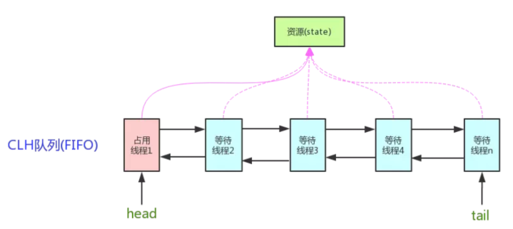
```JAVA
static final class Node {
    // 标记一个结点（对应的线程）在共享模式下等待
    static final Node SHARED = new Node();
    // 标记一个结点（对应的线程）在独占模式下等待
    static final Node EXCLUSIVE = null;

    // waitStatus的值，表示该结点（对应的线程）已被取消
    static final int CANCELLED = 1;
    // waitStatus的值，表示后继结点（对应的线程）需要被唤醒
    static final int SIGNAL = -1;
    // waitStatus的值，表示该结点（对应的线程）在等待某一条件
    static final int CONDITION = -2;
    /*waitStatus的值，表示有资源可用，新head结点需要继续唤醒后继结点（共享模式下，多线程并发释放资源，而head唤醒其后继结点后，需要把多出来的资源留给后面的结点；设置新的head结点时，会继续唤醒其后继结点）*/
    static final int PROPAGATE = -3;

    // 等待状态，取值范围，-3，-2，-1，0，1
    volatile int waitStatus;
    volatile Node prev; // 前驱结点
    volatile Node next; // 后继结点
    volatile Thread thread; // 结点对应的线程
    Node nextWaiter; // 等待队列里下一个等待条件的结点


    // 判断共享模式的方法
    final boolean isShared() {
        return nextWaiter == SHARED;
    }

    Node(Thread thread, Node mode) {     // Used by addWaiter
        this.nextWaiter = mode;
        this.thread = thread;
    }

    // 其它方法忽略，可以参考具体的源码
}

// AQS里面的addWaiter私有方法
private Node addWaiter(Node mode) {
    // 使用了Node的这个构造函数
    Node node = new Node(Thread.currentThread(), mode);
    // 其它代码省略
}
```

state
| 组件名称 | `state` 的具体含义 | 核心逻辑 |
| :--- | :--- | :--- |
| **ReentrantLock** | **锁的持有状态 + 重入次数** | `0`: 无人占用；`1`: 已被占用；`>1`: 持有者重入次数。 |
| **Semaphore** | **剩余可用资源的许可数** | 初始化为 $N$，每进来一个线程 `state - 1`，直到为 $0$ 时阻塞。 |
| **CountDownLatch** | **需要等待完成的事件数量** | 初始化为 $N$，每调用一次 `countDown()`，`state - 1`，减到 $0$ 时唤醒所有等待线程。 |
| **ReentrantReadWriteLock** | **读写锁状态（位拆分）** | 高 16 位表示**读锁**持有次数，低 16 位表示**写锁**持有次数。 |

AQS实现类通过state的值来判断线程是否能获取资源，当且仅当线程无法获取到资源时才会进入双端队列
- 如果是第一个竞争失败的线程，则创建Node节点代表正在使用资源的线程，head引用该Node（哨兵节点），然后将等待线程包装为Node，tail指向该Node（哨兵节点）
- 自旋或者阻塞：如果是第一个等待的Node则自旋，后续Node的线程park


waitStatus的值默认为0，即最后一个节点的值为0，当一个线程准备挂起（park）之前，它必须确保它的前驱节点的 waitStatus 被设置为 -1。释放资源后检查waitStatus的值为-1则唤醒下一个线程

在共享模式下，当 head 唤醒了 next 节点，next 节点在获取资源成功后，会检查 state 是否还有剩余或者 waitStatus 是否为 PROPAGATE。如果是，它会继续唤醒自己的后继节点。


一个AQS如果是独占式的，可以通过 `lock.newCondition()` 创建多个条件变量绑定多个条件队列，条件队列复用了AQS同步队列中的 Node 内部类。当节点在条件队列中时，其状态（waitStatus）会被标记为 CONDITION（值为 -2）

- 等待（等待条件满足）：await()；当一个已经获取到锁的线程调用 condition.await() 时，会发生以下几步：
  - 入队：AQS 会把当前线程包装成一个状态为 CONDITION 的 Node，并将其添加到当前 Condition 的条件队列尾部。
  - 释放锁：该线程会完全释放当前持有的锁，并唤醒同步队列中的下一个等待线程。
  - 阻塞：该线程通过 LockSupport.park() 将自己挂起，等待被其他线程唤醒（signal）。
- 唤醒（条件已满足）：signal() / signalAll()；当另一个获取了锁的线程调用 condition.signal() 时：
  - 节点转移：AQS 会从条件队列的头部取出一个节点（等待最久的线程）。
  - 移入同步队列：将该节点的状态由 CONDITION 修改为 0，并把这个节点从“条件队列”转移到“AQS同步队列”的尾部。
  - 重新竞争锁：此时该线程并未立刻苏醒执行，而是变成了等待锁的普通线程。只有当它在同步队列中排到队首，并且竞争到锁之后，它才会从之前阻塞的 await() 方法处继续往下执行。


核心模板方法：默认protected并抛出异常，根据独占或共享重写需要的方法
- tryAcquire(int)：独占获取

- tryRelease(int)：独占释放

- tryAcquireShared(int)：共享获取

- tryReleaseShared(int)：共享释放

- isHeldExclusively()：是否由当前线程独占持有

当释放资源（unparkSuccessor）时，如果 node.next 为空或者是 CANCELLED 状态，AQS 不会从前往后找，而是从尾部（tail）向后遍历（prev），直到找到离头节点最近的、状态正常的节点。
- 原因：在 addWaiter 入队时，由于并发环境，node.prev = pred 是原子的，但 pred.next = node 可能还没来得及执行。从后往前找能保证遍历到所有已经入队的节点。


## JUC显式锁

synchronized的不足之处。
- 如果临界区是只读操作，其实可以多线程一起执行，但使用 synchronized 的话，同一时间只能有一个线程执行。
- synchronized 无法知道线程有没有成功获取到锁。
- 使用 synchronized，如果临界区因为 IO 或者 sleep 方法等原因阻塞了，而当前线程又没有释放锁，就会导致所有线程等待。

> 临界区：指的是在代码中访问共享资源的那部分，且同一时刻只能有一个线程能访问的代码。多个线程同时访问临界区的资源如果没有任何同步（加锁）操作，会导致资源的状态不可预测和不一致，从而产生所谓的“竞态条件”(Race Condition)。在许多并发控制策略中，例如互斥锁 synchronized，目标就是确保任何时候只有一个线程进入临界区。

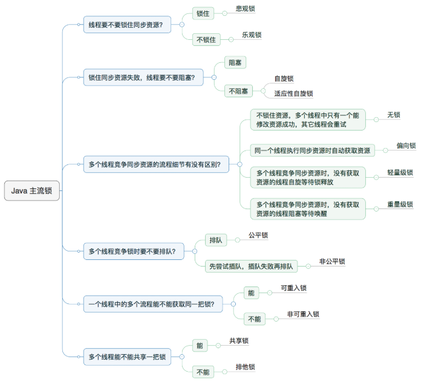

AQLS和AQS几乎一样，其state是long类型，适用于资源数超出了int的范围的情况

locks 包下共有三个接口：Condition、Lock、ReadWriteLock
- Lock 接口中有一个方法可以获得一个Condition：`Condition newCondition()`;


Object监视器和Condition
- 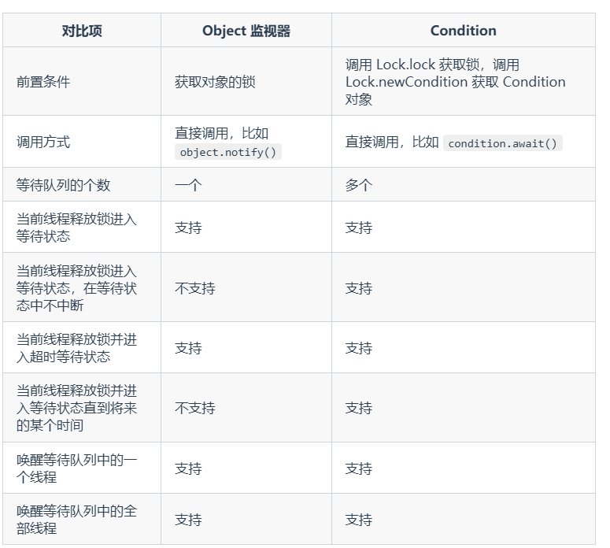
- Condition 和 Object 的 wait/notify 基本相似。其中，Condition 的 await 方法对应的是 Object 的 wait 方法，而 Condition 的signal/signalAll方法则对应 Object 的 notify/notifyAll()
- 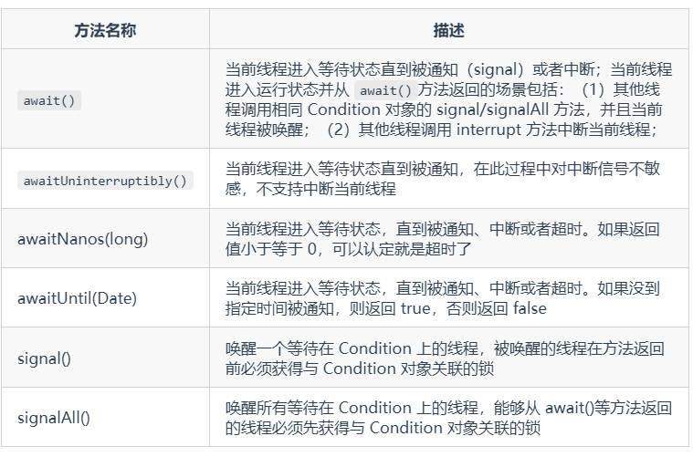
- Condition 接口核心定位：多路条件等待
  - 在传统的 synchronized 机制中，一个锁只能绑定一个等待队列（调用 wait() 的线程都在这一个池子里）。如果想要唤醒特定类型的线程，只能调用 notifyAll() 把所有人都叫醒，这会引发大量的无效竞争（惊群效应）。
  - Condition 结合显式锁（如 ReentrantLock）的最大优势在于：一个锁可以绑定多个条件变量（多个等待队列），从而实现精准唤醒。
- Condition必须绑定到AQS实现类
  - 生产者-消费者模型
  - 必须使用while而不是if：Condition的signal是配合同步队列和条件队列使用的，当同步队列不空，仅从条件队列转移到同步队列，当同步队列不存在时，直接unpark唤醒线程
```JAVA
public class BoundedBuffer {
    final Lock lock = new ReentrantLock();
    // 实例化两个条件队列：一个管“非满”（让生产者等），一个管“非空”（让消费者等）
    final Condition notFull  = lock.newCondition(); 
    final Condition notEmpty = lock.newCondition(); 

    final Object[] items = new Object[100];
    int putptr, takeptr, count;

    // 生产者调用的写方法
    public void put(Object x) throws InterruptedException {
        lock.lock();
        try {
            // 如果满了，就在 notFull 条件上等待（释放锁并挂起）
            while (count == items.length)
                notFull.await(); 
                
            items[putptr] = x;
            if (++putptr == items.length) putptr = 0;
            count++;
            
            // 生产了数据，说明肯定不空了，【精确唤醒】一个等待在 notEmpty 上的消费者
            notEmpty.signal(); 
        } finally {
            lock.unlock();
        }
    }

    // 消费者调用的读方法
    public Object take() throws InterruptedException {
        lock.lock();
        try {
            // 如果空了，就在 notEmpty 条件上等待（释放锁并挂起）
            while (count == 0)
                notEmpty.await();
                
            Object x = items[takeptr];
            if (++takeptr == items.length) takeptr = 0;
            count--;
            
            // 消费了数据，说明肯定不满了，【精确唤醒】一个等待在 notFull 上的生产者
            notFull.signal(); 
            return x;
        } finally {
            lock.unlock();
        }
    }
}
```

### ReentrantLock

ReentrantLock 重入锁：获取锁和释放锁
```JAVA
final boolean nonfairTryAcquire(int acquires) {
    final Thread current = Thread.currentThread();
    int c = getState();
    //1. 如果该锁未被任何线程占有，该锁能被当前线程获取
    if (c == 0) {
        if (compareAndSetState(0, acquires)) {
            setExclusiveOwnerThread(current);
            return true;
        }
    }
    //2.若被占有，检查占有线程是否是当前线程
    else if (current == getExclusiveOwnerThread()) {
        // 3. 再次获取，计数加一
        int nextc = c + acquires;
        if (nextc < 0) // overflow
            throw new Error("Maximum lock count exceeded");
        setState(nextc);
        return true;
    }
    return false;
}

protected final boolean tryRelease(int releases) {
    //1. 同步状态减1
    int c = getState() - releases;
    if (Thread.currentThread() != getExclusiveOwnerThread())
        throw new IllegalMonitorStateException();
    boolean free = false;
    if (c == 0) {
        //2. 只有当同步状态为0时，锁成功被释放，返回true
        free = true;
        setExclusiveOwnerThread(null);
    }
    // 3. 锁未被完全释放，返回false
    setState(c);
    return free;
}
```
ReentrantLock 支持两种锁：公平锁和非公平锁
- public ReentrantLock()无参构造函数是非公平锁
- public ReentrantLock(boolean fair)：true为公平锁
- 公平锁每次都是从同步队列中的第一个节点获取到锁，而非公平性锁则不一定，有可能刚释放锁的线程能再次获取到锁

使用
```JAVA
public class ReentrantLockTest {
    private static final ReentrantLock lock = new ReentrantLock();
    private static int count = 0;

    public static void main(String[] args) throws InterruptedException {
        Thread thread1 = new Thread(() -> {
            for (int i = 0; i < 10000; i++) {
                lock.lock();
                try {
                    count++;
                } finally {
                    lock.unlock();
                }
            }
        });
        Thread thread2 = new Thread(() -> {
            for (int i = 0; i < 10000; i++) {
                lock.lock();
                try {
                    count++;
                } finally {
                    lock.unlock();
                }
            }
        });
        thread1.start();
        thread2.start();
        thread1.join();
        thread2.join();
        System.out.println(count);
    }
}
```

使用 ReentrantLock 时，锁必须在 try 代码块开始之前获取，并且加锁之前不能有异常抛出，否则在 finally 块中就无法释放锁（ReentrantLock 的锁必须在 finally 中手动释放）。

- 错误示例：

```JAVA
Lock lock = new XxxLock();
// ...
try {
    // 如果在此抛出异常，会直接执行 finally 块的代码
    doSomething();
    // 不管锁是否成功，finally 块都会执行
    lock.lock();
    doOthers();

} finally {
    lock.unlock();
}
```
- 正确✅示例：

```JAVA
Lock lock = new XxxLock();
// ...
lock.lock();
try {
    doSomething();
    doOthers();
} finally {
    lock.unlock();
}
```

ReentrantLock 与 synchronized
- ReentrantLock 是一个类，而 synchronized 是 Java 中的关键字；
- ReentrantLock 可以实现多路选择通知（可以绑定多个 Condition），而 synchronized 只能通过 wait 和 notify/notifyAll 方法唤醒一个线程或者唤醒全部线程（单路通知）；
- ReentrantLock 必须手动释放锁。通常需要在 finally 块中调用 unlock 方法以确保锁被正确释放。
- synchronized 会自动释放锁，当同步块执行完毕时，由 JVM 自动释放，不需要手动操作。
- ReentrantLock: 通常提供更好的性能，特别是在高竞争环境下。
### ReentrantReadWriteLock

ReentrantReadWriteLock 内部维护了两把锁：一把读锁（ReadLock）和一把写锁（WriteLock）。
- 读锁（共享锁）：允许多个线程同时获取读锁，只要当前没有线程持有写锁。
- 写锁（独占锁）：同一时刻只能有一个线程获取写锁，且获取写锁时，不能有任何线程（包括自己）持有读锁，也不能有其他线程持有写锁。

将 state 这个 32 位的 int 值分成了高低两部分。
- 高 16 位：表示读锁的获取次数（所有线程获取读锁的总次数）。
- 低 16 位：表示写锁的获取次数（因为写锁是独占的，所以也代表重入次数）。

锁降级：把持有的写锁，降级为读锁。具体的流程是：获取写锁 $\rightarrow$ 获取读锁 $\rightarrow$ 释放写锁
- 为什么需要锁降级？主要是为了保证数据的可见性。如果当前线程修改了数据，释放写锁后，再获取读锁之前，如果有其他线程抢到了写锁并修改了数据，当前线程就无法感知到最新的数据。通过锁降级，可以在不释放对数据控制权的情况下，安全地过渡到读模式。
- 不支持锁升级！如果你持有了读锁，想直接获取写锁，会导致死锁。（因为所有的读锁都在等写锁释放，而你的写锁在等所有的读锁释放）。

```JAVA
ReentrantReadWriteLock lock = new ReentrantReadWriteLock();
ReentrantReadWriteLock.WriteLock writeLock = lock.writeLock();
ReentrantReadWriteLock.ReadLock readLock = lock.readLock();

writeLock.lock(); // 获取写锁
try {
    // 执行写操作
    readLock.lock(); // 获取读锁
} finally {
    writeLock.unlock(); // 释放写锁
}

try {
    // 执行读操作
} finally {
    readLock.unlock(); // 释放读锁
}
```

一个线程安全的本地缓存
```JAVA
public class CacheData {
    private Object data = null;
    private boolean cacheValid = false;
    private final ReentrantReadWriteLock rwl = new ReentrantReadWriteLock();

    public void processCachedData() {
        // 先获取读锁
        rwl.readLock().lock();
        // 如果缓存无效，需要更新缓存
        if (!cacheValid) {
            // 必须先释放读锁，因为不支持锁升级
            rwl.readLock().unlock();
            // 获取写锁
            rwl.writeLock().lock();
            try {
                // Double-check (双重检查)，防止其他线程已经抢先更新了缓存
                if (!cacheValid) {
                    data = new Object(); // 模拟获取最新数据
                    cacheValid = true;
                }
                // 【核心逻辑：锁降级】
                // 在释放写锁前，获取读锁。保证自己刚刚写的数据，自己接下来能读到，且不被别人改掉
                rwl.readLock().lock();
            } finally {
                // 释放写锁，此时依然持有读锁
                rwl.writeLock().unlock(); 
            }
        }

        try {
            // 使用数据
            System.out.println("Processing data: " + data);
        } finally {
            // 最后释放读锁
            rwl.readLock().unlock();
        }
    }
}
```
### StampedLock

ReentrantReadWriteLock解决了“读多写少”场景下 ReentrantLock 性能低下的问题，StampedLock解决ReentrantReadWriteLock的写饥饿问题

RRWL 的“写饥饿”痛点
- 在 RRWL 中，只要有线程持有读锁，写线程就必须阻塞等待。如果系统处于极端“读多写少”的状态，读线程源源不断地到来，写线程可能会永远等不到所有读锁释放，从而饿死。
- StampedLock 的核心目标就是：让读操作不再阻塞写操作。


StampedLock 提供了三种模式。它的操作都会返回一个 long 类型的变量，也就是所谓的邮戳Stamp，释放锁时必须带上这个邮戳。
- 写锁：与 RRWL 类似，独占锁。获取时返回一个 stamp，释放时需要该 stamp。
- 悲观读锁：与 RRWL 的读锁类似，共享锁。当有线程持有写锁时，获取悲观读锁的线程会被阻塞。
- 乐观读：这是 StampedLock 的灵魂所在！ 它根本不是一把真正的“锁”。它只是尝试获取一个 stamp（版本号）。在乐观读的过程中，写线程是可以随时介入并修改数据的。
```JAVA

public class Point {
    private double x, y;
    private final StampedLock sl = new StampedLock();

    // 计算到原点的距离 (只读方法)
    public double distanceFromOrigin() {
        // 1. 获取乐观读的邮戳 (绝大多数情况下，这里不会有冲突，极快)
        long stamp = sl.tryOptimisticRead();

        // 2. 将共享变量拷贝到线程的本地栈中
        double currentX = x;
        double currentY = y;

        // 3. 【核心校验】检查在读取期间，是否有写线程修改了数据？
        // 如果返回 false，说明数据被改过了，刚刚读到的 currentX 和 currentY 是脏数据
        if (!sl.validate(stamp)) {
            // 4. 数据脏了！升级（实际上是回退）为悲观读锁，重新读取
            stamp = sl.readLock(); 
            try {
                currentX = x;
                currentY = y;
            } finally {
                sl.unlockRead(stamp); // 释放悲观读锁
            }
        }
        
        // 5. 此时 currentX 和 currentY 绝对是安全的，执行业务逻辑
        return Math.sqrt(currentX * currentX + currentY * currentY);
    }
}
```

StampedLock没有继承AQS，因此不支持Condition；没有维护exclusiveOwnerThread因此不支持可重入写锁，悲观读锁也是不可重入性的，乐观读锁仅仅是执行了一次普通的 volatile 变量的读取操作，连锁都不是，CAS都没用
- 因为写锁和悲观读锁都是不可重入和排他的，所以支持锁升级：`tryConvertToWriteLock(long stamp)`：如果你当前持有一个悲观读锁，发现需要修改数据，可以调用这个方法尝试直接升级为写锁。
- tryConvertToReadLock(long stamp)：写锁转读锁（类似 RRWL 的锁降级）。
- tryConvertToOptimisticRead(long stamp)：释放锁并转为乐观读状态。


乐观读锁不能直接使用共享变量，必须先拷贝到线程本地，因为乐观读锁不能阻止写线程修改数据，确保数据的一致性，避免有一部分变量被修改但是另一部分变量没被修改，破坏了一致性。在高并发条件下，一致性>实时性

long state 来记录锁的状态和版本，版本号（stamp）在每次获取/释放写锁时都会改变，volatile确保感知到数据被修改

大多数常规业务中，ReentrantReadWriteLock 甚至普通的 ReentrantLock 已经足够，且代码可读性和安全性更高。


## JUC并发流程控制工具
ReentrantLock 和 StampedLock 解决的是“谁能用”的互斥问题，那么 CountDownLatch、CyclicBarrier、Semaphore 和 Exchanger 解决的就是“什么时候用、几个一起用”的协作问题
### CountDownLatch

一次性计时器，使用AQS和CAS实现，将多个线程排入同步队列，state是线程数，CAS自减count，计时结束后，通过同步队列传播唤醒所有线程

适用场景
- 一个线程等 N 个线程：主线程等待所有子任务完成。
- N 个线程等一个线程（死斗模式）：所有子线程在同一瞬间同时起跑，常用于高并发压测，模拟瞬时流量冲击。

API
- `public CountDownLatch(int count)`：count为倒计时
- `public void await() throws InterruptedException`：阻塞当前线程，直到计数器减为 0
  - 如果当前计数已经为 0，方法立即返回，不会阻塞。
  - 如果当前计数大于 0，线程将被挂起等待。
- `public boolean await(long timeout, TimeUnit unit) throws InterruptedException`：防止因为某个子任务死锁或永远无法完成，导致主线程（调用 await 的线程）无限期阻塞，从而引发系统的雪崩。
- `public void countDown()`
  - 如果当前计数大于 0，则将计数减 1。
  - 如果减 1 后计数变为 0，则唤醒所有在 await() 上等待的线程。
  - 关键：如果当前计数已经是 0，再次调用 countDown() 什么都不会发生，也不会报错。
  - 注意：如前文所述，**为了保证计数一定被扣减，该方法必须放在业务代码的 finally 块中执行**。
- `public long getCount()`：不安全，因为返回时可能已被修改
```JAVA
public class CountDownLatchDemo {
    public static void main(String[] args) throws InterruptedException {
        int serviceCount = 3;
        CountDownLatch latch = new CountDownLatch(serviceCount);

        for (int i = 1; i <= serviceCount; i++) {
            int finalI = i;
            new Thread(() -> {
                try {
                    System.out.println("服务 " + finalI + " 正在启动...");
                    Thread.sleep(1000 * finalI); // 模拟启动耗时
                    System.out.println("服务 " + finalI + " 启动成功！");
                } catch (InterruptedException e) {
                    e.printStackTrace();
                } finally {
                    // 【核心】必须在 finally 中 countDown，防止任务异常导致主线程永久阻塞
                    latch.countDown(); 
                }
            }).start();
        }

        System.out.println("主线程：等待所有服务就绪...");
        // 主线程在此阻塞，直到 latch 计数减为 0
        latch.await(); 
        
        // 也可以设置超时等待：latch.await(5, TimeUnit.SECONDS);

        System.out.println("主线程：所有服务已就绪，系统正式启动！");
    }
}
```

### CyclicBarrier

集齐n个线程，够了以后先执行屏障动作（如果有），然后唤醒所有线程
```JAVA
import java.util.concurrent.BrokenBarrierException;
import java.util.concurrent.CyclicBarrier;

public class CyclicBarrierDemo {
    public static void main(String[] args) {
        int parties = 3; // 需要凑齐的线程数量
        
        // 初始化栅栏，并指定最后一个到达时执行的"导游任务"
        CyclicBarrier barrier = new CyclicBarrier(parties, () -> {
            System.out.println(Thread.currentThread().getName() + "：【导游】人齐了，大巴发车！");
        });

        for (int i = 1; i <= parties; i++) {
            new Thread(() -> {
                try {
                    System.out.println(Thread.currentThread().getName() + " 已经到达酒店大堂，正在等待...");
                    // 线程在此等待，直到 3 个人都执行到这里
                    barrier.await(); 
                    System.out.println(Thread.currentThread().getName() + " 上车，出发去景点！");
                } catch (InterruptedException | BrokenBarrierException e) {
                    e.printStackTrace();
                }
            }, "游客-" + i).start();
        }
    }
}
```

```txt
游客-3 已经到达酒店大堂，正在等待...
游客-1 已经到达酒店大堂，正在等待...
游客-2 已经到达酒店大堂，正在等待...
游客-2：【导游】人齐了，大巴发车！
游客-2 上车，出发去景点！
游客-3 上车，出发去景点！
游客-1 上车，出发去景点！
```


与 CountDownLatch 直接使用 AQS 共享锁不同，CyclicBarrier 在底层是完全基于 ReentrantLock 和它的 Condition（条件变量）来实现的。
- int parties：总共需要的线程数。
- int count：目前还需要等待的线程数（初始值为 parties，来一个减 1）。
- Generation generation：“代”或“纪元”，用于实现循环复用。每次栅栏打开，代数就会更新。

count为0时，如果在构造时传入了 Runnable（屏障动作），由当前最后一个到达的线程来执行它。然后，调用 condition.signalAll() 唤醒所有在条件队列里苦等的线程。最后，重置 count 为 parties，并更新 generation，进入下一轮循环，释放锁。

`CyclicBarrier(int parties)`：指定需要拦截的线程数量。

`CyclicBarrier(int parties, Runnable barrierAction)`：指定数量，并提供一个当屏障触发时优先执行的合并任务。


`await() / await(long timeout, TimeUnit unit)`
- **同生共死**：一个线程被中断或等待超时，该线程抛出异常，其他所有正在等待的线程，或者后续来调用 await() 的线程，都会直接抛出 BrokenBarrierException

`reset()`：手动将屏障重置为初始状态。如果此时还有线程在等待，它们会被唤醒并抛出 BrokenBarrierException。

### Semaphore


Semaphore：限流和资源池管理，Semaphore 内部维护了一组“许可证”（Permit）。线程在访问受限资源前，必须先获取（acquire）一个许可证；访问结束后，必须释放（release）许可证。如果没有多余的许可证，线程就会阻塞，直到有其他线程释放。

```JAVA
import java.util.concurrent.Semaphore;

public class SemaphoreDemo {
    public static void main(String[] args) {
        // 只有 3 个停车位（许可证）
        Semaphore parkingLot = new Semaphore(3);

        // 来了 5 辆车（线程）
        for (int i = 1; i <= 5; i++) {
            new Thread(() -> {
                try {
                    System.out.println(Thread.currentThread().getName() + " 来到停车场门口，等待入场...");
                    // 1. 尝试获取许可证（如果没有空车位，会被阻塞在这里）
                    parkingLot.acquire();
                    System.out.println(Thread.currentThread().getName() + " 成功拿到车位，停进去了！");
                    
                    // 模拟停车耗时 2 秒
                    Thread.sleep(2000); 
                    
                } catch (InterruptedException e) {
                    e.printStackTrace();
                } finally {
                    System.out.println(Thread.currentThread().getName() + " 开出停车场，释放车位。");
                    // 2. 离开时必须释放许可证，通常放在 finally 块中
                    parkingLot.release(); 
                }
            }, "汽车-" + i).start();
        }
    }
}
```

在 Semaphore 中，AQS 的 state 代表的就是当前可用的许可证数量，使用的是 AQS 的共享模式。
- acquire 流程：尝试用 CAS 将 state 减 1。如果减完后 state >= 0，说明抢占成功；如果算出来 < 0，说明没票了，线程进入 AQS 队列挂起。

- release 流程：尝试用 CAS 将 state 加 1。加成功后，会唤醒 AQS 队列头部的等待线程。

API
- `new Semaphore(3, false)`（默认）：非公平模式。新来的线程会直接尝试通过 CAS 抢占许可证（抢塞子），不管 AQS 队列里有没有人在排队。吞吐量高。

- `new Semaphore(3, true)`：公平模式。新来的线程一看队列里有人排队，立刻乖乖排到队尾去。严格先到先得。
- acquire()：阻塞式获取 1 个许可证，响应中断。
- acquire(int permits)：一次性强求 N 个许可证。资源不够就死等
- tryAcquire()：非阻塞尝试。有票就拿走返回 true，没票不等待，直接返回 false。适合做降级处理。
- release() / release(int permits)：释放 1 个或 N 个许可证。

凭空印钞：Semaphore 不会记录是哪个线程持有了许可证！这意味着，一个没有调用过 acquire() 的线程，也可以直接调用 release()，这会导致许可证数量凭空增加（state 变大）。
- 严格保证 acquire 和 release 的成对出现，且通常只在同一个线程的上下文中配对使用。
### Exchanger


Exchanger间谍碰头：Exchanger 提供了一个同步点。在这个同步点上，必须且只能有两个线程相遇。谁先到，谁就必须带着自己的数据在那儿死等；直到另一个人也带着数据到达了，两人会瞬间互换手里的数据，然后各自拿着对方的数据离开，继续执行。

```JAVA
import java.util.concurrent.Exchanger;

public class ExchangerDemo {
    public static void main(String[] args) {
        // 定义一个交换器，交换的数据类型为 String
        Exchanger<String> exchanger = new Exchanger<>();

        // 线程 A：提供“美元”
        new Thread(() -> {
            try {
                String myData = "【100万美元】";
                System.out.println("特工 A：带着 " + myData + " 到达接头地点，等待交接...");
                // 阻塞等待，直到拿到对方的数据
                String returnData = exchanger.exchange(myData); 
                System.out.println("特工 A：交易成功！拿到了 " + returnData);
            } catch (InterruptedException e) {
                e.printStackTrace();
            }
        }, "特工A").start();

        // 线程 B：提供“情报”
        new Thread(() -> {
            try {
                // 模拟特工 B 迟到了 2 秒
                Thread.sleep(2000); 
                String myData = "【绝密情报U盘】";
                System.out.println("特工 B：带着 " + myData + " 匆匆赶到接头地点...");
                // 交换数据
                String returnData = exchanger.exchange(myData);
                System.out.println("特工 B：交易成功！拿到了 " + returnData);
            } catch (InterruptedException e) {
                e.printStackTrace();
            }
        }, "特工B").start();
    }
}
```


无锁，底层并没有使用 AQS
- 在低并发下，它内部维护了一个叫做 slot 的变量。线程 A 来了，把数据存进 slot 然后 park() 挂起。线程 B 来了，发现 slot 里有数据，就把里面的数据拿走，把自己带来的数据放进去，并 unpark() 唤醒线程 A。全程依靠 CAS 操作保证线程安全。
- 多槽位竞技场（Arena 机制）：如果此时有成百上千个线程都在调用同一个 Exchanger（比如并发量极大），单槽位会发生严重的 CAS 冲突。此时它会动态扩容，升级为“Arena（竞技场）”模式，提供一个数组。不同的线程会被哈希到不同的槽位上去寻找各自的“另一半”进行配对互换。这种设计极大地提高了吞吐量。
- 伪共享（False Sharing）消除：源码中大量使用了 @Contended 注解和内存填充（Padding）技术，避免多核 CPU 缓存行失效问题，性能被压榨到了极致。

核心 API
- exchange(V x)：等待另一个线程到达此交换点，然后将给定的对象传送给该线程，并接收该线程的对象。

- exchange(V x, long timeout, TimeUnit unit)：带超时的接头。如果等太久对方还没来，直接抛出 TimeoutException 终止交易。


## 并发集合

### 并发Map


1.7 时代并发Map采用Segment分段锁机制、基于 ReentrantLock、哈希槽的设计
- 分段锁把一个大的 Map 拆分成了 16 个小的 Segment。这种“化大为小、分而治之”的思想，在今天的分布式数据库（分库分表）、Redis 集群（哈希槽）中依然是核心底层逻辑。
- 被淘汰的原因：并发度被写死在 16，锁的粒度还是太大了；且底层只有数组+链表，一旦发生严重的哈希冲突，链表过长，查询效率会从 $O(1)$ 暴跌到 $O(N)$。

#### ConcurrentHashMap

数据结构：Node 数组 + 链表 + 红黑树
-红黑树转化：当链表长度大于 8，且数组长度大于等于 64 时，链表会转换为红黑树
  设计意图：在发生极端哈希冲突时，将查询时间复杂度从 $O(N)$ 降低到 $O(\log N)$，防止恶意哈希碰撞攻击导致的 CPU 飙升。


锁节点：CAS + synchronized
- CAS (乐观锁)：当尝试插入的槽位（Bucket）为空时，直接通过 CAS 操作将新节点放入。如果成功，说明没有竞争，效率最高。
- synchronized (悲观锁)：如果槽位不为空（即发生碰撞），则使用 synchronized 锁住当前槽位的头节点。
  - 锁粒度：只锁住这一个 Hash 槽位。只要多个线程访问的是不同的槽位，它们就是完全并行的。
  - 为什么选 synchronized？ 因为随着 JVM 的优化（偏向锁、轻量级锁、锁消除、锁粗化），synchronized 在这种细粒度锁竞争下，内存开销和性能表现已经优于 ReentrantLock。


`put(key, value)`死循环的设计哲学：**能不加锁就不加锁，必须加锁时只锁最小范围**
1. 计算 Hash：对 Key 的 hashCode 进行再哈希，保证分布均匀。
2. **自旋（for 循环）**：
    * **CASE 1：数组未初始化**
        * 调用 `initTable()`。这里不加锁，而是利用 `sizeCtl` 变量进行 **CAS** 抢占，抢到的线程负责初始化。
    * **CASE 2：目标槽位（Bucket）为空**
        * 利用 **CAS** 直接插入新节点。如果成功，`put` 完成。这是最快的情况。
    * **CASE 3：发现 `MOVED` 状态 (-1)**
        * 说明该节点是一个 `ForwardingNode`，**此时正在扩容**。当前线程不等待，而是立即调用 `helpTransfer()` 加入协助扩容大队。
        * 从该方法退出后扩容一定完成了，可以下一次循环执行插入
    * **CASE 4：目标槽位有值（哈希碰撞）**
        * 使用 **`synchronized`** 锁住当前槽位的**头节点**。
        * 遍历链表（$O(n)$）或红黑树（$O(\log n)$）进行覆盖或插入。
3. **计数与扩容检查**：调用 `addCount()`，这步会统计 size 并触发扩容检查。


**sizeCtl变量**
- 0：默认初始状态。
- -1：正在初始化。
- < -1：表示正在扩容，且高位存储了扩容戳，低位存储了参与扩容的线程数。
- > 0：下一次触发扩容的阈值。

---

多线程协助扩容helpTransfer()

1. 触发时机
   * 某个槽位的链表长度达到 8，但数组长度不足 64（先扩容，不转树）。
   * 元素总数达到阈值（`size * loadFactor`）。

2. 什么是 ForwardingNode (fwd)？
   - 线程发现需要扩容，CAS修改transferIndex，修改成功transferIndex会减少一个步长值，同时该线程负责创建一个新数组，该数组的大小是原来的两倍，因此同一个槽上的元素在新数组的位置可能是i或者i+oldCapacity
   - 线程在从transferIndex开始搬家，获取指定槽的头节点的`synchronized`锁，防止其他线程写入，对每个元素Rehash到新位置，直到处理到索引[transferIndex-步长值]
   - 每处理完一个槽上的所有元素，就插入`ForwardingNode`，其内部持有一个指向**新数组**的引用
   - 直到线程检查transferIndex为0搬家结束

3. 协助扩容的流程 (重点)
* **任务分配**：CHM 将数组拆分成多个“任务步长”（默认最小 16 个槽位）。
* **线程领命**：
    1. 线程 A 开始扩容，通过 CAS 修改 `sizeCtl` 的状态。
    2. 线程 B 过来 `put`，发现槽位是 `fwd`，于是调用 `helpTransfer`。（如果无法获取锁则等待，获取到锁后如果是fwd则退出重新执行putVal循环并可能尝试参与协助扩容）
    3. 线程 B 也去申请一个步长的区间（例如数组索引 31 到 16），帮着一起搬。


读操作没有锁
- 如果是`fwd` 节点，则通过 `fwd` 内部的引用，**直接去新数组读**
- 如果不是`fwd` 节点，可能处于正在搬家的过程中，而搬家不会动原数组，所以照常读


---


**高效计数 (CounterCell)**：如何在不加全局锁的情况下统计 Map.size()？
- 它参考了 LongAdder 的核心思想：不维护一个单一的 size 变量（否则所有线程写完都要竞争同一个变量的 CAS）。
- 它维护了一个 baseCount 和一个 CounterCell 数组。
- 线程尝试 CAS 修改 baseCount，如果失败（说明竞争大），就随机选一个 CounterCell 把增量写进去。
- 最后 size() = baseCount + 所有CounterCell的值。这种分散热点的思想是高并发下统计数据的标准方案。


#### ConcurrentSkipListMap

数据结构**跳表**：快速查找 ($O(\log N)$) + 强有序 + 纯无锁

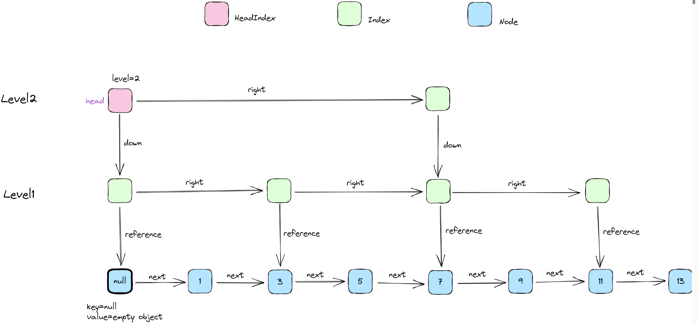


查找：
- 在任何一个索引节点（Index）上，线程只有两条路：
- 向右（Horizontal）：如果 right.key < target，说明目标还在更远方，继续向右。
- 向下（Vertical）：如果 right == null 或者 right.key > target，说明目标可能就在当前节点到右侧节点之间，于是垂直向下切换到更细粒度的索引层。
- 重复上述操作直到到达最底层，从当前节点开始依次向右遍历，直到节点值大于Key值说明不存在或者找到Key值为止，index.key == target 且 value != null（有效）判定为找到值


插入操作：
- 先在底层（Level 0）找到插入位置。
- 通过 CAS 插入节点。
- 随机决定该节点是否要“晋升”到更高层（抛硬币算法）。
- 如果晋升，继续通过 CAS 修改高层索引的指针。


删除操作：
- 采用逻辑删除。先给节点的 value 标记一个特殊的 null（或者标记一个逻辑删除位）。
- 后续读写线程经过该节点时，顺手将其从链表物理移除。

查找时间复杂度：$O(logN)$，每次晋升时只有50%概率，因此类似二分查找


API

```JAVA
ConcurrentSkipListMap<Integer, String> map = new ConcurrentSkipListMap<>();
map.put(1, "A");
map.put(3, "C");
map.put(2, "B");

// 1. 获取第一个/最后一个 Key
map.firstKey(); // 1
map.lastKey();  // 3

// 2. 查找最接近的 Key
map.lowerKey(2);  // 1 (小于 2 的最大 key)
map.ceilingKey(2); // 2 (大于等于 2 的最小 key)

// 3. 截取子范围 (范围查询)
map.subMap(1, 3); // 返回 [1, 3) 之间的视图
```
### 写时复制集合Copy-on-Write

**共享读，副本写，延时拷贝**
- 读： 所有的读线程都访问当前的**“主快照”**。因为数据在读取期间是不变的，所以不需要加任何锁，性能达到极致。

- 写： 当有写操作时，不直接在原数据上改，而是**“复印”**一份新的数据，在副本上修改。修改完成后，再把“原件”替换为“副本”。

变动即复制（Mutation via Copy）
- 容器内部的数组一旦发布，对读线程来说就是“只读”的。任何增删改都不在原址进行。这从根本上消除了多线程同时修改同一块内存区域导致的 ConcurrentModificationException（并发修改异常）。

锁的最小化（Locking on Write only）
- 读： 零锁。

- 写： 必须加锁（通常是 ReentrantLock）。注意： 加锁不是为了防读，而是为了防止多个写线程同时复印出多个副本，导致数据覆盖（丢失）。

内部数组必须用 volatile 修饰。当写线程完成副本修改并把 array 指向新数组时，volatile 的写屏障会强制将这一变化刷入主内存，并让读线程的缓存失效。
结果： 读线程能“即时”看到新数组，虽然在“复印”的那一瞬间，读到的还是老数据。


设计初衷：解决“读多写少”场景下的锁竞争。
- 场景 A（黑名单系统）： 系统 99.9% 的时间都在查询黑名单，只有极少数情况下会添加一个新号码。如果查询也加锁，会严重拖慢整个系统。
- 场景 B（配置中心）： 应用启动时加载配置，之后几乎全是读取。
- 场景 C（事件监听列表）： 注册监听器（写）很少，但触发事件（遍历监听器列表读取）非常频繁。

COW为了极致的读性能，牺牲了：
- 内存空间：写时内存翻倍
- 写性能： $O(N)$ 的复制开销，写操作极其沉重。
- 实时性： 读线程在写线程完成替换前，只能看到旧数据。因此是弱一致性

**为什么没有CopyOnWriteHashMap**？
- 这是一个经典的面试题。JUC 并没有提供 CopyOnWriteHashMap，原因如下：
- 数据量级不同：Map 通常存储的数据比 List 更多，全量复制一个庞大的哈希表（包含 Entry 节点、数组桶、可能的红黑树）内存开销极其恐怖。效率太低：Map 的优势是 $O(1)$ 的存取。如果每次写都要复制全量数据，这个优势会被复制操作产生的 $O(N)$ 耗时完全抵消。已有更优解：- ConcurrentHashMap 通过分段锁或细粒度锁（synchronized + CAS）已经完美解决了 Map 的并发问题，性能远高于 COW 模式。

#### CopyOnWriteArrayList

核心只有两个变量：

```java
/** 保护所有写操作的锁 (JDK 11+ 使用 synchronized，早期版本使用 ReentrantLock) */
final transient Object lock = new Object();

/** 内部存放数据的数组，必须是 volatile 的 */
private transient volatile Object[] array;
```
* **`volatile`**：保证了当 `array` 引用指向新数组时，所有读线程能立刻发现。


```java
public boolean add(E e) {
    synchronized (lock) { // 1. 加锁，保证同一时刻只有一个线程在“复印”
        Object[] es = getArray(); // 2. 获取老数组
        int len = es.length;
        // 3. 【核心】复印一份新数组，长度 + 1
        Object[] newElements = Arrays.copyOf(es, len + 1);
        // 4. 在副本上修改
        newElements[len] = e;
        // 5. 【灵魂】将 volatile 引用指向新数组，此时读线程感知到变化
        setArray(newElements);
        return true;
    } // 6. 释放锁
}

public E get(int index) {
    return getArray()[index]; // 直接读取，不加锁，不阻塞
}
```


#### CopyOnWriteArraySet

“披着 Set 皮的 List”，每次add时先遍历检查存不存在，不存在再执行写时复制，因此插入复杂度不是O(1)而是O(N)


并发队列（Concurrent Queues）是 JUC 包中非常庞大且实用的模块。它们不仅是生产者-消费者模型的标准实现，更是 **线程池（ThreadPoolExecutor）** 的心脏。

我们可以按照 **“阻塞与否”** 以及 **“底层数据结构”** 这两条主线，将并发队列划分为以下大纲：

---

### JUC 并发队列

#### 核心接口层

##### Queue

所有队列的父接口，定义了最基本的 FIFO（先进先出）逻辑。它最核心的贡献是提供了**两套**处理失败的方法：

| 操作 | 抛出异常 (会炸) | 返回特殊值 (优雅) | 描述 |
| :--- | :--- | :--- | :--- |
| **插入** | `add(e)` | **`offer(e)`** | 队列满时，`add` 抛异常，`offer` 返回 `false` |
| **移除** | `remove()` | **`poll()`** | 队列空时，`remove` 抛异常，`poll` 返回 `null` |
| **检查** | `element()` | **`peek()`** | 队列空时，`element` 抛异常，`peek` 返回 `null` |

> 在并发编程中，我们几乎永远使用右侧的 **`offer/poll/peek`**，因为我们不希望线程因为队列满了就直接崩溃抛异常。

---

#####  `BlockingQueue` 接口：并发协作的灵魂
这是 JUC 包定义的增强接口，它继承了 `Queue`。它的伟大之处在于引入了 **“阻塞（Blocking）”** 的概念。

当队列满或空时，它提供了第三套方法，让线程“等一会儿”：

| 操作 | 阻塞等待 (死等) | 超时退出 (不等了) |
| :--- | :--- | :--- |
| **插入** | **`put(e)`** | `offer(e, time, unit)` |
| **移除** | **`take()`** | `poll(time, unit)` |

* **`put(e)`**：如果队列满了，生产者线程会被**挂起（阻塞）**，直到队列有空位。
* **`take()`**：如果队列空了，消费者线程会被**挂起（阻塞）**，直到队列有新数据。
* **意义**：这就是**生产者-消费者模型**的底层支撑。它不需要你手动写 `wait/notify`，接口内部帮你处理好了线程的挂起与唤醒。

---

#####  `Deque` 接口：双端操作
`Deque` (Double Ended Queue) 读作“deck”。
* **特性**：支持从**队头**和**队尾**同时进行插入和移除。
* **多面手**：它既可以当成 **FIFO 队列**用，也可以当成 **LIFO 栈Stack**用。
* **并发版**：JUC 提供了 `LinkedBlockingDeque`（阻塞版）和 `ConcurrentLinkedDeque`（非阻塞版）。

---

**总结：如何一眼看穿一个并发队列**：当你看到一个 JUC 队列时，直接看它的名字组合：

1.  **带 `Blocking` 的**：一定是实现了 `BlockingQueue`，适合做**生产者-消费者**，性能受限于锁，但功能强大。
2.  **带 `Concurrent` 的**：一定是**非阻塞**的，内部靠 CAS 实现，适合**超高并发读写**，但通常没有 `put/take` 这种挂起等待的功能。
3.  **带 `Linked` 的**：底层是**链表**，通常是分散内存，扩容方便。
4.  **带 `Array` 的**：底层是**数组**，内存连续，通常需要预设大小。

---


#### 阻塞队列 BlockingQueue

##### ArrayBlockingQueue

循环有界数组Object[]+一把全局重入锁ReentrantLock+两个条件队列Condition
- 有界：创建时必须指定容量，且容量不可更改
- 环形数组使用环形指针
  * **`putIndex`**：下次写入的位置。
  * **`takeIndex`**：下次读取的位置。
  * 当指针到达数组末尾时，直接重置为 0，像个圆环一样循环使用。


```java
final Object[] items;      // 存放元素的数组
final ReentrantLock lock;  // 控制并发的全局锁

/** 两个 Condition 条件变量，用于线程间的协同 */
private final Condition notEmpty; // 当队列为空时，take线程在此等待
private final Condition notFull;  // 当队列满时，put线程在此等待
```

`put(E e)`：如果满了，你就睡会儿
1. 线程尝试加锁。
2. 进入 `while` 循环检查：如果 `count == items.length`（队列满了）。
3. 调用 **`notFull.await()`**：当前写线程释放锁，进入阻塞状态，等待“不满”的信号。
4. 一旦被唤醒并抢到锁，执行入队操作。调用 **`notEmpty.signal()`**：通知正在睡觉的消费者，“有货了，快醒醒”。
5. 释放锁


`take()`：如果空了，你就等会儿
1. 线程尝试加锁。
2. 进入 `while` 循环检查：如果 `count == 0`（队列空了）。
3. 调用 **`notEmpty.await()`**：当前读线程释放锁，进入阻塞状态，等待“不空”的信号。
4. 一旦被唤醒并抢到锁，执行出队操作。调用 **`notFull.signal()`**：通知正在睡觉的生产者，“有空位了，快复工”。
5. 释放锁

```JAVA
public void put(E e) throws InterruptedException {
    checkNotNull(e);
    final ReentrantLock lock = this.lock;
    lock.lockInterruptibly(); // 步骤 1：可中断加锁
    try {
        while (count == items.length) { // 步骤 2：循环检查满条件
            notFull.await();            // 步骤 3：释放锁，挂起等待
        }
        enqueue(e);                     // 步骤 4：入队，enqueue 内部最后一行调用 notEmpty.signal() 
    } finally {
        lock.unlock();                  // 释放锁
    }
}

public E take() throws InterruptedException {
    final ReentrantLock lock = this.lock;
    lock.lockInterruptibly();           // 步骤 1
    try {
        while (count == 0) {            // 步骤 2：循环检查空条件
            notEmpty.await();           // 步骤 3：释放锁，挂起等待
        }
        return dequeue();               // 步骤 4：出队dequeue 内部最后一行调用 notFull.signal()
    } finally {
        lock.unlock();
    }
}

```


**条件队列的取名意义：条件队列中的线程所等待的条件，当该条件满足时可以移出条件队列，例如队列满加入notFull，即该线程等待队列不满的时候，即消费者拿出一个数据后调用notFull.signal。为了防止虚假唤醒，必须使用while循环检查**

必须持有锁时发signal信号
- 保证不会发生信号丢失，


---


性能特点与局限性
* **单锁竞争**：无论读还是写，都用同一把锁。这意味着**“读写不并行”**。如果生产者和消费者都非常活跃，这把锁会成为严重的瓶颈。
* **低开销**：由于不需要像链表那样频繁创建 Node 节点，它对垃圾回收（GC）非常友好，且内存连续，访问效率高。
* **公平性选择**：构造函数允许传入 `fair=true`，让等待最久的线程优先入队/出队（基于 AQS 的公平锁）。

---

##### LinkedBlockingQueue

如果说 `ArrayBlockingQueue` 是一间**单门小店**（进出都走一个门，互相排队），那么 **`LinkedBlockingQueue`** 就是一个**双门仓库**。它是 `ThreadPoolExecutor`（线程池）默认使用的队列，其设计精妙程度远超数组版本。

核心设计：双锁算法 (Two Lock Queue)，这是它性能优于数组版本的根本原因。它内部维护了两把锁和两个条件：

```java
/** 专门管“出队”的锁 */
private final ReentrantLock takeLock = new ReentrantLock();
/** 当队列为空时，take线程在这里等待 */
private final Condition notEmpty = takeLock.newCondition();

/** 专门管“入队”的锁 */
private final ReentrantLock putLock = new ReentrantLock();
/** 当队列满时，put线程在这里等待 */
private final Condition notFull = putLock.newCondition();
```

* **设计意图**：在大多数情况下，**生产者的操作（改队尾）和消费者的操作（改队头）是互不干扰的**。通过两把锁，`LinkedBlockingQueue` 实现了真正的**读写并行**。

---

核心挑战：如何统计数量（AtomicInteger）：在 `ArrayBlockingQueue` 中，`count` 只是个普通的 `int`，因为只有一把锁，改它很安全。但在 `LinkedBlockingQueue` 中，生产者和消费者可能同时在操作。为了保证 `count` 的准确性，它使用了 **`AtomicInteger`**：

```java
/** 当前队列中的元素个数 */
private final AtomicInteger count = new AtomicInteger();
```
* **意义**：即使两把锁并行执行，`count.incrementAndGet()` 也能保证原子性的增加或减少。

---

精妙的“级联通知”机制 (Cascaded Signalling)
- 这是源码中最难理解但也最优雅的地方。
在 `ArrayBlockingQueue` 中，每次 `put` 都会尝试叫醒 `take`。但在双锁环境下，为了减少跨锁竞争（`putLock` 线程去叫醒 `takeLock` 上的线程需要跨越边界），它采用了**自给自足**的通知方式：

* **自己叫醒自己**：
    * 如果一个生产者 `put` 完后，发现队列**还没满**，它会顺手调用 `notFull.signal()` 叫醒另一个正在等待的**生产者**。
    * 消费者同理：如果 `take` 完发现队列**还不空**，它会叫醒另一个**消费者**。
* **跨界通知**：
    * 只有当生产者把队列从“空”变成“不空”的那一刻，它才会去叫醒消费者。
    * 只有当消费者把队列从“满”变成“不满”的那一刻，它才会去叫醒生产者。

> **比喻**：仓库很大，搬运工发现还有空位，就大喊一声让后面的同伴继续进货；只有当仓库彻底没货变有货时，才去敲对面的门告诉零售商。


---

数据结构：链表节点，可选容量，默认`Integer.MAX_VALUE`，内存开销的GC压力大
- **必须手动指定容量**，默认构造函数使用的是 `Integer.MAX_VALUE`。如果生产者的速度远快于消费者，队列会无限堆积，最终导致 **OOM (OutOfMemoryError)**
```java
static class Node<E> {
    E item;
    Node<E> next;
    Node(E x) { item = x; }
}
```
* **哑节点 (Dummy Node)**：它始终维持一个不存数据的头节点。这样做的好处是：在出队和入队时，`head` 和 `last` 指针不会同时指向同一个有效的节点，从而进一步减少了读写冲突。

---

##### SynchronousQueue

如果说前面讲的队列是“仓库”，那么 **`SynchronousQueue`** 就是一个**无中间商赚差价的当面交易现场**。它是整个 JUC 阻塞队列家族里最奇葩、也最极端的成员。它的容量是 **0**。

---

核心定义：一手交钱，一手交货
- `SynchronousQueue` 内部**没有任何容器**来存储元素。
* 当你调用 `put(e)`（生产者）时，你必须原地站着死等（阻塞），直到有一个消费者过来调用 `take()` 把东西拿走，你才能离开。
* 反之亦然，当你调用 `take()`（消费者）时，你也必须死等，直到有个生产者过来 `put(e)`。

**总结**：它不是用来“存”数据的，它是用来**“传递”**数据的。它是一个线程间的**相亲角（Rendezvous Point）**。

---

为什么需要一个“零容量”的队列？
- 这听起来很鸡肋，但在特定场景下它是无可替代的王牌——**极速响应**。

* 在传统的有界/无界队列中，数据要经历：入队 -> 存入内存 -> 被唤醒 -> 出队。这中间有轻微的延迟。
* 在 `SynchronousQueue` 中，数据是**手递手（Direct Handoff）**交接的。生产者和消费者在同一时刻完成了数据的转移，没有任何中间停留。


**最著名的应用场景**：`Executors.newCachedThreadPool()`（缓存线程池）。
- 当任务到来时，线程池尝试把任务塞进 `SynchronousQueue`：
* 如果此时正好有空闲线程在 `take()` 等待，任务瞬间交接，开始执行。
* 如果没有空闲线程，`offer` 就会失败，线程池就会立刻**创建一个新线程**来处理这个任务。
* 这保证了任务**绝对不会在队列里堆积**，要么被立刻执行，要么开启新线程执行。

---

底层实现：无锁与 CAS 的炫技
- 虽然名字里有 Queue，但它内部没有使用传统的 `ReentrantLock`。为了追求极致的交接性能，它内部使用了大量的 **CAS** 和 **自旋操作（Spinning）**。

- 它通过构造函数的 `fair` 参数，提供了两种不同的底层数据结构：
- 非公平模式 (Non-fair，默认) —— 基于栈 (LIFO Stack)
  * 内部使用一个叫做 `TransferStack` 的无锁栈。
  * **逻辑**：后来的线程会压在先来的线程上面。当一个匹配的线程到来时，它会和栈顶的线程（也就是**最晚**来的线程）完成交易。
  * **为什么默认非公平？** 根据“空间局部性”和 CPU 缓存原理，刚被挂起的线程（栈顶线程）其数据还在 CPU 缓存中，立刻唤醒它执行效率最高。

- 公平模式 (Fair) —— 基于队列 (FIFO Queue)
  * 内部使用一个叫做 `TransferQueue` 的无锁队列。
  * **逻辑**：严格按照先来后到的顺序，先在队列里等待的线程，优先和新来的匹配线程交易。

---

 常见 API 的“反直觉”表现：由于没有容量，它的很多普通集合方法表现得非常诡异：
* `isEmpty()`：永远返回 `true`。
* `size()`：永远返回 `0`。
* `peek()`：永远返回 `null`（因为不能不拿走只偷看）。
* `offer(e)`：如果没有消费者正等着拿，直接返回 `false`（不阻塞）。

---

`SynchronousQueue` 和 `Exchanger` 

- 它们俩在底层行为上非常相似：**都会让先到达的线程原地阻塞，直到另一个线程也到达，双方完成“对接”后一起离开。**
- 但它们之间有一个最根本、也是唯一的区别：**数据流向是单向的，还是双向的。**
- 核心区别：快递员交接 vs 间谍交换情报
- `SynchronousQueue`：快递员交接（单向传递）
  * **角色分明**：它有明确的**生产者**和**消费者**之分。
  * **行为**：生产者只负责“给”，消费者只负责“拿”。
  * **场景**：快递员（生产者）把包裹递给客户（消费者），客户拿到包裹后走了，快递员空着手回去继续接单。数据从 A 线程单向流向 B 线程。
- `Exchanger`：间谍交换情报（双向交换）
  * **地位平等**：没有生产者和消费者的区分，两个线程是**平等的对端（Peers）**。
  * **行为**：每个人既是“给”的人，也是“拿”的人。
  * **场景**：两个间谍在桥头碰面，A 间谍把手里的密码箱递给 B，**同时** B 间谍也必须把手里的密码箱递给 A。双方交换完箱子后，各自拿着对方的箱子离开。数据在 A 和 B 之间完成了**双向互换**。
- 应用场景的完全不同

  * **`SynchronousQueue` 的主场**：**任务调度与分配**。
    最典型的就是 `CachedThreadPool`。主线程源源不断地生成任务（只管塞），工作线程源源不断地取走任务去执行（只管拿）。
  * **`Exchanger` 的主场**：**数据校对与双缓冲（Double Buffering）**。
    比如，线程 A 负责往一个空 Buffer 里写数据（写满为止），线程 B 负责处理 Buffer 里的数据（读空为止）。当 A 写满、B 读空时，两人调用 `exchange` 互换手里的 Buffer。A 拿到空的继续写，B 拿到满的继续读。这种场景在遗传算法（交换染色体）和多媒体数据流处理中非常常见。
- 简而言之：**`SynchronousQueue` 是你把东西塞给别人，`Exchanger` 是你们俩互换信物。**

| 特性 | SynchronousQueue | Exchanger |
| :--- | :--- | :--- |
| **数据流向** | **单向** (A $\rightarrow$ B) | **双向** (A $\rightleftharpoons$ B) |
| **参与角色** | 明确的生产者与消费者 | 两个平等的线程 (Peers) |
| **核心方法** | `put()` 和 `take()` | 只有 `exchange(V x)` |
| **本质** | 零容量的阻塞队列 | 两个线程的同步交换点 |


##### PriorityBlockingQueue


如果说前面的队列讲究的是“先来后到”（FIFO），那么 **`PriorityBlockingQueue`** 讲究的就是**特权优先**。它**打破了时间顺序**，允许你定义谁是“VIP”。谁的优先级高，谁就最先出队。

---

核心定义：基于堆的无界阻塞队列
* **数据结构**：底层是一个**数组**，但它在逻辑上维护了一棵**二叉堆（Binary Heap）**（默认是最小堆）。
* **有界性**：它是**无界队列**（确切地说是动态扩容的，最大可达 `Integer.MAX_VALUE - 8`）。
* **排序规则**：
    * 元素必须实现 `Comparable` 接口（自然排序）。
    * 或者在创建队列时传入一个自定义的 `Comparator`（定制排序）。

---

阻塞机制的“残缺美”：只有 take 阻塞
- 由于它是无界队列，它的阻塞机制和 `ArrayBlockingQueue` 完全不同：
* **`put(e)` 永远不阻塞**：因为容量理论上是无限的，空间不够了它会自动扩容。所以调用 `put()` 本质上和 `offer()` 是一样的，塞进去就马上返回。
* **`take()` 会阻塞**：只有当队列为空时，消费者才会被挂起，等待新元素进入。
* **底层锁**：它内部也只有**一把**全局的 `ReentrantLock`。但由于不会满，所以它**只有一个 Condition (`notEmpty`)**，没有 `notFull`。

---

数据排队原理：二叉堆的 $O(\log N)$ 魔法
- 它并不会在你每次插入时把整个数组排序（那样太慢了），而是利用了**二叉堆**的特性：
* **入队 (`put`)**：新元素放在数组末尾，然后执行**“上浮（Sift Up）”**操作，和父节点比较，如果比父节点优先级高，就交换位置。时间复杂度 $O(\log N)$。
* **出队 (`take`)**：永远只取数组的第 `0` 号元素（堆顶，优先级最高的元素）。取走后，把数组末尾的元素放到堆顶，然后执行**“下沉（Sift Down）”**操作，重新调整二叉堆。时间复杂度 $O(\log N)$。

---

1. 发现数组满了，**先释放**全局的主锁 `ReentrantLock`。
2. 使用一个基于 CAS 的轻量级自旋锁（`allocationSpinLock`）来保证只有一个线程去创建新数组。
3. **此时，由于主锁被释放，其他消费者依然可以继续从老数组里 `take()` 取数据！**
4. 新数组建好后，重新获取主锁，把老数据拷贝过去，完成扩容。

> **总结**：它在最耗时的“开辟新内存空间”阶段，巧妙地让出了锁，实现了扩容与出队的并发。

---

致命隐患：无界带来的 OOM 风险
和 `LinkedBlockingQueue` 忘记传容量一样，`PriorityBlockingQueue` 是强制无界的。
如果你往里面无限丢任务，而消费者的处理速度跟不上，它会不断扩容，直到把 JVM 内存撑爆，引发 **OOM**。

---

##### 锁、Condition、signal()/signalAll()

**在 Java 的 `Condition` 机制下，发送信号（`signal()` / `signalAll()`）时，必须绝对持有与该 Condition 绑定的锁。** 因此，**“发送信号”永远发生在“释放锁”之前**。你不能先释放锁，再去发送信号（这会抛出 `IllegalMonitorStateException`）。

但在不同的阻塞队列中，锁的粒度不同，这导致了**什么时候去拿另一把锁**、**什么时候只唤醒同类线程**的设计出现了极大的差异。这也是你提到的“权衡判断”的精髓所在。

以下是 `ArrayBlockingQueue`、`PriorityBlockingQueue` 和 `LinkedBlockingQueue` 源码设计中的权衡细节：

---

一、 单锁模型：`ArrayBlockingQueue` 与 `PriorityBlockingQueue`

这两者的底层并发控制是基于**一把锁（Single Lock）**的。
* `ArrayBlockingQueue`：一把 `ReentrantLock`，绑定两个 `Condition`（`notEmpty` 和 `notFull`）。
* `PriorityBlockingQueue`：一把 `ReentrantLock`，绑定一个 `Condition`（`notEmpty`，因为它支持动态扩容，`put` 永远不会阻塞，所以不需要 `notFull`）。

锁与信号的顺序
在这两个队列的源码中，标准的流程是：
```java
lock.lock();
try {
    // 1. 业务逻辑 (如入队、出队)
    // 2. 发送信号 (如 notEmpty.signal())
} finally {
    // 3. 释放锁
    lock.unlock();
}
```

这里的权衡与底层魔法：“惊群效应”与 AQS 的优化
- 你可能会有一个疑问（这也是 POSIX 线程库中经典的争论）：**如果我先 signal，后 unlock，被唤醒的线程立刻去抢锁，不还是抢不到吗？这会不会引起无意义的上下文切换？**

- 在 C 语言的 `pthread` 中，这叫 "Hurry up and wait"（急急忙忙醒来然后继续挂起）。很多 C 程序员喜欢先 unlock 再 signal。

- **但在 Java 中，Doug Lea 用 AQS（AbstractQueuedSynchronizer）巧妙地化解了这个权衡：**
当你调用 `notEmpty.signal()` 时，AQS 的底层源码 (`transferForSignal`) 实际上**并没有立刻唤醒（unpark）等待的线程**。它做的事情是：**把这个等待的线程对应的节点，从 Condition 队列（等待队列）摘下来，转移到 AQS 的 Sync 队列（锁竞争队列）的尾部。**

- 只有当当前线程执行到 `lock.unlock()` 时，才会真正去唤醒 Sync 队列头部的下一个节点。
**权衡结果：** Java 强制要求 `signal` 必须在 `unlock` 之前（保证了状态一致性和安全性），同时通过 AQS 内部的队列转移机制，完美避免了“唤醒后抢不到锁再次休眠”的性能损耗。

---

二、 双锁模型：`LinkedBlockingQueue` 的极致性能权衡

`LinkedBlockingQueue` 是并发设计的一座高峰。它使用了**两把锁（Two-Lock Algorithm）**：
* `putLock`：控制入队，绑定 `notFull`。
* `takeLock`：控制出队，绑定 `notEmpty`。

这种设计使得生产者和消费者可以完全并行，但引入了一个巨大的难题：**`put` 线程需要唤醒 `take` 线程时，它持有的是 `putLock`绑定notFull条件，但 `notEmpty` 条件是绑定在 `takeLock` 上的！**

---

跨锁唤醒的死锁困境与顺序权衡
- 如果 `put` 线程直接去拿 `takeLock` 发送信号，代码就会像这样：
```java
// 错误示范：极易死锁
putLock.lock();
try {
    enqueue(node);
    takeLock.lock(); // 如果此时 take 线程拿着 takeLock 试图获取 putLock... 死锁！
    notEmpty.signal();
    takeLock.unlock();
} finally {
    putLock.unlock();
}
```

**源码的权衡判断（解决死锁）：**
- 为了绝对避免死锁，`LinkedBlockingQueue` 采用的顺序是：**先释放自己的锁，再去获取对方的锁发送信号。**

- 来看 `LinkedBlockingQueue.put()` 的源码精简版：
```java
int c = -1;
putLock.lockInterruptibly();
try {
    // 1. 入队
    enqueue(node);
    c = count.getAndIncrement();
    // 2. 级联唤醒 (关键设计，稍后讲)
    if (c + 1 < capacity) {
        notFull.signal(); // 此时持有 putLock，唤醒其他 put 线程
    }
} finally {
    // 3. 释放自己的锁
    putLock.unlock();
}

// 4. 跨锁唤醒逻辑在自己锁释放之后！
if (c == 0) {
    signalNotEmpty(); 
}
```

- `signalNotEmpty()` 的源码：
```java
private void signalNotEmpty() {
    final ReentrantLock takeLock = this.takeLock;
    takeLock.lock();    // 必须获取对方的锁
    try {
        notEmpty.signal(); // 发送信号
    } finally {
        takeLock.unlock(); // 释放对方的锁
    }
}
```

---

“级联唤醒”权衡（Cascading Signaling）
- 你可能会发现上面的代码有一个性能隐患：如果每次 `put` 都要释放 `putLock` -> 获取 `takeLock` -> `signal` -> 释放 `takeLock`，这种跨锁操作会导致大量的锁竞争，双锁带来的并发优势就被抵消了。


**Doug Lea 的顶级权衡：级联唤醒机制。**

* **何时跨锁唤醒？** 源码中有一个严格的判断 `if (c == 0)`。只有当队列从 **空变成有 1 个元素** 的那一瞬间，`put` 线程才会去获取 `takeLock` 并唤醒消费者。因为只要队列不是空的，就说明消费者自己能搞定。
* **其他阻塞的消费者谁来唤醒？** 由**消费者唤醒消费者**！`take()` 的源码中，如果出队后队列中还有元素 (`c > 1`)，它会调用 `notEmpty.signal()` 唤醒下一个 `take` 线程。
* **生产者同理：** `put()` 完成后，如果队列还没满 (`c + 1 < capacity`)，它会在持有 `putLock` 的情况下，顺手调用 `notFull.signal()` 唤醒下一个等待的生产者。

这种设计将跨锁唤醒的频率降到了绝对的最低点（仅在临界状态触发），极大地提升了吞吐量。

---

总结：源码设计中的核心法则

1.  **关于是否持有锁：** 只要调用 `condition.signal()`，**绝对并且必须**持有与该 condition 绑定的 Lock。否则直接抛异常
2.  **单锁场景下的权衡（Array/Priority）：** 必须先 `signal` 后 `unlock`。权衡点在于 AQS 在底层做了优化，`signal` 只是转移队列节点而不立刻分配 CPU 让其抢锁，避免了无效的上下文切换。
3.  **双锁场景下的权衡（Linked）：** 权衡了死锁风险与并发性能。采用**“释放己方锁 -> 获取对方锁 -> signal”**的顺序来彻底阻断死锁链路；同时采用**“同类互相唤醒（级联唤醒）”**的策略，尽量避免昂贵的跨锁信号发送。

---

##### DelayQueue

如果说 `LinkedBlockingQueue` 的双锁级联唤醒是性能优化的极致，那么 `DelayQueue`（延迟队列）的源码设计则是**线程协调与状态机设计的教科书**。在理解了前面几种队列之后，看 `DelayQueue` 会有一种“豁然开朗”的感觉。它本质上是一个**加上了时间维度的 `PriorityBlockingQueue`**。

它的底层只有三样核心武器：
1.  一把锁：`ReentrantLock lock`（单锁模型）。
2.  一个条件变量：`Condition available`。
3.  一个底层数据结构：`PriorityQueue q`（非线程安全的优先队列，用最小堆实现，按延迟时间排序，最先到期的在堆顶）。

但 `DelayQueue` 最大的难点和精华，在于它如何处理**等待时间**。这就引出了 Doug Lea 在这里使用的一个极其优雅的并发模式：**Leader-Follower Pattern（领导者-追随者模式）**。

---

为什么需要 Leader-Follower 模式？（惊群效应的权衡）
- 假设队列里有一个元素将在 5 秒后到期，此时有 10 个消费者线程调用了 `take()` 方法试图获取元素。

* **糟糕的设计：** 10 个线程全部调用 `available.awaitNanos(5秒)`。5 秒后，10 个线程同时醒来去抢锁，但只有一个线程能拿到那个元素，另外 9 个线程发现队列空了或者头节点没到期，又无奈地继续休眠。这会导致严重的 CPU 资源浪费和上下文切换（也就是**惊群效应 Thundering Herd**）。
* **Doug Lea 的权衡：** 既然只有 1 个线程能拿到元素，那我就**只让 1 个线程去等这 5 秒**，剩下的 9 个线程全部**无限期休眠**。等那个指定的线程拿到元素后，再叫醒下一个线程接班。

这个指定的、负责计时的线程，就叫 **Leader**。

---

核心源码剖析：`take()` 方法的艺术

我们直接来看 `take()` 方法的源码（已精简核心逻辑），这是 `DelayQueue` 的灵魂所在：

```java
public E take() throws InterruptedException {
    final ReentrantLock lock = this.lock;
    lock.lockInterruptibly(); // 1. 获取锁
    try {
        for (;;) {
            E first = q.peek(); // 偷瞄一眼堆顶元素（最快到期的）
            if (first == null)
                available.await(); // 队列全空，没得选，只能无限期等待
            else {
                long delay = first.getDelay(NANOSECONDS); // 离到期还有多久？
                if (delay <= 0)
                    return q.poll(); // 已经到期了，直接出队返回！

                // ====== 核心的 Leader-Follower 逻辑 ======
                
                first = null; // 细节魔法：防止内存泄漏（后面详细讲）
                
                if (leader != null) 
                    // 已经有别的线程在当 Leader 倒计时了，我作为 Follower 无限期等待
                    available.await(); 
                else {
                    // 没有 Leader，那我来当 Leader！
                    Thread thisThread = Thread.currentThread();
                    leader = thisThread;
                    try {
                        // Leader 带着精确的时间去休眠
                        available.awaitNanos(delay); 
                    } finally {
                        // Leader 醒来（无论是因为时间到了，还是被中断了），卸任 Leader 身份
                        if (leader == thisThread)
                            leader = null;
                    }
                }
            }
        }
    } finally {
        // ====== 唤醒接班人的逻辑 ======
        // 临走前（释放锁前），如果没有 Leader 且队列里还有元素，唤醒一个 Follower 来当下一任 Leader
        if (leader == null && q.peek() != null)
            available.signal(); 
        lock.unlock(); // 2. 释放锁
    }
}
```

源码细节深度拆解：

1.  **`first = null;` 的神来之笔：**
    这是很多初看源码的人会忽略的一行代码。为什么要把刚取出来的 `first` 置为 `null`？
    假设 Leader 线程正在 `awaitNanos` 休眠，Follower 线程正在 `await` 无限休眠。如果 Follower 的栈帧里一直保留着 `first` 的引用，那么即使 Leader 醒来把这个节点 `poll` 出去并消费了，这个对象也无法被 GC 回收（因为 Follower 还死死“拽”着它）。把 `first` 设为 `null`，是为了斩断引用，防止内存泄漏。
2.  **接力棒的传递（`finally` 块中的 `signal`）：**
    和前面讲的 `ArrayBlockingQueue` 一样，**`signal()` 也是在持有锁的情况下调用的**（在 `unlock()` 之前）。
    当 Leader 醒来，拿到元素准备退出 `take()` 方法时，它必须负责唤醒下一个等待的 Follower（如果有的话）。被唤醒的 Follower 会在下一轮 `for` 循环中发现 `leader == null`，从而晋升为新的 Leader 并开始为下一个元素倒计时。

---

 入队逻辑：`offer()` 怎么配合打断 Leader？

既然有了 Leader 在死等一个特定的时间，那么如果这时候突然插队进来一个**更早到期**的元素怎么办？

假设原堆顶元素 10 秒后到期，Leader 正在 `awaitNanos(10s)`。此时生产者插入了一个 2 秒后到期的元素。如果不做干预，Leader 还是会等 10 秒，导致那个 2 秒到期的元素被严重延迟消费。

看 `offer()` 的源码权衡：

```java
public boolean offer(E e) {
    final ReentrantLock lock = this.lock;
    lock.lock(); // 1. 加锁
    try {
        q.offer(e); // 放入底层的 PriorityQueue
        
        // 关键判断：如果我刚放进去的元素，成为了新的堆顶（最快到期的）
        if (q.peek() == e) {
            leader = null;      // 废除当前的 Leader！(因为它的倒计时已经不准了)
            available.signal(); // 叫醒一个线程（可能是刚被废除的 Leader，也可能是其他 Follower）重新计算时间
        }
        return true;
    } finally {
        lock.unlock(); // 2. 释放锁
    }   
}
```

这里再次印证了上一节我们讨论的结论：**发送信号（`signal`）时，绝对持有锁。**
生产者发现情况变了，直接把 `leader` 标志位清空，并发送信号叫醒在 `available` 上等待的线程。那个睡梦中的 Leader（或者某个 Follower）醒来后，会重新走 `take()` 里的 `for(;;)` 循环，重新拿新的堆顶元素，重新计算更短的延迟时间，并再次成为 Leader。

---

总结 `DelayQueue` 的设计智慧

1.  **复用与组合：** 它没有从头造轮子，而是精巧地组合了 `ReentrantLock`、`Condition` 和 `PriorityQueue`。
2.  **避免惊群效应：** 通过 `leader` 线程变量，实现了精确的 **Leader-Follower 模式**，大幅降低了无用的线程唤醒和锁竞争。
3.  **锁的严格顺序：** 和其他单锁队列一样，严格遵循 `lock -> 业务逻辑/修改状态机 -> signal -> unlock` 的安全模式。

`DelayQueue` 的源码非常短小精悍，但每一行（甚至是一个 `first = null;`）都蕴含着对 JVM 内存模型和多线程调度的深刻理解，是学习 Java 并发编程绝佳的素材。


## 第三方并发工具
### JCTools
### LMAX Disruptor


### Caffeine
## 线程池

`ThreadPoolExecutor`的单传直系族谱非常清晰，一共分为四层：

```text
1. Executor (顶层接口：定义最纯粹的动作)
      ↓
2. ExecutorService (子接口：赋予生命周期和返回值)
      ↓
3. AbstractExecutorService (抽象类：提供通用骨架代码)
      ↓
4. ThreadPoolExecutor (最终实现类：真正的线程池引擎)
```


### `Executor` 接口

`Executor` 接口只有一个极其简单的方法：`void execute(Runnable command);`
- **它的设计哲学：彻底解耦。** 它强迫开发者把“任务本身”（Runnable）和“任务如何被执行”（同步跑、开新线程跑、放进池子里跑）分离开来。只要你的系统面向 `Executor` 接口编程，底层具体怎么跑，业务代码完全不需要关心。

---

### `ExecutorService` 接口

只有一个 `execute` 是绝对不够的。在工程实践中，我们需要知道任务有没有做完？系统要关闭时这些活儿怎么办？所以 `ExecutorService` 继承了 `Executor`，增加了一大批管家式的方法：
* **生命周期管理**：`shutdown()`（温柔关闭）、`shutdownNow()`（暴力关闭）、`isTerminated()`（是否已彻底停止）。
* **异步结果追踪**：引入了 `submit(Callable)` 和 `submit(Runnable)`，并返回一个 `Future` 对象。有了 `Future`，你就可以在未来的某个时刻调用 `get()` 去拿任务的执行结果。
---

### `AbstractExecutorService` 抽象类

这是一个经常被忽略，但非常关键的**粘合层**（基于模板方法设计模式）。
* **它的作用：擦屁股。** `ExecutorService` 规定了要支持 `submit()` 返回 `Future`，如果让最底层的 `ThreadPoolExecutor` 自己去实现，代码会非常臃肿。
* **它的巧妙之处：** 它把所有的 `submit()` 请求，都在内部统一包装成了一个叫 `FutureTask` 的对象（适配器模式），然后把这个包装好的对象，原封不动地扔给最底层的 `execute()` 方法。
* **结果：** 最底层的 `ThreadPoolExecutor` 因此得到了彻底的解放！它**不需要知道什么是 `submit`，也不需要关心怎么返回结果**，它只需要死死盯住那个最原始的 `execute()` 方法，专心搞好线程调度就行了。


### ThreadPoolExecutor 实现类


#### 数据结构

在 `ThreadPoolExecutor` 源码中，一切控制的核心都源于一个变量：

>`private final AtomicInteger ctl = new AtomicInteger(ctlOf(RUNNING, 0));`
- 这是 Doug Lea 大师的神来之笔。他利用一个 32 位的整数，通过**位运算**同时维护了两个核心状态：
  * **高 3 位 (runState)**：表示线程池的状态（如 RUNNING、SHUTDOWN 等）。
  * **低 29 位 (workerCount)**：表示当前工作的线程数量（最大容量为 $2^{29}-1$）。

- **这种设计的优势：** 在多线程环境下，通过一次 CAS 操作就能同时修改状态和计数，避免了使用多把锁带来的开销。

---

#### 核心参数与调优

线程池的构造函数包含 7 个参数，它们共同定义了任务是如何被处理的：

| 参数 | 角色 | 隐喻 |
| :--- | :--- | :--- |
| `corePoolSize` | **核心线程数** | 工厂里的“正式编制员工”。即便没事做也不会被辞退。 |
| `maximumPoolSize` | **最大线程数** | 工厂能容纳的“最高总人数”（核心 + 临时工）。 |
| `keepAliveTime` | **存活时间** | 临时工没活干时，观察多久后解雇他们。 |
| `unit` | **时间单位** | 上述存活时间的单位。 |
| `workQueue` | **任务队列** | 工厂的“原材料仓库”。任务太多时先存在这里。 |
| `threadFactory` | **线程工厂** | 负责招人的“猎头”，可以给线程起个好听的名字。 |
| `handler` | **拒绝策略** | 货太多实在接不下时的“处理流程”。 |


我们需要根据任务对计算资源的需求比例，将任务严格划分为两类：**CPU 密集型** 和 **I/O 密集型**。

CPU 密集型任务（榨干 CPU）
* **特征**：任务里全是极其复杂的逻辑运算、加解密、Hash 计算、甚至是大量的正则匹配。
* **物理现象**：在跑这种任务时，CPU 的利用率会直线飙升到 100%。CPU 几乎没有休息（阻塞/等待）的时间。
* **调优公式**：
    通常推荐的线程数为 **物理 CPU 核数 + 1**。
* **深层原理（为什么是 +1？）**：
    既然任务全是计算，按理说线程数等于 CPU 核数就能达到完美利用率了（每个核跑一个线程，完全没有线程上下文切换的开销）。
    那个 **+1** 是为了“防患于未然”。在极其偶然的情况下，某个计算线程可能会因为发生“缺页中断”（Page Fault）或者其他底层原因导致瞬间的停顿。此时，额外多出来的这 1 个备用线程就能立刻顶上，确保 CPU 的算力在任何微秒级的时间窗口内都不被浪费。再多开线程不仅没用，反而会因为疯狂的上下文切换（Context Switch）拖垮性能。

I/O 密集型任务
* **特征**：任务包含大量的网络请求（RPC 调用、查第三方 API）、查写数据库（MySQL/Redis）、读写本地文件。
* **物理现象**：线程在发起网络请求后，大部分时间都在“傻等”远端返回数据。在等待的这段时间里，CPU 是处于闲置状态的。
* **调优公式**：
    粗略的经验法则是 **CPU 核数 × 2**。但如果想要极其严谨，业界公认的推导公式（出自《Java并发编程实战》作者 Brian Goetz）是：
    $$N_{threads} = N_{cpu} \times U_{cpu} \times \left(1 + \frac{W}{C}\right)$$
    * $N_{threads}$：最终得出的最佳线程数。
    * $N_{cpu}$：机器的物理 CPU 核数。
    * $U_{cpu}$：你期望的 CPU 目标利用率（介于 0 到 1 之间）。
    * $W$：Wait time（线程等待时间，比如等数据库返回）。
    * $C$：Compute time（真正的 CPU 计算时间）。
* **深层原理（为什么要开这么多？）**：
    假设一个接口查数据库要等 100 毫秒（$W$），拿回数据后用 CPU 组装只要 10 毫秒（$C$）。等待时间与计算时间的比例是 10:1。
    这意味着，一个线程在生命周期里，有 90% 的时间在睡大觉。为了不让 CPU 闲着，我们必须大量超发线程，让 CPU 在各个正在等数据的线程之间疯狂穿梭。等待时间越长，需要配置的线程数就越多。

混合型任务（拆分隔离）
* **特征**：一个大任务里，既有复杂的加解密（CPU 密集），又要把结果存入数据库（I/O 密集）。
* **调优策略**：**物理隔离**。
  - 绝对不要把它们塞进同一个线程池！如果塞在一起，I/O 操作的耗时会迅速将整个线程池的可用线程全部占满，导致那些原本只需要 1 毫秒就能算完的 CPU 任务根本排不上队，发生**任务饥饿**。
  - 正确的做法是创建两个线程池（一个 CPU 专属小线程池，一个 I/O 专属大线程池），利用我们大纲后面要学的 `CompletableFuture` 将它们串联起来跑流水线。

---

**动态线程池**

公式再完美，也敌不过生产环境的瞬息万变。如今在诸如美团、阿里等大厂，根本不会在代码里写死 `corePoolSize` 和 `maximumPoolSize`。

目前的终极解决方案是引入 **动态线程池架构（如开源的 Hi-ppo4j 或 Dynamic-tp）**：
1.  把配置写在配置中心（如 Nacos / Apollo）里。
2.  后台通过定时任务，每秒监控线程池的活跃度、队列积压深度。
3.  遇到突发大促流量，直接在网页上修改配置中心的值。线程池底层会自动调用 `setCorePoolSize()` 和 `setMaximumPoolSize()`，实现**不停机、不发布，秒级扩缩容**。


---
#### 执行流程

调用 `execute(task)` 时，任务会经历以下四个阶段的判定：

1.  **第一关：核心满了吗？**
    - 如果当前活跃线程数 < `corePoolSize`，立即创建一个新线程执行任务（即使有其他核心线程是空闲的）。
2.  **第二关：仓库满了吗？**
    - 如果核心线程已满，任务尝试进入 `workQueue`。这是一个**阻塞队列**。
3.  **第三关：工厂撑得住吗？**
    - 如果队列已满，但活跃线程数 < `maximumPoolSize`，则创建“非核心线程”（临时工）立即执行该任务。
4.  **第四关：拒绝执行**
    - 如果连最大线程数也满了，则触发 `RejectedExecutionHandler`。


#### 工作者线程 `Worker`

Worker=AQS+死循环


**Worker 为什么继承 AQS**？
- `Worker` 类的签名说明它既是任务的执行者，又是一个锁。
>`private final class Worker extends AbstractQueuedSynchronizer implements Runnable`

- **核心理由：为了实现“不可重入”的独占锁，从而安全地控制线程的中断（Interrupt）。**
    - 不能用现成的 `ReentrantLock`，因为 `ReentrantLock` 是**可重入**的
    - 考虑正在执行的任务尝试中断所有线程，如果能重复获取锁，则会自己把自己中断，导致任务异常终止
- 在线程池中，我们需要区分一个工作线程当前是**正在执行任务（忙碌）**还是**正在等任务（空闲）**。
  * 当调用线程池的 `shutdown()` 时，JDK 的规定是：**只能中断空闲线程，不能中断正在执行任务的线程**。
- 锁的**具体逻辑如下：**
  1. **加锁代表忙碌**：当 Worker 从队列拿到任务准备执行（`runWorker` 方法内部）时，它会先对自己加锁（`worker.lock()`）。任务执行完后解锁。
  2. **判断空闲的依据**：`shutdown()` 方法底层会调用 `interruptIdleWorkers()`。这个方法怎么知道谁是空闲的？它会尝试去获取每个 Worker 的锁（`worker.tryLock()`）。
      * 如果能拿到锁，说明这个 Worker 没在干活（空闲），于是给它发中断信号。
      * 如果拿不到锁，说明 Worker 正在干活，就跳过它，让它把当前任务干完。

死循环`runWorker` 方法，不断通过 `getTask()` 从 `workQueue` 中取任务。
- 在 ThreadPoolExecutor 的底层视角里，根本**没有“核心线程”和“临时线程”的实体区分**。线程池里所有的工作线程都是一样的 Worker 对象。
- 如何复用：当一个线程执行完当前任务后，它并不会立刻死掉，而是会进入一个死循环（while (task != null || (task = getTask()) != null)），不断去任务队列（BlockingQueue）里拿新任务。只要队列里有任务，无论是第几个创建的线程，都会一直干活。
- 所谓的“临时”是怎么销毁的：线程池只是维护一个数量状态。当队列为空，线程去 getTask() 拿不到任务时，机制如下：
  - 如果当前存活的线程总数 > corePoolSize，线程在队列上等待 keepAliveTime 的时间（调用 queue.poll(keepAliveTime)）。如果超时还没拿到任务，这个线程就会退出循环并销毁。
  - 如果当前存活的线程总数 ≤ corePoolSize，线程会死等（调用 queue.take()），直到拿到任务为止。
- 总结：线程池不认“人”，只认“数”。**只要任务源源不断，“临时线程”就会一直被复用；闲下来时，谁碰巧去拉取任务超时了，谁就被当成“临时工”裁掉，直到数量降到核心线程数**。

---


#### 生命周期状态机

线程池不是永动机，它有严密的生命周期：

* **RUNNING**：接受新任务，处理队列任务。
* **SHUTDOWN**：不接新任务，但**会**处理完队列里的任务。
* **STOP**：不接新任务，**中断**正在跑的任务，**抛弃**队列任务。
* **TIDYING**：所有任务已终止，线程数为 0。
* **TERMINATED**：`terminated()` 钩子方法执行完毕。

**shutdown() vs shutdownNow()**
- shutdown() 的原则是“只中断空闲线程，让正在干活的线程把活干完”。
它的底层调用的是 interruptIdleWorkers() 方法。在这个方法里，Worker 的 AQS 锁起到了决定性的作用：
```JAVA
// shutdown() 底层的核心伪代码
private void interruptIdleWorkers() {
    for (Worker w : workers) {
        // 【关键点】：尝试获取锁！
        if (w.tryLock()) {  // 能拿到锁，说明你在休息
            try {
                w.thread.interrupt(); // 给你发中断信号
            } finally {
                w.unlock();
            }
        }
        // 如果 w.tryLock() 失败，说明你正在干活（你自己把锁拿了）
        // 那我就什么都不做，悄悄退出来，让你继续干活。
    }
}
```
- shutdownNow()强行把状态设为 STOP，根本不会尝试和线程抢锁，而是interruptWorkers()，**向所有线程发送中断信号**
```JAVA
// shutdownNow() 底层的核心伪代码
private void interruptWorkers() {
    for (Worker w : workers) {
        // 【关键点】：直接调用 Worker 内部的 interruptIfStarted()
        w.interruptIfStarted(); 
    }
}

// Worker 类内部的方法
void interruptIfStarted() {
    // 根本没有 tryLock()！
    // 只要你这个线程已经启动了，直接发中断信号！
    if (getState() >= 0 && thread != null && !thread.isInterrupted()) {
        thread.interrupt(); 
    }
}
```


**发送中断信号，线程一定就立即终止吗？**
- 如果正在跑的任务正在 Thread.sleep() 或者阻塞读写网络，它会立刻抛出 InterruptedException，任务宣告终止。
- 但是，如果那个拿到锁正在干活的线程，正在跑一个没有检查中断状态的死循环（或者极其耗时的 CPU 计算），那么即使你调了 shutdownNow()，即使中断信号发出了，这个任务依然会一直跑下去，直到它自己结束！


调用 `shutdown()`发生了什么？

* **状态转换与核心契约**
    调用 `shutdown()` 后，线程池状态立刻通过 CAS 操作被修改为 **`SHUTDOWN`**。该状态的严格语义契约是：**绝对拒绝任何新提交的任务**（触发拒绝策略），但**发誓一定会将任务队列中积压的存量任务全部处理完毕**。

* **对“空闲线程”的精准清退（任务队列为空时）**
    如果此时存在空闲线程，意味着**任务队列必然已经为空**，这些线程正阻塞在 `workQueue.take()` 或 `poll()` 上死等任务。
    * `shutdown()` 底层（`interruptIdleWorkers`）会通过 `tryLock()` 成功获取到这些空闲线程的 AQS 锁，并对它们发出 `interrupt()` 中断信号。
    * **销毁真相**：空闲线程被中断唤醒后，会回到 `getTask()` 循环的开头，此时检查发现状态已是 `SHUTDOWN` **且任务队列为空**，于是满足退出条件，返回 `null`，线程安全退出并销毁。

* **对“忙碌线程”的兜底放行（任务队列有积压时）**
    如果任务队列仍有积压，必然有工作线程正处于执行任务的“忙碌”状态。
    * 忙碌线程由于正在执行任务，已经持有了自身的 AQS 独占锁。`shutdown()` 在尝试 `tryLock()` 时必然失败，因此**完全不会发出中断信号，绝不打扰其运行**。
    * **善后真相**：当该忙碌线程完成当前手头的任务后，会去调用 `getTask()` 获取下一个任务。此时它发现状态虽是 `SHUTDOWN`，但**队列并不为空**。JUC 源码严格规定：**`SHUTDOWN` 状态下且队列不为空时，允许并要求线程继续从队列中提取旧任务执行**。它们会持续循环处理，直到将积压队列彻底清空，才会满足条件并销毁。

调用`shutdownNow()` 返回值签名是：`List<Runnable>`，这其实是所有积压在任务队列里，还没来得及执行的任务清单。
- 线程池状态被强行改为 STOP。
- 调用 `workQueue.drainTo(taskList)`，把任务队列里剩下的所有任务，像倒垃圾一样全部倒进一个 List 集合里，同时清空队列。
- 对所有存活的线程发送中断信号。
- 把刚才那个装满未执行任务的 List 退还给调用者。


---


### 任务体系


#### Runnable + execute()

`void run()` 方法代表了一个极其纯粹的、不需要与外界进行任何数据交互的执行动作。
- 拿不到结果（无返回值）：方法签名是 void。如果主线程想知道计算结果，只能被迫引入外部共享变量（如 AtomicInteger 或加锁的集合），极易引发并发安全问题。
- 吞咽受检异常（无法 throws）：run() 方法的签名不允许抛出任何受检异常（Checked Exception）。任务在执行过程中遇到网络 IO 失败等异常，必须在 run() 方法内部自己 try-catch 强行消化掉，外部调用者（主线程）对此一无所知。


`execute()` 是线程池**唯一真正接收任务并分配线程的方法**，且**只接受Runnable**，`submit`只能通过适配器模式将Callable包装为Runnable，再调用`execute()`
- 如果 Runnable 内部抛出了未捕获的运行时异常（RuntimeException），这个异常会直接击穿 run() 方法。
- execute() 会将该异常直接抛给当前执行该任务的 Worker 线程。这通常会导致当前 Worker 线程异常终止（死亡）。
- 异常信息会被抛给 JVM 的 UncaughtExceptionHandler（通常是直接打印到控制台），而提交任务的主线程根本捕获不到这个异常，甚至不知道任务已经崩溃。


`Runnable `+ `execute()`只适合用于纯异步的后台记录、定时清理**等完全不需要关心执行结果和异常状态的轻量级任务。


#### Future + FutureTask + Callable + submit()


`Callable` 接口提供 `V call() throws Exception`。
* **支持返回值**：通过泛型 `V`，任务终于可以把计算结果名正言顺地交还给调用方了。
* **支持受检异常**：允许直接 `throws Exception`，遇到严重网络故障或业务校验失败时，可以直接抛出，不再需要被迫在内部吞咽。

`Future` 接口：主线程和后台任务之间的一张“契约”。提交任务后立刻拿到，不阻塞。是异步计算结果的占位符
* **获取结果**：`get()`（阻塞直到任务完成）和 `get(timeout, unit)`（限时阻塞，超时抛出异常）。
* **状态查询**：`isDone()`（是否完成）、`isCancelled()`（是否被取消）。
* **任务干预**：`cancel(boolean mayInterruptIfRunning)`，尝试取消任务。
  * 尝试取消任务的执行。如果任务已完成或无法取消，则返回 `false`。
  * 参数 `mayInterruptIfRunning` 决定是否允许中断正在运行的任务线程。


`FutureTask` 类
* **双重身份**：它实现了 `RunnableFuture` 接口，意味着它既是一个 `Runnable`（可以被底层的 `execute()` 执行），又是一个 `Future`（可以给主线程追踪状态）。
* **适配器模式的完美闭环（底层核心机密）**：
    * **成员变量**：它肚子里藏着你提交的 `Callable`，以及一个用来保存结果或异常的小本本（`Object outcome` 变量）。
    * **`run()` 方法的伪装**：底层 Worker 线程无脑调用 `FutureTask.run()` 时，该方法内部通过一个巨大的 `try-catch` 包裹了真正的业务逻辑。
    * **异常/结果的内部消化**：
        * 如果 `Callable.call()` 正常返回，将返回值赋给 `outcome`。
        * **【极其关键】**：如果 `Callable.call()` 抛出异常，`run()` 方法会将其捕获，并将**异常对象本身**存入 `outcome`。这就完美解释了**为什么任务报错不会导致底层 Worker 线程崩溃**，因为异常根本没有漏给底层线程池！
    * **`get()` 方法的提取**：当主线程调用 `get()` 时，`FutureTask` 检查 `outcome`。如果是正常结果就直接返回；如果是异常对象，就将其包装进 `ExecutionException` 中重新抛给主线程。

`submit()` 方法：体系的“胶水层”
* **方法归属**：来自 `ExecutorService` 接口，是对 `execute()` 的高级封装。
* **完整工作流（串联全过程）**：
    1. **接收任务**：主线程调用 `submit(Callable)`。
    2. **打包封装**：`submit` 内部创建一个全新的 `FutureTask`，把你提交的 `Callable` 塞进去。
    3. **底层委派**：由于 `FutureTask` 本质也是个 `Runnable`，`submit` 直接把它当成普通任务，原封不动地丢给老前辈 `execute(FutureTask)` 去排队执行。
    4. **回执交接**：`submit` 将这个 `FutureTask` 作为 `Future` 接口立刻返回给主线程。至此，主线程拿到了凭证，底层线程池拿到了任务，双方完美解耦。


-


#### Future的cancel()方法


`FutureTask` 作为一个被丢进线程池的“快递盒”，它本身根本不知道自己是被哪个 `Worker` 线程处理的。那当主线程调用 `cancel(true)` 时，它怎么知道该去打断谁？
* **完美解耦**：底层线程池（`ThreadPoolExecutor/Worker`）只负责调兵遣将，不管任务细节；而顶层任务（`FutureTask`）只认最原生的物理 `Thread`，完全不依赖线程池的数据结构。

`runner` 变量
* **`runner` 变量**：`FutureTask` 内部有一个 `private volatile Thread runner;` 成员变量，专门用来记录当前执行该任务的物理线程。
* **“绑架”时刻**：当底层的 `Worker` 拿到任务并调用 `FutureTask.run()` 时，`run()` 方法内部的第一行核心代码，就是利用 CAS 操作，将 `Thread.currentThread()`（当前物理线程）赋值给 `runner`。
* **精准打击**：当主线程调用 `cancel(true)` 时，`FutureTask` 不需要去线程池里找人，而是直接拿出 `runner` 变量里记录的物理线程，对着它直接调用 `interrupt()` 发送中断信号。


`cancel(boolean mayInterruptIfRunning)` 的三大真实结局
* **结局 A：任务还在队列中排队（未开始）**
    * **动作**：`FutureTask` 会将自身状态强行从 `NEW` 改为 `CANCELLED`。
    * **结果**：绝对成功。后续当 Worker 线程终于排到并调用它的 `run()` 方法时，发现状态不是 `NEW`，会直接 `return` 放弃执行业务代码。
* **结局 B：任务正在执行，且参数为 `false`（温柔取消）**
    * **动作**：只将状态标记为 `CANCELLED`，**不发送**中断信号。
    * **结果**：底层的物理线程浑然不觉，会把繁重的业务逻辑**完完整整地跑完**。但在最后一步试图将结果保存到 `outcome` 时，由于状态已被改写，结果会被丢弃。主线程去 `get()` 时会收到 `CancellationException`。
* **结局 C：任务正在执行，且参数为 `true`（暴力取消）**
    * **动作**：状态改写，并顺藤摸瓜对 `runner` 线程发送 `interrupt()` 信号。
    * **结果（取决于业务代码是否配合）**：
        * 如果代码正在 `sleep()` 或阻塞 I/O，会立刻抛出 `InterruptedException`，任务成功终止。
        * **【致命踩坑点】** 如果代码是一个没有检查中断状态的死循环（如 `while(true) { CPU密集型计算 }`），那么中断信号将被完全无视，**任务会一直执行到死，根本取消不掉！**

协作式中断
* **核心原则**：Java 中没有任何安全的方法可以“强杀”一个线程。`cancel()` 取消的本质是一张**“契约”**。
* **开发规范**：如果希望你提交的 `Callable` 任务能够真正响应 `cancel(true)`，必须在耗时循环的内部主动加入协作代码：`if (Thread.currentThread().isInterrupted()) { return/throw; }`。主动检查自己是否被通知退出，才是优雅结束任务的唯一正解。

---


### 拒绝策略


**拒绝策略**才是决定一个系统在高并发下是“优雅降级”还是“直接崩溃”的关键防线。

#### 为什么需要拒绝策略？

当你的线程池忙不过来时（核心线程已满 + 阻塞队列已满 + 最大线程已满），新来的任务就像“堵在门口”一样。拒绝策略就是告诉系统：**“当门口挤不下了，接下来该怎么办？”**

Java 默认提供了四种内置策略，它们实现了 `RejectedExecutionHandler` 接口：

| 策略名称 | 行为描述 | 适用场景 |
| :--- | :--- | :--- |
| **`AbortPolicy`** | **直接抛出异常** (`RejectedExecutionException`)。 | **默认值**。适合对系统稳定性要求极高，不允许任务丢失的场景。 |
| **`CallerRunsPolicy`** | **由提交任务的线程自己执行**。线程池忙，你自己干。 | **背压(Backpressure)神器**。能有效降低生产者提交任务的速度。 |
| **`DiscardPolicy`** | **直接丢弃**新来的任务，且不抛异常，悄无声息。 | 任务完全不重要（如打点日志），丢了也不影响业务。 |
| **`DiscardOldestPolicy`** | **丢弃队列头部的任务**（最老的），然后尝试重新提交新任务。 | 对实时性要求高，旧任务没价值的场景（如行情数据推送）。 |

---

#### 为什么推荐 `CallerRunsPolicy`？

在真实的商业项目（尤其是微服务）中，`AbortPolicy` 虽然安全，但会导致客户端报错（500 错误）；`DiscardPolicy` 会导致数据丢失。

**唯有 `CallerRunsPolicy` 是最“硬核”的生产级策略。**

* **背压效应**：当线程池和队列都满了，提交任务的线程（例如 Tomcat 的 HTTP 工作线程）被迫执行任务。因为这个线程忙着干活，它就没空再提交新的任务了。这实际上是在**强制降低上游的流量**。
* **代价**：虽然会降低上游接口的吞吐量，但整个系统**不会崩溃**，任务也没有丢失。

CallerRunsPolicy 的实现伪代码如下，调用方调用`pool.execute(task)`，如果触发了rejectedExecution，则直接在调用方线程中执行`r.run()`; 
```JAVA
public void rejectedExecution(Runnable r, ThreadPoolExecutor e) {
    if (!e.isShutdown()) {
        // 关键点：直接调用 r.run()，而不是提交给线程池
        r.run(); 
    }
}
```
---

#### 如何定义你的“定制化策略”？

在大型项目中，我们往往不能满足于 JDK 的这四种策略，通常会自定义实现 `RejectedExecutionHandler`。

**实战中常见的自定义策略：**

1.  **记录日志/监控告警**：在拒绝任务时，记录 `logger.error("Pool is full, task rejected: " + task)`，并触发监控系统（如 Prometheus/Grafana）告警，以便运维介入扩容。
2.  **持久化到数据库/消息队列**：将任务序列化后存入 Redis 或 MQ，等线程池有空闲时再异步消费处理。
3.  **限流/熔断降级**：调用方直接返回一个“系统繁忙，请稍后再试”的友好提示，而不是抛出 500 异常。

```java
public class MyCustomRejectedPolicy implements RejectedExecutionHandler {
    @Override
    public void rejectedExecution(Runnable r, ThreadPoolExecutor executor) {
        // 1. 报警
        log.error("线程池已满，任务被拒绝，触发报警！");
        
        // 2. 存入 MQ 暂存
        mqClient.sendToBackupQueue(r);
        
        // 3. 监控计数
        metrics.increment("thread_pool_reject_count");
    }
}
```

拒绝策略的选择指南
* **业务优先级高，绝对不能丢失**：使用 `AbortPolicy` (或者自定义策略将任务存入数据库/MQ)。
* **业务容忍短暂延迟，允许降速**：使用 `CallerRunsPolicy` (利用背压机制减缓流量)。
* **非核心业务，丢了无所谓**：使用 `DiscardPolicy` 或 `DiscardOldestPolicy`。

**给你的面试/实战建议**：
如果面试官问你：“你项目中怎么处理线程池满载？”
不要只说“用线程池”，要说：“我通常会根据业务场景配置拒绝策略。**对于核心支付/订单链路，我会自定义拒绝策略，将溢出任务压入 Redis 或 MQ 进行削峰填谷；对于一般的查询业务，我会使用 `CallerRunsPolicy` 实现背压，防止流量瞬间压垮服务。**”


### Executors工厂类与 OOM

《阿里巴巴 Java 开发手册》中有一条强制铁律：
> **【强制】线程池不允许使用 `Executors` 去创建，而是通过 `ThreadPoolExecutor` 的方式，这样的处理方式让写的同学更加明确线程池的运行规则，规避资源耗尽的风险。**


#### `newFixedThreadPool`：无底洞般的“任务仓库”

* **表象**：看起来很安全，顾名思义“固定大小的线程池”。你传个 10，它就永远只有 10 个线程在跑。
* **暗雷源码**：
  ```java
  public static ExecutorService newFixedThreadPool(int nThreads) {
      return new ThreadPoolExecutor(nThreads, nThreads,
                                    0L, TimeUnit.MILLISECONDS,
                                    new LinkedBlockingQueue<Runnable>()); // 致命点在这里！
  }
  ```
* **致灾机理**：
  注意看最后那个参数 `new LinkedBlockingQueue<Runnable>()`。这是一个无界队列。如果你看它的底层源码，如果不传容量参数，它的默认容量是 `Integer.MAX_VALUE`（21 亿多）。
* **事故场景**：
  假设双十一大促，你的接口被疯狂调用。此时核心线程（10个）全都在忙着查数据库（处理得很慢）。
  由于核心满了，后续涌进来的十万、百万个任务，全部被塞进了这个无界队列中排队。
  队列里的每一个任务，都持有着外部请求的大量对象引用（比如大段的 JSON 请求体）。由于队列永远装不满（21亿的容量），**拒绝策略永远不会被触发**。
  最终，内存中堆积了数百万个排队的任务对象，垃圾回收器（GC）无法回收，直接导致应用 **OOM（OutOfMemoryError）** 宕机。

#### `newCachedThreadPool`：疯狂招人的“无限爆兵流”

* **表象**：按需创建线程的缓存线程池。有空闲线程就复用，没有就新建，空闲 60 秒后自动回收。听起来很智能？
* **暗雷源码**：
  ```java
  public static ExecutorService newCachedThreadPool() {
      return new ThreadPoolExecutor(0, Integer.MAX_VALUE, // 致命点在这里！
                                    60L, TimeUnit.SECONDS,
                                    new SynchronousQueue<Runnable>());
  }
  ```
* **致灾机理**：
  注意看第二个参数 `maximumPoolSize`，它被硬编码写成了 `Integer.MAX_VALUE`。同时，它使用的队列是 `SynchronousQueue`（这是一个容量为 0 的握手队列，不存任务，直接交接）。
* **事故场景**：
  假设你的下游服务突然宕机或响应极慢（网络阻塞）。
  此时请求源源不断地打过来。核心线程数为 0，任务来了无法进队列（因为容量为 0），于是线程池只能走第三步逻辑：**疯狂创建非核心线程**。
  由于最大线程数是 21 亿，线程池会无脑地一直 `new Thread()`。
  在 Java 虚拟机中，每一个底层物理线程默认需要占用约 **1MB 的虚拟机栈内存**。当创建了上千个线程后，不仅上下文切换会把 CPU 彻底打满，极其庞大的栈内存开销也会瞬间把操作系统的物理内存撑爆，直接报出 **OOM: unable to create new native thread** 错误，甚至导致 Linux 系统触发 OOM Killer 强杀你的 Java 进程。

---

#### `newSingleThreadExecutor` 的隐患

同理，创建单线程的线程池，底层也是用的 `LinkedBlockingQueue` 无界队列，同样面临任务无限堆积导致 OOM 的风险。

---

#### 实战时永远new ThreadPoolExecutor

真正成熟的架构设计，是不允许将系统的生死命脉交给这种“默认配置”的。正确的做法是，**永远手动 new `ThreadPoolExecutor`**，并结合业务场景，严格控制这三个边界：

1. **容量边界**：使用有界队列 `ArrayBlockingQueue` 或指定大小的 `LinkedBlockingQueue(1000)`。
2. **算力边界**：根据我们上节课学过的公式，合理设置 `corePoolSize` 和 `maximumPoolSize`。
3. **兜底边界**：明确配置拒绝策略（`RejectedExecutionHandler`）。是直接抛异常告诉前端系统繁忙（`AbortPolicy`），还是让提交任务的线程自己去跑（`CallerRunsPolicy`），必须根据业务容忍度来人为决策。

**标准代码模板：**
```java
ThreadPoolExecutor executor = new ThreadPoolExecutor(
    10,                       // 核心线程数
    20,                       // 最大线程数
    60L,                      // 空闲存活时间
    TimeUnit.SECONDS,         // 时间单位
    new LinkedBlockingQueue<>(1000), // 【绝对有界】的阻塞队列
    new ThreadFactoryBuilder().setNameFormat("order-processor-%d").build(), // 阿里推荐：必须给线程起个有意义的名字，方便排查问题
    new ThreadPoolExecutor.CallerRunsPolicy() // 明确自定义的拒绝策略
);
```

---

### 线程池与ThreadLocal

`ThreadLocal` 的核心思想是**空间换时间**：不通过锁机制来共享变量，而是为每个线程提供一个独立的变量副本，从而从根本上解决多线程并发访问时的线程安全问题。

#### ThreadLocal

> **ThreadLocal并没有指向Map，而是访问Map的入口，也是Map中的键**
- 初学者常以为是 `ThreadLocal` 内部维护了一个类似 `Map<Thread, Object>` 的结构来存储每个线程的变量。**这是错误的认知。**

* 每个 `Thread` 线程内部都有一个成员变量 `threadLocals`，它的类型是 `ThreadLocal.ThreadLocalMap`，这个变量是包级私有的，不能正常访问
* `ThreadLocal` 本身并不存储任何值，它只是一个**键（Key）**和一个**访问器**，用来让线程访问它自己内部的 `threadLocals`。
* 在 `threadLocals` 中，键（Key）是 `ThreadLocal` 对象的引用，值（Value）是该线程具体要存储的局部变量。


**`set(T value)`**: 
  1. 获取当前执行的线程 `Thread.currentThread()`。
  2. 拿到该线程的 `ThreadLocalMap`。
  3. 如果 Map 存在，则以当前的 `ThreadLocal` 实例为 Key，将 `value` 存入。如果 Map 不存在，则为该线程初始化一个 Map 并存入。

**`get()`**: 
  1. 获取当前线程及其 `ThreadLocalMap`。
  2. 以当前的 `ThreadLocal` 为 Key 查找对应的 Entry。
  3. 如果找不到或 Map 为空，会调用 `setInitialValue()` 方法返回初始值（通常默认是 `null`，除非你重写了 `initialValue()`）。

**`remove()`**: 
- 将当前 `ThreadLocal` 对应的值从当前线程的 `ThreadLocalMap` 中清除。**这是防止内存泄漏的关键方法。**

#### ThreadLocalMap
`ThreadLocalMap` 并非 Java 集合框架中的 `Map`（它没有实现 `java.util.Map` 接口），而是 `ThreadLocal` 内部定制的一个哈希表。

* **Entry 数组**: 它内部使用一个 `Entry` 数组来存储数据。
* **线性探测法解决哈希冲突**: 与 `HashMap` 采用“链表/红黑树”解决哈希冲突不同，`ThreadLocalMap` 采用的是**开放寻址法（线性探测）**。如果计算出的索引位置已经被占用，它会依次向下寻找下一个空闲的位置来存放。
* **魔数 `0x61c88647`**: `ThreadLocal` 内部使用一个 `AtomicInteger` 来生成哈希码，每次递增一个固定的魔数 `0x61c88647`（与斐波那契散列有关）。这个神奇的数字能让散列结果在 2 的幂次方大小的数组中分布得非常均匀，减少哈希冲突。

#### ThreadLocal内存泄漏


`ThreadLocalMap`是一个 `Entry` 数组， `Entry` 继承自 `WeakReference<ThreadLocal<?>>`。也就是说，**Entry 对 Key（即 ThreadLocal 对象）是弱引用，但对 Value 是强引用。**
```JAVA
static class Entry extends WeakReference<ThreadLocal<?>> {
    /** The value associated with this ThreadLocal. */
    Object value; // <--- 重点在这！这就是那个“该死的”强引用

    Entry(ThreadLocal<?> k, Object v) {
        super(k);     // Key（ThreadLocal实例）被传给父类 WeakReference，所以 Key 是弱引用
        value = v;    // Value（你存入的实际业务对象）赋值给成员变量，这是普通的强引用！
    }
}
```


1. 当外界没有强引用指向 `ThreadLocal` 实例时，在下一次垃圾回收（GC）时，作为弱引用的 Key 会被回收，此时 `Entry` 的 Key 变成了 `null`。
2. 但是，Value 是强引用指向的真实对象。由于此时 Key 为 `null`，我们再也无法通过 `ThreadLocal` 访问到这个 Value。
3. 如果当前线程迟迟不结束（尤其是在使用**线程池**的情况下，核心线程是不会销毁的），那么存在着这样一条强引用链：`Thread -> ThreadLocalMap -> Entry -> Value`。
4. 这导致 Value 永远无法被 GC 回收，从而引发**内存泄漏**。


#### 为什么 Key 要设计成弱引用？

既然弱引用会导致泄漏，为什么不用强引用？因为**强引用的内存泄漏更严重，且一旦发生不可挽回**，弱引用至少会有一点保障。

如果 Key 是强引用，那么只要线程存活，哪怕外界业务代码已经让 `ThreadLocal` 实例 = null，由于 `ThreadLocalMap` 还强引用着它，`ThreadLocal` 对象本身以及其 Value 都无法被回收，泄漏会更严重。**设计成弱引用，其实是为了多一层保障**：至少在 ThreadLocal 生命周期结束时，能自动回收 Key。

上文提到如果线程不结束，将Key置为null且未调用remove清理Entry节点时，其强引用链：`Thread -> ThreadLocalMap -> Entry -> Value`永远存在，构成事实上的内存泄漏，实际上，设计成弱引用是有自动清理机制的
- `ThreadLocalMap` 在调用 `set()`、`get()`、`remove()` 方法时，内部其实会顺手做一些“清理”工作：它会遍历清理那些 Key 为 `null` 的 Entry，将其 Value 也置为 `null`，帮助 GC 回收。
- 但这只是一种被动且不彻底的防御机制。

#### 如何彻底解决内存泄漏？
**最佳实践：** 每次使用完 `ThreadLocal` 后，**务必在 `finally` 代码块中显式调用 `remove()` 方法**。
- 将Key，即ThreadLocal设置为null，同时remove方法会清理对Entry节点的所有强引用，根据可达性分析，Entry节点和Value值不可达，被GC

```java
ThreadLocal<User> userThreadLocal = new ThreadLocal<>();
try {
    userThreadLocal.set(currentUser);
    // 执行业务逻辑
} finally {
    // 确保清理，防止线程池复用导致的内存泄漏和数据串行
    userThreadLocal.remove(); 
}
```

#### 典型应用场景
1. **解决线程安全问题**: 比如将非线程安全的 `SimpleDateFormat` 放入 `ThreadLocal` 中，保证每个线程都有自己的日期格式化对象，互不干扰。
2. **跨层传递参数（上下文隔离）**: 比如在 Spring 拦截器中提取出用户的登录信息（Token/Session），放入 `ThreadLocal`。在后续的 Controller、Service、Dao 层可以直接通过 `ThreadLocal` 获取用户信息，避免了让所有的方法签名都增加一个 `User` 参数。
3. **数据库连接管理（Spring 事务核心）**: Spring 的事务管理机制中，`TransactionSynchronizationManager` 使用 `ThreadLocal` 将 `Connection` 与当前线程绑定，保证同一个线程执行的所有数据库操作使用的是同一个连接，从而保证事务的一致性。


### 线程池与CompletableFuture

#### 线程池与 CompletableFuture如何配合使用

CompletableFuture 是一个异步的、事件驱动的任务流水线。”
- 异步：决定了它不阻塞主线程。
- 事件驱动：决定了它是回调式的（高效）。
- 任务流水线：决定了它能处理复杂逻辑（编排）
- 从来不会孤立使用，它**必须且永远**要和自定义的**线程池（ThreadPool）**绑定在一起

**为什么要配合使用？（血泪教训）**
默认情况下，如果你直接调用 `CompletableFuture.supplyAsync(() -> {...})`，它会使用 JVM 全局共享的 `ForkJoinPool.commonPool()`。
* 这个池子的核心线程数通常等于 **CPU 核心数 - 1**（比如 4 核机器只有 3 个线程）。
* 如果你的异步任务里有**查数据库、调远程接口（RPC）**这种极其耗时的 I/O 阻塞操作，这 3 个可怜的线程会瞬间被卡死。
* 更可怕的是，由于是全局共享，这会导致系统里其他毫不相干的、原本极快的异步任务也拿不到线程，直接造成**全局雪崩**。

- **结论**：处理 I/O 密集型业务（如微服务调用、数据库查询），**必须显式传入自定义的业务线程池，实现资源隔离！**

#### 示例场景
假设用户打开一个商品详情页，后端需要聚合以下数据：
1. **获取商品基本信息**（耗时 50ms）
2. **获取商品库存**（耗时 100ms）
3. **获取商品评论**（耗时 200ms）

- 如果是串行查询，总耗时至少是 350ms。通过组合使用自定义线程池和 `CompletableFuture`，我们可以将总耗时压缩到 200ms（取决于最慢的那个接口）。

```java
import java.util.concurrent.*;

public class ProductDetailService {

    // 1. 为该业务专门定制一个线程池 (资源隔离)
    private static final ExecutorService BIZ_POOL = new ThreadPoolExecutor(
            10, 20, 60L, TimeUnit.SECONDS,
            new ArrayBlockingQueue<>(100),
            Executors.defaultThreadFactory(),
            new ThreadPoolExecutor.CallerRunsPolicy() // 拒绝策略：池子满了让调用者自己跑
    );

    public ProductDetail getProductDetail(String productId) {
        // 2. 任务一：查基本信息，必须传入 BIZ_POOL
        CompletableFuture<ProductInfo> infoFuture = CompletableFuture.supplyAsync(() -> {
            return rpcGetProductInfo(productId);
        }, BIZ_POOL);

        // 3. 任务二：查库存，必须传入 BIZ_POOL
        CompletableFuture<Integer> stockFuture = CompletableFuture.supplyAsync(() -> {
            return rpcGetStock(productId);
        }, BIZ_POOL);

        // 4. 任务三：查评论，必须传入 BIZ_POOL
        CompletableFuture<List<Comment>> commentFuture = CompletableFuture.supplyAsync(() -> {
            return rpcGetComments(productId);
        }, BIZ_POOL);

        // 5. 并发编排：等待三个任务全部完成
        CompletableFuture.allOf(infoFuture, stockFuture, commentFuture).join(); // join 会阻塞主线程等待结果

        // 6. 聚合结果并返回 (此时由于三个任务都已完成，get() 是瞬间返回的)
        try {
            ProductDetail detail = new ProductDetail();
            detail.setInfo(infoFuture.get());
            detail.setStock(stockFuture.get());
            detail.setComments(commentFuture.get());
            return detail;
        } catch (Exception e) {
            throw new RuntimeException("聚合商品详情失败", e);
        }
    }
}
```

#### 避坑指南：Async 后缀的秘密

CompletableFuture有一个很重要的变量`volatile Completion stack`，本质是一个链表，该链表记录所有依赖于当前 Future 的后续任务；而主线程执行CompletableFuture的API时，本质是在构建stack，在理想的情况下，主线程只应该负责构建stack

在链式调用时（比如 `A.thenApply(B)`），线程池的传递非常讲究：
* **`thenApply(Function)`**：
  * 如果futureA还没计算完成，自然是放在futureA 的 stack 里；然后执行A的线程拿到futureA的线程后，检查stack发现还有一个B，为了不上下文切换就继续执行B
  * 如果A计算的太快了，导致主线程还没执行完thenApply(B)，B自然没有被塞到A的stack里，于是主线程执行B，假设任务B是长时间阻塞操作，会导致后续CompletableFuture的stage构建延期
* **`thenApplyAsync(Function, Executor)`**：
  * 为了主线程浪费时间在执行任务上，所有但凡有一点延迟的任务都应该使用Async后缀的API，并扔进自定义的线程池中执行
  * 任务 B 会**被重新当作一个新任务**，扔进你传入的 `Executor` 中排队执行。

线程池与 CompletableFuture在配合时，当且仅当CompletableFuture拿到future时，才会将stage中的任务扔进线程池里去执行，


---


#### 任务创建（起步）API
将普通代码包装成异步任务扔进线程池。
* **`supplyAsync(Supplier<U>, Executor)`**: 开启一个**有返回值**的异步任务。（最常用）
* **`runAsync(Runnable, Executor)`**: 开启一个**无返回值**的异步任务。（常用于写日志、发通知）

#### 任务转换（流水线加工）API
上一个任务执行完了，拿到结果后继续处理，产生**新的结果**。
* **`thenApply(Function)`**: 拿到上一步的结果，做计算转换后，返回一个新对象。（类似 Stream 的 `map`）
* **`thenApplyAsync(Function, Executor)`**: 同上，但强行使用指定线程池执行该步骤。

#### 任务消费（末端处理）API
拿到上一步的结果，进行纯消耗，**不产生新的返回值**。
* **`thenAccept(Consumer)`**: 拿到上一步的结果，执行操作（如打印、存库），无返回值。
* **`thenRun(Runnable)`**: 根本**不关心**上一步的结果，只要上一步完成了，我就接着跑这段代码。

#### 任务组合（多线交汇）API
处理两个独立异步任务的关系。
* **AND 关系：**
  * **`thenCombine(otherFuture, BiFunction)`**: 任务 A 和 B 都完成后，把 A 和 B 的结果拿过来一起加工，返回新结果。
  * **`thenAcceptBoth(otherFuture, BiConsumer)`**: A 和 B 都完成后，一起消费掉，不返回新结果。
* **依赖/打平 关系：**
  * **`thenCompose(Function)`**: 任务 A 执行完后，利用 A 的结果去触发**另一个 CompletableFuture**。用于解决“嵌套 Future”的问题（类似 Stream 的 `flatMap`）。
* **OR 关系：**
  * **`applyToEither(otherFuture, Function)`**: 任务 A 和 B，**谁先完成就用谁的结果**去向下传递执行。

#### 多任务终极编排（大乱斗）API
处理三个或更多异步任务的关系。
* **`CompletableFuture.allOf(CompletableFuture... cfs)`**: 栅栏机制。等待数组中**所有**的任务都执行完毕。注意它本身不返回结果集，你需要配合 `join()` 然后各自去 `get()`。
* **`CompletableFuture.anyOf(CompletableFuture... cfs)`**: 竞速机制。只要数组中**任何一个**任务率先完成，就立刻返回那个率先完成的结果，抛弃其他任务。

#### 异常处理与兜底（安全网）API
异步线程里的异常主线程抓不到，必须使用内建 API 处理。
* **`exceptionally(Function)`**: 类似 `catch`。当整条执行链路抛出异常时触发，可以捕获异常并**返回一个默认的兜底值**，让程序不至于崩溃。
* **`whenComplete(BiConsumer)`**: 类似 `finally`。不论链路是正常完成还是抛出异常，都会执行。它能同时拿到 `(结果, 异常)` 两个参数，适合做资源释放或日志记录。
* **`handle(BiFunction)`**: 终极形态，结合了上面两者的功能。既能像 `whenComplete` 一样同时拿到 `(结果, 异常)`，又能像 `exceptionally` 一样返回一个新的值。


---


## Fork/Join框架

#### 分治思想
**分治思想**的核心逻辑可以概括为三个步骤：
* **Divide（拆分）：** 将一个难以直接解决的大问题，分割成几个规模较小的相同子问题。
* **Conquer（解决）：** 递归地解决这些子问题。如果子问题的规模足够小（达到了预设的阈值），就直接计算出具体结果。
* **Combine（合并）：** 将所有子问题的结果合并起来，最终得出原大问题的答案。


**为什么普通的 ThreadPoolExecutor 不适合分治任务？（任务间的强依赖关系）**
- 普通的 `ThreadPoolExecutor` 主要是为**相互独立**的任务设计的（比如处理一个个完全独立的 HTTP 请求）。它的工作模型是：线程池里的工作线程从一个共享的阻塞队列中不断取出任务并执行。

- 如果在 `ThreadPoolExecutor` 中执行分治任务，极易遭遇致命的**线程饥饿死锁（Thread Starvation Deadlock）**：
  1.  假设线程池最大只有 4 个工作线程。
  2.  系统接收到 4 个父任务，4 个线程全部被分配并开始工作。
  3.  这 4 个父任务按照分治逻辑，各自拆分出了子任务放入队列中，并调用了类似 `get()` 的方法**等待（阻塞）**子任务的返回结果。
  4.  **死局出现：** 所有的工作线程都在占着茅坑不拉屎（等待子任务完成），但线程池已经没有多余的空闲线程去队列里拉取并执行那些子任务了。父任务等子任务，子任务等线程，系统彻底死锁。

- 普通线程池无法优雅地处理这种“父任务依赖子任务”的**强依赖阻塞关系**，而这正是 Fork/Join 框架在底层架构上要去颠覆的痛点。

---


**任务的递归拆分与合并**
- 在 Fork/Join 模型中，任务的执行轨迹不是线性的，而是呈**树状结构**的。
每一次 `fork()`（拆分）都是在生成树的叶子分支，每一次 `join()`（合并）都是在将叶子节点的结果向上汇聚。这种机制要求开发者必须明确地为任务设定一个**粒度阈值（Threshold）**。
- 如果不设置阈值或阈值设置不合理，要么导致无限递归引发栈溢出（StackOverflowError），要么导致拆分过度，让拆分和调度的开销超过了计算本身的收益。

**对 CPU 密集型计算任务的天然亲和性**
- Fork/Join 的终极目标只有一个：**榨干多核 CPU 的每一滴算力**。
* **为什么亲和 CPU 密集型？** 因为只有在纯计算（如大规模数组计算、矩阵乘法、复杂数学建模等）的场景下，CPU 才是一直在满负荷运转的。通过把庞大的计算量拆分到多个 CPU 核心上同时推进，可以实现性能的几何级提升。
* **为什么排斥 I/O 密集型？** 如果任务中包含了网络请求、文件读写或数据库操作，线程就会在等待数据返回时陷入闲置的阻塞状态。在 Fork/Join 中，线程是非常宝贵的调度资源，一个线程阻塞，不仅浪费了该核心的算力，还会严重破坏框架内部用来维持高吞吐量的精妙调度机制。


#### 工作窃取算法

Fork/Join 框架之所以能高效处理成千上万个任务，其灵魂在于**工作窃取（Work-Stealing）算法**。

**双端队列 (Deque) 的设计原理**
在 `ForkJoinPool` 中，每个工作线程（Worker Thread）都维护着一个属于自己的**双端队列（Deque）**，用来存放它拆分出来的子任务。
* **LIFO（后进先出）：** 线程执行自己队列里的任务时，总是从**顶部（Top）**取。这符合递归的特性（最后拆出来的子任务通常规模最小，最先处理可以保持缓存亲和性）。
* **FIFO（先进先出）：** 当一个线程闲着没事干时，它会去别的线程队列**底部（Base）**“偷”任务。


**为什么“工作窃取”能极大减少锁竞争？**
* **操作分端：** 任务所有者从顶部取，窃取者从底部偷。这意味着在绝大多数情况下，它们访问的是队列的不同端，从而避免了严重的锁竞争和冲突。
* **自给自足：** 只有在线程自己的任务全部干完时才会发生窃取。这种设计让每个线程尽量“专注自家的活”，最大限度利用了 CPU 的 L1/L2 缓存。

**窃取逻辑：何时窃取？从哪里窃取？**
* **触发点：** 当一个线程执行完手中的 `join()` 等待，或者本地队列为空时，它会变成“窃取者”。
* **目标选择：** 它会随机选择一个其它的工作线程队列进行窃取，以平衡整个线程池的负载。

---


## 多线程上下文传递

## 虚拟线程
# EOF


