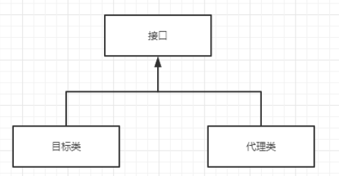

# 工具


## IDEA

## Maven

## Git

## Nginx

## Chocolatey：Windows 命令行软件管理器

## WindTerm终端工具

## 数据库工具

### chiner

### DBeaver

## Apifox

# 轮子

## HTTP调用API
## JUnit 5 + Mockito
## Jackson
## SLF4J + Logback

# Mysql

## 数据库设计基础与SQL核心实战

### 数据库逻辑设计：从业务到表格

#### ER模型

#### 关系数据库规范化理论

### MySQL表设计

#### 核心数据类型

#### 数据完整性约束

### SQL查询

#### 基础DQL

##### 条件过滤

##### 排序逻辑

##### 分页技术

#### 函数与计算

##### 常用聚合函数

##### 流程控制函数

#### 分组与过滤

##### GROUP BY

##### HAVING 与 WHERE 的本质区别

#### 多表联接查询 

##### 笛卡尔积

##### 内联接

##### 左/右外联接


#### 子查询与组合查询

##### 嵌套子查询、关联子查询的执行差异

##### UNION 与 UNION ALL


## MySQL 索引原理与底层数据结构

### 索引的本质与数据结构演进史

#### 索引

#### 被淘汰的数据结构分析

#### B+ Tree

### InnoDB 引擎的索引物理实现与存储分离

#### 聚簇索引

#### 辅助索引

#### 回表查询

#### 页分裂与页合并

### 高阶索引技术与性能的极限拉扯

#### 覆盖索引：优雅避开回表

#### 联合索引的内部排序魔法

#### 索引下推技术

#### 前缀索引

### 索引的设计规范与生命周期管理

#### 索引的创建时机与黄金法则

#### 不应建索引的黑名单

#### 索引失效的经典案发现场分析


---


## 事务并发控制与锁机制

### 事务的ACID 特性与InnoDB实现


**原子性核心概念**：事务是不可分割的最小工作单元。一个事务内的所有操作，要么“全部成功提交”，要么“全部失败回滚”，绝对不允许出现只执行了一半的状态（例如：转账过程中钱扣了，但没打进对方账户）。

**InnoDB实现底层支撑机制**：**Undo Log（回滚日志）**
* **工作原理**：Undo Log 属于**逻辑日志**。当 InnoDB 执行任何修改数据（Insert、Update、Delete）的操作时，都会在 Undo Log 中记录一条与该操作**相反**的逻辑记录。
    * 当你执行 `INSERT` 时，Undo Log 记录一条对应的 `DELETE`。
    * 当你执行 `DELETE` 时，Undo Log 记录一条对应的 `INSERT`。
    * 当你执行 `UPDATE` 时，Undo Log 记录一条包含**修改前旧值**的 `UPDATE`。
* **如何保障原子性**：如果事务执行过程中发生错误，或者用户显式调用了 `ROLLBACK` 语句，MySQL 就会顺藤摸瓜，读取该事务对应的 Undo Log，并在内存和磁盘中将数据逆向恢复到事务开始前的状态。

---

**隔离性核心概念**：在并发环境中，多个事务同时操作相同的数据时，每个事务都有各自完整的数据空间。一个事务的执行不能被其他事务干扰。

**InnoDB实现底层支撑机制**：**锁机制 (Locks) + MVCC (多版本并发控制)**
* **锁机制**：用于解决**写与写**之间的冲突。通过排他锁（X锁）、共享锁（S锁）、意向锁等，保证同一时刻只有一个事务能修改特定数据。
* **MVCC**：用于解决**读与写**之间的冲突，实现“读不加锁，读写不冲突”。它巧妙地复用了前面提到的 **Undo Log**，将数据的历史版本串联成一个“版本链”，配合 **Read View（读视图）**，让不同隔离级别下的事务能读到属于自己可见范围内的数据快照。

---

**持久性核心概念**：事务一旦被提交，它对数据库中数据的改变就是永久性的。接下来的其他操作或系统故障（如断电、宕机）都不应该对其有任何影响。

**InnoDB实现底层支撑机制**：**Redo Log（重做日志） + WAL 机制 (Write-Ahead Logging)**
* **工作原理**：Redo Log 属于**物理日志**，记录的是“在某个数据页上做了什么修改”。为了提高性能，InnoDB 修改数据时不会立刻写回磁盘中的数据文件，而是先修改内存中的“Buffer Pool”，此时数据所在的页称为“脏页”。
* **如何保障持久性 (WAL机制)**：在事务提交时，InnoDB 并不要求把脏页立刻刷入磁盘（这很慢），而是**先将 Redo Log 顺序写入磁盘**（这非常快）。只要 Redo Log 落盘成功，事务就算提交成功。如果系统突然宕机，内存中的脏页丢失了，MySQL 重启时依然可以读取磁盘上的 Redo Log，把未落盘的数据重新“重做”出来。

---


 **一致性核心概念**：事务执行前后，数据库必须从一个合法的状态流转到另一个合法的状态。数据库的完整性约束（如主键唯一、外键合法、字段类型匹配等）以及业务层面的逻辑约束（如账户余额不能为负数）都没有被破坏。

**InnoDB实现底层支撑机制**：**原子性 + 持久性 + 隔离性 + 业务代码层面的保障**
* **本质关系**：一致性是事务的**最终目的**。而原子性、持久性、隔离性（AID）是实现这个目的的**手段**。如果数据库在并发下没有隔离性，或者宕机后没有持久性，数据就会错乱，从而破坏一致性。同时，开发者编写的 SQL 逻辑正确与否，也是保障一致性不可或缺的一环。

---
###  并发事务数据不一致与隔离级别


#### 脏读、不可重复读、幻读


**脏读**
* **核心定义**：一个事务读取到了另一个事务**已经修改但尚未提交**的数据。
* **本质问题**：读到了无效的、甚至可能会消失的数据。如果那个修改数据的事务最后发生了回滚（Rollback），那么读取到的数据就成了彻头彻尾的“脏”数据（即现实中从未真正存在过的数据状态）。
- 后果：**完全破坏了事务的原子性**，是最不能容忍的数据不一致现象


-----

**不可重复读**

* **核心定义**：一个事务在自己完整的生命周期内，**两次读取同一条记录，得到的结果不一致**。
* **本质问题**：在事务 A 的两次读取之间，事务 B 对这条数据进行了**修改并提交**


---

**幻读**

* **核心定义**：一个事务按相同的查询条件执行了两次查询，第二次查询**看到了第一次查询中没有见过的“幻影”记录**
* **本质问题**：在事务 A 的两次范围查询之间，事务 B 进行了**新增或删除并提交**

-----

>- **不可重复读** 的罪魁祸首是**数据内容的修改**
>- **幻读** 的罪魁祸首是**数据条数的增减**

#### 隔离级别

SQL 标准提供四种隔离级别，隔离级别越高，数据一致性越好，但由于锁竞争和并发受限，数据库的**并发吞吐量（性能）**就越低。

---

**读未提交**：RU/Read Uncommitted
* **特性**：这是最底层的隔离级别。一个事务可以读取到另一个事务**未提交**的修改。
* **权衡**：
    * **优点**：性能最高，因为几乎没有任何锁开销，也不需要维护复杂的 Read View。
    * **缺点**：安全性最差。会产生**脏读**、不可重复读和幻读。在实际生产环境下，极少有业务场景能容忍读取到可能被回滚的假数据。

---

 **读已提交**：RC/Read Committed
* **特性**：事务只能读取到其他事务**已经提交**的数据。
* **底层机制**：基于 MVCC 实现，但在事务内的**每一条查询语句执行前，都会生成一个新的 Read View**。
* **权衡**：
    * **优点**：解决了脏读问题。性能较好，是 Oracle 和 SQL Server 的默认隔离级别。
    * **缺点**：存在**不可重复读**和幻读问题。由于每次查询都获取最新快照，同一个事务中两次查询结果可能不同。

---

**可重复读**：RR/Repeatable Read
* **特性**：保证在同一个事务中，多次读取同一条记录的结果总是一致的。
* **底层机制**：这是 **MySQL InnoDB 的默认隔离级别**。它在事务开始后的**第一次查询时生成一个 Read View**，并在整个事务期间复用。同时，InnoDB 通过 **间隙锁 (Gap Locks)** 很大程度上解决了幻读问题。
* **权衡**：
    * **优点**：解决了脏读、不可重复读，且在 InnoDB 中基本解决了幻读。在保证数据一致性的同时，依然保留了极高的并发能力。
    * **缺点**：虽然比串行化快，但相比 RC，它在处理范围更新时会持有更多的锁（如间隙锁），可能导致死锁概率上升。


---

**串行化**：Serializable
* **特性**：最高隔离级别。它不再依靠 MVCC 的快照读，而是将所有的普通 `SELECT` 语句隐式地转化为加锁读取（`SELECT ... FOR SHARE`）。
* **权衡**：
    * **优点**：完全解决了脏读、不可重复读、幻读，数据绝对安全。
    * **缺点**：并发性能极低。事务之间由“并发”变成了“排队”，容易导致大量的超时和锁竞争。通常仅用于极度敏感的金融结算等场景。

---


### InnoDB读的底层实现：MVCC


#### 当前读、快照读

**当前读**：永远读取的是记录的**最新版本**。最新意味着**不允许别的事务修改**，在读取和后续操作期间，向数据行或表施加悲观锁
- **SQL需要修改数据时，必须使用当前读**，否则可能覆盖数据丢失更新
- **通过显式加锁，即便是纯查询，也可以显式触发当前读，在查的过程中不允许别人改**：
  - `SELECT ... FOR UPDATE`：加排他锁
  - `SELECT ... FOR SHARE`：加共享锁

**快照读**
- **普通的、不带任何加锁后缀的 SELECT SQL，在查询时使用快照读**，读取记录时**不加锁**，**不会被写操作阻塞**，因此**可能读取到历史版本**
- MVCC通过快照读和当前读实现**读写分离，读不加锁**，当数据行加锁时，**通过Undo Log读取**符合当前事务隔离级别要求的**过去的数据快照**
- 普通的、没有任何修饰词的 `SELECT` 语句会触发快照读
  - **前提是读已提交 (RC)或可重复读 (RR)的隔离级别**
  - 读未提交(RU)隔离级别下：事务本来就允许读到别人未提交的脏数据。所以它直接去读内存里最新修改的物理数据就行了，根本不需要去 Undo Log 里翻找历史版本，因此谈不上 MVCC 快照读。
  - 在 串行化(Serializable ) 级别下：这是绝对悲观的防御。InnoDB 会把所有的普通 SELECT 隐式地统统转化为 SELECT ... FOR SHARE。也就是说，快照读在这个级别下被强制退化成了当前读。

-----

| 步骤 | 事务 A | 事务 B | 结果与原理分析 |
| :--- | :--- | :--- | :--- |
| **1** | `BEGIN;` | `BEGIN;` | |
| **2** | `SELECT num FROM t WHERE id=1;` | | 查出 `num=10` (生成了最初的 Read View，**快照读**) |
| **3** | | `UPDATE t SET num=11 WHERE id=1;`<br>`COMMIT;` | 事务 B 将最新值改为 11，并提交。 |
| **4** | `SELECT num FROM t WHERE id=1;` | | 依然查出 `num=10` (复用之前的 Read View，**快照读**屏蔽了外部的修改) |
| **5** | `SELECT num FROM t WHERE id=1 FOR UPDATE;`| | 查出 **`num=11`** (强制执行**当前读**，穿透了快照，拿到了最新值并加锁) |
| **6** | `UPDATE t SET num=num+1 WHERE id=1;` | | 执行成功，底层先做**当前读**拿到 11，加 1 后变为 **12**。 |

#### MVCC 的底层实现


MVCC在不加锁的情况下实现快照读，是通过三个组件配合实现的：**隐藏字段**、**Undo Log**、**Read View**

**隐藏字段**
- InnoDB 存储引擎在聚簇索引的每一条记录中，除了存放我们定义的列外，还会自动添加三个关键的隐藏字段：
* **`DB_TRX_ID` (6 字节)**：最近一次修改（插入或更新）这条记录的**事务 ID**。
  * 在整个 InnoDB 存储引擎内部，维护着一个全局递增的事务 ID 计数器，每当有一个新的事务开启并且**尝试去修改数据**时，InnoDB 就会从这个全局发号器里领走一个 ID
  * 该事务每修改一行数据，都会在`DB_TRX_ID`字段插入这个`trx_id`
  * 纯查询事务在系统眼里是“匿名”的，不占号。
* **`DB_ROLL_PTR` (7 字节)**：**回滚指针**。它指向这条记录在上一个版本的 Undo Log 地址。通过它，我们可以像拨动时间轴一样找回数据的过去。
* **`DB_ROW_ID` (6 字节)**：行 ID。如果你没定义主键，InnoDB 就会用这个字段来生成聚簇索引。

---


**Undo Log**
- 每当一个事务修改数据时，InnoDB 不会直接覆盖旧数据，而是先把旧数据写入 **Undo Log**，然后让当前记录的 `DB_ROLL_PTR` 指向这条 Undo Log。
- 如果这条记录被多次修改，就会产生多条 Undo Log，它们通过回滚指针串联起来，形成了一个**版本链**。链表的头部是当前的最新记录，越往后越是久远的历史版本。

---


**Read View读视图**
- Read View 是事务进行快照读时产生的**读视图**。它的本质是记录并在查询时刻维护当前系统中**还没提交的事务 ID 列表**。
- 一个Read View 主要包含四个核心属性：
  1.  **`m_ids`**：生成 Read View 时，当前系统中所有**活跃且未提交**的事务 ID 列表。
  2.  **`min_trx_id`**：`m_ids` 中的最小值。
  3.  **`max_trx_id`**：生成 Read View 时，系统应该分配给下一个事务的 ID 值（注意：不是 `m_ids` 的最大值，而是全局事务计数器当前的值）。
  4.  **`creator_trx_id`**：创建这个 Read View 的事务 ID。

---

**核心判定逻辑：我该看哪个版本？**

- 当事务执行查询时，会沿着 Undo Log 版本链寻找版本，并用版本的 `trx_id` 与自己的 Read View 进行比对。判定的逻辑规则如下：

1.  **等于自己**：如果 `trx_id == creator_trx_id`，说明这个版本是你自己改的，**可见**。
2.  **小于最小活跃 ID**：如果 `trx_id < min_trx_id`，说明修改这个版本的事务在你生成快照前就已经提交了，**可见**。
3.  **大于等于系统预分配 ID**：如果 `trx_id >= max_trx_id`，说明修改这个版本的事务是在你生成快照后才开启的，**不可见**。
4.  **在活跃区间内**：如果 `min_trx_id <= trx_id < max_trx_id`：
    * [min_trx_id,max_trx_id]**活跃区间内的部分事务可能早已提交**，即ID大的事务完全有可能先执行完
    * 若 `trx_id` 在 `m_ids` 列表中，说明生成快照时该事务还没提交，**不可见**。
    * 若 `trx_id` 不在 `m_ids` 列表中，说明生成快照时该事务已经提交，**可见**。

- 如果当前版本不可见，就根据 `DB_ROLL_PTR` 找到上一个版本，重复上述判断，直到找到第一个可见版本。

---

#### RC 与 RR 的底层本质区别

**RC（读已提交）**：**每执行一次 `SELECT` 都会重新生成一个 Read View**
- 既然是全新的，它就能看到其他事务刚刚提交的 UPDATE（导致不可重复读）和刚刚提交的 INSERT/DELETE（导致幻读）

**RR（可重复读）**：**仅在事务第一次 `SELECT` 时生成 Read View，之后整个事务都复用它**。
- **是否能防止幻读和不可重复读，取决于事务中是否有SQL会穿透快照**
- RR防止不可重复读
  - 如果事务完全由普通SELECT组成，没问题，因为全部是快照读
  - 如果事务一开始就明确要求加锁，比如`SELECT ... FOR UPDATE`，也没问题，因为一开始就防止其他事务改对应的数据行
  - 如果事务不规范，先普通读，然后别的事务更改并提交，再普通都没问题是快照读，最后加锁读`SELECT name FROM t WHERE id=1 FOR UPDATE;`此时**穿透快照**，产生不可重复读
- RR防止幻读
  - 先用快照读看了范围数据，别人在这个范围里插了新数据并提交。接着你用范围当前读，穿透快照并产生幻读，本质和上述例子相同


### InnoDB 写的底层实现：MySQL 锁机制

InnoDB通过MVCC的当前读和快照读解决隔离性，通过锁解决原子性

#### 锁的模式：互斥与共享

> **锁只针对当前读和写操作，不会阻塞快照读，即普通Select查询**


**共享锁**：**S 锁**-Shared Lock
* **核心特性**：**“我能看，你也能看，但大家都不能改。”**
* **语义**：**共享锁允许事务读取一行数据**。**当一个事务为某行数据加上 S 锁后，其他事务也可以继续为这行数据加 S 锁，形成“共享”**。
* **应用场景**：通常用于**数据读取的强一致性检查**。比如你在做报表统计时，为了防止统计过程中数据被别人改掉，但又不希望阻碍别人的正常读取，就可以使用 S 锁。
* 显式手动加锁：**`SELECT ... FOR SHARE`**

---

**排他锁**：**X 锁**-Exclusive Lock
* **核心特性**：**“我要改，我一个人占着，谁也别想碰。”**
* **语义**：**排他锁允许事务删除或更新一行数据**。当一个事务为某行加了 X 锁，其他任何事务都**不能**再为这行加任何形式的锁（无论是 S 锁还是 X 锁），必须等到 X 锁释放。
* **自动加锁**：所有的修改操作（`INSERT`、`UPDATE`、`DELETE`）都会自动为涉及到的行加上 X 锁。
* **显式手动加锁**：`SELECT ... FOR UPDATE`。
* **应用场景**：用于**数据修改**。为了防止“丢失更新”，在修改数据前必须确保自己拥有绝对的控制权。

---

锁的兼容性
| 当前锁（已持有） \ 申请锁（尝试获取） | 共享锁 (S) | 排他锁 (X) |
| :--- | :--- | :--- |
| **共享锁 (S)** | **兼容 (Compatible)** | **冲突 (Conflict)** |
| **排他锁 (X)** | **冲突 (Conflict)** | **冲突 (Conflict)** |


---


#### 行锁

行锁
- **相比表锁，行锁的粒度更细，发生锁冲突的概率更低**

在RC级别下，因为不需要解决幻读，所以基本只有记录锁，没有间隙锁

**行锁是加在索引上的，而不是直接加在物理数据行上**
- 在RR级别下，**如果一条 SQL 语句会加锁，且查询条件没有用到索引(即目标字段没有建立索引)，InnoDB 就会退化为全表扫描，此时所有的行都会被锁住**，无论是哪种行锁，都会表现为表锁的效果
  - 因为不走索引时，无法通过索引树快速定位，它唯一的办法就是进行全表扫描
  - 每扫描到一条记录，就会给这条记录的索引加记录锁、间隙锁
  - 直到事务提交之前，该表的所有记录上的锁都不会释放，表现为表锁
- 为了解决幻读，InnoDB 将行锁细分为了三种主要类型：**记录锁**、**间隙锁**、**临键锁**

---

##### 记录锁Record Lock

记录锁**仅仅锁住索引中的某一条确定的记录**
- **触发条件**：SQL查询是等值查询，查询条件中是**唯一索引**，且目标记录确实存在时触发，比如主键或`UNIQUE` 约束的字段
  - Mysql默认为主键或`UNIQUE`约束的字段建立索引，如果不建立索引无法快速确定是否唯一
- 为什么要加记录锁：记录锁是互斥的，防止其他事务对这条被锁定的记录进行`UPDATE`、`DELETE`操作，这些事务会被阻塞直到本事务提交
```sql
-- 事务A执行
SELECT * FROM table WHERE id = 10 FOR UPDATE;
```


##### 间隙锁Gap Lock

间隙锁是 InnoDB 为了解决可重复读（RR）隔离级别下的**幻读**问题而引入的。它不锁记录本身，而是**锁住索引记录之间的“空隙”**。

* **锁定范围**：两个索引记录之间的间隙，或者第一条记录之前、最后一条记录之后的间隙。它是**开区间**，不包含两端的记录。

* **作用**：唯一目的是**防止其他事务在这个间隙中 `INSERT`（插入）新数据**。

* **触发条件**：
  - 执行**范围查询**时（如 `WHERE id > 10 AND id < 20`）。
    - B+ 树的叶子节点是通过双向链表连接的。当你定位到 $10$ 之后，指针会向右扫描直到 $20$。为了保证这块区域不被改动，InnoDB 会将扫描到的所有**索引间隙**都加上锁
  - **等值查询时，记录不存在**（如查 `id=15`，但表里只有 10 和 20）。
    - B+ 树确定目标行应该存在的位置，寻找前后索引，然后在这两个索引之间的每个行之间插入间隙锁
    - 防止其他事务在查询期间刚好插入了 $id=15$，导致查询结果变化
  - 使用**普通非唯一索引**进行等值查询时（除了锁住记录，还会锁住记录两侧的间隙）。
    - 普通非唯一索引：普通字段建立了索引，即二级索引，但是InnoDB不知道到底有几条行符合查询条件，为了避免在查询期间，插入更多的符合查询条件的行，执行以下动作
    - 给匹配到的二级索引记录（age=18）加临键锁（Next-Key Lock）：锁住该记录及前面的间隙。
    - 在最后一条匹配记录的后面加间隙锁（Gap Lock）：为了防止后续插入，顺着 B+ 树向右找到第一个不等于 18 的记录，在这个间隙加上纯粹的间隙锁（开区间）。
    - 给对应的主键（聚簇索引）加记录锁（Record Lock）：防止其他事务修改或删除这行真实数据。

* **特殊性质**：间隙锁之间是**不互斥**的。事务 A 给 `(10, 20)` 加了间隙锁，事务 B 也可以给 `(10, 20)` 加间隙锁。它们共同的目标都是阻止事务 C 在这个区间插入数据。
* **示例**：
    假设表中有主键 `id` 为 `10` 和 `20` 的两行数据。
    ```sql
    -- 事务A尝试查询一个不存在的id，并加排他锁
    SELECT * FROM table WHERE id = 15 FOR UPDATE;
    ```
    此时，InnoDB 找不到 `id=15` 的记录，为了防止别人在这个时候插入 `id=15` 导致幻读，它会在 `(10, 20)` 这个间隙加上间隙锁。如果此时事务 B 尝试执行 `INSERT INTO table (id) VALUES (15)`，就会被阻塞排队。

---

#####  临键锁 Next-Key Lock

临键锁本质上是 **“记录锁 + 间隙锁”** 的结合体。它既锁住了一条记录，又锁住了这条记录前面的间隙。
- RR隔离级别下，**InnoDB 的默认行锁算法就是临键锁**
- 非唯一普通索引：不知道有几个符合要求的行，所以每命中一行就加一个临键锁
- 唯一索引的范围查询：每命中一行加一个临键锁，直到首次未命中时加间隙锁
  - 假设表中有主键 `id` 为 `10`、`20`、`30` 的三行数据。此时自然形成了以下区间：`(-∞, 10]`, `(10, 20]`, `(20, 30]`, `(30, +∞)`。由四把临键锁组成的区间
  - InnoDB 为了统一算法，在每个数据页的末尾虚拟出了一个“最大伪记录”（叫做 supremum pseudo-record）。因此最后一个区间`(30, +∞)`实际上是`(30, supremum]`，依然是一把临键锁
    ```sql
    -- 事务A执行范围查询
    SELECT * FROM table WHERE id > 10 AND id <= 20 FOR UPDATE;
    ```
    这条语句会加上 `(10, 20]` 的临键锁。不仅 `id=20` 这条记录不能被修改，别的事务也无法插入 `id=11` 到 `id=19` 的数据。


---

只有临键锁会退化
- 只要精确命中了唯一值，就退化为**记录锁**
- 只要发现没记录可锁、或者摸到了不符合条件的边界记录，就退化为**间隙锁**。


在以下情况下临键锁会发生退化，提升并发度
- 退化为记录锁
  - 使用 **主键** 或 **唯一索引** 进行 **等值查询**，并且 **目标记录确实存在**
- 退化为【间隙锁
  - 不论是唯一索引还是普通索引，只要进行 **等值查询**，并且 **表里没有这行数据**
- 唯一索引范围查询，向右扫描越界
  - 使用 **主键** 或 **唯一索引** 进行 **范围查询** 时，当向右扫描到的最后一条真实记录 **不满足你的查询条件（越界了）** 时。
  - 你想查 `id <= 19`，引擎顺着索引树向右摸，摸到了 `id=20`。为了防幻读，它本该给 20 加临键锁 `(10, 20]`。但 MySQL 8.0 变聪明了，它发现 20 根本不在你的条件 `<19` 里，锁住 20 这行记录纯属“误杀”。于是丢掉 20 的记录锁。
- 普通（非唯一）索引等值查询，向右扫描遇到第一个不匹配的记录
  - 假设普通索引 `age` 有数据 `10, 18, 18, 20`。你查 `WHERE age = 18`。
    1.  引擎找到第一个 18，加临键锁 `(10, 18]`。
    2.  找到第二个 18，加临键锁 `(18, 18]`。
    3.  继续向右找，摸到了 `20`。发现 `20` 不等于 `18`，扫描结束。
    4.  **退化发生点**：由于它是普通索引，引擎为了防止别人在 18 和 20 之间再插一个 18 进来，必须锁住间隙。原本应该给 20 加临键锁 `(18, 20]`，但 20 并非目标数据，为了不误杀 20，这把临键锁**退化**为 `(18, 20)` 的间隙锁。


---


#### 表锁与意向锁

在 MySQL 中，表锁有两种：

**1. 显式表锁**
* **语法**：`LOCK TABLES t1 READ;`（共享表锁） 或 `LOCK TABLES t1 WRITE;`（排他表锁）。t1是真实表名
* **特点**：这是 Server 层实现的锁，通常用于全表的数据迁移或备份。
* 在 InnoDB 引擎下，**极不推荐**使用显式表锁。因为 InnoDB 的核心优势就是行锁，用了 `LOCK TABLES` 等于自废武功，把并发性能降到了极点。

**2. 元数据锁**
* **触发条件**：隐式触发。当你执行 CRUD（增删改查）操作时，系统会自动给表加 **MDL 读锁**；当你执行 DDL（修改表结构，比如加字段、改字段名）时，会自动加 **MDL 写锁**。
* **痛点/作用**：它是为了防止“你在查数据的同时，别人把表结构给删了”这种灾难。
* MDL 读锁和写锁是互斥的。如果有一个长事务（比如一个慢查询）一直在跑，它持有着 MDL 读锁；此时你尝试执行 `ALTER TABLE`（需要 MDL 写锁），这个 DDL 操作就会被阻塞。更可怕的是，**这个被阻塞的 DDL 操作会反过来阻塞后续所有的 CRUD 操作**，导致整个表瞬间“假死”。


---

改表结构时，必须给整个表加一把排他锁，需要先确定表里没有任何一行数据被别人加了锁，如果逐行扫描，看看有没有行锁，这在百万级数据量下简直是灾难。为了解决这个问题引入**意向锁**


**意向锁**
* **意向共享锁（IS锁 - Intention Shared Lock）**：事务想要给表里的某些行加共享锁（S锁）之前，InnoDB 会**自动**先给这张表加一个 IS 锁。
* **意向排他锁（IX锁 - Intention Exclusive Lock）**：事务想要给表里的某些行加排他锁（X锁）之前，InnoDB 会**自动**先给这张表加一个 IX 锁。

意向锁和意向锁、行级锁、元数据锁不冲突，只与显式表锁冲突


| 锁类型 | 表级 S锁 (读表) | 表级 X锁 (写表) |
| :--- | :--- | :--- |
| **表级 IS锁** | ✅ 兼容 (大家都读) | ❌ 冲突 (有人在读行，你不能锁整张表去改) |
| **表级 IX锁** | ❌ 冲突 (有人在改行，你不能锁整张表去读) | ❌ 冲突 (有人在改行，你不能锁整张表去改) |


#### 死锁

两个或多个事务在执行过程中，因争夺锁资源而互相等待，若无外力干涉，它们都将无法继续执行


两个事务**以不同的顺序更新相同的多行数据**

| 时间点 | 事务 A | 事务 B |
| :--- | :--- | :--- |
| T1 | `UPDATE users SET age = 20 WHERE id = 1;` (获取 id=1 的行锁) | |
| T2 | | `UPDATE users SET age = 30 WHERE id = 2;` (获取 id=2 的行锁) |
| T3 | `UPDATE users SET age = 25 WHERE id = 2;` (等待 B 释放 id=2 的锁) | |
| T4 | | `UPDATE users SET age = 35 WHERE id = 1;` (等待 A 释放 id=1 的锁) -> **发生死锁** |


**间隙锁与插入意向锁冲突**
- 在 RR 隔离级别下，这类死锁极其常见，通常发生在并发执行 `INSERT` 或 `DELETE` 时。

假设表 `test` 有一个普通二级索引 `num`，表中存在记录 `num = 10` 和 `num = 20`。

| 时间点 | 事务 A | 事务 B |
| :--- | :--- | :--- |
| T1 | `DELETE FROM test WHERE num = 15;` (未找到记录，但在 10~20 之间加上了 **Gap Lock**) | |
| T2 | | `DELETE FROM test WHERE num = 15;` (未找到记录，也在 10~20 之间加上了 **Gap Lock**。间隙锁之间是互相兼容的) |
| T3 | `INSERT INTO test (num) VALUES (15);` (尝试获取插入意向锁，被事务 B 的 Gap Lock 阻塞) | |
| T4 | | `INSERT INTO test (num) VALUES (15);` (尝试获取插入意向锁，被事务 A 的 Gap Lock 阻塞) -> **发生死锁** |

---


InnoDB 存储引擎具备完善的死锁检测机制，不会让事务无限期地等待下去：

1.  **Wait-for Graph（等待图）机制：**
    * InnoDB 会自动开启死锁检测（参数 `innodb_deadlock_detect = ON`）。
    * 它会在内存中维护一个锁等待图，实时检测图中是否存在回路（环）。
    * 如果发现死锁回路，InnoDB 会立刻主动回滚其中**权重较小**的事务（通常是插入/更新/删除行数较少的事务），从而打破僵局，让另一个事务得以继续执行。
2.  **锁等待超时（Fallback）：**
    * 如果死锁检测因高并发压力过大被关闭，或者遇到一些极端情况，InnoDB 还会依赖超时机制。
    * 参数 `innodb_lock_wait_timeout`（默认 50 秒），如果一个事务等待锁的时间超过该阈值，就会自动报错并回滚。

---


`Deadlock found when trying to get lock; try restarting transaction` 错误排查

1.  **查看最近一次死锁日志：**
    * 在 MySQL 命令行执行：`SHOW ENGINE INNODB STATUS;`
    * 找到 `LATEST DETECTED DEADLOCK` 部分。里面会详细记录死锁发生的时间、涉及的事务（TRANSACTION 1 和 TRANSACTION 2）、它们正在执行的 SQL 语句、持有的锁以及等待的锁。
2.  **开启死锁日志记录：**
    * 在生产环境中，建议开启参数 `innodb_print_all_deadlocks = ON`。
    * 这样每一次死锁的详细信息都会被写入到 MySQL 的 error log 中，方便事后追溯和分析。

---

**预防和避免死锁**

死锁无法 100% 杜绝，但可以通过优化业务逻辑和 SQL 将其发生概率降到最低：

* **固定访问顺序：** 无论在什么业务逻辑中，如果涉及更新多张表或多行数据，尽量保证所有事务以**相同的顺序**去访问这些资源。
* **大事务拆小：** 事务执行时间越长，持有的锁越多，发生死锁的概率越大。尽量将大事务拆分成小事务，并尽快提交（Commit）。
* **合理建立索引：** 如果 `UPDATE` 或 `DELETE` 语句没有用到索引，InnoDB 会走全表扫描，从而**锁住表中的所有记录**，极其容易引发死锁。确保所有更新操作都通过精确的索引进行。
* **降低隔离级别：** 如果业务允许，可以将隔离级别从 `Repeatable Read` 降低到 `Read Committed`。RC 级别下基本没有间隙锁（Gap Lock），能大幅减少因锁范围过大引起的死锁。
* **避免复杂的 `INSERT ... ON DUPLICATE KEY UPDATE`：** 这种高并发下的“插入或更新”操作极易引发复杂的行锁与间隙锁死锁，可以通过业务层面的分布式锁或先查询后操作来缓解。

---


---
## SQL 性能调优与执行计划

### 性能调优的方法论与宏观排查路径
#### 发现问题：慢查询的捕获

##### 慢查询日志的参数配置

##### 慢查询分析工具`mysqldumpslow`

#### SQL变慢的架构原因

##### 解析器

##### 优化器

##### 执行器

### 调优工具EXPLAIN

#### `id` 列

#### select_type` 列

####  `type` 列

#### `possible_keys` vs `key`

#### `key_len` 列

#### `rows` 列

#### `Extra` 列

### 经典 SQL 调优场景与重构方案

#### 深度分页优化的破局

#### 聚合统计性能

#### 排序 `ORDER BY` 与分组 `GROUP BY` 的优化法则

#### 索引失效

### MySQL 参数调优

#### `innodb_buffer_pool_size`

#### `innodb_flush_log_at_trx_commit`


---


## 高可用架构与分库分表

### 架构演进与横向扩展

#### 单机瓶颈的四大维度

#### 演进路线图

#### 引入分库分表的代价

### 复制基石：MySQL主从复制底层原理剖析

#### 主从复制核心工作流

#### 同步机制演进与可靠性保障

##### 异步复制

##### 半同步复制

##### 全同步复制

#### 主从延迟的根因与终极优化

### 容灾与故障转移：常见高可用（HA）架构方案选型

#### 经典主备切换方案

#### MHA架构

#### 现代主流选型：Orchestrator 集群拓扑管理

#### 原生终极方案：MGR (MySQL Group Replication) 与 InnoDB Cluster

### 性能外扩：读写分离与路由中间件

#### 客户端直连 vs. 代理层（Proxy）路由对比

#### ProxySQL 实战核心配置

#### 读写分离的致命痛点：主从延迟导致“读不到写”的解决方案

### 数据分流：分库分表核心理论与分片策略

#### 垂直拆分

#### 水平拆分

### 分布式环境下的 SQL 难题与解决之道

#### 全局唯一主键生成策略

#### 跨节点查询的降维打击

#### 分布式排序与分页的性能灾难

### ACID 的妥协：分布式事务机制选型

#### CAP定理与BASE理论在数据库中的映射

#### 强一致性事务（2PC / XA 协议）

#### 主流柔性事务方案

#### 基于本地消息表 / 靠谱MQ 的最终一致性方案

### 极限操作：不停机数据平滑迁移与扩容实战

#### 停机迁移

#### 平滑迁移双写方案


# Spring Framework

## IoC & DI

**IoC控制反转和 DI依赖注入解决的软件工程核心**：**解耦**。**IoC 是设计思想，DI 是具体实现。**

* **传统开发模式：** 当对象 A 需要使用对象 B 的时候，A 会在自己的代码里显式地 `new` 一个 B 的实例。**控制权在 A 手里**。这种方式导致 A 和 B 强耦合，如果 B 的构造方式变了，A 的代码也得跟着改。
* **IoC (Inversion of Control) 控制反转：** 对象 A 不再自己去 `new` 对象 B，而是把创建对象、管理对象的权力**交给了 Spring 容器**。控制权由程序员的代码“反转”给了框架。
* **DI (Dependency Injection) 依赖注入：** 既然 A 自己不创建 B 了，那 A 运行的时候怎么拿到 B 呢？Spring 容器会在 A 实例化之后，自动把 B 传给 A。这个**由容器把依赖对象传递给当前对象的过程**，就叫依赖注入。

---

### DI 的三种主要注入方式

#### 字段注入

字段注入直接在类的属性上加 `@Autowired`，代码最简洁，写起来最快


```JAVA
@RestController
public class UserController {
    
    @Autowired
    private UserService userService; // 直接在字段上打注解

    public void doSomething() {
        userService.login();
    }
}
```
极度不推荐字段注入的理由：

* **脱离容器后抛出 NullPointerException（致命缺点）：**
    * **原理：** Spring 底层是通过**反射机制**，在 `UserController` 实例化（调用默认无参构造方法）**之后**，强行把 `userService` 塞进去的。
    * **后果：** 如果你在写单元测试，脱离了 Spring 环境，直接 `new UserController()` 时，`userService` 并没有被赋值。一旦调用 `doSomething()` 方法，就会立刻引发空指针异常（NPE）。
* **破坏了类的封装性（隐藏了依赖）：**
    * **原理：** 一个正常的 Java 类，应该通过对外暴露的接口（如构造方法、普通方法）来声明自己需要什么外部资源。
    * **后果：** 字段注入把依赖项“藏”在了类内部。别人调用这个类时，根本不知道它到底依赖了哪些东西。
* **无法使用 `final` 关键字：**
    * **原理：** Java 语法规定，`final` 变量必须在声明时或构造方法中初始化。字段注入是在对象实例化之后才赋值的，所以绝对不能加 `final`。这导致你的 Bean 状态是可变的，存在并发安全隐患。
* **掩盖了“单一职责原则”的破坏：**
    * **原理：** 只要你想，你可以无限地在一个类里写 `@Autowired` 注入几十个依赖，代码依然看起来“很整洁”。但这实际上意味着这个类干了太多杂事，严重违背了面向对象设计原则。

**先实例化对象，再注入依赖的危害**：空指针，**破坏了“快速失败 (Fail-Fast)”原则**
- 假设你的代码由于配置疏忽、依赖的 Bean 名称写错，或者某个特定的 Profile 没有激活，导致某个依赖 Bean 根本没有被注入到 Spring 容器中
- **如果用字段/Setter注入**： Spring 可能会正常启动（某些版本或配置下容忍缺失），或者即使报错你也没注意到。服务看似健康地上线了。直到真实用户点击了某个按钮，触发了那行调用缺失依赖的代码，系统才会当场抛出 NullPointerException (NPE) 并崩溃。
- **如果用构造器注入**： 依赖缺失会导致 Bean 根本无法完成实例化。Spring 容器在启动阶段就会直接崩溃报错（Fail-Fast）。这是一种保护机制：把错误暴露在编译或启动阶段，绝不让带病的服务器接管线上流量。


**无法保障并发环境下的“绝对不可变性”**
* 如果“慢慢准备依赖”，意味着这个对象的属性是可以被修改的（不能加 `final` 关键字）。
* 在 Java 的内存模型（JMM）中，没有被 `final` 修饰的变量，在多线程高并发环境下（Web 服务器天生就是多线程环境），存在**指令重排序**和**可见性**的问题。虽然 Spring 容器对单例 Bean 的生命周期管理能最大程度避免这事，但从面向对象设计的严谨性来说，状态可变的对象天生是不安全的。构造器注入配合 `final`，能在对象发布的第一时间，向所有线程保证其状态的绝对可见和不可变。

**纵容了“循环依赖”这种糟糕的设计**
* 字段注入允许 A 依赖 B，B 依赖 A。Spring 为了帮你填坑，搞出了复杂的“三级缓存”机制。
* 但从架构角度看，**循环依赖本身就是设计缺陷**，说明模块划分不清晰。构造器注入因为要求在实例化时必须拿到完整的依赖，所以**天然不支持循环依赖**。一旦代码出现循环依赖，启动直接报错，这就倒逼开发者去重构代码（比如提取公共的第三个类 C），从而写出更健康的架构。


#### Setter 方法注入

**Setter 方法注入**为属性提供 setter 方法，并在方法上加 `@Autowired`
* **优点（灵活性高）：** 允许在对象实例化之后，甚至在程序运行期间，动态地更改注入的依赖对象。
* **缺点（状态不安全）：** Setter 方法是可以被多次调用的。如果是核心强依赖，一旦在运行时被别人错误地调用 Setter 传入了 `null`，整个系统就会崩溃。
  * 即Setter 方法注入的字段不能是 final
* **适用场景：** 当某个依赖是**非必须的（可选的）**，没有它系统也能按默认逻辑运行时；或者需要在运行期间动态改变依赖时，可以使用 Setter 注入。

```java
@RestController
public class UserController {
    
    private UserService userService;

    @Autowired // 注入点在 Setter 方法上
    public void setUserService(UserService userService) {
        this.userService = userService;
    }
}
```

#### 构造器注入

构造器注入是 Spring 官方强烈推荐的依赖注入方式。通过类的构造方法传入外部依赖，不仅能保证代码的健壮性，还能与面向对象设计原则完美契合。

相比于字段注入，构造器注入具有不可替代的优势：
* **防空指针（保证强依赖强制初始化）：** Java 语法规定，实例化对象必须调用构造方法。这从根源上杜绝了对象创建完毕但依赖尚未准备好的情况，只要 Bean 实例化成功，依赖一定不为 `null`。
* **支持 `final` 关键字（保证不可变性与线程安全）：** 完美契合 `final` 变量必须在构造时赋值的语法要求。依赖一旦注入便不可更改，保障了单例 Bean 在多线程环境下的绝对安全。
* **完美支持单元测试：** 脱离 Spring IoC 容器后，可以通过常规的 `new` 关键字手动传入 Mock 对象（如 `new UserController(mockUserService)`），测试代码更纯粹。
* **主动暴露“代码异味” (Code Smell)：** 如果一个类依赖过多（例如构造方法有 15 个参数），代码会非常臃肿，这就良性地“逼迫”开发者审视该类是否违背了单一职责原则，进而进行拆分重构。

```java
@RestController
public class UserController {
    // 推荐加上 final 关键字
    private final UserService userService;

    // 通过构造方法传入依赖
    public UserController(UserService userService) {
        this.userService = userService;
    }
}
```

**最佳实践：结合 Spring 4.3+ 与 Lombok 精简代码**
* **Spring 4.3 隐式注入特性：**
    * **规则：** 如果一个类**只定义了一个构造器**，Spring 会默认使用该构造器进行自动装配，无需显式标注 `@Autowired`。
    * **优势：** 代码更整洁，天然鼓励“单构造器 + 不可变字段”的优秀实践。
* **Lombok `@RequiredArgsConstructor` 注解：**
    * **作用：** 自动生成一个包含类中所有 `final` 字段和带有 `@NonNull` 注解字段的有参构造器。
    * **注意点：** 如果类中既没有未初始化的 `final` 字段，也没有 `@NonNull` 字段，该注解会静默生成一个无参构造器（属于误用，但不报错）。若确实只需无参构造器，应明确使用 `@NoArgsConstructor`。


---

#### `@Autowired` 行为与多构造器解析规则

当类中存在多个构造器时，Spring 会按特定规则寻找合适的构造器来实例化 Bean：

* **`@Autowired` 的 `required` 属性（默认值为 `true`）：**
    * `required = true`：强制依赖。找不到匹配 Bean 时，启动抛出 `NoSuchBeanDefinitionException`，初始化失败。
    * `required = false`：可选依赖。找不到时，Spring 忽略它并尝试正常启动。

* **Spring 多构造器解析步骤与规则：**
    1. **唯一性直接使用：** 若有且仅有一个构造器，直接使用（无需注解）。
    2. **显式首选：** 若有多个构造器，被 `@Autowired` 标记的会成为“首选构造器”。
    3. **冲突报错：** 若一个构造器标为 `@Autowired(required = true)`，此时若有任何其他带有 `@Autowired` 的构造器（无论 true/false），直接启动报错。
    4. **贪婪匹配 (Greedy Matching)：** 允许将所有带 `@Autowired` 构造器的 `required` 设为 `false`。此时 Spring 会检查所有候选者，优先选择**参数最多且能被 Spring 容器完全满足**的构造器。
    5. **单构造器 + `required=false` 的反模式行为：** 如果你**只有一个带参构造器**，却标记为 `@Autowired(required = false)`，当依赖缺失时：
        * 若类中还有无参构造器：退化调用无参构造器生成残缺 Bean（需手动判空）。
        * 若没有无参构造器：直接抛出实例化异常，而不会硬塞 `null`。
        * **设计定性：** 这种做法在设计上是**错误**的。`required = false` 语义是“可选”，而唯一带参构造器语义是“强制”，两者自相矛盾。
        * 
---

#### @Primary 与 @Qualifier
**“当容器中有多个同类型 Bean 时，如何优雅地选妃”**。
- 在 Spring 中，`@Autowired` 默认是**按类型（ByType）**去寻找 Bean 并注入的。
- 假设你定义了一个接口 `PaymentStrategy`（支付策略），并且写了两个实现类：`WechatPay`（微信支付）和 `AliPay`（支付宝支付），它们都被加上了 `@Component` 交给 Spring 管理。
- 此时，你在订单服务里这样写：
```java
@Service
public class OrderService {
    @Autowired
    private PaymentStrategy paymentStrategy; // Spring 懵了：你到底要微信还是支付宝？
}
```
- 当你启动项目时，Spring 会直接抛出 `NoUniqueBeanDefinitionException` 异常。这就好比皇帝翻牌子，只说了一句“叫妃子来”，太监根本不知道该叫哪一个，只能原地死机报错。

为了解决这个问题，Spring 给了你两道圣旨：`@Primary` 和 `@Qualifier`。

---

**方案一：`@Primary`** —— 册立“正宫娘娘”

- `@Primary` 是贴在**Bean 的定义类**上的。它的意思是：当出现多个同类型的 Bean 时，**优先选择我**。

- 如果你公司的业务里 90% 都是用微信支付，你就可以把微信支付设为默认项：

```java
@Component
@Primary  // 👈 重点在这里：确立默认首选地位
public class WechatPay implements PaymentStrategy {
    // ...
}

@Component
public class AliPay implements PaymentStrategy {
    // ...
}
```

- **注入时的效果：**
```java
@Service
public class OrderService {
    @Autowired
    private PaymentStrategy paymentStrategy; // 这里会自动注入 WechatPay
}
```
- **特点：** `@Primary` 是一种**全局默认策略**。你不需要修改任何调用的代码，只要在定义处加一个注解，冲突就解决了。

---

**方案二：`@Qualifier`** —— 皇帝“亲自点名”

- `@Qualifier` 是贴在**注入点（也就是调用方）**上的。它的意思是：别管什么默认规则了，我就要名字叫 `xxx` 的那个 Bean。

- 假设你的项目中，普通订单用微信支付，但大额订单必须用支付宝支付。这个时候 `@Primary` 就搞不定了，你必须精确控制：

```java
@Service
public class VipOrderService {
    
    @Autowired
    @Qualifier("aliPay") // 👈 重点：强行指定要注入的 Bean 的名字（默认是类名首字母小写）
    private PaymentStrategy paymentStrategy; 
    
}
```

- **特点：** `@Qualifier` 是一种**局部精准打击**。它直接把按类型查找（ByType）降级成了按名称查找（ByName），指名道姓，绝不认错。

---


#### `@Autowired`自动装配规则：ByName vs ByType，对比`@Resource`


* **ByType（按类型）：** 就像老板说：“给我叫一个**写 Java 的程序员**来。” 
    * **优点：** 很灵活。哪怕这个程序员离职了，换了一个新的 Java 程序员，只要“职位（接口/类型）”没变，业务就能继续跑。
    * **致命弱点：** 如果公司里有三个 Java 程序员，老板又不说是谁，HR（Spring 容器）就会当场崩溃（抛出 `NoUniqueBeanDefinitionException`）。
* **ByName（按名称）：** 就像老板说：“给我把**张三**叫过来。”
    * **优点：** 极其精准，绝对不会叫错人。
    * **致命弱点：** 强耦合。如果张三改名了，或者换人了，代码立马报错（找不到 Bean）。

---

**`@Autowired` 的真实内幕：它是怎么找人的？**
- 很多人以为 `@Autowired` 就是纯粹的 ByType，**这是一个巨大的误区。** 它的真实查找逻辑其实分了三步：

- **第一步：先 ByType 找**
    * 它去 Spring 容器里找类型匹配的 Bean。
    * 如果只找到 **1** 个：完美，直接注入。
    * 如果找到 **0** 个：报错（除非你设置了 `@Autowired(required = false)`）。
    * 如果找到 **多个**：进入第二步。

- **第二步：找 `@Primary`**
    * 如果有多个同类型的 Bean，它会看看有没有哪个候选人头上顶着 `@Primary`（正宫娘娘）。如果有，选她。如果没有，进入第三步。

- **第三步：退化为 ByName 找（隐藏彩蛋）**
    * 这是最容易被忽略的！当类型有冲突时，`@Autowired` 会自动用你的**变量名**作为 Bean 的名字去容器里找。
    * 如果多个同类型的Bean的所有名字，没有和依赖注入的成员变量名一样的，就报错

```java
@Component("alipay") // 名字叫 alipay
public class AliPay implements PaymentStrategy {}

@Component("wechat") // 名字叫 wechat
public class WechatPay implements PaymentStrategy {}

@Service
public class OrderService {
    // 容器里有两个 PaymentStrategy。
    // 但因为你的变量名叫 "wechat"，匹配上了其中一个 Bean 的名字！
    // 此时 @Autowired 奇迹般地不会报错，它成功注入了 WechatPay！
    @Autowired
    private PaymentStrategy wechat; 
}
```

---

`@Resource`：企业级开发的老大哥

- `@Resource` 是 Java EE 的官方规范（JSR-250），Spring 对它进行了完全的兼容。在很多大厂的编码规范中，反而更推荐使用 `@Resource`。

它的查找逻辑与 `@Autowired` **恰恰相反**：

**第一步：先 ByName 找**
它默认用**变量名**（或者你指定的 `name` 属性）去容器里搜寻同名的 Bean。
* 如果找到了名字一样的，且类型也匹配：直接注入。
* 如果没找到这个名字的 Bean：进入第二步。

**第二步：退化为 ByType 找**
既然按名字找不到，那就按类型捞捞看。
* 如果恰好只有一个该类型的 Bean：注入成功。
* 如果有多个：直接报错。

```java
@Service
public class OrderService {
    // 第一步：找名字叫 "paymentStrategy" 的 Bean，没找到。
    // 第二步：按类型找，发现有 AliPay 和 WechatPay，报错冲突！
    @Resource
    private PaymentStrategy paymentStrategy; 
    
    // ==========================================
    
    // 第一步：找名字叫 "wechat" 的 Bean，找到了！直接注入。
    @Resource
    private PaymentStrategy wechat; 
    
    // ==========================================
    
    // 终极杀招：直接指定 name，这是最稳妥的写法
    @Resource(name = "alipay")
    private PaymentStrategy abc; 
}
```

---


1.  **如果项目只有一个实现类：** 闭着眼睛用 `@Autowired` 或者 `@Resource` 都可以，效果一模一样。推荐 `@Resource` 的原因是它不强依赖 Spring 的 API。
2.  **如果是多个实现类（策略模式）：** 坚决推荐 `@Resource(name = "具体名字")`。它比 `@Autowired` + `@Qualifier` 看起来要简洁得多。


#### 注入方案选择

在真实的工程实践中，推荐将依赖严格划分为**强制依赖**和**可选依赖**：

**代码精简最佳实践：结合 Spring 4.3+ 与 Lombok**
* **Spring 4.3 隐式注入特性：** 若类**只定义了一个构造器**，Spring 会默认使用该构造器自动装配，无需显式标 `@Autowired`。
* **Lombok `@RequiredArgsConstructor` 注解：** 自动生成包含所有 `final` 字段和 `@NonNull` 字段的有参构造器。
  * *注意：* 若类中既无未初始化的 `final` 字段也无 `@NonNull` 字段，该注解会静默生成无参构造器（属于误用）。若确需无参，应明确使用 `@NoArgsConstructor`。

1. **强制依赖：** 完全由**构造器注入**完成。
2. **可选依赖：** 完全由 **Setter 方法注入**完成。
3. **CGLIB 代理兼容性保证：**
   * 使用 `@NoArgsConstructor` 生成一个无参构造器，并总是确保**至多只有一个**有参构造器来注入强制依赖。
   * *原因：* Spring AOP 底层依赖 CGLIB 动态代理（通过继承目标类生成子类来实现增强）。CGLIB 要求父类**必须拥有无参构造器**，否则子类无法调用 `super()` 初始化父类状态。
---

### IoC 容器的核心大脑：BeanFactory 与 ApplicationContext

在 Spring 框架中，IoC 容器是负责实例化、配置和装配对象的大管家。Spring 主要提供了两种核心容器接口来实现这些功能。


#### `BeanFactory`


* **定义：** `BeanFactory` 是 Spring IoC 容器的最顶层接口，是所有 Spring 容器的“老祖宗”。
* **本质：** 它是一个 **工厂模式（Factory Pattern）** 的超级实现。它负责生产和管理系统中的所有 Bean。
* **设计哲学：** 极简主义。它只负责定义最基础的 IoC（控制反转）和 DI（依赖注入）规范，不包含任何高级的系统级服务（如 AOP、事件机制等）。


---

`BeanFactory` 的核心工作可以总结为“看图纸，造零件”：

* **看图纸（解析 BeanDefinition）：** Spring 不会直接把 Java 类变成 Bean。它会先通过各种 Reader（如 `XmlBeanDefinitionReader` 或注解解析器）读取配置（XML、注解或 JavaConfig），把类的特征（类名、依赖关系、是否单例、懒加载等）封装成一个中间模型 —— **`BeanDefinition`**（Bean 的图纸）。
* **造零件（实例化与注入）：**
  当调用 `getBean()` 时，`BeanFactory` 会拿着这张 `BeanDefinition` 图纸，利用反射机制实例化对象，并根据图纸上的说明，把需要的依赖项（其他 Bean）装配进去。

---

**BeanFactory 的四大派系（重要子接口）**
- `BeanFactory` 本身的方法很少，Spring 通过一系列子接口扩展了它的能力，这在源码阅读中非常关键：

1. **`ListableBeanFactory`（可列表的工厂）：**
   * **能力：** 突破了顶级接口只能按名字单查的限制，允许按类型、按注解批量获取系统中有哪些 Bean。
   * **常见方法：** `getBeansOfType()`, `getBeanDefinitionNames()`。
2. **`HierarchicalBeanFactory`（分层工厂）：**
   * **能力：** 引入了“父子容器”的概念。允许一个 BeanFactory 拥有一个 Parent。
   * **应用场景：** Spring MVC 中最经典的“父子容器”（Spring 容器做父，装配 Service/Dao；Spring MVC 容器做子，装配 Controller）。子可以访问父的 Bean，父不能访问子的 Bean。
3. **`AutowireCapableBeanFactory`（具备自动装配能力的工厂）：**
   * **能力：** 提供向现有脱管的 Java 实例（非 Spring 创建的对象）强制进行依赖注入的能力。
4. **`DefaultListableBeanFactory`（🔥 终极集大成者）：**
   * **地位：** 这是 Spring 中**最核心的类，没有之一**。它是上述所有接口的默认实现类。
   * **真相：** 你平时用的 `ApplicationContext`，其底层也是偷偷 new 了一个 `DefaultListableBeanFactory` 来干活的（组合模式）。真正造 Bean 的苦力，永远是它。

---

BeanFactory 的核心 API 概览

* `getBean(String name)` / `getBean(Class<T> requiredType)`：最常用的获取 Bean 的方法。
* `containsBean(String name)`：判断容器中是否包含指定名字的 Bean。
* `isSingleton(String name)`：判断某个 Bean 是否是单例模式。
* `isPrototype(String name)`：判断某个 Bean 是否是多例（原型）模式。
* `getType(String name)`：获取某个 Bean 的 Class 类型。
* `getAliases(String name)`：获取某个 Bean 的所有别名。

---

延迟加载的底层表现
- 正如我们之前对比的，`BeanFactory` 最大的特性是**延迟加载**。

* **启动阶段：** 仅仅是读取了配置，将配置转化为 `BeanDefinition` 存入内存的 `ConcurrentHashMap` 中（图纸画好了）。此时没有实例化任何业务 Bean。
* **运行阶段：** 当你第一次执行 `beanFactory.getBean("userService")` 时，底层才会触发类的实例化、属性注入、初始化方法（`@PostConstruct`）等一整套 Bean 的生命周期。


---

为什么现在工程中几乎看不到直接使用 BeanFactory？
- 在早期学习 Spring 或者写极简 Demo 时，你可能会看到这样的代码：
```java
// 传统 BeanFactory 写法（现已极其少见）
Resource resource = new ClassPathResource("beans.xml");
BeanFactory factory = new XmlBeanFactory(resource); // XmlBeanFactory 已被废弃
UserService user = factory.getBean(UserService.class);
```
**被淘汰的原因：**
1. **API 太底层：** 很多功能（如 BeanPostProcessor 的注册）需要手动硬编码调用，极不方便。
2. **缺乏企业级功能：** 不支持 AOP、事务声明、事件发布、环境变量解析。
3. **隐藏配置错误：** 懒加载会导致依赖配置的 Bug 被延迟到运行时才爆炸，这在大型线上系统中是无法容忍的。

**总结结论：** `BeanFactory` 是 Spring 架构设计的地基，理解它能帮助你彻底看懂 Spring IoC 的源码脉络；但在应用开发层面，请永远信任并使用它的进阶版：`ApplicationContext`。


---

#### `ApplicationContext`


`ApplicationContext`核心定位
* **定义：** 它是 Spring 中的高级容器接口，代表了真正的“Spring 应用上下文”，也是日常企业级开发中我们直接打交道的核心对象。
* **底层真相（组合模式）：** 面试常考的一个误区是认为 `ApplicationContext` 覆写了 `BeanFactory` 所有的造 Bean 逻辑。**并不是！**
  `ApplicationContext` 内部其实**持有一个** `DefaultListableBeanFactory` 的实例。遇到创建 Bean、获取 Bean 的脏活累活，它会直接委托给底层的 `BeanFactory` 去做。它自己则腾出手来，专注于提供更高阶的企业级服务。

---

**四大核心扩展能力**
- 为什么它被称为企业级标准？因为它通过继承不同的接口，集成了四大杀手锏功能：

1. **环境与配置管理 (`EnvironmentCapable`)：**
   * **能力：** 统一管理系统的环境变量、JVM 参数、以及我们熟悉的 `application.properties/yml` 配置文件。
   * **实战：** 我们常用的 `@Value("${xxx}")` 属性注入，以及 `@Profile("dev")` 环境隔离，底层都是由它支撑的。
2. **事件发布与监听 (`ApplicationEventPublisher`)：**
   * **能力：** 提供了开箱即用的**观察者模式**实现。允许 Bean 之间通过发布和监听事件进行解耦通信。
   * **实战：** 业务代码中使用 `applicationContext.publishEvent(new OrderCreatedEvent())` 发布事件，另一个类使用 `@EventListener` 异步监听处理（比如发短信），做到主链路与副链路彻底解耦。
3. **统一资源加载 (`ResourcePatternResolver`)：**
   * **能力：** 屏蔽了底层文件系统的差异，提供极其强大的资源读取能力。
   * **实战：** 可以轻松使用 `classpath:mappers/*.xml` 或 `file:/etc/config.json` 这种通配符路径去一次性读取多个配置文件。
4. **国际化支持 (`MessageSource`)：**
   * **能力：** 支持根据不同的国家/语言环境（Locale），返回不同的文本信息（如错误提示语）。

---

预加载与 Fail-Fast（快速失败）原则
- 这是它在架构设计上与 `BeanFactory` 最核心的差异。

* **预加载机制（Eager-load）：** 在容器启动阶段，`ApplicationContext` 会找出所有作用域为 `singleton`（单例）且没有标记为懒加载的 Bean，并**一次性将它们全部实例化、注入依赖并初始化完毕**。
* **架构优势（Fail-Fast）：** * 任何配置错误（类名写错、包扫不到）、依赖缺失（找不到对应的 `@Autowired` Bean）、或者代码循环依赖，都会在**服务器启动的这几秒钟内当场报错，并终止启动**。
  * 这种设计绝不把隐患留到运行时，极大地保障了线上生产环境的安全。

---

**常见的实现类**（容器的实体）
- 在不同时代的 Spring 技术栈中，我们会使用不同的 `ApplicationContext` 实现类来启动容器：

* **`AnnotationConfigApplicationContext`（纯注解时代的主力）：**
  * **场景：** 现代无 XML 的纯 Java 架构。基于 `@Configuration` 配置类和 `@ComponentScan` 包扫描来构建容器。
* **`ClassPathXmlApplicationContext`（古典时代的遗迹）：**
  * **场景：** 老旧的 SSM/SSH 项目。从 ClassPath 路径下读取传统的 `applicationContext.xml` 文件来启动。
* **`AnnotationConfigServletWebServerApplicationContext`（Spring Boot Web 的基石）：**
  * **场景：** 当你写下 `SpringApplication.run()` 启动一个 Spring Boot Web 项目时，底层悄悄实例化的就是这个长名字的怪物。它不仅拥有上述所有能力，还能自动内嵌并启动 Tomcat / Undertow 服务器。


Spring Boot 中，不需要手动指定实现类，而是直接在启动类中`SpringApplication.run(MyApplication.class, args);`启动
- 它会**自动挑选合适的实现类**，如果你写的是 Web 程序，Spring 会自动选一个支持 Servlet 的实现类；如果只是普通的控制台程序，它会选一个轻量级的实现类，无需手动干预选择过程。

```JAVA
public static void main(String[] args) {
    // 这行代码执行完，实现类就已经在后台默默运行了
    SpringApplication.run(MyApplication.class, args);
}

```


---

容器的“大动脉”：`refresh()` 方法
- 如果你准备翻阅 Spring 源码，`ApplicationContext` 接口中最重要的一个方法叫 **`refresh()`**。
* 它是整个 Spring 容器启动的入口和核心流程。
* 这个方法内部有著名的 **13 个步骤**，严格定义了 Spring 容器是如何一步步从解析配置、到调用各种处理器（BeanFactoryPostProcessor）、再到注册监听器、最后完成所有 Bean 实例化的全生命周期。可以说是 Java 世界里最经典的模板方法模式（Template Method Pattern）应用。
* 当 SpringApplication.run() 执行时，它内部调用了 refresh()，然后你的 Bean 就全部出生并准备就绪了

---

**总结结论：** 在实际工程中，除非你正在开发极其底层的框架级组件，或者运行环境的内存只有几兆大小（比如某些老式物联网设备），否则**永远只使用 `ApplicationContext`**。它的预加载机制和丰富的生态扩展，是现代 Java 企业级开发的绝对基石。


---

### Bean


#### Bean的配置

在 Spring 中，Bean 并不是凭空产生的，容器在实例化 Bean 之前，首先会将我们的配置（XML、注解等）解析成一种内部的元数据结构——**`BeanDefinition`**。


**Bean 的元数据**：Spring 是怎么描述一个对象的？

- `BeanDefinition` 就好比是建造 Bean 的“图纸”。即使你写了一个普通的 Java 类，Spring 也需要将其包装成 `BeanDefinition` 才能进行管理。它包含了以下关键信息：

  * **Bean 的全限定类名**（包名+类名，用于反射创建对象）。
  * **作用域（Scope）**：单例、多例等。
  * **行为配置**：是否懒加载（Lazy）、是否是首选（Primary）。
  * **生命周期回调**：初始化方法名（`init-method`）、销毁方法名（`destroy-method`）。
  * **依赖信息**：构造函数参数、属性值（用于依赖注入）。

---

Bean的配置方式有四种
- XML配置
- `@Component`及其衍生 (`@Service`, `@Controller`、`@Configuration`、`@Repository`)注解，只能标注自己写的类
- `@Configuration` 配置类 + 配置类内标注方法的`@Bean`注解，配置类引入第三方库组件，`@Bean`方法返回Bean对象给Ioc容器
- `FactoryBean`接口


---

#### 给Bean取名


**给 Bean 取名**
- 默认情况下，Spring 会把类名的首字母小写作为 Bean 的名字（比如 `UserService` 变成 `userService`）。但如果你想自己做主，有以下几种常见方式：
  1. **在模式注解上直接指定**
       - 通过 `@Component`、`@Service`、`@Controller` 等注解的 `value` 属性直接命名：
        ```java
        // 我偏不叫 aliPayService，我就要叫 aliPay
        @Service("aliPay") 
        public class AliPayService implements PayService { ... }
        ```

  2. **在 `@Bean` 方法上指定**
        - 在使用 `@Configuration` 配置类手动创建 Bean 时，可以通过 `name` 属性指定（甚至可以起多个名字作为别名）：
        ```java
        @Configuration
        public class MyConfig {
            @Bean(name = {"myRedisTemplate", "redisTool"})
            public RedisTemplate redisTemplate() { ... }
        }
        ```

---

**为什么要给 Bean 取名？**
- 在简单的增删改查项目里，默认名字确实够用了。但一旦业务变复杂，自定义 Bean 名字就成了刚需。以下是三个最核心的实战场景：
- **场景 1：解决“多胞胎”冲突（消除歧义）**
  - 假设你有一个接口 `PayService`，它有两个实现类：`AliPayServiceImpl` 和 `WechatPayServiceImpl`。
如果你在别的类里直接这样写：
    ```java
    @Autowired
    private PayService payService; // 报错警告！
    ```
  - **Spring 会当场崩溃**（报 `NoUniqueBeanDefinitionException`）。因为容器里有两个 `PayService` 类型的 Bean，Spring 就像个迷茫的老父亲：“这俩多胞胎，你到底要我抱哪个给你？”

  - **破局思路：利用名字精确打击**，先给实现类取好名字，再配合 `@Qualifier` 或者 `@Resource` 按名字注入：
    ```java
    @Service("wechatPay")
    public class WechatPayServiceImpl implements PayService { ... }

    @Service("aliPay")
    public class AliPayServiceImpl implements PayService { ... }

    // 使用方：
    @Autowired
    @Qualifier("aliPay") // 明确告诉 Spring：我要名字叫 aliPay 的那个！
    private PayService payService;
    ```

- **场景 2：结合 Map 实现优雅的“策略模式”（封神级用法）**
  -  这是高级开发最爱用的一招，用来消灭代码里成百上千行的 `if-else`。

  - 如果你在 Service 里注入一个 `Map<String, 接口>`，Spring 会施展一个魔法：**它会自动把容器里所有实现该接口的 Bean 全找出来，把它们的【Bean 名字】作为 Key，【Bean 实例】作为 Value，塞进这个 Map 里！**

    ```java
    @Service
    public class OrderService {
        
        // Spring 的魔法注入：Key 就是 Bean 的名字（"aliPay" 或 "wechatPay"）
        @Autowired
        private Map<String, PayService> payStrategyMap; 

        public void checkout(String payType) {
            // 前端传过来 payType = "aliPay"，直接去 Map 里拿对应的 Bean，连 if-else 都不用写！
            PayService targetService = payStrategyMap.get(payType);
            targetService.pay();
        }
    }
    ```
  - 在这个场景里，**精确控制 Bean 的名字，就是控制策略路由的 Key。**

- **场景 3：AOP 面向切面的“精准拦截”**
  -  在写 AOP 切面时，我们通常按包名或注解来拦截方法。但有时候，你只想拦截特定的几个 Bean。
  -  在 AspectJ 的切点表达式里，可以直接使用 `bean(你的Bean名字)`：
    ```java
    // 只拦截名字叫 wechatPay 或者以 Service 结尾的 Bean
    @Pointcut("bean(wechatPay) || bean(*Service)") 
    public void pointcut() {}
    ```

---


#### Bean 的作用域Scope
##### Singleton单例作用域

在 Spring 中，如果你不显式指定，所有的 Bean 默认都是单例的。

* **核心机制**：对于同一个 Bean 定义，Spring IoC 容器中**只存在一个共享的实例**。无论你通过 `@Autowired` 注入多少次，或者通过 `context.getBean()` 获取多少次，拿到的永远是内存中的同一个对象。
* **创建时机**：默认情况下，单例 Bean 在 **Spring 容器启动时**就会被实例化并初始化好（除非你加了 `@Lazy` 延迟加载）。

---

**线程安全问题**
- 由于单例 Bean 在整个应用中共享，如果多个线程同时访问并修改它的成员变量，就会引发线程安全问题。

* **无状态 Bean（安全）**：比如我们常用的 `xxxController`、`xxxService`、`xxxDao`。它们通常只有方法（执行逻辑），没有用来存储数据的成员变量（或者只有被 `final` 修饰的依赖组件）。这种 Bean 是线程安全的。
* **有状态 Bean（危险）**：如果你的单例 Bean 里定义了一个普通的成员变量（比如 `private int count = 0;`），多个请求并发调用修改 `count` 时，数据必然错乱。
* **破局方案**：
    1.  尽量避免在单例 Bean 中定义可变的成员变量。
    2.  如果必须存储状态，使用 `ThreadLocal` 将变量绑定到当前线程。
    3.  使用同步锁（`synchronized` 或 `ReentrantLock`），但会严重影响性能，极不推荐。

---
##### Prototype多例作用域

当你使用 `@Scope("prototype")` 标注一个 Bean 时，它就变成了多例。

* **核心机制**：每次向 Spring 容器请求这个 Bean（通过注入或 `getBean`）时，容器都会 **重新 `new` 一个全新的实例** 给你。
* **创建时机**：容器启动时**不会**创建多例 Bean，只有在被请求时才创建。
* **生命周期管理差异**：这是一个容易被忽略的点。对于单例，Spring 管杀也管埋（负责销毁）；但对于多例，**Spring 把对象创建好交给你之后，就不再管理它了**。多例 Bean 的 `@PreDestroy` 销毁方法永远不会被 Spring 调用，回收工作完全交由 JVM 垃圾回收器负责。

---
##### 单例依赖多例+方法注入

这是 Spring 中最经典、最容易让人抓狂的坑：**作用域（Scope）不一致的问题**

- **场景还原**：假设你有一个单例的 `OrderService`，它内部通过 `@Autowired` 注入了一个多例的 `OrderIdGenerator`（用于生成唯一的订单号）。

- **现象：**
你期望每次调用 `OrderService.generate()` 时，都能用到一个全新的 `OrderIdGenerator` 实例。但实际运行你会发现，无论调用多少次，`OrderIdGenerator` **始终是同一个**，多例失效了！

- **原理解析：**
Spring 注入依赖的动作**只发生一次**（在 `OrderService` 这个单例 Bean 初始化的时候）。那时候 Spring 确实去拿了一个新的 `OrderIdGenerator` 塞给了 `OrderService`。但因为 `OrderService` 是单例的，它永远活在内存里，它肚子里的那个 `OrderIdGenerator` 也就被“定格”了，再也不会刷新。

- 错误代码演示
```JAVA

// 1. 定义一个多例的组件
@Component
@Scope("prototype") // 标记为多例：每次获取都应该创建新对象
public class OrderIdGenerator {
    public OrderIdGenerator() {
        System.out.println("====== OrderIdGenerator 被 new 出来了 ======");
    }
    
    public String generateId() {
        return "ID-" + System.currentTimeMillis();
    }
}

// 2. 定义一个单例的 Service
@Service
public class OrderService {
    
    // 【致命错误点】：直接使用 @Autowired 注入多例对象
    @Autowired
    private OrderIdGenerator orderIdGenerator; 
    
    public void generate() {
        // 无论你调用这个方法多少次，用的都是同一个 orderIdGenerator 实例
        System.out.println("使用的生成器实例: " + orderIdGenerator);
        orderIdGenerator.generateId();
    }
}
```

---

**优雅的解决方案：方法注入**
- 不要再用 `@Autowired` 直接注入多例 Bean。**使用`@Lookup` 注解**
- 在单例 Bean 中写一个返回多例 Bean 的方法，并打上 `@Lookup` 注解。Spring 会使用 CGLIB 字节码技术动态重写这个方法，每次调用都去容器里拿新的实例。
    ```java
    @Service
    public class OrderService {
        // 每次调用这个方法，Spring 都会拦截并返回一个新的多例对象
        @Lookup
        protected OrderIdGenerator getOrderIdGenerator() {
            return null; // 方法体随意，因为 Spring 运行时会覆盖它，压根不会运行方法体内的代码
        }
        
        public void generate() {
            OrderIdGenerator generator = getOrderIdGenerator(); // 拿到的是新实例！
        }
    }
    ```

- 当 Spring 启动并扫描到你的 OrderService 里有 @Lookup 注解时，它不会把原始的 OrderService 放到容器里。相反，它会在内存里动态地写一个 OrderService 的子类，并把这个子类放进容器里供大家使用。
- 我们可以想象 Spring 在底层悄悄帮你生成了类似下面这段代码（伪代码）：
```JAVA
// 这是 Spring 动态生成的子类（代理类），它继承了你写的 OrderService
public class OrderService$$EnhancerBySpringCGLIB extends OrderService {
    
    // Spring 强行重写（覆盖）了你的方法！
    @Override
    protected OrderIdGenerator getOrderIdGenerator() {
        // 它根本不会去执行你写的 return null;
        // 而是直接向 Spring 容器要一个全新的对象！
        return applicationContext.getBean(OrderIdGenerator.class); 
    }
}
```

---

---
##### Web 专属作用域

在引入 `spring-webmvc` 后，Spring 会在原有的 Singleton（单例）和 Prototype（原型）基础上，增加与 HTTP 生命周期绑定的特殊作用域。

---

Session作用域 & Application作用域
* **Session 作用域**：同一个 HTTP Session 共享同一个 Bean 实例。传统项目中常用于存储购物车、登录态，但在如今前后端分离、JWT 无状态认证的架构下，**已基本淘汰，极少使用**。
* **Application 作用域**：生命周期与 Web 容器的 `ServletContext` 一致。在绝大多数情况下，它的表现和普通的 Singleton（单例）没有区别，**通常直接使用默认的单例即可**。

---

**Request 作用域**
- **每次发起一个完整的 HTTP 请求，Spring 都会为该请求创建一个全新的 Bean 实例；当请求处理完毕并返回响应后，该 Bean 自动销毁**。
- **核心场景**：非常适合作为**当前请求上下文**来使用。例如：存储拦截器解析出来的当前用户信息（User ID）、链路追踪的 TraceId 等。
* **好处**：**避免了在 Controller -> Service -> DAO 的整条调用链路上，把 `userId` 作为方法参数痛苦地传来传去。**

---

**为什么 Request 作用域必须依赖 `proxyMode`？**

**1. 致命的“寿命冲突”问题**
通常，我们的 Service 是默认的**单例（寿命极长，随项目启动而生）**。如果我们想在 Service 中注入一个 Request 作用域的 Bean（**寿命极短，请求来了才生，请求结束就死**），会发生什么？
* 项目启动阶段，Spring 尝试实例化 Service，并试图把 Request Bean 注入进去。
* **但此时根本没有任何 HTTP 请求！** Spring 找不到 Request 对象，直接导致启动报错；或者发生严重的“数据串门”（所有请求复用了同一个假请求对象）。

**2. 破局之道：`proxyMode` (代理模式)**
为了解决长生命周期依赖短生命周期的问题，我们在声明 Request 作用域时，必须加上 `proxyMode`（生成代理对象）。
* **原理**：Spring 启动时，并不会把真正的 Request Bean 注入给 Service，而是给 Service 塞入一个**空壳代理对象（Proxy）**。
* **运行**：当真实的 HTTP 请求进来，调用到 Service 执行相关代码时，这个代理对象会动态去当前线程的 HTTP 请求中，抓取**属于当前请求的、真正的** Request Bean 来执行逻辑。

---

**代码模板**

以下是一个使用 Request 作用域存储当前用户上下文的完整闭环代码：

**1. 定义 Request 作用域的上下文对象（必须加 proxyMode）**
```java
import org.springframework.context.annotation.Scope;
import org.springframework.context.annotation.ScopedProxyMode;
import org.springframework.stereotype.Component;
import org.springframework.web.context.WebApplicationContext;

@Component
// 声明为 Request 作用域，并告诉 Spring 使用 CGLIB 生成目标类的代理对象
@Scope(value = WebApplicationContext.SCOPE_REQUEST, proxyMode = ScopedProxyMode.TARGET_CLASS)
public class CurrentUserContext {
    
    private String userId;
    private String userName;

    // 省略 getter 和 setter
    public String getUserId() { return userId; }
    public void setUserId(String userId) { this.userId = userId; }
}
```

**2. 在拦截器（Interceptor）或 Filter 中初始化数据**
```java
import org.springframework.beans.factory.annotation.Autowired;
import org.springframework.stereotype.Component;
import org.springframework.web.servlet.HandlerInterceptor;
import javax.servlet.http.HttpServletRequest;
import javax.servlet.http.HttpServletResponse;

@Component
public class AuthInterceptor implements HandlerInterceptor {

    @Autowired
    private CurrentUserContext currentUserContext; // 注入的是代理对象

    @Override
    public boolean preHandle(HttpServletRequest request, HttpServletResponse response, Object handler) {
        // 模拟从请求头中的 JWT Token 解析出 userId
        String token = request.getHeader("Authorization");
        String userId = parseTokenToGetUserId(token); 
        
        // 将 userId 塞入当前请求专属的 Context 中
        currentUserContext.setUserId(userId); 
        return true;
    }
}
```

**3. 在任意深度的单例 Service 中优雅使用**
```java
import org.springframework.beans.factory.annotation.Autowired;
import org.springframework.stereotype.Service;

@Service
public class OrderService { // 默认单例

    @Autowired
    private CurrentUserContext currentUserContext; // 注入的是代理对象

    public void createOrder() {
        // 直接获取当前用户的 ID，不需要 Controller 通过参数传进来！
        // 代理对象会自动去当前 HTTP 请求的专属 Context 里拿数据，绝对不会拿错成别人的
        String currentUserId = currentUserContext.getUserId();
        
        System.out.println("正在为用户 " + currentUserId + " 创建订单...");
        // 执行业务逻辑...
    }
}
```


#### Bean 的生命周期

Bean 的生命周期宏观上只有四个大阶段：**实例化 $\rightarrow$ 属性赋值 $\rightarrow$ 初始化 $\rightarrow$ 销毁**。


请务必先死死记住这四个词，并且**千万不要把“实例化”和“初始化”搞混**：

1.  **实例化 (Instantiation)**：在堆内存中开辟空间（相当于 `new` 了一个空壳对象）。
2.  **属性赋值 (Populate Properties)**：也就是**依赖注入**，把这个 Bean 需要用到的其他 Bean 塞进去（比如处理 `@Autowired`）。
3.  **初始化 (Initialization)**：执行一些自定义的准备工作，让这个 Bean 达到真正能对外提供服务的状态。
4.  **销毁 (Destruction)**：容器关闭时，清理资源。

---

在上面这四个骨架中，Spring 提供了一大堆“回调接口”（钩子），让我们可以随时插手 Bean 的创建过程。

#####  实例化阶段、属性赋值阶段、循环依赖

**实例化阶段**
- 实例化阶段通过**执行构造器注入**完成Bean的实例化


**属性赋值阶段**
- 属性赋值阶段完成**字段注入和Setter注入**

---

**循环依赖**
- **字段注入/Setter注入可以解决循环依赖，而构造器注入直接报错死锁**
- 构造器注入阶段，Bean还没有创建出来，互相依赖的Bean找不到彼此，直接报错
- 在实例化阶段刚结束、对象刚刚被 new 出来时，Spring 就会立马将这个半成品暴露到**三级缓存**中。因此，当进入属性赋值阶段时，即便发生循环依赖，字段/Setter 注入也能从缓存中拿到彼此的引用，从而化解死锁。
- 在最严苛的架构规范中，根本不允许出现强循环依赖，出现了就打回去重构代码。这也是为什么 Spring Boot 2.6.0 之后，**默认直接禁用了所有的循环依赖**（哪怕是字段注入也会报错），就是为了逼迫开发者去写出更优雅的架构。


**强循环依赖本身就是设计缺陷**
-  **面向对象最佳实践告诉我们**：强依赖必须用构造器注入，且应当声明为 `final` 以保证不可变性。
-  **Spring 框架底层限制告诉我们**：构造器注入无法解决循环依赖，直接报错。
- 如果 A 和 B 互相作为绝对必需的强依赖，这意味着 A 离开 B 活不了，B 离开 A 也活不了。在软件工程里，这通常意味着**它们违反了单一职责原则（SRP），它们本质上应该是一个整体，或者纠缠了不该纠缠的业务。**
- 从设计上根本解决强循环依赖
  1. **提取第三者（引入中介者模式）**：
     假设 `OrderService`（订单）和 `PayService`（支付）互相强依赖。
     * **破局**：把互相调用的那部分公共逻辑抽离出来，新建一个 `OrderPayFacade`（门面层）或者 `TransactionService`（C）。让 A 和 B 都去强依赖 C，或者让 C 强依赖 A 和 B。循环依赖瞬间瓦解。
  2. **事件驱动（解耦利器）**：
     如果 `UserService` 注册完成后必须调用 `EmailService` 发邮件，而 `EmailService` 又需要强依赖 `UserService` 查数据。
     * **破局**：使用 Spring 的 `ApplicationEventPublisher`。`UserService` 注册完只管发一个“用户已注册事件”，`EmailService` 监听这个事件去发邮件。彻底切断双向强依赖。
- 撤销构造器注入，在两个类里老老实实写上 `@Autowired` 字段注入，让三级缓存解决循环依赖，放弃 `final` 关键字和不可变性，存在被意外修改的风险，且脱离 Spring 容器无法进行单元测试
- 引入代理魔法：
  - 如果老项目无法大重构，但又必须坚持构造器注入和 final 关键字，可以在构造参数上使用 `@Lazy` 注解。
  - Spring 会在实例化阶段注入一个“空壳代理对象（Proxy）”来欺骗当前 Bean，从而打破第一阶段的死锁。直到真正在代码里调用该依赖的方法时，代理对象才会去容器里获取真实的 Bean。

---

在实例化阶段和属性赋值阶段中，业务开发场景下**几乎绝对不会去实现和调用任何自定义的钩子函数**，只有需要开发底层中间件（比如自研的 RPC 框架、自研的分布式配置中心、动态数据源切换组件）时，才会用到这两个阶段的钩子。


---


#####  初始化阶段

###### Aware接口回调

在 Spring 的世界里，我们自己写的 `OrderService`、`UserService` 默认都是普通的 Java 对象（POJO）。它们就像一个个被蒙着眼睛干活的工人，**它们根本不知道自己是生活在 Spring 容器里的**。

这种“无知”在绝大多数情况下是好事（解耦），但有时候，某个 Bean 突然需要用到 Spring 框架底层的功能了，比如：
* 想要获取当前的运行环境配置（`Environment`）
* 想要动态去拉取其他的 Bean（`ApplicationContext`）
* 想要知道自己在 Spring 里的 Bean 名字是什么（`BeanName`）

这时候，Spring 怎么把这些底层资源交给你？**通过 `Aware` 接口。**
- `Aware` 翻译过来是“察觉的、意识到的”。只要你的类实现了一个特定的 `Aware` 接口，Spring 就会在这个阶段主动调用你，把底层资源当做参数塞给你，让你“觉醒”。
- 它发生的时机极其精准：**紧紧跟在“属性赋值阶段（DI 完成）”之后，在其他任何复杂的初始化逻辑开始之前。**
- 也就是：此时这个 Bean 已经有了完整的业务依赖（你写的 `@Autowired` 已经塞满了），但尚未执行任何你自定义的启动逻辑（`@PostConstruct` 还没执行）。Spring 赶紧趁这个空档，把“框架级”的依赖发给你。
- Spring 源码里有几十个 `Aware` 接口，但在业务开发中最常用Aware 接口有三个

---

`ApplicationContextAware`
- 这是日常开发中出场率最高的 Aware 接口。
* **作用**：让 Bean 获取到当前的 Spring 整体容器对象（`ApplicationContext`）。
* **高频场景**：我们在上一轮讨论中提到的“解决策略模式动态获取 Bean”的问题。很多项目里都有一个叫 `SpringContextUtil` 的工具类，就是靠它实现的。

**实战代码：**
```java
@Component
public class SpringContextHolder implements ApplicationContextAware {
    // 静态变量保存上下文
    private static ApplicationContext applicationContext;

    // Spring 在初始化第一步，会主动调用这个方法，把容器塞进来
    @Override
    public void setApplicationContext(ApplicationContext context) throws BeansException {
        SpringContextHolder.applicationContext = context;
    }

    // 业务侧全局随便调
    public static <T> T getBean(Class<T> clazz) {
        return applicationContext.getBean(clazz);
    }
}
```

---

配置小能手：`EnvironmentAware`
* **作用**：让 Bean 获取到 `Environment` 对象，里面包含了 `application.yml` 里的所有配置、系统环境变量、JVM 参数等。
* **高频场景**：当你不想用 `@Value` 写死在字段上，而是想在代码逻辑里**动态**读取某个配置项，或者判断当前处于 `dev` 还是 `prod` 环境时。

**实战代码：**
```java
@Component
public class EnvChecker implements EnvironmentAware {
    
    private Environment env;

    @Override
    public void setEnvironment(Environment environment) {
        this.env = environment;
    }

    public void printCurrentEnv() {
        // 动态获取环境标识和自定义配置
        String[] activeProfiles = env.getActiveProfiles();
        String myUrl = env.getProperty("custom.api.url");
    }
}
```

---

偶尔一用：`BeanNameAware`
* **作用**：告诉这个 Bean，你在 Spring 容器里叫什么名字（默认是类名首字母小写）。
* **场景**：比较冷门。一般用于在记录复杂日志、或者注册某些底层组件时，需要用到当前 Bean 的唯一标识。

---


###### BeanPostProcessor 的前置处理

如果说前面的阶段是 Spring 在给你搭架子，那么从这一步开始，Spring 展现出了它无与伦比的**扩展性**

在讲“前置处理”之前，必须先隆重介绍 `BeanPostProcessor`。
它不同于你写的普通业务 Bean，它是 Spring 容器里的**质检员或安检机**。

* **普通 Bean 的视角**：“我”只关心我自己的生死和逻辑。
* **BPP 的视角**：它是一个拦截器。Spring 容器里**所有**的 Bean 在初始化的前后，都必须从 BPP 这个安检机里过一遍。

BPP 接口只有两个方法，简直对称得完美：
1.  **`postProcessBeforeInitialization` (前置处理 —— 我们现在要讲的)**
2.  `postProcessAfterInitialization` (后置处理 —— 第四步要讲的 AOP 诞生地)

---

**前置处理 `postProcessBeforeInitialization` 到底干了啥？**

- 它发生在 Aware 接口回调结束之后，在你自定义的 `@PostConstruct` 初始化方法执行**之前**。
-  `Object postProcessBeforeInitialization(Object bean, String beanName)`
- 它的超能力：拦截与改造，请注意它的返回值是 `Object`！这意味着：
     * **你可以原封不动地返回原来的 Bean**（安检通过，放行）。
     * **你可以对 Bean 的属性进行疯狂修改**（安检员发现你没穿工服，强行给你套上一件）。
     * **你甚至可以返回一个完全不同的新对象**（狸猫换太子，或者包一层代理）。

---


**`@PostConstruct` 是怎么执行的？**
- 你可能会好奇，为什么我们加个 `@PostConstruct` 注解，方法就会自动执行？其实它根本不是 Java 原生的魔法，而是**正是由这个“前置处理钩子”实现的！**

- Spring 内部有一个自带的质检员，叫 `InitDestroyAnnotationBeanPostProcessor`。
- 在这个前置处理阶段，这个质检员会拿着放大镜看你这个 Bean：
> *“哎？你这个 Bean 里面有个方法头上戴着 `@PostConstruct` 的帽子？好，我立刻用反射帮你执行这个方法！”*

- **破案了！** 初始化阶段的第二步（BPP 前置处理），恰恰是驱动第三步（自定义初始化 `@PostConstruct`）的幕后推手！

---

**业务开发与中间件实战：我们能用它干嘛？**

- 还是那句话：普通的纯业务 CRUD 开发，**几乎用不到**去自定义 BPP。
但如果你在公司里负责写**公共组件、基础架构、或者是造轮子**，这个钩子就是你的神兵利器。

**场景：强制代码规范检查（大厂常有）**
- 假设你们架构组出了一个铁律：“所有以 `Service` 结尾的类，里面必须至少有一个方法，否则不允许启动！”（防止有人建空类当占位符）。

- 你可以自己写一个“质检员”：

```java
@Component
public class ServiceRuleCheckPostProcessor implements BeanPostProcessor {

    @Override
    public Object postProcessBeforeInitialization(Object bean, String beanName) throws BeansException {
        // 1. 只拦截名字以 Service 结尾的 Bean
        if (beanName.endsWith("Service")) {
            // 2. 利用反射获取类里所有的方法
            Method[] methods = bean.getClass().getDeclaredMethods();
            
            // 3. 执行质检逻辑
            if (methods.length == 0) {
                // 如果发现是个空类，当场抛出异常，让 Spring 启动失败！
                throw new RuntimeException("架构组严厉警告：类 " + beanName + " 是个空类，不允许上线！");
            }
        }
        // 质检通过，原样放行
        return bean;
    }
}
```
- **这就是“非侵入式”设计的巅峰。** 业务线的程序员完全不知道这个质检员的存在，他照常写他的代码，但只要违规，项目启动第一阶段就会被拦截报错。

---

**总结**
- 初始化阶段的第二步（`BeanPostProcessor` 的前置处理），是 Spring 给所有 Bean 设置的**统一安检站**。它不仅是实现各种自定义注解（如 `@PostConstruct`）的底层引擎，更是架构师用来全局拦截、校验和修改 Bean 的绝佳位置。

---
###### 自定义初始化方法

自定义初始化方法和构造器
- 职责分离：在设计上，构造器应该专注于实例化而不是初始化，任何初始化逻辑都不该放在构造器中
- 如果构造器使用了还没有注入的依赖，例如字段注入的依赖，直接报错

Spring 给我们提供了三种方式来写自定义初始化逻辑。如果一个类同时用了这三种方式，Spring 会按照极其严格的顺序来执行它们：

**第一名：`@PostConstruct` 注解**
* **出场率**：99%。日常业务开发中，只要你需要初始化，用它就对了。
* **特点**：极其简单，在普通方法头上加个注解就行。
* **底层秘密**：我们在上一步学过，它其实是被 `InitDestroyAnnotationBeanPostProcessor` 这个“安检员”在前置处理阶段用反射抠出来执行的。
* **实战代码**：
    ```java
    @Service
    public class DictCache {
        @Autowired
        private DictMapper dictMapper;

        @PostConstruct // 依赖注入完成后，自动执行此方法
        public void initData() {
            // 此时 dictMapper 已经有值了，安全！
            List<Dict> list = dictMapper.selectAll();
            System.out.println("本地缓存预热完毕！");
        }
    }
    ```

第二名（老派做法）：`InitializingBean` 接口
* **出场率**：业务代码中很少用，但在 **Spring 框架自己的底层源码**中满地都是。
* **特点**：需要让你的类实现 `InitializingBean` 接口，并重写 `afterPropertiesSet()` 方法。名字翻译过来非常直白：**“在属性设置（属性赋值）之后”**。
* **为什么业务开发不爱用了？** 因为它是一种**强侵入式**的设计。你的业务类一旦实现了这个接口，就被死死地绑在 Spring 框架的战车上了，脱离了 Spring 就无法运行。
* **实战代码**：
    ```java
    @Service
    public class MyService implements InitializingBean {
        @Override
        public void afterPropertiesSet() throws Exception {
            System.out.println("执行 InitializingBean 的初始化逻辑...");
        }
    }
    ```

第三名（借鸡生蛋）：`init-method` 属性
* **出场率**：经常用于**整合第三方组件**。
* **特点**：不修改 Bean 类本身的任何代码，而是在外部配置（XML 或 `@Bean` 注解）中指定哪个方法是初始化方法。
* **实战场景**：假设你引入了一个第三方的 Redis 客户端包，里面的类是只读的，你没法往它源码里加 `@PostConstruct`，也没法让它实现接口。这时候只能在外部指定：
    ```java
    @Configuration
    public class RedisConfig {
        // 告诉 Spring：把第三方类里的 "startConnection" 方法当做初始化方法来执行
        @Bean(initMethod = "startConnection")
        public ThirdPartyRedisClient redisClient() {
            return new ThirdPartyRedisClient();
        }
    }
    ```

---


如果一个无聊的程序员，在一个类里把这三种方式全写了，它们的执行顺序是什么？

**标准答案：**
1.  先执行 `@PostConstruct` 注解修饰的方法。
2.  再执行 `InitializingBean` 接口的 `afterPropertiesSet()` 方法。
3.  最后执行通过 `@Bean(initMethod = "...")` 指定的方法。

**为什么是这个顺序？**
稍微回想一下我们的生命周期流水线就能理解：`@PostConstruct` 是在第二步（BPP 的前置处理）里被顺手执行掉的；而后面两个，是 Spring 在彻底度过前置处理阶段后，才去挨个检查并调用的。

---

可以在一个类里给多个方法加上了 @PostConstruct，项目不仅能正常启动，而且这几个方法也都会被执行。能这么做，但不建议这么做
1. **执行顺序完全不可控**
   - Spring 底层是通过 Java 反射（class.getDeclaredMethods()）来获取类中所有方法的，然后挨个检查谁头上戴了 @PostConstruct 帽子。
   - 但是，Java 官方的 JDK 文档明确指出：反射返回的方法数组，其顺序是没有任何保证的！ 不同的 JDK 版本、不同的操作系统，甚至同一台机器上不同的启动批次，获取到的方法顺序都可能不一样。
2. **违反了 JSR-250 官方规范**
   - **在给定的一个类中，只能有一个方法被@PostConstruct注解修饰**
   - 虽然 Spring 底层（InitDestroyAnnotationBeanPostProcessor）做得比较宽松，没有严格按照规范去拦截报错，但这并不代表我们应该去钻这个空子


**唯一合理的“多 @PostConstruct”场景：父子类继承**
- 在整个软件工程中，只有一种情况允许一个 Bean 经历多次 @PostConstruct，那就是继承。
- 如果你有一个父类和一个子类，它们各自都有自己的 @PostConstruct 方法，这是完全合法且被 Spring 完美支持的
- 在类的继承体系中，Spring 会严格保证先调用父类的 @PostConstruct，再调用子类的 @PostConstruct。这在封装底层通用组件时非常有用。
```JAVA
public class BaseService {
    @PostConstruct
    public void baseInit() {
        System.out.println("1. 先执行父类的通用初始化...");
    }
}

@Service
public class UserServiceImpl extends BaseService {
    @PostConstruct
    public void childInit() {
        System.out.println("2. 再执行子类的专属初始化...");
    }
}
```

---

**优雅地编排多个初始化逻辑**
- 如果你真的有很多杂七杂八的逻辑需要初始化，千万别打多个 `@PostConstruct`，正确的做法是：化繁为简，统一入口。
- 只保留一个 `@PostConstruct` 方法作为总导演，在里面显式地、按确定顺序调用其他普通的私有方法：

```Java
@Service
public class OrderService {

    // 唯一暴露给 Spring 的生命周期入口
    @PostConstruct
    public void init() {
        // 顺序由你自己用代码写死，绝对安全！
        step1_loadCache();
        step2_checkConfig();
        step3_startTask();
    }

    // 下面都是普通的私有方法，供 init() 调度
    private void step1_loadCache() { ... }
    private void step2_checkConfig() { ... }
    private void step3_startTask() { ... }
}
```

###### BeanPostProcessor 的后置处理


`postProcessAfterInitialization`是 `BeanPostProcessor` 接口里的第二个方法。它的执行时机是：**Bean 的所有初始化工作彻底结束之后。**

- 在这个方法里，诞生了 Spring 框架的两大核心支柱之一：**AOP（面向切面编程）的动态代理。**

**AOP的核心工作流（狸猫换太子）：**
1. **审查**：专门处理 AOP 的质检员（比如 `AnnotationAwareAspectJAutoProxyCreator`）拿着放大镜来看这个刚刚完全初始化好的 Bean。
2. **匹配**：它去翻看你写的切面规则（Aspect），或者看看这个 Bean 的方法上有没有挂着 `@Transactional`（事务）、`@Async`（异步）、`@Cacheable`（缓存）等注解。
3. **包装（核心操作）**：
   * 如果没有任何匹配，安检员挥挥手：“没你事了，过去吧。”原样返回真实的 Bean。
   * **如果匹配上了！** 安检员会当场利用 JDK 动态代理 或 CGLIB 技术，动态生成一个**空壳代理对象（Proxy）**。把原来的真实 Bean 像套娃一样藏在代理对象肚子里。
4. **入池**：最终，这个方法将**代理对象**返回。Spring 拿着这个返回的代理对象，喜滋滋地扔进了单例池（IoC 容器）中。

---

**单例池里的“冒牌货”**
- 当你为一个类配置了事务（`@Transactional`）或者切面拦截后，**在 Spring 的大池子里（IoC 容器里），根本就不存在你原来写的那个类的真正实例！**。池子里躺着的，是一个长得跟你的类一模一样、但满脑子都是拦截逻辑的**代理替身**。
- 当 Controller 层 `@Autowired` 注入这个 Service 时，Spring 塞给 Controller 的也是这个替身。
当 Controller 调用 `service.doSomething()` 时，实际上是替身先接到了请求，替身去开启数据库事务，然后再把请求转交给肚子里的真实 Service 执行，真实代码执行完，替身再负责提交或回滚事务。

---

**同类方法调用的“AOP 失效”惨案**

- 理解了后置处理产生的“代理替身”，你就能瞬间秒杀 Spring 开发中最臭名昭著的一个大坑：**同类方法内部调用，事务/切面为什么会失效？**

**事故现场：**
```java
@Service
public class OrderService {

    // 方法 A 没有事务
    public void createOrder() {
        System.out.println("订单创建准备...");
        // 🚨 致命报错预警：这里直接调用同类内部的方法 B
        this.pay(); 
    }

    // 方法 B 有事务
    @Transactional
    public void pay() {
        System.out.println("扣减余额，此操作受事务保护...");
        // 数据库操作...
    }
}
```
- 如果你在外部调用 `orderService.createOrder()`，当代码执行到 `this.pay()` 时，哪怕 `pay` 方法上加了 `@Transactional`，**事务也绝对不会生效！发生异常也不会回滚！**

**破案分析：**
1. 外部 Controller 调用 `createOrder()` 时，其实是调用的**代理替身**。替身看了一眼 `createOrder`，发现没事务注解，于是直接把任务扔给了肚子里的**真实对象**。
2. 真实对象开始执行 `createOrder` 的代码逻辑。
3. 当走到 `this.pay()` 时，关键来了！这里的 `this` 是谁？**是真实对象自己！**
4. 真实对象直接调用了自己的 `pay()` 方法，**完美绕过了外面的代理替身！** 既然没有经过替身，替身怎么可能帮你开启事务呢？

**如何优雅地解决？（大厂规范）**
- 既然问题出在绕过了代理，那我们**强行把代理对象抓过来调用**就行了。最优雅的做法是，自己注入自己（Spring 支持这种操作，三级缓存能搞定它）：

```java
@Service
public class OrderService {

    // ✅ 自己注入自己的代理对象
    @Autowired
    @Lazy // 最好加个 @Lazy 防止一些极端的循环依赖报错
    private OrderService selfProxy;

    public void createOrder() {
        // ✅ 使用代理对象去调用 pay()，事务完美生效！
        selfProxy.pay(); 
    }

    @Transactional
    public void pay() { ... }
}
```

---


#####  使用阶段、销毁阶段


严格来说，**使用阶段没有任何 Spring 生命周期“钩子”**。因为钩子是用来干预创建和销毁的，而在使用阶段，主角是你写的业务代码。但在这个阶段，有一个**全网最高频、引发无数生产事故的绝对红线**：
- 线程安全问题：绝对不要在单例 Bean里定义带有状态的成员变量，如果非要全局共享数据，必须使用**并发安全的集合**（如 `ConcurrentHashMap`）或者**原子类**（如 `AtomicInteger`）。
- 用户的状态数据，要么扔进 `ThreadLocal` 里，要么通过**方法参数**老老实实往下传（局部变量是线程安全的）。

---


当服务器准备关机重启，或者应用下线时，Spring 容器会发出销毁指令。**`@PreDestroy` 注解**清理那些 **Spring 管不到的、或者你自己手动开辟的底层资源**

**高频业务实战**：
  * 你自己在 Service 里 `new` 了一个业务专属的线程池，关机前必须把它优雅关闭，否则可能导致正在跑的任务数据丢失。
  * 你自己开了一个对外的 WebSocket 连接、或者某个底层硬件的 Socket 通讯，关机前需要发个“再见”的报文给对面。
  * 你在内存里积攒了一批日志或埋点数据，准备每 10 秒批量刷入数据库，突然要关机了，你必须在销毁前把最后一点尾巴数据刷进去。

**实战代码：**
```java
@Service
public class LogAsyncService {

    // 自己开的线程池，Spring 不会自动帮你关！
    private ExecutorService myThreadPool = Executors.newFixedThreadPool(5);

    public void asyncLog() {
        myThreadPool.submit(() -> System.out.println("异步记录日志..."));
    }

    // 离职交接钩子
    @PreDestroy
    public void cleanUp() {
        System.out.println("收到关机指令，正在优雅关闭日志线程池...");
        myThreadPool.shutdown(); // 拒绝新任务，等老任务跑完
        try {
            if (!myThreadPool.awaitTermination(5, TimeUnit.SECONDS)) {
                myThreadPool.shutdownNow(); // 5秒还没跑完，强杀！
            }
        } catch (InterruptedException e) {
            myThreadPool.shutdownNow();
        }
        System.out.println("线程池关闭完毕，安心离职。");
    }
}
```

 **整合第三方组件的收尾：`@Bean(destroyMethod = "...")`**
- 这个用法和初始化阶段的 `init-method` 是一对。当你用 `@Bean` 把第三方的类塞进 Spring 时，可以用它指定第三方类里自带的关闭方法。

**实战代码：**
```java
@Configuration
public class RedisConfig {
    
    // 假设引入了一个第三方的缓存客户端组件
    // 告诉 Spring：销毁这个 Bean 的时候，去调它里面的 "closeConnection" 方法
    @Bean(destroyMethod = "closeConnection")
    public ThirdPartyCacheClient cacheClient() {
        return new ThirdPartyCacheClient();
    }
}
```

---

##### 销毁阶段的坑
**销毁阶段的最大坑：“杀鸡取卵”的 `kill -9`**
- 你要特别注意：`@PreDestroy` **并不是绝对可靠的**！

* 如果运维人员在服务器上使用 `kill -15`（优雅终止）关闭进程，或者正常点击停止按钮，Spring 会捕获到关闭信号，`@PreDestroy` **完美执行**。
* 但如果遇到服务器突然断电，或者运维不耐烦了直接使用 **`kill -9`（强制物理击杀）**，整个 JVM 瞬间灰飞烟灭，Spring 根本来不及反应，**`@PreDestroy` 绝对不会被执行！**

**业务建议：** **永远不要把绝对不能丢失的、涉及到钱的核心业务数据持久化动作放在 `@PreDestroy` 里。它只能用来做“资源释放”和“尽力而为”的收尾。**

---


**`Prototype`原型 / 多例作用域**
- 在类上加 `@Scope("prototype")` 或者 `@Scope(ConfigurableBeanFactory.SCOPE_PROTOTYPE)`
- 每次依赖注入时，或者通过 `applicationContext.getBean()` 获取它时，Spring 都会**立刻走一遍前面学过的实例化、属性赋值、初始化流程，给你 `new` 一个全新的对象**。
- 对于 Prototype 作用域的 Bean，**Spring 是管生不管杀的！**
- Spring执行完 `@PostConstruct` 交给你之后，不会把这个对象放进单例池，而是**彻底撒手不管了**
- 当你的业务代码用完这个对象，并且没有其他引用指向它时，它会被 **JVM 的垃圾回收器（GC）** 默默回收掉。**它绝对不会执行 `@PreDestroy` 销毁方法！**
- 给 Prototype 作用域的 Bean 加上 @PreDestroy 方法，不报错，也不执行，写了白写
- **业务场景**：当你需要一个包含状态（比如存了特定用户的数据），且绝对不能被其他线程共享的工具类对象时，会声明为 Prototype。但现在很多人更倾向于直接自己 `new`，所以出场率在逐渐下降。


---

**Web 专属作用域**
-  `Request` 作用域寿命大概只有几百毫秒。当客户端（浏览器）发起一次 HTTP 请求，Tomcat 接收到请求的那一刻，Spring 悄悄实例化这个 Bean。等这几个微服务的链路走完，HTTP 响应（Response）打回给前端时，**这个 Bean 立刻被 Spring 销毁**。
-  Bean被 Spring 销毁时会 执行销毁钩子，Spring 会正常调用它的 `@PreDestroy`。


---


#### 条件装配


那么 `IOC` 和 `DI` 负责生产和组装零件，而 **条件装配**根据环境的变化（比如有没有某个文件、有没有配置某个属性、或者有没有安装某个软件），自动决定是否要创建一个 Bean。

---

**为什么需要条件装配？**
- 在没有条件装配之前，如果你想在“开发环境”用内存数据库，在“生产环境”用 MySQL，你可能需要写两套配置文件，或者手动屏蔽代码。
- 有了条件装配，你可以告诉 Spring：
  * “如果配置文件里写了 `database=mysql`，你就创建 MySQL 的 Bean。”
  * “如果项目里引入了 Redis 的 jar 包，你就自动配置 Redis 模板。”
  * “如果容器里已经有人提供了一个叫 `customDataSource` 的 Bean，那我就闭嘴，不创建默认的了。”

---

**核心注解：`@Conditional`**

- 它是所有条件注解的“始祖”。它需要配合一个实现了 `Condition` 接口的类来使用。

```java
@Bean
// 只有当 MyCondition 类里的 matches 方法返回 true 时，这个 Bean 才会被创建
@Conditional(MyCondition.class)
public Service myService() {
    return new ServiceImpl();
}
```

---

在实际开发中，我们**很少直接写原始的 @Conditional，而是使用 Spring 为我们封装好的、语义更明确的派生注解**。这些注解是 Spring Boot 能够实现“**零配置、自动装配**”的根本原因。
* **`@ConditionalOnProperty`**：把开关交给运维和部署人员（改配置文件）。
* **`@ConditionalOnClass`**：把开关交给 Maven 依赖（引了包就生效）。
* **`@ConditionalOnMissingBean`**：把控制权交给业务代码（你不写我兜底，你写了听你的）。

##### `@ConditionalOnProperty`（外部配置开关）

这是我们在日常业务开发中最常用的注解，通常用于做**功能开关（Feature Toggle）**。你可以通过修改配置文件，在不重新打包代码的情况下，动态开启或关闭某个功能。

**核心参数：**
* **`prefix`**：配置项的前缀。
* **`name`**：配置项的具体名字。
* **`havingValue`**：期望该配置项的值等于多少时才生效（通常是 `true`）。
* **`matchIfMissing`**：当配置文件里压根没有写这个属性时，是否默认开启（默认是 `false`）。

**实战场景：**
假设公司有一个短信发送功能，但在本地开发环境为了省钱不想真实发送，我们希望通过配置来控制。

**配置文件 (`application.yml`)：**
```yaml
notification:
  sms:
    enabled: true  # 生产环境设为 true，本地开发设为 false
```

**Java 代码：**
```java
@Configuration
public class SmsConfiguration {

    @Bean
    // 传感器逻辑：去查 application.yml，看看 notification.sms.enabled 的值是不是 true。
    // 如果配置文件里没写这个配置，默认不创建这个 Bean (matchIfMissing = false)。
    @ConditionalOnProperty(prefix = "notification.sms", name = "enabled", havingValue = "true", matchIfMissing = false)
    public SmsService smsService() {
        System.out.println("短信发送功能已开启！正在创建 SmsService Bean...");
        return new RealSmsService();
    }
}
```

---

#####  `@ConditionalOnClass`（类存在探针）

这个注解通常不用在日常业务代码里，而是当你给公司**封装通用的 Starter 组件**时才会用到。它的核心逻辑是利用反射去类路径（Classpath）下找存不存在某个具体的 `.class` 文件。

**核心参数：**
* **`value`**：直接传入 Class 对象（如 `Jedis.class`）。
* **`name`**：传入类的全限定名字符串（如 `"redis.clients.jedis.Jedis"`）。当你不想在代码里强引入目标类的包时，使用字符串更安全。

**实战场景：**
你写了一个通用的缓存插件库。你想实现：如果别人在 `pom.xml` 里引入了 Redis 的包，你就帮他自动配置一个 RedisTemplate；如果没有引入，你就什么都不做，系统也不会报错。

**Java 代码：**
```java
@Configuration
// 传感器逻辑：先扫描项目的依赖包。只有当项目里存在 redis.clients.jedis.Jedis 这个类时，
// 整个配置类才会生效。否则这个类里所有的 @Bean 都不会被处理。
@ConditionalOnClass(name = "redis.clients.jedis.Jedis")
public class RedisAutoConfiguration {

    @Bean
    public CustomRedisTemplate customRedisTemplate() {
        System.out.println("检测到 Redis 依赖！自动为你配置 CustomRedisTemplate...");
        return new CustomRedisTemplate();
    }
}
```

---

#####  `@ConditionalOnMissingBean`（优雅的底层兜底）

这是框架设计中最体现“礼让精神”的注解，也是 Spring Boot 源码里出现频率最高的注解之一。它解决了“框架的默认配置”与“开发者自定义配置”的冲突问题。

**核心原则：** “开发者自定义优先，框架提供兜底”。

**实战场景：**
你正在封装一个文件上传组件。你提供了一个默认存放到本地磁盘的实现（`LocalFileUploader`）。但是，你希望给调用者留一个口子：如果他们想存到阿里云 OSS，只需自己定义一个同类型的 Bean 即可，你的默认实现会自动退让。

**底层框架代码（你封装的组件）：**
```java
@Configuration
public class FileUploadAutoConfiguration {

    @Bean
    // 传感器逻辑：去 Spring 容器里找找，看有没有人已经注册了 FileUploader 类型的 Bean。
    // 如果没有（Missing），我才创建这个 LocalFileUploader。
    // 如果有，我就默默退出，绝不覆盖开发者的自定义实现。
    @ConditionalOnMissingBean(FileUploader.class)
    public FileUploader defaultFileUploader() {
        System.out.println("开发者没有提供文件上传器，正在使用默认的【本地磁盘上传器】...");
        return new LocalFileUploader();
    }
}
```

**业务开发者的代码（如果你想替换默认行为）：**
```java
@Configuration
public class MyProjectConfig {

    @Bean
    // 因为你自己写了这段代码，注册了 FileUploader。
    // 上面的 defaultFileUploader() 上的传感器就会感知到，从而自动失效。
    public FileUploader aliyunOssUploader() {
        System.out.println("开发者自定义了【阿里云 OSS 上传器】！");
        return new AliyunOssUploader();
    }
}
```


---


#### 外部化配置：@Value 与 @ConfigurationProperties

在 Spring 的世界里，**外部化配置**的核心目的就是：**让代码保持纯净，让变化的参数随环境而动。**

想象一下，如果你把数据库密码硬编码在 Java 代码里，每次修改密码都要重新编译、打包、部署，这简直是运维的噩梦。外部化配置就像是给你的程序开了一扇“窗户”，让它能读取运行环境中的 `application.yml`、环境变量或者命令行参数。

Spring 为我们提供了两把开启这扇窗户的钥匙：**`@Value`** 和 **`@ConfigurationProperties`**。

---

**`@Value`：手术刀式的单项注入**

- `@Value` 适合用于注入**单个、零散**的配置项。它的灵活性极高，不仅能读配置，还能写简单的逻辑（SpEL）。

* **语法：** `@Value("${property.name:default_value}")`
* **特点：**
    * **支持 SpEL：** 可以写 `#{...}` 表达式。
    * **不支持松散绑定：** 配置文件里必须和注解里的名字完全匹配。
    * **不支持 JSR-303 校验：** 没法简单地校验注入的值是否合法（比如是否为空、是否是邮箱格式）。

**示例代码：**
```java
@Component
public class OssClient {
    // 读取配置，如果读不到则默认为 "default-bucket"
    @Value("${storage.oss.bucket-name:default-bucket}")
    private String bucketName;

    // 使用 SpEL 计算逻辑：读取配置并转大写
    @Value("#{'${storage.oss.endpoint}'.toUpperCase()}")
    private String endpoint;
}
```

---

**`@ConfigurationProperties`：标准化的结构映射**

- 如果你有一组相关的配置（比如整个数据库连接池、整个邮件服务器配置），`@ConfigurationProperties` 是绝对的首选。它能将配置文件中的一段层级结构，**批量、自动**地映射到一个 Java Bean 中。

* **语法：** `@ConfigurationProperties(prefix = "storage.oss")`
* **特点：**
    * **松散绑定（Relaxed Binding）：** 非常智能。配置文件写 `bucket-name`，Java 字段写 `bucketName`，它能自动识别。
    * **支持 JSR-303 校验：** 可以配合 `@Validated` 确保配置合法。
    * **类型安全：** 适合复杂的对象嵌套、List 或 Map 结构。

**示例代码：**
```java
@Component
@ConfigurationProperties(prefix = "storage.oss")
@Data // 必须提供 Setter 方法，Spring 才能注入
@Validated // 开启参数校验
public class OssProperties {
    
    @NotBlank // 确保 bucketName 不能为空
    private String bucketName;
    
    private String endpoint;
    
    private int maxConnections = 100; // 默认值
}
```

---


#### 懒加载

在 Spring 框架中，**Bean 的懒加载（Lazy Initialization）** 是一个非常实用的性能优化手段。简单来说，它改变了 Bean 生命周期的“启动即加载”策略，将初始化动作延迟到真正需要它的那一刻。

---

**什么是懒加载？**
- 在默认情况下，Spring 容器（`ApplicationContext`）在启动阶段会**预先实例化**（Pre-instantiation）所有单例（Singleton）级别的 Bean。

* **默认行为（非懒加载）：** 容器启动 $\rightarrow$ 扫描配置 $\rightarrow$ 实例化所有单例 Bean $\rightarrow$ 启动完成。
* **懒加载行为：** 容器启动 $\rightarrow$ 扫描并注册定义 $\rightarrow$ 启动完成。**（只有当代码中第一次调用 `getBean()` 或该 Bean 被注入到其他已初始化的 Bean 中时，才会触发实例化）**。


---

**如何实现懒加载？**
- 使用 `@Lazy` 注解。它可以放在类上，也可以放在配置类的方法上。

* **放在组件上：**
    ```java
    @Component
    @Lazy
    public class ExpensiveBean {
        public ExpensiveBean() {
            System.out.println("只有用到我时，你才会看到这句话！");
        }
    }
    ```
* **放在 `@Bean` 方法上：**
    ```java
    @Configuration
    public class AppConfig {
        @Bean
        @Lazy
        public MyService myService() {
            return new MyService();
        }
    }
    ```

---

 **核心机制：它是如何工作的？**

懒加载并不是说 Spring 忘记了这个 Bean，而是通过 **代理（Proxy）** 或者 **控制反转容器的内部状态管理** 来实现的。

1.  **注册定义：** 启动时，Spring 依然会读取 Bean 的定义（BeanDefinition），知道有这个 Bean 的存在。
2.  **延迟触发：** 当一个非懒加载的 Bean A 依赖了 懒加载的 Bean B 时，Spring 会在初始化 A 时去尝试获取 B。
    * **注意：** 如果 Bean A 是非懒加载的，即使 Bean B 标注了 `@Lazy`，B 也会被提前初始化，因为 A 依赖它。

> **小技巧：** 如果想让 A 注入 B 时依然保持 B 的懒加载特性，可以在 A 的注入字段上也加上 `@Lazy`。此时 Spring 会给 A 注入一个 B 的**代理对象**，直到你调用 B 的方法时，真实对象才会被创建。

---


---

**什么时候该使用它？**
* **推荐场景：**
    * 某个 Bean 极其消耗资源（如大型缓存、复杂的网络连接），且并不总是被使用。
    * 为了加快本地开发环境的启动速度。
* **不推荐场景：**
    * **生产环境的核心链路：** 你肯定不希望第一个访问网站的用户因为要触发一堆 Bean 的初始化而感到卡顿。
    * **排查问题：** 懒加载会掩盖配置错误（如类找不到、属性注入失败），这些错误会推迟到系统运行期间才爆发。

---


#### FactoryBean 接口

>`FactoryBean` vs `BeanFactory` 
>* **BeanFactory**：是 **IoC 容器本身**（大脑），负责管理所有的 Bean。
>* **FactoryBean**：是一个特殊的 **Bean**（工厂），它存在于容器中，但它的职责是**产生另一个对象**。

---


当你向容器注册一个普通的 Bean 时，Spring 会直接实例化这个类。但当你注册一个实现了 `FactoryBean` 接口的类时，Spring 会识别它，并根据你的逻辑向容器返回它“生产”出的对象，而不是它本身。

```java
public interface FactoryBean<T> {
    // 核心：返回由这个工厂创建的对象实例
    T getObject() throws Exception;

    // 返回创建的对象的类型
    Class<?> getObjectType();

    // 默认是单例，决定创建的对象是否在容器中唯一
    default boolean isSingleton() {
        return true;
    }
}
```

**&符号的魔法**
* **`getBean("myBean")`**：获取的是 `FactoryBean.getObject()` 返回的那个对象。
* **`getBean("&myBean")`**：获取的是 `FactoryBean` **类本身**的实例。

---


**既然我们可以用 `@Bean` 或 `@Component` 实例化对象，为什么还要多此一举写个 FactoryBean？**

* **`@Bean` 方法**：适合**简单的、逻辑可见**的实例化。它通常依附于配置类。
* **`FactoryBean`**：适合**可复用的、具有通用逻辑**的工厂。它可以作为一个独立的类分发（比如打成 SDK 给别人用），并且由于它是一个类，可以利用 Spring 的各种生命周期回调（如 `Aware` 接口）。


这是一个非常敏锐且切中框架底层设计的思考。在业务开发中，大部分人只会用 `@Bean`，但当你要为公司编写基础架构代码（比如封装一个全局通用的分布式锁机制、或者一个微服务 RPC 调用客户端）时，`FactoryBean` 才是真正的大杀器。

为了让你深入骨髓地理解它们的区别，我们直接拿一个**真实的框架级场景**来举例：**动态代理生成通用 RPC 客户端**。

假设我们有几十个甚至上百个第三方接口（如 `UserService`、`OrderService`），我们不想为每个接口手写实现类，而是希望通过动态代理，自动拦截方法调用并发起 HTTP/RPC 请求。

---

如果只用 `@Bean`（方法式声明）
- 当我们面对这种需求时，如果强行使用 `@Bean` 来做，代码会是这样的：
- **`@Bean` 的局限性暴露无遗：**
它是硬编码的。`@Bean` 方法的返回值类型和内部逻辑通常是固定的，很难做到“泛型化”和“动态批量注册”。
```java
@Configuration
public class RpcClientConfig {

    // 【痛点1：逻辑可见但不通用】
    // 你需要把代理的生成逻辑死死地写在配置类里。
    @Bean
    public UserService userService() {
        return (UserService) Proxy.newProxyInstance(
            UserService.class.getClassLoader(),
            new Class[]{UserService.class},
            new RpcInvocationHandler() // 假设这是我们写的网络请求处理器
        );
    }

    // 【痛点2：无法批量复用】
    // 如果有 50 个接口，你得在这个配置类里写 50 个极其相似的 @Bean 方法！
    @Bean
    public OrderService orderService() {
        return (OrderService) Proxy.newProxyInstance(
            OrderService.class.getClassLoader(),
            new Class[]{OrderService.class},
            new RpcInvocationHandler()
        );
    }
}
```


---

**使用 `FactoryBean`（黑魔法与通用工厂）**

- 如果把这个需求交给 `FactoryBean`，我们可以将其做成一个**高度抽象、可打包分发给其他团队使用的 SDK 组件**。

- 同时，我们还能利用 Spring 的生命周期回调（如 `ApplicationContextAware` 和 `InitializingBean`），让这个工厂拥有极其强大的上下文感知能力。

```java
import org.springframework.beans.factory.FactoryBean;
import org.springframework.beans.factory.InitializingBean;
import org.springframework.context.ApplicationContext;
import org.springframework.context.ApplicationContextAware;
import java.lang.reflect.Proxy;

// 1. 这是一个泛型工厂，T 代表它将要生产的接口类型
public class RpcClientFactoryBean<T> implements FactoryBean<T>, ApplicationContextAware, InitializingBean {

    private Class<T> interfaceType; // 要代理的具体接口类型
    private ApplicationContext context; // 容器上下文
    private String serverUrl;       // RPC 服务端地址

    // 构造器传入接口类型
    public RpcClientFactoryBean(Class<T> interfaceType) {
        this.interfaceType = interfaceType;
    }

    // 【优势1：利用 Aware 接口回调】
    // 在工厂实例化时，Spring 会自动把容器环境塞进来。
    // 这意味着你的工厂对象可以随便去容器里找其他的 Bean（比如找全局的权限校验器）。
    @Override
    public void setApplicationContext(ApplicationContext context) {
        this.context = context;
    }

    // 【优势2：利用初始化生命周期】
    // 在属性填充完毕，正式生产对象之前，执行复杂的检查或预热逻辑
    @Override
    public void afterPropertiesSet() throws Exception {
        // 从环境变量或配置中动态获取 URL
        this.serverUrl = context.getEnvironment().getProperty("rpc.server.url");
        if (this.serverUrl == null) {
            throw new RuntimeException("RPC Server URL 未配置！");
        }
        System.out.println("工厂预热完毕，目标地址: " + this.serverUrl);
    }

    // 【核心：生产对象】
    // 这里封装了极其复杂的动态代理逻辑
    @Override
    @SuppressWarnings("unchecked")
    public T getObject() throws Exception {
        return (T) Proxy.newProxyInstance(
            interfaceType.getClassLoader(),
            new Class[]{interfaceType},
            (proxy, method, args) -> {
                System.out.println("拦截到 " + interfaceType.getSimpleName() + " 的方法调用，发起远程请求到: " + serverUrl);
                return "远程调用的模拟结果"; 
            }
        );
    }

    @Override
    public Class<?> getObjectType() {
        return interfaceType;
    }

    @Override
    public boolean isSingleton() {
        return true; // 代理对象通常全局唯一即可
    }
}
```

**如何使用这个高阶组件？**
- 在实际的框架底层（比如 MyBatis 的 `MapperScannerConfigurer` 或 Feign 的自动配置中），框架会扫描你包下的所有接口，然后**动态地为每一个接口注册一个 `RpcClientFactoryBean` 的 BeanDefinition（Bean 定义）**。

- 即使不写动态扫描，手动注册也变得极其优雅：

```java
@Configuration
public class AppConfig {

    // 我们只需注册“工厂”，告诉工厂我们要什么接口。
    // 至于怎么代理、怎么拿配置、怎么找其他 Bean，工厂全包了。
    @Bean
    public RpcClientFactoryBean<UserService> userService() {
        return new RpcClientFactoryBean<>(UserService.class);
    }

    @Bean
    public RpcClientFactoryBean<OrderService> orderService() {
        return new RpcClientFactoryBean<>(OrderService.class);
    }
}
```


## AOP
### AOP核心理论


AOP 的核心理论：**关注点分离**。**在不修改原有业务代码源代码的前提下，通过一种无侵入的方式，为系统统一添加横向的公共功能**
- 它主张把那些**与核心业务无关**、却又**散布在整个系统各处的公共逻辑**（专业术语叫**横切关注点**），像抽丝剥茧一样提取出来，封装成一个个独立的模块（也就是**切面 Aspect**）。
- 然后，AOP 框架会像变魔术一样，在程序运行的时候，**动态地**将这些公共逻辑“织入”（套用）到核心业务的周围。在这个过程中，你的核心业务代码干干净净，完全不知道日志和权限系统的存在。

### Spring AOP 底层实现原理


Spring AOP 的底层实现原理：**基于代理模式，在运行时动态生成代理对象。**

**代理模式**
- Spring AOP 并不修改你编写的源代码，而是在系统运行期间，为你的目标对象（Target）创建一个**代理对象（Proxy）**。
* 当调用者尝试调用目标方法时，实际上调用的是代理对象。
* 代理对象根据配置，在调用目标方法前后插入“通知”（Advice）逻辑。


---


#### **JDK 动态代理**

JDK 动态代理JdkDynamicAopProxy，是Java 原生在`java.lang.reflect`中提供的代理机制
* **`Proxy` 类：** 这是一个工厂类。专门用来在运行时动态生成代理对象。最常用的是它的 `newProxyInstance()` 方法。
* **`InvocationHandler` 接口：** 这是一个处理器接口。你所有的“切面逻辑”（比如记录日志、检查权限）以及“调用目标方法”的动作，都要写在这个接口的 `invoke()` 方法里。


**为什么 JDK 动态代理必须要有接口？**


- 当代码执行 `Proxy.newProxyInstance` 时，Java 会在底层动态编译生成一个字节码文件（通常命名为 `$Proxy0.class`）。如果你把这个生成在内存里的类反编译出来，它大概长这样：

```java
// 动态生成的代理类，默认继承了 Proxy，并实现了你的 UserService 接口
public final class $Proxy0 extends Proxy implements UserService {
    
    // ...
    public void addUser(String name) {
        // 内部直接调用你写的 InvocationHandler 的 invoke 方法
        super.h.invoke(this, m3, new Object[]{name});
    }
}
```

- 因为 Java 语言**不支持多继承**（只能单继承）。这个动态生成的 `$Proxy0` 类，**已经被强制安排继承了 `java.lang.reflect.Proxy` 父类**。为了能够伪装成你的目标对象，它唯一的出路就是**实现和目标对象一模一样的接口**。
* **优点：** JDK 原生自带，不需要引入任何第三方依赖（如 CGLIB 的 asm 包）；随着 JVM 的升级，反射和动态代理的性能一直在稳步提升；生成的代理类非常精简。
* **缺点：** 极度依赖接口。如果一个类就是个普通类，没有实现任何接口，JDK 动态代理直接罢工。


---
**手写一个 “用户添加带有日志记录”的JDK 动态代理**

**第一步：定义接口**（强制要求）
- JDK 动态代理**必须**基于接口来实现。
```java
public interface UserService {
    void addUser(String name);
}
```

**第二步：编写目标类**（Target）
- 这是你真正的业务核心逻辑，没有任何杂质。
```java
public class UserServiceImpl implements UserService {
    @Override
    public void addUser(String name) {
        System.out.println("核心业务：成功将用户 [" + name + "] 写入数据库！");
    }
}
```

**第三步：编写 `InvocationHandler`**（代理逻辑）
- 相当于 AOP 里的“通知(Advice)”。我们在这里把日志逻辑加进去。
```java
import java.lang.reflect.InvocationHandler;
import java.lang.reflect.Method;

public class LogInvocationHandler implements InvocationHandler {
    
    // 1. 内部维护一个目标对象（就是要被代理的那个类）
    private Object target; 

    public LogInvocationHandler(Object target) {
        this.target = target;
    }

    /**
     * 所有的代理对象方法调用，最终都会走到这里
     * @param proxy  JDK在内存中动态生成的代理对象本身
     * @param method 当前正在被调用的方法
     * @param args   方法传入的参数
     */
    @Override
    public Object invoke(Object proxy, Method method, Object[] args) throws Throwable {
        System.out.println("【前置通知】开启事务，记录参数：" + args[0]);
        
        // 2. 通过反射，调用真正目标对象的方法
        Object result = method.invoke(target, args); 
        
        System.out.println("【后置通知】提交事务，记录完毕！");
        return result;
    }
}
```

**第四步：使用 `Proxy` 生成代理对象**并测试
```java
import java.lang.reflect.Proxy;

public class JdkProxyTest {
    public static void main(String[] args) {
        // 1. 创建真正的业务对象 (Target)
        UserService target = new UserServiceImpl();

        // 2. 将目标对象传给 Handler
        LogInvocationHandler handler = new LogInvocationHandler(target);

        // 3. 施展魔法：动态生成代理对象
        UserService proxy = (UserService) Proxy.newProxyInstance(
                target.getClass().getClassLoader(), // 类加载器
                target.getClass().getInterfaces(),  // 目标类实现的接口们
                handler                             // 代理逻辑处理器
        );

        // 4. 调用方法（此时调用的其实是代理对象的方法）
        proxy.addUser("张三");
    }
}
```

---


#### CGLIB动态代理

在程序运行期间，CGLIB 会通过底层的字节码处理框架（ASM），在内存中动态构建一个目标类的子类。在这个子类中，它会**重写**父类中所有的非 final 方法，并将“切面逻辑”（比如日志、事务）塞进重写的方法中。

当外部调用时，实际上调用的是这个“披着子类外衣”的代理对象。

---

CGLIB两大核心 API：
* **`Enhancer` 类：** 顾名思义叫“增强器”。它是 CGLIB 的核心工厂类，专门用来设置目标类、回调接口，并最终生成代理对象（即动态子类）。
* **`MethodInterceptor` 接口：** 方法拦截器。类似于 JDK 的 `InvocationHandler`，你所有的 AOP 增强逻辑都要写在它的 `intercept()` 方法里。

---
CGLIB 虽然绕过了接口的限制，但它同样有自己的软肋：**它极度害怕 `final` 关键字和 `private` 方法**。

* **无法代理 `final` 类：** 因为 Java 语法规定，被 `final` 修饰的类无法被继承。CGLIB 生成子类的第一步就会被编译器无情拒绝（报错）。
* **无法拦截 `final` 或 `private` 方法：** 即使类不是 `final`，如果某个方法是 `final` 或是 `private` 的，子类也无法**重写（Override）**它。这意味着当你通过代理对象调用这个方法时，CGLIB 无法把你的“通知逻辑”插进去，只能直勾勾地调用目标类原有的代码，导致 **AOP 失效**。

---

在 **Spring Boot 2.x 之后**，**Spring Boot 默认强制使用 CGLIB 代理（即 `proxy-target-class=true`）。**
- 因为在实际开发中，如果使用 JDK 代理，开发者经常会遇到一种极其恶心的 `ClassCastException`（类型转换异常）。
- 假设你写了一个 `UserServiceImpl` 实现了 `UserService` 接口。如果你在 Controller 里这样注入：
```java
@Autowired
private UserServiceImpl userService; // 报错！
```
- 因为 JDK 生成的代理类只实现了 `UserService` 接口，它和 `UserServiceImpl` 实际上是**兄弟关系**，而不是父子关系，所以无法转型。为了避免开发者掉进这个大坑，且随着 CGLIB 性能的不断提升（其内部引入了 FastClass 机制，调用方法不再依赖慢速的反射），Spring Boot 干脆一刀切，默认全用 CGLIB，让代理对象始终是目标类的子类，彻底解决了类型注入报错的痛点。


---
**手写 CGLIB 代理**
- 同样的“用户添加带日志”的场景，这次**目标类不实现任何接口**。

**第一步：编写目标类（没有接口的普通类）**
```java
// 注意：这里没有 implements 任何接口
public class UserServiceImpl {
    public void addUser(String name) {
        System.out.println("核心业务：成功将用户 [" + name + "] 写入数据库！");
    }
}
```

**第二步：编写 `MethodInterceptor`（拦截器逻辑）**
- 这里是写公共逻辑的地方。
```java
import org.springframework.cglib.proxy.MethodInterceptor;
import org.springframework.cglib.proxy.MethodProxy;
import java.lang.reflect.Method;

public class LogMethodInterceptor implements MethodInterceptor {

    /**
     * @param obj    CGLIB 动态生成的代理对象本身（子类）
     * @param method 当前被调用的目标方法
     * @param args   方法传入的参数
     * @param proxy  方法代理对象（用于调用父类真正的业务方法，速度比反射快）
     */
    @Override
    public Object intercept(Object obj, Method method, Object[] args, MethodProxy proxy) throws Throwable {
        System.out.println("【前置通知】开启事务，准备执行方法：" + method.getName());

        // 核心警告：这里必须调用 invokeSuper！
        // 因为 obj 是子类（代理类），调用 invokeSuper 就是调用父类（目标类）的原始方法。
        // 如果手滑写成了 proxy.invoke(obj, args)，会导致无限递归死循环（StackOverflowError）！
        Object result = proxy.invokeSuper(obj, args);

        System.out.println("【后置通知】提交事务，方法执行完毕！");
        return result;
    }
}
```

**第三步：使用 `Enhancer` 生成代理对象并测试**
```java
import org.springframework.cglib.proxy.Enhancer;

public class CglibProxyTest {
    public static void main(String[] args) {
        // 1. 创建 Enhancer 增强器
        Enhancer enhancer = new Enhancer();

        // 2. 指定父类（也就是告诉 CGLIB，你要代理哪个目标类）
        enhancer.setSuperclass(UserServiceImpl.class);

        // 3. 设置回调函数（把你写的拦截器塞进去）
        enhancer.setCallback(new LogMethodInterceptor());

        // 4. 施展魔法：动态在内存中创建子类，并实例化为代理对象
        UserServiceImpl proxy = (UserServiceImpl) enhancer.create();

        // 5. 调用方法
        proxy.addUser("李四");
    }
}
```


---


### 通知、拦截器链


#### 五种通知

##### `@Before` 前置通知
`@Before` 前置通知：**在目标方法执行之前运行**。它通常用于做一些前置的拦截、校验或日志记录。
- **除非`@Before`方法主动抛出一个异常，否则一定会执行下一个通知**
* **典型场景：** 权限校验、入参非空校验、请求限流。
- **可以拿到目标方法参数，但是无法做出任何更改**

```java
@Aspect
@Component
public class AuthAspect {
    
    // 拦截 OrderService 下的所有方法
    @Before("execution(* com.example.OrderService.*(..))")
    public void checkAuth(JoinPoint joinPoint) {
        System.out.println("【@Before 前置通知】");
        // 获取方法名和参数
        String methodName = joinPoint.getSignature().getName();
        Object[] args = joinPoint.getArgs();
        
        System.out.println("准备执行方法：" + methodName + "，入参：" + Arrays.toString(args));
        
        // 模拟权限校验：如果不通过，直接抛出异常，阻止目标方法执行
        if (args.length == 0 || args[0] == null) {
            throw new SecurityException("非法请求，参数为空！");
        }
    }
}
```

---
##### `@AfterReturning`
**`@AfterReturning` 返回通知**
- 当且仅当目标方法**正常执行完毕并 return 返回结果后**才会执行`@AfterReturning`方法
- **如果目标方法抛出了异常，这个通知绝对不会被执行**。
- **可以拿到目标方法的最终返回值，但是无法更改返回值**
  - 如果返回值是引用，且该引用提供更改器，则可以修改对象的属性
  - 如果返回值是基本数据类型或 `String`，则无法更改它
* **典型场景：** 操作日志记录（记录某人操作成功及返回结果）、基于返回结果的数据加工（如脱敏）。
- `@AfterReturning`的 returning参数必须和方法的参数名保持一致
```java
@Aspect
@Component
public class LogAspect {

    // returning = "result" 必须和方法参数名保持一致
    @AfterReturning(pointcut = "execution(* com.example.OrderService.createOrder(..))", returning = "result")
    public void logSuccess(JoinPoint joinPoint, Object result) {
        System.out.println("【@AfterReturning 返回通知】");
        System.out.println("方法正常结束，拿到的返回值是：" + result);
        
        // 如果 result 是个对象，这里可以对其属性进行二次加工/脱敏
    }
}
```

---
##### `@AfterThrowing`异常通知
**`@AfterThrowing`异常通知**
- 在目标方法**抛出异常时**运行。
- **可以精准捕获到目标方法抛出的异常堆栈信息**
- `@AfterThrowing` **并不会把异常“吃掉”**。**它只是在异常抛出并向上抛的过程中，顺便拦截下来让你看一眼、做个记录**。**执行完这个通知后，异常依然会继续向上抛给调用方**。**如果想彻底“吞掉”并处理异常，必须用 `@Around`。**
* **典型场景：** 全局异常日志记录、告警邮件/短信发送。

```java
@Aspect
@Component
public class ExceptionAlertAspect {

    // throwing = "ex" 必须和方法参数名保持一致
    @AfterThrowing(pointcut = "execution(* com.example.OrderService.*(..))", throwing = "ex")
    public void handleException(JoinPoint joinPoint, Throwable ex) {
        System.out.println("【@AfterThrowing 异常通知】");
        System.err.println("警报！方法执行发生崩溃，异常信息：" + ex.getMessage());
        
        // 这里可以调用发钉钉/邮件告警的代码
    }
}
```

---
##### `@After`最终通知 
**`@After`最终通知 / 后置通知**
- 在目标方法执行完毕后运行，**无论方法是正常结束还是抛出异常，它都一定会执行**。这是由源代码的finally块决定的，所以它的职责和finally块一样，既不关心正常返回值，也不关心异常，只关心清理
- 它**只知道方法结束**，**既拿不到方法的返回值**，**也拿不到具体的异常**
* **典型场景：** 资源释放（如关闭文件流、归还数据库连接）、清理 ThreadLocal 变量（防止内存泄漏）。

```java
@Aspect
@Component
public class CleanupAspect {

    @After("execution(* com.example.OrderService.*(..))")
    public void doCleanup(JoinPoint joinPoint) {
        System.out.println("【@After 最终通知】");
        System.out.println("无论成功还是失败，我都会执行，开始清理 ThreadLocal 脏数据...");
    }
}
```

---
##### **`@Around` 环绕通知**

 前四种通知是观察者，除非抛异常否则无法改变程序的既定执行走向（除了@AfterReturning能更新引用字段），而`@Around`是独裁者： 它不仅能看，还能绝对控制目标方法的生死、入参、出参甚至异常，是其他四种通知的增强。

- 它可以**决定目标方法是否执行**、**什么时候执行**、**执行几次**，甚至**可以强行修改入参**、**强行篡改返回值**、**吞掉异常**。

* **参数强制：** 方法签名中必须包含 `ProceedingJoinPoint` 类型的参数
* **致命漏写：** **必须在方法内部手动调用 `joinPoint.proceed()`**
* **返回值处理：** `@Around` 方法必须 `return` 返回值

```java
@Aspect
@Component
public class PerformanceAndCacheAspect {

    @Around("execution(* com.example.OrderService.createOrder(..))")
    public Object doAround(ProceedingJoinPoint joinPoint) throws Throwable {
        System.out.println("【@Around 环绕通知 - 前置部分】");
        long startTime = System.currentTimeMillis();
        
        // 1. 【篡改入参体验】你可以拿到原参数，修改后再传给 proceed()
        Object[] originalArgs = joinPoint.getArgs();
        // 假设你要改参数，可以这么做，然后调用 joinPoint.proceed(newArgs);
        
        Object result = null;
        try {
            // 2. 核心代码：必须调用 proceed()，放行！
            result = joinPoint.proceed();
            
            System.out.println("【@Around 环绕通知 - 成功返回部分】");
            
            // 3. 【篡改返回值体验】
            if (result instanceof String) {
                result = result + " (被 @Around 添加的防伪后缀)";
            }
            
        } catch (Throwable e) {
            System.out.println("【@Around 环绕通知 - 异常捕获部分】拦截到异常：" + e.getMessage());
            // 你可以选择把异常再次 throw 出去，或者在这里彻底吞掉它，返回一个降级的兜底结果
            throw e; 
        } finally {
            System.out.println("【@Around 环绕通知 - 最终结束部分】");
            long endTime = System.currentTimeMillis();
            System.out.println("耗时监控：执行共花费了 " + (endTime - startTime) + " 毫秒");
        }

        // 4. 必须将结果返回给调用方
        return result;
    }
}
```

---
##### **`@Around` 业务场景**

> **“永远使用能满足你需求的最简单的通知类型。” (Always use the least powerful form of advice that can meet your requirements.)**

* 如果只是想在方法执行前校验一下参数，**请用 `@Before`**。
* 如果是核心的框架级切面（如事务 `@Transactional`、分布式锁、缓存、性能监控、容错降级），非 **`@Around`** 莫属。


**阻断执行**（例如：缓存切面 / 接口防刷）
- 假设你要写一个“查询缓存切面”：如果 Redis 里有数据，就直接返回缓存数据，**不要去查数据库（也就是不要执行目标方法）**。

* **如果用 `@Before`：** 你在 `@Before` 里查到了缓存，然后呢？你没法把缓存里的值直接 `return` 给前端。而且只要你不抛异常，目标方法（查数据库）依然会被头铁地执行一次。
* **必须用 `@Around`：**
    ```java
    Object cachedData = redis.get(key);
    if (cachedData != null) {
        return cachedData; // 核心：直接 return，彻底绕过目标方法！
    }
    // 没缓存，才放行去查数据库
    return joinPoint.proceed(); 
    ```

**吞并异常与服务降级**(Fallback)
- 假设调用的第三方接口极其不稳定，经常抛异常。你想做个兜底：如果抛异常了，不要让前端报错，而是**悄悄吞掉异常，返回一个默认的“降级数据”**。

* **如果用 `@AfterThrowing`：** 它确实能捕获到异常（比如用来发告警），但**它无法阻止异常继续往上抛**。前端依然会收到 500 报错。
* **必须用 `@Around`：**
    ```java
    try {
        return joinPoint.proceed();
    } catch (Exception e) {
        log.error("接口挂了，触发降级");
        return new Result(200, "这是兜底的默认数据"); // 异常被彻底吃掉，转危为安
    }
    ```

**彻底篡改返回值**
- 假设你想对接口返回的手机号进行脱敏（`138****1234`）。

* **如果用 `@AfterReturning`：** 如果返回值是一个 `User` 对象，你可以 `user.setPhone("xxx")`（修改对象的属性，这没问题）。但如果目标方法直接返回了一个 `String` 或者一个不可变对象，`@AfterReturning` 是**绝对无法把这个对象替换成另一个新对象的**。
* **必须用 `@Around`：** `@Around` 拿到了 `proceed()` 的结果后，可以随心所欲地返回一个全新的对象给调用方。

**跨越前后的“状态共享”**（例如：计算耗时）
- 你想计算一个方法的执行时间（结束时间 - 开始时间）。
* **如果用 `@Before` + `@After`：** 你怎么把 `@Before` 里记录的 `startTime` 传给 `@After` 呢？由于它们是两个独立的方法，你只能被迫引入 `ThreadLocal` 来跨方法传递变量。这不仅代码臃肿，还容易引发内存泄漏。
* **必须用 `@Around`：** 都在同一个方法体内，局部变量天然共享，干净利落！
```java
long start = System.currentTimeMillis();
try {
    return joinPoint.proceed();
} finally {
    long time = System.currentTimeMillis() - start;
    System.out.println("耗时：" + time);
}
```

---


#### 拦截器链

在实际项目中，一个核心方法往往会被多个切面同时盯上，为了确保切面和目标方法有序执行，Spring 采用了**责任链模式**构建拦截器链
- **适配器模式**：使用不同的适配器类将不同的通知包装成统一的`MethodInterceptor`对象，将切片逻辑统一封装在`Object invoke(MethodInvocation invocation) throws Throwable`方法中
  - 注意它传入了`MethodInvocation`类型的对象，并允许抛出异常
- `ReflectiveMethodInvocation`类维护两个关键字段和一个关键方法
  - `interceptors`：`MethodInterceptor`对象构建的有序链表
  - `currentInterceptorIndex`：一个游标（索引），初始值为 `-1`，用来记录当前执行到了第几个拦截器。
  - `Object proceed() throws Throwable`

`proceed()`方法是**递归执行拦截器方法**的关键
- 它的职责是
  - 如果所有拦截器都执行完，执行目标方法
  - 否则游标+1，通过`interceptors`拿到下一个拦截器
  - 执行刚才拿到的拦截器的`invoke()`方法


```java
// 这是 ReflectiveMethodInvocation 内部的 proceed() 伪代码
public Object proceed() throws Throwable {
    // 1. 如果游标走到了链条的尽头（）
    if (this.currentInterceptorIndex == this.interceptors.size() - 1) {
        // 终点站：利用反射，真正去！
        return invokeJoinpoint(); 
    }

    // 2. 游标 + 1，拿到下一个拦截器
    Object interceptor = this.interceptors.get(++this.currentInterceptorIndex);

    // 3. 执行这个拦截器，并把【自己(this)】传进去，方便拦截器内部继续调用 proceed()
    return ((MethodInterceptor) interceptor).invoke(this);
}
```

递归调用的模型
- 每种通知都会包装为`MethodInterceptor`对象，统一为`Object invoke(MethodInvocation invocation) throws Throwable`方法
- 在invoke方法内部，**调用切面方法的代码和调用`proceed()`方法的位置顺序，决定了是先执行切面还是先执行目标方法**
  - 对于`@Before`，先调用切面，在调用`proceed()`方法
  - 对于`@AfterReturning`、`@AfterThrowing`、`@After`，切面逻辑包裹在try-catch-finally结构中，首先在try块调用`proceed()`，如果正常返回则执行`@AfterReturning`切面方法，如果抛出异常则在catch块中调用`@AfterThrowing`切面方法，`@After`切面方法
  - `@After` 使用 try（`proceed()`）-finally（`@After`切面方法） ，保证最后不管是正常返回还是抛出异常都会执行
  - `@AfterReturning` 在 `proceed()` 后正常执行
  - `@AfterThrowing` 使用 try（`proceed()`）-catch（`@AfterThrowing`切面方法） 捕获异常
  - 对于`@Around`不会调用`proceed()`，只会调用切面方法，所以**必须在`@Around`切面方法中手动调用`proceed()`**，否则无法执行其他切面方法，也无法执行目标方法，仅执行`@Around`切面方法
- 递归调用的洋葱模型
  - 在不同位置递归调用proceed()方法，返回后继续执行未执行的逻辑或者直接返回，形成以下的洋葱模型
  - ps：如果没有定义某种通知方法，就不会有对应的拦截器对象
  - 如果任意一个拦截器或者目标方法抛出异常，则沿递归栈层层冒泡，除非`@Aroud`切面吞噬异常
  - 目标方法正常返回的洋葱模型
    ```text
    ▶ 外部请求调用 AOP 代理对象的逻辑开始：

    【压栈向下深入】
    1. 进入 @Around 拦截器 (AspectJAroundAdvice)
    |-- 打印："@Around 前置"
    |-- 调用 invocation.proceed() ────────┐ (游标 + 1)
                                            ↓
    2. 进入 @Before 拦截器 (MethodBeforeAdviceInterceptor)
    |-- 打印："@Before 执行"              │
    |-- 调用 invocation.proceed() ────────┼─────┐ (游标 + 1)
                                            │     ↓
    3. 进入 @After 拦截器 (AspectJAfterAdvice)│     │
    |-- try {                             │     │
    |-- 调用 invocation.proceed() ────────┼─────┼─────┐ (游标 + 1)
                                            │     │     ↓
    4. 进入 @AfterReturning 拦截器           │     │     │
    |-- 调用 invocation.proceed() ────────┼─────┼─────┼─────┐ (游标 + 1)
                                            │     │     │     ↓
    5. 进入 @AfterThrowing 拦截器            │     │     │     │
    |-- try {                             │     │     │     │
    |-- 调用 invocation.proceed() ────────┼─────┼─────┼─────┼─────┐ (游标触底！)
                                            │     │     │     │     ↓
    6. 执行目标方法                          │     │     │     │     │
    |-- 💥 invokeJoinpoint() 核心业务逻辑 │     │     │     │     │
    |-- return "Success"  ────────────────┼─────┼─────┼─────┼─────┘ (目标方法出栈)
                                            │     │     │     │
    【出栈向上回溯】                         │     │     │     │
    7. 回到 @AfterThrowing 拦截器            │     │     │     │
    |-- 正常返回，未触发 catch 块         │     │     │     │
    |-- 抛出结果 "Success" ───────────────┼─────┼─────┼─────┘ (AfterThrowing 出栈)
                                            │     │     │
    8. 回到 @AfterReturning 拦截器           │     │     │
    |-- 顺利拿到结果 "Success"            │     │     │
    |-- 打印："@AfterReturning 执行"      │     │     │
    |-- 抛出结果 "Success" ───────────────┼─────┼─────┘ (AfterReturning 出栈)
                                            │     │
    9. 回到 @After 拦截器                    │     │
    |-- 进入 finally 块                   │     │
    |-- 打印："@After 执行"               │     │
    |-- 抛出结果 "Success" ───────────────┼─────┘ (After 出栈)
                                            │
    10. 回到 @Before 拦截器                   │
    |-- 没有后置逻辑，直接原样抛出 ───────┘ (Before 出栈)
                                            
    11. 回到 @Around 拦截器 (收到 "Success")
    |-- 代码走到了 proceed() 的下一行
    |-- 打印："@Around 后置"
    |-- return "最终结果" (Around 拦截器出栈)

    ▶ 最终，调用方拿到了结果
    ```

  - **目标方法抛出异常的洋葱模型**
    ```TEXT
    ▶ 外部请求调用 AOP 代理对象的逻辑开始：

    【压栈向下深入】
    （前 5 步与正常流程完全一致，层层进入，直到目标方法）
                                            
    6. 执行目标方法                          
    |-- 💥 invokeJoinpoint() 核心业务逻辑 
    |-- 抛出异常 throw new Exception() ───┐ (带着异常出栈)
                                            ↓
    【异常冒泡向上回溯】
    5. 回到 @AfterThrowing 拦截器
    |-- 异常被 catch (Throwable ex) 捕获
    |-- 打印："@AfterThrowing 执行"
    |-- 继续向外抛出异常 throw ex ────────┐ (AfterThrowing 出栈)
                                            ↓
    4. 回到 @AfterReturning 拦截器
    |-- 因为是异常弹出，没有收到正常返回值
    |-- 不执行它的后置逻辑，异常继续冒泡 ─┐ (AfterReturning 被跳过并出栈)
                                            ↓
    3. 回到 @After 拦截器
    |-- 异常冒泡触发 finally 块
    |-- 打印："@After 执行" (无论如何都会执行)
    |-- 异常继续向外冒泡 ─────────────────┐ (After 出栈)
                                            ↓
    2. 回到 @Before 拦截器
    |-- 拦截器不处理异常，异常继续冒泡 ───┐ (Before 出栈)
                                            ↓
    1. 回到 @Around 拦截器
    |-- 除非你在 @Around 手动 try-catch 了 proceed()
    |-- 否则异常直接抛给代理对象的调用方 ─┘ (Around 出栈)

    ▶ 最终，调用方收到了 Exception
    ```


`proceed()`方法是`ReflectiveMethodInvocation`类中的方法，为什么可以被invoke方法内部调用？
- 拦截器链是责任链模式，`Object invoke(MethodInvocation invocation) throws Throwable`方法的方法参数`MethodInvocation invocation`，实际上传入的是`ReflectiveMethodInvocation`对象本身，`ReflectiveMethodInvocation`实现`MethodInvocation`接口
- 注意invoke方法可以抛出异常，也就是说，每种通知都可以通过抛出异常强行中断执行，不再执行后续方法


---

#### BeanPostProcessor、CGLIB动态代理、拦截器链


Spring启动阶段，如果目标类被AOP增强，在BeanPostProcessor 的后置处理阶段，使用CGLIB动态代理生成一个子类放入Bean池，外部所有的调用都只能经过代理类
- 外部调用代理对象方法时，代理对象检查目标方法被哪些切面增强，然后将这些切面转换为拦截器链，随后执行拦截器链，执行完后向代理方法返回正常值或抛出异常
- 即使目标类的方法被不同的切面增强，也只会生成一个代理类，只不过每个方法的拦截器链不一样

#### 多切面时的优先级控制

使用`@Order` 注解控制切面对应的拦截器在拦截器链中的位置
- 切面的优先级高不代表最先执行：比如将After设置为最高优先级，在洋葱模型中，它在最外侧，如果没有异常，它反而是最后执行的。
- `@Order(1)`：值越小，优先级越高，取值范围为int的范围，没有标注Order注解时，默认为Int的最大值


### 切入点表达式

通知决定了切面要干什么以及什么时候干，**切入点决定了切面在哪里干**
- 在 Spring 容器中，可能运行着成百上千个 Bean，每个 Bean 又有几十个方法。切入点表达式通过一套严密的语法规则，在茫茫Bean海中精准筛选出你需要拦截的那个或那一批目标方法。

---

#### 核心通配符

切入点表达式有三个核心通配符

**`*`（星号）：匹配任意字符，但只能匹配一层或一个维度**
* **用在返回值位置：** **匹配任意返回值类型**。
    * 例：`execution(* com.example.MyService.doSomething())` （不管返回 `void`、`String` 还是 `List`，统统匹配）。
* **用在包名位置：** 匹配**恰好一层**包路径。
    * 例：`execution(* com.example.*.MyService.*(..))`。
    * *死扣细节：* 它可以匹配 `com.example.order.MyService`，也可以匹配 `com.example.user.MyService`，但**绝对不能**匹配 `com.example.order.api.MyService`（跨了两层）或 `com.example.MyService`（0 层）。
* **用在类名/方法名位置：** 模糊匹配类名或方法名的一部分或全部。
    * 例：`*Service` 匹配 `OrderService`、`UserService`。
    * 例：`set*` 匹配 `setName`、`setAge`。
* **用在参数列表位置：** 匹配**恰好一个**任意类型的参数。
    * 例：`execution(* *.*(*))` 匹配所有只有一个参数的方法。
    * 例：`execution(* *.*(*, String))` 匹配有两个参数，且第二个必须是 `String`，第一个无所谓的方法。

---


**`..`（双点）：匹配任意数量，AOP 中的“深水炸弹”**
- 如果说 `*` 只能打一层，那 `..` 就是用来打穿层级和数量限制的。它包含**零个或多个**的概念。

* **用在包路径位置：** 匹配当前包及其**所有的子包**（无限层级深透）。
    * 例：`execution(* com.example..MyService.*(..))`。
    * *死扣细节：* 它可以匹配 `com.example.MyService`（0 层子包），也可以匹配 `com.example.a.b.c.MyService`（多层子包）。这也是为什么日常开发中包路径通常用 `..` 而不用 `*`。
    * 在包路径中用..就已经有了.层级连接符的作用，不要写成...，这个是可变参数
* **用在参数列表位置：** 匹配**任意个数（包括 0 个）、任意类型**的参数。
    * 例：`execution(* *.*(..))` 匹配所有方法，无论是有参、无参，参数是什么类型。
    * 例：`execution(* *.*(String, ..))` 匹配第一个参数必须是 `String`，后面跟着 0 个或无数个任意参数的方法。

**`+`（加号）：血统追踪器（匹配子类/实现类）**
- `+` 的作用范围非常专一，它只用来处理类的继承与接口的实现关系。它必须**紧跟在类名或接口名之后**。

* **核心语义：** 匹配指定的类及其**所有子类**，或者指定的接口及其**所有实现类**。
* **典型场景：** 当你想拦截实现了某个特定接口的所有方法时。
    * 例：`execution(* com.example.BaseService+.*(..))`。
    * *死扣细节：* 假设 `OrderServiceImpl` 实现了 `BaseService` 接口，那么上述表达式不仅会拦截 `BaseService` 接口中声明的方法，还会拦截 `OrderServiceImpl` 中**独有**的方法。
    * +代表com.example.BaseService本身以及它的所有子类，
    * +后面的.是层级连接符：前面是类名，则该.连接类名和方法名，紧跟着的*表示任意方法名
    * *后面的()是返回值的位置，里面的..表示匹配任意任意数量、任意类型的方法入参

---
**💡 避坑小结：**
在写表达式时，最容易混淆的就是包路径下的 `.*` 和 `..*`：
* `com.example.*` = `com.example` 下的直系类（不含子包）。
* `com.example..*` = `com.example` 包及其所有子孙包下的所有类。
#### `execution`指示器


`execution` 是**方法执行型**指示器，能够精确匹配到方法签名的每一个细节

`execution` 的表达式完全基于 Java 方法签名的结构，它的完整语法如下：

> execution( [修饰符] <返回值类型> [包名.类名]<方法名>(<参数列表>) [异常类型] )

* `< >` 包裹的部分：**绝对不可省略**，否则表达式报错。
* `[ ]` 包裹的部分：**可以省略**，省略即代表“匹配任意”。
* **注意空格**：修饰符、返回值类型之间**必须有空格**，类名和方法名之间通常用 `.` 连接。

---

**`[修饰符]`（可省略）**
* **规则**：匹配方法的访问控制符，如 `public`、`protected`、`private`、`*`。如果不写，默认匹配所有修饰符。
* Spring AOP默认是CGLIB 动态代理，虽然能代理 protected 或 default 方法，但是Spring 官方强烈建议 AOP 仅作用于 public 方法
* **最佳实践**：**要么显式写 `public`，要么直接省略**。

**`<返回值类型>`（不可省略！）**
* **规则**：匹配方法的返回值。
* **常见写法**：
    * `*`：最常见，表示匹配任意返回值类型（包括 `void`）。
    * `void`：只匹配没有返回值的方法。
    * `java.lang.String`：只匹配返回值为 String 的方法。
* **如果指定具体的非基础数据类型，必须写全限定类名（包名+类名）**，例如 `com.example.entity.User`，不能只写 `User`。

**`[包名.类名]`（可省略）**
* **规则**：定位方法属于哪个包、哪个类。如果不写，表示当前 Spring 容器中所有类的所有方法。
* **符号差异**：
    * **不写**：直接接方法名，比如 `execution(* *(..))`。
    * **单点 `.`**：**精确层级**。`com.example.*` 表示 `example` 包下的类（**不包含**它的子包）。
    * **双点 `..`**：**无限层级**。`com.example..*` 表示 `example` 包**及其所有子孙包**下的类。
* **类名匹配**：**`*Service` 匹配所有以 Service 结尾的类**，**`UserService` 匹配精确的类。**

**`<方法名>`（不可省略！）**
* **规则**：匹配方法的名称。
* **常见写法**：
    * `*`：**匹配所有方法**。
    * `set*`：**匹配所有以 set 开头的方法**（常用于拦截 Setter）。
    * `*User`：**匹配所有以 User 结尾的方法**。
    * `createOrder`：**精确匹配名为 `createOrder` 的方法**。

**`<参数列表>`（不可省略！）**
* **规则**：这是最容易写错、也最能体现功底的地方。匹配方法定义中的入参。
* **组合拳**：
    * `()`：精确匹配**无参**方法。
    * `(..)`：匹配**任意数量（0 个或多个）、任意类型**的参数。
    * `(*)`：精确匹配**只有一个参数**的方法，无论什么类型。
    * `(*, *)`：精确匹配**只有两个参数**的方法，无论什么类型。
    * `(java.lang.String, ..)`：匹配**第一个参数必须是 String**，后面跟着 0 个或多个任意类型参数的方法。
    * `(.., java.lang.Long)`：匹配**最后一个参数必须是 Long**，前面有 0 个或多个任意类型参数的方法。
* **细节**：和返回值一样，如果指定具体类型，非 `java.lang` 包下的类**必须写全限定类名**。

**`[异常类型]`（可省略）**
* **规则**：匹配方法声明中 `throws` 抛出的异常类型。
* **范例**：`throws java.io.IOException`。
* **现状**：在实际企业开发中**几乎从不使用**。因为我们通常通过 `@AfterThrowing` 或 `@Around` 去捕获运行时异常，而不是通过切入点去死磕方法签名上的 `throws` 声明。

---


#### 注解指示器

`execution`依靠包名和方法名的硬编码来实施拦截，一旦代码重构、包名变更，切面就会大面积失效
- 在现代 Spring Boot 企业级开发中，**（自定义注解 + 注解指示器）是最主流、最优雅、最抗重构的 AOP 最佳实践**。
- 它**实现了切面与业务逻辑的彻底解耦：切面只认注解，不关心你方法叫什么、在哪个包下**。
- 注解指示器有四个：`@annotation`、`@within`、`@target`、`@args`

**参数绑定与自动绑定机制**

- 在需要注入切面的地方使用自定义注解，并可以初始化其值（编译器的硬编码，运行期动态代理生成Proxy）
- **所有通知都支持参数绑定与自动绑定机制**，只需要添加入参：**注解类型+参数名**，并且在通知注解的参数中使用**同名参数**，此时**自动绑定参数和全限定注解类名**，例如`@Around("@annotation(rateLimit)")`
- 切面方法能够**通过该同名参数获取注解的值**
- 如果要使用参数绑定，建议添加入参，否则只能这样使用：`@annotation(com.example.anno.RateLimit)`，如果更改包路径，一样需要处处修改


```JAVA
// 1. 自定义注解
@Target(ElementType.METHOD)
@Retention(RetentionPolicy.RUNTIME)
public @interface RateLimit {
    int permitsPerSecond() default 10;
}


// 2. 切面类
@Aspect
@Component
public class RateLimitAspect {

    // 【核心死扣点】：
    // 这里 @annotation 括号里的 rateLimit 不是类名，而是下面方法参数的名字！
    // Spring 会自动匹配、拦截，并把目标方法上的注解实例直接塞给这个参数！
    @Around("@annotation(rateLimit)")
    public Object doLimit(ProceedingJoinPoint joinPoint, RateLimit rateLimit) throws Throwable {
        
        // 极致优雅：直接拿到了注解里配置的值，连反射都不用写！
        int limit = rateLimit.permitsPerSecond();
        System.out.println("当前接口限流阈值：" + limit);
        
        return joinPoint.proceed();
    }
}


public class ExportController{
    @RateLimit(permitsPerSecond = 100) // 这个接口抗压，每秒 100 次
    public void queryList() { ... }

    @RateLimit(permitsPerSecond = 5)  // 这个接口极度消耗 CPU，每秒只能 5 次
    public void exportExcel() { ... }
}
```


---

**`@annotation`**
* **核心语义**：拦截**方法上**标有指定注解的方法。
* **标准语法**：`@annotation(全限定注解类名)`


---

**`@within`（类级广域覆盖）**
- 如果你想给一个类里的所有方法都加上切面，在每一个方法上贴 `@annotation` 太累了。这时候就用 `@within`。

* **核心语义**：拦截**类上**标有指定注解的类里面的**所有方法**。
* **标准语法**：`@within(全限定注解类名)`

- 常用于全局性能监控。比如拦截所有 `@RestController` 标注的控制层方法。

```java
@Aspect
@Component
public class WebLogAspect {

    // 只要类上打了 @RestController，这个类里面的所有方法都会被拦截
    @Before("@within(org.springframework.web.bind.annotation.RestController)")
    public void logApiCall(JoinPoint joinPoint) {
        System.out.println("收到 HTTP 请求，调用方法：" + joinPoint.getSignature().getName());
    }

    @Before("@within(rest)")
    public void logApiCall(JoinPoint joinPoint,RestController rest) {
        System.out.println("收到 HTTP 请求，调用方法：" + joinPoint.getSignature().getName());
    }
}
```
**死扣边界限制**：**`@within` 只会拦截目标类自身声明的方法**。如果目标类继承了一个父类，且父类的方法没有被重写，那么**调用父类的方法时，不会触发 `@within` 拦截**。

---

**`@target`（运行时对象狙击：最容易踩坑）**

- `@target` 的字面意思和 `@within` 非常像，很多人根本分不清它俩。这里必须死扣它们的底层时机差异：

* **核心语义**：匹配**运行时目标对象（Target Object）的实际类型**上带有指定注解的所有方法。
* **与 `@within` 的致命区别**：
  * `@within` 是**静态的、声明式的**。Spring 在解析切入点时，只要看到类的代码上写了注解，就匹配。
  * `@target` 是**动态的、运行时的**。Spring 必须在运行时判断被代理的那个原始对象的真实类型是否带有该注解。

慎用 `@target`
- 在 Spring Boot 中，如果你单独写一个 `@target(com.example.MyAnno)` 而不加任何包路径限制，**会导致极其可怕的后果**：
- Spring 启动时**为了判断运行时类型**，会**尝试去实例化并代理容器中的所有 Bean**（包括 Spring 内部的各种后置处理器、底层组件），这会直接导致启动极慢，或者引发严重的循环依赖、代理异常（`BeanCurrentlyInCreationException`）。

- **最佳实践**：日常开发中，**尽量用 `@within` 替代 `@target`**。如果非要用 `@target`，**必须强制加上包路径限制**，缩小爆炸范围：
```java
// 必须用 && 配合 execution 限制在自己的业务包内，否则会出大事故！
@Pointcut("execution(* com.example.service..*.*(..)) && @target(com.example.anno.MyTargetAnno)")
public void safeTargetPointcut() {}
```

---

**`@args`（参数类型狙击：极度冷门，了解即可）**

- 这个指示器的逻辑非常绕，必须仔细死扣它的定义，它极容易被误解。

* **核心语义**：匹配方法**运行时传入的实际参数对象的类上**是否带有指定注解。
* **标准语法**：`@args(全限定注解类名)`

- 它不是拦截方法参数上的注解！）
- **严重误区**：很多人以为 `@args(MyAnno)` 是用来拦截像 `public void test(@MyAnno User user)` 这样的方法的（也就是注解写在参数前面）。**大错特错！**

**真正用法**：注解是打在**类**上的。
```java
@Validated // 注解在这里
public class User { ... }
```

目标方法声明时，可能参数类型是父类或接口（比如 `Object`）。
```java
public class MyService {
    public void processData(Object data) { ... }
}
```
1. 运行时，当你调用 `processData(new User())` 时，AOP 发现传入的实参 `User` 类的头顶上带有 `@Validated` 注解，于是**触发拦截**！如果传入 `processData(new String())`，则不拦截。

由于这种“基于运行时参数的类头顶的注解”来决定是否拦截的逻辑过于魔幻且不可控，**在实际企业开发中，`@args` 的出场率几乎为 0**，了解即可。

---


#### 逻辑运算符

在实际的企业级业务中，需求往往是非常刁钻的，比如：“我要拦截 Service 包下的所有方法，**但是**要排除掉带 `@NoLog` 注解的方法，**或者**只拦截名字叫 `update` 开头的方法”。单一的指示器根本无法完成这种任务，必须依靠逻辑运算符。

Spring AOP 支持三种逻辑运算符：**`&&`（与）、`||`（或）、`!`（非）**。


---

**`&&`（与）**

* **核心语义**：必须**同时满足**左右两边的表达式，才会触发拦截。它主要用于“缩小范围”或“精准定位”。
- 假设你只想拦截 `OrderService` 中且带有 `@RequiresRole` 注解的方法。

```java
// 必须在指定的包下，并且方法上必须有指定的注解
@Pointcut("execution(* com.example.service.OrderService.*(..)) && @annotation(com.example.anno.RequiresRole)")
public void authPointcut() {}
```

---
**`||`（或）**

* **核心语义**：只要满足左右两边**任意一个**表达式，就会触发拦截。它主要用于“合并同类项”。
* **死扣细节**：当你有多个散落的切入点，它们都需要执行完全相同的切面逻辑时，千万不要写多个 `@Before` 方法，用 `||` 连起来即可。

- 假设你要做一个“数据修改审计日志”，需要拦截所有的“新增”和“修改”操作。

```java
// 拦截以 insert 开头的方法，或者以 update 开头的方法
@Pointcut("execution(* com.example.service.*.insert*(..)) || execution(* com.example.service.*.update*(..))")
public void writeOperationLog() {}
```

---

**`!`（非）**

* **核心语义**：排除掉满足该表达式的方法。
* **永远、绝对不要单独使用 `!`**。
    * 如果你写一个 `@Pointcut("!@annotation(com.example.Ignore)")`，你的意思是“除了标有 `@Ignore` 的方法，其他全拦截”。
    * **后果**：Spring 会尝试去代理容器里的成千上万个底层方法，直接导致 OOM 或者启动卡死。
    * **正确用法**：`!` **必须**依附于一个范围限定的表达式（通常通过 `&&` 连接），用来在限定范围内“挖洞”。

- 大范围覆盖 + 局部豁免（黑名单机制）：例如，全局鉴权，但允许少部分接口“免密放行”。

```java
// 1. 限定在 api 包下
// 2. 并且排除掉那些带有 @PassToken（免登录）注解的方法
@Pointcut("execution(* com.example.api..*.*(..)) && !@annotation(com.example.anno.PassToken)")
public void globalAuth() {}
```


---

“优先级”陷阱

- 当 `&&`、`||` 和 `!` 混合在一起时，它们的运算优先级和 Java 基础语法一样：**`!` > `&&` > `||`**。

- 为了避免人类大脑解析错误，**强烈建议在混合使用时，加上括号 `()` 来明确优先级**。


```java
// 拦截 (insert 或 update) 并且 (不能带有 @IgnoreLog 注解)
@Pointcut("(execution(* *.insert*(..)) || execution(* *.update*(..))) && !@annotation(com.example.IgnoreLog)")
public void safeLogPointcut() {}
```

---


---

### AOP 失效与解决方案

AOP失效的本质：**调用目标对象的原始方法，而不是代理对象的增强方法，没有走拦截器链**

---

**只要同类内部方法调用其他内部AOP方法，就一定AOP失效，**
- 内部方法a调用AOP内部方法b，无论a有没有被AOP增强，当执行`this.b`时，this一定是目标对象，AOP失效
- 解决方案：**通过代理对象调用AOP方法，而不是this**
- **怎么让目标对象持有代理对象？**
  - 在Spring 2.6之前，让IOC容器注入代理对象，即循环依赖，但是**Spring Boot 2.6+ 默认禁止循环依赖直接报错**，**不推荐这种方式**
  - 最佳方案：**利用 AopContext 强行获取当前代理对象**
    - 前提：必须在启动类加上 `@EnableAspectJAutoProxy(exposeProxy = true)` 暴露代理对象。 
    ```java
    public void a() {
        // 从上下文中强行拽出代理对象
        OrderService proxy = (OrderService) AopContext.currentProxy();
        proxy.b(); // AOP 生效！
    }
    ```

---


**被`private`、`protected` 或默认修饰符修饰的目标方法，一定AOP失效**
* 如果 Spring 使用 **JDK 动态代理**：它必须基于接口实现。Java 的接口方法天生只能是 `public` 的，所以 JDK 代理绝对搞不定非 public 方法。
* 如果 Spring 使用 **CGLIB 动态代理**：虽然 CGLIB 底层是可以重写 `protected` 甚至包可见（default）方法的，但是 **Spring AOP 官方规范强行写死了逻辑**：它在扫描切面时，**只认 `public` 方法**。如果在非 public 方法上强行加切面，Spring 会在启动或运行时直接将其忽略。

---


**方法或类被 `final` 修饰**
- CGLIB无法动态代理final方法或final类，因为不支持重写或继承


---


**不在IOC容器中的对象**
- AOP代理对象的生成起始于**BeanPostProcessor（后置处理器）**阶段的检查，既然不在IOC容器中，自然无法生成代理对象

---

**异常被“提前吞掉”导致 `@AfterThrowing` 或事务失效**
- 如果目标方法没有抛出异常，则`@AfterThrowing`永远不会执行，也不能让 `@Transactional` 发生异常时回滚


---


### 上下文参数获取


* 想要全知全能的上下文信息？首选 `JoinPoint` / `ProceedingJoinPoint`。
* 想要免去强转的烦恼，直接操作实体对象或注解属性？使用 `args()` 和 `@annotation()` 表达式绑定。
* 想要处理执行结果或兜底异常？使用 `returning` 和 `throwing`。

#### `JoinPoint`

在通知方法的入参中加上`JoinPoint`，它包括当前的上下文信息
* `getArgs()`：获取目标方法的入参（也就是访客背包里的东西）。
* `getSignature()`：获取方法签名。强转为 `MethodSignature` 后，可以拿到方法名、返回值类型，甚至直接拿到 `Method` 对象本身。
* `getTarget()`：获取真实的目标对象（还记得那个被绕过的原汁原味的对象吗？就是它）。
* `getThis()`：获取当前的 CGLIB 代理对象（门卫本卫）。

> **⚠️ 特别注意：** 如果你使用的是 `@Around`（环绕通知），你需要使用 `JoinPoint` 的子接口 **`ProceedingJoinPoint`**。因为它比 `JoinPoint` 多了一个核心方法：`proceed()`，用来放行请求去执行下一个拦截器或目标方法。

**代码示例：**
```java
@Before("execution(* com.example.service.*.*(..))")
public void beforeAdvice(JoinPoint joinPoint) {
    // 1. 获取方法名
    String methodName = joinPoint.getSignature().getName();
    
    // 2. 获取方法入参
    Object[] args = joinPoint.getArgs();
    System.out.println("方法 " + methodName + " 的入参是: " + Arrays.toString(args));
    
    // 3. 获取目标类名
    String targetClassName = joinPoint.getTarget().getClass().getName();
}
```

---

#### 切点表达式绑定

使用 `JoinPoint.getArgs()` 的缺点是，拿到的是 `Object[]` 数组，你还需要自己去判断类型和强转，这不够优雅。Spring 提供了一种更高级的玩法：**通过切点表达式，直接把目标参数绑定到通知方法的参数上。**

**绑定方法入参：`args()`**
- 如果目标方法是 `saveUser(User user, String operator)`，你可以直接把 `User` 抓取出来。

```java
// 切点表达式里写 args(user, ..)，通知方法参数里写 User user
// Spring 会自动把目标方法的第一个参数匹配并赋值给 user
@Before("execution(* com.example.service.*.saveUser(..)) && args(user, ..)")
public void beforeSave(User user) {
    System.out.println("准备保存用户，用户名为: " + user.getName());
}
```

**绑定自定义注解：`@annotation()`**
- 实际开发中，我们最常用 AOP 来做权限校验或日志记录。通常会在方法上打一个自定义注解（比如 `@Log(action = "删除记录")`）。怎么拿到这个注解里的 `action` 属性呢？

```java
// 直接在表达式中声明绑定注解对象
@Around("@annotation(logAnnotation)")
public Object logAround(ProceedingJoinPoint pjp, Log logAnnotation) throws Throwable {
    // 直接获取注解上的属性，太优雅了！
    String action = logAnnotation.action(); 
    System.out.println("开始执行危险操作: " + action);
    
    return pjp.proceed();
}
```

---

#### 获取返回值和异常

如果是 `@AfterReturning`（返回后通知）或 `@AfterThrowing`（异常后通知），此时目标方法已经执行完毕，我们可以拿到它的“战利品”或“事故报告”。

**捕获返回值：`returning`**
- 在注解中指定 `returning = "变量名"`，Spring 会把方法执行的返回值绑定到通知方法的同名参数上。

```java
@AfterReturning(value = "execution(* com.example.service.*.getUser(..))", returning = "result")
public void afterReturningAdvice(JoinPoint joinPoint, Object result) {
    System.out.println("方法执行成功，返回值是: " + result);
    // 这里甚至可以对 result 进行脱敏处理，但无法改变它的引用
}
```

 **捕获异常：`throwing`**
- 同理，发生异常时，可以用 `throwing = "变量名"` 捕获具体的异常堆栈。

```java
@AfterThrowing(value = "execution(* com.example.service.*.*(..))", throwing = "ex")
public void afterThrowingAdvice(JoinPoint joinPoint, Exception ex) {
    System.out.println("糟糕，方法出错了！异常信息: " + ex.getMessage());
    // 可以在这里发送报警邮件或写入错误日志
}
```

---


### 手写日志记录AOP

#### 自定义注解 `@OperationLog`
这个注解就像一个“标记”，你想记录哪个方法的日志，就把它贴在哪个方法上。

```java
import java.lang.annotation.*;

/**
 * 自定义操作日志注解
 */
@Target({ElementType.TYPE, ElementType.METHOD}) // 作用在方法或类的所有方法上
@Retention(RetentionPolicy.RUNTIME) // 运行时有效，这样反射才能抓到它
@Documented
public @interface OperationLog {
    
    // 操作模块，例如："订单模块"、"用户模块"
    String module() default "";

    // 具体操作，例如："创建订单"、"删除用户"
    String action() default "";
}


```

---

#### 编写切面类 `LogAspect`
这里我们会用到之前学过的 `ProceedingJoinPoint`（万能钥匙）以及 `@annotation`（优雅绑定参数）。

```java

@Aspect
@Component
@Order(100) // 设定优先级，建议留出空间
public class LogAspect {

    // 借助 Jackson 将对象转为 JSON 字符串方便打印
    private static final ObjectMapper objectMapper = new ObjectMapper();

    /**
     * 环绕通知：拦截所有打上 @OperationLog 注解的方法。@within: 匹配类上标注了注解的情况
     * 注意这里的神仙写法：直接在表达式里绑定参数 operationLog，免去了复杂的反射获取注解！
     */
    @Around("@annotation(operationLog) || @within(operationLog)")
    public Object recordLog(ProceedingJoinPoint pjp, OperationLog operationLog) throws Throwable {
        
        long startTime = System.currentTimeMillis();
        MethodSignature signature = (MethodSignature) pjp.getSignature();
        String methodName = signature.getDeclaringTypeName() + "." + signature.getName();
        
        // 1. === 执行前：收集入参信息 ===
        System.out.println("========== 操作日志开始 ==========");
        System.out.println("模块: " + operationLog.module());
        System.out.println("动作: " + operationLog.action());
        System.out.println("调用方法: " + methodName);
        System.out.println("请求参数: " + objectMapper.writeValueAsString(pjp.getArgs()));

        Object result = null;
        try {
            // 2. === 执行核心方法 ===
            // 这里就是那个 "门卫放行" 的瞬间，去执行真实的业务逻辑
            result = pjp.proceed();

            // 3. === 执行后：记录正常返回结果 ===
            long costTime = System.currentTimeMillis() - startTime;
            System.out.println("执行状态: 成功");
            System.out.println("执行耗时: " + costTime + " ms");
            System.out.println("返回结果: " + objectMapper.writeValueAsString(result));

        } catch (Throwable e) {
            // 4. === 异常兜底：记录异常信息 ===
            long costTime = System.currentTimeMillis() - startTime;
            System.out.println("执行状态: 失败 (异常)");
            System.out.println("执行耗时: " + costTime + " ms");
            System.out.println("异常信息: " + e.getMessage());
            
            // ⚠️ 极其重要：记录完日志后，必须把异常原样抛出！
            // 否则外部的全局异常处理器或事务切面就抓不到这个异常了！
            throw e; 
            
        } finally {
            System.out.println("========== 操作日志结束 ==========\n");
        }

        return result;
    }
}
```

---

#### 在业务层使用
现在，你的底层设施已经搭好了。以后的业务开发中，别人只需要极其优雅地加上一行注解：

```java
import org.springframework.stereotype.Service;

@Service
public class UserService {

    @OperationLog(module = "用户管理", action = "新增用户")
    public String createUser(String username, int age) {
        System.out.println(">>> 正在执行真实的数据库 Insert 操作...");
        
        // 模拟一个业务逻辑
        if (age < 18) {
            throw new IllegalArgumentException("未成年人禁止注册！");
        }
        
        return "用户 " + username + " 创建成功，ID: 1001";
    }
}

// 场景 A：给整个类所有方法加日志
@Service
@OperationLog(module = "订单服务", action = "类级别自动记录")
public class OrderService {
    public void create() { /* 会被记录 */ }
    public void query()  { /* 会被记录 */ }
}
```


## 持久层与事务管理

### 持久层的连接与配置

#### 数据库连接


Spring Boot 2.x 之后默认使用 **HikariCP**最为连接池
* **核心配置参数：**
    * `maximum-pool-size`：
    * `minimum-idle`：最小空闲连接数。
    * `idle-timeout`：连接在池中保持空闲而不被回收的最大时间。
    * `connection-timeout`：客户端等待连接的最长时间，超时抛出异常。


在 Spring Boot 中，通过 `DataSourceProperties` 自动装配数据源。你只需要在 `application.yml` 中配置：
- `javax.sql.DataSource`标准接口的定位是**连接池的管理员**
* 我们的应用程序不直接与底层的 JDBC 驱动打交道，而是向 `DataSource` 要连接。
* Spring 通过操作 `DataSource` 这个标准接口，屏蔽了底层到底使用的是 HikariCP、Druid 还是 Tomcat JDBC。
```yaml
spring:
  datasource:
    # 基本连接信息
    url: jdbc:mysql://localhost:3306/mydb?useSSL=false&serverTimezone=UTC
    username: root
    password: password
    driver-class-name: com.mysql.cj.jdbc.Driver
    
    # HikariCP 特有配置
    hikari:
      maximum-pool-size: # 最大连接数。并非越大越好，通常设为 `(CPU 核心数 * 2) + 有效磁盘数` 左右。
      minimum-idle: # 最小空闲连接数
      connection-timeout: 30000 # 30秒客户端等待连接的最长时间，超时抛出异常
      idle-timeout: 600000 # 连接在池中保持空闲而不被回收的最大时间
      max-lifetime: 1800000 # 30分钟，必须小于数据库本身的 wait_timeout，MySQL 默认连接空闲 8 小时会主动断开
```

---

**事务与连接**
- 执行`@Transactional`标注的方法时，AOP方法从连接池获取一个连接，绑定到当前线程的ThreadLocal
- 关闭自动提交`connection.setAutoCommit(false)`
  - 打开时，每执行一句SQL提交一次
- 执行目标方法，期间所有SQL通过`ThreadLocal` 拿到同一个连接
- 结束阶段
  * 如果一切正常：调用 `connection.commit()`。
  * 如果发生异常：调用 `connection.rollback()`。
* 清理阶段
  * 打开自动提交，`setAutoCommit(true)`
  * 解除`ThreadLocal` 绑定，并将连接**还给连接池**

**事务只应放数据库操作，长耗时操作放在事务外，否则连接一直被该线程占用**

---


#### Spring JDBC 抽象

Spring通过**模板方法`JdbcTemplate`**和**异常转换体系**解决原生 JDBC的两个痛点：
- 每次查询都需要写繁琐的模板化代码
- 论底层数据库出了什么错，只会抛出一个受检异常 —— `SQLException`，必须用 `try-catch` 捕获，解析里面晦涩的 `ErrorCode`

---

`JdbcTemplate`将 JDBC 操作进行了极其清晰的拆分：

* **不变的部分：** * 从数据源获取连接
    * 创建并配置 Statement
    * 执行 SQL
    * 处理事务的挂起与恢复
    * 捕获底层的异常
    * 安全地关闭并释放各种资源
* **变化的部分：**
    * 提供具体的 SQL 语句
    * 提供 SQL 需要的参数
    * 定义如何将查询出来的 `ResultSet` 映射成你的 Java 对象

---


**回调接口**

* **`RowMapper<T>`：**
  - **映射单行记录**
  - 只要你告诉 Spring 这一行数据怎么转成一个 Java 对象，`JdbcTemplate` 就会自动帮你把整个 `ResultSet` 遍历一遍，然后塞进一个 `List<T>` 里返回给你。
* **`ResultSetExtractor<T>`：**
  - 如果你遇到的场景比较复杂，比如表关联查询，需要把多行结果聚合成一个复杂的树形 Java 对象，`RowMapper` 就不够用了
  - 这时候你可以用 `ResultSetExtractor`，Spring 会把整个 `ResultSet` 的控制权交给你，让你自己决定怎么提取全部数据。
* **`PreparedStatementSetter`：**
  - 用于在执行 SQL 前，动态地向预编译的 SQL 语句（带有 `?` 占位符）中安全地设置参数，防止 SQL 注入。

---

异常转换体系
- Spring 提出了**数据访问异常体系**，并引入了 `SQLExceptionTranslator`

1.  **受检变非受检：** 所有的 `DataAccessException` 都是 `RuntimeException`（非受检异常）。这意味着你不再被强制要求写 `try-catch`，代码立刻清爽。
2.  **屏蔽数据库差异：** 同样是“主键冲突”，MySQL 和 Oracle 底层报的 ErrorCode 是完全不同的。Spring 读取了一个内置的 `sql-error-codes.xml` 映射文件，把各个数据库乱七八糟的错误码，统一翻译成了 Spring 自己的异常（比如主键冲突统统翻译为 `DuplicateKeyException`，语法错误统统翻译为 `BadSqlGrammarException`）。


---


**为什么有了 JdbcTemplate，还要用 MyBatis 等 ORM 框架？**
* **SQL 的硬编码问题：** `JdbcTemplate` 依然要把 SQL 字符串写死在 Java 代码里。一旦 SQL 很长或者需要动态拼接（比如多条件查询的 `if-else`），代码会变得极难维护。
* **结果映射繁琐：** 虽然有 `RowMapper`，但表的字段一多，手动写 `resultSet.getString("name")` 依然是一件纯体力活。ORM 框架能够更智能、更自动化地完成对象与关系型数据的映射。


---
#### 整合ORM框架


**让 ORM 框架成为 Spring 事务管理下的一个“打工人”，并实现对象与 SQL 的解耦。**


原生 ORM 框架都有自己的“入口点”，比如 MyBatis 的 `SqlSessionFactory` 或 JPA 的 `EntityManagerFactory`。
* **整合思想：** Spring 通过定义的 **FactoryBean**（如 MyBatis 的 `SqlSessionFactoryBean`）将这些原本需要手动创建、手动管理的工厂类，转化成 Spring 容器中的 **Bean**。
* **好处：** 开发者不再需要写 `Resources.getResourceAsReader(...)` 这种代码，直接通过依赖注入（DI）即可获取操作数据库的能力。

---

 **“伪装者”策略：将 ORM 内部会话接入 Spring 事务**
- 这是最精妙的地方。MyBatis 有 `SqlSession`，Hibernate 有 `Session`，它们各自都有开启和关闭连接的逻辑。
* **整合思想：** Spring 提供了专门的**事务管理器实现**（如 `DataSourceTransactionManager` 配合 MyBatis，或 `JpaTransactionManager` 配合 JPA）。
* **底层联动：** * 当你在 Spring 中开启事务时，Spring 会先获取 Connection。
    * 关键点在于，Spring 会通过一个**拦截器或同步器**，把这个 Connection “喂”给 ORM 框架。
    * MyBatis 在执行 SQL 时，会先去 Spring 的 `TransactionSynchronizationManager`（也就是我们之前学到的 **ThreadLocal** 钥匙存放处）里看一眼：*“老板（Spring）是不是已经帮我开好连接了？”*
    * 如果有，MyBatis 就直接复用这个连接，而不是自己去创建一个新的。这就是为什么 ORM 框架能和 Spring 事务完美同步的原因。


---

**动态代理：让接口“幻化”为实现类**
- 在使用 MyBatis 时，你只写了 `UserMapper` 接口，并没有写实现类，但你却能在 Service 中直接 `@Autowired` 它。
* **整合思想：** Spring 配合 MyBatis 提供的 `MapperScannerConfigurer`，在扫描到接口后，利用 **JDK 动态代理** 产生一个代理对象。
* **执行逻辑：** 当你调用 `userMapper.selectById(1)` 时，代理对象拦截到这个调用，寻找对应的 XML 配置或注解，然后交给 `SqlSession` 去执行。


---


### Spring 事务

#### 事务架构
Spring 的事务管理**提供了一致的编程模型**，无论底层使用的是 JDBC、Hibernate、JPA 还是全局事务（JTA），开发者都可以使用统一的 API 和配置来进行事务管理。
- Spring 事务体系并没有直接去管理事务，而是提供了一个**事务抽象层**
- **事务抽象层将具体的事务管理职责委托给了底层的持久化框架**
- 事务抽象层由**三个核心接口**组成：`PlatformTransactionManager` 根据 `TransactionDefinition` 的规则，创建并管理事务，同时生成并维护 `TransactionStatus` 来记录事务的实时状态。

---

**`PlatformTransactionManager` (事务管理器)**
- Spring 事务架构的核心接口，负责执行具体的事务操作
- 主要包含三个基本方法

  * `getTransaction(TransactionDefinition definition)`：根据事务定义获取一个现有的事务，或者创建一个新的事务。
  * `commit(TransactionStatus status)`：提交事务。
  * `rollback(TransactionStatus status)`：回滚事务。

- **常见的实现类：**
  * `DataSourceTransactionManager`：用于原生 JDBC 或 MyBatis 等基于 JDBC 的框架。
  * `HibernateTransactionManager`：用于 Hibernate 框架。
  * `JpaTransactionManager`：用于 JPA 框架。
  * `JtaTransactionManager`：用于分布式事务（JTA）。

**`TransactionDefinition` (事务定义信息)**
- 这个接口定义了事务的**规则和属性**。当 `PlatformTransactionManager` 创建事务时，必须根据这个接口提供的规则来执行。它包含以下核心配置：
  * **隔离级别 (Isolation)**：定义了一个事务可能受其他并发事务影响的程度（如：读未提交、读已提交、可重复读、串行化）。
  * **传播行为 (Propagation)**：定义了当一个事务方法被另一个事务方法调用时，应该如何处理事务边界。Spring 定义了 7 种传播行为（最常用的是 `REQUIRED` 和 `REQUIRES_NEW`）。
  * **超时时间 (Timeout)**：事务允许执行的最长时间，超过该时间事务将自动回滚。
  * **是否只读 (Read-only)**：提示数据库该事务只进行读取操作，数据库可以据此进行性能优化。

**`TransactionStatus` (事务运行状态)**
- 这个接口用来记录**事务在运行过程中的当前状态**。`PlatformTransactionManager` 的 `commit()` 和 `rollback()` 方法都需要传入这个对象。它提供了以下常用方法：
  * `isNewTransaction()`：判断当前是否是一个全新的事务。
  * `hasSavepoint()`：判断当前事务是否包含保存点（用于嵌套事务）。
  * `setRollbackOnly()` / `isRollbackOnly()`：将事务标记为“必须回滚”，或者检查是否已经被标记为回滚。


---

#### 事务模式

Spring 提供了两种使用事务的模式，它们底层都依赖于上述的体系架构，仅仅是**使用形态**上的不同。

1. **编程式事务** (Programmatic Transactions)
   - 编程式事务是指**在业务代码中显式地编写事务控制逻辑**。

   * **实现方式：** 主要通过 Spring 提供的 `TransactionTemplate` 类，或者直接注入 `PlatformTransactionManager` 来手动控制 `commit` 和 `rollback`。
   * **代码示例思路：**
    ```java
    transactionTemplate.execute(new TransactionCallbackWithoutResult() {
        @Override
        protected void doInTransactionWithoutResult(TransactionStatus status) {
            try {
                // 执行数据库操作 1
                // 执行数据库操作 2
            } catch (Exception e) {
                status.setRollbackOnly(); // 发生异常，手动标记回滚
            }
        }
    });
    ```
   * **优点：** 粒度非常细，你可以精确控制哪几行代码需要事务，哪几行不需要，最大限度地缩短事务持有时间。
   * **缺点：** 存在“代码侵入性”，事务管理代码和业务逻辑代码深度耦合，导致代码臃肿，难以维护和复用。

2. **声明式事务** (Declarative Transactions)
   - 声明式事务是指**将事务管理逻辑从业务代码中剥离出来**，通过配置（XML 或注解）的方式来实现事务的自动管理。这也是日常开发中最常用的方式。
   * **实现原理：基于 Spring AOP (面向切面编程)**。
     * 当你在类或方法上添加 `@Transactional` 注解时，Spring 容器在启动时会为该类生成一个**代理对象**。
     * 当外部调用该方法时，实际上调用的是代理对象。
     * 代理对象会在目标方法执行前拦截请求，向 `PlatformTransactionManager` 申请开启事务。
     * 然后执行目标方法。如果方法正常返回，代理对象调用 `commit()`；如果方法抛出异常（通常是 RuntimeException），代理对象捕获异常并调用 `rollback()`。
   * **优点：** 无代码侵入，业务逻辑非常纯粹；配置简单，只需一个 `@Transactional` 注解即可完成。
   * **缺点：** 粒度只能精确到**方法级别**；并且存在一些**失效场景**（例如：在同一个类中，一个没有注解的方法内部调用有注解的方法，由于绕过了代理对象，事务会失效）。

---

### `@Transactional`属性与行为

#### 隔离级别

**隔离级别用来界定一个事务受其他并发事务影响的程度**。Spring 中的 5 种隔离级别在 `org.springframework.transaction.annotation.Isolation` 枚举类中定义，通过 `@Transactional(isolation = Isolation.XXX)` 来配置
- `Isolation.DEFAULT` (默认)
  - **使用底层数据库默认的隔离级别**，这是 `@Transactional` 的**默认值**
  * MySQL 的默认隔离级别是 `REPEATABLE_READ`（可重复读）。
  * Oracle、SQL Server 的默认隔离级别是 `READ_COMMITTED`（读已提交）。
- `Isolation.READ_UNCOMMITTED`
- `Isolation.READ_COMMITTED`
- `Isolation.REPEATABLE_READ`
- `Isolation.SERIALIZABLE`


---
#### 传播行为

**事务嵌套调用**：当一个带有事务的方法被另一个方法调用时，**被调用的方法需要决定自己该如何与现有的事务交互**
- Spring 在 `Propagation` 枚举类中定义了 7 种传播行为

**第一类：支持当前事务**，如果当前环境已经有一个事务在运行，它们会想办法利用它
- `Propagation.REQUIRED`
  - 如果当前存在事务，则加入该事务；如果当前没有事务，则自己新建一个事务
  - 最常用的配置，也是 `@Transactional` 的默认值。通常用于绝大多数常规的业务逻辑。在这个级别下，内外层方法处在同一个物理事务中，**一荣俱荣，一损俱损**
- `Propagation.SUPPORTS`
  - 如果当前存在事务，则加入该事务；如果当前没有事务，就以非事务的方式继续运行。
  - 一般用于纯查询操作。外部有事务包着，我就跟着有事务；外部没有，我单查一次也不需要事务。
- `Propagation.MANDATORY`
  - 强制要求当前存在事务。如果当前存在事务，则加入；如果当前没有事务，则直接**抛出异常**。
  - 适用于某些必须在事务上下文中执行的严格业务操作（例如底层的扣款核心动作），防止上层调用者忘记开启事务。


---

**第二类：不支持当前事务**：不管当前环境有没有事务，被调用的方法都不想和外层的事务混在一起
> 事务挂起：不会释放数据库连接，反而一直占用，当新建事务时，会重新申请新的数据库连接


- `Propagation.REQUIRES_NEW`
  * **行为：** **始终新建一个事务**。如果当前存在事务，就把当前事务**挂起**（暂停），直到新建的这个事务执行完毕，再恢复外层事务。
  * **应用场景：** 内外事务完全隔离，互不干扰。比如：写操作日志。无论核心业务（外层代码）最终是成功还是回滚，操作日志（内层代码）一旦记录成功就必须持久化，不能跟着核心业务一起回滚。

- `Propagation.NOT_SUPPORTED`
  * **行为：** **始终以非事务方式执行**。如果当前存在事务，就把当前事务挂起。
  * **应用场景：** 比如在事务中调用了一个极其耗时且不需要一致性保证的非数据库操作（如发送一封简单的通知邮件，或者调用外部查询 API），为了避免锁资源被长时间占用，可以将该方法设置为不支持事务。

- `Propagation.NEVER`
  * **行为：** 绝对不允许在事务中执行。如果当前存在事务，则直接**抛出异常**。
  * **应用场景：** 与 `MANDATORY` 截然相反。用于某些极其敏感或容易引起死锁的操作，强制保证它们绝对不被包裹在任何事务中。

---
**第三类：嵌套事务**：


- `Propagation.NESTED`
  * **行为：** 如果当前存在事务，则在嵌套事务内执行（基于数据库的 `Savepoint` 保存点机制实现）。如果当前没有事务，则表现得和 `REQUIRED` 一样（新建一个事务）。
  * **核心理解：** 它与 `REQUIRES_NEW` 容易混淆，区别在于：
      * `REQUIRES_NEW` 是**平行**关系：外层抛异常回滚，不影响内层；内层抛异常回滚，只要被外层 catch 住，也不影响外层。
      * `NESTED` 是**父子**关系：外层（父）如果回滚，内层（子）即使成功了也**必须跟着回滚**；但内层（子）回滚，只要异常被外层捕获，外层可以**不回滚**，只将数据回滚到内层执行之前的保存点。

---

每个`@Transactional(propagation = Propagation.具体的枚举值)`设置的值仅在被调用时生效，即仅被调用的传播值生效，调用方的propagation对本次事务嵌套不会生效
- 传播生效的前提：AOP不会失效，即必须是不同Bean的两个事务方法
- **事务失效：如果是同类调用，无论被调用方设置什么传播行为，都会失效**
  - **如果调用方有事务，则被调用方加入该事务**
  - **如果调用方没有事务，则被调用方也没有事务**

---

#### 回滚规则

在 Spring 的声明式事务管理中，**回滚规则**决定了当目标方法抛出异常时，事务到底是应该回滚（撤销修改）还是提交（保留修改）。


**Spring 事务的默认回滚策略**是基于 Java 的异常体系结构来设计的。

1. **触发回滚的异常：非受检异常 (Unchecked Exception) 和 Error**
   * **`RuntimeException` 及其子类**：例如 `NullPointerException` (空指针)、`IllegalArgumentException` (参数错误)、`ArithmeticException` (算术异常) 等。
   * **`Error` 及其子类**：例如 `OutOfMemoryError` (内存溢出)。
   * **原理：** Spring 认为非受检异常通常代表着代码中的 Bug 或严重的系统级错误，这意味着业务流程已经被破坏，数据库的状态可能不一致，因此必须回滚。

2. **不触发回滚的异常：受检异常 (Checked Exception)**
   * **普通的 `Exception` 及其子类（不包含 `RuntimeException`）**：例如 `IOException` (IO 异常)、`SQLException` (SQL 异常)、`TimeoutException` (超时异常) 以及开发者自定义的普通业务异常。这些异常必须用try-catch包裹，或者抛出，是可预见的。
   * **原理：** Spring 遵循了早期 Java 的设计理念，认为受检异常是业务流程中**可以预见且应该被捕获恢复**的“正常”业务分支。Spring 认为既然你预见到了这个异常，你应该自己处理它，而不是让整个事务崩塌，所以默认执行**提交 (Commit)** 操作。

---

**自定义回滚规则属性**
- 在现代的业务开发中，Spring 的默认规则往往不能满足需求。很多时候，发生任何类型的异常（哪怕是自定义的受检异常提示“余额不足”），我们都希望事务能全部回滚。
- 为此，`@Transactional` 提供了四个属性来让我们精准控制回滚规则：

1. **`rollbackFor` / `rollbackForClassName`**
   * **作用：** 强制指定哪些异常**必须回滚**（即使它是受检异常）。
   * **最佳实践（极其重要）：** 在绝大多数企业级开发规范中，都要求显式地将 `@Transactional` 写成如下形式：
  ```java
  @Transactional(rollbackFor = Exception.class)
  ```
  **含义：** 只要抛出 `Exception`（无论是受检还是非受检），统统回滚。这能最大程度防止因为受检异常导致的不该提交的数据被提交到了数据库。

2. `noRollbackFor` / `noRollbackForClassName`
   * **作用：** 强制指定哪些异常**不回滚**（即使它是 `RuntimeException`）。
   * **应用场景：** 非常罕见。比如某些特定的非致命校验异常抛出时，你依然希望之前的业务数据（如操作日志、部分状态更新）被提交。

---

**try-catch 吞没异常导致事务失效**
- 如果没有抛出异常，那么AOP就收不到异常，导致事务失效，不会回滚，而是正常提交
- 要么正常抛出异常，要么手动设置回滚`TransactionAspectSupport.currentTransactionStatus().setRollbackOnly();`

---
#### 只读事务与超时

在 Spring 声明式事务中，**只读属性 (readOnly)** 和 **超时属性 (timeout)** 是两个非常重要的性能优化和系统保护手段。它们虽然不像传播行为和回滚规则那样直接决定业务的正确性，但对系统的高并发处理能力和稳定性有着至关重要的影响。


---

只读事务 (`readOnly`)通过 `@Transactional(readOnly = true)` 配置，我们将一个事务标记为“只读”。这实际上是 Spring 给底层数据库和持久化框架发出的一个**提示（Hint）**，告诉它们：“这个事务里没有任何修改操作（Insert/Update/Delete），请尽情地进行性能优化吧！”

* **数据库层面的优化：**
    * 大多数现代数据库（如 MySQL、Oracle）在接收到只读提示后，会跳过为该事务分配事务 ID、生成 Undo Log（回滚日志）等繁琐的写保护操作。
    * 在 MySQL 的 InnoDB 引擎中，只读事务可以更高效地利用 MVCC（多版本并发控制）机制，减少锁的竞争。
* **持久化框架层面的优化（尤其是 Hibernate/JPA）：**
    * **省去脏检查 (Dirty Checking)：** 这是最大的性能提升点。如果使用的是 Hibernate 或 Spring Data JPA，当事务提交时，框架默认会对比内存中的对象和数据库中的原始数据，看看有没有被修改（即脏检查）。如果是只读事务，框架会自动将 Session 的 Flush 模式设置为 `MANUAL` 或关闭脏检查，从而节省大量的 CPU 和内存开销。
* **读写分离架构的路由依据：**
    * 在使用中间件（如 ShardingSphere）或动态数据源（Dynamic DataSource）做数据库读写分离时，系统往往就是通过判断当前方法是否有 `readOnly = true` 标记，来决定将这个 SQL 请求路由到“主库”还是“从库”。


**错误使用**
  * **如果只读事务里执行了写操作会怎样？**
      通常情况下，底层数据库引擎或驱动会直接抛出异常（如 `SQLException: Connection is read-only. Queries leading to data modification are not allowed`），拒绝执行。
  * **不要给纯单条查询加只读事务（视情况而定）：**
      如果你的方法里只有**一条** `SELECT` 语句，其实不加 `@Transactional` 性能往往更好，因为开启和关闭事务本身也有开销。但如果你有**多条** `SELECT` 语句需要保证它们读取到的是同一时间点的一致性数据（结合可重复读隔离级别），那么必须加 `@Transactional(readOnly = true)`。

---
**超时控制 (`timeout`)**通过 `@Transactional(timeout = 30)` 配置，用来设定一个事务允许执行的最长时间（单位是**秒**）。如果事务执行时间超过了这个阈值，Spring 就会主动抛出 `TransactionTimedOutException` 并强制回滚事务。

* **默认值：** 默认值为 `TransactionDefinition.TIMEOUT_DEFAULT`（也就是 `-1`），**意味着 Spring 自身不做超时控制，完全依赖于底层数据库的默认超时时间**。

**为什么需要设置超时时间？**
- 事务的本质是锁定资源（数据库连接、行锁、表锁等）。一个执行时间极其漫长的事务（Long Transaction）是数据库的“隐形杀手”：
  * 它会长时间占用数据库连接，导致连接池枯竭。
  * 它会长时间持有数据库锁，导致其他并发事务被严重阻塞，甚至引发大面积死锁。
  * **使用场景：** 在一些复杂的报表生成、大批量数据跑批，或者内部涉及慢速 RPC 调用的事务方法上，强制加上合理的超时时间，相当于给系统装上了一个“熔断器”，防止单个慢事务拖垮整个系统。

**超时属性的底层生效机制**

- Spring**并没有专门启动一个后台倒计时线程去掐表**，时间一到就立刻砍断事务

* Spring 的事务超时机制是**与数据库的 `Statement` 超时时间绑定的**。
* Spring 通常是在**即将执行下一条 SQL 语句之前**，或者**向数据库发起 Statement 请求时**，去检查截止时间是否已过。
* **极端失效场景：** 假设你设置了 `timeout = 5` 秒。你在第 1 秒执行完了所有的数据库 SQL 操作，然后你在事务方法里调用了 `Thread.sleep(10000)`（休眠 10 秒）或者进行了一个耗时 10 秒的 HTTP 外部请求。由于之后**再也没有数据库操作**了，Spring 往往无法及时触发超时异常，事务可能会在 11 秒后正常提交。

> **最佳实践原则：** 事务方法应该“短平快”。坚决不要在 `@Transactional` 方法内部执行极其耗时的非数据库操作（如网络请求、复杂的文件 IO、长时间的睡眠等）。如果必须要有，请使用之前学到的传播行为 `NOT_SUPPORTED` 将其剥离出事务上下文。

---


## Spring配置管理

### Environment接口体系架构


#### `Environment`接口

`Environment` 接口是**配置体系的“总管家”**：
* **对内（底层）**：它管理着成百上千个具体的配置来源（也就是下一节要讲的 `PropertySource`），并且知道它们之间的优先级。
* **对外（业务层）**：它屏蔽了所有的底层复杂性。业务代码只需要通过注入 `Environment`，调用 `getProperty("key")`，管家就会自动去各大仓库里按优先级把值找出来给你。


---

**`Environment`接口通过三层继承树**实现了**接口隔离与权限控制**
- 底层只做事，`PropertyResolver`只负责解析
- 中层充当门面，`Environment`只提供可读API
- 上层拥有最高权限，`ConfigurableEnvironment`在运行期更改全局配置


**第一层： `PropertyResolver`属性解析器**
- 纯粹的键值对处理引擎，**解决属性问题**。
1.  **按键取值**：`getProperty(String key)`
2.  **类型转换**：`getProperty(String key, Class<T> targetType)` 
    *(例如：把你配置文件里写的字符串 `"8080"` 转换成 `Integer` 对象)*
3.  **占位符解析**：`resolvePlaceholders(String text)` 
    *(例如：把 `${server.port:8080}` 解析成真实的端口号，这是它最牛的黑科技之一)*
4.  **必填项校验**：`getRequiredProperty(String key)` 
    *(如果找不到直接抛异常，Fail-Fast 机制)*


**第二层：`Environment`接口**
- `Environment` 接口**继承**了 `PropertyResolver`。它在拥有了处理属性能力的基础上，引入了 **Profile运行环境** 的概念。
1.  **获取当前激活的环境**：`getActiveProfiles()` *(例如返回 `["dev"]`)*
2.  **获取默认环境**：`getDefaultProfiles()`
3.  **判断环境是否匹配**：`acceptsProfiles(Profiles profiles)` *(用于配合 `@Profile` 注解工作)*

> - 到这一层为止，所有的 API 都是**只读**的
> - 即开发者能通过 `@Autowired` 注入该组件，但是`Environment`只提供只读接口
> - 防止业务代码在运行期瞎改环境配置，保证了应用的安全性。


**第三层： `ConfigurableEnvironment`可配置环境**
- `ConfigurableEnvironment`**继承**了 `Environment`
- 带有 `Configurable` 前缀的接口在 Spring 里都有一个潜规则：**它是留给框架内部启动时，或者留给高级架构师做底层扩展用的，它拥有修改（Write）的权限。**

1.  **获取并修改所有底层数据源**：`getPropertySources()` 
    *(返回 `MutablePropertySources`。拿到它，你就可以把自定义的配置源“插队”到最高优先级去)*
2.  **动态修改激活的环境**：`setActiveProfiles(String... profiles)` 
    *(不再是只能读取，而是可以代码动态切换环境)*
3.  **直接获取系统底层环境**：`getSystemEnvironment()` 和 `getSystemProperties()`

---


#### `PropertySource`、MutablePropertySources`与数据源


如果说 `Environment` 是一位运筹帷幄的“总管家”，那么 **`PropertySource` 就是一个个具体的“数据仓库”**，而 **`MutablePropertySources` 就是这位管家手里的“仓库访问优先级清单”**。


---


**`PropertySource`**
- 在实际开发中，我们的配置可能来源于各种奇奇怪怪的地方：
  * `.properties` 文件
  * `.yml` / `.yaml` 文件
  * 操作系统的环境变量 (`System.getenv()`)
  * JVM 启动参数 (`-Dserver.port=8080`)
  * 甚至是存在 Nacos、Apollo 或者数据库里的配置表

- **Spring 面临的问题是：** 这些底层数据结构完全不同，有的是 `Map`，有的是 `Properties`，有的是 JSON 字符串。如果在 `Environment` 里写死各种 `if-else` 去分别读取，代码早就崩溃了。


**Spring 的解法：抽象出一个泛型基类 `PropertySource<T>`。**
- 无论你的底层数据长什么样，Spring 都会强制把它包装成一个 `PropertySource` 对象。这个类极其简单，核心就三个东西：
  1.  **`name` (String)**：这个数据源的唯一名称（比如 `"applicationConfig: [classpath:/application.yml]"`）。
  2.  **`source` (T)**：泛型，真正装载数据的底层对象。如果底层是 Map，这里的 T 就是 Map；如果是 JSON，T 就是 JSONObject。
  3.  **`getProperty(String name)`**：对外提供的统一取值方法。

**常见的派生类“家族成员”：**
* **`MapPropertySource`**：最常用的实现，专门包装 `Map<String, Object>`。**Spring Boot 中解析完的 YAML 文件，最终就是被转化成了 Map，并被包装成了它（具体子类是 `OriginTrackedMapPropertySource`）**。
* **`PropertiesPropertySource`**：专门包装 `java.util.Properties` 对象。
* **`SystemEnvironmentPropertySource`**：包装操作系统环境变量，它还贴心地处理了大小写和下划线的问题（比如你查 `server.port`，它能自动帮你匹配环境变量里的 `SERVER_PORT`）。
* **`CommandLinePropertySource`**：专门包装 Java 启动时的命令行参数（如 `--server.port=9090`）。

通过这一层巧妙的抽象，`Environment` 再也不需要关心你的配置存在哪里、是什么格式，它只需要面对统一的 `PropertySource` 接口即可。

---

**调度核心：`MutablePropertySources` (有序仓库集合)**

- `Environment` 自己是不存任何具体的键值对的。它内部维护了一个名叫 **`MutablePropertySources`** 的对象。
- 这是一个**线程安全的、有序的列表 (List)**。你可以把它理解为一条“责任链”或“清单”。既然名字里带了 `Mutable`（可变的），就意味着 Spring 允许你在应用运行期间，随时对这个列表进行“增删改查”。
- 它提供了强大的 API，这也是很多高级中间件接入 Spring 的底层武器：
  * `addFirst(PropertySource)`：把数据源插到最前面（**最高优先级**）。
  * `addLast(PropertySource)`：把数据源放到最后面（最低优先级，通常用来做兜底默认值）。
  * `addBefore(String relativePropertySourceName, PropertySource)`：插到某个指定名称的数据源前面。
  * `replace(String name, PropertySource)`：替换掉同名的数据源（常用于配置中心的动态刷新）。

---

**核心机制：First-Win (第一胜出) 策略与覆盖法则**
- 当你在代码里执行 `environment.getProperty("server.port")` 时，Spring 是怎么去这个列表里找的呢？

- **绝对的“First-Win”（第一胜出）原则：**
  1.  `Environment` 会从 `MutablePropertySources` 列表的 **Index 0（最前面）开始，挨个往下遍历**所有的 `PropertySource`。
  2.  每经过一个仓库，就问一句：“你有 `server.port` 吗？”
  3.  **一旦某个仓库返回了非 null 的值，遍历立刻强行终止，直接返回该值！**
  4.  排在后面的仓库哪怕有相同 Key 的配置，也会被无情地**忽略（也就是我们常说的“覆盖”）**。

让我们看一个经典的 Spring Boot 启动后的 `MutablePropertySources` 真实顺位（节选）：

1.  **`commandLineArgs`** (命令行参数，比如 `java -jar app.jar --server.port=80`) -> **霸主，排第一**
2.  **`systemProperties`** (JVM 参数，比如 `-Dserver.port=81`)
3.  **`systemEnvironment`** (操作系统环境变量，比如 `SERVER_PORT=82`)
4.  **`applicationConfig: [application-prod.yml]`** (特定环境配置，设为 83)
5.  **`applicationConfig: [application.yml]`** (公共配置，设为 8080)


- 你在 `application.yml` 里写了 `server.port: 8080`，代码打成了 `app.jar`。
- 运维大哥在服务器部署时，敲了命令：`java -jar app.jar --server.port=9090`。

- 为什么最后启动的是 9090 端口？
- 因为 `Environment` 从前往后找，在顺位第一的 `commandLineArgs` 仓库里直接拿到了 9090，**游戏立刻结束**，根本不会理会排在第 5 位的 `application.yml` 里的 8080。


这就是 Spring 为什么说自己做到了**外部化配置**——你可以在不修改、不重新编译代码的前提下，通过外部手段（高优先级的 PropertySource）轻松覆盖掉打死在 Jar 包里的配置。

---


#### `Profile`环境隔离与激活

`Environment`（管家）根据`Profile` 决定打开哪个`PropertySource`（仓库）来创建Bean


在 Spring 的世界里，`Profile` 的本质就是一个**逻辑标签（Tag）**。
- 你可以把这个标签贴在两个地方：
  1.  **贴在配置类或 Bean 上**：决定这块代码是否要运行（实例化）。
  2.  **贴在配置文件上**（通过命名规范如 `application-dev.yml`）：决定这堆配置是否要加载到 `Environment` 中。

- **代码层的条件装配开关：**`@Profile` 注解

```java
@Configuration
public class CacheConfig {

    // 只有打上 "local" 或 "dev" 标签的环境，才用本地 ConcurrentHashMap 模拟缓存
    @Bean
    @Profile({"local", "dev"}) 
    public CacheManager localCache() {
        return new ConcurrentMapCacheManager();
    }

    // 只有 "prod" 生产环境，才连接真实的 Redis 集群
    @Bean
    @Profile("prod")
    public CacheManager redisCache() {
        return new RedisCacheManager(...);
    }
}
```
>原理解析：当 Spring 容器启动扫描 Bean 时，会调用我们上一节讲的 `Environment.acceptsProfiles("prod")` 方法。如果不匹配，这个 Bean 定义就会被直接抛弃。*

---

在 Spring 中，激活 Profile 其实非常简单，本质上就是给 `Environment` 中注入一个名为 **`spring.profiles.active`** 的特殊属性。

- 正因为它是属性，所以**它的激活优先级，完美继承了上一节课讲的 `PropertySource` 的 First-Win（第一胜出）策略！**


以下是日常开发运维中最常用的激活方式（**优先级由高到低**）：

1.  **命令行参数（霸主，运维最爱）**
    - 部署脚本中直接指定，强行覆盖一切：
    `java -jar app.jar --spring.profiles.active=prod`
2.  **JVM 系统属性**
    - 如果你用 Tomcat 部署，或者在 IDEA 的 VM Options 里配置：
    `-Dspring.profiles.active=prod`
3.  **操作系统环境变量**
    - 在 Docker/K8s 容器编排中最常用：
    `export SPRING_PROFILES_ACTIVE=prod`
4.  **主配置文件兜底**
    - 在 `application.yml` 中写死，通常用作本地开发的默认设定：
    ```yaml
    spring:
      profiles:
        active: dev # 如果启动时不传任何参数，默认激活 dev
    ```

**⚠️ 避坑指南**：很多新手在 IDEA 里配了环境变量，又在 `application.yml` 里写了 `active: dev`，结果发现死活连不上测试库。原因就是环境变量的优先级更高，截胡了！

*(附注：如果没有显式激活任何 Profile，Spring 会自动激活一个名叫 `"default"` 的后备 Profile。)*

---

**`@Profile` 表达式** (Spring 5.1+)

- 在复杂的业务中，环境判断往往不是简单的“非黑即白”。Spring 5.1 开始支持强大的**逻辑表达式**：

* **非 (`!`)**：`@Profile("!prod")` —— 只要不是生产环境，统统生效（开发、测试、预发全包了）。
* **或 (数组)**：`@Profile({"dev", "test"})` —— 开发或测试环境生效。
* **且 (`&`)**：`@Profile("dev & !local")` —— 是开发环境，且不能是本地环境。

这极大地减少了代码中重复书写多个 `@Profile` 的冗余。

---

**Profile Groups 环境分组** (Spring Boot 2.4+)
- 这是 Spring Boot 2.4 引入的**最实用的重磅特性之一**。

- 在微服务架构下，随着组件越来越多，我们的 Profile 标签会爆炸：你要连开发库 (`dev-db`)、开发消息队列 (`dev-mq`)、开发分布式锁 (`dev-redis`)。
- 如果按老办法，启动命令会极其恶心：
`java -jar app.jar --spring.profiles.active=dev-db,dev-mq,dev-redis`

- **Profile Groups 完美解决了这个问题，它允许你定义一个“宏 Profile”来包含多个“微 Profile”。**

在 `application.yml` 中这样配置：
```yaml
spring:
  profiles:
    group:
      # 定义一个名为 'dev' 的组
      dev: 
        - "dev-db"
        - "dev-mq"
        - "dev-redis"
      # 定义一个名为 'prod' 的组
      prod:
        - "prod-db"
        - "prod-mq"
```

- 现在，运维同学只需要极其清爽地敲一行命令：
`java -jar app.jar --spring.profiles.active=dev`
- Spring Boot 就会自动把 `dev-db`、`dev-mq` 等相关联的配置文件全部拉取并加载进 `Environment` 的 `PropertySource` 列表中。

---


### 解析引擎

**解析引擎负责将字符串加工成 Java 代码能直接运行的形态**

**占位符解析**：`PropertySourcesPropertyResolver` (`${...}`)
* **应用场景**：处理配置文件中的变量引用和环境默认值。比如 `${app.name}` 或者 `${server.port:8080}`。
* **优势**：
    * **轻量高效**：单纯的字符串查找与替换，性能极高。
    * **支持嵌套**：可以完美处理 `${db.${env}.url}` 这种多层嵌套逻辑。
    * **默认值机制**：自带极其方便的 `key:default` 兜底机制。
* **劣势**：**“文盲”**。它只懂字符串替换，不懂任何业务逻辑，算不了加减乘除，也无法调用 Java 方法。

**类型转换体系：`ConversionService`**
- 如果占位符解析器是处理文本的，那么 `ConversionService` 就是负责给文本“赋予灵魂（类型）”的“炼金术士”。

* **应用场景**：将纯文本字符串转换成强类型的 Java 对象。比如把 `"10s"` 变成 `java.time.Duration` 对象，或者把 `"DEV,TEST"` 变成 `List<String>`。
* **优势**：
    * **无缝集成**：与 `@Value` 和 `@ConfigurationProperties` 深度绑定，开发者几乎无感知。
    * **开箱即用**：Spring 内置了海量的转换器（日期、集合、枚举、时间周期等）。
    * **极佳的扩展性**：**遇到特殊业务对象，只需实现 `Converter<S, T>` 接口即可轻松扩展**。
* **劣势**：属于静态的类型映射规则，不能根据运行时的上下文状态进行动态计算。

**Spring 表达式语言：SpEL (`#{...}`)**
- 这是 Spring 家族里的“重型武器”，是一个完备的**微型编程语言引擎**。
* **应用场景**：需要进行复杂计算、逻辑判断或调用其他 Bean 方法的动态求值场景。比如 `#{ systemProperties['user.region'] == 'CN' ? 8080 : 9090 }` 或者 `#{ myBean.calculateLimit() }`。
* **优势**：
    * **无所不能**：支持数学运算、正则表达式、调用静态方法、甚至直接引用 Spring 容器里其他 Bean 的属性和方法。
* **劣势**：
    * **性能损耗**：解析和执行 SpEL 表达式的开销远大于普通的 `${...}` 占位符。
    * **可读性下降**：在配置文件或注解里写大段的代码逻辑，很难维护。
    * **安全隐患**：如果 SpEL 表达式的内容来源于不受信任的用户输入，极易引发远程代码执行（RCE）漏洞。

---

欢迎进入**第二阶段：解析引擎**！

如果说 `Environment` 和 `PropertySource` 是一座座堆满箱子的数据仓库，那么 **`PropertySourcesPropertyResolver`** 就是仓库里最勤奋的“拆箱员”。

当我们通过 `@Value("${server.port:8080}")` 或者 `env.getProperty()` 获取配置时，底层真正在干脏活累活、把 `${...}` 替换成真实数据的东西，就是它。它内部依托一个极其精妙的工具类 `PropertyPlaceholderHelper` 来完成占位符的解析。

---

**`${...}` 表达式的递归解析原理**
- Spring 的占位符解析绝不是简单的“字符串替换（String.replace）”，而是一个**深度优先的递归过程**。

- **核心算法流程：**
  1. **寻找标识符**：从字符串中寻找前缀 `${` 和后缀 `}`。
  2. **提取 Key**：把括号里的内容提取出来作为 Key（比如提取出 `server.port`）。
  3. **按优先级查找**：拿着这个 Key，去我们上一节讲的 `MutablePropertySources` 列表中按 First-Win 策略查找对应的值。
  4. **递归触发（核心）**：如果找出来的值**里面依然包含 `${...}`**，解析器不会就此停手，而是把自己当成新的起点，再次调用解析方法（递归），直到最终解析出的字符串里没有任何占位符为止。

---

**默认值处理机制**
- 在生产环境中，有些配置是可选的。为了防止应用启动报错，Spring 提供了默认值语法：**`${key:defaultValue}`**。

- **底层处理逻辑：**
  1. 默认的值分隔符是冒号 `:`。
  2. 解析器在提取 Key 时，如果发现有 `:`，就会把 `:` 前面的作为真正的 Key 去查找。
  3. **如果从环境中查不到这个 Key 的值（返回 null）**，解析器就会截取 `:` 后面的字符串，作为回退值（Fallback）。

---

**高阶特性：嵌套默认值**，默认值本身也可以是一个占位符！这在大型框架配置中非常常见：
* `${app.name:${spring.application.name:default_app}}`
* **解析顺序由内而外**：先尝试找 `app.name`；找不到，就去找 `spring.application.name`；再找不到，才使用最终的死值 `default_app`。

---


**循环依赖检测与 `IllegalArgumentException`**
- 递归最怕什么？**死循环（StackOverflowError）**。

- 假设有个粗心的程序员写了这样的配置：
  * `user.firstName = ${user.lastName}`
  * `user.lastName = ${user.firstName}`

- 如果 Spring 直接去解析 `user.firstName`，找 lastName，lastName 又找 firstName…… 瞬间就会把 JVM 的方法调用栈撑爆，导致整个应用直接宕机崩溃，且很难排查。

- **Spring 的防御机制（Visited 集合）：**
  - 为了防止这种情况，`PropertyPlaceholderHelper` 在进行递归调用时，会偷偷传递一个 `Set<String> visitedPlaceholders`（已访问的占位符集合）。

**执行轨迹：**
1. 尝试解析 `user.firstName`，把它**加入 Set**。Set = `[user.firstName]`。
2. 发现它依赖 `user.lastName`，开始解析 `user.lastName`，把它也**加入 Set**。Set = `[user.firstName, user.lastName]`。
3. 发现 `user.lastName` 依赖 `user.firstName`，尝试去解析 `user.firstName`。
4. **触发警报！**在把它加入 Set 之前，检查发现 `user.firstName` **已经存在于 Set 中**了！
5. Spring 立刻终止递归，并抛出经典异常：
   `java.lang.IllegalArgumentException: Circular placeholder reference 'user.firstName' in property definitions`。

- 通过这个极其简单但高效的 `Set`，Spring 优雅地把致命的虚拟机错误（Error）转化为了可控的业务异常（Exception）。

---

#### 类型转换体系


在配置文件里，所有的内容本质上都是**纯文本字符串（String）**。但在我们的 Java 代码中，我们需要的是 `Integer`、`Boolean`、`java.time.Duration` 甚至自定义的实体类。

**`ConversionService` 就是横跨在字符串和对象之间的桥梁**。


---


当你在代码中这样写时：
```java
// 假设 application.yml 中配置了 timeout: 180s
@Value("${timeout}")
private Duration timeout;
```
或者调用底层的 `env.getProperty("timeout", Duration.class)` 时，Spring 会经历以下极其关键的步骤：

1. **类型对比**：Spring 发现底层数据源拿到的值是 `String`（"180s"），但目标注入的类型是 `java.time.Duration`。类型不匹配！
2. **召唤转换服务**：Spring 容器会将这两个类型（`String.class` 和 `Duration.class`）交给核心组件 **`ConversionService`**。
3. **匹配转换器**：`ConversionService` 内部维护了一个巨大的“转换器注册表”。它会去查表：“有没有谁能把 String 变成 Duration？”
4. **执行转换**：它找到了内置的 `StringToDurationConverter`，把 "180s" 传给它，转换器解析后缀 `s` 代表秒，最终 `return Duration.ofSeconds(180)`。

---

**Spring Boot 的超强扩展（`ApplicationConversionService`）：**
原生的 Spring 框架只提供了基础的转换（如 String 到 Number, Boolean, Enum）。但在 Spring Boot 中，这个引擎被大幅度增强了。
当你输入 `"180"`（没有单位）尝试转换为 `Duration` 时，Spring Boot 的转换器默认会把它当成**毫秒 (ms)**。
更神奇的是，它内置了对 `DataSize` 的支持：你写 `"10MB"`，它能自动用 `StringToDataSizeConverter` 帮你转换成字节数（10485760 Bytes），极其方便。

---

**内置的转换器体系 (核心接口)**
- Spring 的类型转换体系设计得非常优雅，主要由三个不同维度的接口构成：

* **`Converter<S, T>`（一对一简单转换）**：
    最常用的接口。明确知道要把源类型 `S` 转成目标类型 `T`。例如 `StringToIntegerConverter`。
* **`ConverterFactory<S, R>`（一对多工厂转换）**：
    当你需要将一种类型转换为**一个类簇（继承体系）**时使用。比如 `StringToEnumConverterFactory`，它能把字符串转换成你系统中**任意**的枚举类，而不是为你的一百个枚举类写一百个 Converter。
* **`GenericConverter`（最底层、最灵活的转换）**：
    它可以同时支持多种源类型和目标类型的转换，并且**能够访问类的上下文信息（比如字段上的注解）**。比如你想把 `"2023-01-01"` 转成 `Date`，转换器需要读取你字段上的 `@DateTimeFormat(pattern="yyyy-MM-dd")` 注解来决定如何解析，这就必须用 `GenericConverter`。

---

**自定义的类型转换器**
- 在实际业务中，我们经常会遇到特殊的配置格式。比如，在配置里用逗号分隔表示一个复杂的业务对象：
```yaml
app:
  # 格式：角色ID,角色名称
  admin-role: 1,超级管理员
```

我们需要把它直接绑定到我们的实体类上：
```java
public class Role {
    private Long id;
    private String name;
    // 构造器与 Getter 省略
}
```

**第一步：实现 `Converter` 接口**
```java
import org.springframework.core.convert.converter.Converter;

public class StringToRoleConverter implements Converter<String, Role> {
    @Override
    public Role convert(String source) {
        if (source == null || source.isEmpty()) return null;
        String[] parts = source.split(",");
        return new Role(Long.parseLong(parts[0]), parts[1]);
    }
}
```

**第二步：将其注册进 Spring 的配置环境**
- 这是最容易踩坑的地方！很多人把转换器写成 `@Component`，发现在 Spring MVC（Controller 接收参数）里生效了，但在 `@Value` 或 `@ConfigurationProperties` 读取配置文件时却**不生效**。

- 原因是：**Web 环境和 Environment 配置环境使用的是两套独立的 `ConversionService` 实例！**

- 为了让它在读取配置文件时生效，Spring Boot 提供了一个专属的注解——**`@ConfigurationPropertiesBinding`**：

```java
import org.springframework.boot.context.properties.ConfigurationPropertiesBinding;
import org.springframework.stereotype.Component;

@Component
@ConfigurationPropertiesBinding // 核心秘籍！告诉 Spring Boot 把这个转换器塞进 Environment 的解析引擎里
public class StringToRoleConverter implements Converter<String, Role> {
    // ... 代码同上
}
```
加上这个注解后，你在 `@Value("${app.admin-role}")` 注入 `Role` 对象时，就能完美自动转换了。

---

#### Spring 表达式语言SpEL

在配置文件里，${...} 是查配置的占位符，而 #{...} 是会执行逻辑的 SpEL 表达式。


### 业务应用方案

**我们该用什么姿势，把处理好的配置数据拿进我们的业务代码里？**

#### `@Value`


`@Value` 是 Spring 框架中最基础的属性注入注解。它的定位是**零散配置的精准狙击手**。当你只需要从浩如烟海的配置中捞取一两个单独的属性时，它是最快、最轻量的选择。
* **适用场景**：只在**极少数、零散的、与业务强绑定的开关或单点配置**上使用 `@Value`。
* **最佳实践**：永远为 `@Value` 加上默认值（`${key:default}`），以增强应用的健壮性。

- 它支持两种核心语法结构（对应我们上一阶段讲过的两大解析引擎）：

* **`${...}`（属性占位符）**：最常用的语法，去 `Environment` 里查找配置。
* **`#{...}`（SpEL 表达式）**：执行动态计算或获取其他 Bean 的属性。

```java
@Component
public class MyService {

    // 1. 基础注入（精确匹配 Key）
    @Value("${wechat.app-id}")
    private String appId;

    // 2. 带默认值的注入（极度推荐！防止启动报错）
    // 如果配置文件里没写 timeout，就默认用 30
    @Value("${wechat.timeout:30}")
    private Integer timeout;

    // 3. 数组/集合注入（借助 ConversionService 自动按逗号分割）
    @Value("${wechat.notify-emails:admin@a.com,dev@a.com}")
    private List<String> notifyEmails;

    // 4. SpEL 表达式结合使用（提取系统环境变量）
    @Value("#{systemProperties['user.home']}")
    private String userHome;
}
```

---

**底层原理：它是怎么把值塞进去的？**

- `@Value` 并不是凭空生效的。它的幕后推手是一个名为 **`AutowiredAnnotationBeanPostProcessor`** 的后置处理器（没错，处理 `@Autowired` 的也是它）。

- **工作流程简述：**
  1.  Spring 容器在实例化 `MyService` 对象后，准备为它的属性赋值（populateBean 阶段）。
  2.  后置处理器扫描到 `appId` 字段上有 `@Value("${wechat.app-id}")`。
  3.  它提取出字符串 `${wechat.app-id}`，并转身把它交给我们在第二阶段讲过的 **`PropertySourcesPropertyResolver`**（拆箱员）。
  4.  拆箱员去 `Environment` 里找到真实的值（比如 `"wx123456"`）。
  5.  如果类型不匹配（比如上例中的 `timeout` 需要 `Integer`，但找到的是字符串 `"30"`），它再把它交给 **`ConversionService`**（炼金术士）进行类型转换。
  6.  最后，通过 Java 反射，将转换好的值赋值给类的字段。

---

**`@Value` 的“致命缺点”**（为何阿里规范不推荐滥用）

- 虽然 `@Value` 用起来很爽，但在大型企业级开发中，如果不加节制地使用，会带来非常严重的工程问题：

- 致命点一：**Fail-Fast 导致的启动崩溃**
  - 如果你写了 `@Value("${my.secret}")`，且没有给默认值（`:default`）
  - 一旦某个环境（比如测试环境）的 `application.yml` 里漏写了这个配置，**Spring 容器在启动时会直接抛出 `IllegalArgumentException` 并宕机**。这在包含几百个配置的微服务中是极其脆弱的。

- 致命点二：**配置散落，缺乏内聚性**
  - 假设微信支付有 10 个配置项（appId, mchId, key, certPath 等）。如果使用 `@Value`，这 10 个注解可能会散落在你系统的 5 个不同的 Service 类里。
  - 一旦微信支付的配置前缀要改，或者你需要一键排查所有微信相关的配置，你只能在全局代码里用文本搜索，极难维护。

- 致命点三：**缺乏松散绑定（Relaxed Binding）支持**
  - `@Value` 是非常死板的。如果你写了 `@Value("${wechat.app-id}")`，它就只能匹配 `wechat.app-id`
  - 如果别人在配置文件里写成大写 `WECHAT_APP_ID` 或者是驼峰 `wechat.appId`，它就**认不出来，直接报错**。

- 致命点四：**默认不支持动态热更新**
  - `@Value` 是在 Spring Bean **创建（实例化）的那一瞬间**通过反射注进去的。一旦注进去，这个 Bean 的生命周期内它就再也不会变了。哪怕你底层的 `Environment` 里的配置被配置中心（Nacos/Apollo）刷新了，加了 `@Value` 的字段也不会自动更新。（除非你给这个类加上极度消耗性能的 `@RefreshScope` 代理注解）。

---


#### `@ConfigurationProperties`


`@ConfigurationProperties`负责**将配置文件中的复杂、结构化的数据，批量、类型安全地绑定到 Java 对象（POJO）上**。

`@ConfigurationProperties` 的核心逻辑是基于**前缀（Prefix）匹配**进行批量绑定。

**它的核心优势包括：**
1. **类型安全（Type-safe）：** 将配置项映射为 Java 对象的属性，避免了在代码中到处写硬编码的字符串 key。
2. **面向对象：** 支持复杂的嵌套结构（如 List、Map、自定义对象嵌套），非常契合业务中复杂的配置需求。
3. **松散绑定（Relaxed Binding）：** 配置文件中的命名（如横线、下划线、大写）可以自动映射到 Java 驼峰命名的属性上（例如 `app-name` 自动匹配 `appName`）。
4. **集成校验：** 原生支持结合 `@Validated` 进行 JSR-303 参数校验。


| 特性对⽐ | `@ConfigurationProperties` | `@Value` |
| :--- | :--- | :--- |
| **应用场景** | 批量注入，复杂结构（对象、集合）配置 | 零散的、单一的简单属性注入 |
| **松散绑定** | **支持** (例如：`first-name` -> `firstName`) | **不支持** (必须严格匹配 key) |
| **SpEL 表达式** | 不支持 | **支持** (`#{...}`) |
| **复杂类型 (List/Map)**| 支持极好，结构清晰 | 支持较弱，语法复杂 |
| **数据校验 (JSR-303)**| **支持** (结合 `@Validated`) | 不支持 |
| **IDE 代码提示** | 完美支持（配合 `spring-boot-configuration-processor`）| 弱 |

> **💡 架构建议：** 只要是某个业务模块的专属配置项（超过 2 个以上），强烈建议封装为 `@ConfigurationProperties` 类，而不是在业务代码里写一堆 `@Value`。

---

假设我们在 `application.yml` 中有如下邮件服务配置：

```yaml
app:
  mail:
    enabled: true
    default-subject: "Welcome!"
    smtp-servers:
      - "smtp1.example.com"
      - "smtp2.example.com"
    properties:
      timeout: 5000
      retry: 3
```

**基础绑定 (标准 POJO)**
- 你需要定义一个 Java 类，并**务必提供标准的 Getter 和 Setter 方法**（因为 Spring 默认通过 Setter 反射注入属性）：

```java
@Component // 必须交给 Spring 容器管理
@Getter
@Setter
@ConfigurationProperties(prefix = "app.mail") // 指定配置文件中的公共前缀
public class MailProperties {

    private boolean enabled;
    private String defaultSubject; // 对应 YAML 中的 default-subject (松散绑定)
    private List<String> smtpServers; // 完美映射 List
    private Map<String, Integer> properties; // 完美映射 Map
}
```

**使用 @EnableConfigurationProperties (推荐的架构做法)**
- 有时我们不想直接在配置类上加 `@Component`（例如开发第三方 Starter，或者希望按需加载），可以配合 `@EnableConfigurationProperties` 使用：

```java
// 配置类本身不需要加 @Component
@ConfigurationProperties(prefix = "app.mail")
public class MailProperties { ... }

// 在一个总的配置类上激活它
@Configuration
@EnableConfigurationProperties(MailProperties.class)
public class MailAutoConfiguration {
    // 此时 MailProperties 已经被注入到 Spring 容器中了
}
```

**构造器绑定 (不可变配置)**
- 为了追求更高的安全性，我们希望配置类是**不可变（Immutable）**的，即属性一旦注入就不能被修改（没有 Setter 方法）。可以使用构造器绑定：

```java

@ConfigurationProperties(prefix = "app.mail")
@Getter
public class MailProperties {

    private final boolean enabled;
    private final String defaultSubject;

    // Spring Boot 3.x 中，如果只有一个全参构造，@ConstructorBinding 可以省略
    // Spring Boot 2.x 中需要显式加上 @ConstructorBinding
    public MailProperties(boolean enabled, String defaultSubject) {
        this.enabled = enabled;
        this.defaultSubject = defaultSubject;
    }
}
```

---

**数据校验**
- 配置项往往关系到系统的启动。如果配置配错了，最好能在**项目启动时就报错（Fail Fast）**，而不是在运行时抛异常。`@ConfigurationProperties` 支持无缝集成 JSR-303。
- 首先引入依赖 `spring-boot-starter-validation`，然后：

```java

@Component
@ConfigurationProperties(prefix = "app.mail")
@Validated // 开启参数校验
public class MailProperties {

    @NotNull
    private Boolean enabled;

    @NotEmpty(message = "邮件默认主题不能为空！")
    private String defaultSubject;

    // getter/setter...
}
```
- 如果 `application.yml` 中没有配置 `default-subject`，Spring Boot 启动时直接抛出 `BindValidationException` 并停止运行。

---


### 生命周期与扩展


**`Environment`（环境）的诞生和充实，远远早于 `ApplicationContext`（IoC 容器）的初始化。**
- 当你执行 `SpringApplication.run(App.class, args)` 时，底层经历了以下一条极其严谨的时间线：
  * **Step 1：创建 Environment 骨架**
      Spring Boot 刚一苏醒，连容器的影子都没有，第一件事就是根据应用类型（Servlet / Reactive / None）实例化一个 `ConfigurableEnvironment` 对象。
  * **Step 2：塞入基础兵（JVM与系统变量）**
      紧接着，它把 `System.getProperties()` 和 `System.getenv()` 包装成 `PropertySource`，塞进这个刚建好的环境里。此时的环境还很单薄，没有业务配置。
  * **Step 3：广播“环境准备就绪”事件（核心转折点）**
      Spring Boot 跑到一个十字路口，大喊一声：“我的初始环境搞定了（触发 `ApplicationEnvironmentPreparedEvent` 事件）！各路监听者，谁有补充赶紧上！”
  * **Step 4：读取 `application.yml`**
      框架内部有一个非常重要的监听者/处理器（在 Spring Boot 2.4+ 叫 **`ConfigDataEnvironmentPostProcessor`**）听到了这个事件。它立刻开始扫描 `classpath` 下的 `application.yml`，并根据你在 Step 2 里的环境变量，决定加载哪个 `application-{profile}.yml`，然后把它们全部追加到环境的 `PropertySource` 列表中。
  * **Step 5：创建 IoC 容器，注入 Environment**
      等所有的配置都尘埃落定、彻底合并完毕后，Spring Boot 才慢悠悠地创建 `ApplicationContext`（此时各种 `@Bean` 才开始实例化），并将这个极其丰满的 `Environment` 交给容器。

**结论**：配置的加载发生在一个叫 `ApplicationEnvironmentPreparedEvent` 的事件广播期。如果你想在这个时候“插一手”，普通的 `@Component` 和 `@Bean` 根本帮不上忙，因为它们在 Step 5 才出生！

---

**高级扩展点：`EnvironmentPostProcessor`**

既然普通组件无能为力，Spring Boot 就为架构师们开了一个专门的“后门”——**`EnvironmentPostProcessor`**（环境后置处理器）。
- 这是 Spring Boot 提供的一个极具战略意义的扩展接口。它允许你在 **Step 4 和 Step 5 之间**，拿到最高权限的 `ConfigurableEnvironment`，对里面的配置进行随心所欲的修改。


**经典实战场景：数据库密码的安全解密**
- **需求**：为了安全，`application.yml` 里不能写明文密码，只能写密文（如 `db.password=ENC(abc123xyz)`）。我们需要在系统启动，连接池初始化之前，把密文替换成明文。

- **第一步：实现扩展接口**

```java

// 注意：这里绝对不能加 @Component 注解！
public class DecryptPasswordPostProcessor implements EnvironmentPostProcessor {

    @Override
    public void postProcessEnvironment(ConfigurableEnvironment environment, SpringApplication application) {
        // 1. 从当前环境中读取密文
        String encryptedPwd = environment.getProperty("db.password");
        
        if (encryptedPwd != null && encryptedPwd.startsWith("ENC(")) {
            // 2. 调用你公司的加解密工具类进行解密
            String decryptedPwd = MySecurityUtils.decrypt(encryptedPwd);
            
            // 3. 将解密后的明文包装成一个新的 PropertySource
            Map<String, Object> newConfig = new HashMap<>();
            newConfig.put("db.password", decryptedPwd); // 覆盖原来的 Key
            PropertySource<?> secretSource = new MapPropertySource("decrypted-source", newConfig);
            
            // 4. 核心！利用 MutablePropertySources 的 API，将其插到最前面，实现 First-Win 覆盖！
            environment.getPropertySources().addFirst(secretSource);
            
            System.out.println("====== 数据库密码已成功解密并注入 Spring 环境！======");
        }
    }
}
```

- **第二步：通过 SPI 机制注册（极度关键！）**

刚才说了，此时 Spring 容器还没启动，`@Component` 扫描是无效的。我们必须用 Spring 底层的 SPI（Service Provider Interface）机制来注册。

- 在 `src/main/resources/META-INF/spring/` 目录下创建一个名为 `org.springframework.boot.env.EnvironmentPostProcessor.imports` 的文本文件，里面直接写上你的全类名：
```text
com.yourcompany.config.DecryptPasswordPostProcessor
```

- 只要配置了这步，Spring Boot 在启动时就会利用 Java 的反射机制硬生生地把你的处理器实例化，并交给你控制全局环境的生杀大权。

---


## Spring 表达式语言 (SpEL)

### SpEL基础与核心 API

* **1.1 SpEL 是什么？**
    * 定义与设计目标（与其他 EL 语言如 OGNL、JSP EL 的对比）。
    * SpEL 的使用场景与边界。
* **1.2 三大核心接口 (底层铁三角)**
    * `ExpressionParser`（表达式解析器）：如何将字符串解析为 AST（抽象语法树）。默认实现类 `SpelExpressionParser`。
    * `Expression`（表达式对象）：代表解析后的可执行表达式。
    * `EvaluationContext`（评估上下文）：表达式运行的环境，决定了表达式中变量的来源。默认实现类 `StandardEvaluationContext`。
* **1.3 基础实战**
    * 编程式执行“Hello World”表达式。
    * 通过 `ParserContext` 开启模板解析模式（即识别 `#{...}` 语法）。

### 基础语法与操作符

#### 字面量表达式 
    * 字符串（单引号与双引号的处理）。
    * 数字（整型、浮点型、十六进制、指数表示）。
    * 布尔值与 `null`。
#### 运算符
    * **算术运算符：** `+`, `-`, `*`, `/`, `%`, `^` (指数)。
    * **关系运算符：** `==` (eq), `!=` (ne), `<` (lt), `<=` (le), `>` (gt), `>=` (ge)。
    * **逻辑运算符：** `and`, `or`, `not` (`!`)。

#### 正则匹配
    * 使用 `matches` 关键字进行正则表达式校验。
### 对象、变量与类型操作

#### 属性与方法调用

    * 访问 JavaBean 的属性（支持级联操作：`user.address.city`）。
    * 调用对象的方法（支持传参和字符串操作：`'abc'.substring(1)`）。
#### 安全导航与默认值 (容错处理)**
    * **安全导航运算符 (`?.`)：** 避免 NullPointerException（例如 `user?.address?.city`）。
    * **Elvis 运算符 (`?:`)：** 简洁的非空默认值赋予（例如 `name ?: 'Unknown'`）。

#### 类型系统与类操作**
    * **类型运算符 (`T(...)`)：** 访问类的静态方法和静态常量（例如 `T(java.lang.Math).random()`）。
    * **对象实例化 (`new`)：** 在表达式中直接创建对象。
    * **`instanceof` 关键字：** 动态类型判断。

#### 变量与根对象 (Context Variables)**
    * 内置变量 `#root`：指向上下文的根对象。
    * 内置变量 `#this`：指向当前计算节点的对象（在集合操作中极为重要）。
    * 通过 `EvaluationContext.setVariable()` 注入自定义变量（语法：`#自定义变量名`）

### 集合与数组的高级操作

#### 内联集合
    * 定义内联 List（`{1, 2, 3}`）与多维数组。
    * 定义内联 Map（`{name:'John', age:30}`）。

#### 集合选择 (Selection)**
    * **语法：** `?[selectionExpression]`
    * 过滤集合/Map 并返回所有符合条件的元素（例如 `users.?[age > 18]`）。
    * 获取第一个符合条件的元素：`^[...]`。
    * 获取最后一个符合条件的元素：`$[...]`。

#### 集合投影 (Projection)**
    * **语法：** `![projectionExpression]`
    * 提取集合中每个元素的特定属性，组成一个新的集合（例如 `users.![name]`，类似于 Java 8 Stream 的 `map`）。

### Spring 生态深度集成


#### Bean 引用支持


#### 与 `@Value` 的融合与进阶


#### 在缓存中的应用

#### 在安全框架中的应用
---


### 底层原理与性能调优

#### SpEL 的性能问题**
    * 反射机制在密集表达式执行时带来的性能开销。

#### SpEL 编译模式 (SpEL Compilation)**
    * 三种编译模式：`OFF`（默认解释执行）、`IMMEDIATE`（立即编译为字节码）、`MIXED`（混合模式，动态退化机制）。
    * 如何通过 `SpelParserConfiguration` 开启编译模式以提升数倍性能。

---
## Spring Event事件驱动模型
## Spring 测试框架

## 资源处理与数据绑定
## Spring MVC
## 异步与任务调度 (Async & Task Scheduling)
## 缓存抽象 (Cache)


## Spring WebFlux

这部分滞后学习，等学完基础的再来学


# Spring Boot


##  Spring Boot基础

### Spring Boot 启动流程与运行原理

#### `@SpringBootApplication`

`@SpringBootApplication` 是 Spring Boot 项目的灵魂，通常标注在主启动类上。进入源码可以发现，它是一个复合注解，核心由以下三个注解“三体合一”构成：

1. `@SpringBootConfiguration`
* **作用**：标记当前类为 Spring 的配置类。
* **底层**：其实际上就是一个 `@Configuration` 注解的派生注解。这说明 Spring Boot 的主启动类本身也就是一个 Spring IoC 容器的配置类，可以在其中定义 `@Bean`。

2. `@ComponentScan`
* **作用**：组件扫描。默认扫描**当前配置类所在包及其所有子包**下的组件（如 `@Controller`、`@Service`、`@Component`、`@Repository` 等），并将它们注册到 Spring 容器中。
* **注意**：这就是为什么我们通常要求将 Spring Boot 的主启动类放在项目的根包（Root Package）下的原因。

1. `@EnableAutoConfiguration`
* **作用**：开启自动配置机制。它是 Spring Boot 实现“开箱即用”的关键。
* **底层原理**：该注解通过 `@Import(AutoConfigurationImportSelector.class)` 将 `AutoConfigurationImportSelector` 导入到容器中。这个选择器会根据当前项目的 Classpath 环境、配置信息等，动态地决定需要加载哪些自动配置类。

---

#### 自动装配机制

自动装配的核心逻辑是：**收集所有潜在的自动配置类 -> 结合条件注解（Conditionals）进行过滤 -> 将符合条件的 Bean 注入容器**。

1. 自动配置类的加载来源
`AutoConfigurationImportSelector` 会调用 Spring 内部的工厂加载机制来获取自动配置类的全限定名列表。在 Spring Boot 的演进过程中，这里的机制发生过重要改变：

* **Spring Boot 2.7 之前的旧机制 (`spring.factories`)**
    * 通过 `SpringFactoriesLoader` 读取类路径下所有 `META-INF/spring.factories` 文件。
    * 寻找 Key 为 `org.springframework.boot.autoconfigure.EnableAutoConfiguration` 的配置项，获取其对应的 Value（逗号分隔的自动配置类全限定名）。
* **Spring Boot 2.7+ 的新机制 (`AutoConfiguration.imports`)**
    * 引入了新的加载机制，直接读取 `META-INF/spring/org.springframework.boot.autoconfigure.AutoConfiguration.imports` 文件。
    * **改变的原因**：`spring.factories` 文件过于庞大，包含了各种组件（监听器、初始化器等），解析时有性能损耗。独立出 `.imports` 文件，专职负责自动配置，提高了启动加载效率，并且支持以行为单位添加注释，更清晰。

2. 条件注解（`@Conditional` 家族）过滤
加载到的自动配置类并不会全部生效，Spring Boot 大量使用了按需加载的 `@Conditional` 派生注解。只有条件成立，自动配置类及其内部的 `@Bean` 才会被注册：
* `@ConditionalOnClass`：Classpath 中存在指定的类时生效（例如：引入了 Redis 依赖，才配置 RedisTemplate）。
* `@ConditionalOnMissingBean`：容器中不存在指定的 Bean 时生效（保证用户自定义的 Bean 优先于自动配置）。
* `@ConditionalOnProperty`：配置文件（application.yml）中存在指定的属性配置时生效。
* `@ConditionalOnWebApplication`：当前应用是 Web 应用时生效。

---

#### 自定义 Starter 开发

开发自定义 Starter 通常用于封装公司内部的公共中间件（如统一日志、鉴权客户端、自定义 RPC 框架等），实现各微服务间的“引入即用”。

1. 命名规范
* **官方 Starter**：`spring-boot-starter-{name}` (例如：`spring-boot-starter-web`)
* **自定义/第三方 Starter**：`{name}-spring-boot-starter` (例如：`mybatis-spring-boot-starter` 或 `acme-log-spring-boot-starter`)

2. 开发步骤
**步骤一：引入依赖**
创建一个普通的 Maven/Gradle 项目，引入自动配置所需的基础依赖：
```xml
<dependency>
    <groupId>org.springframework.boot</groupId>
    <artifactId>spring-boot-autoconfigure</artifactId>
</dependency>
<dependency>
    <groupId>org.springframework.boot</groupId>
    <artifactId>spring-boot-configuration-processor</artifactId>
    <optional>true</optional> </dependency>
```

**步骤二：定义属性配置类 (`@ConfigurationProperties`)**
用于接收 `application.yml` 中的配置：
```java
@ConfigurationProperties(prefix = "acme.log")
public class AcmeLogProperties {
    private boolean enabled = true;
    private String level = "INFO";
    // getters and setters...
}
```

**步骤三：编写核心业务组件**
（例如：拦截器、日志切面类等组件逻辑）。

**步骤四：编写自动配置类 (`@AutoConfiguration`)**
结合 `@EnableConfigurationProperties` 和 `@Conditional` 注解完成组装：
```java
@AutoConfiguration // Spring Boot 2.7+ 推荐使用，替代 @Configuration
@EnableConfigurationProperties(AcmeLogProperties.class)
@ConditionalOnProperty(prefix = "acme.log", name = "enabled", havingValue = "true", matchIfMissing = true)
public class AcmeLogAutoConfiguration {
    
    @Bean
    @ConditionalOnMissingBean
    public LogAspect logAspect(AcmeLogProperties properties) {
        return new LogAspect(properties.getLevel());
    }
}
```

**步骤五：注册自动配置类（暴露给 Spring Boot）**
在 `src/main/resources/META-INF/spring/org.springframework.boot.autoconfigure.AutoConfiguration.imports` 文件中写入你的自动配置类全限定名：
```text
com.acme.log.starter.AcmeLogAutoConfiguration
```
*(注：如果兼容 Spring Boot 2.7 以前，仍需要写在 `META-INF/spring.factories` 中)*。打包发布后，其他业务线引入该 Starter 即可生效。

---

#### Spring Application 生命周期与事件发布机制

当你调用 `SpringApplication.run(Application.class, args)` 时，Spring Boot 会经历一个复杂的启动生命周期。它通过**观察者模式**（事件发布与监听机制）贯穿始终，允许开发者在启动的不同阶段进行扩展。

1. 核心启动流程阶段

1.  **准备阶段（实例化 SpringApplication）**：
    * 推断当前应用类型（REACTIVE、NONE、SERVLET）。
    * 从 `spring.factories` 加载 `ApplicationContextInitializer`（初始化器）和 `ApplicationListener`（监听器）。
    * 推断 Main 方法所在的类。
2.  **运行阶段（调用 `run()` 方法）**：
    * **获取并启动 RunListeners**：获取 `SpringApplicationRunListeners` 并触发 `starting()` 事件。
    * **准备环境 (Environment)**：解析系统参数、命令行参数、配置文件（application.yml）。触发 `environmentPrepared()` 事件。
    * **打印 Banner**：控制台输出 Spring 图标。
    * **创建上下文 (Context)**：根据应用类型创建对应的 IoC 容器（如 `AnnotationConfigServletWebServerApplicationContext`）。
    * **准备上下文**：应用 Initializers，触发 `contextPrepared()` 事件。将启动类加载到上下文中，触发 `contextLoaded()` 事件。
    * **刷新上下文 (Refresh Context)**：**（绝对核心步骤）** 这一步执行 Spring 框架核心的 `refresh()` 方法。完成包扫描、自动配置类加载、Bean 的实例化、依赖注入、AOP 代理生成、内嵌 Tomcat 启动等。
    * **完成刷新**：触发 `started()` 事件。
    * **执行 Runners**：调用容器中所有的 `ApplicationRunner` 和 `CommandLineRunner` 接口实现类（常用于项目启动后执行初始化数据加载）。
    * **运行完毕**：触发 `ready()` 事件。如果启动失败，会触发 `failed()` 事件。

2. 生命周期事件 (Events) 对应表

如果你需要在启动的特定阶段执行逻辑，可以通过实现 `ApplicationListener<E>` 来监听以下核心事件（按触发顺序排序）：

| 启动事件 | 触发时机 | 典型用途 |
| :--- | :--- | :--- |
| `ApplicationStartingEvent` | Run 方法刚执行，获取到 RunListeners 之后。 | 在任何处理之前做一些极早期的初始化。 |
| `ApplicationEnvironmentPreparedEvent` | Environment 构建完成，但上下文尚未创建。 | 动态修改或注入环境变量/配置项。 |
| `ApplicationContextInitializedEvent` | Context 准备完成，Initializers 执行完毕。 | 在 Bean 定义加载前对上下文做微调。 |
| `ApplicationPreparedEvent` | 配置类/Bean 定义已被加载到容器，但尚未实例化。 | 注册自定义的 BeanDefinition。 |
| `ApplicationStartedEvent` | 容器刷新完成 (`refresh` 结束)，所有 Bean 已被创建。 | 启动后执行一些依赖于完整容器的逻辑。 |
| `ApplicationReadyEvent` | Runners 执行完毕，应用已完全就绪，可以接收请求。 | 暴露健康检查状态，或执行最终的就绪通知。 |
| `ApplicationFailedEvent` | 启动过程中的任何阶段发生异常时触发。 | 记录致命错误日志、发送告警。 |

**补充说明**：由于某些早期事件（如 `ApplicationStartingEvent`）触发时 Spring 容器尚未创建完毕，因此不能通过 `@Component` 的方式注册监听器。必须通过 `SpringApplication.addListeners()` 或在 `META-INF/spring.factories` 中配置才能生效。

### 核心上下文与 Bean 管理
* **Bean 的生命周期**：从实例化、属性赋值、初始化（`@PostConstruct`、`InitializingBean`）到销毁的完整链路。
* **循环依赖**：Spring 如何通过三级缓存解决 Setter 注入的循环依赖？为什么 Spring Boot 2.6+ 默认禁用了循环依赖？
* **条件注解的妙用**：`@ConditionalOnClass`、`@ConditionalOnProperty` 等注解在多环境动态装配中的实战。

---

## Web与网关层

### 统一标准与防御性编程

* **RESTful 进阶**：除了 GET/POST，PUT/PATCH/DELETE 的语义化设计。
* **全局异常处理**：`@RestControllerAdvice` 与 `@ExceptionHandler` 配合，打造统一的 JSON 错误响应体。
* **参数校验（Validation）**：`@Validated` 分组校验、自定义校验注解（如校验手机号格式、敏感词）。
* **Jackson 序列化定制**：全局处理时间格式化、Long 类型精度丢失（转 String 前端接收）、忽略 Null 值。

### 2拦截与切面机制（AOP 实战）
* **过滤器 (Filter) vs 拦截器 (Interceptor) vs 切面 (AOP)**：三者的执行顺序与核心应用场景对比。
* **高频 AOP 场景**：全局操作日志打点、接口耗时统计、基于注解的接口防刷限流。

---

## 数据访问与分布式事务


### MyBatis-Plus
* **基础进阶**：自动代码生成、逻辑删除、自动填充（创建时间/更新时间）。
* **高级特性**：乐观锁插件防超卖、防全表更新/删除插件。
* **性能优化**：MyBatis 一级/二级缓存的坑、批量插入的真实底层优化（`rewriteBatchedStatements`）。

### `@Transactional`
* **事务失效的 8 大经典场景**：内部方法自调用（AOP 代理失效）、异常被 catch 吞没、非 public 方法等。
* **事务传播行为**：`REQUIRES_NEW` 与 `NESTED` 在复杂业务（如记录独立日志、主从表嵌套处理）中的抉择。

### 多数据源与读写分离
* **动态数据源路由**：基于 `AbstractRoutingDataSource` 和 AOP 实现的数据源动态切换。
* **分布式事务初探**：引入 Seata（AT 模式）解决跨库/跨服务的数据一致性。

---

## 中间件集成

### Redis集成
* **缓存一致性治理**：双写一致性策略（延迟双删验证、Canal 监听 Binlog 异步更新缓存）。
* **分布式锁实战**：放弃原生的 `setnx`，全面接入 Redisson（看门狗机制、可重入锁、红锁）。
* **Spring Cache 避坑**：如何自定义缓存管理器，解决默认序列化乱码和无法针对单个 Key 设置 TTL 的痛点。

### 消息队列集成
* **可靠消息投递**：Spring Boot 结合 RocketMQ 事务消息实现分布式最终一致性。
* **消费者幂等与异常处理**：消费失败的重试策略与死信队列（DLQ）的监听处理。

---

## 安全与鉴权
> **请先学习## Spring 表达式语言 (SpEL)**

### 认证与授权方案选型
* **Spring Security**：重量级，功能极强但学习曲线陡峭。核心：FilterChain 机制、自定义 UserDetailsService。
* **Sa-Token**：国内极度流行的轻量级权限框架（推荐），零配置实现登录、角色权限、踢人下线。

### Token架构
* **JWT 深度实践**：JWT 的优缺点，Token 续期问题（双 Token 刷新机制：Access Token + Refresh Token）。

---

## 生产运维与性能调优

### 监控与观测 (Observability)
* **Spring Boot Actuator**：暴露健康检查 (`/health`)、环境变量、线程池指标。
* **链路追踪**：集成 SkyWalking 或 Zipkin，解决微服务架构下“错误查不到源头”的痛点。

### 优雅停机 (Graceful Shutdown)
* 如何配置 Spring Boot 和 Tomcat，保证在 K8s 销毁 Pod 时，先拒绝新请求，等老请求处理完、MQ 消息消费完再关闭 JVM？

### JVM 与 Tomcat 调优参数
* Spring Boot 内嵌 Tomcat 的核心参数调优（`max-threads`, `accept-count`, `max-connections`）。
* 针对 Spring Boot 业务特性的 JVM 垃圾回收器选择与内存分配。

---

# 操作系统与多线程并发
# Docker

# Redis

## 数据结构

> Redis不是一个简单的内存缓存，而是一个**数据结构服务器**
### String

**Redis的key 都是 String 类型**，是其他所有复杂数据结构的基础。


#### String 的本质与底层原理 (SDS)

在 Redis 中，String 的值可以是：**纯文本、JSON 字符串、数字（整数或浮点数），甚至是一张图片、音频等二进制数据（序列化后）**。单个 String 的 value 最大可以达到 **512MB**。

> **底层实现——SDS (Simple Dynamic String)**
> 
Redis 并没有直接使用 C 语言传统的字符串（以 `\0` 结尾的字符数组），而是自己构建了一种叫做 **简单动态字符串（SDS）** 的抽象类型。
* **O(1) 获取长度：** C 字符串获取长度需要遍历一遍（O(N)），而 SDS 内部维护了 `len` 变量，直接 O(1) 返回。
* **二进制安全：** C 字符串遇到 `\0` 就认为结束了，所以不能存图片等二进制流。SDS 依靠 `len` 变量来判断内容是否结束，所以你存什么它就吐出什么，绝对安全。
* **杜绝缓冲区溢出：** 空间预分配和惰性空间释放机制，不仅防止了内存溢出，还减少了频繁修改字符串带来的内存重分配消耗。

#### 核心操作命令分类

**基础读写：**
* `SET key value`：存入一个字符串。
* `GET key`：获取一个字符串。
* `MSET k1 v1 k2 v2` / `MGET k1 k2`：批量存取。**（实战建议：批量操作可以有效减少网络往返 RTT，但一次不要 MGET 太多，防止阻塞主线程）**

**生存时间与并发控制（面试高频）：**
* `SETEX key seconds value`：存入并设置过期时间（原子操作，常用于验证码、缓存）。
* `SETNX key value`：**S**et if **N**ot e**X**ists。只有 key 不存在时才设置成功。**（实现“分布式锁”最核心的基础命令！）**

**数值自增自减（原子操作）：**
* `INCR key` / `DECR key`：将对应的值加 1 / 减 1。
* `INCRBY key increment`：增加指定的步长。
* *注意：此时 value 必须是数字格式的字符串，否则会报错。*

#### String 的四大经典实战场景

1. **万物皆可缓存 (Cache)：**
   最典型的场景。将数据库中查询到的商品详情、热点文章，转化为 JSON 字符串后 `SET` 到 Redis 中。下次请求直接命中缓存。
2. **计数器 (Counter)与限流：**
   利用 `INCR` 命令的原子性。可以用来记录短视频的播放量、文章的点赞数。也可以结合过期时间做简单的**高并发限流**（例如：限制某个 IP 每分钟只能请求 10 次 API，`INCR` 每次加 1，超过 10 就拒绝）。
3. **分布式 Session 共享：**
   在微服务架构下，用户登录后的 Session 信息或者 Token，通常会序列化为 String 存入 Redis，并设置 TTL（比如 30 分钟）。这样所有节点都能共享登录状态。
4. **分布式锁的基础（预告）：**
   利用 `SETNX` 的排他性（只能有一个客户端能设置成功），来防止高并发下超卖或者缓存击穿问题。

---

### Hash


在 Redis 中，所有的 Key 本身都是一个 String。而当我们把 Value 设置为 Hash 时，这个 Value 内部其实又是一个键值对的集合。也就是形成了一种 **`Key -> { Field : Value }`** 的映射关系。

大家可以把它想象成关系型数据库里的一行记录：
* **Key** = 表名 + 主键 ID (例如：`user:1001`)
* **Field** = 数据库的列名 (例如：`name`, `age`, `balance`)
* **Value** = 具体的值 (例如：`"张三"`, `25`, `1000`)

>既然 String 能存 JSON，凭什么用 Hash？
- 这绝对是面试中极高频的一道对比题！我们举个例子：你想把用户 `user:1001` 的数据存进 Redis，此时他的 `balance` (余额) 增加了 50 块钱。

* **如果用 String (存 JSON)：**
    你需要：`GET` 取出完整 JSON 字符串 $\rightarrow$ 在代码里反序列化成对象 $\rightarrow$ 修改余额 $\rightarrow$ 重新序列化成 JSON $\rightarrow$ `SET` 塞回 Redis。
    *痛点：* 极度浪费网络带宽（因为传输了一大堆你根本不关心的字段），而且在高并发下极易产生“丢失更新”的并发冲突。
* **如果用 Hash：**
    你只需要一条命令：`HINCRBY user:1001 balance 50`。
    *优势：* 直接在 Redis 服务端完成局部属性的修改！网络传输极小，自带原子性，绝对不会发生并发冲突。

#### 核心命令

**基础读写：**
* `HSET key field value`：设置指定字段的值（Redis 4.0 后支持同时设置多个 field-value）。
* `HGET key field`：获取指定字段的值。
* `HMGET key field1 field2`：批量获取多个字段的值。

**局部计算（极度实用）：**
* `HINCRBY key field increment`：给指定的 field 加上指定的值（整数）。
* `HINCRBYFLOAT key field increment`：加浮点数。

**⚠️ 危险命令区（线上慎用）：**
* `HGETALL key`：获取该 Hash 里的所有 Field 和 Value。
* 如果你的 Hash 里存了成千上万个字段，`HGETALL` 极易导致 Redis 单线程阻塞！如果确实需要遍历，**请务必使用 `HSCAN` 命令**进行渐进式游标遍历。

#### 电商购物车

Hash 简直是为购物车量身定制的。

假设用户的 ID 是 `1001`，我们用一个 Hash 结构就可以完美承载他的购物车：
* **Key：** `cart:1001` (代表这个用户的购物车)
* **Field：** `product:8848` (代表商品 ID)
* **Value：** `2` (代表购买数量)

对应的业务操作：
1.  **添加商品：** `HSET cart:1001 product:8848 1`
2.  **增加数量：** `HINCRBY cart:1001 product:8848 1`
3.  **商品总数：** `HLEN cart:1001`
4.  **删除商品：** `HDEL cart:1001 product:8848`
5.  **清空购物车：** `DEL cart:1001` (直接删掉外层的 Key)

#### 底层原理

Redis 为了极致的节省内存，Hash 在底层的实现并不是一开始就直接用哈希表（Dict）的：

* **数据量小的时候（Listpack 紧凑列表）：** 当 Hash 里的字段较少，且每个字段的值都很短时。Redis 7.0 之后采用了 `Listpack`（替代了老版本的 `Ziplist`）。它是一块连续的内存空间，极其节省内存，虽然查找是 $O(N)$，但在数据量极小的情况下，CPU 缓存命中率极高，速度比真正的哈希表还要快。
* **数据量大的时候（Dict 哈希表）：** 当字段变多，或者某个值变大（触发了阈值），Redis 会自动将底层结构转为真正的哈希表，此时时间复杂度变为 $O(1)$。

---
### List

List 的本质是一个**双端队列（Deque）**

1.  **有序性**：List 会严格按照插入的顺序来保存数据。先进入的元素就在前面，后进入的就在后面。
2.  **元素可重复**：不像后面我们要讲的 Set，List 里面存两个“Java”是完全没问题的。
3.  **两头快、中间慢**：
    * **$O(1)$ 性能**：由于底层是双向链表结构，在**头部或尾部**进行插入（Push）和弹出（Pop）的操作是极快的，无论你的 List 里有一万个还是十万个元素，速度都一样。
    * **$O(N)$ 性能**：如果你想通过索引（Index）去访问中间的某个元素，或者在中间插入元素，Redis 就需要从一头开始数，性能会随着数据量增大而下降。

---

#### 核心命令

Redis 的 List 命令非常形象，通常以 `L`（Left，左/头）或 `R`（Right，右/尾）开头：

**入队操作**：
* `LPUSH key value1 [value2]`：从左侧压入。
* `RPUSH key value1 [value2]`：从右侧压入。

**出队操作**：
* `LPOP key`：从左侧弹出一个值。
* `RPOP key`：从右侧弹出一个值。

**查询与查看**：
* `LLEN key`：获取列表长度。
* `LRANGE key start stop`：获取指定范围内的元素（面试常问：`LRANGE key 0 -1` 代表获取全部）。

**阻塞式弹出（神技）**：
* `BLPOP / BRPOP key timeout`：如果列表里没东西，它不会立刻返回空，而是会**阻塞**住连接，直到有新数据进来或者超时。**这是实现简易消息队列的灵魂命令。**

---

#### 经典实战场景

List 最经典的用法就是**多面手转换**：

1.  **实现 Stack（栈）**：`LPUSH` + `LPOP`（同进同出），先进后出。
2.  **实现 Queue（队列）**：`LPUSH` + `RPOP`（异进异出），先进先出。
3.  **实现消息队列 (Message Queue)**：
    利用 `LPUSH` 生产消息，`BRPOP` 消费消息。阻塞特性保证了消费者不需要不停地去轮询 Redis，节省了 CPU 消耗。
4.  **最新动态 / Timeline**：
    比如社交媒体的关注列表。最新的动态用 `LPUSH` 塞进去，查询时用 `LRANGE` 取前 10 条展示。

---

#### Quicklist

早期的 Redis 列表底层可能是 `Ziplist`（压缩列表）或 `Linkedlist`（双端链表）。
* **Linkedlist** 虽然方便，但每个节点都要存前驱后继指针，太费内存，且内存碎片多。
* **Ziplist** 内存紧凑，但修改起来很麻烦。

现在的 Redis 统一使用了 **`Quicklist`**。你可以理解为：**Quicklist 是一个由多个 Listpack（或旧版的 Ziplist）节点构成的双向链表。** 这样既保证了插入删除的效率，又极大地压缩了内存空间，是空间和时间的极致平衡。

---


### Set
Redis 的 Set 是一个**无序**且**元素不重复**的字符串集合。它的底层实现高度优化了内存和查询效率，主要依赖两种数据编码方式：

1.  **IntSet（整数集合）**：
    * **触发条件**：当集合中的所有元素都是整数，并且元素总数较少时（默认不超过 `set-max-intset-entries` 配置的值，通常是 512）。
    * **优势**：内存极其紧凑，采用连续内存分配。它会根据整数的大小自动选择 16 位、32 位或 64 位的整型来存储，极致节省内存。
    * **查询**：内部元素虽在逻辑上无序，但 IntSet 在物理存储时会按从小到大排序，因此可以使用二分查找，时间复杂度为 O(log N)。
2.  **Hashtable（哈希表/字典）**：
    * **触发条件**：当集合中出现了非整数类型的字符串，或者元素数量超过了设定的阈值，底层编码会升级为 Hashtable。
    * **结构**：与 Java 中的 `HashSet` 类似，Redis 使用一个内部的字典（Dict）来存储，字典的 key 就是 Set 中的元素，而字典所有的 value 都指向 `null`。
    * **查询**：时间复杂度为 O(1)，提供极快的去重和查找能力。

---

#### 核心操作命令分类
Set 的命令除了基础的增删改查，最强大的是其内置的**集合数学运算**能力。

**基础增删查操作**：
* `SADD key member [member ...]`：向集合添加一个或多个元素（自动去重）。
* `SREM key member [member ...]`：移除集合中的指定元素。
* `SMEMBERS key`：获取集合中的所有元素（注意：如果是大 Key，此命令可能阻塞单线程，线上慎用，建议用 `SSCAN` 替代）。
* `SCARD key`：获取集合的元素个数（时间复杂度 O(1)）。
* `SISMEMBER key member`：判断元素是否在集合中。

**随机抽取操作（常用于抽奖）**：
* `SRANDMEMBER key [count]`：随机返回集合中的 count 个元素（**不删除**元素）。
* `SPOP key [count]`：随机返回并**弹出（删除）**集合中的 count 个元素。

**集合数学运算（Set 的杀手锏）**：
* **交集 (Intersection)**：`SINTER key [key ...]`（返回多个集合的共有元素）。
* **并集 (Union)**：`SUNION key [key ...]`（合并多个集合的所有元素并去重）。
* **差集 (Difference)**：`SDIFF key [key ...]`（返回第一个集合中有，而其他集合中没有的元素）。
* *注意：交、并、差集都有对应的 `STORE` 命令（如 `SINTERSTORE`），可以将计算结果直接存入一个新的 Set 中，避免大量数据返回给客户端拉满网络带宽。*

---

#### Set 的经典实战场景
由于其“去重”和“集合运算”的天然特性，Set 在高并发业务中有着不可替代的作用：

1. 社交网络：共同好友 / 关注模型
* **场景**：展示“你可能认识的人”或“我和他的共同好友”。
* **方案**：将用户 A 的好友列表存为一个 Set，用户 B 的好友列表存为另一个 Set。使用 `SINTER user:A:friends user:B:friends` 即可秒级得出共同好友。

2. 高并发抽奖系统
* **场景**：年会抽奖、直播间福袋，需保证同一个用户不能重复中奖。
* **方案**：
    * 用户参与抽奖时，将其 ID 加入集合：`SADD lottery:1001 user_id`。
    * **允许重复参与下一轮**：开奖时使用 `SRANDMEMBER lottery:1001 5` 随机抽取 5 人。
    * **不允许重复中奖**：开奖时使用 `SPOP lottery:1001 5`，抽中后直接从奖池剔除。

3. 用户行为去重：点赞 / 签到 / 投票
* **场景**：一篇文章只能点赞一次，或者一个用户一天只能投票一次。
* **方案**：以文章 ID 为 Key（如 `article:999:likes`），点赞时执行 `SADD` 存入用户 ID。如果返回 1 说明点赞成功，返回 0 说明用户已点赞过。使用 `SCARD` 可以快速获取总点赞数。

4. 用户画像与商品标签匹配 (Tags)
* **场景**：电商系统中筛选出同时带有“数码”、“男士”、“满减”标签的商品。
* **方案**：每个标签建一个 Set，里面存放具有该标签的商品 ID。使用 `SINTER tag:digital tag:male tag:discount` 取交集，即可快速筛选出满足所有条件的商品集合。

5. 全局黑白名单过滤 (IP 防刷)
* **场景**：安全网关需要快速拦截恶意 IP。
* **方案**：将恶意 IP 放入 Set 中，每次请求打过来时，只需使用 `SISMEMBER blacklist:ips {current_ip}`，O(1) 复杂度极速判断并拦截。


### ZSet
ZSet 保留了 Set 元素不能重复的特性，但为每个元素额外增加了一个 `score`（浮点数类型的分数）属性，Redis 就是依靠这个分数来为集合中的成员进行从小到大的排序。

ZSet 的底层实现为了兼顾内存效率与查询性能，采用了两种动态切换的编码方式：

1.  **ZipList（压缩列表） / ListPack（紧凑列表，Redis 7.0+）**：
    * **触发条件**：当 ZSet 存储的元素数量较少（默认小于 128 个），且每个元素的值较短（默认小于 64 字节）时使用。
    * **优势**：内存极其紧凑，采用连续的内存块存储。元素和它的 score 紧挨在一起存放，按照 score 从小到大排序。
2.  **SkipList（跳跃表） + Dict（哈希字典）**：
    * **触发条件**：当元素数量增多或体积变大，超出了上述阈值，底层结构会升级为跳表加字典。
    * **Dict（字典）的作用**：维护“元素”到“分数”的映射关系。使得我们可以用 O(1) 的时间复杂度通过元素查到其对应的 score（例如 `ZSCORE` 命令）。
    * **SkipList（跳表）的作用**：维护“分数”的排序关系。跳表是一种基于多级链表实现的随机化数据结构，它通过在节点中维护多个指向其他节点的指针，实现了类似二分查找的效果。支持平均 O(log N) 复杂度的节点插入、删除和范围查询，性能几乎媲美红黑树，但实现极其简单，且在范围查找上比红黑树更具优势。

---

#### 核心操作命令分类
ZSet 的命令非常丰富，主要围绕**分数（Score）**和**排名（Rank）**展开（注意：Redis 默认按 score 从小到大排序）。

* **基础增删改查**：
    * `ZADD key score member [score member ...]`：添加一个或多个元素及其分数。如果元素已存在，则更新其分数。
    * `ZREM key member [member ...]`：移除指定的元素。
    * `ZSCORE key member`：获取指定元素的分数。
    * `ZINCRBY key increment member`：为指定元素的分数加上 increment（常用于点赞数、积分的累加）。
* **按排名（Rank）操作**：
    * `ZRANK key member`：获取元素的正序排名（从 0 开始计，0 表示分数最低的第一名）。
    * `ZREVRANK key member`：获取元素的逆序排名（分数最高的第一名）。
    * `ZRANGE key start stop [WITHSCORES]`：返回指定正序排名区间的元素（例如 `ZRANGE key 0 9` 获取 Top 10，注意 Redis 6.2 之后 `ZRANGE` 整合了反向、按分数等各种查询能力）。
* **按分数（Score）范围操作**：
    * `ZRANGEBYSCORE key min max`：获取分数在指定范围内的所有元素。
    * `ZCOUNT key min max`：统计分数在指定范围内的元素个数。
    * `ZREMRANGEBYSCORE key min max`：删除分数在指定范围内的元素。
* **集合聚合运算**：
    * 支持 `ZINTERSTORE`（交集）和 `ZUNIONSTORE`（并集）。在合并时，可以指定分数的聚合方式（默认是 SUM 求和，也可以是 MIN 或 MAX），并且可以给不同集合设置权重（WEIGHTS）。

---

#### ZSet 的四大经典实战场景

1. 各类排行榜 (Leaderboard)
这是 ZSet 最核心、最无可替代的场景。
* **场景**：微博热搜榜、游戏战力排行榜、电商销量日榜。
* **方案**：以榜单名为 Key，用户/文章 ID 为 member，积分/阅读量为 score。
    * 增加积分：`ZINCRBY hot_search:20231024 1 "article_id_123"`
    * 获取前 10 名：`ZREVRANGE hot_search:20231024 0 9 WITHSCORES`（逆序获取分最高的 10 个）。

2. 延迟消息队列 (Delay Queue)
* **场景**：订单创建 30 分钟后未支付自动取消。
* **方案**：将订单 ID 作为 member，**订单的超时时间戳**作为 score 存入 ZSet。
    * 消费者开启后台线程，不断使用 `ZRANGEBYSCORE delay_queue 0 {当前时间戳} LIMIT 0 1` 轮询获取已经到期的订单记录。
    * 获取到之后用 `ZREM` 删除该任务（防止多节点重复消费，或者结合 Lua 脚本保证原子性），然后执行取消订单逻辑。

3. 滑动窗口限流 (Rate Limiting)
* **场景**：限制某个 API 接口同一个 IP 每分钟最多访问 100 次，比传统的计数器限流更平滑。
* **方案**：以用户 IP 为 Key，请求的唯一 UUID 为 member，**请求的当前时间戳**为 score 存入 ZSet。
    * 每次请求来时，先清理窗口外的数据：`ZREMRANGEBYSCORE ip:192.168.1.1 0 {当前时间戳 - 60秒}`。
    * 然后使用 `ZCARD ip:192.168.1.1` 判断当前窗口内的请求数是否超过 100。没超则放行并 `ZADD` 记录本次请求。

4. 时间轴 / 按时间排序的 Feed 流
* **场景**：微信朋友圈、推特的时间线，需要按时间倒序展示用户关注的动态。
* **方案**：使用 ZSet 存储关注人的动态，member 为动态 ID，score 为发布时间戳。客户端可以使用类似于“分页”的逻辑，每次传入上一次拉取的最后一条动态的时间戳作为最大 score，使用 `ZREVRANGEBYSCORE` 实现增量拉取（这种方式比使用 List 的 `LRANGE` 按照索引分页更可靠，不会因为中间插入新数据导致分页错乱）。
继续为您补全大纲，接下来是 Redis 中极其精巧且在海量数据下能发挥奇效的“黑科技”数据结构——**Bitmaps（位图）**。

虽然它被单独列出，但理解它的第一步是要知道：在 Redis 中，Bitmap 并不是一种全新的数据结构。

---

### Bitmaps


* **底层结构**：Bitmap 的底层其实就是 **String（字符串）**。因为 Redis 的 String 是二进制安全的（Binary Safe），所以它可以用来存储一连串的 `0` 和 `1`。
* **存储极限**：Redis 的 String 最大可以存储 512 MB 的数据。1 Byte = 8 bit，那么 512 MB 就可以存储 $512 \times 1024 \times 1024 \times 8 \approx 42.9$ 亿个比特位。这意味着一个 Bitmap 键最多可以表示 42.9 亿个状态。
* **核心优势（极致的空间压缩）**：Bitmap 最大的魅力在于**极低的内存占用**。如果我们要记录 1 亿个用户的活跃状态（是/否），如果用常规的 Hash 或 Set 存储用户 ID，可能需要几百 MB 甚至上 GB 的内存；而使用 Bitmap，每个用户只占 1 个 bit，1 亿个 bit 仅仅占用约 **12 MB** 的内存。

---

#### 核心操作命令分类
Bitmap 的命令全部是以 `BIT` 开头的，专门用于操作底层的二进制位：

* **基础读写操作**：
    * `SETBIT key offset value`：设置指定偏移量（offset）上的位的值（value 只能是 0 或 1）。*注意：offset 通常可以直接用整数型的用户 ID 来表示。*
    * `GETBIT key offset`：获取指定偏移量上的位的值。如果 offset 超出范围或 key 不存在，返回 0。
* **统计操作（非常重要）**：
    * `BITCOUNT key [start end]`：统计 Bitmap 中值为 1 的比特位的数量（人口统计）。可以指定字节范围。
    * `BITPOS key bit [start end]`：返回 Bitmap 中第一个值为指定位（0 或 1）的偏移量位置。
* **位运算（Bitmap 的杀手锏）**：
    * `BITOP operation destkey key [key ...]`：对一个或多个 Bitmap 执行位操作，并将结果保存到 `destkey` 中。
    * 支持的 `operation` 有：
        * `AND`（交集/按位与）：所有位都为 1 才为 1。
        * `OR`（并集/按位或）：只要有一个为 1 就为 1。
        * `XOR`（异或）：相同为 0，相异为 1。
        * `NOT`（非）：0 变 1，1 变 0（只能作用于一个 key）。

---

#### Bitmaps 的四大经典实战场景

1. 用户签到系统 (User Check-ins)
* **场景**：记录某个用户在一整年内的每天签到情况。
* **方案**：以用户 ID 为 Key（例如 `sign:user:1001:2023`），以一年中的第几天（1-365）为 offset。
    * 签到：`SETBIT sign:user:1001:2023 297 1`（代表第 297 天签到了）。
    * 查询今天是否签到：`GETBIT sign:user:1001:2023 297`。
    * 统计全年总签到天数：`BITCOUNT sign:user:1001:2023`。
    * 获取首次签到日期：`BITPOS sign:user:1001:2023 1`。

2. 活跃用户统计 (DAU / MAU)
* **场景**：统计亿级体量 APP 的日活（DAU）、月活（MAU）以及留存率。
* **方案**：与签到模型反转，**以日期为 Key，以用户 ID 为 offset**。
    * 用户今天登录：`SETBIT dau:20231024 {user_id} 1`。
    * 统计今日日活（DAU）：`BITCOUNT dau:20231024`。
    * **统计月活（MAU）**：将这 30 天的 Bitmap 进行 `BITOP OR`（按位或）合并到一个新 Key，然后对新 Key 执行 `BITCOUNT`。
    * **统计连续三天登录用户**：对连续三天的 Bitmap 执行 `BITOP AND`（按位与），然后 `BITCOUNT`。

3. 用户在线状态 (Online Status)
* **场景**：即时通讯软件需要快速判断好友是否在线。
* **方案**：使用一个全局的 Bitmap，如 `online_status`，用户 ID 作为 offset。上线时 `SETBIT online_status {user_id} 1`，下线时 `SETBIT online_status {user_id} 0`。不仅修改快，占用内存也极少。

4. 简单的特征开关 / AB 测试状态记录
* **场景**：系统上线了一个新功能弹窗，确保每个用户只弹一次。
* **方案**：建一个 Key `feature:new_popup`，用户 ID 作为 offset。弹窗前先 `GETBIT` 判断，如果是 0 则弹窗，并立即 `SETBIT` 为 1；如果是 1 则不弹。对于 1 亿用户，这个标记墙仅仅占用 12MB。
### HyperLogLog
* **本质**：与 Bitmap 类似，HyperLogLog 在 Redis 中并不是一种独立的数据结构，它的底层实际也是基于 **String** 实现的。
* **核心痛点解决**：如果我们要统计一个拥有千万级访问量的页面的 UV（独立访客），如果用 Set 存用户 ID，会耗费海量内存；如果用 Bitmap，当用户 ID 是随机的 UUID 或者跨度极大的字符串时，Bitmap 的 offset 无法映射，依然会造成巨大的内存浪费。
* **极致的空间复杂度**：HyperLogLog 提供了一种**概率算法**。在 Redis 中，一个 HyperLogLog 键不管里面统计了多少个元素（理论上限是 $2^{64}$ 个），它占用的内存总是固定的，且最大只需要 **12 KB**！
* **底层原理（伯努利试验与抛硬币）**：
    * HLL 的核心思想源于概率学。想象你不断抛硬币，记录第一次抛出正面向上的次数。如果你运气极好，连续抛出了 10 次反面，第 11 次才是正面，这说明你总共抛硬币的基数（总次数）一定非常大。
    * Redis 在内部会将每个存入的元素进行 Hash 运算，转换成 64 位的二进制串。然后记录这个二进制串从低位开始出现连续 `0` 的最大长度。
    * 为了消除单次随机事件的偶然性（误差过大），Redis 将 12 KB 的空间划分为 16384（$2^{14}$）个桶（Register），每个桶占 6 bit。存入元素时，用 Hash 值的前 14 位决定放入哪个桶，用剩下的 50 位计算连续 0 的长度并更新桶中的最大值。最后利用调和平均数公式综合所有桶的结果，得出整体的基数估算值。
* **代价（局限性）**：
    1.  **有误差**：标准误差率大约为 **0.81%**。
    2.  **只进不出**：它只记录计算后的概率特征，**不保存任何原始元素**。也就是说，你能知道大概有多少个不同的人来过，但你无法知道具体是哪几个人（无法像 Set 那样执行 `SMEMBERS`）。

---

#### 核心操作命令分类
HyperLogLog 的命令前缀统一为 `PF`，这是为了向 HyperLogLog 算法的提出者、法国伟大的计算机科学家 Philippe Flajolet 致敬。

* **添加元素**：
    * `PFADD key element [element ...]`：将一个或多个元素添加到指定的 HLL 中。如果内部的估算基数因此发生了变化，返回 1；否则返回 0。
* **统计基数（去重数量）**：
    * `PFCOUNT key [key ...]`：返回给定的一个或多个 HLL 的近似基数。如果传入多个 key，它会在内部自动求并集后返回总数（时间复杂度 O(1)，多 key 为 O(N)）。
* **合并 HLL（极其有用）**：
    * `PFMERGE destkey sourcekey [sourcekey ...]`：将多个源 HLL 合并为一个目标 HLL。合并后的 HLL 将包含所有源 HLL 中元素的并集估算值。

---

#### HyperLogLog 的经典实战场景

1. 亿级网页 UV（独立访客）统计
* **场景**：双十一主会场、热搜头条新闻的实时 UV 统计。业务方只需要知道大概有 5000 万人看过，不需要精确到 50000001 还是 49999999。
* **方案**：以页面 ID 和日期作为 Key（例如 `uv:page:1001:20231024`）。
    * 用户访问时：`PFADD uv:page:1001:20231024 {user_id}`。
    * 后台获取数据时：`PFCOUNT uv:page:1001:20231024`，极速返回，哪怕是亿级规模，内存也牢牢锁死在 12 KB。

2. 海量数据去重分析（大屏日/周/月活聚类）
* **场景**：老板需要在 BI 数据大屏上看到当月有多少个独立设备启动了 APP。
* **方案**：不需要额外写定时任务去跑批处理。每天生成一个当天的 HLL `dau:20231001`、`dau:20231002`...
    * 统计当月月活（MAU）时，直接使用 `PFMERGE mau:202310 dau:20231001 dau:20231002 ...`。
    * 合并后直接 `PFCOUNT mau:202310` 即可秒出结果。

3. 实时垃圾邮件/爬虫 IP 检测网络
* **场景**：风控系统需要判断一个恶意用户在过去 24 小时内使用了多少个完全不同的 IP 地址，或者一个 IP 访问了多少个完全不同的高优接口。
* **方案**：使用 `PFADD risk:user_ips:{user_id} {ip_address}`。当 `PFCOUNT` 超过某个危险阈值时，直接触发风控降级。相比于维护庞大的 IP 黑名单集合，HLL 对风控引擎的内存压力几乎可以忽略不计。

---
**💡 总结与面试常考对比（Set vs Bitmap vs HyperLogLog）：**
* 需要**保存数据**，且需要求交/并/差集绝对精确：用 **Set**（最费内存）。
* 统计**状态量**（只有 0 和 1），需要绝对精确，且 ID 是连续的整数（如用户自增 ID）：用 **Bitmap**（极其省内存）。
* 只需统计**去重后的总数**，不需要原始数据，数据量极大，且允许极小误差：用 **HyperLogLog**（无论数据量多大，只占 12 KB）。

### Geospatial
* **本质（披着 GEO 外衣的 ZSet）**：GEO 在 Redis 中**并不是一种独立的数据结构**。它的底层完全是使用 **ZSet（有序集合）** 来实现的。当你向 GEO 中添加位置信息时，Redis 实际上是把地理位置的名称作为 ZSet 的 `member`，把计算后的坐标值作为 ZSet 的 `score` 存了进去。因此，你可以用任何 ZSet 的命令（如 `ZREM`, `ZRANGE`）来操作 GEO。
* **核心算法（GeoHash）**：地球是一个三维球体，坐标是二维的（经度、纬度），而 ZSet 的 score 只能是一维的浮点数。Redis 是如何把二维坐标塞进一维的 score 里的呢？
    * Redis 使用了业界通用的 **GeoHash 算法**。该算法将地球表面不断地划分成越来越小的网格。
    * 它将二维的经纬度数据通过二分区间法进行编码，最终交叉组合成一个 52 位的整数（即 ZSet 的 score）。
    * **GeoHash 的核心特性**：越是靠近的两个地理位置，它们计算出的 GeoHash 编码（即 score）的公共前缀就越长，在 ZSet 中它们排得就越近。因此，查找“附近的人”本质上就是在一个 ZSet 中进行 score 的范围查找（`ZRANGEBYSCORE` 的变体）。
* **坐标限制**：有效的经度从 -180 度到 180 度。有效的纬度从 -85.05112878 度到 85.05112878 度。超出这个范围会报错。

---

#### 核心操作命令分类
GEO 的核心命令涵盖了位置的录入、距离计算以及范围搜索。

* **位置信息的增查**：
    * `GEOADD key longitude latitude member [longitude latitude member ...]`：添加一个或多个地理空间位置。例如：`GEOADD cities 116.40 39.90 "Beijing"`。
    * `GEOPOS key member [member ...]`：获取一个或多个成员的经纬度坐标。
    * `GEOHASH key member [member ...]`：获取成员的标准的 GeoHash 字符串（常用于前端地图组件直接渲染或缓存）。
* **距离计算**：
    * `GEODIST key member1 member2 [m|km|ft|mi]`：计算两个成员之间的距离。支持米（m）、千米（km）、英尺（ft）和英里（mi）。
* **附近范围查找（GEO 的杀手锏，🚨 注意 Redis 版本差异）**：
    * **Redis 6.2 之前**：
        * `GEORADIUS key longitude latitude radius m|km|ft|mi`：根据指定的经纬度，查找指定半径范围内的成员。
        * `GEORADIUSBYMEMBER key member radius m|km...`：根据集合中已有的某个成员，查找其周围指定半径内的成员。
    * **Redis 6.2 及之后（推荐规范）**：
        * Redis 废弃了上述两个老命令，统一升级为更强大、语意更清晰的 **`GEOSEARCH`** 和 **`GEOSEARCHSTORE`**。
        * `GEOSEARCH key [FROMMEMBER member | FROMLONLAT lon lat] [BYRADIUS radius unit | BYBOX width height unit] [ASC|DESC] [COUNT count]`
        * **优势**：不仅支持“圆形半径查找（BYRADIUS）”，还新增了“矩形框查找（BYBOX）”，极其契合地图拖拽框选的业务需求。

---

#### Geospatial 的经典实战场景

1. "附近的人" / "附近的门店" (LBS 核心场景)
* **场景**：打开美团/饿了么，显示“距离你最近的 10 家麦当劳”；或者打开社交软件查看“附近 1 公里内的用户”。
* **方案**：以业务线为 Key（如 `shops:mcdonalds` 或 `users:locations`）。
    * 门店开业时 / 用户心跳上报位置时：`GEOADD users:locations 116.397128 39.916527 user_1001`
    * 查询附近 2 公里内的最多 10 个人，并按距离从近到远排序：
      `GEOSEARCH users:locations FROMLONLAT 116.39 39.90 BYRADIUS 2 km ASC COUNT 10 WITHDIST`（`WITHDIST` 可以直接连同距离一起返回给前端）。

2. 打车软件 / 骑手派单系统
* **场景**：滴滴打车时，呼叫系统需要快速圈定乘客周围 3 公里内所有的空闲司机，并择优派单。
* **方案**：司机的 APP 每隔几秒钟向后端同步一次经纬度，后端使用 `GEOADD drivers:idle {经度} {纬度} {司机ID}` 更新位置。
    * 乘客发单时，系统可以通过 `GEOSEARCH` 瞬间拉取周围的司机。
    * 配合 `GEOSEARCHSTORE`，系统甚至可以将查找到的候选司机列表直接存入一个新的 ZSet 或 List 中，供后续派单算法后台异步排队处理。

3. 物流运输距离预估
* **场景**：顺丰/京东快递在用户下单时，预估收发件城市之间的直线距离，作为基础运费计算的一个因子。
* **方案**：维护一个全国主要省市级集散中心的坐标 GEO 集合。下单时直接执行 `GEODIST cities "Beijing_Center" "Shanghai_Center" km`，极速返回直线距离（实际业务中通常会结合高德/百度 API 算真实路网距离，但 Redis GEO 可作为一层的兜底/粗筛缓存）。

---
**💡 面试避坑指南：**
既然 GEO 底层是 ZSet，那么它就有 **BigKey 的风险**。
如果在全国范围内使用同一个 Key（比如 `GEOADD users:all`），当上亿用户的数据积压在一个 Key 中时，不仅内存分布极度不均，在执行大范围的 `GEOSEARCH` 时还会导致单线程阻塞卡死。
**正确的生产实践是进行数据切片（Sharding）**：比如按城市划分 Key（`users:beijing`、`users:shanghai`），或者更细粒度地按照 GeoHash 前缀进行分片存储。
## Spring集成
### Spring Data Redis

Spring Data Redis (SDR) 是 Spring Data 家族的一部分，它对 Redis 客户端（如 Lettuce 和 Jedis）进行了高级抽象。

#### 核心组件与架构
* **连接工厂 (RedisConnectionFactory)**：
    * 这是 SDR 的基石，负责管理与 Redis 服务器的连接。
    * **Lettuce (默认)**：基于 Netty，支持异步和响应式编程，性能优异，是目前 Spring Boot 的首选。
    * **Jedis**：传统的阻塞式客户端，简单直观，但在高并发场景下需要配合连接池（如 GenericObjectPoolConfig）。
* **RedisTemplate**：
    * 这是开发者最常用的核心类。它封装了所有 Redis 操作，提供了线程安全的 API。
    * **操作分类接口 (Operations)**：
        * `opsForValue()`: 处理 String。
        * `opsForHash()`: 处理 Hash。
        * `opsForList()`: 处理 List。
        * `opsForSet()`: 处理 Set。
        * `opsForZSet()`: 处理 ZSet。
* **序列化机制 (Serializers)**：
    * Redis 存储的是字节数组，因此 Java 对象存入前必须序列化。
    * `StringRedisSerializer`: 存取人类可读的字符串（常用于 Key）。
    * `Jackson2JsonRedisSerializer / GenericJackson2JsonRedisSerializer`: 将对象转为 JSON 格式。
    * `JdkSerializationRedisSerializer`: **默认配置**。会生成带类信息的二进制数据，不可读且占用空间大，通常建议手动修改配置。

#### Redis Repository (高级抽象)
* 模仿 JPA 的编程模型。
* 通过 `@RedisHash("users")` 注解在实体类上定义 Key 前缀。
* 支持通过 `@Id` 自动生成主键和二级索引。
* 只需定义接口继承 `CrudRepository`，即可像操作数据库一样操作 Redis。

---

### Spring Cache
Spring Cache 是一套基于 AOP（面向切面编程）的缓存抽象。它让你不需要写任何 Redis 代码，通过注解就能实现“透明”的缓存。

#### 1. 核心注解
* **`@EnableCaching`**：开启缓存功能，通常加在启动类或配置类上。
* **`@Cacheable`**：**读操作**。先看缓存，有则直接返回；无则执行方法，并将结果存入缓存。
* **`@CachePut`**：**写/更新操作**。无论如何都会执行方法，并将最新结果更新到缓存。
* **`@CacheEvict`**：**删操作**。执行方法并清除缓存（支持 `allEntries = true` 清空整个分区）。
* **`@Caching`**：组合注解，当一个方法需要复杂的缓存逻辑（如删除多个 Key）时使用。

#### 2. Redis 整合实现
* **RedisCacheManager**：Spring Cache 默认不指定底层实现，集成 Redis 时会使用 `RedisCacheManager`。
* **自定义配置**：可以通过 `RedisCacheConfiguration` 设置全局或针对不同 Cache Name 的**过期时间 (TTL)**、**空值不缓存 (disableCachingNullValues)** 以及序列化方式。

---


💡 核心面试要点
* **Lettuce 与 Jedis 的区别**：Lettuce 是基于 Netty 的，线程安全且支持响应式；Jedis 是直连的，非线程安全（需池化），且只支持同步。
* **缓存击穿的处理**：在 Spring Cache 中，可以通过 `@Cacheable(sync = true)` 开启本地锁，防止多个线程同时穿透缓存去查数据库。
* **序列化器的选择**：为什么要禁用默认的 JDK 序列化？因为它会导致 Key 包含乱码前缀，且无法被其他非 Java 客户端读取。建议 Key 使用 `StringRedisSerializer`，Value 使用 `Jackson2JsonRedisSerializer`。


---

## Redis底层原理

### 线程模型

### 内存管理与淘汰机制

### 过期删除策略

### 持久化机制


## 痛点

### 雪崩、穿透、击穿

### 缓存与数据库双写一致性


### 客户端与连接池规范


## 高可用与分布式集群

### 主从复制架构 
### 哨兵模式
### Redis Cluster分片集群
### 线上风险预防与治理
## 复杂业务解决方案
###  分布式锁 

###  高并发限流方案

###  亿级数据量场景实战

#### 布隆过滤器
#### Bitmap (位图)
#### HyperLogLog
###  消息队列机制


# 消息队列

## RocketMQ

## Kafka
# MongoDB

# 计算机网络
# Spring Cloud Alibaba

## 服务治理与配置中心：Nacos
> 💡 **入门描述：** > **Nacos = 城市的“114查号台” + “全市广播大喇叭”。**
> 以前服务A想调用服务B，必须在代码里写死B的 IP 地址。如果B的机器换了，A就懵了。现在有了 Nacos（查号台），服务B启动时会告诉 Nacos“我叫B，我的 IP 是多少”。服务A只需要问 Nacos“给我B的地址”，就能精准找到对方。
> 另外，它还是“广播大喇叭”（配置中心），以前改个数据库密码需要重启整个系统，现在你在 Nacos 后台改一下，它会瞬间把新密码广播给所有机器，实现热更新。

* **1. 注册中心机制原理**
    * 服务注册与发现流程（CP 与 AP 模型的切换，Distro 协议与 Raft 协议的底层逻辑）。
    * 服务健康检查机制（临时实例的心跳机制 vs 持久化实例的探活机制）。
* **2. 统一配置管理**
    * 动态刷新的底层原理（长轮询机制，为什么不用长连接或短轮询？）。
    * 配置的隔离级别（Namespace 命名空间隔离环境、Group 分组、DataId 粒度）。
* **3. Nacos 高可用集群部署**
    * 基于 MySQL 存储的持久化方案。
    * Nacos 集群架构设计与线上避坑指南。

---

## 流量防卫兵：Sentinel
> 💡 **入门描述：** > **Sentinel = 城市的“交警队” + “智能保险丝”。**
> 双十一到了，瞬间涌入10万个买家，如果不加干预，服务器绝对会“宕机”（交通瘫痪）。Sentinel 作为交警，可以规定“每秒最多只放行 1000 人，剩下的排队或直接拒绝”（这叫限流）。
> 如果某个被调用的旧系统突然变得极慢（比如堵车了），Sentinel 发现情况不对，会像保险丝一样“啪”地断开（这叫熔断降级），告诉后面的请求“此路不通，请稍后再试”，从而防止整个微服务雪崩。

* **1. 限流（流控）实战**
    * QPS 限流与线程数限流的区别与场景。
    * 流控模式（直接、关联、链路）与流控效果（快速失败、Warm Up 预热、排队等待平滑处理）。
* **2. 熔断与降级机制**
    * 熔断的三大策略：慢调用比例、异常比例、异常数。
    * 熔断器的三种状态转换（Closed, Open, Half-Open 半开探活机制）。
* **3. 热点参数限流与系统自适应保护**
    * 如何防止某个爆款商品打穿缓存？（热点规则）。
    * 基于系统 Load、CPU 使用率的全局最终兜底保护。
* **4. 规则持久化方案**
    * Sentinel 控制台推送规则至 Nacos，微服务监听 Nacos 实现规则持久化（生产环境必考）。

---

## 分布式事务解决方案：Seata
> 💡 **入门描述：** > **Seata = 跨国项目的“铁腕总包工头”。**
> 单体应用时，下订单和扣库存连着同一个数据库，要么一起成功，要么一起回滚。但在微服务中，订单服务和库存服务部署在不同的机器上，连着不同的数据库。如果订单生成了，但网络一抖，库存没扣成功，老板就亏惨了。
> Seata 就是那个总包工头，它协调所有服务：大家先干活，但先别提交。等所有人都确认没问题了，总工头一声令下“一起提交！”；只要有一个人说不行，总工头就下令“所有人，撤销刚才的操作，恢复原样！”。

* **1. 分布式事务的核心痛点与 CAP/BASE 理论基石**
* **2. Seata 架构三大核心角色**
    * TC (Transaction Coordinator)：事务协调者（总线）。
    * TM (Transaction Manager)：事务管理器（发起者）。
    * RM (Resource Manager)：资源管理器（参与者）。
* **3. Seata 的四大模式深度解析（重点掌握前两个）**
    * **AT 模式（绝对主流）**：业务无侵入，基于全局锁与 `undo_log` 回滚日志的机制原理（脏写问题如何避免？）。
    * **TCC 模式**：高性能，业务强侵入。Try、Confirm、Cancel 三个阶段的代码编写实战，以及如何处理“空回滚”与“悬挂”问题。
    * **Saga 模式**：长事务解决方案（状态机）。
    * **XA 模式**：基于数据库原生支持的强一致性方案。

---

## RPC 与负载均衡：Dubbo / OpenFeign
> 💡 **入门描述：** > **OpenFeign = 跨部门打内线电话的“智能分机号”。**
> 微服务之间需要互相调用数据。你当然可以用标准的 HTTP/REST 去请求，但拼写 URL、处理返回结果非常繁琐。使用 OpenFeign，你只需要像调用本地 Java 方法一样写代码（加个注解），它会自动帮你把调用转换成网络请求发出去。如果对方有 5 台机器，它还能自动帮你“掷骰子”（负载均衡），今天打给这台，明天打给那台。

* **1. Spring Cloud OpenFeign**
    * 声明式客户端的动态代理原理。
    * 超时控制与 HTTP 连接池优化。
* **2. LoadBalancer 负载均衡策略**
    * 轮询、随机、加权等算法实战。
* **3. Apache Dubbo (可选拓展)**
    * RPC 与 HTTP 的本质区别（为什么有些大厂偏爱 Dubbo？因为基于 TCP 的自定义协议序列化更小，速度更快）。

---

## 统一流量网关：Spring Cloud Gateway
> 💡 **入门描述：** > **Gateway = 整个城市的“海关总署”兼“保安队长”。**
> 前端小程序和 APP 不可能记住你后台几百个微服务的 IP 地址。所有外部流量必须先经过 Gateway（统一暴露一个入口）。它负责查验你的“通行证”（鉴权），然后根据你访问的路径，把你精确导航到对应的微服务大楼（路由转发）。

* **1. 核心概念与工作机制**
    * Route（路由）、Predicate（断言/匹配规则）、Filter（过滤器）三剑客。
    * 基于 Netty 的响应式非阻塞异步架构优势。
* **2. 高级实战场景**
    * 全局统一鉴权（集成 JWT）。
    * 网关层的全局限流与跨域处理。

---


# 数据库中间件
# 高并发架构设计
# 领域驱动设计DDD

# Kubernetes


