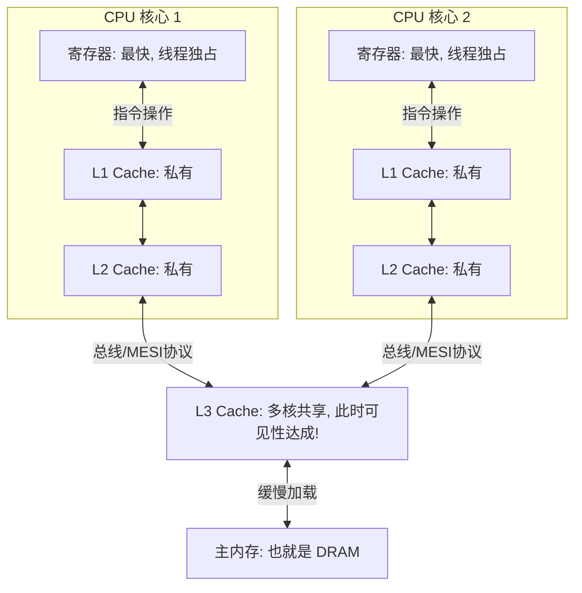

这是一个非常底层的硬件架构问题，也是理解并发编程（Volatile、JMM）的**“最后一公里”**。

如果不理解这个硬件层级，JMM 中的“工作内存”和“主内存”就只是抽象的概念；理解了这里，你就能看到数据在电路中流动的真实路径。

我们可以把它想象成一个**“金字塔”**结构，从上到下，速度越来越慢，容量越来越大。

---

### 1. 核心层级与“距离感”

为了让你对速度有直观感受，我们把 **1 个 CPU 时钟周期（0.3纳秒）** 放大为 **1 秒**。

| 层级 (Hierarchy) | 真实位置 | 模拟耗时 (假设 CPU 算一下是 1秒) | 容量 | 角色隐喻 |
| --- | --- | --- | --- | --- |
| **寄存器 (Registers)** | **CPU 核心内部** | **1 秒** (即时) | 极小 (几百字节) | **手中的加工件**。CPU 只能直接计算这里的数据。 |
| **L1 Cache** | **CPU 核心内部** | **3 ~ 4 秒** | 小 (32KB - 64KB) | **工位上的工具箱**。伸手就能拿。 |
| **L2 Cache** | **CPU 核心内部** | **10 ~ 12 秒** | 中 (256KB - 512KB) | **身后的背包**。转身就能拿。 |
| **L3 Cache** | **多核共享** | **40 ~ 50 秒** | 大 (MB ~ 几十 MB) | **房间里的共享货架**。所有核心都能看到。 |
| **主内存 (DRAM)** | **插在主板上** | **200 ~ 300 秒 (几分钟)** | 巨大 (GB ~ TB) | **楼下的仓库**。去一趟很慢。 |

---

### 2. 它们之间的关系：数据的流动

#### A. 包含关系 (Inclusion)

通常情况下（Intel 架构），这是一个**逐级包含**的关系：

* 主内存包含所有数据。
* L3 缓存包含部分热点数据。
* L2 包含 L3 中的更热点数据。
* L1 包含 L2 中的最热点数据。

#### B. 数据传输单位：缓存行 (Cache Line)

这是并发编程中最重要的概念之一。

* CPU **绝不会**一次只从内存读 1 个字节。
* **块传输**：它一次性至少搬运 **64 字节 (64 Bytes)**，这被称为一个 **Cache Line**。
* **意义**：如果你读了一个 `long a`，由于它旁边通常紧挨着 `long b`，`b` 也会顺便被加载到 L1 缓存中。这就是“空间局部性”优化，也是导致 **“伪共享 (False Sharing)”** 性能问题的根源。

---

### 3. 在并发编程（Java）中的映射

结合我们之前讨论的 `volatile`，这里是它们在硬件上的真实行为：

#### 场景一：普通变量 (int i = 0)

1. **加载**：CPU 从主存把 `i` 读进来，一路经过 L3 -> L2 -> L1。
2. **优化**：为了计算极快，编译器生成的指令可能会把 `i` 放到 **寄存器 (Register)** 中（例如 `RAX` 寄存器）。
3. **计算**：CPU 疯狂对 `RAX` 进行 `+1` 操作。
4. **脱节**：此时，L1、L2、L3 甚至主存里的 `i` 都是旧值 0，只有寄存器里是 10000。
5. **不可见**：别的线程（别的 CPU 核心）根本无法窥探你的寄存器，它们连 L3 都看不到，所以完全不知道你改了值。

#### 场景二：Volatile 变量 (volatile int v = 0)

1. **禁止寄存器暂存**：`volatile` 告诉编译器：“这个变量**不准**仅仅呆在寄存器里”。
2. **强制回写缓存**：每次修改完，必须立刻从寄存器写入 **L1 Cache**，并触发缓存一致性协议（MESI）。
3. **嗅探 (Snooping)**：
* 当你把数据写回 L1 时，因为 L1/L2 是私有的，硬件会通过总线广播：“谁还要这个数据？我要改了！”
* 别的 CPU 核心监听（嗅探）到这个消息，把自己 L1/L2 里的同名数据标记为 **Invalid (失效)**。

4. **读取**：下次别的线程要读 `v`，发现自己 L1 里的是“失效”状态，被迫去 L3 或主存拉取最新的。

### 4. 关键总结图

你可以用这个流程图来彻底理清它们的关系：

### 深度结论

1. **寄存器是“盲区”**：寄存器是导致多线程可见性问题的最直接物理原因，因为它是绝对私有的。
2. **缓存是“战场”**：并发问题（可见性、原子性）主要是在 **L1/L2/L3** 这一层通过复杂的协议（MESI）来解决的。
3. **主存是“仓库”**：它很慢，只有在缓存未命中（Cache Miss）或由于屏障强制刷新时，CPU 才会不情愿地去打扰它。