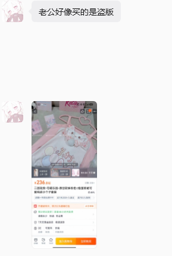

# 时间安排

**时间点计划表**
- 2.26-5.5：学习工程构建的必要性知识
- 5.5：开始构建工程，一边构建一边学要用到的知识，用到再学
- 5.20：完成核心工程构建，开始优化工程，开始大量投工作
- 6.1：找到工作，完成工程的构建

每日安排
- 严格时间点：七点半起床，22点半结束学习，12：00睡觉，最大化学习和健身时间，中午不午休
- 严格执行番茄时钟：早上、下午、晚上开始学习和结束学习时必须开始或结束番茄时钟

# 立即追加的学习内容

JwtUtils

# 工程中学习的技术

Spring表达式语言

Spring Event事件驱动模型.发件箱模式

Spring 测试框架

---

# 大纲提示词

请给出[Spring 异步与任务调度]的大纲，要求二级大纲逻辑严密、根据某种确定的顺序自前向后排列，二级大纲下的子标题按照自底向上的结构组织内容，如果子标题的内容过多，应该按照相同的标准构建多级标题；

特别要求： 
1. 所有标题在保证完整性的前提下，优先级越高的标题简洁一点，优先级越低的大纲标题详细一点
2. 以业务开发为导向，凡是业务开发不需要了解的知识一概不介绍
3. 在大纲的最后特别列出一章：部分重要的底层原理，并在其子标题中介绍与业务知识高度相关的底层原理
4. 给出一段技术向的简短开场白，作为整个大纲的入门介绍，让读者有顶层的宏观认知

---

# 项目：SaaS 级企业协同采购管理系统

业务场景：企业内部用来发起采购申请、领导多级审批、生成采购单、扣减部门预算、供应商发货入库的系统。

广度体现：涵盖网关鉴权、用户微服务、订单微服务、库存微服务、财务微服务，全套 Spring Cloud Alibaba 链路打通。

